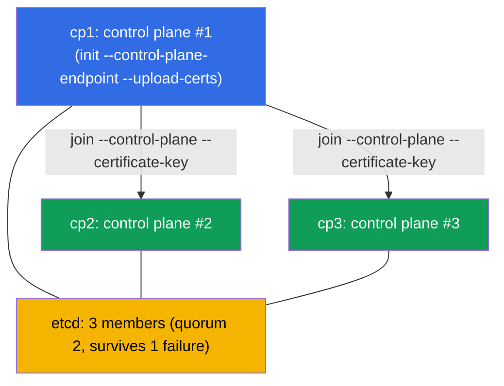

[Русская версия](README_RU.MD) · [Versión en español](README_ES.MD) · [Version française](README_FR.MD) · [Deutsche Version](README_DE.MD) · [ქართული ვერსია](README_GE.MD) · [繁體中文版](README_TW.MD) · [日本語版](README_JP.MD)

# Lab 124 — HA control plane: building a cluster out of 3 control-plane nodes

## Description

A hands-on lab on a fault-tolerant control plane (Cluster Architecture domain). You are
given a cluster where the **first control plane** is already initialized with a stable
`--control-plane-endpoint` (and `--upload-certs`) and a CNI installed. The cluster has
**two clean candidate nodes** for the control plane (`cp2`, `cp3`; the prerequisites and
packages are already in place). Your task is to **join both of them as control plane
nodes** to get real HA: **three** control-plane nodes and **three** etcd members (an odd
quorum that survives the loss of one node).

All tasks are written in exam style (like real CKA questions) with automatic validation
via the `check_result` command.

Why 3 and not 2: etcd on raft requires a **majority**. With 2 nodes the quorum is 2 → the
loss of any node breaks writes (worse than a single node). An odd number (3, 5) is a
mandatory condition for real HA (chapter 35A).

The difference from lab 116 (a single-controller cluster from scratch) — here an existing
cluster is **extended** to a fault-tolerant one with the proper control-plane join
procedure.

## Goal

Reinforce the material from the course chapters:

- [Chapter 35A. High Availability (HA)](../../course/35-2-ha/README.md) — HA control plane topology, joining control-plane nodes, odd quorum
- [Chapter 37. etcd Backup and Restore](../../course/37/README.md) — how etcd works, cluster members and quorum, working with `etcdctl`

## What We Do and Why

In this lab we extend a single-controller cluster to a fault-tolerant one. Every step
brings us closer to an odd etcd quorum:

| Action | Why |
|--------|-----|
| Get the `certificate-key` and the join command on `cp1` | the control plane certificates are needed to join CP nodes |
| `kubeadm join --control-plane` on `cp2` and `cp3` | add two more control plane instances (apiserver + etcd) |
| Check the etcd members | make sure the etcd cluster now has 3 nodes (an odd quorum) |

The final picture of what will be deployed:



## Infrastructure

The environment is deployed in AWS (`eu-central-1`) via Terragrunt and consists of:

| Component | Description                                                                 |
|-----------|-----------------------------------------------------------------------------|
| `cp1`     | Kubernetes `1.35.2` (kubeadm), initialized with `--control-plane-endpoint` and `--upload-certs`, CNI installed; this is where you connect and run `check_result` |
| `cp2`     | Clean candidate node for the control plane: the prerequisites (swap/modules/sysctl), containerd and the `kubeadm/kubelet/kubectl` packages are already installed; reachable as `ssh cp2` |
| `cp3`     | The second control plane candidate, prepared symmetrically to `cp2`; reachable as `ssh cp3` |

> On a real HA cluster there is a load balancer in front of the apiservers, and
> `--control-plane-endpoint` points to it. In the lab the role of the stable endpoint is
> played by the address of `cp1`, set during initialization (chapter 35A).

## Deployment

```bash
TASK=124 make run_cka_task
```

Once it is created, connect over SSH to node `cp1` and do the tasks from there: `kubectl`
is configured there and `check_result` lives there. The candidate nodes are reachable from
`cp1` as `ssh cp2` and `ssh cp3`.

Handy commands on node `cp1`:

```bash
time_left       # how much time is left
check_result    # check your solution
```

## Tasks

The work is done on node `cp1`; the candidates are reachable as `ssh cp2` and `ssh cp3`.

---
|        **1**        | **Join the second control-plane node (cp2)**                 |
| :-----------------: | :----------------------------------------------------------- |
| What to do          | On `cp1` get the `certificate-key` (`sudo kubeadm init phase upload-certs --upload-certs`) and the basic join command with the token and the discovery hash (`sudo kubeadm token create --print-join-command`). Assemble the command for a control-plane node out of them by adding the flags `--control-plane` and `--certificate-key <key>`, then run it on `cp2` (`ssh cp2`, then `sudo kubeadm join ...`). |
| Acceptance criteria | - `cp2` is joined as a control plane and is in the `Ready` state. |
---
|        **2**        | **Join the third control-plane node (cp3)**                  |
| :-----------------: | :----------------------------------------------------------- |
| What to do          | Join `cp3` the same way — this gives an odd quorum (3 nodes). If more than ~2 hours have passed since step 1, the `certificate-key` has expired — repeat `upload-certs`; if the token has expired (~24 h), recreate it with `kubeadm token create`. |
| Acceptance criteria | - the cluster has **≥ 3** nodes with the `control-plane` role, all in the `Ready` state. |
---
|        **3**        | **Check the etcd quorum (3 members)**                        |
| :-----------------: | :----------------------------------------------------------- |
| What to do          | Make sure that with a stacked topology every control-plane node brought up its own static pod `etcd-*`. Check `kubectl -n kube-system get pods -l component=etcd -o wide` (three Pods `etcd-cp1/cp2/cp3`) and, if you like, the number of cluster members directly with `etcdctl member list` (using the certificates from `/etc/kubernetes/pki/etcd`, chapter 37). |
| Acceptance criteria | - **≥ 3** Pods `etcd-*` are running in namespace `kube-system` (one per CP node), all in the `Running` state. |
---

> **Why exactly 3 (chapter 35A).** 3 etcd members have a quorum of 2 and survive the loss
> of **one** node. 2 members survive **zero** failures (worse than a single node), which is
> why HA is always built on an odd number — 3 or 5.

## Checking the Result

On node `cp1` run the automatic validation:

```bash
check_result
```

The script runs the tests and shows how many tasks are complete.

## Solution

Reference solution: [node-1/files/solutions/1.MD](node-1/files/solutions/1.MD)

## Mock Exam Coverage

Cluster Architecture, Installation & Configuration domain (CKA): HA control plane topology,
joining control-plane nodes, odd etcd quorum.

## Deleting the Cluster and Resources

```bash
TASK=124 make delete_cka_task
```
