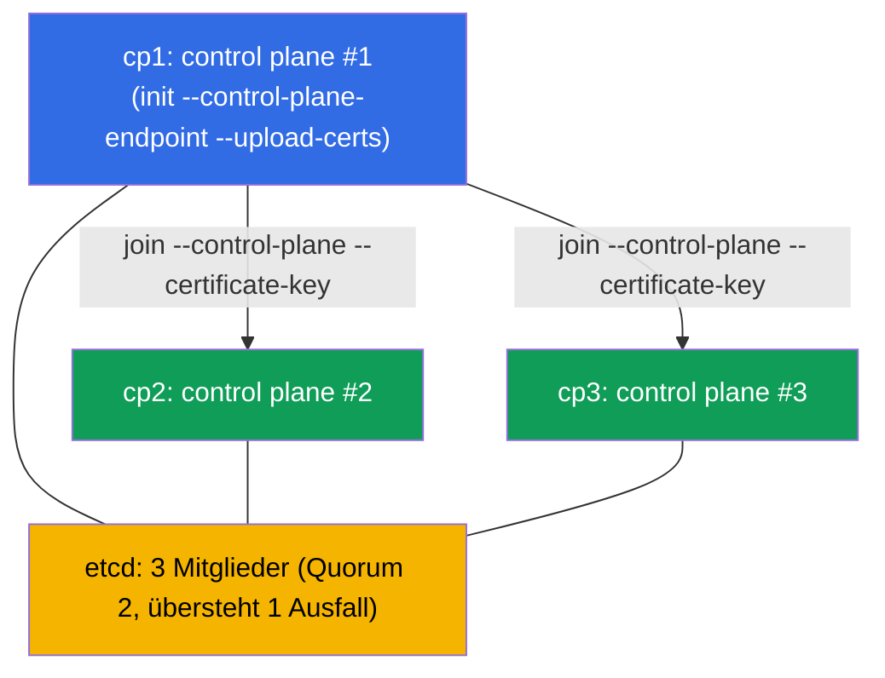

[Русская версия](README_RU.MD) · [Eng version](README.MD) · [Versión en español](README_ES.MD) · [Version française](README_FR.MD) · [ქართული ვერსია](README_GE.MD) · [繁體中文版](README_TW.MD) · [日本語版](README_JP.MD)

# Lab 124 — HA Control Plane: Cluster aus 3 Control-Plane-Nodes aufbauen

## Beschreibung

Praxisübung zum ausfallsicheren Control Plane (Domäne Cluster Architecture). Gegeben ist ein
Cluster, in dem die **erste Control Plane** bereits über einen stabilen
`--control-plane-endpoint` (mit `--upload-certs`) initialisiert ist und ein CNI installiert
hat. Im Cluster gibt es **zwei leere Kandidaten-Nodes** für die Control Plane (`cp2`, `cp3`;
Prerequisites und Pakete sind bereits vorhanden). Deine Aufgabe: **beide als Control Plane
anhängen**, um echte HA zu erhalten: **drei** Control-Plane-Nodes und **drei** etcd-Mitglieder
(ungerades Quorum, übersteht den Ausfall eines Nodes).

Alle Aufgaben sind im Prüfungsstil formuliert (wie echte CKA-Fragen) mit automatischer
Prüfung über den Befehl `check_result`.

Warum genau 3 und nicht 2: etcd auf raft benötigt eine **Mehrheit**. Bei 2 Nodes ist das
Quorum 2 → der Ausfall eines beliebigen Nodes bricht das Schreiben (schlechter als ein
einzelner Node). Eine ungerade Zahl (3, 5) ist Pflichtvoraussetzung für echte HA
(Kapitel 35A).

Der Unterschied zu Lab 116 (Cluster mit einem Controller von Null) — hier wird ein
bestehender Cluster mit der korrekten Join-Prozedur für Control-Plane-Nodes zu einem
ausfallsicheren Cluster **erweitert**.

## Ziel

Den Stoff der Kurskapitel festigen:

- [Kapitel 35A. Hochverfügbarkeit (HA)](../../course/35-2-ha/de.md) — Topologie des HA Control Plane, Join von Control-Plane-Nodes, ungerades Quorum
- [Kapitel 37. Backup und Wiederherstellung von etcd](../../course/37/de.md) — Aufbau von etcd, Cluster-Mitglieder und Quorum, Arbeiten mit `etcdctl`

## Was wir tun und warum

In diesem Lab erweitern wir einen Cluster mit einem Controller zu einem ausfallsicheren.
Jeder Schritt bringt uns näher an das ungerade etcd-Quorum:

| Aktion | Wozu |
|--------|------|
| `certificate-key` und Join-Befehl auf `cp1` holen | die Control-Plane-Zertifikate sind für den Join der CP-Nodes nötig |
| `kubeadm join --control-plane` auf `cp2` und `cp3` | fügen zwei weitere Control-Plane-Instanzen hinzu (apiserver + etcd) |
| etcd-Mitglieder prüfen | sicherstellen, dass der etcd-Cluster nun aus 3 Nodes besteht (ungerades Quorum) |

Das Gesamtbild dessen, was ausgerollt wird:



## Infrastruktur

Die Umgebung wird in AWS (`eu-central-1`) über Terragrunt ausgerollt und besteht aus:

| Komponente | Beschreibung                                                               |
|-----------|-----------------------------------------------------------------------------|
| `cp1`     | Kubernetes `1.35.2` (kubeadm), initialisiert mit `--control-plane-endpoint` und `--upload-certs`, CNI installiert; hier verbinden wir uns und starten `check_result` |
| `cp2`     | Leerer Kandidaten-Node für die Control Plane: Prerequisites (swap/Module/sysctl), containerd und die Pakete `kubeadm/kubelet/kubectl` sind bereits installiert; erreichbar als `ssh cp2` |
| `cp3`     | Zweiter Kandidat für die Control Plane, symmetrisch zu `cp2` vorbereitet; erreichbar als `ssh cp3` |

> In einem echten HA-Cluster steht vor den Apiservern ein Load Balancer, und
> `--control-plane-endpoint` zeigt auf ihn. Im Lab übernimmt die Rolle des stabilen Endpoints
> die Adresse von `cp1`, die bei der Initialisierung gesetzt wurde (Kapitel 35A).

## Bereitstellung

```bash
TASK=124 make run_cka_task
```

Verbinde dich nach dem Erstellen per SSH mit dem Node `cp1` und erledige die Aufgaben von
dort: dort ist `kubectl` eingerichtet und dort liegt `check_result`. Die Kandidaten-Nodes
sind von `cp1` aus als `ssh cp2` und `ssh cp3` erreichbar.

Nützliche Befehle auf dem Node `cp1`:

```bash
time_left       # wie viel Zeit noch bleibt
check_result    # Lösung prüfen
```

## Aufgaben

Gearbeitet wird auf dem Node `cp1`; die Kandidaten sind als `ssh cp2` und `ssh cp3`
erreichbar.

---
|        **1**        | **Zweiten Control-Plane-Node anhängen (cp2)**                |
| :-----------------: | :----------------------------------------------------------- |
| Was wir tun         | Hole auf `cp1` den `certificate-key` (`sudo kubeadm init phase upload-certs --upload-certs`) und den Basis-Join-Befehl mit Token und Discovery-Hash (`sudo kubeadm token create --print-join-command`). Setze daraus den Befehl für einen Control-Plane-Node zusammen, indem du die Flags `--control-plane` und `--certificate-key <Schlüssel>` ergänzt, und führe ihn auf `cp2` aus (`ssh cp2`, dann `sudo kubeadm join ...`). |
| Abnahmekriterien    | - `cp2` ist als Control Plane angehängt und hat den Status `Ready`. |
---
|        **2**        | **Dritten Control-Plane-Node anhängen (cp3)**                |
| :-----------------: | :----------------------------------------------------------- |
| Was wir tun         | Hänge `cp3` auf die gleiche Weise an — das ergibt ein ungerades Quorum (3 Nodes). Sind seit Schritt 1 mehr als ~2 Stunden vergangen, ist der `certificate-key` abgelaufen — wiederhole `upload-certs`; ist das Token abgelaufen (~24 h), erzeuge es neu mit `kubeadm token create`. |
| Abnahmekriterien    | - im Cluster gibt es **≥ 3** Nodes mit der Rolle `control-plane`, alle im Status `Ready`. |
---
|        **3**        | **etcd-Quorum prüfen (3 Mitglieder)**                        |
| :-----------------: | :----------------------------------------------------------- |
| Was wir tun         | Stelle sicher, dass bei der Stacked-Topologie auf jedem Control-Plane-Node ein eigener Static Pod `etcd-*` hochgekommen ist. Prüfe `kubectl -n kube-system get pods -l component=etcd -o wide` (drei Pods `etcd-cp1/cp2/cp3`) und bei Bedarf die Anzahl der Cluster-Mitglieder direkt über `etcdctl member list` (mit den Zertifikaten aus `/etc/kubernetes/pki/etcd`, Kapitel 37). |
| Abnahmekriterien    | - im Namespace `kube-system` laufen **≥ 3** Pods `etcd-*` (einer pro CP-Node), alle im Status `Running`. |
---

> **Warum genau 3 (Kapitel 35A).** 3 etcd-Mitglieder haben ein Quorum von 2 und überstehen
> den Ausfall **eines** Nodes. 2 Mitglieder überstehen **null** Ausfälle (schlechter als ein
> einzelner Node), deshalb wird HA immer auf einer ungeraden Zahl gebaut — 3 oder 5.

## Ergebnisprüfung

Starte auf dem Node `cp1` die automatische Prüfung:

```bash
check_result
```

Das Skript führt die Tests aus und zeigt, wie viele Aufgaben erledigt sind.

## Lösung

Referenzlösung: [node-1/files/solutions/1_DE.MD](node-1/files/solutions/1_DE.MD)

## Abdeckung der Mock-Prüfungen

Domäne Cluster Architecture, Installation & Configuration (CKA): HA-Topologie der Control
Plane, Join von Control-Plane-Nodes, ungerades etcd-Quorum.

## Löschen von Cluster und Ressourcen

```bash
TASK=124 make delete_cka_task
```
