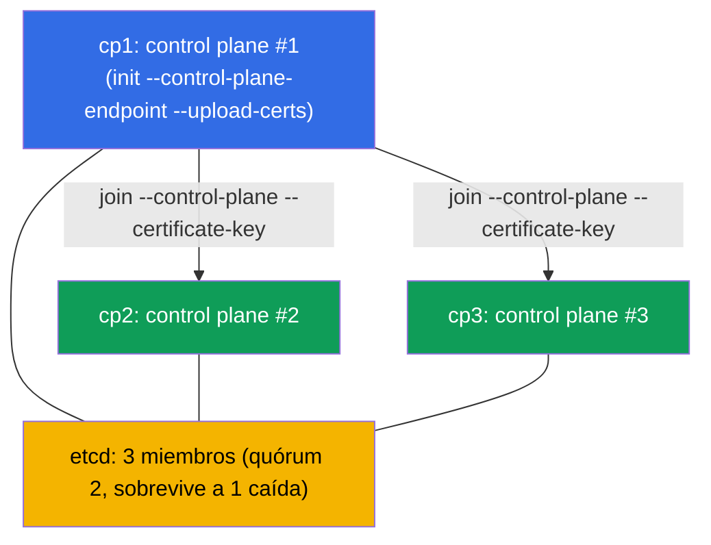

[Русская версия](README_RU.MD) · [Eng version](README.MD) · [Version française](README_FR.MD) · [Deutsche Version](README_DE.MD) · [ქართული ვერსია](README_GE.MD)

# Lab 124 — HA control plane: montar un clúster con 3 nodos de control plane

## Descripción

Práctica sobre un control plane tolerante a fallos (dominio Cluster Architecture). Se te da
un clúster donde el **primer control plane** ya está inicializado con un
`--control-plane-endpoint` estable (con `--upload-certs`) y con el CNI instalado. En el
clúster hay **dos nodos candidatos limpios** para el control plane (`cp2`, `cp3`; los
prerequisites y los paquetes ya están instalados). Tu tarea es **añadir ambos como control
plane** para conseguir una HA de verdad: **tres** nodos de control plane y **tres** miembros
de etcd (quórum impar, sobrevive a la caída de un nodo).

Todas las tareas están redactadas en estilo de examen (como las preguntas reales de CKA) con
verificación automática mediante el comando `check_result`.

Por qué 3 y no 2: etcd sobre raft necesita **mayoría**. Con 2 nodos el quórum es 2 → la
caída de cualquier nodo rompe la escritura (peor que un solo nodo). Un número impar (3, 5) es
condición obligatoria de una HA real (capítulo 35A).

La diferencia con el laboratorio 116 (un clúster de un solo controlador desde cero) es que
aquí se **amplía** un clúster ya existente hasta hacerlo tolerante a fallos con el
procedimiento correcto de join de nodos de control plane.

## Objetivo

Consolidar el material de los capítulos del curso:

- [Capítulo 35A. Alta disponibilidad (HA)](../../course/35-2-ha/ru.md) — topología del control plane HA, join de nodos de control plane, quórum impar
- [Capítulo 37. Copia de seguridad y restauración de etcd](../../course/37/ru.md) — cómo funciona etcd, los miembros del clúster y el quórum, trabajo con `etcdctl`

## Qué hacemos y para qué

En este laboratorio ampliamos un clúster de un solo controlador hasta hacerlo tolerante a
fallos. Cada paso nos acerca al quórum impar de etcd:

| Acción | Para qué |
|--------|----------|
| Obtener el `certificate-key` y el comando join en `cp1` | los certificados del control plane son necesarios para el join de los nodos CP |
| `kubeadm join --control-plane` en `cp2` y `cp3` | añaden dos instancias más del control plane (apiserver + etcd) |
| Comprobar los miembros de etcd | asegurarse de que el clúster de etcd ya tiene 3 nodos (quórum impar) |

Panorama final de lo que quedará despliegado:



## Infraestructura

El entorno se despliega en AWS (`eu-central-1`) mediante Terragrunt y consta de:

| Componente | Descripción                                                                |
|-----------|-----------------------------------------------------------------------------|
| `cp1`     | Kubernetes `1.35.2` (kubeadm), inicializado con `--control-plane-endpoint` y `--upload-certs`, CNI instalado; aquí nos conectamos y ejecutamos `check_result` |
| `cp2`     | Nodo candidato limpio para el control plane: los prerequisites (swap/módulos/sysctl), containerd y los paquetes `kubeadm/kubelet/kubectl` ya están instalados; accesible como `ssh cp2` |
| `cp3`     | Segundo candidato para el control plane, preparado igual que `cp2`; accesible como `ssh cp3` |

> En un clúster HA real, delante de los apiservers hay un balanceador y
> `--control-plane-endpoint` apunta a él. En el laboratorio el papel de endpoint estable lo
> desempeña la dirección de `cp1`, indicada durante la inicialización (capítulo 35A).

## Despliegue

```bash
TASK=124 make run_cka_task
```

Tras la creación, conéctate por SSH al nodo `cp1` y realiza las tareas desde allí: ahí está
configurado `kubectl` y está `check_result`. Los nodos candidatos son accesibles desde `cp1`
como `ssh cp2` y `ssh cp3`.

Comandos útiles en el nodo `cp1`:

```bash
time_left       # cuánto tiempo queda
check_result    # comprobar la solución
```

## Tareas

El trabajo se realiza en el nodo `cp1`; los candidatos son accesibles como `ssh cp2` y
`ssh cp3`.

---
|        **1**        | **Añadir el segundo nodo de control plane (cp2)**            |
| :-----------------: | :----------------------------------------------------------- |
| Qué hacemos         | En `cp1` obtén el `certificate-key` (`sudo kubeadm init phase upload-certs --upload-certs`) y el comando join básico con el token y el discovery-hash (`sudo kubeadm token create --print-join-command`). Compón con ellos el comando para un nodo de control plane añadiendo los flags `--control-plane` y `--certificate-key <clave>`, y ejecútalo en `cp2` (`ssh cp2` y después `sudo kubeadm join ...`). |
| Criterios de aceptación | - `cp2` está añadido como control plane y está en estado `Ready`. |
---
|        **2**        | **Añadir el tercer nodo de control plane (cp3)**             |
| :-----------------: | :----------------------------------------------------------- |
| Qué hacemos         | Añade `cp3` del mismo modo: eso da un quórum impar (3 nodos). Si desde el paso 1 han pasado más de ~2 horas, el `certificate-key` ha caducado — repite `upload-certs`; si ha caducado el token (~24 h), vuelve a crearlo con `kubeadm token create`. |
| Criterios de aceptación | - en el clúster hay **≥ 3** nodos con el rol `control-plane`, todos en estado `Ready`. |
---
|        **3**        | **Comprobar el quórum de etcd (3 miembros)**                 |
| :-----------------: | :----------------------------------------------------------- |
| Qué hacemos         | Asegúrate de que con la topología stacked en cada nodo de control plane se ha levantado su propio static pod `etcd-*`. Comprueba `kubectl -n kube-system get pods -l component=etcd -o wide` (tres Pods `etcd-cp1/cp2/cp3`) y, si quieres, el número de miembros del clúster directamente con `etcdctl member list` (con los certificados de `/etc/kubernetes/pki/etcd`, capítulo 37). |
| Criterios de aceptación | - en el namespace `kube-system` están en ejecución **≥ 3** Pods `etcd-*` (uno por nodo CP), todos en estado `Running`. |
---

> **Por qué exactamente 3 (capítulo 35A).** 3 miembros de etcd tienen quórum 2 y sobreviven
> a la caída de **un** nodo. 2 miembros sobreviven a **cero** caídas (peor que un solo
> nodo), por eso la HA siempre se construye sobre un número impar: 3 o 5.

## Comprobación del resultado

En el nodo `cp1` lanza la verificación automática:

```bash
check_result
```

El script ejecuta los tests y muestra cuántas tareas están completadas.

## Solución

Solución de referencia: [node-1/files/solutions/1_ES.MD](node-1/files/solutions/1_ES.MD)

## Cobertura de exámenes simulados

Dominio Cluster Architecture, Installation & Configuration (CKA): topología HA del control
plane, join de nodos de control plane, quórum impar de etcd.

## Eliminación del clúster y los recursos

```bash
TASK=124 make delete_cka_task
```
