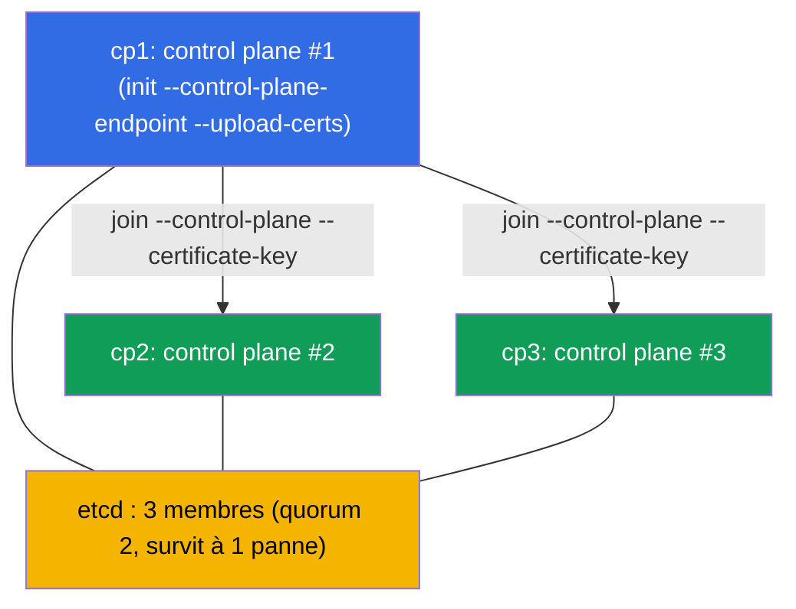

[Русская версия](README_RU.MD) · [Eng version](README.MD) · [Versión en español](README_ES.MD) · [Deutsche Version](README_DE.MD) · [ქართული ვერსია](README_GE.MD)

# Lab 124 — HA control plane : construire un cluster à partir de 3 nœuds control plane

## Description

Travail pratique sur un control plane tolérant aux pannes (domaine Cluster Architecture). On
vous donne un cluster où le **premier control plane** est déjà initialisé avec un
`--control-plane-endpoint` stable (avec `--upload-certs`) et un CNI installé. Le cluster
contient **deux nœuds candidats vierges** pour le control plane (`cp2`, `cp3` ; les
prerequisites et les paquets sont déjà en place). Votre tâche : **rattacher les deux comme
control plane** afin d'obtenir une vraie HA : **trois** nœuds control plane et **trois**
membres etcd (quorum impair, survit à la perte d'un nœud).

Toutes les tâches sont rédigées dans le style de l'examen (comme les vraies questions CKA)
avec une vérification automatique via la commande `check_result`.

Pourquoi 3 et pas 2 : etcd sur raft exige une **majorité**. Avec 2 nœuds, le quorum est de
2 → la perte de n'importe quel nœud casse l'écriture (pire qu'un nœud unique). Un nombre
impair (3, 5) est une condition obligatoire d'une vraie HA (chapitre 35A).

La différence avec le lab 116 (cluster mono-contrôleur de zéro) — ici, un cluster existant
est **étendu** en cluster tolérant aux pannes grâce à la bonne procédure de join des nœuds
control plane.

## Objectif

Consolider le contenu des chapitres du cours :

- [Chapitre 35A. Haute disponibilité (HA)](../../course/35-2-ha/ru.md) — topologie du control plane HA, join des nœuds control plane, quorum impair
- [Chapitre 37. Sauvegarde et restauration d'etcd](../../course/37/ru.md) — fonctionnement d'etcd, membres du cluster et quorum, travail avec `etcdctl`

## Ce que nous faisons et pourquoi

Dans ce lab, nous étendons un cluster mono-contrôleur en cluster tolérant aux pannes. Chaque
étape rapproche du quorum impair d'etcd :

| Action | Pourquoi |
|--------|----------|
| Récupérer la `certificate-key` et la commande join sur `cp1` | les certificats du control plane sont nécessaires pour le join des nœuds CP |
| `kubeadm join --control-plane` sur `cp2` et `cp3` | ajoutent deux instances supplémentaires du control plane (apiserver + etcd) |
| Vérifier les membres etcd | s'assurer que le cluster etcd compte désormais 3 nœuds (quorum impair) |

Vue d'ensemble de ce qui sera déployé :



## Infrastructure

L'environnement est déployé dans AWS (`eu-central-1`) via Terragrunt et se compose de :

| Composant | Description                                                                 |
|-----------|-----------------------------------------------------------------------------|
| `cp1`     | Kubernetes `1.35.2` (kubeadm), initialisé avec `--control-plane-endpoint` et `--upload-certs`, CNI installé ; c'est ici qu'on se connecte et qu'on lance `check_result` |
| `cp2`     | Nœud candidat vierge pour le control plane : les prerequisites (swap/modules/sysctl), containerd et les paquets `kubeadm/kubelet/kubectl` sont déjà installés ; accessible via `ssh cp2` |
| `cp3`     | Deuxième candidat au control plane, préparé de la même manière que `cp2` ; accessible via `ssh cp3` |

> Sur un vrai cluster HA, un load balancer se trouve devant les apiservers et
> `--control-plane-endpoint` pointe vers lui. Dans le lab, le rôle d'endpoint stable est
> tenu par l'adresse de `cp1`, définie lors de l'initialisation (chapitre 35A).

## Déploiement

```bash
TASK=124 make run_cka_task
```

Après la création, connectez-vous en SSH au nœud `cp1` et effectuez les tâches depuis
celui-ci : `kubectl` y est configuré et `check_result` s'y trouve. Les nœuds candidats sont
accessibles depuis `cp1` via `ssh cp2` et `ssh cp3`.

Commandes utiles sur le nœud `cp1` :

```bash
time_left       # combien de temps il reste
check_result    # vérifier la solution
```

## Tâches

Le travail se fait sur le nœud `cp1` ; les candidats sont accessibles via `ssh cp2` et
`ssh cp3`.

---
|        **1**        | **Rattacher le deuxième nœud control plane (cp2)**           |
| :-----------------: | :----------------------------------------------------------- |
| Ce qu'on fait       | Sur `cp1`, récupérez la `certificate-key` (`sudo kubeadm init phase upload-certs --upload-certs`) et la commande join de base avec le token et le discovery-hash (`sudo kubeadm token create --print-join-command`). Composez à partir d'elles la commande pour un nœud control plane en ajoutant les flags `--control-plane` et `--certificate-key <clé>`, puis exécutez-la sur `cp2` (`ssh cp2`, puis `sudo kubeadm join ...`). |
| Critères d'acceptation | - `cp2` est rattaché comme control plane et se trouve à l'état `Ready`. |
---
|        **2**        | **Rattacher le troisième nœud control plane (cp3)**          |
| :-----------------: | :----------------------------------------------------------- |
| Ce qu'on fait       | Rattachez `cp3` de la même manière — cela donne un quorum impair (3 nœuds). Si plus de ~2 heures se sont écoulées depuis l'étape 1, la `certificate-key` a expiré — refaites `upload-certs` ; si le token a expiré (~24 h), recréez-le avec `kubeadm token create`. |
| Critères d'acceptation | - le cluster compte **≥ 3** nœuds avec le rôle `control-plane`, tous à l'état `Ready`. |
---
|        **3**        | **Vérifier le quorum etcd (3 membres)**                      |
| :-----------------: | :----------------------------------------------------------- |
| Ce qu'on fait       | Assurez-vous qu'avec la topologie stacked, chaque nœud control plane a démarré son propre static pod `etcd-*`. Vérifiez `kubectl -n kube-system get pods -l component=etcd -o wide` (trois Pods `etcd-cp1/cp2/cp3`) et, si vous le souhaitez, le nombre de membres du cluster directement via `etcdctl member list` (avec les certificats de `/etc/kubernetes/pki/etcd`, chapitre 37). |
| Critères d'acceptation | - dans le namespace `kube-system`, **≥ 3** Pods `etcd-*` sont lancés (un par nœud CP), tous à l'état `Running`. |
---

> **Pourquoi exactement 3 (chapitre 35A).** 3 membres etcd ont un quorum de 2 et survivent à
> la perte d'**un** nœud. 2 membres survivent à **zéro** panne (pire qu'un nœud unique),
> c'est pourquoi la HA se construit toujours sur un nombre impair — 3 ou 5.

## Vérification du résultat

Sur le nœud `cp1`, lancez la vérification automatique :

```bash
check_result
```

Le script exécute les tests et affiche le nombre de tâches réussies.

## Solution

Solution de référence : [node-1/files/solutions/1_FR.MD](node-1/files/solutions/1_FR.MD)

## Couverture des examens blancs

Domaine Cluster Architecture, Installation & Configuration (CKA) : topologie HA du control
plane, join des nœuds control plane, quorum impair d'etcd.

## Suppression du cluster et des ressources

```bash
TASK=124 make delete_cka_task
```
