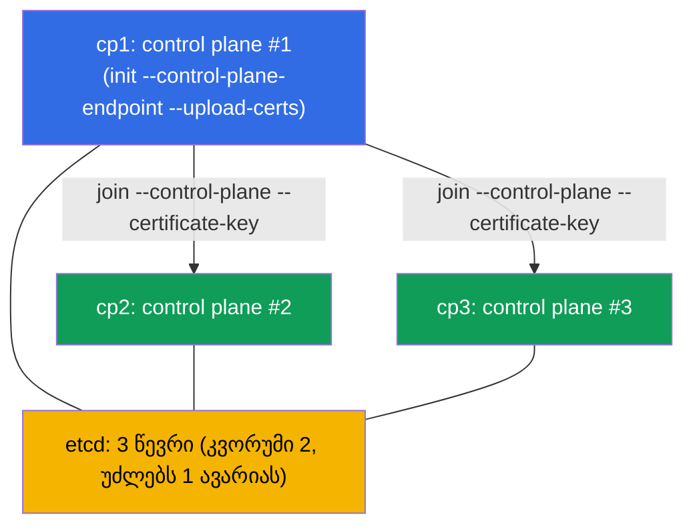

[Русская версия](README_RU.MD) · [Eng version](README.MD) · [Versión en español](README_ES.MD) · [Version française](README_FR.MD) · [Deutsche Version](README_DE.MD) · [繁體中文版](README_TW.MD) · [日本語版](README_JP.MD)

# Lab 124 — HA control plane: კლასტერის აწყობა 3 control-plane node-იდან

## აღწერა

პრაქტიკული სამუშაო ავარიამედეგ control plane-ზე (დომენი Cluster Architecture). მოცემულია
კლასტერი, სადაც **პირველი control plane** უკვე ინიციალიზებულია სტაბილური
`--control-plane-endpoint`-ით (`--upload-certs`-თან ერთად) და დაყენებული CNI-ით. კლასტერში
არის **ორი სუფთა კანდიდატი node** control plane-ისთვის (`cp2`, `cp3`; prerequisites და
პაკეტები უკვე დაყენებულია). თქვენი ამოცანაა — **ორივე მიაერთოთ control plane-ად**, რომ
მიიღოთ ნამდვილი HA: **სამი** control-plane node და **სამი** etcd-ის წევრი (კენტი კვორუმი,
რომელიც ერთი კვანძის მწყობრიდან გამოსვლას გაუძლებს).

ყველა დავალება გამოცდის სტილშია გაფორმებული (როგორც რეალური CKA კითხვები) და მათი შემოწმება
ავტომატურად ხდება ბრძანებით `check_result`.

რატომ სწორედ 3 და არა 2: etcd raft-ზე მოითხოვს **უმრავლესობას**. 2 კვანძთან კვორუმი = 2 →
ნებისმიერი კვანძის მწყობრიდან გამოსვლა ჩაშლის ჩაწერას (უარესია, ვიდრე ერთი კვანძი). კენტი
რიცხვი (3, 5) — რეალური HA-ს სავალდებულო პირობაა (თავი 35A).

განსხვავება ლაბორატორია 116-ისგან (ერთკონტროლერიანი კლასტერი ნულიდან) — აქ მზა კლასტერს
**აფართოებენ** ავარიამედეგამდე control-plane node-ების join-ის სწორი პროცედურით.

## მიზანი

განამტკიცოთ კურსის თავების მასალა:

- [თავი 35A. მაღალი ხელმისაწვდომობა (HA)](../../course/35-2-ha/ge.md) — HA control plane-ის ტოპოლოგია, control-plane node-ების join, კენტი კვორუმი
- [თავი 37. etcd-ის სარეზერვო კოპირება და აღდგენა](../../course/37/ge.md) — etcd-ის მოწყობა, კლასტერის წევრები და კვორუმი, მუშაობა `etcdctl`-თან

## რას ვაკეთებთ და რისთვის

ამ ლაბორატორიაში ერთკონტროლერიან კლასტერს ავარიამედეგამდე ვაფართოებთ. თითოეული ნაბიჯი
etcd-ის კენტ კვორუმს გვაახლოებს:

| მოქმედება | რისთვის |
|-----------|---------|
| `certificate-key`-ისა და join-ბრძანების მიღება `cp1`-ზე | control plane-ის სერტიფიკატები CP-node-ების join-ისთვის საჭიროა |
| `kubeadm join --control-plane` `cp2`-სა და `cp3`-ზე | ამატებენ კიდევ ორ control plane-ის ეგზემპლარს (apiserver + etcd) |
| etcd-ის წევრების შემოწმება | დარწმუნება, რომ etcd-ის კლასტერი 3 კვანძისგან შედგება (კენტი კვორუმი) |

საბოლოო სურათი იმისა, რაც განთავსდება:



## ინფრასტრუქტურა

გარემო იშლება AWS-ში (`eu-central-1`) Terragrunt-ის მეშვეობით და შედგება:

| კომპონენტი | აღწერა                                                                    |
|-----------|-----------------------------------------------------------------------------|
| `cp1`     | Kubernetes `1.35.2` (kubeadm), ინიციალიზებულია `--control-plane-endpoint`-ითა და `--upload-certs`-ით, დაყენებულია CNI; აქ ვუკავშირდებით და ვუშვებთ `check_result`-ს |
| `cp2`     | სუფთა კანდიდატი node control plane-ისთვის: prerequisites (swap/მოდულები/sysctl), containerd და პაკეტები `kubeadm/kubelet/kubectl` უკვე დაყენებულია; ხელმისაწვდომია როგორც `ssh cp2` |
| `cp3`     | მეორე კანდიდატი control plane-ისთვის, მომზადებულია `cp2`-ის სიმეტრიულად; ხელმისაწვდომია როგორც `ssh cp3` |

> რეალურ HA-კლასტერში apiserver-ების წინ დგას ბალანსერი, ხოლო `--control-plane-endpoint`
> მასზე მიუთითებს. ლაბორატორიაში სტაბილური endpoint-ის როლს `cp1`-ის მისამართი ასრულებს,
> რომელიც ინიციალიზაციისას მიეთითა (თავი 35A).

## განთავსება

```bash
TASK=124 make run_cka_task
```

შექმნის შემდეგ დაუკავშირდით SSH-ით node `cp1`-ს და დავალებები შეასრულეთ იქიდან: იქ
კონფიგურირებულია `kubectl` და იქვეა `check_result`. კანდიდატი node-ები `cp1`-იდან
ხელმისაწვდომია როგორც `ssh cp2` და `ssh cp3`.

სასარგებლო ბრძანებები node `cp1`-ზე:

```bash
time_left       # რამდენი დრო დარჩა
check_result    # ამოხსნის შემოწმება
```

## დავალებები

მუშაობა მიმდინარეობს node `cp1`-ზე; კანდიდატები ხელმისაწვდომია როგორც `ssh cp2` და
`ssh cp3`.

---
|        **1**        | **მეორე control-plane node-ის მიერთება (cp2)**               |
| :-----------------: | :----------------------------------------------------------- |
| რას ვაკეთებთ        | `cp1`-ზე მიიღეთ `certificate-key` (`sudo kubeadm init phase upload-certs --upload-certs`) და ბაზისური join-ბრძანება token-ითა და discovery-hash-ით (`sudo kubeadm token create --print-join-command`). მათგან შეადგინეთ ბრძანება control-plane node-ისთვის, დაამატეთ ფლაგები `--control-plane` და `--certificate-key <გასაღები>`, და შეასრულეთ იგი `cp2`-ზე (`ssh cp2`, შემდეგ `sudo kubeadm join ...`). |
| მიღების კრიტერიუმები | - `cp2` მიერთებულია control plane-ად და სტატუსშია `Ready`. |
---
|        **2**        | **მესამე control-plane node-ის მიერთება (cp3)**              |
| :-----------------: | :----------------------------------------------------------- |
| რას ვაკეთებთ        | იმავე გზით მიაერთეთ `cp3` — ეს კენტ კვორუმს იძლევა (3 კვანძი). თუ ნაბიჯი 1-იდან ~2 საათზე მეტი გავიდა, `certificate-key` ვადაგასულია — გაიმეორეთ `upload-certs`; თუ token ვადაგასულია (~24 სთ), ხელახლა შექმენით `kubeadm token create`-ით. |
| მიღების კრიტერიუმები | - კლასტერში **≥ 3** node არის როლით `control-plane`, ყველა სტატუსში `Ready`. |
---
|        **3**        | **etcd-ის კვორუმის შემოწმება (3 წევრი)**                     |
| :-----------------: | :----------------------------------------------------------- |
| რას ვაკეთებთ        | დარწმუნდით, რომ stacked-ტოპოლოგიისას ყოველ control-plane node-ზე აიწია საკუთარი static pod `etcd-*`. შეამოწმეთ `kubectl -n kube-system get pods -l component=etcd -o wide` (სამი Pod `etcd-cp1/cp2/cp3`) და სურვილისამებრ კლასტერის წევრების რაოდენობა პირდაპირ `etcdctl member list`-ით (სერტიფიკატებით `/etc/kubernetes/pki/etcd`-იდან, თავი 37). |
| მიღების კრიტერიუმები | - namespace `kube-system`-ში გაშვებულია **≥ 3** Pod `etcd-*` (თითო CP-node-ზე), ყველა სტატუსში `Running`. |
---

> **რატომ სწორედ 3 (თავი 35A).** etcd-ის 3 წევრს აქვს კვორუმი 2 და უძლებს **ერთი** კვანძის
> მწყობრიდან გამოსვლას. 2 წევრი უძლებს **ნულ** ავარიას (უარესია, ვიდრე ერთი კვანძი), ამიტომ
> HA-ს ყოველთვის კენტ რიცხვზე აწყობენ: 3 ან 5.

## შედეგის შემოწმება

node `cp1`-ზე გაუშვით ავტომატური შემოწმება:

```bash
check_result
```

სკრიპტი გაატარებს ტესტებს და აჩვენებს, რამდენი დავალებაა შესრულებული.

## ამოხსნა

ეტალონური ამოხსნა: [node-1/files/solutions/1_GE.MD](node-1/files/solutions/1_GE.MD)

## Mock-გამოცდების დაფარვა

დომენი Cluster Architecture, Installation & Configuration (CKA): control plane-ის
HA-ტოპოლოგია, control-plane node-ების join, etcd-ის კენტი კვორუმი.

## კლასტერისა და რესურსების წაშლა

```bash
TASK=124 make delete_cka_task
```
