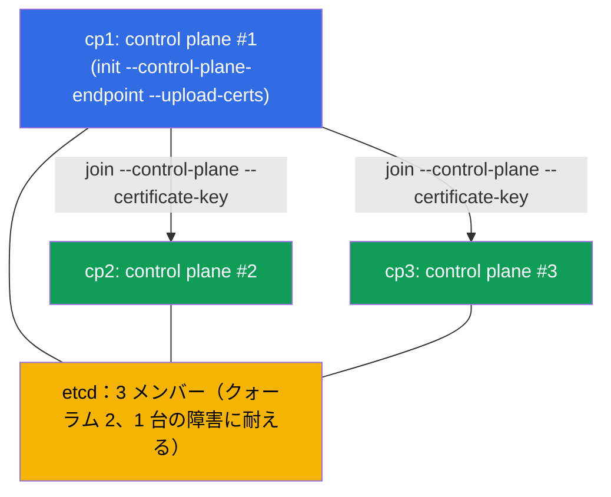

[Русская версия](README_RU.MD) · [Eng version](README.MD) · [Versión en español](README_ES.MD) · [Version française](README_FR.MD) · [Deutsche Version](README_DE.MD) · [ქართული ვერსია](README_GE.MD) · [繁體中文版](README_TW.MD)

# Lab 124 - HA control plane：3 台の control-plane ノードでクラスタを組む

## 概要

高可用な control plane についての実習です（Cluster Architecture ドメイン）。与えられるのは
**最初の control plane** が安定した `--control-plane-endpoint`（`--upload-certs` 付き）で
すでに初期化され、CNI も導入済みのクラスタです。さらにクラスタには control plane の
**候補となるクリーンなノードが 2 台**あります（`cp2`、`cp3`；prerequisites とパッケージは
すでに入っています）。あなたの課題は、**この 2 台をどちらも control plane として join** し、
本物の HA を得ることです：**3 台**の control-plane ノードと**3 つ**の etcd メンバー
（奇数のクォーラム、1 台の障害に耐えられる構成）。

すべての課題は試験形式（実際の CKA の問題と同じスタイル）で書かれており、
`check_result` コマンドで自動的に検証されます。

なぜ 2 ではなく 3 なのか：etcd の raft は**過半数**を必要とします。2 ノードのクォーラムは 2 →
どのノードが落ちても書き込みが止まります（単一ノードより悪い）。奇数（3、5）は本物の HA の
必須条件です（第 35A 章）。

実習 116（単一 control plane のクラスタをゼロから構築）との違い - ここでは既存のクラスタを
control-plane ノードの正しい join 手順で高可用な構成へ**拡張**します。

## 目的

次のコース章の内容を定着させます：

- [第 35A 章。高可用性（HA）](../../course/35-2-ha/README.md) - HA control plane のトポロジー、control-plane ノードの join、奇数のクォーラム
- [第 37 章。etcd のバックアップとリストア](../../course/37/README.md) - etcd の仕組み、クラスタメンバーとクォーラム、`etcdctl` の使い方

## 何をして、なぜやるのか

この実習では、単一 control plane のクラスタを高可用な構成へ拡張します。各ステップが
etcd の奇数クォーラムへ一歩ずつ近づけていきます：

| 操作 | なぜ |
|----------|-------|
| `cp1` で `certificate-key` と join コマンドを取得する | CP ノードの join には control plane の証明書が必要 |
| `cp2` と `cp3` で `kubeadm join --control-plane` | control plane のインスタンスをさらに 2 つ追加する（apiserver + etcd） |
| etcd のメンバーを確認する | etcd クラスタが 3 ノードになったことを確かめる（奇数のクォーラム） |

最終的にデプロイされる全体像：



## インフラ

環境は Terragrunt により AWS（`eu-central-1`）に展開され、次の要素で構成されます：

| コンポーネント | 説明                                                                  |
|-----------|-----------------------------------------------------------------------------|
| `cp1`     | Kubernetes `1.35.2`（kubeadm）、`--control-plane-endpoint` と `--upload-certs` で初期化済み、CNI 導入済み；ここに接続して `check_result` を実行します |
| `cp2`     | control plane の候補となるクリーンなノード：prerequisites（swap/モジュール/sysctl）、containerd、`kubeadm/kubelet/kubectl` のパッケージは導入済み；`ssh cp2` で接続できます |
| `cp3`     | 2 台目の control plane 候補、`cp2` と対称に準備済み；`ssh cp3` で接続できます |

> 実際の HA クラスタでは apiserver の前にロードバランサーが置かれ、`--control-plane-endpoint`
> はそれを指します。この実習では、安定した endpoint の役割を初期化時に指定した `cp1` の
> アドレスが担っています（第 35A 章）。

## デプロイ

```bash
TASK=124 make run_cka_task
```

作成が完了したら、SSH でノード `cp1` に接続し、そこから課題を進めてください。そこには
`kubectl` が設定されており、`check_result` も置かれています。候補ノードは `cp1` から `ssh cp2`、`ssh cp3` で接続できます。

ノード `cp1` で使える便利なコマンド：

```bash
time_left       # 残り時間
check_result    # 解答をチェックする
```

## 課題

作業はノード `cp1` で行います；候補ノードは `ssh cp2`、`ssh cp3` で接続できます。

---
|        **1**        | **2 台目の control-plane ノード（cp2）を join する**         |
| :-----------------: | :----------------------------------------------------------- |
| やること            | `cp1` で `certificate-key`（`sudo kubeadm init phase upload-certs --upload-certs`）と、トークンおよび discovery-hash を含む基本の join コマンド（`sudo kubeadm token create --print-join-command`）を取得してください。これらを組み合わせて control-plane ノード用のコマンドを作り、`--control-plane` と `--certificate-key <キー>` のフラグを追加して、`cp2` で実行します（`ssh cp2`、続いて `sudo kubeadm join ...`）。 |
| 受け入れ基準        | - `cp2` が control plane として join され、`Ready` 状態である。 |
---
|        **2**        | **3 台目の control-plane ノード（cp3）を join する**        |
| :-----------------: | :----------------------------------------------------------- |
| やること            | 同じ方法で `cp3` を join してください - これで奇数のクォーラム（3 ノード）になります。ステップ 1 から約 2 時間以上経っている場合、`certificate-key` は期限切れです - `upload-certs` をやり直してください；トークンが期限切れ（約 24 時間）なら `kubeadm token create` で再作成します。 |
| 受け入れ基準        | - クラスタに `control-plane` ロールのノードが **≥ 3** 台あり、すべて `Ready` 状態である。 |
---
|        **3**        | **etcd のクォーラム（3 メンバー）を確認する**               |
| :-----------------: | :----------------------------------------------------------- |
| やること            | stacked トポロジーでは各 control-plane ノードでそれぞれの static pod `etcd-*` が起動していることを確認してください。`kubectl -n kube-system get pods -l component=etcd -o wide`（3 つの Pod `etcd-cp1/cp2/cp3`）で確認し、必要であれば `etcdctl member list` でクラスタのメンバー数を直接見ることもできます（`/etc/kubernetes/pki/etcd` の証明書を使用、第 37 章）。 |
| 受け入れ基準        | - namespace `kube-system` で **≥ 3** 個の Pods `etcd-*` が動いており（CP ノードごとに 1 つ）、すべて `Running` 状態である。 |
---

> **なぜ 3 なのか（第 35A 章）。** 3 つの etcd メンバーのクォーラムは 2 で、**1 台**の
> ノード障害に耐えられます。2 メンバーは**ゼロ**回の障害しか耐えられず（単一ノードより悪い）、
> だから HA は必ず奇数で組みます - 3 か 5 です。

## 結果のチェック

ノード `cp1` で自動チェックを実行します：

```bash
check_result
```

スクリプトがテストを実行し、いくつの課題が完了したかを表示します。

## 解答

参考解答：[node-1/files/solutions/1_JP.MD](node-1/files/solutions/1_JP.MD)

## 模擬試験のカバー範囲

Cluster Architecture, Installation & Configuration ドメイン（CKA）：HA control plane の
トポロジー、control-plane ノードの join、etcd の奇数クォーラム。

## クラスタとリソースの削除

```bash
TASK=124 make delete_cka_task
```
