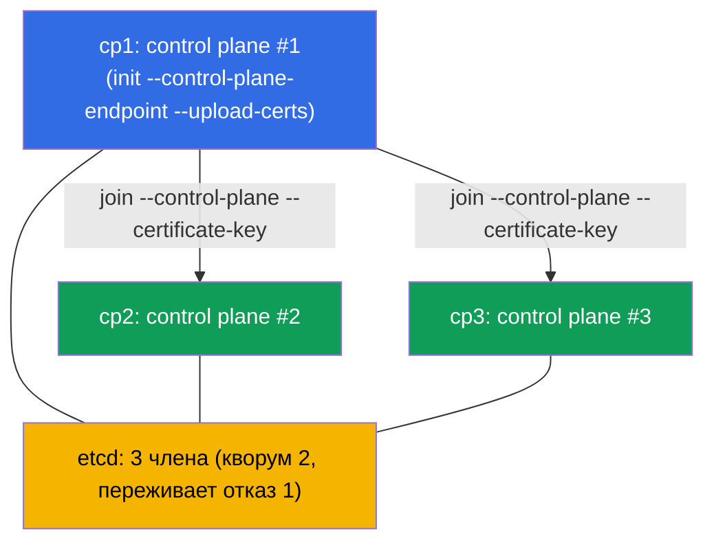

# Lab 124 — HA control plane: сборка кластера из 3 control-plane нод

## Описание

Практическая работа по отказоустойчивому control plane (домен Cluster Architecture). Дан
кластер, где **первый control plane** уже инициализирован через стабильный
`--control-plane-endpoint` (с `--upload-certs`) и с установленным CNI. В кластере есть
**две чистые ноды-кандидата** в control plane (`cp2`, `cp3`; prerequisites и пакеты уже
стоят). Ваша задача — **присоединить обе как control plane**, чтобы получить настоящий
HA: **три** control-plane ноды и **три** члена etcd (нечётный кворум, переживает отказ
одного узла).

Все задания оформлены в экзаменационном стиле (как реальные вопросы CKA) с
автоматической проверкой командой `check_result`.

Почему именно 3, а не 2: etcd на raft требует **большинства**. У 2 узлов кворум = 2 →
отказ любого узла роняет запись (хуже одного узла). Нечётное число (3, 5) — обязательное
условие реального HA (глава 35A).

Отличие от лабы 116 (одноконтроллерный кластер с нуля) — здесь готовый кластер
**расширяют** до отказоустойчивого правильной процедурой join control-plane нод.

## Цель

Закрепить материал глав курса:

- [Глава 35A. Высокая доступность (HA)](../../course/35-2-ha/ru.md) — топология HA control plane, join control-plane нод, нечётный кворум
- [Глава 37. Резервное копирование и восстановление etcd](../../course/37/ru.md) — устройство etcd, члены кластера и кворум, работа с `etcdctl`

## Что мы делаем и зачем

В этой лабе мы расширяем одноконтроллерный кластер до отказоустойчивого. Каждый шаг
приближает к нечётному кворуму etcd:

| Действие | Зачем |
|----------|-------|
| Получить `certificate-key` и join-команду на `cp1` | сертификаты control plane нужны для join CP-нод |
| `kubeadm join --control-plane` на `cp2` и `cp3` | добавляют ещё два экземпляра control plane (apiserver + etcd) |
| Проверить членов etcd | убедиться, что кластер etcd стал из 3 узлов (нечётный кворум) |

Итоговая картина того, что будет развёрнуто:



## Инфраструктура

Окружение разворачивается в AWS (`eu-central-1`) через Terragrunt и состоит из:

| Компонент | Описание                                                                    |
|-----------|-----------------------------------------------------------------------------|
| `cp1`     | Kubernetes `1.35.2` (kubeadm), инициализирован с `--control-plane-endpoint` и `--upload-certs`, установлен CNI; сюда подключаемся и запускаем `check_result` |
| `cp2`     | Чистая нода-кандидат в control plane: prerequisites (swap/модули/sysctl), containerd и пакеты `kubeadm/kubelet/kubectl` уже установлены; доступна как `ssh cp2` |
| `cp3`     | Второй кандидат в control plane, подготовлен симметрично `cp2`; доступна как `ssh cp3` |

> На реальном HA-кластере перед apiserver'ами стоит балансировщик, а `--control-plane-endpoint`
> указывает на него. В лабе роль стабильного endpoint играет адрес `cp1`, заданный при
> инициализации (глава 35A).

## Развёртывание

```bash
TASK=124 make run_cka_task
```

После создания подключитесь по SSH к ноде `cp1` и выполняйте задания оттуда: там настроен
`kubectl` и лежит `check_result`. Ноды-кандидаты доступны с `cp1` как `ssh cp2` и `ssh cp3`.

Полезные команды на ноде `cp1`:

```bash
time_left       # сколько осталось времени
check_result    # проверить решение
```

## Задания

Работа ведётся на ноде `cp1`; кандидаты доступны как `ssh cp2` и `ssh cp3`.

---
|        **1**        | **Присоединить вторую control-plane ноду (cp2)**            |
| :-----------------: | :----------------------------------------------------------- |
| Что делаем          | На `cp1` получите `certificate-key` (`sudo kubeadm init phase upload-certs --upload-certs`) и базовую join-команду с токеном и discovery-hash (`sudo kubeadm token create --print-join-command`). Соберите из них команду для control-plane ноды, добавив флаги `--control-plane` и `--certificate-key <ключ>`, и выполните её на `cp2` (`ssh cp2`, затем `sudo kubeadm join ...`). |
| Критерии приёмки    | - `cp2` присоединена как control plane и находится в статусе `Ready`. |
---
|        **2**        | **Присоединить третью control-plane ноду (cp3)**           |
| :-----------------: | :----------------------------------------------------------- |
| Что делаем          | Тем же способом присоедините `cp3` — это даёт нечётный кворум (3 узла). Если с момента шага 1 прошло больше ~2 часов, `certificate-key` истёк — повторите `upload-certs`; если истёк токен (~24 ч), пересоздайте его через `kubeadm token create`. |
| Критерии приёмки    | - в кластере **≥ 3** нод с ролью `control-plane`, все в статусе `Ready`. |
---
|        **3**        | **Проверить кворум etcd (3 члена)**                         |
| :-----------------: | :----------------------------------------------------------- |
| Что делаем          | Убедитесь, что при stacked-топологии на каждой control-plane ноде поднялся свой static pod `etcd-*`. Проверьте `kubectl -n kube-system get pods -l component=etcd -o wide` (три Pod `etcd-cp1/cp2/cp3`) и при желании число членов кластера напрямую через `etcdctl member list` (с сертификатами из `/etc/kubernetes/pki/etcd`, глава 37). |
| Критерии приёмки    | - в namespace `kube-system` запущено **≥ 3** Pods `etcd-*` (по одному на CP-ноду), все в статусе `Running`. |
---

> **Почему 3 (глава 35A).** 3 члена etcd имеют кворум 2 и переживают отказ **одного**
> узла. 2 члена переживают **ноль** отказов (хуже одного), поэтому HA всегда строят на
> нечётном числе — 3 или 5.

## Проверка результата

На ноде `cp1` запустите автоматическую проверку:

```bash
check_result
```

Скрипт прогонит тесты и покажет, сколько заданий выполнено.

## Решение

Эталонное решение: [node-1/files/solutions/1.MD](node-1/files/solutions/1.MD)

## Покрытие мок-экзаменов

Домен Cluster Architecture, Installation & Configuration (CKA): HA-топология control
plane, join control-plane нод, нечётный кворум etcd.

## Удаление кластера и ресурсов

```bash
TASK=124 make delete_cka_task
```
