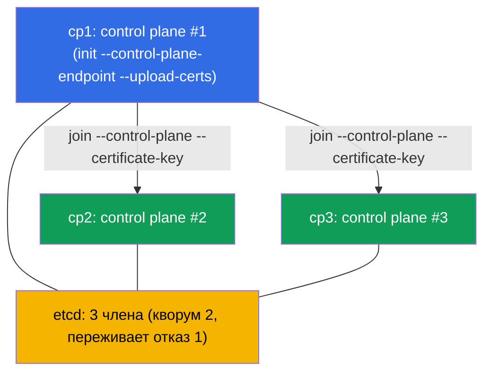

# Lab 124 — HA control plane: сборка кластера из 3 control-plane нод

## Описание

Практическая работа по отказоустойчивому control plane (домен Cluster Architecture). Дан
кластер, где **первый control plane** уже инициализирован через стабильный
`--control-plane-endpoint` (с `--upload-certs`) и с установленным CNI. В кластере есть
**две чистые ноды-кандидата** в control plane (`cp2`, `cp3`; prerequisites и пакеты уже
стоят). Ваша задача — **присоединить обе как control plane**, чтобы получить настоящий
HA: **три** control-plane ноды и **три** члена etcd (нечётный кворум, переживает отказ
одного узла).

Почему именно 3, а не 2: etcd на raft требует **большинства**. У 2 узлов кворум = 2 →
отказ любого узла роняет запись (хуже одного узла). Нечётное число (3, 5) — обязательное
условие реального HA (глава 35A).

Отличие от лабы 116 (одноконтроллерный кластер с нуля) — здесь готовый кластер
**расширяют** до отказоустойчивого правильной процедурой join control-plane нод.

## Цель

Закрепить главы курса:

- [Глава 35A. Высокая доступность (HA)](../../course/35-2-ha/ru.md)
- [Глава 37. Резервное копирование и восстановление etcd](../../course/37/ru.md)

## Что мы делаем и зачем

| Действие | Зачем |
|----------|-------|
| Получить `certificate-key` и join-команду на `cp1` | сертификаты control plane нужны для join CP-нод |
| `kubeadm join --control-plane` на `cp2` и `cp3` | добавляют ещё два экземпляра control plane (apiserver + etcd) |
| Проверить членов etcd | убедиться, что кластер etcd стал из 3 узлов (нечётный кворум) |



## Инфраструктура

| Компонент | Описание                                                                    |
|-----------|-----------------------------------------------------------------------------|
| `cp1`     | Kubernetes `1.35.2` (kubeadm), инициализирован с `--control-plane-endpoint` и `--upload-certs`, установлен CNI; сюда подключаемся и запускаем `check_result` |
| `cp2`     | Чистая нода-кандидат в control plane: prerequisites (swap/модули/sysctl), containerd и пакеты `kubeadm/kubelet/kubectl` уже установлены; доступна как `ssh cp2` |
| `cp3`     | Второй кандидат в control plane, подготовлен симметрично `cp2`; доступна как `ssh cp3` |

> На реальном HA-кластере перед apiserver'ами стоит балансировщик, а `--control-plane-endpoint`
> указывает на него. В лабе роль стабильного endpoint играет адрес `cp1`, заданный при
> инициализации (глава 35A).

## Развёртывание

```bash
TASK=124 make run_cka_task
```

## Задания

Работа ведётся на ноде `cp1`; кандидаты доступны как `ssh cp2` и `ssh cp3`.

---
|        **1**        | **Присоединить вторую control-plane ноду (cp2)**            |
| :-----------------: | :----------------------------------------------------------- |
| Что делаем          | На `cp1` получаем `certificate-key` и join-команду, на `cp2` выполняем `kubeadm join --control-plane` |
| Критерии приёмки    | - `cp2` присоединена как control plane и в статусе `Ready` |
---
|        **2**        | **Присоединить третью control-plane ноду (cp3)**           |
| :-----------------: | :----------------------------------------------------------- |
| Что делаем          | Тем же способом присоединяем `cp3` — для нечётного кворума (3 узла) |
| Критерии приёмки    | - В кластере **≥ 3** нод с ролью `control-plane`, все `Ready` |
---
|        **3**        | **Проверить кворум etcd (3 члена)**                         |
| :-----------------: | :----------------------------------------------------------- |
| Что делаем          | Убеждаемся, что etcd работает на всех трёх control-plane нодах |
| Критерии приёмки    | - В `kube-system` запущено **≥ 3** подов `etcd-*` (по одному на CP-ноду), все Ready |
---

> **Почему 3 (глава 35A).** 3 члена etcd имеют кворум 2 и переживают отказ **одного**
> узла. 2 члена переживают **ноль** отказов (хуже одного), поэтому HA всегда строят на
> нечётном числе — 3 или 5.

## Проверка результата

```bash
check_result
```

## Решение

[node-1/files/solutions/1.MD](node-1/files/solutions/1.MD)

## Покрытие мок-экзаменов

Домен Cluster Architecture, Installation & Configuration (CKA): HA-топология control
plane, join control-plane нод, нечётный кворум etcd.

## Удаление

```bash
TASK=124 make delete_cka_task
```
