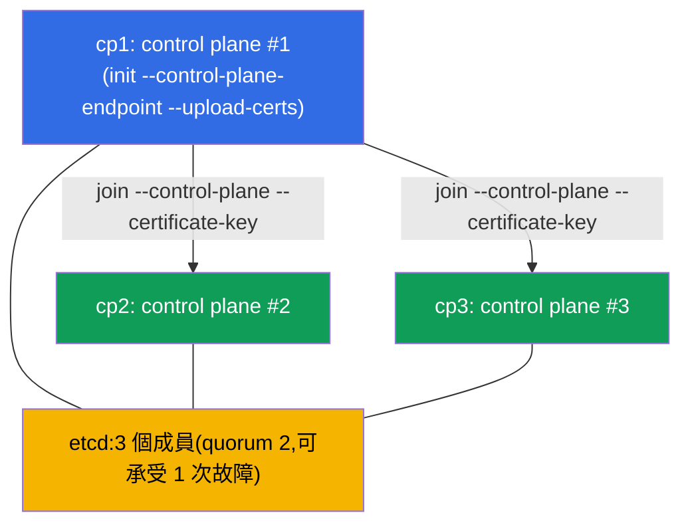

[Русская версия](README_RU.MD) · [Eng version](README.MD) · [Versión en español](README_ES.MD) · [Version française](README_FR.MD) · [Deutsche Version](README_DE.MD) · [ქართული ვერსია](README_GE.MD) · [日本語版](README_JP.MD)

# Lab 124 - HA control plane:用 3 個 control-plane 節點組建叢集

## 說明

關於高可用 control plane 的實作練習(Cluster Architecture 領域)。你會拿到一個
叢集,其中**第一個 control plane** 已經透過穩定的
`--control-plane-endpoint`(搭配 `--upload-certs`)初始化完成,並已安裝 CNI。叢集中還有
**兩個乾淨的候選節點**可以加入 control plane(`cp2`、`cp3`;prerequisites 與套件都已經
裝好)。你的任務是**把這兩個節點都以 control plane 的身分加入**,以取得真正的
HA:**三個** control-plane 節點與**三個** etcd 成員(奇數的 quorum,能夠承受
單一節點故障)。

所有任務都以考試風格撰寫(就像真正的 CKA 題目),並透過
`check_result` 指令自動驗證。

為什麼是 3 而不是 2:etcd 的 raft 需要**多數**。2 個節點的 quorum = 2 →
任何一個節點故障都會讓寫入中斷(比單一節點更糟)。奇數(3、5)是真正 HA 的
必要條件(第 35A 章)。

與實驗 116(從零開始建立單 control plane 叢集)的差別 - 這裡是把一個現成的叢集
用正確的 control-plane 節點 join 流程**擴充**成高可用的叢集。

## 目標

鞏固以下課程章節的內容:

- [第 35A 章。高可用性(HA)](../../course/35-2-ha/README.md) - HA control plane 拓撲、加入 control-plane 節點、奇數 quorum
- [第 37 章。etcd 的備份與還原](../../course/37/README.md) - etcd 的運作方式、叢集成員與 quorum、使用 `etcdctl`

## 我們要做什麼,以及為什麼

在這個實驗中,我們把單 control plane 的叢集擴充成高可用的叢集。每個步驟
都讓我們更接近奇數的 etcd quorum:

| 動作 | 為什麼 |
|----------|-------|
| 在 `cp1` 上取得 `certificate-key` 與 join 指令 | 加入 CP 節點需要 control plane 的憑證 |
| 在 `cp2` 與 `cp3` 上執行 `kubeadm join --control-plane` | 再增加兩個 control plane 實例(apiserver + etcd) |
| 檢查 etcd 成員 | 確認 etcd 叢集已經變成 3 個節點(奇數 quorum) |

最終部署出來的整體樣貌:



## 基礎架構

環境透過 Terragrunt 部署在 AWS(`eu-central-1`),由以下部分組成:

| 元件 | 說明                                                                        |
|-----------|-----------------------------------------------------------------------------|
| `cp1`     | Kubernetes `1.35.2`(kubeadm),以 `--control-plane-endpoint` 與 `--upload-certs` 初始化,已安裝 CNI;我們連線到這裡並執行 `check_result` |
| `cp2`     | 乾淨的 control plane 候選節點:prerequisites(swap/模組/sysctl)、containerd 以及 `kubeadm/kubelet/kubectl` 套件都已安裝完成;可用 `ssh cp2` 連線 |
| `cp3`     | 第二個 control plane 候選節點,與 `cp2` 對稱地準備好;可用 `ssh cp3` 連線 |

> 在真實的 HA 叢集中,apiserver 前面會有一個負載平衡器,而 `--control-plane-endpoint`
> 指向它。在這個實驗中,穩定 endpoint 的角色由初始化時設定的 `cp1` 位址
> 擔任(第 35A 章)。

## 部署

```bash
TASK=124 make run_cka_task
```

建立完成後,請透過 SSH 連線到節點 `cp1`,並在那裡完成任務:那裡已設定好
`kubectl`,也放著 `check_result`。候選節點可以從 `cp1` 用 `ssh cp2` 與 `ssh cp3` 連線。

節點 `cp1` 上的實用指令:

```bash
time_left       # 還剩多少時間
check_result    # 檢查解答
```

## 任務

工作在節點 `cp1` 上進行;候選節點可用 `ssh cp2` 與 `ssh cp3` 連線。

---
|        **1**        | **加入第二個 control-plane 節點(cp2)**                      |
| :-----------------: | :----------------------------------------------------------- |
| 要做什麼            | 在 `cp1` 上取得 `certificate-key`(`sudo kubeadm init phase upload-certs --upload-certs`),以及含 token 與 discovery-hash 的基本 join 指令(`sudo kubeadm token create --print-join-command`)。把它們組合成 control-plane 節點用的指令,加上 `--control-plane` 與 `--certificate-key <金鑰>` 這兩個旗標,然後在 `cp2` 上執行(`ssh cp2`,接著 `sudo kubeadm join ...`)。 |
| 驗收標準            | - `cp2` 已作為 control plane 加入,並處於 `Ready` 狀態。 |
---
|        **2**        | **加入第三個 control-plane 節點(cp3)**                      |
| :-----------------: | :----------------------------------------------------------- |
| 要做什麼            | 用同樣的方式加入 `cp3` - 這樣就得到奇數的 quorum(3 個節點)。如果從步驟 1 之後已經過了大約 2 小時以上,`certificate-key` 就過期了 - 請重新執行 `upload-certs`;如果 token 過期(約 24 小時),請用 `kubeadm token create` 重新建立。 |
| 驗收標準            | - 叢集中有 **≥ 3** 個角色為 `control-plane` 的節點,全部處於 `Ready` 狀態。 |
---
|        **3**        | **檢查 etcd 的 quorum(3 個成員)**                           |
| :-----------------: | :----------------------------------------------------------- |
| 要做什麼            | 確認在 stacked 拓撲下,每個 control-plane 節點都啟動了自己的 static pod `etcd-*`。檢查 `kubectl -n kube-system get pods -l component=etcd -o wide`(三個 Pod `etcd-cp1/cp2/cp3`),若有需要也可以用 `etcdctl member list` 直接查看叢集成員數量(使用 `/etc/kubernetes/pki/etcd` 中的憑證,第 37 章)。 |
| 驗收標準            | - namespace `kube-system` 中執行著 **≥ 3** 個 Pods `etcd-*`(每個 CP 節點一個),全部處於 `Running` 狀態。 |
---

> **為什麼正好是 3(第 35A 章)。** 3 個 etcd 成員的 quorum 是 2,能承受**一個**
> 節點故障。2 個成員能承受**零**次故障(比單一節點更糟),所以 HA 永遠建立在
> 奇數上 - 3 或 5。

## 檢查結果

在節點 `cp1` 上執行自動檢查:

```bash
check_result
```

腳本會跑完測試,並顯示已完成多少任務。

## 解答

參考解答:[node-1/files/solutions/1_TW.MD](node-1/files/solutions/1_TW.MD)

## 模擬考涵蓋範圍

Cluster Architecture, Installation & Configuration 領域(CKA):HA control plane
拓撲、加入 control-plane 節點、奇數的 etcd quorum。

## 刪除叢集與資源

```bash
TASK=124 make delete_cka_task
```
