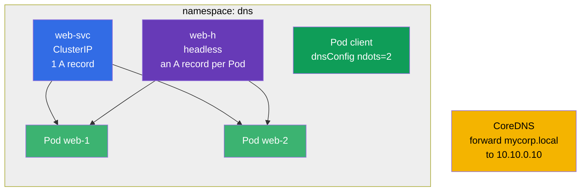

[Русская версия](README_RU.MD) · [Versión en español](README_ES.MD) · [Version française](README_FR.MD) · [Deutsche Version](README_DE.MD) · [ქართული ვერსია](README_GE.MD) · [繁體中文版](README_TW.MD) · [日本語版](README_JP.MD)

# Lab 125 — DNS and CoreDNS in the Cluster

## Description

A dedicated drill on DNS in Kubernetes: A records of a regular Service, multiple records of
a **headless** Service, DNS settings at the Pod level (`dnsConfig`, `ndots`) and editing
**CoreDNS** (Corefile) to forward a corporate domain.

The tasks are short and independent, written in exam style (like real CKA/CKAD questions)
with automatic validation via the `check_result` command.

## Goal

Reinforce the material from the course chapter:

- [Chapter 31. Service internals, DNS and CoreDNS](../../course/31/README.md) — A records of a Service and of a headless Service, `dnsConfig`/`ndots`, editing CoreDNS (Corefile)

Related chapters: [Chapter 7. Services](../../course/07/README.md) — Service types and Endpoints, [Chapter 30. Networking and CNI](../../course/30/README.md) — Pod networking.

## What We Build and Why

In this lab we assemble a set of objects that show how DNS works in the cluster. Every
object demonstrates its own aspect of naming:

| Object | What it is | Why it is in this lab |
|--------|---------|-------------------|
| **Deployment `web`** (2 replicas) | an application behind DNS names | the source of Pods that the Service records point to (chapter 31) |
| **Service `web-svc`** (ClusterIP) | a regular Service | provides a single A record `web-svc.dns.svc.cluster.local` pointing to the ClusterIP (chapter 31) |
| **Service `web-h`** (headless) | `clusterIP: None` | DNS returns A records for **all** Pods directly, without a single VIP (chapter 31) |
| **Pod `client`** (`dnsConfig`) | a Pod with custom resolving | we set `ndots=2` to cut down unnecessary DNS queries (chapter 31) |
| **CoreDNS forward** | editing the Corefile | we forward the `mycorp.local` domain to the external DNS `10.10.0.10` (chapter 31) |
| **JSONPath query** | extracting a field through the API | we save the ClusterIP of `web-svc` into a file (chapter 31) |

The final picture of what will be deployed:



## Infrastructure

The environment is deployed in AWS (`eu-central-1`) via Terragrunt and consists of:

| Component  | Description                                                          |
|------------|----------------------------------------------------------------------|
| `vpc`      | VPC `10.10.0.0/16` with public subnets                               |
| `ssh-keys` | SSH keys for node access                                             |
| `k8s-1`    | Kubernetes `1.35.2` (kubeadm), Calico CNI, single-node               |
| `worker`   | Work machine with `kubectl` and `check_result`                       |

Answer files for JSONPath are saved in `/home/ubuntu/answers/`.

Instances: `t4g.medium` (master), Ubuntu `22.04`. The cluster is single-node — the master is
untainted (the `control-plane` taint is removed), so Pods are scheduled directly on it.

## Deployment

```bash
TASK=125 make run_cka_task
```

Once it is created, connect to the work machine (worker) over SSH and do the tasks from
there. `kubectl` is already pointed at the `cluster1-admin@cluster1` context.

Handy commands on the work machine:

```bash
time_left       # how much time is left
check_result    # check your solution
```

## Tasks

The work is done from the `worker` machine (that is where `kubectl` and `check_result` are).

---
|        **1**        | **Namespace and Deployment**                                |
| :-----------------: | :----------------------------------------------------------- |
| What to do          | Create a namespace named `dns`. In this namespace create a Deployment named `web` with container image `viktoruj/ping_pong:latest` (a training HTTP server on port `8080`) and `2` replicas. The Pods must have the label `app=web` (for a Deployment created with `kubectl create deployment` this label is set automatically). |
| Acceptance criteria | - namespace `dns` exists;<br/>- Deployment `web` in namespace `dns` has 2 ready replicas. |
---
|        **2**        | **ClusterIP Service (a regular A record in DNS)**           |
| :-----------------: | :----------------------------------------------------------- |
| What to do          | In namespace `dns` create a Service named `web-svc` of type **ClusterIP** (the default type) that selects the Pods of Deployment `web` by the label `app=web`. The Service port is `80`, the `targetPort` (the port on the Pods) is `8080` (the HTTP port of the ping_pong application). Such a Service gets the DNS name `web-svc.dns.svc.cluster.local` in the cluster with a single A record pointing to the ClusterIP. |
| Acceptance criteria | - Service `web-svc` exists in namespace `dns`;<br/>- its Endpoints are not empty (the Service found the `web` Pods). |
---
|        **3**        | **Headless Service (A records for all Pods)**               |
| :-----------------: | :----------------------------------------------------------- |
| What to do          | In namespace `dns` create a **headless** Service named `web-h`: the `clusterIP` field must be `None`, the selector is `app=web`, the port is `80`. A headless Service has no single virtual IP: a DNS query for its name returns the IPs of **all** Pods directly (one A record per Pod). |
| Acceptance criteria | - Service `web-h` in namespace `dns` has `clusterIP: None`;<br/>- its Endpoints are not empty (the IPs of the `web` Pods are listed). |
---
|        **4**        | **Pod with a custom DNS setting (ndots)**                  |
| :-----------------: | :----------------------------------------------------------- |
| What to do          | In namespace `dns` create a Pod named `client` with image `viktoruj/ping_pong:alpine` (the `alpine` tag comes with a shell and utilities so you can `exec` into it and check DNS: `nslookup`, `wget`). In its spec set `dnsConfig` with the `ndots` option equal to `2` (that is, `spec.dnsConfig.options` contains the entry `{name: ndots, value: "2"}`). Leave `dnsPolicy` as `ClusterFirst` (the default). This reduces the number of unnecessary DNS queries for external names (see section 31.7 of the chapter). |
| Acceptance criteria | - Pod `client` exists in namespace `dns`;<br/>- the `dnsConfig` option `ndots=2` is set in its spec. |
---
|        **5**        | **CoreDNS: forwarding a specific domain**                  |
| :-----------------: | :----------------------------------------------------------- |
| What to do          | Edit the ConfigMap `coredns` in namespace `kube-system` and add a separate block (a stub domain) to the Corefile that **forwards** (`forward`) all queries for the `mycorp.local` domain to the external DNS server at `10.10.0.10`. After the edit, restart the `coredns` Deployment (`kubectl -n kube-system rollout restart deployment coredns`) so the changes take effect. |
| Acceptance criteria | - the Corefile (ConfigMap `coredns`) contains the domain `mycorp.local` and the forwarding address `10.10.0.10`. |
---
|        **6**        | **JSONPath: save the ClusterIP into a file**               |
| :-----------------: | :----------------------------------------------------------- |
| What to do          | Using `kubectl ... -o jsonpath`, get the ClusterIP of the `web-svc` Service (the `.spec.clusterIP` field) and save **only the value itself** (no line breaks or extra text) into the file `/home/ubuntu/answers/clusterip.txt`. |
| Acceptance criteria | - the content of `/home/ubuntu/answers/clusterip.txt` matches `.spec.clusterIP` of the `web-svc` Service. |
---

## Checking the Result

On the work machine run the automatic validation:

```bash
check_result
```

The script runs the tests and shows how many tasks are complete.

## Solution

Reference solution: [worker/files/solutions/1.MD](worker/files/solutions/1.MD)

## Mock Exam Coverage

The Services & Networking domain (20% CKA / 20% CKAD) — DNS: records of a Service and of a
headless Service, `dnsConfig`/`ndots` at the Pod level, editing CoreDNS (Corefile) to
forward a domain.

## Deleting the Cluster and Resources

```bash
TASK=125 make delete_cka_task
```
