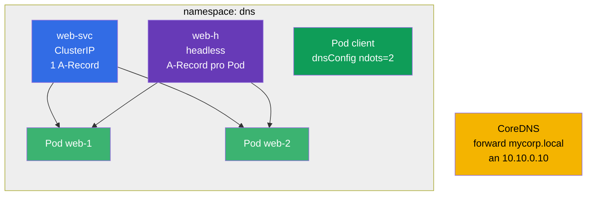

[Русская версия](README_RU.MD) · [Eng version](README.MD) · [Versión en español](README_ES.MD) · [Version française](README_FR.MD) · [ქართული ვერსია](README_GE.MD)

# Lab 125 — DNS und CoreDNS im Cluster

## Beschreibung

Ein eigenes Training zu DNS in Kubernetes: A-Records eines normalen Service, mehrfache
Records eines **Headless**-Service, DNS-Einstellungen auf Pod-Ebene (`dnsConfig`, `ndots`)
und Anpassung von **CoreDNS** (Corefile), um eine Firmendomain weiterzuleiten.

Die Aufgaben sind kurz und unabhängig, im Prüfungsstil formuliert (wie echte CKA/CKAD-Fragen)
mit automatischer Prüfung durch den Befehl `check_result`.

## Ziel

Den Stoff des Kurskapitels festigen:

- [Kapitel 31. Service von innen, DNS und CoreDNS](../../course/31/ru.md) — A-Records eines Service und eines Headless-Service, `dnsConfig`/`ndots`, Anpassung von CoreDNS (Corefile)

Verwandte Kapitel: [Kapitel 7. Services](../../course/07/ru.md) — Service-Typen und Endpoints, [Kapitel 30. Netzwerk und CNI](../../course/30/ru.md) — Netzwerk der Pods.

## Was wir erstellen und warum

In diesem Lab stellen wir eine Reihe von Objekten zusammen, an denen sichtbar wird, wie DNS im
Cluster funktioniert. Jedes Objekt zeigt seinen eigenen Aspekt der Namen:

| Objekt | Was es ist | Warum in diesem Lab |
|--------|---------|-------------------|
| **Deployment `web`** (2 Replicas) | Anwendung hinter den DNS-Namen | Quelle der Pods, auf die die Service-Records zeigen (Kapitel 31) |
| **Service `web-svc`** (ClusterIP) | normaler Service | liefert einen A-Record `web-svc.dns.svc.cluster.local` auf die ClusterIP (Kapitel 31) |
| **Service `web-h`** (Headless) | `clusterIP: None` | DNS gibt A-Records auf **alle** Pods direkt zurück, ohne eine einzelne VIP (Kapitel 31) |
| **Pod `client`** (`dnsConfig`) | Pod mit eigener Auflösung | wir setzen `ndots=2`, um überflüssige DNS-Anfragen zu reduzieren (Kapitel 31) |
| **CoreDNS forward** | Anpassung des Corefile | wir leiten die Domain `mycorp.local` an den externen DNS `10.10.0.10` weiter (Kapitel 31) |
| **JSONPath-Abfrage** | Extraktion eines Feldes über die API | wir speichern die ClusterIP von `web-svc` in eine Datei (Kapitel 31) |

Das Gesamtbild dessen, was bereitgestellt wird:



## Infrastruktur

Die Umgebung wird in AWS (`eu-central-1`) über Terragrunt bereitgestellt und besteht aus:

| Komponente | Beschreibung                                                         |
|------------|----------------------------------------------------------------------|
| `vpc`      | VPC `10.10.0.0/16` mit öffentlichen Subnetzen                        |
| `ssh-keys` | SSH-Schlüssel für den Zugriff auf die Nodes                          |
| `k8s-1`    | Kubernetes `1.35.2` (kubeadm), CNI Calico, Single-Node               |
| `worker`   | Arbeitsmaschine mit `kubectl` und `check_result`                     |

Die Antwortdateien für JSONPath werden in `/home/ubuntu/answers/` gespeichert.

Instanzen: `t3.medium` (master) Ubuntu `22.04`. Der Cluster ist Single-Node — beim Master ist
der Taint `control-plane` entfernt, daher werden Pods direkt auf ihm geplant.

## Bereitstellung

```bash
TASK=125 make run_cka_task
```

Verbinde dich nach der Erstellung per SSH mit der Arbeitsmaschine (worker) und erledige die
Aufgaben von dort. `kubectl` ist bereits auf den Kontext `cluster1-admin@cluster1` eingestellt.

Nützliche Befehle auf der Arbeitsmaschine:

```bash
time_left       # wie viel Zeit noch bleibt
check_result    # Lösung prüfen
```

## Aufgaben

Gearbeitet wird von der Arbeitsmaschine `worker` (dort liegen `kubectl` und `check_result`).

---
|        **1**        | **Namespace und Deployment**                                |
| :-----------------: | :----------------------------------------------------------- |
| Was wir tun         | Erstelle einen Namespace mit dem Namen `dns`. Erstelle in diesem Namespace ein Deployment mit dem Namen `web`, Container-Image `viktoruj/ping_pong:latest` (Lern-HTTP-Server auf Port `8080`), Anzahl der Replicas — `2`. Die Pods müssen das Label `app=web` haben (bei einem über `kubectl create deployment` erstellten Deployment wird dieses Label automatisch gesetzt). |
| Abnahmekriterien    | - Namespace `dns` existiert;<br/>- Deployment `web` im Namespace `dns` hat 2 bereite (ready) Replicas. |
---
|        **2**        | **ClusterIP Service (normaler A-Record im DNS)**            |
| :-----------------: | :----------------------------------------------------------- |
| Was wir tun         | Erstelle im Namespace `dns` einen Service mit dem Namen `web-svc` vom Typ **ClusterIP** (Standardtyp), der die Pods des Deployments `web` über das Label `app=web` auswählt. Der Service-Port ist `80`, der `targetPort` (Port auf den Pods) ist `8080` (HTTP-Port der Anwendung ping_pong). Ein solcher Service erhält im Cluster den DNS-Namen `web-svc.dns.svc.cluster.local` mit einem A-Record auf die ClusterIP. |
| Abnahmekriterien    | - Service `web-svc` existiert im Namespace `dns`;<br/>- seine Endpoints sind nicht leer (der Service hat die `web`-Pods gefunden). |
---
|        **3**        | **Headless Service (A-Records auf alle Pods)**              |
| :-----------------: | :----------------------------------------------------------- |
| Was wir tun         | Erstelle im Namespace `dns` einen **Headless**-Service mit dem Namen `web-h`: Das Feld `clusterIP` muss `None` sein, der Selector — `app=web`, der Port — `80`. Ein Headless-Service hat keine einzelne virtuelle IP: Eine DNS-Anfrage auf seinen Namen gibt die IPs **aller** Pods direkt zurück (ein A-Record pro Pod). |
| Abnahmekriterien    | - Service `web-h` im Namespace `dns` hat `clusterIP: None`;<br/>- seine Endpoints sind nicht leer (die IPs der `web`-Pods sind aufgeführt). |
---
|        **4**        | **Pod mit eigener DNS-Einstellung (ndots)**                |
| :-----------------: | :----------------------------------------------------------- |
| Was wir tun         | Erstelle im Namespace `dns` einen Pod mit dem Namen `client`, Image `viktoruj/ping_pong:alpine` (der Tag `alpine` bringt Shell und Werkzeuge mit, damit man mit `exec` hineingehen und DNS prüfen kann: `nslookup`, `wget`). Setze in seinem Spec `dnsConfig` mit der Option `ndots` gleich `2` (d. h. `spec.dnsConfig.options` enthält den Eintrag `{name: ndots, value: "2"}`). Lasse `dnsPolicy` auf `ClusterFirst` (Standard). Das verringert die Zahl überflüssiger DNS-Anfragen für externe Namen (siehe Abschnitt 31.7 des Kapitels). |
| Abnahmekriterien    | - Pod `client` existiert im Namespace `dns`;<br/>- in seinem Spec ist die Option `dnsConfig` `ndots=2` gesetzt. |
---
|        **5**        | **CoreDNS: Weiterleitung einer einzelnen Domain**          |
| :-----------------: | :----------------------------------------------------------- |
| Was wir tun         | Bearbeite die ConfigMap `coredns` im Namespace `kube-system` und füge dem Corefile einen separaten Block (Stub-Domain) hinzu, der alle Anfragen an die Domain `mycorp.local` an den externen DNS-Server mit der Adresse `10.10.0.10` **weiterleitet** (`forward`). Starte nach der Änderung das Deployment `coredns` neu (`kubectl -n kube-system rollout restart deployment coredns`), damit die Änderungen wirksam werden. |
| Abnahmekriterien    | - im Corefile (ConfigMap `coredns`) sind die Domain `mycorp.local` und die Weiterleitungsadresse `10.10.0.10` vorhanden. |
---
|        **6**        | **JSONPath: ClusterIP in eine Datei speichern**            |
| :-----------------: | :----------------------------------------------------------- |
| Was wir tun         | Hole mit `kubectl ... -o jsonpath` die ClusterIP des Service `web-svc` (Feld `.spec.clusterIP`) und speichere **nur den Wert selbst** (ohne Zeilenumbrüche und zusätzlichen Text) in die Datei `/home/ubuntu/answers/clusterip.txt`. |
| Abnahmekriterien    | - der Inhalt von `/home/ubuntu/answers/clusterip.txt` stimmt mit `.spec.clusterIP` des Service `web-svc` überein. |
---

## Ergebnisprüfung

Starte auf der Arbeitsmaschine die automatische Prüfung:

```bash
check_result
```

Das Skript führt die Tests aus und zeigt, wie viele Aufgaben erledigt sind.

## Lösung

Referenzlösung: [worker/files/solutions/1_DE.MD](worker/files/solutions/1_DE.MD)

## Abdeckung der Mock-Prüfungen

Domain Services & Networking (20 % CKA / 20 % CKAD) — DNS: Records eines Service und eines
Headless-Service, `dnsConfig`/`ndots` auf Pod-Ebene, Anpassung von CoreDNS (Corefile) für die
Weiterleitung einer Domain.

## Löschen von Cluster und Ressourcen

```bash
TASK=125 make delete_cka_task
```
