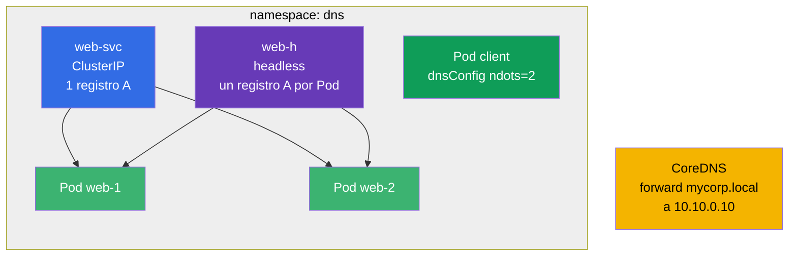

[Русская версия](README_RU.MD) · [Eng version](README.MD) · [Version française](README_FR.MD) · [Deutsche Version](README_DE.MD) · [ქართული ვერსია](README_GE.MD)

# Lab 125 — DNS y CoreDNS en el clúster

## Descripción

Un entrenamiento específico sobre DNS en Kubernetes: registros A de un Service normal,
registros múltiples de un Service **headless**, configuración de DNS a nivel de Pod
(`dnsConfig`, `ndots`) y edición de **CoreDNS** (Corefile) para reenviar un dominio
corporativo.

Las tareas son cortas e independientes, redactadas en estilo de examen (como preguntas
reales de CKA/CKAD) con comprobación automática mediante el comando `check_result`.

## Objetivo

Consolidar el material del capítulo del curso:

- [Capítulo 31. El Service por dentro, DNS y CoreDNS](../../course/31/ru.md) — registros A de un Service y de un headless, `dnsConfig`/`ndots`, edición de CoreDNS (Corefile)

Capítulos relacionados: [Capítulo 7. Services](../../course/07/ru.md) — tipos de Service y Endpoints, [Capítulo 30. Red y CNI](../../course/30/ru.md) — red de los Pods.

## Qué creamos y para qué

En este laboratorio montamos un conjunto de objetos con los que se ve cómo funciona el DNS
en el clúster. Cada objeto muestra su propio aspecto de los nombres:

| Objeto | Qué es | Para qué está en este laboratorio |
|--------|---------|-------------------|
| **Deployment `web`** (2 réplicas) | aplicación detrás de los nombres DNS | fuente de los Pods a los que apuntan los registros del Service (capítulo 31) |
| **Service `web-svc`** (ClusterIP) | Service normal | da un único registro A `web-svc.dns.svc.cluster.local` apuntando al ClusterIP (capítulo 31) |
| **Service `web-h`** (headless) | `clusterIP: None` | el DNS devuelve registros A de **todos** los Pods directamente, sin una única VIP (capítulo 31) |
| **Pod `client`** (`dnsConfig`) | Pod con resolución personalizada | fijamos `ndots=2` para reducir consultas DNS innecesarias (capítulo 31) |
| **CoreDNS forward** | edición del Corefile | reenviamos el dominio `mycorp.local` al DNS externo `10.10.0.10` (capítulo 31) |
| **Consulta JSONPath** | extracción de un campo por la API | guardamos el ClusterIP de `web-svc` en un fichero (capítulo 31) |

Imagen final de lo que se va a desplegar:



## Infraestructura

El entorno se despliega en AWS (`eu-central-1`) mediante Terragrunt y consta de:

| Componente | Descripción                                                          |
|------------|----------------------------------------------------------------------|
| `vpc`      | VPC `10.10.0.0/16` con subredes públicas                             |
| `ssh-keys` | Claves SSH para acceder a los nodos                                  |
| `k8s-1`    | Kubernetes `1.35.2` (kubeadm), CNI Calico, de un solo nodo           |
| `worker`   | Máquina de trabajo con `kubectl` y `check_result`                    |

Los ficheros de respuesta de JSONPath se guardan en `/home/ubuntu/answers/`.

Instancias: `t3.medium` (master) Ubuntu `22.04`. El clúster es de un solo nodo: al master se
le ha quitado el taint `control-plane`, por lo que los pods se planifican directamente en él.

## Despliegue

```bash
TASK=125 make run_cka_task
```

Una vez creado, conéctate por SSH a la máquina de trabajo (worker) y realiza las tareas
desde allí. `kubectl` ya está configurado con el contexto `cluster1-admin@cluster1`.

Comandos útiles en la máquina de trabajo:

```bash
time_left       # cuánto tiempo queda
check_result    # comprobar la solución
```

## Tareas

El trabajo se realiza desde la máquina de trabajo `worker` (allí están `kubectl` y `check_result`).

---
|        **1**        | **Namespace y Deployment**                                  |
| :-----------------: | :----------------------------------------------------------- |
| Qué hacemos         | Crea un namespace con el nombre `dns`. En ese namespace crea un Deployment llamado `web`, con la imagen de contenedor `viktoruj/ping_pong:latest` (servidor HTTP didáctico en el puerto `8080`) y `2` réplicas. Los Pods deben tener el label `app=web` (en un Deployment creado con `kubectl create deployment` este label se pone automáticamente). |
| Criterios de aceptación | - el namespace `dns` existe;<br/>- el Deployment `web` en el namespace `dns` tiene 2 réplicas listas (ready). |
---
|        **2**        | **Service ClusterIP (registro A normal en el DNS)**         |
| :-----------------: | :----------------------------------------------------------- |
| Qué hacemos         | En el namespace `dns` crea un Service llamado `web-svc` de tipo **ClusterIP** (el tipo por defecto) que seleccione los Pods del Deployment `web` por el label `app=web`. El puerto del Service es `80` y el `targetPort` (el puerto en los Pods) es `8080` (el puerto HTTP de la aplicación ping_pong). Este Service recibirá en el clúster el nombre DNS `web-svc.dns.svc.cluster.local` con un único registro A apuntando al ClusterIP. |
| Criterios de aceptación | - el Service `web-svc` existe en el namespace `dns`;<br/>- sus Endpoints no están vacíos (el Service encontró los Pods `web`). |
---
|        **3**        | **Service headless (registros A de todos los Pods)**        |
| :-----------------: | :----------------------------------------------------------- |
| Qué hacemos         | En el namespace `dns` crea un Service **headless** llamado `web-h`: el campo `clusterIP` debe ser igual a `None`, el selector es `app=web` y el puerto `80`. Un Service headless no tiene una única IP virtual: la consulta DNS a su nombre devuelve las IP de **todos** los Pods directamente (un registro A por cada Pod). |
| Criterios de aceptación | - el Service `web-h` en el namespace `dns` tiene `clusterIP: None`;<br/>- sus Endpoints no están vacíos (se listan las IP de los Pods `web`). |
---
|        **4**        | **Pod con configuración DNS personalizada (ndots)**        |
| :-----------------: | :----------------------------------------------------------- |
| Qué hacemos         | En el namespace `dns` crea un Pod llamado `client`, imagen `viktoruj/ping_pong:alpine` (el tag `alpine` trae shell y utilidades, para poder hacer `exec` dentro y comprobar el DNS: `nslookup`, `wget`). En su spec define `dnsConfig` con la opción `ndots` igual a `2` (es decir, `spec.dnsConfig.options` contiene la entrada `{name: ndots, value: "2"}`). Deja `dnsPolicy` en `ClusterFirst` (por defecto). Esto reduce el número de consultas DNS innecesarias para nombres externos (véase el apartado 31.7 del capítulo). |
| Criterios de aceptación | - el Pod `client` existe en el namespace `dns`;<br/>- en su spec está definida la opción `dnsConfig` `ndots=2`. |
---
|        **5**        | **CoreDNS: reenvío de un dominio concreto**                |
| :-----------------: | :----------------------------------------------------------- |
| Qué hacemos         | Edita el ConfigMap `coredns` del namespace `kube-system` y añade al Corefile un bloque aparte (dominio stub) que **reenvíe** (`forward`) todas las consultas del dominio `mycorp.local` al servidor DNS externo con la dirección `10.10.0.10`. Tras la edición, reinicia el Deployment `coredns` (`kubectl -n kube-system rollout restart deployment coredns`) para que los cambios se apliquen. |
| Criterios de aceptación | - en el Corefile (ConfigMap `coredns`) están presentes el dominio `mycorp.local` y la dirección de reenvío `10.10.0.10`. |
---
|        **6**        | **JSONPath: guardar el ClusterIP en un fichero**           |
| :-----------------: | :----------------------------------------------------------- |
| Qué hacemos         | Con `kubectl ... -o jsonpath` obtén el ClusterIP del Service `web-svc` (el campo `.spec.clusterIP`) y guarda **solo el valor** (sin saltos de línea ni texto adicional) en el fichero `/home/ubuntu/answers/clusterip.txt`. |
| Criterios de aceptación | - el contenido de `/home/ubuntu/answers/clusterip.txt` coincide con `.spec.clusterIP` del Service `web-svc`. |
---

## Comprobación del resultado

En la máquina de trabajo lanza la comprobación automática:

```bash
check_result
```

El script ejecuta los tests y muestra cuántas tareas están completadas.

## Solución

Solución de referencia: [worker/files/solutions/1_ES.MD](worker/files/solutions/1_ES.MD)

## Cobertura de exámenes simulados

Dominio Services & Networking (20% CKA / 20% CKAD) — DNS: registros de un Service y de un
headless, `dnsConfig`/`ndots` a nivel de Pod, edición de CoreDNS (Corefile) para reenviar un
dominio.

## Eliminación del clúster y los recursos

```bash
TASK=125 make delete_cka_task
```
