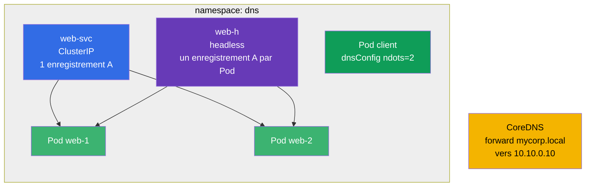

[Русская версия](README_RU.MD) · [Eng version](README.MD) · [Versión en español](README_ES.MD) · [Deutsche Version](README_DE.MD) · [ქართული ვერსია](README_GE.MD) · [繁體中文版](README_TW.MD) · [日本語版](README_JP.MD)

# Lab 125 — DNS et CoreDNS dans le cluster

## Description

Un entraînement dédié au DNS dans Kubernetes : enregistrements A d'un Service ordinaire,
enregistrements multiples d'un Service **headless**, configuration du DNS au niveau du Pod
(`dnsConfig`, `ndots`) et modification de **CoreDNS** (Corefile) pour transférer un domaine
d'entreprise.

Les tâches sont courtes et indépendantes, rédigées dans le style de l'examen (comme de vraies
questions CKA/CKAD) avec une vérification automatique par la commande `check_result`.

## Objectif

Consolider le contenu du chapitre du cours :

- [Chapitre 31. Le Service de l'intérieur, DNS et CoreDNS](../../course/31/fr.md) — enregistrements A d'un Service et d'un headless, `dnsConfig`/`ndots`, modification de CoreDNS (Corefile)

Chapitres connexes : [Chapitre 7. Services](../../course/07/fr.md) — types de Service et Endpoints, [Chapitre 30. Réseau et CNI](../../course/30/fr.md) — réseau des Pods.

## Ce que nous créons et pourquoi

Dans ce lab, nous assemblons un ensemble d'objets qui montrent comment le DNS fonctionne dans
le cluster. Chaque objet illustre son propre aspect des noms :

| Objet | Ce que c'est | Pourquoi dans ce lab |
|--------|---------|-------------------|
| **Deployment `web`** (2 réplicas) | application derrière les noms DNS | source des Pods vers lesquels pointent les enregistrements du Service (chapitre 31) |
| **Service `web-svc`** (ClusterIP) | Service ordinaire | fournit un seul enregistrement A `web-svc.dns.svc.cluster.local` vers le ClusterIP (chapitre 31) |
| **Service `web-h`** (headless) | `clusterIP: None` | le DNS renvoie directement les enregistrements A de **tous** les Pods, sans VIP unique (chapitre 31) |
| **Pod `client`** (`dnsConfig`) | Pod avec une résolution personnalisée | nous fixons `ndots=2` pour réduire les requêtes DNS inutiles (chapitre 31) |
| **CoreDNS forward** | modification du Corefile | nous transférons le domaine `mycorp.local` vers le DNS externe `10.10.0.10` (chapitre 31) |
| **Requête JSONPath** | extraction d'un champ via l'API | nous enregistrons le ClusterIP de `web-svc` dans un fichier (chapitre 31) |

Image finale de ce qui sera déployé :



## Infrastructure

L'environnement est déployé dans AWS (`eu-central-1`) via Terragrunt et se compose de :

| Composant  | Description                                                          |
|------------|----------------------------------------------------------------------|
| `vpc`      | VPC `10.10.0.0/16` avec des sous-réseaux publics                     |
| `ssh-keys` | Clés SSH pour accéder aux nœuds                                      |
| `k8s-1`    | Kubernetes `1.35.2` (kubeadm), CNI Calico, à un seul nœud            |
| `worker`   | Machine de travail avec `kubectl` et `check_result`                  |

Les fichiers de réponse pour JSONPath sont enregistrés dans `/home/ubuntu/answers/`.

Instances : `t3.medium` (master) Ubuntu `22.04`. Le cluster est à un seul nœud — le master est
« détainté » (le taint `control-plane` est retiré), donc les pods sont planifiés directement
sur lui.

## Déploiement

```bash
TASK=125 make run_cka_task
```

Après la création, connectez-vous en SSH à la machine de travail (worker) et effectuez les
tâches depuis celle-ci. `kubectl` est déjà configuré sur le contexte `cluster1-admin@cluster1`.

Commandes utiles sur la machine de travail :

```bash
time_left       # combien de temps il reste
check_result    # vérifier la solution
```

## Tâches

Le travail se fait depuis la machine de travail `worker` (c'est là que se trouvent `kubectl` et `check_result`).

---
|        **1**        | **Namespace et Deployment**                                 |
| :-----------------: | :----------------------------------------------------------- |
| Ce qu'on fait       | Créez un namespace nommé `dns`. Dans ce namespace, créez un Deployment nommé `web`, image du conteneur `viktoruj/ping_pong:latest` (serveur HTTP pédagogique sur le port `8080`), nombre de réplicas — `2`. Les Pods doivent porter le label `app=web` (pour un Deployment créé via `kubectl create deployment`, ce label est ajouté automatiquement). |
| Critères d'acceptation | - le namespace `dns` existe ;<br/>- le Deployment `web` dans le namespace `dns` a 2 réplicas prêts (ready). |
---
|        **2**        | **Service ClusterIP (enregistrement A ordinaire dans le DNS)** |
| :-----------------: | :----------------------------------------------------------- |
| Ce qu'on fait       | Dans le namespace `dns`, créez un Service nommé `web-svc` de type **ClusterIP** (le type par défaut) qui sélectionne les Pods du Deployment `web` par le label `app=web`. Le port du Service est `80`, le `targetPort` (le port sur les Pods) est `8080` (le port HTTP de l'application ping_pong). Un tel Service recevra dans le cluster le nom DNS `web-svc.dns.svc.cluster.local` avec un seul enregistrement A vers le ClusterIP. |
| Critères d'acceptation | - le Service `web-svc` existe dans le namespace `dns` ;<br/>- ses Endpoints ne sont pas vides (le Service a trouvé les Pods `web`). |
---
|        **3**        | **Service headless (enregistrements A de tous les Pods)**    |
| :-----------------: | :----------------------------------------------------------- |
| Ce qu'on fait       | Dans le namespace `dns`, créez un Service **headless** nommé `web-h` : le champ `clusterIP` doit être égal à `None`, le selector est `app=web`, le port `80`. Un Service headless n'a pas d'IP virtuelle unique : la requête DNS sur son nom renvoie directement les IP de **tous** les Pods (un enregistrement A par Pod). |
| Critères d'acceptation | - le Service `web-h` dans le namespace `dns` a `clusterIP: None` ;<br/>- ses Endpoints ne sont pas vides (les IP des Pods `web` y sont listées). |
---
|        **4**        | **Pod avec une configuration DNS personnalisée (ndots)**   |
| :-----------------: | :----------------------------------------------------------- |
| Ce qu'on fait       | Dans le namespace `dns`, créez un Pod nommé `client`, image `viktoruj/ping_pong:alpine` (le tag `alpine` contient un shell et des utilitaires, pour pouvoir faire `exec` à l'intérieur et vérifier le DNS : `nslookup`, `wget`). Dans son spec, définissez `dnsConfig` avec l'option `ndots` égale à `2` (c'est-à-dire que `spec.dnsConfig.options` contient l'entrée `{name: ndots, value: "2"}`). Laissez `dnsPolicy` à `ClusterFirst` (par défaut). Cela réduit le nombre de requêtes DNS inutiles pour les noms externes (voir la section 31.7 du chapitre). |
| Critères d'acceptation | - le Pod `client` existe dans le namespace `dns` ;<br/>- l'option `dnsConfig` `ndots=2` est définie dans son spec. |
---
|        **5**        | **CoreDNS : transfert d'un domaine particulier**           |
| :-----------------: | :----------------------------------------------------------- |
| Ce qu'on fait       | Modifiez le ConfigMap `coredns` dans le namespace `kube-system` et ajoutez au Corefile un bloc séparé (domaine stub) qui **transfère** (`forward`) toutes les requêtes du domaine `mycorp.local` vers le serveur DNS externe d'adresse `10.10.0.10`. Après la modification, redémarrez le Deployment `coredns` (`kubectl -n kube-system rollout restart deployment coredns`) pour que les changements soient appliqués. |
| Critères d'acceptation | - le Corefile (ConfigMap `coredns`) contient le domaine `mycorp.local` et l'adresse de transfert `10.10.0.10`. |
---
|        **6**        | **JSONPath : enregistrer le ClusterIP dans un fichier**    |
| :-----------------: | :----------------------------------------------------------- |
| Ce qu'on fait       | À l'aide de `kubectl ... -o jsonpath`, obtenez le ClusterIP du Service `web-svc` (le champ `.spec.clusterIP`) et enregistrez **uniquement la valeur** (sans retours à la ligne ni texte superflu) dans le fichier `/home/ubuntu/answers/clusterip.txt`. |
| Critères d'acceptation | - le contenu de `/home/ubuntu/answers/clusterip.txt` correspond au `.spec.clusterIP` du Service `web-svc`. |
---

## Vérification du résultat

Sur la machine de travail, lancez la vérification automatique :

```bash
check_result
```

Le script exécute les tests et montre combien de tâches sont accomplies.

## Solution

Solution de référence : [worker/files/solutions/1_FR.MD](worker/files/solutions/1_FR.MD)

## Couverture des examens blancs

Domaine Services & Networking (20 % CKA / 20 % CKAD) — DNS : enregistrements d'un Service et
d'un headless, `dnsConfig`/`ndots` au niveau du Pod, modification de CoreDNS (Corefile) pour
transférer un domaine.

## Suppression du cluster et des ressources

```bash
TASK=125 make delete_cka_task
```
