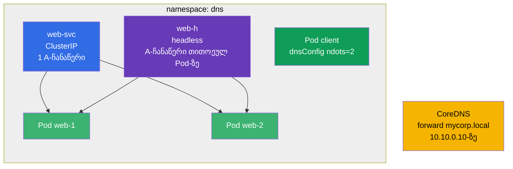

[Русская версия](README_RU.MD) · [Eng version](README.MD) · [Versión en español](README_ES.MD) · [Version française](README_FR.MD) · [Deutsche Version](README_DE.MD) · [繁體中文版](README_TW.MD) · [日本語版](README_JP.MD)

# Lab 125 — DNS და CoreDNS კლასტერში

## აღწერა

ცალკე ტრენაჟორი Kubernetes-ში DNS-ზე: ჩვეულებრივი Service-ის A-ჩანაწერები, **headless**-სერვისის
მრავლობითი ჩანაწერები, DNS-ის კონფიგურაცია Pod-ის დონეზე (`dnsConfig`, `ndots`) და **CoreDNS**-ის
რედაქტირება (Corefile) კორპორაციული დომენის გადამისამართებისთვის.

დავალებები მოკლე და დამოუკიდებელია, გამოცდის სტილშია გაფორმებული (როგორც რეალური CKA/CKAD
კითხვები) და მათი შემოწმება ავტომატურად ხდება ბრძანებით `check_result`.

## მიზანი

განამტკიცოთ კურსის თავის მასალა:

- [თავი 31. Service შიგნიდან, DNS და CoreDNS](../../course/31/ge.md) — Service-ისა და headless-ის A-ჩანაწერები, `dnsConfig`/`ndots`, CoreDNS-ის რედაქტირება (Corefile)

მომიჯნავე თავები: [თავი 7. Services](../../course/07/ge.md) — Service-ის ტიპები და Endpoints, [თავი 30. ქსელი და CNI](../../course/30/ge.md) — Pod-ების ქსელი.

## რას ვქმნით და რისთვის

ამ ლაბორატორიაში ვაწყობთ ობიექტების ნაკრებს, რომლებზეც ჩანს, როგორ მუშაობს DNS კლასტერში.
თითოეული ობიექტი სახელების თავის ასპექტს აჩვენებს:

| ობიექტი | რა არის ეს | რისთვის არის ამ ლაბორატორიაში |
|--------|---------|-------------------|
| **Deployment `web`** (2 რეპლიკა) | აპლიკაცია DNS-სახელების უკან | Pod-ების წყარო, რომლებზეც Service-ის ჩანაწერები მიუთითებს (თავი 31) |
| **Service `web-svc`** (ClusterIP) | ჩვეულებრივი სერვისი | იძლევა ერთ A-ჩანაწერს `web-svc.dns.svc.cluster.local` ClusterIP-ზე (თავი 31) |
| **Service `web-h`** (headless) | `clusterIP: None` | DNS აბრუნებს A-ჩანაწერებს **ყველა** Pod-ზე პირდაპირ, ერთიანი VIP-ის გარეშე (თავი 31) |
| **Pod `client`** (`dnsConfig`) | Pod მორგებული რეზოლვინგით | ვაყენებთ `ndots=2`-ს, რომ ზედმეტი DNS-მოთხოვნები შევამციროთ (თავი 31) |
| **CoreDNS forward** | Corefile-ის რედაქტირება | დომენს `mycorp.local` გადავამისამართებთ გარე DNS-ზე `10.10.0.10` (თავი 31) |
| **JSONPath-შერჩევა** | ველის ამოღება API-ს გავლით | `web-svc`-ის ClusterIP-ს ვინახავთ ფაილში (თავი 31) |

საბოლოო სურათი იმისა, რაც განთავსდება:



## ინფრასტრუქტურა

გარემო იშლება AWS-ში (`eu-central-1`) Terragrunt-ის მეშვეობით და შედგება:

| კომპონენტი | აღწერა                                                            |
|------------|----------------------------------------------------------------------|
| `vpc`      | VPC `10.10.0.0/16` საჯარო ქვექსელებით                                |
| `ssh-keys` | SSH-გასაღებები node-ებზე წვდომისთვის                                 |
| `k8s-1`    | Kubernetes `1.35.2` (kubeadm), CNI Calico, ერთკვანძიანი              |
| `worker`   | სამუშაო მანქანა `kubectl`-ით და `check_result`-ით                    |

JSONPath-ის პასუხების ფაილები ინახება `/home/ubuntu/answers/`-ში.

ინსტანსები: `t3.medium` (master) Ubuntu `22.04`. კლასტერი ერთკვანძიანია — master-ს მოშორებულია
taint `control-plane`, ამიტომ pod-ები პირდაპირ მასზე იგეგმება.

## განთავსება

```bash
TASK=125 make run_cka_task
```

შექმნის შემდეგ დაუკავშირდით სამუშაო მანქანას (worker) SSH-ით და დავალებები შეასრულეთ იქიდან.
`kubectl` უკვე კონფიგურირებულია კონტექსტზე `cluster1-admin@cluster1`.

სასარგებლო ბრძანებები სამუშაო მანქანაზე:

```bash
time_left       # რამდენი დრო დარჩა
check_result    # ამოხსნის შემოწმება
```

## დავალებები

მუშაობა მიმდინარეობს სამუშაო მანქანიდან `worker` (სადაც `kubectl` და `check_result` არის).

---
|        **1**        | **Namespace და Deployment**                                 |
| :-----------------: | :----------------------------------------------------------- |
| რას ვაკეთებთ        | შექმენით namespace სახელით `dns`. ამ namespace-ში შექმენით Deployment სახელით `web`, კონტეინერის image `viktoruj/ping_pong:latest` (სასწავლო HTTP-სერვერი პორტზე `8080`), რეპლიკების რაოდენობა — `2`. Pod-ებს უნდა ჰქონდეთ label `app=web` (`kubectl create deployment`-ით შექმნილ Deployment-ს ეს label ავტომატურად ეყენება). |
| მიღების კრიტერიუმები | - namespace `dns` არსებობს;<br/>- Deployment `web` namespace `dns`-ში აქვს 2 მზა (ready) რეპლიკა. |
---
|        **2**        | **ClusterIP Service (ჩვეულებრივი A-ჩანაწერი DNS-ში)**       |
| :-----------------: | :----------------------------------------------------------- |
| რას ვაკეთებთ        | namespace `dns`-ში შექმენით Service სახელით `web-svc` ტიპით **ClusterIP** (ნაგულისხმევი ტიპი), რომელიც შეარჩევს Deployment `web`-ის Pod-ებს label `app=web`-ით. Service-ის პორტი — `80`, `targetPort` (პორტი Pod-ებზე) — `8080` (ping_pong აპლიკაციის HTTP-პორტი). ასეთი Service კლასტერში მიიღებს DNS-სახელს `web-svc.dns.svc.cluster.local` ერთი A-ჩანაწერით ClusterIP-ზე. |
| მიღების კრიტერიუმები | - Service `web-svc` namespace `dns`-ში არსებობს;<br/>- მისი Endpoints არ არის ცარიელი (Service-მა `web`-ის Pod-ები იპოვა). |
---
|        **3**        | **Headless Service (A-ჩანაწერები ყველა Pod-ზე)**            |
| :-----------------: | :----------------------------------------------------------- |
| რას ვაკეთებთ        | namespace `dns`-ში შექმენით **headless** Service სახელით `web-h`: ველი `clusterIP` უნდა იყოს `None`, selector — `app=web`, პორტი — `80`. headless Service-ს არ აქვს ერთიანი ვირტუალური IP: DNS-მოთხოვნა მის სახელზე აბრუნებს **ყველა** Pod-ის IP-ს პირდაპირ (თითოეულ Pod-ზე A-ჩანაწერით). |
| მიღების კრიტერიუმები | - Service `web-h` namespace `dns`-ში აქვს `clusterIP: None`;<br/>- მისი Endpoints არ არის ცარიელი (ჩამოთვლილია `web`-ის Pod-ების IP). |
---
|        **4**        | **Pod მორგებული DNS-კონფიგურაციით (ndots)**                |
| :-----------------: | :----------------------------------------------------------- |
| რას ვაკეთებთ        | namespace `dns`-ში შექმენით Pod სახელით `client`, image `viktoruj/ping_pong:alpine` (ტეგი `alpine` — shell-ითა და უტილიტებით, რომ შესაძლებელი იყოს `exec` შიგნით და DNS-ის შემოწმება: `nslookup`, `wget`). მის spec-ში მიუთითეთ `dnsConfig` ოპციით `ndots`, რომელიც `2`-ის ტოლია (ანუ `spec.dnsConfig.options` შეიცავს ჩანაწერს `{name: ndots, value: "2"}`). `dnsPolicy` დატოვეთ `ClusterFirst` (ნაგულისხმევად). ეს ამცირებს ზედმეტი DNS-მოთხოვნების რაოდენობას გარე სახელებისთვის (იხ. თავის ნაწილი 31.7). |
| მიღების კრიტერიუმები | - Pod `client` namespace `dns`-ში არსებობს;<br/>- მის spec-ში მითითებულია ოპცია `dnsConfig` `ndots=2`. |
---
|        **5**        | **CoreDNS: ცალკეული დომენის გადამისამართება**              |
| :-----------------: | :----------------------------------------------------------- |
| რას ვაკეთებთ        | დაარედაქტირეთ ConfigMap `coredns` namespace `kube-system`-ში და დაამატეთ Corefile-ში ცალკე ბლოკი (stub-დომენი), რომელიც **გადაამისამართებს** (`forward`) დომენ `mycorp.local`-ის ყველა მოთხოვნას გარე DNS-სერვერზე მისამართით `10.10.0.10`. რედაქტირების შემდეგ გადატვირთეთ Deployment `coredns` (`kubectl -n kube-system rollout restart deployment coredns`), რომ ცვლილებები ამოქმედდეს. |
| მიღების კრიტერიუმები | - Corefile-ში (ConfigMap `coredns`) არის დომენი `mycorp.local` და გადამისამართების მისამართი `10.10.0.10`. |
---
|        **6**        | **JSONPath: ClusterIP-ის შენახვა ფაილში**                  |
| :-----------------: | :----------------------------------------------------------- |
| რას ვაკეთებთ        | `kubectl ... -o jsonpath`-ის დახმარებით მიიღეთ სერვისის `web-svc` ClusterIP (ველი `.spec.clusterIP`) და შეინახეთ **მხოლოდ თავად მნიშვნელობა** (გადატანებისა და ზედმეტი ტექსტის გარეშე) ფაილში `/home/ubuntu/answers/clusterip.txt`. |
| მიღების კრიტერიუმები | - `/home/ubuntu/answers/clusterip.txt`-ის შიგთავსი ემთხვევა სერვისის `web-svc` `.spec.clusterIP`-ს. |
---

## შედეგის შემოწმება

სამუშაო მანქანაზე გაუშვით ავტომატური შემოწმება:

```bash
check_result
```

სკრიპტი გაატარებს ტესტებს და აჩვენებს, რამდენი დავალებაა შესრულებული.

## ამოხსნა

ეტალონური ამოხსნა: [worker/files/solutions/1_GE.MD](worker/files/solutions/1_GE.MD)

## Mock-გამოცდების დაფარვა

დომენი Services & Networking (20% CKA / 20% CKAD) — DNS: Service-ისა და headless-ის ჩანაწერები,
`dnsConfig`/`ndots` Pod-ის დონეზე, CoreDNS-ის რედაქტირება (Corefile) დომენის
გადამისამართებისთვის.

## კლასტერისა და რესურსების წაშლა

```bash
TASK=125 make delete_cka_task
```
