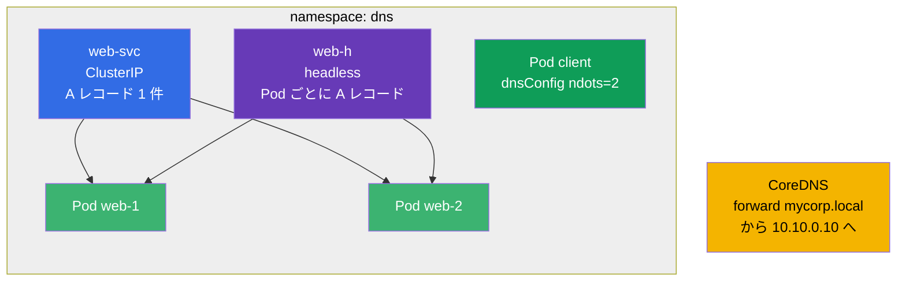

[Русская версия](README_RU.MD) · [Eng version](README.MD) · [Versión en español](README_ES.MD) · [Version française](README_FR.MD) · [Deutsche Version](README_DE.MD) · [ქართული ვერსია](README_GE.MD) · [繁體中文版](README_TW.MD)

# Lab 125 - クラスタ内の DNS と CoreDNS

## 概要

Kubernetes の DNS に特化した独立した実習です：通常の Service の A レコード、
**headless** サービスの複数レコード、Pod 単位の DNS 設定（`dnsConfig`、`ndots`）、
そして企業ドメインを転送するための **CoreDNS**（Corefile）の編集を扱います。

課題は短く互いに独立しており、試験形式（実際の CKA/CKAD の問題と同じスタイル）で
書かれています。`check_result` コマンドで自動的に検証されます。

## 目的

次のコース章の内容を定着させます：

- [第 31 章。Service の内部、DNS と CoreDNS](../../course/31/README.md) - Service と headless の A レコード、`dnsConfig`/`ndots`、CoreDNS（Corefile）の編集

関連する章：[第 7 章。Services](../../course/07/README.md) - Service のタイプと Endpoints、[第 30 章。ネットワークと CNI](../../course/30/README.md) - Pods のネットワーク。

## 何を作り、なぜ作るのか

この実習では、クラスタ内で DNS がどう動くのかが見えるオブジェクト一式を組み立てます。
それぞれのオブジェクトが名前解決の異なる側面を示します：

| オブジェクト | これは何か | この実習での役割 |
|--------|---------|-------------------|
| **Deployment `web`**（2 レプリカ） | DNS 名の背後にあるアプリケーション | Service のレコードが指す Pods の供給元（第 31 章） |
| **Service `web-svc`**（ClusterIP） | 通常のサービス | ClusterIP を指す A レコード `web-svc.dns.svc.cluster.local` を 1 件与える（第 31 章） |
| **Service `web-h`**（headless） | `clusterIP: None` | DNS は単一の VIP を介さず、**すべての** Pods の A レコードを直接返す（第 31 章） |
| **Pod `client`**（`dnsConfig`） | 独自の名前解決設定を持つ Pod | `ndots=2` を設定し、余分な DNS 問い合わせを減らす（第 31 章） |
| **CoreDNS forward** | Corefile の編集 | ドメイン `mycorp.local` を外部 DNS `10.10.0.10` へ転送する（第 31 章） |
| **JSONPath による抽出** | API 経由でフィールドを取り出す | `web-svc` の ClusterIP をファイルに保存する（第 31 章） |

最終的にデプロイされる全体像：



## インフラ

環境は Terragrunt により AWS（`eu-central-1`）に展開され、次の要素で構成されます：

| コンポーネント | 説明                                                        |
|------------|----------------------------------------------------------------------|
| `vpc`      | パブリックサブネットを持つ VPC `10.10.0.0/16`                          |
| `ssh-keys` | ノードへアクセスするための SSH キー                                    |
| `k8s-1`    | Kubernetes `1.35.2`（kubeadm）、CNI Calico、単一ノード                 |
| `worker`   | `kubectl` と `check_result` を備えた作業マシン                         |

JSONPath の解答ファイルは `/home/ubuntu/answers/` に保存します。

インスタンス：`t4g.medium`（master）、Ubuntu `22.04`。クラスタは単一ノード構成で、master の
taint は解除されています（`control-plane` taint を削除）。そのため Pod は master 上に直接スケジュールされます。

## デプロイ

```bash
TASK=125 make run_cka_task
```

作成が完了したら、SSH で作業マシン（worker）に接続し、そこから課題を進めてください。
`kubectl` はすでに `cluster1-admin@cluster1` コンテキストに設定されています。

作業マシンで使える便利なコマンド：

```bash
time_left       # 残り時間
check_result    # 解答をチェックする
```

## 課題

作業は `worker` マシン上で行います（`kubectl` と `check_result` はそこにあります）。

---
|        **1**        | **Namespace と Deployment**                                 |
| :-----------------: | :----------------------------------------------------------- |
| やること            | `dns` という名前の namespace を作成してください。その namespace の中で、`web` という名前の Deployment をコンテナイメージ `viktoruj/ping_pong:latest`（`8080` ポートで動く学習用の HTTP サーバー）で作成し、レプリカ数は `2` にします。Pods には label `app=web` が付いている必要があります（`kubectl create deployment` で作成した Deployment には、この label が自動的に付きます）。 |
| 受け入れ基準        | - namespace `dns` が存在する；<br/>- namespace `dns` の Deployment `web` に ready なレプリカが 2 つある。 |
---
|        **2**        | **ClusterIP Service（DNS の通常の A レコード）**            |
| :-----------------: | :----------------------------------------------------------- |
| やること            | namespace `dns` の中で、label `app=web` によって Deployment `web` の Pods を選択する **ClusterIP** タイプ（デフォルトのタイプ）の Service を `web-svc` という名前で作成してください。Service のポートは `80`、`targetPort`（Pods 側のポート）は `8080`（ping_pong アプリの HTTP ポート）です。この Service はクラスタ内で DNS 名 `web-svc.dns.svc.cluster.local` を得て、ClusterIP を指す A レコードが 1 件作られます。 |
| 受け入れ基準        | - namespace `dns` に Service `web-svc` が存在する；<br/>- その Endpoints が空でない（Service が `web` の Pods を見つけた）。 |
---
|        **3**        | **Headless Service（すべての Pods を指す A レコード）**     |
| :-----------------: | :----------------------------------------------------------- |
| やること            | namespace `dns` の中で、`web-h` という名前の **headless** Service を作成してください：フィールド `clusterIP` は `None` にし、selector は `app=web`、ポートは `80` です。headless Service には単一の仮想 IP がありません：その名前への DNS 問い合わせは、**すべての** Pods の IP を直接返します（Pod ごとに A レコードが 1 件）。 |
| 受け入れ基準        | - namespace `dns` の Service `web-h` が `clusterIP: None` である；<br/>- その Endpoints が空でない（`web` の Pods の IP が列挙されている）。 |
---
|        **4**        | **独自の DNS 設定を持つ Pod（ndots）**                     |
| :-----------------: | :----------------------------------------------------------- |
| やること            | namespace `dns` の中で、`client` という名前の Pod をイメージ `viktoruj/ping_pong:alpine`（`alpine` タグには shell とユーティリティが含まれ、`exec` で中に入って DNS を確認できます：`nslookup`、`wget`）で作成してください。その spec に `dnsConfig` を設定し、`ndots` オプションを `2` にします（つまり `spec.dnsConfig.options` に `{name: ndots, value: "2"}` というエントリが含まれます）。`dnsPolicy` は `ClusterFirst`（デフォルト）のままにしてください。これは外部の名前に対する余分な DNS 問い合わせの数を減らします（章の 31.7 節を参照）。 |
| 受け入れ基準        | - namespace `dns` に Pod `client` が存在する；<br/>- その spec に `dnsConfig` のオプション `ndots=2` が設定されている。 |
---
|        **5**        | **CoreDNS：特定ドメインの転送**                            |
| :-----------------: | :----------------------------------------------------------- |
| やること            | namespace `kube-system` の ConfigMap `coredns` を編集し、ドメイン `mycorp.local` へのすべての問い合わせをアドレス `10.10.0.10` の外部 DNS サーバーへ**転送**（`forward`）する独立したブロック（stub ドメイン）を Corefile に追加してください。編集後は変更を反映させるため、Deployment `coredns` を再起動します（`kubectl -n kube-system rollout restart deployment coredns`）。 |
| 受け入れ基準        | - Corefile（ConfigMap `coredns`）にドメイン `mycorp.local` と転送先アドレス `10.10.0.10` が含まれている。 |
---
|        **6**        | **JSONPath：ClusterIP をファイルに保存する**               |
| :-----------------: | :----------------------------------------------------------- |
| やること            | `kubectl ... -o jsonpath` を使って Service `web-svc` の ClusterIP（フィールド `.spec.clusterIP`）を取得し、**その値そのものだけ**（改行や余分なテキストを含めずに）をファイル `/home/ubuntu/answers/clusterip.txt` に保存してください。 |
| 受け入れ基準        | - `/home/ubuntu/answers/clusterip.txt` の内容が Service `web-svc` の `.spec.clusterIP` と一致する。 |
---

## 結果のチェック

作業マシンで自動チェックを実行します：

```bash
check_result
```

スクリプトがテストを実行し、いくつの課題が完了したかを表示します。

## 解答

参考解答：[worker/files/solutions/1_JP.MD](worker/files/solutions/1_JP.MD)

## 模擬試験のカバー範囲

Services & Networking 領域（CKA 20% / CKAD 20%）- DNS：Service と headless のレコード、
Pod 単位の `dnsConfig`/`ndots`、ドメイン転送のための CoreDNS（Corefile）の編集。

## クラスタとリソースの削除

```bash
TASK=125 make delete_cka_task
```
