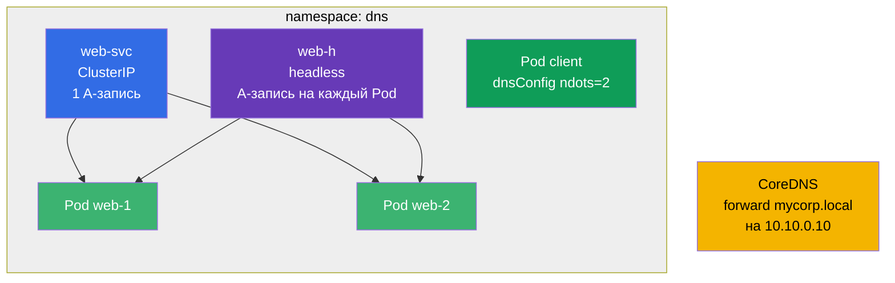

# Lab 125 — DNS и CoreDNS в кластере

## Описание

Отдельный тренажёр по DNS в Kubernetes: A-записи обычного Service, множественные записи
**headless**-сервиса, настройка DNS на уровне Pod (`dnsConfig`, `ndots`) и правка
**CoreDNS** (Corefile) для пересылки корпоративного домена.

Задания короткие и независимые, оформлены в экзаменационном стиле (как реальные вопросы
CKA/CKAD) с автоматической проверкой командой `check_result`.

## Цель

Закрепить материал главы курса:

- [Глава 31. Service изнутри, DNS и CoreDNS](../../course/31/ru.md) — A-записи Service и headless, `dnsConfig`/`ndots`, правка CoreDNS (Corefile)

Смежные главы: [Глава 7. Services](../../course/07/ru.md) — типы Service и Endpoints, [Глава 30. Сеть и CNI](../../course/30/ru.md) — сеть Pods.

## Что мы создаём и зачем

В этой лабе мы собираем набор объектов, на которых видно, как работает DNS в кластере.
Каждый объект показывает свой аспект имён:

| Объект | Что это | Зачем в этой лабе |
|--------|---------|-------------------|
| **Deployment `web`** (2 реплики) | приложение за DNS-именами | источник Pods, на которые указывают записи Service (глава 31) |
| **Service `web-svc`** (ClusterIP) | обычный сервис | даёт одну A-запись `web-svc.dns.svc.cluster.local` на ClusterIP (глава 31) |
| **Service `web-h`** (headless) | `clusterIP: None` | DNS возвращает A-записи на **все** Pods напрямую, без единого VIP (глава 31) |
| **Pod `client`** (`dnsConfig`) | Pod с кастомным резолвингом | задаём `ndots=2`, чтобы сократить лишние DNS-запросы (глава 31) |
| **CoreDNS forward** | правка Corefile | пересылаем домен `mycorp.local` на внешний DNS `10.10.0.10` (глава 31) |
| **JSONPath-выборка** | извлечение поля через API | сохраняем ClusterIP `web-svc` в файл (глава 31) |

Итоговая картина того, что будет развёрнуто:



## Инфраструктура

Окружение разворачивается в AWS (`eu-central-1`) через Terragrunt и состоит из:

| Компонент  | Описание                                                             |
|------------|----------------------------------------------------------------------|
| `vpc`      | VPC `10.10.0.0/16` с публичными подсетями                            |
| `ssh-keys` | SSH-ключи для доступа к нодам                                        |
| `k8s-1`    | Kubernetes `1.35.2` (kubeadm), CNI Calico, одноузловой               |
| `worker`   | Рабочая машина с `kubectl` и `check_result`                         |

Файлы-ответы для JSONPath сохраняются в `/home/ubuntu/answers/`.

Инстансы: `t3.medium` (master) Ubuntu `22.04`. Кластер одноузловой — master
«разтейнчен» (снят taint `control-plane`), поэтому поды планируются прямо на него.

## Развёртывание

```bash
TASK=125 make run_cka_task
```

После создания подключитесь к рабочей машине (worker) по SSH и выполняйте задания
оттуда. `kubectl` уже настроен на контекст `cluster1-admin@cluster1`.

Полезные команды на рабочей машине:

```bash
time_left       # сколько осталось времени
check_result    # проверить решение
```

## Задания

Работа ведётся с рабочей машины `worker` (там `kubectl` и `check_result`).

---
|        **1**        | **Namespace и Deployment**                                  |
| :-----------------: | :----------------------------------------------------------- |
| Что делаем          | Создайте namespace с именем `dns`. В этом namespace создайте Deployment с именем `web`, образ контейнера `viktoruj/ping_pong:latest` (учебный HTTP-сервер на порту `8080`), количество реплик — `2`. У Pods должен быть label `app=web` (у Deployment, созданного через `kubectl create deployment`, этот label ставится автоматически). |
| Критерии приёмки    | - namespace `dns` существует;<br/>- Deployment `web` в namespace `dns` имеет 2 готовые (ready) реплики. |
---
|        **2**        | **ClusterIP Service (обычная A-запись в DNS)**              |
| :-----------------: | :----------------------------------------------------------- |
| Что делаем          | В namespace `dns` создайте Service с именем `web-svc` типа **ClusterIP** (тип по умолчанию), который выбирает Pods Deployment `web` по label `app=web`. Порт Service — `80`, `targetPort` (порт на Pods) — `8080` (HTTP-порт приложения ping_pong). Такой Service получит в кластере DNS-имя `web-svc.dns.svc.cluster.local` с одной A-записью на ClusterIP. |
| Критерии приёмки    | - Service `web-svc` в namespace `dns` существует;<br/>- его Endpoints не пусты (Service нашёл Pods `web`). |
---
|        **3**        | **Headless Service (A-записи на все Pods)**                 |
| :-----------------: | :----------------------------------------------------------- |
| Что делаем          | В namespace `dns` создайте **headless** Service с именем `web-h`: поле `clusterIP` должно быть равно `None`, selector — `app=web`, порт `80`. У headless Service нет единого виртуального IP: DNS-запрос к его имени возвращает IP **всех** Pods напрямую (по A-записи на каждый Pod). |
| Критерии приёмки    | - Service `web-h` в namespace `dns` имеет `clusterIP: None`;<br/>- его Endpoints не пусты (перечислены IP Pods `web`). |
---
|        **4**        | **Pod с кастомной DNS-настройкой (ndots)**                 |
| :-----------------: | :----------------------------------------------------------- |
| Что делаем          | В namespace `dns` создайте Pod с именем `client`, образ `viktoruj/ping_pong:alpine` (тег `alpine` — с shell и утилитами, чтобы можно было `exec` внутрь и проверять DNS: `nslookup`, `wget`). В его spec задайте `dnsConfig` с опцией `ndots` равной `2` (то есть `spec.dnsConfig.options` содержит запись `{name: ndots, value: "2"}`). `dnsPolicy` оставьте `ClusterFirst` (по умолчанию). Это уменьшает число лишних DNS-запросов для внешних имён (см. раздел 31.7 главы). |
| Критерии приёмки    | - Pod `client` в namespace `dns` существует;<br/>- в его spec задана опция `dnsConfig` `ndots=2`. |
---
|        **5**        | **CoreDNS: пересылка отдельного домена**                   |
| :-----------------: | :----------------------------------------------------------- |
| Что делаем          | Отредактируйте ConfigMap `coredns` в namespace `kube-system` и добавьте в Corefile отдельный блок (stub-домен), который **пересылает** (`forward`) все запросы к домену `mycorp.local` на внешний DNS-сервер с адресом `10.10.0.10`. После правки перезапустите Deployment `coredns` (`kubectl -n kube-system rollout restart deployment coredns`), чтобы изменения применились. |
| Критерии приёмки    | - в Corefile (ConfigMap `coredns`) присутствует домен `mycorp.local` и адрес пересылки `10.10.0.10`. |
---
|        **6**        | **JSONPath: сохранить ClusterIP в файл**                   |
| :-----------------: | :----------------------------------------------------------- |
| Что делаем          | С помощью `kubectl ... -o jsonpath` получите ClusterIP сервиса `web-svc` (поле `.spec.clusterIP`) и сохраните **только само значение** (без переносов и лишнего текста) в файл `/home/ubuntu/answers/clusterip.txt`. |
| Критерии приёмки    | - содержимое `/home/ubuntu/answers/clusterip.txt` совпадает с `.spec.clusterIP` сервиса `web-svc`. |
---

## Проверка результата

На рабочей машине запустите автоматическую проверку:

```bash
check_result
```

Скрипт прогонит тесты и покажет, сколько заданий выполнено.

## Решение

Эталонное решение: [worker/files/solutions/1.MD](worker/files/solutions/1.MD)

## Покрытие мок-экзаменов

Домен Services & Networking (20% CKA / 20% CKAD) — DNS: записи Service и headless,
`dnsConfig`/`ndots` на уровне Pod, правка CoreDNS (Corefile) для пересылки домена.

## Удаление кластера и ресурсов

```bash
TASK=125 make delete_cka_task
```
