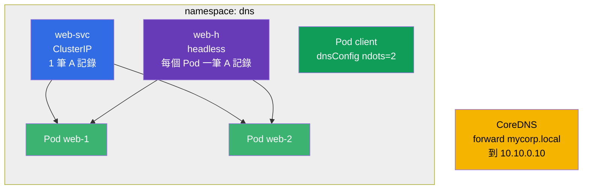

[Русская версия](README_RU.MD) · [Eng version](README.MD) · [Versión en español](README_ES.MD) · [Version française](README_FR.MD) · [Deutsche Version](README_DE.MD) · [ქართული ვერსია](README_GE.MD) · [日本語版](README_JP.MD)

# Lab 125 - 叢集中的 DNS 與 CoreDNS

## 說明

專門針對 Kubernetes DNS 的實作練習:一般 Service 的 A 記錄、**headless**
服務的多筆記錄、Pod 層級的 DNS 設定(`dnsConfig`、`ndots`),以及修改
**CoreDNS**(Corefile)以轉發企業內部網域。

任務簡短且彼此獨立,以考試風格撰寫(就像真正的 CKA/CKAD 題目),並透過
`check_result` 指令自動驗證。

## 目標

鞏固以下課程章節的內容:

- [第 31 章。Service 內部機制、DNS 與 CoreDNS](../../course/31/README.md) - Service 與 headless 的 A 記錄、`dnsConfig`/`ndots`、修改 CoreDNS(Corefile)

相關章節:[第 7 章。Services](../../course/07/README.md) - Service 類型與 Endpoints,[第 30 章。網路與 CNI](../../course/30/README.md) - Pod 網路。

## 我們要建立什麼,以及為什麼

在這個實驗中,我們會組裝一組物件,用它們來觀察叢集中的 DNS 如何運作。
每個物件都展示名稱解析的一個面向:

| 物件 | 這是什麼 | 為什麼出現在這個實驗中 |
|--------|---------|-------------------|
| **Deployment `web`**(2 個副本) | 位於 DNS 名稱背後的應用程式 | 提供 Service 記錄所指向的 Pods(第 31 章) |
| **Service `web-svc`**(ClusterIP) | 一般的 Service | 提供一筆指向 ClusterIP 的 A 記錄 `web-svc.dns.svc.cluster.local`(第 31 章) |
| **Service `web-h`**(headless) | `clusterIP: None` | DNS 直接回傳**所有** Pods 的 A 記錄,沒有單一 VIP(第 31 章) |
| **Pod `client`**(`dnsConfig`) | 具有自訂解析設定的 Pod | 設定 `ndots=2`,以減少多餘的 DNS 查詢(第 31 章) |
| **CoreDNS forward** | 修改 Corefile | 把 `mycorp.local` 網域轉發到外部 DNS `10.10.0.10`(第 31 章) |
| **JSONPath 查詢** | 透過 API 取出欄位 | 把 `web-svc` 的 ClusterIP 儲存到檔案(第 31 章) |

最終部署出來的整體樣貌:



## 基礎架構

環境透過 Terragrunt 部署在 AWS(`eu-central-1`),由以下部分組成:

| 元件       | 說明                                                                 |
|------------|----------------------------------------------------------------------|
| `vpc`      | VPC `10.10.0.0/16`,含公有子網路                                       |
| `ssh-keys` | 用於存取節點的 SSH 金鑰                                                |
| `k8s-1`    | Kubernetes `1.35.2`(kubeadm),CNI Calico,單節點                      |
| `worker`   | 工作機,具備 `kubectl` 與 `check_result`                               |

JSONPath 的答案檔案會儲存在 `/home/ubuntu/answers/`。

執行個體:`t3.medium`(master),Ubuntu `22.04`。叢集為單節點 - master
已解除污點(移除了 `control-plane` taint),因此 Pod 會直接排程到它上面。

## 部署

```bash
TASK=125 make run_cka_task
```

建立完成後,請透過 SSH 連線到工作機(worker),並在那裡完成任務。
`kubectl` 已經指向 `cluster1-admin@cluster1` context。

工作機上的實用指令:

```bash
time_left       # 還剩多少時間
check_result    # 檢查解答
```

## 任務

工作在 `worker` 機器上進行(`kubectl` 與 `check_result` 都在那裡)。

---
|        **1**        | **Namespace 與 Deployment**                                 |
| :-----------------: | :----------------------------------------------------------- |
| 要做什麼            | 建立名為 `dns` 的 namespace。在這個 namespace 中建立名為 `web` 的 Deployment,容器映像為 `viktoruj/ping_pong:latest`(這是一個監聽 `8080` 埠的教學用 HTTP 伺服器),副本數為 `2`。Pods 必須具有 label `app=web`(透過 `kubectl create deployment` 建立的 Deployment 會自動加上這個 label)。 |
| 驗收標準            | - namespace `dns` 存在;<br/>- namespace `dns` 中的 Deployment `web` 有 2 個就緒(ready)副本。 |
---
|        **2**        | **ClusterIP Service(DNS 中一般的 A 記錄)**                 |
| :-----------------: | :----------------------------------------------------------- |
| 要做什麼            | 在 namespace `dns` 中建立名為 `web-svc` 的 **ClusterIP** 類型 Service(預設類型),它透過 label `app=web` 選取 Deployment `web` 的 Pods。Service 的埠為 `80`,`targetPort`(Pods 上的埠)為 `8080`(ping_pong 應用程式的 HTTP 埠)。這樣的 Service 在叢集中會得到 DNS 名稱 `web-svc.dns.svc.cluster.local`,並帶有一筆指向 ClusterIP 的 A 記錄。 |
| 驗收標準            | - namespace `dns` 中有 Service `web-svc`;<br/>- 它的 Endpoints 不為空(Service 找到了 `web` 的 Pods)。 |
---
|        **3**        | **Headless Service(指向所有 Pods 的 A 記錄)**              |
| :-----------------: | :----------------------------------------------------------- |
| 要做什麼            | 在 namespace `dns` 中建立名為 `web-h` 的 **headless** Service:`clusterIP` 欄位必須為 `None`,selector 為 `app=web`,埠為 `80`。headless Service 沒有單一虛擬 IP:對它的名稱進行 DNS 查詢會直接回傳**所有** Pods 的 IP(每個 Pod 一筆 A 記錄)。 |
| 驗收標準            | - namespace `dns` 中的 Service `web-h` 的 `clusterIP: None`;<br/>- 它的 Endpoints 不為空(列出了 `web` 的 Pods IP)。 |
---
|        **4**        | **具有自訂 DNS 設定的 Pod(ndots)**                        |
| :-----------------: | :----------------------------------------------------------- |
| 要做什麼            | 在 namespace `dns` 中建立名為 `client` 的 Pod,映像為 `viktoruj/ping_pong:alpine`(`alpine` 標籤帶有 shell 與工具,方便 `exec` 進入容器檢查 DNS:`nslookup`、`wget`)。在它的 spec 中設定 `dnsConfig`,並讓 `ndots` 選項等於 `2`(也就是 `spec.dnsConfig.options` 中包含 `{name: ndots, value: "2"}` 這一項)。`dnsPolicy` 保持為 `ClusterFirst`(預設值)。這可以減少對外部名稱多餘的 DNS 查詢次數(參見該章的 31.7 節)。 |
| 驗收標準            | - namespace `dns` 中有 Pod `client`;<br/>- 它的 spec 中設定了 `dnsConfig` 選項 `ndots=2`。 |
---
|        **5**        | **CoreDNS:轉發特定網域**                                   |
| :-----------------: | :----------------------------------------------------------- |
| 要做什麼            | 編輯 namespace `kube-system` 中的 ConfigMap `coredns`,在 Corefile 中加入一個獨立區塊(stub 網域),把所有對 `mycorp.local` 網域的查詢**轉發**(`forward`)到位於 `10.10.0.10` 的外部 DNS 伺服器。修改完成後,重新啟動 `coredns` Deployment(`kubectl -n kube-system rollout restart deployment coredns`),讓變更生效。 |
| 驗收標準            | - Corefile(ConfigMap `coredns`)中含有網域 `mycorp.local` 以及轉發位址 `10.10.0.10`。 |
---
|        **6**        | **JSONPath:把 ClusterIP 寫入檔案**                         |
| :-----------------: | :----------------------------------------------------------- |
| 要做什麼            | 使用 `kubectl ... -o jsonpath` 取得 `web-svc` 服務的 ClusterIP(`.spec.clusterIP` 欄位),並**只把該值本身**(不含換行或多餘文字)儲存到檔案 `/home/ubuntu/answers/clusterip.txt`。 |
| 驗收標準            | - `/home/ubuntu/answers/clusterip.txt` 的內容與 `web-svc` 服務的 `.spec.clusterIP` 相符。 |
---

## 檢查結果

在工作機上執行自動檢查:

```bash
check_result
```

腳本會跑完測試,並顯示已完成多少任務。

## 解答

參考解答:[worker/files/solutions/1_TW.MD](worker/files/solutions/1_TW.MD)

## 模擬考涵蓋範圍

Services & Networking 領域(CKA 20% / CKAD 20%)- DNS:Service 與 headless 的記錄、
Pod 層級的 `dnsConfig`/`ndots`、修改 CoreDNS(Corefile)以轉發網域。

## 刪除叢集與資源

```bash
TASK=125 make delete_cka_task
```
