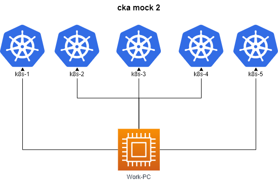

# Allowed resources

## **Kubernetes Documentation:**

https://kubernetes.io/docs/ and their subdomains

https://kubernetes.io/blog/ and their subdomains

This includes all available language translations of these pages (e.g. https://kubernetes.io/zh/docs/)

- run ``time_left`` on work pc to **check time**
- run ``check_result`` on work pc to **check result**

## Questions

|        **1**        | find a pod in `dev-1` namespace with labels `team=finance` and maximum memory usage . Add label `usage=max` to it        |
| :-----------------: |:-----------------------------------------------------------------------------------------------------------------------|
|     Task weight     | 4%                                                                                                                     |
|       Cluster       | cluster1 (`kubectl config use-context cluster1-admin@cluster1`)                                                        |
| Acceptance criteria | - pod from `dev-1`  NS    - with label `team=finance`   -  has max memory usage    - has label `usage=max` |
---
|        **2**        | Deploy a `util` pod using the `busybox:1.36` image in the `dev` namespace. Use `sleep 3600 command` to keep it running. |
| :-----------------: |:-----------------------------------------------------------------------------------------------------------------------|
|     Task weight     | 1%                                                                                                                     |
|       Cluster       | cluster1 (`kubectl config use-context cluster1-admin@cluster1`)                                                        |
| Acceptance criteria | - Pod Name: `util`   - Namespace: `dev`   - Image: `busybox:1.36`  - Commands: `sleep 3600`                 |
---
|        **3**        | Create a `namespace` named `team-elephant`                                       |
| :-----------------: |:--------------------------------------------------------------------------------|
|     Task weight     | 1%                                                                              |
|       Cluster       | cluster1 (`kubectl config use-context cluster1-admin@cluster1`)                 |
| Acceptance criteria | - Namespace: `team-elephant`   Namespace is present in the namespaces list. |
---
|        **4**        | Create pod `alpine` with image `alpine:3.15` and and command `sleep 6000` . Make sure the pod  is running on node with label `disk=ssd`. |
| :-----------------: |:-----------------------------------------------------------------------------------------------------------------------------------------|
|     Task weight     | 2%                                                                                                                                       |
|       Cluster       | cluster1 (`kubectl config use-context cluster1-admin@cluster1`)                                                                          |
| Acceptance criteria | - Pod is running on the node with label disk=ssd.                                                                                        |
---
|        **5**        | Create deployment `web-app` with image `viktoruj/ping_pong:latest` and `2` replicas. Container port should be configured on port `8080` and named `http-web`.         |
| :-----------------: |:---------------------------------------------------------------------------------------------------------------------------------------------------------------------|
|     Task weight     | 2%                                                                                                                                                                   |
|       Cluster       | cluster1 (`kubectl config use-context cluster1-admin@cluster1`)                                                                                                      |
| Acceptance criteria | - Deployment name: `web-app`  - Image: `viktoruj/ping_pong:latest`  - Replicas: `2`  Deployment pods are running, containers' ports 8080 named http-web. |
---
|        **6**        | Create a service `web-app-svc` in namespace `dev-2` to expose the `web-app` deployment on port `8080` on cluster nodes.                                                                               |
| :-----------------: |:------------------------------------------------------------------------------------------------------------------------------------------------------------------------------------------------------|
|     Task weight     | 3%                                                                                                                                                                                                    |
|       Cluster       | cluster1 (`kubectl config use-context cluster1-admin@cluster1`)                                                                                                                                       |
| Acceptance criteria | - Use imperative commands to create mainifest.   -  namespace `dev-2`   - Service: `web-app-svc` - Port: `8080`  - Type: `NodePort` - Use the right labels to select targer port. |
---
|        **7**        | Create a pod `web-srv` based on image `viktoruj/ping_pong:latest` in the default namespace. The container in the pod should named `app1`.|
| :-----------------: |:--------------------------------------------------------------------------------------------------------------------------------------|
|     Task weight     | 1%                                                                                                                                    |
|       Cluster       | cluster1 (`kubectl config use-context cluster1-admin@cluster1`)                                                                       |
| Acceptance criteria | - Pod name: `web-srv` - Image: `viktoruj/ping_pong:latest` - Container name: `app1`                                           |
---
|        **8**        | 2 pods are running in the namespace `db-redis` named `redis-node-xxxx`. You need to scale down number of replicas to `1`. |
| :-----------------: |:--------------------------------------------------------------------------------------------------------------------------|
|     Task weight     | 1%                                                                                                                        |
|       Cluster       | cluster1 (`kubectl config use-context cluster1-admin@cluster1`)                                                           |
| Acceptance criteria | - Name: `redis-node-xxxx` - Number of pods running: 1   - Nuber of pods is scaled down to 1.                  |
---
|        **9**        | Write cli commands with  shows pods from `dev-2` namespace in  `json` format . script is  located  `/var/work/artifact/9.sh` |
| :-----------------: |:-----------------------------------------------------------------------------------------------------------------------------------|
|     Task weight     | 1%                                                                                                                                 |
|       Cluster       | cluster1 (`kubectl config use-context cluster1-admin@cluster1`)                                                                    |
| Acceptance criteria | - script shows pods from `dev-2` namespace in json format   - script is  located  `/var/work/artifact/9.sh`                    |
---
|       **10**        | **Create a Persistent Volume with the given specification. Run pod with pv.**                                                                                                                                                                                                                                                          |
|:-------------------:|:---------------------------------------------------------------------------------------------------------------------------------------------------------------------------------------------------------------------------------------------------------------------------------------------------------------------------------------|
|     Task weight     | 8%                                                                                                                                                                                                                                                                                                                                     |
|       Cluster       | cluster1 (`kubectl config use-context cluster1-admin@cluster1`)                                                                                                                                                                                                                                                                        |
| Acceptance criteria | - Volume name: `pv-analytics` - pvc name: `pvc-analytics` - Storage: `100Mi` - Access mode: `ReadWriteOnce` - Host path: `/pv/analytics`  - pod name: `analytics` - image: `busybox` - node: `nodeSelector` -  node_name: `node_2` - command: `"sleep 60000"` - mountPath: `/pv/analytics` |
---
|       **11**        | **Update Kubernetes cluster.**                                                                                                                                   |
|:-------------------:|:-----------------------------------------------------------------------------------------------------------------------------------------------------------------|
|     Task weight     | 7%                                                                                                                                                               |
|       Cluster       | cluster2 (`kubectl config use-context cluster2-admin@cluster2`)                                                                                                  |
| Acceptance criteria | - The cluster is running Kubernetes 1.28.0, update it to 1.28.4 . - Use apt package manager and kubeadm for this. - Use ssh to connect to the instances. |
---
|       **12**        | **Create new ingress resource to the service. Make it available at the path `/cat`**                                                                                   |
|:-------------------:|:-----------------------------------------------------------------------------------------------------------------------------------------------------------------------|
|     Task weight     | 4%                                                                                                                                                                     |
|       Cluster       | cluster1 (`kubectl config use-context cluster1-admin@cluster1`)                                                                                                        |
| Acceptance criteria | - NameSpace: cat  - service: cat   - Annotation: `nginx.ingress.kubernetes.io/rewrite-target: /` - path: `/cat`   - check ` curl cka.local:30102/cat ` |
---
|        **13**        | In the Namespace `team-elephant` create a new ServiceAccount `pod-sa`. Assing an account permissions to `list and get` `pods` using Role `pod-sa-role`  and RoleBinding `pod-sa-roleBinding`                                                                                            |
| :-----------------: |:----------------------------------------------------------------------------------------------------------------------------------------------------------------------------------------------------------------------------------------------------------------------------------------|
|     Task weight     | 8%                                                                                                                                                                                                                                                                                      |
|       Cluster       | cluster1 (`kubectl config use-context cluster1-admin@cluster1`)                                                                                                                                                                                                                         |
| Acceptance criteria | - Namespace `team-elephant`   - ServiceAccount `pod-sa`   - Role `pod-sa-role` :  resource `pods` ,  verb : `list and get`   -RoleBinding `pod-sa-roleBinding`    -   create pod `pod-sa` image = `viktoruj/cks-lab`, command = `sleep 60000`,  ServiceAccount `pod-sa` |
---
|        **14**       | Create a **DaemonSet** named **team-elephant-ds**  with the requested parameters                                                                                                                                                                                                       |
| :-----------------: |:---------------------------------------------------------------------------------------------------------------------------------------------------------------------------------------------------------------------------------------------------------------------------------------|
|     Task weight     | 5%                                                                                                                                                                                                                                                                                     |
|       Cluster       | cluster1 (`kubectl config use-context cluster1-admin@cluster1`)                                                                                                                                                                                                                        |
| Acceptance criteria | - DaemonSet: `team-elephant-ds`  - Namespace: `team-elephant`  - Image: `viktoruj/ping_pong`  - Labels: `team=team-elephant`, `env=dev`   - requests CPU: `50m`  - requests  Memory: `50Mi`  - Pods are running on **all nodes**, including **control plane**. |
---
|        **15**        | You have a legacy app in a `legacy` namespace . The application contains 2 containers . The first container writes log files to `/log/logs1.txt` . The second container `/log/logs2.txt` . you need to add another container `log` that will collect logs from these containers and send them to stdout .                                                                                                                                                                                                                                                                               |
| :-----------------: |:----------------------------------------------------------------------------------------------------------------------------------------------------------------------------------------------------------------------------------------------------------------------------------------------------------------------------------------------------------------------------------------------------------------------------------------------------------------------------------------------------------------------------------------------------------------------------------------|
|     Task weight     | 6%                                                                                                                                                                                                                                                                                                                                                                                                                                                                                                                                                                                      |
|       Cluster       | cluster1 (`kubectl config use-context cluster1-admin@cluster1`)                                                                                                                                                                                                                                                                                                                                                                                                                                                                                                                         |
| Acceptance criteria | - volule : name `logs` , type `emptyDir` , sizeLimit `500Mi` :   - Containers `app1`,`app2` , `log`  have /log to `/log`   - log container : name `log`, Image: `viktoruj/cks-lab`, command `tail -f -n 100 /log/logs1.txt -f /log/logs2.txt`   - check logs from app1 container : `k exec  checker -n legacy -- sh -c 'curl legacy-app:8081/test_app1'` ; `k logs  -l app=legacy-app  -n legacy  -c log`    - check logs from app2 container :  `k exec  checker -n legacy -- sh -c 'curl legacy-app:8082/test_app2'` ; `k logs  -l app=legacy-app  -n legacy  -c log` |
---
|        **16**        | Write cli commands with  shows the latest events in the whole cluster, ordered by creation time `metadata.creationTimestamp`. |
| :-----------------: |:-----------------------------------------------------------------------------------------------------------------------------|
|     Task weight     | 2%                                                                                                                           |
|       Cluster       | cluster1 (`kubectl config use-context cluster1-admin@cluster1`)                                                              |
| Acceptance criteria | - Events ordered by creation time   - script is  located  `/var/work/artifact/16.sh`                                              |
---
|        **17**        | Write cli commands with show  names of all namespaced api resources in Kubernetes cluster            |
| :-----------------: |:-----------------------------------------------------------------------------------------------------|
|     Task weight     | 1%                                                                                                   |
|       Cluster       | cluster1 (`kubectl config use-context cluster1-admin@cluster1`)                                      |
| Acceptance criteria | - show  names of all namespaced api resources   - script is  located  `/var/work/artifact/17.sh` |
---
|        **18**        | cluster3 seems to have an issue - one of node is not joined. It also might be outdated, so make sure it is running same Kubernetes version as control plane. You should fix the issue. |
| :-----------------: |:---------------------------------------------------------------------------------------------------------------------------------------------------------------------------------------|
|     Task weight     | 4%                                                                                                                                                                                     |
|       Cluster       | cluster3 (`kubectl config use-context cluster3-admin@cluster3`)                                                                                                                        |
| Acceptance criteria | - k8s3_node_node_2 is running the same Kubernetes version as control plane, rejoined to the cluster and is in Ready status.                                                            |
---
|        **19**        | Create static pod `stat-pod` in the `default` namespace. Expose it via service `stat-pod-svc`.                                                                                                                                                                                   |
| :-----------------: |:---------------------------------------------------------------------------------------------------------------------------------------------------------------------------------------------------------------------------------------------------------------------------------|
|     Task weight     | 4%                                                                                                                                                                                                                                                                               |
|       Cluster       | cluster1 (`kubectl config use-context cluster1-admin@cluster1`)                                                                                                                                                                                                                  |
| Acceptance criteria | - Pod name: `stat-podv` - Image: `viktoruj/ping_pong:latest`  - requests  CPU: `100m`  - requests  Memory: `128Mi`   - app port `8080`   - Service name: `stat-pod-svc`  - Service type: `NodePort`   - NodePort: `30084`    - Pod is accessible from control plane node.  
---
|        **20**        | Backup etcd and save it on the control plane node at `/var/work/tests/artifacts/20/etcd-backup.db` . Restore etcd from `/var/work/tests/artifacts/20/etcd-backup_old.db` on control plane node . |
| :-----------------: |:-------------------------------------------------------------------------------------------------------------------------------------------------------------------------------------------------|
|     Task weight     | 6%                                                                                                                                                                                               |
|       Cluster       | cluster4 (`kubectl config use-context cluster4-admin@cluster4`)                                                                                                                                  |
| Acceptance criteria | - backup etcd to `/var/work/tests/artifacts/20/etcd-backup.db`    - restore etcd from `/var/work/tests/artifacts/20/etcd-backup_old.db`   - pods are ready in `kube-system` namespace    |
---
|       **21**        | **Network policy.**                                                                                                                                                                                                                                                                                                                                  |
|:-------------------:|:-----------------------------------------------------------------------------------------------------------------------------------------------------------------------------------------------------------------------------------------------------------------------------------------------------------------------------------------------------|
|     Task weight     | 6%                                                                                                                                                                                                                                                                                                                                                   |
|       Cluster       | cluster5 (`kubectl config use-context cluster5-admin@cluster5`)                                                                                                                                                                                                                                                                                      |
| Acceptance criteria | - create default deny ingress policy in `prod-db` NS - create policy with allow connections from `prod` Namespaces to `prod-db` - create policy with allow connections from `stage` Namespaces and have label: `role=db-connect` - create policy with allow connections from `any` Namespaces and have label: `role=db-external-connect` |
---
