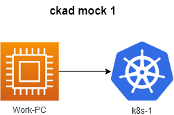

# Allowed resources

## **Kubernetes Documentation:**

<https://kubernetes.io/docs/> and their subdomains

<https://kubernetes.io/blog/> and their subdomains

<https://helm.sh/> and their subdomains

This includes all available language translations of these pages (e.g. <https://kubernetes.io/zh/docs/>)

- run ``time_left`` on work pc to **check time**
- run ``check_result`` on work pc to **check result**

## Questions

|        **1**        | **Deploy a pod named webhttpd**                                                |
| :-----------------: | :----------------------------------------------------------------------------- |
|     Task weight     | 1%                                                                             |
|       Cluster       | cluster1 (`kubectl config use-context cluster1-admin@cluster1`)                |
| Acceptance criteria | - Name: `webhttpd`  - Image: `httpd:alpine` - Namespace: `apx-z993845` |
---
|        **2**        | **Create a new Deployment named `nginx-app`**                                   |
| :-----------------: | :------------------------------------------------------------------------------ |
|     Task weight     | 1%                                                                              |
|       Cluster       | cluster1 (`kubectl config use-context cluster1-admin@cluster1`)                 |
| Acceptance criteria | - Deployment: `nginx-app`  - Image: `nginx:alpine-slim` - Replicas: `2` |
---
|        **3**        | **Create secret and  create pod with  environment variable  from secret .**                                                                                                                                  |
| :-----------------: | :----------------------------------------------------------------------------------------------------------------------------------------------------------------------------------------------------------- |
|     Task weight     | 4%                                                                                                                                                                                                           |
|       Cluster       | cluster1 (`kubectl config use-context cluster1-admin@cluster1`)                                                                                                                                              |
| Acceptance criteria | - secret: ns=`dev-db` name=`dbpassword` key=`pwd` value=`my-secret-pwd`   - pod: ns=`dev-db` name=`db-pod` image=`mysql:8.0` env.name=`MYSQL_ROOT_PASSWORD` env.value=from secret `dbpassword` key=`pwd` |
---
|        **4**        | **Fix replicaset `rs-app2223` in namespace `rsapp`**            |
| :-----------------: | :-------------------------------------------------------------- |
|     Task weight     | 2%                                                              |
|       Cluster       | cluster1 (`kubectl config use-context cluster1-admin@cluster1`) |
| Acceptance criteria | - ReplicaSet has 2 Ready replicas.                              |
---
|        **5**        | **Create deployment  `msg`  and service `msg-service`**                                                                                                                                                                         |
| :-----------------: | :------------------------------------------------------------------------------------------------------------------------------------------------------------------------------------------------------------------------------ |
|     Task weight     | 2%                                                                                                                                                                                                                              |
|       Cluster       | cluster1 (`kubectl config use-context cluster1-admin@cluster1`)                                                                                                                                                                 |
| Acceptance criteria | - Deployment : ns=`messaging` name=`msg` image=`redis` replicas=`2`   - Service: name=`msg-service` Port=`6379` Namespace=`messaging` deployment=`msg`  - Use the right type of Service   - Use imperative commands |
---
|        **6**        | **Update the environment variable on the pod text-printer.**                                                 |
| :-----------------: | :----------------------------------------------------------------------------------------------------------- |
|     Task weight     | 1%                                                                                                           |
|       Cluster       | cluster1 (`kubectl config use-context cluster1-admin@cluster1`)                                              |
| Acceptance criteria | - Change the value of the environment variable to `GREEN` - Ensure that the logs of the pod was updated. |
---
|        **7**        | **Run pod `appsec-pod` with `ubuntu:22.04` image as root user and with SYS_TIME capability.**                                                              |
| :-----------------: | :--------------------------------------------------------------------------------------------------------------------------------------------------------- |
|     Task weight     | 4%                                                                                                                                                         |
|       Cluster       | cluster1 (`kubectl config use-context cluster1-admin@cluster1`)                                                                                            |
| Acceptance criteria | - Pod name: `appsec-pod`  - Image: `ubuntu:22.04` - Command: `sleep 4800` - Container user: `root` - Allow container capability `SYS_TIME` |
---
|        **8**        | **Export the logs of the pod `app-xyz3322` to a file located at `/opt/logs/app-xyz123.log`. The pod is located in a different namespace. First, identify the namespace where the pod is running.** |
| :-----------------: | :------------------------------------------------------------------------------------------------------------------------------------------------------------------------------------------------- |
|     Task weight     | 1%                                                                                                                                                                                                 |
|       Cluster       | cluster1 (`kubectl config use-context cluster1-admin@cluster1`)                                                                                                                                    |
| Acceptance criteria | - Logs at `/opt/logs/app-xyz123.log`                                                                                                                                                               |
---
|        **9**        | **Add a taint to the node with label work_type=redis. Create a pod  with toleration.**                                                                                                                                                                            |
| :-----------------: | :---------------------------------------------------------------------------------------------------------------------------------------------------------------------------------------------------------------------------------------------------------------- |
|     Task weight     | 4%                                                                                                                                                                                                                                                                |
|       Cluster       | cluster1 (`kubectl config use-context cluster1-admin@cluster1`)                                                                                                                                                                                                   |
| Acceptance criteria | - Tains node with label `work_type=redis` :     key: `app_type`, value: `alpha`, effect: `NoSchedule` - Create a pod called `alpha`, `image: redis` with toleration to node01. - node01 with the correct taint? Pod alpha has the correct toleration? |
---
|       **10**        | **Apply a label `app_type=beta` to node controlplane. Create a new deployment called `beta-apps` with `image: nginx` and `replicas: 3`. Run  PODs on controlplane only.**             |
| :-----------------: | :------------------------------------------------------------------------------------------------------------------------------------------------------------------------------------ |
|     Task weight     | 4%                                                                                                                                                                                    |
|       Cluster       | cluster1 (`kubectl config use-context cluster1-admin@cluster1`)                                                                                                                       |
| Acceptance criteria | - controlplane has the labels `app_type=beta` - Deployment `beta-apps`  - Pods of deployment are running only on controlplane? - Deployment beta-apps has 3 pods running? |
---
|       **11**        | **Create new ingress resource to the service. Make it available at the path `/cat`**                                                                                    |
| :-----------------: | :---------------------------------------------------------------------------------------------------------------------------------------------------------------------- |
|     Task weight     | 4%                                                                                                                                                                      |
|       Cluster       | cluster1 (`kubectl config use-context cluster1-admin@cluster1`)                                                                                                         |
| Acceptance criteria | - NameSpace: cat  - service: cat   - Annotation: `nginx.ingress.kubernetes.io/rewrite-target: /` - path: `/cat`   - check ` curl ckad.local:30102/cat ` |
---
|       **12**        | **Create a new pod called `nginx1233` in the `web-ns` namespace with the image `nginx`. Add a livenessProbe to the container to restart it if the command `ls /var/www/html/` probe fails. This check should start after a delay of 10 seconds and run every 60 seconds.** |
| :-----------------: | :------------------------------------------------------------------------------------------------------------------------------------------------------------------------------------------------------------------------------------------------------------------------- |
|     Task weight     | 2%                                                                                                                                                                                                                                                                         |
|       Cluster       | cluster1 (`kubectl config use-context cluster1-admin@cluster1`)                                                                                                                                                                                                            |
| Acceptance criteria | - You may delete and recreate the object. Ignore the warnings from the probe. - Pod: `nginx1233`, namespace: `web-ns`, image `nginx`,  livenessProbe?                                                                                                                  |
---
|       **13**        | **Create a job with the image busybox and name hi-job that executes the command 'echo hello world'.**                                                 |
| :-----------------: | :---------------------------------------------------------------------------------------------------------------------------------------------------- |
|     Task weight     | 3%                                                                                                                                                    |
|       Cluster       | cluster1 (`kubectl config use-context cluster1-admin@cluster1`)                                                                                       |
| Acceptance criteria | - Job name: `hi-job`   - Image: `busybox` - Command: `echo hello world` - completions: 3 - backoffLimit: 6 - RestartPolicy: Never |
---
|       **14**        | **Create a pod called `multi-pod` with two containers.**                                                                                                                                                                                             |
| :-----------------: | :--------------------------------------------------------------------------------------------------------------------------------------------------------------------------------------------------------------------------------------------------- |
|     Task weight     | 4%                                                                                                                                                                                                                                                   |
|       Cluster       | cluster1 (`kubectl config use-context cluster1-admin@cluster1`)                                                                                                                                                                                      |
| Acceptance criteria | container 1:    - name: `alpha`, image: `nginx:alpine-slim`     - environment variable: `type: alpha` container 2:     - name: `beta`, image: `busybox`     - command: `sleep 4800`     - environment variable: `type: beta` |
---
|       **15**        | **Create a Persistent Volume with the given specification. Run pod with pv.**                                                                                                                                                                                                                                                          |
| :-----------------: | :------------------------------------------------------------------------------------------------------------------------------------------------------------------------------------------------------------------------------------------------------------------------------------------------------------------------------------- |
|     Task weight     | 8%                                                                                                                                                                                                                                                                                                                                     |
|       Cluster       | cluster1 (`kubectl config use-context cluster1-admin@cluster1`)                                                                                                                                                                                                                                                                        |
| Acceptance criteria | - Volume name: `pv-analytics` - pvc name: `pvc-analytics` - Storage: `100Mi` - Access mode: `ReadWriteOnce` - Host path: `/pv/analytics`  - pod name: `analytics` - image: `busybox` - node: `nodeSelector` -  node_name: `node_2` - command: `"sleep 60000"` - mountPath: `/pv/analytics` |
---
|       **16**        | **Create a CustomResourceDefinition definition and then apply it to the cluster**                                                                                                                                                                           |
| :-----------------: | :---------------------------------------------------------------------------------------------------------------------------------------------------------------------------------------------------------------------------------------------------------- |
|     Task weight     | 6%                                                                                                                                                                                                                                                          |
|       Cluster       | cluster1 (`kubectl config use-context cluster1-admin@cluster1`)                                                                                                                                                                                             |
| Acceptance criteria | - Name: `operators.stable.example.com` - Group : `stable.example.com` - Schema: `<email: string><name: string><age: integer>` - Scope: `Namespaced` - Names: `<plural: operators><singular: operator><shortNames: op>` Kind: `Operator` |
---
|       **17**        | **Write two cli commands to get the top  nodes and top pods  in all namespaces sorted by CPU utilization level. Place these shell commands in the necessary files.**        |
| :-----------------: | :-------------------------------------------------------------------------------------------------------------------------------------------------------------------------- |
|     Task weight     | 2 %                                                                                                                                                                         |
|       Cluster       | cluster1 (`kubectl config use-context cluster1-admin@cluster1`)                                                                                                             |
| Acceptance criteria | - Get top nodes and save the command to get this info to `/opt/18/nodes.txt` - Get pods utilization and sort them by CPU consumtion. Save command to `/opt/18/pods.txt` |
---
|       **18**        | **Add prometheus helm repo and install prometheus chart to the cluster.**                                                                                                                                                                                                        |
| :-----------------: | :------------------------------------------------------------------------------------------------------------------------------------------------------------------------------------------------------------------------------------------------------------------------------- |
|     Task weight     | 4%                                                                                                                                                                                                                                                                               |
|       Cluster       | cluster1 (`kubectl config use-context cluster1-admin@cluster1`)                                                                                                                                                                                                                  |
| Acceptance criteria | - Add repo `prometheus-community` `https://prometheus-community.github.io/helm-charts` - Install prometheus from the helm chart to kubernetes cluster     - Release name: `prom`, namespace: `monitoring` - helm chart: `prometheus-community/kube-prometheus-stack` |
---
