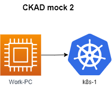

# Allowed resources

## **Kubernetes Documentation:**

<https://kubernetes.io/docs/> and their subdomains

<https://kubernetes.io/blog/> and their subdomains

<https://helm.sh/> and their subdomains

This includes all available language translations of these pages (e.g. <https://kubernetes.io/zh/docs/>)

- run ``time_left`` on work pc to **check time**
- run ``check_result`` on work pc to **check result**

## Questions

|        **1**        | Create a secret **secret1** with value **key1=value1** in the namespace **jellyfish**. Add that secret as an environment variable to an existing **pod1** in the same namespace. |
| :-----------------: |:---------------------------------------------------------------------------------------------------------------------------------------------------------------------------------|
|     Task weight     | 2%                                                                                                                                                                               |
|       Cluster       | cluster1 (`kubectl config use-context cluster1-admin@cluster1`)                                                                                                                  |
| Acceptance criteria | - Name: `secret1`  - key1: `value1` - Namespace: `jellyfish`   - pod env name: `PASSWORD`  from  secret `secret1` and key `key1`                                     |

|        **2**        | Create a cron job `cron-job1`                                                                                                                                                                                                                                                                         |
|:-------------------:|:------------------------------------------------------------------------------------------------------------------------------------------------------------------------------------------------------------------------------------------------------------------------------------------------------|
|     Task weight     | 4%                                                                                                                                                                                                                                                                                                    |
|       Cluster       | cluster1 (`kubectl config use-context cluster1-admin@cluster1`)                                                                                                                                                                                                                                       |
| Acceptance criteria | - name: `cron-job1`  - namespace: `rnd`   - image: `viktoruj/ping_pong:alpine`  -  Concurrency policy: `Forbid`  -  command: `echo "Hello from CKAD mock"`   -  run every 15 minutes  - tolerate 4 failures  - completions 3 times  -  imagePullPolicy `IfNotPresent` |

|        **3**        | There is deployment `my-deployment` in the namespace `baracuda` . Rollback deployment  to 1-st version . Scale deployment to 3 replicas. |
| :-----------------: |:-----------------------------------------------------------------------------------------------------------------------------------------|
|     Task weight     | 2%                                                                                                                                       |
|       Cluster       | cluster1 (`kubectl config use-context cluster1-admin@cluster1`)                                                                          |
| Acceptance criteria | - Rollback deployment  to 1-st version  - Scale deployment to 3 replicas                                                             |

|        **4**        | Create deployment  `shark-app` in the `shark` namespace.                                                                                                 |
| :-----------------: |:---------------------------------------------------------------------------------------------------------------------------------------------------------|
|     Task weight     | 2%                                                                                                                                                       |
|       Cluster       | cluster1 (`kubectl config use-context cluster1-admin@cluster1`)                                                                                          |
| Acceptance criteria | - Name: `shark-app`  - namespace `shark`   - Image: `viktoruj/ping_pong` - container port `8080`  - Environment variable `ENV1` = `8080` |

|        **5**        | Build container image using given manifest `/var/work/5/Dockerfile`. Podman is instaled on Worker-PC  |
| :-----------------: |:------------------------------------------------------------------------------------------------------|
|     Task weight     | 2%                                                                                                    |
|       Cluster       | cluster1 (`kubectl config use-context cluster1-admin@cluster1`)                                       |
| Acceptance criteria | - Image Name: `ckad`  - Tag: `0.0.1` - export image in oci-archive  to `/var/work/5/ckad.tar` |

|        **6**        | Update `sword-app` deployment in the `swordfish` namespace                                         |
| :-----------------: |:---------------------------------------------------------------------------------------------------|
|     Task weight     | 2%                                                                                                 |
|       Cluster       | cluster1 (`kubectl config use-context cluster1-admin@cluster1`)                                    |
| Acceptance criteria | - user with ID `5000`on  container level    - restrict privilege escalation on container level |

|        **7**        | There are deployment, service and the ingress  in  `meg` namespace . user can't access to the app `http://ckad.local:30102/app` . Please fix it . |
| :-----------------: |:--------------------------------------------------------------------------------------------------------------------------------------------------|
|     Task weight     | 6%                                                                                                                                                |
|       Cluster       | cluster1 (`kubectl config use-context cluster1-admin@cluster1`)                                                                                   |
| Acceptance criteria | - ` curl http://ckad.local:30102/app ` works.                                                                                                     |

|        **8**        | There is a pod `web-app` in namespace `tuna`. Web-app should be able to communicate to pod with label `type=db` and pod label `type=backend` .Network policies have already been created, don't modify them |
| :-----------------: |:------------------------------------------------------------------------------------------------------------------------------------------------------------------------------------------------------------|
|     Task weight     | 1%                                                                                                                                                                                                          |
|       Cluster       | cluster1 (`kubectl config use-context cluster1-admin@cluster1`)                                                                                                                                             |
| Acceptance criteria | - pods  can communicate                                                                                                                                                                                     |

|        **9**        | Deployment main-app in a salmon namespace, has 3 replicas. It is published via main-app-svc service. Create canary deployment canary-app similar to main-app deployment. main-app deployment file is here: /path/to/deployment.yaml.Make sure that deployment is receiving 20% of the traffic. Keep in mind that salmon namespace only allows 8 pod running. |
| :-----------------: |:-------------------------------------------------------------------------------------------------------------------------------------------------------------------------------------------------------------------------------------------------------------------------------------------------------------------------------------------------------------|
|     Task weight     | 1%                                                                                                                                                                                                                                                                                                                                                           |
|       Cluster       | cluster1 (`kubectl config use-context cluster1-admin@cluster1`)                                                                                                                                                                                                                                                                                              |
| Acceptance criteria |                                                                                                                                                                                                                                                                               |

---
|       **15**        | **Create a Persistent Volume with the given specification. Run pod with pv.**                                                                                                                                                                                                                                                          |
|:-------------------:|:---------------------------------------------------------------------------------------------------------------------------------------------------------------------------------------------------------------------------------------------------------------------------------------------------------------------------------------|
|     Task weight     | 8%                                                                                                                                                                                                                                                                                                                                     |
|       Cluster       | cluster1 (`kubectl config use-context cluster1-admin@cluster1`)                                                                                                                                                                                                                                                                        |
| Acceptance criteria | - Volume name: `pv-analytics` - pvc name: `pvc-analytics` - Storage: `100Mi` - Access mode: `ReadWriteOnce` - Host path: `/pv/analytics`  - pod name: `analytics` - image: `busybox` - node: `nodeSelector` -  node_name: `node_2` - command: `"sleep 60000"` - mountPath: `/pv/analytics` |
---
|        **3**        | **Create secret from file .  create doployment  , mount the secret as a file **                                                                                                                              |
| :-----------------: |:-------------------------------------------------------------------------------------------------------------------------------------------------------------------------------------------------------------|
|     Task weight     | 4%                                                                                                                                                                                                           |
|       Cluster       | cluster1 (`kubectl config use-context cluster1-admin@cluster1`)                                                                                                                                              |
| Acceptance criteria | - secret: ns=`dev-db` name=`dbpassword` key=`pwd` value=`my-secret-pwd`   - pod: ns=`dev-db` name=`db-pod` image=`mysql:8.0` env.name=`MYSQL_ROOT_PASSWORD` env.value=from secret `dbpassword` key=`pwd` |
---
|        **8**        | **Export the logs of the pod `app-xyz3322` to a file located at `/opt/logs/app-xyz123.log`. The pod is located in a different namespace. First, identify the namespace where the pod is running.** |
| :-----------------: | :------------------------------------------------------------------------------------------------------------------------------------------------------------------------------------------------- |
|     Task weight     | 1%                                                                                                                                                                                                 |
|       Cluster       | cluster1 (`kubectl config use-context cluster1-admin@cluster1`)                                                                                                                                    |
| Acceptance criteria | - Logs at `/opt/logs/app-xyz123.log`                                                                                                                                                               |
---
|       **12**        | **Create a new pod called `nginx1233` in the `web-ns` namespace with the image `nginx`. Add a livenessProbe to the container to restart it if the command `ls /var/www/html/` probe fails. This check should start after a delay of 10 seconds and run every 60 seconds.** |
| :-----------------: |:---------------------------------------------------------------------------------------------------------------------------------------------------------------------------------------------------------------------------------------------------------------------------|
|     Task weight     | 2%                                                                                                                                                                                                                                                                         |
|       Cluster       | cluster1 (`kubectl config use-context cluster1-admin@cluster1`)                                                                                                                                                                                                            |
| Acceptance criteria | - You may delete and recreate the object. Ignore the warnings from the probe. - Pod: `nginx1233`, namespace: `web-ns`, image `nginx`,  livenessProbe?                                                                                                                  |

---
|       **18**        | **Add prometheus helm repo and install prometheus chart to the cluster.**                                                                                                                                                                                                        |
| :-----------------: |:---------------------------------------------------------------------------------------------------------------------------------------------------------------------------------------------------------------------------------------------------------------------------------|
|     Task weight     | 4%                                                                                                                                                                                                                                                                               |
|       Cluster       | cluster1 (`kubectl config use-context cluster1-admin@cluster1`)                                                                                                                                                                                                                  |
| Acceptance criteria | - Add repo `prometheus-community` `https://prometheus-community.github.io/helm-charts` - Install prometheus from the helm chart to kubernetes cluster     - Release name: `prom`, namespace: `monitoring` - helm chart: `prometheus-community/kube-prometheus-stack` |
---

---
|       **xxx**       | Convert existing pod in namespace to deployment  . set allowPrivilegeEscalation: false and privileged: false                                                                                                                                                                     |
|:-------------------:|:---------------------------------------------------------------------------------------------------------------------------------------------------------------------------------------------------------------------------------------------------------------------------------|
|     Task weight     | 4%                                                                                                                                                                                                                                                                               |
|       Cluster       | cluster1 (`kubectl config use-context cluster1-admin@cluster1`)                                                                                                                                                                                                                  |
| Acceptance criteria | - Add repo `prometheus-community` `https://prometheus-community.github.io/helm-charts` - Install prometheus from the helm chart to kubernetes cluster     - Release name: `prom`, namespace: `monitoring` - helm chart: `prometheus-community/kube-prometheus-stack` |
---

---
|       **xxx**       | collect logs from 4 pods with label   app_name=xxx   to logfile                                                                                                                                                                                                                  |
|:-------------------:|:---------------------------------------------------------------------------------------------------------------------------------------------------------------------------------------------------------------------------------------------------------------------------------|
|     Task weight     | 4%                                                                                                                                                                                                                                                                               |
|       Cluster       | cluster1 (`kubectl config use-context cluster1-admin@cluster1`)                                                                                                                                                                                                                  |
| Acceptance criteria | - Add repo `prometheus-community` `https://prometheus-community.github.io/helm-charts` - Install prometheus from the helm chart to kubernetes cluster     - Release name: `prom`, namespace: `monitoring` - helm chart: `prometheus-community/kube-prometheus-stack` |
---

---
|       **xxx**       | config map from file . create deployment with mount af volume configmap                                                                                                                                                                                                          |
|:-------------------:|:---------------------------------------------------------------------------------------------------------------------------------------------------------------------------------------------------------------------------------------------------------------------------------|
|     Task weight     | 4%                                                                                                                                                                                                                                                                               |
|       Cluster       | cluster1 (`kubectl config use-context cluster1-admin@cluster1`)                                                                                                                                                                                                                  |
| Acceptance criteria | - Add repo `prometheus-community` `https://prometheus-community.github.io/helm-charts` - Install prometheus from the helm chart to kubernetes cluster     - Release name: `prom`, namespace: `monitoring` - helm chart: `prometheus-community/kube-prometheus-stack` |
---

cka mock 2  cka

---
|        **13**        | In the Namespace `team-elephant` create a new ServiceAccount `pod-sa`. Assing an account permissions to `list and get` `pods` using Role `pod-sa-role`  and RoleBinding `pod-sa-roleBinding`                                                                                            |
| :-----------------: |:----------------------------------------------------------------------------------------------------------------------------------------------------------------------------------------------------------------------------------------------------------------------------------------|
|     Task weight     | 8%                                                                                                                                                                                                                                                                                      |
|       Cluster       | cluster1 (`kubectl config use-context cluster1-admin@cluster1`)                                                                                                                                                                                                                         |
| Acceptance criteria | - Namespace `team-elephant`   - ServiceAccount `pod-sa`   - Role `pod-sa-role` :  resource `pods` ,  verb : `list and get`   -RoleBinding `pod-sa-roleBinding`    -   create pod `pod-sa` image = `viktoruj/cks-lab`, command = `sleep 60000`,  ServiceAccount `pod-sa` |
---

---
|        **15**        | You have a legacy app in a `legacy` namespace . The application contains 2 containers . The first container writes log files to `/log/logs1.txt` . The second container `/log/logs2.txt` . you need to add another container `log` that will collect logs from these containers and send them to stdout .                                                                                                                                                                                                                                                                               |
| :-----------------: |:----------------------------------------------------------------------------------------------------------------------------------------------------------------------------------------------------------------------------------------------------------------------------------------------------------------------------------------------------------------------------------------------------------------------------------------------------------------------------------------------------------------------------------------------------------------------------------------|
|     Task weight     | 6%                                                                                                                                                                                                                                                                                                                                                                                                                                                                                                                                                                                      |
|       Cluster       | cluster1 (`kubectl config use-context cluster1-admin@cluster1`)                                                                                                                                                                                                                                                                                                                                                                                                                                                                                                                         |
| Acceptance criteria | - volule : name `logs` , type `emptyDir` , sizeLimit `500Mi` :   - Containers `app1`,`app2` , `log`  have /log to `/log`   - log container : name `log`, Image: `viktoruj/cks-lab`, command `tail -f -n 100 /log/logs1.txt -f /log/logs2.txt`   - check logs from app1 container : `k exec  checker -n legacy -- sh -c 'curl legacy-app:8081/test_app1'` ; `k logs  -l app=legacy-app  -n legacy  -c log`    - check logs from app2 container :  `k exec  checker -n legacy -- sh -c 'curl legacy-app:8082/test_app2'` ; `k logs  -l app=legacy-app  -n legacy  -c log` |
---