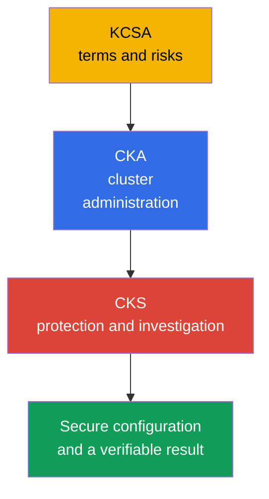
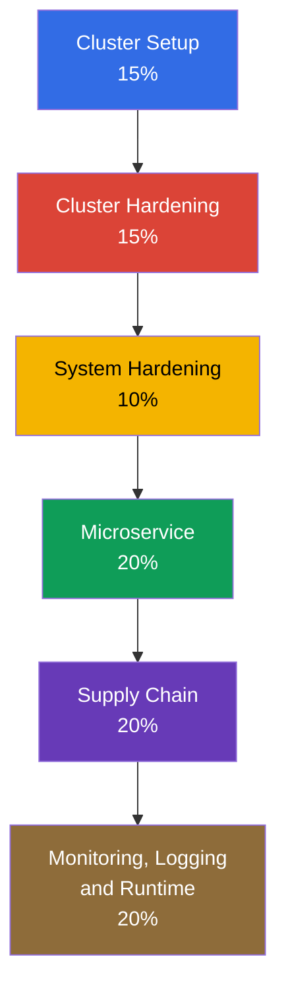
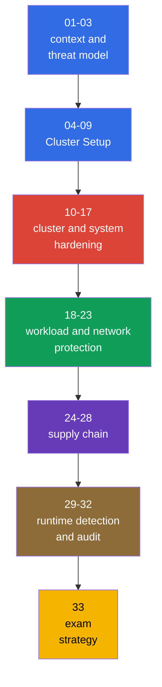

[Русская версия](ru.md) · [Versión en español](es.md) · [Version française](fr.md) · [Deutsche Version](de.md) · [ქართული ვერსია](ge.md) · [繁體中文版](tw.md) · [日本語版](jp.md)

# Chapter 01. Introduction: the CKS exam, how it differs from CKA, and course structure

> **The problem.** A Kubernetes cluster can look operational to a CKA administrator while remaining insecure: isolated decisions about networking, RBAC, images, and logs do not add up to protection without a threat model and result verification. This chapter maps the domains, prerequisites, and tools so that the hardening measures that follow form defense in depth rather than a collection of unrelated commands.

> **What comes next.** CKS tests whether an engineer can secure an already running Kubernetes cluster and investigate the consequences of a compromise. This introductory, optional part of the course establishes the Kubernetes version, preparation format, and a map of all six domains. Next comes the Kubernetes threat model in Chapter 02, followed by practical hardening measures.

> **What you need from CKA.** CKS continues CKA rather than replaces it. Before starting, review the [CKA introduction](../../../cka/course/01/README.md) and the [CKA table of contents](../../../cka/course/README.md). The course assumes confident work with `kubectl`, YAML manifests, Pod, Service, Ingress, RBAC, ServiceAccount, TLS, kubeadm, and control plane components. If you are not yet confident with the basic terms and cloud native threat model, start with the [KCSA course](../../../kcsa/course/README.md) - it is not a formal requirement, but it establishes the vocabulary on which CKS constantly relies.

> 🧠 KCSA provides the language of risk, CKA the operational foundation, and CKS applies that knowledge to limit and investigate compromise.

## 01.1 What CKS is and how it differs from CKA and KCSA

**Certified Kubernetes Security Specialist (CKS)** is a hands-on Linux Foundation exam on Kubernetes security. It tests not the ability to name a mechanism, but the ability to find an insecure configuration, apply a protection, and verify that it actually works.

| Certification | Main question | Typical actions |
|---|---|---|
| KCSA | What risks does Kubernetes have? | Explain basic principles and terminology |
| CKA | How do you deploy and administer a cluster? | Diagnose components, networking, storage, and upgrades |
| CKS | How do you limit and detect compromise? | Configure policy, hardening, audit, scanning, and runtime protection |

CKA provides the operational foundation: how the API server, kubelet, CNI, RBAC, and static Pod work. CKS uses that knowledge in a security scenario. For example, CKA teaches you to create a `NetworkPolicy`, whereas CKS requires you to start with default-deny, avoid breaking DNS, limit the metadata endpoint, and prove with a test that forbidden traffic does not pass.

KCSA (Kubernetes and Cloud Native Security Associate) is a separate course that is optional for CKS: [`tasks/kcsa`](../../../kcsa/course/README.md). It provides a concept-level understanding of the cloud native threat model (4C, supply chain, admission control, observability) without a hands-on component - KCSA uses multiple-choice questions rather than performance-based tasks. If you still need to look up the terms in the table above (threat model, admission control, RBAC as concepts rather than commands), take KCSA before CKS; if you already navigate these concepts freely, you can skip KCSA and proceed directly from CKA to CKS.

Security is not a separate setting applied at the end of a project. An image flaw, an overly broad Role, an exposed kubelet, or missing audit logs form one attack surface. Therefore, the course chapters connect each protection to a likely attacker path and an observable verification of the result.

> 🎯 Confirm the attempt rules and version, understand the curriculum and CKA prerequisite, and know the tools by layer.

## 01.2 Exam format, version, and documentation

The CKS exam is performance-based: you perform practical tasks in a terminal on the provided clusters and nodes. You have 2 hours, and the passing score is 67%. At the time of review, the Important Instructions describe **15-20 practical tasks**; this is a snapshot parameter that the Linux Foundation may change. Registration for and taking CKS requires a previously passed CKA, but its validity may expire by the time you take CKS: the CKA certificate does not have to remain active. A sound preparation model is to switch context deliberately and verify the actual state after every change.

A task may assign a separate host: in that case, run `ssh <host>` from the base machine (`base`), do the work, and return to `base`. Nested SSH between target hosts is not supported. The preinstalled toolsets on `base` and the target host may differ, so first determine exactly where a command must be run. **Standard CKS registration** includes two real exam attempts (**One Retake**) within a **12-month** eligibility window; the resulting certificate is valid for **2 years**. These are not simulator attempts: standard registration also includes two Killer.sh simulator attempts, each activated for **36 hours** and containing **17 questions**; **CKS-SINGLE does not include simulator access**. Practice the complete cycle: read the condition, select the host/context, make the smallest change, and verify the result.

Kubernetes versions must be distinguished:

- **The course and core labs `101-113` use `v1.36`** (`k8_version = "1.36.0"` in their lab environments): this version is used to verify Kubernetes-native commands, flags, and API behavior in the course; compatibility of third-party components must be checked against their own support matrix. There is one intentional exception - lab `113` starts on `v1.35.x` because its topic is the minor upgrade itself to `v1.36.x`.
- **The Linux Foundation defines the exam environment version, and it can lag behind the course version.** The main [CKS](https://training.linuxfoundation.org/certification/certified-kubernetes-security-specialist/) page lists Kubernetes **v1.35**, but Important Instructions and the FAQ are updated independently and can temporarily show another version. For a particular attempt, ExamUI and the instructions for the scheduled exam take precedence. The published CNCF curriculum overview remains named [`CKS Curriculum v1.34`](https://github.com/cncf/curriculum/tree/master/cks), but this does not override the parameters specified by the Linux Foundation for your attempt. Therefore, **do not treat `v1.36` as the exam version**.

The CKS page and FAQ are updated independently and can temporarily disagree. Immediately before an attempt, confirm the Kubernetes version, number and format of tasks, passing score, prerequisite, and permitted resources first on the main [CKS](https://training.linuxfoundation.org/certification/certified-kubernetes-security-specialist/) page and then in ExamUI for the scheduled attempt. Do not treat a version or rules recorded in the course as permanent.

The practical consequence is that you must check object syntax and admission behavior against documentation for the version open in the exam environment, not against the course version.

| Area | Core labs `101-112`: v1.36 | Exam: v1.35 or the version used in your exam attempt |
|---|---|---|
| Basic Kubernetes API and CKS techniques | Practice normal syntax, but check CNI/runtime support | Check the documentation and ExamUI for the specific attempt |
| User Namespaces | `hostUsers: false` became Stable/GA in v1.36; a lab can rely on this behavior | Do not automatically transfer this behavior to an attempt: check the version, runtime, and feature availability |
| New fields and admission behavior | Useful for training, but not an exam promise | Use only the API and behavior of the version specified by the environment |

LF maintains permitted resources separately from the curriculum and its weights. This is a time-bound snapshot: as of the last review, **2026-08-31**, the global CKS list includes the task's **Quick Reference**, Kubernetes documentation and blog, and documentation for Falco, `bom`, etcd, NGINX Ingress Controller, Cilium, and Istio. Documentation, man pages, and distribution packages available in the exam terminal are also allowed. The list can change independently of the curriculum: immediately before the exam, recheck the LF [Resources Allowed](https://docs.linuxfoundation.org/tc-docs/certification/certification-resources-allowed) page and the links available in ExamUI.

| Resource | Purpose | Availability |
|---|---|---|
| Task **Quick Reference** | Concise reference material provided in the exam environment | allowed |
| [Kubernetes Documentation](https://kubernetes.io/docs/) and [Kubernetes Blog](https://kubernetes.io/blog/) | Object APIs, SecurityContext, PSA, audit, kubeadm, component flags | allowed |
| [Cilium](https://docs.cilium.io/en/stable/) | `CiliumNetworkPolicy`, Hubble, encryption, and mutual authentication | allowed |
| [Istio](https://istio.io/latest/docs/) | `PeerAuthentication` and mTLS | allowed |
| [etcd](https://etcd.io/docs/) | `etcdctl`, TLS, and etcd operation | allowed |
| [kubernetes-sigs/bom](https://kubernetes-sigs.github.io/bom/cli-reference/) | Generate SPDX SBOM | allowed |
| [NGINX Ingress Controller](https://kubernetes.github.io/ingress-nginx/) | TLS termination and HTTP-to-HTTPS redirect (see 08.5 about retirement) | allowed |
| [Falco](https://falco.org/docs/) | Runtime rules, events, and diagnostics | allowed |
| Documentation, man pages, and distribution packages in the exam terminal | Local reference and information about installed software | allowed |
| [Trivy](https://trivy.dev/latest/docs/) | Scan image, filesystem, config, and SBOM | training resource; not in the global LF list at the review date |
| [AppArmor](https://gitlab.com/apparmor/apparmor/-/wikis/Documentation) | MAC profiles and loading them onto a node | training resource; not in the global LF list at the review date |

Do not rely on saved local notes as a syntax source, and do not try to open external search engines or third-party sites outside the allowed list. First identify the object and API version, then find the exact example in permitted documentation. Chapter 33 is intended for exam strategy and the final checklist.

## 01.3 Official CKS curriculum

The curriculum changes dated **15 October 2024** took effect on that date. The current weights below come from the Linux Foundation; the public CNCF curriculum repository may still show the former `10% / 15% / 15%`, so do not use it as the source of current weights. A domain weight is a guide for allocating time, not a substitute for checking every competency.

| Domain | Weight | Course chapters |
|---|---:|---|
| Cluster Setup | 15% | 04-09 |
| Cluster Hardening | 15% | 10-13 |
| System Hardening | 10% | 14-17 |
| Minimize Microservice Vulnerabilities | 20% | 18-23 |
| Supply Chain Security | 20% | 24-28 |
| Monitoring, Logging and Runtime Security | 20% | 29-32 |

The 2024 revision includes topics that need dedicated practice rather than mere knowledge of terms:

- `CiliumNetworkPolicy` with L3/L4/L7 rules, DNS-aware policy, and Hubble.
- Cilium transparent encryption and mutual authentication, as well as Istio mTLS.
- CIS Kubernetes Benchmark and `kube-bench`.
- SBOM in SPDX/CycloneDX formats, including `syft` and `bom`.
- `kube-linter` alongside `kubesec` and `hadolint`.
- Sandboxed containers through `RuntimeClass`: gVisor (`runsc`) and Kata Containers.

The complete “competency -> chapter” map is in the [course table of contents](../README.md#competency--chapter). The important point here is the logic: policy limits access, hardening reduces the attack surface, supply chain prevents untrusted artifacts, and runtime protection and audit help reveal remaining risk.

## 01.4 CKA prerequisite: what this course does not repeat

CKS does not repeat Kubernetes fundamentals or syntax. If you spend time during a task looking up a simple `kubectl` command, return to CKA first. CKS requires the following skills.

| CKA-level skill | Where to refresh it | How it is used in CKS |
|---|---|---|
| SecurityContext and capabilities | [Chapter 20](../../../cka/course/20/README.md) | Hardened Pod, PSA, seccomp, AppArmor, immutable rootfs |
| Secret, ServiceAccount, and admission | [Chapter 19](../../../cka/course/19/README.md), [Chapter 21](../../../cka/course/21/README.md) | Protect secrets, tokens, and policy admission |
| Images and Dockerfile | [Chapter 23](../../../cka/course/23/README.md) | Minimal images, SBOM, scan, and signing |
| NetworkPolicy and Pod networking | [Chapter 34](../../../cka/course/34/README.md), [Chapter 30](../../../cka/course/30/README.md) | Default-deny, metadata protection, Cilium policy |
| kubeadm, upgrade, and PKI | [Chapter 35](../../../cka/course/35/README.md), [Chapter 36](../../../cka/course/36/README.md), [Chapter 39](../../../cka/course/39/README.md) | CIS, TLS hardening, audit, and upgrades of vulnerable components |
| Container runtime and CRI | [Chapter 40](../../../cka/course/40/README.md) | RuntimeClass, gVisor, node investigation |

Do not rewrite a large manifest if a task only requires adding `securityContext` or a namespace label. Use `kubectl get ... -o yaml`, change the object precisely, apply it, and verify the result. This cycle reduces the risk of accidentally breaking a working configuration.

## 01.5 Course toolset

A tool does not replace a threat model. Choose it based on what is being examined: control plane configuration, a manifest, an image, an artifact, or process activity at runtime.

| Tool | What it checks or does | Main chapters |
|---|---|---|
| `kube-bench` | Compares node and component configuration with the CIS Benchmark | 07 |
| `trivy` | Finds CVEs in image, filesystem, config, and SBOM | 28 |
| `kubesec`, `kube-linter`, `hadolint` | Statically analyze manifest and Dockerfile before deploy | 27 |
| `syft`, `bom` | Create SBOM for image and artifacts | 25 |
| `cosign` / sigstore | Sign and verify image | 26 |
| Falco | Observes suspicious runtime events through syscall/eBPF | 29-30 |
| Cilium and Hubble | Implement and observe network policy, encryption, and mTLS | 06, 23 |
| OPA/Gatekeeper and Kyverno | Prevent manifest that violate policy from being admitted | 20, 26 |
| gVisor (`runsc`) and Kata | Isolate workload through a sandbox runtime | 22 |

Before running a scanner, identify the object being checked and the expected decision. For example, a `trivy` warning does not mean that every CVE is immediately exploitable: consider the package, execution path, availability of a fixed image, and risk to the specific workload. Conversely, a clean report does not eliminate the need for RBAC, network isolation, and runtime monitoring.

## 01.6 How the course is organized and how to prepare

The course moves from the threat model to defensive layers. Every subject chapter includes an attack scenario, protective configuration, verification, common mistakes, and production practices. Labs start at 101 and verify the result automatically through `check_result`.

Practical preparation order:

1. Check the CKA prerequisites in section 01.4 and keep a short set of commands for inspecting YAML, logs, and events.
2. Work through the chapters in order and complete the related lab after each one. Do not read the solution before your first independent attempt.
3. For every protection, perform a negative test: a forbidden Pod must be rejected, a closed port must not respond, and forbidden traffic must not pass.
4. Practice separately on a node: static Pod manifest, kubelet config, AppArmor/seccomp profile, audit policy, and systemd checks.
5. Before the exam, go through chapters 29-33 and repeat tasks under a time limit.

A common mistake is applying a security tool without checking the attack path. For example, the presence of a `NetworkPolicy` in a namespace does not prove that the CNI applied it; `EncryptionConfiguration` does not mean that existing Secret objects have been re-encrypted; and the presence of a Falco rule does not mean that it is loaded and actually generates an event. In this course, verification is part of the solution.

> 🏭 Threat model, versioned policy and hardening, CI checks, observable enforcement, and reviewed exceptions.

## 01.7 How this is applied in production

- **Security as an engineering cycle.** The team describes a threat model, introduces policy and hardening in IaC, checks them in CI, and observes the result in production.
- **Minimal privileges by default.** New workload receives a non-root SecurityContext, a limited ServiceAccount, network default-deny, and explicitly allowed dependencies.
- **Shift checks left.** `hadolint`, `kube-linter`, `kubesec`, SBOM, and `trivy` run before an image is published; admission policy does not allow critical requirements to be bypassed.
- **Node protection is no less important.** Access to kubelet, the container runtime socket, etcd, static Pod manifests, and audit files is limited as strictly as API access.
- **Verifiable exceptions.** If a workload requires a capability, privileged mode, or access to hostPath, the exception is documented, constrained to a namespace, and periodically reviewed.

## 01.8 Mini-glossary

- **CKS** - Certified Kubernetes Security Specialist, a hands-on Kubernetes security certification.
- **Performance-based** - a format in which the result is achieved in a working environment rather than selected in a test.
- **CIS Benchmark** - a set of recommendations for securely configuring components and nodes.
- **SBOM** - Software Bill of Materials, an inventory of the components in a software artifact.
- **Admission policy** - a rule that allows, modifies, or rejects a request to the Kubernetes API.
- **Runtime security** - detecting and limiting suspicious behavior of a running workload.
- **Defense in depth** - applying independent defensive layers instead of a single control.

## 01.9 Chapter summary

- CKS builds on CKA and tests practical protection of clusters, workloads, nodes, and the supply chain.
- The course and core labs `101-113` target Kubernetes v1.36 (lab `113` starts on v1.35.x because its topic is upgrading to v1.36.x itself).
- The exam requires confident terminal work with multiple clusters and node configuration.
- The six domains cover cluster setup, hardening, workload protection, supply chain, and runtime security.
- New emphases in the 2024 curriculum are Cilium, CIS, SBOM, KubeLinter, and sandboxed containers.
- A tool is valuable only together with verification: you must prove that protection worked and the attack does not pass.

> 🎯 First identify the problem layer - API/RBAC, network, node, image, or runtime - then apply the smallest change and verify the exact task condition.

> 🏭 Secure configuration, access restriction, artifact control, logging, and investigation work together.

## 01.10 How it helps on the exam and in real work

**On the exam.** This chapter helps you immediately recognize the class of a task and choose the right tool. Before making a change, identify the layer where the problem lies: API/RBAC, network, node, image, or runtime. Then make the smallest change and verify exactly the condition requested by the task.

**In real work.** The domain map prevents a narrow approach in which a team only scans image or only blocks privileged Pod. Reliable protection combines secure configuration, access restriction, artifact control, logging, and investigation.

## 01.11 Self-check questions

1. Why can you not prepare for CKS without a confident CKA level?

CKS builds on CKA and assumes confident work with `kubectl`, YAML manifests, Pod, Service, Ingress, RBAC, TLS, kubeadm, and the control plane. In CKS, basic mechanisms are used in a protection scenario: for example, you must not merely create a `NetworkPolicy`, but start with default-deny, preserve DNS, and prove with a negative test that a forbidden flow does not pass.

2. How does a performance-based exam differ from a multiple-choice test?

In a performance-based format, you perform the task in a terminal on the provided clusters and nodes rather than choose a ready-made answer. You must identify the required host or context, make the smallest change, and verify the actual state; when a separate host is assigned, work starts with `ssh <host>` from the `base` machine.

3. Which Kubernetes version is fixed in this course and its labs?

Kubernetes `v1.36` is fixed for training and core labs `101-113` (`k8_version = "1.36.0"`). The Linux Foundation sets the exam version, and it cannot be inferred automatically from the course version.

4. What are the six CKS domains, and which have the highest weight?

The domains are Cluster Setup, Cluster Hardening, System Hardening, Minimize Microservice Vulnerabilities, Supply Chain Security, and Monitoring, Logging and Runtime Security. Minimize Microservice Vulnerabilities, Supply Chain Security, and Monitoring, Logging and Runtime Security each have 20%; Cluster Setup and Cluster Hardening each have 15%, and System Hardening has 10%.

5. Which topics were added or strengthened by the 2024 curriculum?

Dedicated practice is required for `CiliumNetworkPolicy` with L3/L4/L7, DNS-aware policy, and Hubble, as well as Cilium encryption/mutual authentication and Istio mTLS. The curriculum also highlights CIS/kube-bench, SBOM through SPDX/CycloneDX and `syft`/`bom`, `kube-linter`, `kubesec`, `hadolint`, and sandboxed containers through RuntimeClass with gVisor or Kata.

6. When should you use `kube-bench`, `trivy`, `kube-linter`, and Falco?

`kube-bench` compares node and component configuration with the CIS Benchmark, while `trivy` looks for CVEs in image, filesystem, config, and SBOM. `kube-linter` statically analyzes Kubernetes manifests before deploy, whereas Falco observes suspicious runtime events through syscall/eBPF.

7. Why is applying a manifest alone insufficient for a security setting?

The presence of a manifest does not prove that the protection works: a CNI might not apply `NetworkPolicy`, existing Secret objects might not be re-encrypted after `EncryptionConfiguration`, and a Falco rule might not be loaded. After every change, you must verify the required result - for example, rejection of a forbidden Pod, inaccessibility of a closed port, or absence of forbidden network traffic.

## Practice

There is no separate lab for this introductory chapter - it establishes the course format rather than a technical skill. Move directly to [Chapter 02](../02/README.md): it provides the threat model without which it is too early to work on specific protections. The first course lab is [lab 101](../../labs/101/README.MD) (default-deny `NetworkPolicy`, DNS egress, and metadata endpoint protection); it becomes meaningful only after chapters 04-05, which explain the NetworkPolicy mechanism itself. Completing it earlier would not deliver the benefit for which the labs exist at all (Level 2 - “understand the mechanism,” not guess the command).

---
[Table of contents](../README.md) · [Chapter 02](../02/README.md)
