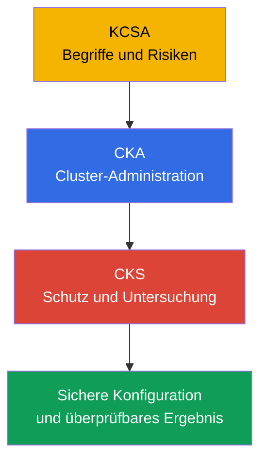
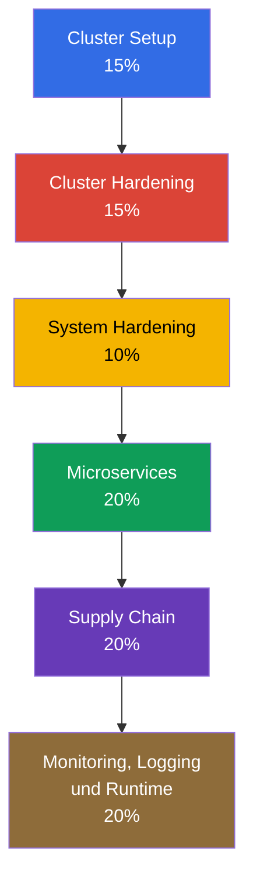
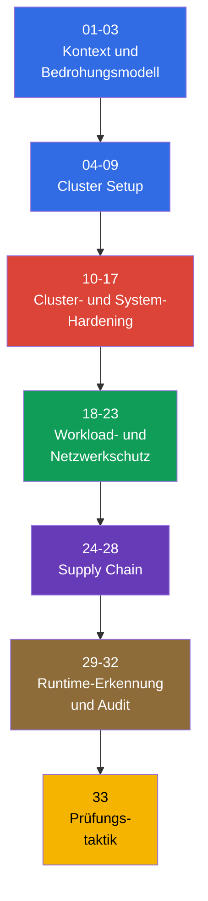

[Русская версия](ru.md) · [Eng version](README.md) · [Versión en español](es.md) · [Version française](fr.md) · [ქართული ვერსია](ge.md) · [繁體中文版](tw.md) · [日本語版](jp.md)

# Kapitel 01. Einführung: die CKS-Prüfung, Unterschiede zu CKA und Aufbau des Kurses

> **Problem.** Ein Kubernetes-Cluster kann für einen CKA-Administrator funktionsfähig wirken und dennoch ungeschützt bleiben: Einzelne Entscheidungen zu Netzwerk, RBAC, Images und Logs ergeben ohne Bedrohungsmodell und Ergebnisprüfung keinen Schutz. Dieses Kapitel liefert eine Karte der Domänen, Voraussetzungen und Werkzeuge, damit die folgenden Hardening-Maßnahmen Teil von Defense in Depth und nicht eine Sammlung unverbundener Befehle sind.

> **Was als Nächstes kommt.** CKS prüft, ob ein Engineer einen bereits laufenden Kubernetes-Cluster schützen und die Folgen einer Kompromittierung untersuchen kann. Dies ist ein einleitender, optionaler Teil des Kurses: Er legt die Kubernetes-Version, das Vorbereitungsformat und die Karte aller sechs Domänen fest. Als Nächstes folgt das Kubernetes-Bedrohungsmodell in Kapitel 02, danach die praktischen Hardening-Maßnahmen.

> **Was Sie aus CKA brauchen.** CKS setzt CKA fort, ersetzt es aber nicht. Wiederholen Sie vor dem Start die [CKA-Einführung](../../../cka/course/01/de.md) und das [CKA-Inhaltsverzeichnis](../../../cka/course/README_DE.md). Der Kurs setzt sicheren Umgang mit `kubectl`, YAML-Manifesten, Pod, Service, Ingress, RBAC, ServiceAccount, TLS, kubeadm und Control-Plane-Komponenten voraus. Wenn grundlegende Begriffe und das Bedrohungsmodell von Cloud Native noch nicht sicher sitzen, beginnen Sie mit dem [KCSA-Kurs](../../../kcsa/course/README_DE.md) - formal ist er nicht erforderlich, aber er vermittelt das Vokabular, auf das CKS ständig aufbaut.

> 🧠 KCSA liefert die Sprache für Risiken, CKA die operative Grundlage und CKS die Anwendung dieses Wissens zur Begrenzung und Untersuchung einer Kompromittierung.

## 01.1 Was ist CKS und worin unterscheidet es sich von CKA und KCSA?

**Certified Kubernetes Security Specialist (CKS)** ist eine praxisorientierte Linux-Foundation-Prüfung zur Kubernetes-Sicherheit. Sie prüft nicht die Fähigkeit, einen Mechanismus zu benennen, sondern die Fähigkeit, eine unsichere Konfiguration zu finden, Schutzmaßnahmen anzuwenden und zu verifizieren, dass sie tatsächlich funktionieren.

| Zertifizierung | Kernfrage | Typische Tätigkeiten |
|---|---|---|
| KCSA | Welche Risiken hat Kubernetes? | Grundprinzipien und Terminologie erklären |
| CKA | Wie wird ein Cluster bereitgestellt und administriert? | Komponenten, Netzwerk, Storage und Upgrade diagnostizieren |
| CKS | Wie lässt sich eine Kompromittierung begrenzen und erkennen? | Policy, Hardening, Audit, Scans und Runtime-Schutz konfigurieren |

CKA vermittelt die operative Grundlage: den Aufbau von API server, kubelet, CNI, RBAC und static Pod. CKS verwendet dieses Wissen in einem Security-Szenario. Beispielsweise lehrt CKA, eine `NetworkPolicy` zu erstellen, während CKS verlangt, mit default-deny zu beginnen, DNS nicht zu beschädigen, den metadata endpoint einzuschränken und mit einem Test nachzuweisen, dass verbotener Traffic nicht durchkommt.

KCSA (Kubernetes and Cloud Native Security Associate) ist ein eigener, für CKS optionaler Kurs: [`tasks/kcsa`](../../../kcsa/course/README_DE.md). Er vermittelt ein Verständnis des Cloud-Native-Bedrohungsmodells auf Konzeptebene (4C, supply chain, admission control, observability) ohne Hands-on-Teil - das KCSA-Format ist multiple choice und keine performance-based Aufgabe. Wenn Sie das Vokabular aus der obigen Tabelle (threat model, admission control, RBAC als Begriffe und nicht als Befehle) noch anhand von Definitionen überprüfen müssen, absolvieren Sie KCSA vor CKS; wenn Sie sich in diesen Konzepten bereits sicher bewegen, können Sie KCSA überspringen und direkt von CKA zu CKS gehen.

Sicherheit ist hier keine getrennte Einstellung am Ende eines Projekts. Ein Fehler im Image, eine übermäßige Role, ein offener kubelet oder fehlende audit-logs bilden zusammen eine Angriffsfläche. Deshalb verbinden die Kapitel des Kurses Schutzmaßnahmen mit einem wahrscheinlichen Angreiferpfad und einer beobachtbaren Prüfung des Ergebnisses.

> 🎯 Bestätigen Sie Regeln und Version Ihres Versuchs, orientieren Sie sich im Curriculum, bei den CKA-Voraussetzungen und den Werkzeugen je Schicht.

## 01.2 Prüfungsformat, Version und Dokumentation

Die CKS-Prüfung ist performance-based: Praktische Aufgaben werden im Terminal auf bereitgestellten Clustern und Nodes erledigt. Es stehen 2 Stunden zur Verfügung, die Bestehensgrenze liegt bei 67 %. Zum Zeitpunkt der Prüfung nennen die Important Instructions **15-20 praktische Aufgaben**; dies ist eine Momentaufnahme, die die Linux Foundation ändern kann. Für Registrierung und Ablegen von CKS ist ein zuvor bestandener CKA erforderlich, seine Gültigkeit kann zum Zeitpunkt von CKS aber abgelaufen sein: Das CKA-Zertifikat muss nicht aktiv bleiben. Ein praxistaugliches Vorbereitungsmodell besteht darin, bewusst zwischen context zu wechseln und nach jeder Änderung den tatsächlichen Zustand zu prüfen.

Eine Aufgabe kann einen separaten host zuweisen: Führen Sie in diesem Fall `ssh <host>` von der Ausgangsmaschine (`base`) aus, erledigen Sie die Arbeit und kehren Sie zu `base` zurück. Verschachteltes SSH zwischen den Ziel-host wird nicht unterstützt. Die vorinstallierten Werkzeuge auf `base` und auf dem Ziel-host können unterschiedlich sein, prüfen Sie daher zuerst, wo ein Befehl ausgeführt werden muss. **Die Standardregistrierung für CKS** umfasst zwei echte Prüfungsversuche (**One Retake**) innerhalb eines eligibility window von **12 Monaten**; das erhaltene Zertifikat gilt **2 Jahre**. Dies sind keine simulator-Versuche: Die Standardregistrierung enthält außerdem zwei Versuche im Killer.sh simulator, jeder wird für **36 Stunden** aktiviert und enthält **17 Fragen**; **CKS-SINGLE beinhaltet keinen Zugang zum simulator**. Trainieren Sie den vollständigen Ablauf: Aufgabenstellung lesen, host/context wählen, die minimale Änderung vornehmen und das Ergebnis prüfen.

Kubernetes-Versionen müssen unterschieden werden:

- **Die Ausbildungs- und core labs-Version `101-113` dieses Kurses ist `v1.36`** (`k8_version = "1.36.0"` in ihren Laborumgebungen): Darin werden Kubernetes-native Befehle, Flags und API-Verhalten des Kurses geprüft; die Kompatibilität von Third-Party-Komponenten muss anhand ihrer eigenen support matrix geprüft werden. Konstruktionsbedingte Ausnahme ist Lab `113`: Sein Cluster startet mit `v1.35.x`, denn die Aufgabenstellung behandelt den Prozess eines minor upgrade auf `v1.36.x`.
- **Die Version der Prüfungsumgebung legt die Linux Foundation fest, und sie kann hinter der Kursversion zurückliegen.** Die Hauptseite [CKS](https://training.linuxfoundation.org/certification/certified-kubernetes-security-specialist/) nennt Kubernetes **v1.35**, Important Instructions und FAQ werden jedoch unabhängig aktualisiert und können vorübergehend eine andere Version zeigen. Für den konkreten Versuch haben ExamUI und die Anweisungen der zugewiesenen Prüfung Vorrang. Das veröffentlichte CNCF curriculum overview bleibt nach Dateinamen [`CKS Curriculum v1.34`](https://github.com/cncf/curriculum/tree/master/cks), dies hebt die von der Linux Foundation für den Versuch angegebenen Parameter jedoch nicht auf. **Betrachten Sie `v1.36` daher nicht als Prüfungsversion.**

Die CKS-Seiten und FAQ werden unabhängig aktualisiert und können vorübergehend voneinander abweichen. Bestätigen Sie unmittelbar vor dem Versuch Kubernetes-Version, Anzahl und Format der Aufgaben, Bestehensgrenze, Voraussetzungen und erlaubte Ressourcen zuerst auf der CKS-Hauptseite [CKS](https://training.linuxfoundation.org/certification/certified-kubernetes-security-specialist/) und danach in ExamUI für den zugewiesenen Versuch. Verlassen Sie sich nicht darauf, dass die im Kurs dokumentierte Version oder Regeln dauerhaft gelten.

Der praktische Unterschied: Prüfen Sie die Syntax eines Objekts und admission-Verhalten anhand der Dokumentation der Version, die in der Prüfungsumgebung geöffnet ist, nicht anhand der Kursversion.

| Bereich | Core labs `101-112`: v1.36 | Prüfung: v1.35 oder tatsächliche Version des Versuchs |
|---|---|---|
| Grundlegende Kubernetes-API und CKS-Techniken | Üben Sie die übliche Syntax, prüfen Sie aber die Unterstützung durch CNI/runtime | Gleichen Sie sie mit Dokumentation und ExamUI des konkreten Versuchs ab |
| User Namespaces | `hostUsers: false` wurde in v1.36 Stable/GA; ein Lab kann sich auf dieses Verhalten stützen | Übernehmen Sie dieses Verhalten nicht automatisch in den Versuch: Prüfen Sie Version, runtime und Verfügbarkeit der Funktion |
| Neue Felder und admission-Verhalten | Nützlich zum Lernen, aber keine Zusage für die Prüfung | Verwenden Sie nur API und Verhalten der in der Umgebung angegebenen Version |

Die Linux Foundation pflegt erlaubte Ressourcen getrennt vom curriculum und dessen Gewichtungen. Dies ist eine zeitgebundene Momentaufnahme: Am letzten Prüftag, dem **2026-08-31**, enthält die globale CKS-Liste die **Quick Reference** aus der Aufgabe, Kubernetes-Dokumentation und -Blog sowie Dokumentation zu Falco, `bom`, etcd, NGINX Ingress Controller, Cilium und Istio. Darüber hinaus sind Dokumentation, man-Seiten und Pakete der Distribution des Prüfungsterminals erlaubt. Die Liste kann sich unabhängig vom curriculum ändern: Prüfen Sie vor der Prüfung erneut die LF-Seite [Resources Allowed](https://docs.linuxfoundation.org/tc-docs/certification/certification-resources-allowed) und die in ExamUI verfügbaren Links.

| Ressource | Wofür | Verfügbarkeit |
|---|---|---|
| **Quick Reference** der Aufgabe | Kurze Referenzmaterialien, die in der Prüfungsumgebung bereitgestellt werden | erlaubt |
| [Kubernetes Documentation](https://kubernetes.io/docs/) und [Kubernetes Blog](https://kubernetes.io/blog/) | Objekt-API, SecurityContext, PSA, audit, kubeadm, Komponenten-Flags | erlaubt |
| [Cilium](https://docs.cilium.io/en/stable/) | `CiliumNetworkPolicy`, Hubble, encryption und mutual authentication | erlaubt |
| [Istio](https://istio.io/latest/docs/) | `PeerAuthentication` und mTLS | erlaubt |
| [etcd](https://etcd.io/docs/) | `etcdctl`, TLS und Betrieb von etcd | erlaubt |
| [kubernetes-sigs/bom](https://kubernetes-sigs.github.io/bom/cli-reference/) | Erzeugung einer SPDX SBOM | erlaubt |
| [NGINX Ingress Controller](https://kubernetes.github.io/ingress-nginx/) | TLS termination und HTTP-to-HTTPS redirect (siehe 08.5 über retirement) | erlaubt |
| [Falco](https://falco.org/docs/) | Runtime-Regeln, Ereignisse und Diagnose | erlaubt |
| Dokumentation, man-Seiten und Pakete der Distribution des Prüfungsterminals | Lokale Referenz und Informationen über installierte Software | erlaubt |
| [Trivy](https://trivy.dev/latest/docs/) | Scan von image, filesystem, config und SBOM | Lernressource; am Prüftag nicht in der globalen LF-Liste |
| [AppArmor](https://gitlab.com/apparmor/apparmor/-/wikis/Documentation) | MAC-Profile und deren Laden auf den Node | Lernressource; am Prüftag nicht in der globalen LF-Liste |

Verlassen Sie sich nicht auf gespeicherte lokale Notizen als Quelle für Syntax und versuchen Sie nicht, externe Suchmaschinen oder Drittseiten außerhalb der erlaubten Liste zu öffnen. Bestimmen Sie zuerst das Objekt und die API-Version und suchen Sie dann ein exaktes Beispiel in der erlaubten Dokumentation. Kapitel 33 behandelt Prüfungsstrategie und abschließende Checkliste.

## 01.3 Offizielles CKS-Curriculum

Die Änderungen des Curriculums vom **15. Oktober 2024** traten an diesem Tag in Kraft. Die folgenden aktuellen Gewichtungen stammen von der Linux Foundation; das öffentliche CNCF-curriculum-Repository kann weiterhin die früheren `10% / 15% / 15%` zeigen, verwenden Sie es daher nicht als Quelle für die aktuellen Gewichtungen. Das Domänengewicht ist ein Anhaltspunkt für die Zeiteinteilung, ersetzt aber nicht die Prüfung aller Kompetenzen.

| Domäne | Gewicht | Kapitel des Kurses |
|---|---:|---|
| Cluster Setup | 15% | 04-09 |
| Cluster Hardening | 15% | 10-13 |
| System Hardening | 10% | 14-17 |
| Minimize Microservice Vulnerabilities | 20% | 18-23 |
| Supply Chain Security | 20% | 24-28 |
| Monitoring, Logging and Runtime Security | 20% | 29-32 |

Die Fassung 2024 enthält Themen, die eigene Praxis statt bloßer Kenntnis von Begriffen erfordern:

- `CiliumNetworkPolicy` mit L3/L4/L7-Regeln, DNS-aware policy und Hubble.
- Cilium transparent encryption und mutual authentication sowie Istio mTLS.
- CIS Kubernetes Benchmark und `kube-bench`.
- SBOM in den Formaten SPDX/CycloneDX, einschließlich `syft` und `bom`.
- `kube-linter` neben `kubesec` und `hadolint`.
- Sandboxed containers über `RuntimeClass`: gVisor (`runsc`) und Kata Containers.

Die vollständige Karte „Kompetenz -> Kapitel“ finden Sie im [Kursinhaltsverzeichnis](../README_DE.md#kompetenz--kapitel). Hier ist die Logik wichtig: Policy begrenzen den Zugriff, Hardening verringert die Angriffsfläche, die Supply Chain lässt kein nicht vertrauenswürdiges Artefakt zu und Runtime-Schutz sowie audit helfen, das verbleibende Risiko zu erkennen.

## 01.4 CKA-Voraussetzung: Was dieser Kurs nicht wiederholt

CKS wiederholt weder grundlegende Syntax noch den Aufbau von Kubernetes. Wenn Sie bei einer Aufgabe Zeit damit verbringen, nach einem einfachen `kubectl`-Befehl zu suchen, kehren Sie zunächst zu CKA zurück. Für CKS werden die folgenden Fähigkeiten benötigt.

| Fähigkeit auf CKA-Niveau | Wo auffrischen | Verwendung in CKS |
|---|---|---|
| SecurityContext und capabilities | [Kapitel 20](../../../cka/course/20/de.md) | Hardened Pod, PSA, seccomp, AppArmor, immutable rootfs |
| Secret, ServiceAccount und admission | [Kapitel 19](../../../cka/course/19/de.md), [Kapitel 21](../../../cka/course/21/de.md) | Schutz von Secrets, Tokens und policy admission |
| Images und Dockerfile | [Kapitel 23](../../../cka/course/23/de.md) | Minimale Images, SBOM, Scan und Signatur |
| NetworkPolicy und Pod-Netzwerk | [Kapitel 34](../../../cka/course/34/de.md), [Kapitel 30](../../../cka/course/30/de.md) | Default-deny, metadata protection, Cilium policy |
| kubeadm, Upgrade und PKI | [Kapitel 35](../../../cka/course/35/de.md), [Kapitel 36](../../../cka/course/36/de.md), [Kapitel 39](../../../cka/course/39/de.md) | CIS, TLS hardening, audit, Upgrade von verwundbaren Komponenten |
| Container runtime und CRI | [Kapitel 40](../../../cka/course/40/de.md) | RuntimeClass, gVisor, Untersuchung auf dem Node |

Schreiben Sie kein großes Manifest neu, wenn die Aufgabe nur das Hinzufügen von `securityContext` oder eines Namespace-label verlangt. Verwenden Sie `kubectl get ... -o yaml`, ändern Sie das Objekt gezielt, wenden Sie es an und prüfen Sie das Ergebnis. Dieser Zyklus verringert das Risiko, eine funktionierende Konfiguration versehentlich zu beschädigen.

## 01.5 Werkzeugkasten des Kurses

Ein Werkzeug ersetzt kein Bedrohungsmodell. Es muss danach ausgewählt werden, was geprüft wird: Control-Plane-Konfiguration, Manifest, Image, Artefakt oder die Aktion eines Prozesses zur Laufzeit.

| Werkzeug | Was es prüft oder tut | Hauptkapitel |
|---|---|---|
| `kube-bench` | Gleichen Konfiguration von Nodes und Komponenten mit CIS Benchmark ab | 07 |
| `trivy` | Findet CVE in image, filesystem, config und SBOM | 28 |
| `kubesec`, `kube-linter`, `hadolint` | Analysieren manifest und Dockerfile statisch vor deploy | 27 |
| `syft`, `bom` | Erzeugen SBOM für image und Artefakte | 25 |
| `cosign` / sigstore | Signieren und prüfen image | 26 |
| Falco | Beobachtet verdächtige Runtime-Ereignisse über syscall/eBPF | 29-30 |
| Cilium und Hubble | Implementieren und beobachten Netzwerk-policy, encryption und mTLS | 06, 23 |
| OPA/Gatekeeper und Kyverno | Lassen manifest nicht zu, die policy verletzen | 20, 26 |
| gVisor (`runsc`) und Kata | Isolieren workload über sandbox runtime | 22 |

Halten Sie vor dem Start eines scanner das Prüfobjekt und die erwartete Entscheidung fest. Beispielsweise bedeutet eine `trivy`-Warnung nicht, dass jeder CVE sofort ausnutzbar ist: Berücksichtigen Sie Paket, Ausführungspfad, das Vorhandensein eines behobenen image und das Risiko für den konkreten workload. Umgekehrt ersetzt ein sauberer Bericht weder RBAC noch network isolation oder runtime monitoring.

## 01.6 Aufbau des Kurses und Vorbereitung

Der Kurs führt vom Bedrohungsmodell zu den Schutzschichten. Jedes fachliche Kapitel enthält einen Angriffsszenario, eine Schutzkonfiguration, Überprüfung, typische Fehler und Production-Praktiken. Die Laborübungen beginnen mit 101 und prüfen das Ergebnis automatisch über `check_result`.

Praktische Reihenfolge der Vorbereitung:

1. Prüfen Sie die CKA-Voraussetzungen aus Abschnitt 01.4 und erstellen Sie eine kurze Sammlung von Befehlen zum Anzeigen von YAML, logs und events.
2. Arbeiten Sie die Kapitel in Reihenfolge durch und führen Sie nach jedem die zugehörige Laborübung aus. Lesen Sie die Lösung nicht vor dem ersten eigenständigen Versuch.
3. Führen Sie für jede Schutzmaßnahme einen negativen Test aus: Ein forbidden Pod muss abgelehnt werden, ein geschlossener Port darf nicht antworten und verbotener Traffic darf nicht durchgehen.
4. Trainieren Sie getrennt auf dem Node: static Pod manifest, kubelet config, AppArmor/seccomp profile, audit policy und Prüfung von systemd.
5. Arbeiten Sie vor der Prüfung die Kapitel 29-33 durch und wiederholen Sie die Aufgaben unter Zeitbegrenzung.

Ein typischer Fehler besteht darin, ein Schutzmittel ohne Überprüfung des Angriffspfads anzuwenden. Beispielsweise beweist das Vorhandensein einer `NetworkPolicy` in einem Namespace noch nicht, dass CNI sie anwendet; eine `EncryptionConfiguration` bedeutet noch nicht, dass alte Secrets erneut verschlüsselt wurden; das Vorhandensein einer Falco-Regel bedeutet noch nicht, dass sie geladen ist und tatsächlich ein Ereignis erzeugt. In diesem Kurs ist die Prüfung Teil der Lösung.

> 🏭 Threat model, versionierte policy und Hardening, CI-Prüfungen, beobachtbare Anwendung und regelmäßig überprüfte Ausnahmen.

## 01.7 Anwendung in Production

- **Sicherheit als Engineering-Zyklus.** Das Team beschreibt ein threat model, führt policy und Hardening in IaC ein, prüft sie in CI und beobachtet das Ergebnis in production.
- **Minimale Rechte als Standard.** Neue workload erhalten einen non-root SecurityContext, einen eingeschränkten ServiceAccount, network default-deny und ausdrücklich erlaubte Abhängigkeiten.
- **Prüfungen nach links verschieben.** `hadolint`, `kube-linter`, `kubesec`, SBOM und `trivy` laufen vor der Veröffentlichung eines image; admission policy erlaubt nicht, kritische Anforderungen zu umgehen.
- **Der Schutz von Nodes ist ebenso wichtig.** Zugriff auf kubelet, container runtime socket, etcd, static Pod manifest und audit-Dateien wird genauso strikt eingeschränkt wie Zugriff auf die API.
- **Überprüfbare Ausnahmen.** Wenn ein workload eine capability, privileged mode oder Zugriff auf hostPath benötigt, wird die Ausnahme dokumentiert, auf den Namespace begrenzt und regelmäßig überprüft.

## 01.8 Mini-Glossar

- **CKS** - Certified Kubernetes Security Specialist, eine praxisorientierte Zertifizierung für Kubernetes-Sicherheit.
- **Performance-based** - ein Format, in dem ein Ergebnis in einer Arbeitsumgebung erreicht und nicht in einem Test ausgewählt wird.
- **CIS Benchmark** - eine Sammlung von Empfehlungen für die sichere Konfiguration von Komponenten und Nodes.
- **SBOM** - Software Bill of Materials, ein Verzeichnis der Komponenten eines Softwareartefakts.
- **Admission policy** - eine Regel, die eine Anfrage an die Kubernetes API erlaubt, verändert oder ablehnt.
- **Runtime security** - Erkennung und Begrenzung verdächtigen Verhaltens eines laufenden workload.
- **Defense in depth** - Anwendung unabhängiger Schutzschichten statt einer einzigen Kontrolle.

## 01.9 Zusammenfassung des Kapitels

- CKS setzt CKA fort und prüft den praktischen Schutz von Cluster, workload, Nodes und supply chain.
- Die Zielversion des Kurses und der core labs `101-113` ist Kubernetes v1.36 (Lab `113` beginnt mit v1.35.x, da seine Aufgabe das Upgrade selbst auf v1.36.x ist).
- Die Prüfung verlangt sicheren Umgang im Terminal, mit mehreren Clustern und mit Node-Konfiguration.
- Sechs Domänen decken Cluster-Setup, Hardening, workload, Supply Chain und Runtime-Schutz ab.
- Neue Schwerpunkte des Curriculums 2024 sind Cilium, CIS, SBOM, KubeLinter und sandboxed containers.
- Ein Werkzeug ist nur zusammen mit einer Prüfung wertvoll: Sie müssen nachweisen, dass der Schutz funktioniert und der Angriff nicht durchkommt.

> 🎯 Bestimmen Sie zuerst die Problemschicht - API/RBAC, network, node, image oder runtime - nehmen Sie dann die minimale Änderung vor und prüfen Sie genau die Bedingung der Aufgabe.

> 🏭 Secure configuration, Zugriffsbeschränkung, Artefaktkontrolle, Logging und Untersuchung funktionieren zusammen.

## 01.10 Nutzen für Prüfung und Praxis

**In der Prüfung.** Dieses Kapitel hilft, die Aufgabenklasse sofort zu erkennen und das richtige Werkzeug zu wählen. Bestimmen Sie vor der Änderung, auf welcher Schicht das Problem liegt: API/RBAC, network, node, image oder runtime. Nehmen Sie danach die minimale Änderung vor und prüfen Sie genau die Bedingung, die die Aufgabe verlangt.

**In der Praxis.** Die Karte der Domänen verhindert einen engen Ansatz, bei dem ein Team nur image scannt oder nur privileged Pod verbietet. Zuverlässiger Schutz verbindet secure configuration, Zugriffsbeschränkung, Artefaktkontrolle, Logging und Untersuchung.

## 01.11 Fragen zur Selbstkontrolle

1. Warum kann man sich nicht ohne ein sicheres CKA-Niveau auf CKS vorbereiten?

CKS setzt CKA fort und erfordert sicheren Umgang mit `kubectl`, YAML-Manifesten, Pod, Service, Ingress, RBAC, TLS, kubeadm und control plane. In CKS werden Grundmechanismen in einem Schutzszenario eingesetzt: Beispielsweise muss nicht nur eine `NetworkPolicy` erstellt werden, sondern Sie müssen mit default-deny beginnen, DNS erhalten und mit einem negativen Test beweisen, dass der verbotene Datenstrom nicht durchkommt.

2. Worin unterscheidet sich eine performance-based Prüfung von einem Test mit Antwortmöglichkeiten?

In einem performance-based Format wird die Aufgabe im Terminal auf bereitgestellten Clustern und Nodes erledigt, statt eine vorgegebene Antwort auszuwählen. Sie müssen den erforderlichen host oder context bestimmen, die minimale Änderung vornehmen und den tatsächlichen Zustand prüfen; wird ein separater host zugewiesen, beginnt die Arbeit mit `ssh <host>` von der Maschine `base`.

3. Welche Kubernetes-Version ist in diesem Kurs und den Laborübungen festgelegt?

Für die Ausbildung und core labs `101-113` ist Kubernetes `v1.36` (`k8_version = "1.36.0"`) festgelegt. Die Prüfungsversion legt die Linux Foundation fest; sie kann nicht automatisch aus der Kursversion abgeleitet werden.

4. Welche sechs CKS-Domänen gibt es und welche haben das größte Gewicht?

Die Domänen sind Cluster Setup, Cluster Hardening, System Hardening, Minimize Microservice Vulnerabilities, Supply Chain Security sowie Monitoring, Logging and Runtime Security. Je 20 % haben Minimize Microservice Vulnerabilities, Supply Chain Security sowie Monitoring, Logging and Runtime Security; Cluster Setup und Cluster Hardening haben je 15 %, System Hardening 10 %.

5. Welche Themen wurden durch das Curriculum 2024 hinzugefügt oder stärker gewichtet?

Eigene Praxis erfordern `CiliumNetworkPolicy` mit L3/L4/L7, DNS-aware policy und Hubble sowie Cilium encryption/mutual authentication und Istio mTLS. Im Curriculum hervorgehoben sind außerdem CIS/kube-bench, SBOM über SPDX/CycloneDX und `syft`/`bom`, `kube-linter`, `kubesec`, `hadolint` und sandboxed containers über RuntimeClass mit gVisor oder Kata.

6. Wann werden `kube-bench`, `trivy`, `kube-linter` und Falco eingesetzt?

`kube-bench` gleicht die Konfiguration von Nodes und Komponenten mit CIS Benchmark ab, während `trivy` nach CVE in image, filesystem, config und SBOM sucht. `kube-linter` analysiert Kubernetes-Manifeste statisch vor deploy, während Falco verdächtige Runtime-Ereignisse über syscall/eBPF beobachtet.

7. Warum reicht es bei einer Security-Konfiguration nicht aus, nur ein Manifest anzuwenden?

Das Vorhandensein eines Manifests beweist nicht, dass der Schutz funktioniert: CNI kann eine `NetworkPolicy` möglicherweise nicht anwenden, alte Secrets können nach `EncryptionConfiguration` noch nicht erneut verschlüsselt sein und eine Falco-Regel kann möglicherweise nicht geladen sein. Nach jeder Änderung muss genau das gewünschte Ergebnis geprüft werden - beispielsweise das Ablehnen eines forbidden Pod, die Unerreichbarkeit eines geschlossenen Ports oder das Ausbleiben eines verbotenen Netzwerkdatenstroms.

## Praxis

Für das Einführungskapitel gibt es keine separate Laborübung - es legt das Kursformat fest und keine technische Fähigkeit. Wechseln Sie jetzt direkt zu [Kapitel 02](../02/de.md): Es liefert das Bedrohungsmodell, ohne das konkrete Schutzmaßnahmen zu früh wären. Das erste Lab des Kurses ist [Lab 101](../../labs/101/README_DE.MD) (default-deny `NetworkPolicy`, DNS egress und Schutz des metadata endpoint) und wird erst nach den Kapiteln 04-05 sinnvoll, in denen der NetworkPolicy-Mechanismus selbst behandelt wird; die frühere Ausführung erzielt nicht den Effekt, für den die Labs in diesem Kurs überhaupt bestehen (Level 2 - „den Mechanismus verstehen“ und keinen Befehl erraten).

---
[Inhaltsverzeichnis](../README_DE.md) · [Kapitel 02](../02/de.md)
