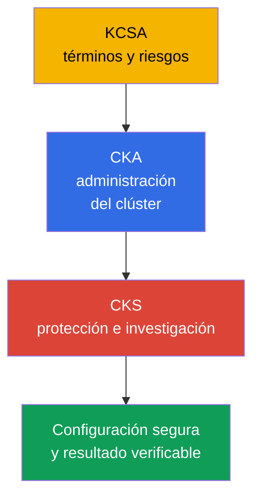
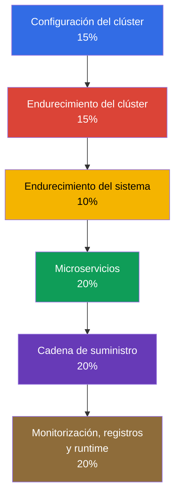
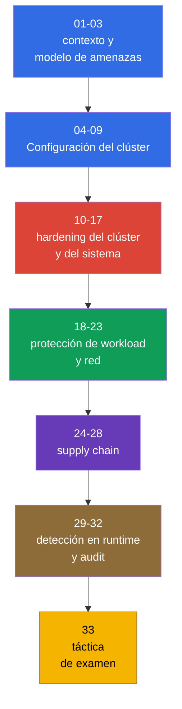

[Русская версия](ru.md) · [Eng version](README.md) · [Version française](fr.md) · [Deutsche Version](de.md) · [ქართული ვერსია](ge.md) · [繁體中文版](tw.md) · [日本語版](jp.md)

# Capítulo 01. Introducción: el examen CKS, sus diferencias con CKA y la estructura del curso

> **El problema.** Un clúster de Kubernetes puede parecer operativo para un administrador de CKA y, sin embargo, seguir sin estar protegido: las decisiones aisladas sobre red, RBAC, imágenes y registros no constituyen una protección sin un modelo de amenazas y la verificación del resultado. Este capítulo presenta un mapa de los dominios, los prerrequisitos y las herramientas, para que las medidas de hardening posteriores formen parte de una defensa en profundidad y no sean un conjunto de comandos inconexos.

> **Lo que sigue.** CKS evalúa si el ingeniero puede proteger un clúster de Kubernetes que ya está en funcionamiento e investigar las consecuencias de una vulneración. Esta parte introductoria y opcional del curso establece la versión de Kubernetes, el formato de preparación y el mapa de los seis dominios. A continuación se aborda el modelo de amenazas de Kubernetes en el capítulo 02 y, después, las medidas prácticas de hardening.

> **Lo que se necesita de CKA.** CKS continúa CKA, no lo sustituye. Antes de empezar, repase la [introducción a CKA](../../../cka/course/01/es.md) y el [índice de CKA](../../../cka/course/README_ES.md). El curso presupone dominio de `kubectl`, manifiestos YAML, Pod, Service, Ingress, RBAC, ServiceAccount, TLS, kubeadm y los componentes del control plane. Si aún no domina los términos básicos y el modelo de amenazas cloud native, comience por el [curso KCSA](../../../kcsa/course/README_ES.md): no es un requisito formal, pero proporciona el vocabulario en el que CKS se apoya constantemente.

> 🧠 KCSA aporta el lenguaje de los riesgos, CKA la base operativa y CKS aplica estos conocimientos para limitar e investigar una vulneración.

## 01.1 Qué es CKS y en qué se diferencia de CKA y KCSA

**Certified Kubernetes Security Specialist (CKS)** es un examen práctico de Linux Foundation sobre la seguridad de Kubernetes. No evalúa la capacidad de nombrar un mecanismo, sino la de encontrar una configuración insegura, aplicar una protección y comprobar que realmente funciona.

| Certificación | Pregunta principal | Acciones habituales |
|---|---|---|
| KCSA | ¿Qué riesgos tiene Kubernetes? | Explicar principios y terminología básicos |
| CKA | ¿Cómo se despliega y administra un clúster? | Diagnosticar componentes, red, almacenamiento y actualizaciones |
| CKS | ¿Cómo se limita y detecta una vulneración? | Configurar policy, hardening, audit, análisis y protección en runtime |

CKA proporciona la base operativa: cómo funcionan API server, kubelet, CNI, RBAC y static Pod. CKS utiliza estos conocimientos en un escenario de seguridad. Por ejemplo, CKA enseña a crear una `NetworkPolicy`, mientras que CKS exige empezar por default-deny, no romper DNS, limitar el metadata endpoint y demostrar mediante una prueba que el tráfico prohibido no pasa.

KCSA (Kubernetes and Cloud Native Security Associate) es un curso independiente y opcional para CKS: [`tasks/kcsa`](../../../kcsa/course/README_ES.md). Ofrece comprensión conceptual del modelo de amenazas cloud native (4C, supply chain, admission control, observability) sin una parte práctica: el formato de KCSA es de opción múltiple, no de tareas performance-based. Si todavía necesita consultar la definición de los términos de la tabla anterior (threat model, admission control, RBAC como conceptos y no como comandos), haga KCSA antes de CKS; si ya se orienta con soltura en estos conceptos, puede omitir KCSA y avanzar directamente de CKA a CKS.

La seguridad no es una configuración independiente que se aplica al final de un proyecto. Un fallo en una imagen, un Role demasiado amplio, un kubelet expuesto o la ausencia de registros de audit forman una misma superficie de ataque. Por eso, los capítulos del curso relacionan cada protección con una posible ruta del atacante y con una verificación observable del resultado.

> 🎯 Confirme las reglas y la versión del intento, conozca el curriculum, el prerrequisito CKA y las herramientas por capa.

## 01.2 Formato del examen, versión y documentación

El examen CKS es performance-based: las tareas prácticas se realizan en un terminal sobre los clústeres y Nodes proporcionados. Se dispone de 2 horas y la puntuación mínima para aprobar es del 67%. En el momento de la comprobación, Important Instructions indica **15-20 tareas prácticas**; este es un parámetro de una instantánea que Linux Foundation puede cambiar. Para registrarse y presentarse a CKS se requiere haber aprobado previamente CKA, pero su vigencia puede expirar antes de realizar CKS: el certificado CKA no tiene que permanecer activo. Un buen modelo de preparación consiste en cambiar de context conscientemente y comprobar el estado real después de cada modificación.

Una tarea puede asignar un host independiente: en ese caso, ejecute `ssh <host>` desde la máquina base (`base`), realice el trabajo y vuelva a `base`. No se admite SSH anidado entre los host de destino. Las herramientas preinstaladas en `base` y en el host de destino pueden diferir, por lo que primero debe comprobar dónde se requiere ejecutar cada comando. **La inscripción estándar en CKS** incluye dos intentos reales de examen (**One Retake**) dentro de una ventana de elegibilidad de **12 meses**; el certificado obtenido es válido durante **2 años**. No son intentos de simulador: la inscripción estándar también incluye dos intentos del simulador Killer.sh, cada uno activable durante **36 horas** y con **17 preguntas**; **CKS-SINGLE no incluye acceso al simulador**. Practique el ciclo completo: leer el enunciado, elegir host/context, hacer el cambio mínimo y verificar el resultado.

Las versiones de Kubernetes se deben distinguir:

- **La versión de formación y los laboratorios principales `101-113` de este curso es `v1.36`** (`k8_version = "1.36.0"` en sus entornos de laboratorio): en ella se comprueban los comandos, flags y el comportamiento de API nativos de Kubernetes del curso; la compatibilidad de los componentes de terceros debe verificarse con su propia matriz de compatibilidad. Hay una excepción deliberada: el laboratorio `113` comienza en `v1.35.x`, porque su tema es el propio proceso de actualización menor a `v1.36.x`.
- **Linux Foundation define la versión del entorno de examen, que puede quedar por detrás de la versión del curso.** La página principal de [CKS](https://training.linuxfoundation.org/certification/certified-kubernetes-security-specialist/) indica Kubernetes **v1.35**, pero Important Instructions y las FAQ se actualizan de forma independiente y pueden mostrar temporalmente otra versión. Para un intento concreto, tienen prioridad ExamUI y las instrucciones del examen asignado. La descripción general publicada del programa de CNCF sigue llamándose [`CKS Curriculum v1.34`](https://github.com/cncf/curriculum/tree/master/cks), pero esto no anula los parámetros especificados por Linux Foundation para su intento. Por tanto, **no considere `v1.36` como la versión del examen**.

La página de CKS y las FAQ se actualizan de forma independiente y pueden discrepar temporalmente. Justo antes de un intento, confirme la versión de Kubernetes, la cantidad y el formato de las tareas, la puntuación mínima, el prerrequisito y los recursos permitidos, primero en la página principal de [CKS](https://training.linuxfoundation.org/certification/certified-kubernetes-security-specialist/) y después en ExamUI para el intento asignado. No considere permanentes la versión ni las reglas registradas en el curso.

La diferencia práctica es que debe comprobar la sintaxis del objeto y el comportamiento de admission con la documentación de la versión abierta en el entorno del examen, y no con la versión del curso.

| Área | Laboratorios principales `101-112`: v1.36 | Examen: v1.35 o la versión real del intento |
|---|---|---|
| API básicas de Kubernetes y técnicas de CKS | Practique la sintaxis habitual, pero compruebe la compatibilidad de CNI/runtime | Consulte la documentación y ExamUI del intento concreto |
| User Namespaces | `hostUsers: false` pasó a ser Stable/GA en v1.36; el laboratorio puede depender de este comportamiento | No traslade este comportamiento automáticamente a un intento: compruebe la versión, el runtime y la disponibilidad de la función |
| Nuevos campos y comportamiento de admission | Son útiles para la formación, pero no constituyen una promesa para el examen | Use solo la API y el comportamiento de la versión indicada por el entorno |

LF mantiene los recursos permitidos separados del programa y de sus pesos. Esta es una instantánea ligada al tiempo: en la fecha de la última comprobación, **2026-08-31**, la lista global de CKS incluye la **Quick Reference** de la tarea, la documentación y el blog de Kubernetes, además de la documentación de Falco, `bom`, etcd, NGINX Ingress Controller, Cilium e Istio. También se permiten la documentación, las páginas man y los paquetes de la distribución disponibles en el terminal del examen. La lista puede cambiar independientemente del programa: justo antes del examen, vuelva a comprobar la página de LF [Resources Allowed](https://docs.linuxfoundation.org/tc-docs/certification/certification-resources-allowed) y los enlaces disponibles en ExamUI.

| Recurso | Finalidad | Disponibilidad |
|---|---|---|
| **Quick Reference** de la tarea | Material de consulta breve proporcionado en el entorno de examen | permitido |
| [Kubernetes Documentation](https://kubernetes.io/docs/) y [Kubernetes Blog](https://kubernetes.io/blog/) | API de objetos, SecurityContext, PSA, audit, kubeadm, flags de componentes | permitido |
| [Cilium](https://docs.cilium.io/en/stable/) | `CiliumNetworkPolicy`, Hubble, cifrado y autenticación mutua | permitido |
| [Istio](https://istio.io/latest/docs/) | `PeerAuthentication` y mTLS | permitido |
| [etcd](https://etcd.io/docs/) | `etcdctl`, TLS y operación de etcd | permitido |
| [kubernetes-sigs/bom](https://kubernetes-sigs.github.io/bom/cli-reference/) | Generación de SBOM SPDX | permitido |
| [NGINX Ingress Controller](https://kubernetes.github.io/ingress-nginx/) | Terminación TLS y redirección de HTTP a HTTPS (véase 08.5 sobre su retirada) | permitido |
| [Falco](https://falco.org/docs/) | Reglas, eventos y diagnóstico en runtime | permitido |
| Documentación, páginas man y paquetes de la distribución del terminal de examen | Consulta local e información sobre el software instalado | permitidos |
| [Trivy](https://trivy.dev/latest/docs/) | Análisis de image, filesystem, config y SBOM | recurso de formación; no estaba en la lista global de LF en la fecha de comprobación |
| [AppArmor](https://gitlab.com/apparmor/apparmor/-/wikis/Documentation) | Perfiles MAC y su carga en un Node | recurso de formación; no estaba en la lista global de LF en la fecha de comprobación |

No se base en notas locales guardadas como fuente de sintaxis ni intente abrir motores de búsqueda externos o sitios de terceros fuera de la lista permitida. Primero identifique el objeto y la versión de API; después, encuentre el ejemplo exacto en la documentación permitida. El capítulo 33 está destinado a la estrategia del examen y a la lista de comprobación final.

## 01.3 Programa oficial de CKS

Los cambios del programa fechados el **15 de octubre de 2024** entraron en vigor ese día. Los pesos actuales que figuran a continuación proceden de Linux Foundation; el repositorio público del programa de CNCF aún puede mostrar los anteriores `10% / 15% / 15%`, así que no lo use como fuente de los pesos actuales. El peso de un dominio es una guía para distribuir el tiempo, no un sustituto de comprobar todas las competencias.

| Dominio | Peso | Capítulos del curso |
|---|---:|---|
| Cluster Setup | 15% | 04-09 |
| Cluster Hardening | 15% | 10-13 |
| System Hardening | 10% | 14-17 |
| Minimize Microservice Vulnerabilities | 20% | 18-23 |
| Supply Chain Security | 20% | 24-28 |
| Monitoring, Logging and Runtime Security | 20% | 29-32 |

La edición de 2024 incluye temas que requieren práctica específica, no solo conocimiento de términos:

- `CiliumNetworkPolicy` con reglas L3/L4/L7, policy con reconocimiento de DNS y Hubble.
- Cifrado transparente y autenticación mutua de Cilium, así como Istio mTLS.
- CIS Kubernetes Benchmark y `kube-bench`.
- SBOM en formatos SPDX/CycloneDX, incluidos `syft` y `bom`.
- `kube-linter` junto con `kubesec` y `hadolint`.
- Contenedores aislados mediante `RuntimeClass`: gVisor (`runsc`) y Kata Containers.

El mapa completo «competencia -> capítulo» se encuentra en el [índice del curso](../README_ES.md#competencia--capítulo). Lo importante aquí es entender la lógica: las policy limitan el acceso, el hardening reduce la superficie de ataque, la supply chain impide artefactos no confiables y la protección en runtime y audit ayudan a detectar el riesgo restante.

## 01.4 Prerrequisito de CKA: lo que este curso no repite

CKS no repite la sintaxis ni el funcionamiento básicos de Kubernetes. Si durante una tarea pierde tiempo buscando un comando sencillo de `kubectl`, vuelva primero a CKA. CKS requiere las siguientes habilidades.

| Habilidad de nivel CKA | Dónde repasarla | Cómo se utiliza en CKS |
|---|---|---|
| SecurityContext y capabilities | [capítulo 20](../../../cka/course/20/es.md) | Hardened Pod, PSA, seccomp, AppArmor, immutable rootfs |
| Secret, ServiceAccount y admission | [capítulo 19](../../../cka/course/19/es.md), [capítulo 21](../../../cka/course/21/es.md) | Protección de secretos, tokens y policy admission |
| Imágenes y Dockerfile | [capítulo 23](../../../cka/course/23/es.md) | Imágenes mínimas, SBOM, análisis y firma |
| NetworkPolicy y red de Pod | [capítulo 34](../../../cka/course/34/es.md), [capítulo 30](../../../cka/course/30/es.md) | Default-deny, protección de metadata, policy de Cilium |
| kubeadm, upgrade y PKI | [capítulo 35](../../../cka/course/35/es.md), [capítulo 36](../../../cka/course/36/es.md), [capítulo 39](../../../cka/course/39/es.md) | CIS, TLS hardening, audit y actualización de componentes vulnerables |
| Container runtime y CRI | [capítulo 40](../../../cka/course/40/es.md) | RuntimeClass, gVisor e investigación en el Node |

No reescriba un manifiesto grande si una tarea solo requiere añadir `securityContext` o una label de namespace. Use `kubectl get ... -o yaml`, modifique el objeto puntualmente, aplíquelo y compruebe el resultado. Este ciclo reduce el riesgo de romper accidentalmente una configuración que funciona.

## 01.5 Herramientas del curso

Una herramienta no sustituye un modelo de amenazas. Debe elegirse según lo que se comprueba: configuración del control plane, un manifiesto, una imagen, un artefacto o la acción de un proceso durante la ejecución.

| Herramienta | Qué comprueba o hace | Capítulos principales |
|---|---|---|
| `kube-bench` | Compara la configuración de Nodes y componentes con CIS Benchmark | 07 |
| `trivy` | Encuentra CVE en image, filesystem, config y SBOM | 28 |
| `kubesec`, `kube-linter`, `hadolint` | Analizan estáticamente manifiestos y Dockerfile antes del deploy | 27 |
| `syft`, `bom` | Crean SBOM para image y artefactos | 25 |
| `cosign` / sigstore | Firman y verifican image | 26 |
| Falco | Observa eventos sospechosos en runtime mediante syscall/eBPF | 29-30 |
| Cilium y Hubble | Implementan y observan policy de red, encryption y mTLS | 06, 23 |
| OPA/Gatekeeper y Kyverno | Impiden la admisión de manifiestos que incumplen policy | 20, 26 |
| gVisor (`runsc`) y Kata | Aíslan workload mediante un sandbox runtime | 22 |

Antes de ejecutar un scanner, fije el objeto que se comprobará y la decisión esperada. Por ejemplo, una advertencia de `trivy` no significa que cualquier CVE sea explotable de inmediato: hay que considerar el paquete, la ruta de ejecución, la disponibilidad de una image corregida y el riesgo para la carga concreta. A la inversa, un informe limpio no elimina la necesidad de RBAC, aislamiento de red y monitorización en runtime.

## 01.6 Cómo está organizado el curso y cómo prepararse

El curso avanza desde el modelo de amenazas hacia las capas de protección. Cada capítulo temático incluye un escenario de ataque, una configuración de protección, una verificación, errores habituales y prácticas de production. Los laboratorios empiezan en 101 y verifican automáticamente el resultado mediante `check_result`.

Orden práctico de preparación:

1. Compruebe los prerrequisitos de CKA de la sección 01.4 y prepare un conjunto breve de comandos para consultar YAML, logs y events.
2. Recorra los capítulos en orden y, después de cada uno, realice el laboratorio relacionado. No lea la solución antes del primer intento autónomo.
3. Para cada protección, haga una comprobación negativa: el Pod forbidden debe ser rechazado, el puerto cerrado no debe responder y el tráfico prohibido no debe pasar.
4. Entrene por separado en un Node: static Pod manifest, kubelet config, perfil AppArmor/seccomp, audit policy y comprobación de systemd.
5. Antes del examen, repase los capítulos 29-33 y repita las tareas con un límite de tiempo.

Un error típico es aplicar una herramienta de protección sin comprobar la ruta de ataque. Por ejemplo, que exista una `NetworkPolicy` en un namespace no demuestra que CNI la haya aplicado; `EncryptionConfiguration` no significa que los Secret existentes se hayan vuelto a cifrar; que exista una regla de Falco tampoco demuestra que esté cargada y que realmente genere un evento. En este curso, la verificación forma parte de la solución.

> 🏭 Modelo de amenazas, policy y hardening versionados, comprobaciones en CI, aplicación observable y excepciones revisables.

## 01.7 Cómo se aplica esto en producción

- **La seguridad como ciclo de ingeniería.** El equipo describe un modelo de amenazas, incorpora policy y hardening en IaC, los comprueba en CI y observa el resultado en producción.
- **Privilegios mínimos por defecto.** Los nuevos workload reciben un SecurityContext non-root, un ServiceAccount limitado, network default-deny y dependencias explícitamente permitidas.
- **Desplazar las comprobaciones a la izquierda.** `hadolint`, `kube-linter`, `kubesec`, SBOM y `trivy` se ejecutan antes de publicar una image; la policy de admission no permite eludir requisitos críticos.
- **La protección de los Nodes no es menos importante.** El acceso a kubelet, al container runtime socket, a etcd, a static Pod manifest y a los archivos de audit se limita con el mismo rigor que el acceso a API.
- **Excepciones verificables.** Si un workload requiere una capability, privileged mode o acceso a hostPath, la excepción se documenta, se limita al namespace y se revisa periódicamente.

## 01.8 Mini glosario

- **CKS** - Certified Kubernetes Security Specialist, certificación práctica de seguridad de Kubernetes.
- **Performance-based** - formato en el que el resultado se logra en un entorno de trabajo, no se elige en una prueba.
- **CIS Benchmark** - conjunto de recomendaciones para configurar de forma segura componentes y Nodes.
- **SBOM** - Software Bill of Materials, inventario de los componentes de un artefacto de software.
- **Admission policy** - regla que permite, modifica o rechaza una solicitud a la API de Kubernetes.
- **Runtime security** - detección y limitación del comportamiento sospechoso de una carga en ejecución.
- **Defense in depth** - aplicación de capas de protección independientes en lugar de un único control.

## 01.9 Resumen del capítulo

- CKS continúa CKA y comprueba la protección práctica del clúster, los workload, los Nodes y la supply chain.
- La versión objetivo del curso y los laboratorios principales `101-113` es Kubernetes v1.36 (el laboratorio `113` comienza en v1.35.x, porque su tema es la propia actualización a v1.36.x).
- El examen exige soltura en el terminal, con varios clústeres y la configuración de Nodes.
- Los seis dominios abarcan la configuración del clúster, hardening, workload, supply chain y protección en runtime.
- Los nuevos énfasis del programa de 2024 son Cilium, CIS, SBOM, KubeLinter y contenedores aislados.
- Una herramienta solo es valiosa junto con la verificación: hay que demostrar que la protección funcionó y que el ataque no pasa.

> 🎯 Primero identifique la capa del problema - API/RBAC, red, Node, image o runtime -; después, aplique el cambio mínimo y compruebe exactamente la condición de la tarea.

> 🏭 La configuración segura, la restricción de acceso, el control de artefactos, el registro y la investigación funcionan juntos.

## 01.10 Cómo resulta útil: en el examen y en el trabajo real

**En el examen.** Este capítulo ayuda a reconocer de inmediato la clase de una tarea y a elegir la herramienta adecuada. Antes de cambiar algo, determine en qué capa se encuentra el problema: API/RBAC, red, Node, image o runtime. Después, aplique el cambio mínimo y compruebe exactamente la condición que solicita la tarea.

**En el trabajo real.** El mapa de dominios evita un enfoque estrecho, en el que el equipo solo analiza image o solo prohíbe un Pod privileged. Una protección fiable combina configuración segura, restricción de acceso, control de artefactos, registro e investigación.

## 01.11 Preguntas de autoevaluación

1. ¿Por qué no se puede preparar CKS sin un nivel sólido de CKA?

CKS continúa CKA y presupone soltura con `kubectl`, manifiestos YAML, Pod, Service, Ingress, RBAC, TLS, kubeadm y control plane. En CKS, los mecanismos básicos se usan en un escenario de protección: por ejemplo, no basta con crear una `NetworkPolicy`; hay que empezar con default-deny, conservar DNS y demostrar mediante una prueba negativa que el flujo prohibido no pasa.

2. ¿En qué se diferencia un examen performance-based de una prueba de opciones múltiples?

En un formato performance-based, la tarea se realiza en el terminal sobre los clústeres y Nodes proporcionados, en vez de elegir una respuesta ya preparada. Hay que determinar el host o context necesario, hacer la corrección mínima y comprobar el estado real; cuando se asigna un host independiente, el trabajo comienza con `ssh <host>` desde la máquina `base`.

3. ¿Qué versión de Kubernetes está fijada en este curso y sus laboratorios?

Para la formación y los laboratorios principales `101-113` está fijada Kubernetes `v1.36` (`k8_version = "1.36.0"`). Linux Foundation establece la versión del examen, y no se puede deducir automáticamente de la versión del curso.

4. ¿Cuáles son los seis dominios de CKS y cuáles tienen el mayor peso?

Los dominios son Cluster Setup, Cluster Hardening, System Hardening, Minimize Microservice Vulnerabilities, Supply Chain Security y Monitoring, Logging and Runtime Security. Minimize Microservice Vulnerabilities, Supply Chain Security y Monitoring, Logging and Runtime Security tienen un 20% cada uno; Cluster Setup y Cluster Hardening tienen un 15% cada uno, y System Hardening un 10%.

5. ¿Qué temas fueron añadidos o reforzados por el programa de 2024?

Se requiere práctica específica con `CiliumNetworkPolicy` con L3/L4/L7, policy con reconocimiento de DNS y Hubble, así como con cifrado/autenticación mutua de Cilium e Istio mTLS. El programa también destaca CIS/kube-bench, SBOM mediante SPDX/CycloneDX y `syft`/`bom`, `kube-linter`, `kubesec`, `hadolint` y contenedores aislados mediante RuntimeClass con gVisor o Kata.

6. ¿Cuándo se deben usar `kube-bench`, `trivy`, `kube-linter` y Falco?

`kube-bench` compara la configuración de Nodes y componentes con CIS Benchmark, mientras que `trivy` busca CVE en image, filesystem, config y SBOM. `kube-linter` analiza estáticamente los manifiestos de Kubernetes antes de deploy, mientras que Falco observa eventos sospechosos en runtime mediante syscall/eBPF.

7. ¿Por qué no basta con aplicar un manifiesto para una configuración de seguridad?

La presencia de un manifiesto no demuestra que la protección funcione: CNI puede no aplicar `NetworkPolicy`, los Secret existentes pueden no haberse vuelto a cifrar después de `EncryptionConfiguration` y una regla de Falco puede no estar cargada. Después de cada cambio, hay que comprobar el resultado requerido: por ejemplo, el rechazo de un Pod forbidden, que un puerto cerrado sea inaccesible o la ausencia de tráfico de red prohibido.

## Práctica

Esta introducción no tiene un laboratorio independiente: establece el formato del curso, no una habilidad técnica. Ahora vaya directamente al [capítulo 02](../02/es.md): presenta el modelo de amenazas, sin el cual es demasiado pronto para abordar protecciones concretas. El primer laboratorio del curso es el [laboratorio 101](../../labs/101/README_ES.MD) (default-deny `NetworkPolicy`, DNS egress y protección del metadata endpoint); solo cobrará sentido después de los capítulos 04-05, donde se explica el propio mecanismo de NetworkPolicy. Realizarlo antes no aportará el beneficio para el que existen los laboratorios (Nivel 2 - «entender el mecanismo», no adivinar el comando).

---
[Índice](../README_ES.md) · [Capítulo 02](../02/es.md)
