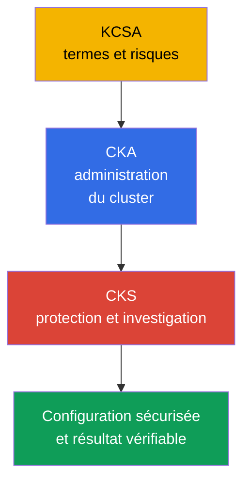
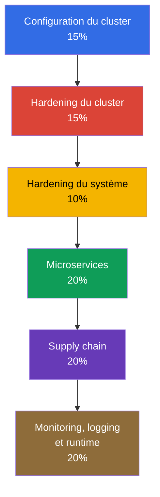
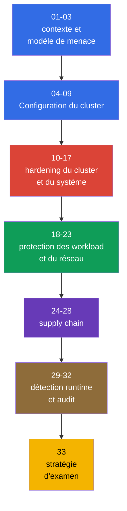

[Русская версия](ru.md) · [Eng version](README.md) · [Versión en español](es.md) · [Deutsche Version](de.md) · [ქართული ვერსია](ge.md) · [繁體中文版](tw.md) · [日本語版](jp.md)

# Chapitre 01. Introduction : l'examen CKS, ses différences avec CKA et l'organisation du cours

> **Le problème.** Un cluster Kubernetes peut sembler opérationnel à un administrateur CKA tout en restant non sécurisé : des décisions isolées concernant le réseau, RBAC, les images et les journaux ne constituent pas une protection sans modèle de menace et sans vérification du résultat. Ce chapitre établit la carte des domaines, des prérequis et des outils, afin que les mesures de hardening qui suivent fassent partie d'une defense in depth plutôt que d'un ensemble de commandes sans lien.

> **La suite.** CKS vérifie qu'un ingénieur sait sécuriser un cluster Kubernetes déjà en fonctionnement et examiner les conséquences d'une compromission. Cette partie d'introduction facultative du cours fixe la version de Kubernetes, le format de préparation et la carte des six domaines. Ensuite viennent le modèle de menace Kubernetes au chapitre 02, puis des mesures pratiques de hardening.

> **Ce qu'il faut connaître de CKA.** CKS prolonge CKA, sans le remplacer. Avant de commencer, révisez [l'introduction à CKA](../../../cka/course/01/fr.md) et [la table des matières CKA](../../../cka/course/README_FR.md). Le cours suppose une maîtrise de `kubectl`, des manifest YAML, de Pod, Service, Ingress, RBAC, ServiceAccount, TLS, kubeadm et des composants du control plane. Si vous ne maîtrisez pas encore les termes fondamentaux et le modèle de menace cloud native, commencez par le [cours KCSA](../../../kcsa/course/README_FR.md) - il n'est pas formellement obligatoire, mais il fournit le vocabulaire sur lequel CKS s'appuie constamment.

> 🧠 KCSA apporte le langage du risque, CKA la base opérationnelle, et CKS applique ces connaissances pour limiter et examiner une compromission.

## 01.1 Qu'est-ce que CKS et en quoi diffère-t-il de CKA et KCSA ?

**Certified Kubernetes Security Specialist (CKS)** est un examen pratique de la Linux Foundation consacré à la sécurité Kubernetes. Il ne vérifie pas la capacité à nommer un mécanisme, mais à trouver une configuration non sécurisée, à appliquer une protection et à vérifier qu'elle fonctionne réellement.

| Certification | Question principale | Actions typiques |
|---|---|---|
| KCSA | Quels sont les risques de Kubernetes ? | Expliquer les principes et la terminologie de base |
| CKA | Comment déployer et administrer un cluster ? | Diagnostiquer les composants, le réseau, le storage et les mises à niveau |
| CKS | Comment limiter et détecter une compromission ? | Configurer des policy, du hardening, audit, le scanning et la protection runtime |

CKA fournit la base opérationnelle : comment fonctionnent API server, kubelet, CNI, RBAC et static Pod. CKS emploie ces connaissances dans un scénario de sécurité. Par exemple, CKA apprend à créer une `NetworkPolicy`, alors que CKS demande de commencer par default-deny, de ne pas casser DNS, de limiter le metadata endpoint et de prouver par un test que le trafic interdit ne passe pas.

KCSA (Kubernetes and Cloud Native Security Associate) est un cours distinct, facultatif pour CKS : [`tasks/kcsa`](../../../kcsa/course/README_FR.md). Il donne une compréhension de niveau conceptuel du modèle de menace cloud native (4C, supply chain, admission control, observability) sans partie hands-on - le format KCSA est un multiple choice, et non des tâches performance-based. Si vous devez encore vérifier la définition du vocabulaire du tableau ci-dessus (threat model, admission control, RBAC comme termes et non comme commandes), suivez KCSA avant CKS ; si vous vous orientez déjà librement parmi ces notions, vous pouvez ignorer KCSA et passer directement de CKA à CKS.

La sécurité n'est pas un paramètre distinct appliqué à la fin d'un projet. Une erreur dans une image, une Role trop étendue, un kubelet exposé ou l'absence d'audit logs constituent une même surface d'attaque. Les chapitres du cours relient donc chaque protection au chemin probable de l'attaquant et à une vérification observable du résultat.

> 🎯 Confirmez les règles et la version de la tentative, comprenez le curriculum, le prérequis CKA et les outils par couche.

## 01.2 Format de l'examen, version et documentation

L'examen CKS est performance-based : les tâches pratiques sont réalisées dans un terminal sur les clusters et les nodes fournis. Vous disposez de 2 heures et le score de réussite est de 67 %. Au moment de la vérification, les Important Instructions indiquent **15-20 tâches pratiques** ; c'est un paramètre instantané que la Linux Foundation peut modifier. L'inscription et le passage de CKS nécessitent d'avoir auparavant réussi CKA, mais sa validité peut expirer au moment de CKS : le certificat CKA n'a pas à rester actif. Un bon modèle de préparation consiste à changer délibérément de context et à vérifier l'état réel après chaque modification.

Une tâche peut attribuer un host distinct : dans ce cas, exécutez `ssh <host>` depuis la machine de base (`base`), réalisez le travail et revenez sur `base`. Le SSH imbriqué entre les host cibles n'est pas pris en charge. Les ensembles d'outils préinstallés sur `base` et sur le host cible peuvent différer ; commencez donc par vérifier où exactement une commande doit être exécutée. **L'inscription CKS standard** comprend deux tentatives d'examen réelles (**One Retake**) pendant une eligibility window de **12 mois** ; le certificat obtenu est valable **2 ans**. Il ne s'agit pas de tentatives de simulator : l'inscription standard comprend aussi deux tentatives du Killer.sh simulator, chacune activée pendant **36 heures** et contenant **17 questions** ; **CKS-SINGLE n'inclut pas l'accès au simulator**. Entraînez le cycle complet : lire la condition, choisir le host/context, faire la modification minimale et vérifier le résultat.

Les versions de Kubernetes doivent être distinguées :

- **La version du cours et des core labs `101-113` est `v1.36`** (`k8_version = "1.36.0"` dans leurs environnements de laboratoire) : elle sert à vérifier les commandes Kubernetes-native, les flags et le comportement des API du cours ; la compatibilité des composants third-party doit être vérifiée dans leur propre support matrix. Il existe une exception intentionnelle - la lab `113` démarre sur `v1.35.x`, car son sujet est le minor upgrade lui-même vers `v1.36.x`.
- **La version de l'environnement d'examen est définie par la Linux Foundation, et elle peut être en retard sur celle du cours.** La page principale [CKS](https://training.linuxfoundation.org/certification/certified-kubernetes-security-specialist/) indique Kubernetes **v1.35**, mais les Important Instructions et la FAQ sont mises à jour indépendamment et peuvent temporairement afficher une autre version. Pour une tentative précise, ExamUI et les instructions de l'examen programmé prévalent. L'aperçu du curriculum CNCF publié porte toujours le nom de [`CKS Curriculum v1.34`](https://github.com/cncf/curriculum/tree/master/cks), mais cela ne remplace pas les paramètres indiqués par la Linux Foundation pour votre tentative. Par conséquent, **ne considérez pas `v1.36` comme la version de l'examen**.

La page CKS et la FAQ sont mises à jour indépendamment et peuvent temporairement diverger. Immédiatement avant une tentative, confirmez la version de Kubernetes, le nombre et le format des tâches, le score de réussite, le prérequis et les ressources autorisées, d'abord sur la page principale [CKS](https://training.linuxfoundation.org/certification/certified-kubernetes-security-specialist/), puis dans ExamUI pour la tentative programmée. Ne considérez pas comme permanentes la version et les règles consignées dans le cours.

La différence pratique est la suivante : vérifiez la syntaxe des objets et le comportement admission avec la documentation de la version ouverte dans l'environnement d'examen, et non avec la version du cours.

| Domaine | Core labs `101-112` : v1.36 | Examen : v1.35 ou version effective de la tentative |
|---|---|---|
| API Kubernetes de base et techniques CKS | Entraînez-vous à la syntaxe habituelle, mais vérifiez le support du CNI/runtime | Vérifiez la documentation et ExamUI de la tentative concernée |
| User Namespaces | `hostUsers: false` est devenu Stable/GA dans v1.36 ; une lab peut s'appuyer sur ce comportement | Ne transposez pas automatiquement ce comportement à une tentative : vérifiez la version, le runtime et la disponibilité de la fonctionnalité |
| Nouveaux champs et comportement admission | Utiles pour l'apprentissage, mais sans promesse pour l'examen | Employez seulement l'API et le comportement de la version indiquée par l'environnement |

LF maintient les ressources autorisées séparément du curriculum et de ses poids. Il s'agit d'un instantané limité dans le temps : à la date de la dernière vérification, **2026-08-31**, la liste CKS globale comprend la **Quick Reference** de la tâche, la documentation et le blog Kubernetes, ainsi que la documentation de Falco, `bom`, etcd, NGINX Ingress Controller, Cilium et Istio. La documentation, les pages man et les paquets de la distribution disponibles dans le terminal d'examen sont également autorisés. La liste peut changer indépendamment du curriculum : juste avant l'examen, vérifiez de nouveau la page LF [Resources Allowed](https://docs.linuxfoundation.org/tc-docs/certification/certification-resources-allowed) et les liens disponibles dans ExamUI.

| Ressource | Usage | Disponibilité |
|---|---|---|
| **Quick Reference** de la tâche | Matériel de référence concis fourni dans l'environnement d'examen | autorisée |
| [Kubernetes Documentation](https://kubernetes.io/docs/) et [Kubernetes Blog](https://kubernetes.io/blog/) | API d'objets, SecurityContext, PSA, audit, kubeadm, flags des composants | autorisée |
| [Cilium](https://docs.cilium.io/en/stable/) | `CiliumNetworkPolicy`, Hubble, encryption et mutual authentication | autorisée |
| [Istio](https://istio.io/latest/docs/) | `PeerAuthentication` et mTLS | autorisée |
| [etcd](https://etcd.io/docs/) | `etcdctl`, TLS et exploitation d'etcd | autorisée |
| [kubernetes-sigs/bom](https://kubernetes-sigs.github.io/bom/cli-reference/) | Génération de SBOM SPDX | autorisée |
| [NGINX Ingress Controller](https://kubernetes.github.io/ingress-nginx/) | TLS termination et redirection HTTP-vers-HTTPS (voir 08.5 sur le retirement) | autorisée |
| [Falco](https://falco.org/docs/) | Règles runtime, événements et diagnostic | autorisée |
| Documentation, pages man et paquets de la distribution du terminal d'examen | Référence locale et informations sur les logiciels installés | autorisés |
| [Trivy](https://trivy.dev/latest/docs/) | Scanning d'image, filesystem, config et SBOM | ressource d'apprentissage ; ne figure pas dans la liste LF globale à la date de vérification |
| [AppArmor](https://gitlab.com/apparmor/apparmor/-/wikis/Documentation) | Profils MAC et leur chargement sur un node | ressource d'apprentissage ; ne figure pas dans la liste LF globale à la date de vérification |

Ne vous appuyez pas sur des notes locales enregistrées comme source de syntaxe et n'essayez pas d'ouvrir des moteurs de recherche externes ou des sites third-party hors de la liste autorisée. Identifiez d'abord l'objet et la version d'API, puis trouvez l'exemple exact dans la documentation autorisée. Le chapitre 33 est destiné à la stratégie d'examen et au checklist final.

## 01.3 Curriculum officiel CKS

Les changements du curriculum datés du **15 octobre 2024** sont entrés en vigueur ce jour-là. Les poids actuels ci-dessous proviennent de la Linux Foundation ; le dépôt public du curriculum CNCF peut encore afficher les anciens `10% / 15% / 15%`, ne l'utilisez donc pas comme source des poids actuels. Le poids d'un domaine est un repère pour répartir le temps, et non un substitut à la vérification de chaque compétence.

| Domaine | Poids | Chapitres du cours |
|---|---:|---|
| Cluster Setup | 15% | 04-09 |
| Cluster Hardening | 15% | 10-13 |
| System Hardening | 10% | 14-17 |
| Minimize Microservice Vulnerabilities | 20% | 18-23 |
| Supply Chain Security | 20% | 24-28 |
| Monitoring, Logging and Runtime Security | 20% | 29-32 |

L'édition 2024 contient des thèmes qui exigent une pratique dédiée, et pas seulement la connaissance des termes :

- `CiliumNetworkPolicy` avec des règles L3/L4/L7, une policy DNS-aware et Hubble.
- Cilium transparent encryption et mutual authentication, ainsi qu'Istio mTLS.
- CIS Kubernetes Benchmark et `kube-bench`.
- SBOM aux formats SPDX/CycloneDX, notamment `syft` et `bom`.
- `kube-linter` avec `kubesec` et `hadolint`.
- Sandboxed containers via `RuntimeClass` : gVisor (`runsc`) et Kata Containers.

La carte complète « compétence -> chapitre » se trouve dans [la table des matières du cours](../README_FR.md#compétence--chapitre). L'essentiel est ici de voir la logique : les policy limitent l'accès, le hardening réduit la surface d'attaque, la supply chain empêche un artefact non fiable, et la protection runtime ainsi qu'audit aident à détecter le risque restant.

## 01.4 Prérequis CKA : ce que ce cours ne répète pas

CKS ne répète pas la syntaxe de base ni le fonctionnement de Kubernetes. Si, durant une tâche, vous perdez du temps à chercher une simple commande `kubectl`, revenez d'abord à CKA. CKS exige les compétences suivantes.

| Compétence de niveau CKA | Où la réviser | Utilisation dans CKS |
|---|---|---|
| SecurityContext et capabilities | [chapitre 20](../../../cka/course/20/fr.md) | Hardened Pod, PSA, seccomp, AppArmor, immutable rootfs |
| Secret, ServiceAccount et admission | [chapitre 19](../../../cka/course/19/fr.md), [chapitre 21](../../../cka/course/21/fr.md) | Protection des secrets, des tokens et du policy admission |
| Images et Dockerfile | [chapitre 23](../../../cka/course/23/fr.md) | Images minimales, SBOM, scan et signature |
| NetworkPolicy et réseau de Pod | [chapitre 34](../../../cka/course/34/fr.md), [chapitre 30](../../../cka/course/30/fr.md) | Default-deny, protection de metadata, policy Cilium |
| kubeadm, upgrade et PKI | [chapitre 35](../../../cka/course/35/fr.md), [chapitre 36](../../../cka/course/36/fr.md), [chapitre 39](../../../cka/course/39/fr.md) | CIS, TLS hardening, audit et mise à niveau de composants vulnérables |
| Container runtime et CRI | [chapitre 40](../../../cka/course/40/fr.md) | RuntimeClass, gVisor et investigation sur le node |

Ne réécrivez pas un grand manifest si une tâche demande seulement d'ajouter un `securityContext` ou un label de namespace. Utilisez `kubectl get ... -o yaml`, modifiez précisément l'objet, appliquez-le et vérifiez le résultat. Ce cycle réduit le risque de casser accidentellement une configuration qui fonctionne.

## 01.5 Outils du cours

Un outil ne remplace pas un modèle de menace. Choisissez-le selon ce qui est contrôlé : configuration du control plane, manifest, image, artefact ou action d'un processus pendant l'exécution.

| Outil | Ce qu'il vérifie ou réalise | Chapitres principaux |
|---|---|---|
| `kube-bench` | Compare la configuration des nodes et des composants au CIS Benchmark | 07 |
| `trivy` | Trouve les CVE dans image, filesystem, config et SBOM | 28 |
| `kubesec`, `kube-linter`, `hadolint` | Analysent statiquement les manifest et Dockerfile avant deploy | 27 |
| `syft`, `bom` | Créent un SBOM pour image et les artefacts | 25 |
| `cosign` / sigstore | Signent et vérifient une image | 26 |
| Falco | Observe les événements runtime suspects par syscall/eBPF | 29-30 |
| Cilium et Hubble | Mettent en œuvre et observent les policy réseau, encryption et mTLS | 06, 23 |
| OPA/Gatekeeper et Kyverno | Empêchent l'admission de manifest qui violent les policy | 20, 26 |
| gVisor (`runsc`) et Kata | Isolent les workload via un sandbox runtime | 22 |

Avant d'exécuter un scanner, identifiez l'objet vérifié et la décision attendue. Par exemple, un avertissement `trivy` ne signifie pas que tout CVE est immédiatement exploitable : il faut tenir compte du paquet, du chemin d'exécution, de la disponibilité d'une image corrigée et du risque pour le workload concerné. À l'inverse, un rapport propre ne supprime pas le besoin de RBAC, de network isolation et de runtime monitoring.

## 01.6 Organisation du cours et préparation

Le cours progresse du modèle de menace vers les couches de protection. Chaque chapitre thématique contient un scénario d'attaque, une configuration de protection, une vérification, des erreurs typiques et des pratiques production. Les laboratoires commencent à 101 et vérifient automatiquement le résultat avec `check_result`.

Ordre de préparation pratique :

1. Vérifiez les prérequis CKA de la section 01.4 et préparez un petit ensemble de commandes pour consulter YAML, logs et events.
2. Suivez les chapitres dans l'ordre et réalisez la lab associée après chacun. Ne lisez pas la solution avant votre première tentative autonome.
3. Pour chaque protection, effectuez une vérification négative : un Pod forbidden doit être rejeté, un port fermé ne doit pas répondre et un trafic interdit ne doit pas passer.
4. Entraînez-vous séparément sur un node : static Pod manifest, kubelet config, profil AppArmor/seccomp, audit policy et vérification systemd.
5. Avant l'examen, suivez les chapitres 29-33 et répétez les tâches avec une contrainte de temps.

Une erreur typique consiste à appliquer un outil de sécurité sans vérifier le chemin d'attaque. Par exemple, la présence d'une `NetworkPolicy` dans un namespace ne prouve pas que le CNI l'a appliquée ; `EncryptionConfiguration` ne signifie pas que les Secret existants ont été rechiffrés ; la présence d'une règle Falco ne prouve pas qu'elle est chargée et qu'elle produit réellement un événement. Dans ce cours, la vérification fait partie de la solution.

> 🏭 Modèle de menace, policy et hardening versionnés, vérifications CI, application observable et exceptions réévaluées.

## 01.7 Application en production

- **La sécurité comme cycle d'ingénierie.** L'équipe décrit le modèle de menace, introduit les policy et le hardening dans l'IaC, les vérifie dans CI et observe le résultat en production.
- **Droits minimaux par défaut.** Les nouveaux workload reçoivent un SecurityContext non-root, un ServiceAccount restreint, network default-deny et des dépendances explicitement autorisées.
- **Décaler les vérifications vers la gauche.** `hadolint`, `kube-linter`, `kubesec`, SBOM et `trivy` sont exécutés avant la publication d'une image ; le policy admission ne permet pas de contourner les exigences critiques.
- **La protection des nodes est tout aussi importante.** L'accès à kubelet, au container runtime socket, à etcd, au static Pod manifest et aux fichiers audit est restreint aussi strictement que l'accès à l'API.
- **Exceptions vérifiables.** Si un workload nécessite une capability, le privileged mode ou l'accès à hostPath, l'exception est documentée, limitée au namespace et réexaminée périodiquement.

## 01.8 Mini-glossaire

- **CKS** - Certified Kubernetes Security Specialist, certification pratique de sécurité Kubernetes.
- **Performance-based** - format dans lequel le résultat est atteint dans un environnement de travail, et non choisi dans un test.
- **CIS Benchmark** - ensemble de recommandations pour la configuration sécurisée des composants et des nodes.
- **SBOM** - Software Bill of Materials, inventaire des composants d'un artefact logiciel.
- **Admission policy** - règle qui autorise, modifie ou rejette une demande vers l'API Kubernetes.
- **Runtime security** - détection et limitation du comportement suspect d'un workload en cours d'exécution.
- **Defense in depth** - application de couches de protection indépendantes plutôt que d'un contrôle unique.

## 01.9 Résumé du chapitre

- CKS prolonge CKA et vérifie la protection pratique du cluster, des workloads, des nodes et de la supply chain.
- La version cible du cours et des core labs `101-113` est Kubernetes v1.36 (la lab `113` démarre sur v1.35.x, car son sujet est le upgrade lui-même vers v1.36.x).
- L'examen exige une maîtrise du terminal, de plusieurs clusters et de la configuration des nodes.
- Les six domaines couvrent la configuration du cluster, le hardening, les workloads, la supply chain et la protection runtime.
- Les nouveaux axes du programme 2024 sont Cilium, CIS, SBOM, KubeLinter et les sandboxed containers.
- Un outil n'a de valeur qu'avec la vérification : il faut démontrer que la protection a fonctionné et que l'attaque ne passe pas.

> 🎯 Déterminez d'abord la couche du problème - API/RBAC, réseau, node, image ou runtime - puis appliquez la modification minimale et vérifiez exactement la condition de la tâche.

> 🏭 Secure configuration, limitation des accès, contrôle des artefacts, journalisation et investigation fonctionnent ensemble.

## 01.10 Utilité pour l'examen et le travail réel

**À l'examen.** Ce chapitre aide à reconnaître immédiatement la classe d'une tâche et à choisir l'outil approprié. Avant toute modification, déterminez sur quelle couche se situe le problème : API/RBAC, réseau, node, image ou runtime. Appliquez ensuite la modification minimale et vérifiez précisément la condition demandée par la tâche.

**Dans le travail réel.** La carte des domaines évite une approche étroite dans laquelle l'équipe ne fait que scanner des images ou n'interdit que les Pod privileged. Une protection fiable réunit secure configuration, limitation des accès, contrôle des artefacts, journalisation et investigation.

## 01.11 Questions d'autoévaluation

1. Pourquoi ne peut-on pas préparer CKS sans un niveau CKA solide ?

CKS prolonge CKA et suppose une maîtrise de `kubectl`, des manifest YAML, de Pod, Service, Ingress, RBAC, TLS, kubeadm et du control plane. Dans CKS, les mécanismes de base servent un scénario de protection : par exemple, il ne suffit pas de créer une `NetworkPolicy`, il faut commencer par default-deny, conserver DNS et démontrer par un test négatif que le flux interdit ne passe pas.

2. En quoi un examen performance-based diffère-t-il d'un test à choix de réponse ?

Dans un format performance-based, une tâche est réalisée dans le terminal sur les clusters et les nodes fournis, au lieu de choisir une réponse préparée. Il faut déterminer le host ou le context nécessaire, faire la correction minimale et vérifier l'état réel ; lorsqu'un host distinct est attribué, le travail commence par `ssh <host>` depuis la machine `base`.

3. Quelle version de Kubernetes est fixée dans ce cours et ces laboratoires ?

Pour le cours et les core labs `101-113`, Kubernetes `v1.36` est fixée (`k8_version = "1.36.0"`). La version de l'examen est définie par la Linux Foundation et ne peut pas être déduite automatiquement de la version du cours.

4. Quels sont les six domaines de CKS, et lesquels ont le poids le plus élevé ?

Les domaines sont Cluster Setup, Cluster Hardening, System Hardening, Minimize Microservice Vulnerabilities, Supply Chain Security et Monitoring, Logging and Runtime Security. Minimize Microservice Vulnerabilities, Supply Chain Security et Monitoring, Logging and Runtime Security représentent chacun 20 % ; Cluster Setup et Cluster Hardening représentent chacun 15 %, et System Hardening 10 %.

5. Quels thèmes ont été ajoutés ou renforcés par le programme 2024 ?

Une pratique spécifique est requise pour `CiliumNetworkPolicy` avec L3/L4/L7, les policy DNS-aware et Hubble, ainsi que pour Cilium encryption/mutual authentication et Istio mTLS. Le programme met aussi en avant CIS/kube-bench, les SBOM via SPDX/CycloneDX et `syft`/`bom`, `kube-linter`, `kubesec`, `hadolint` et les sandboxed containers par RuntimeClass avec gVisor ou Kata.

6. Quand utiliser `kube-bench`, `trivy`, `kube-linter` et Falco ?

`kube-bench` compare la configuration des nodes et des composants au CIS Benchmark, tandis que `trivy` recherche les CVE dans image, filesystem, config et SBOM. `kube-linter` analyse statiquement les manifest Kubernetes avant deploy, tandis que Falco observe les événements runtime suspects par syscall/eBPF.

7. Pourquoi ne suffit-il pas d'appliquer un manifest pour une configuration de sécurité ?

La présence d'un manifest ne prouve pas que la protection fonctionne : le CNI peut ne pas appliquer `NetworkPolicy`, les Secret existants peuvent ne pas avoir été rechiffrés après `EncryptionConfiguration`, et une règle Falco peut ne pas être chargée. Après chaque modification, il faut vérifier le résultat demandé : par exemple, le rejet d'un Pod forbidden, l'inaccessibilité d'un port fermé ou l'absence de trafic réseau interdit.

## Pratique

Cette introduction n'a pas de laboratoire distinct : elle fixe le format du cours, et non une compétence technique. Passez maintenant directement au [chapitre 02](../02/fr.md) : il apporte le modèle de menace, sans lequel il est trop tôt pour aborder des protections concrètes. Le premier laboratoire du cours est la [lab 101](../../labs/101/README_FR.MD) (default-deny `NetworkPolicy`, DNS egress et protection du metadata endpoint) ; il ne prendra son sens qu'après les chapitres 04-05, où le mécanisme NetworkPolicy lui-même est expliqué. Le réaliser plus tôt n'apporterait pas l'effet pour lequel les labs existent dans ce cours (niveau 2 - « comprendre le mécanisme », et non deviner la commande).

---
[Table des matières](../README_FR.md) · [Chapitre 02](../02/fr.md)
