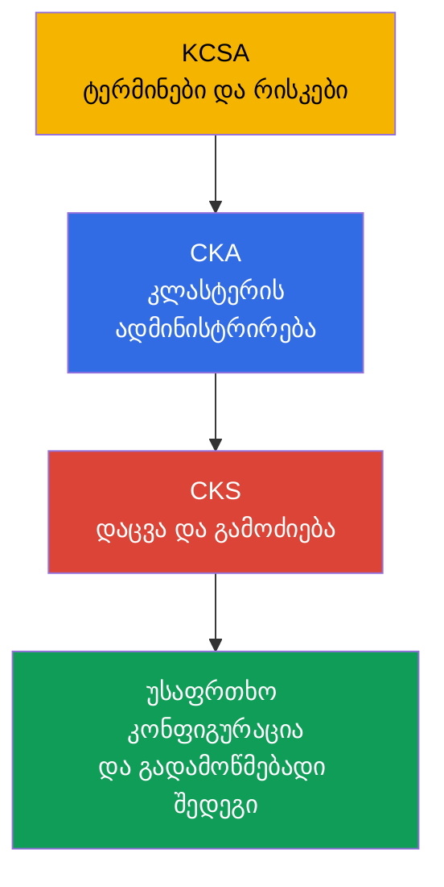
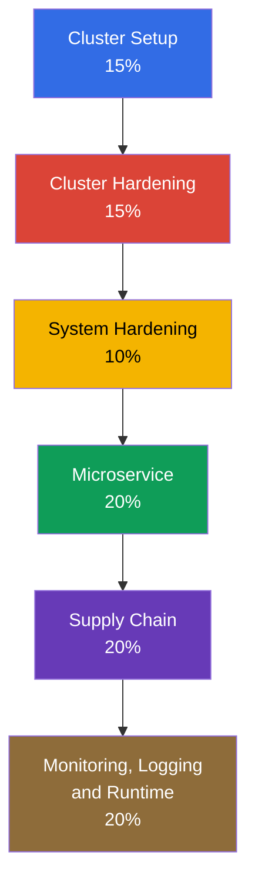
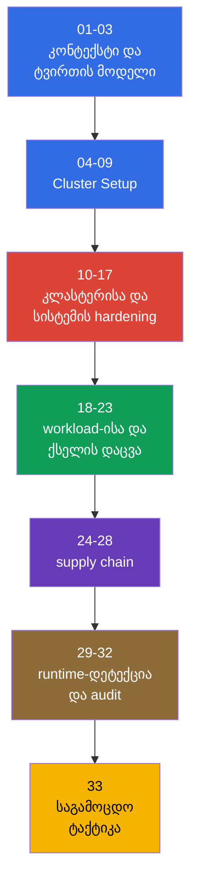

[Русская версия](ru.md) · [Eng version](README.md) · [Versión en español](es.md) · [Version française](fr.md) · [Deutsche Version](de.md) · [繁體中文版](tw.md) · [日本語版](jp.md)

# თავი 01. შესავალი: CKS გამოცდა, განსხვავებები CKA-სგან და კურსის აგებულება

> **პრობლემა.** Kubernetes-კლასტერი შეიძლება მუშა სახით ჩანდეს CKA-ადმინისტრატორისთვის,
> მაგრამ დაუცველი დარჩეს: ცალკეული გადაწყვეტილებები ქსელზე, RBAC-ზე, image-ებსა და
> ჟურნალებზე თავისთავად დაცვად არ იკრიბება, თუ არ არსებობს ტვირთის მოდელი და შედეგის
> გადამოწმება. ეს თავი გვთავაზობს დომენების, prerequisite-ებისა და ინსტრუმენტების რუკას,
> რათა შემდგომი hardening-ის ზომები defense in depth-ის ნაწილი გახდეს და არა
> ერთმანეთთან დაუკავშირებელი ბრძანებების ნაკრები.

> **რა არის შემდეგ.** CKS ამოწმებს, შეუძლია თუ არა ინჟინერს დაიცვას უკვე მოქმედი
> Kubernetes-კლასტერი და გამოიძიოს კომპრომეტაციის შედეგები. ეს არის კურსის შესავალი,
> არასავალდებულო ნაწილი: ის განსაზღვრავს Kubernetes-ის ვერსიას, მომზადების ფორმატს და
> ექვსივე დომენის რუკას. შემდეგ - Kubernetes-ის ტვირთის მოდელი 02-ე თავში, შემდეგ კი
> hardening-ის პრაქტიკული ზომები.

> **რა არის საჭირო CKA-დან.** CKS აგრძელებს CKA-ს და არ ცვლის მას. დაწყებამდე გაიმეორეთ
> [CKA-ის შესავალი](../../../cka/course/01/ge.md) და [CKA-ის სარჩევი](../../../cka/course/README_GE.md).
> კურსი ვარაუდობს დარწმუნებულ მუშაობას `kubectl`-თან, YAML-მანიფესტებთან, Pod-თან,
> Service-თან, Ingress-თან, RBAC-თან, ServiceAccount-თან, TLS-თან, kubeadm-თან და
> control plane-ის კომპონენტებთან. თუ cloud native ტვირთის მოდელისა და საბაზისო
> ტერმინების საკითხში ჯერ არ ხართ დარწმუნებული, დაიწყეთ [KCSA კურსით](../../../kcsa/course/README_GE.md) -
> ის ფორმალურად არასავალდებულოა, მაგრამ იძლევა ლექსიკას, რომელსაც CKS მუდმივად ეყრდნობა.

> 🧠 KCSA იძლევა რისკების ენას, CKA - საოპერაციო საფუძველს, CKS კი ამ ცოდნას იყენებს
> კომპრომეტაციის შეზღუდვისა და გამოძიებისთვის.

## 01.1 რა არის CKS და რით განსხვავდება ის CKA-სა და KCSA-სგან

**Certified Kubernetes Security Specialist (CKS)** - Linux Foundation-ის პრაქტიკული
გამოცდაა Kubernetes-ის უსაფრთხოებაზე. ის ამოწმებს არა მექანიზმის სახელის დასახელების
უნარს, არამედ დაუცველი კონფიგურაციის პოვნას, დაცვის გამოყენებას და იმის შემოწმებას, რომ
ეს დაცვა მართლაც მუშაობს.

| სერტიფიკაცია | ძირითადი კითხვა | ტიპური მოქმედებები |
|---|---|---|
| KCSA | რა რისკები აქვს Kubernetes-ს? | საბაზისო პრინციპებისა და ტერმინოლოგიის ახსნა |
| CKA | როგორ გავშალო და ვმართო კლასტერი? | კომპონენტების, ქსელის, storage-ისა და განახლების დიაგნოსტიკა |
| CKS | როგორ შევზღუდო და აღმოვაჩინო კომპრომეტაცია? | policy-ის, hardening-ის, audit-ის, სკანირებისა და runtime-დაცვის კონფიგურირება |

CKA იძლევა საოპერაციო საფუძველს: როგორ მუშაობს API server, kubelet, CNI, RBAC და
static Pod. CKS ამ ცოდნას იყენებს უსაფრთხოების სცენარში. მაგალითად, CKA გასწავლით
`NetworkPolicy`-ის შექმნას, ხოლო CKS მოითხოვს, დაიწყოთ default-deny-დან, არ დაარღვიოთ
DNS, შეზღუდოთ metadata endpoint და ტესტით დაამტკიცოთ, რომ აკრძალული ტრაფიკი არ გადის.

KCSA (Kubernetes and Cloud Native Security Associate) - ცალკე, CKS-სთვის
არასავალდებულო კურსია: [`tasks/kcsa`](../../../kcsa/course/README_GE.md). ის იძლევა
cloud native ტვირთის მოდელის (4C, supply chain, admission control, observability)
კონცეპტუალურ დონეზე გაგებას, hands-on ნაწილის გარეშე - KCSA-ის ფორმატია multiple
choice და არა performance-based ამოცანები. თუ ზემოთ ცხრილში მოცემული ლექსიკა (threat
model, admission control, RBAC როგორც ტერმინები და არა ბრძანებები) ჯერ ცნობარით
გჭირდებათ შემოწმება, გაიარეთ KCSA CKS-მდე; თუ ამ ცნებებში უკვე თავისუფლად ორიენტირდებით,
KCSA შეგიძლიათ გამოტოვოთ და პირდაპირ CKA-დან CKS-ზე გადახვიდეთ.

უსაფრთხოება აქ არ არის ცალკე პარამეტრი, რომელსაც პროექტის ბოლოს ამატებენ. შეცდომა
image-ში, ზედმეტად ფართო Role, ღია kubelet ან audit-ჟურნალების არარსებობა ერთსა და იმავე
თავდასხმის ზედაპირს ქმნის. ამიტომ კურსის თავები აკავშირებენ დაცვას თავდამსხმელის
სავარაუდო გზასთან და შედეგის დაკვირვებად გადამოწმებასთან.

> 🎯 დაადასტურეთ წესები და მცდელობის ვერსია, გაერკვიეთ curriculum-ში, CKA
> prerequisite-სა და ინსტრუმენტებში ფენების მიხედვით.

## 01.2 გამოცდის ფორმატი, ვერსია და დოკუმენტაცია

CKS გამოცდა performance-based ფორმატისაა: პრაქტიკული ამოცანები სრულდება ტერმინალში,
მოწოდებულ კლასტერებსა და node-ებზე. გამოყოფილია 2 საათი, გამსვლელი ქულაა 67%.
შემოწმების მომენტში Important Instructions მიუთითებს **15-20 პრაქტიკულ ამოცანაზე**;
ეს არის სნეპშოტის პარამეტრი, რომელიც Linux Foundation-ს შეუძლია შეცვალოს. CKS-ზე
რეგისტრაციისა და ჩაბარებისთვის საჭიროა ადრე ჩაბარებული CKA, მაგრამ მისი მოქმედების
ვადა CKS-ის მომენტისთვის შეიძლება ამოწურული იყოს: CKA სერტიფიკატი არ არის ვალდებული
დარჩეს აქტიური. მომზადების სამუშაო მოდელია გააზრებულად context-ის გადართვა და
ყოველი ცვლილების შემდეგ ფაქტობრივი მდგომარეობის შემოწმება.

ამოცანამ შეიძლება ცალკე host მიანიჭოს: ასეთ შემთხვევაში შეასრულეთ `ssh <host>`
საბაზო მანქანიდან (`base`), შეასრულეთ სამუშაო და დაბრუნდით `base`-ზე. ჩადგმული SSH
სამიზნე host-ებს შორის მხარდაჭერილი არ არის. `base`-ზე და სამიზნე host-ზე
წინასწარდაყენებული ინსტრუმენტების ნაკრები შეიძლება განსხვავდებოდეს, ამიტომ ჯერ
შეამოწმეთ, სად სრულდება ბრძანება ზუსტად. **CKS-ის სტანდარტული რეგისტრაცია** მოიცავს
გამოცდის ორ რეალურ მცდელობას (**One Retake**) **12-თვიანი** eligibility window-ის
ფარგლებში; მიღებული სერტიფიკატი მოქმედებს **2 წელი**. ეს არ არის simulator-ის
მცდელობები: სტანდარტული რეგისტრაცია ასევე მოიცავს Killer.sh simulator-ის ორ
მცდელობას, თითოეული აქტიურდება **36 საათით** და შეიცავს **17 კითხვას**;
**CKS-SINGLE simulator-ზე წვდომას არ მოიცავს**. ივარჯიშეთ სრულ ციკლზე: პირობის
წაკითხვა, host/context-ის არჩევა, მინიმალური ცვლილების შეტანა და შედეგის შემოწმება.

Kubernetes-ის ვერსიები საჭიროა გავარჩიოთ:

- **ამ კურსის სასწავლო ვერსია და core labs `101-113` - `v1.36`** (`k8_version =
  "1.36.0"` მათ ლაბორატორიულ გარემოებში): მასზე მოწმდება Kubernetes-native
  ბრძანებები, flag-ები და API-ის ქცევა კურსისთვის; third-party კომპონენტების
  თავსებადობა საკუთარი support matrix-ით უნდა შემოწმდეს. კონსტრუქციით
  გამონაკლისია ლაბი `113`: მისი კლასტერი იწყება `v1.35.x`-ზე, რადგან დავალების
  თემაა თავად minor upgrade `v1.36.x`-მდე.
- **საგამოცდო გარემოს ვერსია Linux Foundation-ს განესაზღვრება, და ის შეიძლება
  კურსის ვერსიას ჩამორჩეს.** [CKS](https://training.linuxfoundation.org/certification/certified-kubernetes-security-specialist/)-ის
  ძირითადი გვერდი მიუთითებს Kubernetes **v1.35**-ს, თუმცა Important Instructions და
  FAQ დამოუკიდებლად განახლდება და დროებით სხვა ვერსია შეიძლება აჩვენოს. კონკრეტული
  მცდელობისთვის პრიორიტეტულია ExamUI და დანიშნული გამოცდის ინსტრუქციები. CNCF-ის
  გამოქვეყნებული curriculum overview ჯერ კიდევ ფაილის სახელით
  [`CKS Curriculum v1.34`](https://github.com/cncf/curriculum/tree/master/cks) რჩება,
  მაგრამ ეს არ აუქმებს Linux Foundation-ის მიერ თქვენი მცდელობისთვის მითითებულ
  პარამეტრებს. ამიტომ **არ ჩათვალოთ `v1.36` გამოცდის ვერსიად**.

CKS-ის გვერდი და FAQ დამოუკიდებლად განახლდება და დროებით შეიძლება ერთმანეთს არ
ემთხვეოდეს. მცდელობის წინ პირდაპირ დაადასტურეთ Kubernetes-ის ვერსია, ამოცანების
რაოდენობა და ფორმატი, გამსვლელი ქულა, prerequisite და დაშვებული რესურსები ჯერ
ძირითად გვერდზე [CKS](https://training.linuxfoundation.org/certification/certified-kubernetes-security-specialist/),
შემდეგ ExamUI-ში დანიშნული მცდელობისთვის. ნუ ჩათვლით მუდმივად ვალიდურად კურსში
დაფიქსირებულ ვერსიასა და წესებს.

პრაქტიკული განსხვავება ასეთია: ობიექტის სინტაქსი და admission-ის ქცევა შეადარეთ იმ
ვერსიის დოკუმენტაციას, რომელიც საგამოცდო გარემოშია ღია, და არა კურსის ვერსიას.

| სფერო | Core labs `101-112`: v1.36 | გამოცდა: v1.35 ან მცდელობის ფაქტობრივი ვერსია |
|---|---|---|
| Kubernetes-ის საბაზისო API და CKS-ის ხერხები | ივარჯიშეთ ჩვეულ სინტაქსზე, მაგრამ შეამოწმეთ CNI/runtime-ის მხარდაჭერა | შეადარეთ კონკრეტული მცდელობის დოკუმენტაციასა და ExamUI-ს |
| User Namespaces | `hostUsers: false` გახდა Stable/GA v1.36-ში; ლაბი შეიძლება ამ ქცევას ეყრდნობოდეს | ეს ქცევა ავტომატურად ნუ გადაიტანთ მცდელობაზე: შეამოწმეთ ვერსია, runtime და ფუნქციის ხელმისაწვდომობა |
| ახალი ველები და admission-ის ქცევა | სასარგებლოა სწავლისთვის, მაგრამ გამოცდის დაპირება არ არის | გამოიყენეთ მხოლოდ გარემოში მითითებული ვერსიის API და ქცევა |

LF დაშვებულ რესურსებს curriculum-ისა და მისი წონებისგან ცალკე უჭერს მხარს. ეს არის
დროზე მიბმული სნეპშოტი: ბოლო შემოწმების თარიღისთვის, **2026-08-31**, CKS-ის
გლობალური სია მოიცავს ამოცანის **Quick Reference**-ს, Kubernetes-ის დოკუმენტაციასა და
ბლოგს, აგრეთვე Falco-ს, `bom`-ის, etcd-ის, NGINX Ingress Controller-ის, Cilium-ისა
და Istio-ს დოკუმენტაციას. ასევე დაშვებულია საგამოცდო ტერმინალის დისტრიბუტივის
დოკუმენტაცია, man-გვერდები და პაკეტები. სია curriculum-ისგან დამოუკიდებლად შეიძლება
შეიცვალოს: გამოცდის წინ თავიდან შეამოწმეთ LF-ის გვერდი
[Resources Allowed](https://docs.linuxfoundation.org/tc-docs/certification/certification-resources-allowed)
და ExamUI-ში ხელმისაწვდომი ბმულები.

| რესურსი | რისთვის | ხელმისაწვდომობა |
|---|---|---|
| ამოცანის **Quick Reference** | მოკლე საცნობარო მასალა, მოწოდებული საგამოცდო გარემოში | დაშვებულია |
| [Kubernetes Documentation](https://kubernetes.io/docs/) და [Kubernetes Blog](https://kubernetes.io/blog/) | ობიექტების API, SecurityContext, PSA, audit, kubeadm, კომპონენტების flag-ები | დაშვებულია |
| [Cilium](https://docs.cilium.io/en/stable/) | `CiliumNetworkPolicy`, Hubble, encryption და mutual authentication | დაშვებულია |
| [Istio](https://istio.io/latest/docs/) | `PeerAuthentication` და mTLS | დაშვებულია |
| [etcd](https://etcd.io/docs/) | `etcdctl`, TLS და etcd-ის ექსპლუატაცია | დაშვებულია |
| [kubernetes-sigs/bom](https://kubernetes-sigs.github.io/bom/cli-reference/) | SPDX SBOM-ის გენერაცია | დაშვებულია |
| [NGINX Ingress Controller](https://kubernetes.github.io/ingress-nginx/) | TLS termination და HTTP-to-HTTPS redirect (იხ. 08.5 retirement-ის შესახებ) | დაშვებულია |
| [Falco](https://falco.org/docs/) | Runtime-წესები, მოვლენები და დიაგნოსტიკა | დაშვებულია |
| საგამოცდო ტერმინალის დისტრიბუტივის დოკუმენტაცია, man-გვერდები და პაკეტები | ლოკალური ცნობარი და დაყენებული პროგრამული უზრუნველყოფის შესახებ ინფორმაცია | დაშვებულია |
| [Trivy](https://trivy.dev/latest/docs/) | image-ის, filesystem-ის, config-ისა და SBOM-ის სკანირება | სასწავლო რესურსი; შემოწმების თარიღისთვის LF-ის გლობალურ სიაში არ იყო |
| [AppArmor](https://gitlab.com/apparmor/apparmor/-/wikis/Documentation) | MAC-პროფილები და მათი ჩატვირთვა node-ზე | სასწავლო რესურსი; შემოწმების თარიღისთვის LF-ის გლობალურ სიაში არ იყო |

ნუ დაეყრდნობით შენახულ ლოკალურ ჩანაწერებს, როგორც სინტაქსის წყაროს, და ნუ
შეეცდებით გახსნათ გარე საძიებო სისტემები ან დაშვებული სიის მიღმა third-party
საიტები. ჯერ დაადგინეთ ობიექტი და API-ის ვერსია, შემდეგ იპოვეთ ზუსტი მაგალითი
დაშვებულ დოკუმენტაციაში. საგამოცდო სტრატეგიისა და საბოლოო checklist-ისთვის 33-ე
თავია განკუთვნილი.

## 01.3 CKS-ის ოფიციალური პროგრამა

**2024 წლის 15 ოქტომბრის** curriculum-ის ცვლილებები იმავე თარიღიდან ამოქმედდა.
ქვემოთ მოცემული მოქმედი წონები Linux Foundation-იდანაა; CNCF-ის საჯარო
curriculum-რეპოზიტორია შეიძლება ჯერ კიდევ აჩვენებდეს ძველ `10% / 15% / 15%`-ს,
ამიტომ ის ნუ გამოიყენება მიმდინარე წონების წყაროდ. დომენის წონა დროის განაწილების
ორიენტირია და არა ყველა კომპეტენციის შემოწმების შემცვლელი.

| დომენი | წონა | კურსის თავები |
|---|---:|---|
| Cluster Setup | 15% | 04-09 |
| Cluster Hardening | 15% | 10-13 |
| System Hardening | 10% | 14-17 |
| Minimize Microservice Vulnerabilities | 20% | 18-23 |
| Supply Chain Security | 20% | 24-28 |
| Monitoring, Logging and Runtime Security | 20% | 29-32 |

2024 წლის რედაქციაში არის თემები, რომლებსაც ცალკე პრაქტიკა სჭირდება და არა მხოლოდ
ტერმინების ცოდნა:

- `CiliumNetworkPolicy` L3/L4/L7-წესებით, DNS-aware policy და Hubble.
- Cilium-ის transparent encryption და mutual authentication, ასევე Istio mTLS.
- CIS Kubernetes Benchmark და `kube-bench`.
- SBOM SPDX/CycloneDX ფორმატებში, მათ შორის `syft` და `bom`.
- `kube-linter` `kubesec`-თან და `hadolint`-თან ერთად.
- Sandboxed containers `RuntimeClass`-ით: gVisor (`runsc`) და Kata Containers.

სრული «კომპეტენცია -> თავი» რუკა მოცემულია [კურსის სარჩევში](../README_GE.md#კომპეტენცია--თავი).
აქ მნიშვნელოვანია ლოგიკის დანახვა: policy ზღუდავს წვდომას, hardening ამცირებს
თავდასხმის ზედაპირს, supply chain არ უშვებს არასანდო არტეფაქტს, ხოლო
runtime-დაცვა და audit ეხმარება დარჩენილი რისკის შემჩნევაში.

## 01.4 CKA prerequisite: რას არ იმეორებს ეს კურსი

CKS არ იმეორებს Kubernetes-ის საბაზისო სინტაქსსა და აგებულებას. თუ დავალების
შესრულებისას დროს ხარჯავთ მარტივი `kubectl`-ბრძანების ძებნაში, ჯერ დაუბრუნდით
CKA-ს. CKS-ისთვის საჭიროა შემდეგი უნარები.

| CKA-დონის უნარი | სად გავიმეოროთ | როგორ გამოიყენება CKS-ში |
|---|---|---|
| SecurityContext და capabilities | [თავი 20](../../../cka/course/20/ge.md) | Hardened Pod, PSA, seccomp, AppArmor, immutable rootfs |
| Secret, ServiceAccount და admission | [თავი 19](../../../cka/course/19/ge.md), [თავი 21](../../../cka/course/21/ge.md) | Secret-ების, token-ების და policy admission-ის დაცვა |
| Image-ები და Dockerfile | [თავი 23](../../../cka/course/23/ge.md) | მინიმალური image-ები, SBOM, scan და ხელმოწერა |
| NetworkPolicy და Pod-ის ქსელი | [თავი 34](../../../cka/course/34/ge.md), [თავი 30](../../../cka/course/30/ge.md) | Default-deny, metadata-ის დაცვა, Cilium policy |
| kubeadm, upgrade და PKI | [თავი 35](../../../cka/course/35/ge.md), [თავი 36](../../../cka/course/36/ge.md), [თავი 39](../../../cka/course/39/ge.md) | CIS, TLS hardening, audit, დაუცველი კომპონენტების განახლება |
| Container runtime და CRI | [თავი 40](../../../cka/course/40/ge.md) | RuntimeClass, gVisor, გამოძიება node-ზე |

არ გადაწეროთ დიდი მანიფესტი, თუ ამოცანა მხოლოდ `securityContext`-ის დამატებას ან
namespace-ის label-ს ითხოვს. გამოიყენეთ `kubectl get ... -o yaml`, წერტილოვნად
შეცვალეთ ობიექტი, გამოიყენეთ ცვლილება და შეამოწმეთ შედეგი. ასეთი ციკლი ამცირებს
რისკს, შემთხვევით დაარღვიოთ მომუშავე კონფიგურაცია.

## 01.5 კურსის ინსტრუმენტარიუმი

ინსტრუმენტი ტვირთის მოდელს არ ცვლის. ის უნდა შეირჩეს იმის მიხედვით, თუ რა
მოწმდება: control plane-ის კონფიგურაცია, მანიფესტი, image, არტეფაქტი თუ
პროცესის მოქმედება შესრულების დროს.

| ინსტრუმენტი | რას ამოწმებს ან აკეთებს | ძირითადი თავები |
|---|---|---|
| `kube-bench` | ადარებს node-ებისა და კომპონენტების კონფიგურაციას CIS Benchmark-თან | 07 |
| `trivy` | პოულობს CVE-ს image-ში, filesystem-ში, config-სა და SBOM-ში | 28 |
| `kubesec`, `kube-linter`, `hadolint` | სტატიკურად აანალიზებს manifest-სა და Dockerfile-ს deploy-მდე | 27 |
| `syft`, `bom` | ქმნის SBOM-ს image-ისა და არტეფაქტებისთვის | 25 |
| `cosign` / sigstore | ხელს აწერს და ამოწმებს image-ს | 26 |
| Falco | აკვირდება საეჭვო runtime-მოვლენებს syscall/eBPF-ის საშუალებით | 29-30 |
| Cilium და Hubble | ახორციელებს და აკვირდება ქსელურ policy-ებს, encryption-სა და mTLS-ს | 06, 23 |
| OPA/Gatekeeper და Kyverno | არ უშვებს manifest-ს, რომელიც policy-ს არღვევს | 20, 26 |
| gVisor (`runsc`) და Kata | იზოლირებს workload-ს sandbox runtime-ის საშუალებით | 22 |

scanner-ის გაშვებამდე დააფიქსირეთ შემოწმების ობიექტი და მოსალოდნელი გადაწყვეტილება.
მაგალითად, `trivy`-ის გაფრთხილება არ ნიშნავს, რომ ნებისმიერი CVE დაუყოვნებლივ
ექსპლუატირებადია: საჭიროა გავითვალისწინოთ პაკეტი, შესრულების გზა, გამოსწორებული
image-ის არსებობა და რისკი კონკრეტული ტვირთისთვის. და პირიქით, სუფთა ანგარიში არ
აუქმებს RBAC-ს, ქსელის იზოლაციასა და runtime monitoring-ს.

## 01.6 როგორ არის აგებული კურსი და როგორ მოვემზადოთ

კურსი ტვირთის მოდელიდან დაცვის ფენებისკენ მოძრაობს. ყოველი საგნობრივი თავი
შეიცავს თავდასხმის სცენარს, დაცვის კონფიგურაციას, გადამოწმებას, ტიპურ შეცდომებსა
და production-პრაქტიკას. ლაბორატორიული სამუშაოები 101-დან იწყება და შედეგს
ავტომატურად ამოწმებს `check_result`-ის საშუალებით.

მომზადების პრაქტიკული თანმიმდევრობა:

1. შეამოწმეთ 01.4 ნაწილის CKA prerequisite-ები და შეადგინეთ ბრძანებების მოკლე
   ნაკრები YAML-ის, log-ებისა და event-ების სანახავად.
2. გაიარეთ თავები თანმიმდევრობით და ყოველი შემდეგ შეასრულეთ დაკავშირებული
   ლაბორატორიული სამუშაო. ნუ წაიკითხავთ გადაწყვეტას პირველი დამოუკიდებელი
   მცდელობის წინ.
3. ყოველი დაცვისთვის ჩაატარეთ უარყოფითი შემოწმება: forbidden Pod უნდა იყოს
   უარყოფილი, დახურული port არ უნდა პასუხობდეს, აკრძალული ტრაფიკი არ უნდა გადიოდეს.
4. ცალკე ივარჯიშეთ node-ზე: static Pod manifest, kubelet config,
   AppArmor/seccomp profile, audit policy და systemd-ის შემოწმება.
5. გამოცდის წინ გაიარეთ 29-33 თავები და გაიმეორეთ ამოცანები დროის შეზღუდვით.

ტიპური შეცდომაა დაცვის საშუალების გამოყენება თავდასხმის გზის შემოწმების გარეშე.
მაგალითად, `NetworkPolicy`-ის არსებობა namespace-ში ჯერ არ ამტკიცებს, რომ CNI-მ
ის გამოიყენა; `EncryptionConfiguration` ჯერ არ ნიშნავს, რომ ძველი Secret-ები
თავიდან დაშიფრულია; Falco-წესის არსებობა ჯერ არ ნიშნავს, რომ ის ჩატვირთულია და
მართლაც წარმოქმნის მოვლენას. ამ კურსში გადამოწმება გადაწყვეტის ნაწილია.

> 🏭 Threat model, ვერსირებული policy და hardening, CI-შემოწმებები, დაკვირვებადი
> გამოყენება და გადასინჯვადი გამონაკლისები.

## 01.7 როგორ გამოიყენება ეს production-ში

- **უსაფრთხოება, როგორც საინჟინრო ციკლი.** გუნდი აღწერს ტვირთის მოდელს, ნერგავს
  policy-სა და hardening-ს IaC-ში, ამოწმებს მათ CI-ში და აკვირდება შედეგს
  production-ში.
- **მინიმალური უფლებები ნაგულისხმევად.** ახალი workload-ები იღებს non-root
  SecurityContext-ს, შეზღუდულ ServiceAccount-ს, network default-deny-ს და
  ცხადად დაშვებულ დამოკიდებულებებს.
- **შემოწმებების გადაწევა მარცხნივ.** `hadolint`, `kube-linter`, `kubesec`, SBOM
  და `trivy` სრულდება image-ის გამოქვეყნებამდე; admission policy არ აძლევს
  საშუალებას, გვერდი აუაროთ კრიტიკულ მოთხოვნებს.
- **Node-ების დაცვა არანაკლებ მნიშვნელოვანია.** წვდომა kubelet-ზე, container
  runtime socket-ზე, etcd-ზე, static Pod manifest-სა და audit-ფაილებზე
  შეზღუდულია ისევე მკაცრად, როგორც წვდომა API-ზე.
- **გადამოწმებადი გამონაკლისები.** თუ workload-ს ესაჭიროება capability,
  privileged mode ან წვდომა hostPath-ზე, გამონაკლისი დოკუმენტირდება,
  იზღუდება namespace-ით და პერიოდულად გადაისინჯება.

## 01.8 მინი-ლექსიკონი

- **CKS** - Certified Kubernetes Security Specialist, Kubernetes-ის
  უსაფრთხოების პრაქტიკული სერტიფიკაცია.
- **Performance-based** - ფორმატი, რომელშიც შედეგი მიიღწევა სამუშაო
  გარემოში და არა ტესტში აირჩევა.
- **CIS Benchmark** - კომპონენტებისა და node-ების უსაფრთხო კონფიგურაციის
  რეკომენდაციების ნაკრები.
- **SBOM** - Software Bill of Materials, პროგრამული არტეფაქტის კომპონენტების
  ნუსხა.
- **Admission policy** - წესი, რომელიც აძლევს, ცვლის ან უარყოფს მოთხოვნას
  Kubernetes API-სთან.
- **Runtime security** - მოქმედი ტვირთის საეჭვო ქცევის აღმოჩენა და შეზღუდვა.
- **Defense in depth** - ერთი კონტროლის ნაცვლად დამოუკიდებელი დაცვის
  ფენების გამოყენება.

## 01.9 თავის შეჯამება

- CKS აგრძელებს CKA-ს და ამოწმებს კლასტერის, workload-ების, node-ებისა და
  supply chain-ის პრაქტიკულ დაცვას.
- კურსისა და core labs `101-113`-ის სამიზნე ვერსიაა Kubernetes v1.36 (ლაბი
  `113` იწყება v1.35.x-ზე, რადგან მისი თემაა თავად upgrade v1.36-მდე).
- გამოცდა მოითხოვს დარწმუნებულ მუშაობას ტერმინალში, რამდენიმე კლასტერსა და
  node-ის კონფიგურაციასთან.
- ექვსი დომენი მოიცავს კლასტერის კონფიგურაციას, hardening-ს, workload-ს,
  supply chain-სა და runtime-დაცვას.
- 2024 წლის პროგრამის ახალი აქცენტებია Cilium, CIS, SBOM, KubeLinter და
  sandboxed containers.
- ინსტრუმენტი ღირებულია მხოლოდ გადამოწმებასთან ერთად: საჭიროა დამტკიცდეს,
  რომ დაცვამ იმუშავა და თავდასხმა არ გადის.

> 🎯 ჯერ დაადგინეთ პრობლემის ფენა - API/RBAC, ქსელი, node, image თუ runtime -
> შემდეგ გამოიყენეთ მინიმალური ცვლილება და შეამოწმეთ ზუსტად ამოცანის პირობა.

> 🏭 Secure configuration, წვდომის შეზღუდვა, არტეფაქტების კონტროლი,
> ჟურნალირება და გამოძიება ერთად მუშაობს.

## 01.10 როგორ გამოგადგებათ: გამოცდაზე და რეალურ სამუშაოში

**გამოცდაზე.** ეს თავი ეხმარება მაშინვე ამოცნათ ამოცანის კლასი და აირჩიოთ
სწორი ინსტრუმენტი. ცვლილებამდე დაადგინეთ, რომელ ფენაშია პრობლემა: API/RBAC,
ქსელი, node, image თუ runtime. შემდეგ გამოიყენეთ მინიმალური ცვლილება და
შეასრულეთ ზუსტად ის შემოწმება, რასაც ამოცანა ითხოვს.

**რეალურ სამუშაოში.** დომენების რუკა ხელს უშლის ვიწრო მიდგომას, როცა გუნდი
მხოლოდ image-ს სკანირებს ან მხოლოდ privileged Pod-ს კრძალავს. საიმედო დაცვა
აერთიანებს secure configuration-ს, წვდომის შეზღუდვას, არტეფაქტების კონტროლს,
ჟურნალირებასა და გამოძიებას.

## 01.11 თვითშემოწმების კითხვები

1. რატომ არ შეიძლება CKS-ის მომზადება CKA-ის დარწმუნებული დონის გარეშე?

CKS აგრძელებს CKA-ს და ვარაუდობს დარწმუნებულ მუშაობას `kubectl`-თან,
YAML-მანიფესტებთან, Pod-თან, Service-თან, Ingress-თან, RBAC-თან, TLS-თან,
kubeadm-თან და control plane-თან. CKS-ში საბაზისო მექანიზმები გამოიყენება
დაცვის სცენარში: მაგალითად, საჭიროა არა უბრალოდ `NetworkPolicy`-ის შექმნა,
არამედ დაწყება default-deny-დან, DNS-ის შენარჩუნება და უარყოფითი ტესტით
დამტკიცება, რომ აკრძალული ნაკადი არ გადის.

2. რით განსხვავდება performance-based გამოცდა პასუხის ვარიანტებიანი ტესტისგან?

Performance-based ფორმატში ამოცანა სრულდება ტერმინალში, მოწოდებულ
კლასტერებსა და node-ებზე, და არა მზა პასუხის არჩევით. საჭიროა
დადგინდეს საჭირო host ან context, შევიდეს მინიმალური ცვლილება და
შემოწმდეს ფაქტობრივი მდგომარეობა; ცალკე host-ის დანიშვნისას სამუშაო
იწყება `ssh <host>`-ით `base` მანქანიდან.

3. Kubernetes-ის რომელი ვერსია ფიქსირდება ამ კურსსა და ლაბორატორიულ სამუშაოებში?

სწავლებისა და core labs `101-113`-ისთვის ფიქსირდება Kubernetes `v1.36`
(`k8_version = "1.36.0"`). გამოცდის ვერსიას განსაზღვრავს Linux Foundation, და
მისი ავტომატურად გამოყვანა კურსის ვერსიიდან არ შეიძლება.

4. CKS-ის რომელი ექვსი დომენი არსებობს და რომელს აქვს ყველაზე დიდი წონა?

დომენებია: Cluster Setup, Cluster Hardening, System Hardening, Minimize
Microservice Vulnerabilities, Supply Chain Security და Monitoring, Logging
and Runtime Security. 20%-ს შეადგენს Minimize Microservice Vulnerabilities,
Supply Chain Security და Monitoring, Logging and Runtime Security; Cluster
Setup-სა და Cluster Hardening-ს - 15% თითოეულს, System Hardening-ს - 10%.

5. რომელი თემები დაემატა ან გაძლიერდა 2024 წლის პროგრამით?

ცალკე პრაქტიკას მოითხოვს `CiliumNetworkPolicy` L3/L4/L7-ით, DNS-aware policy
და Hubble, ასევე Cilium-ის encryption/mutual authentication და Istio mTLS.
პროგრამაში ასევე გამოკვეთილია CIS/kube-bench, SBOM SPDX/CycloneDX-ის
საშუალებით და `syft`/`bom`, `kube-linter`, `kubesec`, `hadolint` და
sandboxed containers RuntimeClass-ის საშუალებით gVisor-ით ან Kata-თი.

6. როდის გამოვიყენოთ `kube-bench`, `trivy`, `kube-linter` და Falco?

`kube-bench` ადარებს node-ებისა და კომპონენტების კონფიგურაციას CIS
Benchmark-თან, ხოლო `trivy` ეძებს CVE-ს image-ში, filesystem-ში, config-სა
და SBOM-ში. `kube-linter` სტატიკურად აანალიზებს Kubernetes-მანიფესტებს
deploy-მდე, მაშინ როცა Falco აკვირდება საეჭვო runtime-მოვლენებს
syscall/eBPF-ის საშუალებით.

7. რატომ არ არის საკმარისი მხოლოდ manifest-ის გამოყენება უსაფრთხოების კონფიგურაციისთვის?

მანიფესტის არსებობა ჯერ არ ამტკიცებს დაცვის მუშაობას: CNI-მ შეიძლება არ
გამოიყენოს `NetworkPolicy`, ძველი Secret-ები შეიძლება `EncryptionConfiguration`-ის
შემდეგაც არ იყოს თავიდან დაშიფრული, Falco-წესი შეიძლება ჩატვირთული არ იყოს.
ყოველი ცვლილების შემდეგ საჭიროა ზუსტად მოთხოვნილი შედეგის შემოწმება -
მაგალითად, forbidden Pod-ის უარყოფა, დახურული port-ის მიუწვდომლობა ან
აკრძალული ქსელური ნაკადის არარსებობა.

## პრაქტიკა

შესავალი თავისთვის ცალკე ლაბორატორიული სამუშაო არ არსებობს - ის კურსის
ფორმატს განსაზღვრავს და არა ტექნიკურ უნარს. ახლავე გადადით [02-ე თავზე](../02/ge.md):
ის იძლევა ტვირთის მოდელს, რომლის გარეშეც ნაადრევია კონკრეტულ დაცვებზე გადასვლა.
კურსის პირველი ლაბია [ლაბი 101](../../labs/101/README_GE.MD) (default-deny
`NetworkPolicy`, DNS egress და metadata endpoint-ის დაცვა) - მნიშვნელობას
შეიძენს მხოლოდ 04-05 თავების შემდეგ, სადაც განიხილება თავად NetworkPolicy-ის
მექანიზმი; მისი უფრო ადრე შესრულება არ მოგცემთ იმ ეფექტს, რის გამოც
ლაბორატორიული სამუშაოები საერთოდ არსებობს ამ კურსში (Level 2 - „მექანიზმის
გაგება", და არა ბრძანების გამოცნობა).

---
[სარჩევი](../README_GE.md) · [თავი 02](../02/ge.md)
