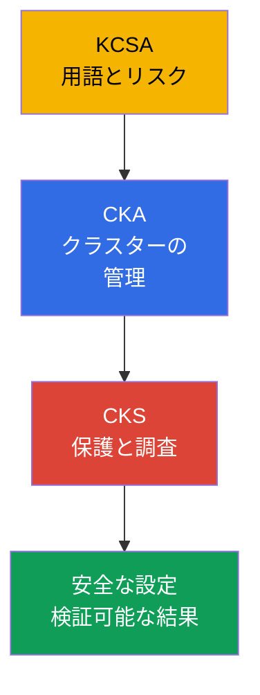
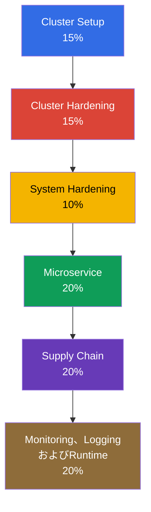
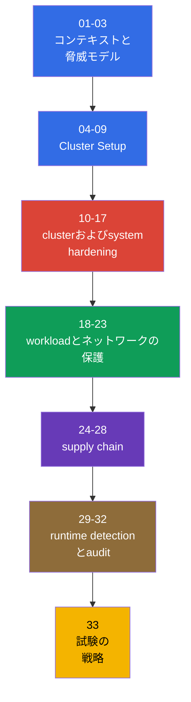

[Русская версия](ru.md) · [Eng version](README.md) · [Versión en español](es.md) · [Version française](fr.md) · [Deutsche Version](de.md) · [ქართული ვერსია](ge.md) · [繁體中文版](tw.md)

# 第01章. はじめに: CKS試験、CKAとの違い、コースの構成

> **課題。** KubernetesクラスターはCKA管理者にとって正常に見えても、安全とは限りません。ネットワーク、RBAC、イメージ、ログに関する個別の対策は、脅威モデルと結果の検証がなければ防御として機能しません。この章では、以降のhardening対策を無関係なコマンドの集合ではなく、defense in depthの一部として扱うために、ドメイン、前提条件、ツールの全体像を示します。

> **この先。** CKSでは、稼働中のKubernetesクラスターを保護し、侵害の影響を調査できるかを問います。これはコースの導入であり、任意の章です。Kubernetesのバージョン、準備形式、6つのドメイン全体の地図を説明します。続いて第02章でKubernetesの脅威モデルを扱い、その後に実践的なhardening対策へ進みます。

> **CKAから必要なこと。** CKSはCKAを継続するものであり、置き換えるものではありません。始める前に、[CKAの導入](../../../cka/course/01/jp.md)と[CKAの目次](../../../cka/course/README_JP.md)を復習してください。このコースでは、`kubectl`、YAML manifest、Pod、Service、Ingress、RBAC、ServiceAccount、TLS、kubeadm、control planeコンポーネントを十分に扱えることを前提にします。基本用語やcloud nativeの脅威モデルにまだ自信がなければ、まず[KCSAコース](../../../kcsa/course/README_JP.md)から始めてください。形式上は必須ではありませんが、CKSで繰り返し使う語彙を身につけられます。

> 🧠 KCSAはリスクの言語、CKAは運用の基礎、CKSは侵害を制限・調査するためのそれらの知識の適用を提供します。

## 01.1 CKSとは何か、CKAおよびKCSAとの違い

**Certified Kubernetes Security Specialist (CKS)** は、Linux FoundationによるKubernetesセキュリティの実技試験です。仕組みを名前で答えられるかではなく、安全でない設定を見つけ、防御を適用し、それが実際に機能することを検証できるかを確認します。

| 認定資格 | 中心となる問い | 典型的な作業 |
|---|---|---|
| KCSA | Kubernetesにはどのようなリスクがあるか? | 基本原則と用語を説明する |
| CKA | クラスターをどのように構築・管理するか? | コンポーネント、ネットワーク、storage、アップグレードを診断する |
| CKS | 侵害をどのように制限・検知するか? | policy、hardening、audit、スキャン、runtime保護を設定する |

CKAは、API server、kubelet、CNI、RBAC、static Podの仕組みという運用の基礎を提供します。CKSではこの知識をsecurityシナリオで使います。たとえばCKAでは`NetworkPolicy`の作成を学びますが、CKSではdefault-denyから始め、DNSを壊さず、metadata endpointを制限し、禁止トラフィックが通過しないことをテストで証明します。

KCSA (Kubernetes and Cloud Native Security Associate) は、CKSとは別で任意のコースです: [`tasks/kcsa`](../../../kcsa/course/README_JP.md)。hands-on部分なしで、cloud nativeの脅威モデル（4C、supply chain、admission control、observability）をconcept-levelで理解します。KCSAの形式はperformance-basedタスクではなくmultiple choiceです。上の表にある語彙（threat model、admission control、コマンドではなく用語としてのRBAC）を定義で確認する必要があるなら、CKSの前にKCSAを受けてください。既にこれらの概念を自在に扱えるなら、KCSAを飛ばしてCKA → CKSへ直接進めます。

ここでのセキュリティは、プロジェクト末尾で行う単独の設定ではありません。イメージの欠陥、過剰なRole、公開されたkubelet、auditログの欠如は、ひとつの攻撃対象領域を形成します。そのため本コースの各章では、防御を想定される攻撃者の経路および観測可能な結果の検証と結び付けます。

> 🎯 試験のルールと受験時のバージョンを確認し、curriculum、CKAの前提条件、レイヤー別ツールを把握しましょう。

## 01.2 試験形式、バージョン、ドキュメント

CKS試験はperformance-basedです。提供されるクラスターとノード上のターミナルで実践タスクを行います。時間は2時間、合格点は67%です。確認時点でImportant Instructionsは**15～20の実践タスク**を示しています。これはLinux Foundationが変更できるスナップショットの値です。CKSの登録と受験には、以前にCKAへ合格している必要がありますが、CKS受験時にCKAの有効期限が切れていても構いません。CKA証明書を有効なまま保つ必要はありません。準備では、contextを意識して切り替え、各変更後に実際の状態を確認することを習慣にしてください。

タスクで特定のhostが指定されることがあります。その場合は、基準マシン（`base`）から`ssh <host>`を実行して作業し、`base`に戻ります。対象host間のネストしたSSHはサポートされません。`base`と対象hostにプリインストールされているツールは異なる場合があるため、最初にどこでコマンドを実行する必要があるかを確認してください。**標準のCKS登録**には、eligibility window **12か月**内の実試験2回（**One Retake**）が含まれ、取得した認定の有効期間は**2年**です。これはsimulatorの試行回数ではありません。標準登録にはKiller.sh simulatorの試行も2回含まれ、各試行は**36時間**有効で**17問**を含みます。**CKS-SINGLEにはsimulatorへのアクセスは含まれません**。問題を読み、host/contextを選択し、最小限の修正を加え、結果を確認する一連の流れを練習してください。

Kubernetesのバージョンは区別する必要があります。

- **このコースの学習環境とcore labs `101-113`のバージョンは`v1.36`です**（各ラボ環境の`k8_version = "1.36.0"`）。ここでKubernetes-nativeのコマンド、フラグ、API動作を確認します。third-partyコンポーネントの互換性は、各コンポーネントのsupport matrixで確認してください。構成上の例外はラボ`113`で、タスクのテーマが`v1.36.x`へのminor upgradeそのものであるため、クラスターは`v1.35.x`から開始します。
- **試験環境のバージョンはLinux Foundationが定め、コースのバージョンより古い場合があります。** [CKS](https://training.linuxfoundation.org/certification/certified-kubernetes-security-specialist/)のメインページはKubernetes **v1.35**を示していますが、Important InstructionsとFAQは独立して更新され、異なるバージョンが一時的に表示されることがあります。特定の受験では、ExamUIと割り当てられた試験の指示が優先されます。公開されているCNCF curriculum overviewはファイル名として[`CKS Curriculum v1.34`](https://github.com/cncf/curriculum/tree/master/cks)のままですが、これはLinux Foundationが受験用に示すパラメータを上書きしません。したがって、**`v1.36`を試験のバージョンとみなさないでください**。

CKSページとFAQは独立して更新されるため、一時的に内容が一致しない場合があります。受験直前に、Kubernetesバージョン、タスクの数と形式、合格点、前提条件、許可リソースを、まずメインの[CKS](https://training.linuxfoundation.org/certification/certified-kubernetes-security-specialist/)ページで、次に割り当てられた受験のExamUIで確認してください。コースに記載されたバージョンやルールを恒久的なものとして信頼してはいけません。

実務上の違いは重要です。オブジェクトの構文とadmissionの動作は、コースのバージョンではなく、試験環境で開いているバージョンのドキュメントで確認してください。

| 領域 | Core labs `101-112`: v1.36 | 試験: v1.35または受験時の実際のバージョン |
|---|---|---|
| 基本的なKubernetes APIとCKSの手法 | 通常の構文を練習するが、CNI/runtimeの対応状況を確認する | その受験のドキュメントとExamUIで確認する |
| User Namespaces | `hostUsers: false`はv1.36でStable/GAになった。ラボはこの動作に依存する場合がある | この動作を自動的に受験へ持ち込まない。バージョン、runtime、機能の可用性を確認する |
| 新しいフィールドとadmission動作 | 学習には有用だが、試験で保証されるものではない | 環境で指定されたバージョンのAPIと動作だけを使用する |

LFはcurriculumおよびその配点とは別に、許可リソースを管理しています。これは時点に依存するスナップショットです。最終確認日**2026-08-31**時点で、CKSのグローバルリストには、タスク内の**Quick Reference**、Kubernetesのドキュメントとブログ、Falco、`bom`、etcd、NGINX Ingress Controller、Cilium、Istioのドキュメントが含まれます。試験ターミナルのディストリビューションにあるドキュメント、manページ、パッケージも許可されています。このリストはcurriculumとは無関係に変わる可能性があります。試験直前にLFの[Resources Allowed](https://docs.linuxfoundation.org/tc-docs/certification/certification-resources-allowed)ページとExamUIでアクセス可能なリンクを再確認してください。

| リソース | 用途 | 可用性 |
|---|---|---|
| タスクの**Quick Reference** | 試験環境で提供される簡易リファレンス | 許可 |
| [Kubernetes Documentation](https://kubernetes.io/docs/) と [Kubernetes Blog](https://kubernetes.io/blog/) | オブジェクトAPI、SecurityContext、PSA、audit、kubeadm、コンポーネントのフラグ | 許可 |
| [Cilium](https://docs.cilium.io/en/stable/) | `CiliumNetworkPolicy`、Hubble、encryption、mutual authentication | 許可 |
| [Istio](https://istio.io/latest/docs/) | `PeerAuthentication`とmTLS | 許可 |
| [etcd](https://etcd.io/docs/) | `etcdctl`、TLS、etcdの運用 | 許可 |
| [kubernetes-sigs/bom](https://kubernetes-sigs.github.io/bom/cli-reference/) | SPDX SBOMの生成 | 許可 |
| [NGINX Ingress Controller](https://kubernetes.github.io/ingress-nginx/) | TLS terminationとHTTP-to-HTTPS redirect（retirementについては08.5を参照） | 許可 |
| [Falco](https://falco.org/docs/) | Runtimeルール、イベント、診断 | 許可 |
| 試験ターミナルのディストリビューションにあるドキュメント、manページ、パッケージ | ローカルリファレンスとインストール済みソフトウェアの情報 | 許可 |
| [Trivy](https://trivy.dev/latest/docs/) | image、filesystem、config、SBOMのスキャン | 学習用リソース。確認日時点ではLFのグローバルリストにはない |
| [AppArmor](https://gitlab.com/apparmor/apparmor/-/wikis/Documentation) | MACプロファイルとノードへのロード | 学習用リソース。確認日時点ではLFのグローバルリストにはない |

保存済みのローカルノートを構文の情報源として頼らず、許可リスト外の外部検索エンジンやthird-partyサイトを開こうとしないでください。まずオブジェクトとAPIバージョンを特定し、許可されたドキュメントから正確な例を探します。試験戦略と最終チェックリストは第33章で扱います。

## 01.3 CKSの公式curriculum

**2024年10月15日**のcurriculum変更はその日に発効しました。以下の現在の配点はLinux Foundationに基づきます。公開CNCF curriculumリポジトリには旧来の`10% / 15% / 15%`がまだ表示されていることがあるため、現在の配点の情報源として使用しないでください。ドメインの配点は時間配分の目安ですが、すべての能力を確認する代わりにはなりません。

| ドメイン | 配点 | コースの章 |
|---|---:|---|
| Cluster Setup | 15% | 04-09 |
| Cluster Hardening | 15% | 10-13 |
| System Hardening | 10% | 14-17 |
| Minimize Microservice Vulnerabilities | 20% | 18-23 |
| Supply Chain Security | 20% | 24-28 |
| Monitoring, Logging and Runtime Security | 20% | 29-32 |

2024年版には、用語を知るだけでなく、個別に実践が必要なトピックがあります。

- L3/L4/L7ルール、DNS-aware policy、Hubbleを使った`CiliumNetworkPolicy`。
- Cilium transparent encryptionとmutual authentication、およびIstio mTLS。
- CIS Kubernetes Benchmarkと`kube-bench`。
- SPDX/CycloneDX形式のSBOM（`syft`と`bom`を含む）。
- `kubesec`および`hadolint`と併せた`kube-linter`。
- `RuntimeClass`によるsandboxed containers: gVisor（`runsc`）とKata Containers。

能力から章への完全な対応表は[コースの目次](../README_JP.md#能力--章)にあります。ここで重要なのはその論理です。policyはアクセスを制限し、hardeningは攻撃対象領域を減らし、supply chainは信頼できないアーティファクトを許さず、runtime保護とauditは残ったリスクの検知に役立ちます。

## 01.4 CKAの前提条件: このコースで繰り返さないこと

CKSではKubernetesの基本構文や構成を繰り返しません。タスク実行中に単純な`kubectl`コマンドを探すことに時間を費やしているなら、まずCKAに戻ってください。CKSには次のスキルが必要です。

| CKAレベルのスキル | 復習場所 | CKSでの利用 |
|---|---|---|
| SecurityContextとcapabilities | [第20章](../../../cka/course/20/jp.md) | Hardened Pod、PSA、seccomp、AppArmor、immutable rootfs |
| Secret、ServiceAccount、admission | [第19章](../../../cka/course/19/jp.md)、[第21章](../../../cka/course/21/jp.md) | secret、token、policy admissionの保護 |
| imageとDockerfile | [第23章](../../../cka/course/23/jp.md) | 最小image、SBOM、scan、署名 |
| NetworkPolicyとPodネットワーク | [第34章](../../../cka/course/34/jp.md)、[第30章](../../../cka/course/30/jp.md) | Default-deny、metadata protection、Cilium policy |
| kubeadm、upgrade、PKI | [第35章](../../../cka/course/35/jp.md)、[第36章](../../../cka/course/36/jp.md)、[第39章](../../../cka/course/39/jp.md) | CIS、TLS hardening、audit、脆弱なコンポーネントの更新 |
| Container runtimeとCRI | [第40章](../../../cka/course/40/jp.md) | RuntimeClass、gVisor、ノード上での調査 |

タスクが`securityContext`またはnamespace labelの追加だけを求めるなら、大きなmanifestを書き直さないでください。`kubectl get ... -o yaml`を使い、対象オブジェクトを限定して変更し、適用してから結果を確認します。このサイクルにより、稼働中の設定を誤って壊すリスクを減らせます。

## 01.5 コースのツールセット

ツールは脅威モデルに取って代わるものではありません。control planeの設定、manifest、image、アーティファクト、実行中のプロセスの行動のうち、何を確認するかに応じて選択してください。

| ツール | 確認または実行すること | 主な章 |
|---|---|---|
| `kube-bench` | ノードとコンポーネントの設定をCIS Benchmarkと照合する | 07 |
| `trivy` | image、filesystem、config、SBOM内のCVEを検出する | 28 |
| `kubesec`、`kube-linter`、`hadolint` | deploy前にmanifestとDockerfileを静的解析する | 27 |
| `syft`、`bom` | imageとアーティファクトのSBOMを作成する | 25 |
| `cosign` / sigstore | imageに署名し検証する | 26 |
| Falco | syscall/eBPFを通じて疑わしいruntimeイベントを観測する | 29-30 |
| CiliumとHubble | ネットワークpolicy、encryption、mTLSを実装・観測する | 06、23 |
| OPA/GatekeeperとKyverno | policyに違反するmanifestを許可しない | 20、26 |
| gVisor（`runsc`）とKata | sandbox runtimeを通じてworkloadを隔離する | 22 |

scannerを実行する前に、確認対象と期待する判断を記録してください。たとえば`trivy`の警告は、すべてのCVEが直ちに悪用可能であることを意味しません。パッケージ、実行経路、修正済みimageの有無、特定workloadに対するリスクを考慮する必要があります。反対に、問題のないレポートでもRBAC、network isolation、runtime monitoringが不要になるわけではありません。

## 01.6 コースの構成と準備方法

コースは脅威モデルから防御レイヤーへと進みます。各テーマ章には、攻撃シナリオ、防御設定、検証、典型的な誤り、productionの実践が含まれます。ラボは101から始まり、`check_result`によって結果を自動確認します。

実践的な準備の順序:

1. 01.4節のCKA前提条件を確認し、YAML、logs、eventsを確認するための短いコマンド集を作ります。
2. 章を順に進め、各章の後で対応するラボを実行します。最初に自力で試す前に解答を読まないでください。
3. 防御ごとに否定的な確認を行います。forbidden Podは拒否され、閉じたポートは応答せず、禁止トラフィックは通過してはなりません。
4. ノード上での作業を別途練習します: static Pod manifest、kubelet config、AppArmor/seccomp profile、audit policy、systemdの確認。
5. 試験前に第29-33章を進め、時間制限を設けてタスクを復習します。

典型的な誤りは、攻撃経路を確認せずに防御手段を適用することです。たとえばnamespace内に`NetworkPolicy`が存在しても、CNIがそれを適用している証明にはなりません。`EncryptionConfiguration`があっても、古いSecretが再暗号化済みとは限りません。Falcoルールが存在しても、ロード済みで実際にイベントを生成するとは限りません。本コースでは検証も解決策の一部です。

> 🏭 Threat model、versioned policyとhardening、CIチェック、観測可能な適用、見直し可能な例外。

## 01.7 productionでの適用方法

- **エンジニアリングサイクルとしてのセキュリティ。** チームはthreat modelを記述し、policyとhardeningをIaCへ導入し、CIで検証してproductionで結果を観測します。
- **デフォルトで最小権限。** 新しいworkloadにはnon-root SecurityContext、制限されたServiceAccount、network default-deny、明示的に許可された依存関係を与えます。
- **検査を左へ移す。** `hadolint`、`kube-linter`、`kubesec`、SBOM、`trivy`をimage公開前に実行し、admission policyが重要要件の回避を許しません。
- **ノードの保護も同じく重要。** kubelet、container runtime socket、etcd、static Pod manifest、auditファイルへのアクセスを、APIへのアクセスと同様に厳格に制限します。
- **検証可能な例外。** workloadがcapability、privileged mode、hostPathへのアクセスを必要とする場合、例外を文書化し、namespaceを制限して定期的に見直します。

## 01.8 ミニ用語集

- **CKS** - Certified Kubernetes Security Specialist。Kubernetesセキュリティの実践的な認定資格。
- **Performance-based** - 選択式テストではなく、稼働環境で結果を達成する形式。
- **CIS Benchmark** - コンポーネントとノードの安全な設定に関する推奨事項の集合。
- **SBOM** - Software Bill of Materials。ソフトウェアアーティファクトを構成するコンポーネントの一覧。
- **Admission policy** - Kubernetes APIへのリクエストを許可、変更、拒否するルール。
- **Runtime security** - 実行中のworkloadの疑わしい挙動を検知・制限すること。
- **Defense in depth** - 単一の制御ではなく、独立した複数の防御レイヤーを適用すること。

## 01.9 章のまとめ

- CKSはCKAの続きであり、クラスター、workload、ノード、supply chainを実践的に保護する能力を問います。
- コースとcore labs `101-113`の対象バージョンはKubernetes v1.36です（ラボ`113`はテーマがv1.36.xへのupgradeそのものであるためv1.35.xから始まります）。
- 試験では、複数クラスターとノード設定を扱うターミナル作業への習熟が必要です。
- 6つのドメインは、クラスター設定、hardening、workload、supply chain、runtime保護を扱います。
- 2024年curriculumの新しい重点は、Cilium、CIS、SBOM、KubeLinter、sandboxed containersです。
- ツールは検証と組み合わさって初めて価値を持ちます。防御が機能し、攻撃が通らないことを証明する必要があります。

> 🎯 まず問題のレイヤー（API/RBAC、network、node、image、runtime）を特定し、次に最小限の変更を適用して、タスクが求める条件そのものを検証してください。

> 🏭 Secure configuration、アクセス制限、アーティファクトの管理、ログ記録、調査は一体となって機能します。

## 01.10 試験と実務での活用

**試験で。** この章は、タスクの種類をすぐに見分け、適切なツールを選ぶ助けになります。変更前に、問題がどのレイヤーにあるかを特定します: API/RBAC、network、node、image、runtime。次に最小限の変更を適用し、タスクが要求する条件そのものを検証します。

**実務で。** ドメインの地図は、チームがimageだけをスキャンしたりprivileged Podだけを禁止したりする、狭いアプローチを防ぎます。信頼できる防御は、secure configuration、アクセス制限、アーティファクトの管理、ログ記録、調査を結び付けます。

## 01.11 自己確認の質問

1. 十分なCKAレベルなしにCKSを準備できないのはなぜですか?

CKSはCKAの続きであり、`kubectl`、YAML manifest、Pod、Service、Ingress、RBAC、TLS、kubeadm、control planeを十分に扱えることを前提にします。CKSでは基本的な仕組みを防御シナリオで使います。たとえば単に`NetworkPolicy`を作るのではなく、default-denyから始め、DNSを維持し、禁止フローが通らないことを否定テストで証明する必要があります。

2. performance-based試験は選択式テストとどのように異なりますか?

performance-based形式では、出来合いの回答を選ぶのではなく、提供されたクラスターとノードのターミナルでタスクを実行します。必要なhostまたはcontextを判断し、最小限の修正を加え、実際の状態を確認する必要があります。特定hostが指定された場合、`base`マシンから`ssh <host>`で作業を始めます。

3. このコースとラボで固定されているKubernetesバージョンは何ですか?

学習環境とcore labs `101-113`ではKubernetes `v1.36`（`k8_version = "1.36.0"`）に固定されています。試験のバージョンはLinux Foundationが定めるものであり、コースのバージョンから自動的に推測することはできません。

4. CKSの6つのドメインと、最も配点が高いものは何ですか?

ドメインは、Cluster Setup、Cluster Hardening、System Hardening、Minimize Microservice Vulnerabilities、Supply Chain Security、Monitoring, Logging and Runtime Securityです。Minimize Microservice Vulnerabilities、Supply Chain Security、Monitoring, Logging and Runtime Securityが各20%で、Cluster SetupとCluster Hardeningが各15%、System Hardeningが10%です。

5. 2024年curriculumで追加または強化されたトピックは何ですか?

L3/L4/L7、DNS-aware policy、Hubbleを備えた`CiliumNetworkPolicy`、およびCilium encryption/mutual authenticationとIstio mTLSには個別の実践が必要です。curriculumではCIS/`kube-bench`、SPDX/CycloneDXと`syft`/`bom`によるSBOM、`kube-linter`、`kubesec`、`hadolint`、gVisorまたはKataによるRuntimeClass経由のsandboxed containersも重視されています。

6. `kube-bench`、`trivy`、`kube-linter`、Falcoはいつ使用しますか?

`kube-bench`はノードとコンポーネントの設定をCIS Benchmarkと照合し、`trivy`はimage、filesystem、config、SBOM内のCVEを探します。`kube-linter`はdeploy前にKubernetes manifestを静的解析します。一方、Falcoはsyscall/eBPFを通じて疑わしいruntimeイベントを観測します。

7. security設定では、manifestを適用するだけでは不十分なのはなぜですか?

manifestの存在は防御が機能する証明ではありません。CNIが`NetworkPolicy`を適用していない場合があり、`EncryptionConfiguration`の後も古いSecretは再暗号化されていない場合があり、Falcoルールもロードされていないことがあります。変更のたびに、forbidden Podの拒否、閉じたポートへの非到達、禁止ネットワークフローの不在など、求められる結果そのものを確認する必要があります。

## 演習

導入章には独立したラボはありません。この章は技術スキルではなくコース形式を定めます。今すぐ[第02章](../02/jp.md)へ進んでください。そこでは、具体的な防御に取り掛かる前に必要な脅威モデルを扱います。コース最初のラボは[ラボ101](../../labs/101/README_JP.MD)です（default-deny `NetworkPolicy`、DNS egress、metadata endpointの保護）。NetworkPolicyの仕組み自体を扱う第04-05章の後で初めて意味を理解できます。ラボの存在意義である効果（Level 2 - 「コマンドを当てる」のではなく「仕組みを理解する」）を得るには、それより前に実施すべきではありません。

---
[目次](../README_JP.md) · [第02章](../02/jp.md)
