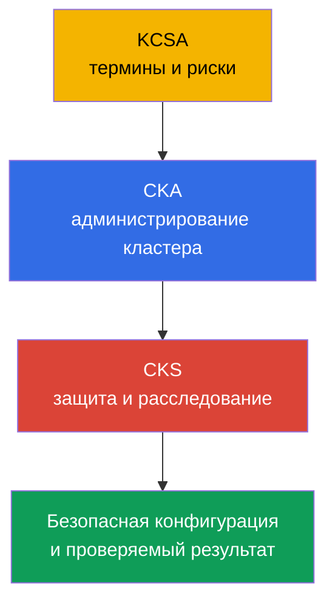
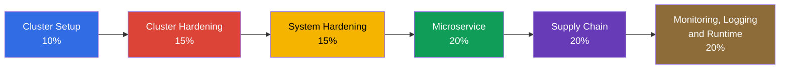
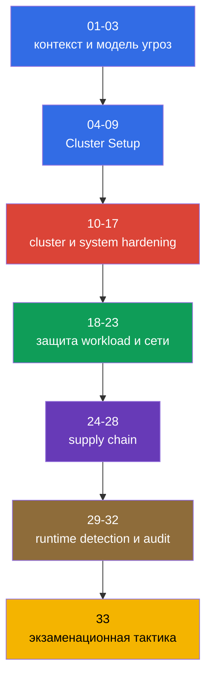

<!-- Standalone RU release: ссылки на переводы удалены, потому что соответствующие файлы не входят в архив. -->

# Глава 01. Введение: экзамен CKS, отличия от CKA и устройство курса

> **Что дальше.** CKS проверяет, умеет ли инженер защищать уже работающий Kubernetes-кластер и расследовать последствия компрометации. Это вводная, необязательная часть курса: она задаёт версию Kubernetes, формат подготовки и карту всех шести доменов. Дальше - модель угроз Kubernetes в главе 02, затем практические меры hardening.

> **Что нужно из CKA.** CKS продолжает, а не заменяет CKA. Перед началом повторите [введение в CKA](../../../cka/course/01/ru.md) и [оглавление CKA](../../../cka/course/README_RU.md). Курс предполагает уверенную работу с `kubectl`, YAML-манифестами, pod, Service, Ingress, RBAC, ServiceAccount, TLS, kubeadm и компонентами control plane.

## 01.1 Что такое CKS и чем он отличается от CKA и KCSA

**Certified Kubernetes Security Specialist (CKS)** - практический экзамен Linux Foundation по безопасности Kubernetes. Он проверяет не умение назвать механизм, а способность найти небезопасную конфигурацию, применить защиту и проверить, что она действительно работает.

| Сертификация | Основной вопрос | Типичные действия |
|---|---|---|
| KCSA | Какие риски есть у Kubernetes? | Объяснить базовые принципы и терминологию |
| CKA | Как развернуть и администрировать кластер? | Диагностировать компоненты, сеть, storage, обновление |
| CKS | Как ограничить и обнаружить компрометацию? | Настроить policy, hardening, audit, сканирование и runtime-защиту |

CKA даёт операционную базу: как устроены API server, kubelet, CNI, RBAC и static Pod. CKS использует эти знания в security-сценарии. Например, CKA учит создать `NetworkPolicy`, а CKS - начать с default-deny, не сломать DNS, ограничить metadata endpoint и доказать тестом, что запрещённый трафик не проходит.

Безопасность здесь не является отдельной настройкой в конце проекта. Ошибка в образе, чрезмерная Role, открытый kubelet или отсутствие audit-логов образуют одну поверхность атаки. Поэтому главы курса связывают защиту с вероятным путём атакующего и с наблюдаемой проверкой результата.

## 01.2 Формат экзамена, версия и документация

Экзамен CKS performance-based: это примерно 15-20 практических задач, которые выполняются в терминале на предоставленных кластерах и нодах. Отводится 2 часа, проходной балл - 67%. Для регистрации и сдачи CKS требуется ранее сданный CKA, но срок его действия к моменту CKS может истечь: сертификат CKA не обязан оставаться активным. Рабочая модель подготовки - осознанно переключать context и после каждого изменения проверять фактическое состояние.

Версии Kubernetes нужно различать:

- **Версия обучения и лаб этого курса - `v1.36`** (`k8_version = "1.36.0"` в лабораторных окружениях): на ней проверяются Kubernetes-native команды, флаги и API-поведение курса; compatibility third-party компонентов необходимо сверять с их собственной support matrix.
- **Версию экзаменационной среды задаёт Linux Foundation, и она может отставать от версии курса.** На дату проверки `2026-09-04` официальные страницы LF - основная страница [CKS](https://training.linuxfoundation.org/certification/certified-kubernetes-security-specialist/), [«Important Instructions: CKS»](https://docs.linuxfoundation.org/tc-docs/certification/important-instructions-cks) и [FAQ](https://docs.linuxfoundation.org/tc-docs/certification/faq-cka-ckad-cks) - согласованно указывают Kubernetes **v1.35** для экзамена CKS. Опубликованный CNCF curriculum overview по имени файла остаётся [`CKS Curriculum v1.34`](https://github.com/cncf/curriculum/tree/master/cks), но это не отменяет более новую версию, указанную на страницах LF. Поэтому **не считайте `v1.36` версией экзамена**.

Страницы CKS и FAQ обновляются независимо и могут временно расходиться. Непосредственно перед попыткой подтвердите версию Kubernetes, количество и формат задач, проходной балл, пререквизит и разрешённые ресурсы сначала на основной странице [CKS](https://training.linuxfoundation.org/certification/certified-kubernetes-security-specialist/), затем в ExamUI для назначенной попытки. Не полагайтесь на версию или правила, зафиксированные в курсе, как на постоянные.

Различие практическое: синтаксис объекта и поведение admission сверяйте с документацией той версии, которая открыта в экзаменационной среде, а не с версией курса.

Разрешённые ресурсы LF поддерживает отдельно от curriculum и его весов. Это привязанный ко времени снимок: на дату последней проверки, **2026-08-31**, глобальный список CKS включает **Quick Reference** из задачи, документацию и блог Kubernetes, а также документацию Falco, `bom`, etcd, NGINX Ingress Controller, Cilium и Istio. Разрешены также документация, man-страницы и пакеты дистрибутива экзаменационного терминала. Список может измениться независимо от curriculum: непосредственно перед экзаменом заново проверьте страницу LF [Resources Allowed](https://docs.linuxfoundation.org/tc-docs/certification/certification-resources-allowed) и ссылки, доступные в ExamUI.

| Ресурс | Для чего | Доступность |
|---|---|---|
| **Quick Reference** задачи | Краткие справочные материалы, предоставленные в экзаменационной среде | разрешена |
| [Kubernetes Documentation](https://kubernetes.io/docs/) и [Kubernetes Blog](https://kubernetes.io/blog/) | API объектов, SecurityContext, PSA, audit, kubeadm, флаги компонентов | разрешена |
| [Cilium](https://docs.cilium.io/en/stable/) | `CiliumNetworkPolicy`, Hubble, encryption и mutual authentication | разрешена |
| [Istio](https://istio.io/latest/docs/) | `PeerAuthentication` и mTLS | разрешена |
| [etcd](https://etcd.io/docs/) | `etcdctl`, TLS и эксплуатация etcd | разрешена |
| [kubernetes-sigs/bom](https://kubernetes-sigs.github.io/bom/cli-reference/) | Генерация SPDX SBOM | разрешена |
| [NGINX Ingress Controller](https://kubernetes.github.io/ingress-nginx/) | TLS termination и HTTP-to-HTTPS redirect (см. 08.5 про retirement) | разрешена |
| [Falco](https://falco.org/docs/) | Runtime-правила, события и диагностика | разрешена |
| Документация, man-страницы и пакеты дистрибутива экзаменационного терминала | Локальная справка и сведения об установленном ПО | разрешены |
| [Trivy](https://trivy.dev/latest/docs/) | Сканирование image, filesystem, config и SBOM | учебный ресурс; не в глобальном списке LF на дату проверки |
| [AppArmor](https://gitlab.com/apparmor/apparmor/-/wikis/Documentation) | Профили MAC и их загрузка на узел | учебный ресурс; не в глобальном списке LF на дату проверки |

Не полагайтесь на сохранённые локальные заметки как на источник синтаксиса и не пытайтесь открывать внешние поисковики или сторонние сайты вне разрешённого списка. Сначала определите объект и версию API, затем найдите точный пример в разрешённой документации. Для экзаменационной стратегии и финального чеклиста предназначена глава 33.

## 01.3 Официальная программа CKS

Редакция программы от 15 октября 2024 - исторический снимок curriculum, а не текущий источник параметров экзамена. Она распределяет задачи по шести доменам. Вес домена - ориентир для распределения времени, но не замена проверке всех компетенций.

| Домен | Вес | Главы курса |
|---|---:|---|
| Cluster Setup | 10% | 04-09 |
| Cluster Hardening | 15% | 10-13 |
| System Hardening | 15% | 14-17 |
| Minimize Microservice Vulnerabilities | 20% | 18-23 |
| Supply Chain Security | 20% | 24-28 |
| Monitoring, Logging and Runtime Security | 20% | 29-32 |

В редакции 2024 есть темы, которым нужна отдельная практика, а не только знание терминов:

- `CiliumNetworkPolicy` с L3/L4/L7-правилами, DNS-aware policy и Hubble.
- Cilium transparent encryption и mutual authentication, а также Istio mTLS.
- CIS Kubernetes Benchmark и `kube-bench`.
- SBOM в форматах SPDX/CycloneDX, в том числе `syft` и `bom`.
- `kube-linter` наряду с `kubesec` и `hadolint`.
- Sandboxed containers через `RuntimeClass`: gVisor (`runsc`) и Kata Containers.

Полная карта «компетенция -> глава» находится в [путеводителе CKS](../CKS_RU.md). Здесь важно увидеть логику: policy ограничивают доступ, hardening уменьшает поверхность атаки, supply chain не допускает ненадёжный артефакт, а runtime-защита и audit помогают заметить оставшийся риск.

## 01.4 Пререквизит CKA: что не повторяет этот курс

CKS не повторяет базовый синтаксис и устройство Kubernetes. Если при выполнении задания вы тратите время на поиск простой команды `kubectl`, сначала вернитесь к CKA. Для CKS нужны следующие навыки.

| Навык уровня CKA | Где освежить | Как используется в CKS |
|---|---|---|
| SecurityContext и capabilities | [глава 20](../../../cka/course/20/ru.md) | Hardened Pod, PSA, seccomp, AppArmor, immutable rootfs |
| Secret, ServiceAccount и admission | [глава 19](../../../cka/course/19/ru.md), [глава 21](../../../cka/course/21/ru.md) | Защита секретов, токенов и policy admission |
| Образы и Dockerfile | [глава 23](../../../cka/course/23/ru.md) | Минимальные образы, SBOM, scan и подпись |
| NetworkPolicy и сеть pod | [глава 34](../../../cka/course/34/ru.md), [глава 30](../../../cka/course/30/ru.md) | Default-deny, metadata protection, Cilium policy |
| kubeadm, upgrade и PKI | [глава 35](../../../cka/course/35/ru.md), [глава 36](../../../cka/course/36/ru.md), [глава 39](../../../cka/course/39/ru.md) | CIS, TLS hardening, audit, обновление уязвимых компонентов |
| Container runtime и CRI | [глава 40](../../../cka/course/40/ru.md) | RuntimeClass, gVisor, расследование на ноде |

Не переписывайте большой манифест, если задача требует только добавить `securityContext` или label namespace. Используйте `kubectl get ... -o yaml`, точечно измените объект, примените его и проверьте результат. Такой цикл снижает риск случайно сломать работающую конфигурацию.

## 01.5 Инструментарий курса

Инструмент не заменяет модель угроз. Его нужно выбирать по тому, что проверяется: конфигурация control plane, манифест, образ, артефакт или действие процесса во время выполнения.

| Инструмент | Что проверяет или делает | Основные главы |
|---|---|---|
| `kube-bench` | Сверяет конфигурацию нод и компонентов с CIS Benchmark | 07 |
| `trivy` | Находит CVE в image, filesystem, config и SBOM | 28 |
| `kubesec`, `kube-linter`, `hadolint` | Статически анализируют manifest и Dockerfile до deploy | 27 |
| `syft`, `bom` | Создают SBOM для image и артефактов | 25 |
| `cosign` / sigstore | Подписывают и проверяют image | 26 |
| Falco | Наблюдает подозрительные runtime-события через syscall/eBPF | 29-30 |
| Cilium и Hubble | Реализуют и наблюдают сетевые policy, encryption и mTLS | 06, 23 |
| OPA/Gatekeeper и Kyverno | Не допускают manifest, нарушающие policy | 20, 26 |
| gVisor (`runsc`) и Kata | Изолируют workload через sandbox runtime | 22 |

Перед запуском scanner зафиксируйте объект проверки и ожидаемое решение. Например, предупреждение `trivy` не означает, что любой CVE немедленно эксплуатируем: нужно учесть пакет, путь исполнения, наличие исправленного image и риск для конкретной нагрузки. И наоборот, чистый отчёт не отменяет RBAC, network isolation и runtime monitoring.

## 01.6 Как устроен курс и как готовиться

Курс идёт от модели угроз к защитным слоям. Каждая предметная глава содержит сценарий атаки, конфигурацию защиты, проверку, типичные ошибки и production-практику. Лабораторные работы начинаются с 101 и проверяют результат автоматически через `check_result`.

Практичный порядок подготовки:

1. Проверьте пререквизиты CKA из раздела 01.4 и заведите короткий набор команд для просмотра YAML, logs и events.
2. Пройдите главы по порядку и после каждой выполните связанную лабораторную работу. Не читайте решение до первой самостоятельной попытки.
3. Для каждой защиты выполните отрицательную проверку: forbidden Pod должен быть отклонён, закрытый порт не должен отвечать, запрещённый трафик не должен пройти.
4. Отдельно тренируйтесь на ноде: static Pod manifest, kubelet config, AppArmor/seccomp profile, audit policy и проверка systemd.
5. Перед экзаменом пройдите главы 29-33 и повторите задачи с ограничением времени.

Типичная ошибка - применять средство защиты без проверки пути атаки. Например, наличие `NetworkPolicy` в namespace ещё не доказывает, что CNI её применил; `EncryptionConfiguration` ещё не означает, что старые Secret перешифрованы; наличие правила Falco ещё не означает, что оно загружено и действительно генерирует событие. В этом курсе проверка - часть решения.

## 01.7 Как это применяют в продакшене

- **Безопасность как инженерный цикл.** Команда описывает threat model, вводит policy и hardening в IaC, проверяет их в CI и наблюдает результат в production.
- **Минимальные права по умолчанию.** Новые workload получают non-root SecurityContext, ограниченный ServiceAccount, network default-deny и явно разрешённые зависимости.
- **Сдвиг проверок влево.** `hadolint`, `kube-linter`, `kubesec`, SBOM и `trivy` запускаются до публикации image; admission policy не позволяет обойти критичные требования.
- **Защита нод не менее важна.** Доступ к kubelet, container runtime socket, etcd, static Pod manifest и audit-файлам ограничивают так же строго, как доступ к API.
- **Проверяемые исключения.** Если workload требует capability, privileged mode или доступ к hostPath, исключение документируют, ограничивают namespace и периодически пересматривают.

## 01.8 Мини-глоссарий

- **CKS** - Certified Kubernetes Security Specialist, практическая сертификация по безопасности Kubernetes.
- **Performance-based** - формат, в котором результат достигается в рабочей среде, а не выбирается в тесте.
- **CIS Benchmark** - набор рекомендаций по безопасной конфигурации компонентов и нод.
- **SBOM** - Software Bill of Materials, перечень компонентов программного артефакта.
- **Admission policy** - правило, которое разрешает, изменяет или отклоняет запрос к Kubernetes API.
- **Runtime security** - обнаружение и ограничение подозрительного поведения запущенной нагрузки.
- **Defense in depth** - применение независимых защитных слоёв вместо единственного контроля.

## 01.9 Итоги главы

- CKS продолжает CKA и проверяет практическую защиту кластера, workloads, нод и supply chain.
- Целевая версия курса и лабораторных окружений - Kubernetes v1.36.
- Экзамен требует уверенной работы в терминале, с несколькими кластерами и конфигурацией нод.
- Шесть доменов охватывают настройку кластера, hardening, workload, supply chain и runtime-защиту.
- Новые акценты программы 2024 - Cilium, CIS, SBOM, KubeLinter и sandboxed containers.
- Инструмент ценен только вместе с проверкой: нужно доказать, что защита сработала и атака не проходит.

## 01.10 Как это пригодится: на экзамене и в реальной работе

**На экзамене.** Эта глава помогает сразу распознать класс задачи и выбрать правильный инструмент. Перед изменением определите, на каком слое находится проблема: API/RBAC, network, node, image или runtime. Затем примените минимальное изменение и выполните проверку именно того условия, которое просит задача.

**В реальной работе.** Карта доменов предотвращает узкий подход, при котором команда только сканирует image или только запрещает privileged Pod. Надёжная защита соединяет secure configuration, ограничение доступа, контроль артефактов, логирование и расследование.

## 01.11 Вопросы для самопроверки

1. Почему CKS нельзя готовить без уверенного уровня CKA?
2. Чем performance-based экзамен отличается от теста с вариантами ответа?
3. Какая версия Kubernetes зафиксирована в этом курсе и лабораторных работах?
4. Какие шесть доменов CKS и какие из них имеют наибольший вес?
5. Какие темы добавлены или усилены программой 2024?
6. Когда использовать `kube-bench`, `trivy`, `kube-linter` и Falco?
7. Почему для security-настройки недостаточно только применить manifest?

## Практика

Для вводной главы отдельной лабораторной работы нет. Начните с [каталога лабораторных работ CKS](../../labs): лаба 101 отрабатывает default-deny `NetworkPolicy`, DNS egress и защиту metadata endpoint. После неё переходите к главе 02, чтобы связывать каждую защиту с моделью угроз.

---
[Оглавление](../README_RU.md) · [Глава 02](../02/ru.md)
