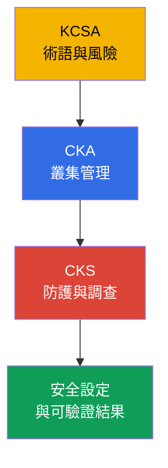
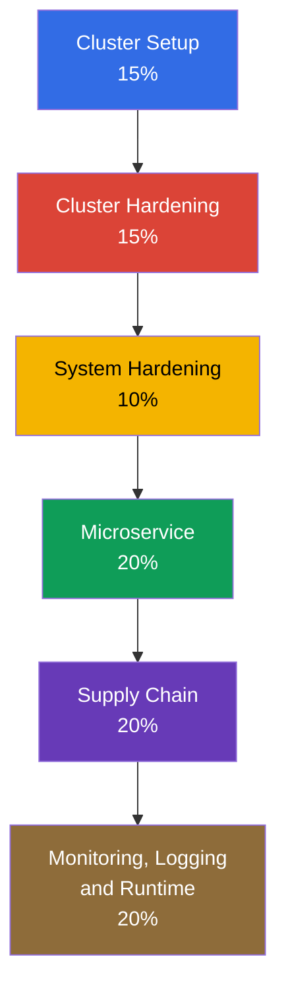
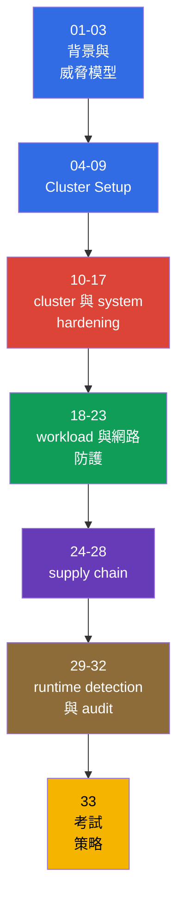

[Русская версия](ru.md) · [Eng version](README.md) · [Versión en español](es.md) · [Version française](fr.md) · [Deutsche Version](de.md) · [ქართული ვერსია](ge.md) · [日本語版](jp.md)

# 第 01 章。CKS 考試、與 CKA 的差異及課程結構

> **問題。** Kubernetes 叢集可能對 CKA 管理員而言看似正常運作，卻仍未受保護：網路、RBAC、映像與日誌的個別決策，若沒有威脅模型和結果驗證，就無法形成防護。此章建立領域、prerequisites 與工具的地圖，讓後續 hardening 措施成為 defense in depth 的一部分，而非互不相關的命令集合。

> **接下來。** CKS 檢驗工程師是否能保護已運作的 Kubernetes 叢集，並調查遭入侵後果。本章是課程的導論和非必要部分：它設定 Kubernetes 版本、準備方式以及六個領域的地圖。接著是第 02 章的 Kubernetes 威脅模型，然後是實際的 hardening 措施。

> **需要的 CKA 基礎。** CKS 是延續而不是取代 CKA。開始前請複習 [CKA 導論](../../../cka/course/01/tw.md) 和 [CKA 目錄](../../../cka/course/README_TW.md)。課程假設你能熟練使用 `kubectl`、YAML manifest、pod、Service、Ingress、RBAC、ServiceAccount、TLS、kubeadm 和 control plane 元件。若 cloud native 的基本術語和威脅模型尚不熟悉，請從 [KCSA 課程](../../../kcsa/course/README_TW.md) 開始 - 它形式上不是必要條件，但提供 CKS 持續依賴的詞彙。

> 🧠 KCSA 提供風險語言，CKA 提供操作基礎，CKS 則將這些知識用於限制和調查入侵。

## 01.1 什麼是 CKS，以及它與 CKA、KCSA 的差異

**Certified Kubernetes Security Specialist (CKS)** 是 Linux Foundation 的 Kubernetes 安全實作考試。它檢驗的不是能否說出某個機制，而是能否找到不安全的設定、套用防護，並確認防護確實運作。

| 認證 | 主要問題 | 常見操作 |
|---|---|---|
| KCSA | Kubernetes 有哪些風險？ | 解釋基本原則和術語 |
| CKA | 如何部署和管理叢集？ | 診斷元件、網路、storage、升級 |
| CKS | 如何限制並發現入侵？ | 設定 policy、hardening、audit、掃描和 runtime 防護 |

CKA 提供操作基礎：API server、kubelet、CNI、RBAC 和 static Pod 如何運作。CKS 在安全情境中使用這些知識。例如 CKA 教你建立 `NetworkPolicy`，而 CKS 要從 default-deny 開始、不破壞 DNS、限制 metadata endpoint，並以測試證明禁止的流量無法通過。

KCSA (Kubernetes and Cloud Native Security Associate) 是獨立且非 CKS 必要的課程：[`tasks/kcsa`](../../../kcsa/course/README_TW.md)。它提供 cloud native 威脅模型（4C、supply chain、admission control、observability）的概念理解，但沒有 hands-on 部分 - KCSA 是 multiple choice，而不是 performance-based 任務。若仍需查證上表的詞彙（threat model、admission control、作為術語而非命令的 RBAC 定義），請在 CKS 前完成 KCSA；若已能熟練理解這些概念，可跳過 KCSA，直接從 CKA 進入 CKS。

安全不是專案末尾才加入的獨立設定。映像錯誤、過度寬鬆的 Role、開放的 kubelet 或缺少 audit 日誌會形成同一個攻擊面。因此課程各章都將防護連結到攻擊者可能採用的路徑，以及可觀測的結果驗證。

> 🎯 確認考試規則和版本，按層次掌握 curriculum、CKA prerequisite 與工具。

## 01.2 考試格式、版本與文件

CKS 是 performance-based 考試：在提供的叢集和節點上，透過終端機完成實作任務。時間為 2 小時，及格分數為 67%。在檢查時，Important Instructions 指向 **15-20 個實作任務**；這是 Linux Foundation 可能變更的快照參數。註冊和參加 CKS 需要先通過 CKA，但到 CKS 時 CKA 的有效期可以已過：CKA 證書不必保持有效。準備時應有意識地切換 context，並在每次變更後檢查實際狀態。

任務可能指定特定 host：此時從基礎機器 (`base`) 執行 `ssh <host>`，完成工作後返回 `base`。不支援在目標 host 之間巢狀 SSH。`base` 和目標 host 上預先安裝的工具可能不同，因此先確認命令必須在哪裡執行。**標準 CKS 註冊**在 **12 個月**的 eligibility window 內包含兩次實際考試機會（**One Retake**）；取得的證書有效 **2 年**。這不是 simulator 的機會：標準註冊也包含兩次 Killer.sh simulator 機會，每次啟用 **36 小時**並有 **17 題**；**CKS-SINGLE 不包含 simulator 存取權**。請練習完整循環：閱讀條件、選擇 host/context、做最小變更並驗證結果。

需要區分 Kubernetes 版本：

- **本課程和 core labs `101-113` 的學習版本是 `v1.36`**（其實驗環境中的 `k8_version = "1.36.0"`）：課程中的 Kubernetes-native 命令、flags 和 API 行為都以此版本檢驗；第三方元件的相容性須依其 support matrix 確認。設計上的例外是 lab `113`：其叢集以 `v1.35.x` 啟動，因為任務主題本身就是升級至 `v1.36.x`。
- **考試環境版本由 Linux Foundation 指定，且可能落後課程版本。** [CKS](https://training.linuxfoundation.org/certification/certified-kubernetes-security-specialist/) 主頁指出 Kubernetes **v1.35**，但 Important Instructions 和 FAQ 獨立更新，可能暫時顯示其他版本。具體考試以 ExamUI 和指定考試的說明為準。公開的 CNCF curriculum overview 檔名仍為 [`CKS Curriculum v1.34`](https://github.com/cncf/curriculum/tree/master/cks)，但不會取代 Linux Foundation 為該次考試指定的參數。因此**不要把 `v1.36` 視為考試版本**。

CKS 和 FAQ 頁面獨立更新，可能暫時不一致。考試前直接在 [CKS](https://training.linuxfoundation.org/certification/certified-kubernetes-security-specialist/) 主頁，再在指定考試的 ExamUI 中確認 Kubernetes 版本、任務數量與格式、及格分數、prerequisite 和允許資源。不要把課程固定的版本或規則當成永久不變。

實務上的差異是：物件語法和 admission 行為應以考試環境開啟的版本文件為準，而不是課程版本。

| 範圍 | Core labs `101-112`: v1.36 | 考試：v1.35 或該次考試的實際版本 |
|---|---|---|
| 基本 Kubernetes API 和 CKS 技巧 | 練習一般語法，但確認 CNI/runtime 支援 | 依具體考試的文件和 ExamUI 確認 |
| User Namespaces | `hostUsers: false` 在 v1.36 成為 Stable/GA；lab 可能依賴此行為 | 不要自動將此行為套用到考試：確認版本、runtime 和功能可用性 |
| 新欄位和 admission 行為 | 對學習有用，但不是考試承諾 | 只使用環境指定版本的 API 和行為 |

LF 另外維護允許資源，而不是 curriculum 和其權重。這是與時間相關的快照：截至最後檢查日 **2026-08-31**，全球 CKS 清單包含任務提供的 **Quick Reference**、Kubernetes 文件和部落格，以及 Falco、`bom`、etcd、NGINX Ingress Controller、Cilium 和 Istio 文件。也允許考試終端機發行版的文件、man pages 和套件。清單可能獨立於 curriculum 變更：考試前請重新檢查 LF 的 [Resources Allowed](https://docs.linuxfoundation.org/tc-docs/certification/certification-resources-allowed) 頁面和 ExamUI 中可用的連結。

| 資源 | 用途 | 可用性 |
|---|---|---|
| **Quick Reference** 任務 | 考試環境提供的簡要參考資料 | 允許 |
| [Kubernetes Documentation](https://kubernetes.io/docs/) 和 [Kubernetes Blog](https://kubernetes.io/blog/) | 物件 API、SecurityContext、PSA、audit、kubeadm、元件 flags | 允許 |
| [Cilium](https://docs.cilium.io/en/stable/) | `CiliumNetworkPolicy`、Hubble、encryption 和 mutual authentication | 允許 |
| [Istio](https://istio.io/latest/docs/) | `PeerAuthentication` 和 mTLS | 允許 |
| [etcd](https://etcd.io/docs/) | `etcdctl`、TLS 和 etcd 操作 | 允許 |
| [kubernetes-sigs/bom](https://kubernetes-sigs.github.io/bom/cli-reference/) | 產生 SPDX SBOM | 允許 |
| [NGINX Ingress Controller](https://kubernetes.github.io/ingress-nginx/) | TLS termination 和 HTTP-to-HTTPS redirect（見 08.5 的 retirement） | 允許 |
| [Falco](https://falco.org/docs/) | Runtime 規則、事件和診斷 | 允許 |
| 考試終端機發行版的文件、man pages 和套件 | 本機說明及已安裝軟體資訊 | 允許 |
| [Trivy](https://trivy.dev/latest/docs/) | 掃描 image、filesystem、config 和 SBOM | 學習資源；截至該日期不在 LF 全球清單 |
| [AppArmor](https://gitlab.com/apparmor/apparmor/-/wikis/Documentation) | 節點上的 MAC profile 及載入 | 學習資源；截至該日期不在 LF 全球清單 |

不要依賴儲存的本機筆記作為語法來源，也不要開啟允許清單外的外部搜尋引擎或第三方網站。先確定物件和 API 版本，再從允許的文件找出精確範例。考試策略和最後檢查清單請看第 33 章。

## 01.3 CKS 官方課綱

2024 年 10 月 15 日的課綱變更於當日生效。以下目前權重取自 Linux Foundation；公開 CNCF curriculum repository 可能仍顯示舊的 `10% / 15% / 15%`，因此不要把它當作目前權重的來源。領域權重是分配時間的參考，不取代對所有能力的檢查。

| 領域 | 權重 | 課程章節 |
|---|---:|---|
| Cluster Setup | 15% | 04-09 |
| Cluster Hardening | 15% | 10-13 |
| System Hardening | 10% | 14-17 |
| Minimize Microservice Vulnerabilities | 20% | 18-23 |
| Supply Chain Security | 20% | 24-28 |
| Monitoring, Logging and Runtime Security | 20% | 29-32 |

2024 版本中有些主題需要獨立實作，而不只是理解術語：

- 具有 L3/L4/L7 規則、DNS-aware policy 和 Hubble 的 `CiliumNetworkPolicy`。
- Cilium transparent encryption 和 mutual authentication，以及 Istio mTLS。
- CIS Kubernetes Benchmark 和 `kube-bench`。
- SPDX/CycloneDX 格式的 SBOM，包括 `syft` 和 `bom`。
- `kubesec` 和 `hadolint` 之外的 `kube-linter`。
- 透過 `RuntimeClass` 使用 gVisor (`runsc`) 和 Kata Containers 的 Sandboxed containers。

完整的「能力 -> 章節」對照位於[課程目錄](../README_TW.md#能力--章節)。重要的是理解其邏輯：policy 限制存取，hardening 降低攻擊面，supply chain 排除不可信 artifact，而 runtime 防護和 audit 協助發現殘餘風險。

## 01.4 CKA prerequisite：本課程不重複的內容

CKS 不重複 Kubernetes 的基本語法和架構。如果完成任務時還在花時間找簡單的 `kubectl` 命令，請先回到 CKA。CKS 需要以下技能。

| CKA 層級技能 | 複習位置 | 在 CKS 中的用途 |
|---|---|---|
| SecurityContext 和 capabilities | [第 20 章](../../../cka/course/20/tw.md) | Hardened Pod、PSA、seccomp、AppArmor、immutable rootfs |
| Secret、ServiceAccount 和 admission | [第 19 章](../../../cka/course/19/tw.md)、[第 21 章](../../../cka/course/21/tw.md) | 保護 secrets、tokens 和 policy admission |
| 映像和 Dockerfile | [第 23 章](../../../cka/course/23/tw.md) | 最小映像、SBOM、scan 和簽署 |
| NetworkPolicy 和 pod 網路 | [第 34 章](../../../cka/course/34/tw.md)、[第 30 章](../../../cka/course/30/tw.md) | Default-deny、metadata protection、Cilium policy |
| kubeadm、upgrade 和 PKI | [第 35 章](../../../cka/course/35/tw.md)、[第 36 章](../../../cka/course/36/tw.md)、[第 39 章](../../../cka/course/39/tw.md) | CIS、TLS hardening、audit、更新有漏洞的元件 |
| Container runtime 和 CRI | [第 40 章](../../../cka/course/40/tw.md) | RuntimeClass、gVisor、節點調查 |

若任務只要求加入 `securityContext` 或 namespace label，不要重寫大型 manifest。使用 `kubectl get ... -o yaml`，精確修改物件、套用並驗證結果。這個循環可降低意外破壞運作中設定的風險。

## 01.5 課程工具

工具不能取代威脅模型。應依照要檢查的內容選擇工具：control plane 設定、manifest、映像、artifact 或執行中程序的行為。

| 工具 | 檢查或執行的內容 | 主要章節 |
|---|---|---|
| `kube-bench` | 將節點和元件設定與 CIS Benchmark 比對 | 07 |
| `trivy` | 在 image、filesystem、config 和 SBOM 中尋找 CVE | 28 |
| `kubesec`、`kube-linter`、`hadolint` | deploy 前靜態分析 manifest 和 Dockerfile | 27 |
| `syft`、`bom` | 為 image 和 artifact 建立 SBOM | 25 |
| `cosign` / sigstore | 簽署並驗證 image | 26 |
| Falco | 透過 syscall/eBPF 觀察可疑 runtime 事件 | 29-30 |
| Cilium 和 Hubble | 實作並觀察網路 policy、encryption 和 mTLS | 06、23 |
| OPA/Gatekeeper 和 Kyverno | 阻止違反 policy 的 manifest | 20、26 |
| gVisor (`runsc`) 和 Kata | 透過 sandbox runtime 隔離 workload | 22 |

啟動 scanner 前先固定檢查物件和預期決策。例如 `trivy` 警告不代表每個 CVE 都能立即被利用：要考慮套件、執行路徑、是否有修復後的 image，以及特定 workload 的風險。反過來，乾淨報告也不會取代 RBAC、network isolation 和 runtime monitoring。

## 01.6 課程結構與準備方式

課程從威脅模型走向防護層。每個主題章節都包含攻擊情境、防護設定、驗證、常見錯誤和 production 實務。實驗從 101 開始，並透過 `check_result` 自動驗證結果。

實用的準備順序：

1. 檢查 01.4 的 CKA prerequisite，準備一組查看 YAML、logs 和 events 的短命令。
2. 依序完成各章，並在每章後完成相關實驗。第一次獨立嘗試前不要閱讀解答。
3. 對每項防護執行負向驗證：forbidden Pod 應被拒絕，關閉的連接埠不應回應，禁止的流量不應通過。
4. 個別在節點上練習：static Pod manifest、kubelet config、AppArmor/seccomp profile、audit policy 和 systemd 檢查。
5. 考試前完成第 29-33 章，並在限時下重做任務。

常見錯誤是在沒有驗證攻擊路徑的情況下套用防護。例如 namespace 中有 `NetworkPolicy` 並不證明 CNI 已套用它；`EncryptionConfiguration` 不代表舊 Secret 已重新加密；有 Falco 規則也不代表規則已載入並確實產生事件。在本課程中，驗證是解決方案的一部分。

> 🏭 Threat model、versioned policy 與 hardening、CI 檢查、可觀測的套用以及可重新檢視的例外。

## 01.7 Production 中的應用方式

- **安全是工程循環。** 團隊描述 threat model，在 IaC 中引入 policy 和 hardening，在 CI 中檢查，並在 production 觀察結果。
- **預設最小權限。** 新 workload 取得 non-root SecurityContext、受限的 ServiceAccount、network default-deny 以及明確允許的依賴。
- **左移檢查。** `hadolint`、`kube-linter`、`kubesec`、SBOM 和 `trivy` 在發布 image 前執行；admission policy 不允許繞過關鍵要求。
- **節點防護同樣重要。** 對 kubelet、container runtime socket、etcd、static Pod manifest 和 audit 檔案的存取，和 API 存取一樣嚴格限制。
- **可驗證的例外。** 若 workload 需要 capability、privileged mode 或 hostPath 存取，應記錄例外、限制於 namespace，並定期重新檢視。

## 01.8 小詞彙表

- **CKS** - Certified Kubernetes Security Specialist，Kubernetes 安全實作認證。
- **Performance-based** - 在工作環境中達成結果，而不是在測驗中選答案的格式。
- **CIS Benchmark** - 元件和節點安全設定的建議集合。
- **SBOM** - Software Bill of Materials，軟體 artifact 的元件清單。
- **Admission policy** - 允許、修改或拒絕 Kubernetes API 請求的規則。
- **Runtime security** - 發現並限制執行中 workload 的可疑行為。
- **Defense in depth** - 使用彼此獨立的多層防護，而非單一控制。

## 01.9 本章總結

- CKS 延續 CKA，檢驗對叢集、workloads、節點和 supply chain 的實際防護。
- 課程和 core labs `101-113` 的目標版本是 Kubernetes v1.36（lab `113` 以 v1.35.x 啟動，因為主題是升級到 v1.36.x）。
- 考試要求熟練使用終端機、多个叢集和節點設定。
- 六個領域涵蓋叢集設定、hardening、workload、supply chain 和 runtime 防護。
- 2024 課綱的新重點是 Cilium、CIS、SBOM、KubeLinter 和 sandboxed containers。
- 工具只有搭配驗證才有價值：必須證明防護生效且攻擊無法通過。

> 🎯 先確定問題所在層次 - API/RBAC、network、node、image 或 runtime - 再做最小變更，並直接驗證任務要求的條件。

> 🏭 Secure configuration、存取限制、artifact 控制、日誌和調查必須共同運作。

## 01.10 這對考試和實際工作有何用

**考試中。** 本章協助你立即辨識任務類別並選擇正確工具。變更前先確定問題所在層次：API/RBAC、network、node、image 或 runtime。接著做最小變更，並只驗證任務要求的條件。

**實際工作中。** 領域地圖可避免團隊只掃描 image 或只禁止 privileged Pod 的狹隘做法。可靠的防護要結合 secure configuration、存取限制、artifact 控制、日誌和調查。

## 01.11 自我檢查問題

1. 為什麼沒有穩固的 CKA 程度就不能準備 CKS？

CKS 延續 CKA，假設能熟練使用 `kubectl`、YAML manifest、Pod、Service、Ingress、RBAC、TLS、kubeadm 和 control plane。在 CKS 中，基本機制用於防護情境：例如不只是建立 `NetworkPolicy`，還要從 default-deny 開始、保留 DNS，並以負向測試證明禁止的流量不會通過。

2. Performance-based 考試與選擇題測驗有何差異？

Performance-based 格式是在提供的叢集和節點上透過終端機完成任務，而不是選擇現成答案。需要確定正確的 host 或 context，做最小修改並檢查實際狀態；若指定了個別 host，工作從 `base` 機器執行 `ssh <host>` 開始。

3. 本課程和實驗固定使用哪個 Kubernetes 版本？

學習和 core labs `101-113` 固定使用 Kubernetes `v1.36`（`k8_version = "1.36.0"`）。考試版本由 Linux Foundation 指定，不能從課程版本自動推導。

4. CKS 的六個領域是什麼？哪些權重最高？

領域為 Cluster Setup、Cluster Hardening、System Hardening、Minimize Microservice Vulnerabilities、Supply Chain Security 以及 Monitoring, Logging and Runtime Security。Minimize Microservice Vulnerabilities、Supply Chain Security 和 Monitoring, Logging and Runtime Security 各為 20%；Cluster Setup 和 Cluster Hardening 各為 15%，System Hardening 為 10%。

5. 2024 課綱新增或強化了哪些主題？

需要獨立實作的包括具 L3/L4/L7、DNS-aware policy 和 Hubble 的 `CiliumNetworkPolicy`，以及 Cilium encryption/mutual authentication 和 Istio mTLS。課綱也強調 CIS/kube-bench、透過 SPDX/CycloneDX 和 `syft`/`bom` 的 SBOM、`kube-linter`、`kubesec`、`hadolint`，以及使用 gVisor 或 Kata 的 RuntimeClass sandboxed containers。

6. 何時使用 `kube-bench`、`trivy`、`kube-linter` 和 Falco？

`kube-bench` 將節點和元件設定與 CIS Benchmark 比對，`trivy` 在 image、filesystem、config 和 SBOM 中尋找 CVE。`kube-linter` 在 deploy 前靜態分析 Kubernetes manifest，而 Falco 透過 syscall/eBPF 觀察可疑 runtime 事件。

7. 為什麼只套用 manifest 不足以完成安全設定？

有 manifest 不代表防護正在運作：CNI 可能沒有套用 `NetworkPolicy`，`EncryptionConfiguration` 後舊 Secret 可能尚未重新加密，Falco 規則也可能尚未載入。因此每次變更後都要驗證要求的結果，例如 forbidden Pod 被拒絕、關閉的連接埠不可用，或禁止的網路流量不存在。

## 實作

導論章沒有獨立實驗 - 它設定課程格式，而不是技術技能。現在請前往[第 02 章](../02/tw.md)：它提供威脅模型，沒有這個模型就不適合開始具體防護。課程第一個實驗是 [lab 101](../../labs/101/README_TW.MD)（default-deny `NetworkPolicy`、DNS egress 和 metadata endpoint 防護）；理解上要到第 04-05 章之後才適合執行，因為那裡會說明 NetworkPolicy 機制；太早執行無法達到課程實驗的目的（Level 2 -「理解機制」，而不是猜命令）。

---
[目錄](../README_TW.md) · [第 02 章](../02/tw.md)
