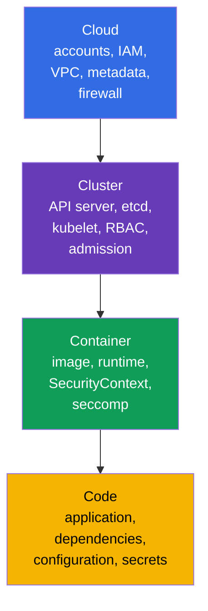
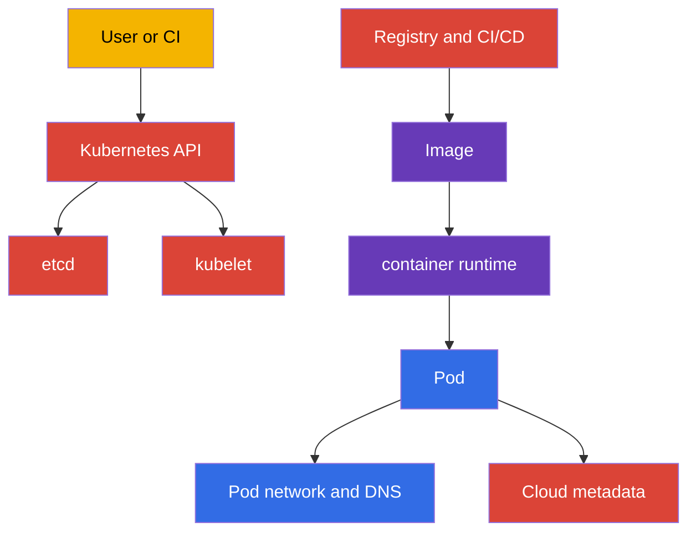
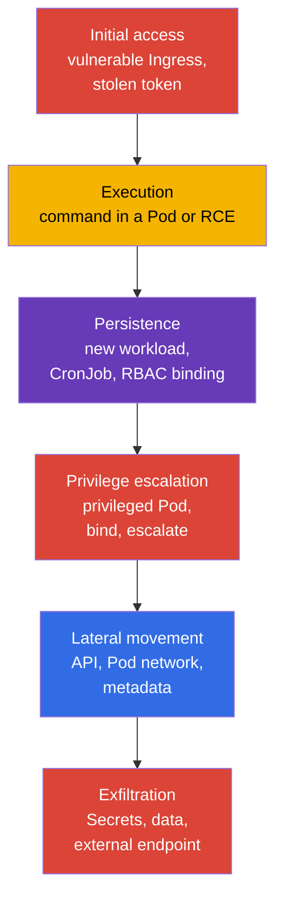
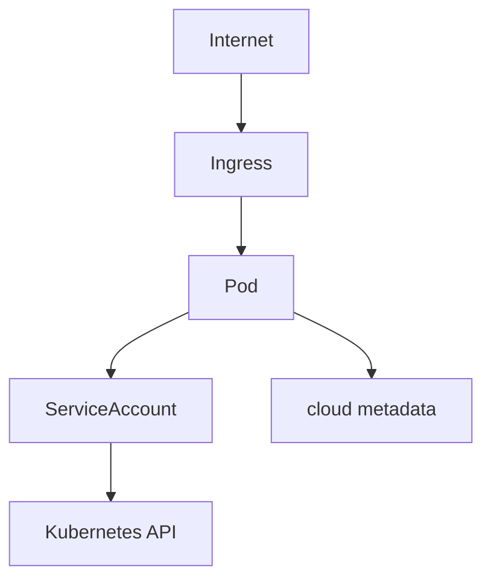
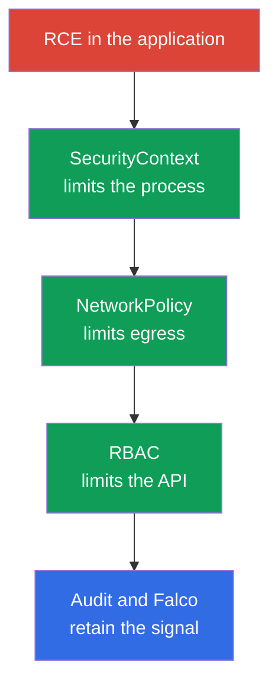

[Русская версия](ru.md) · [Versión en español](es.md) · [Version française](fr.md) · [Deutsche Version](de.md) · [ქართული ვერსია](ge.md) · [繁體中文版](tw.md) · [日本語版](jp.md)

# Chapter 02. Kubernetes security model: 4C, attack surface, and attack phases

> **The problem.** Protecting a single Kubernetes layer creates a false sense of security: NetworkPolicy does not fix a public API, and a hardened container does not close a vulnerability in code or a node's cloud credentials. Without a map of assets and boundaries, a team closes familiar settings while leaving an attacker a weaker path through Cloud, Cluster, Container, or Code.

> **What comes next.** Chapter 01 defined the CKS format, domains, and tools. Now we need a common model for technical decisions: what exactly to protect, from whom, and with which layer. This chapter is the foundation for all six CKS domains: Cluster Setup (15%), Cluster Hardening (15%), System Hardening (10%), Minimize Microservice Vulnerabilities (20%), Supply Chain Security (20%), and Monitoring, Logging and Runtime Security (20%).

> **What you need from CKA.** The control plane, worker node, kubelet, CNI, and the API request path are covered in [CKA Chapter 02](../../../cka/course/02/README.md). Here they are considered only as protected assets and sources of risk.

> 🧠 4C explains why protection at one layer does not compensate for weakness at another.

## 02.1. The 4C model: what we protect

For a detailed explanation of the 4C model that focuses on terminology and shared responsibility, see [Chapter 03 of the KCSA course](../../../kcsa/course/03/README.md); here the model is used practically, as a checklist for CKS technical decisions, rather than repeated from scratch.

The **4C** model divides Kubernetes security into four nested layers: Cloud, Cluster, Container, and Code. An outer layer does not replace an inner one. A compromised workload can be limited with `NetworkPolicy` and `SecurityContext`, but that does not fix a public API endpoint or an accessible workload container-runtime/CRI socket. `docker.sock` is only a special case for nodes that actually use Docker; containerd or CRI-O sockets are typical in modern clusters. Conversely, a protected network does not fix an application vulnerability.



| Layer | Asset | Typical attack path | Baseline control |
|---|---|---|---|
| Cloud | cloud provider credentials, VPC, metadata, disks, and snapshots | A Pod requests `169.254.169.254` and receives the node role | Prevent a Pod from obtaining node credentials/identity; use provider-specific workload identity and metadata controls, minimal IAM permissions, and security groups |
| Cluster | Kubernetes API, etcd, kubelet, PKI, RBAC | An anonymous or over-authorized API request | TLS, `RBAC`, disable anonymous access, audit, and current versions |
| Container | image, container runtime, namespaces, processes, and filesystem | A vulnerable image, `privileged` Pod, container escape | Minimal image, `SecurityContext`, seccomp, AppArmor, `RuntimeClass` |
| Code | source code, dependencies, configuration, and secrets | Application RCE, Secret leak, malicious dependency | Review, dependency scan, SBOM, do not store secrets in code, secure configuration |

4C is useful as an order of investigation. If a Pod can read every `Secrets`, first fix the Cluster layer - RBAC. If a process inside a Pod can install a utility and download a payload, Container-layer restrictions and egress control are required. If an application endpoint accepts arbitrary commands, no Kubernetes manifest can replace a Code-layer fix.

> 🎯 The Cloud → Cluster → Container → Code order and the basic commands for each step.

### Fast boundary inventory

The 4C model above says that an outer weak link cannot be compensated for by protection inside it. Inventory must therefore follow the same order - **Cloud → Cluster → Container → Code** - rather than starting with the most familiar layer (Cluster). The following strategy shows, for each of the four layers, what we check, what can in principle reveal it, and which commands provide an answer.

| Layer | What to inventory | How it is checked | Steps below |
|---|---|---|---|
| Cloud (or infrastructure provider) | Public API endpoint access, node identity and cloud permissions, metadata-service hardening, network boundary, provider-console access | Provider CLI (which requires separate permissions in its account) plus one provider-independent check from inside the cluster | step 1 |
| Cluster | control plane version and entry points, broad RBAC permissions, dangerous Pod settings, open node ports | `kubectl` and SSH to a node | steps 2-5 |
| Container | images actually running, mutable tags, unapproved registry | `kubectl` | step 6 |
| Code | Vulnerable dependencies with CVEs, exploitable application logic vulnerabilities (SSRF, injection, authorization bypass, IDOR), insecure configuration defaults, secrets in code and manifests | `kubectl` covers only the last item (a secret in a manifest); everything else needs SBOM, dependency scanning, SAST, code review, and pentest | step 7 - partially |

One important limitation must be stated plainly: `kubectl` sees only what entered the Kubernetes API, so inventory covers the four layers very unevenly. It barely sees the Cloud layer at all (IAM roles, VPCs, and snapshots are outside the cluster API), and sees the Code layer least of all: a manifest can reveal a secret written into `env`, but it cannot reveal a vulnerable library inside an image, SQL injection or an authorization bypass in application code, or a secret hard-coded in source files. This is not a shortcoming of the commands below, but a boundary of the tool itself: the Kubernetes API knows nothing about the contents of your application. Full Code-layer work means SBOM and dependency scanning (Chapters 25 and 28), static analysis (Chapter 27); application logic vulnerabilities are not solved with CKS tools at all. They are found through code review, SAST/DAST, and pentest, and remain the responsibility of development rather than the platform team. The inventory below is a quick boundary snapshot from data available in the cluster, not a full audit of all four layers. The commands do not modify anything and suit ordinary cluster administrator access; each step is independent of the previous one.

**Step 1 (Cloud). Is the cloud metadata endpoint reachable from inside a Pod?**

The Cloud layer is almost entirely outside the Kubernetes API, so its inventory has two parts: what can be checked from inside the cluster and what requires the provider CLI.

From inside the cluster, one specific, well-known risk can be checked: whether an arbitrary Pod can reach the node metadata service at all and potentially steal its credentials. Address `169.254.169.254` is a link-local IP shared by AWS, GCP, Azure, Hetzner, and most other providers, so a provider-independent reachability check is possible:

```bash
kubectl run metadata-probe --rm -i --restart=Never --image=curlimages/curl:8.11.1 -- \
  curl -s -o /dev/null -w 'http_code=%{http_code}\n' --max-time 2 http://169.254.169.254/
```

The command starts a one-off Pod (`--rm` removes it immediately after completion) and requests the **root** endpoint rather than a provider-specific path. This is deliberate: the important question is not metadata content but network reachability. Any HTTP code - `200`, `401`, `403`, or `404` - means that the endpoint responded, so the Pod reached it; this is a warning signal regardless of the cloud provider. Code `000` means that no response arrived at all (a timeout or rejected connection) - the endpoint is unreachable from the Pod, which is the hardening goal. The command neither reads nor retains the response body, only the code, so it cannot accidentally pull actual credentials into the log.

If you need to determine what can be read after detecting reachability, you must then use the path and header for a specific provider - they are incompatible with one another:

| Provider | Path | Required header |
|---|---|---|
| AWS (EC2 IMDS) | `/latest/meta-data/` | none for IMDSv1; IMDSv2 requires a token acquired by a separate `PUT /latest/api/token` |
| GCP | `/computeMetadata/v1/` | `Metadata-Flavor: Google` |
| Azure | `/metadata/instance?api-version=2021-02-01` | `Metadata: true` |
| Hetzner Cloud | `/hetzner/v1/metadata` | none |

Because of these differences, the probe above deliberately uses no provider-specific path: a command using `/latest/meta-data/` would return `404` on GCP and Azure and could be misread as “unreachable” even though the endpoint actually responds. A required header (`Metadata-Flavor`, `Metadata: true`) protects against the simplest SSRF, not against a Pod: a Pod can send any header itself, so a header requirement does not remove the need to close the network path.

**Do not confuse two distinct findings.** “The endpoint is reachable” and “credentials were retrieved” are not the same, and must not be merged in a report:

- *Reachability* is a **finding and prerequisite**: the network path from a Pod to the metadata service is not closed. It is enough to create a remediation task, but does not by itself prove compromise.
- *Credential retrievability* is a **confirmed exploitation path** and requires the provider's other conditions to be met too.

A good example of the difference is AWS. With `HttpTokens=required` (IMDSv2-only), a request without a token gets nothing; the token is requested with a separate `PUT`, and its response survives exactly `HttpPutResponseHopLimit` network hops. With hop limit `1`, the response does not reach a Pod in its own network namespace - that is, the endpoint responds and the probe shows reachability, but the token and therefore credentials cannot be obtained. Note that a Pod with `hostNetwork: true` is not an additional hop, so this restriction does not apply to it. The practical conclusion is to record reachability as a separate fact and conclude credential theft only after checking the provider-specific settings.

The rest of this layer requires the provider CLI and separate permissions in its account - `kubectl` cannot see these objects at all.

> 🏭 Provider-specific CLI to check public API access and metadata-service hardening.

The questions are identical across providers; only commands differ:

1. Is the Kubernetes API exposed to the Internet, and from which networks?
2. Which identity is attached to nodes, and what can it do in the cloud if it is stolen through a Pod?
3. Is metadata-service hardening enabled (on AWS - IMDSv2-only and a limited hop limit; on GCP/Azure - a required header plus network rules)?
4. Who can create or change a node, disk, snapshot, or network rule outside Kubernetes?

Example for AWS/EKS (`gcloud container clusters describe` and `gcloud compute instances describe` serve this purpose on GCP, while Azure uses `az aks show` and `az vm show`; the questions are the same, but the output and field names differ):

```bash
# Question 1: is the API server visible from the Internet, and to whom
aws eks describe-cluster --name "$CLUSTER" \
  --query 'cluster.resourcesVpcConfig.{public:endpointPublicAccess,private:endpointPrivateAccess,cidrs:publicAccessCidrs}'

# Question 3: hop limit `1` is the security-first default; test `2` only where
# a Pod has a justified need to access IMDS itself
aws ec2 describe-instances --filters "Name=tag:eks:cluster-name,Values=$CLUSTER" \
  --query 'Reservations[].Instances[].{id:InstanceId,imds:MetadataOptions.HttpTokens,hop:MetadataOptions.HttpPutResponseHopLimit}'
```

The AWS EKS Best Practices Guide distinguishes two cases that must not be reduced to one “baseline”. If a Pod must not inherit the node instance profile permissions (the usual case with IRSA/EKS Pod Identity), the documentation explicitly recommends `HttpTokens=required` and `HttpPutResponseHopLimit=1` in “Restrict access to the instance profile assigned to the worker node” - this is what blocks a Pod from obtaining node credentials. It recommends `HttpPutResponseHopLimit=2` separately and only when an application genuinely needs its own IMDS access (“When your application needs access to IMDS... increase the hop limit to 2”) - a justified exception, not the general security baseline for every container workload.

**A separate case: a self-managed cluster on “ordinary” servers** (kubeadm on bare metal, a VM in Hetzner, or similar).

> 🔬 Self-managed cluster check.

There may be no cloud IAM at all here - in the cloud-role sense, the node has nothing to steal and question 2 is partly removed. But the Cloud layer does not disappear; it is replaced by the infrastructure-provider layer. The questions become: are the API server and SSH reachable from the Internet or only from a private network; who can access the provider console (creating or deleting servers, console access, and snapshots are effective root access to nodes); does the provider expose a metadata endpoint containing sensitive data (in Hetzner, `169.254.169.254/hetzner/v1/metadata`, which can contain cloud-init user data); and is traffic between servers closed by provider network rules rather than only by `NetworkPolicy` inside the cluster. The `metadata-probe` check above is equally applicable - it is not cloud-specific.

**Step 2 (Cluster). Control plane entry points and version.**

```bash
kubectl cluster-info
kubectl get --raw=/version
```

`kubectl cluster-info` displays the API server address and supporting services - the first entry point visible to every cluster client. `kubectl get --raw=/version` returns the exact Kubernetes control plane version; you need it to check available flags and known CVEs for that exact version rather than guess from documentation for an arbitrary release.

**Step 3 (Cluster). Who has broad cluster-wide permissions?**

```bash
kubectl get clusterrolebinding -o jsonpath='{range .items[?(@.roleRef.name=="cluster-admin")]}{.metadata.name}{"\t"}{range .subjects[*]}{.kind}:{.name}{" "}{end}{"\n"}{end}'
```

This command prints only `ClusterRoleBinding` objects that refer to the built-in `cluster-admin` role - the broadest role in the cluster, granting full access to every resource. For each matching binding, a line shows its name and then the subjects (`User`, `Group`, or `ServiceAccount`) to which the role is assigned. The inner `range` over `.subjects[*]` is needed because one binding can refer to several subjects.

**Checking the name `cluster-admin` is not enough.** The access level is defined not by the role name, but by the combination of its rules and the scope of its binding. A `ClusterRole` with `apiGroups: ["*"]`, `resources: ["*"]`, and `verbs: ["*"]` defines a practically unrestricted set of permissions for the Kubernetes resource API, but its effective scope depends on its binding: `ClusterRoleBinding` makes it cluster-wide in every namespace, while a `RoleBinding` referring to the same `ClusterRole` limits namespaced permissions to the namespace where that `RoleBinding` was created. This allows one rule set to be reused in several namespaces rather than creating identical Role objects. A `ClusterRole` is also used for permissions on cluster-scoped resources (such as `nodes`), non-resource endpoints (`/healthz`), and cluster-wide access through `ClusterRoleBinding`. On real clusters, such roles appear constantly under innocent names such as `platform-superuser`, `ci-deployer`, or `monitoring-full`, created “just to make it work” or deliberately to evade review triggered by the word `cluster-admin`. A name search misses them entirely; checking role rules without their bindings gives an incorrect risk assessment - broad permissions bound through a `RoleBinding` in one namespace are a different threat scale from the same permissions granted through `ClusterRoleBinding`.

Strictly speaking, such a role is **not a literal equivalent** of the built-in `cluster-admin`: its definition has two rules, not one - a resource wildcard and a separate wildcard rule for `nonResourceURLs`, covering endpoints such as `/healthz`, `/metrics`, and `/debug/*`. A role without the second rule does not grant those paths and can also be narrowed with `resourceNames` or changed by aggregation (`aggregationRule`). In triage, however, the distinction is insignificant: control of every API resource already includes reading every Secret, creating a Pod on any node, and editing RBAC, which is a path to full cluster takeover. Kubernetes documentation is also careful to call this example “similar to the built-in `cluster-admin` role,” rather than “identical.” The practical conclusion is unchanged: search by permissions, not by name.

```bash
# Step A: find ALL ClusterRole objects with complete wildcard permissions, regardless of name
kubectl get clusterroles -o json | jq -r '
  .items[]
  | select(any(.rules[]?;
      ((.apiGroups // []) | index("*")) and
      ((.resources // []) | index("*")) and
      ((.verbs // []) | index("*"))))
  | .metadata.name
'
```

```bash
# Step B: find bindings that refer to any of the discovered roles
dangerous=$(kubectl get clusterroles -o json | jq -r '
  .items[]
  | select(any(.rules[]?;
      ((.apiGroups // []) | index("*")) and
      ((.resources // []) | index("*")) and
      ((.verbs // []) | index("*"))))
  | .metadata.name
')

kubectl get clusterrolebinding -o json \
  | jq -r --argjson names "$(echo "$dangerous" | jq -R . | jq -s .)" '
      .items[]
      | select(.roleRef.name as $r | $names | index($r))
      | "\(.metadata.name) -> role \(.roleRef.name) (cluster-wide), subjects: \([.subjects[]? | "\(.kind):\(.name)"] | join(", "))"
    '

# Step B': the same role can also be bound with RoleBinding - its permissions
# then apply only in one namespace, but the ClusterRoleBinding search above does not inspect it
kubectl get rolebinding -A -o json \
  | jq -r --argjson names "$(echo "$dangerous" | jq -R . | jq -s .)" '
      .items[]
      | select(.roleRef.kind == "ClusterRole" and (.roleRef.name as $r | $names | index($r)))
      | "\(.metadata.name) (namespace \(.metadata.namespace)) -> role \(.roleRef.name) (only in this namespace), subjects: \([.subjects[]? | "\(.kind):\(.name)"] | join(", "))"
    '
```

Step A checks every role rule: complete access exists if one rule contains `*` simultaneously in `apiGroups`, `resources`, and `verbs`. `any(.rules[]?; ...)` matters because a dangerous rule might be second or third in the list rather than first, next to harmless ones. Steps B and B' take the discovered names and show which bindings actually use them, for whom, and with what scope: `ClusterRoleBinding` grants cluster-wide access, while `RoleBinding` for the same `ClusterRole` limits it to one namespace. These are different threat scales with identical role rules, and omitting either kind of binding produces an incomplete picture. An unbound dangerous role is still a review issue, but a bound role means that someone already has its permissions.

You should also look for narrower but still dangerous patterns that do not meet the complete wildcard condition:

```bash
kubectl get clusterroles -o json | jq -r '
  .items[]
  | .metadata.name as $name
  | .rules[]?
  | select(((.verbs // []) | index("*"))
      and (((.apiGroups // []) | index("*") | not) or ((.resources // []) | index("*") | not)))
  | "\($name): verbs=* on apiGroups=\(.apiGroups // []) resources=\(.resources // [])"
'
```

For example, `verbs: ["*"]` only on `secrets` is not `cluster-admin`, but it allows reading and changing every cluster secret - for many threat models, that is equivalent to full compromise. `create` on `pods` together with broad `hostPath` permission at the admission layer, `escalate`/`bind` on roles, and `impersonate` on users are similarly dangerous: they provide a path to privilege escalation even when the role itself appears narrow. Chapter [10](../10/README.md) examines these patterns in full.

> **On the exam.** A nested `range` with the filter `?(@.roleRef.name==...)` in one jsonpath expression is exactly the sort of construct step 4 warns about: it is easy to lose a bracket or quote when typing quickly. It is more reliable to split the check into a simple loop where every `kubectl` call requests only one field, with no filters or nesting:
>
> ```bash
> for crb in $(kubectl get clusterrolebinding -o name | cut -d/ -f2); do
>   role=$(kubectl get clusterrolebinding "$crb" -o jsonpath='{.roleRef.name}')
>   if [[ "$role" == "cluster-admin" ]]; then
>     echo "$crb:"
>     kubectl get clusterrolebinding "$crb" -o jsonpath='{range .subjects[*]}{.kind}:{.name}{" "}{end}'
>     echo
>   fi
> done
> ```
>
> `kubectl get clusterrolebinding -o name` prints names as `clusterrolebinding.rbac.authorization.k8s.io/<name>`; `cut -d/ -f2` retains only the name after `/`. Each `kubectl get clusterrolebinding "$crb" -o jsonpath='{.roleRef.name}'` checks exactly one simple field of one binding. It contains neither a `?(...)` filter nor a nested `range` for selecting bindings themselves, only one for subjects inside a found match, which is markedly easier to inspect before running. It is slower than the one-liner above because it makes a separate API request for each binding, but an exam cluster normally has not thousands of bindings, and typing reliability matters more than seconds.

**Step 4 (Cluster). Workloads with explicit dangerous indicators.**

> 🎯 Find Pod objects with `privileged`, `hostNetwork/hostPID/hostIPC`, `hostPath`, added capabilities, or `runAsUser: 0`.

> **On the exam.** The full version below (with separate `def` functions for each check level) is instructional: it shows all six indicators at once and why they are logically connected, rather than what you should actually type under a timer. Even a short `jq` filter with nested `select` calls and arrays is easy to break with one missing bracket when time pressure makes you nervous. Under pressure, it is more reliable to write a *less elegant* version that is almost impossible to break syntactically using `grep`. For example, for “find all Pod objects with hostNetwork in namespace `prod`”:
>
> ```bash
> NS=prod
>
> for pod in $(kubectl get pods -n "$NS" -o jsonpath='{.items[*].metadata.name}'); do
>   if kubectl get pod "$pod" -n "$NS" -o json | grep hostNetwork | grep -q true; then
>     echo "$pod"
>   fi
> done
> ```
>
> The approach is to obtain Pod names with one simple command, then get one Pod JSON object per loop iteration and grep the required field, printing the name when found. Namespace is stored in the first-line `NS` variable because it appears twice in the command; under a timer it is easy to edit one call and forget the other, silently making a script look for Pod objects from one namespace in another. With a variable there is one edit at the start, where it is visible. The two piped `grep` calls make the check precise while remaining simple: the first retains only the `hostNetwork` line and the second verifies it contains `true`. This excludes `"hostNetwork": false` - the field is present, but there is no risk. `grep -q` prints nothing; it only returns a success/failure status for `if`. This works because `kubectl -o json` prints pretty-formatted JSON with every field on its own line, so the second `grep` gets only the `hostNetwork` line, not neighboring fields. For a large number of Pod objects in one namespace, this approach has the same scale limitations as the other variants on this page (see the section on 10,000 Pod objects above). For an exam namespace with a handful or a few dozen Pod objects, however, it does not matter and the command is unlikely to break even when typed quickly without a draft. The same technique works for any Boolean field: replace `hostNetwork` with `hostPID`, `hostIPC`, or `privileged`.

The idea is to traverse every Pod in every namespace and retain only those with at least one known dangerous indicator - settings that reduce container isolation. The indicators are checked at the whole-Pod level and at the level of every individual container:

| Level | Indicator | Why it is a risk |
|---|---|---|
| Pod | `hostNetwork`, `hostPID`, or `hostIPC` | The Pod shares the network stack, processes, or IPC with the node itself - isolation is partly removed |
| Pod | a `hostPath` volume | The container obtains direct access to the node filesystem |
| Container | `privileged: true` | The container receives almost all kernel privileges, like a host process |
| Container | `allowPrivilegeEscalation: true` | A process inside the container can obtain more privileges than it had at startup |
| Container | added `capabilities` | The container is explicitly granted privileges beyond the minimal set |
| Container | `runAsUser: 0` (on the Pod or container) | The process runs as root inside the container |

The implementation looks for precisely these indicators with `jq` and prints only Pod objects for which at least one applies; all others are omitted so that hundreds of safe Pod objects do not obscure the output.

**Why use `jq` instead of `--field-selector` or `-o jsonpath`?** A natural question is whether dangerous indicators can be filtered directly on the API server so that JSON for safe Pod objects is never sent to the client. Partly, but not completely. For Pod objects, `--field-selector` supports a narrow API-server-defined list of fields: `metadata.name`, `metadata.namespace`, `spec.nodeName`, `spec.restartPolicy`, `spec.schedulerName`, `spec.serviceAccountName`, `spec.hostNetwork`, `status.phase`, `status.podIP`, `status.podIPs`, and `status.nominatedNodeName` (verified against official Kubernetes documentation; the list can differ by version, and `kubectl` returns `BadRequest` for an unsupported field). `spec.hostNetwork` **is** available, so that single check can be moved to the server. However, `hostPID`, `hostIPC`, `privileged`, `allowPrivilegeEscalation`, added `capabilities`, a `hostPath` volume, and `runAsUser` are not in that list. They cannot be filtered server-side, and should not be expected to become arbitrary expressions: the field set is defined in API server code. This wording is intentionally version-bound: the list is correct for the course baseline (Kubernetes v1.36), and the right habit is to check documentation for your version when in doubt. `-o jsonpath` does not solve the problem either: it can project and filter one field through `?(@.field==value)`, but cannot combine several conditions with “or” in one expression or inspect `spec.containers[]`, `spec.volumes[]`, and `spec.securityContext` at once with shared logic. This requires a language with full Boolean expressions, namely `jq` (or its client-side equivalent). You can additionally reduce `status.phase` to `Running` if completed Pod objects are irrelevant. Both server-side optimizations are combined with a comma in one `--field-selector`:

```bash
kubectl get pods -n "$ns" --field-selector=status.phase=Running -o json
```

This does not replace `jq`; it reduces the JSON volume that reaches it. The server no longer sends completed Pod objects, while `jq` continues to check the remaining indicators that cannot be filtered server-side. The `jq` below still checks `hostNetwork` with the other indicators even though it could formally be selected in a separate `--field-selector` request: separate requests for every indicator would make the script more complex than the saving of one of seven fields warrants, while a single `jq` expression remains clearer and easier to maintain.

**A note on scale.** Two different loads are often confused here. On the API server side, `kubectl get` requests large lists in **chunks** by default - `--chunk-size` defaults to `500` (“Return large lists in chunks rather than all at once”), so 10,000 Pod objects arrive in about twenty sequential requests rather than one giant one. You can disable pagination only explicitly with `--chunk-size=0`.

The problem is on the client: `kubectl` combines chunks into one JSON document, while `jq` waits for it in full before emitting a line. In production with thousands of Pod objects, that can mean hundreds of MB in the workstation memory and minutes with no feedback, up to an OOM in `kubectl` or `jq`. Iterating namespaces one by one is therefore useful not to relieve the API server (chunking already does that), but to avoid holding the whole cluster in memory and to receive incremental results namespace by namespace:

```bash
for ns in $(kubectl get ns -o jsonpath='{.items[*].metadata.name}'); do
  kubectl get pods -n "$ns" --field-selector=status.phase=Running -o json | jq -r --arg ns "$ns" '
    def containers:
      (.spec.containers // [])
      + (.spec.initContainers // [])
      + (.spec.ephemeralContainers // []);

    # Each container check returns a LIST of the specific indicators that matched,
    # together with the container name, rather than only true/false. Otherwise,
    # different indicators cannot be distinguished in the output.
    def container_reasons:
      [
        (if .securityContext.privileged == true then "privileged:\(.name)" else empty end),
        (if .securityContext.allowPrivilegeEscalation == true then "allowPrivilegeEscalation:\(.name)" else empty end),
        (if ((.securityContext.capabilities.add // []) | length > 0)
          then "capabilities.add=\((.securityContext.capabilities.add // []) | join(",")):\(.name)"
          else empty end),
        (if .securityContext.runAsUser == 0 then "runAsUser=0:\(.name)" else empty end)
      ];

    # The same idea at Pod level: a list of Pod-level reasons plus the reasons
    # of every container, combined into one flat list.
    def pod_reasons:
      [
        (if .spec.hostNetwork == true then "hostNetwork" else empty end),
        (if .spec.hostPID == true then "hostPID" else empty end),
        (if .spec.hostIPC == true then "hostIPC" else empty end),
        (if .spec.securityContext.runAsUser == 0 then "pod.runAsUser=0" else empty end),
        (if ([.spec.volumes[]? | select(.hostPath != null)] | length > 0)
          then "hostPath=\([.spec.volumes[]? | select(.hostPath != null) | .hostPath.path] | join(","))"
          else empty end)
      ] + [containers[]? | container_reasons[]];

    .items[]
    | (pod_reasons) as $reasons
    | select($reasons | length > 0)
    | "\($ns)/\(.metadata.name): \($reasons | join("; "))"
  '
done
```

The check logic - the three `containers`/`container_reasons`/`pod_reasons` functions and final `select` - is equivalent to the idea above. What changes is data acquisition and output format: instead of merely saying “requires review”, a line lists the indicators that matched and their container, for example `hostNetwork; privileged:aws-node; capabilities.add=NET_ADMIN:aws-node`. Without this, on a real cluster, especially EKS/GKE where CNI and other system DaemonSet objects such as `aws-node` legitimately use `hostNetwork` and `privileged`, the output becomes a long list of identical `namespace/pod requires review` lines. You cannot quickly distinguish an expected system component from a real finding. Printing the specific reason immediately answers why a Pod reached the list without opening `-o yaml` for every result.

The same process without code:

1. `for ns in $(kubectl get ns -o jsonpath='{.items[*].metadata.name}')` obtains namespace names with one light request (no Pod objects, only names) and supplies them one by one to `$ns`.
2. `kubectl get pods -n "$ns" --field-selector=status.phase=Running -o json` inside the loop retrieves only Running Pod objects in the current namespace - far less JSON than unfiltered `-A` across the entire cluster, and no completed/dead Pod objects that are irrelevant here.
3. `containers` combines regular, init, and ephemeral Pod containers into one stream, because a dangerous setting in any of them is the same risk as one in a primary container.
4. `container_reasons` returns, for one container, a list of matched indicators with its name: `privileged:<name>`, `allowPrivilegeEscalation:<name>`, `capabilities.add=...:<name>`, or `runAsUser=0:<name>`. The list is empty for a safe container.
5. `pod_reasons` does the same for the whole Pod: `hostNetwork`, `hostPID`, `hostIPC`, `pod.runAsUser=0`, and `hostPath=<path>`, combined with all container reasons through `container_reasons[]` into one flat list.
6. The final line visits every Pod (`.items[]`), stores its reason list in `$reasons`, retains only a non-empty list, and prints `namespace/pod-name: reason1; reason2; ...`, for example `kube-system/aws-node-2sp7j: hostNetwork; privileged:aws-node; capabilities.add=NET_ADMIN:aws-node`.

The detailed reasons in step 6 matter on production clusters. System DaemonSet objects such as `aws-node` (Amazon VPC CNI), `cilium`, and `calico-node` normally and legitimately use `hostNetwork` and `privileged` in order to manage network interfaces and node rules. Without a reason, such a DaemonSet on a cluster with hundreds of nodes yields hundreds of identical `requires review` lines, hiding the fact that they represent one expected pattern. With a reason, it is immediately visible that every match in one namespace has the same indicators on the same image; it is probably a legitimate system component in the review list, documented as “CNI required”, rather than dozens of separate incidents.

**An additional Step 4 variant: structured JSON output with chunking inside a namespace.**

> 🏭 Chunked JSON checking for clusters with thousands of Pod objects.

The variant above is suitable for quick manual checking: its lines are easy for a person to read, but inconvenient to pass to another tool such as a ticket system or dashboard. A namespace with thousands of Pod objects is still assembled in the client memory before any output appears. Machine-readable results plus protection from very large namespaces require a more complex approach:

```bash
CHUNK_SIZE=200
SLEEP_BETWEEN_CHUNKS=0.2

result_file=$(mktemp)
chunk_file=$(mktemp)
merge_jq=$(mktemp)
trap 'rm -f "$result_file" "$chunk_file" "$merge_jq"' EXIT
echo '{}' > "$result_file"

cat > "$merge_jq" <<'JQEOF'
def containers:
  (.spec.containers // [])
  + (.spec.initContainers // [])
  + (.spec.ephemeralContainers // []);

def container_reasons:
  [
    (if .securityContext.privileged == true then "privileged:\(.name)" else empty end),
    (if .securityContext.allowPrivilegeEscalation == true then "allowPrivilegeEscalation:\(.name)" else empty end),
    (if ((.securityContext.capabilities.add // []) | length > 0)
      then "capabilities.add=\((.securityContext.capabilities.add // []) | join(",")):\(.name)"
      else empty end),
    (if .securityContext.runAsUser == 0 then "runAsUser=0:\(.name)" else empty end)
  ];

def pod_reasons:
  [
    (if .spec.hostNetwork == true then "hostNetwork" else empty end),
    (if .spec.hostPID == true then "hostPID" else empty end),
    (if .spec.hostIPC == true then "hostIPC" else empty end),
    (if .spec.securityContext.runAsUser == 0 then "pod.runAsUser=0" else empty end),
    (if ([.spec.volumes[]? | select(.hostPath != null)] | length > 0)
      then "hostPath=\([.spec.volumes[]? | select(.hostPath != null) | .hostPath.path] | join(","))"
      else empty end)
  ] + [containers[]? | container_reasons[]];

# Input (.) is read from the chunk FILE ($chunk_file), not from a command-line
# argument. With CHUNK_SIZE=200 real Pod objects with full status and
# managedFields, a chunk can easily exceed the OS limit for argv length, and
# `jq --argjson chunk "$chunk_json"` fails with
# "Argument list too long" before jq can run.
# The accumulated result is read through --slurpfile acc from a SEPARATE file
# for the same reason - do not pass large data through argv.
#
# kubectl returns a List ({"items":[...]}) for MULTIPLE names, but the Pod
# object directly (without the items field) for exactly ONE name in the command.
# Without this branch, the last incomplete chunk (often one Pod) gives
# "jq: error: Cannot iterate over null (null)" because .items is absent on a
# single Pod object.
($acc[0]) as $accumulated
| (.items // [.]) as $pods
| reduce ($pods[]) as $pod
  ($accumulated;
   ($pod | pod_reasons) as $reasons
   | if ($reasons | length) > 0
     then .[$ns][$pod.metadata.name] = $reasons
     else .
     end)
JQEOF

for ns in $(kubectl get ns -o jsonpath='{.items[*].metadata.name}'); do
  mapfile -t pod_names < <(kubectl get pods -n "$ns" --field-selector=status.phase=Running \
    -o jsonpath='{range .items[*]}{.metadata.name}{"\n"}{end}')
  total=${#pod_names[@]}
  processed=0
  for ((i = 0; i < total; i += CHUNK_SIZE)); do
    chunk=("${pod_names[@]:i:CHUNK_SIZE}")
    kubectl get pods -n "$ns" "${chunk[@]}" -o json > "$chunk_file"
    jq --slurpfile acc "$result_file" --arg ns "$ns" -f "$merge_jq" "$chunk_file" > "${result_file}.new"
    mv "${result_file}.new" "$result_file"
    processed=$((processed + ${#chunk[@]}))
    echo "namespace $ns: $processed/$total pods processed" >&2
    sleep "$SLEEP_BETWEEN_CHUNKS"
  done
done

jq . "$result_file"
```

What becomes more complex here, and why:

- **Output format - nested JSON rather than lines.** The result is now structured as `{namespace: {pod-name: [reasons]}}`. It is the same information printed as text by the previous version, but suitable for further automation: passing to another script, storing as an artifact, or filtering with a `jq` query for a specific namespace without another request to the cluster.
- **Chunking inside a namespace, not just between namespaces.** The `for ns in ...` loop above already divides the work by namespace, but if a single namespace contains thousands of Pod objects (typical for large data/batch namespaces in production), `kubectl get pods -n "$ns" -o json` will request them from the API server in `--chunk-size` pages but still **joins the whole namespace into one JSON object in client memory** and gives it to `jq` at once. The inner `for ((i = 0; i < total; i += CHUNK_SIZE))` loop splits Pod names in the current namespace into groups of `CHUNK_SIZE` (200 here) and requests `kubectl get pods -n "$ns" <name1> <name2> ...` only for that group. Peak memory use is therefore bounded by one chunk rather than the namespace size, and progress can be printed after each group. `--field-selector` does not fit because it cannot express “any name from this list”, so names are passed as explicit positional arguments to `kubectl get pods`.
- **`sleep "$SLEEP_BETWEEN_CHUNKS"` between chunks.** The pause (0.2 seconds here) keeps the script from flooding the API server with hundreds of consecutive requests. On a cluster with many namespaces and Pod objects, it measurably reduces peak load compared with sending chunks as fast as possible.
- **Progress with `echo ... >&2` after every chunk.** This prints a line such as `namespace kube-system: 200/1400 pods processed` to stderr, without mixing it into final JSON on stdout. A large-cluster scan can take minutes, and without progress it is unclear whether the script is working or stuck.
- **The chunk result and accumulated result live in files, not shell variables.** `kubectl get pods ... -o json > "$chunk_file"` writes chunk JSON to disk, while `jq --slurpfile acc "$result_file" ... "$chunk_file"` reads both the chunk and the current accumulated result from files instead of passing them as command-line arguments. This is essential: at `CHUNK_SIZE=200`, JSON for real Pod objects with full `status` and `managedFields` can easily reach several MB. A command such as `jq --argjson chunk "$chunk_json" ...` passes JSON as a regular process argument; when the aggregate argv limit (`ARG_MAX`, usually from roughly 128 KB to several MB depending on the system) is exceeded, the shell fails with `Argument list too long` before `jq` can process it. This occurs on clusters with hundreds of Pod objects in one namespace even at a seemingly safe `CHUNK_SIZE=200`, since the size depends on metadata/status volume as well as the Pod count. Each iteration writes to a temporary file (`> "${result_file}.new"`, then `mv` over the old file), so disk always contains either the old or the complete new result, never a partially written result if execution is interrupted.
- **`trap 'rm -f "$result_file" "$chunk_file" "$merge_jq"' EXIT`.** Temporary files are automatically removed on exit, including after an error or `Ctrl+C`, not only after normal completion. Without `trap`, temporary files would accumulate in `/tmp` after every interrupted run.
- **The separate `pod_reasons` function in `merge.jq` accounts for the structures kubectl returns for different numbers of names.** `kubectl get pods -n "$ns" pod-a pod-b -o json` returns a List (`{"items": [...]}`) for MULTIPLE names, but with exactly ONE name - as in the last often-incomplete chunk - returns that Pod object directly without `items`. `(.items // [.])` handles both forms: if `.items` exists, it is used; otherwise (when it is `null`) the whole input object is wrapped in a one-element list. Without this branch, a final one-Pod chunk gives `jq: error: Cannot iterate over null (null)` because `.items[]` tries to iterate a field that does not exist on a single Pod object.

This is not the “correct” version instead of the previous one, but a deliberate trade-off. For quick manual checking on a small or medium cluster, the text output above is easier to read and copy once into a terminal. The chunked JSON variant is justified when the result must enter automation, namespaces can contain many Pod objects, and the scan must be considerate of the API server while showing visible progress - in other words, when a one-off diagnostic command becomes a periodically run tool. This scenario will not occur on the exam; treat this section as a reference example of production engineering, not something to reproduce under a timer.

**Step 5 (Cluster/node). On the node: listening ports and owning processes.**

```bash
sudo ss -tulpn
```

Flags: `-t` and `-u` show TCP and UDP sockets, `-l` only listening sockets, `-p` adds the PID and owning process name, and `-n` does not resolve names in DNS (faster and more precise). This is the only command run on the node itself rather than through `kubectl`; it shows the OS view rather than the Kubernetes API view.

**Step 6 (Container). Which images actually run, and do any have mutable tags?**

The first Container-layer question is not “is the image secure?” (that is the scan in Chapter 28) but the more basic question: which images run in the cluster at all, and can we unambiguously identify the code that is running in them?

```bash
# Complete list of unique images in the cluster
kubectl get pods -A -o jsonpath='{range .items[*]}{range .spec.containers[*]}{.image}{"\n"}{end}{end}' | sort -u
```

```bash
# Pod with a mutable tag: explicit :latest or no tag at all (implicit latest)
kubectl get pods -A -o json | jq -r '
  .items[]
  | .metadata.namespace as $ns | .metadata.name as $pod
  | .spec.containers[]?
  | select((.image | endswith(":latest")) or (.image | split("/") | last | contains(":") | not))
  | "\($ns)/\($pod): \(.image)"
'
```

The first command provides inventory: use it to verify which registries are actually in use and whether any are unapproved. The second finds images with a mutable tag - explicitly `nginx:latest` or `redis` with no tag at all (which defaults to `:latest`). Such an image means that the code currently running can differ from what was checked during review: the tag can be redirected to another digest without changing the manifest. The `.image | split("/") | last | contains(":") | not` test examines the last segment after `/`; without it, `registry.example.com:5000/app` (a port in the registry address but no tag) would be falsely treated as tagged.

> **On the exam, this inventory is half the task.** A typical prompt is “in namespace `X`, find the Pod with the largest number of vulnerabilities and delete it” or “find the Pod whose image contains package `<name>` at version `<version>`.” The inventory above answers “which images exist at all”; then `trivy` is needed, along with the **reverse path from image to Pod**, because you must delete the Pod, not the image. Therefore, first produce `pod → image` pairs:
>
> ```bash
> NS=prod
>
> kubectl get pods -n "$NS" \
>   -o jsonpath='{range .items[*]}{.metadata.name}{"\t"}{.spec.containers[0].image}{"\n"}{end}'
> ```
>
> Then count vulnerabilities for each pair and sort descending - the sought Pod is first:
>
> ```bash
> kubectl get pods -n "$NS" \
>   -o jsonpath='{range .items[*]}{.metadata.name}{"\t"}{.spec.containers[0].image}{"\n"}{end}' \
> | while IFS=$'\t' read -r pod img; do
>     count=$(trivy image -q --severity CRITICAL,HIGH --format json "$img" \
>       | jq '[.Results[]?.Vulnerabilities[]?] | length')
>     echo -e "$count\t$pod\t$img"
>   done | sort -rn
> ```
>
> Severity filtering is done by `trivy` with `--severity CRITICAL,HIGH`, rather than with `select` in `jq`. That keeps `jq` trivial (`length` over every returned entry) and reduces the chance of getting a condition wrong under a timer. Output such as `3<tab>app-1<tab>nginx:1.19` is immediately readable: count on the left, then Pod and image. `sort -rn` puts the worst item first, leaving `kubectl delete pod app-1 -n "$NS"`. Note `.spec.containers[0].image`: it uses the first container. If the task has multi-container Pod objects, replace it with `{range .spec.containers[*]}` and count each image separately.
>
> For the second prompt - “Pod with a particular package and version” - the quickest approach under a timer is two nested `grep` calls over the ordinary table output, without `--format json` or `jq`:
>
> ```bash
> trivy image -q "$IMG" | grep openssl | grep '1.1.1d'
> ```
>
> The first `grep` retains lines about the required package and the second checks its version. One useful nuance: in table mode, `trivy` prints both the `Library` column (package name) and the `Title` column (CVE title), and titles often start with a package name. Thus `grep openssl` also matches a `libssl1.1` package line if its title says `openssl: ...`. This is normally helpful on the exam: the task asks for an image affected by an openssl vulnerability, not a literal package-name match. If a strict match in the `Library` column is needed, add `^` and the table delimiter: `grep -E '^\│ openssl'`.
>
> The precise JSON variant is useful when the result feeds a script rather than being read by eye:
>
> ```bash
> trivy image -q --format json "$IMG" \
>   | jq -r '.Results[]?.Vulnerabilities[]? | select(.PkgName=="openssl") | "\(.PkgName) \(.InstalledVersion) \(.VulnerabilityID) \(.Severity)"'
> ```
>
> `PkgName`, `InstalledVersion`, `VulnerabilityID`, and `Severity` are always populated in a `trivy` report (unlike `FixedVersion`, which may be absent if no fix exists), so they are dependable. You can also count vulnerabilities without `jq`: `trivy image -q --severity CRITICAL,HIGH "$IMG"` prints `Total: N (...)` itself in table mode. For two or three Pod objects this is faster than writing a loop; the `jq` loop above is better when there are about ten Pod objects and visual comparison becomes inconvenient.

**Step 7 (Code). Secrets written as literal values in a manifest.**

The Code layer has the largest risk scope and is the least accessible through `kubectl`. It includes vulnerable dependencies with known CVEs, exploitable application logic flaws (SQL/command injection, SSRF, authorization bypass, IDOR, insecure deserialization), insecure configuration defaults, and secrets in source code.

The boundary needs to be drawn correctly. The Kubernetes API **does not expose application source code or its dependencies** - no `kubectl` request will find a vulnerable library or an authorization-check bug. It does expose part of the **security-relevant runtime configuration**, which is more than one indicator: literal values in `env`, `command`, and `args` (where flags such as `--insecure-skip-tls-verify` or enabled debug mode often occur), references to `Secret` and `ConfigMap`, mounted volumes, images and their tags, annotations and labels, `securityContext`, and the ServiceAccount in use. The check below targets the most common and clearest such indicator - a secret written as a literal string in `env` instead of `secretKeyRef`. Other tools cover the rest; understand this immediately instead of treating a completed Step 7 as a finished Code-layer review.

```bash
kubectl get pods -A -o json | jq -r '
  .items[]
  | .metadata.namespace as $ns | .metadata.name as $pod
  | .spec.containers[]?
  | .env[]?
  | select(.value != null)
  | select(.name | test("PASSWORD|SECRET|TOKEN|KEY|CREDENTIAL"; "i"))
  | "\($ns)/\($pod): env \(.name) is set as a literal value"
'
```

The filter selects environment variables that have a literal `.value` rather than `valueFrom`, and whose name resembles a secret. The command deliberately prints only the variable name, not its value; otherwise the inventory itself would become a leak path. Matching by name is heuristic: `PUBLIC_KEY_URL` can be harmless, while a secret named `DB_DSN` is omitted. Read the result manually rather than treating it as a final list of violations.

Why a literal is worse than a reference to `Secret` deserves careful treatment, because it is easy to overstate it. Moving to `Secret` **does not automatically protect a secret**. It only separates the secret from the workload manifest and enables mechanisms that a literal does not have at all.

| Aspect | Literal in `env[].value` | Reference to `Secret` |
|---|---|---|
| Storage location | inside PodSpec/Deployment - that is, in a workload object | in a separate `Secret` object; in etcd the value is **base64 rather than encrypted** unless encryption at rest is enabled |
| Exposure to VCS | the workload manifest is normally what is committed, so the value goes to git with it - but only if the manifest is actually committed | the workload manifest contains only the key name; the value can still land in git separately, for example in a plain-YAML `Secret` or Helm values |
| Visibility through the API | visible to anyone who can read a Deployment/Pod - a much broader group than `Secrets` readers | direct API reads require `secrets` permissions in this namespace (which can be narrowed by `resourceNames`), **but** this does not guarantee isolation: a subject that can create a Pod/Deployment in the namespace can mount an existing `Secret` as a volume or pass it through `env` without any `get`/`list`/`watch` permission on `secrets` |
| Inclusion in the audit log | depends on audit policy and level: `Metadata` logs no body; `Request` logs the request body but not the response; `RequestResponse` logs both request and response bodies | the same, but the event concerns `Secret`, and secret reads are easier to select with a separate rule. `create`/`update` can disclose a value already at `Request`; a value returned by a normal `get` appears in the log only with `RequestResponse` |
| Encryption at rest | the literal can be encrypted together with the workload object if this API resource is covered by a suitable `EncryptionConfiguration` rule - directly (for example, `deployments.apps`) or through a wildcard (`*.apps`, `*.*` - since Kubernetes v1.27+) - and the **first** provider of that rule is an encryption provider rather than `identity`; by default `--encryption-provider-config` is not set at all, so the API server stores such data in etcd without at-rest encryption | `Secret` is not encrypted automatically either: that resource must be covered by an `EncryptionConfiguration` rule (directly `secrets` or via a wildcard) with an encryption provider first. If `identity` is first, new records still go to etcd as plaintext even when the resource is formally “included in configuration” |
| Update without rebuild | the workload manifest must be changed and re-applied | the value changes in one object; the workload is untouched |
| Does the new value reach the container? | no | as a **volume**, yes: kubelet updates the file (eventually consistent; exception: a `subPath` mount); as an **environment variable**, **no**: env is fixed at container start, so the Pod must restart |

The last row is the most common real-world rotation error: the `Secret` is updated but the application continues to use the old value because it reads it from an environment variable. For rotation without downtime, mount the secret as a file and make the application reread it, or finish rotation with a controlled `kubectl rollout restart`.

> **On the exam.** The prompt is usually simpler: “in namespace `X`, find the Pod where a password is set directly in the manifest.” You look for one specific variable, not an inventory across the cluster; as in Step 4, `grep` without `jq` is more dependable:
>
> ```bash
> NS=prod
>
> for pod in $(kubectl get pods -n "$NS" -o jsonpath='{.items[*].metadata.name}'); do
>   if kubectl get pod "$pod" -n "$NS" -o yaml | grep -i -A1 password | grep -q 'value:'; then
>     echo "$pod"
>   fi
> done
> ```
>
> `-A1` matters: in YAML, as in JSON, a variable name and value are on different lines, so `grep -i password` alone shows only the name and cannot tell whether the value is literal or `secretKeyRef`. `-A1` adds the next line, and the second `grep` verifies that it is `value:`. Crucially, `value:` **does not** match `valueFrom:`: the next character after `value` is `F`, not a colon, so a Pod correctly reading a password from `Secret` is excluded. To see the matching line as well as the Pod name, remove `-q` from the second `grep`, or run the loop as `echo "--- $pod"; kubectl get pod "$pod" -n "$NS" -o yaml | grep -i -A1 password`.

The rest of the Code layer, which this command cannot see, is addressed as follows:

| Code-layer risk | How it is found | Where in the course |
|---|---|---|
| vulnerable dependency with a CVE in the image | SBOM (`syft`, `bom`) and scanner (`trivy`) | Chapters [25](../25/README.md), [28](../28/README.md), Lab 111 |
| insecure `Dockerfile` and manifest (root, unnecessary packages, writable rootfs) | static analysis: `hadolint`, `kube-linter`, `kubesec` | Chapter [27](../27/README.md), Lab 111 |
| secret hard-coded in source code or image layers | secret scanning in CI, `docker history`, Dockerfile review | Chapter [24](../24/README.md) |
| application logic flaw: injection, SSRF, authorization bypass, IDOR | code review, SAST/DAST, pentest | outside CKS tools - development responsibility |

The last row merits emphasis: no `kubectl` command or image scanner finds a logic flaw in code, and it is outside the CKS syllabus. CKS answers a different question: what an attacker can do **after** exploiting such a flaw. That is why this course focuses so heavily on `SecurityContext`, RBAC, NetworkPolicy, and runtime detection. The Code-layer inventory is not meant to replace development work; it makes the boundary of your responsibility explicit and keeps you from calling a cluster secure simply because all seven steps are clean.

**How to read the results of all seven steps.** `cluster-admin` is not always an error: certain system components and controlled administrators need it. For every workload from Step 4, record the specific indicator: `privileged`, `allowPrivilegeEscalation`, `hostPath`, added capabilities, or explicitly set UID 0. This is a review list, not automatic proof of a vulnerability: for example, an image UID may be unknown from PodSpec, and a justified exception needs an owner and an expiration. The inventory result is a list of subjects, rationale for access, owner, and next-review date. Do not delete a binding merely because its name looks suspicious: first verify its purpose and test its replacement with a minimal role.

It is also worth saying what 4C **is not**. It is a defense-in-depth model: it helps identify the layer where a problem emerged and the compensating controls available in outer and inner layers. It is **not** a universal prioritization algorithm, and reading the findings “from the bottom up through the layers” as a ready-made remediation queue is a mistake.

The model nevertheless has a useful heuristic: the more external the layer, the broader the usual remediation blast radius. If Step 1 shows that the API server is public and IMDS is reachable from a Pod, while Step 4 shows one `Deployment` running with `privileged`, closing the public endpoint and hardening IMDS reduces the surface for every Pod at once. Fixing `securityContext` in one `Deployment` does not stop an attacker from arriving externally or retrieving node credentials through another Pod. In this specific case, starting with Cloud is sensible.

But the heuristic breaks as facts change. Here are three cases where the order reverses:

- **A Code vulnerability outweighs a Cloud weakness.** Publicly available software with an actively exploited RCE vulnerability (Code) is fixed before `HttpPutResponseHopLimit=2` on nodes (Cloud): the first already gives code execution, while the second is only a potential post-compromise step.
- **A finding in an outer layer may already be compensated.** “The API server is accessible from the Internet” sounds critical, but if access is limited to corporate addresses by an allowlist, OIDC with MFA is enabled, and audit works, the real risk can be lower than a Pod mounting the container-runtime socket - which gives immediate node takeover.
- **The dangerous thing is a chain across layers, not the depth of one.** A wildcard `ClusterRole` (Cluster) bound to an Internet-reachable application ServiceAccount (Code/Container) is worse than either finding alone. The chain, not the fact that RBAC is “deeper” than code, determines priority.

Practical order is determined by risk, not by layer. Assess each finding by attacker reachability, the presence of a working exploit path, impact, remediation blast radius, and the reliability of the evidence. Lower priority where compensating controls already act. 4C remains necessary: it shows where to look for those controls and at which layer a fix will be systemic rather than local. There is no need to prioritize on the exam - the task directly states what to fix; this is a real-world skill.

> 🏭 Ready-made scanners instead of hand-written `jq` queries.

### Ready-made scanners: the same work, automatically

Nearly everything above can be done by ready-made tools, and in real work it is sensible to use them rather than maintain hand-written `jq` scripts. The manual walkthrough in this chapter serves another purpose: it lets you understand what a scanner checks, why a particular finding is a risk, and how to handle a false positive. Without that, a scanner report is an opaque list of hundreds of lines.

| Tool | What it covers from the checks above | Status |
|---|---|---|
| [kube-bench](https://github.com/aquasecurity/kube-bench) | control-plane, kubelet, and etcd configuration against the CIS Benchmark - partly Steps 2 and 5 | actively maintained; covered in [Chapter 07](../07/README.md) and Lab 103 |
| [Kubescape](https://kubescape.io/) | dangerous Pod settings, broad RBAC permissions, hostPath/hostNetwork/privileged, mutable tags - Steps 3, 4, and 6; scans both a live cluster and manifests/Helm against NSA, MITRE, and SOC 2 frameworks | CNCF Incubating; actively developed |
| `trivy k8s` ([Trivy](https://trivy.dev/)) | misconfiguration in cluster objects plus image CVEs and KBOM - Steps 4, 6, and part of the Code layer | actively maintained; image scanning is covered in [Chapter 28](../28/README.md) and Lab 111 |
| [kubeaudit](https://github.com/Shopify/kubeaudit) | focused workload checks: root, capabilities, `allowPrivilegeEscalation`, missing `readOnlyRootFilesystem` - Step 4 | **archived** upstream on 2024-10-30, read-only; appears in older articles but is unsuitable for new processes |
| [kube-linter](https://docs.kubelinter.io/), [kubesec](https://kubesec.io/) | the same indicators, but in manifests before deployment rather than in a live cluster | maintained; covered in [Chapter 27](../27/README.md) and Lab 111 |
| RBAC-specific: [rbac-tool](https://github.com/alcideio/rbac-tool), `kubectl who-can` | RBAC visualization and queries - Step 3 in a convenient form, including custom wildcard roles | maintained; RBAC is covered in depth in [Chapter 10](../10/README.md) |

About **tools that are no longer developed**: both often appear in older articles and courses and are easy to mistake for current tools:

- **kube-hunter** - the upstream project (Aqua Security) officially announced that it is no longer developed and recommends Trivy instead.
- **kubeaudit** - the Shopify/kubeaudit repository was **archived on 30 October 2024** and made read-only; before archive, its README included a deprecation notice seeking new maintainers.

They can be read as historical material and run in old labs, but should not be built into new processes. Kubescape, `trivy k8s`, and kube-linter/kubesec now cover kubeaudit workload checks; `trivy k8s` covers kube-hunter reconnaissance. This is the practical point of the “status” column: for a security tool, support status is as much a part of suitability as its list of checks.

An important exam limitation: in CKS you work with what is already installed in the exam environment; you do not install scanners yourself. `kube-bench` occurs in tasks (see Chapter 07), while Kubescape, `trivy k8s`, and the rest are real-world tools, not exam tools. The manual `kubectl` checks above therefore remain essential: on the exam they are the only available approach; at work they help you understand and verify what a scanner reports.

> 🧠 Risk areas: control plane, kubelet, network, images, runtime, and data.

## 02.2. Kubernetes attack surface

The **attack surface** is every point through which an attacker can gain access, perform an action, persist, or extract data. It is not limited to `kubectl`: a cluster has a network, nodes, images, CI/CD, DNS, and external cloud APIs.



Consider the following areas separately.

- **Control plane.** `kube-apiserver` receives management requests. Weak authentication/authorization configuration, `--anonymous-auth=true` with an authorized `system:anonymous` identity or exposed insecure endpoints, unsafe admission rules, or Internet API access turn it into a primary cluster entry point. Control-plane extensibility is also surface: admission webhooks, aggregated APIs, CRD/operators, and their ServiceAccount objects must be reviewed as code, endpoint, and RBAC identity. `etcd` contains cluster state and Secret data, so do not expose its client port and certificates to workloads.
- **kubelet and node.** Kubelet runs containers and has node credentials. Access to `10250`, the container-runtime socket, SSH, or write access to static Pod manifests is often equivalent to node control. A node is part of the trusted computing base, not just where Pod objects execute.
- **Pod network.** On a flat network, a compromised Pod can scan services and contact DNS, the API, metadata, or other workloads. Default-deny, narrowly scoped ingress/egress rules, namespace segmentation, and encryption where needed provide protection.
- **Images and supply chain.** A `latest` tag, unknown registry, dependency with a CVE, or a tampered or unexpectedly replaced build artifact creates a threat before a Pod runs. Use digests, scanning, SBOMs, signing, and admission policy.
- **Runtime.** `privileged`, `hostPath`, `hostPID`, extra capabilities, and a writable root filesystem help an attacker move from application RCE to the node or persist inside a container.
- **Data and identities.** `Secrets`, ServiceAccount tokens, kubeconfig, certificates, and cloud credentials are often more valuable than the container itself. Base64 in `Secret` is not encryption, and reading `Secrets` through RBAC requires the same control as production database access.

Below is a minimal workload with Container-layer restrictions. Understand exactly what they protect: **not a Pod from compromise, but the cluster and node from an already compromised Pod**. These fields do not remove an application vulnerability - it belongs to the Code layer and remains. They take effect after an attacker has gained code execution inside the container: `runAsNonRoot` keeps them from being root, `drop: [ALL]` removes kernel capabilities, `seccompProfile` narrows the syscall set, `allowPrivilegeEscalation: false` prevents gaining additional privileges after process start, and `readOnlyRootFilesystem` makes it harder to place tools in the container and persist. Together they reduce blast radius: node escape and turning one compromised Pod into entry to the whole cluster become substantially harder. The fields are not explained again here: CKA covers their semantics, and CKS develops the hardening in Chapter 18.

```yaml
apiVersion: v1
kind: Pod
metadata:
  name: 4c-demo
  namespace: default
spec:
  securityContext:
    runAsNonRoot: true
    runAsUser: 10001
  containers:
  - name: app
    image: registry.k8s.io/pause:3.10
    securityContext:
      allowPrivilegeEscalation: false
      readOnlyRootFilesystem: true
      capabilities:
        drop:
        - ALL
      seccompProfile:
        type: RuntimeDefault
```

Apply the manifest and verify what actually entered the `PodSpec`:

```bash
kubectl apply -f 4c-demo.yaml
kubectl get pod 4c-demo -o jsonpath='{.spec.securityContext.runAsNonRoot}{"\n"}'
kubectl get pod 4c-demo -o jsonpath='{.spec.containers[0].securityContext.seccompProfile.type}{"\n"}'
kubectl delete pod 4c-demo
```

This example does not replace policy. The restrictions apply only to the Pod already created with these fields; a neighboring Pod without them remains just as dangerous, and nothing prevents deploying it beside this one. Cluster-level rules (PSA, `ValidatingAdmissionPolicy`, Kyverno) are needed to stop an unsafe manifest at admission entirely, rather than rely on every Deployment author to remember `securityContext` manually.

> 🧠 Kill chain for correlating signals and choosing a prevention point.

## 02.3. Attack phases: from initial access to exfiltration

An incident normally passes through several phases. The following is an author-defined simplified Kubernetes attack chain. It uses MITRE ATT&CK for Containers terminology but is not an exact matrix of its tactics. Its purpose is not to apply labels mechanically, but to decide where to prevent an action and which signal to retain for investigation.



| Phase | Kubernetes example | How to limit it | What to verify and retain |
|---|---|---|---|
| Initial access | public API, vulnerable Ingress, credential from a CI log | close external access, TLS, MFA/IAM in the cloud, fix the application | Ingress/access logs, API audit events, authentication events |
| Execution | RCE starts a shell or `curl` inside the container | minimal image, non-root, seccomp, AppArmor, prohibit `exec` when necessary | Falco event, process tree, container ID, time, and node |
| Persistence | attacker creates a `CronJob`, DaemonSet, or ServiceAccount binding | least-privilege RBAC, admission policy, GitOps change review | audit `create`/`patch` records, manifest diff, new subject in a binding |
| Privilege escalation | `privileged`, `hostPath`, `pods/exec`, `bind`, or `escalate` are available | PSA/policy, drop capabilities, prohibit dangerous RBAC verbs | `PodSpec`, RBAC bindings, kubelet/runtime logs |
| Lateral movement | Pod reads metadata or API, or contacts a neighboring namespace | default-deny egress/ingress, DNS allowlist, minimal IAM and ServiceAccount | flow logs, Hubble/Falco, denied-network events |
| Exfiltration | a Secret is sent to an external service or uploaded through a shell | restrict `secrets` RBAC and egress, encryption at rest, perimeter DLP | audit event for a Secret read, DNS/proxy logs, network flow |

Correlation example: unexpected creation of a `ClusterRoleBinding` after `kubectl exec` in an application Pod is not three independent records. It is a likely execution → persistence/privilege-escalation sequence. Retain context: audit-log identity, Pod UID, node, UTC time, image by digest, and egress address.

### A reproducible threat model

A threat model must produce verifiable decisions, not only a list of risks. For a change to an Ingress, namespace, operator, or cloud integration, follow these steps:

1. Record **assets**: data, Secret, ServiceAccount, API, and cloud role.
2. Identify **actors**: external user, workload, CI, operator, and administrator.
3. Mark **trust boundaries** among the Internet, Ingress, namespace, node, control plane, and cloud.
4. List **entry points**: DNS/Ingress, API, registry, webhook, kubelet, and CI credentials.
5. Draw **flows** of data and identities, including Pod access to the API and metadata.
6. State **assumptions** explicitly: whether the CNI supports policy, who manages the node, and which endpoints are trusted.
7. Estimate **impact**: Secret read, workload creation, cloud-resource access, outage, or exfiltration.
8. Link each risk to **control and evidence**: policy/RBAC/admission/IAM plus audit, flow log, webhook log, or runtime alert that confirms it takes effect.

A compact DFD for a typical external service shows where trust boundaries intersect:



This does not claim that every Pod has access to metadata or can change the API. These are two flows to allow or deny separately, then verify through observability.

Mapping the model to the **OWASP Kubernetes Top 10 - 2025** helps ensure a risk class is not missed. It does not replace a threat model: one flow can fit several categories. The 2022 edition below is retained only as a **legacy mapping** for old books and courses; it is not always one-to-one.

| Model risk | Primary OWASP Kubernetes Top 10 category (2025) | Legacy mapping: OWASP 2022 | Example control and evidence |
|---|---|---|---|
| insecure workload configuration: `privileged`, host namespaces, or dangerous `SecurityContext` | K01 Insecure Workload Configurations | no exact separate equivalent | PSS/PSA, hardening, and admission evidence |
| excessive ServiceAccount or user authorization | K02 Overly Permissive Authorization Configurations | K03 Overly Permissive RBAC Configurations | minimal Role/ClusterRole, binding review, API audit `allowed`/`forbidden` |
| storing, issuing, or using Secrets and tokens without adequate protection | K03 Secrets Management Failures | K08 Secret Management Failures | minimal access to `Secrets`, short-lived tokens, encryption at rest, and audit of reads |
| no uniform cluster-level enforcement of unsafe manifests | K04 Lack Of Cluster Level Policy Enforcement | no exact separate equivalent | PSA, `ValidatingAdmissionPolicy`, or a policy engine plus admission/audit evidence |
| no segmentation between Pod objects and namespaces | K05 Missing Network Segmentation Controls | K07 Missing Network Segmentation Controls | default-deny and focused `NetworkPolicy`, CNI flow/deny events |
| exposed API, kubelet, etcd, webhook, or another Kubernetes component | K06 Overly Exposed Kubernetes Components | K09 Misconfigured Cluster Components | private network, TLS, restricted endpoints, and access logs |
| insecure or vulnerable control-plane, node, or runtime configuration | K07 Misconfigured And Vulnerable Cluster Components | 2022 K09 + K10 | secure configuration, updates, scanner/config audit, and access logs |
| movement from the cluster into cloud through metadata, node credentials, or wrongly issued identity | K08 Cluster-To-Cloud Lateral Movement | K07 Missing Network Segmentation Controls, K03 Overly Permissive RBAC Configurations, and K08 Secret Management Failures | egress policy, minimal node-identity permissions and **workload identity**, flow logs, and cloud audit |
| weak authentication or inappropriate anonymous access | K09 Broken Authentication Mechanisms | K06 Broken Authentication Mechanisms | verified issuer/audience, disabled or unauthorized anonymous identity, authentication/audit events |
| no signals of actions and violations | K10 Inadequate Logging And Monitoring | K05 Inadequate Logging and Monitoring | audit policy, runtime and network telemetry, retained alerts with identity and time |

K08 connects the Cloud layer to subsequent chapters: the metadata endpoint and node credentials must not become an implicit path for a Pod, and workload identity must issue a separate short-lived identity with minimal permissions. Treat metadata, IAM, and egress as one lateral-movement boundary, not independent topics.

> 🔬 A security-engineering exercise for a separate test namespace.

### Safe walkthrough: testing barriers and evidence

Run it only in a dedicated test namespace with an agreed operations team; do not use real Secrets, production endpoints, or an exploit. For a known test Pod with a dedicated ServiceAccount, verify the following chain without RCE:

| Step | Expected barrier | Evidence |
|---|---|---|
| Attempt an allowed request to a known internal test endpoint | focused ingress/egress policy permits the required flow | successful response and CNI flow with exact source/destination labels |
| Attempt to contact a prepared prohibited test endpoint | default-deny or egress policy blocks the flow | timeout/rejection and a CNI deny event |
| Check whether the same ServiceAccount can read `Secrets` using `kubectl auth can-i --as=system:serviceaccount:<namespace>:<serviceaccount> get secrets -A` | least-privilege RBAC returns `no` | output `no` and audit `forbidden` on an actual API request |
| Submit a deliberately prohibited privileged manifest to the test namespace, without hostPath and without starting a container | admission policy rejects the configuration | webhook/PSA rejection text and the corresponding audit event |

This scenario reproduces reconnaissance → attempted lateral movement/privilege escalation, but tests controls without persistence, data access, or vulnerability exploitation.

> 🏭 Operational readiness: ensure audit/runtime signals are available in advance, not during the incident.

### Checking observability before an incident

It is useful to ensure audit and runtime signals are available before there is an emergency:

```bash
# Recent Kubernetes events are useful for rapid initial diagnosis,
# but do not replace the audit log: events have a short retention period.
kubectl get events -A --sort-by='.lastTimestamp'

# Check which ServiceAccount objects are used by running Pod objects.
kubectl get pods -A -o custom-columns='NAMESPACE:.metadata.namespace,POD:.metadata.name,SA:.spec.serviceAccountName'

# On a node with Falco: check the service state and recent signals.
sudo systemctl is-active falco
sudo journalctl -u falco --since '15 minutes ago' --no-pager
```

The last two commands apply when Falco is installed as a systemd service. For a DaemonSet installation use `kubectl -n falco get pods` and `kubectl -n falco logs <pod>`. Chapter 29-32 cover specific audit and Falco configuration.

> 🧠 Five principles for evaluating any decision.

## 02.4. Principles that connect controls

Do not add security controls at random. Five principles make it possible to evaluate any decision.

1. **Defense in depth.** One failure must not open the whole path. For example, a fixed image lowers the chance of RCE, `SecurityContext` limits the process after RCE, NetworkPolicy constrains lateral movement, and Falco plus audit help notice the remaining risk.
2. **Least privilege.** An identity, workload, and process receive only the permissions they need. In practice, that means exact RBAC `verbs`, a dedicated ServiceAccount, `drop: [ALL]`, no `privileged`, minimal IAM permissions, and short-lived credentials.
3. **Immutability.** A production workload must not be “fixed” by installing a package in a running container. Rebuild, scan, sign, and deploy the image by digest. This reduces the surface and makes state reproducible.
4. **Minimize attack surface.** An uninstalled package, closed port, disabled endpoint, and unissued token cannot be used. Inventory services, open ports, RBAC, and images regularly.
5. **Zero trust on the network.** Being in one cluster or namespace must not grant automatic trust. Standard `NetworkPolicy` selects Pod/Namespace by labels, IP/CIDR, and ports; it is not authenticated workload identity or ServiceAccount-aware authorization. Begin networking with default-deny, then add narrow allowances by selector, address, port, and direction. If identity-aware network protection is necessary, use separate CNI/service-mesh mechanisms such as Cilium identity/mTLS or Istio mTLS.



The principles can conflict with convenience. For example, `readOnlyRootFilesystem` needs a writable volume for `/tmp` only if the application truly needs temporary writes; default-deny egress needs a separate DNS allowance; rejecting a shared `cluster-admin` needs several roles. This is normal engineering work: set the restriction first, then add only measurably required exceptions.

> 🎯 A direct map from threat model to course domains and chapters - a guide for planning exam preparation.

## 02.5. How exam domains map to the threat model

The model does not replace the CKS curriculum. It shows why chapters are grouped into domains and at which attack phase they have the greatest effect.

| Layer or phase | CKS domain | Course chapters | Primary outcome |
|---|---|---|---|
| Cloud, Pod network, initial access, and lateral movement | Cluster Setup - 15% | [04](../04/README.md), [05](../05/README.md), [06](../06/README.md), [07](../07/README.md), [08](../08/README.md), [09](../09/README.md) | network segmentation, metadata/endpoint protection, CIS, and TLS hardening |
| Cluster API, persistence, and privilege escalation | Cluster Hardening - 15% | [10](../10/README.md), [11](../11/README.md), [12](../12/README.md), [13](../13/README.md) | minimal permissions, secure ServiceAccount objects, restricted API access, and timely updates |
| Node and container runtime, privilege escalation | System Hardening - 10% | [14](../14/README.md), [15](../15/README.md), [16](../16/README.md), [17](../17/README.md) | reduced node attack surface, MAC, and syscall filtering |
| Container, data, and lateral movement | Minimize Microservice Vulnerabilities - 20% | [18](../18/README.md), [19](../19/README.md), [20](../20/README.md), [21](../21/README.md), [22](../22/README.md), [23](../23/README.md) | hardened workloads, policy admission, Secret protection, sandboxing, and mTLS |
| Code and build pipeline, initial access | Supply Chain Security - 20% | [24](../24/README.md), [25](../25/README.md), [26](../26/README.md), [27](../27/README.md), [28](../28/README.md) | a trusted, verifiable artifact before execution |
| Execution, persistence, exfiltration, and investigation | Monitoring, Logging and Runtime Security - 20% | [29](../29/README.md), [30](../30/README.md), [31](../31/README.md), [32](../32/README.md) | detection, investigation, immutability, and evidence of actions |

One threat often relates to several rows. For example, Chapter 11 reduces ServiceAccount token theft by not mounting unnecessary tokens, using short-lived projected tokens, and using a dedicated ServiceAccount. NetworkPolicy in Chapter 04 can constrain use or exfiltration of an already compromised token, for example by denying unnecessary egress to the Kubernetes API and external endpoints. RBAC in Chapter 10 limits the consequences, while Chapter 32 audit records a `Secret` read. Do not select one “best” control: use independent barriers together.

> 🔬 An engineering artifact for threat-modeling practice.

### Mini-practice: a DFD as a verifiable artifact

For one test namespace, draw a DFD `Internet -> Ingress -> Pod -> ServiceAccount/API` and, where relevant, `Pod -> cloud metadata`. Mark trust boundaries, then list 5-10 threats. For each, state the control, evidence, and residual risk: for example, SSRF -> egress allowlist + workload identity -> CNI flow/Cloud audit -> risk of a policy error. The artifact is complete only after a test verifies at least one allowed and one denied path.

## 02.6. How this is applied in production

- **Shared responsibility in managed Kubernetes.** The provider is responsible for part of the managed infrastructure, but the EKS/GKE/AKS owner remains responsible for workload IAM, RBAC, NetworkPolicy, node pools, metadata exposure, supply chain, and audit. Record the responsibility boundary for a particular service; do not assume it.
- **Controls across the lifecycle.** At build time, check code, dependencies, image, SBOM, and signature. At deploy/admission time, block unsafe manifests and RBAC. At runtime, limit the process and network, and collect audit/flow/runtime signals. No stage replaces another.
- **Threat model as a change artifact.** For a new namespace, Ingress, or external registry, record assets, trust boundaries, entry points, potential impact, and controls. Update this document with the architecture rather than leave it as a separate PDF.
- **Baseline and exceptions.** Establish a secure baseline: non-root, `RuntimeDefault`, default-deny, narrowly scoped RBAC roles, and prohibited unsafe image registries. Document an exception with an owner, expiry, and verification - not as permanent `cluster-admin`.
- **Observability is linked to identity.** Audit logs, network flows, and runtime alerts must connect an action to user, ServiceAccount, Pod, node, and image digest. Without that, the kill chain cannot be proven.
- **Change control in CI/CD.** Manifests pass static analysis and policy checks before merge; an image is scanned and receives an SBOM and digest. A production deployment uses a verifiable artifact, not a locally built tag.
- **Test restoration.** For high-risk paths, run a tabletop exercise or safe simulation: attempt metadata access, create a prohibited Pod, or egress to a denied address. Verify not only the denial but also appearance of the required audit/Falco/network event.

## 02.7. Mini-glossary

- **4C** - a Cloud, Cluster, Container, and Code layer model for evaluating Kubernetes protection.
- **Attack surface** - the set of exposed entry points and actions an attacker can use.
- **Defense in depth** - independent protection layers that reduce the consequences of one control failing.
- **Exfiltration** - unauthorized transfer of data beyond a trust boundary.
- **Immutable infrastructure** - an approach in which a production artifact is not modified at runtime but replaced by a new verified version.
- **Kill chain** - a sequence of attack phases from initial access to the goal.
- **Least privilege** - granting only the minimum permissions necessary.
- **Lateral movement** - an attacker moving from the initial workload to other systems, data, or identities.
- **Zero trust** - rejecting implicit trust based on network, namespace, or location.

## 02.8. Chapter summary

- 4C divides protection into Cloud, Cluster, Container, and Code; an inner layer cannot compensate for a weak outer link.
- The main Kubernetes surfaces are the API, etcd, kubelet and nodes, Pod network, images/CI/CD, runtime, Secrets, and identities.
- The kill chain links preventive controls to signals for investigation: initial access, execution, persistence, privilege escalation, lateral movement, and exfiltration.
- Defense in depth, least privilege, immutability, attack-surface minimization, and zero trust turn scattered settings into a coherent baseline.
- The six CKS domains cover different layers and phases, so incident response and hardening require their combined application.

> 🎯 On the exam.

## 02.9. How this helps on the exam and at work

A task can look like a local change to `NetworkPolicy`, RBAC, a static Pod manifest, or `SecurityContext`. The 4C model helps quickly identify the layer and avoid applying an unsuitable control: for example, deny Pod egress to metadata rather than try to solve it only with RBAC. The kill chain explains why a task can require both restricting access and confirming the result with a log.

> 🏭 In real work.

The model makes a security review concrete. Instead of asking “is the cluster protected?”, the team asks verifiable questions: who calls the API, which Pod objects can access the host, who can read `Secrets`, which images are allowed, where a workload can go, and which events remain after an incident. The answers become a hardening backlog with clear owners.

## 02.10. Self-check questions

<details>
<summary>1. Why does Container-layer protection not compensate for a public API endpoint or excessive cloud IAM permissions?</summary>

4C consists of nested but independent layers: `SecurityContext` and `NetworkPolicy` can constrain a compromised workload, but do not close a public API endpoint or reduce granted cloud IAM permissions. The API needs TLS, authentication/authorization, and access restriction; cloud identity needs minimal IAM permissions, workload identity, and metadata controls.
</details>

<details>
<summary>2. Which assets are present in each 4C layer in your cluster?</summary>

The Cloud layer has cloud credentials, VPC, metadata, disks, and snapshots; the Cluster layer has the API server, etcd, kubelet, PKI, and RBAC. The Container layer includes image, runtime, namespaces, processes, and filesystem; the Code layer includes source code, dependencies, configuration, and secrets.
</details>

<details>
<summary>3. How does persistence through `CronJob` differ from privilege escalation through `ClusterRoleBinding`?</summary>

`CronJob` creates a recurring workload and gives an attacker persistence, so it belongs to persistence. `ClusterRoleBinding` can grant broad permissions and elevate an identity; its creation after `kubectl exec` should be correlated as a potential execution → persistence/privilege-escalation chain.
</details>

<details>
<summary>4. Which controls constrain a Pod compromised through RCE before it reads a Secret in another namespace?</summary>

`SecurityContext` with non-root, seccomp, AppArmor, and a minimal image constrains the process after RCE, while default-deny ingress/egress with narrow allow rules restrains lateral movement. Least-privilege RBAC for the ServiceAccount protects Secret reads; audit records both allowed and denied API access.
</details>

<details>
<summary>5. Why can default-deny egress without a DNS allowance break an application, and how does this relate to zero trust?</summary>

After default-deny, a Pod cannot resolve Service names and external FQDNs unless the necessary DNS path is allowed separately. Zero trust means no implicit trust even inside the cluster: as with every other dependency, allow DNS narrowly rather than opening egress to `0.0.0.0/0`.
</details>

<details>
<summary>6. Which six fields must you correlate across an audit event, runtime alert, and network flow to investigate an incident?</summary>

Retain and correlate audit-log identity, Pod UID, node, UTC time, image by digest, and egress address. These fields join an API action, process or runtime signal, and a specific network flow into one provable sequence.
</details>

<details>
<summary>7. Why do an image by digest and `readOnlyRootFilesystem` support immutability?</summary>

A digest pins a verifiable artifact version rather than a mutable tag, making a deployment reproducible. `readOnlyRootFilesystem` prevents “fixing” a production container by installing packages at runtime; changes are made by rebuilding, scanning, signing, and deploying a new image.
</details>

## Practice

There is no separate lab for this foundational chapter. Use the model as a checklist in the following work: [Lab 101 - NetworkPolicy and metadata protection](../../labs/101/README.MD), [Lab 104 - RBAC, ServiceAccount, and API](../../labs/104/README.MD), [Lab 107 - PSA and SecurityContext](../../labs/107/README.MD), and [Lab 112 - Falco, audit, and immutability](../../labs/112/README.MD).

## Reference material

- [OWASP: Kubernetes Top 10](https://owasp.org/www-project-kubernetes-top-ten/)
- [Kubernetes: Security overview](https://kubernetes.io/docs/concepts/security/overview/)

---
[Table of contents](../README.md) · [Chapter 01](../01/README.md) · [Chapter 03](../03/README.md)
