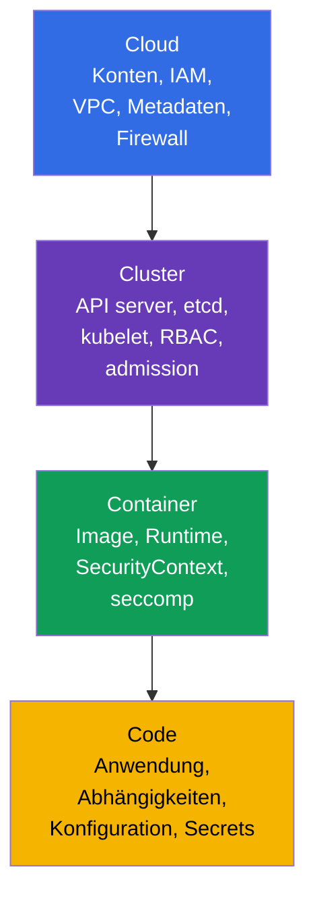
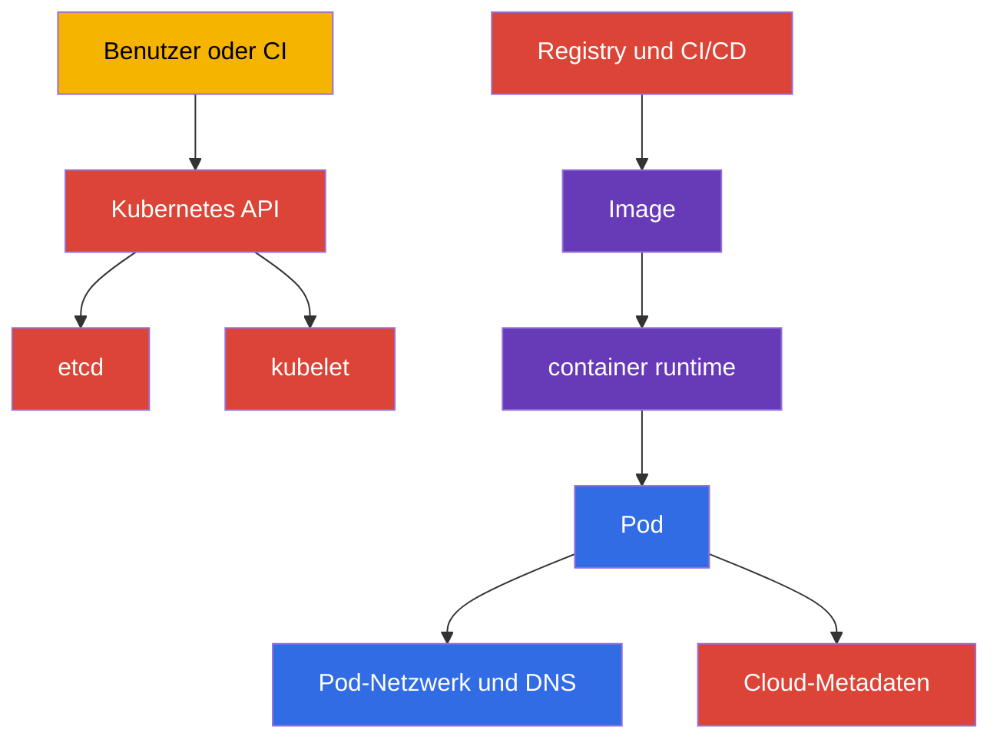
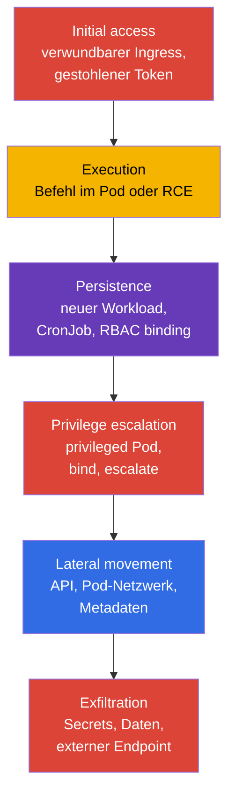
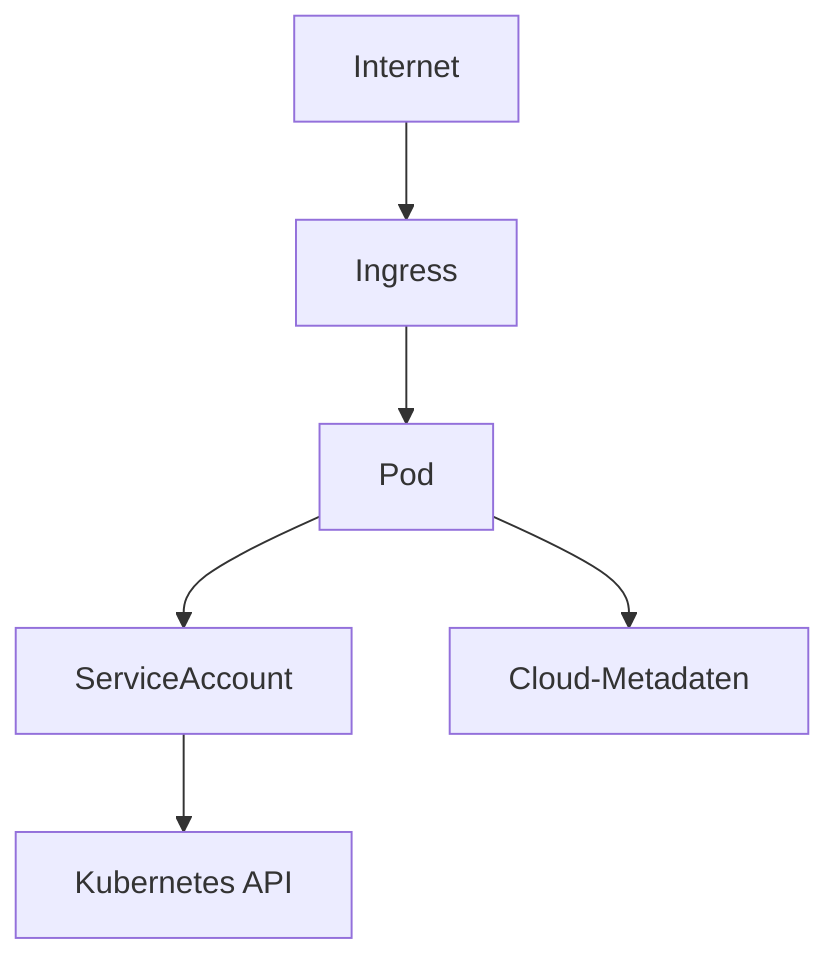
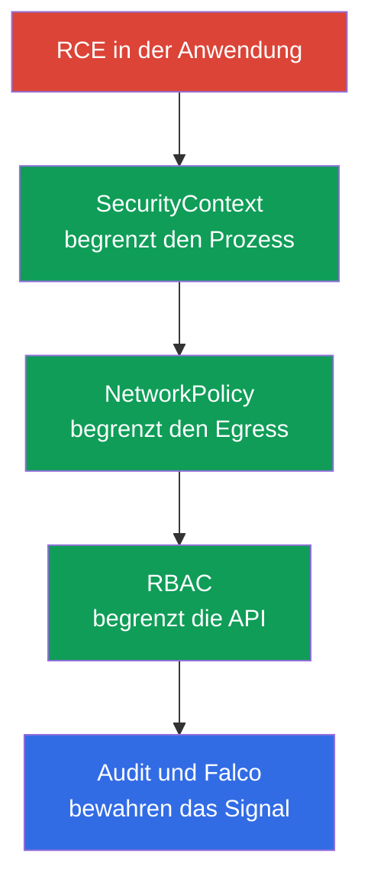

[Русская версия](ru.md) · [Eng version](README.md) · [Versión en español](es.md) · [Version française](fr.md) · [ქართული ვერსია](ge.md) · [繁體中文版](tw.md) · [日本語版](jp.md)

# Kapitel 02. Kubernetes-Sicherheitsmodell: 4C, Angriffsfläche, Angriffsphasen

> **Das Problem.** Der Schutz nur einer Kubernetes-Schicht erzeugt ein falsches Sicherheitsgefühl:
> NetworkPolicy behebt keine öffentliche API, und ein gehärteter Container schließt keine Schwachstelle
> im Code oder Cloud-Credentials eines Nodes. Ohne Karte der Assets und Grenzen schließt das Team
> vertraute Einstellungen und lässt dem Angreifer einen schwächeren Pfad über Cloud, Cluster,
> Container oder Code.

> **Wie es weitergeht.** In Kapitel 01 wurden Format, Domänen und Werkzeuge von CKS festgelegt. Jetzt wird ein allgemeines Modell benötigt, nach dem technische Entscheidungen getroffen werden: Was genau soll vor wem und durch welche Schicht geschützt werden? Dieses Kapitel ist die Grundlage für alle sechs CKS-Domänen: Cluster Setup (15 %), Cluster Hardening (15 %), System Hardening (10 %), Minimize Microservice Vulnerabilities (20 %), Supply Chain Security (20 %) und Monitoring, Logging and Runtime Security (20 %).

> **Was Sie aus CKA benötigen.** Der Aufbau von Control Plane, Worker-Node, kubelet, CNI und der API-Anfragepfad werden in [CKA-Kapitel 02](../../../cka/course/02/de.md) behandelt. Hier werden sie nur als Schutzobjekte und Risikoquellen betrachtet.

> 🧠 4C erklärt, warum der Schutz einer Schicht die Schwäche einer anderen nicht ausgleicht.

## 02.1. Das 4C-Modell: Was wir schützen

Eine ausführliche Behandlung des 4C-Modells mit Schwerpunkt auf Terminologie und Shared Responsibility steht in [Kapitel 03 des KCSA-Kurses](../../../kcsa/course/03/de.md); hier wird das Modell praktisch als Checkliste für technische CKS-Entscheidungen angewendet und nicht von Grund auf wiederholt.

Das Modell **4C** unterteilt Kubernetes-Sicherheit in vier verschachtelte Schichten: Cloud, Cluster, Container und Code. Die äußere Schicht ersetzt die innere nicht. Ein kompromittierter Workload lässt sich mit `NetworkPolicy` und `SecurityContext` einschränken, doch das behebt weder einen öffentlichen API-Endpoint noch einen zugänglichen Workload-Container-Runtime-/CRI-Socket. `docker.sock` ist nur ein Sonderfall für Nodes, auf denen tatsächlich Docker verwendet wird; in modernen Clustern sind containerd- oder CRI-O-Sockets typisch. Umgekehrt behebt ein geschütztes Netzwerk keine Schwachstelle in der Anwendung.



| Schicht | Was ist das Asset? | Typischer Angriffspfad | Grundlegende Kontrolle |
|---|---|---|---|
| Cloud | Credentials des Cloud-Providers, VPC, Metadaten, Disks und Snapshots | Ein Pod fragt `169.254.169.254` ab und erhält die Node-Rolle | Verhindern, dass Pods Credentials/Identity der Node erhalten; provider-spezifische Workload-Identity und Metadata-Controls, minimale IAM-Rechte und Security Groups verwenden |
| Cluster | Kubernetes API, etcd, kubelet, PKI, RBAC | Anonyme oder übermäßig autorisierte API-Anfrage | TLS, `RBAC`, anonymen Zugriff deaktivieren, Audit, aktuelle Versionen |
| Container | Image, Container Runtime, Namespaces, Prozesse und Dateisystem | Verwundbares Image, `privileged` Pod, Container Escape | Minimales Image, `SecurityContext`, seccomp, AppArmor, `RuntimeClass` |
| Code | Quellcode, Abhängigkeiten, Konfiguration und Secrets | RCE in der Anwendung, Secret-Leak, bösartige Abhängigkeit | Review, Dependency Scan, SBOM, keine Secrets im Code speichern, sichere Konfiguration |

4C ist als Reihenfolge für Prüfungen nützlich. Wenn ein Pod alle `Secrets` lesen darf, wird zuerst die Cluster-Schicht - RBAC - korrigiert. Kann ein Prozess im Pod ein Werkzeug installieren und ein Payload herunterladen, sind Einschränkungen der Container-Schicht und Egress-Kontrolle nötig. Akzeptiert ein Anwendungs-Endpoint beliebige Befehle, ersetzt kein Kubernetes-Manifest die Korrektur der Code-Schicht.

> 🎯 Die Reihenfolge Cloud → Cluster → Container → Code und die Grundbefehle jedes Schritts.

### Schnelle Bestandsaufnahme der Grenzen

Das obige 4C-Modell besagt: Eine äußere Schicht wird nicht durch eine innere ersetzt, und eine Schwachstelle außen kann nicht durch Schutz innen kompensiert werden. Deshalb muss auch die Bestandsaufnahme in derselben Reihenfolge erfolgen - **Cloud → Cluster → Container → Code** - und nicht bei der vertrautesten Schicht (Cluster) beginnen. Im Folgenden steht die Strategie für jede der vier Schichten: Was genau geprüft wird, mit welchem Werkzeug dies grundsätzlich sichtbar wird und welche Befehle eine Antwort liefern.

| Schicht | Was wird inventarisiert? | Womit wird geprüft? | Schritte unten |
|---|---|---|---|
| Cloud (oder Infrastruktur-Provider) | Öffentlicher Zugang zum API-Endpoint, Identity der Node und ihre Cloud-Rechte, Härtung des Metadata Service, Netzwerkgrenze, Zugang zur Verwaltungsoberfläche des Providers | Provider-CLI (separate Rechte im entsprechenden Konto erforderlich) + eine providerunabhängige Prüfung aus dem Cluster | Schritt 1 |
| Cluster | Version und Einstiegspunkte der Control Plane, weitreichende RBAC-Rechte, gefährliche Pod-Einstellungen, offene Node-Ports | `kubectl` und SSH auf die Node | Schritte 2-5 |
| Container | Welche Images tatsächlich laufen, mutable Tags, nicht genehmigte Registries | `kubectl` | Schritt 6 |
| Code | Verwundbare Abhängigkeiten mit CVE, ausnutzbare logische Anwendungsschwachstellen (SSRF, Injection, Autorisierungsumgehung, IDOR), unsichere Konfigurations-Defaults, Secrets im Code und Manifest | `kubectl` deckt nur den letzten Punkt ab (Secret im Manifest); alles andere erfordert SBOM, Dependency Scan, SAST, Code Review und Pentest | Schritt 7 - teilweise |

Eine wichtige Einschränkung offen gesagt: `kubectl` sieht nur, was in der Kubernetes API gelandet ist; daher deckt die Inventarisierung die vier Schichten sehr ungleich ab. Die Cloud-Schicht sieht es größtenteils überhaupt nicht (IAM-Rollen, VPC, Snapshots liegen außerhalb der Cluster-API), und die Code-Schicht am wenigsten: Ein Manifest zeigt ein in `env` eingetragenes Secret, jedoch grundsätzlich weder eine verwundbare Bibliothek im Image noch SQL-Injection oder eine Autorisierungsumgehung im Anwendungscode noch ein im Quellcode hart kodiertes Secret. Das ist kein Mangel der folgenden Befehle, sondern eine Grenze des Werkzeugs selbst: Die Kubernetes API weiß nichts über den Inhalt Ihrer Anwendung. Vollständige Arbeit an der Code-Schicht umfasst SBOM und Dependency Scanning (Kapitel 25 und 28), statische Analyse (Kapitel 27); logische Anwendungsschwachstellen lassen sich überhaupt nicht mit CKS-Werkzeugen lösen: Sie werden durch Code Review, SAST/DAST und Pentest gefunden und bleiben Verantwortung der Entwicklung, nicht des Plattformteams. Die folgende Inventarisierung ist eine schnelle Momentaufnahme der Grenzen anhand aus dem Cluster erreichbarer Daten, kein vollständiges Audit aller vier Schichten. Die Befehle ändern nichts und eignen sich für normalen Administratorzugriff auf den Cluster; jeder Schritt ist unabhängig von den vorherigen.

**Schritt 1 (Cloud). Ist der Cloud-Metadata-Endpoint aus einem Pod erreichbar?**

Die Cloud-Schicht liegt nahezu vollständig außerhalb der Kubernetes API; ihre Inventarisierung teilt sich daher in zwei Teile: Was sich innerhalb des Clusters prüfen lässt und was die CLI des Providers erfordert.

Innerhalb des Clusters wird eine konkrete, gut bekannte Risikoklasse geprüft: Kann ein beliebiger Pod überhaupt den Metadata Service der Node erreichen und potenziell dessen Credentials stehlen? Die Adresse `169.254.169.254` ist eine link-local IP, bei AWS, GCP, Azure, Hetzner und den meisten anderen Providern gleich; daher lässt sich die Prüfung der Netzwerkerreichbarkeit providerunabhängig durchführen:

```bash
kubectl run metadata-probe --rm -i --restart=Never --image=curlimages/curl:8.11.1 -- \
  curl -s -o /dev/null -w 'http_code=%{http_code}\n' --max-time 2 http://169.254.169.254/
```

Der Befehl startet einen einmaligen Pod (`--rm` löscht ihn direkt nach Ende) und ruft das **Wurzelverzeichnis** des Endpoints auf, nicht den Pfad eines bestimmten Providers. Das ist entscheidend: Es interessiert nicht der Inhalt der Metadaten, sondern allein die Tatsache der Netzwerkerreichbarkeit. Jeder erhaltene HTTP-Code - `200`, `401`, `403`, `404` - bedeutet, dass der Endpoint geantwortet hat, der Pod ihn also erreicht hat: Das ist unabhängig von der Cloud ein Warnsignal. Code `000` bedeutet, dass überhaupt keine Antwort kam (Timeout oder Verbindungsverweigerung) - der Endpoint ist für Pods unerreichbar, was das Ziel der Härtung ist. Der Befehl liest und speichert keinen Response-Body, sondern nur den Code; daher kann er nicht versehentlich echte Credentials in ein Log übernehmen.

Wenn nach festgestellter Erreichbarkeit geklärt werden muss, was genau dort gelesen wird, müssen anschließend Pfad und Header des jeweiligen Providers verwendet werden - sie sind untereinander nicht kompatibel:

| Provider | Pfad | Pflicht-Header |
|---|---|---|
| AWS (EC2 IMDS) | `/latest/meta-data/` | Keiner für IMDSv1; für IMDSv2 ist ein separat per `PUT /latest/api/token` beschaffter Token nötig |
| GCP | `/computeMetadata/v1/` | `Metadata-Flavor: Google` |
| Azure | `/metadata/instance?api-version=2021-02-01` | `Metadata: true` |
| Hetzner Cloud | `/hetzner/v1/metadata` | Keiner |

Gerade wegen dieser Unterschiede ist die obige Prüfung absichtlich an keinen Pfad gebunden: Ein Befehl mit `/latest/meta-data/` würde bei GCP und Azure `404` liefern und fälschlich als „unerreichbar“ verstanden, obwohl der Endpoint tatsächlich antwortet. Die Header-Anforderung (`Metadata-Flavor`, `Metadata: true`) schützt vor einfachem SSRF, nicht vor einem Pod: Ein Pod kann jeden Header selbst senden; daher hebt das Vorhandensein des Headers die Notwendigkeit nicht auf, den Netzwerkpfad zu schließen.

**Es dürfen zwei unterschiedliche Schlussfolgerungen nicht verwechselt werden.** „Endpoint erreichbar“ und „Credentials erlangt“ sind nicht dasselbe und dürfen im Bericht nicht vermischt werden:

- *Erreichbarkeit* ist ein **Fund und eine Voraussetzung**: Der Netzwerkpfad vom Pod zum Metadata Service ist nicht geschlossen. Das genügt, um eine Behebungsaufgabe anzulegen, beweist aber für sich allein keine Kompromittierung.
- *Auslesbarkeit von Credentials* ist ein **bestätigter Ausnutzungspfad** und verlangt, dass auch die übrigen Provider-Bedingungen erfüllt sind.

Ein gutes Beispiel für den Unterschied ist AWS. Bei `HttpTokens=required` (nur IMDSv2) bewirkt ein Aufruf ohne Token nichts; der Token wird mit einem separaten `PUT` angefordert, dessen Antwort genau `HttpPutResponseHopLimit` Netzwerk-Hops überlebt. Bei Hop-Limit `1` erreicht die Antwort keinen Pod mit eigenem Network Namespace - der Endpoint antwortet also, die Probe zeigt Erreichbarkeit, aber Token und damit Credentials lassen sich nicht erlangen. Beachten Sie, dass ein Pod mit `hostNetwork: true` keinen zusätzlichen Hop darstellt, sodass diese Einschränkung für ihn nicht wirkt. Praktische Schlussfolgerung: Halten Sie Erreichbarkeit als eigenen Fakt fest und schließen Sie auf Credential-Diebstahl erst nach Prüfung der konkreten Provider-Einstellungen.

Der Rest dieser Schicht erfordert die CLI des Providers und separate Rechte in dessen Konto - `kubectl` kann diese Objekte grundsätzlich nicht sehen.

> 🏭 Provider-spezifische CLI, um öffentlichen API-Zugriff und die Härtung des Metadata Service zu prüfen.

Die Fragen sind bei allen Providern gleich, nur die Befehle unterscheiden sich:

1. Ist die Kubernetes API aus dem Internet offen, und aus welchen Netzwerken?
2. Welche Identity ist an die Nodes gebunden, und was kann sie in der Cloud, wenn sie über einen Pod gestohlen wird?
3. Ist die Härtung des Metadata Service aktiviert (bei AWS - nur IMDSv2 und begrenztes Hop-Limit; bei GCP/Azure - Header-Pflicht plus Netzwerkregeln)?
4. Wer kann außerhalb von Kubernetes eine Node, Disk, einen Snapshot oder eine Netzwerkregel erstellen/ändern?

Beispiel für AWS/EKS (bei GCP sind dies `gcloud container clusters describe` und `gcloud compute instances describe`, bei Azure `az aks show` und `az vm show`; die Fragen sind gleich, Ausgabe und Feldnamen unterschiedlich):

```bash
# Frage 1: Ist der API server aus dem Internet sichtbar, und für wen?
aws eks describe-cluster --name "$CLUSTER" \
  --query 'cluster.resourcesVpcConfig.{public:endpointPublicAccess,private:endpointPrivateAccess,cidrs:publicAccessCidrs}'

# Frage 3: Hop-Limit `1` ist der sicherheitsorientierte Default; `2` wird nur dort geprüft,
# wo ein Pod begründet selbst auf IMDS zugreifen muss
aws ec2 describe-instances --filters "Name=tag:eks:cluster-name,Values=$CLUSTER" \
  --query 'Reservations[].Instances[].{id:InstanceId,imds:MetadataOptions.HttpTokens,hop:MetadataOptions.HttpPutResponseHopLimit}'
```

Der AWS EKS Best Practices Guide unterscheidet zwei verschiedene Fälle, die nicht zu einer einzigen „Baseline“ zusammengezogen werden dürfen. Soll ein Pod nicht die Rechte des Instance Profile der Node erben (der übliche Fall bei IRSA/EKS Pod Identity), empfiehlt die Dokumentation ausdrücklich `HttpTokens=required` und `HttpPutResponseHopLimit=1` im Abschnitt „Restrict access to the instance profile assigned to the worker node“ - genau dies blockiert den Erhalt von Node-Credentials über einen Pod. Den Wert `HttpPutResponseHopLimit=2` empfiehlt die Dokumentation gesondert und nur dann, wenn die Anwendung tatsächlich eigenen Zugriff auf IMDS benötigt („When your application needs access to IMDS... increase the hop limit to 2“) - dies ist eine begründete Ausnahme, keine allgemeine Sicherheits-Baseline für alle Container-Workloads.

**Sonderfall: self-managed Cluster auf „normalen“ Servern** (kubeadm auf Bare Metal, VM bei Hetzner und Ähnlichem).

> 🔬 Prüfung eines self-managed Clusters.

Hier kann Cloud-IAM gänzlich fehlen - im Sinn von Cloud-Rollen gibt es für die Node nichts zu stehlen, und Frage 2 entfällt teilweise. Die Cloud-Schicht verschwindet jedoch nicht, sondern wird durch die Schicht des Infrastruktur-Providers ersetzt. Die Fragen lauten dann: Ist der API server und SSH aus dem Internet oder nur aus dem privaten Netzwerk erreichbar; wer besitzt Zugang zum Provider-Panel (Server erstellen/löschen, Konsolen- und Snapshot-Zugang sind faktisch Root auf den Nodes); hat der Provider einen eigenen Metadata-Endpoint mit sensiblen Daten (bei Hetzner ist dies `169.254.169.254/hetzner/v1/metadata`, wo auch Cloud-Init User Data liegen kann); ist der Verkehr zwischen Servern durch Netzwerkregeln des Providers und nicht nur durch `NetworkPolicy` im Cluster eingeschränkt? Die obige `metadata-probe` ist hier ebenso anwendbar - sie ist nicht an eine Cloud gebunden.

**Schritt 2 (Cluster). Einstiegspunkte und Version der Control Plane.**

```bash
kubectl cluster-info
kubectl get --raw=/version
```

`kubectl cluster-info` zeigt die Adresse des API server und der Systemdienste - den ersten Einstiegspunkt, den jeder Cluster-Client sieht. `kubectl get --raw=/version` gibt die genaue Version der Kubernetes Control Plane zurück: Sie wird benötigt, um verfügbare Flags und bekannte CVE genau für diese Version abzugleichen, statt anhand der Dokumentation eines beliebigen Releases zu raten.

**Schritt 3 (Cluster). Wer besitzt weitreichende clusterweite Rechte?**

```bash
kubectl get clusterrolebinding -o jsonpath='{range .items[?(@.roleRef.name=="cluster-admin")]}{.metadata.name}{"\t"}{range .subjects[*]}{.kind}:{.name}{" "}{end}{"\n"}{end}'
```

Dieser Befehl gibt nur `ClusterRoleBinding` aus, die auf die eingebaute Rolle `cluster-admin` verweisen - die weitreichendste Rolle im Cluster mit vollständigem Zugriff auf alle Ressourcen. Für jedes gefundene Binding zeigt die Zeile seinen Namen und danach die Liste der Subjects (`User`, `Group` oder `ServiceAccount`), denen die Rolle zugewiesen ist. Das innere `range` über `.subjects[*]` ist nötig, weil ein Binding auf mehrere Subjects zugleich verweisen kann.

**Eine Prüfung nach dem Namen `cluster-admin` reicht nicht.** Die Zugriffsstufe bestimmt nicht der Name der Rolle, sondern die Kombination ihrer Regeln und der Geltungsbereich ihres Bindings. Eine `ClusterRole` mit `apiGroups: ["*"]`, `resources: ["*"]` und `verbs: ["*"]` beschreibt selbst einen Berechtigungssatz - praktisch unbegrenzten Zugriff auf die Kubernetes Resource API -, doch der tatsächliche Umfang hängt vom Binding ab: Ein `ClusterRoleBinding` lässt sie clusterweit in allen Namespaces wirken, während ein `RoleBinding`, das auf dieselbe `ClusterRole` verweist, ihre namespaced Berechtigungen auf den Namespace einschränkt, in dem dieses `RoleBinding` erstellt wurde. Dieser Mechanismus ermöglicht, denselben Regelsatz in mehreren Namespaces wiederzuverwenden statt identische `Role` zu erstellen; außerdem wird `ClusterRole` für Rechte auf cluster-scoped Ressourcen (etwa `nodes`), auf Non-Resource-Endpoints (`/healthz`) und für clusterweiten Zugriff über `ClusterRoleBinding` verwendet. In realen Clustern entstehen solche Rollen ständig: unter harmlosen Namen wie `platform-superuser`, `ci-deployer` oder `monitoring-full`, erstellt „damit es einfach funktioniert“ oder absichtlich, um das Review nach dem Wort `cluster-admin` zu umgehen. Eine Namenssuche sieht sie gar nicht; eine Suche nur nach den Rollenregeln ohne Prüfung ihrer Bindings bewertet das Risiko falsch - weitreichende Rechte, die per `RoleBinding` in einem Namespace gebunden sind, haben einen anderen Threat Scope als dieselben Rechte über `ClusterRoleBinding`.

Streng genommen ist eine solche Rolle **nicht das buchstäbliche Äquivalent** des eingebauten `cluster-admin`: Dieser hat in seiner Definition zwei Regeln statt einer - Wildcards für Ressourcen sowie eine eigene Wildcard-Regel für `nonResourceURLs`, die Non-Resource-Endpoints wie `/healthz`, `/metrics` und `/debug/*` abdeckt. Eine Rolle ohne die zweite Regel gibt diese Pfade nicht frei und kann zudem durch `resourceNames` eingeschränkt oder per Aggregation (`aggregationRule`) verändert sein. Praktisch ist der Unterschied für die Triage jedoch unerheblich: Die Kontrolle über alle API-Ressourcen schließt bereits das Lesen aller Secrets, das Erstellen von Pods auf jeder Node und das Ändern von RBAC ein, also einen Weg zur vollständigen Clusterübernahme. Auch die offizielle Kubernetes-Dokumentation formuliert für dieses Beispiel vorsichtig „similar to the built-in `cluster-admin` role“, nicht „identical“. Die praktische Schlussfolgerung ändert sich nicht: Es muss nach Rechten, nicht nach Namen gesucht werden.

```bash
# Schritt A: ALLE ClusterRole mit vollständigen Wildcard-Rechten finden, unabhängig vom Namen
kubectl get clusterroles -o json | jq -r '
  .items[]
  | select(any(.rules[]?;
      ((.apiGroups // []) | index("*")) and
      ((.resources // []) | index("*")) and
      ((.verbs // []) | index("*"))))
  | .metadata.name
'
```

```bash
# Schritt B: Bindings finden, die auf eine der gefundenen Rollen verweisen
dangerous=$(kubectl get clusterroles -o json | jq -r '
  .items[]
  | select(any(.rules[]?;
      ((.apiGroups // []) | index("*")) and
      ((.resources // []) | index("*")) and
      ((.verbs // []) | index("*"))))
  | .metadata.name
')

kubectl get clusterrolebinding -o json \
  | jq -r --argjson names "$(echo "$dangerous" | jq -R . | jq -s .)" '
      .items[]
      | select(.roleRef.name as $r | $names | index($r))
      | "\(.metadata.name) -> Rolle \(.roleRef.name) (cluster-wide), subjects: \([.subjects[]? | "\(.kind):\(.name)"] | join(", "))"
    '

# Schritt B': Dieselbe Rolle kann auch über ein RoleBinding gebunden sein - dann gelten die Rechte
# nur in einem Namespace, werden aber durch die Suche nach ClusterRoleBinding oben ebenfalls nicht „geprüft“
kubectl get rolebinding -A -o json \
  | jq -r --argjson names "$(echo "$dangerous" | jq -R . | jq -s .)" '
      .items[]
      | select(.roleRef.kind == "ClusterRole" and (.roleRef.name as $r | $names | index($r)))
      | "\(.metadata.name) (namespace \(.metadata.namespace)) -> Rolle \(.roleRef.name) (nur in diesem Namespace), subjects: \([.subjects[]? | "\(.kind):\(.name)"] | join(", "))"
    '
```

Schritt A prüft jede Rollenregel: Vollständiger Zugriff liegt vor, wenn in einer Regel gleichzeitig `*` in `apiGroups`, `*` in `resources` und `*` in `verbs` stehen. `any(.rules[]?; ...)` ist wichtig - die gefährliche Regel kann nicht die erste, sondern die zweite oder dritte neben harmlosen Regeln sein. Die Schritte B und B' nehmen die gefundenen Namen und zeigen, welche Bindings sie tatsächlich verwenden, für wen und mit welchem Scope: `ClusterRoleBinding` gibt clusterweiten Zugriff, während ein `RoleBinding` auf dieselbe `ClusterRole` ihn auf einen Namespace beschränkt. Das ist bei gleichen Rollenregeln ein anderer Bedrohungsumfang; einen der beiden Binding-Typen auszulassen, ergibt ein unvollständiges Bild. Eine ungebundene gefährliche Rolle ist ebenfalls ein Review-Problem, doch eine gebundene Rolle bedeutet, dass jemand bereits die Rechte erhalten hat.

Auch engere, aber weiterhin gefährliche Muster, die nicht unter die vollständige Wildcard fallen, sollten gesondert betrachtet werden:

```bash
kubectl get clusterroles -o json | jq -r '
  .items[]
  | .metadata.name as $name
  | .rules[]?
  | select(((.verbs // []) | index("*"))
      and (((.apiGroups // []) | index("*") | not) or ((.resources // []) | index("*") | not)))
  | "\($name): verbs=* auf apiGroups=\(.apiGroups // []) resources=\(.resources // [])"
'
```

Beispielsweise ist `verbs: ["*"]` nur für `secrets` nicht `cluster-admin`, erlaubt aber das Lesen und Ändern aller Cluster-Secrets - für viele Threat Models entspricht das einer vollständigen Kompromittierung. Ebenso gefährlich sind `create` für `pods` zusammen mit weitreichender `hostPath`-Erlaubnis auf der Admission-Schicht, `escalate`/`bind` für Rollen und `impersonate` für Benutzer: Sie eröffnen einen Pfad zur Privilegienerweiterung, selbst wenn die Rolle selbst eng erscheint. Eine vollständige Behandlung solcher Muster steht in [Kapitel 10](../10/de.md).

> **In der Prüfung.** Ein verschachteltes `range` mit dem Filter `?(@.roleRef.name==...)` in einem einzigen Jsonpath-Ausdruck ist genau das, wovor Schritt 4 warnt: Beim schnellen Tippen geht leicht eine Klammer oder ein Anführungszeichen verloren. Zuverlässiger ist es, die Prüfung in eine einfache Schleife aufzuteilen, in der jeder `kubectl`-Aufruf nur ein Feld ohne Filter und Verschachtelung abfragt:
>
> ```bash
> for crb in $(kubectl get clusterrolebinding -o name | cut -d/ -f2); do
>   role=$(kubectl get clusterrolebinding "$crb" -o jsonpath='{.roleRef.name}')
>   if [[ "$role" == "cluster-admin" ]]; then
>     echo "$crb:"
>     kubectl get clusterrolebinding "$crb" -o jsonpath='{range .subjects[*]}{.kind}:{.name}{" "}{end}'
>     echo
>   fi
> done
> ```
>
> `kubectl get clusterrolebinding -o name` gibt Namen in der Form `clusterrolebinding.rbac.authorization.k8s.io/<name>` aus; `cut -d/ -f2` lässt nur den Namen nach `/` übrig. Jeder Aufruf `kubectl get clusterrolebinding "$crb" -o jsonpath='{.roleRef.name}'` prüft genau ein einfaches Feld eines konkreten Bindings - es gibt hier weder den Filter `?(...)` noch ein verschachteltes `range`, um die Bindings selbst auszuwählen, sondern nur für die Subjects innerhalb des gefundenen Treffers. Das lässt sich vor dem Ausführen deutlich einfacher mit den Augen überprüfen. Es ist langsamer als der Einzeiler oben (eine eigene API-Anfrage je Binding), aber in einem Prüfungscluster gibt es üblicherweise nicht Tausende Bindings, und der Unterschied in der Zuverlässigkeit beim Tippen ist wichtiger als Sekunden.

**Schritt 4 (Cluster). Workloads mit erkennbar gefährlichen Merkmalen.**

> 🎯 Pods mit `privileged`, `hostNetwork/hostPID/hostIPC`, `hostPath`, hinzugefügten Capabilities oder `runAsUser: 0` finden.

> **In der Prüfung.** Die vollständige Version unten (mit eigenen `def`-Funktionen für jede Prüfebene) ist didaktisch: Sie zeigt alle sechs Merkmale auf einmal und warum sie logisch zusammenhängen, nicht das, was unter Zeitdruck tatsächlich getippt werden sollte. Selbst ein kurzer `jq`-Filter mit verschachteltem `select` und Arrays lässt sich gerade bei Zeitnervosität durch eine fehlende Klammer leicht beschädigen. Unter Druck ist eine *weniger elegante*, aber syntaktisch fast nicht kaputtzubekommende Variante mit `grep` zuverlässiger. Beispiel: die Aufgabe „Finde alle Pods mit hostNetwork im Namespace `prod`“:
>
> ```bash
> NS=prod
>
> for pod in $(kubectl get pods -n "$NS" -o jsonpath='{.items[*].metadata.name}'); do
>   if kubectl get pod "$pod" -n "$NS" -o json | grep hostNetwork | grep -q true; then
>     echo "$pod"
>   fi
> done
> ```
>
> Die Idee: Mit einem einfachen Befehl die Liste der Pod-Namen holen, dann in einer Schleife für jeden Pod sein JSON abrufen und nach dem gesuchten Feld suchen - bei einem Treffer den Namen ausgeben. Der Namespace steht in der ersten Zeile in der Variable `NS`: Er kommt zweimal im Befehl vor, und unter Zeitdruck ist es leicht, einen Aufruf zu ändern und den zweiten zu vergessen; dann sucht das Skript stillschweigend Pods eines Namespace in einem anderen. Mit der Variablen gibt es nur eine Änderung, und sie steht gut sichtbar am Anfang. Zwei `grep` in einer Pipeline machen die Prüfung präzise und bleiben dennoch einfach: Der erste lässt nur die Zeile mit `hostNetwork`, der zweite prüft darin auf `true`. So wird `"hostNetwork": false` ausgeschlossen - das Feld ist vorhanden, aber es besteht kein Risiko. `grep -q` gibt nichts aus, sondern liefert nur den Erfolgs-/Fehlerstatus für `if`. Das funktioniert, weil `kubectl -o json` Pretty-Printed JSON ausgibt - jedes Feld steht in seiner eigenen Zeile; in den zweiten `grep` gelangt daher nur die Zeile mit `hostNetwork`, nicht benachbarte Felder. Bei einer großen Anzahl Pods im Namespace hat dieser Ansatz dieselben Skalierungsgrenzen wie die anderen Varianten auf dieser Seite (siehe den Abschnitt zu 10.000 Pods oben). Für einen Prüfungs-Namespace mit einigen oder wenigen Dutzend Pods ist das jedoch irrelevant; der Befehl bricht beim schnellen Tippen ohne Entwurf fast nicht. Derselbe Ansatz funktioniert für jedes boolesche Feld: Ersetzen Sie `hostNetwork` durch `hostPID`, `hostIPC` oder `privileged`.

Die Idee ist, alle Pods in allen Namespaces durchzugehen und nur diejenigen zu behalten, die mindestens eines der bekannten gefährlichen Merkmale besitzen - also Einstellungen, die die Container-Isolation verringern. Die Merkmale werden auf der Ebene des gesamten Pods und auf der Ebene jedes einzelnen Containers geprüft:

| Ebene | Merkmal | Warum ist das riskant? |
|---|---|---|
| Pod | `hostNetwork`, `hostPID` oder `hostIPC` | Der Pod teilt Netzwerk-Stack, Prozesse oder IPC mit der Node selbst - die Isolation ist teilweise aufgehoben |
| Pod | Volume vom Typ `hostPath` | Der Container erhält direkten Zugriff auf das Dateisystem der Node |
| Container | `privileged: true` | Der Container erhält fast alle Kernel-Privilegien wie ein Prozess auf dem Host |
| Container | `allowPrivilegeEscalation: true` | Ein Prozess im Container kann mehr Rechte erlangen als beim Start vorhanden waren |
| Container | Hinzugefügte `capabilities` | Dem Container werden explizit Privilegien über das minimale Set hinaus erteilt |
| Container | `runAsUser: 0` (am Pod oder Container) | Der Prozess läuft als root im Container |

Die Implementierung sucht mit `jq` genau diese Merkmale und gibt nur Pods aus, bei denen mindestens eines zutrifft - alle anderen werden gar nicht ausgegeben, damit die Liste nicht in Hunderten sicherer Pods untergeht.

**Warum erledigt dies `jq` und nicht `--field-selector` oder `-o jsonpath`?** Eine naheliegende Frage: Können die gefährlichen Merkmale nicht direkt auf dem API server gefiltert werden, damit JSON sicherer Pods gar nicht zum Client übertragen wird? Teilweise, aber nicht vollständig. `--field-selector` unterstützt für Pods eine enge, im API server fest kodierte Liste von Feldern: `metadata.name`, `metadata.namespace`, `spec.nodeName`, `spec.restartPolicy`, `spec.schedulerName`, `spec.serviceAccountName`, `spec.hostNetwork`, `status.phase`, `status.podIP`, `status.podIPs`, `status.nominatedNodeName` (gegen die offizielle Kubernetes-Dokumentation geprüft; die Liste kann sich zwischen Versionen unterscheiden, und `kubectl` gibt `BadRequest` zurück, wenn ein nicht unterstütztes Feld angegeben wird). `spec.hostNetwork` **ist** enthalten - daher kann diese eine Prüfung auf den Server verlagert werden. `hostPID`, `hostIPC`, `privileged`, `allowPrivilegeEscalation`, hinzugefügte `capabilities`, ein `hostPath`-Volume und `runAsUser` gehören jedoch nicht zu dieser Liste - sie lassen sich nicht serverseitig filtern; damit sollte auch absehbar nicht gerechnet werden: Die Feldmenge ist im Code des API server definiert, nicht für beliebige Ausdrücke offen. Die Formulierung ist bewusst versionsgebunden: Die genannte Liste entspricht der Dokumentation für die Kurs-Baseline (Kubernetes v1.36); die richtige Gewohnheit ist, sie bei Zweifel in der Dokumentation der eigenen Version zu prüfen, statt sie dauerhaft auswendig zu lernen. Auch `-o jsonpath` löst die Aufgabe nicht: Es kann einzelne Felder projizieren und über `?(@.field==value)` filtern, kann aber nicht mehrere Bedingungen per „oder“ in einem Ausdruck kombinieren und nicht zugleich in `spec.containers[]`, `spec.volumes[]` und `spec.securityContext` mit gemeinsamer Logik sehen - dafür wird eine Sprache mit vollständigen booleschen Ausdrücken benötigt, also `jq` (oder ein clientseitiges Äquivalent). Zusätzlich kann `status.phase` auf `Running` eingeschränkt werden, wenn beendete Pods für diese Prüfung nicht relevant sind. Beide serverseitigen Optimierungen werden in einem `--field-selector` mit Komma kombiniert:

```bash
kubectl get pods -n "$ns" --field-selector=status.phase=Running -o json
```

Das ersetzt `jq` nicht, sondern reduziert die JSON-Menge, die es erreicht: Der Server sendet dem Client keine beendeten Pods mehr, und `jq` prüft weiterhin die übrigen Merkmale, die nicht serverseitig filterbar sind. Im Folgenden prüft `jq` `hostNetwork` zusammen mit den anderen Merkmalen, obwohl es formal in einer eigenen Anfrage per `--field-selector` ausgelagert werden könnte: Getrennte Anfragen pro Merkmal würden das Skript stärker verkomplizieren, als die Ersparnis eines Feldes von sieben rechtfertigt; eine einheitliche Prüfung in einem `jq`-Ausdruck bleibt klarer und leichter wartbar.

**Wichtig zur Skalierung.** Hier sind zwei unterschiedliche Lasten zu unterscheiden, die häufig verwechselt werden. Auf dem API server ist es nicht so schlimm, wie es scheint: `kubectl get` ruft große Listen standardmäßig **in Chunks** ab - das Flag `--chunk-size` hat standardmäßig den Wert `500` („Return large lists in chunks rather than all at once“). 10.000 Pods werden also mit ungefähr zwanzig aufeinanderfolgenden Anfragen abgerufen, nicht mit einer riesigen. Diese Paginierung lässt sich nur explizit durch `--chunk-size=0` deaktivieren.

Das Problem liegt woanders: Die Chunks werden **auf dem Client** zusammengeführt. `kubectl` klebt sie zu einem JSON-Dokument zusammen, und `jq` wartet auf dessen Vollständigkeit, bevor es auch nur eine Zeile ausgibt. In Produktion mit Tausenden Pods bedeutet das Hunderte MB im Speicher der Arbeitsmaschine und Minuten Wartezeit ohne Rückmeldung - bis hin zu OOM in `kubectl` oder `jq`. Daher ist es nützlich, Namespaces einzeln in einer Schleife zu durchlaufen, nicht um den API server zu entlasten (das übernimmt Chunking), sondern um **nicht den gesamten Cluster gleichzeitig im Speicher zu halten** und inkrementell Namespace für Namespace Ergebnisse zu erhalten:

```bash
for ns in $(kubectl get ns -o jsonpath='{.items[*].metadata.name}'); do
  kubectl get pods -n "$ns" --field-selector=status.phase=Running -o json | jq -r --arg ns "$ns" '
    def containers:
      (.spec.containers // [])
      + (.spec.initContainers // [])
      + (.spec.ephemeralContainers // []);

    # Statt true/false gibt jede Container-Prüfung eine LISTE
    # konkreter zutreffender Merkmale samt Containernamen zurück -
    # andernfalls wären die verschiedenen Merkmale in der Ausgabe nicht zu unterscheiden.
    def container_reasons:
      [
        (if .securityContext.privileged == true then "privileged:\(.name)" else empty end),
        (if .securityContext.allowPrivilegeEscalation == true then "allowPrivilegeEscalation:\(.name)" else empty end),
        (if ((.securityContext.capabilities.add // []) | length > 0)
          then "capabilities.add=\((.securityContext.capabilities.add // []) | join(",")):\(.name)"
          else empty end),
        (if .securityContext.runAsUser == 0 then "runAsUser=0:\(.name)" else empty end)
      ];

    # Entsprechend für den gesamten Pod: Liste der Gründe auf Pod-Ebene plus Gründe
    # jedes Containers, zu einer flachen Liste zusammengeführt.
    def pod_reasons:
      [
        (if .spec.hostNetwork == true then "hostNetwork" else empty end),
        (if .spec.hostPID == true then "hostPID" else empty end),
        (if .spec.hostIPC == true then "hostIPC" else empty end),
        (if .spec.securityContext.runAsUser == 0 then "pod.runAsUser=0" else empty end),
        (if ([.spec.volumes[]? | select(.hostPath != null)] | length > 0)
          then "hostPath=\([.spec.volumes[]? | select(.hostPath != null) | .hostPath.path] | join(","))"
          else empty end)
      ] + [containers[]? | container_reasons[]];

    .items[]
    | (pod_reasons) as $reasons
    | select($reasons | length > 0)
    | "\($ns)/\(.metadata.name): \($reasons | join("; "))"
  '
done
```

Die Prüflogik (die drei Funktionen `containers`/`container_reasons`/`pod_reasons` und das abschließende `select`) bleibt inhaltlich dieselbe wie in der Idee oben - geändert haben sich die Datenermittlung (siehe oben) und das Ausgabeformat: Die Zeile sagt jetzt nicht nur „requires review“, sondern führt direkt auf, welche Merkmale und welcher Container betroffen sind, etwa `hostNetwork; privileged:aws-node; capabilities.add=NET_ADMIN:aws-node`. Ohne dies verwandelt sich die Ausgabe in einem realen Cluster (besonders EKS/GKE, wo CNI und andere System-DaemonSets - beispielsweise `aws-node` - legitim `hostNetwork` und `privileged` verwenden) in eine lange Liste gleicher Zeilen `namespace/pod requires review`; darin lässt sich nicht schnell unterscheiden, was erwartete Systemkomponente und was ein echter Fund ist. Die konkrete Ursache beantwortet sofort die Frage, „warum genau dieser Pod in der Liste steht“, ohne für jedes Ergebnis nacheinander `-o yaml` öffnen zu müssen.

Schritt für Schritt, aber ohne Code:

1. `for ns in $(kubectl get ns -o jsonpath='{.items[*].metadata.name}')` ruft die Liste der Namespace-Namen mit einer leichten Anfrage ab (ohne Pods, nur Namen) und weist sie einzeln der Variablen `$ns` zu.
2. `kubectl get pods -n "$ns" --field-selector=status.phase=Running -o json` im Schleifenkörper lädt nur Running Pods des aktuellen Namespace - JSON um eine Größenordnung kleiner als `-A` ohne Filter für den gesamten Cluster und ohne beendete/tote Pods, die für diese Prüfung nicht benötigt werden.
3. `containers` ist eine Hilfsliste: Normale, Init- und Ephemeral-Container des Pods werden zu einem Stream zusammengeführt, da eine gefährliche Einstellung in jedem von ihnen dasselbe Risiko darstellt wie im Hauptcontainer.
4. `container_reasons` gibt für einen Container die Liste konkreter ausgelöster Merkmale mit Containernamen zurück: `privileged:<name>`, `allowPrivilegeEscalation:<name>`, `capabilities.add=...:<name>` oder `runAsUser=0:<name>` - die Liste kann leer sein, wenn der Container sicher ist.
5. `pod_reasons` erledigt dasselbe für den ganzen Pod: `hostNetwork`, `hostPID`, `hostIPC`, `pod.runAsUser=0`, `hostPath=<pfad>`, zusammen mit den Gründen aller Container über `container_reasons[]` zu einer flachen Liste verbunden.
6. Die letzte Zeile geht alle Pods durch (`.items[]`), weist die Liste der Gründe der Variablen `$reasons` zu, behält nur Pods mit nicht leerer Liste und gibt `namespace/pod-name: grund1; grund2; ...` aus - etwa `kube-system/aws-node-2sp7j: hostNetwork; privileged:aws-node; capabilities.add=NET_ADMIN:aws-node`.

Gerade die Aufschlüsselung der Gründe in Schritt 6 ist in realen Clustern wichtig. System-DaemonSets wie `aws-node` (Amazon VPC CNI), `cilium` oder `calico-node` verwenden regulär und legitim `hostNetwork` und `privileged` - sie benötigen dies zur Verwaltung von Netzwerkschnittstellen und Regeln auf der Node. Ohne Ursachenangabe erzeugt ein solches DaemonSet in einem Cluster mit Hunderten Nodes Hunderte gleiche Zeilen `requires review`, bei denen unklar ist, dass alle ein und dasselbe erwartete Muster sind. Mit der Ursache wird sofort sichtbar: Zeigen alle Treffer in einem Namespace bei demselben Image dieselbe Merkmalsmenge, ist dies wahrscheinlich eine legitime Systemkomponente für die Review-Liste mit der Begründung „CNI benötigt“, nicht Dutzende einzelner Untersuchungsfunde.

**Zusatzvariante von Schritt 4: Strukturierte JSON-Ausgabe mit Chunking innerhalb eines Namespace.**

> 🏭 Chunked JSON-Prüfung für Cluster mit Tausenden Pods.

Die obige Variante eignet sich für eine schnelle manuelle Prüfung: Eine menschenlesbare Zeile ist leicht zu lesen, jedoch schwer an ein anderes Werkzeug weiterzugeben (beispielsweise ein Ticketsystem oder Dashboard), und bei einem Namespace mit Tausenden Pods sammelt sie weiterhin den ganzen Namespace im Client-Speicher, bevor etwas ausgegeben wird. Werden maschinenlesbare Ergebnisse und außerdem Schutz vor Namespace-Giganten benötigt (manche System-Namespaces in Produktion enthalten selbst nach dem Filter auf `Running` Hunderte oder Tausende Pods), ist eine komplexere Nutzung erforderlich:

```bash
CHUNK_SIZE=200
SLEEP_BETWEEN_CHUNKS=0.2

result_file=$(mktemp)
chunk_file=$(mktemp)
merge_jq=$(mktemp)
trap 'rm -f "$result_file" "$chunk_file" "$merge_jq"' EXIT
echo '{}' > "$result_file"

cat > "$merge_jq" <<'JQEOF'
def containers:
  (.spec.containers // [])
  + (.spec.initContainers // [])
  + (.spec.ephemeralContainers // []);

def container_reasons:
  [
    (if .securityContext.privileged == true then "privileged:\(.name)" else empty end),
    (if .securityContext.allowPrivilegeEscalation == true then "allowPrivilegeEscalation:\(.name)" else empty end),
    (if ((.securityContext.capabilities.add // []) | length > 0)
      then "capabilities.add=\((.securityContext.capabilities.add // []) | join(",")):\(.name)"
      else empty end),
    (if .securityContext.runAsUser == 0 then "runAsUser=0:\(.name)" else empty end)
  ];

def pod_reasons:
  [
    (if .spec.hostNetwork == true then "hostNetwork" else empty end),
    (if .spec.hostPID == true then "hostPID" else empty end),
    (if .spec.hostIPC == true then "hostIPC" else empty end),
    (if .spec.securityContext.runAsUser == 0 then "pod.runAsUser=0" else empty end),
    (if ([.spec.volumes[]? | select(.hostPath != null)] | length > 0)
      then "hostPath=\([.spec.volumes[]? | select(.hostPath != null) | .hostPath.path] | join(","))"
      else empty end)
  ] + [containers[]? | container_reasons[]];

# Die Eingabe (.) wird aus der Chunk-DATEI ($chunk_file) und nicht aus einem
# Befehlszeilenargument gelesen - bei CHUNK_SIZE=200 echten Pods mit vollständigem status und
# managedFields überschreitet ein Chunk leicht das OS-Limit für die argv-Länge, und
# `jq --argjson chunk "$chunk_json"` endet mit
# „Argument list too long“, noch bevor jq überhaupt arbeiten kann.
# Das akkumulierte Ergebnis wird aus derselben Ursache über --slurpfile acc aus einer SEPARATEN
# Datei gelesen - große Daten nicht über argv übergeben.
#
# kubectl liefert bei MEHREREN Namen eine List ({"items":[...]}), bei GENAU EINEM Namen im Befehl
# jedoch das Pod-Objekt direkt (ohne Feld items) - ohne diese Verzweigung liefert der letzte unvollständige
# Chunk (oft mit einem Pod) „jq: error: Cannot iterate over null (null)“, weil .items
# beim einzelnen Pod-Objekt nicht vorhanden ist.
($acc[0]) as $accumulated
| (.items // [.]) as $pods
| reduce ($pods[]) as $pod
  ($accumulated;
   ($pod | pod_reasons) as $reasons
   | if ($reasons | length) > 0
     then .[$ns][$pod.metadata.name] = $reasons
     else .
     end)
JQEOF

for ns in $(kubectl get ns -o jsonpath='{.items[*].metadata.name}'); do
  mapfile -t pod_names < <(kubectl get pods -n "$ns" --field-selector=status.phase=Running \
    -o jsonpath='{range .items[*]}{.metadata.name}{"\n"}{end}')
  total=${#pod_names[@]}
  processed=0
  for ((i = 0; i < total; i += CHUNK_SIZE)); do
    chunk=("${pod_names[@]:i:CHUNK_SIZE}")
    kubectl get pods -n "$ns" "${chunk[@]}" -o json > "$chunk_file"
    jq --slurpfile acc "$result_file" --arg ns "$ns" -f "$merge_jq" "$chunk_file" > "${result_file}.new"
    mv "${result_file}.new" "$result_file"
    processed=$((processed + ${#chunk[@]}))
    echo "namespace $ns: $processed/$total pods processed" >&2
    sleep "$SLEEP_BETWEEN_CHUNKS"
  done
done

jq . "$result_file"
```

Was hier komplizierter wurde und warum genau so:

- **Ausgabeformat - verschachteltes JSON statt Zeilen.** Das Ergebnis ist jetzt als `{namespace: {pod-name: [gründe]}}` strukturiert - dieselben Informationen, welche die vorherige Version als Text ausgab, jedoch für weitere automatische Verarbeitung geeignet (an ein anderes Skript übergeben, als Artefakt speichern, mit einer `jq`-Abfrage für einen konkreten Namespace filtern, ohne den Cluster erneut abzufragen).
- **Chunking innerhalb eines Namespace, nicht nur zwischen Namespaces.** Die Schleife `for ns in ...` aus der obigen Idee hilft bereits durch Arbeitsteilung nach Namespaces. Wenn jedoch in **einem** Namespace Tausende Pods liegen (typisch für große Data-/Batch-Namespaces in Produktion), ruft `kubectl get pods -n "$ns" -o json` sie zwar beim API server in `--chunk-size`-Portionen ab, **fügt aber dennoch den gesamten Namespace zu einem JSON im Client-Speicher zusammen** und übergibt ihn vollständig an `jq`. Die innere Schleife `for ((i = 0; i < total; i += CHUNK_SIZE))` teilt die Liste der Pod-Namen des aktuellen Namespace in Gruppen von `CHUNK_SIZE` (hier 200) und fragt mit `kubectl get pods -n "$ns" <name1> <name2> ...` nur diese Gruppe ab - so wird der Peak-Verbrauch auf die Größe eines Chunks statt auf die Größe des Namespace begrenzt, und nach jeder Gruppe kann Fortschritt ausgegeben werden. `--field-selector` passt hier nicht, da es „irgendeinen Namen aus einer Liste“ nicht unterstützt; die Namen werden daher als explizite Positionsargumente an `kubectl get pods` übergeben.
- **`sleep "$SLEEP_BETWEEN_CHUNKS"` zwischen Chunks.** Die Pause (hier 0,2 Sekunden) verhindert, dass das Skript den API server mit Hunderten Anfragen ohne Unterbrechung überschüttet - in einem Cluster mit vielen Namespaces und Pods reduziert dies die Spitzenlast merklich, verglichen mit möglichst schnellem Senden aller Chunks.
- **`echo ... >&2` mit Fortschritt nach jedem Chunk.** Schreibt nach stderr (ohne sich mit dem endgültigen JSON auf stdout zu vermischen) eine Zeile wie `namespace kube-system: 200/1400 pods processed` - bei großen Clustern kann der Durchlauf Minuten dauern, und ohne Anzeige bleibt unklar, ob das Skript arbeitet oder hängt.
- **Chunk-Ergebnis und akkumuliertes Ergebnis liegen in Dateien, nicht in Shell-Variablen.** `kubectl get pods ... -o json > "$chunk_file"` schreibt das JSON eines Chunks auf Disk, und `jq --slurpfile acc "$result_file" ... "$chunk_file"` liest sowohl Chunk als auch aktuelles Gesamtergebnis aus Dateien statt sie als Befehlszeilenargumente zu übergeben. Das ist entscheidend: Bei `CHUNK_SIZE=200` echten Pods mit vollständigem `status` und `managedFields` erreicht JSON eines Chunks leicht mehrere MB; ein Befehl wie `jq --argjson chunk "$chunk_json" ...` übergibt dieses JSON als normales Prozessargument. Wird die OS-Grenze für die gesamte argv-Länge (`ARG_MAX`, typischerweise etwa 128 KB bis mehrere MB je nach System) überschritten, beendet die Shell den Befehl mit `Argument list too long`, bevor `jq` ihn verarbeiten kann. Genau dieses Szenario tritt in Clustern mit vielen Hundert Pods in einem Namespace sogar bei scheinbar „sicherem“ `CHUNK_SIZE=200` auf - die Größe hängt nicht nur von der Pod-Zahl ab, sondern auch vom Umfang von Metadata/Status jedes Pods. Das Ergebnis jeder Iteration wird in einer temporären Datei gespeichert (`> "${result_file}.new"`, dann `mv` an die Stelle der alten) - dadurch liegt auf Disk immer entweder die alte oder die neue vollständig geschriebene Ergebnisversion, kein bei einem Abbruch mittendrin beschädigtes File.
- **`trap 'rm -f "$result_file" "$chunk_file" "$merge_jq"' EXIT`.** Temporäre Dateien werden beim Beenden des Skripts automatisch gelöscht - auch bei Fehler oder `Ctrl+C`, nicht nur bei normalem Abschluss. Ohne `trap` würden sich bei jedem abgebrochenen Lauf temporäre Dateien in `/tmp` ansammeln.
- **Die eigene Funktion `pod_reasons` in `merge.jq` berücksichtigt, dass kubectl je nach Zahl angeforderter Namen unterschiedliche Strukturen zurückgibt.** `kubectl get pods -n "$ns" pod-a pod-b -o json` liefert bei MEHREREN Namen eine List (`{"items": [...]}`), bei GENAU EINEM Namen - wie im letzten, oft unvollständigen Chunk - jedoch dasselbe Pod-Objekt direkt, ganz ohne Feld `items`. Der Ausdruck `(.items // [.])` behandelt beide Fälle gleich: Gibt es `.items`, wird es verwendet; andernfalls (also wenn `.items` `null` ist) wird das gesamte Eingabeobjekt in eine Liste mit einem Element verpackt. Ohne diese Verzweigung verursacht der letzte Chunk mit einem Pod `jq: error: Cannot iterate over null (null)`, weil `.items[]` versucht, über ein Feld zu iterieren, das beim einzelnen Pod-Objekt schlicht nicht existiert.

Dies ist nicht die „richtige“ Version statt der vorherigen, sondern ein bewusster Trade-off: Für eine schnelle manuelle Prüfung auf einem kleinen oder mittleren Cluster ist die Textausgabe der obigen Idee leichter zu lesen und einmalig in ein Terminal zu kopieren. Die Chunked-JSON-Variante lohnt sich, wenn das Ergebnis in die Automatisierung weitergehen soll, Namespaces sehr viele Pods enthalten können und der Durchlauf API-server-schonend mit sichtbarem Fortschritt erfolgen soll - also wenn aus einem einmaligen Diagnosebefehl ein periodisch ausgeführtes Werkzeug wird. In der Prüfung tritt dieses Szenario nicht auf; verstehen Sie diesen Abschnitt als Referenzbeispiel für Production Engineering, nicht als etwas, das unter Zeitdruck reproduziert werden muss.

**Schritt 5 (Cluster/Node). Auf der Node: lauschende Ports und Besitzerprozesse.**

```bash
sudo ss -tulpn
```

Die Flags: `-t` und `-u` zeigen TCP- und UDP-Sockets, `-l` nur lauschende Sockets, `-p` ergänzt PID und den Namen des Besitzerprozesses, `-n` löst Namen nicht per DNS auf (schneller und genauer). Dies ist der einzige Befehl, der auf der Node selbst statt über `kubectl` ausgeführt wird - er zeigt, was aus Betriebssystem-Sicht sichtbar ist, nicht aus Sicht der Kubernetes API.

**Schritt 6 (Container). Welche Images laufen tatsächlich, und gibt es mutable Tags?**

Die erste Frage der Container-Schicht lautet nicht „Ist das Image sicher?“ (das ist das Scanning aus Kapitel 28), sondern grundlegender: Welche Images laufen überhaupt im Cluster, und lässt sich eindeutig sagen, welcher Code darin ausgeführt wird?

```bash
# Vollständige Liste eindeutiger Images im Cluster
kubectl get pods -A -o jsonpath='{range .items[*]}{range .spec.containers[*]}{.image}{"\n"}{end}{end}' | sort -u
```

```bash
# Pod mit mutable Tag: explizites :latest oder ganz ohne Tag (implizites latest)
kubectl get pods -A -o json | jq -r '
  .items[]
  | .metadata.namespace as $ns | .metadata.name as $pod
  | .spec.containers[]?
  | select((.image | endswith(":latest")) or (.image | split("/") | last | contains(":") | not))
  | "\($ns)/\($pod): \(.image)"
'
```

Der erste Befehl liefert das Inventar: Damit kann abgeglichen werden, welche Registries tatsächlich genutzt werden und ob sich nicht genehmigte darunter befinden. Der zweite findet Images mit mutable Tag - explizit `nginx:latest` oder `redis` ganz ohne Tag (was standardmäßig zu `:latest` aufgelöst wird). Ein solches Image bedeutet, dass der aktuell laufende Code von dem beim Review geprüften abweichen kann: Ein Tag kann auf einen anderen Digest zeigen, ohne das Manifest zu ändern. Die Prüfung `.image | split("/") | last | contains(":") | not` betrachtet gerade das letzte Segment nach `/` - ohne dies würde `registry.example.com:5000/app` (Port in der Registry-Adresse, aber kein Tag) fälschlich als getaggt gelten.

> **In der Prüfung ist dieses Inventar die halbe Aufgabe.** Eine typische Formulierung lautet: „Finde im Namespace `X` den Pod mit den meisten Schwachstellen und lösche ihn“ oder „Finde den Pod, dessen Image Paket `<name>` in Version `<version>` enthält“. Das obige Inventar beantwortet „Welche Images gibt es überhaupt?“, danach wird `trivy` benötigt - und wichtig ist der **Rückweg vom Image zum Pod**, da der Pod und nicht das Image gelöscht werden muss. Deshalb wird die Liste sofort als Paare `pod → image` erfasst:
>
> ```bash
> NS=prod
>
> kubectl get pods -n "$NS" \
>   -o jsonpath='{range .items[*]}{.metadata.name}{"\t"}{.spec.containers[0].image}{"\n"}{end}'
> ```
>
> Danach werden für jedes Paar die Schwachstellen gezählt und absteigend sortiert - der gesuchte Pod steht zuerst in der Liste:
>
> ```bash
> kubectl get pods -n "$NS" \
>   -o jsonpath='{range .items[*]}{.metadata.name}{"\t"}{.spec.containers[0].image}{"\n"}{end}' \
> | while IFS=$'\t' read -r pod img; do
>     count=$(trivy image -q --severity CRITICAL,HIGH --format json "$img" \
>       | jq '[.Results[]?.Vulnerabilities[]?] | length')
>     echo -e "$count\t$pod\t$img"
>   done | sort -rn
> ```
>
> Die Schweregrad-Filterung geschieht mit `--severity CRITICAL,HIGH` auf Seiten von `trivy`, nicht mit `select` in `jq`; so bleibt `jq` trivial (`length` über alle gefundenen Einträge), und unter Zeitdruck gibt es weniger Möglichkeiten, sich bei der Bedingung zu irren. Eine Ausgabe wie `3<tab>app-1<tab>nginx:1.19` ist sofort lesbar: links die Zahl, dann Pod und Image. `sort -rn` stellt das Schlimmste nach oben; anschließend bleibt `kubectl delete pod app-1 -n "$NS"`. Beachten Sie `.spec.containers[0].image` - es wird der erste Container genommen. Enthält die Aufgabe Multi-Container-Pods, ersetzen Sie dies durch `{range .spec.containers[*]}` und zählen pro Image separat.
>
> Für die zweite Formulierung - „Pod mit bestimmtem Paket und Version“ - sind unter Zeitdruck zwei verschachtelte `grep` über die normale Tabellenausgabe am einfachsten, ohne `--format json` und `jq`:
>
> ```bash
> trivy image -q "$IMG" | grep openssl | grep '1.1.1d'
> ```
>
> Das erste `grep` behält Zeilen über das gewünschte Paket, das zweite prüft die Version. Eine nützliche Feinheit: `trivy` gibt im Tabellenmodus sowohl die Spalte `Library` (Paketname) als auch `Title` (CVE-Titel) aus, und Titel beginnen oft mit dem Paketnamen. Daher erfasst `grep openssl` auch eine Zeile für das Paket `libssl1.1`, wenn deren Titel `openssl: ...` enthält. In der Prüfung ist das gewöhnlich hilfreich: Gesucht wird ein „von einer OpenSSL-Schwachstelle betroffenes Image“, keine buchstäbliche Übereinstimmung des Paketnamens. Wird eine exakte Übereinstimmung der Spalte `Library` verlangt, ergänzen Sie `^` und den Tabellen-Trenner: `grep -E '^\│ openssl'`.
>
> Die genaue JSON-Variante wird benötigt, wenn das Ergebnis in ein Skript geht statt mit den Augen gelesen zu werden:
>
> ```bash
> trivy image -q --format json "$IMG" \
>   | jq -r '.Results[]?.Vulnerabilities[]? | select(.PkgName=="openssl") | "\(.PkgName) \(.InstalledVersion) \(.VulnerabilityID) \(.Severity)"'
> ```
>
> Die Felder `PkgName`, `InstalledVersion`, `VulnerabilityID` und `Severity` im `trivy`-Bericht sind immer gefüllt (anders als `FixedVersion`, das fehlen kann, wenn es noch keinen Fix gibt) und können daher verwendet werden. Auch beim Zählen der Schwachstellen lässt sich `jq` vermeiden: `trivy image -q --severity CRITICAL,HIGH "$IMG"` gibt im Tabellenmodus selbst die Zeile `Total: N (...)` aus - für zwei oder drei Pods schneller als eine Schleife zu schreiben; die obige Schleife gewinnt bei einem Dutzend Pods, wenn der Vergleich mit den Augen unbequem wird.

**Schritt 7 (Code). Secrets, die als Literalwert ins Manifest eingetragen sind.**

Die Code-Schicht ist nach Risikoumfang die größte und für `kubectl` am schwersten zugänglich. Zu ihr gehören verwundbare Abhängigkeiten mit bekannten CVE, ausnutzbare logische Schwachstellen der Anwendung selbst (SQL-/Command-Injection, SSRF, Autorisierungsumgehung, IDOR, unsichere Deserialisierung), unsichere Konfigurations-Defaults und Secrets im Quellcode.

Die Grenze muss richtig gezogen werden. Die Kubernetes API **zeigt weder Quellcode der Anwendung noch deren Abhängigkeiten** - keine `kubectl`-Anfrage findet eine verwundbare Bibliothek oder einen Fehler bei der Autorisierungsprüfung. Sie zeigt jedoch einen Teil der **sicherheitsrelevanten Runtime-Konfiguration**, und das ist mehr als ein Merkmal: Literalwerte in `env`, `command` und `args` (wo häufig Flags wie `--insecure-skip-tls-verify` oder aktivierter Debug-Modus auftauchen), Verweise auf `Secret` und `ConfigMap`, eingehängte Volumes, Images und ihre Tags, Annotations und Labels, `securityContext` sowie den verwendeten ServiceAccount. Die folgende Prüfung zielt auf das häufigste und eindeutigste dieser Merkmale - ein als Literal-String in `env` statt `secretKeyRef` eingetragenes Secret. Den Rest decken andere Werkzeuge ab; dies muss von Anfang an verstanden werden, statt Schritt 7 als abgeschlossene Code-Schicht anzusehen.

```bash
kubectl get pods -A -o json | jq -r '
  .items[]
  | .metadata.namespace as $ns | .metadata.name as $pod
  | .spec.containers[]?
  | .env[]?
  | select(.value != null)
  | select(.name | test("PASSWORD|SECRET|TOKEN|KEY|CREDENTIAL"; "i"))
  | "\($ns)/\($pod): env \(.name) ist als Literalwert gesetzt"
'
```

Der Filter wählt Umgebungsvariablen aus, die einen literalen `.value` (statt `valueFrom`) haben und deren Name wie ein Secret wirkt. Der Befehl gibt bewusst nur den Variablennamen, nicht ihren Wert aus - sonst würde die Inventarisierung selbst zum Leak-Kanal. Der Namensabgleich ist eine Heuristik: `PUBLIC_KEY_URL` kann harmlos sein, ein Secret namens `DB_DSN` fällt nicht in die Liste; deshalb werden Ergebnisse mit den Augen geprüft, nicht als endgültige Liste der Verstöße behandelt.

Warum ein Literalwert schlechter als ein Verweis auf `Secret` ist, verdient eine genaue Betrachtung, weil man hier leicht zu viel behauptet. Der Wechsel zu `Secret` **schützt ein Secret nicht automatisch**; er trennt es nur vom Workload-Manifest und aktiviert Mechanismen, die ein Literal überhaupt nicht besitzt.

| Aspekt | Literal in `env[].value` | Verweis auf `Secret` |
|---|---|---|
| Speicherort | Im PodSpec/Deployment - also im Workload-Objekt | In einem separaten `Secret`-Objekt; in etcd liegt der Wert **base64, nicht verschlüsselt**, sofern Encryption at Rest nicht aktiviert ist |
| In VCS gelangen | Das Workload-Manifest ist üblicherweise das, was committet wird; der Wert gelangt also mit ihm in Git - jedoch nur, wenn das Manifest wirklich committet wird | Das Workload-Manifest enthält nur den Schlüsselnamen; der Wert kann separat in Git landen (etwa in plain-YAML `Secret` oder Helm-Values) |
| Sichtbarkeit über API | Sichtbar für jeden, der Deployment/Pod lesen darf - ein weit größerer Kreis als Leser von `Secrets` | Direktes API-Lesen verlangt Rechte auf `secrets` in diesem Namespace (mit `resourceNames` einschränkbar), **garantiert jedoch keine Isolation**: Ein Subject, das Pod/Deployment im Namespace erstellen kann, kann ein bestehendes `Secret` als Volume einhängen oder über `env` weitergeben, ohne selbst `get`/`list`/`watch` für `secrets` zu haben |
| In Audit Log gelangen | Hängt von Audit Policy und Level ab: `Metadata` schreibt keinen Body; `Request` schreibt Request-Body, aber keinen Response; `RequestResponse` schreibt Request- und Response-Body | Dasselbe, aber das Ereignis bezieht sich auf `Secret`, und Secret-Lesevorgänge lassen sich einfacher mit einer eigenen Regel hervorheben; `create`/`update` können den Wert bereits bei `Request` offenlegen, während der mit einem gewöhnlichen `get` zurückgelieferte Wert nur bei `RequestResponse` ins Log kommt |
| Encryption at Rest | Ein Literal kann zusammen mit dem Workload-Objekt verschlüsselt werden, wenn diese API-Ressource durch eine passende `EncryptionConfiguration`-Regel abgedeckt ist - direkt (etwa `deployments.apps`) oder über Wildcard (`*.apps`, `*.*` - ab Kubernetes v1.27+) - und der **erste** Provider dieser Regel ein verschlüsselnder Provider und nicht `identity` ist; standardmäßig ist `--encryption-provider-config` gar nicht gesetzt, und API server speichert diese Daten ohne at-rest encryption in etcd | Auch `Secret` wird nicht automatisch verschlüsselt: Dieselbe Ressource muss von einer `EncryptionConfiguration`-Regel abgedeckt sein (direkt `secrets` oder per Wildcard), deren erster Provider ein verschlüsselnder Provider ist; steht `identity` zuerst, gelangen neue Einträge weiter als Plaintext nach etcd, selbst wenn die Ressource formal „in der Konfiguration aktiviert“ ist |
| Aktualisierung ohne Neubau | Workload-Manifest muss geändert und erneut angewendet werden | Wert ändert sich in einem Objekt, der Workload bleibt unverändert |
| Erreicht ein neuer Wert den Container? | Nein | Als **Volume** ja, kubelet aktualisiert die Datei (eventually consistent; Ausnahme: Mount über `subPath`); als **Umgebungsvariable** nein: Env wird beim Container-Start fixiert, Pod-Neustart ist erforderlich |

Die letzte Zeile ist der häufigste Fehler bei realer Rotation: Ein Secret in `Secret` wurde aktualisiert, doch die Anwendung arbeitet weiter mit dem alten Wert, weil sie ihn aus einer Umgebungsvariable liest. Wird Rotation ohne Ausfallzeit benötigt, wird das Secret als Datei eingehängt und von der Anwendung erneut gelesen, oder die Rotation endet mit einem kontrollierten `kubectl rollout restart`.

> **In der Prüfung.** Die Formulierung ist üblicherweise einfacher: „Finde im Namespace `X` den Pod, in dem das Passwort direkt im Manifest gesetzt ist.“ Gesucht wird eine konkrete Variable, nicht ein Inventar im gesamten Cluster; dann ist es wie in Schritt 4 zuverlässiger, `grep` ohne `jq` zu verwenden:
>
> ```bash
> NS=prod
>
> for pod in $(kubectl get pods -n "$NS" -o jsonpath='{.items[*].metadata.name}'); do
>   if kubectl get pod "$pod" -n "$NS" -o yaml | grep -i -A1 password | grep -q 'value:'; then
>     echo "$pod"
>   fi
> done
> ```
>
> Hier ist das Flag `-A1` wichtig: In YAML (wie in JSON) stehen Variablenname und Wert in unterschiedlichen Zeilen; `grep -i password` allein zeigt daher nur die Zeile mit dem Namen und nicht, ob ein Literalwert oder `secretKeyRef` verwendet wird. `-A1` fügt die folgende Zeile hinzu, und der zweite `grep` prüft, dass darin genau `value:` vorkommt. Der entscheidende Punkt: `value:` **passt nicht** auf `valueFrom:` - nach `value` steht dort `F`, kein Doppelpunkt; ein Pod, der sein Passwort korrekt aus `Secret` bezieht, landet also nicht in der Liste. Wird nicht nur der Pod-Name, sondern sofort die Zeile selbst benötigt, entfernen Sie `-q` beim zweiten `grep` oder führen die Schleife als `echo "--- $pod"; kubectl get pod "$pod" -n "$NS" -o yaml | grep -i -A1 password` aus.

Was die übrige Code-Schicht abdeckt, die dieser Befehl nicht sieht:

| Risiko der Code-Schicht | Womit wird es gefunden? | Wo im Kurs? |
|---|---|---|
| Verwundbare Abhängigkeit mit CVE im Image | SBOM (`syft`, `bom`) und Scanner (`trivy`) | Kapitel [25](../25/de.md), [28](../28/de.md), Lab 111 |
| Unsicheres `Dockerfile` und Manifest (root, überflüssige Pakete, writable rootfs) | Statische Analyse: `hadolint`, `kube-linter`, `kubesec` | Kapitel [27](../27/de.md), Lab 111 |
| Im Quellcode oder Image-Layern hart kodiertes Secret | Secret Scanning in CI, `docker history`, Dockerfile-Review | Kapitel [24](../24/de.md) |
| Logische Anwendungsschwachstellen: Injection, SSRF, Autorisierungsumgehung, IDOR | Code Review, SAST/DAST, Pentest | Außerhalb der CKS-Werkzeuge - Verantwortung der Entwicklung |

Die letzte Zeile verdient eigene Hervorhebung: Eine logische Schwachstelle im Code findet weder ein `kubectl`-Befehl noch ein Image-Scanner; sie gehört auch nicht zum CKS-Lehrplan. CKS beantwortet eine andere Frage - „Was kann ein Angreifer **nachdem** er eine solche Schwachstelle ausgenutzt hat?“ Genau deshalb widmet der Kurs `SecurityContext`, RBAC, NetworkPolicy und Runtime-Erkennung so viel Aufmerksamkeit. Die Inventarisierung der Code-Schicht dient hier nicht als Ersatz für die Arbeit der Entwicklung, sondern dazu, dass Sie die Grenze Ihrer Verantwortung kennen und den Cluster nicht nur deshalb für geschützt halten, weil alle sieben Schritte sauber durchliefen.

**So ist das Ergebnis aller sieben Schritte zu lesen.** `cluster-admin` ist nicht immer ein Fehler: Bestimmte Systemkomponenten und kontrollierte Administratoren benötigen ihn. Halten Sie für jeden Workload aus Schritt 4 das konkrete Merkmal fest: `privileged`, `allowPrivilegeEscalation`, `hostPath`, hinzugefügte Capabilities oder explizit gesetzte UID 0. Das ist eine Review-Liste, kein automatischer Schwachstellenbeweis: Beispielsweise kann die Image-UID aus dem `PodSpec` unbekannt sein, und eine begründete Ausnahme muss einen Owner und ein Ablaufdatum haben. Das Ergebnis der Inventarisierung ist eine Liste von Subjects, die Begründung des Zugriffs, Owner und Datum der nächsten Überprüfung. Löschen Sie ein Binding nicht nur, weil sein Name verdächtig aussieht: Prüfen Sie zuerst seinen Zweck und testen Sie den Ersatz durch eine minimale Rolle.

Zusätzlich ist zu sagen, was 4C **nicht** ist. Es ist ein Defense-in-Depth-Modell: Es hilft zu verstehen, auf welcher Schicht ein Problem entstanden ist und welche kompensierenden Maßnahmen auf höheren und niedrigeren Schichten verfügbar sind. Es ist **kein** universeller Priorisierungsalgorithmus, und eine Liste von Funden „von unten nach oben entlang der Schichten“ als fertige Behebungsreihenfolge zu lesen, ist ein Fehler.

Eine nützliche Heuristik im Modell gibt es dennoch: Je äußerer die Schicht, desto größer ist üblicherweise der Blast Radius einer Behebung. Zeigt Schritt 1, dass der API server zum Internet offen und IMDS aus Pods erreichbar ist, während Schritt 4 zeigt, dass ein Deployment mit `privileged` läuft, verringern das Schließen des öffentlichen Endpoints und die IMDS-Härtung die Angriffsfläche für alle Pods zugleich. Die Korrektur von `securityContext` in einem Deployment hindert dagegen keinen Angreifer daran, von außen zu kommen oder über einen anderen Pod Node-Credentials zu holen. In diesem konkreten Fall ist es tatsächlich sinnvoll, mit Cloud zu beginnen.

Die Heuristik bricht jedoch, sobald sich die Ausgangslage ändert. Drei Fälle kehren die Reihenfolge um:

- **Eine Code-Schwachstelle ist wichtiger als eine Cloud-Schwäche.** Eine öffentlich erreichbare Anwendung mit einer aktiv ausgenutzten RCE-Schwachstelle (Code) wird vor `HttpPutResponseHopLimit=2` auf Nodes (Cloud) korrigiert: Erstere gibt dem Angreifer bereits Code-Ausführung, Letzteres ist nur ein möglicher Schritt nach dem Eindringen.
- **Ein Fund in einer äußeren Schicht kann bereits kompensiert sein.** „API server ist aus dem Internet erreichbar“ klingt kritisch; ist der Zugriff jedoch auf eine Allowlist von Unternehmensadressen beschränkt, OIDC mit MFA aktiv und Audit wirksam, ist das tatsächliche Risiko niedriger als bei einem Pod, der einen Container-Runtime-Socket einhängt - letzteres ermöglicht unmittelbare Node-Übernahme.
- **Eine Kette von Schichten, nicht die Tiefe einer einzelnen, ist gefährlich.** Eine Wildcard-`ClusterRole` (Cluster), die an einen aus dem Internet erreichbaren Anwendungs-ServiceAccount (Code/Container) gebunden ist, ist gefährlicher als jeder dieser Funde für sich; die Priorität bestimmt gerade die Kette, nicht die Tatsache, dass RBAC „tiefer“ als Code liegt.

Die praktische Reihenfolge bestimmt Risiko, nicht die Schicht. Bewerten Sie jeden Fund nach Erreichbarkeit für den Angreifer, Vorhandensein eines funktionierenden Ausnutzungspfads, Schaden bei Eintritt, Blast Radius der Behebung, Zuverlässigkeit des Nachweises - und verringern Sie die Priorität dort, wo kompensierende Maßnahmen bereits wirken. 4C bleibt dabei notwendig: Es zeigt, wo solche kompensierenden Maßnahmen zu suchen sind und auf welcher Schicht eine Behebung systemisch statt punktuell wirkt. In der Prüfung müssen Sie nicht priorisieren - die Aufgabe sagt direkt, was zu beheben ist; dies ist eine Fähigkeit der realen Arbeit.

> 🏭 Fertige Scanner statt selbstgeschriebener `jq`-Abfragen.

### Fertige Scanner: dasselbe, aber automatisch

Fast alles, was oben manuell ausgeführt wurde, können fertige Werkzeuge erledigen - in realer Arbeit ist es sinnvoll, gerade sie zu verwenden, statt selbstgeschriebene `jq`-Skripte zu pflegen. Die manuelle Analyse in diesem Kapitel dient einem anderen Zweck: Sie soll verständlich machen, was der Scanner genau prüft, warum ein bestimmter Fund ein Risiko ist und wie mit False Positives umzugehen ist. Ohne dies liest sich ein Scanner-Bericht wie eine unverständliche Liste aus Hunderten Zeilen.

| Werkzeug | Was es von den obigen Prüfungen abdeckt | Status |
|---|---|---|
| [kube-bench](https://github.com/aquasecurity/kube-bench) | Konfiguration von Control Plane, kubelet und etcd nach CIS Benchmark - teilweise Schritte 2 und 5 | Aktiv gepflegt; behandelt in [Kapitel 07](../07/de.md) und Lab 103 |
| [Kubescape](https://kubescape.io/) | Gefährliche Pod-Einstellungen, weitreichende RBAC-Rechte, hostPath/hostNetwork/privileged, mutable Tags - Schritte 3, 4, 6; scannt Live-Cluster und Manifeste/Helm nach NSA-, MITRE- und SOC-2-Frameworks | CNCF Incubating, aktiv in Entwicklung |
| `trivy k8s` ([Trivy](https://trivy.dev/)) | Misconfiguration in Cluster-Objekten plus CVE in Images und KBOM - Schritte 4, 6 und Teile der Code-Schicht | Aktiv gepflegt; Image Scanning in [Kapitel 28](../28/de.md) und Lab 111 |
| [kubeaudit](https://github.com/Shopify/kubeaudit) | Punktuelle Workload-Prüfungen: root, Capabilities, `allowPrivilegeEscalation`, fehlendes `readOnlyRootFilesystem` - Schritt 4 | Upstream am 30.10.2024 **archiviert**, read-only; erscheint in älteren Artikeln, ist aber für neue Prozesse ungeeignet |
| [kube-linter](https://docs.kubelinter.io/), [kubesec](https://kubesec.io/) | Dieselben Merkmale, aber in Manifesten vor Deployment statt im Live-Cluster | Gepflegt; behandelt in [Kapitel 27](../27/de.md) und Lab 111 |
| RBAC-spezifisch: [rbac-tool](https://github.com/alcideio/rbac-tool), `kubectl who-can` | Visualisierung und RBAC-Abfragen in komfortabler Form, einschließlich Custom-Rollen mit Wildcards | Gepflegt; RBAC ausführlich in [Kapitel 10](../10/de.md) |

Gesondert zu **Werkzeugen, die nicht mehr weiterentwickelt werden**. Beide erscheinen häufig in älteren Artikeln und Kursen und lassen sich leicht für aktuell halten:

- **kube-hunter** - Upstream (Aqua Security) hat offiziell angekündigt, dass das Werkzeug nicht mehr weiterentwickelt wird, und empfiehlt stattdessen Trivy.
- **kubeaudit** - das Repository Shopify/kubeaudit wurde am **30. Oktober 2024 archiviert** und auf read-only gestellt; schon vor der Archivierung enthielt die README eine Deprecation Notice mit der Suche nach neuen Maintainers.

Sie können als historisches Material gelesen und auf alten Umgebungen ausgeführt werden, sollten aber nicht in neue Prozesse eingeplant werden: Workload-Prüfungen aus kubeaudit decken heute Kubescape, `trivy k8s` und kube-linter/kubesec ab, Aufklärung aus kube-hunter `trivy k8s`. Das ist der praktische Sinn der Spalte „Status“ in der Tabelle: Bei einem Security-Werkzeug ist der Unterstützungsstatus ebenso Teil seiner Eignung wie die Liste der Prüfungen.

Eine wichtige Einschränkung für die Prüfung: In CKS arbeiten Sie mit dem, was bereits in der Prüfungsumgebung installiert ist, und installieren Scanner nicht selbst. `kube-bench` kommt in Aufgaben vor (siehe Kapitel 07), Kubescape, `trivy k8s` und die übrigen sind Werkzeuge der realen Arbeit, keine Prüfungswerkzeuge. Daher bleiben die manuellen `kubectl`-Prüfungen der obigen Schritte eine notwendige Fähigkeit: In der Prüfung sind sie der einzig verfügbare Weg, in der Arbeit ein Weg zu verstehen und zu prüfen, was der Scanner meldet.

> 🧠 Risikozonen: Control Plane, kubelet, Netzwerk, Images, Runtime und Daten.

## 02.2. Kubernetes-Angriffsfläche

Die **Angriffsfläche** umfasst alle Punkte, über die ein Angreifer Zugang erhalten, eine Aktion ausführen, Persistenz erreichen oder Daten extrahieren kann. Sie ist nicht auf `kubectl` beschränkt: Ein Cluster hat Netzwerk, Nodes, Images, CI/CD, DNS und externe Cloud-APIs.



Betrachten Sie die folgenden Zonen getrennt.

- **Control Plane.** `kube-apiserver` nimmt Verwaltungsanfragen an. Schwache Authentication-/Authorization-Einstellungen, `--anonymous-auth=true` bei autorisierter Identity `system:anonymous` oder zugänglichen unsicheren Endpoints, unsichere Admission-Regeln oder API-Zugang aus dem Internet machen sie zum zentralen Eingang in den Cluster. Auch die Erweiterbarkeit der Control Plane ist Angriffsfläche: Admission Webhooks, Aggregated API, CRD/Operators und ihre ServiceAccounts müssen als Code, Endpoint und RBAC-Identity geprüft werden. `etcd` enthält Cluster-Zustand und Secret-Daten; sein Client-Port und seine Zertifikate dürfen daher nicht für Workloads zugänglich sein.
- **kubelet und Node.** Kubelet startet Container und besitzt Node-Credentials. Zugang zu `10250`, dem Container-Runtime-Socket, SSH oder Schreibzugriff auf Static-Pod-Manifeste entspricht oft der Kontrolle über die Node. Eine Node gehört zur Trusted Computing Base, sie ist nicht bloß Ausführungsort eines Pods.
- **Pod-Netzwerk.** In einem flachen Netzwerk kann ein kompromittierter Pod Services scannen, DNS, API, Metadaten oder andere Workloads erreichen. Der Schutz besteht aus Default-Deny, gezielten Ingress-/Egress-Regeln, Namespace-Segmentierung und Verschlüsselung, wo sie nötig ist.
- **Images und Supply Chain.** Ein Tag `latest`, eine unbekannte Registry, eine Abhängigkeit mit CVE oder ein ausgetauschtes Build-Artefakt schafft eine Bedrohung, noch bevor ein Pod startet. Erforderlich sind Digest, Scanning, SBOM, Signatur und Admission Policy.
- **Runtime.** `privileged`, `hostPath`, `hostPID`, überflüssige Capabilities und ein beschreibbares Root-Dateisystem helfen einem Angreifer beim Übergang von RCE in der Anwendung zur Node oder bei Persistenz im Container.
- **Daten und Identities.** `Secrets`, ServiceAccount-Tokens, kubeconfig, Zertifikate und Cloud-Credentials sind oft wertvoller als der Container selbst. Base64 in `Secret` ist keine Verschlüsselung, und das Lesen von `Secrets` über RBAC verlangt dieselbe Kontrolle wie der Zugang zu einer Production-Datenbank.

Im Folgenden steht ein minimales Workload-Beispiel mit Einschränkungen der Container-Schicht. Es muss richtig verstanden werden, wovor genau sie schützen: **nicht den Pod vor einem Einbruch, sondern Cluster und Node vor einem bereits kompromittierten Pod**. Eine Schwachstelle in der Anwendung beseitigen diese Felder nicht - sie gehört zur Code-Schicht und bleibt bestehen. Ihre Wirkung beginnt, nachdem ein Angreifer Code-Ausführung im Container erlangt hat: `runAsNonRoot` hindert ihn daran, root zu sein, `drop: [ALL]` entzieht Kernel-Capabilities, `seccompProfile` begrenzt die Syscalls, `allowPrivilegeEscalation: false` verhindert das Erlangen weiterer Rechte gegenüber dem Start, und `readOnlyRootFilesystem` erschwert es, Werkzeuge im Container abzulegen und Persistenz zu schaffen. Zusammen verringert dies den Blast Radius: Es erschwert den Escape zur Node erheblich und verhindert, dass ein kompromittierter Pod zum Einstiegspunkt für den ganzen Cluster wird. Die Felder werden absichtlich nicht erneut im Detail behandelt: Ihre Semantik steht in CKA, und CKS baut die Härtung in Kapitel 18 aus.

```yaml
apiVersion: v1
kind: Pod
metadata:
  name: 4c-demo
  namespace: default
spec:
  securityContext:
    runAsNonRoot: true
    runAsUser: 10001
  containers:
  - name: app
    image: registry.k8s.io/pause:3.10
    securityContext:
      allowPrivilegeEscalation: false
      readOnlyRootFilesystem: true
      capabilities:
        drop:
        - ALL
      seccompProfile:
        type: RuntimeDefault
```

Wenden Sie das Manifest an und prüfen Sie, was tatsächlich in `PodSpec` gelandet ist:

```bash
kubectl apply -f 4c-demo.yaml
kubectl get pod 4c-demo -o jsonpath='{.spec.securityContext.runAsNonRoot}{"\n"}'
kubectl get pod 4c-demo -o jsonpath='{.spec.containers[0].securityContext.seccompProfile.type}{"\n"}'
kubectl delete pod 4c-demo
```

Dieses Beispiel ersetzt keine Policy. Die Einschränkungen gelten nur für den Pod, der bereits mit diesen Feldern erstellt wurde - ein benachbarter Pod ohne sie bleibt ebenso gefährlich, und nichts hindert daran, ihn daneben zu deployen. Cluster-weite Regeln (PSA, `ValidatingAdmissionPolicy`, Kyverno) werden gerade deshalb benötigt, damit ein unsicheres Manifest die Admission gar nicht passiert, statt sich darauf zu verlassen, dass jeder Autor eines Deployment `securityContext` manuell nicht vergisst.

> 🧠 Kill Chain zur Korrelation von Signalen und Auswahl des Präventionspunkts.

## 02.3. Angriffsphasen: von Initial Access bis Exfiltration

Ein Incident durchläuft üblicherweise mehrere Phasen. Im Folgenden steht eine vereinfachte Kubernetes Attack Chain des Autors, die Terminologie aus MITRE ATT&CK for Containers verwendet, aber keine exakte Matrix seiner Taktiken ist. Sie dient nicht zum mechanischen Anbringen von Labels, sondern dazu zu bestimmen, wo eine Aktion verhindert und welches Signal für die Untersuchung gesichert werden soll.



| Phase | Beispiel in Kubernetes | Wie begrenzen? | Was prüfen und sichern? |
|---|---|---|---|
| Initial access | Öffentliche API, verwundbarer Ingress, Credential aus CI-Log | Externen Zugriff schließen, TLS, MFA/IAM in der Cloud, Anwendung beheben | Ingress-/Access-Logs, API-Audit-Events, Authentication-Ereignisse |
| Execution | RCE startet Shell oder `curl` im Container | Minimales Image, non-root, seccomp, AppArmor, bei Bedarf `exec` verbieten | Falco-Event, Process Tree, Container-ID, Zeit und Node |
| Persistence | Angreifer erstellt `CronJob`, DaemonSet oder ServiceAccount-Binding | Least-Privilege-RBAC, Admission Policy, GitOps-Änderungsreview | Audit-Records `create`/`patch`, Manifest-Diff, neues Subject im Binding |
| Privilege escalation | `privileged`, `hostPath`, `pods/exec`, `bind` oder `escalate` verfügbar | PSA/Policy, Capabilities droppen, gefährliche RBAC-Verben verbieten | `PodSpec`, RBAC-Bindings, kubelet-/Runtime-Logs |
| Lateral movement | Pod liest Metadaten, API oder greift auf Nachbar-Namespace zu | Default-Deny Egress/Ingress, DNS-Allowlist, minimale IAM und ServiceAccount | Flow-Logs, Hubble/Falco, abgelehnte Netzwerkereignisse |
| Exfiltration | Secret wird zu externem Dienst gesendet oder in eine Shell geladen | `secrets`-RBAC und Egress beschränken, Encryption at Rest, DLP an der Grenze | Audit-Event des Secret-Lesens, DNS-/Proxy-Logs, Network Flow |

Beispiel einer Korrelation: Die unerwartete Erstellung eines `ClusterRoleBinding` nach `kubectl exec` in einem Application-Pod sind nicht drei unabhängige Einträge. Es ist wahrscheinlich die Folge Execution → Persistence/Privilege Escalation. Sichern Sie den Kontext: Identity aus dem Audit Log, Pod-UID, Node, Zeit in UTC, Image nach Digest und ausgehende Adresse.

### Reproduzierbares Threat Model

Ein Threat Model muss überprüfbare Entscheidungen statt nur eine Risikoliste liefern. Gehen Sie bei einer Änderung von Ingress, Namespace, Operator oder Cloud-Integration die folgenden Schritte durch:

1. Halten Sie **Assets** fest: Daten, Secret, ServiceAccount, API und Cloud-Rolle.
2. Bestimmen Sie **Akteure**: externen Benutzer, Workload, CI, Operator und Administrator.
3. Markieren Sie **Trust Boundaries** zwischen Internet, Ingress, Namespace, Node, Control Plane und Cloud.
4. Listen Sie **Entry Points** auf: DNS/Ingress, API, Registry, Webhook, kubelet und CI-Credentials.
5. Zeichnen Sie **Flows** von Daten und Identities, einschließlich Pod-Zugriff auf API und Metadaten.
6. Benennen Sie **Annahmen** ausdrücklich: Unterstützt das CNI Policy, wer verwaltet die Node, welche Endpoints gelten als vertrauenswürdig?
7. Bewerten Sie den **Schaden**: Secret-Lesen, Workload-Erstellung, Zugang zu Cloud-Ressourcen, Ausfallzeit oder Exfiltration.
8. Verknüpfen Sie jedes Risiko mit **Control und Evidence**: Policy/RBAC/Admission/IAM sowie Audit, Flow Log, Webhook Log oder Runtime Alert, die das Eintreten belegen.

Ein kompaktes DFD für einen typischen externen Dienst zeigt, wo Trust Boundaries überschritten werden:



Dies behauptet nicht, dass jeder Pod Zugang zu Metadaten hat oder die API ändern kann. Es sind zwei Flows, die getrennt erlaubt oder verboten und anschließend durch Observability bestätigt werden müssen.

Eine praktische Zuordnung zu **OWASP Kubernetes Top 10 - 2025** hilft, keine Risikoklasse zu übersehen. Sie ersetzt das Threat Model nicht: Ein Flow kann mehreren Kategorien angehören. Die Ausgabe 2022 unten bleibt nur als **Legacy Mapping** für ältere Bücher und Kurse bestehen; sie ist nicht immer eine Eins-zu-eins-Entsprechung.

| Risiko im Modell | Hauptkategorie OWASP Kubernetes Top 10 (2025) | Legacy Mapping: OWASP 2022 | Beispiel für Control und Evidence |
|---|---|---|---|
| Unsichere Workload-Konfiguration: `privileged`, Host Namespaces oder gefährlicher `SecurityContext` | K01 Insecure Workload Configurations | Keine genaue separate Entsprechung | PSS/PSA, Hardening und Admission Evidence |
| Übermäßige Autorisierung von ServiceAccount oder Benutzer | K02 Overly Permissive Authorization Configurations | K03 Overly Permissive RBAC Configurations | Minimale Role/ClusterRole, Binding-Review, API-Audit `allowed`/`forbidden` |
| Speicherung, Ausgabe oder Nutzung von Secret und Tokens ohne ausreichenden Schutz | K03 Secrets Management Failures | K08 Secret Management Failures | Minimaler Zugriff auf `Secrets`, kurzlebige Tokens, Encryption at Rest und Audit des Lesens |
| Fehlendes einheitliches clusterweites Enforcement unsicherer Manifeste | K04 Lack Of Cluster Level Policy Enforcement | Keine genaue separate Entsprechung | PSA, `ValidatingAdmissionPolicy` oder Policy Engine + Admission-/Audit-Evidence |
| Fehlende Segmentierung zwischen Pods und Namespaces | K05 Missing Network Segmentation Controls | K07 Missing Network Segmentation Controls | Default-Deny und gezielte `NetworkPolicy`, CNI-Flow-/Deny-Events |
| Offene API, kubelet, etcd, Webhook oder andere Kubernetes-Komponente | K06 Overly Exposed Kubernetes Components | K09 Misconfigured Cluster Components | Geschlossenes Netzwerk, TLS, Endpoint-Beschränkung und Access Logs |
| Unsichere oder verwundbare Konfiguration von Control Plane, Node oder Runtime | K07 Misconfigured And Vulnerable Cluster Components | 2022 K09 + K10 | Sichere Konfiguration, Updates, Scanner-/Config-Audit und Access Logs |
| Übergang vom Cluster zur Cloud über Metadaten, Node-Credentials oder falsch vergebene Identity | K08 Cluster-To-Cloud Lateral Movement | K07 Missing Network Segmentation Controls, K03 Overly Permissive RBAC Configurations und K08 Secret Management Failures | Egress Policy, minimale Rechte der Node-Identity und **Workload Identity**, Flow Logs und Cloud Audit |
| Schwache Authentication oder unpassender anonymer Zugriff | K09 Broken Authentication Mechanisms | K06 Broken Authentication Mechanisms | Geprüfter Issuer/Audience, deaktivierte oder nicht autorisierte anonyme Identity, Authentication-/Audit-Events |
| Fehlende Signale zu Aktionen und Verstößen | K10 Inadequate Logging And Monitoring | K05 Inadequate Logging and Monitoring | Audit Policy, Runtime- und Network Telemetry, gesicherte Alerts mit Identity und Zeit |

K08 verknüpft die Cloud-Schicht mit späteren Kapiteln: Metadata Endpoint und Node-Credentials dürfen kein impliziter Pfad für Pods sein; Workload Identity soll eine getrennte kurzlebige Identity mit minimalen Rechten ausstellen. Betrachten Sie Metadata, IAM und Egress daher als eine Grenze für Lateral Movement, nicht als unabhängige Themen.

> 🔬 Security-Engineering-Übung für einen separaten Test-Namespace.

### Sicherer Walkthrough: Barrieren und Nachweise prüfen

Führen Sie ihn nur in einem dedizierten Test-Namespace und mit dem abgestimmten Betriebsteam aus; verwenden Sie keine echten Secrets, Production-Endpoints oder Exploits. Prüfen Sie für einen vorab bekannten Test-Pod mit eigenem ServiceAccount die Kette ohne RCE:

| Schritt | Erwartete Barriere | Nachweis |
|---|---|---|
| Einen erlaubten Request an einen bekannten internen Test-Endpoint versuchen | Eine gezielte Ingress-/Egress-Policy lässt den benötigten Flow durch | Erfolgreiche Antwort und CNI-Flow mit genauen Source-/Destination-Labels |
| Einen vorbereiteten verbotenen Test-Endpoint anzusprechen versuchen | Default-Deny oder Egress-Policy blockiert den Flow | Timeout/Ablehnung und CNI-Deny-Event |
| Die Rechte desselben ServiceAccount zum Lesen von `Secrets` mit `kubectl auth can-i --as=system:serviceaccount:<namespace>:<serviceaccount> get secrets -A` prüfen | Least-Privilege-RBAC antwortet `no` | Ausgabe `no` und bei tatsächlicher API-Anfrage Audit `forbidden` |
| In den Test-Namespace ein absichtlich verbotenes privileged Manifest ohne hostPath und ohne Container-Start senden | Admission Policy lehnt die Konfiguration ab | Webhook-/PSA-Ablehnungstext und entsprechendes Audit Event |

Ein solches Szenario bildet die Folge Reconnaissance → Versuch von Lateral Movement/Privilege Escalation nach, prüft die Controls jedoch ohne Persistenz, Datenzugriff oder Ausnutzung einer Schwachstelle.

> 🏭 Operational Readiness: Sicherstellen, dass Audit-/Runtime-Signale bereits vorher und nicht erst beim Incident verfügbar sind.

### Observability vor einem Incident prüfen

Es ist nützlich sicherzustellen, dass Audit- und Runtime-Signale überhaupt verfügbar sind, solange kein Notfall besteht:

```bash
# Aktuelle Kubernetes-Events sind für eine schnelle erste Diagnose nützlich,
# ersetzen aber kein Audit Log: Events haben eine kurze Aufbewahrungszeit.
kubectl get events -A --sort-by='.lastTimestamp'

# Prüfen, welche ServiceAccounts von laufenden Pods verwendet werden.
kubectl get pods -A -o custom-columns='NAMESPACE:.metadata.namespace,POD:.metadata.name,SA:.spec.serviceAccountName'

# Auf einer Node mit Falco: Service-Status und die letzten Signale prüfen.
sudo systemctl is-active falco
sudo journalctl -u falco --since '15 minutes ago' --no-pager
```

Die letzten beiden Befehle gelten, wenn Falco als systemd-Service installiert ist. Bei einer Installation über DaemonSet verwenden Sie `kubectl -n falco get pods` und `kubectl -n falco logs <pod>`. Die konkrete Konfiguration von Audit und Falco wird in den Kapiteln 29-32 behandelt.

> 🧠 Fünf Prinzipien, um jede Entscheidung zu bewerten.

## 02.4. Prinzipien, die Controls verbinden

Security Controls sollten nicht zufällig hinzugefügt werden. Fünf Prinzipien ermöglichen, jede Entscheidung zu bewerten.

1. **Defense in Depth.** Ein einzelner Ausfall darf nicht den gesamten Pfad öffnen. Beispielsweise verringert ein korrigiertes Image die Wahrscheinlichkeit von RCE, `SecurityContext` schränkt den Prozess nach RCE ein, NetworkPolicy begrenzt Lateral Movement, und Falco sowie Audit helfen, das Restrisiko zu erkennen.
2. **Least Privilege.** Identity, Workload und Prozess erhalten nur die erforderlichen Rechte. Praktisch bedeutet das präzise `verbs` in RBAC, einen dedizierten ServiceAccount, `drop: [ALL]`, kein `privileged`, minimale IAM Permissions und kurzlebige Credentials.
3. **Immutability.** Ein Production-Workload darf nicht durch Paketinstallation im laufenden Container „repariert“ werden. Das Image wird neu gebaut, gescannt, signiert und per Digest ausgerollt. Das verringert die Angriffsfläche und macht den Zustand reproduzierbar.
4. **Attack Surface minimieren.** Ein nicht installiertes Paket, ein geschlossener Port, ein deaktivierter Endpoint und ein nicht ausgegebener Token können nicht ausgenutzt werden. Das Inventar von Diensten, offenen Ports, RBAC und Images muss regelmäßig erfolgen.
5. **Zero Trust im Netzwerk.** Die Zugehörigkeit zu demselben Cluster oder Namespace darf nicht automatisch Vertrauen verleihen. Eine Standard-`NetworkPolicy` wählt Pods/Namespaces anhand von Labels, IP/CIDR und Ports; sie ist weder authentifizierte Workload Identity noch ServiceAccount-aware Authorization. Das Netzwerk beginnt mit Default-Deny; anschließend werden enge Erlaubnisse nach Selectors, Adresse, Port und Richtung ergänzt. Ist identity-aware Netzwerkschutz nötig, verwenden Sie separate CNI-/Service-Mesh-Mechanismen, etwa Cilium Identity/mTLS oder Istio mTLS.



Die Prinzipien können mit Bequemlichkeit kollidieren. Beispielsweise benötigt `readOnlyRootFilesystem` nur dann ein beschreibbares Volume für `/tmp`, wenn die Anwendung tatsächlich temporäre Daten schreiben muss; Default-Deny-Egress erfordert eine eigene DNS-Erlaubnis; der Verzicht auf gemeinsames `cluster-admin` benötigt mehrere Rollen. Das ist normale Engineering-Arbeit: Erst die Einschränkung setzen, dann nur messbar erforderliche Ausnahmen ergänzen.

> 🎯 Direkte Zuordnung des Threat Models zu Kursdomänen und Kapiteln - ein Wegweiser für die Planung der Prüfungsvorbereitung.

## 02.5. Wie Prüfungsdomänen auf das Threat Model abgebildet werden

Das Modell ersetzt nicht den CKS-Lehrplan. Es zeigt, warum Kapitel nach Domänen gruppiert sind und in welcher Angriffsphase sie die größte Wirkung entfalten.

| Schicht oder Phase | CKS-Domäne | Kurskapitel | Wichtigstes Ergebnis |
|---|---|---|---|
| Cloud, Pod-Netzwerk, Initial Access und Lateral Movement | Cluster Setup - 15 % | [04](../04/de.md), [05](../05/de.md), [06](../06/de.md), [07](../07/de.md), [08](../08/de.md), [09](../09/de.md) | Netzwerksegmentierung, Schutz von Metadaten/Endpoints, CIS- und TLS-Hardening |
| Cluster API, Persistence und Privilege Escalation | Cluster Hardening - 15 % | [10](../10/de.md), [11](../11/de.md), [12](../12/de.md), [13](../13/de.md) | Minimale Rechte, sichere ServiceAccounts, geschlossene API, zeitnahe Updates |
| Node und Container Runtime, Privilege Escalation | System Hardening - 10 % | [14](../14/de.md), [15](../15/de.md), [16](../16/de.md), [17](../17/de.md) | Verringerung der Node-Angriffsfläche, MAC und Syscall Filtering |
| Container, Daten und Lateral Movement | Minimize Microservice Vulnerabilities - 20 % | [18](../18/de.md), [19](../19/de.md), [20](../20/de.md), [21](../21/de.md), [22](../22/de.md), [23](../23/de.md) | Gehärtete Workloads, Policy Admission, Secret-Schutz, Sandbox und mTLS |
| Code und Build Pipeline, Initial Access | Supply Chain Security - 20 % | [24](../24/de.md), [25](../25/de.md), [26](../26/de.md), [27](../27/de.md), [28](../28/de.md) | Vertrauenswürdiges und überprüfbares Artefakt vor dem Start |
| Execution, Persistence, Exfiltration und Untersuchung | Monitoring, Logging and Runtime Security - 20 % | [29](../29/de.md), [30](../30/de.md), [31](../31/de.md), [32](../32/de.md) | Erkennung, Untersuchung, Unveränderlichkeit und Nachweise von Aktionen |

Eine Bedrohung gehört häufig zu mehreren Zeilen. Das Risiko eines gestohlenen ServiceAccount-Token mindern beispielsweise Maßnahmen aus Kapitel 11: keinen unnötigen Token mounten, kurzlebigen projected Token und einen eigenen ServiceAccount verwenden. NetworkPolicy aus Kapitel 04 kann die Nutzung oder Exfiltration eines bereits kompromittierten Token begrenzen, etwa durch das Verbot unnötigen Egress zur Kubernetes API und zu externen Endpoints; RBAC aus Kapitel 10 begrenzt dessen Folgen, und das Lesen von `Secret` hält Audit aus Kapitel 32 fest. Wählen Sie nicht ein „bestes“ Control: Verwenden Sie eine Menge unabhängiger Barrieren.

> 🔬 Engineering-Artefakt für die praktische Threat-Modeling-Arbeit.

### Mini-Praxis: DFD als überprüfbares Artefakt

Zeichnen Sie für einen Test-Namespace ein DFD `Internet -> Ingress -> Pod -> ServiceAccount/API` und, falls relevant, `Pod -> cloud metadata`. Markieren Sie Trust Boundaries und schreiben Sie danach 5-10 Bedrohungen auf. Geben Sie für jede Control, Evidence und Restrisiko an: zum Beispiel SSRF -> Egress Allowlist + Workload Identity -> CNI Flow/Cloud Audit -> Risiko eines Policy-Fehlers. Das Artefakt ist erst fertig, wenn mindestens ein erlaubter und ein verbotener Pfad durch einen Test geprüft wurden.

## 02.6. Wie dies in Production angewendet wird

- **Shared Responsibility in Managed Kubernetes.** Der Provider verantwortet einen Teil der verwalteten Infrastruktur, doch der Eigentümer von EKS/GKE/AKS bleibt für Workload IAM, RBAC, NetworkPolicy, Node Pools, Metadata Exposure, Supply Chain und Audit verantwortlich. Die Verantwortungsgrenze eines konkreten Dienstes muss dokumentiert werden, nicht nur angenommen.
- **Controls über den Lebenszyklus.** Zur Build Time werden Code, Abhängigkeiten, Image, SBOM und Signatur geprüft; zur Deploy-/Admission-Time werden unsicheres Manifest und RBAC blockiert; zur Runtime werden Prozess und Netzwerk begrenzt sowie Audit-/Flow-/Runtime-Signale gesammelt. Keine Phase ersetzt eine andere.
- **Threat Model als Änderungsartefakt.** Für einen neuen Namespace, Ingress oder eine externe Registry hält das Team Assets, Trust Boundaries, Entry Points, möglichen Schaden und Controls fest. Ein solches Dokument muss zusammen mit der Architektur aktualisiert werden und darf nicht als separates PDF liegen bleiben.
- **Baseline und Ausnahmen.** Es wird eine sichere Baseline eingeführt: non-root, `RuntimeDefault`, Default-Deny, präzise RBAC Roles, Verbot unsicherer Image Registries. Eine Ausnahme wird mit Owner, Ablaufzeit und Prüfung dokumentiert, nicht als permanentes `cluster-admin`.
- **Observability ist mit Identity verbunden.** Audit Logs, Network Flow und Runtime Alerts müssen erlauben, eine Aktion mit User, ServiceAccount, Pod, Node und Image Digest zu verknüpfen. Ohne das lässt sich die Kill Chain nicht belegen.
- **Änderungskontrolle in CI/CD.** Manifeste durchlaufen statische Analyse und Policy Checks vor dem Merge; ein Image wird gescannt, erhält SBOM und Digest. Ein Production Deployment verwendet ein überprüfbares Artefakt, nicht einen lokal gebauten Tag.
- **Recovery-Prüfung.** Für Hochrisikopfade werden Tabletop oder sichere Emulationen durchgeführt: Versuch des Metadata-Zugriffs, Erstellen eines verbotenen Pods, Egress zu einer nicht erlaubten Adresse. Nicht nur die Ablehnung wird geprüft, sondern auch das Auftreten des notwendigen Audit-/Falco-/Network-Events.

## 02.7. Mini-Glossar

- **4C** - Modell der Schichten Cloud, Cluster, Container und Code zur Bewertung des Kubernetes-Schutzes.
- **Attack Surface** - Menge verfügbarer Einstiegspunkte und Aktionen, die ein Angreifer verwenden kann.
- **Defense in Depth** - Unabhängige Schutzschichten, die die Folgen eines einzelnen Control-Ausfalls verringern.
- **Exfiltration** - Unbefugtes Herausführen von Daten über eine vertrauenswürdige Grenze.
- **Immutable Infrastructure** - Ansatz, bei dem ein Production-Artefakt zur Runtime nicht verändert, sondern durch eine neue geprüfte Version ersetzt wird.
- **Kill Chain** - Folge von Angriffsphasen vom Initial Access bis zum Erreichen des Ziels.
- **Least Privilege** - Vergabe nur der minimal erforderlichen Rechte.
- **Lateral Movement** - Bewegung des Angreifers vom ursprünglichen Workload zu anderen Systemen, Daten oder Identities.
- **Zero Trust** - Verzicht auf implizites Vertrauen aufgrund von Netzwerk, Namespace oder Standort.

## 02.8. Zusammenfassung des Kapitels

- 4C teilt den Schutz in Cloud, Cluster, Container und Code; eine schwache äußere Stelle wird nicht durch eine innere kompensiert.
- Die wichtigsten Kubernetes-Angriffsflächen sind API, etcd, kubelet und Nodes, Pod-Netzwerk, Images/CI/CD, Runtime, Secrets und Identities.
- Die Kill Chain hilft, präventive Controls mit Untersuchungssignalen zu verbinden: Initial Access, Execution, Persistence, Privilege Escalation, Lateral Movement und Exfiltration.
- Defense in Depth, Least Privilege, Immutability, Minimierung der Angriffsfläche und Zero Trust machen aus einzelnen Einstellungen eine stimmige Baseline.
- Die sechs CKS-Domänen decken unterschiedliche Schichten und Phasen ab; daher verlangen Incident Response und Hardening ihr gemeinsames Anwenden.

> 🎯 In der Prüfung.

## 02.9. Nutzen: in der Prüfung und in der realen Arbeit

Eine Aufgabe kann wie eine lokale Änderung an `NetworkPolicy`, RBAC, Static-Pod-Manifest oder `SecurityContext` aussehen. Das 4C-Modell hilft, die Schicht schnell zu bestimmen und kein ungeeignetes Control anzuwenden: etwa den Pod-Egress zu Metadaten zu verbieten, statt dies allein mit RBAC lösen zu wollen. Die Kill Chain zeigt, warum eine Aufgabe zugleich verlangt, Zugang einzuschränken und das Ergebnis per Log zu bestätigen.

> 🏭 In der realen Arbeit.

Das Modell macht Security Review konkret. Statt zu fragen „Ist der Cluster geschützt?“ stellt das Team überprüfbare Fragen: Wer greift auf die API zu, welche Pods haben Host-Zugang, wer darf `Secrets` lesen, welche Images sind erlaubt, wohin kann ein Workload gehen und welche Ereignisse bleiben nach einem Incident zurück? Die Antworten werden zu einem Hardening Backlog mit klaren Ownern.

## 02.10. Fragen zur Selbstkontrolle

<details>
<summary>1. Warum kompensiert der Schutz der Container-Schicht keinen öffentlichen API-Endpoint oder übermäßige Cloud-IAM-Rechte?</summary>

4C besteht aus verschachtelten, aber unabhängigen Schichten: `SecurityContext` und `NetworkPolicy` können einen kompromittierten Workload einschränken, schließen aber keinen öffentlichen API-Endpoint und reduzieren keine vergebenen Cloud-IAM-Rechte. Für die API werden TLS, Authentication/Authorization und Zugangsbeschränkung benötigt; für Cloud Identity minimale IAM-Rechte, Workload Identity und Metadata Controls.
</details>

<details>
<summary>2. Welche Assets befinden sich in Ihrem Cluster auf jeder der 4C-Schichten?</summary>

Auf der Cloud-Schicht sind dies Cloud-Credentials, VPC, Metadaten, Disks und Snapshots; auf der Cluster-Schicht API server, etcd, kubelet, PKI und RBAC. Die Container-Schicht umfasst Image, Runtime, Namespaces, Prozesse und Dateisystem, die Code-Schicht Quellcode, Abhängigkeiten, Konfiguration und Secrets.
</details>

<details>
<summary>3. Worin unterscheidet sich Persistence über `CronJob` von Privilege Escalation über `ClusterRoleBinding`?</summary>

`CronJob` erstellt einen wiederkehrenden Workload und gibt dem Angreifer Persistenz, gehört also zu Persistence. `ClusterRoleBinding` kann weitreichende Rechte vergeben und die Privilegien einer Identity erhöhen; seine Erstellung nach `kubectl exec` sollte als mögliche Kette Execution → Persistence/Privilege Escalation korreliert werden.
</details>

<details>
<summary>4. Welche Controls begrenzen einen über RCE kompromittierten Pod, bevor er ein Secret in einem anderen Namespace liest?</summary>

`SecurityContext` mit non-root, seccomp, AppArmor und minimalem Image begrenzt den Prozess nach RCE; Default-Deny Ingress/Egress mit engen Allow-Regeln begrenzt Lateral Movement. Vor dem Lesen eines Secret schützt Least-Privilege-RBAC für den ServiceAccount; Audit zeichnet erlaubte und abgelehnte API-Zugriffe auf.
</details>

<details>
<summary>5. Warum kann Default-Deny Egress ohne DNS-Erlaubnis eine Anwendung beschädigen, und wie hängt das mit Zero Trust zusammen?</summary>

Nach Default-Deny kann ein Pod Service-Namen und externe FQDN nicht auflösen, wenn der nötige DNS-Pfad nicht separat erlaubt wird. Zero Trust bedeutet, dass selbst innerhalb eines Clusters kein implizites Vertrauen besteht: DNS wird wie jede andere Abhängigkeit per präziser Regel erlaubt, statt Egress `0.0.0.0/0` zu öffnen.
</details>

<details>
<summary>6. Welche sechs Felder müssen Sie zwischen Audit Event, Runtime Alert und Network Flow abgleichen können, um einen Incident zu untersuchen?</summary>

Es sollten Identity aus dem Audit Log, Pod-UID, Node, Zeit in UTC, Image nach Digest und ausgehende Adresse gespeichert und abgeglichen werden. Diese Daten verbinden API-Aktion, Prozess oder Runtime-Signal und einen konkreten Netzwerk-Flow zu einer nachweisbaren Sequenz.
</details>

<details>
<summary>7. Warum unterstützen ein Image nach Digest und `readOnlyRootFilesystem` das Prinzip der Immutability?</summary>

Ein Digest fixiert eine überprüfbare Artefaktversion statt eines veränderlichen Tags; das Deployment ist damit reproduzierbar. `readOnlyRootFilesystem` erlaubt nicht, einen Production-Container durch Paketinstallation zur Laufzeit zu „reparieren“; Änderungen erfolgen durch Neubau, Scanning, Signatur und Deployment eines neuen Image.
</details>

## Praxis

Für dieses grundlegende Kapitel gibt es kein separates Lab. Verwenden Sie das Modell als Checkliste in den folgenden Arbeiten: [Lab 101 - NetworkPolicy und Metadata-Schutz](../../labs/101/README_DE.MD), [Lab 104 - RBAC, ServiceAccount und API](../../labs/104/README_DE.MD), [Lab 107 - PSA und SecurityContext](../../labs/107/README_DE.MD) und [Lab 112 - Falco, Audit und Unveränderlichkeit](../../labs/112/README_DE.MD).

## Referenzmaterial

- [OWASP: Kubernetes Top 10](https://owasp.org/www-project-kubernetes-top-ten/)
- [Kubernetes: Sicherheitsübersicht](https://kubernetes.io/docs/concepts/security/overview/)

---
[Inhaltsverzeichnis](../README_DE.md) · [Kapitel 01](../01/de.md) · [Kapitel 03](../03/de.md)
