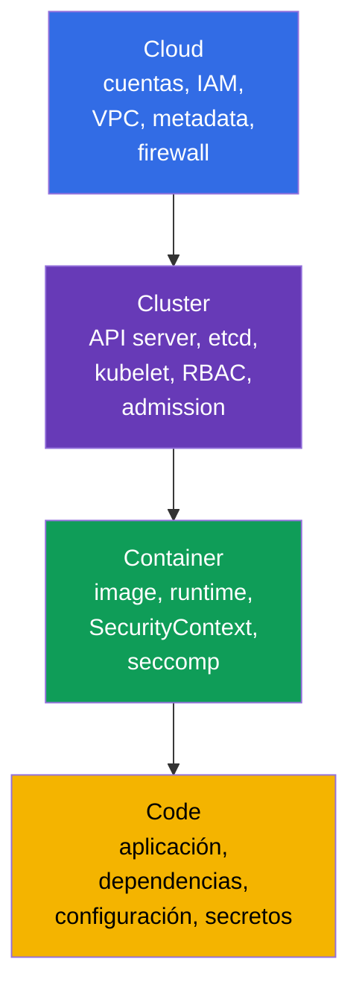
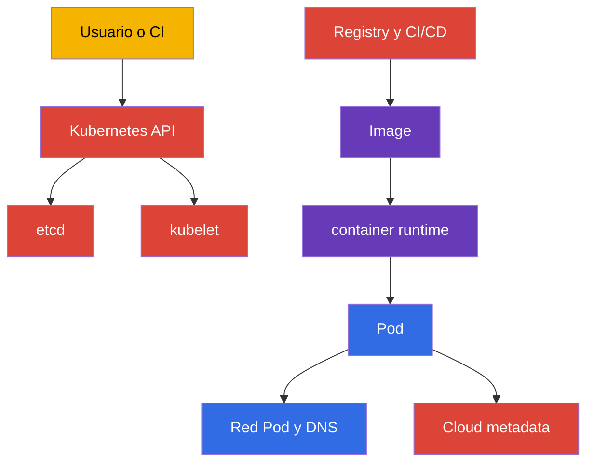
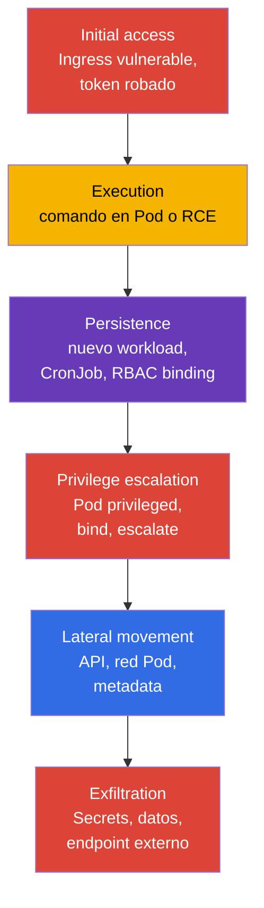
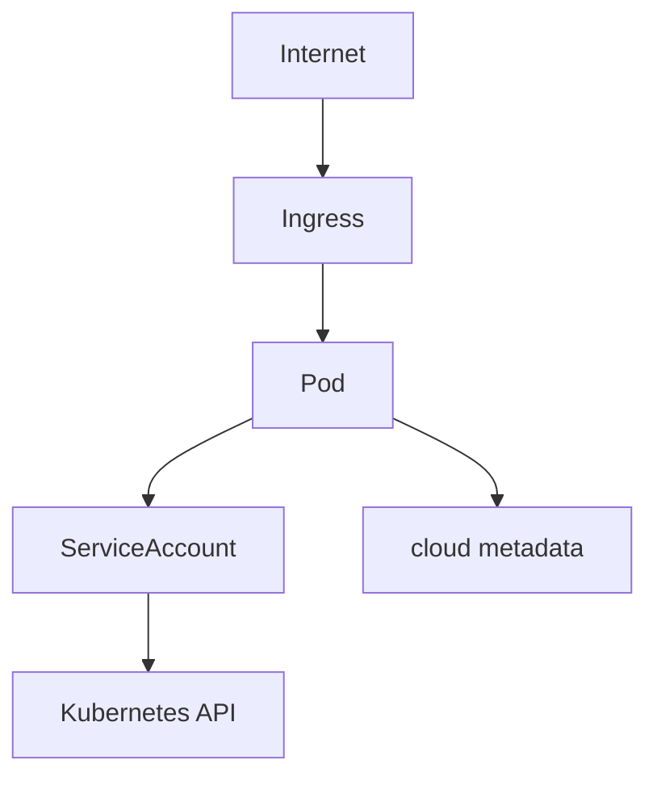
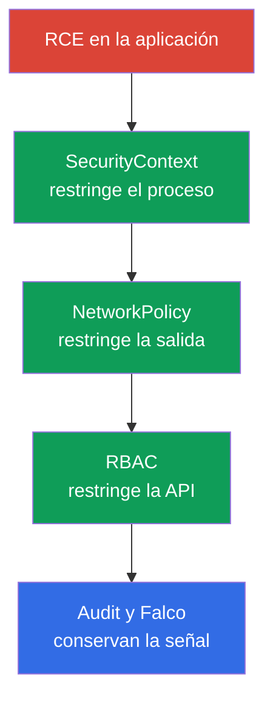

[Русская версия](ru.md) · [Eng version](README.md) · [Version française](fr.md) · [Deutsche Version](de.md) · [ქართული ვერსია](ge.md) · [繁體中文版](tw.md) · [日本語版](jp.md)

# Capítulo 02. Modelo de seguridad de Kubernetes: 4C, superficie de ataque y fases de ataque

> **Problema.** Proteger una sola capa de Kubernetes crea una falsa sensación de seguridad:
> NetworkPolicy no corrige una API pública, y un container hardened no soluciona una vulnerabilidad
> en el código ni las credentials cloud del nodo. Sin un mapa de activos y límites, el equipo corrige
> las configuraciones conocidas y deja al atacante una vía más débil a través de Cloud, Cluster,
> Container o Code.

> **Qué sigue.** El capítulo 01 definió el formato de CKS, los dominios y las herramientas. Ahora hace falta un modelo común para tomar decisiones técnicas: qué proteger exactamente, de quién y con qué capa. Este capítulo es la base para los seis dominios de CKS: Cluster Setup (15%), Cluster Hardening (15%), System Hardening (10%), Minimize Microservice Vulnerabilities (20%), Supply Chain Security (20%) y Monitoring, Logging and Runtime Security (20%).

> **Qué se necesita de CKA.** La estructura del control plane, el worker node, kubelet, CNI y la ruta de una solicitud a la API se explican en el [capítulo 02 de CKA](../../../cka/course/02/es.md). Aquí se tratan solo como objetos que proteger y fuentes de riesgo.

> 🧠 4C explica por qué proteger una capa no compensa la debilidad de otra.

## 02.1. Modelo 4C: qué protegemos

El análisis detallado del modelo 4C, centrado en la terminología y la shared responsibility, está en el [capítulo 03 del curso KCSA](../../../kcsa/course/03/es.md); aquí el modelo se aplica de forma práctica, como una checklist para las decisiones técnicas de CKS, no se repite desde cero.

El modelo **4C** divide la seguridad de Kubernetes en cuatro capas anidadas: Cloud, Cluster, Container y Code. La capa exterior no sustituye a la interior. Un workload comprometido puede restringirse con `NetworkPolicy` y `SecurityContext`, pero eso no corrige un API endpoint público ni un container-runtime/CRI socket accesible desde el workload. `docker.sock` es solo un caso particular de los nodos donde realmente se usa Docker; en los clústeres modernos son habituales los sockets de containerd o CRI-O. Y, a la inversa, una red protegida no corrige una vulnerabilidad de la aplicación.



| Capa | Qué es un activo | Vía de ataque típica | Control básico |
|---|---|---|---|
| Cloud | credenciales del cloud provider, VPC, metadata, discos y snapshots | Un Pod solicita `169.254.169.254` y obtiene el rol del nodo | impedir que el Pod obtenga las credentials/identity del nodo; usar workload identity y metadata controls específicos del provider, permisos IAM mínimos y security group |
| Cluster | Kubernetes API, etcd, kubelet, PKI, RBAC | solicitud anónima o autorizada en exceso a la API | TLS, `RBAC`, desactivar anonymous access, audit, versiones actualizadas |
| Container | image, container runtime, namespaces, procesos y sistema de archivos | image vulnerable, Pod `privileged`, container escape | image mínima, `SecurityContext`, seccomp, AppArmor, `RuntimeClass` |
| Code | código fuente, dependencias, configuración y secretos | RCE en la aplicación, filtración de Secret, dependencia maliciosa | review, dependency scan, SBOM, no guardar secretos en el código, configuración segura |

4C es útil como orden de comprobación. Si un pod tiene derecho a leer todos los `Secrets`, primero se corrige la capa Cluster: RBAC. Si un proceso dentro del pod puede instalar una utilidad y descargar un payload, hacen falta restricciones de la capa Container y control de egress. Si el endpoint de la aplicación acepta comandos arbitrarios, ningún manifiesto de Kubernetes sustituye la corrección de la capa Code.

> 🎯 El orden Cloud → Cluster → Container → Code y los comandos básicos de cada paso.

### Inventario rápido de límites

El modelo 4C anterior dice que la capa exterior no se sustituye por la interior, y que un eslabón débil exterior no se puede compensar con protección interior. Por tanto, el inventario también debe seguir el mismo orden: **Cloud → Cluster → Container → Code**, y no empezar por lo más habitual (Cluster). A continuación se presenta una estrategia para cada una de las cuatro capas: qué comprobamos exactamente, con qué herramienta puede verse en principio y qué comandos dan la respuesta.

| Capa | Qué inventariamos | Con qué se comprueba | Pasos siguientes |
|---|---|---|---|
| Cloud (o provider de infraestructura) | acceso público al API endpoint, identity del nodo y sus permisos en cloud, hardening del metadata service, límite de red, acceso al panel de control del provider | CLI del provider (requiere permisos separados en su cuenta) + una comprobación independiente del provider desde dentro del clúster | paso 1 |
| Cluster | versión y puntos de entrada del control plane, permisos RBAC amplios, configuraciones peligrosas del Pod, puertos abiertos del nodo | `kubectl` y SSH al nodo | pasos 2-5 |
| Container | qué images están realmente en ejecución, tags mutables, registry no aprobados | `kubectl` | paso 6 |
| Code | dependencias vulnerables con CVE, vulnerabilidades lógicas explotables de la aplicación (SSRF, injection, bypass de autorización, IDOR), defaults de configuración inseguros, secretos en el código y en el manifiesto | `kubectl` cubre solo el último punto (secreto en el manifiesto); el resto requiere SBOM, dependency scan, SAST, code review y pentest | paso 7, parcialmente |

Una limitación importante, expresada con franqueza: `kubectl` solo ve lo que ha llegado a Kubernetes API; por tanto, el inventario cubre las cuatro capas de forma muy desigual. En general no ve en absoluto la capa Cloud (roles IAM, VPC, snapshots: fuera de la API del clúster), y ve la capa Code en la menor medida de todas: un manifiesto mostrará un secreto escrito en `env`, pero en principio no mostrará ni una biblioteca vulnerable dentro de la image, ni SQL-injection o un bypass de autorización en el código de la aplicación, ni un secreto hardcodeado en las fuentes. No es una deficiencia de los comandos siguientes, sino el límite de la propia herramienta: Kubernetes API no sabe nada del contenido de su aplicación. El trabajo completo con la capa Code comprende SBOM y escaneo de dependencias (capítulos 25 y 28), análisis estático (capítulo 27), y las vulnerabilidades lógicas de la aplicación no se resuelven en absoluto con herramientas de CKS: se encuentran con code review, SAST/DAST y pentest, y siguen siendo responsabilidad del desarrollo, no del equipo de plataforma. El inventario siguiente es una fotografía rápida de los límites a partir de los datos accesibles desde el clúster, no una auditoría completa de las cuatro capas. Los comandos no cambian nada y son adecuados para el acceso habitual de administrador al clúster; cada paso es independiente del anterior.

**Paso 1 (Cloud). ¿Es accesible el cloud metadata endpoint desde dentro de un Pod?**

La capa Cloud está casi por completo fuera de Kubernetes API, por lo que su inventario se divide en dos partes: lo que puede comprobarse desde dentro del clúster y lo que requiere el CLI del provider.

Desde dentro del clúster se comprueba una clase de riesgo concreta y well-known: si un Pod arbitrario puede siquiera alcanzar el metadata service del nodo y potencialmente robar sus credentials. La dirección `169.254.169.254` es una IP link-local, igual en AWS, GCP, Azure, Hetzner y la mayoría de los demás providers, por lo que la comprobación de alcanzabilidad de red puede hacerse de forma independiente del provider:

```bash
kubectl run metadata-probe --rm -i --restart=Never --image=curlimages/curl:8.11.1 -- \
  curl -s -o /dev/null -w 'http_code=%{http_code}\n' --max-time 2 http://169.254.169.254/
```

El comando inicia un Pod de una sola ejecución (`--rm` lo elimina justo tras finalizar) y accede a la **raíz** del endpoint, no a una ruta de un provider concreto. Esto es fundamental: no interesa el contenido de metadata, sino el hecho mismo de la alcanzabilidad de red. Cualquier código HTTP recibido, `200`, `401`, `403`, `404`, significa que el endpoint respondió; es decir, el Pod lo alcanzó: es una señal de alerta independientemente del cloud. El código `000` significa que no hubo respuesta en absoluto (timeout o rechazo de conexión): el endpoint no es alcanzable para el Pod, que es el objetivo del hardening. El comando no lee ni guarda el cuerpo de la respuesta, solo el código, por lo que no puede llevarse accidentalmente credentials reales al log.

Si tras detectar la alcanzabilidad hay que entender qué se lee exactamente de ahí, será necesario usar la ruta y el header del provider concreto; son incompatibles entre sí:

| Provider | Ruta | Header obligatorio |
|---|---|---|
| AWS (EC2 IMDS) | `/latest/meta-data/` | ninguno para IMDSv1; para IMDSv2 se necesita un token obtenido con un `PUT /latest/api/token` separado |
| GCP | `/computeMetadata/v1/` | `Metadata-Flavor: Google` |
| Azure | `/metadata/instance?api-version=2021-02-01` | `Metadata: true` |
| Hetzner Cloud | `/hetzner/v1/metadata` | ninguno |

Precisamente por estas diferencias, la comprobación anterior no se vincula deliberadamente a ninguna ruta: el comando con `/latest/meta-data/` devolvería `404` en GCP y Azure y se interpretaría erróneamente como «no accesible», aunque el endpoint realmente responde. El requisito del header (`Metadata-Flavor`, `Metadata: true`) es una protección contra el SSRF más simple, no contra un Pod: el Pod puede enviar cualquier header por sí mismo, por lo que la existencia del header no elimina la necesidad de cerrar la ruta de red.

**Es importante no confundir dos conclusiones distintas.** «El endpoint es alcanzable» y «se obtuvieron credentials» no son lo mismo, y no deben mezclarse en el informe:

- *Alcanzabilidad*: es un **hallazgo y una condición previa**: la ruta de red desde el Pod al metadata service no está cerrada. Basta para abrir una tarea de corrección, pero por sí sola no prueba una compromisión.
- *Extractabilidad de credentials*: es una **vía de explotación confirmada**, y exige que también se cumplan las demás condiciones del provider.

AWS es un buen ejemplo de la diferencia. Con `HttpTokens=required` (solo IMDSv2), una solicitud sin token no dará nada, y el token se solicita mediante un `PUT` separado cuya respuesta vive exactamente `HttpPutResponseHopLimit` saltos de red. Con hop limit `1`, la respuesta no llega al Pod con su propio network namespace; es decir, el endpoint responde, la probe muestra alcanzabilidad, pero no se pueden obtener el token ni las credentials. Tenga en cuenta que un Pod con `hostNetwork: true` no es un salto adicional, de modo que para él esta limitación no funciona. Conclusión práctica: registre la alcanzabilidad como un hecho separado y concluya que hubo robo de credentials solo después de comprobar la configuración concreta del provider.

El resto de esta capa requiere el CLI del provider y permisos separados en su cuenta; `kubectl` no puede ver estos objetos en principio.

> 🏭 CLI específico del provider para comprobar el acceso público a la API y el hardening del metadata service.

Las preguntas son iguales para todos los providers; solo difieren los comandos:

1. ¿Está Kubernetes API abierta a Internet y desde qué redes?
2. ¿Qué identity está vinculada a los nodos y qué puede hacer en cloud si se la roba mediante un Pod?
3. ¿Está activado el hardening del metadata service (en AWS, solo IMDSv2 y hop limit restringido; en GCP/Azure, requisito de header más reglas de red)?
4. ¿Quién puede crear/modificar un nodo, disco, snapshot o regla de red fuera de Kubernetes?

Ejemplo para AWS/EKS (en GCP son `gcloud container clusters describe` y `gcloud compute instances describe`; en Azure, `az aks show` y `az vm show`; las preguntas son las mismas, pero difieren la salida y los nombres de campo):

```bash
# Pregunta 1: si API server es visible desde Internet y para quién
aws eks describe-cluster --name "$CLUSTER" \
  --query 'cluster.resourcesVpcConfig.{public:endpointPublicAccess,private:endpointPrivateAccess,cidrs:publicAccessCidrs}'

# Pregunta 3: hop limit `1` es el default security-first; `2` se comprueba solo donde
# el Pod deba justificadamente acceder por sí mismo a IMDS
aws ec2 describe-instances --filters "Name=tag:eks:cluster-name,Values=$CLUSTER" \
  --query 'Reservations[].Instances[].{id:InstanceId,imds:MetadataOptions.HttpTokens,hop:MetadataOptions.HttpPutResponseHopLimit}'
```

AWS EKS Best Practices Guide distingue dos casos diferentes, que no deben reducirse a un único «baseline». Si un Pod no debe heredar los permisos del instance profile del nodo (el caso habitual con IRSA/EKS Pod Identity), la documentación recomienda expresamente `HttpTokens=required` y `HttpPutResponseHopLimit=1` en la sección «Restrict access to the instance profile assigned to the worker node»; eso es precisamente lo que bloquea la obtención de credentials del nodo desde un Pod. La documentación recomienda `HttpPutResponseHopLimit=2` por separado y solo cuando la aplicación realmente necesita su propio acceso a IMDS («When your application needs access to IMDS... increase the hop limit to 2»); es una excepción justificada, no un security baseline general para todas las cargas de container.

**Caso separado: clúster self-managed en servidores «normales»** (kubeadm en bare metal, VM en Hetzner y similares).

> 🔬 Comprobación de un clúster self-managed.

Puede que aquí no haya IAM cloud en absoluto: no hay nada que robar al nodo en el sentido de roles cloud, y la pregunta 2 queda parcialmente descartada. Pero la capa Cloud no desaparece; se sustituye por la capa del provider de infraestructura, y las preguntas pasan a ser estas: si API server y SSH son accesibles desde Internet o solo desde una red privada; quién tiene acceso al panel de control del provider (crear/eliminar servidores, acceso a la consola y a snapshots: eso es root efectivo en los nodos); si el provider tiene su propio metadata endpoint con datos sensibles (en Hetzner es `169.254.169.254/hetzner/v1/metadata`, que puede contener entre otras cosas los user data de cloud-init); si el tráfico entre servidores está cerrado mediante las reglas de red del provider, no solo con `NetworkPolicy` dentro del clúster. La comprobación `metadata-probe` anterior se aplica aquí del mismo modo: no está vinculada a un cloud.

**Paso 2 (Cluster). Puntos de entrada y versión del control plane.**

```bash
kubectl cluster-info
kubectl get --raw=/version
```

`kubectl cluster-info` muestra la dirección de API server y de los servicios auxiliares: es el primer punto de entrada que ve cualquier cliente del clúster. `kubectl get --raw=/version` devuelve la versión exacta del control plane de Kubernetes: se necesita para contrastar después los flags disponibles y las CVE conocidas precisamente para esa versión, en vez de adivinar a partir de la documentación de una release arbitraria.

**Paso 3 (Cluster). Quién tiene permisos cluster-wide amplios.**

```bash
kubectl get clusterrolebinding -o jsonpath='{range .items[?(@.roleRef.name=="cluster-admin")]}{.metadata.name}{"\t"}{range .subjects[*]}{.kind}:{.name}{" "}{end}{"\n"}{end}'
```

Este comando muestra solo los `ClusterRoleBinding` que hacen referencia al rol integrado `cluster-admin`, el rol más amplio del clúster, que concede acceso completo a todos los recursos. Para cada binding encontrado, la línea muestra su nombre y después la lista de subjects (`User`, `Group` o `ServiceAccount`) a los que se asigna ese rol. El `range` interior sobre `.subjects[*]` es necesario porque un binding puede referenciar varios subjects a la vez.

**No basta con comprobar el nombre `cluster-admin`.** El nivel de acceso no lo determina el nombre del rol, sino la combinación de sus reglas y el alcance de su binding. Un `ClusterRole` con `apiGroups: ["*"]`, `resources: ["*"]` y `verbs: ["*"]` describe por sí solo un conjunto de permisos, acceso prácticamente ilimitado a Kubernetes resource API, pero el alcance real depende de con qué se vinculó el rol: `ClusterRoleBinding` lo hace efectivo cluster-wide en todos los namespace, mientras que un `RoleBinding` que referencia al mismo `ClusterRole` limita los permisos namespaced a aquel namespace donde se creó ese `RoleBinding`. Este mecanismo permite reutilizar un conjunto de reglas en varios namespace en lugar de crear `Role` idénticos; además, `ClusterRole` se usa para permissions sobre recursos cluster-scoped (por ejemplo, `nodes`), sobre non-resource endpoints (`/healthz`) y para acceso cluster-wide mediante `ClusterRoleBinding`. En clústeres reales, estos roles aparecen constantemente con nombres inocuos como `platform-superuser`, `ci-deployer` o `monitoring-full`, creados «solo para que funcione» o deliberadamente para evitar el review de la palabra `cluster-admin`. La búsqueda por nombre no los verá en absoluto, y buscar solo las reglas del rol sin comprobar su binding dará una evaluación de riesgo incorrecta: permisos amplios vinculados con un `RoleBinding` en un namespace tienen una escala de amenaza distinta que los mismos permisos con `ClusterRoleBinding`.

En rigor, ese rol **no es el equivalente literal** del `cluster-admin` integrado: en su definición este tiene dos reglas, no una: un wildcard para recursos y otro wildcard separado para `nonResourceURLs`, que cubre non-resource endpoints como `/healthz`, `/metrics` y `/debug/*`. Un rol sin la segunda regla no concede estas rutas y también puede estar restringido mediante `resourceNames` o modificado por agregación (`aggregationRule`). Sin embargo, desde el punto de vista del triage, la diferencia no es importante: controlar todos los recursos de la API ya incluye leer todos los Secret, crear un Pod en cualquier nodo y modificar RBAC; es decir, una vía para tomar el control completo del clúster. La documentación oficial de Kubernetes para tal ejemplo también es prudente en su formulación: «similar to the built-in `cluster-admin` role», no «idéntico». La conclusión práctica no cambia: hay que buscar por permisos, no por nombre.

```bash
# Paso A: encontrar TODOS los ClusterRole con reglas wildcard completas, sin importar el nombre
kubectl get clusterroles -o json | jq -r '
  .items[]
  | select(any(.rules[]?;
      ((.apiGroups // []) | index("*")) and
      ((.resources // []) | index("*")) and
      ((.verbs // []) | index("*"))))
  | .metadata.name
'
```

```bash
# Paso B: encontrar los binding que se refieren a cualquiera de los roles encontrados
dangerous=$(kubectl get clusterroles -o json | jq -r '
  .items[]
  | select(any(.rules[]?;
      ((.apiGroups // []) | index("*")) and
      ((.resources // []) | index("*")) and
      ((.verbs // []) | index("*"))))
  | .metadata.name
')

kubectl get clusterrolebinding -o json \
  | jq -r --argjson names "$(echo "$dangerous" | jq -R . | jq -s .)" '
      .items[]
      | select(.roleRef.name as $r | $names | index($r))
      | "\(.metadata.name) -> роль \(.roleRef.name) (cluster-wide), subjects: \([.subjects[]? | "\(.kind):\(.name)"] | join(", "))"
    '

# Paso B': el mismo rol puede vincularse también mediante RoleBinding; entonces los permisos
# solo se aplican en un namespace, pero tampoco los «revisó» la búsqueda
# por ClusterRoleBinding anterior
kubectl get rolebinding -A -o json \
  | jq -r --argjson names "$(echo "$dangerous" | jq -R . | jq -s .)" '
      .items[]
      | select(.roleRef.kind == "ClusterRole" and (.roleRef.name as $r | $names | index($r)))
      | "\(.metadata.name) (namespace \(.metadata.namespace)) -> роль \(.roleRef.name) (только в этом namespace), subjects: \([.subjects[]? | "\(.kind):\(.name)"] | join(", "))"
    '
```

El paso A comprueba cada regla del rol: hay acceso completo si una misma regla contiene simultáneamente `*` en `apiGroups`, `*` en `resources` y `*` en `verbs`. `any(.rules[]?; ...)` es importante: una regla peligrosa puede no ser la primera de la lista, sino la segunda o la tercera, junto a otras inocuas. Los pasos B y B' toman los nombres encontrados y muestran qué binding los usan realmente, para quién y con qué scope: `ClusterRoleBinding` da acceso cluster-wide, mientras que un `RoleBinding` al mismo `ClusterRole` lo limita a un namespace: es una escala de amenaza distinta con las mismas reglas del rol, y omitir uno de los dos tipos de binding da una visión incompleta. Un rol peligroso que no está vinculado también es un problema para el review, pero uno vinculado significa que los permisos ya se concedieron a alguien.

También conviene buscar patrones más estrechos, pero aún peligrosos, que no entran en el wildcard completo:

```bash
kubectl get clusterroles -o json | jq -r '
  .items[]
  | .metadata.name as $name
  | .rules[]?
  | select(((.verbs // []) | index("*"))
      and (((.apiGroups // []) | index("*") | not) or ((.resources // []) | index("*") | not)))
  | "\($name): verbs=* на apiGroups=\(.apiGroups // []) resources=\(.resources // [])"
'
```

Por ejemplo, `verbs: ["*"]` únicamente sobre `secrets` no es `cluster-admin`, pero permite leer y modificar todos los secretos del clúster; para muchos modelos de amenaza equivale a una compromisión completa. También son peligrosos `create` sobre `pods` junto con una autorización `hostPath` amplia en la capa admission, `escalate`/`bind` sobre roles e `impersonate` sobre usuarios: proporcionan una vía de escalada de privilegios incluso cuando el propio rol parece estrecho. El análisis completo de esos patrones está en el [capítulo 10](../10/es.md).

> **En el examen.** Un `range` anidado con el filtro `?(@.roleRef.name==...)` en una expresión jsonpath es justo aquello contra lo que advierte el paso 4: al teclear rápido, es fácil perder un paréntesis o una comilla. Es más fiable dividir la comprobación en un bucle simple, donde cada llamada a `kubectl` solicita solo un campo, sin filtros ni anidamiento:
>
> ```bash
> for crb in $(kubectl get clusterrolebinding -o name | cut -d/ -f2); do
>   role=$(kubectl get clusterrolebinding "$crb" -o jsonpath='{.roleRef.name}')
>   if [[ "$role" == "cluster-admin" ]]; then
>     echo "$crb:"
>     kubectl get clusterrolebinding "$crb" -o jsonpath='{range .subjects[*]}{.kind}:{.name}{" "}{end}'
>     echo
>   fi
> done
> ```
>
> `kubectl get clusterrolebinding -o name` imprime los nombres como `clusterrolebinding.rbac.authorization.k8s.io/<nombre>`; `cut -d/ -f2` deja solo el nombre después de `/`. Cada `kubectl get clusterrolebinding "$crb" -o jsonpath='{.roleRef.name}'` comprueba exactamente un campo simple de un binding concreto: no hay filtro `?(...)` ni `range` anidado para seleccionar los propios binding, solo para los subjects dentro de la coincidencia encontrada, lo cual es notablemente más fácil de revisar visualmente antes de ejecutar. Es más lento que el one-liner anterior (una solicitud separada a la API por cada binding), pero en un clúster de examen normalmente no hay miles de binding, y la diferencia de fiabilidad al teclear importa más que la diferencia de segundos.

**Paso 4 (Cluster). Cargas con señales peligrosas explícitas.**

> 🎯 Encontrar Pod con `privileged`, `hostNetwork/hostPID/hostIPC`, `hostPath`, capabilities añadidas o `runAsUser: 0`.

> **En el examen.** La versión completa siguiente (con funciones `def` separadas para cada nivel de comprobación) es didáctica: muestra de una vez las seis señales y por qué están lógicamente relacionadas, no lo que conviene teclear realmente bajo un cronómetro. Incluso un filtro `jq` corto con `select` anidados y arrays se puede estropear con un solo paréntesis omitido justo cuando se está nervioso por el tiempo; bajo presión es más fiable escribir la variante mediante `grep`, *menos elegante* pero casi imposible de romper sintácticamente. Por ejemplo, para la tarea «encuentre todos los Pod con hostNetwork en el namespace `prod`»:
>
> ```bash
> NS=prod
>
> for pod in $(kubectl get pods -n "$NS" -o jsonpath='{.items[*].metadata.name}'); do
>   if kubectl get pod "$pod" -n "$NS" -o json | grep hostNetwork | grep -q true; then
>     echo "$pod"
>   fi
> done
> ```
>
> La idea es obtener una lista de nombres de Pod con un comando simple y después, en el bucle, obtener el JSON de cada Pod y hacer grep del campo requerido; si aparece, imprimir el nombre. Namespace se lleva a la variable `NS` en la primera línea: aparece dos veces en el comando y bajo el cronómetro es fácil corregir una llamada y olvidar la segunda; entonces el script empezará silenciosamente a buscar un Pod de un namespace en otro. Con una variable, el cambio se hace una vez, al principio, donde está visible. Dos `grep` en el pipe hacen que la comprobación sea precisa sin dejar de ser sencilla: el primero deja solo la línea con `hostNetwork`; el segundo comprueba que contiene `true`. Así se descarta `"hostNetwork": false`: el campo existe, pero no hay riesgo. `grep -q` no muestra nada; solo devuelve un código de éxito/error para `if`. Esto funciona porque `kubectl -o json` imprime JSON pretty-printed: cada campo está en su propia línea, por lo que el segundo `grep` recibe únicamente la línea `hostNetwork`, no los campos vecinos. Con muchos Pod en un namespace, el enfoque tiene las mismas limitaciones de escala que las demás variantes de esta página (véase la sección sobre 10 000 Pod más arriba), pero para un namespace de examen con unas pocas o un par de decenas de Pod no importa, y el comando casi no se rompe aunque se teclee rápido y sin borrador. La misma técnica funciona para cualquier campo booleano: sustituya `hostNetwork` por `hostPID`, `hostIPC` o `privileged`.

La idea es recorrer todos los Pod de todos los namespace y dejar solo aquellos que tengan al menos una de las señales peligrosas conocidas, es decir, configuraciones que reducen el aislamiento del container. Las señales se comprueban al nivel del Pod completo y al de cada container individual:

| Nivel | Señal | Por qué es un riesgo |
|---|---|---|
| Pod | `hostNetwork`, `hostPID` o `hostIPC` | el Pod comparte el stack de red, procesos o IPC con el propio nodo: el aislamiento se elimina parcialmente |
| Pod | volume de tipo `hostPath` | el container obtiene acceso directo al sistema de archivos del nodo |
| Container | `privileged: true` | el container obtiene casi todos los privilegios del kernel, como un proceso del host |
| Container | `allowPrivilegeEscalation: true` | el proceso dentro del container puede obtener más permisos de los que tenía al iniciar |
| Container | `capabilities` añadidas | al container se le conceden explícitamente privilegios por encima del conjunto mínimo |
| Container | `runAsUser: 0` (en Pod o en container) | el proceso se ejecuta como root dentro del container |

La implementación busca exactamente estas señales mediante `jq` e imprime solo los Pod donde se activó al menos una; los demás no se muestran en absoluto para no ahogarse en una lista de cientos de Pod seguros.

**Por qué lo hace `jq`, y no `--field-selector` o `-o jsonpath`.** Una pregunta lógica es si no se pueden filtrar las señales peligrosas directamente en API server para no transferir al cliente el JSON de los Pod seguros. Se puede parcialmente, pero no por completo. `--field-selector` para Pod admite una lista estrecha de campos, codificada en API server: `metadata.name`, `metadata.namespace`, `spec.nodeName`, `spec.restartPolicy`, `spec.schedulerName`, `spec.serviceAccountName`, `spec.hostNetwork`, `status.phase`, `status.podIP`, `status.podIPs`, `status.nominatedNodeName` (comprobado en la documentación oficial de Kubernetes; la lista puede diferir entre versiones y `kubectl` devolverá `BadRequest` si indica un campo no admitido). `spec.hostNetwork` **sí está** en ella, así que esta única comprobación del paso puede trasladarse al servidor. Pero `hostPID`, `hostIPC`, `privileged`, `allowPrivilegeEscalation`, `capabilities` añadidas, el volume `hostPath` y `runAsUser` no entran en esta lista; no se pueden filtrar server-side y no merece la pena contar con ello en un futuro previsible: el conjunto de campos está definido en el código de API server y no está abierto a expresiones arbitrarias. Esta formulación se vincula conscientemente a una versión: la lista citada corresponde a la documentación del baseline del curso (Kubernetes v1.36), y el hábito correcto, ante la duda, es comprobarla en la documentación de su versión, no memorizarla para siempre. `-o jsonpath` tampoco resuelve la tarea: puede proyectar y filtrar por un campo mediante `?(@.field==value)`, pero no combinar varias condiciones mediante «o» en una expresión, ni inspeccionar a la vez `spec.containers[]`, `spec.volumes[]` y `spec.securityContext` con una lógica común; para ello se necesita un lenguaje con expresiones booleanas completas, es decir, `jq` (o un equivalente del lado del cliente). Además, puede limitarse `status.phase` a `Running` si los Pod terminados no interesan para esta comprobación. Ambas optimizaciones server-side se combinan con una coma en un solo `--field-selector`:

```bash
kubectl get pods -n "$ns" --field-selector=status.phase=Running -o json
```

Esto no sustituye a `jq`, sino que reduce el volumen de JSON que le llega: el servidor ya no envía al cliente los Pod terminados, y el propio `jq` sigue comprobando las demás señales que no se pueden filtrar server-side. Abajo, `jq` sigue comprobando `hostNetwork` junto con las demás señales, aunque formalmente podría haberse trasladado a `--field-selector` en una solicitud separada: solicitudes separadas para cada señal complicarían el script más de lo que justifica el ahorro de uno de siete campos, y una única comprobación en una expresión `jq` sigue siendo más clara y fácil de mantener.

**Importante sobre la escala.** Aquí conviene distinguir dos cargas diferentes, porque a menudo se confunden. Del lado de API server no es tan grave como parece: `kubectl get` solicita por defecto las listas grandes **en chunks**; el flag `--chunk-size` tiene el valor predeterminado `500` («Return large lists in chunks rather than all at once»), por lo que 10 000 Pod se obtienen en aproximadamente veinte solicitudes consecutivas, no en una gigante. Esta paginación solo se puede desactivar explícitamente pasando `--chunk-size=0`.

El problema está en otro lugar: los chunks se reúnen **en el cliente**. `kubectl` los concatena en un documento JSON, y `jq` espera a recibirlo completo antes de emitir una sola línea. En producción, con miles de Pod, son cientos de MB en la memoria de su equipo de trabajo y minutos de espera sin feedback, incluso OOM del proceso `kubectl` o `jq`. Por eso recorrer los namespace de uno en uno en un bucle es útil no para descargar API server (de eso se encarga el chunking), sino para **no mantener todo el clúster en memoria a la vez** y obtener el resultado incrementalmente, namespace por namespace:

```bash
for ns in $(kubectl get ns -o jsonpath='{.items[*].metadata.name}'); do
  kubectl get pods -n "$ns" --field-selector=status.phase=Running -o json | jq -r --arg ns "$ns" '
    def containers:
      (.spec.containers // [])
      + (.spec.initContainers // [])
      + (.spec.ephemeralContainers // []);

    # En lugar de true/false, cada comprobación del container devuelve una LISTA
    # de señales concretas activadas junto con el nombre del container;
    # sin esto no se distinguirían las diferentes señales en la salida.
    def container_reasons:
      [
        (if .securityContext.privileged == true then "privileged:\(.name)" else empty end),
        (if .securityContext.allowPrivilegeEscalation == true then "allowPrivilegeEscalation:\(.name)" else empty end),
        (if ((.securityContext.capabilities.add // []) | length > 0)
          then "capabilities.add=\((.securityContext.capabilities.add // []) | join(",")):\(.name)"
          else empty end),
        (if .securityContext.runAsUser == 0 then "runAsUser=0:\(.name)" else empty end)
      ];

    # De forma similar para el Pod completo: lista de motivos de nivel Pod más los motivos
    # de cada container, combinados en una única lista plana.
    def pod_reasons:
      [
        (if .spec.hostNetwork == true then "hostNetwork" else empty end),
        (if .spec.hostPID == true then "hostPID" else empty end),
        (if .spec.hostIPC == true then "hostIPC" else empty end),
        (if .spec.securityContext.runAsUser == 0 then "pod.runAsUser=0" else empty end),
        (if ([.spec.volumes[]? | select(.hostPath != null)] | length > 0)
          then "hostPath=\([.spec.volumes[]? | select(.hostPath != null) | .hostPath.path] | join(","))"
          else empty end)
      ] + [containers[]? | container_reasons[]];

    .items[]
    | (pod_reasons) as $reasons
    | select($reasons | length > 0)
    | "\($ns)/\(.metadata.name): \($reasons | join("; "))"
  '
done
```

La lógica de comprobación (las tres funciones `containers`/`container_reasons`/`pod_reasons` y el `select` final) sigue siendo conceptualmente la misma que en la idea anterior: cambiaron la forma de obtener los datos (véase arriba) y el formato de salida. Ahora la línea no solo dice «requires review», sino que enumera directamente qué señales se activaron y en qué container, por ejemplo, `hostNetwork; privileged:aws-node; capabilities.add=NET_ADMIN:aws-node`. Sin esto, en un clúster real (sobre todo EKS/GKE, donde CNI y otros DaemonSet del sistema, por ejemplo `aws-node`, usan legítimamente `hostNetwork` y `privileged`) la salida se convierte en una larga lista de líneas idénticas `namespace/pod requires review`, con la que resulta imposible distinguir rápidamente un componente de sistema esperado de un hallazgo real: físicamente no se ve en qué se diferencia un Pod de la lista de otro. Mostrar la razón concreta responde de inmediato a la pregunta «por qué exactamente entró este Pod en la lista», sin tener que abrir `-o yaml` para cada resultado uno tras otro.

También paso a paso, pero sin código:

1. `for ns in $(kubectl get ns -o jsonpath='{.items[*].metadata.name}')` obtiene la lista de nombres de namespace con una solicitud ligera (sin Pod, solo nombres) y los entrega uno a uno a la variable `$ns`.
2. `kubectl get pods -n "$ns" --field-selector=status.phase=Running -o json` dentro del bucle descarga solo los Pod Running del namespace actual: un JSON un orden de magnitud menor que `-A` sin filtro para todo el clúster, y sin Pod terminados/muertos que no hacen falta para esta comprobación.
3. `containers` es la lista auxiliar: los container normales, init y ephemeral del Pod se combinan en un flujo porque una configuración peligrosa en cualquiera de ellos es el mismo riesgo que en el container principal.
4. `container_reasons` devuelve para un container la lista de señales concretas activadas junto con su nombre: `privileged:<nombre>`, `allowPrivilegeEscalation:<nombre>`, `capabilities.add=...:<nombre>` o `runAsUser=0:<nombre>`; la lista puede estar vacía si el container es seguro.
5. `pod_reasons` hace lo mismo para todo el Pod: `hostNetwork`, `hostPID`, `hostIPC`, `pod.runAsUser=0`, `hostPath=<ruta>`, combinados con las razones de todos los container mediante `container_reasons[]` en una lista plana.
6. La línea final recorre todos los Pod (`.items[]`), asigna la lista de razones a la variable `$reasons`, conserva solo los Pod con lista no vacía e imprime `namespace/nombre-pod: razón1; razón2; ...`; por ejemplo, `kube-system/aws-node-2sp7j: hostNetwork; privileged:aws-node; capabilities.add=NET_ADMIN:aws-node`.

Precisamente el detalle de las razones en el paso 6 importa en los clústeres reales. DaemonSet del sistema como `aws-node` (Amazon VPC CNI), `cilium` o `calico-node` usan legítima y habitualmente `hostNetwork` y `privileged`: lo necesitan para administrar interfaces y reglas de red en el nodo. Sin indicar la razón, tal DaemonSet en un clúster de cientos de nodos produce cientos de líneas idénticas `requires review`, de las que no queda claro que todas son el mismo patrón esperado. Con la razón indicada se ve inmediatamente que, si todas las coincidencias de un namespace muestran el mismo conjunto de señales para la misma image, probablemente es un componente de sistema legítimo para una lista de review con la justificación «necesario para CNI», no decenas de hallazgos independientes que investigar.

**Variante adicional del paso 4: salida JSON estructurada con chunking dentro del namespace.**

> 🏭 Comprobación JSON con chunks para clústeres con miles de Pod.

La variante anterior sirve para una comprobación manual rápida: la línea es fácil de leer para una persona, pero incómoda de pasar a otra herramienta (por ejemplo, un sistema de tickets o dashboard), y para un namespace con miles de Pod aún reúne el namespace completo en la memoria del cliente antes de imprimir algo. Si se necesita un resultado legible por máquina y, además, protección contra namespace gigantes (algunos namespace de sistema en producción contienen cientos o miles de Pod aun tras filtrar por `Running`), se requiere un uso más complejo:

```bash
CHUNK_SIZE=200
SLEEP_BETWEEN_CHUNKS=0.2

result_file=$(mktemp)
chunk_file=$(mktemp)
merge_jq=$(mktemp)
trap 'rm -f "$result_file" "$chunk_file" "$merge_jq"' EXIT
echo '{}' > "$result_file"

cat > "$merge_jq" <<'JQEOF'
def containers:
  (.spec.containers // [])
  + (.spec.initContainers // [])
  + (.spec.ephemeralContainers // []);

def container_reasons:
  [
    (if .securityContext.privileged == true then "privileged:\(.name)" else empty end),
    (if .securityContext.allowPrivilegeEscalation == true then "allowPrivilegeEscalation:\(.name)" else empty end),
    (if ((.securityContext.capabilities.add // []) | length > 0)
      then "capabilities.add=\((.securityContext.capabilities.add // []) | join(",")):\(.name)"
      else empty end),
    (if .securityContext.runAsUser == 0 then "runAsUser=0:\(.name)" else empty end)
  ];

def pod_reasons:
  [
    (if .spec.hostNetwork == true then "hostNetwork" else empty end),
    (if .spec.hostPID == true then "hostPID" else empty end),
    (if .spec.hostIPC == true then "hostIPC" else empty end),
    (if .spec.securityContext.runAsUser == 0 then "pod.runAsUser=0" else empty end),
    (if ([.spec.volumes[]? | select(.hostPath != null)] | length > 0)
      then "hostPath=\([.spec.volumes[]? | select(.hostPath != null) | .hostPath.path] | join(","))"
      else empty end)
  ] + [containers[]? | container_reasons[]];

# La entrada (.) se lee desde el ARCHIVO de chunk ($chunk_file), no desde un argumento
# de línea de comandos: con CHUNK_SIZE=200 de Pod reales con status completo y
# managedFields, el chunk supera fácilmente el límite del SO para la longitud de argv, y
# `jq --argjson chunk "$chunk_json"` termina con el error
# "Argument list too long" antes de que jq pueda siquiera ejecutarse.
# El resultado acumulado se lee mediante --slurpfile acc desde un ARCHIVO
# separado por la misma razón: no pasar datos grandes por argv.
#
# kubectl devuelve un List ({"items":[...]}) para VARIOS nombres, pero el propio
# objeto Pod directamente (sin el campo items) para EXACTAMENTE UN nombre en el comando;
# sin esta bifurcación, el último chunk incompleto (a menudo de 1 Pod) da
# "jq: error: Cannot iterate over null (null)", porque .items falta en un
# objeto Pod individual.
($acc[0]) as $accumulated
| (.items // [.]) as $pods
| reduce ($pods[]) as $pod
  ($accumulated;
   ($pod | pod_reasons) as $reasons
   | if ($reasons | length) > 0
     then .[$ns][$pod.metadata.name] = $reasons
     else .
     end)
JQEOF

for ns in $(kubectl get ns -o jsonpath='{.items[*].metadata.name}'); do
  mapfile -t pod_names < <(kubectl get pods -n "$ns" --field-selector=status.phase=Running \
    -o jsonpath='{range .items[*]}{.metadata.name}{"\n"}{end}')
  total=${#pod_names[@]}
  processed=0
  for ((i = 0; i < total; i += CHUNK_SIZE)); do
    chunk=("${pod_names[@]:i:CHUNK_SIZE}")
    kubectl get pods -n "$ns" "${chunk[@]}" -o json > "$chunk_file"
    jq --slurpfile acc "$result_file" --arg ns "$ns" -f "$merge_jq" "$chunk_file" > "${result_file}.new"
    mv "${result_file}.new" "$result_file"
    processed=$((processed + ${#chunk[@]}))
    echo "namespace $ns: $processed/$total pods processed" >&2
    sleep "$SLEEP_BETWEEN_CHUNKS"
  done
done

jq . "$result_file"
```

Qué se ha complicado aquí y por qué precisamente así:

- **El formato de salida es JSON anidado, no líneas.** El resultado ahora se estructura como `{namespace: {nombre-pod: [razones]}}`: es lo mismo que imprimió en texto la versión anterior, pero apto para tratamiento automático posterior (pasarlo a otro script, guardarlo como artefacto, filtrarlo con una consulta `jq` por un namespace concreto sin volver a ir al clúster).
- **Chunking dentro del namespace, no solo entre namespace.** El bucle `for ns in ...` de la idea anterior ya ayuda al dividir el trabajo por namespace, pero si UN namespace tiene miles de Pod (típico de namespace grandes de data/batch en producción), `kubectl get pods -n "$ns" -o json`, aunque los pida a API server en chunks de `--chunk-size`, seguirá **concatenando el namespace entero en un JSON en la memoria del cliente** y entregándolo completo a `jq`. El bucle interno `for ((i = 0; i < total; i += CHUNK_SIZE))` divide la lista de nombres de Pod del namespace actual en grupos de `CHUNK_SIZE` (aquí, 200) y solicita `kubectl get pods -n "$ns" <nombre1> <nombre2> ...` solo para este grupo; así el pico de consumo de memoria se limita al tamaño de un chunk, no al del namespace, y se puede imprimir el progreso tras cada grupo. Aquí `--field-selector` no sirve porque no admite «cualquier nombre de una lista», por lo que los nombres se pasan como argumentos posicionales explícitos a `kubectl get pods`.
- **`sleep "$SLEEP_BETWEEN_CHUNKS"` entre chunks.** La pausa (aquí, 0.2 segundos) evita que el script inunde API server con cientos de solicitudes seguidas y sin interrupción; en un clúster con muchos namespace y Pod reduce perceptiblemente la carga pico comparado con enviar los chunks consecutivos a la máxima velocidad.
- **`echo ... >&2` con progreso tras cada chunk.** Imprime en stderr (sin mezclarse con el JSON final en stdout) una línea como `namespace kube-system: 200/1400 pods processed`; en un clúster grande el recorrido puede llevar minutos, y sin un indicador no se sabe si el script funciona o se quedó colgado.
- **El resultado del chunk y el total acumulado se guardan en archivos, no en variables shell.** `kubectl get pods ... -o json > "$chunk_file"` escribe el JSON del chunk en disco, y `jq --slurpfile acc "$result_file" ... "$chunk_file"` lee tanto el chunk como el resultado acumulado actual desde archivos, en vez de pasarlos como argumentos de línea de comandos. Esto es fundamental: con `CHUNK_SIZE=200` de Pod reales con `status` y `managedFields` completos, el JSON de un solo chunk alcanza fácilmente varios MB, y un comando como `jq --argjson chunk "$chunk_json" ...` pasa ese JSON como un argumento de proceso normal; al superar el límite del SO para la longitud total de argv (`ARG_MAX`, normalmente de ~128 KB a varios MB según el sistema), el shell termina el comando con `Argument list too long` antes de que `jq` pueda procesarlo. Este escenario se reproduce precisamente en clústeres con muchos cientos de Pod en un namespace, incluso con un `CHUNK_SIZE=200` que parece «seguro»: el tamaño no depende solo del número de Pod, sino también del volumen de metadata/status de cada uno. El resultado de cada iteración se guarda en un archivo temporal (`> "${result_file}.new"`, luego `mv` sobre el anterior); así se garantiza que en disco siempre esté la versión anterior o la nueva, completamente escrita, y no un archivo corrupto por una interrupción durante la escritura.
- **`trap 'rm -f "$result_file" "$chunk_file" "$merge_jq"' EXIT`.** Los archivos temporales se eliminan automáticamente al salir del script, incluso ante un error o `Ctrl+C`, no solo al terminar normalmente. Sin `trap`, los archivos temporales se acumularían en `/tmp` con cada ejecución interrumpida.
- **La función `pod_reasons` separada dentro de `merge.jq` tiene en cuenta que kubectl devuelve estructuras distintas según el número de nombres solicitados.** `kubectl get pods -n "$ns" pod-a pod-b -o json` con VARIOS nombres da un List (`{"items": [...]}`), pero con EXACTAMENTE UN nombre, como en el último chunk a menudo incompleto, da directamente el propio objeto Pod, sin campo `items`. La expresión `(.items // [.])` trata ambos casos de igual forma: si existe `.items`, se usa; si no (es decir, `.items` es `null`), todo el objeto de entrada se envuelve en una lista de un elemento. Sin esta bifurcación, el último chunk de un Pod da `jq: error: Cannot iterate over null (null)`, porque `.items[]` intenta iterar un campo que simplemente no existe en un objeto Pod individual.

No es la versión «correcta» en lugar de la anterior, sino un trade-off consciente: para una comprobación manual rápida en un clúster pequeño o mediano, la salida textual de la idea anterior es más fácil de leer y de copiar una vez al terminal. La variante Chunked JSON se justifica cuando el resultado debe continuar en una automatización, los namespace pueden contener muchos Pod y el propio recorrido debe ser cuidadoso con API server y mostrar progreso visible; es decir, cuando el script pasa de ser un comando de diagnóstico puntual a una herramienta ejecutada periódicamente. Este escenario no aparece en el examen: considere esta sección un ejemplo de ingeniería de producción de referencia, no algo que deba reproducir bajo el cronómetro.

**Paso 5 (Cluster/node). En el nodo: puertos en escucha y procesos propietarios.**

```bash
sudo ss -tulpn
```

Los flags `-t` y `-u` muestran sockets TCP y UDP; `-l`, solo los que están en escucha (listening); `-p` añade el PID y el nombre del proceso propietario; `-n` no resuelve nombres en DNS (más rápido y preciso). Es el único comando que se ejecuta en el propio nodo y no mediante `kubectl`: muestra lo visible desde el punto de vista del SO, no de Kubernetes API.

**Paso 6 (Container). Qué images se están ejecutando realmente y si hay tags mutables entre ellas.**

La primera pregunta de la capa Container no es «¿es segura la image?» (eso es el escaneo del capítulo 28), sino una aún más básica: qué images funcionan en el clúster y si se puede siquiera decir sin ambigüedad qué código concreto se está ejecutando en ellas.

```bash
# Lista completa de images únicas en el clúster
kubectl get pods -A -o jsonpath='{range .items[*]}{range .spec.containers[*]}{.image}{"\n"}{end}{end}' | sort -u
```

```bash
# Pod con un tag mutable: :latest explícito o sin tag en absoluto (implicit latest)
kubectl get pods -A -o json | jq -r '
  .items[]
  | .metadata.namespace as $ns | .metadata.name as $pod
  | .spec.containers[]?
  | select((.image | endswith(":latest")) or (.image | split("/") | last | contains(":") | not))
  | "\($ns)/\($pod): \(.image)"
'
```

El primer comando ofrece el inventario: con él se puede comprobar qué registry se usan realmente y si hay alguno no aprobado. El segundo encuentra images con un tag mutable: `nginx:latest` explícitamente o `redis` sin tag (que se resuelve por defecto como `:latest`). Esa image significa que el código actualmente en ejecución puede diferir del que se comprobó durante el review: el tag se puede redirigir a otro digest sin modificar el manifiesto. La comprobación `.image | split("/") | last | contains(":") | not` mira específicamente el último segmento después de `/`; sin ella, `registry.example.com:5000/app` (puerto en la dirección del registry, pero sin tag) se consideraría erróneamente etiquetada.

> **En el examen, este inventario es la mitad de la tarea.** Una formulación típica es: «en el namespace `X`, encuentre el Pod con el mayor número de vulnerabilidades y elimínelo» o «encuentre el Pod cuya image contiene el paquete `<nombre>` versión `<versión>`». El inventario anterior responde a la pregunta «qué images existen», pero después se necesita `trivy` y, de forma importante, **el camino inverso de image a Pod**, porque habrá que eliminar el Pod, no la image. Por eso la lista se toma de inmediato en pares `pod → image`:
>
> ```bash
> NS=prod
>
> kubectl get pods -n "$NS" \
>   -o jsonpath='{range .items[*]}{.metadata.name}{"\t"}{.spec.containers[0].image}{"\n"}{end}'
> ```
>
> Después se cuentan las vulnerabilidades de cada par y se ordena de forma descendente: el Pod buscado será el primero de la lista:
>
> ```bash
> kubectl get pods -n "$NS" \
>   -o jsonpath='{range .items[*]}{.metadata.name}{"\t"}{.spec.containers[0].image}{"\n"}{end}' \
> | while IFS=$'\t' read -r pod img; do
>     count=$(trivy image -q --severity CRITICAL,HIGH --format json "$img" \
>       | jq '[.Results[]?.Vulnerabilities[]?] | length')
>     echo -e "$count\t$pod\t$img"
>   done | sort -rn
> ```
>
> El filtrado por gravedad se hace con el flag `--severity CRITICAL,HIGH` del lado de `trivy`, no mediante `select` en `jq`; así `jq` permanece trivial (`length` sobre todos los registros encontrados) y hay menos posibilidades de equivocarse en la condición bajo el cronómetro. La salida como `3<tab>app-1<tab>nginx:1.19` se lee inmediatamente: a la izquierda está el número, después el Pod y la image. `sort -rn` pone el peor arriba, y solo queda `kubectl delete pod app-1 -n "$NS"`. Observe `.spec.containers[0].image`: toma el primer container; si la tarea tiene Pod multi-container, sustitúyalo por `{range .spec.containers[*]}` y cuente cada image por separado.
>
> Para la segunda formulación, «Pod con un paquete y versión concretos», bajo el cronómetro es más sencillo usar dos `grep` anidados sobre la salida tabular normal, sin `--format json` ni `jq`:
>
> ```bash
> trivy image -q "$IMG" | grep openssl | grep '1.1.1d'
> ```
>
> El primer `grep` deja las líneas del paquete requerido; el segundo comprueba la versión. Un matiz útil: `trivy` en modo tabular imprime tanto la columna `Library` (nombre del paquete) como `Title` (título de la CVE), y los títulos a menudo comienzan con el nombre del paquete; por eso `grep openssl` también encontrará una línea del paquete `libssl1.1` si su título dice `openssl: ...`. En el examen normalmente ayuda: se busca una «image afectada por una vulnerabilidad de openssl», no una coincidencia literal del nombre del paquete. Si hace falta una coincidencia estricta precisamente en la columna `Library`, añada `^` y el separador de la tabla: `grep -E '^\│ openssl'`.
>
> La variante precisa mediante JSON se necesita cuando el resultado va a un script en vez de leerse visualmente:
>
> ```bash
> trivy image -q --format json "$IMG" \
>   | jq -r '.Results[]?.Vulnerabilities[]? | select(.PkgName=="openssl") | "\(.PkgName) \(.InstalledVersion) \(.VulnerabilityID) \(.Severity)"'
> ```
>
> Los campos `PkgName`, `InstalledVersion`, `VulnerabilityID` y `Severity` del informe de `trivy` siempre están completados (a diferencia de `FixedVersion`, que puede no existir si todavía no hay una corrección); se puede confiar en ellos. También se puede prescindir de `jq` para el recuento de vulnerabilidades: `trivy image -q --severity CRITICAL,HIGH "$IMG"` en modo tabular imprime por sí solo la línea `Total: N (...)`; para dos o tres Pod es más rápido que escribir un bucle, pero el bucle con `jq` anterior gana cuando hay una decena de Pod y compararlos visualmente deja de ser cómodo.

**Paso 7 (Code). Secretos escritos como valores literales en un manifiesto.**

La capa Code es la mayor por volumen de riesgo y la más inaccesible para `kubectl`. Incluye: dependencias vulnerables con CVE conocidas, vulnerabilidades lógicas explotables de la propia aplicación (SQL/command injection, SSRF, bypass de autorización, IDOR, deserialización insegura), defaults de configuración inseguros y secretos en las fuentes.

Es importante trazar correctamente el límite. Kubernetes API **no muestra el código fuente de la aplicación ni sus dependencias**: ninguna solicitud `kubectl` encontrará una biblioteca vulnerable ni un error en la comprobación de autorización. En cambio, sí muestra parte de la **configuración runtime relevante para seguridad**, y eso es más que una señal: valores literales en `env`, `command` y `args` (donde a menudo se encuentran flags como `--insecure-skip-tls-verify` o un modo debug activado), referencias a `Secret` y `ConfigMap`, volume montados, images y sus tags, anotaciones y etiquetas, `securityContext` y el ServiceAccount usado. La comprobación siguiente apunta a la más frecuente y clara de esas señales: un secreto escrito como cadena literal en `env` en lugar de `secretKeyRef`. El resto lo cubren otras herramientas, y debe entenderse desde el principio, no considerar que el paso 7 superado cierre la capa Code.

```bash
kubectl get pods -A -o json | jq -r '
  .items[]
  | .metadata.namespace as $ns | .metadata.name as $pod
  | .spec.containers[]?
  | .env[]?
  | select(.value != null)
  | select(.name | test("PASSWORD|SECRET|TOKEN|KEY|CREDENTIAL"; "i"))
  | "\($ns)/\($pod): env \(.name) задан литеральным значением"
'
```

El filtro selecciona las variables de entorno que tienen un `.value` literal (no `valueFrom`) y cuyo nombre parece un secreto. El comando imprime deliberadamente solo el nombre de la variable, no su valor; de otro modo, el propio inventario se convertiría en un método de filtración. La coincidencia por nombre es una heurística: `PUBLIC_KEY_URL` puede ser inocuo y un secreto llamado `DB_DSN` no entrará en la lista; por eso el resultado se lee visualmente y no se considera una lista final de infracciones.

Por qué un valor literal es peor que una referencia a `Secret` debe analizarse con cuidado, porque aquí es fácil exagerar. Migrar a `Secret` **no protege automáticamente el secreto**; solo lo separa del manifiesto del workload y activa mecanismos que un literal no tiene en absoluto.

| Aspecto | Literal en `env[].value` | Referencia a `Secret` |
|---|---|---|
| Dónde se almacena | dentro de PodSpec/Deployment, es decir, en el objeto workload | en un objeto `Secret` separado; en etcd el valor está en **base64, no cifrado**, si no se activa encryption at rest |
| Presencia en VCS | el manifiesto workload suele ser lo que se hace commit, por lo que el valor viaja con él a git, pero solo si el manifiesto realmente está versionado | el propio manifiesto workload contiene solo el nombre de la clave; el valor puede acabar en git por separado (por ejemplo, en un `Secret` de YAML plano o en values de Helm) |
| Visibilidad mediante API | visible para cualquiera que pueda leer Deployment/Pod, un círculo mucho más amplio que los lectores de `Secrets` | la lectura directa mediante API requiere permisos sobre `secrets` en ese namespace (puede restringirse con `resourceNames`), **pero** eso no garantiza aislamiento: un sujeto que pueda crear Pod/Deployment en el namespace puede montar un `Secret` existente como volume o pasarlo por `env`, aun sin tener `get`/`list`/`watch` sobre `secrets` |
| Presencia en audit log | depende de la audit policy y del nivel: `Metadata` no escribe el cuerpo; `Request` escribe el request body, pero no la response; `RequestResponse` escribe request y response body | igual, pero el evento se refiere a `Secret` y es más fácil separar la lectura de secretos con una regla; aun así, `create`/`update` pueden revelar el valor ya al nivel `Request`, y el valor que devuelve un `get` normal entra al log solo con `RequestResponse` |
| Encryption at rest | el literal puede cifrarse junto con el objeto workload si ese recurso API está cubierto por una regla `EncryptionConfiguration` adecuada, directamente (por ejemplo, `deployments.apps`) o mediante wildcard (`*.apps`, `*.*`, desde Kubernetes v1.27+) y el **primer** provider de esta regla es un provider de cifrado, no `identity`; por defecto `--encryption-provider-config` no está configurado en absoluto y API server almacena esos datos en etcd sin at-rest encryption | `Secret` tampoco se cifra automáticamente: el mismo recurso debe estar cubierto por una regla `EncryptionConfiguration` (directamente, `secrets`, o mediante wildcard) con un provider de cifrado primero en la lista; si `identity` es primero, los nuevos registros siguen entrando en etcd como plaintext incluso cuando el recurso formalmente está «incluido en la configuración» |
| Actualización sin reconstruir | hay que editar y volver a aplicar el manifiesto workload | el valor cambia en un objeto, sin tocar el workload |
| Si el nuevo valor llega al container | no | como **volume**, sí: kubelet actualiza el archivo (eventually consistent; excepción: montaje mediante `subPath`); como **variable de entorno**, **no**: env se fija al iniciar el container y hace falta reiniciar el Pod |

La última fila es el error más común en la rotación real: se actualiza el secreto en `Secret`, pero la aplicación sigue funcionando con el valor antiguo porque lo lee desde una variable de entorno. Si se requiere rotación sin tiempo de inactividad, el secreto se monta como archivo y la aplicación lo vuelve a leer, o se completa la rotación con un `kubectl rollout restart` controlado.

> **En el examen.** La formulación suele ser más simple: «en el namespace `X`, encuentre el Pod donde la contraseña se indica directamente en el manifiesto». Se busca una variable concreta, no un inventario de todo el clúster; entonces, como en el paso 4, es más fiable hacerlo con `grep` sin `jq`:
>
> ```bash
> NS=prod
>
> for pod in $(kubectl get pods -n "$NS" -o jsonpath='{.items[*].metadata.name}'); do
>   if kubectl get pod "$pod" -n "$NS" -o yaml | grep -i -A1 password | grep -q 'value:'; then
>     echo "$pod"
>   fi
> done
> ```
>
> Aquí importa el flag `-A1`: en YAML (como en JSON), el nombre de la variable y su valor están en líneas distintas, así que `grep -i password` solo mostrará la línea con el nombre y no dirá si hay un valor literal o `secretKeyRef`. `-A1` añade la línea siguiente, y el segundo `grep` comprueba que sea precisamente `value:`. Punto clave: `value:` **no** coincide con `valueFrom:`; después de `value` sigue `F`, no dos puntos, de modo que un Pod que obtiene correctamente la contraseña de `Secret` no entra en la lista. Si necesita no solo el nombre del Pod, sino ver la propia línea inmediatamente, quite `-q` al segundo `grep` o ejecute el bucle como `echo "--- $pod"; kubectl get pod "$pod" -n "$NS" -o yaml | grep -i -A1 password`.

Con qué se cubre el resto de la capa Code que este comando no ve:

| Riesgo de capa Code | Con qué se encuentra | Dónde está en el curso |
|---|---|---|
| dependencia vulnerable con CVE en la image | SBOM (`syft`, `bom`) y escáner (`trivy`) | capítulos [25](../25/es.md), [28](../28/es.md), lab 111 |
| `Dockerfile` y manifiesto inseguros (root, paquetes superfluos, rootfs writable) | análisis estático: `hadolint`, `kube-linter`, `kubesec` | capítulo [27](../27/es.md), lab 111 |
| secreto hardcodeado en las fuentes o en capas de la image | secret scanning en CI, `docker history`, review de Dockerfile | capítulo [24](../24/es.md) |
| vulnerabilidades lógicas de aplicación: injection, SSRF, bypass de autorización, IDOR | code review, SAST/DAST, pentest | fuera de las herramientas CKS: responsabilidad del desarrollo |

Conviene destacar la última fila por separado: una vulnerabilidad lógica en el código no se encuentra con ningún comando `kubectl`, con ningún escáner de images ni forma parte del programa CKS. CKS responde a otra pregunta: «qué podrá hacer el atacante **después** de explotar tal vulnerabilidad». Por eso el curso presta tanta atención a `SecurityContext`, RBAC, NetworkPolicy y detección runtime. El inventario de la capa Code aquí no pretende sustituir el trabajo de desarrollo, sino que usted conozca explícitamente el límite de su responsabilidad y no considere el clúster protegido solo porque los siete pasos salieron limpios.

**Cómo leer el resultado de los siete pasos.** `cluster-admin` no siempre es un error: lo necesitan componentes de sistema concretos y administradores controlados. Para cada carga del paso 4, registre la señal concreta: `privileged`, `allowPrivilegeEscalation`, `hostPath`, capabilities añadidas o UID 0 fijado explícitamente. Es una lista para review, no una prueba automática de vulnerabilidad: por ejemplo, el UID de la image puede ser desconocido desde PodSpec, y una excepción justificada debe tener propietario y fecha de próxima revisión. El resultado del inventario es una lista de sujetos, justificación del acceso, propietario y fecha de próxima revisión. No elimine un binding solo porque su nombre parezca sospechoso: primero compruebe su propósito y pruebe el reemplazo con un rol mínimo.

También hay que decir por separado qué **no** es 4C. Es un modelo de defense in depth: ayuda a entender en qué capa surgió un problema y qué medidas compensatorias hay disponibles en las capas superior e inferior. **No** es un algoritmo universal de priorización, y leer una lista de hallazgos «de abajo arriba por capas» como una cola de corrección ya preparada es un error.

La heurística sí es útil en el modelo: cuanto más exterior es una capa, mayor suele ser el blast radius de la corrección. Si el paso 1 mostró que API server está abierto a Internet y que IMDS es accesible desde un Pod, y el paso 4 mostró que un Deployment se ejecuta con `privileged`, cerrar el endpoint público y hacer hardening de IMDS reduce la superficie para todos los Pod a la vez, mientras que corregir `securityContext` de un Deployment no impide que el atacante llegue desde fuera ni que obtenga las credentials del nodo a través de otro Pod. En ese caso concreto, sí es razonable empezar por Cloud.

Pero la heurística se rompe en cuanto cambian las condiciones, y hay tres casos donde el orden es el inverso:

- **Una vulnerabilidad en Code importa más que una debilidad en Cloud.** Una aplicación públicamente accesible con una vulnerabilidad RCE explotada activamente (Code) se corrige antes que `HttpPutResponseHopLimit=2` en los nodos (Cloud): la primera ya da al atacante ejecución de código; la segunda es solo un paso potencial después de la intrusión.
- **Un hallazgo de la capa exterior puede estar ya compensado.** «API server es accesible desde Internet» suena crítico, pero si el acceso está limitado por una allowlist de direcciones corporativas, OIDC con MFA está activado y audit funciona, el riesgo real es menor que el de un Pod que monta el socket de container runtime: lo último da control inmediato del nodo.
- **Es peligrosa una cadena de capas, no la profundidad de una.** Un `ClusterRole` wildcard (Cluster), vinculado al ServiceAccount de una aplicación accesible desde Internet (Code/Container), es más peligroso que cada uno de estos hallazgos por separado; la prioridad la establece precisamente la cadena, no que RBAC esté «más profundo» que el código.

El orden práctico lo determina el riesgo, no la capa. Evalúe cada hallazgo por su alcanzabilidad para el atacante, la existencia de una vía de explotación funcional, el daño al activarse, el blast radius de la corrección y la fiabilidad de la propia evidencia, y reduzca la prioridad donde ya actúen medidas compensatorias. 4C sigue siendo necesario: indica dónde buscar esas medidas compensatorias y en qué capa una corrección será sistémica, no puntual. En el examen no tendrá que priorizar; la tarea indica directamente qué corregir. Es una habilidad de trabajo real.

> 🏭 Escáneres listos en vez de consultas `jq` hechas a mano.

### Escáneres listos: lo mismo, pero automático

Casi todo lo hecho manualmente arriba lo pueden realizar herramientas listas para usar, y en el trabajo real es razonable emplearlas en vez de mantener scripts `jq` hechos a mano. El análisis manual de este capítulo tiene otra finalidad: que entienda qué comprueba exactamente el escáner, por qué un hallazgo concreto es un riesgo y qué hacer con un false positive; sin eso, el informe del escáner se lee como una lista incomprensible de cientos de líneas.

| Herramienta | Qué cubre de las comprobaciones anteriores | Estado |
|---|---|---|
| [kube-bench](https://github.com/aquasecurity/kube-bench) | configuración de control plane, kubelet y etcd según CIS Benchmark: parcialmente pasos 2 y 5 | mantenido activamente; se trata en el [capítulo 07](../07/es.md) y lab 103 |
| [Kubescape](https://kubescape.io/) | configuraciones peligrosas de Pod, permisos RBAC amplios, hostPath/hostNetwork/privileged, tags mutables: pasos 3, 4, 6; escanea tanto el clúster vivo como manifiestos/Helm según los frameworks NSA, MITRE, SOC 2 | CNCF Incubating, desarrollo activo |
| `trivy k8s` ([Trivy](https://trivy.dev/)) | misconfiguration en objetos de clúster, además de CVE en images y KBOM: pasos 4, 6 y parte de la capa Code | mantenido activamente; escaneo de images en el [capítulo 28](../28/es.md) y lab 111 |
| [kubeaudit](https://github.com/Shopify/kubeaudit) | comprobaciones puntuales de workload: root, capabilities, `allowPrivilegeEscalation`, ausencia de `readOnlyRootFilesystem`: paso 4 | upstream **archivado** el 30.10.2024, read-only; aparece en artículos antiguos, pero no es adecuado para procesos nuevos |
| [kube-linter](https://docs.kubelinter.io/), [kubesec](https://kubesec.io/) | las mismas señales, pero en manifiestos antes del despliegue, no en un clúster vivo | mantenidos; se tratan en el [capítulo 27](../27/es.md) y lab 111 |
| Específicas de RBAC: [rbac-tool](https://github.com/alcideio/rbac-tool), `kubectl who-can` | visualización y consultas sobre RBAC: paso 3 de forma práctica, incluidos roles personalizados con wildcard | mantenidas; RBAC en detalle en el [capítulo 10](../10/es.md) |

Por separado, sobre las **herramientas que ya no se desarrollan**. Ambas aparecen a menudo en artículos y cursos antiguos, y es fácil tomarlas por actuales:

- **kube-hunter**: upstream (Aqua Security) declaró oficialmente que la herramienta ya no se desarrolla y recomienda Trivy en su lugar.
- **kubeaudit**: el repositorio Shopify/kubeaudit fue **archivado el 30 de octubre de 2024** y pasó a read-only; incluso antes del archivo apareció en README un deprecation notice buscando nuevos maintainers.

Se pueden leer como material histórico y ejecutar en entornos antiguos, pero no incorporarlas a procesos nuevos: las comprobaciones de workload de kubeaudit hoy las cubren Kubescape, `trivy k8s` y kube-linter/kubesec, y el reconocimiento de kube-hunter, `trivy k8s`. Ese es el sentido práctico de la columna «estado» de la tabla: para una herramienta de seguridad, el estado de mantenimiento es una parte de la idoneidad tan importante como la lista de comprobaciones.

Una limitación importante para el examen: en CKS se trabaja con lo que ya esté instalado en el entorno de examen y no se instalan escáneres personalmente. `kube-bench` aparece en las tareas (véase el capítulo 07), pero Kubescape, `trivy k8s` y los demás son herramientas de trabajo real, no de examen. Por eso las comprobaciones manuales con `kubectl` de los pasos anteriores siguen siendo una habilidad necesaria: en el examen son el único método disponible; en el trabajo, un modo de entender y verificar lo que dijo el escáner.

> 🧠 Zonas de riesgo: control plane, kubelet, red, images, runtime y datos.

## 02.2. Superficie de ataque de Kubernetes

La **superficie de ataque** son todos los puntos por los que un atacante puede obtener acceso, ejecutar una acción, persistir o extraer datos. No se limita a `kubectl`: el clúster tiene red, nodos, images, CI/CD, DNS y API cloud externas.



Considere por separado las siguientes zonas.

- **Control plane.** `kube-apiserver` recibe solicitudes de administración. Configuraciones débiles de authentication/authorization, `--anonymous-auth=true` con una identity `system:anonymous` autorizada o endpoint inseguros accesibles, reglas admission inseguras o acceso a la API desde Internet lo convierten en la principal entrada al clúster. La extensibilidad del control plane también forma parte de la superficie: admission webhooks, API agregada, CRD/operators y sus ServiceAccount deben comprobarse como código, endpoint e identidad RBAC. `etcd` contiene el estado del clúster y datos Secret; por tanto, su puerto cliente y certificados no deben hacerse accesibles a workload.
- **kubelet y nodo.** Kubelet inicia containers y tiene credentials del nodo. El acceso a `10250`, al socket container runtime, SSH o acceso de escritura a static Pod manifests equivale a menudo al control del nodo. El nodo es parte de la base de confianza, no solo un lugar donde se ejecutan Pod.
- **Red Pod.** En una red plana, un Pod comprometido puede escanear servicios, acceder a DNS, API, metadata u otros workload. La protección son default-deny, reglas de ingress/egress específicas, segmentación de namespace y cifrado donde sea necesario.
- **Images y supply chain.** El tag `latest`, un registry desconocido, una dependencia con CVE o un build artifact sustituido crean una amenaza antes de iniciar el Pod. Se necesitan digest, escaneo, SBOM, firma y policy de admisión.
- **Runtime.** `privileged`, `hostPath`, `hostPID`, capabilities superfluas y root filesystem writable ayudan al atacante a pasar de RCE en la aplicación al nodo o a persistir en el container.
- **Datos e identidades.** `Secrets`, ServiceAccount tokens, kubeconfig, certificados y cloud credentials suelen ser más valiosos que el propio container. Base64 en `Secret` no es cifrado, y leer `Secrets` mediante RBAC requiere el mismo control que acceder a una production database.

A continuación se da un ejemplo mínimo de workload con restricciones de la capa Container. Es importante entender correctamente de qué protegen exactamente: **no al Pod frente a una intrusión, sino al clúster y al nodo frente a un Pod ya comprometido**. Estos campos no eliminan una vulnerabilidad de la aplicación; pertenece a la capa Code y sigue estando ahí. Su función empieza después de que el atacante obtuvo ejecución de código dentro del container: `runAsNonRoot` impide que sea root, `drop: [ALL]` retira kernel capabilities, `seccompProfile` reduce el conjunto de syscalls, `allowPrivilegeEscalation: false` no le permite obtener más permisos de los que tenía al iniciar y `readOnlyRootFilesystem` dificulta colocar herramientas en el container y persistir. Juntos reducen el blast radius: dificultan en gran medida el escape al nodo y la transformación de un Pod comprometido en punto de entrada a todo el clúster. Los campos no se vuelven a explicar deliberadamente: su semántica está en CKA y CKS desarrolla el hardening en el capítulo 18.

```yaml
apiVersion: v1
kind: Pod
metadata:
  name: 4c-demo
  namespace: default
spec:
  securityContext:
    runAsNonRoot: true
    runAsUser: 10001
  containers:
  - name: app
    image: registry.k8s.io/pause:3.10
    securityContext:
      allowPrivilegeEscalation: false
      readOnlyRootFilesystem: true
      capabilities:
        drop:
        - ALL
      seccompProfile:
        type: RuntimeDefault
```

Aplique el manifiesto y compruebe qué llegó realmente a `PodSpec`:

```bash
kubectl apply -f 4c-demo.yaml
kubectl get pod 4c-demo -o jsonpath='{.spec.securityContext.runAsNonRoot}{"\n"}'
kubectl get pod 4c-demo -o jsonpath='{.spec.containers[0].securityContext.seccompProfile.type}{"\n"}'
kubectl delete pod 4c-demo
```

Este ejemplo no sustituye una policy. Las restricciones actúan solo para el Pod creado con estos campos; un Pod vecino sin ellos seguirá siendo igual de peligroso, y nada impide desplegarlo junto a él. Las reglas cluster-level (PSA, `ValidatingAdmissionPolicy`, Kyverno) son necesarias precisamente para que un manifiesto inseguro no pase admission en absoluto, no confiar en que cada autor de Deployment recuerde escribir `securityContext` a mano.

> 🧠 Kill chain para correlacionar señales y elegir el punto de prevención.

## 02.3. Fases de ataque: de initial access a exfiltration

Un incidente suele atravesar varias fases. A continuación se presenta una Kubernetes attack chain simplificada creada para este curso, que usa la terminología de MITRE ATT&CK for Containers pero no es una matriz exacta de sus tácticas. No sirve para poner etiquetas mecánicamente, sino para determinar dónde prevenir una acción y qué señal guardar para la investigación.



| Fase | Ejemplo en Kubernetes | Cómo limitarla | Qué comprobar y guardar |
|---|---|---|---|
| Initial access | API pública, Ingress vulnerable, credential de CI log | cerrar el acceso externo, TLS, MFA/IAM en cloud, corregir la aplicación | Ingress/access logs, API audit events, eventos de authentication |
| Execution | RCE inicia shell o `curl` dentro del container | image mínima, non-root, seccomp, AppArmor, prohibir `exec` cuando corresponda | Falco event, process tree, container ID, hora y node |
| Persistence | attacker crea `CronJob`, DaemonSet o ServiceAccount binding | RBAC least-privilege, admission policy, review de cambios GitOps | audit records `create`/`patch`, diff de manifiestos, nuevo subject en binding |
| Privilege escalation | están disponibles `privileged`, `hostPath`, `pods/exec`, `bind` o `escalate` | PSA/policy, capabilities drop, prohibir RBAC verbs peligrosos | `PodSpec`, RBAC bindings, kubelet/runtime logs |
| Lateral movement | Pod lee metadata o API, o accede a un namespace vecino | default-deny egress/ingress, DNS allowlist, IAM y ServiceAccount mínimos | flow logs, Hubble/Falco, eventos de red denied |
| Exfiltration | Secret se envía a un servicio externo o se carga en shell | limitar RBAC de `secrets` y egress, encryption at rest, DLP en el perímetro | audit event de lectura de Secret, DNS/proxy logs, network flow |

Ejemplo de correlación: la creación inesperada de `ClusterRoleBinding` después de `kubectl exec` en un Pod de aplicación no son tres registros independientes. Es una secuencia probable execution → persistence/privilege escalation. Guarde el contexto: identity del audit log, UID del Pod, node, hora en UTC, image por digest y dirección de salida.

### Modelo de amenazas reproducible

El threat model debe dar decisiones comprobables, no solo una lista de riesgos. Para un cambio de Ingress, namespace, operator o integración cloud, siga estos pasos:

1. Registre los **activos**: datos, Secret, ServiceAccount, API y rol cloud.
2. Determine los **actores**: usuario externo, workload, CI, operator y administrador.
3. Marque los **límites de confianza** entre Internet, Ingress, namespace, nodo, control plane y cloud.
4. Enumere los **puntos de entrada**: DNS/Ingress, API, registry, webhook, kubelet y CI credentials.
5. Dibuje los **flujos** de datos e identidades, incluido el acceso del Pod a API y metadata.
6. Indique explícitamente las **suposiciones**: si CNI admite policy, quién administra el nodo, qué endpoints se consideran confiables.
7. Evalúe el **daño**: lectura de Secret, creación de workload, acceso a recursos cloud, indisponibilidad o exfiltración.
8. Vincule cada riesgo a un **control y evidence**: policy/RBAC/admission/IAM y audit, flow log, webhook log o runtime alert que confirmen la activación.

Una DFD compacta para un servicio externo típico muestra dónde se cruzan los límites de confianza:



Esto no afirma que cada Pod tenga acceso a metadata o pueda modificar API. Son dos flujos que deben permitirse o prohibirse por separado, y después confirmarse mediante su observabilidad.

El mapeo de trabajo con **OWASP Kubernetes Top 10 - 2025** ayuda a no perder una clase de riesgo. No sustituye el threat model: un flujo puede pertenecer a varias categorías. La edición 2022 siguiente se conserva solo como **legacy mapping** para libros y cursos antiguos; no siempre es una correspondencia uno a uno.

| Riesgo en el modelo | Categoría principal de OWASP Kubernetes Top 10 (2025) | Legacy mapping: OWASP 2022 | Ejemplo de control y evidence |
|---|---|---|---|
| configuración insegura de workload: `privileged`, host namespaces o `SecurityContext` peligroso | K01 Insecure Workload Configurations | no tiene correspondencia separada exacta | PSS/PSA, hardening y admission evidence |
| autorización excesiva de ServiceAccount o usuario | K02 Overly Permissive Authorization Configurations | K03 Overly Permissive RBAC Configurations | Role/ClusterRole mínima, review de bindings, API audit `allowed`/`forbidden` |
| almacenamiento, entrega o uso de Secret y tokens sin protección suficiente | K03 Secrets Management Failures | K08 Secret Management Failures | acceso mínimo a `Secrets`, short-lived tokens, encryption at rest y audit de lecturas |
| ausencia de cluster-level enforcement unificado para manifest inseguros | K04 Lack Of Cluster Level Policy Enforcement | no tiene correspondencia separada exacta | PSA, `ValidatingAdmissionPolicy` o policy engine + admission/audit evidence |
| ausencia de segmentación entre Pod y namespace | K05 Missing Network Segmentation Controls | K07 Missing Network Segmentation Controls | default-deny y `NetworkPolicy` específica, CNI flow/deny events |
| API, kubelet, etcd, webhook u otro componente Kubernetes expuesto | K06 Overly Exposed Kubernetes Components | K09 Misconfigured Cluster Components | red cerrada, TLS, restricción de endpoints y access logs |
| configuración insegura o vulnerable de control plane, node o runtime | K07 Misconfigured And Vulnerable Cluster Components | 2022 K09 + K10 | configuración segura, actualizaciones, scanner/config audit y access logs |
| paso del clúster a cloud por metadata, node credentials o identity concedida incorrectamente | K08 Cluster-To-Cloud Lateral Movement | K07 Missing Network Segmentation Controls, K03 Overly Permissive RBAC Configurations y K08 Secret Management Failures | egress policy, permisos mínimos de node identity y **workload identity**, flow logs y cloud audit |
| authentication débil o anonymous access inapropiado | K09 Broken Authentication Mechanisms | K06 Broken Authentication Mechanisms | issuer/audience comprobados, identity anónima desactivada o no autorizada, authentication/audit events |
| ausencia de señales sobre acciones y violaciones | K10 Inadequate Logging And Monitoring | K05 Inadequate Logging and Monitoring | audit policy, runtime y network telemetry, alerts guardadas con identity y hora |

K08 vincula la capa cloud con los capítulos posteriores: metadata endpoint y las credentials del nodo no deben ser una vía implícita para el Pod, y workload identity debe proporcionar una identity independiente, de corta vida y con permisos mínimos. Por tanto, considere metadata, IAM y egress como un único límite de lateral movement, no como temas independientes.

> 🔬 Ejercicio de security engineering para un test namespace separado.

### Walkthrough seguro: comprobación de barreras y evidencias

Realícelo solo en un test namespace dedicado y con un equipo de operaciones coordinado; no use Secret reales, production endpoint ni exploit. Para un test Pod conocido de antemano con un ServiceAccount separado, compruebe la cadena sin RCE:

| Paso | Barrera esperada | Evidencia |
|---|---|---|
| Intentar una solicitud permitida a un test endpoint interno conocido | una policy ingress/egress específica permite el flujo requerido | respuesta correcta y CNI flow con source/destination labels exactas |
| Intentar acceder a un test endpoint prohibido preparado de antemano | default-deny o egress policy bloquea el flujo | timeout/rechazo y CNI deny event |
| Comprobar los permisos del mismo ServiceAccount para leer `Secrets` mediante `kubectl auth can-i --as=system:serviceaccount:<namespace>:<serviceaccount> get secrets -A` | RBAC least-privilege responde `no` | salida `no` y, en la solicitud real a la API, audit `forbidden` |
| Enviar al test namespace un manifiesto privileged deliberadamente prohibido, sin hostPath y sin iniciar un container | admission policy rechaza la configuración | texto de rechazo del webhook/PSA y audit event correspondiente |

Tal escenario reproduce la secuencia reconnaissance → intento de lateral movement/privilege escalation, pero comprueba los controls sin persistencia, acceso a datos ni explotación de una vulnerabilidad.

> 🏭 Operational readiness: asegúrese de que las señales audit/runtime estén disponibles de antemano, no en el momento del incidente.

### Comprobación de observabilidad antes del incidente

Es útil asegurarse de que las señales audit y runtime estén disponibles mientras no hay una emergencia:

```bash
# Los últimos eventos de Kubernetes sirven para un diagnóstico inicial rápido,
# pero no sustituyen audit log: events tienen un periodo de retención corto.
kubectl get events -A --sort-by='.lastTimestamp'

# Comprobar qué ServiceAccount usan los Pod en ejecución.
kubectl get pods -A -o custom-columns='NAMESPACE:.metadata.namespace,POD:.metadata.name,SA:.spec.serviceAccountName'

# En un nodo con Falco: comprobar el estado del servicio y las últimas señales.
sudo systemctl is-active falco
sudo journalctl -u falco --since '15 minutes ago' --no-pager
```

Los dos últimos comandos se aplican si Falco está instalado como servicio systemd. Si se instala mediante DaemonSet, use `kubectl -n falco get pods` y `kubectl -n falco logs <pod>`. La configuración concreta de audit y Falco se trata en los capítulos 29-32.

> 🧠 Cinco principios para evaluar cualquier decisión.

## 02.4. Principios que vinculan los controls

Los security controls no deben añadirse al azar. Cinco principios permiten evaluar cualquier decisión.

1. **Defense in depth.** Un fallo no debe abrir toda la vía. Por ejemplo, una image corregida reduce la probabilidad de RCE, `SecurityContext` restringe el proceso después de RCE, NetworkPolicy contiene el lateral movement y Falco y audit ayudan a advertir el riesgo residual.
2. **Least privilege.** La identidad, el workload y el proceso reciben solo los permisos necesarios. En la práctica, esto significa `verbs` precisos en RBAC, ServiceAccount dedicado, `drop: [ALL]`, ausencia de `privileged`, permisos IAM mínimos y credentials de corta duración.
3. **Immutability.** Un workload de producción no debe «arreglarse» instalando un paquete dentro de un container en funcionamiento. La image se reconstruye, escanea, firma y despliega por digest. Esto reduce la superficie y hace reproducible el estado.
4. **Minimize attack surface.** Un paquete no instalado, un puerto cerrado, un endpoint desactivado y un token no concedido no se pueden usar. El inventario de servicios, puertos abiertos, RBAC e images debe ser regular.
5. **Zero trust en la red.** Estar en el mismo cluster o namespace no debe conceder confianza automáticamente. La `NetworkPolicy` estándar selecciona Pod/Namespace por labels, IP/CIDR y puertos; no es una workload identity autenticada ni una autorización consciente de ServiceAccount. La red empieza con default-deny; después se añaden permisos estrechos por selectors, dirección, puerto y dirección de tráfico. Si se necesita protección de red identity-aware, aplique mecanismos CNI/service mesh separados, por ejemplo Cilium identity/mTLS o Istio mTLS.



Los principios pueden entrar en conflicto con la comodidad. Por ejemplo, `readOnlyRootFilesystem` requiere un volume writable para `/tmp` solo si la aplicación realmente necesita escritura temporal; default-deny egress requiere un permiso DNS separado; renunciar a un `cluster-admin` común requiere varios roles. Es trabajo de ingeniería normal: primero fijar la restricción y después añadir solo las excepciones mediblemente necesarias.

> 🎯 Mapa directo del threat model a los dominios y capítulos del curso: una guía para planificar la preparación para el examen.

## 02.5. Cómo se ajustan los dominios del examen al modelo de amenazas

El modelo no sustituye el programa CKS. Muestra por qué los capítulos se agrupan por dominios y en qué fase de ataque tienen el mayor efecto.

| Capa o fase | Dominio CKS | Capítulos del curso | Resultado principal |
|---|---|---|---|
| Cloud, red Pod, initial access y lateral movement | Cluster Setup - 15% | [04](../04/es.md), [05](../05/es.md), [06](../06/es.md), [07](../07/es.md), [08](../08/es.md), [09](../09/es.md) | segmentación de red, protección de metadata/endpoints, hardening CIS y TLS |
| Cluster API, persistence y privilege escalation | Cluster Hardening - 15% | [10](../10/es.md), [11](../11/es.md), [12](../12/es.md), [13](../13/es.md) | permisos mínimos, ServiceAccount seguros, API cerrada, actualizaciones oportunas |
| Node y container runtime, privilege escalation | System Hardening - 10% | [14](../14/es.md), [15](../15/es.md), [16](../16/es.md), [17](../17/es.md) | reducción de la superficie del nodo, MAC y syscall filtering |
| Container, datos y lateral movement | Minimize Microservice Vulnerabilities - 20% | [18](../18/es.md), [19](../19/es.md), [20](../20/es.md), [21](../21/es.md), [22](../22/es.md), [23](../23/es.md) | workloads hardened, policy admission, protección de Secret, sandbox y mTLS |
| Code y build pipeline, initial access | Supply Chain Security - 20% | [24](../24/es.md), [25](../25/es.md), [26](../26/es.md), [27](../27/es.md), [28](../28/es.md) | artifact confiable y verificable antes de ejecutarse |
| Execution, persistence, exfiltration e investigación | Monitoring, Logging and Runtime Security - 20% | [29](../29/es.md), [30](../30/es.md), [31](../31/es.md), [32](../32/es.md) | detección, investigación, inmutabilidad y evidencia de acciones |

Una amenaza suele pertenecer a varias filas. Por ejemplo, las medidas del capítulo 11 reducen el riesgo de robo de ServiceAccount token: no montar un token innecesario, usar projected token de corta duración y un ServiceAccount separado. NetworkPolicy del capítulo 04 puede limitar el uso o la exfiltración de un token ya comprometido, por ejemplo prohibiendo egress innecesario a Kubernetes API y endpoints externos; RBAC del capítulo 10 limita sus consecuencias, y la lectura de Secret queda registrada por el audit del capítulo 32. No elija un único control «mejor»: use un conjunto de barreras independientes.

> 🔬 Artefacto de ingeniería para practicar threat modeling.

### Mini-práctica: DFD como artefacto comprobable

Para un test namespace, dibuje DFD `Internet -> Ingress -> Pod -> ServiceAccount/API` y, si procede, `Pod -> cloud metadata`. Marque los límites de confianza y después enumere 5-10 amenazas. Para cada una, indique control, evidence y riesgo residual; por ejemplo, SSRF -> egress allowlist + workload identity -> CNI flow/Cloud audit -> riesgo de error en la policy. El artefacto está listo solo después de que al menos una vía permitida y una prohibida se hayan comprobado mediante una prueba.

## 02.6. Cómo se aplica esto en producción

- **Shared responsibility en managed Kubernetes.** El provider responde de parte de la infraestructura administrada, pero el propietario de EKS/GKE/AKS sigue respondiendo de workload IAM, RBAC, NetworkPolicy, node pools, metadata exposure, supply chain y audit. El límite de responsabilidad del servicio concreto debe estar escrito, no asumido.
- **Controls a lo largo del ciclo de vida.** En build-time se comprueban código, dependencias, image, SBOM y firma; en deploy/admission-time se bloquean manifest y RBAC inseguros; en runtime se restringen proceso y red y se recogen señales audit/flow/runtime. Una etapa no sustituye a otra.
- **Threat model como artefacto de cambio.** Para un nuevo namespace, Ingress o registry externo, el equipo registra activos, límites de confianza, entry points, daño posible y controls. Tal documento debe actualizarse junto con la arquitectura, no quedar como un PDF separado.
- **Baseline y excepciones.** Se establece un baseline seguro: non-root, `RuntimeDefault`, default-deny, RBAC roles específicos y prohibición de image registries inseguros. Una excepción se formaliza con propietario, plazo y comprobación, no como un `cluster-admin` permanente.
- **La observabilidad está vinculada a la identidad.** Audit logs, network flow y runtime alerts deben permitir vincular una acción con user, ServiceAccount, Pod, node e image digest. Sin ello, la kill chain no se puede confirmar.
- **Control de cambios en CI/CD.** Los manifiestos pasan análisis estático y policy checks antes del merge; la image se escanea, obtiene SBOM y digest. El deployment de producción usa un artifact verificable, no un tag construido localmente.
- **Comprobación de recuperación.** Para vías de alto riesgo se hace tabletop o una emulación segura: intento de acceder a metadata, creación de un Pod prohibido, egress a una dirección no permitida. No se comprueba solo el rechazo, sino también la aparición del audit/Falco/network event requerido.

## 02.7. Mini-glosario

- **4C**: modelo de capas Cloud, Cluster, Container y Code para evaluar la protección de Kubernetes.
- **Attack surface**: conjunto de puntos de entrada y acciones accesibles que puede utilizar un atacante.
- **Defense in depth**: niveles de protección independientes que reducen las consecuencias de que falle un control.
- **Exfiltration**: extracción no autorizada de datos fuera del límite de confianza.
- **Immutable infrastructure**: enfoque en el que un artifact de producción no se modifica en runtime, sino que se sustituye por una nueva versión comprobada.
- **Kill chain**: secuencia de fases de ataque desde initial access hasta alcanzar el objetivo.
- **Least privilege**: concesión solo de los permisos mínimos necesarios.
- **Lateral movement**: movimiento del atacante desde el workload inicial a otros sistemas, datos o identidades.
- **Zero trust**: ausencia de confianza implícita basada en la red, el namespace o la ubicación.

## 02.8. Resumen del capítulo

- 4C divide la protección en Cloud, Cluster, Container y Code; un eslabón externo débil no se compensa con uno interno.
- Las principales superficies de Kubernetes son API, etcd, kubelet y nodos, red Pod, images/CI/CD, runtime, Secret e identidades.
- La kill chain ayuda a relacionar controls preventivos con señales de investigación: initial access, execution, persistence, privilege escalation, lateral movement y exfiltration.
- Defense in depth, least privilege, immutability, minimización de superficie y zero trust convierten configuraciones dispersas en un baseline coherente.
- Los seis dominios de CKS cubren capas y fases distintas; por ello, incident response y hardening exigen aplicarlos conjuntamente.

> 🎯 En el examen.

## 02.9. Cómo sirve esto: en el examen y en el trabajo real

La tarea puede parecer una corrección local de `NetworkPolicy`, RBAC, static Pod manifest o `SecurityContext`. El modelo 4C ayuda a identificar rápidamente la capa y no aplicar un control inadecuado: por ejemplo, prohibir el egress del Pod a metadata en vez de intentar resolverlo solo con RBAC. La kill chain indica por qué una tarea exige a la vez restringir el acceso y confirmar el resultado con un log.

> 🏭 En el trabajo real.

El modelo hace concreto el security review. En vez de preguntar «¿está protegido el clúster?», el equipo plantea preguntas comprobables: quién accede a la API, qué Pod tienen acceso al host, quién puede leer `Secrets`, qué images están permitidas, a dónde puede ir un workload y qué eventos quedarán después de un incidente. Las respuestas se convierten en un backlog de hardening con propietarios claros.

## 02.10. Preguntas de autocomprobación

<details>
<summary>1. ¿Por qué proteger la capa Container no compensa un API endpoint público ni permisos cloud IAM excesivos?</summary>

4C son capas anidadas, pero independientes: `SecurityContext` y `NetworkPolicy` pueden restringir un workload comprometido, pero no cierran un API endpoint público ni reducen los permisos cloud IAM concedidos. Para la API se necesitan TLS, authentication/authorization y restricción de acceso; para cloud identity, permisos IAM mínimos, workload identity y metadata controls.
</details>

<details>
<summary>2. ¿Qué activos están en cada capa 4C de su clúster?</summary>

En la capa Cloud están cloud credentials, VPC, metadata, discos y snapshots; en la capa Cluster, API server, etcd, kubelet, PKI y RBAC. La capa Container incluye image, runtime, namespaces, procesos y sistema de archivos, y la capa Code, código fuente, dependencias, configuración y secretos.
</details>

<details>
<summary>3. ¿Cuál es la diferencia entre persistence mediante `CronJob` y privilege escalation mediante `ClusterRoleBinding`?</summary>

`CronJob` crea un workload recurrente y da al atacante persistencia, por lo que pertenece a persistence. `ClusterRoleBinding` puede conceder permisos amplios y elevar los privilegios de una identity; su creación después de `kubectl exec` debe correlacionarse como una posible cadena execution → persistence/privilege escalation.
</details>

<details>
<summary>4. ¿Qué controls limitarán un Pod comprometido mediante RCE antes de que lea un Secret de otro namespace?</summary>

`SecurityContext` con non-root, seccomp, AppArmor e image mínima limita el proceso tras RCE, y default-deny ingress/egress con reglas allow estrechas contiene el lateral movement. Least-privilege RBAC para ServiceAccount protege de la lectura de Secret; audit registra las solicitudes a la API permitidas y prohibidas.
</details>

<details>
<summary>5. ¿Por qué default-deny egress sin permitir DNS puede romper la aplicación y cómo se relaciona con zero trust?</summary>

Después de default-deny, el Pod no puede resolver nombres de Service y FQDN externos si no se permite por separado la ruta DNS necesaria. Zero trust significa ausencia de confianza implícita incluso dentro del clúster: DNS, como las demás dependencias, se permite mediante una regla específica, no abriendo egress `0.0.0.0/0`.
</details>

<details>
<summary>6. ¿Qué seis campos debe poder correlacionar entre audit event, runtime alert y network flow para investigar un incidente?</summary>

Debe conservar y correlacionar la identity del audit log, UID del Pod, node, hora en UTC, image por digest y dirección de salida. Estos datos vinculan la acción de API, el proceso o señal runtime y un flujo de red concreto en una sola secuencia demostrable.
</details>

<details>
<summary>7. ¿Por qué usar una image por digest y `readOnlyRootFilesystem` respalda el principio de immutability?</summary>

Digest fija una versión verificable del artifact, no un tag mutable, por lo que el deployment es reproducible. `readOnlyRootFilesystem` no permite «arreglar» un container de producción instalando paquetes mientras funciona; los cambios se realizan reconstruyendo, escaneando, firmando y desplegando una nueva image.
</details>

## Práctica

No hay una lab separada para este capítulo fundamental. Use el modelo como checklist en los siguientes trabajos: [lab 101 - NetworkPolicy y protección de metadata](../../labs/101/README_ES.MD), [lab 104 - RBAC, ServiceAccount y API](../../labs/104/README_ES.MD), [lab 107 - PSA y SecurityContext](../../labs/107/README_ES.MD) y [lab 112 - Falco, audit e inmutabilidad](../../labs/112/README_ES.MD).

## Materiales de referencia

- [OWASP: Kubernetes Top 10](https://owasp.org/www-project-kubernetes-top-ten/)
- [Kubernetes: descripción general de seguridad](https://kubernetes.io/docs/concepts/security/overview/)

---
[Índice](../README_ES.md) · [Capítulo 01](../01/es.md) · [Capítulo 03](../03/es.md)
