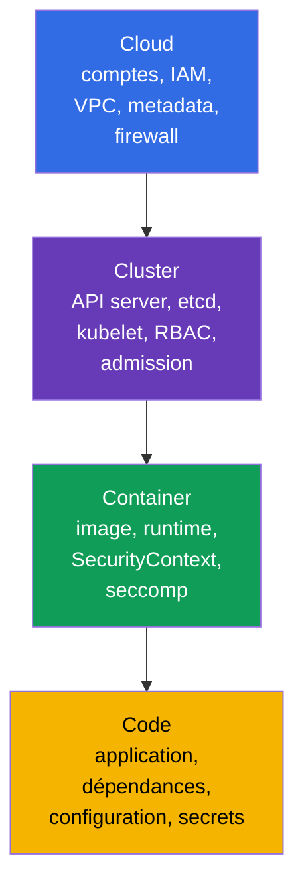
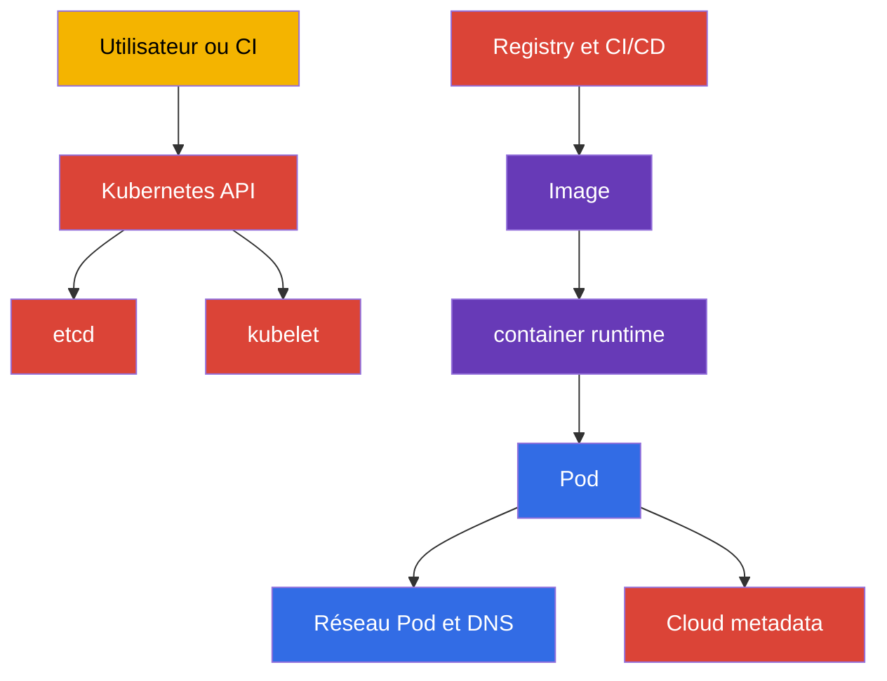
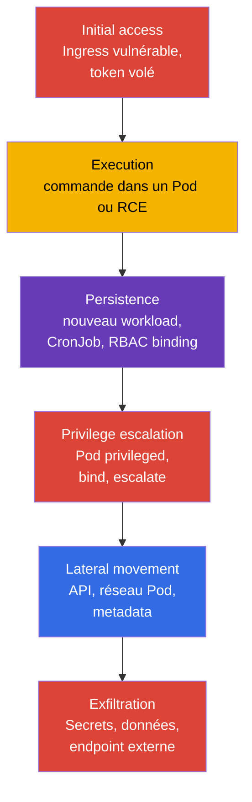
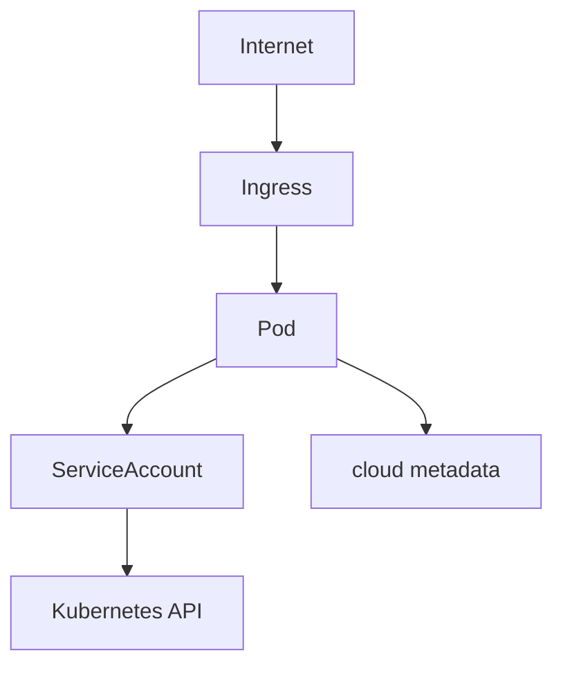
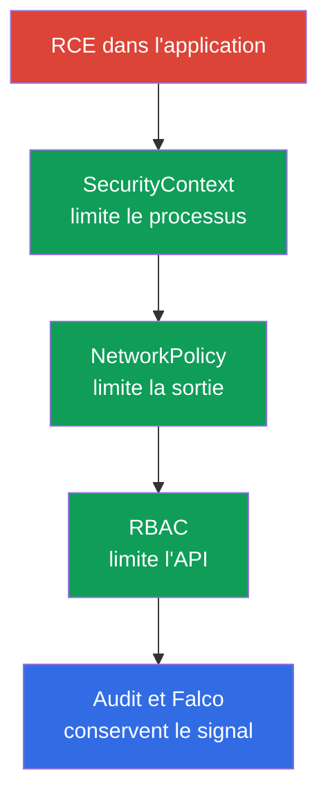

[Русская версия](ru.md) · [Eng version](README.md) · [Versión en español](es.md) · [Deutsche Version](de.md) · [ქართული ვერსია](ge.md) · [繁體中文版](tw.md) · [日本語版](jp.md)

# Chapitre 02. Modèle de sécurité Kubernetes : 4C, surface d'attaque et phases d'attaque

> **Le problème.** Protéger une seule couche Kubernetes crée un faux sentiment de sécurité : NetworkPolicy ne corrige pas une API publique, et un container durci ne corrige pas une vulnérabilité dans le code ou les credentials cloud d'un nœud. Sans carte des actifs et des frontières, l'équipe ferme des paramètres familiers tout en laissant à l'attaquant un chemin plus faible via Cloud, Cluster, Container ou Code.

> **La suite.** Le chapitre 01 a défini le format CKS, les domaines et les outils. Il faut maintenant un modèle commun pour prendre les décisions techniques : ce qu'il faut exactement protéger, contre qui et par quelle couche. Ce chapitre est le fondement des six domaines CKS : Cluster Setup (15%), Cluster Hardening (15%), System Hardening (10%), Minimize Microservice Vulnerabilities (20%), Supply Chain Security (20%) et Monitoring, Logging and Runtime Security (20%).

> **Ce qu'il faut connaître de CKA.** Le control plane, le worker node, kubelet, CNI et le chemin d'une requête API sont expliqués dans le [chapitre 02 de CKA](../../../cka/course/02/fr.md). Ici, ils sont considérés uniquement comme des actifs à protéger et des sources de risque.

> 🧠 4C explique pourquoi la protection d'une couche ne compense pas la faiblesse d'une autre.

## 02.1. Le modèle 4C : ce que nous protégeons

Pour une explication détaillée du modèle 4C, centrée sur la terminologie et la shared responsibility, consultez le [chapitre 03 du cours KCSA](../../../kcsa/course/03/fr.md) ; ici, le modèle est employé concrètement comme checklist des décisions techniques CKS, plutôt que répété depuis le début.

Le modèle **4C** répartit la sécurité Kubernetes en quatre couches imbriquées : Cloud, Cluster, Container et Code. Une couche extérieure ne remplace pas une couche intérieure. Un workload compromis peut être limité avec `NetworkPolicy` et `SecurityContext`, mais cela ne corrige ni un API endpoint public ni un socket container-runtime/CRI accessible depuis un workload. `docker.sock` n'est qu'un cas particulier pour les nœuds qui utilisent réellement Docker ; les sockets containerd ou CRI-O sont typiques des clusters modernes. Inversement, un réseau protégé ne corrige pas une vulnérabilité applicative.



| Couche | Actif | Chemin d'attaque typique | Contrôle de base |
|---|---|---|---|
| Cloud | credentials du cloud provider, VPC, metadata, disques et snapshots | Un Pod demande `169.254.169.254` et reçoit le rôle du nœud | Empêcher un Pod d'obtenir les credentials/l'identity du nœud ; employer une workload identity et des metadata controls propres au provider, des droits IAM minimaux et des security groups |
| Cluster | Kubernetes API, etcd, kubelet, PKI, RBAC | Une requête API anonyme ou surautorisée | TLS, `RBAC`, désactiver anonymous access, audit et versions à jour |
| Container | image, container runtime, namespaces, processus et filesystem | Une image vulnérable, un Pod `privileged`, container escape | Image minimale, `SecurityContext`, seccomp, AppArmor, `RuntimeClass` |
| Code | code source, dépendances, configuration et secrets | RCE applicative, fuite de Secret, dépendance malveillante | Review, dependency scan, SBOM, ne pas stocker de secrets dans le code, configuration sûre |

4C est utile comme ordre d'investigation. Si un Pod peut lire tous les `Secrets`, corrigez d'abord la couche Cluster - RBAC. Si un processus dans un Pod peut installer un utilitaire et télécharger un payload, des restrictions de la couche Container et un contrôle egress sont nécessaires. Si un endpoint applicatif accepte des commandes arbitraires, aucun manifeste Kubernetes ne peut remplacer une correction de la couche Code.

> 🎯 L'ordre Cloud → Cluster → Container → Code et les commandes de base de chaque étape.

### Inventaire rapide des frontières

Le modèle 4C ci-dessus indique qu'un maillon faible extérieur ne peut être compensé par une protection intérieure. L'inventaire doit donc suivre le même ordre - **Cloud → Cluster → Container → Code** - au lieu de commencer par la couche la plus familière (Cluster). La stratégie suivante indique, pour chacune des quatre couches, ce qui est vérifié, ce qui peut en principe le révéler et quelles commandes donnent une réponse.

| Couche | Éléments à inventorier | Moyen de vérification | Étapes ci-dessous |
|---|---|---|---|
| Cloud (ou infrastructure provider) | accès public à l'API endpoint, identity du nœud et droits cloud, hardening du metadata service, frontière réseau, accès à la console du provider | CLI du provider (qui requiert des droits distincts dans son compte) plus une vérification indépendante du provider depuis le cluster | étape 1 |
| Cluster | version et points d'entrée du control plane, droits RBAC étendus, paramètres de Pod dangereux, ports de nœud ouverts | `kubectl` et SSH vers un nœud | étapes 2-5 |
| Container | images réellement exécutées, tags mutables, registry non approuvée | `kubectl` | étape 6 |
| Code | dépendances vulnérables avec CVE, vulnérabilités exploitables de la logique applicative (SSRF, injection, contournement d'autorisation, IDOR), valeurs de configuration par défaut non sûres, secrets dans le code et les manifestes | `kubectl` ne couvre que le dernier point (un secret dans un manifeste) ; tout le reste nécessite SBOM, dependency scanning, SAST, code review et pentest | étape 7 - partiellement |

Une limite importante doit être dite clairement : `kubectl` ne voit que ce qui est entré dans Kubernetes API ; l'inventaire couvre donc les quatre couches de manière très inégale. Il voit à peine la couche Cloud (les rôles IAM, VPC et snapshots sont hors de l'API du cluster), et voit la couche Code moins que toute autre : un manifeste peut révéler un secret écrit dans `env`, mais pas une bibliothèque vulnérable dans une image, une injection SQL ou un contournement d'autorisation dans le code applicatif, ni un secret codé en dur dans des fichiers source. Ce n'est pas une faiblesse des commandes ci-dessous, mais une frontière de l'outil lui-même : Kubernetes API ne sait rien du contenu de votre application. Le travail complet sur la couche Code implique SBOM et dependency scanning (chapitres 25 et 28), analyse statique (chapitre 27) ; les vulnérabilités de logique applicative ne sont pas résolues du tout avec des outils CKS. Elles sont trouvées par code review, SAST/DAST et pentest, et restent de la responsabilité du développement plutôt que de l'équipe plateforme. L'inventaire ci-dessous est un instantané rapide des frontières, établi avec les données disponibles dans le cluster, et non un audit complet des quatre couches. Les commandes ne modifient rien et conviennent à un accès administrateur normal du cluster ; chaque étape est indépendante de la précédente.

**Étape 1 (Cloud). Le cloud metadata endpoint est-il accessible depuis un Pod ?**

La couche Cloud est presque entièrement hors de Kubernetes API ; son inventaire comporte donc deux parties : ce qui est vérifiable depuis le cluster et ce qui exige la CLI du provider.

Depuis le cluster, un risque précis et connu peut être vérifié : savoir si un Pod arbitraire peut atteindre le metadata service du nœud et potentiellement voler ses credentials. L'adresse `169.254.169.254` est une IP link-local partagée par AWS, GCP, Azure, Hetzner et la plupart des autres providers ; une vérification de l'accessibilité indépendante du provider est donc possible :

```bash
kubectl run metadata-probe --rm -i --restart=Never --image=curlimages/curl:8.11.1 -- \
  curl -s -o /dev/null -w 'http_code=%{http_code}\n' --max-time 2 http://169.254.169.254/
```

La commande démarre un Pod ponctuel (`--rm` le supprime dès sa fin) et interroge la **racine** de l'endpoint plutôt qu'un chemin propre à un provider. C'est délibéré : le point important n'est pas le contenu des metadata mais l'accessibilité réseau. Tout code HTTP - `200`, `401`, `403` ou `404` - signifie que l'endpoint a répondu et que le Pod l'a atteint ; c'est un signal d'alerte indépendamment du cloud provider. Le code `000` signifie qu'aucune réponse n'est arrivée (timeout ou connexion refusée) - l'endpoint est inaccessible depuis le Pod, ce qui est l'objectif du hardening. La commande ne lit ni ne conserve le corps de la réponse, seulement le code, et ne peut donc pas introduire accidentellement de vrais credentials dans le log.

Si, après avoir constaté l'accessibilité, vous devez déterminer ce qui peut être lu, il faut alors employer le chemin et l'en-tête d'un provider donné - ils sont incompatibles entre eux :

| Provider | Chemin | En-tête requis |
|---|---|---|
| AWS (EC2 IMDS) | `/latest/meta-data/` | aucun pour IMDSv1 ; IMDSv2 exige un token obtenu par un `PUT /latest/api/token` distinct |
| GCP | `/computeMetadata/v1/` | `Metadata-Flavor: Google` |
| Azure | `/metadata/instance?api-version=2021-02-01` | `Metadata: true` |
| Hetzner Cloud | `/hetzner/v1/metadata` | aucun |

En raison de ces différences, la sonde ci-dessus n'utilise volontairement aucun chemin spécifique à un provider : une commande avec `/latest/meta-data/` retournerait `404` sur GCP et Azure et pourrait être interprétée à tort comme « inaccessible », alors que l'endpoint répond réellement. Un en-tête requis (`Metadata-Flavor`, `Metadata: true`) protège contre le SSRF le plus simple, et non contre un Pod : un Pod peut lui-même envoyer tout en-tête ; cette exigence ne supprime donc pas la nécessité de fermer le chemin réseau.

**Ne confondez pas deux constats distincts.** « L'endpoint est accessible » et « les credentials ont été obtenus » ne sont pas la même chose et ne doivent pas être réunis dans un rapport :

- *L'accessibilité* est un **constat et prérequis** : le chemin réseau d'un Pod vers le metadata service n'est pas fermé. Elle suffit à créer une tâche de remédiation, mais ne prouve pas à elle seule une compromission.
- *La récupérabilité des credentials* est un **chemin d'exploitation confirmé** et exige que les autres conditions du provider soient aussi remplies.

AWS illustre bien cette différence. Avec `HttpTokens=required` (IMDSv2-only), une requête sans token n'obtient rien ; le token est demandé avec un `PUT` distinct et sa réponse survit exactement à `HttpPutResponseHopLimit` sauts réseau. Avec une hop limit de `1`, la réponse n'atteint pas un Pod dans son propre network namespace - autrement dit, l'endpoint répond et la sonde montre l'accessibilité, mais le token et donc les credentials ne peuvent pas être obtenus. Notez qu'un Pod avec `hostNetwork: true` n'est pas un saut supplémentaire ; cette restriction ne lui est donc pas applicable. En pratique, consignez l'accessibilité comme fait séparé et ne concluez au vol de credentials qu'après avoir vérifié les paramètres propres au provider.

Le reste de cette couche exige la CLI du provider et des droits distincts dans son compte - `kubectl` ne peut pas voir ces objets du tout.

> 🏭 CLI propre au provider pour vérifier l'accès API public et le hardening du metadata service.

Les questions sont les mêmes chez tous les providers ; seules les commandes diffèrent :

1. Kubernetes API est-elle exposée à Internet, et depuis quels réseaux ?
2. Quelle identity est attachée aux nœuds et que peut-elle faire dans le cloud si elle est volée par un Pod ?
3. Le hardening du metadata service est-il activé (sur AWS - IMDSv2-only et hop limit limitée ; sur GCP/Azure - en-tête requis et règles réseau) ?
4. Qui peut créer ou modifier un nœud, disque, snapshot ou règle réseau hors de Kubernetes ?

Exemple pour AWS/EKS (`gcloud container clusters describe` et `gcloud compute instances describe` remplissent ce rôle sur GCP, tandis qu'Azure utilise `az aks show` et `az vm show` ; les questions sont les mêmes, mais la sortie et les noms de champs diffèrent) :

```bash
# Question 1 : l'API server est-il visible depuis Internet, et par qui ?
aws eks describe-cluster --name "$CLUSTER" \
  --query 'cluster.resourcesVpcConfig.{public:endpointPublicAccess,private:endpointPrivateAccess,cidrs:publicAccessCidrs}'

# Question 3 : une hop limit de `1` est le default privilégiant la sécurité ; ne testez `2` que là où
# un Pod a une raison justifiée d'accéder lui-même à IMDS
aws ec2 describe-instances --filters "Name=tag:eks:cluster-name,Values=$CLUSTER" \
  --query 'Reservations[].Instances[].{id:InstanceId,imds:MetadataOptions.HttpTokens,hop:MetadataOptions.HttpPutResponseHopLimit}'
```

L'AWS EKS Best Practices Guide distingue deux cas qui ne doivent pas être réduits à une seule « baseline ». Si un Pod ne doit pas hériter des droits du node instance profile (cas habituel avec IRSA/EKS Pod Identity), la documentation recommande explicitement `HttpTokens=required` et `HttpPutResponseHopLimit=1` dans « Restrict access to the instance profile assigned to the worker node » - c'est ce qui bloque l'obtention des credentials du nœud par un Pod. Elle recommande `HttpPutResponseHopLimit=2` séparément et seulement lorsqu'une application a réellement besoin de son propre accès IMDS (« When your application needs access to IMDS... increase the hop limit to 2 ») - une exception justifiée, non la baseline de sécurité générale de chaque container workload.

**Un cas distinct : un cluster self-managed sur des serveurs « ordinaires »** (kubeadm sur bare metal, VM Hetzner ou équivalent).

> 🔬 Vérification d'un cluster self-managed.

Il peut n'y avoir aucun IAM cloud ici - au sens de rôle cloud, le nœud n'a rien à voler et la question 2 est partiellement écartée. Mais la couche Cloud ne disparaît pas ; elle est remplacée par celle de l'infrastructure provider. Les questions deviennent : l'API server et SSH sont-ils accessibles depuis Internet ou seulement depuis un réseau privé ; qui peut accéder à la console du provider (créer ou supprimer des serveurs, accéder à la console et aux snapshots équivaut à un accès root aux nœuds) ; le provider expose-t-il un metadata endpoint contenant des données sensibles (chez Hetzner, `169.254.169.254/hetzner/v1/metadata`, qui peut contenir les user data cloud-init) ; et le trafic entre serveurs est-il fermé par des règles réseau du provider plutôt que seulement par `NetworkPolicy` à l'intérieur du cluster. La vérification `metadata-probe` ci-dessus s'applique tout autant - elle n'est pas spécifique au cloud.

**Étape 2 (Cluster). Points d'entrée et version du control plane.**

```bash
kubectl cluster-info
kubectl get --raw=/version
```

`kubectl cluster-info` affiche l'adresse de l'API server et les services associés - le premier point d'entrée visible à chaque client du cluster. `kubectl get --raw=/version` renvoie la version exacte du control plane Kubernetes ; elle est nécessaire pour vérifier les flags disponibles et les CVE connues de cette version précise, au lieu de deviner d'après la documentation d'une release quelconque.

**Étape 3 (Cluster). Qui possède de larges droits à l'échelle du cluster ?**

```bash
kubectl get clusterrolebinding -o jsonpath='{range .items[?(@.roleRef.name=="cluster-admin")]}{.metadata.name}{"\t"}{range .subjects[*]}{.kind}:{.name}{" "}{end}{"\n"}{end}'
```

Cette commande n'affiche que les objets `ClusterRoleBinding` qui font référence au rôle intégré `cluster-admin` - le rôle le plus étendu du cluster, qui donne un accès complet à chaque ressource. Pour chaque binding correspondant, une ligne indique son nom puis les subjects (`User`, `Group` ou `ServiceAccount`) auxquels le rôle est attribué. Le `range` interne sur `.subjects[*]` est nécessaire parce qu'un binding peut référer plusieurs subjects.

**Vérifier le nom `cluster-admin` ne suffit pas.** Le niveau d'accès est défini non par le nom du rôle, mais par la combinaison de ses règles et de l'étendue de son binding. Un `ClusterRole` avec `apiGroups: ["*"]`, `resources: ["*"]` et `verbs: ["*"]` définit un ensemble de droits pratiquement sans restriction sur l'API de ressources Kubernetes, mais son étendue effective dépend du binding : `ClusterRoleBinding` le rend global à tous les namespaces, tandis qu'un `RoleBinding` qui référence le même `ClusterRole` limite les droits namespaced au namespace où ce `RoleBinding` a été créé. Cela permet de réutiliser le même jeu de règles dans plusieurs namespaces sans créer d'objets Role identiques. Un `ClusterRole` est également employé pour les droits sur les ressources cluster-scoped (telles que `nodes`), les endpoints non liés à une ressource (`/healthz`) et l'accès global par `ClusterRoleBinding`. Sur les clusters réels, de tels rôles apparaissent constamment sous des noms anodins comme `platform-superuser`, `ci-deployer` ou `monitoring-full`, créés « juste pour que cela fonctionne » ou volontairement pour échapper à une revue déclenchée par le mot `cluster-admin`. Une recherche par nom les manque complètement ; vérifier les règles d'un rôle sans ses bindings produit une mauvaise évaluation du risque - des droits larges liés par un `RoleBinding` dans un namespace n'ont pas la même ampleur de menace que les mêmes droits accordés par un `ClusterRoleBinding`.

À strictement parler, ce rôle n'est **pas l'équivalent littéral** du `cluster-admin` intégré : sa définition contient deux règles, et non une - un wildcard de ressources et une règle wildcard distincte pour `nonResourceURLs`, couvrant des endpoints tels que `/healthz`, `/metrics` et `/debug/*`. Un rôle dépourvu de la seconde règle ne donne pas ces chemins et peut aussi être restreint par `resourceNames` ou modifié par agrégation (`aggregationRule`). En triage, toutefois, cette distinction est négligeable : contrôler chaque ressource API implique déjà de lire chaque Secret, créer un Pod sur n'importe quel nœud et modifier RBAC, ce qui mène au contrôle complet du cluster. La documentation Kubernetes appelle également avec prudence cet exemple « similar to the built-in `cluster-admin` role » et non « identical ». La conclusion pratique ne change pas : cherchez par permissions, pas par nom.

```bash
# Étape A : trouver TOUS les objets ClusterRole avec des permissions wildcard complètes, quel que soit leur nom
kubectl get clusterroles -o json | jq -r '
  .items[]
  | select(any(.rules[]?;
      ((.apiGroups // []) | index("*")) and
      ((.resources // []) | index("*")) and
      ((.verbs // []) | index("*"))))
  | .metadata.name
'
```

```bash
# Étape B : trouver les bindings qui font référence à l'un quelconque des rôles découverts
dangerous=$(kubectl get clusterroles -o json | jq -r '
  .items[]
  | select(any(.rules[]?;
      ((.apiGroups // []) | index("*")) and
      ((.resources // []) | index("*")) and
      ((.verbs // []) | index("*"))))
  | .metadata.name
')

kubectl get clusterrolebinding -o json \
  | jq -r --argjson names "$(echo "$dangerous" | jq -R . | jq -s .)" '
      .items[]
      | select(.roleRef.name as $r | $names | index($r))
      | "\(.metadata.name) -> rôle \(.roleRef.name) (à l'échelle du cluster), subjects: \([.subjects[]? | "\(.kind):\(.name)"] | join(", "))"
    '

# Étape B' : le même rôle peut aussi être lié avec RoleBinding - ses permissions
# ne s'appliquent alors que dans un namespace, mais la recherche ClusterRoleBinding ci-dessus ne l'inspecte pas
kubectl get rolebinding -A -o json \
  | jq -r --argjson names "$(echo "$dangerous" | jq -R . | jq -s .)" '
      .items[]
      | select(.roleRef.kind == "ClusterRole" and (.roleRef.name as $r | $names | index($r)))
      | "\(.metadata.name) (namespace \(.metadata.namespace)) -> rôle \(.roleRef.name) (uniquement dans ce namespace), subjects: \([.subjects[]? | "\(.kind):\(.name)"] | join(", "))"
    '
```

L'étape A vérifie chaque règle de rôle : un accès complet existe si une règle contient simultanément `*` dans `apiGroups`, `resources` et `verbs`. `any(.rules[]?; ...)` est important, car une règle dangereuse peut être deuxième ou troisième dans la liste, à côté de règles inoffensives. Les étapes B et B' prennent les noms découverts et indiquent quels bindings les utilisent réellement, pour qui et dans quelle étendue : `ClusterRoleBinding` accorde l'accès à l'échelle du cluster, tandis que `RoleBinding` pour le même `ClusterRole` le limite à un namespace. Ce sont des ampleurs de menace différentes avec des règles de rôle identiques, et omettre l'un des deux types de binding donne une image incomplète. Un rôle dangereux non lié reste un point à examiner, mais un rôle lié signifie que quelqu'un possède déjà ses permissions.

Recherchez aussi des motifs plus étroits mais toujours dangereux qui ne satisfont pas la condition de wildcard complète :

```bash
kubectl get clusterroles -o json | jq -r '
  .items[]
  | .metadata.name as $name
  | .rules[]?
  | select(((.verbs // []) | index("*"))
      and (((.apiGroups // []) | index("*") | not) or ((.resources // []) | index("*") | not)))
  | "\($name): verbs=* on apiGroups=\(.apiGroups // []) resources=\(.resources // [])"
'
```

Par exemple, `verbs: ["*"]` uniquement sur `secrets` n'est pas `cluster-admin`, mais permet de lire et modifier chaque secret du cluster - pour de nombreux modèles de menace, cela équivaut à une compromission complète. `create` sur `pods` combiné à une large permission `hostPath` à la couche admission, `escalate`/`bind` sur les rôles et `impersonate` sur les utilisateurs sont semblablement dangereux : ils donnent un chemin d'escalade de privilèges même si le rôle semble lui-même étroit. Le chapitre [10](../10/fr.md) examine ces motifs en détail.

> **À l'examen.** Un `range` imbriqué avec le filtre `?(@.roleRef.name==...)` dans une expression jsonpath est exactement le type de construction contre lequel l'étape 4 met en garde : il est facile de perdre un crochet ou un guillemet en le saisissant rapidement. Il est plus fiable de scinder la vérification en une boucle simple où chaque appel `kubectl` ne demande qu'un champ, sans filtre ni imbrication :
>
> ```bash
> for crb in $(kubectl get clusterrolebinding -o name | cut -d/ -f2); do
>   role=$(kubectl get clusterrolebinding "$crb" -o jsonpath='{.roleRef.name}')
>   if [[ "$role" == "cluster-admin" ]]; then
>     echo "$crb:"
>     kubectl get clusterrolebinding "$crb" -o jsonpath='{range .subjects[*]}{.kind}:{.name}{" "}{end}'
>     echo
>   fi
> done
> ```
>
> `kubectl get clusterrolebinding -o name` imprime les noms sous la forme `clusterrolebinding.rbac.authorization.k8s.io/<name>` ; `cut -d/ -f2` ne conserve que le nom après `/`. Chaque `kubectl get clusterrolebinding "$crb" -o jsonpath='{.roleRef.name}'` vérifie exactement un champ simple d'un binding. Il ne contient ni filtre `?(...)`, ni `range` imbriqué pour sélectionner les bindings eux-mêmes, seulement un `range` pour les subjects dans une correspondance trouvée, ce qui est nettement plus facile à inspecter avant l'exécution. C'est plus lent que le one-liner ci-dessus car une requête API distincte est faite pour chaque binding, mais un cluster d'examen n'a normalement pas des milliers de bindings, et la fiabilité de saisie importe davantage que quelques secondes.

**Étape 4 (Cluster). Workloads avec indicateurs dangereux explicites.**

> 🎯 Trouvez les objets Pod avec `privileged`, `hostNetwork/hostPID/hostIPC`, `hostPath`, des capabilities ajoutées ou `runAsUser: 0`.

> **À l'examen.** La version complète ci-dessous (avec des fonctions `def` distinctes pour chaque niveau de contrôle) est pédagogique : elle présente simultanément les six indicateurs et explique pourquoi ils sont liés logiquement, plutôt que ce que vous devez réellement saisir sous chronomètre. Même un court filtre `jq` avec des appels `select` imbriqués et des tableaux est facile à casser avec un crochet manquant lorsque la pression du temps inquiète. Sous pression, il est plus fiable d'écrire une version *moins élégante* mais presque impossible à casser syntaxiquement avec `grep`. Par exemple, pour « trouver tous les objets Pod avec hostNetwork dans le namespace `prod` » :
>
> ```bash
> NS=prod
>
> for pod in $(kubectl get pods -n "$NS" -o jsonpath='{.items[*].metadata.name}'); do
>   if kubectl get pod "$pod" -n "$NS" -o json | grep hostNetwork | grep -q true; then
>     echo "$pod"
>   fi
> done
> ```
>
> L'approche consiste à obtenir les noms de Pod avec une commande simple, puis à récupérer un objet Pod JSON à chaque itération de boucle et à rechercher le champ demandé avec grep, en imprimant le nom lorsqu'il est trouvé. Le namespace est placé dans la variable `NS` de première ligne car il apparaît deux fois dans la commande ; sous chronomètre, il est facile de modifier un appel et d'oublier l'autre, ce qui ferait silencieusement rechercher les Pod d'un namespace dans un autre. Avec une variable, il y a une seule modification au début, bien visible. Les deux appels `grep` en pipeline rendent la vérification précise tout en restant simple : le premier ne conserve que la ligne `hostNetwork` et le second vérifie qu'elle contient `true`. Ainsi, `"hostNetwork": false` est exclu - le champ existe mais il n'y a pas de risque. `grep -q` n'imprime rien ; il ne renvoie qu'un statut de succès/échec pour `if`. Cela fonctionne parce que `kubectl -o json` imprime un JSON formaté avec chaque champ sur sa propre ligne, de sorte que le second `grep` ne reçoit que la ligne `hostNetwork`, pas les champs voisins. Pour un grand nombre de Pod dans un namespace, cette approche a les mêmes limites d'échelle que les autres variantes de cette page (voir la section sur les 10 000 Pod ci-dessus). Pour un namespace d'examen contenant une poignée ou quelques dizaines de Pod, cela n'a toutefois pas d'importance et la commande a peu de chances de casser même saisie rapidement sans brouillon. La même technique vaut pour tout champ booléen : remplacez `hostNetwork` par `hostPID`, `hostIPC` ou `privileged`.

L'idée est de parcourir chaque Pod de chaque namespace et de ne conserver que ceux qui ont au moins un indicateur dangereux connu - paramètres qui réduisent l'isolation du container. Les indicateurs sont vérifiés à l'échelle du Pod entier et de chaque container individuel :

| Niveau | Indicateur | Pourquoi c'est un risque |
|---|---|---|
| Pod | `hostNetwork`, `hostPID` ou `hostIPC` | Le Pod partage la pile réseau, les processus ou IPC avec le nœud lui-même - l'isolation est en partie supprimée |
| Pod | un volume `hostPath` | Le container obtient un accès direct au filesystem du nœud |
| Container | `privileged: true` | Le container reçoit presque tous les privilèges du kernel, comme un processus de l'hôte |
| Container | `allowPrivilegeEscalation: true` | Un processus dans le container peut obtenir plus de privilèges qu'il n'en avait au démarrage |
| Container | capabilities ajoutées | Le container reçoit explicitement des privilèges au-delà de l'ensemble minimal |
| Container | `runAsUser: 0` (au niveau Pod ou container) | Le processus s'exécute en root dans le container |

L'implémentation recherche précisément ces indicateurs avec `jq` et n'imprime que les objets Pod auxquels au moins l'un d'eux s'applique ; tous les autres sont omis pour que des centaines de Pod sûrs ne masquent pas la sortie.

**Pourquoi employer `jq` au lieu de `--field-selector` ou `-o jsonpath` ?** On peut naturellement se demander si les indicateurs dangereux peuvent être filtrés directement sur l'API server afin que le JSON des Pod sûrs ne soit jamais envoyé au client. En partie, mais pas complètement. Pour les objets Pod, `--field-selector` prend en charge une liste étroite de champs définie par l'API server : `metadata.name`, `metadata.namespace`, `spec.nodeName`, `spec.restartPolicy`, `spec.schedulerName`, `spec.serviceAccountName`, `spec.hostNetwork`, `status.phase`, `status.podIP`, `status.podIPs` et `status.nominatedNodeName` (vérifié dans la documentation Kubernetes officielle ; la liste peut varier selon la version et `kubectl` renvoie `BadRequest` pour un champ non pris en charge). `spec.hostNetwork` **est** disponible, de sorte que cette vérification unique peut être déplacée sur le serveur. Cependant, `hostPID`, `hostIPC`, `privileged`, `allowPrivilegeEscalation`, les capabilities ajoutées, un volume `hostPath` et `runAsUser` ne sont pas dans cette liste. Ils ne peuvent pas être filtrés côté serveur et il ne faut pas s'attendre à ce qu'ils deviennent des expressions arbitraires : l'ensemble de champs est défini dans le code de l'API server. Cette formulation est intentionnellement liée à une version : la liste est correcte pour la baseline du cours (Kubernetes v1.36), et la bonne habitude est de consulter la documentation de votre version en cas de doute. `-o jsonpath` ne résout pas non plus le problème : il peut projeter et filtrer un champ via `?(@.field==value)`, mais ne peut pas combiner plusieurs conditions avec « ou » dans une expression ni inspecter à la fois `spec.containers[]`, `spec.volumes[]` et `spec.securityContext` avec une logique partagée. Cela exige un langage avec des expressions booléennes complètes, donc `jq` (ou son équivalent côté client). Vous pouvez en outre réduire `status.phase` à `Running` si les Pod terminés ne sont pas pertinents. Les deux optimisations côté serveur sont combinées par une virgule dans un même `--field-selector` :

```bash
kubectl get pods -n "$ns" --field-selector=status.phase=Running -o json
```

Cela ne remplace pas `jq` ; cela réduit le volume JSON qui lui parvient. Le serveur n'envoie plus les Pod terminés, tandis que `jq` continue à vérifier les indicateurs restants qui ne peuvent pas être filtrés côté serveur. Le `jq` ci-dessous vérifie encore `hostNetwork` avec les autres indicateurs bien qu'il puisse formellement être sélectionné dans une requête `--field-selector` distincte : des requêtes séparées pour chaque indicateur compliqueraient davantage le script que ne le justifie l'économie d'un des sept champs, tandis qu'une seule expression `jq` reste plus claire et plus facile à maintenir.

**Une note sur l'échelle.** Deux charges différentes sont souvent confondues ici. Du côté API server, les requêtes `kubectl get` de listes importantes utilisent par défaut des **chunks** - `--chunk-size` vaut par défaut `500` (« Return large lists in chunks rather than all at once ») ; 10 000 objets Pod arrivent donc en environ vingt requêtes séquentielles plutôt qu'en une requête géante. Vous ne pouvez désactiver la pagination qu'explicitement avec `--chunk-size=0`.

Le problème est côté client : `kubectl` regroupe les chunks en un document JSON, tandis que `jq` attend de l'avoir reçu entièrement avant d'émettre une ligne. En production, avec des milliers de Pod, cela peut représenter des centaines de MB en mémoire sur le poste et des minutes sans retour, jusqu'à un OOM dans `kubectl` ou `jq`. Itérer les namespaces un à un est donc utile non pour soulager l'API server (le chunking le fait déjà), mais pour ne pas garder le cluster entier en mémoire et pour recevoir des résultats incrémentaux namespace par namespace :

```bash
for ns in $(kubectl get ns -o jsonpath='{.items[*].metadata.name}'); do
  kubectl get pods -n "$ns" --field-selector=status.phase=Running -o json | jq -r --arg ns "$ns" '
    def containers:
      (.spec.containers // [])
      + (.spec.initContainers // [])
      + (.spec.ephemeralContainers // []);

    # Chaque vérification de container renvoie une LISTE d'indicateurs spécifiques correspondants,
    # accompagnés du nom du container, plutôt que seulement true/false. Sinon,
    # les différents indicateurs ne peuvent pas être distingués dans la sortie.
    def container_reasons:
      [
        (if .securityContext.privileged == true then "privileged:\(.name)" else empty end),
        (if .securityContext.allowPrivilegeEscalation == true then "allowPrivilegeEscalation:\(.name)" else empty end),
        (if ((.securityContext.capabilities.add // []) | length > 0)
          then "capabilities.add=\((.securityContext.capabilities.add // []) | join(",")):\(.name)"
          else empty end),
        (if .securityContext.runAsUser == 0 then "runAsUser=0:\(.name)" else empty end)
      ];

    # Même idée au niveau Pod : une liste de motifs de niveau Pod plus les motifs
    # de chaque container, combinés en une unique liste plate.
    def pod_reasons:
      [
        (if .spec.hostNetwork == true then "hostNetwork" else empty end),
        (if .spec.hostPID == true then "hostPID" else empty end),
        (if .spec.hostIPC == true then "hostIPC" else empty end),
        (if .spec.securityContext.runAsUser == 0 then "pod.runAsUser=0" else empty end),
        (if ([.spec.volumes[]? | select(.hostPath != null)] | length > 0)
          then "hostPath=\([.spec.volumes[]? | select(.hostPath != null) | .hostPath.path] | join(","))"
          else empty end)
      ] + [containers[]? | container_reasons[]];

    .items[]
    | (pod_reasons) as $reasons
    | select($reasons | length > 0)
    | "\($ns)/\(.metadata.name): \($reasons | join("; "))"
  '
done
```

La logique de contrôle - les trois fonctions `containers`/`container_reasons`/`pod_reasons` et le `select` final - équivaut à l'idée ci-dessus. Ce qui change est l'acquisition des données et le format de sortie : au lieu de dire seulement « nécessite une revue », une ligne répertorie les indicateurs correspondants et leur container, par exemple `hostNetwork; privileged:aws-node; capabilities.add=NET_ADMIN:aws-node`. Sans cela, dans un cluster réel, notamment EKS/GKE où les objets CNI et les autres objets système DaemonSet tels que `aws-node` utilisent légitimement `hostNetwork` et `privileged`, la sortie devient une longue liste de lignes identiques `namespace/pod requires review`. On ne peut pas distinguer rapidement un composant système attendu d'un véritable constat. Imprimer la raison précise répond immédiatement à la question de savoir pourquoi un Pod a atteint la liste, sans ouvrir `-o yaml` pour chaque résultat.

Le même processus sans code :

1. `for ns in $(kubectl get ns -o jsonpath='{.items[*].metadata.name}')` obtient les noms des namespaces par une légère requête (aucun objet Pod, seulement des noms) et les fournit un à un à `$ns`.
2. `kubectl get pods -n "$ns" --field-selector=status.phase=Running -o json` dans la boucle ne récupère que les objets Pod Running du namespace courant - bien moins de JSON que `-A` non filtré sur le cluster entier, et aucun Pod terminé/mort sans intérêt ici.
3. `containers` combine les containers réguliers, init et ephemeral du Pod en un flux, car un paramètre dangereux dans n'importe lequel a le même risque que dans un container principal.
4. `container_reasons` renvoie, pour un container, une liste d'indicateurs correspondants avec son nom : `privileged:<name>`, `allowPrivilegeEscalation:<name>`, `capabilities.add=...:<name>` ou `runAsUser=0:<name>`. La liste est vide pour un container sûr.
5. `pod_reasons` fait de même pour le Pod entier : `hostNetwork`, `hostPID`, `hostIPC`, `pod.runAsUser=0` et `hostPath=<path>`, combinés avec tous les motifs de containers au moyen de `container_reasons[]` dans une liste plate.
6. La ligne finale visite chaque Pod (`.items[]`), stocke sa liste de motifs dans `$reasons`, ne conserve qu'une liste non vide et imprime `namespace/pod-name: reason1; reason2; ...`, par exemple `kube-system/aws-node-2sp7j: hostNetwork; privileged:aws-node; capabilities.add=NET_ADMIN:aws-node`.

Les raisons détaillées de l'étape 6 importent dans les clusters de production. Les objets système DaemonSet tels que `aws-node` (Amazon VPC CNI), `cilium` et `calico-node` utilisent normalement et légitimement `hostNetwork` et `privileged` pour gérer les interfaces réseau et les règles de nœud. Sans raison, un tel DaemonSet dans un cluster de centaines de nœuds produit des centaines de lignes identiques `requires review`, cachant qu'elles représentent un seul motif attendu. Avec une raison, il apparaît immédiatement que toutes les correspondances d'un namespace ont les mêmes indicateurs sur la même image ; il s'agit probablement d'un composant système légitime à documenter dans la liste de revue comme « CNI required », et non de dizaines d'incidents séparés.

**Variante supplémentaire de l'étape 4 : sortie JSON structurée avec chunking à l'intérieur d'un namespace.**

> 🏭 Vérification JSON en chunks pour les clusters comptant des milliers de Pod.

La variante ci-dessus convient à une vérification manuelle rapide : ses lignes sont faciles à lire pour une personne, mais peu commodes à transmettre à un autre outil tel qu'un système de tickets ou un dashboard. Un namespace avec des milliers de Pod est toujours assemblé en mémoire client avant qu'une sortie apparaisse. Des résultats lisibles par machine, plus une protection contre les très grands namespaces, exigent une approche plus complexe :

```bash
CHUNK_SIZE=200
SLEEP_BETWEEN_CHUNKS=0.2

result_file=$(mktemp)
chunk_file=$(mktemp)
merge_jq=$(mktemp)
trap 'rm -f "$result_file" "$chunk_file" "$merge_jq"' EXIT
echo '{}' > "$result_file"

cat > "$merge_jq" <<'JQEOF'
def containers:
  (.spec.containers // [])
  + (.spec.initContainers // [])
  + (.spec.ephemeralContainers // []);

def container_reasons:
  [
    (if .securityContext.privileged == true then "privileged:\(.name)" else empty end),
    (if .securityContext.allowPrivilegeEscalation == true then "allowPrivilegeEscalation:\(.name)" else empty end),
    (if ((.securityContext.capabilities.add // []) | length > 0)
      then "capabilities.add=\((.securityContext.capabilities.add // []) | join(",")):\(.name)"
      else empty end),
    (if .securityContext.runAsUser == 0 then "runAsUser=0:\(.name)" else empty end)
  ];

def pod_reasons:
  [
    (if .spec.hostNetwork == true then "hostNetwork" else empty end),
    (if .spec.hostPID == true then "hostPID" else empty end),
    (if .spec.hostIPC == true then "hostIPC" else empty end),
    (if .spec.securityContext.runAsUser == 0 then "pod.runAsUser=0" else empty end),
    (if ([.spec.volumes[]? | select(.hostPath != null)] | length > 0)
      then "hostPath=\([.spec.volumes[]? | select(.hostPath != null) | .hostPath.path] | join(","))"
      else empty end)
  ] + [containers[]? | container_reasons[]];

# L'entrée (.) est lue depuis le FICHIER de chunk ($chunk_file), pas depuis un argument
# de ligne de commande. Avec CHUNK_SIZE=200 objets Pod réels avec status et
# managedFields complets, un chunk peut aisément dépasser la limite système de longueur argv, et
# `jq --argjson chunk "$chunk_json"` échoue avec
# « Argument list too long » avant que jq puisse s'exécuter.
# Le résultat accumulé est lu via --slurpfile acc depuis un FICHIER DISTINCT
# pour la même raison - ne passez pas de grandes données par argv.
# kubectl renvoie une List ({"items":[...]}) pour PLUSIEURS noms, mais l'objet Pod
# directement (sans le champ items) pour exactement UN nom dans la commande.
# Sans cette branche, le dernier chunk incomplet (souvent un Pod) produit
# « jq: error: Cannot iterate over null (null) » car .items est absent sur
# un objet Pod unique.
($acc[0]) as $accumulated
| (.items // [.]) as $pods
| reduce ($pods[]) as $pod
  ($accumulated;
   ($pod | pod_reasons) as $reasons
   | if ($reasons | length) > 0
     then .[$ns][$pod.metadata.name] = $reasons
     else .
     end)
JQEOF

for ns in $(kubectl get ns -o jsonpath='{.items[*].metadata.name}'); do
  mapfile -t pod_names < <(kubectl get pods -n "$ns" --field-selector=status.phase=Running \
    -o jsonpath='{range .items[*]}{.metadata.name}{"\n"}{end}')
  total=${#pod_names[@]}
  processed=0
  for ((i = 0; i < total; i += CHUNK_SIZE)); do
    chunk=("${pod_names[@]:i:CHUNK_SIZE}")
    kubectl get pods -n "$ns" "${chunk[@]}" -o json > "$chunk_file"
    jq --slurpfile acc "$result_file" --arg ns "$ns" -f "$merge_jq" "$chunk_file" > "${result_file}.new"
    mv "${result_file}.new" "$result_file"
    processed=$((processed + ${#chunk[@]}))
    echo "namespace $ns : $processed/$total Pod traités" >&2
    sleep "$SLEEP_BETWEEN_CHUNKS"
  done
done

jq . "$result_file"
```

Ce qui devient plus complexe ici, et pourquoi :

- **Format de sortie - JSON imbriqué plutôt que lignes.** Le résultat est maintenant structuré comme `{namespace: {pod-name: [reasons]}}`. C'est la même information que celle imprimée comme texte par la version précédente, mais adaptée à une automatisation ultérieure : transmission à un autre script, stockage comme artifact ou filtrage avec une requête `jq` pour un namespace donné sans nouvelle requête au cluster.
- **Chunking à l'intérieur d'un namespace, pas seulement entre les namespaces.** La boucle `for ns in ...` ci-dessus divise déjà le travail par namespace, mais si un seul namespace contient des milliers de Pod (typique des grands namespaces de données/batch en production), `kubectl get pods -n "$ns" -o json` les demande à l'API server en pages `--chunk-size` mais **réunit quand même le namespace entier dans un objet JSON en mémoire client** et le donne à `jq` en une fois. La boucle interne `for ((i = 0; i < total; i += CHUNK_SIZE))` répartit les noms de Pod du namespace courant en groupes de `CHUNK_SIZE` (200 ici) et ne demande `kubectl get pods -n "$ns" <name1> <name2> ...` que pour ce groupe. Le pic mémoire est donc borné par un chunk plutôt que par la taille du namespace, et la progression peut être imprimée après chaque groupe. `--field-selector` ne convient pas car il ne peut exprimer « n'importe quel nom de cette liste » ; les noms sont donc passés comme arguments positionnels explicites à `kubectl get pods`.
- **`sleep "$SLEEP_BETWEEN_CHUNKS"` entre les chunks.** La pause (0,2 seconde ici) empêche le script d'inonder l'API server de centaines de requêtes consécutives. Dans un cluster contenant de nombreux namespaces et Pod, elle réduit sensiblement la charge de pointe par rapport à l'envoi des chunks aussi vite que possible.
- **Progression avec `echo ... >&2` après chaque chunk.** Cela imprime une ligne telle que `namespace kube-system: 200/1400 pods processed` vers stderr, sans la mélanger au JSON final sur stdout. Un scan de grand cluster peut durer des minutes, et sans progression il est impossible de savoir si le script travaille ou est bloqué.
- **Le résultat d'un chunk et le résultat accumulé sont dans des fichiers, pas dans des variables shell.** `kubectl get pods ... -o json > "$chunk_file"` écrit le JSON du chunk sur disque, tandis que `jq --slurpfile acc "$result_file" ... "$chunk_file"` lit le chunk et le résultat accumulé courant depuis des fichiers au lieu de les passer comme arguments de ligne de commande. C'est essentiel : avec `CHUNK_SIZE=200`, le JSON d'objets Pod réels comportant `status` et `managedFields` complets peut atteindre plusieurs MB. Une commande telle que `jq --argjson chunk "$chunk_json" ...` passe le JSON comme argument de processus ordinaire ; lorsque la limite agrégée argv (`ARG_MAX`, généralement d'environ 128 KB à plusieurs MB selon le système) est dépassée, le shell échoue avec `Argument list too long` avant que `jq` puisse le traiter. Cela arrive sur des clusters avec des centaines de Pod dans un namespace, même à un `CHUNK_SIZE=200` apparemment sûr, car la taille dépend du volume de metadata/status autant que du nombre de Pod. Chaque itération écrit dans un fichier temporaire (`> "${result_file}.new"`, puis `mv` sur l'ancien fichier), de sorte que le disque contient toujours soit l'ancien résultat, soit le nouveau résultat complet, jamais un résultat partiellement écrit en cas d'interruption.
- **`trap 'rm -f "$result_file" "$chunk_file" "$merge_jq"' EXIT`.** Les fichiers temporaires sont supprimés automatiquement à la sortie, y compris après une erreur ou `Ctrl+C`, et pas seulement après une fin normale. Sans `trap`, des fichiers temporaires s'accumuleraient dans `/tmp` après chaque exécution interrompue.
- **La fonction `pod_reasons` distincte dans `merge.jq` tient compte des structures renvoyées par kubectl pour des nombres de noms différents.** `kubectl get pods -n "$ns" pod-a pod-b -o json` renvoie une List (`{"items": [...]}`) pour PLUSIEURS noms, mais avec exactement UN nom - comme dans le dernier chunk souvent incomplet - renvoie directement cet objet Pod sans `items`. `(.items // [.])` gère les deux formes : si `.items` existe, il est utilisé ; sinon (lorsqu'il vaut `null`), l'objet d'entrée entier est placé dans une liste à un élément. Sans cette branche, un dernier chunk d'un Pod donne `jq: error: Cannot iterate over null (null)` car `.items[]` tente d'itérer un champ absent d'un objet Pod unique.

Ce n'est pas la version « correcte » à la place de la précédente, mais un compromis délibéré. Pour une vérification manuelle rapide sur un petit ou moyen cluster, la sortie texte ci-dessus est plus facile à lire et à copier une fois dans un terminal. La variante JSON en chunks est justifiée lorsque le résultat doit entrer dans une automatisation, que les namespaces peuvent contenir de nombreux Pod et que le scan doit ménager l'API server tout en montrant une progression visible - autrement dit, lorsqu'une commande de diagnostic ponctuelle devient un outil exécuté périodiquement. Ce scénario ne se présentera pas à l'examen ; considérez cette section comme un exemple de référence d'ingénierie de production, pas comme une chose à reproduire sous chronomètre.

**Étape 5 (Cluster/nœud). Sur le nœud : ports en écoute et processus propriétaires.**

```bash
sudo ss -tulpn
```

Les flags `-t` et `-u` affichent les sockets TCP et UDP, `-l` seulement les sockets en écoute, `-p` ajoute le PID et le nom du processus propriétaire, et `-n` ne résout pas les noms dans DNS (plus rapide et plus précis). C'est la seule commande exécutée sur le nœud lui-même et non via `kubectl` ; elle montre la vue OS plutôt que celle de Kubernetes API.

**Étape 6 (Container). Quelles images s'exécutent réellement et certaines ont-elles des tags mutables ?**

La première question de la couche Container n'est pas « l'image est-elle sûre ? » (c'est le scan du chapitre 28), mais la question plus élémentaire : quelles images s'exécutent dans le cluster, et pouvons-nous identifier sans ambiguïté le code qu'elles exécutent ?

```bash
# Liste complète des images uniques du cluster
kubectl get pods -A -o jsonpath='{range .items[*]}{range .spec.containers[*]}{.image}{"\n"}{end}{end}' | sort -u
```

```bash
# Pod avec un tag mutable : :latest explicite ou aucune balise (latest implicite)
kubectl get pods -A -o json | jq -r '
  .items[]
  | .metadata.namespace as $ns | .metadata.name as $pod
  | .spec.containers[]?
  | select((.image | endswith(":latest")) or (.image | split("/") | last | contains(":") | not))
  | "\($ns)/\($pod): \(.image)"
'
```

La première commande fournit l'inventaire : utilisez-la pour vérifier quelles registry sont réellement employées et si certaines ne sont pas approuvées. La seconde trouve les images avec un tag mutable - `nginx:latest` explicitement ou `redis` sans aucun tag (qui vaut alors par défaut `:latest`). Une telle image signifie que le code actuellement exécuté peut différer de celui vérifié pendant la review : le tag peut être redirigé vers un autre digest sans modification du manifeste. Le test `.image | split("/") | last | contains(":") | not` examine le dernier segment après `/` ; sans lui, `registry.example.com:5000/app` (un port dans l'adresse de registry mais pas de tag) serait considéré à tort comme taggé.

> **À l'examen, cet inventaire correspond à la moitié de la tâche.** Un énoncé typique est « dans le namespace `X`, trouvez le Pod présentant le plus grand nombre de vulnérabilités et supprimez-le » ou « trouvez le Pod dont l'image contient le package `<name>` en version `<version>` ». L'inventaire ci-dessus répond à « quelles images existent » ; `trivy` est ensuite nécessaire, ainsi que le **chemin inverse de l'image vers le Pod**, car vous devez supprimer le Pod, non l'image. Produisez donc d'abord les paires `pod → image` :
>
> ```bash
> NS=prod
>
> kubectl get pods -n "$NS" \
>   -o jsonpath='{range .items[*]}{.metadata.name}{"\t"}{.spec.containers[0].image}{"\n"}{end}'
> ```
>
> Comptez ensuite les vulnérabilités de chaque paire et triez dans l'ordre décroissant - le Pod recherché est le premier :
>
> ```bash
> kubectl get pods -n "$NS" \
>   -o jsonpath='{range .items[*]}{.metadata.name}{"\t"}{.spec.containers[0].image}{"\n"}{end}' \
> | while IFS=$'\t' read -r pod img; do
>     count=$(trivy image -q --severity CRITICAL,HIGH --format json "$img" \
>       | jq '[.Results[]?.Vulnerabilities[]?] | length')
>     echo -e "$count\t$pod\t$img"
>   done | sort -rn
> ```
>
> Le filtrage par sévérité est fait par `trivy` avec `--severity CRITICAL,HIGH`, plutôt qu'avec `select` dans `jq`. Cela maintient `jq` trivial (`length` sur chaque entrée renvoyée) et réduit le risque de se tromper dans une condition sous chronomètre. Une sortie telle que `3<tab>app-1<tab>nginx:1.19` est immédiatement lisible : le nombre à gauche, puis le Pod et l'image. `sort -rn` met l'élément le plus grave en premier, ce qui laisse `kubectl delete pod app-1 -n "$NS"`. Notez `.spec.containers[0].image` : il utilise le premier container. Si la tâche comporte des objets Pod multi-container, remplacez-le par `{range .spec.containers[*]}` et comptez chaque image séparément.
>
> Pour le second énoncé - « Pod avec un package et une version particuliers » - l'approche la plus rapide sous chronomètre consiste en deux appels `grep` imbriqués sur la sortie de table ordinaire, sans `--format json` ni `jq` :
>
> ```bash
> trivy image -q "$IMG" | grep openssl | grep '1.1.1d'
> ```
>
> Le premier `grep` conserve les lignes concernant le package demandé et le second en vérifie la version. Nuance utile : en mode table, `trivy` imprime à la fois la colonne `Library` (nom du package) et la colonne `Title` (titre de CVE), et les titres commencent souvent par un nom de package. Ainsi, `grep openssl` correspond aussi à une ligne de package `libssl1.1` si son titre dit `openssl: ...`. C'est normalement utile à l'examen : la tâche demande une image affectée par une vulnérabilité openssl, non une correspondance littérale de nom de package. Si une correspondance stricte dans la colonne `Library` est requise, ajoutez `^` et le délimiteur de table : `grep -E '^\│ openssl'`.
>
> La variante JSON précise est utile lorsque le résultat alimente un script au lieu d'être lu visuellement :
>
> ```bash
> trivy image -q --format json "$IMG" \
>   | jq -r '.Results[]?.Vulnerabilities[]? | select(.PkgName=="openssl") | "\(.PkgName) \(.InstalledVersion) \(.VulnerabilityID) \(.Severity)"'
> ```
>
> `PkgName`, `InstalledVersion`, `VulnerabilityID` et `Severity` sont toujours renseignés dans un rapport `trivy` (à la différence de `FixedVersion`, qui peut être absent sans correctif), ils sont donc fiables. Vous pouvez aussi compter les vulnérabilités sans `jq` : `trivy image -q --severity CRITICAL,HIGH "$IMG"` imprime lui-même `Total: N (...)` en mode table. Pour deux ou trois objets Pod, cela est plus rapide qu'écrire une boucle ; la boucle `jq` ci-dessus est préférable lorsqu'il y a environ dix Pod et que la comparaison visuelle devient peu commode.

**Étape 7 (Code). Secrets écrits comme valeurs littérales dans un manifeste.**

La couche Code a le périmètre de risque le plus large et est la moins accessible avec `kubectl`. Elle comprend les dépendances vulnérables avec CVE connues, les défauts exploitables de logique applicative (injection SQL/de commande, SSRF, contournement d'autorisation, IDOR, désérialisation non sûre), les valeurs de configuration par défaut non sûres et les secrets dans le code source.

La frontière doit être correctement tracée. Kubernetes API **n'expose ni le code source de l'application ni ses dépendances** - aucune requête `kubectl` ne trouvera une bibliothèque vulnérable ou un bug de vérification d'autorisation. Elle expose toutefois une partie de la **configuration d'exécution pertinente pour la sécurité**, qui compte plus d'un indicateur : les valeurs littérales dans `env`, `command` et `args` (où apparaissent souvent des flags comme `--insecure-skip-tls-verify` ou un debug mode activé), les références à `Secret` et `ConfigMap`, les volumes montés, les images et leurs tags, les annotations et labels, `securityContext` et le ServiceAccount utilisé. La vérification ci-dessous cible le plus commun et le plus clair de ces indicateurs - un secret écrit comme chaîne littérale dans `env` plutôt que `secretKeyRef`. D'autres outils couvrent le reste ; comprenez-le immédiatement plutôt que de traiter une étape 7 terminée comme une review complète de la couche Code.

```bash
kubectl get pods -A -o json | jq -r '
  .items[]
  | .metadata.namespace as $ns | .metadata.name as $pod
  | .spec.containers[]?
  | .env[]?
  | select(.value != null)
  | select(.name | test("PASSWORD|SECRET|TOKEN|KEY|CREDENTIAL"; "i"))
  | "\($ns)/\($pod): env \(.name) est définie comme valeur littérale"
'
```

Le filtre sélectionne les variables d'environnement ayant une `.value` littérale plutôt que `valueFrom`, et dont le nom ressemble à un secret. La commande n'imprime volontairement que le nom de la variable, non sa valeur ; sinon l'inventaire lui-même deviendrait un chemin de fuite. La correspondance par nom est heuristique : `PUBLIC_KEY_URL` peut être inoffensif, tandis qu'un secret nommé `DB_DSN` est omis. Lisez le résultat manuellement au lieu de le traiter comme une liste finale de violations.

Pourquoi un littéral est pire qu'une référence à `Secret` mérite d'être traité avec soin, car il est facile d'exagérer. Passer à `Secret` **ne protège pas automatiquement un secret**. Cela sépare seulement le secret du manifeste workload et active des mécanismes qu'un littéral n'a pas du tout.

| Aspect | Littéral dans `env[].value` | Référence à `Secret` |
|---|---|---|
| Emplacement de stockage | à l'intérieur de PodSpec/Deployment - c'est-à-dire dans un objet workload | dans un objet `Secret` séparé ; dans etcd, la valeur est **base64 et non chiffrée** sauf si encryption at rest est activé |
| Exposition à VCS | le manifeste workload est normalement ce qui est commité, la valeur part donc dans git avec lui - mais seulement si le manifeste est réellement commité | le manifeste workload ne contient que le nom de la clé ; la valeur peut néanmoins arriver séparément dans git, par exemple dans un `Secret` YAML en clair ou des values Helm |
| Visibilité via API | visible à toute personne pouvant lire un Deployment/Pod - groupe bien plus large que les lecteurs de `Secrets` | les lectures API directes exigent des droits `secrets` dans ce namespace (qui peuvent être restreints par `resourceNames`), **mais** cela ne garantit pas l'isolation : un subject capable de créer un Pod/Deployment dans le namespace peut monter un `Secret` existant comme volume ou le passer via `env` sans aucun droit `get`/`list`/`watch` sur `secrets` |
| Inclusion dans l'audit log | dépend de la policy et du niveau d'audit : `Metadata` ne logue aucun corps ; `Request` logue le corps de la requête, mais pas la réponse ; `RequestResponse` logue les corps de requête et de réponse | idem, mais l'événement concerne `Secret` et les lectures de secret sont plus simples à sélectionner avec une règle distincte. `create`/`update` peuvent divulguer une valeur dès `Request` ; une valeur renvoyée par un `get` normal n'apparaît dans le log qu'avec `RequestResponse` |
| Encryption at rest | le littéral peut être chiffré avec l'objet workload si cette ressource API est couverte par une règle `EncryptionConfiguration` adaptée - directement (par exemple `deployments.apps`) ou avec un wildcard (`*.apps`, `*.*` - depuis Kubernetes v1.27+) - et si le **premier** provider de cette règle est un provider de chiffrement plutôt que `identity` ; par défaut, `--encryption-provider-config` n'est pas défini du tout, donc l'API server stocke ces données dans etcd sans at-rest encryption | `Secret` n'est pas non plus chiffré automatiquement : cette ressource doit être couverte par une règle `EncryptionConfiguration` (directement `secrets` ou par wildcard) avec un provider de chiffrement en premier. Si `identity` est premier, les nouveaux enregistrements vont encore dans etcd en plaintext, même lorsque la ressource est formellement « incluse dans la configuration » |
| Mise à jour sans reconstruction | le manifeste workload doit être modifié et réappliqué | la valeur change dans un objet ; le workload n'est pas touché |
| La nouvelle valeur atteint-elle le container ? | non | comme **volume**, oui : kubelet met à jour le fichier (eventually consistent ; exception : un montage `subPath`) ; comme **variable d'environnement**, **non** : env est figé au démarrage du container, le Pod doit donc redémarrer |

La dernière ligne est l'erreur de rotation réelle la plus fréquente : le `Secret` est mis à jour mais l'application continue à utiliser l'ancienne valeur parce qu'elle la lit depuis une variable d'environnement. Pour une rotation sans interruption, montez le secret comme fichier et faites-le relire par l'application, ou terminez la rotation par un `kubectl rollout restart` contrôlé.

> **À l'examen.** L'énoncé est généralement plus simple : « dans le namespace `X`, trouvez le Pod où un mot de passe est défini directement dans le manifeste ». Vous cherchez une variable précise, non un inventaire de tout le cluster ; comme à l'étape 4, `grep` sans `jq` est plus fiable :
>
> ```bash
> NS=prod
>
> for pod in $(kubectl get pods -n "$NS" -o jsonpath='{.items[*].metadata.name}'); do
>   if kubectl get pod "$pod" -n "$NS" -o yaml | grep -i -A1 password | grep -q 'value:'; then
>     echo "$pod"
>   fi
> done
> ```
>
> `-A1` est important : en YAML comme en JSON, le nom d'une variable et sa valeur sont sur des lignes différentes ; `grep -i password` seul n'affiche donc que le nom et ne permet pas de savoir si la valeur est littérale ou `secretKeyRef`. `-A1` ajoute la ligne suivante, et le second `grep` vérifie qu'il s'agit de `value:`. Point crucial : `value:` **ne correspond pas** à `valueFrom:` : le caractère après `value` est `F`, pas deux-points, ainsi un Pod qui lit correctement un mot de passe depuis `Secret` est exclu. Pour voir la ligne correspondante aussi bien que le nom du Pod, retirez `-q` du second `grep`, ou exécutez la boucle sous la forme `echo "--- $pod"; kubectl get pod "$pod" -n "$NS" -o yaml | grep -i -A1 password`.

Le reste de la couche Code, que cette commande ne peut pas voir, est traité ainsi :

| Risque de la couche Code | Comment il est trouvé | Où dans le cours |
|---|---|---|
| dépendance vulnérable avec CVE dans l'image | SBOM (`syft`, `bom`) et scanner (`trivy`) | chapitres [25](../25/fr.md), [28](../28/fr.md), labo 111 |
| `Dockerfile` et manifeste non sûrs (root, packages inutiles, rootfs inscriptible) | analyse statique : `hadolint`, `kube-linter`, `kubesec` | chapitre [27](../27/fr.md), labo 111 |
| secret codé en dur dans le code source ou les layers de l'image | secret scanning en CI, `docker history`, review Dockerfile | chapitre [24](../24/fr.md) |
| défaut de logique applicative : injection, SSRF, contournement d'autorisation, IDOR | code review, SAST/DAST, pentest | hors des outils CKS - responsabilité du développement |

La dernière ligne mérite d'être soulignée : aucune commande `kubectl` ni aucun scanner d'image ne trouve un défaut logique dans le code, et cela sort du programme CKS. CKS répond à une autre question : ce qu'un attaquant peut faire **après** avoir exploité un tel défaut. Voilà pourquoi ce cours insiste tant sur `SecurityContext`, RBAC, NetworkPolicy et la détection runtime. L'inventaire de la couche Code ne vise pas à remplacer le travail de développement ; il rend explicite la frontière de votre responsabilité et vous évite de déclarer un cluster sûr simplement parce que les sept étapes sont propres.

**Comment lire les résultats des sept étapes.** `cluster-admin` n'est pas toujours une erreur : certains composants système et administrateurs contrôlés en ont besoin. Pour chaque workload de l'étape 4, consignez l'indicateur précis : `privileged`, `allowPrivilegeEscalation`, `hostPath`, capabilities ajoutées ou UID 0 explicitement défini. C'est une liste de review, pas une preuve automatique de vulnérabilité : par exemple, l'UID d'une image peut être inconnu depuis PodSpec, et une exception justifiée a besoin d'un owner et d'une date d'expiration. Le résultat d'inventaire est une liste de subjects, une justification de l'accès, un owner et une date de prochaine revue. Ne supprimez pas un binding seulement parce que son nom semble suspect : vérifiez d'abord son but et testez son remplacement par un rôle minimal.

Il vaut aussi la peine de dire ce que 4C **n'est pas**. C'est un modèle defense in depth : il aide à identifier la couche où un problème est apparu et les contrôles compensatoires disponibles dans les couches extérieures et intérieures. Ce **n'est pas** un algorithme universel de priorisation, et lire les constats « de bas en haut à travers les couches » comme une file de remédiation prête à l'emploi est une erreur.

Le modèle a néanmoins une heuristique utile : plus la couche est extérieure, plus le blast radius habituel de la remédiation est large. Si l'étape 1 montre que l'API server est public et qu'IMDS est accessible depuis un Pod, tandis que l'étape 4 montre un `Deployment` exécuté avec `privileged`, fermer l'endpoint public et durcir IMDS réduit la surface pour tous les Pod à la fois. Corriger `securityContext` dans un `Deployment` n'empêche pas un attaquant d'arriver de l'extérieur ou de récupérer les credentials du nœud par un autre Pod. Dans ce cas précis, commencer par Cloud est judicieux.

Mais l'heuristique échoue lorsque les faits changent. Voici trois cas où l'ordre s'inverse :

- **Une vulnérabilité Code l'emporte sur une faiblesse Cloud.** Un logiciel publiquement disponible avec une vulnérabilité RCE activement exploitée (Code) est corrigé avant `HttpPutResponseHopLimit=2` sur les nœuds (Cloud) : le premier donne déjà l'exécution de code, le second n'est qu'une étape potentielle après compromission.
- **Un constat dans une couche extérieure peut déjà être compensé.** « L'API server est accessible depuis Internet » semble critique, mais si l'accès est limité aux adresses d'entreprise par allowlist, OIDC avec MFA est activé et audit fonctionne, le risque réel peut être inférieur à celui d'un Pod montant le socket container runtime - qui donne immédiatement le contrôle du nœud.
- **Ce qui est dangereux est une chaîne à travers les couches, non la profondeur d'une seule.** Un `ClusterRole` wildcard (Cluster) lié au ServiceAccount d'une application accessible depuis Internet (Code/Container) est pire que chacun des deux constats isolés. C'est la chaîne, non le fait que RBAC soit « plus profond » que le code, qui détermine la priorité.

L'ordre pratique est déterminé par le risque, non par la couche. Évaluez chaque constat selon l'accessibilité pour l'attaquant, l'existence d'un chemin d'exploitation fonctionnel, l'impact, le blast radius de la remédiation et la fiabilité de la preuve. Réduisez la priorité là où des contrôles compensatoires agissent déjà. 4C demeure nécessaire : il indique où chercher ces contrôles et à quelle couche une correction sera systémique plutôt que locale. Il n'est pas nécessaire de prioriser à l'examen - la tâche indique directement ce qu'il faut corriger ; c'est une compétence du monde réel.

> 🏭 Scanners prêts à l'emploi au lieu de requêtes `jq` écrites à la main.

### Scanners prêts à l'emploi : le même travail, automatiquement

Presque tout ce qui précède peut être fait par des outils prêts à l'emploi et, dans le travail réel, il est raisonnable de les utiliser au lieu de maintenir des scripts `jq` écrits à la main. Le parcours manuel de ce chapitre sert à autre chose : il vous permet de comprendre ce que vérifie un scanner, pourquoi un constat particulier est un risque et comment traiter un false positive. Sans cela, un rapport de scanner est une liste opaque de centaines de lignes.

| Outil | Ce qu'il couvre parmi les vérifications ci-dessus | Statut |
|---|---|---|
| [kube-bench](https://github.com/aquasecurity/kube-bench) | configuration du control plane, de kubelet et etcd par rapport au CIS Benchmark - en partie les étapes 2 et 5 | activement maintenu ; traité dans le [chapitre 07](../07/fr.md) et le labo 103 |
| [Kubescape](https://kubescape.io/) | paramètres Pod dangereux, larges droits RBAC, hostPath/hostNetwork/privileged, tags mutables - étapes 3, 4 et 6 ; scanne un cluster vivant et des manifestes/Helm selon les frameworks NSA, MITRE et SOC 2 | CNCF Incubating ; activement développé |
| `trivy k8s` ([Trivy](https://trivy.dev/)) | misconfiguration dans les objets du cluster, plus CVE d'images et KBOM - étapes 4, 6 et une partie de la couche Code | activement maintenu ; le scan d'images est traité au [chapitre 28](../28/fr.md) et au labo 111 |
| [kubeaudit](https://github.com/Shopify/kubeaudit) | vérifications ciblées des workloads : root, capabilities, `allowPrivilegeEscalation`, absence de `readOnlyRootFilesystem` - étape 4 | **archivé** upstream le 2024-10-30, read-only ; apparaît dans des articles anciens mais ne convient pas aux nouveaux processus |
| [kube-linter](https://docs.kubelinter.io/), [kubesec](https://kubesec.io/) | mêmes indicateurs, mais dans les manifestes avant le déploiement plutôt que dans un cluster vivant | maintenus ; traités au [chapitre 27](../27/fr.md) et au labo 111 |
| Spécifiques à RBAC : [rbac-tool](https://github.com/alcideio/rbac-tool), `kubectl who-can` | visualisation et requêtes RBAC - étape 3 sous une forme commode, y compris les rôles wildcard personnalisés | maintenus ; RBAC est traité en profondeur au [chapitre 10](../10/fr.md) |

À propos des **outils qui ne sont plus développés** : les deux apparaissent souvent dans des articles et cours anciens, et il est facile de les prendre pour des outils actuels :

- **kube-hunter** - le projet upstream (Aqua Security) a officiellement annoncé qu'il n'était plus développé et recommande Trivy à la place.
- **kubeaudit** - le dépôt Shopify/kubeaudit a été **archivé le 30 octobre 2024** et rendu read-only ; avant l'archivage, son README incluait une notice de dépréciation recherchant de nouveaux maintainers.

Vous pouvez les lire comme documents historiques et les exécuter dans d'anciens labs, mais ne devez pas les intégrer dans de nouveaux processus. Kubescape, `trivy k8s` et kube-linter/kubesec couvrent maintenant les vérifications workload de kubeaudit ; `trivy k8s` couvre la reconnaissance de kube-hunter. C'est le sens pratique de la colonne « statut » : pour un outil de sécurité, le statut de maintenance fait autant partie de son adéquation que sa liste de vérifications.

Limite importante pour l'examen : en CKS, vous travaillez avec ce qui est déjà installé dans l'environnement d'examen ; vous n'installez pas vous-même des scanners. `kube-bench` apparaît dans les tâches (voir chapitre 07), tandis que Kubescape, `trivy k8s` et les autres sont des outils de travail réel, pas d'examen. Les vérifications manuelles `kubectl` ci-dessus restent donc essentielles : à l'examen, elles sont la seule approche disponible ; au travail, elles aident à comprendre et vérifier ce qu'un scanner rapporte.

> 🧠 Zones de risque : control plane, kubelet, réseau, images, runtime et données.

## 02.2. Surface d'attaque de Kubernetes

La **surface d'attaque** regroupe tous les points par lesquels un attaquant peut obtenir un accès, réaliser une action, se maintenir ou extraire des données. Elle ne se limite pas à `kubectl` : le cluster possède un réseau, des nœuds, des images, CI/CD, DNS et des API cloud externes.



Examinez séparément les zones suivantes.

- **Control plane.** `kube-apiserver` reçoit les requêtes de gestion. Des réglages authentication/authorization faibles, `--anonymous-auth=true` avec l'identity autorisée `system:anonymous` ou des endpoint non sûrs accessibles, des admission rules non sûres ou l'accès à l'API depuis Internet en font l'entrée principale du cluster. L'extensibilité du control plane est aussi une surface : admission webhooks, aggregated API, CRD/operators et leur ServiceAccount doivent être vérifiés comme du code, un endpoint et une identité RBAC. `etcd` contient l'état du cluster et les données Secret ; son port client et ses certificats ne doivent donc pas être accessibles aux workloads.
- **kubelet et nœud.** Kubelet lance les containers et détient les credentials du nœud. L'accès à `10250`, au socket container runtime, à SSH ou un accès en écriture aux static Pod manifests équivaut souvent au contrôle du nœud. Le nœud fait partie de la base de confiance, ce n'est pas seulement l'endroit où s'exécute un Pod.
- **Réseau Pod.** Dans un réseau plat, un Pod compromis peut scanner les services, appeler DNS, l'API, metadata ou d'autres workloads. Les protections sont default-deny, des règles ingress/egress ciblées, la segmentation des namespaces et le chiffrement lorsque nécessaire.
- **Images et supply chain.** Le tag `latest`, un registry inconnu, une dépendance avec une CVE ou un build artifact substitué créent une menace avant même le lancement du Pod. Il faut un digest, un scan, un SBOM, une signature et une policy d'admission.
- **Runtime.** `privileged`, `hostPath`, `hostPID`, des capabilities superflues et un writable root filesystem aident l'attaquant à passer d'une RCE dans l'application au nœud ou à persister dans le container.
- **Données et identités.** `Secrets`, ServiceAccount tokens, kubeconfig, certificats et cloud credentials ont souvent plus de valeur que le container lui-même. Base64 dans un `Secret` n'est pas un chiffrement et la lecture de `Secrets` via RBAC exige le même contrôle que l'accès à une production database.

Ci-dessous se trouve un exemple minimal de workload avec les restrictions de la couche Container. Il faut comprendre précisément ce qu'elles protègent : **non pas le Pod contre une compromission, mais le cluster et le nœud contre un Pod déjà compromis**. Ces champs ne corrigent pas une vulnérabilité de l'application - elle appartient à la couche Code et reste présente. Leur effet commence lorsque l'attaquant a obtenu l'exécution de code dans le container : `runAsNonRoot` l'empêche d'être root, `drop: [ALL]` retire les kernel capabilities, `seccompProfile` réduit l'ensemble des syscalls, `allowPrivilegeEscalation: false` l'empêche d'obtenir plus de droits qu'au démarrage et `readOnlyRootFilesystem` empêche de déposer des outils dans le container et de s'y maintenir. Ensemble, ils réduisent le blast radius : ils compliquent fortement l'escape vers le nœud et la transformation d'un Pod compromis en point d'entrée vers tout le cluster. Les champs ne sont volontairement pas détaillés de nouveau : leur sémantique est donnée dans CKA et CKS développe le hardening au chapitre 18.

```yaml
apiVersion: v1
kind: Pod
metadata:
  name: 4c-demo
  namespace: default
spec:
  securityContext:
    runAsNonRoot: true
    runAsUser: 10001
  containers:
  - name: app
    image: registry.k8s.io/pause:3.10
    securityContext:
      allowPrivilegeEscalation: false
      readOnlyRootFilesystem: true
      capabilities:
        drop:
        - ALL
      seccompProfile:
        type: RuntimeDefault
```

Appliquez le manifeste et vérifiez ce qui est réellement présent dans le `PodSpec` :

```bash
kubectl apply -f 4c-demo.yaml
kubectl get pod 4c-demo -o jsonpath='{.spec.securityContext.runAsNonRoot}{"\n"}'
kubectl get pod 4c-demo -o jsonpath='{.spec.containers[0].securityContext.seccompProfile.type}{"\n"}'
kubectl delete pod 4c-demo
```

Cet exemple ne remplace pas une policy. Les restrictions ne s'appliquent qu'au Pod déjà créé avec ces champs - un Pod voisin qui ne les possède pas reste aussi dangereux, et rien n'empêche de le déployer à côté. Des règles au niveau du cluster (PSA, `ValidatingAdmissionPolicy`, Kyverno) sont précisément nécessaires pour qu'un manifeste non sûr ne passe pas du tout l'admission, plutôt que de compter sur le fait que chaque auteur de Deployment n'oubliera pas d'écrire `securityContext` à la main.

> 🧠 Kill chain pour corréler les signaux et choisir le point de prévention.

## 02.3. Phases d'attaque : de initial access à exfiltration

Un incident traverse généralement plusieurs phases. Ci-dessous figure une Kubernetes attack chain simplifiée, créée pour ce cours ; elle utilise la terminologie de MITRE ATT&CK for Containers sans être une matrice exacte de ses tactiques. Son but n'est pas de poser mécaniquement des étiquettes, mais de déterminer où empêcher une action et quel signal conserver pour l'investigation.



| Phase | Exemple dans Kubernetes | Comment limiter | Que vérifier et conserver |
|---|---|---|---|
| Initial access | API public, Ingress vulnérable, credential provenant d'un CI log | fermer l'accès externe, TLS, MFA/IAM dans le cloud, corriger l'application | Ingress/access logs, API audit events, événements authentication |
| Execution | une RCE lance un shell ou `curl` dans le container | image minimale, non-root, seccomp, AppArmor, interdire `exec` si nécessaire | Falco event, process tree, container ID, heure et node |
| Persistence | l'attaquant crée un `CronJob`, DaemonSet ou ServiceAccount binding | RBAC least-privilege, admission policy, review des changements GitOps | audit records `create`/`patch`, diff des manifestes, nouveau subject dans un binding |
| Privilege escalation | `privileged`, `hostPath`, `pods/exec`, `bind` ou `escalate` sont accessibles | PSA/policy, capabilities drop, interdire les RBAC verbs dangereux | `PodSpec`, RBAC bindings, kubelet/runtime logs |
| Lateral movement | le Pod lit metadata, l'API ou appelle un namespace voisin | default-deny egress/ingress, DNS allowlist, IAM et ServiceAccount minimaux | flow logs, Hubble/Falco, denied network events |
| Exfiltration | un Secret est envoyé à un service externe ou téléchargé dans un shell | limiter `secrets` RBAC et egress, encryption at rest, DLP à la frontière | audit event de lecture du Secret, DNS/proxy logs, network flow |

Exemple de corrélation : une création inattendue de `ClusterRoleBinding` après un `kubectl exec` dans un application Pod ne constitue pas trois enregistrements indépendants. C'est une séquence probable execution → persistence/privilege escalation. Conservez le contexte : l'identity de l'audit log, l'UID du Pod, le node, l'heure en UTC, l'image par digest et l'adresse de sortie.

### Modèle de menace reproductible

Un threat model doit produire des décisions vérifiables, et non seulement une liste de risques. Pour la modification d'un Ingress, namespace, operator ou d'une intégration cloud, suivez les étapes suivantes :

1. Consignez les **actifs** : données, Secret, ServiceAccount, API et rôle cloud.
2. Définissez les **acteurs** : utilisateur externe, workload, CI, opérateur et administrateur.
3. Marquez les **frontières de confiance** entre Internet, Ingress, namespace, nœud, control plane et cloud.
4. Énumérez les **points d'entrée** : DNS/Ingress, API, registry, webhook, kubelet et CI credentials.
5. Dessinez les **flux** de données et d'identités, y compris l'appel du Pod vers l'API et metadata.
6. Indiquez explicitement les **hypothèses** : le CNI prend-il en charge la policy, qui gère le nœud, quels endpoints sont considérés comme fiables.
7. Évaluez le **dommage** : lecture d'un Secret, création de workload, accès à des ressources cloud, indisponibilité ou exfiltration.
8. Associez chaque risque à un **control et une evidence** : policy/RBAC/admission/IAM et audit, flow log, webhook log ou runtime alert qui confirment son déclenchement.

Une DFD compacte pour un service externe typique montre où les frontières de confiance se croisent :



Cela n'affirme pas que chaque Pod a accès à metadata ou peut modifier l'API. Ce sont deux flux qui doivent être autorisés ou refusés séparément, puis confirmés par leur observabilité.

Une correspondance pratique avec le **OWASP Kubernetes Top 10 - 2025** aide à ne pas oublier une classe de risque. Elle ne remplace pas un threat model : un flux peut relever de plusieurs catégories. L'édition 2022 ci-dessous n'est conservée que comme **legacy mapping** pour les anciens livres et cours ; la correspondance n'est pas toujours un-à-un.

| Risque dans le modèle | Catégorie principale OWASP Kubernetes Top 10 (2025) | Legacy mapping : OWASP 2022 | Exemple de control et evidence |
|---|---|---|---|
| configuration de workload non sûre : `privileged`, host namespaces ou `SecurityContext` dangereux | K01 Insecure Workload Configurations | pas d'équivalent séparé exact | PSS/PSA, hardening et admission evidence |
| autorisation excessive d'un ServiceAccount ou d'un utilisateur | K02 Overly Permissive Authorization Configurations | K03 Overly Permissive RBAC Configurations | Role/ClusterRole minimal, review des bindings, API audit `allowed`/`forbidden` |
| stockage, remise ou utilisation de Secret et de tokens sans protection suffisante | K03 Secrets Management Failures | K08 Secret Management Failures | accès minimal à `Secrets`, short-lived tokens, encryption at rest et audit des lectures |
| absence d'un cluster-level enforcement uniforme des manifest non sûrs | K04 Lack Of Cluster Level Policy Enforcement | pas d'équivalent séparé exact | PSA, `ValidatingAdmissionPolicy` ou policy engine + admission/audit evidence |
| absence de segmentation entre Pod et namespace | K05 Missing Network Segmentation Controls | K07 Missing Network Segmentation Controls | default-deny et `NetworkPolicy` ciblée, CNI flow/deny events |
| API, kubelet, etcd, webhook ou autre Kubernetes component exposé | K06 Overly Exposed Kubernetes Components | K09 Misconfigured Cluster Components | réseau fermé, TLS, endpoints restreints et access logs |
| configuration du control plane, du node ou du runtime non sûre ou vulnérable | K07 Misconfigured And Vulnerable Cluster Components | 2022 K09 + K10 | configuration sûre, mises à jour, scanner/config audit et access logs |
| passage du cluster au cloud via metadata, node credentials ou une identity attribuée à tort | K08 Cluster-To-Cloud Lateral Movement | K07 Missing Network Segmentation Controls, K03 Overly Permissive RBAC Configurations et K08 Secret Management Failures | egress policy, droits minimaux de node identity et **workload identity**, flow logs et cloud audit |
| authentication faible ou anonymous access inapproprié | K09 Broken Authentication Mechanisms | K06 Broken Authentication Mechanisms | issuer/audience vérifiés, anonymous identity désactivée ou non autorisée, authentication/audit events |
| absence de signaux sur les actions et les violations | K10 Inadequate Logging And Monitoring | K05 Inadequate Logging and Monitoring | audit policy, runtime et network telemetry, alerts conservées avec identity et heure |

K08 relie la couche cloud aux chapitres suivants : metadata endpoint et node credentials ne doivent pas devenir un chemin implicite pour un Pod, et workload identity doit attribuer une identité distincte à courte durée de vie avec des droits minimaux. Considérez donc metadata, IAM et egress comme une seule frontière de lateral movement, non comme des sujets indépendants.

> 🔬 Exercice de security engineering pour un test namespace distinct.

### Walkthrough sûr : vérification des barrières et des preuves

Réalisez-le uniquement dans un test namespace dédié et avec une équipe d'exploitation informée ; n'utilisez pas de Secret réel, de production endpoint ou d'exploit. Pour un test Pod connu avec un ServiceAccount dédié, vérifiez la chaîne sans RCE :

| Étape | Barrière attendue | Preuve |
|---|---|---|
| Tenter une requête autorisée vers un test endpoint interne connu | une ingress/egress policy ciblée autorise le flux requis | réponse réussie et CNI flow avec les labels source/destination exacts |
| Tenter d'appeler un test endpoint interdit préparé à l'avance | default-deny ou une egress policy bloque le flux | timeout/refus et CNI deny event |
| Vérifier les droits du même ServiceAccount à lire `Secrets` avec `kubectl auth can-i --as=system:serviceaccount:<namespace>:<serviceaccount> get secrets -A` | RBAC least-privilege renvoie `no` | sortie `no` et, lors d'une requête API réelle, audit `forbidden` |
| Soumettre au test namespace un manifeste privileged délibérément interdit, sans hostPath et sans démarrer de container | admission policy rejette la configuration | texte de refus webhook/PSA et audit event correspondant |

Ce scénario reproduit la séquence reconnaissance → tentative de lateral movement/privilege escalation, mais vérifie les controls sans persistance, accès aux données ou exploitation d'une vulnérabilité.

> 🏭 Operational readiness : s'assurer que les signaux audit/runtime sont disponibles à l'avance, et non au moment de l'incident.

### Vérification de l'observabilité avant l'incident

Il est utile de vérifier que les signaux audit et runtime sont disponibles avant qu'une urgence ne survienne :

```bash
# Les événements Kubernetes récents sont utiles pour un diagnostic initial rapide,
# mais ne remplacent pas audit log : les events ont une courte durée de conservation.
kubectl get events -A --sort-by='.lastTimestamp'

# Vérifier quels ServiceAccount sont utilisés par les Pod en cours d'exécution.
kubectl get pods -A -o custom-columns='NAMESPACE:.metadata.namespace,POD:.metadata.name,SA:.spec.serviceAccountName'

# Sur un nœud avec Falco : vérifier l'état du service et les derniers signaux.
sudo systemctl is-active falco
sudo journalctl -u falco --since '15 minutes ago' --no-pager
```

Les deux dernières commandes s'appliquent si Falco est installé comme un systemd service. Pour une installation par DaemonSet, utilisez `kubectl -n falco get pods` et `kubectl -n falco logs <pod>`. La configuration détaillée de audit et Falco est étudiée dans les chapitres 29-32.

> 🧠 Cinq principes pour évaluer toute décision.

## 02.4. Principes qui relient les controls

N'ajoutez pas les security controls au hasard. Cinq principes permettent d'évaluer toute décision.

1. **Defense in depth.** Une défaillance ne doit pas ouvrir tout le chemin. Par exemple, une image corrigée réduit la probabilité d'une RCE, `SecurityContext` limite le processus après une RCE, NetworkPolicy contient le lateral movement et Falco ainsi que audit aident à remarquer le risque résiduel.
2. **Least privilege.** Une identité, un workload et un processus ne reçoivent que les droits dont ils ont besoin. En pratique, cela signifie des `verbs` précis dans RBAC, un ServiceAccount dédié, `drop: [ALL]`, l'absence de `privileged`, des IAM permissions minimales et des credentials à courte durée de vie.
3. **Immutability.** Un production workload ne doit pas être « réparé » en installant un paquet dans un container en cours d'exécution. L'image est reconstruite, scannée, signée et déployée par digest. Cela réduit la surface et rend l'état reproductible.
4. **Minimize attack surface.** Un paquet non installé, un port fermé, un endpoint désactivé et un token non émis ne peuvent pas être utilisés. L'inventaire des services, ports ouverts, RBAC et images doit être régulier.
5. **Zero trust sur le réseau.** Le fait de se trouver dans le même cluster ou namespace ne doit pas accorder automatiquement de confiance. La `NetworkPolicy` standard sélectionne Pod/Namespace par labels, IP/CIDR et ports ; ce n'est ni une workload identity authentifiée ni une authorization ServiceAccount-aware. Le réseau commence par default-deny, puis des autorisations étroites sont ajoutées par selectors, adresse, port et direction. Si une protection réseau identity-aware est nécessaire, utilisez des mécanismes CNI/service mesh distincts, par exemple Cilium identity/mTLS ou Istio mTLS.



Les principes peuvent entrer en conflit avec la commodité. Par exemple, `readOnlyRootFilesystem` exige un writable volume pour `/tmp` seulement si l'application a réellement besoin d'écritures temporaires ; default-deny egress exige une autorisation DNS distincte ; renoncer à un `cluster-admin` partagé exige plusieurs rôles. C'est un travail d'ingénierie normal : fixez d'abord la restriction, puis n'ajoutez que les exceptions dont la nécessité est mesurable.

> 🎯 Une carte directe du modèle de menace vers les domaines et chapitres du cours - un repère pour planifier la préparation à l'examen.

## 02.5. Comment les domaines de l'examen se placent sur le modèle de menace

Le modèle ne remplace pas le programme CKS. Il montre pourquoi les chapitres sont regroupés par domaines et dans quelle phase d'attaque ils ont le plus grand effet.

| Couche ou phase | Domaine CKS | Chapitres du cours | Résultat principal |
|---|---|---|---|
| Cloud, réseau Pod, initial access et lateral movement | Cluster Setup - 15% | [04](../04/fr.md), [05](../05/fr.md), [06](../06/fr.md), [07](../07/fr.md), [08](../08/fr.md), [09](../09/fr.md) | segmentation du réseau, protection de metadata/endpoints, CIS et TLS hardening |
| Cluster API, persistence et privilege escalation | Cluster Hardening - 15% | [10](../10/fr.md), [11](../11/fr.md), [12](../12/fr.md), [13](../13/fr.md) | droits minimaux, ServiceAccount sûrs, API fermé, mises à jour opportunes |
| Node et container runtime, privilege escalation | System Hardening - 10% | [14](../14/fr.md), [15](../15/fr.md), [16](../16/fr.md), [17](../17/fr.md) | réduction de la surface du nœud, MAC et syscall filtering |
| Container, données et lateral movement | Minimize Microservice Vulnerabilities - 20% | [18](../18/fr.md), [19](../19/fr.md), [20](../20/fr.md), [21](../21/fr.md), [22](../22/fr.md), [23](../23/fr.md) | workloads hardened, policy admission, protection des Secret, sandbox et mTLS |
| Code et build pipeline, initial access | Supply Chain Security - 20% | [24](../24/fr.md), [25](../25/fr.md), [26](../26/fr.md), [27](../27/fr.md), [28](../28/fr.md) | artifact fiable et vérifiable avant l'exécution |
| Execution, persistence, exfiltration et investigation | Monitoring, Logging and Runtime Security - 20% | [29](../29/fr.md), [30](../30/fr.md), [31](../31/fr.md), [32](../32/fr.md) | détection, investigation, immutabilité et preuves des actions |

Une menace se rapporte souvent à plusieurs lignes. Par exemple, les mesures du chapitre 11 réduisent le risque de vol d'un ServiceAccount token : ne pas monter un token inutile, employer un projected token à courte durée de vie et un ServiceAccount dédié. La NetworkPolicy du chapitre 04 peut limiter l'utilisation ou l'exfiltration d'un token déjà compromis, par exemple en interdisant l'egress inutile vers Kubernetes API et les endpoints externes ; le RBAC du chapitre 10 en limite les conséquences et l'audit du chapitre 32 enregistre la lecture d'un `Secret`. Ne choisissez pas un unique « meilleur » control : utilisez un ensemble de barrières indépendantes.

> 🔬 Un artefact d'ingénierie pour pratiquer la modélisation de menace.

### Mini-pratique : la DFD comme artefact vérifiable

Pour un test namespace, dessinez une DFD `Internet -> Ingress -> Pod -> ServiceAccount/API` et, si c'est pertinent, `Pod -> cloud metadata`. Marquez les frontières de confiance, puis listez 5-10 menaces. Pour chacune, indiquez le control, l'evidence et le risque résiduel : par exemple, SSRF -> egress allowlist + workload identity -> CNI flow/Cloud audit -> risque d'erreur dans la policy. L'artefact n'est terminé qu'après la vérification par un test d'au moins un chemin autorisé et un chemin interdit.

## 02.6. Comment cela est appliqué en production

- **Shared responsibility dans managed Kubernetes.** Le provider est responsable d'une partie de l'infrastructure gérée, mais le propriétaire EKS/GKE/AKS reste responsable de workload IAM, RBAC, NetworkPolicy, node pools, exposure de metadata, supply chain et audit. La frontière de responsabilité d'un service donné doit être documentée, non supposée.
- **Controls sur tout le cycle de vie.** Au build-time, le code, les dépendances, l'image, le SBOM et la signature sont vérifiés ; au deploy/admission-time, les manifest et RBAC non sûrs sont bloqués ; au runtime, le processus et le réseau sont limités, tandis que les signaux audit/flow/runtime sont collectés. Une étape ne remplace pas une autre.
- **Threat model comme artefact de changement.** Pour un nouveau namespace, Ingress ou registry externe, l'équipe consigne les actifs, frontières de confiance, entry points, dommages possibles et controls. Ce document doit être mis à jour avec l'architecture au lieu de rester dans un PDF séparé.
- **Baseline et exceptions.** Une baseline sûre est établie : non-root, `RuntimeDefault`, default-deny, RBAC roles ciblés, interdiction des image registries non sûrs. Une exception est formalisée avec un propriétaire, une échéance et une vérification, et non sous la forme d'un `cluster-admin` permanent.
- **L'observabilité est liée à l'identité.** Audit logs, network flow et runtime alerts doivent permettre de relier une action à un user, ServiceAccount, Pod, node et image digest. Sans cela, la kill chain ne peut pas être prouvée.
- **Contrôle des changements dans CI/CD.** Les manifest passent une analyse statique et des policy checks avant le merge ; l'image est scannée, reçoit un SBOM et un digest. Un production deployment utilise un artifact vérifiable, pas un tag construit localement.
- **Test de restauration.** Pour les chemins à haut risque, organisez un tabletop ou une émulation sûre : tentative d'accès à metadata, création d'un Pod interdit, egress vers une adresse non autorisée. Vérifiez non seulement le refus, mais aussi l'apparition de l'événement audit/Falco/network requis.

## 02.7. Mini-glossaire

- **4C** - modèle des couches Cloud, Cluster, Container et Code pour évaluer la protection de Kubernetes.
- **Attack surface** - ensemble des points d'entrée et actions accessibles qu'un attaquant peut utiliser.
- **Defense in depth** - couches de protection indépendantes qui réduisent les conséquences de la défaillance d'un control.
- **Exfiltration** - transfert non autorisé de données au-delà d'une frontière de confiance.
- **Immutable infrastructure** - approche dans laquelle un production artifact n'est pas modifié au runtime, mais remplacé par une nouvelle version vérifiée.
- **Kill chain** - séquence des phases d'une attaque depuis initial access jusqu'à l'objectif.
- **Least privilege** - attribution des seuls droits minimaux nécessaires.
- **Lateral movement** - déplacement d'un attaquant du workload initial vers d'autres systèmes, données ou identités.
- **Zero trust** - rejet de la confiance implicite fondée sur le réseau, le namespace ou l'emplacement.

## 02.8. Résumé du chapitre

- 4C divise la protection en Cloud, Cluster, Container et Code ; un maillon externe faible n'est pas compensé par les couches intérieures.
- Les principales surfaces Kubernetes sont l'API, etcd, kubelet et les nœuds, le réseau Pod, les images/CI/CD, le runtime, Secret et les identités.
- La kill chain aide à relier les preventive controls aux signaux d'investigation : initial access, execution, persistence, privilege escalation, lateral movement et exfiltration.
- Defense in depth, least privilege, immutability, la minimisation de la surface et zero trust transforment des réglages dispersés en une baseline cohérente.
- Les six domaines CKS couvrent différentes couches et phases ; l'incident response et le hardening exigent donc leur application conjointe.

> 🎯 À l'examen.

## 02.9. Comment cela aide à l'examen et dans le travail réel

Une tâche peut sembler être une modification locale de `NetworkPolicy`, RBAC, d'un static Pod manifest ou de `SecurityContext`. Le modèle 4C aide à identifier rapidement la couche et évite d'appliquer un control inadapté : par exemple, interdire l'egress d'un Pod vers metadata plutôt que tenter de résoudre le problème seulement avec RBAC. La kill chain explique pourquoi une tâche peut exiger à la fois de restreindre l'accès et de confirmer le résultat par un log.

> 🏭 Dans le travail réel.

Le modèle rend une security review concrète. Au lieu de demander « le cluster est-il protégé ? », l'équipe pose des questions vérifiables : qui appelle l'API, quels Pod ont accès au host, qui peut lire les `Secrets`, quelles images sont autorisées, où un workload peut aller et quels événements subsistent après un incident. Les réponses deviennent un backlog de hardening avec des propriétaires clairs.

## 02.10. Questions d'auto-évaluation

<details>
<summary>1. Pourquoi la protection de la couche Container ne compense-t-elle pas un API endpoint public ou des droits cloud IAM excessifs ?</summary>

4C est composé de couches imbriquées mais indépendantes : `SecurityContext` et `NetworkPolicy` peuvent limiter un workload compromis, mais ne ferment pas un API endpoint public et ne réduisent pas les droits cloud IAM accordés. L'API a besoin de TLS, authentication/authorization et de restriction d'accès ; l'identity cloud a besoin de droits IAM minimaux, de workload identity et de metadata controls.
</details>

<details>
<summary>2. Quels actifs se trouvent dans chacune des couches 4C de votre cluster ?</summary>

La couche Cloud contient cloud credentials, VPC, metadata, disques et snapshots ; la couche Cluster contient API server, etcd, kubelet, PKI et RBAC. La couche Container comprend image, runtime, namespaces, processus et système de fichiers, tandis que la couche Code comprend le code source, les dépendances, la configuration et les secrets.
</details>

<details>
<summary>3. En quoi la persistence via `CronJob` diffère-t-elle de la privilege escalation via `ClusterRoleBinding` ?</summary>

`CronJob` crée un workload récurrent et donne à l'attaquant une persistance ; il appartient donc à la persistence. `ClusterRoleBinding` peut accorder de larges droits et élever les privilèges d'une identity ; sa création après `kubectl exec` doit être corrélée comme une chaîne possible execution → persistence/privilege escalation.
</details>

<details>
<summary>4. Quels controls limitent un Pod compromis par RCE avant qu'il lise un Secret dans un autre namespace ?</summary>

`SecurityContext` avec non-root, seccomp, AppArmor et une image minimale limite le processus après une RCE, tandis que default-deny ingress/egress avec des règles allow étroites contient le lateral movement. Le RBAC least-privilege du ServiceAccount protège la lecture de Secret ; audit enregistre les accès API autorisés et interdits.
</details>

<details>
<summary>5. Pourquoi default-deny egress sans autorisation DNS peut-il casser une application, et quel est le lien avec zero trust ?</summary>

Après default-deny, un Pod ne peut pas résoudre les noms de Service et les FQDN externes si le chemin DNS nécessaire n'est pas autorisé séparément. Zero trust signifie qu'il n'y a aucune confiance implicite, même à l'intérieur du cluster : DNS, comme toute autre dépendance, est autorisé par une règle ciblée, plutôt que d'ouvrir l'egress vers `0.0.0.0/0`.
</details>

<details>
<summary>6. Quels six champs devez-vous pouvoir corréler entre un audit event, une runtime alert et un network flow pour investiguer un incident ?</summary>

Il faut conserver et corréler l'identity de l'audit log, l'UID du Pod, le node, l'heure en UTC, l'image par digest et l'adresse de sortie. Ces données relient une action API, un signal de processus ou runtime et un flux réseau précis en une seule séquence prouvable.
</details>

<details>
<summary>7. Pourquoi l'utilisation d'une image par digest et de `readOnlyRootFilesystem` soutient-elle le principe d'immutability ?</summary>

Un digest fixe une version vérifiable d'un artifact, plutôt qu'un tag modifiable ; le deployment est donc reproductible. `readOnlyRootFilesystem` ne permet pas de « réparer » un production container en installant des paquets à l'exécution ; les changements sont réalisés en reconstruisant, scannant, signant et déployant une nouvelle image.
</details>

## Pratique

Il n'y a pas de laboratoire distinct pour ce chapitre fondamental. Utilisez le modèle comme checklist dans les travaux suivants : [labo 101 - NetworkPolicy et protection de metadata](../../labs/101/README_FR.MD), [labo 104 - RBAC, ServiceAccount et API](../../labs/104/README_FR.MD), [labo 107 - PSA et SecurityContext](../../labs/107/README_FR.MD) et [labo 112 - Falco, audit et immutabilité](../../labs/112/README_FR.MD).

## Documents de référence

- [OWASP : Kubernetes Top 10](https://owasp.org/www-project-kubernetes-top-ten/)
- [Kubernetes : présentation de la sécurité](https://kubernetes.io/docs/concepts/security/overview/)

---
[Table des matières](../README_FR.md) · [Chapitre 01](../01/fr.md) · [Chapitre 03](../03/fr.md)
