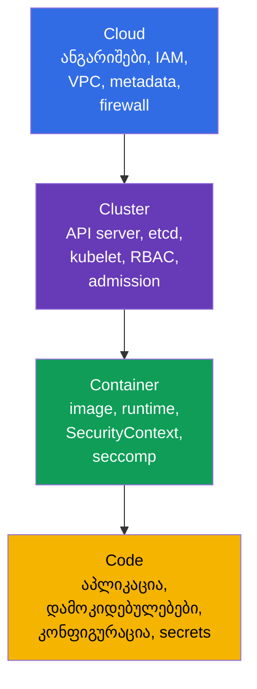
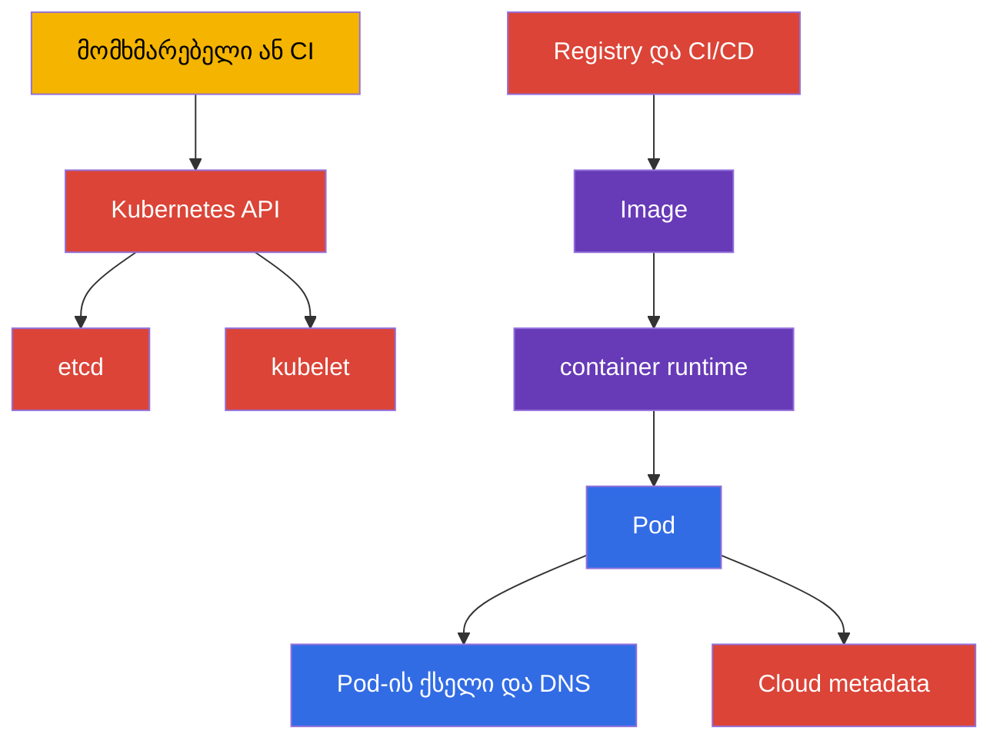
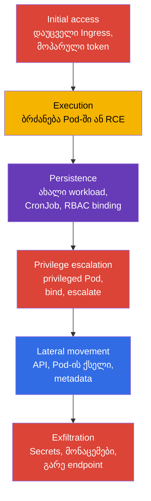
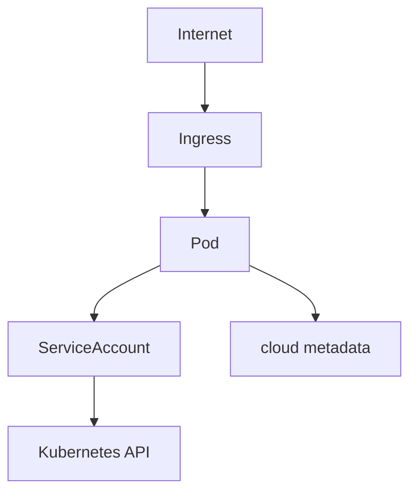
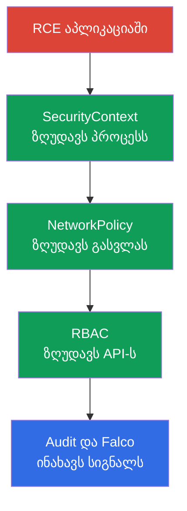

[Русская версия](ru.md) · [Eng version](README.md) · [Versión en español](es.md) · [Version française](fr.md) · [Deutsche Version](de.md) · [繁體中文版](tw.md) · [日本語版](jp.md)

# თავი 02. Kubernetes-ის უსაფრთხოების მოდელი: 4C, შეტევის ზედაპირი, შეტევის ფაზები

> **პრობლემა.** Kubernetes-ის ერთი შრის დაცვა ცრუ უსაფრთხოების განცდას ქმნის:
> NetworkPolicy არ ასწორებს საჯარო API-ს, ხოლო hardened container არ აგვარებს
> კოდის დაუცველობას ან ნოდის cloud credentials-ს. აქტივებისა და საზღვრების რუკის
> გარეშე გუნდი აწესრიგებს ჩვეულ პარამეტრებს და თავდამსხმელს უტოვებს უფრო სუსტ
> გზას Cloud, Cluster, Container ან Code-ის გავლით.

> **რა შემდეგ.** 01-ე თავში განისაზღვრა CKS-ის ფორმატი, დომენები და ინსტრუმენტები.
> ახლა საჭიროა საერთო მოდელი, რომლის მიხედვითაც ტექნიკური გადაწყვეტილებები
> მიიღება: რა უნდა დავიცვათ ზუსტად, ვისგან და რომელი შრით. ეს თავი საფუძველია
> CKS-ის ექვსივე დომენისთვის: Cluster Setup (15%), Cluster Hardening (15%),
> System Hardening (10%), Minimize Microservice Vulnerabilities (20%), Supply
> Chain Security (20%) და Monitoring, Logging and Runtime Security (20%).

> **რა გვჭირდება CKA-დან.** Control plane-ის, worker node-ის, kubelet-ის, CNI-ისა
> და API-სთან მოთხოვნის გზის მოწყობა განხილულია [CKA-ის 02-ე
> თავში](../../../cka/course/02/ge.md). აქ ისინი განხილულია მხოლოდ როგორც დაცვის
> ობიექტები და რისკის წყაროები.

> 🧠 4C ხსნის, რატომ არ ანაზღაურებს ერთი შრის დაცვა მეორის სისუსტეს.

## 02.1. მოდელი 4C: რას ვიცავთ

მოდელი 4C-ის დეტალური განხილვა ტერმინოლოგიასა და shared responsibility-ზე
ფოკუსით მოცემულია [KCSA კურსის 03-ე თავში](../../../kcsa/course/03/ge.md); აქ
მოდელი გამოიყენება პრაქტიკულად, როგორც checklist CKS-ის ტექნიკური
გადაწყვეტილებებისთვის და არ მეორდება თავიდან.

მოდელი **4C** Kubernetes-ის უსაფრთხოებას ყოფს ოთხ ჩალაგებულ შრედ: Cloud,
Cluster, Container და Code. გარეთა შრე არ ანაცვლებს შიდას. კომპრომეტირებული
workload შეიძლება შეიზღუდოს `NetworkPolicy`-თი და `SecurityContext`-ით, მაგრამ ეს
არ ასწორებს საჯარო API endpoint-ს ან workload-ისთვის ხელმისაწვდომ
container-runtime/CRI socket-ს. `docker.sock` მხოლოდ კერძო შემთხვევაა იმ ნოდებზე,
სადაც ნამდვილად გამოიყენება Docker; თანამედროვე კლასტერებში ჩვეულებრივია
containerd-ის ან CRI-O-ის socket-ები. და პირიქით, დაცული ქსელი არ ასწორებს
აპლიკაციის დაუცველობას.



| შრე | რა არის აქტივი | შეტევის ტიპური გზა | საბაზისო კონტროლი |
|---|---|---|---|
| Cloud | cloud provider-ის მონაცემები, VPC, metadata, დისკები და snapshot-ები | Pod ითხოვს `169.254.169.254`-ს და იღებს ნოდის როლს | არ დაუშვათ Pod-ის მიერ ნოდის credentials/identity-ის მიღება; გამოიყენეთ provider-specific workload identity და metadata controls, მინიმალური IAM-უფლებები და security group |
| Cluster | Kubernetes API, etcd, kubelet, PKI, RBAC | ანონიმური ან გადაჭარბებულად ავტორიზებული მოთხოვნა API-სთან | TLS, `RBAC`, anonymous access-ის გამორთვა, audit, აქტუალური ვერსიები |
| Container | image, container runtime, namespaces, პროცესები და ფაილური სისტემა | დაუცველი image, `privileged` Pod, container escape | მინიმალური image, `SecurityContext`, seccomp, AppArmor, `RuntimeClass` |
| Code | წყარო კოდი, დამოკიდებულებები, კონფიგურაცია და secrets | RCE აპლიკაციაში, Secret-ის გაჟონვა, მავნე დამოკიდებულება | review, dependency scan, SBOM, secrets-ის კოდში არ შენახვა, უსაფრთხო კონფიგურაცია |

4C სასარგებლოა როგორც შემოწმების თანმიმდევრობა. თუ pod-ს აქვს ყველა `Secrets`-ის
წაკითხვის უფლება, ჯერ Cluster-შრეს ასწორებენ - RBAC-ს. თუ pod-ის შიგნით პროცესს
შეუძლია დააინსტალიროს უტილიტა და ჩამოტვირთოს payload, საჭიროა Container-შრის
შეზღუდვები და egress-ის კონტროლი. თუ აპლიკაციის endpoint ღებულობს ნებისმიერ
ბრძანებას, არცერთი Kubernetes-მანიფესტი არ ჩაანაცვლებს Code-შრის გასწორებას.

> 🎯 თანმიმდევრობა Cloud → Cluster → Container → Code და თითოეული ნაბიჯის
> საბაზისო ბრძანებები.

### საზღვრების სწრაფი ინვენტარიზაცია

ზემოთ მოცემული 4C მოდელი ამბობს: გარეთა შრე არ იცვლება შიდათი, და გარეთა სუსტი
რგოლი ვერ ანაზღაურდება შიდა დაცვით. ესე იგი, ინვენტარიზაციაც იმავე
თანმიმდევრობით უნდა წავიდეს - **Cloud → Cluster → Container → Code** - და არა
ყველაზე ჩვეულით (Cluster). ქვემოთ - სტრატეგია თითოეული ოთხი შრისთვის: რას
ვამოწმებთ ზუსტად, რა ინსტრუმენტით შეიძლება ეს პრინციპში დანახვა და რომელი
ბრძანებები იძლევა პასუხს.

| შრე | რას ვინვენტარიზაციაობთ | რით მოწმდება | ნაბიჯები ქვემოთ |
|---|---|---|---|
| Cloud (ან ინფრასტრუქტურის provider) | საჯარო წვდომა API endpoint-თან, ნოდის identity და მისი უფლებები cloud-ში, metadata service-ის hardening, ქსელური საზღვარი, provider-ის მართვის პანელთან წვდომა | provider-ის CLI (საჭიროა ცალკე უფლებები მის ანგარიშში) + provider-დამოუკიდებელი ერთი შემოწმება კლასტერის შიგნიდან | ნაბიჯი 1 |
| Cluster | control plane-ის ვერსია და შესვლის წერტილები, ფართო RBAC-უფლებები, Pod-ის საშიში პარამეტრები, ნოდის ღია პორტები | `kubectl` და SSH ნოდაზე | ნაბიჯები 2-5 |
| Container | რომელი images ნამდვილად მუშაობს, mutable-ტეგები, დაუმტკიცებელი registry | `kubectl` | ნაბიჯი 6 |
| Code | დაუცველი დამოკიდებულებები CVE-ით, აპლიკაციის ექსპლუატირებადი ლოგიკური დაუცველობები (SSRF, injection, authorization-ის გვერდის ავლა, IDOR), კონფიგურაციის დაუცველი დეფოლტები, secrets კოდსა და მანიფესტში | `kubectl` ფარავს მხოლოდ ბოლო პუნქტს (secret მანიფესტში); დანარჩენი - SBOM, dependency scan, SAST, code review და pentest | ნაბიჯი 7 - ნაწილობრივ |

მნიშვნელოვანი შეზღუდვა პირდაპირ: `kubectl` ხედავს მხოლოდ იმას, რაც Kubernetes
API-ში მოხვდა, ამიტომ ინვენტარიზაცია ოთხივე შრეს ძალიან არათანაბრად ფარავს.
Cloud-შრეს ის ძირითადად საერთოდ არ ხედავს (IAM-როლები, VPC, snapshot-ები -
კლასტერის API-ს გარეთაა), ხოლო Code-შრეს - ყველაზე ნაკლებად: მანიფესტი აჩვენებს
`env`-ში ჩაწერილ secret-ს, მაგრამ პრინციპში არ აჩვენებს არც image-ში დაუცველ
ბიბლიოთეკას, არც SQL-injection-ს ან authorization-ის გვერდის ავლას აპლიკაციის
კოდში, არც წყაროებში hardcode-ილ secret-ს. ეს ქვემოთ მოცემული ბრძანებების
ნაკლი კი არ არის, არამედ თავად ინსტრუმენტის საზღვარი: Kubernetes API-მ არაფერი
იცის თქვენი აპლიკაციის შინაარსზე. Code-შრესთან სრულფასოვანი მუშაობა - ეს SBOM და
დამოკიდებულებების სკანირებაა (25-ე და 28-ე თავები), სტატიკური ანალიზი (27-ე
თავი), ხოლო აპლიკაციის ლოგიკური დაუცველობები საერთოდ არ წყდება CKS-ის
ინსტრუმენტებით: მათ პოულობენ code review, SAST/DAST და pentest, და ისინი
პასუხისმგებლობად რჩება დეველოპმენტს, არა პლატფორმის გუნდს. ქვემოთ მოცემული
ინვენტარიზაცია - საზღვრების სწრაფი სურათია კლასტერიდან ხელმისაწვდომი
მონაცემებით, და არა ოთხივე შრის სრული აუდიტი. ბრძანებები არაფერს ცვლიან და
შესაფერისია კლასტერთან ჩვეულებრივი ადმინისტრატორის წვდომისთვის; თითოეული ნაბიჯი
დამოუკიდებელია წინასგან.

**ნაბიჯი 1 (Cloud). ხელმისაწვდომია თუ არა cloud metadata endpoint Pod-ის
შიგნიდან.**

Cloud-შრე თითქმის მთლიანად Kubernetes API-ს გარეთაა, ამიტომ მისი
ინვენტარიზაცია ორ ნაწილად იყოფა: რისი შემოწმებაც შეიძლება კლასტერის შიგნიდან და
რა მოითხოვს provider-ის CLI-ს.

კლასტერის შიგნიდან მოწმდება ერთი კონკრეტული, კარგად ცნობილი რისკის კლასი:
შეუძლია თუ არა ნებისმიერ Pod-ს საერთოდ მიაღწიოს ნოდის metadata service-მდე და
პოტენციურად მოიპაროს მისი credentials. მისამართი `169.254.169.254` - link-local
IP-ია, ერთნაირი AWS-ში, GCP-ში, Azure-ში, Hetzner-ში და უმეტეს სხვა
provider-ებში, ამიტომ ქსელური მისაწვდომობის შემოწმება შეიძლება provider-დან
დამოუკიდებლად გაკეთდეს:

```bash
kubectl run metadata-probe --rm -i --restart=Never --image=curlimages/curl:8.11.1 -- \
  curl -s -o /dev/null -w 'http_code=%{http_code}\n' --max-time 2 http://169.254.169.254/
```

ბრძანება უშვებს ერთჯერად Pod-ს (`--rm` მას წაშლის დასრულებისთანავე) და
მიმართავს endpoint-ის **ძირს**, და არა კონკრეტული provider-ის გზას. ეს
პრინციპულია: საინტერესოა არა metadata-ს შინაარსი, არამედ ქსელური
მისაწვდომობის თავად ფაქტი. ნებისმიერი მიღებული HTTP-კოდი - `200`, `401`,
`403`, `404` - ნიშნავს, რომ endpoint-მა უპასუხა, ესე იგი Pod-მა მიაღწია: ეს
საგანგაშო სიგნალია, cloud-ის მიუხედავად. კოდი `000` ნიშნავს, რომ პასუხი
საერთოდ არ მოსულა (timeout ან კავშირის უარყოფა) - endpoint Pod-ისთვის
მიუწვდომელია, რაც hardening-ის მიზანია. ბრძანება არ კითხულობს და არ ინახავს
პასუხის სხეულს, მხოლოდ კოდს, ამიტომ ვერ წაიღებს შემთხვევით რეალურ credentials-ს
ლოგში.

თუ მისაწვდომობის აღმოჩენის შემდეგ საჭიროა გავიგოთ, ზუსტად რა იკითხება იქიდან,
შემდეგ უკვე კონკრეტული provider-ის გზისა და header-ის გამოყენება მოგიწევთ -
ისინი ერთმანეთთან შეუთავსებელია:

| Provider | გზა | სავალდებულო header |
|---|---|---|
| AWS (EC2 IMDS) | `/latest/meta-data/` | არაფერი IMDSv1-ისთვის; IMDSv2-ისთვის საჭიროა token, მიღებული ცალკე `PUT /latest/api/token`-ით |
| GCP | `/computeMetadata/v1/` | `Metadata-Flavor: Google` |
| Azure | `/metadata/instance?api-version=2021-02-01` | `Metadata: true` |
| Hetzner Cloud | `/hetzner/v1/metadata` | არაფერი |

სწორედ ამ განსხვავებების გამო ზემოთ მოცემული შემოწმება შეგნებულად არ არის
მიბმული არცერთ გზაზე: ბრძანება `/latest/meta-data/`-თი GCP-სა და Azure-ზე `404`-ს
გასცემდა და არასწორად აღიქმებოდა როგორც "მიუწვდომელი", თუმცა endpoint ნამდვილად
პასუხობს. header-ის მოთხოვნა (`Metadata-Flavor`, `Metadata: true`) - ეს
დაცვაა უმარტივესი SSRF-საგან, და არა Pod-ისგან: Pod-ს შეუძლია ნებისმიერი header
თავად გაუგზავნოს, ამიტომ header-ის არსებობა არ აუქმებს ქსელური გზის დახურვის
საჭიროებას.

**მნიშვნელოვანია არ აგვერიოს ორი განსხვავებული დასკვნა.** „Endpoint
მისაწვდომია" და „credentials მიღებულია" - ერთი და იგივე არ არის, და მათი
შერევა ანგარიშში არ შეიძლება:

- *მისაწვდომობა* - ეს **აღმოჩენა და წინაპირობაა**: ქსელური გზა Pod-იდან
  metadata service-მდე დახურული არ არის. ეს საკმარისია, რომ დაისვას გასწორების
  ამოცანა, მაგრამ თავისთავად არ ამტკიცებს კომპრომეტაციას.
- *Credentials-ის ამოღებადობა* - ეს **დადასტურებული ექსპლუატაციის გზაა**, და
  მოითხოვს, რომ სხვა provider-ის პირობებიც შესრულდეს.

განსხვავების კარგი მაგალითია AWS. `HttpTokens=required`-ის (IMDSv2-only)
შემთხვევაში მიმართვა token-ის გარეშე არაფერს მისცემს, ხოლო token ცალკე
`PUT`-ით მოითხოვება, რომლის პასუხი ცხოვრობს ზუსტად `HttpPutResponseHopLimit`
ქსელურ hop-ს. hop limit `1`-ის შემთხვევაში პასუხი არ აღწევს Pod-ს საკუთარი
network namespace-ით - ესე იგი, endpoint პასუხობს, probe აჩვენებს
მისაწვდომობას, მაგრამ token-ის, და მაშასადამე credentials-ის, მიღება ვერ
ხერხდება. გაითვალისწინეთ, რომ `hostNetwork: true`-იანი Pod დამატებითი hop-ი
არ არის, ამიტომ მისთვის ეს შეზღუდვა არ მუშაობს. პრაქტიკული დასკვნა: დაფიქსირეთ
მისაწვდომობა როგორც ცალკე ფაქტი, ხოლო credentials-ის მოპარვის დასკვნა
გააკეთეთ მხოლოდ provider-ის კონკრეტული პარამეტრების შემოწმების შემდეგ.

ამ შრეზე დანარჩენი მოითხოვს provider-ის CLI-ს და ცალკე უფლებებს მის
ანგარიშში - `kubectl` ამ ობიექტებს პრინციპში ვერ ხედავს.

> 🏭 Provider-specific CLI საჯარო API-წვდომისა და metadata service-ის
> hardening-ის შესამოწმებლად.

კითხვები ყველა provider-თან ერთნაირია, განსხვავდება მხოლოდ ბრძანებები:

1. ღიაა თუ არა Kubernetes API ინტერნეტში და რომელი ქსელებიდან?
2. რომელი identity-ა მიბმული ნოდებზე და რისი გაკეთება შეუძლია მას cloud-ში,
   თუ Pod-ის მეშვეობით მოიპარავენ?
3. ჩართულია თუ არა metadata service-ის hardening (AWS-ს - IMDSv2-only და
   შეზღუდული hop limit; GCP/Azure-ს - header-ის მოთხოვნა პლუს ქსელური წესები)?
4. ვის შეუძლია ნოდის, დისკის, snapshot-ის ან ქსელური წესის შექმნა/შეცვლა
   Kubernetes-ის გარეთ?

მაგალითი AWS/EKS-სთვის (GCP-ზე ეს არის `gcloud container clusters describe` და
`gcloud compute instances describe`, Azure-ზე - `az aks show` და `az vm show`;
კითხვები იგივეა, გამონატანი და ველების სახელები - სხვადასხვა):

```bash
# კითხვა 1: ჩანს თუ არა API server ინტერნეტიდან და ვისთვის
aws eks describe-cluster --name "$CLUSTER" \
  --query 'cluster.resourcesVpcConfig.{public:endpointPublicAccess,private:endpointPrivateAccess,cidrs:publicAccessCidrs}'

# კითხვა 3: hop limit `1` - security-first დეფოლტია; `2` მხოლოდ იქ მოწმდება,
# სადაც Pod-ს დასაბუთებულად სჭირდება თავად მიმართოს IMDS-ს
aws ec2 describe-instances --filters "Name=tag:eks:cluster-name,Values=$CLUSTER" \
  --query 'Reservations[].Instances[].{id:InstanceId,imds:MetadataOptions.HttpTokens,hop:MetadataOptions.HttpPutResponseHopLimit}'
```

AWS EKS Best Practices Guide ორ სხვადასხვა შემთხვევას გამოყოფს, და ისინი
ერთ "baseline"-ად ვერ დაიყვანება. თუ Pod-მა არ უნდა მემკვიდრეობით მიიღოს ნოდის
instance profile-ის უფლებები (ჩვეულებრივი შემთხვევა IRSA/EKS Pod Identity-ით),
დოკუმენტაცია პირდაპირ გვირჩევს `HttpTokens=required`-ს და
`HttpPutResponseHopLimit=1`-ს განყოფილებაში "Restrict access to the instance
profile assigned to the worker node" - სწორედ ეს ბლოკავს Pod-ის მეშვეობით
ნოდის credentials-ის მიღებას. მნიშვნელობას `HttpPutResponseHopLimit=2`
დოკუმენტაცია ცალკე და მხოლოდ მაშინ გვირჩევს, როცა აპლიკაციას ნამდვილად
სჭირდება საკუთარი წვდომა IMDS-თან ("When your application needs access to
IMDS... increase the hop limit to 2") - ეს დასაბუთებული გამონაკლისია, და არა
საერთო security baseline ყველა container workload-ისთვის.

**ცალკე შემთხვევა: self-managed კლასტერი „ჩვეულებრივ" სერვერებზე** (kubeadm
bare metal-ზე, VM Hetzner-სა და მსგავსში).

> 🔬 Self-managed კლასტერის შემოწმება.

აქ შეიძლება საერთოდ არ იყოს cloud IAM - მოსაპარი ნოდისგან cloud-როლების
გაგებით არაფერია, და კითხვა 2 ნაწილობრივ იხსნება. მაგრამ Cloud-შრე არ ქრება,
ის იცვლება ინფრასტრუქტურის provider-ის შრით, და კითხვები ასეთი ხდება:
მისაწვდომია თუ არა API server და SSH ინტერნეტიდან თუ მხოლოდ პირადი ქსელიდან;
ვის აქვს წვდომა provider-ის მართვის პანელთან (სერვერების შექმნა/წაშლა,
კონსოლთან და snapshot-ებთან წვდომა - ეს ნოდებზე ფაქტობრივი root-ია); აქვს თუ
არა provider-ს საკუთარი metadata endpoint მგრძნობიარე მონაცემებით (Hetzner-ში
ეს არის `169.254.169.254/hetzner/v1/metadata`, სადაც შეიძლება ინახებოდეს, სხვათა
შორის, cloud-init user data); დახურულია თუ არა ტრაფიკი სერვერებს შორის
provider-ის ქსელური წესებით, და არა მხოლოდ `NetworkPolicy`-თი კლასტერის
შიგნით. ზემოთ მოცემული `metadata-probe`-ის შემოწმება აქაც ისევე
გამოსადეგია - ის cloud-ზე მიბმული არ არის.

**ნაბიჯი 2 (Cluster). Control plane-ის შესვლის წერტილები და ვერსია.**

```bash
kubectl cluster-info
kubectl get --raw=/version
```

`kubectl cluster-info` აჩვენებს API server-ისა და დამხმარე სერვისების
მისამართს - ეს პირველი შესვლის წერტილია, რომელსაც ხედავს კლასტერის ნებისმიერი
კლიენტი. `kubectl get --raw=/version` აბრუნებს Kubernetes control plane-ის
ზუსტ ვერსიას: ეს საჭიროა, რომ შემდეგ შემოწმდეს ხელმისაწვდომი flag-ები და
ცნობილი CVE-ები სწორედ ამ ვერსიისთვის, და არა შემთხვევითი release-ის
დოკუმენტაციით გამოცნობა.

**ნაბიჯი 3 (Cluster). ვის აქვს ფართო cluster-wide უფლებები.**

```bash
kubectl get clusterrolebinding -o jsonpath='{range .items[?(@.roleRef.name=="cluster-admin")]}{.metadata.name}{"\t"}{range .subjects[*]}{.kind}:{.name}{" "}{end}{"\n"}{end}'
```

ეს ბრძანება გამოაქვს მხოლოდ ის `ClusterRoleBinding`, რომლებიც მიუთითებენ
ჩაშენებულ როლზე `cluster-admin` - კლასტერში ყველაზე ფართო როლზე, რომელიც
სრულ წვდომას იძლევა ყველა რესურსზე. თითოეული ნაპოვნი binding-ისთვის სტრიქონი
აჩვენებს მის სახელს, შემდეგ - subjects-ის სიას (`User`, `Group` ან
`ServiceAccount`), რომლებზეც ეს როლი მინიჭებულია. შიდა `range` `.subjects[*]`-ზე
საჭიროა, რადგან ერთი binding შეიძლება ერთდროულად რამდენიმე subject-ზე
მიუთითებდეს.

**შემოწმება მხოლოდ სახელით `cluster-admin` საკმარისი არ არის.** წვდომის დონეს
განსაზღვრავს არა როლის სახელი, არამედ მისი წესებისა და binding-ის მოქმედების
არეალის ერთობლიობა. `ClusterRole` `apiGroups: ["*"]`, `resources: ["*"]` და
`verbs: ["*"]`-ით თავისთავად აღწერს უფლებების ნაკრებს - პრაქტიკულად
შეუზღუდავ წვდომას Kubernetes resource API-სთან, - მაგრამ ფაქტობრივი
მოქმედების არეალი დამოკიდებულია იმაზე, რითი მიაბეს ეს როლი: `ClusterRoleBinding`
მას ხდის cluster-wide-ს ყველა namespace-ში, ხოლო `RoleBinding`, რომელიც
იმავე `ClusterRole`-ზე მიუთითებს, namespaced-უფლებებს ზღუდავს იმ namespace-ით,
სადაც ეს `RoleBinding` შეიქმნა. ამ მექანიზმის საშუალებით ერთი წესების ნაკრები
რამდენიმე namespace-ში შეიძლება ხელახლა გამოყენებული იქნეს, ერთნაირი `Role`-ების
შექმნის ნაცვლად; ამასთან `ClusterRole` გამოიყენება cluster-scoped რესურსებზე
(მაგალითად `nodes`) უფლებებისთვის, non-resource endpoint-ებზე (`/healthz`) და
`ClusterRoleBinding`-ის მეშვეობით cluster-wide წვდომისთვის. რეალურ
კლასტერებში ასეთი როლები მუდმივად ჩნდება: უწყინარი სახელებით, როგორიცაა
`platform-superuser`, `ci-deployer` ან `monitoring-full`, შექმნილი „უბრალოდ
რომ იმუშაოს" ან განზრახ, სიტყვა `cluster-admin`-ის მიხედვით review-ის გვერდის
ასავლელად. ძებნა სახელით მათ საერთოდ ვერ დაინახავს, ხოლო ძებნა მხოლოდ როლის
წესებით, binding-ის შემოწმების გარეშე, არასწორ რისკის შეფასებას მისცემს:
ფართო უფლებები, მიბმული `RoleBinding`-ით ერთ namespace-ში, სხვა მასშტაბის
საფრთხეა, ვიდრე იგივე უფლებები `ClusterRoleBinding`-ის მეშვეობით.

ზუსტად რომ ვთქვათ, ასეთი როლი **არ არის სიტყვასიტყვითი ეკვივალენტი**
ჩაშენებული `cluster-admin`-ის: მის განსაზღვრებაში ორი წესია, და არა ერთი -
wildcard რესურსებზე და ცალკე wildcard-წესი `nonResourceURLs`-ზე, რომელიც
ფარავს non-resource endpoint-ებს, როგორიცაა `/healthz`, `/metrics` და
`/debug/*`. როლი მეორე წესის გარეშე ამ გზებს არ იძლევა, ასევე შეიძლება
შეიზღუდოს `resourceNames`-ით ან შეიცვალოს agregation-ით (`aggregationRule`).
პრაქტიკულად კი, triage-ის თვალსაზრისით, სხვაობა უმნიშვნელოა: API-ს ყველა
რესურსზე კონტროლი უკვე მოიცავს ყველა Secret-ის წაკითხვას, Pod-ის შექმნას
ნებისმიერ ნოდაზე და RBAC-ის რედაქტირებას, ესე იგი გზას კლასტერის სრული
ხელში ჩაგდებისკენ. Kubernetes-ის ოფიციალური დოკუმენტაციაც ასეთი მაგალითისთვის
სიფრთხილით აყალიბებს ფრაზას - "similar to the built-in `cluster-admin` role",
და არა "identical". პრაქტიკული დასკვნა ამით არ იცვლება: ძებნა უფლებებით უნდა
მოხდეს, არა სახელით.

```bash
# ნაბიჯი A: ვიპოვოთ ყველა ClusterRole, სახელის მიუხედავად, სრული wildcard-უფლებებით
kubectl get clusterroles -o json | jq -r '
  .items[]
  | select(any(.rules[]?;
      ((.apiGroups // []) | index("*")) and
      ((.resources // []) | index("*")) and
      ((.verbs // []) | index("*"))))
  | .metadata.name
'
```

```bash
# ნაბიჯი B: ვიპოვოთ binding, რომლებიც მიუთითებენ ნებისმიერ ნაპოვნ როლზე
dangerous=$(kubectl get clusterroles -o json | jq -r '
  .items[]
  | select(any(.rules[]?;
      ((.apiGroups // []) | index("*")) and
      ((.resources // []) | index("*")) and
      ((.verbs // []) | index("*"))))
  | .metadata.name
')

kubectl get clusterrolebinding -o json \
  | jq -r --argjson names "$(echo "$dangerous" | jq -R . | jq -s .)" '
      .items[]
      | select(.roleRef.name as $r | $names | index($r))
      | "\(.metadata.name) -> როლი \(.roleRef.name) (cluster-wide), subjects: \([.subjects[]? | "\(.kind):\(.name)"] | join(", "))"
    '

# ნაბიჯი B': იგივე როლი შეიძლება RoleBinding-ითაც იყოს მიბმული - მაშინ უფლებები
# მხოლოდ ერთ namespace-ში მოქმედებს, მაგრამ ეს ზემოთ ClusterRoleBinding-ის
# ძებნითაც არ "დანახულა"
kubectl get rolebinding -A -o json \
  | jq -r --argjson names "$(echo "$dangerous" | jq -R . | jq -s .)" '
      .items[]
      | select(.roleRef.kind == "ClusterRole" and (.roleRef.name as $r | $names | index($r)))
      | "\(.metadata.name) (namespace \(.metadata.namespace)) -> როლი \(.roleRef.name) (მხოლოდ ამ namespace-ში), subjects: \([.subjects[]? | "\(.kind):\(.name)"] | join(", "))"
    '
```

ნაბიჯი A ამოწმებს როლის თითოეულ წესს: სრული წვდომა არსებობს, თუ ერთ წესში
ერთდროულად არის `*` `apiGroups`-ში, `*` `resources`-ში და `*` `verbs`-ში.
`any(.rules[]?; ...)` მნიშვნელოვანია - საშიში წესი შეიძლება არა პირველი
იყოს სიაში, არამედ მეორე ან მესამე, უწყინარების გვერდით. ნაბიჯები B და B'
იღებენ ნაპოვნ სახელებს და აჩვენებენ, რომელი binding იყენებს მათ ნამდვილად,
ვისთვის და რა scope-ით: `ClusterRoleBinding` cluster-wide წვდომას იძლევა, ხოლო
`RoleBinding` იმავე `ClusterRole`-ზე მას ერთი namespace-ით ზღუდავს - ეს
სხვადასხვა მასშტაბის საფრთხეა ერთნაირი როლის წესებით, და ორივე ტიპის binding-ის
რომელიმეს გამოტოვება არასრულ სურათს იძლევა. მიუბმელი საშიში როლიც review-ის
პრობლემაა, მაგრამ მიბმული ნიშნავს, რომ უფლებები უკვე ვინმეზეა გაცემული.

ცალკე ღირს ვაკვირდეთ უფრო ვიწრო, მაგრამ მაინც საშიშ შაბლონებს, რომლებიც
სრული wildcard-ის ქვეშ არ ხვდება:

```bash
kubectl get clusterroles -o json | jq -r '
  .items[]
  | .metadata.name as $name
  | .rules[]?
  | select(((.verbs // []) | index("*"))
      and (((.apiGroups // []) | index("*") | not) or ((.resources // []) | index("*") | not)))
  | "\($name): verbs=* — apiGroups=\(.apiGroups // []) resources=\(.resources // [])"
'
```

მაგალითად, `verbs: ["*"]` მხოლოდ `secrets`-ზე არ არის `cluster-admin`, მაგრამ
საშუალებას იძლევა წაკითხვისა და შეცვლისთვის კლასტერის ყველა secret-ისთვის -
ბევრი threat model-ისთვის ეს სრული კომპრომეტაციის ტოლფასია. ანალოგიურად
საშიშია `create` `pods`-ზე ფართო `hostPath`-ნებართვასთან ერთად admission-დონეზე,
`escalate`/`bind` როლებზე და `impersonate` მომხმარებლებზე: ისინი გზას იძლევა
პრივილეგიების ამაღლებისკენ, თუნდაც თავად როლი ვიწრო ჩანდეს. ასეთი შაბლონების
სრული განხილვა - [10-ე თავში](../10/ge.md).

> **გამოცდაზე.** ჩაბუდებული `range` ფილტრით `?(@.roleRef.name==...)` ერთ
> jsonpath-გამოსახულებაში - სწორედ ის, რისგანაც აფრთხილებს ნაბიჯი 4: სწრაფად
> ბეჭდვისას ადვილია ფრჩხილის ან ბრჭყალის დაკარგვა. უფრო საიმედოა შემოწმების
> გაყოფა მარტივ ციკლად, სადაც თითოეული `kubectl`-ის გამოძახება ითხოვს მხოლოდ
> ერთ ველს, ფილტრებისა და ჩაბუდების გარეშე:
>
> ```bash
> for crb in $(kubectl get clusterrolebinding -o name | cut -d/ -f2); do
>   role=$(kubectl get clusterrolebinding "$crb" -o jsonpath='{.roleRef.name}')
>   if [[ "$role" == "cluster-admin" ]]; then
>     echo "$crb:"
>     kubectl get clusterrolebinding "$crb" -o jsonpath='{range .subjects[*]}{.kind}:{.name}{" "}{end}'
>     echo
>   fi
> done
> ```
>
> `kubectl get clusterrolebinding -o name` ბეჭდავს სახელებს ფორმით
> `clusterrolebinding.rbac.authorization.k8s.io/<სახელი>`; `cut -d/ -f2`
> ტოვებს მხოლოდ სახელს `/`-ის შემდეგ. თითოეული `kubectl get clusterrolebinding
> "$crb" -o jsonpath='{.roleRef.name}'` ამოწმებს ზუსტად ერთ მარტივ ველს ერთი
> კონკრეტული binding-ისთვის - აქ არც `?(...)` ფილტრია და არც ჩაბუდებული
> `range` თავად binding-ების ასარჩევად, მხოლოდ subjects-ისთვის ნაპოვნი
> დამთხვევის შიგნით, რაც შესამჩნევად უფრო ადვილია თვალით გადამოწმება გაშვებამდე.
> უფრო ნელია, ვიდრე ზემოთ მოცემული one-liner (ცალკე მოთხოვნა API-სთან
> თითოეულ binding-ზე), მაგრამ საგამოცდო კლასტერზე ჩვეულებრივ binding ათასობით
> არ არის, და ბეჭდვის საიმედოობის სხვაობა უფრო მნიშვნელოვანია, ვიდრე წამების
> სხვაობა.

**ნაბიჯი 4 (Cluster). Workload-ები აშკარა საშიში ნიშნებით.**

> 🎯 ვიპოვოთ Pod `privileged`-ით, `hostNetwork/hostPID/hostIPC`-ით,
> `hostPath`-ით, დამატებული capabilities-ით ან `runAsUser: 0`-ით.

> **გამოცდაზე.** ქვემოთ მოცემული სრული ვერსია (ცალკე `def`-ფუნქციებით
> შემოწმების თითოეულ დონეზე) - სასწავლოა: ის ერთდროულად აჩვენებს ექვსივე
> ნიშანს და იმას, თუ რატომაა ისინი ლოგიკურად დაკავშირებული, და არა იმას, რაც
> რეალურად ღირს დაბეჭდო ტაიმერის ქვეშ. თუნდაც მოკლე `jq`-ფილტრი ჩაბუდებული
> `select`-ით და მასივებით ადვილად ფუჭდება ერთი გამოტოვებული ფრჩხილით, სწორედ
> მაშინ, როცა დროის გამო ნერვიულობთ - წნევის ქვეშ უფრო საიმედოა დაწეროთ
> *ნაკლებად ელეგანტური*, მაგრამ სინტაქსურად თითქმის შეუძლებელი დასაფუჭებელი
> ვარიანტი `grep`-ის მეშვეობით. მაგალითად, დავალებისთვის "იპოვეთ ყველა Pod
> hostNetwork-ით namespace `prod`-ში":
>
> ```bash
> NS=prod
>
> for pod in $(kubectl get pods -n "$NS" -o jsonpath='{.items[*].metadata.name}'); do
>   if kubectl get pod "$pod" -n "$NS" -o json | grep hostNetwork | grep -q true; then
>     echo "$pod"
>   fi
> done
> ```
>
> იდეა: მივიღოთ Pod-ების სახელების სია ერთი მარტივი ბრძანებით, შემდეგ ციკლში
> თითო Pod-ისთვის მივიღოთ მისი JSON და გავფილტროთ საჭირო ველი - თუ ნაპოვნია,
> დავბეჭდოთ სახელი. Namespace პირველივე სტრიქონში ცვლადში `NS` არის
> გატანილი: ის ბრძანებაში ორჯერ გვხვდება, და ტაიმერის ქვეშ ადვილია ერთი
> გამოძახების შესწორება, მეორის დავიწყებით - მაშინ სკრიპტი ჩუმად დაიწყებს
> ერთი namespace-ის Pod-ის ძებნას მეორეში. ცვლადით შესწორება ერთია, და ის
> თავშივეა, სადაც ჩანს. ორი `grep` pipe-ში ხდის შემოწმებას ზუსტს, ამასთან
> მარტივად რჩება: პირველი ტოვებს მხოლოდ სტრიქონს `hostNetwork`-ით, მეორე
> ამოწმებს, რომ მასში სწორედ `true` არის. ასე გამოირიცხება `"hostNetwork":
> false` - ველი არსებობს, მაგრამ რისკი არ არის. `grep -q` არაფერს ბეჭდავს,
> მხოლოდ აბრუნებს წარმატება/წარუმატებლობის კოდს `if`-ისთვის. ეს მუშაობს
> იმიტომ, რომ `kubectl -o json` ბეჭდავს pretty-printed JSON-ს - თითოეული ველი
> საკუთარ სტრიქონზეა, ამიტომ მეორე `grep`-ში ხვდება მხოლოდ სტრიქონი
> `hostNetwork`, და არა მეზობელი ველები. ამ მიდგომას namespace-ში Pod-ების
> დიდი რაოდენობისას იგივე მასშტაბის შეზღუდვები აქვს, რაც ამ გვერდის სხვა
> ვარიანტებს (იხ. ზემოთ 10 000 Pod-ის შესახებ განყოფილება) - მაგრამ საგამოცდო
> namespace-ისთვის, რომელშიც რამდენიმე ან ათეულამდე Pod-ია, ამას მნიშვნელობა
> არ აქვს, და თავად ბრძანება თითქმის არ ფუჭდება, თუნდაც სწრაფად და ჩანახატის
> გარეშე დაბეჭდო. იგივე ხერხი ნებისმიერი ბულევი ველისთვის მუშაობს: შეცვალეთ
> `hostNetwork` `hostPID`-ით, `hostIPC`-ით ან `privileged`-ით.

იდეა: გავიაროთ ყველა Pod ყველა namespace-ში და დავტოვოთ მხოლოდ ისინი,
რომლებსაც აქვთ სულ ცოტა ერთი ცნობილი საშიში ნიშანი - ესე იგი, პარამეტრები,
რომლებიც ამცირებენ container-ის იზოლაციას. ნიშნები მოწმდება როგორც მთლიანი
Pod-ის, ისე თითოეული ცალკეული container-ის დონეზე:

| დონე | ნიშანი | რატომაა ეს რისკი |
|---|---|---|
| Pod | `hostNetwork`, `hostPID` ან `hostIPC` | Pod უზიარებს ქსელურ სტეკს, პროცესებს ან IPC-ს თავად ნოდას - იზოლაცია ნაწილობრივ მოხსნილია |
| Pod | `hostPath` ტიპის volume | container იღებს პირდაპირ წვდომას ნოდის ფაილურ სისტემასთან |
| Container | `privileged: true` | container იღებს თითქმის ყველა kernel-პრივილეგიას, როგორც პროცესს host-ზე |
| Container | `allowPrivilegeEscalation: true` | container-ის შიგნით პროცესს შეუძლია მიიღოს მეტი უფლება, ვიდრე ჰქონდა სტარტისას |
| Container | დამატებული `capabilities` | container-ს პირდაპირ ეძლევა პრივილეგიები მინიმალურ ნაკრებზე მეტი |
| Container | `runAsUser: 0` (Pod-ზე ან container-ზე) | პროცესი მუშაობს როგორც root container-ის შიგნით |

რეალიზაცია ეძებს ზუსტად ამ ნიშნებს `jq`-ს მეშვეობით და ბეჭდავს მხოლოდ იმ
Pod-ებს, სადაც სულ ცოტა ერთი ჩართულა - დანარჩენები საერთოდ არ გამოდის, რომ
ასობით უსაფრთხო Pod-ის სიაში არ ჩაიძიროთ.

**რატომ აკეთებს ამას `jq`, და არა `--field-selector` ან `-o jsonpath`.**
ლოგიკური კითხვაა - ხომ არ შეიძლება საშიში ნიშნების პირდაპირ API server-ზე
გაფილტვრა, რომ საერთოდ არ გადავცეთ კლიენტს უსაფრთხო Pod-ების JSON? ნაწილობრივ
შეიძლება, მაგრამ არა მთლიანად. `--field-selector` Pod-ისთვის უჭერს მხარს
ვიწრო, API server-ში ჩაქსოვილ ველების სიას: `metadata.name`,
`metadata.namespace`, `spec.nodeName`, `spec.restartPolicy`,
`spec.schedulerName`, `spec.serviceAccountName`, `spec.hostNetwork`,
`status.phase`, `status.podIP`, `status.podIPs`, `status.nominatedNodeName`
(შემოწმებულია Kubernetes-ის ოფიციალური დოკუმენტაციით; სია შეიძლება
განსხვავდებოდეს ვერსიებს შორის, და `kubectl` დააბრუნებს `BadRequest`-ს, თუ
მიუთითებთ მხარდაუჭერელ ველს). `spec.hostNetwork` მასში **არის** - ესე იგი,
ამ ერთი შემოწმების სერვერზე გატანა შეიძლება. მაგრამ `hostPID`, `hostIPC`,
`privileged`, `allowPrivilegeEscalation`, დამატებული `capabilities`,
`hostPath`-volume და `runAsUser` ამ სიაში არ შედის - server-side მათი
გაფილტვრა ვერ მოხერხდება, და ამაზე გათვლა უახლოეს პერსპექტივაში არ ღირს:
ველების ნაკრები API server-ის კოდში დგინდება და არ არის ღია ნებისმიერი
გამოსახულებისთვის. ეს ფორმულირება შეგნებულად არის მიბმული ვერსიაზე:
მოცემული სია შეესაბამება კურსის baseline-ის დოკუმენტაციას (Kubernetes v1.36),
და სწორი ჩვევაა, ეჭვის შემთხვევაში, ის თქვენი ვერსიის დოკუმენტაციაში
შემოწმდეს და არა სამუდამოდ დაზეპირდეს. `-o jsonpath`-იც არ წყვეტს ამოცანას:
მას შეუძლია პროექცია და ერთი ველით ფილტრაცია `?(@.field==value)`-ის მეშვეობით,
მაგრამ არ შეუძლია რამდენიმე პირობის "ან"-ით შეერთება ერთ გამოსახულებაში და
არ შეუძლია ერთდროულად `spec.containers[]`, `spec.volumes[]` და
`spec.securityContext`-ის ნახვა საერთო ლოგიკით - სწორედ ამისთვის საჭიროა
ენა სრულფასოვანი ბულევი გამოსახულებებით, ესე იგი `jq` (ან მისი
კლიენტის-მხრიდანი ანალოგი). დამატებით შეიძლება `status.phase` `Running`-მდე
შევამციროთ, თუ დასრულებული Pod-ები ამ შემოწმებისთვის საინტერესო არ არის.
ორივე server-side ოპტიმიზაცია მძიმით ერთდება ერთ `--field-selector`-ში:

```bash
kubectl get pods -n "$ns" --field-selector=status.phase=Running -o json
```

ეს არ ცვლის `jq`-ს, არამედ ამცირებს JSON-ის მოცულობას, რომელიც მასამდე
აღწევს: სერვერი უკვე აღარ გაუგზავნის კლიენტს დასრულებულ Pod-ებს, ხოლო
თავად `jq` განაგრძობს იმ დანარჩენი ნიშნების შემოწმებას, რომელთა
server-side გაფილტვრაც არ შეიძლება. ქვემოთ `jq` განაგრძობს `hostNetwork`-ის
შემოწმებას სხვა ნიშნებთან ერთად, თუმცა ფორმალურად ის ცალკე
`--field-selector`-ის მოთხოვნაში შეიძლებოდა გატანილიყო: ცალ-ცალკე
მოთხოვნები თითოეულ ნიშანზე სკრიპტს გაცილებით უფრო გაართულებდა, ვიდრე
შვიდიდან ერთი ველის დაზოგვა ამართლებს, ხოლო ერთიანი შემოწმება ერთ
`jq`-გამოსახულებაში უფრო გასაგები და მარტივად შესანარჩუნებელი რჩება.

**მნიშვნელოვანია მასშტაბზე.** აქ ღირს ორი განსხვავებული დატვირთვის
გარჩევა, რადგან ისინი ხშირად ერევათ ერთმანეთში. API server-ის მხარეს ყველაფერი
ისე საშინელი არ არის, როგორც ჩანს: `kubectl get` დეფოლტად დიდ სიებს
**ნაწილებად** ითხოვს - flag `--chunk-size` დეფოლტური მნიშვნელობით `500`
(„Return large lists in chunks rather than all at once"), ესე იგი 10 000 Pod
მიღებული იქნება დაახლოებით ოცი თანმიმდევრული მოთხოვნით, და არა ერთი გიგანტური
მოთხოვნით. ამ პაგინაციის გამორთვა შესაძლებელია მხოლოდ პირდაპირ,
`--chunk-size=0`-ის გადაცემით.

პრობლემა სხვაგანაა: ნაწილები იკრიბება **კლიენტზე**. `kubectl` მათ აწებებს
ერთ JSON-დოკუმენტად, ხოლო `jq` ელოდება მის სრულად მიღებას, სანამ ერთ
სტრიქონსაც კი გამოსცემს. პროდზე ათასობით Pod-ით ეს თქვენი სამუშაო
მანქანის მეხსიერებაში ასობით MB-ია და წუთები ლოდინის უკუკავშირის გარეშე -
`kubectl`-ის ან `jq`-ის პროცესის OOM-მდე ჩათვლით. ამიტომ namespace-ების
ციკლში ერთ-ერთზე გავლა სასარგებლოა არა API server-ის განტვირთვისთვის
(ამას chunking უზრუნველყოფს), არამედ იმისთვის, რომ **მთელი კლასტერი ერთდროულად
მეხსიერებაში არ შევინახოთ** და შედეგი inkrement-ულად, namespace-ის
namespace-ზე მივიღოთ:

```bash
for ns in $(kubectl get ns -o jsonpath='{.items[*].metadata.name}'); do
  kubectl get pods -n "$ns" --field-selector=status.phase=Running -o json | jq -r --arg ns "$ns" '
    def containers:
      (.spec.containers // [])
      + (.spec.initContainers // [])
      + (.spec.ephemeralContainers // []);

    # true/false-ის ნაცვლად container-ის თითოეული შემოწმება აბრუნებს
    # კონკრეტული ჩართული ნიშნების ᲡᲘᲐს container-ის სახელთან ერთად -
    # ამის გარეშე გამონატანში სხვადასხვა ნიშნების გარჩევა შეუძლებელი იქნებოდა.
    def container_reasons:
      [
        (if .securityContext.privileged == true then "privileged:\(.name)" else empty end),
        (if .securityContext.allowPrivilegeEscalation == true then "allowPrivilegeEscalation:\(.name)" else empty end),
        (if ((.securityContext.capabilities.add // []) | length > 0)
          then "capabilities.add=\((.securityContext.capabilities.add // []) | join(",")):\(.name)"
          else empty end),
        (if .securityContext.runAsUser == 0 then "runAsUser=0:\(.name)" else empty end)
      ];

    # ანალოგიურად მთელი Pod-ისთვის: Pod-დონის მიზეზების სია პლუს თითოეული
    # container-ის მიზეზები, გაერთიანებული ერთ ბრტყელ სიაში.
    def pod_reasons:
      [
        (if .spec.hostNetwork == true then "hostNetwork" else empty end),
        (if .spec.hostPID == true then "hostPID" else empty end),
        (if .spec.hostIPC == true then "hostIPC" else empty end),
        (if .spec.securityContext.runAsUser == 0 then "pod.runAsUser=0" else empty end),
        (if ([.spec.volumes[]? | select(.hostPath != null)] | length > 0)
          then "hostPath=\([.spec.volumes[]? | select(.hostPath != null) | .hostPath.path] | join(","))"
          else empty end)
      ] + [containers[]? | container_reasons[]];

    .items[]
    | (pod_reasons) as $reasons
    | select($reasons | length > 0)
    | "\($ns)/\(.metadata.name): \($reasons | join("; "))"
  '
done
```

შემოწმების ლოგიკა (სამი ფუნქცია `containers`/`container_reasons`/`pod_reasons`
და საბოლოო `select`) აზრობრივად იგივე დარჩა, რაც ზემოთ მოცემულ იდეაში -
შეიცვალა მონაცემების მიღების ხერხი (იხ. ზემოთ) და გამონატანის ფორმატი: ახლა
სტრიქონი უბრალოდ არ ამბობს "requires review", არამედ პირდაპირ ჩამოთვლის,
რომელი ნიშნები ჩაირთო და რომელ container-ში, მაგალითად
`hostNetwork; privileged:aws-node; capabilities.add=NET_ADMIN:aws-node`. ამის
გარეშე რეალურ კლასტერზე (განსაკუთრებით EKS/GKE-ზე, სადაც CNI და სხვა
სისტემური DaemonSet - მაგალითად, `aws-node` - ლეგიტიმურად იყენებენ
`hostNetwork`-სა და `privileged`-ს) გამონატანი გადაიქცევა ერთნაირი
სტრიქონების გრძელ სიად `namespace/pod requires review`, საიდანაც შეუძლებელია
სწრაფად გავარჩიოთ მოსალოდნელი სისტემური კომპონენტი რეალური აღმოჩენისგან -
ფიზიკურად ვერ ხედავთ, რითი განსხვავდება ერთი Pod სიაში მეორისგან. კონკრეტული
მიზეზის ჩვენება მაშინვე პასუხობს კითხვას "რატომ ჩავარდა ეს კონკრეტული Pod
სიაში", თითოეული შედეგისთვის `-o yaml`-ის ცალ-ცალკე გახსნის გარეშე.

ასევე ნაბიჯებით, მაგრამ კოდის გარეშე:

1. `for ns in $(kubectl get ns -o jsonpath='{.items[*].metadata.name}')`
   იღებს namespace-ების სახელების სიას ერთი მსუბუქი მოთხოვნით (Pod-ების
   გარეშე, მხოლოდ სახელები) და ერთ-ერთზე გადასცემს ცვლადს `$ns`.
2. `kubectl get pods -n "$ns" --field-selector=status.phase=Running -o json`
   ციკლის შიგნით გამოტვირთავს მხოლოდ მიმდინარე namespace-ის Running Pod-ებს -
   რიგით ნაკლებ JSON-ს, ვიდრე `-A` მთელ კლასტერზე ფილტრის გარეშე, და
   დასრულებული/მკვდარი Pod-ების გარეშე, რომლებიც ამ შემოწმებისთვის საჭირო
   არ არის.
3. `containers` - დამხმარე სია: Pod-ის ჩვეულებრივი, init- და ephemeral
   container-ები ერთ ნაკადად ერთდება, რადგან საშიში პარამეტრი მათგან
   ნებისმიერში ისეთივე რისკია, როგორც ძირითად container-ში.
4. `container_reasons` - ერთი container-ისთვის აბრუნებს კონკრეტული
   ჩართული ნიშნების სიას container-ის სახელთან ერთად: `privileged:<სახელი>`,
   `allowPrivilegeEscalation:<სახელი>`, `capabilities.add=...:<სახელი>` ან
   `runAsUser=0:<სახელი>` - სია შეიძლება ცარიელიც იყოს, თუ container
   უსაფრთხოა.
5. `pod_reasons` - იგივე მთელი Pod-ისთვის: `hostNetwork`, `hostPID`,
   `hostIPC`, `pod.runAsUser=0`, `hostPath=<გზა>`, გაერთიანებული ყველა
   container-ის მიზეზებთან `container_reasons[]`-ის მეშვეობით ერთ ბრტყელ
   სიაში.
6. საბოლოო სტრიქონი გადის ყველა Pod-ზე (`.items[]`), მიზეზების სიას
   ანიჭებს ცვლადს `$reasons`, ტოვებს მხოლოდ არაცარიელი სიის მქონე Pod-ებს
   და ბეჭდავს `namespace/pod-სახელი: მიზეზი1; მიზეზი2; ...` - მაგალითად,
   `kube-system/aws-node-2sp7j: hostNetwork; privileged:aws-node;
   capabilities.add=NET_ADMIN:aws-node`.

სწორედ მიზეზების დეტალიზაცია მე-6 ნაბიჯში მნიშვნელოვანია რეალურ კლასტერებზე.
სისტემური DaemonSet-ები, როგორიცაა `aws-node` (Amazon VPC CNI), `cilium`
ან `calico-node`, ჩვეულებრივად და ლეგიტიმურად იყენებენ `hostNetwork`-სა და
`privileged`-ს - მათ ეს სჭირდებათ ნოდაზე ქსელური ინტერფეისებისა და წესების
მართვისთვის. მიზეზის მითითების გარეშე ასეთი DaemonSet ასობით ნოდის
კლასტერზე ასობით ერთნაირ სტრიქონს `requires review` მოგცემთ, საიდანაც
გაუგებარია, რომ ისინი ყველა ერთი და იგივე მოსალოდნელი შაბლონია. მიზეზის
მითითებით მაშინვე ჩანს: თუ ერთი namespace-ის ყველა დამთხვევა ერთნაირ
ნიშნების ნაკრებს აჩვენებს ერთი და იმავე image-ისთვის - ეს, სავარაუდოდ,
ლეგიტიმური სისტემური კომპონენტია review-სიისთვის დასაბუთებით "საჭიროა
CNI", და არა ათობით ცალკეული აღმოჩენა გამოსაძიებლად.

**ნაბიჯი 4-ის დამატებითი ვარიანტი: სტრუქტურირებული JSON-გამონატანი
namespace-ის შიგნით chunking-ით.**

> 🏭 Chunked JSON-შემოწმება ათასობით Pod-იანი კლასტერებისთვის.

ზემოთ მოცემული ვარიანტი შესაფერისია სწრაფი ხელით შემოწმებისთვის: სტრიქონი
ადამიანისთვის ადვილად იკითხება, მაგრამ არა ხელსაყრელი შემდგომ სხვა
ინსტრუმენტისთვის გადასაცემად (მაგალითად, ticket-სისტემას ან dashboard-ს), და
ათასობით Pod-იან namespace-ზე ის მაინც კლიენტის მეხსიერებაში აგროვებს მთელ
ამ namespace-ს, სანამ რამეს დაბეჭდავს. თუ საჭიროა მანქანით
წასაკითხი შედეგი და ამასთან დაცვა namespace-გიგანტებისგან (ზოგიერთი
სისტემური namespace პროდზე შეიცავს ასობით ან ათასობით Pod-ს `Running`-ის
ფილტრის შემდეგაც), საჭირო იქნება უფრო რთული გამოყენება:

```bash
CHUNK_SIZE=200
SLEEP_BETWEEN_CHUNKS=0.2

result_file=$(mktemp)
chunk_file=$(mktemp)
merge_jq=$(mktemp)
trap 'rm -f "$result_file" "$chunk_file" "$merge_jq"' EXIT
echo '{}' > "$result_file"

cat > "$merge_jq" <<'JQEOF'
def containers:
  (.spec.containers // [])
  + (.spec.initContainers // [])
  + (.spec.ephemeralContainers // []);

def container_reasons:
  [
    (if .securityContext.privileged == true then "privileged:\(.name)" else empty end),
    (if .securityContext.allowPrivilegeEscalation == true then "allowPrivilegeEscalation:\(.name)" else empty end),
    (if ((.securityContext.capabilities.add // []) | length > 0)
      then "capabilities.add=\((.securityContext.capabilities.add // []) | join(",")):\(.name)"
      else empty end),
    (if .securityContext.runAsUser == 0 then "runAsUser=0:\(.name)" else empty end)
  ];

def pod_reasons:
  [
    (if .spec.hostNetwork == true then "hostNetwork" else empty end),
    (if .spec.hostPID == true then "hostPID" else empty end),
    (if .spec.hostIPC == true then "hostIPC" else empty end),
    (if .spec.securityContext.runAsUser == 0 then "pod.runAsUser=0" else empty end),
    (if ([.spec.volumes[]? | select(.hostPath != null)] | length > 0)
      then "hostPath=\([.spec.volumes[]? | select(.hostPath != null) | .hostPath.path] | join(","))"
      else empty end)
  ] + [containers[]? | container_reasons[]];

# შენატანი (.) იკითხება chunk-ის ᲤᲐᲘᲚᲘᲓᲐᲜ ($chunk_file), და არა
# ბრძანების-სტრიქონის არგუმენტიდან - CHUNK_SIZE=200 რეალური Pod-ისთვის,
# სრული status-ითა და managedFields-ით, chunk ადვილად აჭარბებს OS-ის
# argv-სიგრძის ლიმიტს, და `jq --argjson chunk "$chunk_json"` მთავრდება
# შეცდომით "Argument list too long" ჯერ კიდევ ადრე, ვიდრე jq მუშაობას
# დაასრულებდეს.
# დაგროვილი შედეგი იკითხება --slurpfile acc-ით ᲪᲐᲚᲙᲔ ფაილიდან იმავე
# მიზეზით - დიდი მონაცემები argv-ით არ გადავცეთ.
#
# kubectl აბრუნებს List-ს ({"items":[...]}) ᲠᲐᲛᲓᲔᲜᲘᲛᲔ სახელისას, მაგრამ
# თავად Pod-ობიექტს პირდაპირ (items ველის გარეშე) ᲖᲣᲡᲢᲐᲓ ᲔᲠᲗ სახელის
# შემთხვევაში ბრძანებაში - ამ განშტოების გარეშე ბოლო არასრული chunk (ხშირად
# 1 Pod-ისგან) მოგცემთ "jq: error: Cannot iterate over null (null)"-ს, რადგან
# .items ცალკეულ Pod-ობიექტს არ გააჩნია.
($acc[0]) as $accumulated
| (.items // [.]) as $pods
| reduce ($pods[]) as $pod
  ($accumulated;
   ($pod | pod_reasons) as $reasons
   | if ($reasons | length) > 0
     then .[$ns][$pod.metadata.name] = $reasons
     else .
     end)
JQEOF

for ns in $(kubectl get ns -o jsonpath='{.items[*].metadata.name}'); do
  mapfile -t pod_names < <(kubectl get pods -n "$ns" --field-selector=status.phase=Running \
    -o jsonpath='{range .items[*]}{.metadata.name}{"\n"}{end}')
  total=${#pod_names[@]}
  processed=0
  for ((i = 0; i < total; i += CHUNK_SIZE)); do
    chunk=("${pod_names[@]:i:CHUNK_SIZE}")
    kubectl get pods -n "$ns" "${chunk[@]}" -o json > "$chunk_file"
    jq --slurpfile acc "$result_file" --arg ns "$ns" -f "$merge_jq" "$chunk_file" > "${result_file}.new"
    mv "${result_file}.new" "$result_file"
    processed=$((processed + ${#chunk[@]}))
    echo "namespace $ns: $processed/$total pod დამუშავებულია" >&2
    sleep "$SLEEP_BETWEEN_CHUNKS"
  done
done

jq . "$result_file"
```

რა გართულდა აქ და რატომ ზუსტად ასე:

- **გამონატანის ფორმატი - ჩაბუდებული JSON, და არა სტრიქონები.** შედეგი ახლა
  სტრუქტურირებულია როგორც `{namespace: {pod-სახელი: [მიზეზები]}}` - ეს
  იგივეა, რასაც წინა ვერსია ტექსტად ბეჭდავდა, მაგრამ გამოსადეგია შემდგომი
  ავტომატური დამუშავებისთვის (სხვა სკრიპტისთვის გადაცემა, არტეფაქტად
  შენახვა, `jq`-მოთხოვნით გაფილტვრა კონკრეტულ namespace-ზე კლასტერში
  ხელახლა შესვლის გარეშე).
- **Chunking namespace-ის შიგნით, და არა მხოლოდ namespace-ებს შორის.** ციკლი
  `for ns in ...` ზემოთ მოცემული იდეიდან უკვე ეხმარება, ამუშავებას
  namespace-ების მიხედვით ყოფს, მაგრამ თუ ᲔᲠᲗ namespace-ში ათასობით Pod-ია
  (ტიპურია დიდი data/batch namespace-ებისთვის პროდზე), `kubectl get pods -n
  "$ns" -o json` მართალია `--chunk-size`-ით ნაწილებად მოითხოვს მათ API
  server-იდან, მაგრამ მაინც **მთელ namespace-ს კლიენტის მეხსიერებაში ერთ
  JSON-ად აწებებს** და მთლიანად `jq`-ს გადასცემს. შიდა ციკლი `for ((i = 0;
  i < total; i += CHUNK_SIZE))` მიმდინარე namespace-ის Pod-სახელების სიას
  `CHUNK_SIZE`-ის ჯგუფებად ყოფს (აქ, 200) და `kubectl get pods -n "$ns"
  <სახელი1> <სახელი2> ...`-ს მხოლოდ ამ ჯგუფისთვის ითხოვს - ასე მეხსიერების
  პიკური მოხმარება ერთი chunk-ის ზომით შემოიფარგლება, და არა namespace-ის
  ზომით, და თითოეული ჯგუფის შემდეგ პროგრესის დაბეჭდვა შეიძლება.
  `--field-selector` აქ არ გამოდგება, რადგან ვერ გამოსახავს "სიიდან
  ნებისმიერი სახელი", ამიტომ სახელები `kubectl get pods`-ს პირდაპირ
  პოზიციურ არგუმენტებად ეძლევა.
- **`sleep "$SLEEP_BETWEEN_CHUNKS"` chunk-ებს შორის.** პაუზა (აქ 0.2
  წამი) სკრიპტს არ აძლევს საშუალებას, API server-ს ასობით მოთხოვნა
  განუწყვეტლივ, შესვენების გარეშე, დაუშინოს - ბევრი namespace-ისა და
  Pod-ის მქონე კლასტერზე ეს შესამჩნევად ამცირებს პიკურ დატვირთვას, ვიდრე
  chunk-ების მაქსიმალურად სწრაფად ერთმანეთის მიყოლებით გაგზავნა.
- **`echo ... >&2` პროგრესით ყოველი chunk-ის შემდეგ.** ბეჭდავს stderr-ში
  (stdout-ზე საბოლოო JSON-თან შერევის გარეშე) სტრიქონს, ტიპის `namespace
  kube-system: 200/1400 pods processed` - დიდ კლასტერზე გავლას წუთები
  შეიძლება დასჭირდეს, და ინდიკაციის გარეშე გაუგებარია, სკრიპტი მუშაობს თუ
  ჩამოკიდულია.
- **Chunk-ის შედეგი და დაგროვილი ჯამი ფაილებში ინახება, და არა
  shell-ცვლადებში.** `kubectl get pods ... -o json > "$chunk_file"` წერს
  chunk-ის JSON-ს დისკზე, ხოლო `jq --slurpfile acc "$result_file" ...
  "$chunk_file"` კითხულობს როგორც chunk-ს, ისე მიმდინარე დაგროვილ შედეგს
  ფაილებიდან, და არა ბრძანების-სტრიქონის არგუმენტების სახით გადასცემს. ეს
  პრინციპულია: `CHUNK_SIZE=200`-ისას რეალური Pod-ისთვის, სრული `status`-ითა
  და `managedFields`-ით, ერთი chunk-ის JSON ადვილად აღწევს რამდენიმე MB-ს,
  ხოლო ბრძანება ტიპის `jq --argjson chunk "$chunk_json" ...` ამ JSON-ს
  ჩვეულებრივ პროცესის არგუმენტად გადასცემს - argv-ის ჯამური სიგრძის OS-ის
  ლიმიტის (`ARG_MAX`, ჩვეულებრივ ~128 KB-დან რამდენიმე MB-მდე, სისტემიდან
  გამომდინარე) გადაჭარბებისას shell ბრძანებას ასრულებს შეცდომით `Argument
  list too long`, ჯერ კიდევ ადრე, ვიდრე `jq` მას დაამუშავებდა. სწორედ ეს
  სცენარი მეორდება იმ კლასტერებზე, სადაც ერთ namespace-ში ასობით Pod-ია,
  თუნდაც "უსაფრთხო" `CHUNK_SIZE=200`-ისას - ზომა დამოკიდებულია არა მხოლოდ
  Pod-ების რაოდენობაზე, არამედ თითოეულის metadata/status-ის მოცულობაზეც.
  თითოეული იტერაციის შედეგი ინახება დროებით ფაილში (`>
  "${result_file}.new"`, შემდეგ `mv` ძველის ადგილზე) - ეს უზრუნველყოფს, რომ
  დისკზე ყოველთვის იდოს ან ძველი, ან ახალი, სრულად ჩაწერილი შედეგის
  ვერსია, და არა დაზიანებული ფაილი წერის შუაში შეწყვეტისას.
- **`trap 'rm -f "$result_file" "$chunk_file" "$merge_jq"' EXIT`.** დროებითი
  ფაილები ავტომატურად იშლება სკრიპტიდან გასვლისას - შეცდომის ან `Ctrl+C`-ის
  შემთხვევაშიც, და არა მხოლოდ ნორმალურ დასრულებაზე. `trap`-ის გარეშე
  დროებითი ფაილები `/tmp`-ში დაგროვდებოდა თითოეულ შეწყვეტილ გაშვებაზე.
- **ცალკე ფუნქცია `pod_reasons` `merge.jq`-ს შიგნით ითვალისწინებს, რომ
  kubectl აბრუნებს სხვადასხვა სტრუქტურას მოთხოვნილი სახელების რაოდენობის
  მიხედვით.** `kubectl get pods -n "$ns" pod-a pod-b -o json` ᲠᲐᲛᲓᲔᲜᲘᲛᲔ
  სახელისას გასცემს List-ს (`{"items": [...]}`), მაგრამ ᲖᲣᲡᲢᲐᲓ ᲔᲠᲗ
  სახელისას - როგორც ხშირად არასრულ ბოლო chunk-ში - იგივე Pod-ობიექტს
  პირდაპირ, `items` ველის გარეშე საერთოდ. გამოსახულება `(.items // [.])`
  ორივე შემთხვევას ერთნაირად ამუშავებს: თუ `.items` არსებობს - ის
  გამოიყენება, თუ არა (ესე იგი, `.items` არის `null`) - მთელი შემავალი
  ობიექტი ერთელემენტიან სიაში იხვევა. ამ განშტოების გარეშე ბოლო chunk ერთი
  Pod-ისგან მოგცემთ `jq: error: Cannot iterate over null (null)`-ს, რადგან
  `.items[]` ცდილობს გაიაროს ველზე, რომელიც ცალკეულ Pod-ობიექტს საერთოდ
  არ გააჩნია.

ეს არ არის წინას "სწორი" ვერსია, არამედ შეგნებული trade-off: სწრაფი
ხელით შემოწმებისთვის მცირე ან საშუალო კლასტერზე ტექსტური გამონატანი ზემოთ
მოცემული იდეიდან უფრო ადვილი წასაკითხავია და ტერმინალში ერთხელ
გადასაკოპირებელი. Chunked JSON-ვარიანტი ამართლებს მაშინ, როცა: შედეგი
შემდგომ ავტომატიზაციაში უნდა წავიდეს, namespace-ებს შეუძლიათ ძალიან ბევრი
Pod შეიცავდნენ, და თავად გავლა API server-ის მიმართ ფრთხილად და ხილული
პროგრესით უნდა ხდებოდეს - ესე იგი, როცა სკრიპტი ერთჯერადი დიაგნოსტიკური
ბრძანებიდან პერიოდულად გაშვებულ ინსტრუმენტად იქცევა. გამოცდაზე ასეთი
სცენარი არ შეგხვდებათ - აღიქვით ეს განყოფილება როგორც production-ინჟინერიის
საცნობარო მაგალითი, და არა როგორც ის, რისი აღწარმოებაც ტაიმერის ქვეშ
გჭირდებათ.

**ნაბიჯი 5 (Cluster/node). ნოდაზე: მოსმენადი პორტები და მფლობელი
პროცესები.**

```bash
sudo ss -tulpn
```

Flag-ები: `-t` და `-u` აჩვენებს TCP და UDP socket-ებს, `-l` - მხოლოდ
მოსმენადს (listening), `-p` ამატებს PID-სა და მფლობელი პროცესის სახელს, `-n`
არ თარგმნის სახელებს DNS-ში (უფრო სწრაფი და ზუსტი). ეს ერთადერთი ბრძანებაა,
რომელიც შესრულდება თავად ნოდაზე, და არა `kubectl`-ის მეშვეობით - ის აჩვენებს
იმას, რაც ჩანს OS-ის თვალსაზრისით, და არა Kubernetes API-ის.

**ნაბიჯი 6 (Container). რომელი images ნამდვილად მუშაობს და მათ შორის
არის თუ არა mutable-ტეგები.**

Container-შრის პირველი კითხვა არ არის "უსაფრთხოა თუ არა image" (ეს 28-ე
თავის სკანირებაა), არამედ უფრო საბაზისო: საერთოდ რომელი images მუშაობს
კლასტერში და შესაძლებელია თუ არა საერთოდ ცალსახად ითქვას, ზუსტად რომელი
კოდი მუშაობს მათში.

```bash
# კლასტერში უნიკალური images-ის სრული სია
kubectl get pods -A -o jsonpath='{range .items[*]}{range .spec.containers[*]}{.image}{"\n"}{end}{end}' | sort -u
```

```bash
# Pod mutable-ტეგით: აშკარა :latest ან საერთოდ ტეგის გარეშე (implicit latest)
kubectl get pods -A -o json | jq -r '
  .items[]
  | .metadata.namespace as $ns | .metadata.name as $pod
  | .spec.containers[]?
  | select((.image | endswith(":latest")) or (.image | split("/") | last | contains(":") | not))
  | "\($ns)/\($pod): \(.image)"
'
```

პირველი ბრძანება იძლევა ინვენტარს: მასთან შეიძლება შემოწმდეს, რომელი
registry-ები ნამდვილად გამოიყენება და ხომ არ არის მათ შორის დაუმტკიცებელი.
მეორე პოულობს images-ს mutable-ტეგით - `nginx:latest` აშკარად ან `redis`
საერთოდ ტეგის გარეშე (რაც დეფოლტად `:latest`-ში გარდაიქმნება). ასეთი image
ნიშნავს, რომ ამჟამად გაშვებული კოდი შეიძლება განსხვავდებოდეს იმისგან, რაც
review-ისას შემოწმდა: ტეგი შეიძლება სხვა digest-ზე გადამისამართდეს,
მანიფესტის შეცვლის გარეშე. შემოწმება `.image | split("/") | last |
contains(":") | not` სწორედ ბოლო სეგმენტს უყურებს `/`-ის შემდეგ - მის
გარეშე `registry.example.com:5000/app` (registry-ის მისამართში პორტია,
მაგრამ ტეგი არ არის) შეცდომით ტეგირებულად ჩაითვლებოდა.

> **გამოცდაზე ეს ინვენტარი დავალების ნახევარია.** ტიპური ფორმულირება:
> "namespace `X`-ში იპოვეთ Pod ყველაზე მეტი დაუცველობით და წაშალეთ ის" ან
> "იპოვეთ Pod, რომლის image-იც შეიცავს პაკეტს `<სახელი>` ვერსია
> `<ვერსია>`". ზემოთ მოცემული ინვენტარი პასუხობს კითხვას "საერთოდ რომელი
> images არსებობს", ხოლო შემდეგ საჭიროა `trivy` - და, რაც მნიშვნელოვანია,
> **უკუგზა image-იდან Pod-მდე**, რადგან წაშლა Pod-ს დასჭირდება, და არა
> image-ს. ამიტომ სია მაშინვე აიღება წყვილებით `pod → image`:
>
> ```bash
> NS=prod
>
> kubectl get pods -n "$NS" \
>   -o jsonpath='{range .items[*]}{.metadata.name}{"\t"}{.spec.containers[0].image}{"\n"}{end}'
> ```
>
> შემდეგ თითოეული წყვილისთვის ითვლება დაუცველობები და კლებადობით
> ლაგდება - სიაში პირველი აღმოჩნდება საძებნი Pod:
>
> ```bash
> kubectl get pods -n "$NS" \
>   -o jsonpath='{range .items[*]}{.metadata.name}{"\t"}{.spec.containers[0].image}{"\n"}{end}' \
> | while IFS=$'\t' read -r pod img; do
>     count=$(trivy image -q --severity CRITICAL,HIGH --format json "$img" \
>       | jq '[.Results[]?.Vulnerabilities[]?] | length')
>     echo -e "$count\t$pod\t$img"
>   done | sort -rn
> ```
>
> ფილტრაცია სიმძიმის მიხედვით გაკეთებულია flag-ით `--severity CRITICAL,HIGH`
> `trivy`-ის მხარეს, და არა `select`-ით `jq`-ში - მაშინ `jq` ტრივიალური
> რჩება (`length` ყველა ნაპოვნ ჩანაწერზე), და ნაკლებია შანსი, ტაიმერის
> ქვეშ პირობაში შეცდომა დაუშვა. გამონატანი ტიპის `3<tab>app-1<tab>nginx:1.19`
> მაშინვე იკითხება: მარცხნივ რაოდენობა, შემდეგ Pod და image. `sort -rn`
> ყველაზე ცუდს ზემოთ დგამს, და რჩება `kubectl delete pod app-1 -n "$NS"`.
> გაითვალისწინეთ `.spec.containers[0].image` - აიღება პირველი container;
> თუ დავალებაში Pod-ები multi-container-ია, შეცვალეთ `{range
> .spec.containers[*]}`-ით და დაითვალეთ თითოეული image ცალ-ცალკე.
>
> მეორე ფორმულირებისთვის - "Pod კონკრეტული პაკეტით და ვერსიით" -
> ტაიმერის ქვეშ ყველაზე მარტივია ორი ჩაბუდებული `grep` ჩვეულებრივ
> ცხრილურ გამონატანზე, `--format json`-ისა და `jq`-ის გარეშე:
>
> ```bash
> trivy image -q "$IMG" | grep openssl | grep '1.1.1d'
> ```
>
> პირველი `grep` ტოვებს საჭირო პაკეტის შესახებ სტრიქონებს, მეორე ამოწმებს
> ვერსიას. სასარგებლო ნიუანსი: `trivy` ცხრილურ რეჟიმში ბეჭდავს როგორც
> სვეტს `Library` (პაკეტის სახელი), ისე `Title`-ს (CVE-ის სათაური), ხოლო
> სათაურები ხშირად პაკეტის სახელით იწყება - ამიტომ `grep openssl`-ში
> მოხვდება პაკეტ `libssl1.1`-ის სტრიქონიც, თუ მის სათაურში წერია `openssl:
> ...`. გამოცდაზე ეს ჩვეულებრივ სასარგებლოა: ეძებენ "image, რომელზეც
> openssl-დაუცველობა მოქმედებს", და არა პაკეტის სახელის სიტყვასიტყვით
> დამთხვევას. თუ საჭიროა ზუსტად `Library` სვეტზე მკაცრი დამთხვევა, დაამატეთ
> `^` და ცხრილის გამყოფი: `grep -E '^\│ openssl'`.
>
> ზუსტი ვარიანტი JSON-ის მეშვეობით საჭიროა, როცა შედეგი სკრიპტში მიდის, და
> არა თვალით იკითხება:
>
> ```bash
> trivy image -q --format json "$IMG" \
>   | jq -r '.Results[]?.Vulnerabilities[]? | select(.PkgName=="openssl") | "\(.PkgName) \(.InstalledVersion) \(.VulnerabilityID) \(.Severity)"'
> ```
>
> ველები `PkgName`, `InstalledVersion`, `VulnerabilityID` და `Severity`
> `trivy`-ის ანგარიშში ყოველთვის შევსებულია (განსხვავებით `FixedVersion`-ისგან,
> რომელიც შეიძლება არ იყოს, თუ გასწორება ჯერ არ არსებობს) - მათზე
> დაყრდნობა შეიძლება. ასევე შეიძლება `jq`-ის გარეშეც გავიდეთ დაუცველობების
> დათვლისას: `trivy image -q --severity CRITICAL,HIGH "$IMG"` ცხრილურ
> რეჟიმში თავად ბეჭდავს სტრიქონს `Total: N (...)` - ორი-სამი Pod-ისთვის ეს
> ციკლის წერაზე უფრო სწრაფია, ხოლო ციკლი `jq`-თი ზემოთ იმარჯვებს, როცა
> Pod-ები ათეულამდეა და მათი თვალით შედარება უკვე არახელსაყრელია.

**ნაბიჯი 7 (Code). Secrets, ჩაწერილი literal მნიშვნელობით მანიფესტში.**

Code-შრე ყველაზე დიდია რისკის მოცულობით და ყველაზე ძნელადმისაწვდომი
`kubectl`-სთვის. მას მიეკუთვნება: დაუცველი დამოკიდებულებები ცნობილი
CVE-ებით, აპლიკაციის თავად ექსპლუატირებადი ლოგიკური დაუცველობები
(SQL/command injection, SSRF, authorization-ის გვერდის ავლა, IDOR, არასაიმედო
დესერიალიზაცია), კონფიგურაციის დაუცველი დეფოლტები, secrets წყაროებში.

მნიშვნელოვანია საზღვარი სწორად გავავლოთ. Kubernetes API **არ აჩვენებს
აპლიკაციის წყარო კოდსა და მის დამოკიდებულებებს** - არცერთი `kubectl`-მოთხოვნა
ვერ იპოვის დაუცველ ბიბლიოთეკას ან შეცდომას authorization-ის შემოწმებაში.
თუმცა ის აჩვენებს ნაწილს **security-relevant runtime-კონფიგურაციისას**, და
ეს ერთ ნიშანზე მეტია: literal მნიშვნელობები `env`-ში, `command`-სა და
`args`-ში (სადაც ხშირად გვხვდება flag-ები, როგორიცაა
`--insecure-skip-tls-verify` ან ჩართული debug-რეჟიმი), `Secret`-სა და
`ConfigMap`-ზე მითითებები, მონტირებული volume-ები, images და მათი ტეგები,
annotations და labels, `securityContext`, გამოყენებული ServiceAccount.
ქვემოთ მოცემული შემოწმება მიმართულია ამ ნიშნებიდან ყველაზე ხშირსა და ყველაზე
ცალსახაზე - secret, ჩაწერილი literal სტრიქონად `env`-ში `secretKeyRef`-ის
ნაცვლად. დანარჩენს სხვა ინსტრუმენტები ფარავს, და ეს მაშინვე უნდა გავიგოთ,
და არა ჩავთვალოთ გავლილი ნაბიჯი 7 Code-შრის დახურულად.

```bash
kubectl get pods -A -o json | jq -r '
  .items[]
  | .metadata.namespace as $ns | .metadata.name as $pod
  | .spec.containers[]?
  | .env[]?
  | select(.value != null)
  | select(.name | test("PASSWORD|SECRET|TOKEN|KEY|CREDENTIAL"; "i"))
  | "\($ns)/\($pod): env \(.name) მითითებულია literal მნიშვნელობით"
'
```

ფილტრი არჩევს environment-ცვლადებს, რომლებსაც აქვთ literal `.value`
(და არა `valueFrom`), და რომელთა სახელიც secret-ს ჰგავს. ბრძანება შეგნებულად
ბეჭდავს მხოლოდ ცვლადის სახელს, და არა მის მნიშვნელობას - სხვანაირად თავად
ინვენტარიზაცია გაჟონვის საშუალება გახდებოდა. დამთხვევა სახელით -
ევრისტიკაა: `PUBLIC_KEY_URL` შეიძლება უწყინარი იყოს, ხოლო secret სახელით
`DB_DSN` სიაში ვერ მოხვდება; ამიტომ შედეგი თვალით იკითხება, და არა
დარღვევების საბოლოო სიად ითვლება.

რატომაა literal მნიშვნელობა `Secret`-ზე მითითებაზე უარესი - ღირს
ფრთხილად გავარჩიოთ, რადგან აქ ადვილია ზედმეტის თქმა. გადასვლა `Secret`-ზე
**ავტომატურად არ ხდის secret-ს დაცულს**; ის მხოლოდ ჰყოფს secret-ს
workload-ის მანიფესტისგან და რთავს მექანიზმებს, რომლებიც literal-ს საერთოდ
არ გააჩნია.

| ასპექტი | Literal `env[].value`-ში | მითითება `Secret`-ზე |
|---|---|---|
| სად ინახება | PodSpec/Deployment-ის შიგნით - ესე იგი, workload-ობიექტში | ცალკე `Secret`-ობიექტში; etcd-ში მნიშვნელობა **base64-შია, და არა დაშიფრული**, თუ encryption at rest ჩართული არ არის |
| მოხვედრა VCS-ში | workload-ის მანიფესტი ჩვეულებრივ სწორედ ისაა, რასაც commit-ავენ, ამიტომ მნიშვნელობა მასთან ერთად მიდის git-ში - მაგრამ მხოლოდ იმ შემთხვევაში, თუ მანიფესტი ნამდვილად commit-ულია | workload-ის თავად მანიფესტი შეიცავს მხოლოდ key-ის სახელს; მნიშვნელობა შეიძლება git-ში ცალკე მოხვდეს (მაგალითად, plain-YAML `Secret`-ში ან Helm-ის values-ში) |
| ხილვადობა API-ის მეშვეობით | ხილულია ნებისმიერისთვის, ვისაც შეუძლია Deployment/Pod-ის წაკითხვა - ეს გაცილებით უფრო ფართო წრეა, ვიდრე `Secrets`-ის მკითხველები | პირდაპირი წაკითხვა API-ის მეშვეობით მოითხოვს უფლებებს `secrets`-ზე ამ namespace-ში (შეიძლება შევზღუდოთ `resourceNames`-ით), **მაგრამ** ეს არ იძლევა იზოლაციის გარანტიას: subject-ს, რომელსაც შეუძლია Pod/Deployment-ის შექმნა namespace-ში, შეუძლია არსებული `Secret`-ის volume-ად მონტირება ან `env`-ით გადაცემა, `get`/`list`/`watch`-ის `secrets`-ზე უფლების საერთოდ გარეშეც |
| მოხვედრა audit log-ში | დამოკიდებულია audit policy-სა და დონეზე: `Metadata` - სხეული საერთოდ არ იწერება; `Request` - წერს request-ის სხეულს, მაგრამ არა response-ს; `RequestResponse` - წერს როგორც request-ის, ისე response-ის სხეულს | იგივე, მაგრამ event ეხება `Secret`-ს, და secrets-ის წაკითხვის გამოყოფა ცალკე წესით უფრო ადვილია; ამასთან `create`/`update`-მ შეიძლება მნიშვნელობა გახსნას უკვე `Request`-ის დონეზე, ხოლო ჩვეულებრივი `get`-ის მიერ დაბრუნებული მნიშვნელობა ლოგში მხოლოდ `RequestResponse`-ისას მოხვდება |
| Encryption at rest | literal შეიძლება დაშიფრული იყოს workload-ობიექტთან ერთად, თუ ეს API-რესურსი დაფარულია შესაბამისი `EncryptionConfiguration`-წესით - პირდაპირ (მაგალითად `deployments.apps`) ან wildcard-ით (`*.apps`, `*.*` - Kubernetes v1.27+-იდან) - და ამ წესის **პირველ** provider-ად მითითებულია დამშიფრავი provider, და არა `identity`; დეფოლტად `--encryption-provider-config` საერთოდ არ არის მითითებული, და API server ინახავს ასეთ მონაცემებს etcd-ში at-rest encryption-ის გარეშე | `Secret`-იც ავტომატურად არ იშიფრება: იგივე რესურსი უნდა იყოს დაფარული `EncryptionConfiguration`-წესით (პირდაპირ `secrets` ან wildcard-ით) დამშიფრავი provider-ით სიაში პირველ ადგილას; თუ პირველ ადგილას `identity` დგას, ახალი ჩანაწერები მაინც etcd-ში plaintext-ად წავა, თუნდაც რესურსი ფორმალურად "კონფიგურაციაში ჩართული" იყოს |
| განახლება ხელახალი აწყობის გარეშე | საჭიროა workload-ის მანიფესტის რედაქტირება და ხელახალი apply | მნიშვნელობა იცვლება ერთ ობიექტში, workload-ს არ ეხებიან |
| აღწევს თუ არა ახალი მნიშვნელობა container-მდე | არა | როგორც **volume** - დიახ, kubelet განაახლებს ფაილს (eventually consistent; გამონაკლისი - მონტირება `subPath`-ით); როგორც **environment-ცვლადი** - **არა**: env ფიქსირდება container-ის სტარტისას, საჭიროა Pod-ის გადატვირთვა |

ბოლო სტრიქონი - ყველაზე ხშირი შეცდომაა რეალურ როტაციაში: secret `Secret`-ში
განახლდა, მაგრამ აპლიკაცია აგრძელებს ძველი მნიშვნელობით მუშაობას, რადგან
მას environment-ცვლადიდან კითხულობს. თუ საჭიროა როტაცია გაჩერების გარეშე,
secret ფაილად მონტირდება და აპლიკაცია მას ხელახლა კითხულობს, ან როტაცია
სრულდება კონტროლირებადი `kubectl rollout restart`-ით.

> **გამოცდაზე.** ფორმულირება ჩვეულებრივ უფრო მარტივია: "namespace `X`-ში
> იპოვეთ Pod, რომელშიც პაროლი პირდაპირ მანიფესტშია მითითებული". ეძებენ ერთ
> კონკრეტულ ცვლადს, და არა ინვენტარს მთელ კლასტერზე - და მაშინ, ისევე
> როგორც მე-4 ნაბიჯში, უფრო საიმედოა `grep`-ით გავიდეთ `jq`-ის გარეშე:
>
> ```bash
> NS=prod
>
> for pod in $(kubectl get pods -n "$NS" -o jsonpath='{.items[*].metadata.name}'); do
>   if kubectl get pod "$pod" -n "$NS" -o yaml | grep -i -A1 password | grep -q 'value:'; then
>     echo "$pod"
>   fi
> done
> ```
>
> აქ მნიშვნელოვანია flag `-A1`: YAML-ში (ისევე, როგორც JSON-ში) ცვლადის
> სახელი და მისი მნიშვნელობა სხვადასხვა სტრიქონზეა, ამიტომ `grep -i
> password` მარტო მხოლოდ სახელიან სტრიქონს აჩვენებს და არ გვეტყვის,
> literal მნიშვნელობაა იქ თუ `secretKeyRef`. `-A1` ამატებს შემდეგ
> სტრიქონს, ხოლო მეორე `grep` ამოწმებს, რომ მასში სწორედ `value:` არის.
> გასაღები მომენტი: `value:` **არ** ემთხვევა `valueFrom:`-ს - `value`-ის
> შემდეგ იქ მოდის `F`, და არა ორწერტილი, ამიტომ Pod, რომელიც სწორად იღებს
> პაროლს `Secret`-იდან, სიაში ვერ მოხვდება. თუ საჭიროა არა მხოლოდ Pod-ის
> სახელი, არამედ თავად სტრიქონის მაშინვე ნახვაც, ამოშალეთ `-q` მეორე
> `grep`-იდან ან გაუშვით ციკლი ფორმით `echo "--- $pod"; kubectl get pod
> "$pod" -n "$NS" -o yaml | grep -i -A1 password`.

რით იხურება Code-შრის დანარჩენი ნაწილი, რომელსაც ეს ბრძანება ვერ ხედავს:

| Code-შრის რისკი | რით პოულობენ | სად არის კურსში |
|---|---|---|
| დაუცველი დამოკიდებულება CVE-ით image-ში | SBOM (`syft`, `bom`) და scanner (`trivy`) | თავები [25](../25/ge.md), [28](../28/ge.md), ლაბი 111 |
| დაუცველი `Dockerfile` და მანიფესტი (root, ზედმეტი პაკეტები, writable rootfs) | სტატიკური ანალიზი: `hadolint`, `kube-linter`, `kubesec` | თავი [27](../27/ge.md), ლაბი 111 |
| secret, hardcode-ილი წყაროებში ან image-ის ფენებში | secret scanning CI-ში, `docker history`, Dockerfile-ის review | თავი [24](../24/ge.md) |
| აპლიკაციის ლოგიკური დაუცველობები: injection, SSRF, authorization-ის გვერდის ავლა, IDOR | code review, SAST/DAST, pentest | CKS-ის ინსტრუმენტების გარეთ - დეველოპმენტის პასუხისმგებლობა |

ბოლო სტრიქონი ღირს ცალკე გამოვყოთ: კოდში ლოგიკური დაუცველობა არცერთი
`kubectl`-ბრძანებით არ პოვება, არცერთი image-scanner-ით და CKS-ის
პროგრამაში არ შედის. CKS სხვა კითხვას პასუხობს - "რა შეუძლია გააკეთოს
თავდამსხმელს, **მას შემდეგ**, რაც ასეთ დაუცველობას ექსპლუატირებს": სწორედ
ამიტომაა კურსში ასეთი დიდი ყურადღება `SecurityContext`-ზე, RBAC-ზე,
NetworkPolicy-ზე და runtime-დეტექტზე. Code-შრის ინვენტარიზაცია აქ საჭიროა
არა დეველოპმენტის სამუშაოს ჩასანაცვლებლად, არამედ იმისთვის, რომ თქვენ
პირდაპირ იცოდეთ თქვენი პასუხისმგებლობის საზღვარი და კლასტერი დაცულად არ
ჩათვალოთ მხოლოდ იმიტომ, რომ ყველა შვიდივე ნაბიჯი სუფთად გავიდა.

**როგორ წავიკითხოთ ყველა შვიდი ნაბიჯის შედეგი.** `cluster-admin` ყოველთვის
შეცდომა არ არის: ის სჭირდება ცალკეულ სისტემურ კომპონენტებსა და
კონტროლირებად ადმინისტრატორებს. ნაბიჯი 4-იდან თითოეული workload-ისთვის
დააფიქსირეთ კონკრეტული ნიშანი: `privileged`, `allowPrivilegeEscalation`,
`hostPath`, დამატებული capabilities ან პირდაპირ მითითებული UID 0. ეს
review-სიაა, და არა დაუცველობის ავტომატური მტკიცებულება: მაგალითად,
image-ის UID შეიძლება უცნობი იყოს `PodSpec`-იდან, ხოლო დასაბუთებულ
გამონაკლისს უნდა ჰყავდეს owner და ჰქონდეს ვადა. ინვენტარიზაციის შედეგი -
subject-ების სია, წვდომის დასაბუთება, owner და შემდეგი გადასინჯვის თარიღი.
არ წაშალოთ binding მხოლოდ იმიტომ, რომ მისი სახელი საეჭვოდ გამოიყურება:
ჯერ შეამოწმეთ დანიშნულება და ტესტირება ჩაუტარეთ ჩანაცვლებას მინიმალური
როლით.

ცალკე ღირს ითქვას, რა **არ** არის 4C. ეს defense in depth-ის მოდელია: ის
ეხმარება გაგებაში, რომელ შრეზე წარმოიშვა პრობლემა და რომელი
საკომპენსაციო ზომებია ხელმისაწვდომი ზემოთ და ქვემოთ შრეებზე. ეს **არ**
არის პრიორიტეტიზაციის უნივერსალური ალგორითმი, და აღმოჩენების სიის
"შრეების მიხედვით ქვემოდან ზემოთ" წაკითხვა როგორც მზა გასწორების რიგის -
შეცდომაა.

მოდელში მაინც არის სასარგებლო ევრისტიკა: რაც უფრო გარეთაა შრე, მით
უფრო ფართოა ჩვეულებრივ გასწორების blast radius. თუ ნაბიჯმა 1 აჩვენა, რომ
API server ინტერნეტში ღიაა და IMDS Pod-იდან ხელმისაწვდომია, ხოლო ნაბიჯმა 4 -
რომ ერთი Deployment `privileged`-ით მუშაობს, საჯარო endpoint-ის დახურვა და
IMDS-ის hardening ამცირებს ზედაპირს ყველა Pod-ისთვის ერთდროულად, მაშინ
როცა `securityContext`-ის გასწორება ერთ Deployment-ში არ უშლის
თავდამსხმელს გარედან მოსვლას ან ნოდის credentials-ის სხვა Pod-ის მეშვეობით
წაღებას. ამ კონკრეტულ შემთხვევაში ნამდვილად გონივრულია დავიწყოთ Cloud-იდან.

მაგრამ ევრისტიკა ფუჭდება, როგორც კი ვითარება იცვლება, და აი სამი
შემთხვევა, სადაც თანმიმდევრობა საწინააღმდეგოა:

- **Code-ის დაუცველობა უფრო მნიშვნელოვანია, ვიდრე Cloud-ის სისუსტე.**
  საჯაროდ ხელმისაწვდომ აპლიკაციას აქტიურად ექსპლუატირებადი RCE-დაუცველობით
  (Code) ასწორებენ უფრო ადრე, ვიდრე `HttpPutResponseHopLimit=2`-ს ნოდებზე
  (Cloud): პირველი უკვე აძლევს თავდამსხმელს კოდის შესრულებას, მეორე -
  მხოლოდ პოტენციური ნაბიჯია შეღწევის შემდეგ.
- **გარეთა შრეზე აღმოჩენა შეიძლება უკვე კომპენსირებული იყოს.** "API server
  ინტერნეტიდან ხელმისაწვდომია" კრიტიკულად ჟღერს, მაგრამ თუ წვდომა
  შემოსაზღვრულია კორპორატიული მისამართების allowlist-ით, ჩართულია
  OIDC MFA-სთან ერთად და მუშაობს audit, რეალური რისკი უფრო დაბალია, ვიდრე
  Pod-ის, რომელიც container runtime-ის socket-ს მონტირებს - ეს უკანასკნელი
  ნოდის დაუყოვნებელ ხელში ჩაგდებას იძლევა.
- **საშიშია შრეების ჯაჭვი, და არა ერთის სიღრმე.** Wildcard `ClusterRole`
  (Cluster), მიბმული ინტერნეტიდან ხელმისაწვდომი აპლიკაციის ServiceAccount-ზე
  (Code/Container), უფრო საშიშია, ვიდრე ეს ორი აღმოჩენა ცალ-ცალკე, და
  პრიორიტეტს სწორედ ჯაჭვი აყალიბებს, და არა ის, რომ RBAC "უფრო ღრმაა",
  ვიდრე კოდი.

პრაქტიკულ თანმიმდევრობას რისკი განსაზღვრავს, და არა შრე. შეაფასეთ
თითოეული აღმოჩენა თავდამსხმელისთვის მისაწვდომობით, სამუშაო ექსპლუატაციის
გზის არსებობით, ზიანით ჩართვისას, გასწორების blast radius-ით, თავად
მტკიცებულების საიმედოობით - და შეამცირეთ პრიორიტეტი იქ, სადაც უკვე
მოქმედებს საკომპენსაციო ზომები. 4C ამასთან საჭირო რჩება: ის მიუთითებს,
სად ვეძებოთ ეს საკომპენსაციო ზომები და რომელ შრეზე იქნება გასწორება
სისტემური, და არა წერტილოვანი. გამოცდაზე პრიორიტეტიზაცია არ დაგჭირდებათ -
იქ დავალება პირდაპირ მიუთითებს, რა უნდა გასწორდეს; ეს რეალური სამუშაოს
უნარია.

> 🏭 მზა სკანერები საკუთარი `jq`-მოთხოვნების ნაცვლად.

### მზა სკანერები: იგივე, ოღონდ ავტომატურად

თითქმის ყველაფერი, რაც ზემოთ ხელით გაკეთდა, მზა ინსტრუმენტებსაც შეუძლიათ -
და რეალურ სამუშაოში გონივრულია სწორედ მათი გამოყენება, და არა
საკუთარნაწერი `jq`-სკრიპტების შენარჩუნება. ამ თავის ხელით ანალიზი
საჭიროა სხვა მიზნით: რომ გესმოდეთ, ზუსტად რას ამოწმებს scanner, რატომ
არის კონკრეტული აღმოჩენა რისკი და რა ვქნათ false positive-თან - ამის
გარეშე scanner-ის ანგარიში იკითხება როგორც ასობით სტრიქონისგან შემდგარი
გაუგებარი სია.

| ინსტრუმენტი | რას ფარავს ზემოთ მოცემული შემოწმებებიდან | სტატუსი |
|---|---|---|
| [kube-bench](https://github.com/aquasecurity/kube-bench) | control plane-ის, kubelet-ისა და etcd-ის კონფიგურაცია CIS Benchmark-ის მიხედვით - ნაწილობრივ ნაბიჯები 2 და 5 | აქტიურად მხარდაჭერილი; განხილულია [07-ე თავში](../07/ge.md) და ლაბ 103 |
| [Kubescape](https://kubescape.io/) | Pod-ის საშიში პარამეტრები, ფართო RBAC-უფლებები, hostPath/hostNetwork/privileged, mutable-ტეგები - ნაბიჯები 3, 4, 6; სკანირებს როგორც ცოცხალ კლასტერს, ისე მანიფესტებს/Helm-ს NSA, MITRE, SOC 2 framework-ების მიხედვით | CNCF Incubating, აქტიურად ვითარდება |
| `trivy k8s` ([Trivy](https://trivy.dev/)) | misconfiguration კლასტერის ობიექტებში პლუს CVE images-ში და KBOM - ნაბიჯები 4, 6 და Code-შრის ნაწილი | აქტიურად მხარდაჭერილი; images-ის სკანირება - [28-ე თავში](../28/ge.md) და ლაბ 111 |
| [kubeaudit](https://github.com/Shopify/kubeaudit) | workload-ის წერტილოვანი შემოწმებები: root, capabilities, `allowPrivilegeEscalation`, `readOnlyRootFilesystem`-ის არარსებობა - ნაბიჯი 4 | upstream **დაარქივებულია** 30.10.2024, read-only; გვხვდება ძველ სტატიებში, მაგრამ ახალი პროცესებისთვის არ გამოდგება |
| [kube-linter](https://docs.kubelinter.io/), [kubesec](https://kubesec.io/) | იგივე ნიშნები, მაგრამ მანიფესტებში deploy-მდე, და არა ცოცხალ კლასტერში | მხარდაჭერილია; განხილულია [27-ე თავში](../27/ge.md) და ლაბ 111 |
| RBAC-სპეციფიკური: [rbac-tool](https://github.com/alcideio/rbac-tool), `kubectl who-can` | RBAC-ის ვიზუალიზაცია და მოთხოვნები - ნაბიჯი 3 მოსახერხებელი სახით, custom-როლების ჩათვლით wildcard-ით | მხარდაჭერილია; RBAC დეტალურად - [10-ე თავში](../10/ge.md) |

ცალკე **ინსტრუმენტებზე, რომლებიც უკვე აღარ ვითარდება.** ორივე ხშირად
გვხვდება ძველ სტატიებსა და კურსებში, და ორივეს ადვილად ჩათვლიან
აქტუალურად:

- **kube-hunter** - upstream (Aqua Security) ოფიციალურად აცხადებს, რომ
  ინსტრუმენტი აღარ ვითარდება, და მის ნაცვლად Trivy-ს გირჩევთ.
- **kubeaudit** - რეპოზიტორია Shopify/kubeaudit **დაარქივდა 2024 წლის 30
  ოქტომბერს** და read-only-ში გადავიდა; დაარქივებამდეც README-ში გამოჩნდა
  deprecation notice ახალი maintainer-ების ძებნით.

ისინი შეიძლება წაიკითხოთ როგორც ისტორიული მასალა და გაუშვათ ძველ
სტენდებზე, მაგრამ ახალ პროცესებში არ ჩადოთ: kubeaudit-ის workload-შემოწმებებს
დღეს ფარავს Kubescape, `trivy k8s` და kube-linter/kubesec, ხოლო
kube-hunter-ის დაზვერვას - `trivy k8s`. ესაა ცხრილის სვეტ "სტატუსის"
პრაქტიკული აზრი: security-ინსტრუმენტისთვის მხარდაჭერის სტატუსი ისეთივე
ნაწილია შესაფერისობის, როგორც შემოწმებების სია.

მნიშვნელოვანი შეზღუდვა გამოცდისთვის: CKS-ზე თქვენ მუშაობთ იმით, რაც უკვე
დაინსტალირებულია საგამოცდო გარემოში, და თავად არ აყენებთ scanner-ებს.
`kube-bench` დავალებებში გვხვდება (იხ. 07-ე თავი), ხოლო Kubescape, `trivy
k8s` და დანარჩენი - რეალური სამუშაოს ინსტრუმენტებია, და არა საგამოცდო.
ამიტომ ხელით `kubectl`-შემოწმებები ზემოთ მოცემული ნაბიჯებიდან საჭირო
უნარად რჩება: გამოცდაზე ისინი ერთადერთი ხელმისაწვდომი გზაა, ხოლო
სამუშაოში - გზა, გავიგოთ და შევამოწმოთ ის, რაც scanner-მა თქვა.

> 🧠 რისკის ზონები: control plane, kubelet, ქსელი, images, runtime და
> მონაცემები.

## 02.2. Kubernetes-ის შეტევის ზედაპირი

**შეტევის ზედაპირი** - ყველა წერტილი, რომლის მეშვეობითაც თავდამსხმელს
შეუძლია წვდომის მიღება, ქმედების შესრულება, გამაგრება ან მონაცემების
ამოღება. ის `kubectl`-ით არ შემოიფარგლება: კლასტერს აქვს ქსელი, ნოდები,
images, CI/CD, DNS და გარე cloud API-ები.



განიხილეთ ქვემოთ მოცემული ზონები ცალ-ცალკე.

- **Control plane.** `kube-apiserver` იღებს მართვის მოთხოვნებს. სუსტი
  authentication/authorization პარამეტრები, `--anonymous-auth=true`
  ავტორიზებული identity `system:anonymous`-ით ან ხელმისაწვდომი დაუცველი
  endpoint-ებით, დაუცველი admission rules ან API-ის წვდომა ინტერნეტიდან
  მას აქცევს კლასტერის ძირითად შესასვლელად. Control plane-ის
  გაფართოებადობაც ზედაპირის ნაწილია: admission webhooks, aggregated API,
  CRD/operators და მათი ServiceAccount უნდა შემოწმდეს როგორც კოდი,
  endpoint და RBAC-იდენტობა. `etcd` შეიცავს კლასტერის მდგომარეობასა და
  Secret-მონაცემებს, ამიტომ მისი კლიენტის პორტი და სერტიფიკატები
  workload-ისთვის ხელმისაწვდომი არ უნდა გახდეს.
- **kubelet და ნოდა.** Kubelet უშვებს container-ებს და ჰყავს ნოდის
  credentials. წვდომა `10250`-სთან, container runtime-ის socket-თან, SSH-სთან
  ან write-წვდომა static Pod manifest-ებთან ხშირად ნოდის კონტროლის
  ტოლფასია. ნოდა ნდობის ბაზის ნაწილია, და არა უბრალოდ ადგილი, სადაც Pod
  სრულდება.
- **Pod-ის ქსელი.** ბრტყელ ქსელში კომპრომეტირებულ Pod-ს შეუძლია
  სერვისების სკანირება, DNS-სთან, API-სთან, metadata-სთან ან სხვა
  workload-ებთან მიმართვა. დაცვას წარმოადგენს default-deny, წერტილოვანი
  ingress/egress წესები, namespace-ის სეგმენტაცია და დაშიფვრა, სადაც ეს
  საჭიროა.
- **Images და supply chain.** ტეგი `latest`, უცნობი registry,
  დამოკიდებულება CVE-ით ან შეცვლილი build artifact საფრთხეს ქმნის Pod-ის
  გაშვებამდეც. საჭიროა digest, სკანირება, SBOM, ხელმოწერა და admission
  policy.
- **Runtime.** `privileged`, `hostPath`, `hostPID`, ზედმეტი capabilities და
  writable root filesystem ეხმარება თავდამსხმელს, აპლიკაციაში RCE-დან
  ნოდაზე გადავიდეს ან container-ში გაიმაგროს.
- **მონაცემები და იდენტობები.** `Secrets`, ServiceAccount tokens, kubeconfig,
  სერტიფიკატები და cloud credentials ხშირად თავად container-ზე
  ღირებულია. Base64 `Secret`-ში დაშიფვრა არ არის, ხოლო `Secrets`-ის
  წაკითხვა RBAC-ის მეშვეობით ისეთივე კონტროლს მოითხოვს, როგორც წვდომა
  production database-თან.

ქვემოთ - Container-შრის შეზღუდვების მინიმალური workload-მაგალითი.
მნიშვნელოვანია სწორად გავიგოთ, ზუსტად რისგან იცავენ ისინი: **არა Pod-ს
გატეხვისგან, არამედ კლასტერსა და ნოდას - უკვე გატეხილი Pod-ისგან.**
აპლიკაციაში დაუცველობას ეს ველები არ აღმოფხვრის - ის Code-შრეს
მიეკუთვნება და ადგილზე რჩება. მათი მუშაობა იწყება მას შემდეგ, რაც
თავდამსხმელმა container-ის შიგნით კოდის შესრულება მოიპოვა: `runAsNonRoot`
არ აძლევს მას root-ობის საშუალებას, `drop: [ALL]` აცლის kernel
capabilities-ს, `seccompProfile` ავიწროვებს syscalls-ის ნაკრებს,
`allowPrivilegeEscalation: false` არ აძლევს მეტი უფლების მიღების
საშუალებას, ვიდრე ჰქონდა სტარტისას, ხოლო `readOnlyRootFilesystem`
უშლის ხელს container-ში ინსტრუმენტების ჩადებას და გამაგრებას. ერთად ეს
ამცირებს blast radius-ს: მნიშვნელოვნად ართულებს escape-ს ნოდაზე და ერთი
კომპრომეტირებული Pod-ის მთელ კლასტერში შესასვლელ წერტილად გადაქცევას.
ველები შეგნებულად არ არის ხელახლა განხილული: მათი სემანტიკა მოცემულია
CKA-ში, ხოლო CKS hardening-ს 18-ე თავში ავითარებს.

```yaml
apiVersion: v1
kind: Pod
metadata:
  name: 4c-demo
  namespace: default
spec:
  securityContext:
    runAsNonRoot: true
    runAsUser: 10001
  containers:
  - name: app
    image: registry.k8s.io/pause:3.10
    securityContext:
      allowPrivilegeEscalation: false
      readOnlyRootFilesystem: true
      capabilities:
        drop:
        - ALL
      seccompProfile:
        type: RuntimeDefault
```

გამოიყენეთ მანიფესტი და შეამოწმეთ, რა მოხვდა ფაქტობრივად `PodSpec`-ში:

```bash
kubectl apply -f 4c-demo.yaml
kubectl get pod 4c-demo -o jsonpath='{.spec.securityContext.runAsNonRoot}{"\n"}'
kubectl get pod 4c-demo -o jsonpath='{.spec.containers[0].securityContext.seccompProfile.type}{"\n"}'
kubectl delete pod 4c-demo
```

ეს მაგალითი policy-ს არ ცვლის. შეზღუდვები მოქმედებს მხოლოდ იმ Pod-ისთვის,
რომელიც უკვე ამ ველებით შეიქმნა - მეზობელი Pod მათ გარეშე ისევე საშიში
დარჩება, და არაფერი უშლის ხელს მის გვერდით deploy-ს. Cluster-level წესები
(PSA, `ValidatingAdmissionPolicy`, Kyverno) სწორედ იმისთვის არის საჭირო, რომ
დაუცველი მანიფესტი admission-ს საერთოდ არ გაუვიდეს, და არა იმაზე
დაყრდნობა, რომ Deployment-ის თითოეული ავტორი არ დაივიწყებს
`securityContext`-ის ხელით ჩაწერას.

> 🧠 Kill chain სიგნალების კორელაციისა და პრევენციის წერტილის
> ასარჩევად.

## 02.3. შეტევის ფაზები: initial access-იდან exfiltration-მდე

ერთი ინციდენტი ჩვეულებრივ რამდენიმე ფაზას გადის. ქვემოთ მოცემულია
ავტორისეული გამარტივებული Kubernetes attack chain, რომელიც იყენებს MITRE
ATT&CK for Containers-ის ტერმინოლოგიას, მაგრამ არ არის მისი ტაქტიკების
ზუსტი მატრიცა. ის საჭიროა არა ეტიკეტების მექანიკურად მისაკრავად, არამედ
იმისთვის, განვსაზღვროთ, სად ავირიდოთ ქმედება და რომელი სიგნალი
შევინახოთ გამოძიებისთვის.



| ფაზა | მაგალითი Kubernetes-ში | როგორ შევზღუდოთ | რა შევამოწმოთ და შევინახოთ |
|---|---|---|---|
| Initial access | საჯარო API, დაუცველი Ingress, credential CI log-იდან | დავხუროთ გარეთა წვდომა, TLS, MFA/IAM cloud-ში, გავასწოროთ აპლიკაცია | Ingress/access logs, API audit events, authentication-ის events |
| Execution | RCE უშვებს shell-ს ან `curl`-ს container-ის შიგნით | მინიმალური image, non-root, seccomp, AppArmor, `exec`-ის აკრძალვა საჭიროებისამებრ | Falco event, process tree, container ID, დრო და node |
| Persistence | თავდამსხმელი ქმნის `CronJob`-ს, DaemonSet-ს ან ServiceAccount binding-ს | least-privilege RBAC, admission policy, GitOps ცვლილებების review | audit records `create`/`patch`, მანიფესტების diff, ახალი subject binding-ში |
| Privilege escalation | ხელმისაწვდომია `privileged`, `hostPath`, `pods/exec`, `bind` ან `escalate` | PSA/policy, capabilities-ის drop, საშიში RBAC verbs-ის აკრძალვა | `PodSpec`, RBAC bindings, kubelet/runtime logs |
| Lateral movement | Pod კითხულობს metadata-ს, API-ს ან მიმართავს მეზობელ namespace-ს | default-deny egress/ingress, DNS allowlist, მინიმალური IAM და ServiceAccount | flow logs, Hubble/Falco, denied network events |
| Exfiltration | Secret იგზავნება გარე სერვისზე ან იტვირთება shell-ში | შევზღუდოთ `secrets` RBAC და egress, encryption at rest, DLP საზღვარზე | audit event Secret-ის წაკითხვისას, DNS/proxy logs, network flow |

კორელაციის მაგალითი: `ClusterRoleBinding`-ის მოულოდნელი შექმნა `kubectl
exec`-ის შემდეგ აპლიკაციის Pod-ში - ეს არ არის სამი დამოუკიდებელი
ჩანაწერი. ეს არის სავარაუდო თანმიმდევრობა execution → persistence/privilege
escalation. შეინახეთ კონტექსტი: identity audit log-იდან, Pod-ის UID, node,
დრო UTC-ში, image digest-ის მიხედვით და გამავალი მისამართი.

### რეპროდუცირებადი საფრთხეების მოდელი

Threat model-მა უნდა მისცეს შემოწმებადი გადაწყვეტილებები, და არა მხოლოდ
რისკების ჩამონათვალი. Ingress-ის, namespace-ის, operator-ის ან
cloud-ინტეგრაციის შესაცვლელად გაიარეთ შემდეგი ნაბიჯები:

1. დააფიქსირეთ **აქტივები**: მონაცემები, Secret, ServiceAccount, API და
   cloud-როლი.
2. განსაზღვრეთ **აქტორები**: გარე მომხმარებელი, workload, CI, operator და
   ადმინისტრატორი.
3. მონიშნეთ **ნდობის საზღვრები** ინტერნეტს, Ingress-ს, namespace-ს, ნოდას,
   control plane-სა და cloud-ს შორის.
4. ჩამოთვალეთ **შესვლის წერტილები**: DNS/Ingress, API, registry, webhook,
   kubelet და CI credentials.
5. დახაზეთ მონაცემებისა და იდენტობების **ნაკადები**, Pod-ის API-სთან და
   metadata-სთან მიმართვის ჩათვლით.
6. პირდაპირ მიუთითეთ **დაშვებები**: უჭერს თუ არა CNI policy-ს მხარს, ვინ
   მართავს ნოდას, რომელი endpoint-ები ითვლება სანდოდ.
7. შეაფასეთ **ზიანი**: Secret-ის წაკითხვა, workload-ის შექმნა, cloud-რესურსებთან
   წვდომა, გაჩერება ან exfiltration.
8. დაუკავშირეთ თითოეული რისკი **control-სა და evidence-ს**: policy/RBAC/admission/IAM
   და audit, flow log, webhook log ან runtime alert, რომლებიც ჩართვას
   დაადასტურებს.

კომპაქტური DFD ტიპური გარე სერვისისთვის აჩვენებს, სად იკვეთება ნდობის
საზღვრები:



ეს არ ამტკიცებს, რომ ყველა Pod-ს აქვს წვდომა metadata-სთან ან შეუძლია
API-ის შეცვლა. ეს ორი ნაკადია, რომელთა ცალ-ცალკე დაშვება ან აკრძალვა
საჭიროა, შემდეგ კი დაკვირვებადობით დადასტურება.

სამუშაო შესაბამისობა **OWASP Kubernetes Top 10 - 2025**-თან ეხმარება,
რისკის კლასი არ დავკარგოთ. ეს threat model-ს არ ცვლის: ერთი ნაკადი
რამდენიმე კატეგორიას შეიძლება მიეკუთვნებოდეს. ქვემოთ მოცემული 2022
წლის რედაქცია დატოვებულია მხოლოდ როგორც **legacy mapping** ძველი
წიგნებისა და კურსებისთვის; ეს ყოველთვის ერთი-ერთზე შესაბამისობა არ არის.

| რისკი მოდელში | OWASP Kubernetes Top 10-ის (2025) ძირითადი კატეგორია | Legacy mapping: OWASP 2022 | Control-ისა და evidence-ის მაგალითი |
|---|---|---|---|
| workload-ის დაუცველი კონფიგურაცია: `privileged`, host namespaces ან საშიში `SecurityContext` | K01 Insecure Workload Configurations | ზუსტი ცალკე შესაბამისობა არ აქვს | PSS/PSA, hardening და admission evidence |
| ServiceAccount-ის ან მომხმარებლის ზედმეტი ავტორიზაცია | K02 Overly Permissive Authorization Configurations | K03 Overly Permissive RBAC Configurations | მინიმალური Role/ClusterRole, bindings-ის review, API audit `allowed`/`forbidden` |
| Secret-ისა და tokens-ის შენახვა, გაცემა ან გამოყენება საკმარისი დაცვის გარეშე | K03 Secrets Management Failures | K08 Secret Management Failures | მინიმალური წვდომა `Secrets`-თან, short-lived tokens, encryption at rest და წაკითხვის audit |
| დაუცველი manifest-ის ერთიანი cluster-level enforcement-ის არარსებობა | K04 Lack Of Cluster Level Policy Enforcement | ზუსტი ცალკე შესაბამისობა არ აქვს | PSA, `ValidatingAdmissionPolicy` ან policy engine + admission/audit evidence |
| Pod-სა და namespace-ს შორის სეგმენტაციის არარსებობა | K05 Missing Network Segmentation Controls | K07 Missing Network Segmentation Controls | default-deny და წერტილოვანი `NetworkPolicy`, CNI flow/deny events |
| ღია API, kubelet, etcd, webhook ან სხვა Kubernetes-კომპონენტი | K06 Overly Exposed Kubernetes Components | K09 Misconfigured Cluster Components | დახურული ქსელი, TLS, endpoint-ების შეზღუდვა და access logs |
| control plane-ის, node-ის ან runtime-ის დაუცველი ან დაუცველობამორული კონფიგურაცია | K07 Misconfigured And Vulnerable Cluster Components | 2022 K09 + K10 | უსაფრთხო კონფიგურაცია, განახლებები, scanner/config audit და access logs |
| გადასვლა კლასტერიდან cloud-ში metadata-ს, node credentials-ის ან არასწორად გაცემული identity-ის მეშვეობით | K08 Cluster-To-Cloud Lateral Movement | K07 Missing Network Segmentation Controls, K03 Overly Permissive RBAC Configurations და K08 Secret Management Failures | egress policy, node identity-ისა და **workload identity**-ის მინიმალური უფლებები, flow logs და cloud audit |
| სუსტი authentication ან შეუფერებელი anonymous access | K09 Broken Authentication Mechanisms | K06 Broken Authentication Mechanisms | შემოწმებული issuer/audience, გამორთული ან არაავტორიზებული anonymous identity, authentication/audit events |
| ქმედებებისა და დარღვევების სიგნალების არარსებობა | K10 Inadequate Logging And Monitoring | K05 Inadequate Logging and Monitoring | audit policy, runtime და network telemetry, შენახული alerts identity-ითა და დროით |

K08 აკავშირებს cloud-შრეს შემდგომ თავებთან: metadata endpoint-ი და
ნოდის credentials არ უნდა გახდეს Pod-ისთვის ფარული გზა, ხოლო workload
identity-მ უნდა გასცეს ცალკე, მოკლე ვადის identity მინიმალური
უფლებებით. ამიტომ metadata, IAM და egress განიხილეთ როგორც lateral
movement-ის ერთი საზღვარი, და არა დამოუკიდებელი თემები.

> 🔬 Security-engineering სავარჯიშო ცალკე test namespace-ისთვის.

### უსაფრთხო walkthrough: ბარიერებისა და მტკიცებულებების შემოწმება

ჩაატარეთ ის მხოლოდ გამოყოფილ test namespace-ში და ექსპლუატაციის
შეთანხმებულ გუნდთან ერთად; არ გამოიყენოთ რეალური Secret, production
endpoint ან exploit. წინასწარ ცნობილი test Pod-ისთვის ცალკე
ServiceAccount-ით შეამოწმეთ ჯაჭვი RCE-ის გარეშე:

| ნაბიჯი | მოსალოდნელი ბარიერი | მტკიცებულება |
|---|---|---|
| ვცადოთ ცნობილ შიდა test endpoint-თან დაშვებული მოთხოვნის შესრულება | წერტილოვანი ingress/egress policy ატარებს საჭირო ნაკადს | წარმატებული პასუხი და CNI flow ზუსტი source/destination labels-ით |
| ვცადოთ წინასწარ მომზადებულ აკრძალულ test endpoint-თან მიმართვა | default-deny ან egress policy ბლოკავს ნაკადს | timeout/უარი და CNI deny event |
| შევამოწმოთ იმავე ServiceAccount-ის უფლებები `Secrets`-ის წასაკითხად `kubectl auth can-i --as=system:serviceaccount:<namespace>:<serviceaccount> get secrets -A`-ით | least-privilege RBAC პასუხობს `no`-თი | გამონატანი `no` და ფაქტობრივი API-მოთხოვნისას audit `forbidden` |
| გავაგზავნოთ test namespace-ში წინასწარ აკრძალული privileged-მანიფესტი hostPath-ისა და container-ის გაშვების გარეშე | admission policy უარყოფს კონფიგურაციას | webhook/PSA-ის უარის ტექსტი და შესაბამისი audit event |

ასეთი სცენარი აღწარმოებს თანმიმდევრობას reconnaissance → lateral
movement/privilege escalation-ის მცდელობას, მაგრამ ამოწმებს controls-ს
გამაგრების, მონაცემებთან წვდომის ან დაუცველობის ექსპლუატაციის გარეშე.

> 🏭 Operational readiness: დავრწმუნდეთ, რომ audit/runtime-სიგნალები
> წინასწარ ხელმისაწვდომია, და არა ინციდენტის მომენტში.

### დაკვირვებადობის შემოწმება ინციდენტამდე

სასარგებლოა დავრწმუნდეთ, რომ audit და runtime-სიგნალები საერთოდ
ხელმისაწვდომია, სანამ ავარია არ არის:

```bash
# Kubernetes-ის ბოლო events სასარგებლოა სწრაფი პირველადი დიაგნოსტიკისთვის,
# მაგრამ არ ცვლის audit log-ს: events-ს მოკლე შენახვის ვადა აქვს.
kubectl get events -A --sort-by='.lastTimestamp'

# შევამოწმოთ, რომელი ServiceAccount იყენებენ გაშვებული Pod-ები.
kubectl get pods -A -o custom-columns='NAMESPACE:.metadata.namespace,POD:.metadata.name,SA:.spec.serviceAccountName'

# ნოდაზე Falco-თან ერთად: შევამოწმოთ სერვისის მდგომარეობა და ბოლო სიგნალები.
sudo systemctl is-active falco
sudo journalctl -u falco --since '15 minutes ago' --no-pager
```

ბოლო ორი ბრძანება მოქმედია, თუ Falco დაინსტალირებულია როგორც systemd
service. DaemonSet-ის მეშვეობით ინსტალაციისას გამოიყენეთ `kubectl -n falco
get pods` და `kubectl -n falco logs <pod>`. Audit-ისა და Falco-ის
კონკრეტულ კონფიგურაციას 29-32 თავებში განვიხილავთ.

> 🧠 ხუთი პრინციპი ნებისმიერი გადაწყვეტილების შესაფასებლად.

## 02.4. პრინციპები, რომლებიც controls-ს აკავშირებს

Security controls შემთხვევით არ უნდა დაემატოს. ხუთი პრინციპი
საშუალებას იძლევა, ნებისმიერი გადაწყვეტილება შეფასდეს.

1. **Defense in depth.** ერთმა უარყოფამ არ უნდა გახსნას მთელი გზა.
   მაგალითად, გასწორებული image ამცირებს RCE-ის ალბათობას,
   `SecurityContext` ზღუდავს პროცესს RCE-ის შემდეგ, NetworkPolicy
   შეიკავებს lateral movement-ს, ხოლო Falco და audit ეხმარება, დარჩენილი
   რისკი შევამჩნიოთ.
2. **Least privilege.** იდენტობა, workload და პროცესი იღებს მხოლოდ
   საჭირო უფლებებს. პრაქტიკულად ეს ნიშნავს ზუსტ `verbs`-ს RBAC-ში,
   გამოყოფილ ServiceAccount-ს, `drop: [ALL]`-ს, `privileged`-ის
   არარსებობას, მინიმალურ IAM permissions-ს და მოკლე ვადის credentials-ს.
3. **Immutability.** Production workload არ უნდა "ჩაკეთდეს" მუშა
   container-ის შიგნით პაკეტის დაინსტალირებით. Image ხელახლა იწყობა,
   სკანირდება, ხელმოწერილია და deploy-დება digest-ის მიხედვით. ეს
   ამცირებს ზედაპირს და მდგომარეობას აღწარმოებადს ხდის.
4. **Minimize attack surface.** დაუინსტალირებელი პაკეტი, დახურული პორტი,
   გამორთული endpoint და გაუცემელი token ვერ გამოიყენება. სერვისების,
   ღია პორტების, RBAC-ისა და images-ის ინვენტარიზაცია რეგულარული უნდა
   იყოს.
5. **Zero trust ქსელში.** ერთ cluster-ში ან namespace-ში ყოფნამ
   ავტომატურად არ უნდა მისცეს ნდობა. სტანდარტული `NetworkPolicy`
   ირჩევს Pod/Namespace-ს labels-ით, IP/CIDR-ითა და პორტებით; ეს არ არის
   ავთენტიფიცირებული workload identity და არც ServiceAccount-aware
   authorization. ქსელი იწყება default-deny-ით, შემდეგ ემატება ვიწრო
   ნებართვები selectors-ით, მისამართით, პორტითა და მიმართულებით. თუ
   საჭიროა identity-aware ქსელური დაცვა, გამოიყენეთ ცალკე CNI/service
   mesh მექანიზმები, მაგალითად Cilium identity/mTLS ან Istio mTLS.



პრინციპებმა შეიძლება წინააღმდეგობაში მოვიდნენ მოხერხებულობასთან.
მაგალითად, `readOnlyRootFilesystem` writable volume-ს `/tmp`-სთვის
მხოლოდ მაშინ საჭიროებს, თუ აპლიკაციას ნამდვილად სჭირდება დროებითი
ჩაწერა; default-deny egress ცალკე DNS-ნებართვას მოითხოვს; საერთო
`cluster-admin`-ზე უარის თქმა რამდენიმე როლს მოითხოვს. ეს ნორმალური
საინჟინრო სამუშაოა: ჯერ დაისვას შეზღუდვა, შემდეგ დაემატოს მხოლოდ
გაზომვადად საჭირო გამონაკლისები.

> 🎯 საფრთხეების მოდელის პირდაპირი რუკა კურსის დომენებსა და თავებზე -
> ორიენტირი გამოცდისთვის მომზადების დასაგეგმად.

## 02.5. როგორ ეხამება გამოცდის დომენები საფრთხეების მოდელს

მოდელი CKS-ის პროგრამას არ ცვლის. ის აჩვენებს, რატომაა თავები
დომენების მიხედვით დაჯგუფებული და შეტევის რომელ ფაზაზე აქვთ მათ
ყველაზე დიდი ეფექტი.

| შრე ან ფაზა | CKS-ის დომენი | კურსის თავები | ძირითადი შედეგი |
|---|---|---|---|
| Cloud, Pod-ის ქსელი, initial access და lateral movement | Cluster Setup - 15% | [04](../04/ge.md), [05](../05/ge.md), [06](../06/ge.md), [07](../07/ge.md), [08](../08/ge.md), [09](../09/ge.md) | ქსელის სეგმენტაცია, metadata/endpoints-ის დაცვა, CIS და TLS hardening |
| Cluster API, persistence და privilege escalation | Cluster Hardening - 15% | [10](../10/ge.md), [11](../11/ge.md), [12](../12/ge.md), [13](../13/ge.md) | მინიმალური უფლებები, უსაფრთხო ServiceAccount, დახურული API, დროული განახლებები |
| Node და container runtime, privilege escalation | System Hardening - 10% | [14](../14/ge.md), [15](../15/ge.md), [16](../16/ge.md), [17](../17/ge.md) | ნოდის ზედაპირის შემცირება, MAC და syscall filtering |
| Container, მონაცემები და lateral movement | Minimize Microservice Vulnerabilities - 20% | [18](../18/ge.md), [19](../19/ge.md), [20](../20/ge.md), [21](../21/ge.md), [22](../22/ge.md), [23](../23/ge.md) | hardened workloads, policy admission, Secret-ის დაცვა, sandbox და mTLS |
| Code და build pipeline, initial access | Supply Chain Security - 20% | [24](../24/ge.md), [25](../25/ge.md), [26](../26/ge.md), [27](../27/ge.md), [28](../28/ge.md) | სანდო და შემოწმებადი artifact გაშვებამდე |
| Execution, persistence, exfiltration და გამოძიება | Monitoring, Logging and Runtime Security - 20% | [29](../29/ge.md), [30](../30/ge.md), [31](../31/ge.md), [32](../32/ge.md) | აღმოჩენა, გამოძიება, უცვლელობა და ქმედებების მტკიცებულებები |

ერთი საფრთხე ხშირად რამდენიმე სტრიქონს მიეკუთვნება. მაგალითად,
ServiceAccount token-ის მოპარვის რისკს 11-ე თავის ზომები ამცირებს:
საჭირო token-ის არ-მონტირება, მოკლე ვადის projected token-ის და
ცალკე ServiceAccount-ის გამოყენება. 04-ე თავის NetworkPolicy-ს
შეუძლია შეზღუდოს უკვე კომპრომეტირებული token-ის გამოყენება ან
exfiltration, მაგალითად, საჭირო egress-ის აკრძალვით Kubernetes
API-სა და გარე endpoint-ებთან; 10-ე თავის RBAC-ი ზღუდავს მის
შედეგებს, ხოლო Secret-ის წაკითხვას 32-ე თავის audit აფიქსირებს. არ
აირჩიოთ ერთი "საუკეთესო" control: გამოიყენეთ დამოუკიდებელი
ბარიერების ნაკრები.

> 🔬 საინჟინრო არტეფაქტი საფრთხეების მოდელირების პრაქტიკისთვის.

### მინი-პრაქტიკა: DFD როგორც შემოწმებადი არტეფაქტი

ერთი test namespace-ისთვის დახაზეთ DFD `Internet -> Ingress -> Pod ->
ServiceAccount/API`, და, თუ აქტუალურია, `Pod -> cloud metadata`.
მონიშნეთ ნდობის საზღვრები, შემდეგ ჩამოწერეთ 5-10 საფრთხე. თითოეულისთვის
მიუთითეთ control, evidence და დარჩენილი რისკი: მაგალითად, SSRF -> egress
allowlist + workload identity -> CNI flow/Cloud audit -> policy-ის
შეცდომის რისკი. არტეფაქტი მზადაა მხოლოდ მას შემდეგ, რაც სულ ცოტა ერთი
დაშვებული და ერთი აკრძალული გზა ტესტით შემოწმდება.

## 02.6. როგორ გამოიყენება ეს პროდაქშენში

- **Shared responsibility managed Kubernetes-ში.** Provider
  პასუხისმგებელია მართული ინფრასტრუქტურის ნაწილზე, მაგრამ
  EKS/GKE/AKS-ის მფლობელი კვლავ პასუხისმგებელია workload IAM-ზე,
  RBAC-ზე, NetworkPolicy-ზე, node pools-ზე, metadata-ს exposure-ზე,
  supply chain-სა და audit-ზე. კონკრეტული სერვისის პასუხისმგებლობის
  საზღვარი ჩაწერილი უნდა იყოს, და არა ივარაუდებოდეს.
- **Controls ცხოვრების ციკლის მიხედვით.** Build-time-ზე მოწმდება კოდი,
  დამოკიდებულებები, image, SBOM და ხელმოწერა; deploy/admission-time-ზე
  ბლოკირდება დაუცველი manifest და RBAC; runtime-ზე იზღუდება პროცესი და
  ქსელი, იკრიბება audit/flow/runtime-სიგნალები. ერთი ეტაპი მეორეს არ
  ცვლის.
- **Threat model როგორც ცვლილების არტეფაქტი.** ახალი namespace-ის,
  Ingress-ის ან გარე registry-სთვის გუნდი აფიქსირებს აქტივებს, ნდობის
  საზღვრებს, entry points-ს, შესაძლო ზიანსა და controls-ს. ასეთი
  დოკუმენტი არქიტექტურასთან ერთად უნდა განახლდებოდეს, და არ ეწოდოს
  ცალკე PDF-ად.
- **Baseline და გამონაკლისები.** შემოდის უსაფრთხო baseline: non-root,
  `RuntimeDefault`, default-deny, წერტილოვანი RBAC roles, დაუცველი
  image registries-ის აკრძალვა. გამონაკლისი ფორმდება owner-ით, ვადითა
  და შემოწმებით, და არა როგორც მუდმივი `cluster-admin`.
- **დაკვირვებადობა იდენტობასთანაა დაკავშირებული.** Audit logs, network
  flow და runtime alerts უნდა იძლეოდეს ქმედების user-თან,
  ServiceAccount-თან, Pod-თან, node-თან და image digest-თან
  დაკავშირების საშუალებას. ამის გარეშე kill chain ვერ დადასტურდება.
- **ცვლილებების კონტროლი CI/CD-ში.** Manifest-ები გადის სტატიკურ
  ანალიზსა და policy checks-ს merge-მდე; image სკანირდება, იღებს
  SBOM-სა და digest-ს. Production deployment იყენებს შემოწმებად
  artifact-ს, და არა ლოკალურად აწყობილ ტეგს.
- **აღდგენის შემოწმება.** მაღალი რისკის გზებისთვის ტარდება tabletop ან
  უსაფრთხო ემულაცია: metadata-სთან წვდომის მცდელობა, აკრძალული Pod-ის
  შექმნა, egress ნებადაურთველ მისამართთან. მოწმდება არა მხოლოდ უარი,
  არამედ საჭირო audit/Falco/network event-ის გამოჩენაც.

## 02.7. მინი-ლექსიკონი

- **4C** - Cloud, Cluster, Container და Code შრეების მოდელი
  Kubernetes-ის დაცვის შესაფასებლად.
- **Attack surface** - ხელმისაწვდომი შესვლის წერტილებისა და ქმედებების
  ნაკრები, რომლის გამოყენებაც თავდამსხმელს შეუძლია.
- **Defense in depth** - დამოუკიდებელი დაცვის დონეები, რომლებიც
  ამცირებენ ერთი control-ის უარყოფის შედეგებს.
- **Exfiltration** - მონაცემების არაავტორიზებული გატანა ნდობის
  საზღვრის გარეთ.
- **Immutable infrastructure** - მიდგომა, სადაც production artifact
  runtime-ში არ იცვლება, არამედ იცვლება ახალი შემოწმებული ვერსიით.
- **Kill chain** - შეტევის ფაზების თანმიმდევრობა initial access-იდან
  მიზნის მიღწევამდე.
- **Least privilege** - მხოლოდ მინიმალურად საჭირო უფლებების გაცემა.
- **Lateral movement** - თავდამსხმელის გადაადგილება საწყისი
  workload-იდან სხვა სისტემებზე, მონაცემებზე ან იდენტობებზე.
- **Zero trust** - ფარული ნდობის უარყოფა ქსელის, namespace-ის ან
  მდებარეობის საფუძველზე.

## 02.8. თავის შეჯამება

- 4C ყოფს დაცვას Cloud-ად, Cluster-ად, Container-ად და Code-ად; გარეთა
  სუსტი რგოლი შიდათი არ კომპენსირდება.
- Kubernetes-ის ძირითადი ზედაპირებია API, etcd, kubelet და ნოდები,
  Pod-ის ქსელი, images/CI/CD, runtime, Secret და იდენტობები.
- Kill chain ეხმარება preventive controls-ის გამოძიების სიგნალებთან
  დაკავშირებაში: initial access, execution, persistence, privilege
  escalation, lateral movement და exfiltration.
- Defense in depth, least privilege, immutability, ზედაპირის
  მინიმიზაცია და zero trust მიმოფანტულ პარამეტრებს თანმიმდევრულ
  baseline-ად აქცევს.
- CKS-ის ექვსი დომენი სხვადასხვა შრესა და ფაზას ფარავს, ამიტომ
  incident response და hardening მათ ერთობლივ გამოყენებას მოითხოვს.

> 🎯 გამოცდაზე.

## 02.9. როგორ გამოგადგებათ: გამოცდაზე და რეალურ სამუშაოში

დავალება შეიძლება გამოიყურებოდეს, როგორც `NetworkPolicy`-ის, RBAC-ის,
static Pod manifest-ის ან `SecurityContext`-ის ლოკალური გასწორება.
მოდელი 4C ეხმარება, სწრაფად განისაზღვროს შრე და არ გამოიყენოთ
შეუფერებელი control: მაგალითად, აეკრძალოს Pod-ის egress metadata-სთან,
და არა ეცადოთ ამის გადაწყვეტას მხოლოდ RBAC-ით. Kill chain გვეუბნება,
რატომ ითხოვს დავალება ერთდროულად წვდომის შეზღუდვასა და შედეგის
ლოგით დადასტურებას.

> 🏭 რეალურ სამუშაოში.

მოდელი security review-ს კონკრეტულს ხდის. კითხვის "დაცულია თუ არა
კლასტერი?" ნაცვლად გუნდი სვამს შემოწმებად კითხვებს: ვინ მიმართავს
API-ს, რომელ Pod-ებს აქვთ წვდომა host-თან, ვის შეუძლია `Secrets`-ის
წაკითხვა, რომელი images-ია დაშვებული, სად შეუძლია წასვლა workload-ს და
რომელი events დარჩება ინციდენტის შემდეგ. პასუხები იქცევა hardening-ის
backlog-ად ნათელი owner-ებით.

## 02.10. თვითშემოწმების კითხვები

<details>
<summary>1. რატომ არ ანაზღაურებს Container-შრის დაცვა საჯარო API endpoint-ს ან ზედმეტ cloud IAM-უფლებებს?</summary>

4C - ეს ჩალაგებული, მაგრამ დამოუკიდებელი შრეებია: `SecurityContext`-სა და
`NetworkPolicy`-ს შეუძლიათ შეზღუდონ კომპრომეტირებული workload, მაგრამ
არ ხურავენ საჯარო API endpoint-ს და არ ამცირებენ გაცემულ cloud
IAM-უფლებებს. API-სთვის საჭიროა TLS, authentication/authorization და
წვდომის შეზღუდვა, ხოლო cloud identity-სთვის - მინიმალური IAM-უფლებები,
workload identity და metadata controls.
</details>

<details>
<summary>2. რომელი აქტივები მდებარეობს 4C-ის თითოეულ შრეზე თქვენს კლასტერში?</summary>

Cloud-შრეზეა cloud credentials, VPC, metadata, დისკები და snapshot-ები;
Cluster-შრეზე - API server, etcd, kubelet, PKI და RBAC. Container-შრე
მოიცავს image-ს, runtime-ს, namespaces-ს, პროცესებსა და ფაილურ
სისტემას, ხოლო Code-შრე - წყარო კოდს, დამოკიდებულებებს, კონფიგურაციასა
და secrets-ს.
</details>

<details>
<summary>3. რითი განსხვავდება persistence `CronJob`-ის მეშვეობით privilege escalation-ისგან `ClusterRoleBinding`-ის მეშვეობით?</summary>

`CronJob` ქმნის განმეორებად workload-ს და აძლევს თავდამსხმელს
გამაგრებას, ამიტომ persistence-ს მიეკუთვნება. `ClusterRoleBinding`-ს
შეუძლია ფართო უფლებების გაცემა და identity-ის პრივილეგიების ამაღლება;
მისი შექმნა `kubectl exec`-ის შემდეგ უნდა დავუკავშიროთ, როგორც
შესაძლო ჯაჭვს execution → persistence/privilege escalation.
</details>

<details>
<summary>4. რომელი controls შეზღუდავს RCE-ით კომპრომეტირებულ Pod-ს, სანამ ის სხვა namespace-ში Secret-ს წაიკითხავდეს?</summary>

`SecurityContext` non-root-ით, seccomp-ით, AppArmor-ითა და
მინიმალური image-ით ზღუდავს პროცესს RCE-ის შემდეგ, ხოლო default-deny
ingress/egress ვიწრო allow-წესებით შეიკავებს lateral movement-ს.
Secret-ის წაკითხვისგან იცავს least-privilege RBAC ServiceAccount-ისთვის;
audit აფიქსირებს API-სთან დაშვებულ და აკრძალულ მიმართვებს.
</details>

<details>
<summary>5. რატომ შეიძლება გატეხოს აპლიკაცია default-deny egress-მა DNS-ის დაშვების გარეშე, და როგორ უკავშირდება ეს zero trust-ს?</summary>

Default-deny-ის შემდეგ Pod ვერ შეძლებს Service-ის სახელებისა და გარე
FQDN-ების ამოხსნას, თუ საჭირო DNS-გზა ცალკე არ დაშვებულია. Zero trust
ნიშნავს ფარული ნდობის არარსებობას კლასტერის შიგნითაც: DNS, ისევე
როგორც სხვა დამოკიდებულებები, წერტილოვანი წესით უშვებენ, და არა
egress `0.0.0.0/0`-ის გახსნით.
</details>

<details>
<summary>6. რომელი ექვსი ველის შედარება უნდა შეძლოთ audit event-სა, runtime alert-სა და network flow-ს შორის ინციდენტის გამოსაძიებლად?</summary>

უნდა შეინახოთ და შეადაროთ identity audit log-იდან, Pod-ის UID, node,
დრო UTC-ში, image digest-ის მიხედვით და გამავალი მისამართი. ეს
მონაცემები აკავშირებს API-ქმედებას, პროცესს ან runtime-სიგნალს და
კონკრეტულ ქსელურ ნაკადს ერთ დასამტკიცებელ თანმიმდევრობაში.
</details>

<details>
<summary>7. რატომ უჭერს მხარს immutability-ის პრინციპს image-ის digest-ის მიხედვით გამოყენება და `readOnlyRootFilesystem`?</summary>

Digest აფიქსირებს artifact-ის შემოწმებად ვერსიას, და არა ცვალებად
ტეგს, ამიტომ deployment აღწარმოებადია. `readOnlyRootFilesystem` არ
აძლევს საშუალებას, production-container "გავასწოროთ" პაკეტების
ინსტალაციით მუშაობის დროს; ცვლილებები შედის ხელახალი აწყობით,
სკანირებით, ხელმოწერითა და ახალი image-ის deploy-ით.
</details>

## პრაქტიკა

ამ ფუნდამენტური თავისთვის ცალკე ლაბორატორია არ არსებობს. გამოიყენეთ
მოდელი checklist-ად შემდეგ სამუშაოებში: [ლაბი 101 - NetworkPolicy და
metadata-ს დაცვა](../../labs/101/README_GE.MD), [ლაბი 104 - RBAC,
ServiceAccount და API](../../labs/104/README_GE.MD), [ლაბი 107 - PSA
და SecurityContext](../../labs/107/README_GE.MD) და [ლაბი 112 - Falco,
audit და უცვლელობა](../../labs/112/README_GE.MD).

## საცნობარო მასალები

- [OWASP: Kubernetes Top 10](https://owasp.org/www-project-kubernetes-top-ten/)
- [Kubernetes: უსაფრთხოების მიმოხილვა](https://kubernetes.io/docs/concepts/security/overview/)

---
[სარჩევი](../README_GE.md) · [თავი 01](../01/ge.md) · [თავი 03](../03/ge.md)
