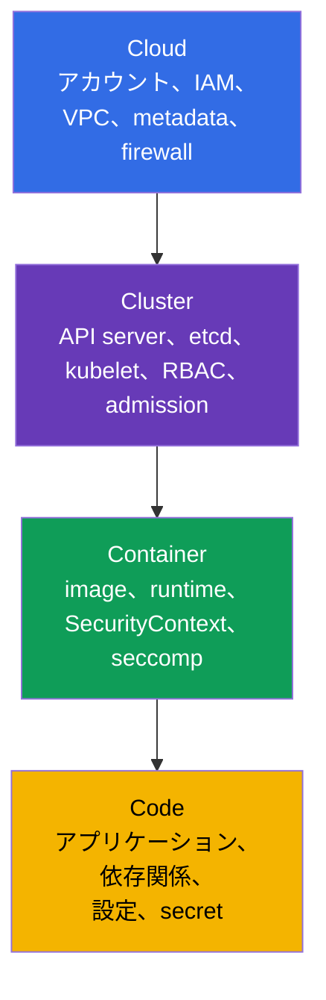
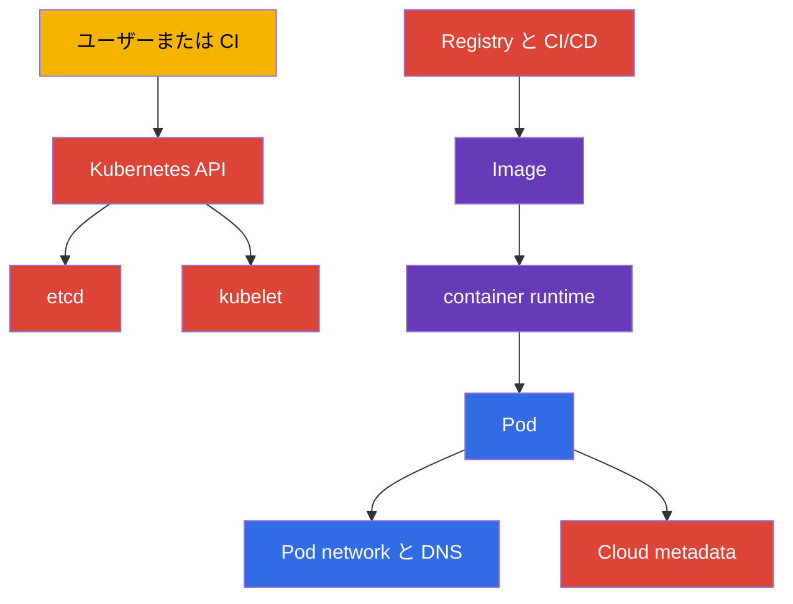
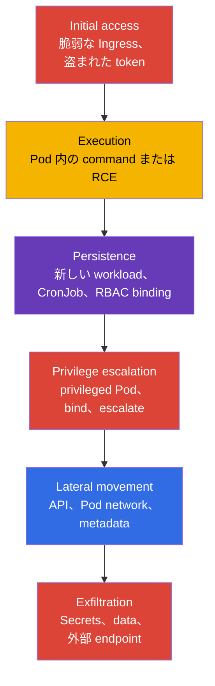
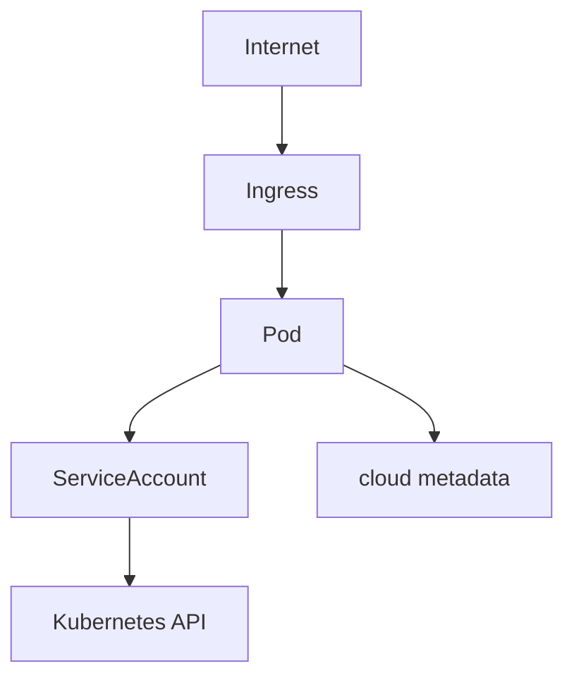
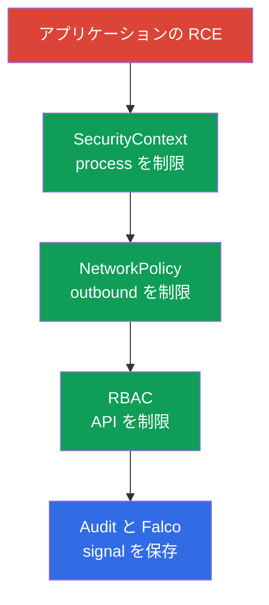

[Русская версия](ru.md) · [Eng version](README.md) · [Versión en español](es.md) · [Version française](fr.md) · [Deutsche Version](de.md) · [ქართული ვერსია](ge.md) · [繁體中文版](tw.md)

# 第02章. Kubernetes のセキュリティモデル: 4C、攻撃対象領域、攻撃フェーズ

> **課題。** Kubernetes の一層だけを保護しても、誤った安心感につながります。NetworkPolicy は公開 API を直せず、hardened container はコードの脆弱性やノードの cloud credentials を防げません。資産と境界の地図がなければ、チームは慣れた設定を閉じる一方、攻撃者には Cloud、Cluster、Container、Code を経由するより弱い経路が残ります。

> **この後。** 第01章では CKS の形式、ドメイン、ツールを定義しました。次に必要なのは、何を、誰から、どの層で守るのかという技術的判断の共通モデルです。本章は六つの CKS ドメイン、Cluster Setup (15%)、Cluster Hardening (15%)、System Hardening (10%)、Minimize Microservice Vulnerabilities (20%)、Supply Chain Security (20%)、Monitoring, Logging and Runtime Security (20%) の基礎です。

> **CKA で必要な知識。** control plane、worker node、kubelet、CNI、API へのリクエスト経路は [CKA 第02章](../../../cka/course/02/jp.md) で説明しています。ここでは保護対象およびリスク源としてのみ扱います。

> 🧠 4C は、ある層の保護が別の層の弱さを補えない理由を説明します。

## 02.1. 4C モデル: 守るもの

用語と shared responsibility に焦点を置く 4C モデルの詳しい説明は [KCSA コース第03章](../../../kcsa/course/03/jp.md) を参照してください。ここではゼロから繰り返すのではなく、CKS の技術判断用チェックリストとして実用的に適用します。

**4C** モデルは Kubernetes のセキュリティを Cloud、Cluster、Container、Code という入れ子の四層に分けます。外側の層は内側の層を置き換えません。侵害された workload は `NetworkPolicy` と `SecurityContext` で制限できますが、公開 API endpoint や workload から到達できる container-runtime/CRI socket は直りません。`docker.sock` は実際に Docker を使うノードだけの特殊例であり、現代のクラスターでは containerd または CRI-O の socket が一般的です。逆に、保護されたネットワークもアプリケーションの脆弱性は直せません。



| 層 | 資産 | 典型的な攻撃経路 | 基本的な対策 |
|---|---|---|---|
| Cloud | cloud provider の credentials、VPC、metadata、disk、snapshot | Pod が `169.254.169.254` に要求しノードの role を取得する | Pod がノードの credentials/identity を得ないようにする。provider-specific workload identity と metadata controls、最小 IAM 権限、security group を使う |
| Cluster | Kubernetes API、etcd、kubelet、PKI、RBAC | 匿名または過剰に認可された API request | TLS、`RBAC`、anonymous access の無効化、audit、最新バージョン |
| Container | image、container runtime、namespace、process、filesystem | 脆弱な image、`privileged` Pod、container escape | 最小 image、`SecurityContext`、seccomp、AppArmor、`RuntimeClass` |
| Code | source code、依存関係、設定、secret | アプリケーションの RCE、Secret 漏えい、悪性依存関係 | review、dependency scan、SBOM、secret をコードに保存しない、安全な設定 |

4C は調査順序として有用です。Pod にすべての `Secrets` を読む権限があれば、最初に Cluster 層、つまり RBAC を修正します。Pod 内の process が utility を導入して payload をダウンロードできるなら、Container 層の制限と egress control が必要です。アプリケーション endpoint が任意の command を受け付けるなら、どの Kubernetes manifest も Code 層の修正には代わりません。

> 🎯 Cloud → Cluster → Container → Code の順序と、各段階の基本コマンド。

### 境界の迅速なインベントリ

上の 4C モデルは、外側の弱点は内側の防御で補えないことを示します。したがってインベントリも、慣れた Cluster から始めるのでなく、**Cloud → Cluster → Container → Code** の順に進めます。以下では四層それぞれについて、何を確認し、原理的にどのツールで見え、どのコマンドが答えを返すかを示します。

| 層 | インベントリ対象 | 確認手段 | 以下の手順 |
|---|---|---|---|
| Cloud（または infrastructure provider） | API endpoint の公開、ノード identity と cloud での権限、metadata service の hardening、ネットワーク境界、provider 管理画面へのアクセス | provider CLI（そのアカウントの個別権限が必要）+ クラスター内からの provider 非依存の一つの検査 | 手順 1 |
| Cluster | control plane の version と入口、広すぎる RBAC 権限、危険な Pod 設定、公開された node port | `kubectl` と node への SSH | 手順 2-5 |
| Container | 実際に実行中の image、mutable tag、未承認 registry | `kubectl` | 手順 6 |
| Code | CVE を持つ脆弱な依存関係、悪用可能な論理脆弱性（SSRF、injection、認可回避、IDOR）、安全でない設定 default、コードと manifest の secret | `kubectl` が扱えるのは最後の項目（manifest の secret）のみ。残りは SBOM、dependency scan、SAST、code review、pentest | 手順 7 - 一部 |

正直にいうと、`kubectl` が見られるのは Kubernetes API に入ったものだけなので、四層のカバー範囲は大きく偏ります。Cloud 層（IAM role、VPC、snapshot）はほぼ API の外です。Code 層はさらに見えにくく、manifest は `env` に書いた secret を示せても、image 内の脆弱な library、アプリケーションコードの SQL-injection や認可回避、source に hardcode した secret は示せません。これは以下のコマンドの欠点ではなく、Kubernetes API がアプリケーション内容を知らないというツールの境界です。Code 層を完全に扱うには SBOM と dependency scanning（第25、28章）、static analysis（第27章）が必要で、論理脆弱性は CKS ツールでは解決できません。これらは code review、SAST/DAST、pentest で見つけ、platform team でなく開発側が責任を負います。以下のインベントリは、クラスターから取得可能なデータによる境界の高速なスナップショットであり、四層の完全監査ではありません。コマンドは何も変更せず、通常の cluster administrator access で実行でき、各手順は前の手順に依存しません。

**手順 1 (Cloud)。Pod 内から cloud metadata endpoint に到達できるか。**

Cloud 層は Kubernetes API のほぼ完全に外側にあるため、インベントリはクラスター内から確認できるものと provider CLI を必要とするものの二つに分かれます。

クラスター内からは、一つの明確で well-known なリスククラスを検査します。任意の Pod が node の metadata service に到達して credentials を盗める可能性があるかです。`169.254.169.254` は AWS、GCP、Azure、Hetzner など大半の provider で共通の link-local IP なので、ネットワーク到達性は provider 非依存で確認できます。

```bash
kubectl run metadata-probe --rm -i --restart=Never --image=curlimages/curl:8.11.1 -- \
  curl -s -o /dev/null -w 'http_code=%{http_code}\n' --max-time 2 http://169.254.169.254/
```

このコマンドは one-shot Pod を起動し（`--rm` は完了直後に削除）、provider 固有の path ではなく endpoint の**root**にアクセスします。重要なのは metadata の内容でなくネットワーク到達性そのものです。`200`、`401`、`403`、`404` のどの HTTP code でも endpoint が応答し Pod が到達したことを示すため、cloud に関係なく警告信号です。`000` は無応答（timeout または接続拒否）で、Pod から endpoint に到達できず hardening の目的にかないます。本文は読まず保存もしないので、実際の credentials を log に持ち出すこともありません。

到達性を検出した後に何が読めるかを確認するには、provider 固有の path と header を使う必要があります。これらは互換ではありません。

| Provider | Path | 必須 header |
|---|---|---|
| AWS (EC2 IMDS) | `/latest/meta-data/` | IMDSv1 では不要。IMDSv2 では個別の `PUT /latest/api/token` で取得した token が必要 |
| GCP | `/computeMetadata/v1/` | `Metadata-Flavor: Google` |
| Azure | `/metadata/instance?api-version=2021-02-01` | `Metadata: true` |
| Hetzner Cloud | `/hetzner/v1/metadata` | なし |

この違いがあるため、上の検査は意図的に特定 path に結び付けません。`/latest/meta-data/` を使うコマンドは GCP と Azure では `404` となり、endpoint が実際には応答しているのに「到達不能」と誤読されます。header の要件（`Metadata-Flavor`、`Metadata: true`）は単純な SSRF への防御であり、Pod への防御ではありません。Pod は任意の header を自ら送れるため、header があってもネットワーク経路を閉じる必要はあります。

**二つの結論を混同しないでください。**「Endpoint に到達できる」と「credentials を取得できた」は同じであり、報告で混ぜてはいけません。

- *到達性* は**発見事項と前提条件**です。Pod から metadata service へのネットワーク経路が閉じていません。修正課題を起票するには十分ですが、それ自体は侵害を証明しません。
- *credentials の取得可能性* は**確認済みの悪用経路**であり、provider 側の他の条件も満たす必要があります。

違いのよい例が AWS です。`HttpTokens=required`（IMDSv2-only）では token なしのアクセスは成功せず、token は別の `PUT` で要求します。その応答は `HttpPutResponseHopLimit` 個の network hop だけ生きます。hop limit が `1` なら own network namespace を持つ Pod まで応答が届きません。つまり endpoint は応答し probe は到達性を示しますが、token、したがって credentials は得られません。`hostNetwork: true` の Pod は追加 hop ではないため、この制限は機能しません。実務では、到達性を別の事実として記録し、credentials の窃取は provider 固有設定を確認してから結論付けます。

この層の残りは provider CLI とその account の個別権限を必要とします。`kubectl` はこれらの object を原理的に見られません。

> 🏭 API の公開アクセスと metadata service hardening を検査する provider-specific CLI。

質問は provider ごとに共通で、異なるのはコマンドだけです。

1. Kubernetes API はインターネットに公開され、どの network から到達できるか。
2. node にどの identity が結び付き、Pod 経由で盗まれた場合に cloud 内で何ができるか。
3. metadata service の hardening は有効か（AWS では IMDSv2-only と制限した hop limit、GCP/Azure では header 要件と network rule）。
4. Kubernetes 外で node、disk、snapshot、network rule を作成または変更できるのは誰か。

AWS/EKS の例です（GCP では `gcloud container clusters describe` と `gcloud compute instances describe`、Azure では `az aks show` と `az vm show` を使います。質問は同じですが output と field 名は異なります）。

```bash
# Question 1: API server がインターネットから見え、誰に見えるか
aws eks describe-cluster --name "$CLUSTER" \
  --query 'cluster.resourcesVpcConfig.{public:endpointPublicAccess,private:endpointPrivateAccess,cidrs:publicAccessCidrs}'

# Question 3: hop limit `1` は security-first default。`2` は
# Pod 自身が IMDS にアクセスする正当な必要がある場合だけ確認する
aws ec2 describe-instances --filters "Name=tag:eks:cluster-name,Values=$CLUSTER" \
  --query 'Reservations[].Instances[].{id:InstanceId,imds:MetadataOptions.HttpTokens,hop:MetadataOptions.HttpPutResponseHopLimit}'
```

AWS EKS Best Practices Guide は二つのケースを区別しており、一つの baseline にまとめてはいけません。Pod が node の instance profile の権限を継承すべきでない（IRSA/EKS Pod Identity での通常のケース）なら、ドキュメントは "Restrict access to the instance profile assigned to the worker node" で `HttpTokens=required` と `HttpPutResponseHopLimit=1` を明示的に推奨します。これが Pod 経由の node credentials 取得を遮断します。`HttpPutResponseHopLimit=2` は、アプリケーション自身が IMDS へアクセスする必要がある場合だけ（"When your application needs access to IMDS... increase the hop limit to 2"）別途推奨される、正当な例外であって全 container workload の共通 security baseline ではありません。

**別ケース: 「通常の」server 上の self-managed cluster**（bare metal の kubeadm、Hetzner などの VM）。

> 🔬 self-managed cluster の検査。

ここでは cloud IAM 自体がないことがあり、cloud role という意味で node から盗むものはなく、質問 2 は一部なくなります。しかし Cloud 層は消えず infrastructure provider 層に置き換わります。API server と SSH はインターネット公開か private network のみか、provider の管理画面に誰がアクセスできるか（server の作成・削除、console と snapshot へのアクセスは node 上の実質 root）、provider に機密データを返す metadata endpoint があるか（Hetzner では `169.254.169.254/hetzner/v1/metadata`。cloud-init user data を含むこともある）、server 間 traffic が cluster 内の `NetworkPolicy` だけでなく provider network rule で閉じているかを確認します。上の `metadata-probe` は cloud に依存しないので、ここでも使えます。

**手順 2 (Cluster)。control plane の入口と version。**

```bash
kubectl cluster-info
kubectl get --raw=/version
```

`kubectl cluster-info` は API server と service の address を表示します。これは cluster client が最初に見る入口です。`kubectl get --raw=/version` は Kubernetes control plane の正確な version を返します。この version で利用可能な flag と既知の CVE を照合するために必要であり、任意 release の documentation から推測しません。

**手順 3 (Cluster)。広い cluster-wide 権限を持つのは誰か。**

```bash
kubectl get clusterrolebinding -o jsonpath='{range .items[?(@.roleRef.name=="cluster-admin")]}{.metadata.name}{"\t"}{range .subjects[*]}{.kind}:{.name}{" "}{end}{"\n"}{end}'
```

このコマンドは、すべての resource への完全アクセスを与えるクラスターで最も広い組み込み role `cluster-admin` を参照する `ClusterRoleBinding` だけを出力します。各 binding について、その名前と role を割り当てられた subject（`User`、`Group`、`ServiceAccount`）の list を表示します。一つの binding が複数の subject を参照できるので、`.subjects[*]` に対する内側の `range` が必要です。

**`cluster-admin` という名前だけの検査では不十分です。** access level は role 名ではなく、その rule と binding の scope の組み合わせで決まります。`apiGroups: ["*"]`、`resources: ["*"]`、`verbs: ["*"]` を持つ `ClusterRole` は実質無制限の Kubernetes resource API 権限を記述しますが、実際の scope は binding に依存します。`ClusterRoleBinding` は全 namespace で cluster-wide に有効にし、同じ `ClusterRole` を参照する `RoleBinding` はその `RoleBinding` が作成された namespace の namespaced permission に制限します。この仕組みにより一組の rule を複数 namespace で再利用できます。さらに `ClusterRole` は cluster-scoped resource（例: `nodes`）、non-resource endpoint（`/healthz`）、`ClusterRoleBinding` による cluster-wide access に使われます。実クラスターでは `platform-superuser`、`ci-deployer`、`monitoring-full` のような無害そうな名前の role が、「とにかく動かす」ため、または `cluster-admin` という単語の review を回避するために作られます。名前検索はこれらをまったく見つけず、role rule だけを binding を調べずに検索すると risk を誤評価します。一 namespace の `RoleBinding` で結ばれた広い権限は、同じ権限を `ClusterRoleBinding` で与えるのとは脅威規模が異なります。

厳密には、この role は組み込み `cluster-admin` の**文字通りの同等物ではありません**。組み込み role には二つの rule があり、resource の wildcard に加え、`/healthz`、`/metrics`、`/debug/*` のような non-resource endpoint を覆う `nonResourceURLs` 用の別 wildcard rule があります。第二 rule のない role はそれらの path を与えず、`resourceNames` や aggregation（`aggregationRule`）によって狭められる場合もあります。しかし triage の観点で違いは実質的に小さく、すべての API resource を制御できれば全 Secret の読取り、任意 node 上の Pod 作成、RBAC の変更が可能で、完全な cluster takeover への経路になります。Kubernetes の公式 documentation もこの例を "similar to the built-in `cluster-admin` role" と慎重に表現し、「同一」とは言いません。実務の結論は変わらず、名前でなく権限を検索する必要があります。

```bash
# Step A: 名前に関係なく、完全な wildcard 権限を持つ全 ClusterRole を探す
kubectl get clusterroles -o json | jq -r '
  .items[]
  | select(any(.rules[]?;
      ((.apiGroups // []) | index("*")) and
      ((.resources // []) | index("*")) and
      ((.verbs // []) | index("*"))))
  | .metadata.name
'
```

```bash
# Step B: 見つかった role のいずれかを参照する binding を探す
dangerous=$(kubectl get clusterroles -o json | jq -r '
  .items[]
  | select(any(.rules[]?;
      ((.apiGroups // []) | index("*")) and
      ((.resources // []) | index("*")) and
      ((.verbs // []) | index("*"))))
  | .metadata.name
')

kubectl get clusterrolebinding -o json \
  | jq -r --argjson names "$(echo "$dangerous" | jq -R . | jq -s .)" '
      .items[]
      | select(.roleRef.name as $r | $names | index($r))
      | "\(.metadata.name) -> ロール \(.roleRef.name) (cluster-wide), subjects: \([.subjects[]? | "\(.kind):\(.name)"] | join(", "))"
    '

# Step B': 同じ role は RoleBinding にも結べる。その場合の権限は
# 一 namespace のみだが、上の ClusterRoleBinding 検索で「レビュー済み」にはならない
kubectl get rolebinding -A -o json \
  | jq -r --argjson names "$(echo "$dangerous" | jq -R . | jq -s .)" '
      .items[]
      | select(.roleRef.kind == "ClusterRole" and (.roleRef.name as $r | $names | index($r)))
      | "\(.metadata.name) (namespace \(.metadata.namespace)) -> ロール \(.roleRef.name) (この namespace のみ), subjects: \([.subjects[]? | "\(.kind):\(.name)"] | join(", "))"
    '
```

Step A は各 role rule を検査します。同一 rule 内で `apiGroups`、`resources`、`verbs` にすべて `*` があれば完全 access です。`any(.rules[]?; ...)` が重要なのは、危険な rule が一番目でなく、無害な rule に並ぶ二番目や三番目の場合があるからです。Step B と B' は見つけた名前を取り、どの binding が実際に使い、誰にどの scope で与えたかを表示します。`ClusterRoleBinding` は cluster-wide access、同じ `ClusterRole` の `RoleBinding` は一 namespace に制限します。同じ role rule でも脅威規模は違い、二種類のいずれかを省くと不完全です。未 binding の危険な role も review 対象ですが、binding 済みなら権限はすでに誰かへ与えられています。

完全 wildcard に当たらない、より狭いが依然危険な pattern も別途見ます。

```bash
kubectl get clusterroles -o json | jq -r '
  .items[]
  | .metadata.name as $name
  | .rules[]?
  | select(((.verbs // []) | index("*"))
      and (((.apiGroups // []) | index("*") | not) or ((.resources // []) | index("*") | not)))
  | "\($name): apiGroups=\(.apiGroups // []) resources=\(.resources // []) で verbs=*"
'
```

たとえば `secrets` だけに対する `verbs: ["*"]` は `cluster-admin` ではありませんが、全 cluster secret の読み取りと変更を可能にし、多くの threat model では完全侵害に等しくなります。同様に、admission 層で広い `hostPath` 許可と組み合わさった `create` on `pods`、role に対する `escalate`/`bind`、user に対する `impersonate` は、role 自体が狭く見えても権限昇格の経路を与えます。これらの pattern の詳しい説明は [第10章](../10/jp.md) です。

> **試験では。** filter `?(@.roleRef.name==...)` を伴う nested `range` を一つの jsonpath expression に書くのは、Step 4 が警告するのと同様、急いで入力すると bracket や quote を失いやすいです。より信頼できるのは、各 `kubectl` 呼び出しが filter や nesting なしに一つの field だけを尋ねる単純な loop に分割する方法です。
>
> ```bash
> for crb in $(kubectl get clusterrolebinding -o name | cut -d/ -f2); do
>   role=$(kubectl get clusterrolebinding "$crb" -o jsonpath='{.roleRef.name}')
>   if [[ "$role" == "cluster-admin" ]]; then
>     echo "$crb:"
>     kubectl get clusterrolebinding "$crb" -o jsonpath='{range .subjects[*]}{.kind}:{.name}{" "}{end}'
>     echo
>   fi
> done
> ```
>
> `kubectl get clusterrolebinding -o name` は `clusterrolebinding.rbac.authorization.k8s.io/<name>` の形式で name を出力し、`cut -d/ -f2` は `/` の後の name だけを残します。各 `kubectl get clusterrolebinding "$crb" -o jsonpath='{.roleRef.name}'` は一つの具体的 binding の単純な field だけを検査します。ここには binding 自体を選ぶ `?(...)` filter も nested `range` もなく、見つかった一致の subject 用だけに `range` があるため、実行前に目で再確認しやすくなります。上の one-liner より遅く（binding ごとに API request が一つ）ても、試験クラスターの binding は通常数千件ではなく、秒数の差より入力信頼性の差が重要です。

**手順 4 (Cluster)。明示的な危険兆候を持つ workload。**

> 🎯 `privileged`、`hostNetwork/hostPID/hostIPC`、`hostPath`、追加 capabilities、または `runAsUser: 0` の Pod を探す。

> **試験では。** 下の完全版（各検査階層に別々の `def` function を持つ）は学習用です。六つの兆候をすべて示し、なぜ論理的につながるかを説明しますが、timer 下で実際に入力すべきものではありません。nested `select` と array を含む短い `jq` filter でさえ、時間に焦ると括弧一つの抜けで壊れます。圧力下では、*洗練されていなくても* syntax を壊しにくい `grep` のほうが信頼できます。たとえば「namespace `prod` の hostNetwork を持つ全 Pod を探す」という課題です。
>
> ```bash
> NS=prod
>
> for pod in $(kubectl get pods -n "$NS" -o jsonpath='{.items[*].metadata.name}'); do
>   if kubectl get pod "$pod" -n "$NS" -o json | grep hostNetwork | grep -q true; then
>     echo "$pod"
>   fi
> done
> ```
>
> 考え方は単純です。一つの command で Pod 名を取得し、loop 内で一 Pod ずつ JSON を取り、目的 field を grep し、見つかれば名前を出します。namespace は先頭行で `NS` 変数に入れます。コマンド中に二度現れるため、timer 下で一方だけを直し忘れると script は何も告げず別 namespace を検索します。変数なら修正箇所は一つで、先頭に見えています。pipe の二つの `grep` は単純なまま検査を正確にします。最初は `hostNetwork` の行だけを残し、次はその行に `true` があることを確認します。これで field はあっても risk のない `"hostNetwork": false` を除外します。`grep -q` は何も出力せず、`if` 用の success/failure code だけを返します。`kubectl -o json` は pretty-printed JSON を出し各 field が独立行なので、二番目の `grep` は隣接 field でなく `hostNetwork` 行だけを受け取ります。多数 Pod を持つ namespace では、規模上の制約はこのページの他の variant と同じです（上の 10,000 Pod の節を参照）。しかし数件から数十件の試験 namespace では問題にならず、早く下書きなしで入力しても壊れにくい command です。同じ手法は任意の boolean field に使え、`hostNetwork` を `hostPID`、`hostIPC`、`privileged` に替えます。

この検査は全 namespace の全 Pod を走査し、container isolation を弱める既知の危険兆候を少なくとも一つ持つものだけを残します。兆候は Pod 全体とその個々の container の両方で確認します。

| Level | 兆候 | リスクとなる理由 |
|---|---|---|
| Pod | `hostNetwork`、`hostPID`、`hostIPC` | Pod が node 自身と network stack、process、IPC を共有し、isolation が部分的に解除される |
| Pod | `hostPath` type の volume | container が node filesystem へ直接アクセスする |
| Container | `privileged: true` | container は host process に近いほぼ全 kernel privilege を得る |
| Container | `allowPrivilegeEscalation: true` | container 内 process が起動時以上の権限を得られる |
| Container | 追加した `capabilities` | 最小 set を超える privilege が container に明示的に与えられる |
| Container | `runAsUser: 0`（Pod または container） | process が container 内で root として実行される |

実装では `jq` でこの兆候だけを探し、少なくとも一つが当たる Pod だけを出します。安全な Pod を何百件も出して list に埋もれないよう、他は出力しません。

**`--field-selector` や `-o jsonpath` でなく `jq` を使う理由。** 危険兆候を API server 上で filter し、安全 Pod の JSON を client に送らないことはできないでしょうか。部分的には可能ですが完全にはできません。Pod の `--field-selector` は API server に固定された狭い field list、`metadata.name`、`metadata.namespace`、`spec.nodeName`、`spec.restartPolicy`、`spec.schedulerName`、`spec.serviceAccountName`、`spec.hostNetwork`、`status.phase`、`status.podIP`、`status.podIPs`、`status.nominatedNodeName` だけを support します（Kubernetes 公式 documentation により確認。list は version で異なることがあり、未対応 field では `kubectl` が `BadRequest` を返します）。`spec.hostNetwork` は**含まれる**ため、この一検査だけは server に移せます。しかし `hostPID`、`hostIPC`、`privileged`、`allowPrivilegeEscalation`、追加 `capabilities`、`hostPath` volume、`runAsUser` は含まれず、server-side filter はできません。field set は API server code で定義され、任意 expression に開かれていないため、近い将来も期待すべきではありません。ここでは version と結び付けています。示した list はコース baseline の Kubernetes v1.36 documentation に対応し、疑わしいときは暗記せず自分の version の documentation で確認するのが正しい習慣です。`-o jsonpath` も解決しません。一 field の `?(@.field==value)` による projection/filter はできますが、複数条件を一 expression で「OR」結合できず、共通 logic で `spec.containers[]`、`spec.volumes[]`、`spec.securityContext` を同時に見られません。完全な boolean expression の言語、すなわち `jq`（または client-side の同等品）が必要です。終了済み Pod が不要なら `status.phase` を `Running` に絞れます。二つの server-side optimization は一つの `--field-selector` 内で comma により結合できます。

```bash
kubectl get pods -n "$ns" --field-selector=status.phase=Running -o json
```

これは `jq` を置き換えるのでなく、そこへ届く JSON volume を減らします。server は終了 Pod を client に送らず、`jq` は server-side filter できない残りの兆候を調べます。以下の `jq` は形式上 `hostNetwork` を別 request で server に移せても、他の兆候とともに確認します。兆候ごとの別 request は七 field 中一つの節約に比べ script を複雑にしすぎ、一つの `jq` expression のほうが明快で保守しやすいためです。

**規模について。** 混同されやすい二種類の負荷を区別します。API server 側は思うほど深刻ではありません。`kubectl get` は既定で large list を**chunk**で要求し、default `--chunk-size` は `500`（"Return large lists in chunks rather than all at once"）です。したがって 10,000 Pod は一巨大 request でなくおよそ二十の連続 request で取得されます。pagination を無効化できるのは `--chunk-size=0` を明示した場合だけです。

問題は client 側です。`kubectl` は chunk を一つの JSON document に結合し、`jq` は全体を受け取るまで一行も出しません。数千 Pod の production では workstation memory に数百 MB、進捗なしに数分を要し、`kubectl` または `jq` が OOM になることもあります。namespace を一つずつ loop する目的は API server の負荷軽減（これは chunking が担う）でなく、**cluster 全体を一度に memory に保持しない**ことと、namespace ごとに incremental な結果を得ることです。

```bash
for ns in $(kubectl get ns -o jsonpath='{.items[*].metadata.name}'); do
  kubectl get pods -n "$ns" --field-selector=status.phase=Running -o json | jq -r --arg ns "$ns" '
    def containers:
      (.spec.containers // [])
      + (.spec.initContainers // [])
      + (.spec.ephemeralContainers // []);

    # true/false ではなく、各 container 検査は container 名とともに
    # 該当した具体的な兆候の LIST を返す。これがないと output で
    # 異なる兆候を区別できない。
    def container_reasons:
      [
        (if .securityContext.privileged == true then "privileged:\(.name)" else empty end),
        (if .securityContext.allowPrivilegeEscalation == true then "allowPrivilegeEscalation:\(.name)" else empty end),
        (if ((.securityContext.capabilities.add // []) | length > 0)
          then "capabilities.add=\((.securityContext.capabilities.add // []) | join(",")):\(.name)"
          else empty end),
        (if .securityContext.runAsUser == 0 then "runAsUser=0:\(.name)" else empty end)
      ];

    # Pod 全体についても同様。Pod-level の理由と各 container の理由を
    # 一つの flat list に結合する。
    def pod_reasons:
      [
        (if .spec.hostNetwork == true then "hostNetwork" else empty end),
        (if .spec.hostPID == true then "hostPID" else empty end),
        (if .spec.hostIPC == true then "hostIPC" else empty end),
        (if .spec.securityContext.runAsUser == 0 then "pod.runAsUser=0" else empty end),
        (if ([.spec.volumes[]? | select(.hostPath != null)] | length > 0)
          then "hostPath=\([.spec.volumes[]? | select(.hostPath != null) | .hostPath.path] | join(","))"
          else empty end)
      ] + [containers[]? | container_reasons[]];

    .items[]
    | (pod_reasons) as $reasons
    | select($reasons | length > 0)
    | "\($ns)/\(.metadata.name): \($reasons | join("; "))"
  '
done
```

検査 logic（`containers`/`container_reasons`/`pod_reasons` の三 function と最後の `select`）は上の考え方と同じです。変わったのはデータ取得方法と output format です。行は単に "requires review" と言うのでなく、どの兆候がどの container で該当したかを直接列挙します。たとえば `hostNetwork; privileged:aws-node; capabilities.add=NET_ADMIN:aws-node` です。これがない実クラスター、とくに CNI や他の system DaemonSet（例: `aws-node`）が正当に `hostNetwork` と `privileged` を使う EKS/GKE では、output は同じ `namespace/pod requires review` の長い list になり、予期した system component と本当の発見事項を素早く区別できません。具体的理由を表示すれば、結果ごとに `-o yaml` を開かず「なぜこの Pod が list に入ったか」が分かります。

コードなしで手順を整理すると、(1) namespace 名を取得して `$ns` へ一つずつ渡す、(2) 現 namespace の Running Pod だけを取得する、(3) 通常・init・ephemeral container を一 stream に結合する、(4) 各 container の具体的理由と name を list にする、(5) Pod-level の `hostNetwork`、`hostPID`、`hostIPC`、`pod.runAsUser=0`、`hostPath` を container の理由と結合する、(6) non-empty の理由を持つ Pod だけを `namespace/pod: reason1; reason2; ...` 形式で出力する、となります。

この理由の詳細化は実クラスターで特に重要です。`aws-node`（Amazon VPC CNI）、`cilium`、`calico-node` のような system DaemonSet は、node の network interface と rule を管理するため、正当に `hostNetwork` と `privileged` を使います。理由がなければ、hundreds node のクラスターで同じ `requires review` 行が数百並び、それらが同じ予期された pattern かが分かりません。理由が表示されると、一 namespace の一致が同じ image に同じ兆候 set を示すなら、それは「CNI に必要」という根拠を付ける review list の正当な system component であり、数十の独立調査事項ではないと直ちに分かります。

**手順 4 の追加 variant: namespace 内 chunking を伴う構造化 JSON output。**

> 🏭 数千 Pod のクラスター向け chunked JSON 検査。

上の variant は高速な手動検査に向きます。人が読みやすい一行ですが、他の tool（ticket system や dashboard）には渡しにくく、数千 Pod の namespace では出力前に namespace 全体を client memory に集めます。machine-readable な結果と巨大 namespace への保護が必要なら、より複雑な方法を使います。

```bash
CHUNK_SIZE=200
SLEEP_BETWEEN_CHUNKS=0.2

result_file=$(mktemp)
chunk_file=$(mktemp)
merge_jq=$(mktemp)
trap 'rm -f "$result_file" "$chunk_file" "$merge_jq"' EXIT
echo '{}' > "$result_file"

cat > "$merge_jq" <<'JQEOF'
def containers:
  (.spec.containers // [])
  + (.spec.initContainers // [])
  + (.spec.ephemeralContainers // []);

def container_reasons:
  [
    (if .securityContext.privileged == true then "privileged:\(.name)" else empty end),
    (if .securityContext.allowPrivilegeEscalation == true then "allowPrivilegeEscalation:\(.name)" else empty end),
    (if ((.securityContext.capabilities.add // []) | length > 0)
      then "capabilities.add=\((.securityContext.capabilities.add // []) | join(",")):\(.name)"
      else empty end),
    (if .securityContext.runAsUser == 0 then "runAsUser=0:\(.name)" else empty end)
  ];

def pod_reasons:
  [
    (if .spec.hostNetwork == true then "hostNetwork" else empty end),
    (if .spec.hostPID == true then "hostPID" else empty end),
    (if .spec.hostIPC == true then "hostIPC" else empty end),
    (if .spec.securityContext.runAsUser == 0 then "pod.runAsUser=0" else empty end),
    (if ([.spec.volumes[]? | select(.hostPath != null)] | length > 0)
      then "hostPath=\([.spec.volumes[]? | select(.hostPath != null) | .hostPath.path] | join(","))"
      else empty end)
  ] + [containers[]? | container_reasons[]];

# Input (.) は command-line argument でなく chunk FILE ($chunk_file) から読む。
# full status と managedFields を持つ実 Pod では CHUNK_SIZE=200 でも OS の argv
# length limit を超え、`jq --argjson chunk "$chunk_json"` は jq の実行前に
# "Argument list too long" で失敗し得る。累積結果も同じ理由で別 FILE の
# --slurpfile acc 経由で読み、large data を argv に渡さない。
#
# kubectl は複数 name では List ({"items":[...]}) を返すが、command に name が
# 一つだけなら items field のない Pod object を直接返す。この分岐がなければ、
# 最後の不完全 chunk（しばしば 1 Pod）で .items がないため
# "jq: error: Cannot iterate over null (null)" となる。
($acc[0]) as $accumulated
| (.items // [.]) as $pods
| reduce ($pods[]) as $pod
  ($accumulated;
   ($pod | pod_reasons) as $reasons
   | if ($reasons | length) > 0
     then .[$ns][$pod.metadata.name] = $reasons
     else .
     end)
JQEOF

for ns in $(kubectl get ns -o jsonpath='{.items[*].metadata.name}'); do
  mapfile -t pod_names < <(kubectl get pods -n "$ns" --field-selector=status.phase=Running \
    -o jsonpath='{range .items[*]}{.metadata.name}{"\n"}{end}')
  total=${#pod_names[@]}
  processed=0
  for ((i = 0; i < total; i += CHUNK_SIZE)); do
    chunk=("${pod_names[@]:i:CHUNK_SIZE}")
    kubectl get pods -n "$ns" "${chunk[@]}" -o json > "$chunk_file"
    jq --slurpfile acc "$result_file" --arg ns "$ns" -f "$merge_jq" "$chunk_file" > "${result_file}.new"
    mv "${result_file}.new" "$result_file"
    processed=$((processed + ${#chunk[@]}))
    echo "namespace $ns: $processed/$total pods processed" >&2
    sleep "$SLEEP_BETWEEN_CHUNKS"
  done
done

jq . "$result_file"
```

ここで複雑になった点と理由は次のとおりです。

- **output format は行でなく nested JSON。** 結果は `{namespace: {pod-name: [reasons]}}` と構造化されます。前の text output と同じ情報ですが、後続の自動処理、artifact 保存、再びクラスターへ行かず特定 namespace を `jq` filter する用途に使えます。
- **namespace 間だけでなく namespace 内で chunking する。** `for ns in ...` は namespace ごとに分けますが、一つの namespace に数千 Pod（production の大規模 data/batch namespace で典型的）があれば、`kubectl get pods -n "$ns" -o json` は API server から `--chunk-size` で取りつつ、client memory では namespace 全体を一 JSON に結合します。内側の `for ((i = 0; i < total; i += CHUNK_SIZE))` は現 namespace の Pod 名を `CHUNK_SIZE`（ここでは 200）の group に分け、`kubectl get pods -n "$ns" <name1> <name2> ...` でその group だけを要求します。peak memory は namespace 全体でなく一 chunk に制限され、各 group 後に progress を表示できます。`--field-selector` は「list 内の任意 name」を support しないため、name は explicit positional argument として渡します。
- **chunk 間の `sleep "$SLEEP_BETWEEN_CHUNKS"`。** ここでは 0.2 秒の pause が、数多くの namespace と Pod を持つクラスターで API server に休みなく数百 request を送るのを避け、peak load を下げます。
- **各 chunk 後の progress 用 `echo ... >&2`。** stdout の最終 JSON と混ざらない stderr に、`namespace kube-system: 200/1400 pods processed` のような行を出します。大規模クラスターでは数分かかることがあり、indication がなければ script が動いているか停止したか分かりません。
- **chunk と累積結果は shell variable でなく file に置く。** `kubectl get pods ... -o json > "$chunk_file"` は chunk JSON を disk に書き、`jq --slurpfile acc "$result_file" ... "$chunk_file"` は chunk と累積結果を file から読んで command-line argument として渡しません。`CHUNK_SIZE=200` でも full `status` と `managedFields` を持つ実 Pod の JSON は数 MB になり得ます。`jq --argjson chunk "$chunk_json" ...` はそれを通常の process argument として渡すため、OS の総 argv length limit（`ARG_MAX`、system により通常約 128 KB から数 MB）を超えると jq 実行前に shell が `Argument list too long` で終了します。この状況は一 namespace に数百 Pod があるクラスターで起こり、size は Pod 数だけでなく各 Pod の metadata/status volume に依存します。各 iteration の結果は temporary file（`> "${result_file}.new"`、次に `mv`）に保存されるので、途中で中断しても disk 上には古い完全版か新しい完全版だけが残り、壊れた中間 file は残りません。
- **`trap 'rm -f "$result_file" "$chunk_file" "$merge_jq"' EXIT`。** temporary file は通常終了だけでなく error や `Ctrl+C` でも自動削除されます。`trap` がなければ中断した実行ごとに `/tmp` に file が蓄積します。
- **`merge.jq` の `pod_reasons` は kubectl の name 数依存の異なる structure を扱う。** `kubectl get pods -n "$ns" pod-a pod-b -o json` は複数 name で List（`{"items": [...]}`）を返しますが、最後の 1 Pod の chunk のように一 name では `items` のない Pod object を直接返します。`(.items // [.])` は両方を同じように処理します。`.items` があれば使い、なければ入力 object 全体を一要素 list に包みます。これがなければ一 Pod の最後の chunk で `.items[]` が存在しない field を iterate し、`jq: error: Cannot iterate over null (null)` になります。

これは前の版より「正しい」版ではなく、意識的な trade-off です。小中規模クラスターでの一回限りの手動検査なら、上の text output のほうが読みやすく terminal に copy しやすいです。chunked JSON variant は、結果を自動化へ渡す、namespace が非常に多くの Pod を持つ可能性がある、API server をいたわり visible progress とともに走査したい、すなわち script が単発 diagnostic command から定期実行 tool へ変わる場合に正当化されます。試験でこのシナリオは出ません。この節は timer 下で再現するものではなく production engineering の参考例として扱ってください。

**手順 5 (Cluster/node)。node 上の listening port と owner process。**

```bash
sudo ss -tulpn
```

flag の意味は、`-t` と `-u` が TCP/UDP socket、`-l` が listening socket のみ、`-p` が PID と owner process 名、`-n` が DNS name を resolve しない（高速で正確）です。これは `kubectl` でなく node 自身で実行する唯一の command で、Kubernetes API ではなく OS の観点で見えるものを表示します。

**手順 6 (Container)。実際に実行中の image と mutable tag の有無。**

Container 層の最初の質問は「image は安全か」（第28章の scanning）ではなく、より基礎的な「クラスターでどの image が動いており、実行している code を一意に特定できるか」です。

```bash
# クラスター内の一意な image の完全 list
kubectl get pods -A -o jsonpath='{range .items[*]}{range .spec.containers[*]}{.image}{"\n"}{end}{end}' | sort -u
```

```bash
# mutable tag の Pod: 明示的な :latest、または tag なし（implicit latest）
kubectl get pods -A -o json | jq -r '
  .items[]
  | .metadata.namespace as $ns | .metadata.name as $pod
  | .spec.containers[]?
  | select((.image | endswith(":latest")) or (.image | split("/") | last | contains(":") | not))
  | "\($ns)/\($pod): \(.image)"
'
```

最初の command は inventory を与え、実際にどの registry が使われ、未承認 registry がないかを照合できます。二番目は mutable tag の image を見つけます。明示的な `nginx:latest`、または tag のない `redis`（既定で `:latest` に resolve）です。このような image では manifest を変更せず tag を別 digest に差し替えられるので、今動く code が review 時の code と異なる可能性があります。`.image | split("/") | last | contains(":") | not` は `/` 後の最後の segment だけを見ます。これがなければ registry address に port はあるが tag のない `registry.example.com:5000/app` を誤って tagged と数えます。

> **試験ではこの inventory が課題の半分です。** 典型的には「namespace `X` で最も多くの脆弱性を持つ Pod を見つけ削除せよ」または「image が package `<name>` version `<version>` を含む Pod を見つけよ」です。上の inventory は「どの image があるか」を答え、次には `trivy` と、重要なことに image から Pod への**逆経路**が必要です。削除するのは image でなく Pod だからです。そのため list はすぐ `pod → image` の pair にします。
>
> ```bash
> NS=prod
>
> kubectl get pods -n "$NS" \
>   -o jsonpath='{range .items[*]}{.metadata.name}{"\t"}{.spec.containers[0].image}{"\n"}{end}'
> ```
>
> 次に各 pair の脆弱性を数え、降順に sort します。最初の行が目的の Pod です。
>
> ```bash
> kubectl get pods -n "$NS" \
>   -o jsonpath='{range .items[*]}{.metadata.name}{"\t"}{.spec.containers[0].image}{"\n"}{end}' \
> | while IFS=$'\t' read -r pod img; do
>     count=$(trivy image -q --severity CRITICAL,HIGH --format json "$img" \
>       | jq '[.Results[]?.Vulnerabilities[]?] | length')
>     echo -e "$count\t$pod\t$img"
>   done | sort -rn
> ```
>
> severity の filter は `jq` の `select` でなく `trivy` 側の `--severity CRITICAL,HIGH` flag で行います。これなら `jq` は全 record の単純な `length` のままで、timer 下で条件を誤る可能性が減ります。`3<tab>app-1<tab>nginx:1.19` という output は、左から count、Pod、image とすぐ読めます。`sort -rn` は最悪を上に置くため、残りは `kubectl delete pod app-1 -n "$NS"` です。`.spec.containers[0].image` は最初の container を取ります。課題が multi-container Pod なら `{range .spec.containers[*]}` に替え、image ごとに数えます。
>
> 二番目の形式「特定 package と version の Pod」では、timer 下では通常の table output に二つの nested `grep` を使うのが、`--format json` と `jq` より簡単です。
>
> ```bash
> trivy image -q "$IMG" | grep openssl | grep '1.1.1d'
> ```
>
> 最初の `grep` は package の行を残し、二番目は version を確認します。注意点として、table mode の `trivy` は `Library` column（package 名）と `Title` column（CVE title）をともに出し、title は package 名で始まることがあります。そのため `grep openssl` は、title に `openssl: ...` とある `libssl1.1` の行も拾います。試験では通常有益で、探すのは文字どおり同名 package でなく「openssl 脆弱性の影響を受ける image」です。`Library` column への厳密一致が必要なら、`^` と table separator を加えます: `grep -E '^\│ openssl'`。
>
> script に渡す場合は JSON の正確な variant を使います。
>
> ```bash
> trivy image -q --format json "$IMG" \
>   | jq -r '.Results[]?.Vulnerabilities[]? | select(.PkgName=="openssl") | "\(.PkgName) \(.InstalledVersion) \(.VulnerabilityID) \(.Severity)"'
> ```
>
> trivy report の `PkgName`、`InstalledVersion`、`VulnerabilityID`、`Severity` field は常に埋まります（fix がまだない場合もある `FixedVersion` と異なります）。このため依存できます。脆弱性 count も `jq` なしでよく、table mode の `trivy image -q --severity CRITICAL,HIGH "$IMG"` は `Total: N (...)` 行を出します。二、三 Pod なら loop より速く、十程度で目視比較が不便なら上の `jq` loop が有利です。

**手順 7 (Code)。manifest に literal value として書かれた secret。**

Code 層はリスクの量が最大で、`kubectl` から最も届きにくい層です。既知 CVE を持つ脆弱な依存関係、アプリケーション自体の悪用可能な論理脆弱性（SQL/command injection、SSRF、認可回避、IDOR、安全でない deserialization）、安全でない configuration default、source 内の secret が含まれます。

境界を正確に引くことが重要です。Kubernetes API は**アプリケーションの source code や依存関係を表示しません**。どの `kubectl` request でも脆弱な library や認可確認の誤りは発見できません。一方で **security-relevant runtime configuration** の一部は示し、これは一つの兆候以上です。`env`、`command`、`args` の literal value（`--insecure-skip-tls-verify` や有効な debug mode などが混じりやすい）、`Secret` と `ConfigMap` の参照、mount された volume、image と tag、annotation と label、`securityContext`、利用する ServiceAccount です。以下は、そのうち最も頻繁で最も明確な、`secretKeyRef` でなく `env` に literal string として書いた secret を対象にします。残りは別の tool が扱うため、手順 7 を通したことを Code 層全体を閉じたことと考えてはいけません。

```bash
kubectl get pods -A -o json | jq -r '
  .items[]
  | .metadata.namespace as $ns | .metadata.name as $pod
  | .spec.containers[]?
  | .env[]?
  | select(.value != null)
  | select(.name | test("PASSWORD|SECRET|TOKEN|KEY|CREDENTIAL"; "i"))
  | "\($ns)/\($pod): env \(.name) はリテラル値で設定されています"
'
```

filter は literal `.value`（`valueFrom` でない）を持ち、name が secret らしい environment variable を選びます。command は variable 名だけを出し、value は出しません。そうしなければ inventory 自体が漏えい経路になるためです。name の一致は heuristic です。`PUBLIC_KEY_URL` は無害でもあり、`DB_DSN` という name の secret は list に入らないことがあります。したがって結果は人が読み、最終的な違反 list と見なしません。

literal value が `Secret` 参照より悪い理由は慎重に整理する必要があります。ここでは過大に言いやすいです。`Secret` に移すことは**secret を自動的に保護しません**。workload manifest から secret を分離し、literal にはまったくない mechanism を使えるようにするだけです。

| 観点 | `env[].value` の literal | `Secret` への参照 |
|---|---|---|
| 保存場所 | PodSpec/Deployment、つまり workload object 内 | 別の `Secret` object。encryption at rest が有効でなければ etcd の value は**暗号化でなく base64** |
| VCS への混入 | workload manifest は通常 commit するものなので、実際に commit すれば value も一緒に git に行く | workload manifest 自体には key 名だけがある。value は別に git に入る場合がある（例: plain-YAML `Secret`、Helm values） |
| API 経由の可視性 | Deployment/Pod を読める誰にでも見え、これは `Secrets` reader よりはるかに広い | API で直接読むにはこの namespace の `secrets` 権限が必要（`resourceNames` で狭められる）。**ただし** isolation を保証しない。namespace で Pod/Deployment を作れる subject は、`secrets` の `get`/`list`/`watch` がなくても既存 `Secret` を volume mount または `env` へ渡せる |
| audit log への混入 | audit policy と level に依存。`Metadata` は body を書かず、`Request` は request body は書くが response は書かず、`RequestResponse` は request/response body の両方を書く | 同じだが event は `Secret` に関するものになり、secret read を別 rule にしやすい。`create`/`update` は `Request` level でも value を明かすことがあり、通常の `get` が返す value は `RequestResponse` のみで log に入る |
| Encryption at rest | 該当 API resource を適切な `EncryptionConfiguration` rule が覆うなら workload object とともに暗号化できる。直接（例: `deployments.apps`）または wildcard（Kubernetes v1.27+ の `*.apps`、`*.*`）で覆い、その rule の最初の provider が `identity` でなく encrypting provider である必要がある。既定では `--encryption-provider-config` は設定されず、API server は etcd に at-rest encryption なしで保存する | `Secret` も自動では暗号化されない。同じ resource を `EncryptionConfiguration` rule（直接 `secrets` または wildcard）が覆い、list の最初が encrypting provider である必要がある。最初が `identity` なら、resource が形式上「設定に含まれる」場合も新規 record は plaintext で etcd へ行く |
| 再 build なしの更新 | workload manifest を編集し再適用する必要がある | value は一 object で変わり、workload に触れない |
| 新 value が container に届くか | いいえ | **volume** なら yes。kubelet が file を更新する（eventually consistent、`subPath` mount は例外）。**environment variable** なら**no**。env は container 起動時に固定されるため Pod restart が必要 |

最後の行は実際の rotation で最も多い誤りです。`Secret` の secret を更新しても、アプリケーションが environment variable から読むなら古い value で動き続けます。無停止 rotation が必要なら secret を file として mount しアプリケーションに再読込させるか、controlled `kubectl rollout restart` で rotation を完了します。

> **試験では。** 問題文は通常もっと単純です。「namespace `X` で password が manifest に直接指定された Pod を探せ」です。cluster 全体の inventory でなく一つの特定 variable を探すため、Step 4 と同様に `jq` なしの `grep` がより信頼できます。
>
> ```bash
> NS=prod
>
> for pod in $(kubectl get pods -n "$NS" -o jsonpath='{.items[*].metadata.name}'); do
>   if kubectl get pod "$pod" -n "$NS" -o yaml | grep -i -A1 password | grep -q 'value:'; then
>     echo "$pod"
>   fi
> done
> ```
>
> ここで `-A1` flag が重要です。YAML（JSON も同様）では variable name とその value は別行にあり、`grep -i password` 単独では name の行だけを示し、literal か `secretKeyRef` かを教えません。`-A1` は次行を加え、二番目の `grep` はそこが実際に `value:` か確認します。重要なのは `value:` が `valueFrom:` と**一致しない**ことです。`value` の次は colon でなく `F` なので、正しく `Secret` から password を取る Pod は list に入りません。Pod 名だけでなく行も見たいなら、二番目の `grep` の `-q` を外すか、loop を `echo "--- $pod"; kubectl get pod "$pod" -n "$NS" -o yaml | grep -i -A1 password` とします。

この command が見ない Code 層の残りを扱う方法です。

| Code 層のリスク | 発見方法 | コース内 |
|---|---|---|
| image 内の CVE を持つ脆弱な dependency | SBOM（`syft`、`bom`）と scanner（`trivy`） | [第25章](../25/jp.md)、[第28章](../28/jp.md)、lab 111 |
| 安全でない `Dockerfile` と manifest（root、余計な package、writable rootfs） | static analysis: `hadolint`、`kube-linter`、`kubesec` | [第27章](../27/jp.md)、lab 111 |
| source または image layer に hardcode した secret | CI の secret scanning、`docker history`、Dockerfile review | [第24章](../24/jp.md) |
| アプリケーションの論理脆弱性: injection、SSRF、認可回避、IDOR | code review、SAST/DAST、pentest | CKS tool の外 - 開発の責任 |

最後の行は別に強調する価値があります。コードの論理脆弱性は、どの `kubectl` command や image scanner でも発見されず、CKS の範囲にも入りません。CKS が答える別の問いは「攻撃者がその脆弱性を悪用**した後**に何をできるか」です。だからこそコースでは `SecurityContext`、RBAC、NetworkPolicy、runtime detection を重視します。ここでの Code 層 inventory は開発の仕事を置き換えるためでなく、責任範囲を明確に知り、七手順がすべて clean だから cluster が安全だと考えないためにあります。

**七手順すべての結果の読み方。** `cluster-admin` は常に誤りではなく、特定の system component や管理された administrator に必要な場合があります。Step 4 の各 workload について、`privileged`、`allowPrivilegeEscalation`、`hostPath`、追加 capabilities、明示した UID 0 のような具体的兆候を記録します。これは review 用 list であって自動的な脆弱性の証明ではありません。たとえば image UID は PodSpec からは分からない場合があり、正当な例外には owner と期限が必要です。inventory の結果は subject の list、access の根拠、owner、次回 review 日です。名前が怪しく見えるだけで binding を削除せず、最初に目的を確認し最小 role への置換を test してください。

4C が**何ではないか**も重要です。これは defense in depth のモデルであり、問題がどの層で発生し、上下の層でどの compensating control が利用できるかを理解する助けになります。これは**普遍的な優先順位アルゴリズムではなく**、発見事項の list を「層を下から上へ」と修正 queue の完成版として読むのは誤りです。

それでもモデルには有用な heuristic があります。外側の層ほど通常は修正の blast radius が広いことです。Step 1 が API server のインターネット公開と Pod からの IMDS 到達を示し、Step 4 が一 Deployment の `privileged` 実行を示すなら、public endpoint を閉じ IMDS を harden することは全 Pod の attack surface を一度に減らします。一 Deployment の `securityContext` を直しても、攻撃者が外から来る、または別 Pod 経由で node credentials を取るのは防げません。この具体例では Cloud から始めるのが合理的です。

しかし前提が変われば heuristic は崩れます。順序が逆になる三例です。

- **Code の脆弱性が Cloud の弱さより重要。** 公開アプリケーションに active exploitation 中の RCE 脆弱性（Code）があれば、node 上の `HttpPutResponseHopLimit=2`（Cloud）より先に修正します。前者はすでに攻撃者へ code execution を与え、後者は侵入後の潜在的 step にすぎません。
- **外側層の発見事項はすでに補償されていることがある。**「API server がインターネットから到達できる」は重大に聞こえますが、corporate address allowlist、MFA 付き OIDC、audit が有効なら、実際の risk は container runtime socket を mount する Pod より低いことがあります。後者は即時の node takeover を可能にします。
- **危険なのは一層の深さでなく層の連鎖。** インターネットから到達できる application の ServiceAccount に結ばれた wildcard `ClusterRole`（Cluster）は、各発見事項を単独で見るより危険です。優先順位は RBAC が code より「深い」ことではなく、その chain が決めます。

実務の順序は層でなく risk で決めます。攻撃者からの到達性、動く exploitation path の有無、発動時の被害、修正の blast radius、証拠自体の信頼性で各 finding を評価し、compensating control がすでにあるなら優先度を下げます。それでも 4C は必要で、compensating control をどこに探すか、修正が局所的でなく体系的になる層はどこかを示します。試験では優先順位付けは不要です。課題が修正対象を直接指示します。これは実務の skill です。

> 🏭 自作 `jq` query の代わりに既成 scanner を使う。

### 既成 scanner: 同じことを自動で行う

上で手作業で行ったことのほとんどは既成 tool で実行でき、実務では自作 `jq` script を保守するよりこちらを使うのが合理的です。本章で手作業の分解を示す目的は別にあります。scanner が何を検査し、なぜその finding がリスクで、false positive をどう扱うかを理解することです。これがなければ scanner report は数百行の理解不能な list になります。

| Tool | 上の検査のうち対象 | Status |
|---|---|---|
| [kube-bench](https://github.com/aquasecurity/kube-bench) | CIS Benchmark に基づく control plane、kubelet、etcd 設定 - 手順 2 と 5 の一部 | active に保守。 [第07章](../07/jp.md) と lab 103 で扱う |
| [Kubescape](https://kubescape.io/) | 危険な Pod 設定、広い RBAC 権限、hostPath/hostNetwork/privileged、mutable tag - 手順 3、4、6。live cluster と manifest/Helm を NSA、MITRE、SOC 2 framework で scan | CNCF Incubating、active に開発中 |
| `trivy k8s` ([Trivy](https://trivy.dev/)) | cluster object の misconfiguration、image の CVE と KBOM - 手順 4、6、Code 層の一部 | active に保守。image scan は [第28章](../28/jp.md) と lab 111 |
| [kubeaudit](https://github.com/Shopify/kubeaudit) | workload の点検: root、capabilities、`allowPrivilegeEscalation`、`readOnlyRootFilesystem` の欠如 - 手順 4 | upstream は 2024-10-30 に**archive**、read-only。古い記事にはあるが新規 process には不適 |
| [kube-linter](https://docs.kubelinter.io/)、[kubesec](https://kubesec.io/) | 同じ兆候を live cluster でなく deploy 前の manifest で検査 | 保守中。[第27章](../27/jp.md) と lab 111 で扱う |
| RBAC 特化: [rbac-tool](https://github.com/alcideio/rbac-tool)、`kubectl who-can` | wildcard を持つ custom role も含む、便利な RBAC visualization と query - 手順 3 | 保守中。RBAC の詳細は [第10章](../10/jp.md) |

**もはや開発されていない tool** についても補足します。どちらも古い記事や course によく現れ、現行 tool と誤認しやすいです。

- **kube-hunter** - upstream（Aqua Security）は tool を今後開発しないことを公式に発表し、代わりに Trivy を推奨しています。
- **kubeaudit** - Shopify/kubeaudit repository は **2024 年 10 月 30 日に archive** され read-only になりました。archive 前にも README に新 maintainer を求める deprecation notice がありました。

これらは歴史的資料として読み、古い lab で実行することはできますが、新しい process に組み込むべきではありません。現在 kubeaudit の workload check は Kubescape、`trivy k8s`、kube-linter/kubesec が、kube-hunter の reconnaissance は `trivy k8s` が担います。これが table の「status」列の実務的意味です。security tool では support status も検査 list と同じく適性の一部です。

試験上の重要な制約として、CKS では試験環境にすでに install されたものだけを使い、自分で scanner を install しません。`kube-bench` は課題に登場します（第07章参照）が、Kubescape、`trivy k8s`、その他は実務用で試験用ではありません。そのため上の手動 `kubectl` 検査は依然必要な skill です。試験では唯一の利用可能な手段であり、実務では scanner の発言を理解し検証する手段です。

> 🧠 リスク領域: control plane、kubelet、network、image、runtime、data。

## 02.2. Kubernetes の攻撃対象領域

**攻撃対象領域**とは、攻撃者が access を得る、action を実行する、persistence を確立する、または data を取り出すことのできる全ての点です。`kubectl` だけに限られません。クラスターには network、node、image、CI/CD、DNS、外部 cloud API があります。



次の領域は個別に考えます。

- **Control plane。** `kube-apiserver` は管理 request を受けます。弱い authentication/authorization、認可済み identity `system:anonymous` と共存する `--anonymous-auth=true` や到達可能な insecure endpoint、安全でない admission rule、インターネットからの API access は、これを cluster の主入口にします。control plane の extensibility も surface です。admission webhook、aggregated API、CRD/operator とその ServiceAccount は、code、endpoint、RBAC identity として検査します。`etcd` は cluster state と Secret data を含むため、client port と certificate を workload から到達可能にしてはいけません。
- **kubelet と node。** kubelet は container を起動し、node credentials を持ちます。`10250`、container runtime socket、SSH、static Pod manifest への write access は、多くの場合 node control と同等です。node は単なる Pod の実行場所ではなく trusted computing base の一部です。
- **Pod network。** flat network では侵害された Pod が service を scan し、DNS、API、metadata、他 workload に到達できます。default-deny、狭い ingress/egress rule、namespace segmentation、必要な箇所での encryption が防御です。
- **Image と supply chain。** `latest` tag、未知の registry、CVE を持つ dependency、すり替えられた build artifact は Pod の起動前から脅威になります。digest、scan、SBOM、signature、admission policy が必要です。
- **Runtime。** `privileged`、`hostPath`、`hostPID`、余分な capabilities、writable root filesystem は、攻撃者が application RCE から node へ移動したり container に persistence したりする助けになります。
- **Data と identity。** `Secrets`、ServiceAccount token、kubeconfig、certificate、cloud credentials は、container 自体より価値が高いことが多いです。`Secret` の Base64 は encryption ではなく、RBAC 経由の `Secrets` 読み取りは production database access と同じ厳格さで制御します。

以下は Container 層の制限を備える最小 workload 例です。何を保護するかを正確に理解してください。これは**Pod を侵害から守るのでなく、すでに侵害された Pod から cluster と node を守ります**。これらの field は application vulnerability を除去しません。それは Code 層に属し残ります。攻撃者が container 内で code execution を得た後に機能します。`runAsNonRoot` は root 実行を防ぎ、`drop: [ALL]` は kernel capabilities を取り上げ、`seccompProfile` は syscall set を狭め、`allowPrivilegeEscalation: false` は起動時より多い権限を得るのを防ぎ、`readOnlyRootFilesystem` は tool を置くことや container への persistence を妨げます。組み合わせると blast radius を小さくし、node escape と一つの侵害 Pod を cluster 全体の入口にすることを大幅に難しくします。field の意味は CKA で扱っており、CKS では第18章で hardening を発展させます。

```yaml
apiVersion: v1
kind: Pod
metadata:
  name: 4c-demo
  namespace: default
spec:
  securityContext:
    runAsNonRoot: true
    runAsUser: 10001
  containers:
  - name: app
    image: registry.k8s.io/pause:3.10
    securityContext:
      allowPrivilegeEscalation: false
      readOnlyRootFilesystem: true
      capabilities:
        drop:
        - ALL
      seccompProfile:
        type: RuntimeDefault
```

manifest を適用し、実際に `PodSpec` に入った内容を確認します。

```bash
kubectl apply -f 4c-demo.yaml
kubectl get pod 4c-demo -o jsonpath='{.spec.securityContext.runAsNonRoot}{"\n"}'
kubectl get pod 4c-demo -o jsonpath='{.spec.containers[0].securityContext.seccompProfile.type}{"\n"}'
kubectl delete pod 4c-demo
```

この例は policy の代わりにはなりません。制限は既にこれらの field 付きで作成した Pod にだけ適用され、field のない隣の Pod は同じく危険なままで、隣に deploy することを妨げるものはありません。cluster-level rule（PSA、`ValidatingAdmissionPolicy`、Kyverno）が必要なのは、安全でない manifest が admission を通らないようにするためであり、Deployment author 全員が手で `securityContext` を書き忘れないことに依存しないためです。

> 🧠 signal の相関と prevention point の選択のための Kill chain。

## 02.3. 攻撃フェーズ: initial access から exfiltration まで

一つの incident は通常、複数の phase を通ります。以下は MITRE ATT&CK for Containers の用語を使う独自の簡略 Kubernetes attack chain で、tactic matrix の正確な再現ではありません。label を機械的に付けるためでなく、action をどこで防ぎ調査用にどの signal を保存するかを決めるためのものです。



| Phase | Kubernetes での例 | 制限方法 | 確認・保存するもの |
|---|---|---|---|
| Initial access | public API、脆弱な Ingress、CI log の credential | 外部 access を閉じる、TLS、cloud の MFA/IAM、application 修正 | Ingress/access log、API audit event、authentication event |
| Execution | RCE が container 内で shell または `curl` を起動 | 最小 image、non-root、seccomp、AppArmor、必要なら `exec` を禁止 | Falco event、process tree、container ID、時刻、node |
| Persistence | attacker が `CronJob`、DaemonSet、ServiceAccount binding を作成 | least-privilege RBAC、admission policy、GitOps change review | `create`/`patch` の audit record、manifest diff、binding の新 subject |
| Privilege escalation | `privileged`、`hostPath`、`pods/exec`、`bind`、`escalate` が利用可能 | PSA/policy、capabilities drop、危険な RBAC verb の禁止 | `PodSpec`、RBAC binding、kubelet/runtime log |
| Lateral movement | Pod が metadata、API を読む、または隣の namespace へ到達 | default-deny egress/ingress、DNS allowlist、最小 IAM と ServiceAccount | flow log、Hubble/Falco、denied network event |
| Exfiltration | Secret を外部 service へ送る、または shell に download | `secrets` RBAC と egress 制限、encryption at rest、境界の DLP | Secret read の audit event、DNS/proxy log、network flow |

相関の例として、application Pod での `kubectl exec` の後に予期しない `ClusterRoleBinding` が作成された場合、これは独立した三 record ではありません。execution → persistence/privilege escalation の可能性の高い sequence です。audit log の identity、Pod UID、node、UTC 時刻、digest の image、outgoing address という context を保存します。

### 再現可能な threat model

Threat model は risk の list だけでなく、検証できる判断を提供するべきです。Ingress、namespace、operator、cloud integration を変更するときは次を進めます。

1. **asset** を記録する: data、Secret、ServiceAccount、API、cloud role。
2. **actor** を定義する: external user、workload、CI、operator、administrator。
3. internet、Ingress、namespace、node、control plane、cloud 間の **trust boundary** を記す。
4. DNS/Ingress、API、registry、webhook、kubelet、CI credentials という **entry point** を列挙する。
5. Pod から API と metadata へのアクセスを含む data/identity **flow** を描く。
6. CNI が policy を support するか、node を誰が管理するか、どの endpoint を trusted とするかという **assumption** を明示する。
7. Secret 読み取り、workload 作成、cloud resource access、outage、exfiltration という **impact** を評価する。
8. 各 risk を **control と evidence** に結ぶ。policy/RBAC/admission/IAM と、その発動を裏付ける audit、flow log、webhook log、runtime alert です。

典型的な external service の簡潔な DFD は、trust boundary の交差点を示します。



これは全 Pod が metadata に access できる、または API を変更できるという主張ではありません。別々に許可または禁止し、その後 observability で確認すべき二つの flow です。

**OWASP Kubernetes Top 10 — 2025** への実務的な対応付けは、risk class を見失わない助けになります。これは threat model の代替ではなく、一つの flow は複数 category に属し得ます。下の 2022 edition は古い本と course のための **legacy mapping** としてのみ残しており、常に一対一の対応ではありません。

| モデル内のリスク | OWASP Kubernetes Top 10 (2025) の主 category | Legacy mapping: OWASP 2022 | control と evidence の例 |
|---|---|---|---|
| `privileged`、host namespace、危険な `SecurityContext` など workload の安全でない設定 | K01 Insecure Workload Configurations | 正確な独立対応なし | PSS/PSA、hardening、admission evidence |
| ServiceAccount または user の過剰 authorization | K02 Overly Permissive Authorization Configurations | K03 Overly Permissive RBAC Configurations | 最小 Role/ClusterRole、binding review、API audit `allowed`/`forbidden` |
| 十分な保護なしの Secret/token の保存、発行、使用 | K03 Secrets Management Failures | K08 Secret Management Failures | `Secrets` への最小 access、short-lived token、encryption at rest、read audit |
| unsafe manifest に対する一貫した cluster-level enforcement の欠如 | K04 Lack Of Cluster Level Policy Enforcement | 正確な独立対応なし | PSA、`ValidatingAdmissionPolicy`、policy engine + admission/audit evidence |
| Pod/namespace 間 segmentation の欠如 | K05 Missing Network Segmentation Controls | K07 Missing Network Segmentation Controls | default-deny と狭い `NetworkPolicy`、CNI flow/deny event |
| open API、kubelet、etcd、webhook、その他 Kubernetes component | K06 Overly Exposed Kubernetes Components | K09 Misconfigured Cluster Components | private network、TLS、endpoint 制限、access log |
| control plane、node、runtime の安全でない/脆弱な設定 | K07 Misconfigured And Vulnerable Cluster Components | 2022 K09 + K10 | secure configuration、update、scanner/config audit、access log |
| metadata、node credentials、不適切に与えた identity による cluster から cloud への移動 | K08 Cluster-To-Cloud Lateral Movement | K07 Missing Network Segmentation Controls、K03 Overly Permissive RBAC Configurations、K08 Secret Management Failures | egress policy、最小 node identity 権限と **workload identity**、flow log、cloud audit |
| weak authentication または不適切な anonymous access | K09 Broken Authentication Mechanisms | K06 Broken Authentication Mechanisms | 検証済み issuer/audience、無効または未認可 anonymous identity、authentication/audit event |
| action と violation の signal 欠如 | K10 Inadequate Logging And Monitoring | K05 Inadequate Logging and Monitoring | audit policy、runtime/network telemetry、identity と時刻を保持した alert |

K08 は Cloud 層を以降の章に結びます。metadata endpoint と node credentials は Pod の暗黙の経路であってはならず、workload identity は最小権限の別の short-lived identity を発行すべきです。metadata、IAM、egress は独立した topic でなく一つの lateral movement boundary として扱います。

> 🔬 専用 test namespace の security-engineering exercise。

### 安全な walkthrough: barrier と evidence の確認

これは専用 test namespace だけで、operations team と合意して実施します。実際の Secret、production endpoint、exploit を使いません。個別 ServiceAccount を持つ既知の test Pod について、RCE なしに chain を確認します。

| Step | 期待する barrier | Evidence |
|---|---|---|
| 既知の internal test endpoint への許可 request を試す | 狭い ingress/egress policy が必要な flow を許可 | 成功 response と、正確な source/destination label を持つ CNI flow |
| 事前準備した禁止 test endpoint への access を試す | default-deny または egress policy が flow を block | timeout/refusal と CNI deny event |
| 同じ ServiceAccount の `Secrets` 読み取り権限を `kubectl auth can-i --as=system:serviceaccount:<namespace>:<serviceaccount> get secrets -A` で確認 | least-privilege RBAC が `no` を返す | `no` output と、実 API request 時の audit `forbidden` |
| hostPath なしで container を起動せず、既知の禁止 privileged-manifest を test namespace に送る | admission policy が設定を拒否 | webhook/PSA の拒否文と対応する audit event |

この scenario は reconnaissance → lateral movement/privilege escalation の試行を再現しますが、persistence、data access、脆弱性 exploitation なしに control を確認します。

> 🏭 Operational readiness: incident 時ではなく前もって audit/runtime signal が利用可能かを確認する。

### incident 前の observability 検査

incident がない間に audit と runtime signal が利用できることを確認すると有益です。

```bash
# 最近の Kubernetes event は迅速な初期診断には有用だが、
# audit log の代替ではない。event は保持期間が短い。
kubectl get events -A --sort-by='.lastTimestamp'

# 実行中 Pod が使用する ServiceAccount を確認する。
kubectl get pods -A -o custom-columns='NAMESPACE:.metadata.namespace,POD:.metadata.name,SA:.spec.serviceAccountName'

# Falco がある node では service 状態と最近の signal を確認する。
sudo systemctl is-active falco
sudo journalctl -u falco --since '15 minutes ago' --no-pager
```

最後の二 command は Falco が systemd service として install されている場合に使えます。DaemonSet で install した場合は `kubectl -n falco get pods` と `kubectl -n falco logs <pod>` を使います。audit と Falco の具体的設定は第29-32章で扱います。

> 🧠 任意の判断を評価する五原則。

## 02.4. control を結ぶ原則

Security control は無作為に追加すべきではありません。五つの原則でどの判断も評価できます。

1. **Defense in depth。** 一つの failure が全経路を開いてはなりません。たとえば修正済み image は RCE の可能性を下げ、`SecurityContext` は RCE 後の process を制限し、NetworkPolicy は lateral movement を抑え、Falco と audit は残存 risk を見つける助けになります。
2. **Least privilege。** identity、workload、process は必要な権限だけを得ます。実務上は RBAC の正確な `verbs`、専用 ServiceAccount、`drop: [ALL]`、`privileged` なし、最小 IAM permission、short-lived credentials を意味します。
3. **Immutability。** Production workload を実行中 container 内で package を入れて「修理」してはいけません。image は rebuild、scan、sign し digest で deploy します。これは surface を減らし state を reproducible にします。
4. **Minimize attack surface。** install していない package、閉じた port、無効な endpoint、発行していない token は利用できません。service、open port、RBAC、image の inventory は定期的に行う必要があります。
5. **network の Zero trust。** 同じ cluster または namespace にいることは自動的な trust を与えるべきではありません。標準 `NetworkPolicy` は label、IP/CIDR、port で Pod/Namespace を選択するもので、authenticated workload identity でも ServiceAccount-aware authorization でもありません。network は default-deny から始め、selector、address、port、direction ごとに狭い許可を追加します。identity-aware network protection が必要なら、Cilium identity/mTLS や Istio mTLS のような別の CNI/service mesh mechanism を使います。



原則は convenience と衝突し得ます。たとえば `readOnlyRootFilesystem` が `/tmp` 用 writable volume を必要とするのは application が実際に一時書込みを要するときだけです。default-deny egress は DNS の個別許可を必要とし、shared `cluster-admin` をやめれば複数 role が必要です。これは通常の engineering です。先に制約を設定し、測定可能に必要な例外だけを追加します。

> 🎯 脅威モデルから試験 domain と course chapter への直接 map - 試験対策を計画する目安。

## 02.5. 試験 domain と脅威モデルの対応

モデルは CKS curriculum を置き換えません。chapter が domain ごとにまとめられ、攻撃のどの phase で最大の効果を出すかを示します。

| 層または phase | CKS domain | コース chapter | 主な結果 |
|---|---|---|---|
| Cloud、Pod network、initial access、lateral movement | Cluster Setup - 15% | [04](../04/jp.md)、[05](../05/jp.md)、[06](../06/jp.md)、[07](../07/jp.md)、[08](../08/jp.md)、[09](../09/jp.md) | network segmentation、metadata/endpoint 保護、CIS/TLS hardening |
| Cluster API、persistence、privilege escalation | Cluster Hardening - 15% | [10](../10/jp.md)、[11](../11/jp.md)、[12](../12/jp.md)、[13](../13/jp.md) | 最小権限、安全な ServiceAccount、閉じた API、適時 update |
| Node と container runtime、privilege escalation | System Hardening - 10% | [14](../14/jp.md)、[15](../15/jp.md)、[16](../16/jp.md)、[17](../17/jp.md) | node surface 削減、MAC、syscall filtering |
| Container、data、lateral movement | Minimize Microservice Vulnerabilities - 20% | [18](../18/jp.md)、[19](../19/jp.md)、[20](../20/jp.md)、[21](../21/jp.md)、[22](../22/jp.md)、[23](../23/jp.md) | hardened workload、policy admission、Secret protection、sandbox、mTLS |
| Code と build pipeline、initial access | Supply Chain Security - 20% | [24](../24/jp.md)、[25](../25/jp.md)、[26](../26/jp.md)、[27](../27/jp.md)、[28](../28/jp.md) | 信頼でき検証可能な pre-run artifact |
| Execution、persistence、exfiltration、investigation | Monitoring, Logging and Runtime Security - 20% | [29](../29/jp.md)、[30](../30/jp.md)、[31](../31/jp.md)、[32](../32/jp.md) | detection、investigation、immutability、action evidence |

一つの threat は複数行に関係します。たとえば ServiceAccount token 窃取 risk は第11章の不要な token を mount しない、short-lived projected token、専用 ServiceAccount により減らせます。第04章の NetworkPolicy は Kubernetes API と外部 endpoint への不要 egress を禁じることで、既に侵害された token の使用や exfiltration を制限できます。第10章の RBAC は結果を制限し、Secret の read は第32章の audit が記録します。一つの「最良」control を選ばず、独立した barrier の組を使ってください。

> 🔬 脅威モデリングを練習するための engineering artifact。

### ミニ演習: 検証可能な artifact としての DFD

一つの test namespace について DFD `Internet -> Ingress -> Pod -> ServiceAccount/API`、必要なら `Pod -> cloud metadata` を描きます。trust boundary を記し、次に 5-10 の threat を書きます。それぞれに control、evidence、residual risk を付けます。例: SSRF -> egress allowlist + workload identity -> CNI flow/Cloud audit -> policy error の risk。artifact が完成するのは、少なくとも一つの許可 path と一つの禁止 path を test で確認した後です。

## 02.6. production での適用

- **Managed Kubernetes の shared responsibility。** Provider は managed infrastructure の一部を担いますが、EKS/GKE/AKS owner は workload IAM、RBAC、NetworkPolicy、node pool、metadata exposure、supply chain、audit に引き続き責任を持ちます。特定 service の responsibility boundary は推測せず文書化します。
- **Lifecycle 全体の control。** build-time には code、dependency、image、SBOM、signature を確認し、deploy/admission-time には unsafe manifest と RBAC を block し、runtime には process と network を制限し audit/flow/runtime signal を収集します。一 stage は別の stage を置き換えません。
- **Change artifact としての threat model。** 新 namespace、Ingress、external registry ごとに team は asset、trust boundary、entry point、可能な impact、control を記録します。この document は別 PDF として放置せず architecture とともに更新します。
- **Baseline と exception。** non-root、`RuntimeDefault`、default-deny、狭い RBAC role、unsafe image registry の禁止という安全 baseline を導入します。exception は恒久的 `cluster-admin` でなく、owner、期限、verification を伴って扱います。
- **Observability は identity に結び付く。** Audit log、network flow、runtime alert は action を user、ServiceAccount、Pod、node、image digest に結び付けられなければなりません。これがなければ kill chain を確認できません。
- **CI/CD の change control。** manifest は merge 前に static analysis と policy check を通し、image は scan、SBOM、digest を得ます。production deployment は local build tag でなく検証可能な artifact を使います。
- **Recovery の検証。** 高 risk path には tabletop または安全な emulation を行います。metadata access、禁止 Pod 作成、未許可 address への egress を試し、拒否だけでなく必要な audit/Falco/network event の出現も確認します。

## 02.7. ミニ用語集

- **4C** - Kubernetes の防御を評価する Cloud、Cluster、Container、Code の層モデル。
- **Attack surface** - 攻撃者が使える entry point と action の集合。
- **Defense in depth** - 一 control の failure の結果を減らす独立した防御層。
- **Exfiltration** - trust boundary の外への無認可 data 持出し。
- **Immutable infrastructure** - production artifact を runtime で変更せず、新しい検証済み version に置換する approach。
- **Kill chain** - initial access から目的達成までの attack phase の sequence。
- **Least privilege** - 必要最小限の権限だけを与えること。
- **Lateral movement** - 攻撃者が元 workload から別 system、data、identity へ移動すること。
- **Zero trust** - network、namespace、location を根拠とする implicit trust を拒むこと。

## 02.8. 章のまとめ

- 4C は防御を Cloud、Cluster、Container、Code に分け、外側の弱点は内側で補えません。
- Kubernetes の主な surface は API、etcd、kubelet/node、Pod network、image/CI/CD、runtime、Secret、identity です。
- Kill chain は preventive control と investigation signal を結びます: initial access、execution、persistence、privilege escalation、lateral movement、exfiltration。
- Defense in depth、least privilege、immutability、surface minimization、zero trust は個別設定を一貫した baseline に変えます。
- 六つの CKS domain は異なる層と phase を扱うため、incident response と hardening には組み合わせた適用が必要です。

> 🎯 試験では。

## 02.9. 活用法: 試験と実務

課題は `NetworkPolicy`、RBAC、static Pod manifest、`SecurityContext` の局所修正に見えることがあります。4C モデルは層を素早く決め、不適切な control を使わない助けになります。たとえば metadata への Pod egress を禁じるべきで、RBAC だけで解こうとしてはいけません。Kill chain は、課題で access の制限と log による結果確認を同時に求める理由を示します。

> 🏭 実務では。

モデルは security review を具体的にします。「cluster は保護されているか」ではなく、team は検証可能な質問をします。誰が API にアクセスするか、どの Pod が host にアクセスするか、誰が `Secrets` を読めるか、どの image が許可されるか、workload はどこへ行けるか、incident 後にどの event が残るかです。答えは明確な owner を持つ hardening backlog になります。

## 02.10. 自己確認問題

<details>
<summary>1. Container 層の防御が public API endpoint や過剰な cloud IAM 権限を補えないのはなぜですか。</summary>

4C は入れ子だが独立した層です。`SecurityContext` と `NetworkPolicy` は侵害 workload を制限できますが、public API endpoint を閉じず、付与済み cloud IAM 権限も減らしません。API には TLS、authentication/authorization、access restriction が必要で、cloud identity には最小 IAM 権限、workload identity、metadata control が必要です。
</details>

<details>
<summary>2. 自分の cluster の各 4C 層にはどの asset がありますか。</summary>

Cloud 層には cloud credentials、VPC、metadata、disk、snapshot、Cluster 層には API server、etcd、kubelet、PKI、RBAC があります。Container 層には image、runtime、namespace、process、filesystem、Code 層には source code、dependency、configuration、secret が含まれます。
</details>

<details>
<summary>3. `CronJob` による persistence と `ClusterRoleBinding` による privilege escalation はどう異なりますか。</summary>

`CronJob` は繰り返し workload を作り attacker の persistence を与えるため persistence に属します。`ClusterRoleBinding` は広い権限を identity に与え privilege を上げ得ます。`kubectl exec` 後のその作成は、execution → persistence/privilege escalation の可能性として相関させます。
</details>

<details>
<summary>4. RCE で侵害された Pod が別 namespace の Secret を読む前に、どの control が制限しますか。</summary>

non-root、seccomp、AppArmor、minimal image を備えた `SecurityContext` は RCE 後の process を制限し、狭い allow rule の default-deny ingress/egress は lateral movement を抑えます。Secret read は ServiceAccount の least-privilege RBAC が守り、audit は許可/拒否 API request を記録します。
</details>

<details>
<summary>5. DNS の許可なしの default-deny egress が application を壊し得る理由と、zero trust との関係は何ですか。</summary>

default-deny 後、必要な DNS path を別途許可しなければ Pod は Service name や external FQDN を resolve できません。Zero trust は cluster 内でも implicit trust を置かないことです。DNS も他 dependency と同様に狭い rule で許可し、egress `0.0.0.0/0` を開きません。
</details>

<details>
<summary>6. incident を調査するため、audit event、runtime alert、network flow 間で対応付けるべき六 field は何ですか。</summary>

audit log の identity、Pod UID、node、UTC 時刻、digest による image、outgoing address を保存・対応付けます。これらは API action、process または runtime signal、特定 network flow を一つの証明可能な sequence に結びます。
</details>

<details>
<summary>7. digest による image と `readOnlyRootFilesystem` は、immutability 原則をどう支えますか。</summary>

digest は mutable tag でなく検証可能な artifact version を固定するため deployment は再現可能です。`readOnlyRootFilesystem` は実行中に package を install して production container を「修理」できなくします。変更は rebuild、scan、sign、新 image の deploy で行います。
</details>

## 演習

この基礎 chapter には個別 lab はありません。以下で checklist としてモデルを使います: [lab 101 - NetworkPolicy と metadata protection](../../labs/101/README_JP.MD)、[lab 104 - RBAC、ServiceAccount、API](../../labs/104/README_JP.MD)、[lab 107 - PSA と SecurityContext](../../labs/107/README_JP.MD)、[lab 112 - Falco、audit、immutability](../../labs/112/README_JP.MD)。

## 参考資料

- [OWASP: Kubernetes Top 10](https://owasp.org/www-project-kubernetes-top-ten/)
- [Kubernetes: security overview](https://kubernetes.io/docs/concepts/security/overview/)

---
[目次](../README_JP.md) · [第01章](../01/jp.md) · [第03章](../03/jp.md)
