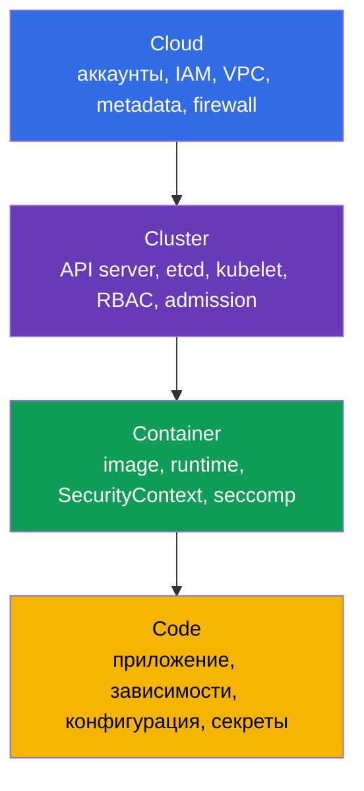
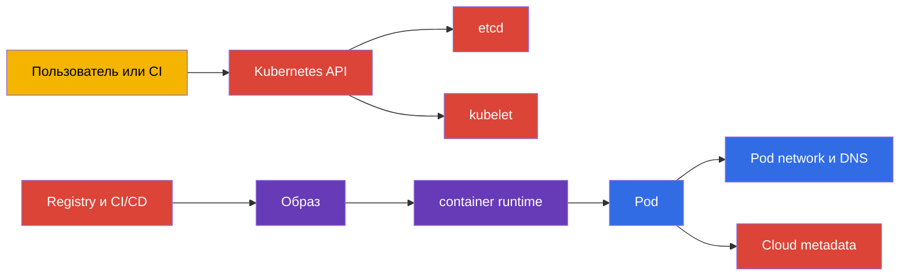
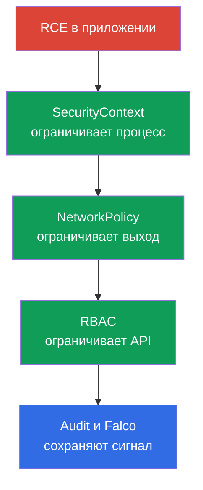

[Eng version](README.md) · [Versión en español](es.md) · [Version française](fr.md) · [Deutsche Version](de.md) · [ქართული ვერსია](ge.md) · [繁體中文版](tw.md) · [日本語版](jp.md)

# Глава 02. Модель безопасности Kubernetes: 4C, поверхность атаки, фазы атаки

> **Что дальше.** В главе 01 определены формат CKS, домены и инструменты. Теперь нужна общая модель, по которой принимают технические решения: что именно защищать, от кого и каким слоем. Эта глава - фундамент для всех шести доменов CKS: Cluster Setup (15%), Cluster Hardening (15%), System Hardening (10%), Minimize Microservice Vulnerabilities (20%), Supply Chain Security (20%) и Monitoring, Logging and Runtime Security (20%).

> **Что нужно из CKA.** Устройство control plane, worker node, kubelet, CNI и путь запроса к API разобраны в [главе 02 CKA](../../../cka/course/02/ru.md). Здесь они рассматриваются только как объекты защиты и источники риска.

## 02.1. Модель 4C: что защищаем

Модель **4C** делит безопасность Kubernetes на четыре вложенных слоя: Cloud, Cluster, Container и Code. Внешний слой не заменяет внутренний. Скомпрометированный workload можно ограничить `NetworkPolicy` и `SecurityContext`, но это не исправит публичный API endpoint или доступный всем `docker.sock`. И наоборот, защищённая сеть не исправит уязвимость в приложении.



| Слой | Что является активом | Типичный путь атаки | Базовый контроль |
|---|---|---|---|
| Cloud | учётные данные cloud provider, VPC, metadata, диски и snapshots | Pod запрашивает `169.254.169.254` и получает роль ноды | закрыть metadata на сетевом уровне, использовать минимальные IAM-права, ограничить security group |
| Cluster | Kubernetes API, etcd, kubelet, PKI, RBAC | анонимный или избыточно авторизованный запрос к API | TLS, `RBAC`, отключение anonymous access, audit, актуальные версии |
| Container | образ, container runtime, namespaces, процессы и файловая система | уязвимый образ, `privileged` Pod, container escape | минимальный образ, `SecurityContext`, seccomp, AppArmor, `RuntimeClass` |
| Code | исходный код, зависимости, конфигурация и секреты | RCE в приложении, утечка Secret, вредоносная зависимость | review, dependency scan, SBOM, не хранить секреты в коде, безопасная конфигурация |

4C полезна как порядок проверки. Если у пода есть право читать все `Secrets`, сначала исправляют Cluster-слой - RBAC. Если процесс внутри пода способен установить утилиту и скачать payload, нужны ограничения Container-слоя и контроль egress. Если endpoint приложения принимает произвольные команды, ни один Kubernetes-манифест не заменит исправление Code-слоя.

### Быстрая инвентаризация границ

Перед hardening полезно зафиксировать фактическую поверхность. Команды ниже ничего не меняют и подходят для обычного доступа администратора к кластеру:

```bash
# Точки входа и версия control plane
kubectl cluster-info
kubectl get --raw=/version

# Кто имеет широкие cluster-wide права
kubectl get clusterrolebinding -o jsonpath='{range .items[?(@.roleRef.name=="cluster-admin")]}{.metadata.name}{"\t"}{range .subjects[*]}{.kind}:{.name}{" "}{end}{"\n"}{end}'

# Нагрузки с явными опасными признаками
kubectl get pods -A -o json | jq -r '
  .items[]
  | select(.spec.hostNetwork == true or .spec.hostPID == true or .spec.hostIPC == true)
  | "\(.metadata.namespace)/\(.metadata.name) uses host namespace"'

# На ноде: слушающие TCP/UDP-порты и процессы-владельцы
sudo ss -tulpn
```

`cluster-admin` не всегда ошибка: он нужен отдельным системным компонентам и контролируемым администраторам. Результат инвентаризации - список субъектов, обоснование доступа, владелец и дата следующего пересмотра. Не удаляйте binding только потому, что его имя выглядит подозрительно: сначала проверьте назначение и протестируйте замену минимальной ролью.

## 02.2. Поверхность атаки Kubernetes

**Поверхность атаки** - все точки, через которые злоумышленник может получить доступ, выполнить действие, закрепиться или извлечь данные. Она не ограничена `kubectl`: у кластера есть сеть, ноды, образы, CI/CD, DNS и внешние облачные API.



Рассматривайте следующие зоны отдельно.

- **Control plane.** `kube-apiserver` принимает запросы управления. Слабые authentication/authorization настройки, оставленный `--anonymous-auth=true`, небезопасные admission rules или доступ API из интернета превращают его в основной вход в кластер. `etcd` содержит состояние кластера и Secret-данные, поэтому его клиентский порт и сертификаты нельзя делать доступными workload.
- **kubelet и нода.** Kubelet запускает контейнеры и имеет учётные данные ноды. Доступ к `10250`, сокету container runtime, SSH или write-доступ к static Pod manifests часто равнозначен контролю над нодой. Нода - часть доверенной базы, а не просто место исполнения Pod.
- **Сеть Pod.** В плоской сети скомпрометированный Pod может сканировать сервисы, обращаться к DNS, API, metadata или соседним workload. Защитой являются default-deny, точечные ingress/egress правила, сегментация namespace и шифрование там, где оно требуется.
- **Образы и supply chain.** Тег `latest`, неизвестный registry, зависимость с CVE или подменённый build artifact создают угрозу ещё до запуска Pod. Нужны digest, сканирование, SBOM, подпись и policy допуска.
- **Runtime.** `privileged`, `hostPath`, `hostPID`, лишние capabilities и writable root filesystem помогают атакующему перейти от RCE в приложении к ноде или закрепиться в контейнере.
- **Данные и идентичности.** `Secrets`, ServiceAccount tokens, kubeconfig, сертификаты и cloud credentials часто ценнее самого контейнера. Base64 в `Secret` не является шифрованием, а чтение `Secrets` через RBAC требует такого же контроля, как доступ к production database.

Ниже - минимальный пример workload, который уменьшает риск на Container-слое. Поля специально не разбираются повторно: их семантика дана в CKA, а CKS развивает hardening в главе 18.

```yaml
apiVersion: v1
kind: Pod
metadata:
  name: 4c-demo
  namespace: default
spec:
  securityContext:
    runAsNonRoot: true
    runAsUser: 10001
  containers:
  - name: app
    image: registry.k8s.io/pause:3.10
    securityContext:
      allowPrivilegeEscalation: false
      readOnlyRootFilesystem: true
      capabilities:
        drop:
        - ALL
      seccompProfile:
        type: RuntimeDefault
```

Примените манифест и проверьте, что фактически попало в `PodSpec`:

```bash
kubectl apply -f 4c-demo.yaml
kubectl get pod 4c-demo -o jsonpath='{.spec.securityContext.runAsNonRoot}{"\n"}'
kubectl get pod 4c-demo -o jsonpath='{.spec.containers[0].securityContext.seccompProfile.type}{"\n"}'
kubectl delete pod 4c-demo
```

Этот пример не заменяет policy. Он защищает только Pod, который уже создан с такими полями. Cluster-level правила должны не допускать небезопасный манифест в первую очередь.

## 02.3. Фазы атаки: от initial access до exfiltration

Один инцидент обычно проходит через несколько фаз. Удобная упрощённая kill chain для Kubernetes основана на тактиках MITRE ATT&CK for Containers. Она нужна не для механического навешивания меток, а чтобы определить, где предотвратить действие и какой сигнал сохранить для расследования.

```mermaid
flowchart LR
    access["Initial access<br>уязвимый Ingress, украденный token"] --> exec["Execution<br>команда в Pod или RCE"]
    exec --> persist["Persistence<br>новый workload, CronJob, RBAC binding"]
    persist --> privesc["Privilege escalation<br>privileged Pod, bind, escalate"]
    privesc --> lateral["Lateral movement<br>API, сеть Pod, metadata"]
    lateral --> exfil["Exfiltration<br>Secrets, данные, внешний endpoint"]
    style access fill:#db4437,color:#fff
    style exec fill:#f4b400,color:#000
    style persist fill:#673ab7,color:#fff
    style privesc fill:#db4437,color:#fff
    style lateral fill:#326ce5,color:#fff
    style exfil fill:#db4437,color:#fff
```



| Фаза | Пример в Kubernetes | Как ограничить | Что проверить и сохранить |
|---|---|---|---|
| Initial access | публичный API, уязвимый Ingress, credential из CI log | закрыть внешний доступ, TLS, MFA/IAM в cloud, исправить приложение | Ingress/access logs, API audit events, события authentication |
| Execution | RCE запускает shell или `curl` внутри контейнера | минимальный образ, non-root, seccomp, AppArmor, запрет `exec` при необходимости | Falco event, process tree, container ID, время и node |
| Persistence | attacker создаёт `CronJob`, DaemonSet или ServiceAccount binding | least-privilege RBAC, admission policy, review изменений GitOps | audit records `create`/`patch`, diff манифестов, новый subject в binding |
| Privilege escalation | доступны `privileged`, `hostPath`, `pods/exec`, `bind` или `escalate` | PSA/policy, capabilities drop, запрет опасных RBAC verbs | `PodSpec`, RBAC bindings, kubelet/runtime logs |
| Lateral movement | Pod читает metadata, API или обращается к соседнему namespace | default-deny egress/ingress, DNS allowlist, минимальный IAM и ServiceAccount | flow logs, Hubble/Falco, denied network events |
| Exfiltration | Secret отправлен во внешний сервис или загружен в shell | ограничить `secrets` RBAC и egress, encryption at rest, DLP на границе | audit event чтения Secret, DNS/proxy logs, network flow |

Пример корреляции: неожиданное создание `ClusterRoleBinding` после `kubectl exec` в application Pod - это не три независимые записи. Это вероятная последовательность execution → persistence/privilege escalation. Сохраняйте контекст: identity из audit log, UID Pod, node, время в UTC, образ по digest и исходящий адрес.

### Проверка наблюдаемости до инцидента

Полезно убедиться, что audit и runtime-сигналы вообще доступны, пока нет аварии:

```bash
# Последние события Kubernetes полезны для быстрой первичной диагностики,
# но не заменяют audit log: events имеют короткий срок хранения.
kubectl get events -A --sort-by='.lastTimestamp'

# Проверить, какие ServiceAccount используются запущенными Pod.
kubectl get pods -A -o custom-columns='NAMESPACE:.metadata.namespace,POD:.metadata.name,SA:.spec.serviceAccountName'

# На ноде с Falco: проверить состояние сервиса и последние сигналы.
sudo systemctl is-active falco
sudo journalctl -u falco --since '15 minutes ago' --no-pager
```

Последние две команды применимы, если Falco установлен как systemd service. При установке через DaemonSet используйте `kubectl -n falco get pods` и `kubectl -n falco logs <pod>`. Конкретную настройку audit и Falco разберём в главах 29-32.

## 02.4. Принципы, которые связывают controls

Security controls не следует добавлять случайно. Четыре принципа позволяют оценить любое решение.

1. **Defense in depth.** Один отказ не должен открывать весь путь. Например, исправленный образ уменьшает вероятность RCE, `SecurityContext` ограничивает процесс после RCE, NetworkPolicy сдерживает lateral movement, а Falco и audit помогают заметить остаточный риск.
2. **Least privilege.** Идентичность, workload и процесс получают только необходимые права. Практически это означает точные `verbs` в RBAC, выделенный ServiceAccount, `drop: [ALL]`, отсутствие `privileged`, минимум IAM permissions и короткоживущие credentials.
3. **Immutability.** Production workload не должен «чиниться» установкой пакета внутри работающего контейнера. Образ пересобирают, сканируют, подписывают и развёртывают по digest. Это уменьшает поверхность и делает состояние воспроизводимым.
4. **Minimize attack surface.** Неустановленный пакет, закрытый порт, отключённый endpoint и невыданный token нельзя использовать. Инвентаризация сервисов, открытых портов, RBAC и образов должна быть регулярной.
5. **Zero trust в сети.** Нахождение в одном cluster или namespace не должно автоматически давать доверие. Сеть начинается с default-deny, затем добавляются узкие разрешения по identity, порту, направлению и при необходимости L7.



Принципы могут конфликтовать с удобством. Например, `readOnlyRootFilesystem` требует writable volume для `/tmp`; default-deny egress требует отдельного разрешения DNS; отказ от общего `cluster-admin` требует несколько ролей. Это нормальная инженерная работа: сначала задать ограничение, затем добавлять только измеримо нужные исключения.

## 02.5. Как домены экзамена ложатся на модель угроз

Модель не заменяет программу CKS. Она показывает, почему главы сгруппированы по доменам и на какой фазе атаки они дают наибольший эффект.

| Слой или фаза | Домен CKS | Главы курса | Основной результат |
|---|---|---|---|
| Cloud, Pod network, initial access и lateral movement | Cluster Setup - 15% | [04](../04/ru.md), [05](../05/ru.md), [06](../06/ru.md), [07](../07/ru.md), [08](../08/ru.md), [09](../09/ru.md) | сегментация сети, защита metadata/endpoints, CIS и TLS hardening |
| Cluster API, persistence и privilege escalation | Cluster Hardening - 15% | [10](../10/ru.md), [11](../11/ru.md), [12](../12/ru.md), [13](../13/ru.md) | минимальные права, безопасные ServiceAccount, закрытый API, своевременные обновления |
| Node и container runtime, privilege escalation | System Hardening - 10% | [14](../14/ru.md), [15](../15/ru.md), [16](../16/ru.md), [17](../17/ru.md) | сокращение поверхности ноды, MAC и syscall filtering |
| Container, данные и lateral movement | Minimize Microservice Vulnerabilities - 20% | [18](../18/ru.md), [19](../19/ru.md), [20](../20/ru.md), [21](../21/ru.md), [22](../22/ru.md), [23](../23/ru.md) | hardened workloads, policy admission, защита Secret, sandbox и mTLS |
| Code и build pipeline, initial access | Supply Chain Security - 20% | [24](../24/ru.md), [25](../25/ru.md), [26](../26/ru.md), [27](../27/ru.md), [28](../28/ru.md) | доверенный и проверяемый artifact до запуска |
| Execution, persistence, exfiltration и расследование | Monitoring, Logging and Runtime Security - 20% | [29](../29/ru.md), [30](../30/ru.md), [31](../31/ru.md), [32](../32/ru.md) | обнаружение, расследование, иммутабельность и доказательства действий |

Одна угроза часто относится к нескольким строкам. Например, кражу ServiceAccount token предотвращают глава 11 и NetworkPolicy из главы 04, ограничивают её последствия RBAC из главы 10, а чтение `Secret` фиксирует audit из главы 32. Не выбирайте один «лучший» control: выберите набор независимых барьеров.

## 02.6. Как это применяют в продакшене

- **Threat model как артефакт изменения.** Для нового namespace, Ingress или внешнего registry команда фиксирует активы, доверенные границы, entry points, возможный ущерб и controls. Такой документ должен обновляться вместе с архитектурой, а не лежать отдельным PDF.
- **Baseline и исключения.** Вводят безопасный baseline: non-root, `RuntimeDefault`, default-deny, точечные RBAC roles, запрет небезопасных image registries. Исключение оформляют с владельцем, сроком и проверкой, а не как постоянный `cluster-admin`.
- **Наблюдаемость связана с идентичностью.** Audit logs, network flow и runtime alerts должны позволять связать действие с user, ServiceAccount, Pod, node и image digest. Без этого kill chain нельзя подтвердить.
- **Контроль изменений в CI/CD.** Манифесты проходят статический анализ и policy checks до merge; образ сканируется, получает SBOM и digest. Production deployment использует проверяемый artifact, а не локально собранный тег.
- **Проверка восстановления.** Для высокорисковых путей проводят tabletop или безопасную эмуляцию: попытка доступа к metadata, создание запрещённого Pod, egress к неразрешённому адресу. Проверяют не только отказ, но и появление нужного audit/Falco/network события.

## 02.7. Мини-глоссарий

- **4C** - модель слоёв Cloud, Cluster, Container и Code для оценки защиты Kubernetes.
- **Attack surface** - набор доступных точек входа и действий, которые может использовать атакующий.
- **Defense in depth** - независимые уровни защиты, снижающие последствия отказа одного control.
- **Exfiltration** - несанкционированный вывод данных за пределы доверенной границы.
- **Immutable infrastructure** - подход, при котором production artifact не меняют в runtime, а заменяют новой проверенной версией.
- **Kill chain** - последовательность фаз атаки от initial access до достижения цели.
- **Least privilege** - выдача только минимально необходимых прав.
- **Lateral movement** - перемещение атакующего от исходного workload к другим системам, данным или идентичностям.
- **Zero trust** - отказ от неявного доверия на основании сети, namespace или расположения.

## 02.8. Итоги главы

- 4C разделяет защиту на Cloud, Cluster, Container и Code; слабое внешнее звено не компенсируется внутренним.
- Основные поверхности Kubernetes - API, etcd, kubelet и ноды, сеть Pod, образы/CI/CD, runtime, Secret и идентичности.
- Kill chain помогает связать preventive controls с сигналами для расследования: initial access, execution, persistence, privilege escalation, lateral movement и exfiltration.
- Defense in depth, least privilege, immutability, минимизация поверхности и zero trust превращают разрозненные настройки в согласованный baseline.
- Шесть доменов CKS покрывают разные слои и фазы, поэтому incident response и hardening требуют их совместного применения.

## 02.9. Как это пригодится: на экзамене и в реальной работе

**На экзамене.** Задание может выглядеть как локальная правка `NetworkPolicy`, RBAC, static Pod manifest или `SecurityContext`. Модель 4C помогает быстро определить слой и не применять неподходящий control: например, запретить Pod egress к metadata, а не пытаться решить это только RBAC. Kill chain подсказывает, почему в задаче одновременно требуют ограничить доступ и подтвердить логом результат.

**В реальной работе.** Модель делает security review предметным. Вместо вопроса «кластер защищён?» команда задаёт проверяемые вопросы: кто обращается к API, какие Pod имеют доступ к host, кто может читать `Secrets`, какие образы разрешены, куда workload может ходить и какие события останутся после инцидента. Ответы становятся backlog hardening с понятными владельцами.

## 02.10. Вопросы для самопроверки

1. Почему защита Container-слоя не компенсирует публичный API endpoint или избыточные cloud IAM-права?
2. Какие активы находятся на каждом из слоёв 4C в вашем кластере?
3. Чем отличается persistence через `CronJob` от privilege escalation через `ClusterRoleBinding`?
4. Какие controls ограничат Pod, скомпрометированный через RCE, до того как он прочитает Secret в другом namespace?
5. Почему default-deny egress без разрешения DNS может сломать приложение, и как это связано с zero trust?
6. Какие пять полей вы должны суметь сопоставить между audit event, runtime alert и network flow, чтобы расследовать инцидент?
7. Почему использование образа по digest и `readOnlyRootFilesystem` поддерживает принцип immutability?

## Практика

Для этой фундаментальной главы отдельной лабораторной работы нет. Используйте модель как чеклист в следующих работах: [лаба 101 - NetworkPolicy и защита metadata](../../labs/101/README_RU.MD), [лаба 104 - RBAC, ServiceAccount и API](../../labs/104/README_RU.MD), [лаба 107 - PSA и SecurityContext](../../labs/107/README_RU.MD) и [лаба 112 - Falco, audit и иммутабельность](../../labs/112/README_RU.MD).

---
[Оглавление](../README_RU.md) · [Глава 01](../01/ru.md) · [Глава 03](../03/ru.md)
