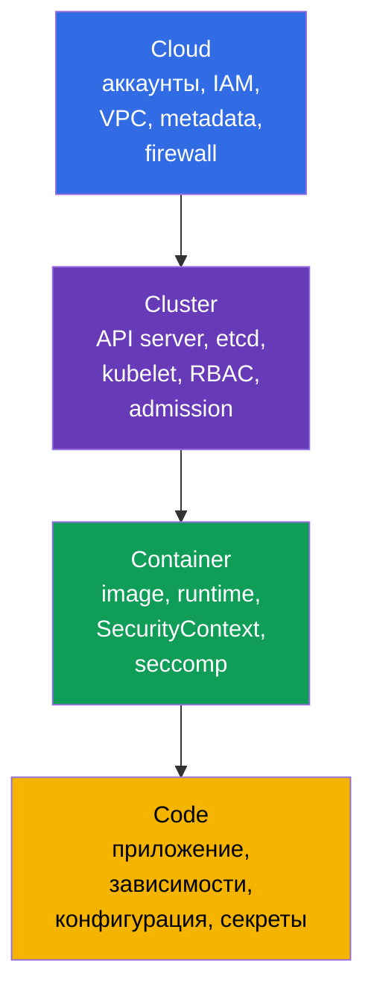
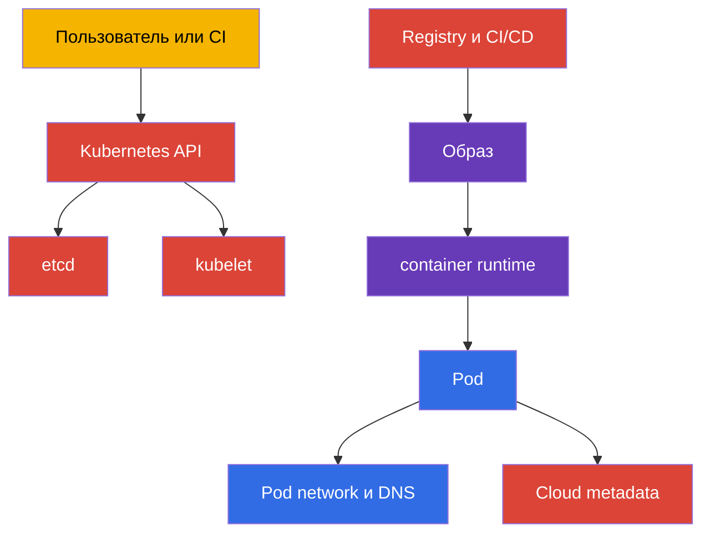
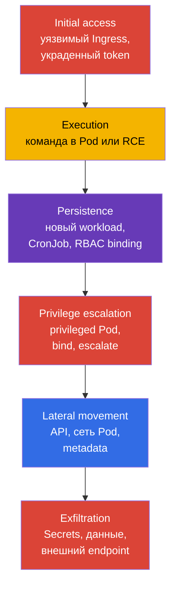
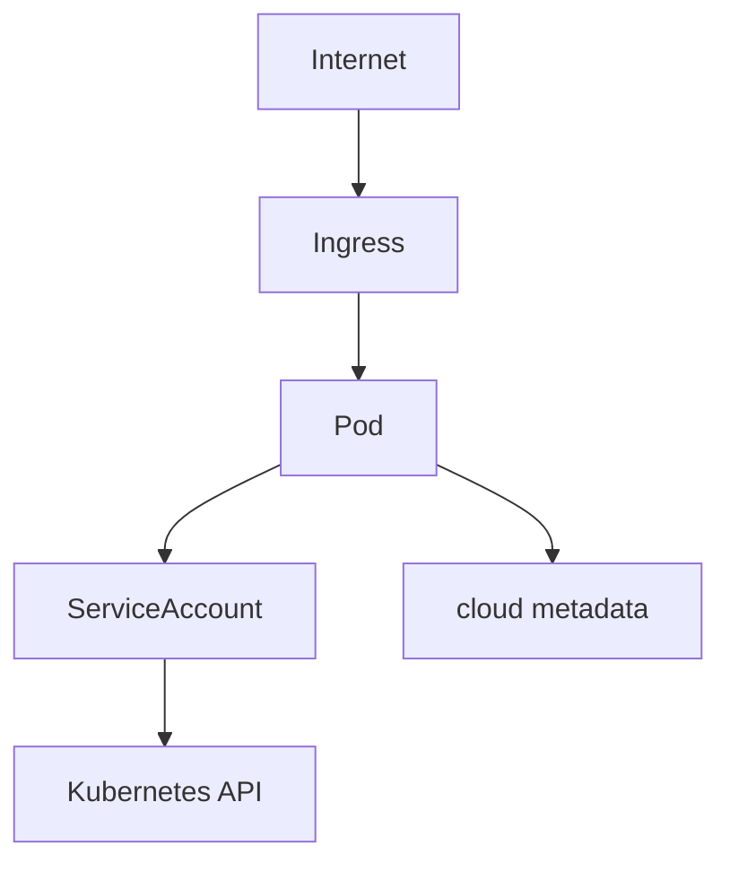
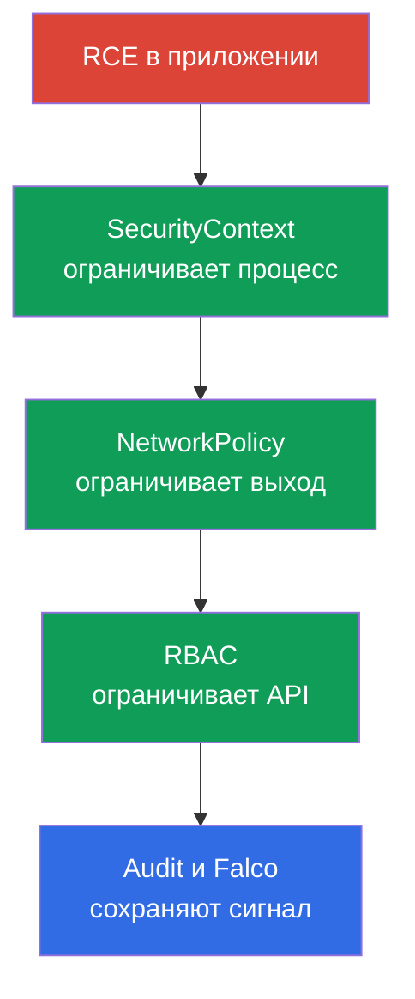

<!-- Standalone RU release: ссылки на переводы удалены, потому что соответствующие файлы не входят в архив. -->

# Глава 02. Модель безопасности Kubernetes: 4C, поверхность атаки, фазы атаки

> **Что дальше.** В главе 01 определены формат CKS, домены и инструменты. Теперь нужна общая модель, по которой принимают технические решения: что именно защищать, от кого и каким слоем. Эта глава - фундамент для всех шести доменов CKS: Cluster Setup (15%), Cluster Hardening (15%), System Hardening (10%), Minimize Microservice Vulnerabilities (20%), Supply Chain Security (20%) и Monitoring, Logging and Runtime Security (20%).

> **Что нужно из CKA.** Устройство control plane, worker node, kubelet, CNI и путь запроса к API разобраны в [главе 02 CKA](../../../cka/course/02/ru.md). Здесь они рассматриваются только как объекты защиты и источники риска.

> 🧠 4C объясняет, почему защита одного слоя не компенсирует слабость другого.

## 02.1. Модель 4C: что защищаем

Подробный разбор модели 4C с фокусом на терминологию и shared responsibility дан в [главе 03 курса KCSA](../../../kcsa/course/03/ru.md); здесь модель применяется прикладно, как чеклист для технических решений CKS, а не повторяется с нуля.

Модель **4C** делит безопасность Kubernetes на четыре вложенных слоя: Cloud, Cluster, Container и Code. Внешний слой не заменяет внутренний. Скомпрометированный workload можно ограничить `NetworkPolicy` и `SecurityContext`, но это не исправит публичный API endpoint или доступный workload container-runtime/CRI socket. `docker.sock` - лишь частный случай для нод, где действительно используется Docker; в современных кластерах типичны сокеты containerd или CRI-O. И наоборот, защищённая сеть не исправит уязвимость в приложении.



| Слой | Что является активом | Типичный путь атаки | Базовый контроль |
|---|---|---|---|
| Cloud | учётные данные cloud provider, VPC, metadata, диски и snapshots | Pod запрашивает `169.254.169.254` и получает роль ноды | не допускать получения Pod credentials/identity ноды; использовать provider-specific workload identity и metadata controls, минимальные IAM-права и security group |
| Cluster | Kubernetes API, etcd, kubelet, PKI, RBAC | анонимный или избыточно авторизованный запрос к API | TLS, `RBAC`, отключение anonymous access, audit, актуальные версии |
| Container | образ, container runtime, namespaces, процессы и файловая система | уязвимый образ, `privileged` Pod, container escape | минимальный образ, `SecurityContext`, seccomp, AppArmor, `RuntimeClass` |
| Code | исходный код, зависимости, конфигурация и секреты | RCE в приложении, утечка Secret, вредоносная зависимость | review, dependency scan, SBOM, не хранить секреты в коде, безопасная конфигурация |

4C полезна как порядок проверки. Если у пода есть право читать все `Secrets`, сначала исправляют Cluster-слой - RBAC. Если процесс внутри пода способен установить утилиту и скачать payload, нужны ограничения Container-слоя и контроль egress. Если endpoint приложения принимает произвольные команды, ни один Kubernetes-манифест не заменит исправление Code-слоя.

> 🎯 Порядок Cloud → Cluster → Container → Code и базовые команды каждого шага.

### Быстрая инвентаризация границ

Модель 4C выше говорит: внешний слой не заменяется внутренним, и слабое звено снаружи нельзя компенсировать защитой внутри. Значит, и инвентаризация должна идти в том же порядке - **Cloud → Cluster → Container → Code**, а не начинаться с самого привычного (Cluster). Ниже - стратегия по каждому из четырёх слоёв: что именно проверяем, каким инструментом это в принципе можно увидеть и какие команды дают ответ.

| Слой | Что инвентаризируем | Чем проверяется | Шаги ниже |
|---|---|---|---|
| Cloud (или инфраструктурный провайдер) | публичный доступ к API endpoint, identity ноды и её права в облаке, hardening metadata service, сетевая граница, доступ к панели управления провайдера | CLI провайдера (нужны отдельные права в его аккаунте) + одна провайдер-независимая проверка изнутри кластера | шаг 1 |
| Cluster | версия и точки входа control plane, широкие RBAC-права, опасные настройки Pod, открытые порты ноды | `kubectl` и SSH на ноду | шаги 2-5 |
| Container | какие образы реально запущены, mutable-теги, неутверждённые registry | `kubectl` | шаг 6 |
| Code | уязвимые зависимости с CVE, эксплуатируемые логические уязвимости приложения (SSRF, injection, обход авторизации, IDOR), небезопасные дефолты конфигурации, секреты в коде и в манифесте | `kubectl` покрывает только последний пункт (секрет в манифесте); остальное - SBOM, dependency scan, SAST, code review и pentest | шаг 7 - частично |

Важное ограничение честно: `kubectl` видит только то, что попало в Kubernetes API, поэтому инвентаризация покрывает четыре слоя очень неравномерно. Cloud-слой он в основном не видит вовсе (IAM-роли, VPC, снапшоты - вне API кластера), а Code-слой - в наименьшей степени из всех: манифест покажет секрет, вписанный в `env`, но принципиально не покажет ни уязвимую библиотеку внутри образа, ни SQL-injection или обход авторизации в коде приложения, ни секрет, захардкоженный в исходниках. Это не недостаток команд ниже, а граница самого инструмента: Kubernetes API ничего не знает о содержимом вашего приложения. Полноценная работа с Code-слоем - это SBOM и сканирование зависимостей (главы 25 и 28), статический анализ (глава 27), а логические уязвимости приложения вообще не решаются инструментами CKS: их находят code review, SAST/DAST и pentest, и они остаются ответственностью разработки, а не платформенной команды. Инвентаризация ниже - быстрый снимок границ по доступным из кластера данным, а не полный аудит всех четырёх слоёв. Команды ничего не меняют и подходят для обычного доступа администратора к кластеру; каждый шаг не зависит от предыдущего.

**Шаг 1 (Cloud). Доступен ли cloud metadata endpoint изнутри Pod.**

Cloud-слой почти целиком за пределами Kubernetes API, поэтому его инвентаризация делится на две части: что можно проверить изнутри кластера и что требует CLI провайдера.

Изнутри кластера проверяется один конкретный, well-known класс риска: способен ли произвольный Pod вообще достучаться до metadata service ноды и потенциально украсть её credentials. Адрес `169.254.169.254` - link-local IP, одинаковый у AWS, GCP, Azure, Hetzner и большинства других провайдеров, поэтому проверку сетевой достижимости можно сделать провайдер-независимой:

```bash
kubectl run metadata-probe --rm -i --restart=Never --image=curlimages/curl:8.11.1 -- \
  curl -s -o /dev/null -w 'http_code=%{http_code}\n' --max-time 2 http://169.254.169.254/
```

Команда запускает одноразовый Pod (`--rm` удаляет его сразу после завершения) и обращается к **корню** endpoint, а не к пути конкретного провайдера. Это принципиально: интересует не содержимое metadata, а сам факт сетевой достижимости. Любой полученный HTTP-код - `200`, `401`, `403`, `404` - означает, что endpoint ответил, то есть Pod до него дошёл: это и есть тревожный сигнал независимо от облака. Код `000` означает, что ответа не было вовсе (таймаут или отказ соединения) - endpoint для Pod недостижим, что и является целью hardening. Команда не читает и не сохраняет тело ответа, только код, поэтому не может случайно утащить реальные credentials в лог.

Если после обнаружения достижимости нужно понять, что именно оттуда читается, дальше уже придётся использовать путь и заголовок конкретного провайдера - они несовместимы между собой:

| Провайдер | Путь | Обязательный заголовок |
|---|---|---|
| AWS (EC2 IMDS) | `/latest/meta-data/` | нет для IMDSv1; для IMDSv2 нужен токен, полученный отдельным `PUT /latest/api/token` |
| GCP | `/computeMetadata/v1/` | `Metadata-Flavor: Google` |
| Azure | `/metadata/instance?api-version=2021-02-01` | `Metadata: true` |
| Hetzner Cloud | `/hetzner/v1/metadata` | нет |

Именно из-за этих расхождений проверка выше сознательно не привязана ни к одному пути: команда с `/latest/meta-data/` дала бы `404` на GCP и Azure и была бы неверно прочитана как "недостижимо", хотя endpoint на самом деле отвечает. Требование заголовка (`Metadata-Flavor`, `Metadata: true`) - это защита от простейшего SSRF, а не от Pod: Pod может отправить любой заголовок сам, поэтому наличие заголовка не отменяет необходимости закрыть сетевой путь.

**Важно не путать два разных вывода.** «Endpoint достижим» и «credentials получены» - не одно и то же, и смешивать их в отчёте нельзя:

- *Достижимость* - это **находка и предпосылка**: сетевой путь от Pod до metadata service не закрыт. Её достаточно, чтобы поставить задачу на исправление, но она сама по себе не доказывает компрометацию.
- *Извлекаемость credentials* - это **подтверждённый путь эксплуатации**, и он требует, чтобы сработали и остальные условия провайдера.

Хороший пример разницы - AWS. При `HttpTokens=required` (IMDSv2-only) обращение без токена ничего не даст, а токен запрашивается отдельным `PUT`, ответ на который живёт ровно `HttpPutResponseHopLimit` сетевых хопов. При hop limit `1` ответ не доживает до Pod с собственным network namespace - то есть endpoint отвечает, probe показывает достижимость, а токен, а значит и credentials, получить не удаётся. Обратите внимание, что Pod с `hostNetwork: true` дополнительным хопом не является, поэтому для него это ограничение не работает. Практический вывод: фиксируйте достижимость как отдельный факт, а вывод о краже credentials делайте только после проверки конкретных настроек провайдера.

Остальное на этом слое требует CLI провайдера и отдельных прав в его аккаунте - `kubectl` эти объекты не видит в принципе.

> 🏭 Provider-specific CLI для проверки публичного доступа к API и hardening metadata service.

Вопросы одинаковы у всех провайдеров, различаются только команды:

1. Открыт ли Kubernetes API в интернет и из каких сетей?
2. Какая identity привязана к нодам и что она может в облаке, если её украдут через Pod?
3. Включён ли hardening metadata service (у AWS - IMDSv2-only и ограниченный hop limit; у GCP/Azure - требование заголовка плюс сетевые правила)?
4. Кто может создать/изменить ноду, диск, снапшот или сетевое правило вне Kubernetes?

Пример для AWS/EKS (у GCP это `gcloud container clusters describe` и `gcloud compute instances describe`, у Azure - `az aks show` и `az vm show`; вопросы те же, вывод и имена полей другие):

```bash
# Вопрос 1: виден ли API server из интернета и кому
aws eks describe-cluster --name "$CLUSTER" \
  --query 'cluster.resourcesVpcConfig.{public:endpointPublicAccess,private:endpointPrivateAccess,cidrs:publicAccessCidrs}'

# Вопрос 3: hop limit `1` - security-first default; `2` проверяют только там,
# где Pod обоснованно должен сам обращаться к IMDS
aws ec2 describe-instances --filters "Name=tag:eks:cluster-name,Values=$CLUSTER" \
  --query 'Reservations[].Instances[].{id:InstanceId,imds:MetadataOptions.HttpTokens,hop:MetadataOptions.HttpPutResponseHopLimit}'
```

AWS EKS Best Practices Guide различает два разных случая, и их нельзя сводить к одному "baseline". Если Pod не должен наследовать права instance profile ноды (обычный случай при IRSA/EKS Pod Identity), документация прямо рекомендует `HttpTokens=required` и `HttpPutResponseHopLimit=1` в разделе "Restrict access to the instance profile assigned to the worker node" - именно это и блокирует получение credentials ноды через Pod. Значение `HttpPutResponseHopLimit=2` документация рекомендует отдельно и только тогда, когда приложению действительно нужен собственный доступ к IMDS ("When your application needs access to IMDS... increase the hop limit to 2") - это обоснованное исключение, а не общий security baseline для всех контейнерных нагрузок.

**Отдельный случай: self-managed кластер на «обычных» серверах** (kubeadm на bare metal, VM в Hetzner и подобных).

> 🔬 Проверка self-managed кластера.

Здесь может не быть облачного IAM вообще - красть у ноды нечего в смысле cloud-ролей, и вопрос 2 частично снимается. Но Cloud-слой не исчезает, а заменяется слоем инфраструктурного провайдера, и вопросы становятся такими: доступен ли API server и SSH из интернета или только из приватной сети; кто имеет доступ к панели управления провайдера (создание/удаление серверов, доступ к консоли и снапшотам - это фактический root на нодах); есть ли у провайдера свой metadata endpoint с чувствительными данными (у Hetzner это `169.254.169.254/hetzner/v1/metadata`, где может лежать в том числе cloud-init user data); закрыт ли трафик между серверами сетевыми правилами провайдера, а не только `NetworkPolicy` внутри кластера. Проверка `metadata-probe` выше здесь так же применима - она не привязана к облаку.

**Шаг 2 (Cluster). Точки входа и версия control plane.**

```bash
kubectl cluster-info
kubectl get --raw=/version
```

`kubectl cluster-info` показывает адрес API server и служебных сервисов - это первая точка входа, которую видит любой клиент кластера. `kubectl get --raw=/version` возвращает точную версию Kubernetes control plane: она нужна, чтобы дальше сверять доступные флаги и известные CVE именно для этой версии, а не гадать по документации произвольного релиза.

**Шаг 3 (Cluster). Кто имеет широкие cluster-wide права.**

```bash
kubectl get clusterrolebinding -o jsonpath='{range .items[?(@.roleRef.name=="cluster-admin")]}{.metadata.name}{"\t"}{range .subjects[*]}{.kind}:{.name}{" "}{end}{"\n"}{end}'
```

Эта команда выводит только те `ClusterRoleBinding`, которые ссылаются на встроенную роль `cluster-admin` - самую широкую роль в кластере, дающую полный доступ ко всем ресурсам. Для каждого найденного binding строка показывает его имя, а затем список subjects (`User`, `Group` или `ServiceAccount`), которым эта роль назначена. Внутренний `range` по `.subjects[*]` нужен, потому что один binding может ссылаться сразу на несколько subjects.

**Проверки по имени `cluster-admin` недостаточно.** Уровень доступа задаёт не имя роли, а сочетание её правил и области действия её binding. `ClusterRole` с `apiGroups: ["*"]`, `resources: ["*"]` и `verbs: ["*"]` сама по себе описывает набор разрешений - практически неограниченный доступ к Kubernetes resource API, - но фактическая область действия зависит от того, чем эту роль привязали: `ClusterRoleBinding` делает её действующей cluster-wide во всех namespace, а `RoleBinding`, ссылающийся на ту же `ClusterRole`, ограничивает namespaced-разрешения тем namespace, где создан этот `RoleBinding`. Такой механизм позволяет переиспользовать один набор правил в нескольких namespace вместо создания одинаковых `Role`; помимо этого `ClusterRole` используется для permissions на cluster-scoped ресурсы (например `nodes`), на non-resource endpoints (`/healthz`) и для cluster-wide доступа через `ClusterRoleBinding`. На реальных кластерах такие роли появляются постоянно: под безобидными именами вроде `platform-superuser`, `ci-deployer` или `monitoring-full`, созданные "чтобы просто работало" или намеренно, чтобы обойти review по слову `cluster-admin`. Поиск по имени их не увидит вовсе, а поиск только по правилам роли без проверки её binding даст неверную оценку risk - широкие права, привязанные `RoleBinding` в одном namespace, это другой масштаб угрозы, чем те же права через `ClusterRoleBinding`.

Строго говоря, такая роль **не буквальный эквивалент** встроенного `cluster-admin`: у того в определении два правила, а не одно - wildcard по ресурсам и отдельное wildcard-правило по `nonResourceURLs`, покрывающее non-resource endpoints вроде `/healthz`, `/metrics` и `/debug/*`. Роль без второго правила этих путей не даёт, а также может быть сужена через `resourceNames` или изменена агрегацией (`aggregationRule`). Практически же, с точки зрения триажа, разница несущественна: контроль над всеми ресурсами API уже включает чтение всех Secret, создание Pod на любой ноде и правку RBAC, то есть путь к полному захвату кластера. Официальная документация Kubernetes для такого примера тоже осторожна в формулировке - "similar to the built-in `cluster-admin` role", а не "идентична". Вывод для практики от этого не меняется: искать нужно по правам, а не по имени.

```bash
# Шаг A: найти ВСЕ ClusterRole с полными wildcard-правами, независимо от имени
kubectl get clusterroles -o json | jq -r '
  .items[]
  | select(any(.rules[]?;
      ((.apiGroups // []) | index("*")) and
      ((.resources // []) | index("*")) and
      ((.verbs // []) | index("*"))))
  | .metadata.name
'
```

```bash
# Шаг B: найти binding, которые ссылаются на любую из найденных ролей
dangerous=$(kubectl get clusterroles -o json | jq -r '
  .items[]
  | select(any(.rules[]?;
      ((.apiGroups // []) | index("*")) and
      ((.resources // []) | index("*")) and
      ((.verbs // []) | index("*"))))
  | .metadata.name
')

kubectl get clusterrolebinding -o json \
  | jq -r --argjson names "$(echo "$dangerous" | jq -R . | jq -s .)" '
      .items[]
      | select(.roleRef.name as $r | $names | index($r))
      | "\(.metadata.name) -> роль \(.roleRef.name) (cluster-wide), subjects: \([.subjects[]? | "\(.kind):\(.name)"] | join(", "))"
    '

# Шаг B': та же роль может быть привязана и через RoleBinding - тогда права
# действуют только в одном namespace, но это тоже не "просмотрено" поиском
# по ClusterRoleBinding выше
kubectl get rolebinding -A -o json \
  | jq -r --argjson names "$(echo "$dangerous" | jq -R . | jq -s .)" '
      .items[]
      | select(.roleRef.kind == "ClusterRole" and (.roleRef.name as $r | $names | index($r)))
      | "\(.metadata.name) (namespace \(.metadata.namespace)) -> роль \(.roleRef.name) (только в этом namespace), subjects: \([.subjects[]? | "\(.kind):\(.name)"] | join(", "))"
    '
```

Шаг A проверяет каждое правило роли: полный доступ есть, если в одном правиле одновременно `*` в `apiGroups`, `*` в `resources` и `*` в `verbs`. `any(.rules[]?; ...)` важен - опасное правило может быть не первым в списке, а вторым или третьим, рядом с безобидными. Шаги B и B' берут найденные имена и показывают, какие binding их реально используют, кому и с каким scope: `ClusterRoleBinding` даёт cluster-wide доступ, а `RoleBinding` на ту же `ClusterRole` ограничивает его одним namespace - это разный масштаб угрозы при одинаковых правилах роли, и пропуск одного из двух видов binding даёт неполную картину. Непривязанная опасная роль - тоже проблема для review, но привязанная означает, что права уже кому-то выданы.

Отдельно стоит смотреть на более узкие, но всё ещё опасные шаблоны, которые под полный wildcard не попадают:

```bash
kubectl get clusterroles -o json | jq -r '
  .items[]
  | .metadata.name as $name
  | .rules[]?
  | select(((.verbs // []) | index("*"))
      and (((.apiGroups // []) | index("*") | not) or ((.resources // []) | index("*") | not)))
  | "\($name): verbs=* на apiGroups=\(.apiGroups // []) resources=\(.resources // [])"
'
```

Например, `verbs: ["*"]` только на `secrets` не является `cluster-admin`, но позволяет читать и изменять все секреты кластера - для многих моделей угроз это равнозначно полной компрометации. Аналогично опасны `create` на `pods` вместе с широким `hostPath`-разрешением на admission-уровне, `escalate`/`bind` на роли и `impersonate` на пользователей: они дают путь к повышению прав, даже когда сама роль выглядит узкой. Полный разбор таких шаблонов - в [главе 10](../10/ru.md).

> **На экзамене.** Вложенный `range` с фильтром `?(@.roleRef.name==...)` в одном jsonpath-выражении - то же самое, от чего предупреждает шаг 4: легко потерять скобку или кавычку, когда печатаешь быстро. Надёжнее разбить проверку на простой цикл, где каждый вызов `kubectl` спрашивает только одно поле без фильтров и вложенности:
>
> ```bash
> for crb in $(kubectl get clusterrolebinding -o name | cut -d/ -f2); do
>   role=$(kubectl get clusterrolebinding "$crb" -o jsonpath='{.roleRef.name}')
>   if [[ "$role" == "cluster-admin" ]]; then
>     echo "$crb:"
>     kubectl get clusterrolebinding "$crb" -o jsonpath='{range .subjects[*]}{.kind}:{.name}{" "}{end}'
>     echo
>   fi
> done
> ```
>
> `kubectl get clusterrolebinding -o name` печатает имена в виде `clusterrolebinding.rbac.authorization.k8s.io/<имя>`; `cut -d/ -f2` оставляет только само имя после `/`. Каждый `kubectl get clusterrolebinding "$crb" -o jsonpath='{.roleRef.name}'` проверяет ровно одно простое поле у одного конкретного binding - здесь нет ни фильтра `?(...)`, ни вложенного `range` для отбора самих binding, только для subjects внутри найденного совпадения, что заметно проще перепроверить глазами перед запуском. Медленнее, чем однострочник выше (отдельный запрос к API на каждый binding), но на экзаменационном кластере binding обычно не тысячи, а разница в надёжности печати важнее разницы в секундах.

**Шаг 4 (Cluster). Нагрузки с явными опасными признаками.**

> 🎯 Найти Pod с `privileged`, `hostNetwork/hostPID/hostIPC`, `hostPath`, добавленными capabilities или `runAsUser: 0`.

> **На экзамене.** Полная версия ниже (с отдельными `def`-функциями на каждый уровень проверки) - учебная: она показывает все шесть признаков сразу и почему они логически связаны, а не то, что реально стоит печатать под таймером. Даже короткий `jq`-фильтр с вложенным `select` и массивами легко испортить одной пропущенной скобкой именно тогда, когда нервничаешь из-за времени - под давлением надёжнее написать *менее элегантный*, но который почти невозможно испортить синтаксически, вариант через `grep`. Например, задание "найдите все Pod с hostNetwork в namespace `prod`":
>
> ```bash
> NS=prod
>
> for pod in $(kubectl get pods -n "$NS" -o jsonpath='{.items[*].metadata.name}'); do
>   if kubectl get pod "$pod" -n "$NS" -o json | grep hostNetwork | grep -q true; then
>     echo "$pod"
>   fi
> done
> ```
>
> Идея: получить список имён Pod одной простой командой, затем в цикле по одному Pod получать его JSON и грепать нужное поле - если найдено, печатать имя. Namespace вынесен в переменную `NS` в первой строке: он встречается в команде дважды, и под таймером легко поправить один вызов, забыв про второй - тогда скрипт молча начнёт искать Pod из одного namespace в другом. С переменной правка одна, и она в самом начале, где её видно. Два `grep` в пайпе делают проверку точной, оставаясь при этом простыми: первый оставляет только строку с `hostNetwork`, второй проверяет, что в ней есть `true`. Так отсекается `"hostNetwork": false` - поле присутствует, но риска нет. `grep -q` ничего не выводит, только возвращает код успеха/неудачи для `if`. Работает это потому, что `kubectl -o json` печатает pretty-printed JSON - каждое поле на своей строке, поэтому во второй `grep` попадает только строка `hostNetwork`, а не соседние поля. У подхода при большом количестве Pod в namespace те же ограничения масштаба, что и у остальных вариантов на этой странице (см. раздел про 10 000 Pod выше) - но для экзаменационного namespace из нескольких или пары десятков Pod это не имеет значения, а сама команда почти не сломается даже если печатать её быстро и без черновика. Тот же приём работает для любого булева поля: замените `hostNetwork` на `hostPID`, `hostIPC` или `privileged`.

Идея: пройти по всем Pod во всех namespace и оставить только те, у которых есть хотя бы один из известных опасных признаков - то есть настроек, снижающих изоляцию контейнера. Признаки проверяются на уровне всего Pod и на уровне каждого отдельного контейнера в нём:

| Уровень | Признак | Почему это риск |
|---|---|---|
| Pod | `hostNetwork`, `hostPID` или `hostIPC` | Pod делит сетевой стек, процессы или IPC с самой нодой - изоляция частично снята |
| Pod | volume типа `hostPath` | контейнер получает прямой доступ к файловой системе ноды |
| Контейнер | `privileged: true` | контейнер получает почти все привилегии ядра, как процесс на хосте |
| Контейнер | `allowPrivilegeEscalation: true` | процесс внутри контейнера может получить больше прав, чем у него было при старте |
| Контейнер | добавленные `capabilities` | контейнеру явно выданы привилегии сверх минимального набора |
| Контейнер | `runAsUser: 0` (на Pod или на контейнере) | процесс работает как root внутри контейнера |

Реализация ищет ровно эти признаки через `jq` и печатает только те Pod, где сработал хотя бы один из них - остальные не выводятся вовсе, чтобы не тонуть в списке из сотен безопасных Pod.

**Почему это делает `jq`, а не `--field-selector` или `-o jsonpath`.** Логичный вопрос - нельзя ли отфильтровать опасные признаки прямо на API server, чтобы вообще не передавать клиенту JSON безопасных Pod? Частично можно, но не полностью. `--field-selector` для Pod поддерживает узкий, зашитый в API server список полей: `metadata.name`, `metadata.namespace`, `spec.nodeName`, `spec.restartPolicy`, `spec.schedulerName`, `spec.serviceAccountName`, `spec.hostNetwork`, `status.phase`, `status.podIP`, `status.podIPs`, `status.nominatedNodeName` (проверено по официальной документации Kubernetes; список может отличаться между версиями, и `kubectl` вернёт `BadRequest`, если указать неподдерживаемое поле). `spec.hostNetwork` в нём **есть** - значит, эту одну проверку из шага можно вынести на сервер. А вот `hostPID`, `hostIPC`, `privileged`, `allowPrivilegeEscalation`, добавленные `capabilities`, `hostPath`-volume и `runAsUser` в этот список не входят - на server-side их отфильтровать не получится, и рассчитывать на это в обозримой перспективе не стоит: набор полей задан в коде API server, а не открыт для произвольных выражений. Формулировка здесь сознательно привязана к версии: приведённый список соответствует документации для baseline курса (Kubernetes v1.36), и правильная привычка - при сомнении проверить его в документации своей версии, а не заучивать навсегда. `-o jsonpath` тоже не решает задачу: он умеет проецировать и фильтровать по одному полю через `?(@.field==value)`, но не умеет комбинировать несколько условий через "или" в одном выражении и не умеет одновременно смотреть в `spec.containers[]`, `spec.volumes[]` и `spec.securityContext` с общей логикой - именно для этого нужен язык с полноценными булевыми выражениями, то есть `jq` (или его аналог на стороне клиента). Дополнительно можно сократить `status.phase` до `Running`, если завершённые Pod не интересны для этой проверки. Обе server-side оптимизации объединяются через запятую в одном `--field-selector`:

```bash
kubectl get pods -n "$ns" --field-selector=status.phase=Running -o json
```

Это не заменяет `jq`, а сокращает объём JSON, который до него доходит: сервер уже не отправит клиенту завершённые Pod, а сам `jq` продолжит проверять оставшиеся признаки, которые server-side отфильтровать нельзя. Ниже `jq` продолжает проверять `hostNetwork` вместе с остальными признаками, хотя формально его можно было бы вынести в `--field-selector` отдельным запросом: раздельные запросы на каждый признак усложнили бы скрипт сильнее, чем экономия одного поля из семи оправдывает, а единая проверка в одном `jq`-выражении остаётся понятнее и легче поддерживается.

**Важно про масштаб.** Здесь стоит различать две разные нагрузки, потому что их часто путают. На стороне API server всё не так страшно, как кажется: `kubectl get` по умолчанию запрашивает большие списки **порциями** - флаг `--chunk-size` со значением по умолчанию `500` («Return large lists in chunks rather than all at once»), то есть 10 000 Pod будут получены примерно двадцатью последовательными запросами, а не одним гигантским. Отключить эту пагинацию можно только явно, передав `--chunk-size=0`.

Проблема в другом: порции собираются **на клиенте**. `kubectl` склеивает их в один JSON-документ, а `jq` дожидается его целиком, прежде чем выдать хоть одну строку. На проде с тысячами Pod это сотни МБ в памяти вашей рабочей машины и минуты ожидания без обратной связи - вплоть до OOM у процесса `kubectl` или `jq`. Поэтому обходить namespace по одному в цикле полезно не ради разгрузки API server (её обеспечивает chunking), а ради того, чтобы **не держать весь кластер в памяти сразу** и получать результат инкрементально, namespace за namespace:

```bash
for ns in $(kubectl get ns -o jsonpath='{.items[*].metadata.name}'); do
  kubectl get pods -n "$ns" --field-selector=status.phase=Running -o json | jq -r --arg ns "$ns" '
    def containers:
      (.spec.containers // [])
      + (.spec.initContainers // [])
      + (.spec.ephemeralContainers // []);

    # Вместо true/false каждая проверка контейнера возвращает СПИСОК
    # конкретных сработавших признаков вместе с именем контейнера -
    # без этого разные признаки в выводе будут не различить.
    def container_reasons:
      [
        (if .securityContext.privileged == true then "privileged:\(.name)" else empty end),
        (if .securityContext.allowPrivilegeEscalation == true then "allowPrivilegeEscalation:\(.name)" else empty end),
        (if ((.securityContext.capabilities.add // []) | length > 0)
          then "capabilities.add=\((.securityContext.capabilities.add // []) | join(",")):\(.name)"
          else empty end),
        (if .securityContext.runAsUser == 0 then "runAsUser=0:\(.name)" else empty end)
      ];

    # Аналогично для всего Pod: список причин уровня Pod плюс причины
    # каждого контейнера, объединённые в один плоский список.
    def pod_reasons:
      [
        (if .spec.hostNetwork == true then "hostNetwork" else empty end),
        (if .spec.hostPID == true then "hostPID" else empty end),
        (if .spec.hostIPC == true then "hostIPC" else empty end),
        (if .spec.securityContext.runAsUser == 0 then "pod.runAsUser=0" else empty end),
        (if ([.spec.volumes[]? | select(.hostPath != null)] | length > 0)
          then "hostPath=\([.spec.volumes[]? | select(.hostPath != null) | .hostPath.path] | join(","))"
          else empty end)
      ] + [containers[]? | container_reasons[]];

    .items[]
    | (pod_reasons) as $reasons
    | select($reasons | length > 0)
    | "\($ns)/\(.metadata.name): \($reasons | join("; "))"
  '
done
```

Логика проверки (три функции `containers`/`container_reasons`/`pod_reasons` и финальный `select`) осталась той же по смыслу, что в идее выше - изменился способ получения данных (см. выше) и формат вывода: теперь строка не просто говорит "requires review", а прямо перечисляет, какие признаки сработали и в каком контейнере, например `hostNetwork; privileged:aws-node; capabilities.add=NET_ADMIN:aws-node`. Без этого на реальном кластере (особенно EKS/GKE, где CNI и другие системные DaemonSet - например, `aws-node` - легитимно используют `hostNetwork` и `privileged`) вывод превращается в длинный список одинаковых строк `namespace/pod requires review`, по которому невозможно быстро отличить ожидаемый системный компонент от реальной находки - вы физически не видите, чем один Pod из списка отличается от другого. Показ конкретной причины сразу отвечает на вопрос "почему именно этот Pod попал в список", не заставляя открывать `-o yaml` для каждого результата по очереди.

Так же по шагам, но без кода:

1. `for ns in $(kubectl get ns -o jsonpath='{.items[*].metadata.name}')` получает список имён namespace одним лёгким запросом (без Pod, только имена) и по одному отдаёт их в переменную `$ns`.
2. `kubectl get pods -n "$ns" --field-selector=status.phase=Running -o json` внутри цикла выгружает только Running Pod текущего namespace - на порядок меньший JSON, чем `-A` без фильтра по всему кластеру, и без завершённых/мёртвых Pod, которые для этой проверки не нужны.
3. `containers` - вспомогательный список: обычные, init- и ephemeral-контейнеры Pod объединяются в один поток, потому что опасная настройка в любом из них - такой же риск, как в основном контейнере.
4. `container_reasons` - для одного контейнера возвращает список конкретных сработавших признаков с именем контейнера: `privileged:<имя>`, `allowPrivilegeEscalation:<имя>`, `capabilities.add=...:<имя>` или `runAsUser=0:<имя>` - список может быть и пустым, если контейнер безопасен.
5. `pod_reasons` - то же самое для всего Pod: `hostNetwork`, `hostPID`, `hostIPC`, `pod.runAsUser=0`, `hostPath=<путь>`, объединённые с причинами всех контейнеров через `container_reasons[]` в один плоский список.
6. Финальная строка проходит по всем Pod (`.items[]`), присваивает список причин переменной `$reasons`, оставляет только Pod с непустым списком и печатает `namespace/имя-pod: причина1; причина2; ...` - например, `kube-system/aws-node-2sp7j: hostNetwork; privileged:aws-node; capabilities.add=NET_ADMIN:aws-node`.

Именно детализация причин в шаге 6 важна на реальных кластерах. Системные DaemonSet вроде `aws-node` (Amazon VPC CNI), `cilium` или `calico-node` штатно и легитимно используют `hostNetwork` и `privileged` - им это нужно, чтобы управлять сетевыми интерфейсами и правилами на ноде. Без указания причины такой DaemonSet на кластере из сотен нод даст сотни одинаковых строк `requires review`, из которых непонятно, что все они - один и тот же ожидаемый паттерн. С указанием причины сразу видно: если все совпадения одного namespace показывают одинаковый набор признаков у одного и того же образа - это, скорее всего, легитимный системный компонент для review-списка с обоснованием "нужен CNI", а не десятки отдельных находок для расследования.

**Дополнительный вариант шага 4: структурированный JSON-вывод с чанкингом внутри namespace.**

> 🏭 Chunked JSON-проверка для кластеров с тысячами Pod.

Вариант выше подходит для быстрой ручной проверки: строка на человека читается легко, но её неудобно передать дальше другому инструменту (например, тикет-системе или дашборду), и на namespace с тысячами Pod он всё ещё собирает весь этот namespace целиком в памяти клиента, прежде чем что-то напечатать. Если нужен машиночитаемый результат и вдобавок защита от namespace-гигантов (некоторые системные namespace на проде содержат сотни или тысячи Pod даже после фильтра по `Running`), потребуется usage посложнее:

```bash
CHUNK_SIZE=200
SLEEP_BETWEEN_CHUNKS=0.2

result_file=$(mktemp)
chunk_file=$(mktemp)
merge_jq=$(mktemp)
trap 'rm -f "$result_file" "$chunk_file" "$merge_jq"' EXIT
echo '{}' > "$result_file"

cat > "$merge_jq" <<'JQEOF'
def containers:
  (.spec.containers // [])
  + (.spec.initContainers // [])
  + (.spec.ephemeralContainers // []);

def container_reasons:
  [
    (if .securityContext.privileged == true then "privileged:\(.name)" else empty end),
    (if .securityContext.allowPrivilegeEscalation == true then "allowPrivilegeEscalation:\(.name)" else empty end),
    (if ((.securityContext.capabilities.add // []) | length > 0)
      then "capabilities.add=\((.securityContext.capabilities.add // []) | join(",")):\(.name)"
      else empty end),
    (if .securityContext.runAsUser == 0 then "runAsUser=0:\(.name)" else empty end)
  ];

def pod_reasons:
  [
    (if .spec.hostNetwork == true then "hostNetwork" else empty end),
    (if .spec.hostPID == true then "hostPID" else empty end),
    (if .spec.hostIPC == true then "hostIPC" else empty end),
    (if .spec.securityContext.runAsUser == 0 then "pod.runAsUser=0" else empty end),
    (if ([.spec.volumes[]? | select(.hostPath != null)] | length > 0)
      then "hostPath=\([.spec.volumes[]? | select(.hostPath != null) | .hostPath.path] | join(","))"
      else empty end)
  ] + [containers[]? | container_reasons[]];

# Вход (.) читается из ФАЙЛА чанка ($chunk_file), а не из аргумента
# командной строки - при CHUNK_SIZE=200 реальных Pod с полным status и
# managedFields чанк легко превышает лимит ОС на длину argv, и
# `jq --argjson chunk "$chunk_json"` завершается ошибкой
# "Argument list too long" ещё до того, как jq успевает отработать.
# Накопленный результат читается через --slurpfile acc из ОТДЕЛЬНОГО
# файла по той же причине - не передавать большие данные через argv.
#
# kubectl возвращает List ({"items":[...]}) при НЕСКОЛЬКИХ именах, но сам
# Pod-объект напрямую (без поля items) при РОВНО ОДНОМ имени в команде -
# без этой развилки последний неполный чанк (часто из 1 Pod) даёт
# "jq: error: Cannot iterate over null (null)", потому что .items у
# одиночного Pod-объекта отсутствует.
($acc[0]) as $accumulated
| (.items // [.]) as $pods
| reduce ($pods[]) as $pod
  ($accumulated;
   ($pod | pod_reasons) as $reasons
   | if ($reasons | length) > 0
     then .[$ns][$pod.metadata.name] = $reasons
     else .
     end)
JQEOF

for ns in $(kubectl get ns -o jsonpath='{.items[*].metadata.name}'); do
  mapfile -t pod_names < <(kubectl get pods -n "$ns" --field-selector=status.phase=Running \
    -o jsonpath='{range .items[*]}{.metadata.name}{"\n"}{end}')
  total=${#pod_names[@]}
  processed=0
  for ((i = 0; i < total; i += CHUNK_SIZE)); do
    chunk=("${pod_names[@]:i:CHUNK_SIZE}")
    kubectl get pods -n "$ns" "${chunk[@]}" -o json > "$chunk_file"
    jq --slurpfile acc "$result_file" --arg ns "$ns" -f "$merge_jq" "$chunk_file" > "${result_file}.new"
    mv "${result_file}.new" "$result_file"
    processed=$((processed + ${#chunk[@]}))
    echo "namespace $ns: $processed/$total pods processed" >&2
    sleep "$SLEEP_BETWEEN_CHUNKS"
  done
done

jq . "$result_file"
```

Что здесь усложнилось и зачем именно так:

- **Формат вывода - вложенный JSON, а не строки.** Результат теперь структурирован как `{namespace: {имя-pod: [причины]}}` - это то же самое, что напечатала предыдущая версия текстом, но пригодно для дальнейшей автоматической обработки (передать в другой скрипт, сохранить как артефакт, отфильтровать `jq`-запросом по конкретному namespace без повторного похода в кластер).
- **Чанкинг внутри namespace, а не только между namespace.** Цикл `for ns in ...` из идеи выше уже помогает, разделяя работу по namespace, но если в ОДНОМ namespace тысячи Pod (типично для крупных data/batch namespace на проде), то `kubectl get pods -n "$ns" -o json` хоть и запросит их у API server порциями по `--chunk-size`, всё равно **склеит весь namespace в один JSON в памяти клиента** и отдаст его `jq` целиком. Внутренний цикл `for ((i = 0; i < total; i += CHUNK_SIZE))` разбивает список имён Pod текущего namespace на группы по `CHUNK_SIZE` (здесь 200) и запрашивает `kubectl get pods -n "$ns" <имя1> <имя2> ...` только для этой группы - так пик потребления памяти ограничен размером одного чанка, а не размером namespace, и после каждой группы можно печатать прогресс. `--field-selector` здесь не подходит, потому что не поддерживает "любое имя из списка", поэтому имена передаются как явные позиционные аргументы `kubectl get pods`.
- **`sleep "$SLEEP_BETWEEN_CHUNKS"` между чанками.** Пауза (здесь 0.2 секунды) не даёт скрипту засыпать API server сотнями запросов подряд без перерыва - на кластере с большим числом namespace и Pod это ощутимо снижает пиковую нагрузку по сравнению с тем, чтобы слать чанки максимально быстро подряд.
- **`echo ... >&2` с прогрессом после каждого чанка.** Печатает в stderr (не смешиваясь с итоговым JSON в stdout) строку вида `namespace kube-system: 200/1400 pods processed` - на большом кластере обход может занять минуты, и без индикации непонятно, работает ли скрипт или подвис.
- **Результат чанка и накопленный итог хранятся в файлах, а не в shell-переменных.** `kubectl get pods ... -o json > "$chunk_file"` пишет JSON чанка на диск, а `jq --slurpfile acc "$result_file" ... "$chunk_file"` читает и чанк, и текущий накопленный результат из файлов, а не передаёт их как аргументы командной строки. Это принципиально: при `CHUNK_SIZE=200` реальных Pod с полными `status` и `managedFields` JSON одного чанка легко достигает нескольких МБ, а команда вида `jq --argjson chunk "$chunk_json" ...` передаёт этот JSON как обычный аргумент процесса - при превышении лимита ОС на суммарную длину argv (`ARG_MAX`, обычно от ~128 КБ до нескольких МБ в зависимости от системы) shell завершает команду ошибкой `Argument list too long` ещё до того, как `jq` успевает её обработать. Именно этот сценарий воспроизводится на кластерах с многими сотнями Pod в одном namespace даже при "безопасном" на первый взгляд `CHUNK_SIZE=200` - размер зависит не только от числа Pod, но и от объёма metadata/status у каждого. Результат каждой итерации сохраняется во временный файл (`> "${result_file}.new"`, затем `mv` на место старого) - это гарантирует, что на диске всегда лежит либо старая, либо новая полностью записанная версия результата, а не повреждённый файл при прерывании посередине записи.
- **`trap 'rm -f "$result_file" "$chunk_file" "$merge_jq"' EXIT`.** Временные файлы удаляются автоматически при выходе из скрипта - в том числе при ошибке или `Ctrl+C`, а не только при нормальном завершении. Без `trap` временные файлы копились бы в `/tmp` при каждом прерванном запуске.
- **Отдельная функция `pod_reasons` внутри `merge.jq` учитывает, что kubectl возвращает разные структуры в зависимости от количества запрошенных имён.** `kubectl get pods -n "$ns" pod-a pod-b -o json` при НЕСКОЛЬКИХ именах отдаёт List (`{"items": [...]}`), но при РОВНО ОДНОМ имени - как в последнем, часто неполном чанке - тот же самый Pod-объект напрямую, без поля `items` вообще. Выражение `(.items // [.])` обрабатывает оба случая одинаково: если `.items` есть - используется он, если нет (то есть `.items` равно `null`) - весь входной объект оборачивается в список из одного элемента. Без этой развилки последний чанк из одного Pod даёт `jq: error: Cannot iterate over null (null)`, потому что `.items[]` пытается итерировать по полю, которого просто не существует у одиночного Pod-объекта.

Это не "правильная" версия вместо предыдущей, а осознанный trade-off: для быстрой ручной проверки на небольшом или среднем кластере текстовый вывод из идеи выше проще читать и проще один раз скопировать в терминал. Chunked JSON-вариант оправдан, когда: результат должен пойти дальше в автоматизацию, namespace могут содержать очень много Pod, а сам обход нужно делать бережно к API server и с видимым прогрессом - то есть когда скрипт превращается из разовой диагностической команды в периодически запускаемый инструмент. На экзамене такой сценарий не встретится - воспринимайте этот раздел как справочный пример production-инженерии, а не как то, что нужно уметь воспроизвести под таймером.

**Шаг 5 (Cluster/node). На ноде: слушающие порты и процессы-владельцы.**

```bash
sudo ss -tulpn
```

Флаги: `-t` и `-u` показывают TCP и UDP сокеты, `-l` - только слушающие (listening), `-p` добавляет PID и имя процесса-владельца, `-n` не резолвит имена в DNS (быстрее и точнее). Это единственная команда, выполняемая на самой ноде, а не через `kubectl` - она показывает то, что видно с точки зрения ОС, а не Kubernetes API.

**Шаг 6 (Container). Какие образы реально запущены и есть ли среди них mutable-теги.**

Первый вопрос Container-слоя - не "безопасен ли образ" (это сканирование из главы 28), а более базовый: какие образы вообще работают в кластере и можно ли вообще однозначно сказать, какой именно код в них запущен.

```bash
# Полный список уникальных образов в кластере
kubectl get pods -A -o jsonpath='{range .items[*]}{range .spec.containers[*]}{.image}{"\n"}{end}{end}' | sort -u
```

```bash
# Pod с mutable-тегом: явный :latest или вообще без тега (implicit latest)
kubectl get pods -A -o json | jq -r '
  .items[]
  | .metadata.namespace as $ns | .metadata.name as $pod
  | .spec.containers[]?
  | select((.image | endswith(":latest")) or (.image | split("/") | last | contains(":") | not))
  | "\($ns)/\($pod): \(.image)"
'
```

Первая команда даёт инвентарь: с ним можно сверить, какие registry реально используются и нет ли среди них неутверждённых. Вторая находит образы с mutable-тегом - `nginx:latest` явно или `redis` вообще без тега (что резолвится в `:latest` по умолчанию). Такой образ означает, что запущенный сейчас код может отличаться от того, что проверяли при review: тег можно перенаправить на другой digest, не меняя манифест. Проверка `.image | split("/") | last | contains(":") | not` смотрит именно на последний сегмент после `/` - без этого `registry.example.com:5000/app` (порт в адресе registry, но тега нет) ошибочно считался бы тегированным.

> **На экзамене этот инвентарь - половина задания.** Типовая формулировка: "в namespace `X` найдите Pod с наибольшим числом уязвимостей и удалите его" или "найдите Pod, чей образ содержит пакет `<имя>` версии `<версия>`". Инвентарь выше отвечает на вопрос "какие образы вообще есть", а дальше нужен `trivy` - и, что важно, **обратный путь от образа к Pod**, потому что удалять придётся Pod, а не образ. Поэтому список сразу берут парами `pod → image`:
>
> ```bash
> NS=prod
>
> kubectl get pods -n "$NS" \
>   -o jsonpath='{range .items[*]}{.metadata.name}{"\t"}{.spec.containers[0].image}{"\n"}{end}'
> ```
>
> Затем для каждой пары считают уязвимости и сортируют по убыванию - первым в списке окажется искомый Pod:
>
> ```bash
> kubectl get pods -n "$NS" \
>   -o jsonpath='{range .items[*]}{.metadata.name}{"\t"}{.spec.containers[0].image}{"\n"}{end}' \
> | while IFS=$'\t' read -r pod img; do
>     count=$(trivy image -q --severity CRITICAL,HIGH --format json "$img" \
>       | jq '[.Results[]?.Vulnerabilities[]?] | length')
>     echo -e "$count\t$pod\t$img"
>   done | sort -rn
> ```
>
> Фильтрация по важности сделана флагом `--severity CRITICAL,HIGH` на стороне `trivy`, а не через `select` в `jq` - тогда `jq` остаётся тривиальным (`length` по всем найденным записям), и меньше шансов ошибиться в условии под таймером. Вывод вида `3<tab>app-1<tab>nginx:1.19` читается сразу: слева количество, дальше Pod и образ. `sort -rn` ставит худший наверх, и остаётся `kubectl delete pod app-1 -n "$NS"`. Обратите внимание на `.spec.containers[0].image` - берётся первый контейнер; если в задании Pod многоконтейнерные, замените на `{range .spec.containers[*]}` и считайте по каждому образу отдельно.
>
> Для второй формулировки - "Pod с конкретным пакетом и версией" - под таймером проще всего два вложенных `grep` по обычному табличному выводу, без `--format json` и `jq`:
>
> ```bash
> trivy image -q "$IMG" | grep openssl | grep '1.1.1d'
> ```
>
> Первый `grep` оставляет строки про нужный пакет, второй проверяет версию. Полезный нюанс: `trivy` в табличном режиме печатает и колонку `Library` (имя пакета), и колонку `Title` (заголовок CVE), а заголовки часто начинаются с имени пакета - поэтому по `grep openssl` попадёт и строка пакета `libssl1.1`, если в её заголовке написано `openssl: ...`. На экзамене это обычно на пользу: ищут "образ, затронутый openssl-уязвимостью", а не буквальное совпадение имени пакета. Если нужно именно строгое совпадение по колонке `Library`, добавьте `^` и разделитель таблицы: `grep -E '^\│ openssl'`.
>
> Точный вариант через JSON нужен, когда результат идёт в скрипт, а не читается глазами:
>
> ```bash
> trivy image -q --format json "$IMG" \
>   | jq -r '.Results[]?.Vulnerabilities[]? | select(.PkgName=="openssl") | "\(.PkgName) \(.InstalledVersion) \(.VulnerabilityID) \(.Severity)"'
> ```
>
> Поля `PkgName`, `InstalledVersion`, `VulnerabilityID` и `Severity` в отчёте `trivy` заполнены всегда (в отличие от `FixedVersion`, которого может не быть, если исправления ещё нет) - на них можно опираться. Так же можно обойтись без `jq` и в подсчёте уязвимостей: `trivy image -q --severity CRITICAL,HIGH "$IMG"` в табличном режиме сам печатает строку `Total: N (...)` - для двух-трёх Pod это быстрее, чем писать цикл, а цикл с `jq` выше выигрывает, когда Pod десяток и сравнивать их глазами уже неудобно.

**Шаг 7 (Code). Секреты, вписанные литеральным значением в манифест.**

Code-слой - самый большой по объёму риска и самый труднодоступный для `kubectl`. К нему относятся: уязвимые зависимости с известными CVE, эксплуатируемые логические уязвимости самого приложения (SQL/command injection, SSRF, обход авторизации, IDOR, небезопасная десериализация), небезопасные дефолты конфигурации, секреты в исходниках.

Важно правильно очертить границу. Kubernetes API **не показывает исходный код приложения и его зависимости** - ни один `kubectl`-запрос не найдёт уязвимую библиотеку или ошибку в проверке авторизации. Зато он показывает часть **security-relevant runtime-конфигурации**, и это больше, чем один признак: литеральные значения в `env`, `command` и `args` (где нередко попадаются флаги вроде `--insecure-skip-tls-verify` или включённый debug-режим), ссылки на `Secret` и `ConfigMap`, смонтированные volume, образы и их теги, аннотации и метки, `securityContext`, используемый ServiceAccount. Проверка ниже нацелена на самый частый и самый однозначный из этих признаков - секрет, вписанный литеральной строкой в `env` вместо `secretKeyRef`. Остальное покрывают другие инструменты, и это нужно понимать сразу, а не считать пройденный шаг 7 закрытым Code-слоем.

```bash
kubectl get pods -A -o json | jq -r '
  .items[]
  | .metadata.namespace as $ns | .metadata.name as $pod
  | .spec.containers[]?
  | .env[]?
  | select(.value != null)
  | select(.name | test("PASSWORD|SECRET|TOKEN|KEY|CREDENTIAL"; "i"))
  | "\($ns)/\($pod): env \(.name) задан литеральным значением"
'
```

Фильтр отбирает переменные окружения, у которых есть литеральный `.value` (а не `valueFrom`), и чьё имя похоже на секрет. Команда сознательно печатает только имя переменной, но не её значение - иначе сама инвентаризация стала бы способом утечки. Совпадение по имени - это эвристика: `PUBLIC_KEY_URL` может быть безобидным, а секрет с именем `DB_DSN` не попадёт в список; поэтому результат читают глазами, а не считают финальным списком нарушений.

Почему литеральное значение хуже ссылки на `Secret` - стоит разобрать аккуратно, потому что здесь легко наговорить лишнего. Переход на `Secret` **не делает секрет автоматически защищённым**; он лишь отделяет секрет от манифеста workload и включает механизмы, которых у литерала нет вовсе.

| Аспект | Литерал в `env[].value` | Ссылка на `Secret` |
|---|---|---|
| Где хранится | внутри PodSpec/Deployment - то есть в объекте workload | в отдельном объекте `Secret`; в etcd значение лежит **base64, а не зашифрованным**, если не включён encryption at rest |
| Попадание в VCS | манифест workload обычно и есть то, что коммитят, поэтому значение уезжает в git вместе с ним - но только если манифест действительно закоммичен | сам манифест workload содержит лишь имя ключа; значение может оказаться в git отдельно (например, в plain-YAML `Secret` или в values Helm) |
| Видимость через API | видно любому, кто может читать Deployment/Pod - а это гораздо более широкий круг, чем читатели `Secrets` | прямое чтение через API требует прав на `secrets` в этом namespace (можно сузить `resourceNames`), **но** это не гарантирует изоляцию: субъект, способный создавать Pod/Deployment в namespace, может смонтировать существующий `Secret` как volume или передать его через `env`, не имея `get`/`list`/`watch` на `secrets` вовсе |
| Попадание в audit log | зависит от audit policy и уровня: `Metadata` - тело не пишется вообще; `Request` - пишет request body, но не response; `RequestResponse` - пишет и request, и response body | то же самое, но событие относится к `Secret`, и чтение секретов удобнее выделить отдельным правилом; при этом `create`/`update` могут раскрыть значение уже на уровне `Request`, а значение, возвращённое обычным `get`, попадёт в лог только при `RequestResponse` |
| Encryption at rest | литерал может быть зашифрован вместе с объектом workload, если этот API-ресурс покрыт подходящим правилом `EncryptionConfiguration` - напрямую (например `deployments.apps`) или через wildcard (`*.apps`, `*.*` - с Kubernetes v1.27+) - и **первым** provider этого правила указан шифрующий provider, а не `identity`; по умолчанию `--encryption-provider-config` не задан вовсе, и API server хранит такие данные в etcd без at-rest encryption | `Secret` тоже не шифруется автоматически: тот же ресурс должен быть покрыт правилом `EncryptionConfiguration` (напрямую `secrets` или через wildcard) с шифрующим provider первым в списке; если первым стоит `identity`, новые записи всё равно уйдут в etcd как plaintext, даже когда ресурс формально "включён в конфигурацию" |
| Обновление без пересборки | нужно править и переприменять манифест workload | значение меняется в одном объекте, workload не трогают |
| Доходит ли новое значение до контейнера | нет | как **volume** - да, kubelet обновляет файл (eventually consistent; исключение - монтирование через `subPath`); как **переменная окружения** - **нет**: env фиксируется при старте контейнера, нужен перезапуск Pod |

Последняя строка - самая частая ошибка в реальной ротации: секрет в `Secret` обновили, а приложение продолжает работать со старым значением, потому что читает его из переменной окружения. Если требуется ротация без простоя, секрет монтируют файлом и приложение перечитывает его, либо ротацию завершают контролируемым `kubectl rollout restart`.

> **На экзамене.** Формулировка обычно проще: "в namespace `X` найдите Pod, в котором пароль задан прямо в манифесте". Ищется одна конкретная переменная, а не инвентарь по всему кластеру - и тогда, как и в шаге 4, надёжнее обойтись `grep` без `jq`:
>
> ```bash
> NS=prod
>
> for pod in $(kubectl get pods -n "$NS" -o jsonpath='{.items[*].metadata.name}'); do
>   if kubectl get pod "$pod" -n "$NS" -o yaml | grep -i -A1 password | grep -q 'value:'; then
>     echo "$pod"
>   fi
> done
> ```
>
> Здесь важен флаг `-A1`: в YAML (как и в JSON) имя переменной и её значение стоят на разных строках, поэтому `grep -i password` в одиночку покажет только строку с именем и не скажет, литеральное там значение или `secretKeyRef`. `-A1` добавляет следующую строку, а второй `grep` проверяет, что в ней именно `value:`. Ключевой момент: `value:` **не** совпадает с `valueFrom:` - после `value` там идёт `F`, а не двоеточие, поэтому Pod, правильно берущий пароль из `Secret`, в список не попадёт. Если нужно не только имя Pod, но и сразу увидеть саму строку, уберите `-q` у второго `grep` или запустите цикл в виде `echo "--- $pod"; kubectl get pod "$pod" -n "$NS" -o yaml | grep -i -A1 password`.

Чем закрывается остальной Code-слой, которого эта команда не видит:

| Риск Code-слоя | Чем находят | Где в курсе |
|---|---|---|
| уязвимая зависимость с CVE в образе | SBOM (`syft`, `bom`) и сканер (`trivy`) | главы [25](../25/ru.md), [28](../28/ru.md), лаба 111 |
| небезопасный `Dockerfile` и манифест (root, лишние пакеты, writable rootfs) | статический анализ: `hadolint`, `kube-linter`, `kubesec` | глава [27](../27/ru.md), лаба 111 |
| секрет, захардкоженный в исходниках или в слоях образа | secret scanning в CI, `docker history`, review Dockerfile | глава [24](../24/ru.md) |
| логические уязвимости приложения: injection, SSRF, обход авторизации, IDOR | code review, SAST/DAST, pentest | вне инструментов CKS - ответственность разработки |

Последнюю строку стоит выделить отдельно: логическая уязвимость в коде не находится ни одной командой `kubectl`, ни одним сканером образов и не входит в программу CKS. CKS отвечает на другой вопрос - "что сможет сделать атакующий **после** того, как проэксплуатирует такую уязвимость": именно поэтому в курсе так много внимания `SecurityContext`, RBAC, NetworkPolicy и runtime-детекту. Инвентаризация Code-слоя здесь нужна не чтобы заменить работу разработки, а чтобы вы явно знали границу своей ответственности и не считали кластер защищённым только потому, что все семь шагов прошли чисто.

**Как читать результат всех семи шагов.** `cluster-admin` не всегда ошибка: он нужен отдельным системным компонентам и контролируемым администраторам. Для каждой нагрузки из шага 4 зафиксируйте конкретный признак: `privileged`, `allowPrivilegeEscalation`, `hostPath`, добавленные capabilities или явно заданный UID 0. Это список для review, а не автоматическое доказательство уязвимости: например, UID образа может быть неизвестен из `PodSpec`, а оправданное исключение должно иметь владельца и срок. Результат инвентаризации - список субъектов, обоснование доступа, владелец и дата следующего пересмотра. Не удаляйте binding только потому, что его имя выглядит подозрительно: сначала проверьте назначение и протестируйте замену минимальной ролью.

Отдельно стоит сказать, чем 4C **не** является. Это модель defense in depth: она помогает понять, на каком слое возникла проблема и какие компенсирующие меры доступны на слоях выше и ниже. Это **не** универсальный алгоритм приоритизации, и читать список находок «снизу вверх по слоям» как готовую очередь исправления - ошибка.

Полезная эвристика в модели всё же есть: чем внешнее слой, тем шире обычно blast radius исправления. Если шаг 1 показал, что API server открыт в интернет и IMDS доступен из Pod, а шаг 4 - что один Deployment работает с `privileged`, то закрытие публичного endpoint и hardening IMDS уменьшают поверхность для всех Pod сразу, тогда как правка `securityContext` в одном Deployment не мешает атакующему прийти снаружи или забрать credentials ноды через другой Pod. В этом конкретном случае действительно разумно начать с Cloud.

Но эвристика ломается, как только меняются вводные, и вот три случая, где порядок обратный:

- **Уязвимость в Code важнее слабости в Cloud.** Публично доступное приложение с активно эксплуатируемой RCE-уязвимостью (Code) исправляют раньше, чем `HttpPutResponseHopLimit=2` на нодах (Cloud): первое уже даёт атакующему выполнение кода, второе - лишь потенциальный шаг после проникновения.
- **Находка на внешнем слое может быть уже компенсирована.** «API server доступен из интернета» звучит критично, но если доступ ограничен allowlist корпоративных адресов, включён OIDC с MFA и работает audit, то реальный риск ниже, чем у Pod, монтирующего сокет container runtime, - последнее даёт немедленный захват ноды.
- **Опасна связка слоёв, а не глубина одного.** Wildcard `ClusterRole` (Cluster), привязанный к ServiceAccount приложения, доступного из интернета (Code/Container), опаснее каждой из этих находок по отдельности, и приоритет задаёт именно цепочка, а не то, что RBAC «глубже» кода.

Практический порядок определяется риском, а не слоем. Оценивайте каждую находку по достижимости для атакующего, наличию рабочего пути эксплуатации, ущербу при срабатывании, blast radius исправления, надёжности самого доказательства - и уменьшайте приоритет там, где уже действуют компенсирующие меры. 4C при этом остаётся нужной: она подсказывает, где искать эти компенсирующие меры и на каком слое исправление будет системным, а не точечным. На экзамене приоритизировать не придётся - там задание прямо указывает, что исправить; это навык реальной работы.

> 🏭 Готовые сканеры вместо самописных `jq`-запросов.

### Готовые сканеры: то же самое, но автоматически

Почти всё, что выше сделано вручную, умеют делать готовые инструменты - и в реальной работе разумно использовать именно их, а не поддерживать самописные `jq`-скрипты. Ручной разбор в этой главе нужен для другого: чтобы вы понимали, что именно проверяет сканер, почему конкретная находка является риском и что делать с false positive - без этого отчёт сканера читается как непонятный список из сотен строк.

| Инструмент | Что покрывает из проверок выше | Статус |
|---|---|---|
| [kube-bench](https://github.com/aquasecurity/kube-bench) | конфигурация control plane, kubelet и etcd по CIS Benchmark - частично шаги 2 и 5 | активно поддерживается; разбирается в [главе 07](../07/ru.md) и лабе 103 |
| [Kubescape](https://kubescape.io/) | опасные настройки Pod, широкие RBAC-права, hostPath/hostNetwork/privileged, mutable-теги - шаги 3, 4, 6; сканирует и живой кластер, и манифесты/Helm по фреймворкам NSA, MITRE, SOC 2 | CNCF Incubating, активно развивается |
| `trivy k8s` ([Trivy](https://trivy.dev/)) | misconfiguration в объектах кластера плюс CVE в образах и KBOM - шаги 4, 6 и часть Code-слоя | активно поддерживается; сканирование образов - в [главе 28](../28/ru.md) и лабе 111 |
| [kubeaudit](https://github.com/Shopify/kubeaudit) | точечные проверки workload: root, capabilities, `allowPrivilegeEscalation`, отсутствие `readOnlyRootFilesystem` - шаг 4 | **архивирован** upstream 30.10.2024, read-only; встречается в старых статьях, но для новых процессов не подходит |
| [kube-linter](https://docs.kubelinter.io/), [kubesec](https://kubesec.io/) | те же признаки, но в манифестах до деплоя, а не в живом кластере | поддерживаются; разбираются в [главе 27](../27/ru.md) и лабе 111 |
| RBAC-специфичные: [rbac-tool](https://github.com/alcideio/rbac-tool), `kubectl who-can` | визуализация и запросы по RBAC - шаг 3 в удобном виде, включая кастомные роли с wildcard | поддерживаются; RBAC подробно - в [главе 10](../10/ru.md) |

Отдельно про **инструменты, которые уже не развиваются**. Оба часто встречаются в старых статьях и курсах, и оба легко принять за актуальные:

- **kube-hunter** - upstream (Aqua Security) официально объявил, что инструмент больше не развивается, и рекомендует вместо него Trivy.
- **kubeaudit** - репозиторий Shopify/kubeaudit **архивирован 30 октября 2024** и переведён в read-only; ещё до архивации в README появилось deprecation notice с поиском новых мейнтейнеров.

Их можно читать как исторический материал и запускать на старых стендах, но не закладывать в новые процессы: проверки workload из kubeaudit сегодня закрываются Kubescape, `trivy k8s` и kube-linter/kubesec, а разведку из kube-hunter - `trivy k8s`. Это и есть практический смысл графы «статус» в таблице: у security-инструмента статус поддержки - такая же часть пригодности, как список проверок.

Важное ограничение для экзамена: на CKS вы работаете с тем, что уже установлено в экзаменационной среде, и не ставите сканеры сами. `kube-bench` в заданиях встречается (см. главу 07), а Kubescape, `trivy k8s` и остальные - инструменты реальной работы, а не экзаменационные. Поэтому ручные `kubectl`-проверки из шагов выше остаются нужным навыком: на экзамене они единственный доступный способ, а в работе - способ понять и проверить то, что сказал сканер.

> 🧠 Зоны риска: control plane, kubelet, сеть, образы, runtime и данные.

## 02.2. Поверхность атаки Kubernetes

**Поверхность атаки** - все точки, через которые злоумышленник может получить доступ, выполнить действие, закрепиться или извлечь данные. Она не ограничена `kubectl`: у кластера есть сеть, ноды, образы, CI/CD, DNS и внешние облачные API.



Рассматривайте следующие зоны отдельно.

- **Control plane.** `kube-apiserver` принимает запросы управления. Слабые authentication/authorization настройки, `--anonymous-auth=true` при авторизованной identity `system:anonymous` или доступных небезопасных endpoint, небезопасные admission rules или доступ API из интернета превращают его в основной вход в кластер. Расширяемость control plane также является поверхностью: admission webhooks, aggregated API, CRD/operators и их ServiceAccount должны быть проверены как код, endpoint и RBAC-идентичность. `etcd` содержит состояние кластера и Secret-данные, поэтому его клиентский порт и сертификаты нельзя делать доступными workload.
- **kubelet и нода.** Kubelet запускает контейнеры и имеет учётные данные ноды. Доступ к `10250`, сокету container runtime, SSH или write-доступ к static Pod manifests часто равнозначен контролю над нодой. Нода - часть доверенной базы, а не просто место исполнения Pod.
- **Сеть Pod.** В плоской сети скомпрометированный Pod может сканировать сервисы, обращаться к DNS, API, metadata или другим рабочим нагрузкам. Защитой являются default-deny, точечные ingress/egress правила, сегментация namespace и шифрование там, где оно требуется.
- **Образы и supply chain.** Тег `latest`, неизвестный registry, зависимость с CVE или подменённый build artifact создают угрозу ещё до запуска Pod. Нужны digest, сканирование, SBOM, подпись и policy допуска.
- **Runtime.** `privileged`, `hostPath`, `hostPID`, лишние capabilities и writable root filesystem помогают атакующему перейти от RCE в приложении к ноде или закрепиться в контейнере.
- **Данные и идентичности.** `Secrets`, ServiceAccount tokens, kubeconfig, сертификаты и cloud credentials часто ценнее самого контейнера. Base64 в `Secret` не является шифрованием, а чтение `Secrets` через RBAC требует такого же контроля, как доступ к production database.

Ниже - минимальный пример workload с ограничениями Container-слоя. Важно правильно понимать, от чего именно они защищают: **не Pod от взлома, а кластер и ноду от уже взломанного Pod**. Уязвимость в приложении эти поля не устраняют - она относится к Code-слою и остаётся на месте. Их работа начинается после того, как атакующий получил выполнение кода внутри контейнера: `runAsNonRoot` не даёт ему быть root, `drop: [ALL]` отбирает kernel capabilities, `seccompProfile` сужает набор syscalls, `allowPrivilegeEscalation: false` не позволяет получить прав больше, чем было при старте, а `readOnlyRootFilesystem` мешает положить в контейнер инструменты и закрепиться. Вместе это уменьшает blast radius: сильно затрудняет escape на ноду и превращение одного скомпрометированного Pod в точку входа во весь кластер. Поля специально не разбираются повторно: их семантика дана в CKA, а CKS развивает hardening в главе 18.

```yaml
apiVersion: v1
kind: Pod
metadata:
  name: 4c-demo
  namespace: default
spec:
  securityContext:
    runAsNonRoot: true
    runAsUser: 10001
  containers:
  - name: app
    image: registry.k8s.io/pause:3.10
    securityContext:
      allowPrivilegeEscalation: false
      readOnlyRootFilesystem: true
      capabilities:
        drop:
        - ALL
      seccompProfile:
        type: RuntimeDefault
```

Примените манифест и проверьте, что фактически попало в `PodSpec`:

```bash
kubectl apply -f 4c-demo.yaml
kubectl get pod 4c-demo -o jsonpath='{.spec.securityContext.runAsNonRoot}{"\n"}'
kubectl get pod 4c-demo -o jsonpath='{.spec.containers[0].securityContext.seccompProfile.type}{"\n"}'
kubectl delete pod 4c-demo
```

Этот пример не заменяет policy. Ограничения действуют только для того Pod, который уже создан с этими полями, - соседний Pod без них останется таким же опасным, и ничто не мешает задеплоить его рядом. Cluster-level правила (PSA, `ValidatingAdmissionPolicy`, Kyverno) нужны именно для того, чтобы небезопасный манифест не проходил admission вообще, а не полагаться на то, что каждый автор Deployment не забудет прописать `securityContext` руками.

> 🧠 Kill chain для корреляции сигналов и выбора точки предотвращения.

## 02.3. Фазы атаки: от initial access до exfiltration

Один инцидент обычно проходит через несколько фаз. Ниже приведена авторская упрощённая Kubernetes attack chain, использующая терминологию MITRE ATT&CK for Containers, но не являющаяся точной матрицей его тактик. Она нужна не для механического навешивания меток, а чтобы определить, где предотвратить действие и какой сигнал сохранить для расследования.



| Фаза | Пример в Kubernetes | Как ограничить | Что проверить и сохранить |
|---|---|---|---|
| Initial access | публичный API, уязвимый Ingress, credential из CI log | закрыть внешний доступ, TLS, MFA/IAM в cloud, исправить приложение | Ingress/access logs, API audit events, события authentication |
| Execution | RCE запускает shell или `curl` внутри контейнера | минимальный образ, non-root, seccomp, AppArmor, запрет `exec` при необходимости | Falco event, process tree, container ID, время и node |
| Persistence | attacker создаёт `CronJob`, DaemonSet или ServiceAccount binding | least-privilege RBAC, admission policy, review изменений GitOps | audit records `create`/`patch`, diff манифестов, новый subject в binding |
| Privilege escalation | доступны `privileged`, `hostPath`, `pods/exec`, `bind` или `escalate` | PSA/policy, capabilities drop, запрет опасных RBAC verbs | `PodSpec`, RBAC bindings, kubelet/runtime logs |
| Lateral movement | Pod читает metadata, API или обращается к соседнему namespace | default-deny egress/ingress, DNS allowlist, минимальный IAM и ServiceAccount | flow logs, Hubble/Falco, denied network events |
| Exfiltration | Secret отправлен во внешний сервис или загружен в shell | ограничить `secrets` RBAC и egress, encryption at rest, DLP на границе | audit event чтения Secret, DNS/proxy logs, network flow |

Пример корреляции: неожиданное создание `ClusterRoleBinding` после `kubectl exec` в application Pod - это не три независимые записи. Это вероятная последовательность execution → persistence/privilege escalation. Сохраняйте контекст: identity из audit log, UID Pod, node, время в UTC, образ по digest и исходящий адрес.

### Воспроизводимая модель угроз

Threat model должен давать проверяемые решения, а не только перечень рисков. Для изменения Ingress, namespace, operator или cloud-интеграции пройдите следующие шаги:

1. Зафиксируйте **активы**: данные, Secret, ServiceAccount, API и cloud-роль.
2. Определите **акторов**: внешний пользователь, workload, CI, оператор и администратор.
3. Отметьте **границы доверия** между интернетом, Ingress, namespace, нодой, control plane и cloud.
4. Перечислите **точки входа**: DNS/Ingress, API, registry, webhook, kubelet и CI credentials.
5. Нарисуйте **потоки** данных и идентичностей, включая обращение Pod к API и metadata.
6. Явно укажите **допущения**: поддерживает ли CNI policy, кто управляет нодой, какие endpoints считаются доверенными.
7. Оцените **ущерб**: чтение Secret, создание workload, доступ к cloud-ресурсам, простой или эксфильтрация.
8. Свяжите каждый риск с **control и evidence**: policy/RBAC/admission/IAM и audit, flow log, webhook log либо runtime alert, которые подтвердят срабатывание.

Компактная DFD для типового внешнего сервиса показывает, где пересекаются доверенные границы:



Это не утверждение, что каждый Pod имеет доступ к metadata или может изменить API. Это два потока, которые нужно отдельно разрешить или запретить, а затем подтвердить их наблюдаемостью.

Рабочее сопоставление с **OWASP Kubernetes Top 10 — 2025** помогает не потерять класс риска. Это не замена threat model: один поток может относиться к нескольким категориям. Редакция 2022 ниже оставлена только как **legacy mapping** для старых книг и курсов; это не всегда соответствие один к одному.

| Риск в модели | Основная категория OWASP Kubernetes Top 10 (2025) | Legacy mapping: OWASP 2022 | Пример control и evidence |
|---|---|---|---|
| небезопасная конфигурация workload: `privileged`, host namespaces или опасный `SecurityContext` | K01 Insecure Workload Configurations | не имеет точного отдельного соответствия | PSS/PSA, hardening и admission evidence |
| избыточная авторизация ServiceAccount или пользователя | K02 Overly Permissive Authorization Configurations | K03 Overly Permissive RBAC Configurations | минимальная Role/ClusterRole, review bindings, API audit `allowed`/`forbidden` |
| хранение, выдача или использование Secret и токенов без достаточной защиты | K03 Secrets Management Failures | K08 Secret Management Failures | минимальный доступ к `Secrets`, short-lived tokens, encryption at rest и audit чтения |
| отсутствие единого cluster-level enforcement небезопасных manifest | K04 Lack Of Cluster Level Policy Enforcement | не имеет точного отдельного соответствия | PSA, `ValidatingAdmissionPolicy` или policy engine + admission/audit evidence |
| отсутствие сегментации между Pod и namespace | K05 Missing Network Segmentation Controls | K07 Missing Network Segmentation Controls | default-deny и точечная `NetworkPolicy`, CNI flow/deny events |
| открытый API, kubelet, etcd, webhook или другой Kubernetes-компонент | K06 Overly Exposed Kubernetes Components | K09 Misconfigured Cluster Components | закрытая сеть, TLS, ограничение endpoints и access logs |
| небезопасная или уязвимая конфигурация control plane, node либо runtime | K07 Misconfigured And Vulnerable Cluster Components | 2022 K09 + K10 | безопасная конфигурация, обновления, scanner/config audit и access logs |
| переход из кластера в cloud через metadata, node credentials или неверно выданную identity | K08 Cluster-To-Cloud Lateral Movement | K07 Missing Network Segmentation Controls, K03 Overly Permissive RBAC Configurations и K08 Secret Management Failures | egress policy, минимальные права node identity и **workload identity**, flow logs и cloud audit |
| слабая аутентификация или неуместный anonymous access | K09 Broken Authentication Mechanisms | K06 Broken Authentication Mechanisms | проверенные issuer/audience, отключённая или неавторизованная anonymous identity, authentication/audit events |
| отсутствие сигналов о действиях и нарушениях | K10 Inadequate Logging And Monitoring | K05 Inadequate Logging and Monitoring | audit policy, runtime и network telemetry, сохранённые alerts с identity и временем |

K08 связывает cloud-слой с последующими главами: metadata endpoint и credentials ноды не должны быть неявным путём для Pod, а workload identity должна выдавать отдельную краткоживущую identity с минимальными правами. Поэтому metadata, IAM и egress рассматривайте как одну границу lateral movement, а не как независимые темы.

> 🔬 Security-engineering упражнение для отдельного test namespace.

### Безопасный walkthrough: проверка барьеров и доказательств

Проводите его только в выделенном test namespace и с согласованной командой эксплуатации; не используйте реальные Secret, production endpoint или exploit. Для заранее известного test Pod с отдельным ServiceAccount проверьте цепочку без RCE:

| Шаг | Ожидаемый барьер | Доказательство |
|---|---|---|
| Попытаться выполнить разрешённый запрос к известному внутреннему test endpoint | точечный ingress/egress policy пропускает нужный поток | успешный ответ и CNI flow с точными source/destination labels |
| Попытаться обратиться к заранее подготовленному запрещённому test endpoint | default-deny или egress policy блокирует поток | timeout/отказ и CNI deny event |
| Проверить права той же ServiceAccount на чтение `Secrets` через `kubectl auth can-i --as=system:serviceaccount:<namespace>:<serviceaccount> get secrets -A` | least-privilege RBAC отвечает `no` | вывод `no` и при фактическом API-запросе audit `forbidden` |
| Отправить в test namespace заведомо запрещённый privileged-манифест без hostPath и без запуска контейнера | admission policy отклоняет конфигурацию | текст отказа webhook/PSA и соответствующий audit event |

Такой сценарий воспроизводит последовательность reconnaissance → попытка lateral movement/privilege escalation, но проверяет controls без закрепления, доступа к данным или эксплуатации уязвимости.

> 🏭 Operational readiness: убедиться, что audit/runtime-сигналы доступны заранее, а не в момент инцидента.

### Проверка наблюдаемости до инцидента

Полезно убедиться, что audit и runtime-сигналы вообще доступны, пока нет аварии:

```bash
# Последние события Kubernetes полезны для быстрой первичной диагностики,
# но не заменяют audit log: events имеют короткий срок хранения.
kubectl get events -A --sort-by='.lastTimestamp'

# Проверить, какие ServiceAccount используются запущенными Pod.
kubectl get pods -A -o custom-columns='NAMESPACE:.metadata.namespace,POD:.metadata.name,SA:.spec.serviceAccountName'

# На ноде с Falco: проверить состояние сервиса и последние сигналы.
sudo systemctl is-active falco
sudo journalctl -u falco --since '15 minutes ago' --no-pager
```

Последние две команды применимы, если Falco установлен как systemd service. При установке через DaemonSet используйте `kubectl -n falco get pods` и `kubectl -n falco logs <pod>`. Конкретную настройку audit и Falco разберём в главах 29-32.

> 🧠 Пять принципов для оценки любого решения.

## 02.4. Принципы, которые связывают controls

Security controls не следует добавлять случайно. Пять принципов позволяют оценить любое решение.

1. **Defense in depth.** Один отказ не должен открывать весь путь. Например, исправленный образ уменьшает вероятность RCE, `SecurityContext` ограничивает процесс после RCE, NetworkPolicy сдерживает lateral movement, а Falco и audit помогают заметить остаточный риск.
2. **Least privilege.** Идентичность, workload и процесс получают только необходимые права. Практически это означает точные `verbs` в RBAC, выделенный ServiceAccount, `drop: [ALL]`, отсутствие `privileged`, минимум IAM permissions и короткоживущие credentials.
3. **Immutability.** Production workload не должен «чиниться» установкой пакета внутри работающего контейнера. Образ пересобирают, сканируют, подписывают и развёртывают по digest. Это уменьшает поверхность и делает состояние воспроизводимым.
4. **Minimize attack surface.** Неустановленный пакет, закрытый порт, отключённый endpoint и невыданный token нельзя использовать. Инвентаризация сервисов, открытых портов, RBAC и образов должна быть регулярной.
5. **Zero trust в сети.** Нахождение в одном cluster или namespace не должно автоматически давать доверие. Стандартная `NetworkPolicy` выбирает Pod/Namespace по labels, IP/CIDR и портам; это не аутентифицированная workload identity и не ServiceAccount-aware authorization. Сеть начинается с default-deny, затем добавляются узкие разрешения по selectors, адресу, порту и направлению. Если нужна identity-aware сетевая защита, применяйте отдельные механизмы CNI/service mesh, например Cilium identity/mTLS или Istio mTLS.



Принципы могут конфликтовать с удобством. Например, `readOnlyRootFilesystem` требует writable volume для `/tmp` только если приложению действительно нужна временная запись; default-deny egress требует отдельного разрешения DNS; отказ от общего `cluster-admin` требует несколько ролей. Это нормальная инженерная работа: сначала задать ограничение, затем добавлять только измеримо нужные исключения.

> 🎯 Прямая карта модели угроз на домены и главы курса - ориентир для планирования подготовки к экзамену.

## 02.5. Как домены экзамена ложатся на модель угроз

Модель не заменяет программу CKS. Она показывает, почему главы сгруппированы по доменам и на какой фазе атаки они дают наибольший эффект.

| Слой или фаза | Домен CKS | Главы курса | Основной результат |
|---|---|---|---|
| Cloud, Pod network, initial access и lateral movement | Cluster Setup - 15% | [04](../04/ru.md), [05](../05/ru.md), [06](../06/ru.md), [07](../07/ru.md), [08](../08/ru.md), [09](../09/ru.md) | сегментация сети, защита metadata/endpoints, CIS и TLS hardening |
| Cluster API, persistence и privilege escalation | Cluster Hardening - 15% | [10](../10/ru.md), [11](../11/ru.md), [12](../12/ru.md), [13](../13/ru.md) | минимальные права, безопасные ServiceAccount, закрытый API, своевременные обновления |
| Node и container runtime, privilege escalation | System Hardening - 10% | [14](../14/ru.md), [15](../15/ru.md), [16](../16/ru.md), [17](../17/ru.md) | сокращение поверхности ноды, MAC и syscall filtering |
| Container, данные и lateral movement | Minimize Microservice Vulnerabilities - 20% | [18](../18/ru.md), [19](../19/ru.md), [20](../20/ru.md), [21](../21/ru.md), [22](../22/ru.md), [23](../23/ru.md) | hardened workloads, policy admission, защита Secret, sandbox и mTLS |
| Code и build pipeline, initial access | Supply Chain Security - 20% | [24](../24/ru.md), [25](../25/ru.md), [26](../26/ru.md), [27](../27/ru.md), [28](../28/ru.md) | доверенный и проверяемый artifact до запуска |
| Execution, persistence, exfiltration и расследование | Monitoring, Logging and Runtime Security - 20% | [29](../29/ru.md), [30](../30/ru.md), [31](../31/ru.md), [32](../32/ru.md) | обнаружение, расследование, иммутабельность и доказательства действий |

Одна угроза часто относится к нескольким строкам. Например, риск кражи ServiceAccount token уменьшают меры главы 11: не монтировать ненужный token, использовать короткоживущий projected token и отдельный ServiceAccount. NetworkPolicy из главы 04 может ограничить использование или эксфильтрацию уже скомпрометированного token, например запретив ненужный egress к Kubernetes API и внешним endpoints; RBAC из главы 10 ограничивает его последствия, а чтение `Secret` фиксирует audit из главы 32. Не выбирайте один «лучший» control: используйте набор независимых барьеров.

> 🔬 Инженерный артефакт для практики моделирования угроз.

### Мини-практика: DFD как проверяемый артефакт

Для одного test namespace нарисуйте DFD `Internet -> Ingress -> Pod -> ServiceAccount/API` и, если актуально, `Pod -> cloud metadata`. Отметьте границы доверия, затем выпишите 5–10 угроз. Для каждой укажите control, evidence и остаточный риск: например, SSRF -> egress allowlist + workload identity -> CNI flow/Cloud audit -> риск ошибки в policy. Артефакт готов только после того, как хотя бы один разрешённый и один запрещённый путь проверены тестом.

## 02.6. Как это применяют в продакшене

- **Shared responsibility в managed Kubernetes.** Provider отвечает за часть управляемой инфраструктуры, но владелец EKS/GKE/AKS по-прежнему отвечает за workload IAM, RBAC, NetworkPolicy, node pools, exposure metadata, supply chain и audit. Граница ответственности конкретного сервиса должна быть записана, а не предполагаться.
- **Controls по жизненному циклу.** На build-time проверяют код, зависимости, image, SBOM и подпись; на deploy/admission-time блокируют небезопасный manifest и RBAC; на runtime ограничивают процесс и сеть, собирают audit/flow/runtime-сигналы. Один этап не заменяет другой.
- **Threat model как артефакт изменения.** Для нового namespace, Ingress или внешнего registry команда фиксирует активы, доверенные границы, entry points, возможный ущерб и controls. Такой документ должен обновляться вместе с архитектурой, а не лежать отдельным PDF.
- **Baseline и исключения.** Вводят безопасный baseline: non-root, `RuntimeDefault`, default-deny, точечные RBAC roles, запрет небезопасных image registries. Исключение оформляют с владельцем, сроком и проверкой, а не как постоянный `cluster-admin`.
- **Наблюдаемость связана с идентичностью.** Audit logs, network flow и runtime alerts должны позволять связать действие с user, ServiceAccount, Pod, node и image digest. Без этого kill chain нельзя подтвердить.
- **Контроль изменений в CI/CD.** Манифесты проходят статический анализ и policy checks до merge; образ сканируется, получает SBOM и digest. Production deployment использует проверяемый artifact, а не локально собранный тег.
- **Проверка восстановления.** Для высокорисковых путей проводят tabletop или безопасную эмуляцию: попытка доступа к metadata, создание запрещённого Pod, egress к неразрешённому адресу. Проверяют не только отказ, но и появление нужного audit/Falco/network события.

## 02.7. Мини-глоссарий

- **4C** - модель слоёв Cloud, Cluster, Container и Code для оценки защиты Kubernetes.
- **Attack surface** - набор доступных точек входа и действий, которые может использовать атакующий.
- **Defense in depth** - независимые уровни защиты, снижающие последствия отказа одного control.
- **Exfiltration** - несанкционированный вывод данных за пределы доверенной границы.
- **Immutable infrastructure** - подход, при котором production artifact не меняют в runtime, а заменяют новой проверенной версией.
- **Kill chain** - последовательность фаз атаки от initial access до достижения цели.
- **Least privilege** - выдача только минимально необходимых прав.
- **Lateral movement** - перемещение атакующего от исходного workload к другим системам, данным или идентичностям.
- **Zero trust** - отказ от неявного доверия на основании сети, namespace или расположения.

## 02.8. Итоги главы

- 4C разделяет защиту на Cloud, Cluster, Container и Code; слабое внешнее звено не компенсируется внутренним.
- Основные поверхности Kubernetes - API, etcd, kubelet и ноды, сеть Pod, образы/CI/CD, runtime, Secret и идентичности.
- Kill chain помогает связать preventive controls с сигналами для расследования: initial access, execution, persistence, privilege escalation, lateral movement и exfiltration.
- Defense in depth, least privilege, immutability, минимизация поверхности и zero trust превращают разрозненные настройки в согласованный baseline.
- Шесть доменов CKS покрывают разные слои и фазы, поэтому incident response и hardening требуют их совместного применения.

> 🎯 На экзамене.

## 02.9. Как это пригодится: на экзамене и в реальной работе

Задание может выглядеть как локальная правка `NetworkPolicy`, RBAC, static Pod manifest или `SecurityContext`. Модель 4C помогает быстро определить слой и не применять неподходящий control: например, запретить Pod egress к metadata, а не пытаться решить это только RBAC. Kill chain подсказывает, почему в задаче одновременно требуют ограничить доступ и подтвердить логом результат.

> 🏭 В реальной работе.

Модель делает security review предметным. Вместо вопроса «кластер защищён?» команда задаёт проверяемые вопросы: кто обращается к API, какие Pod имеют доступ к host, кто может читать `Secrets`, какие образы разрешены, куда workload может ходить и какие события останутся после инцидента. Ответы становятся backlog hardening с понятными владельцами.

## 02.10. Вопросы для самопроверки

<details>
<summary>1. Почему защита Container-слоя не компенсирует публичный API endpoint или избыточные cloud IAM-права?</summary>

4C — это вложенные, но независимые слои: `SecurityContext` и `NetworkPolicy` могут ограничить скомпрометированный workload, но не закрывают публичный API endpoint и не уменьшают выданные cloud IAM-права. Для API нужны TLS, authentication/authorization и ограничение доступа, а для cloud identity — минимальные IAM-права, workload identity и metadata controls.
</details>

<details>
<summary>2. Какие активы находятся на каждом из слоёв 4C в вашем кластере?</summary>

На Cloud-слое это cloud credentials, VPC, metadata, диски и snapshots; на Cluster-слое — API server, etcd, kubelet, PKI и RBAC. Container-слой включает image, runtime, namespaces, процессы и файловую систему, а Code-слой — исходный код, зависимости, конфигурацию и секреты.
</details>

<details>
<summary>3. Чем отличается persistence через `CronJob` от privilege escalation через `ClusterRoleBinding`?</summary>

`CronJob` создаёт повторяющуюся workload и даёт атакующему закрепление, поэтому относится к persistence. `ClusterRoleBinding` может выдать широкие права и повысить привилегии identity; его создание после `kubectl exec` следует коррелировать как возможную цепочку execution → persistence/privilege escalation.
</details>

<details>
<summary>4. Какие controls ограничат Pod, скомпрометированный через RCE, до того как он прочитает Secret в другом namespace?</summary>

`SecurityContext` с non-root, seccomp, AppArmor и минимальным образом ограничивает процесс после RCE, а default-deny ingress/egress с узкими allow-правилами сдерживает lateral movement. От чтения Secret защищает least-privilege RBAC для ServiceAccount; audit фиксирует разрешённые и запрещённые обращения к API.
</details>

<details>
<summary>5. Почему default-deny egress без разрешения DNS может сломать приложение, и как это связано с zero trust?</summary>

После default-deny Pod не сможет разрешать имена Service и внешние FQDN, если отдельно не разрешить нужный DNS-путь. Zero trust означает отсутствие неявного доверия даже внутри кластера: DNS, как и остальные зависимости, разрешают точечным правилом, а не открывают egress `0.0.0.0/0`.
</details>

<details>
<summary>6. Какие шесть полей вы должны суметь сопоставить между audit event, runtime alert и network flow, чтобы расследовать инцидент?</summary>

Следует сохранять и сопоставлять identity из audit log, UID Pod, node, время в UTC, image по digest и исходящий адрес. Эти данные связывают API-действие, процесс или runtime-сигнал и конкретный сетевой поток в одну доказуемую последовательность.
</details>

<details>
<summary>7. Почему использование образа по digest и `readOnlyRootFilesystem` поддерживает принцип immutability?</summary>

Digest фиксирует проверяемую версию artifact, а не изменяемый тег, поэтому deployment воспроизводим. `readOnlyRootFilesystem` не позволяет «чинить» production-контейнер установкой пакетов во время работы; изменения вносят пересборкой, сканированием, подписью и развёртыванием нового image.
</details>

## Практика

Для этой фундаментальной главы отдельной лабораторной работы нет. Используйте модель как чеклист в следующих работах: [лаба 101 - NetworkPolicy и защита metadata](../../labs/101/README_RU.MD), [лаба 104 - RBAC, ServiceAccount и API](../../labs/104/README_RU.MD), [лаба 107 - PSA и SecurityContext](../../labs/107/README_RU.MD) и [лаба 112 - Falco, audit и иммутабельность](../../labs/112/README_RU.MD).

## Справочные материалы

- [OWASP: Kubernetes Top 10](https://owasp.org/www-project-kubernetes-top-ten/)
- [Kubernetes: обзор безопасности](https://kubernetes.io/docs/concepts/security/overview/)

---
[Оглавление](../README_RU.md) · [Глава 01](../01/ru.md) · [Глава 03](../03/ru.md)
