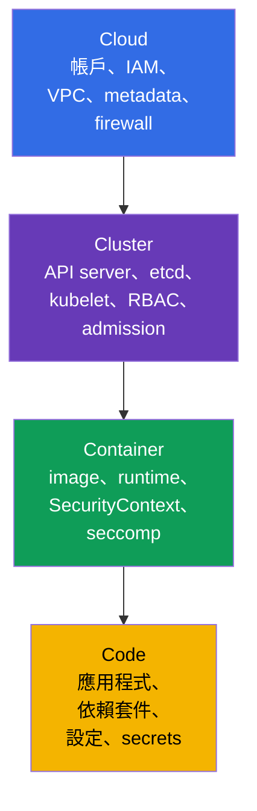
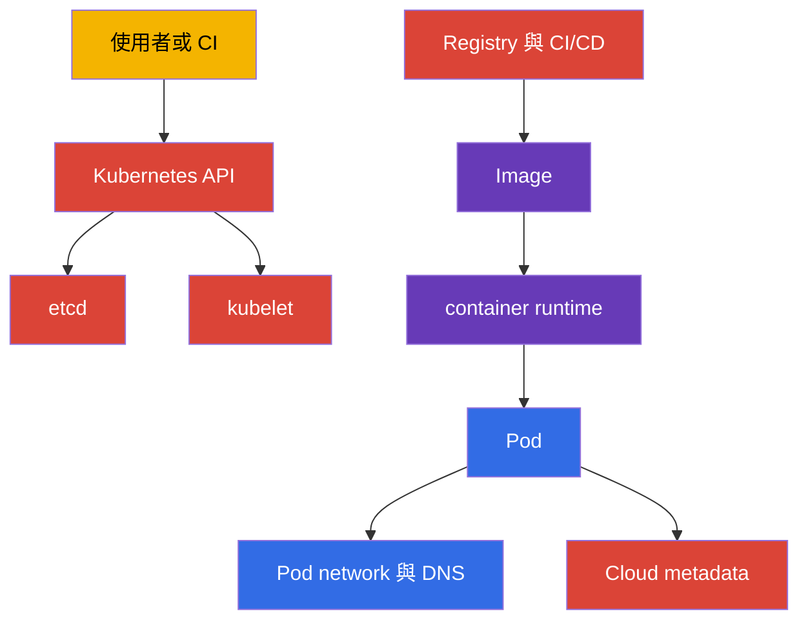
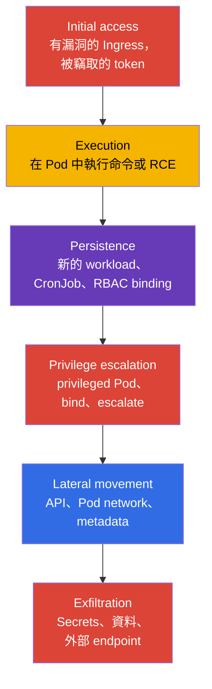
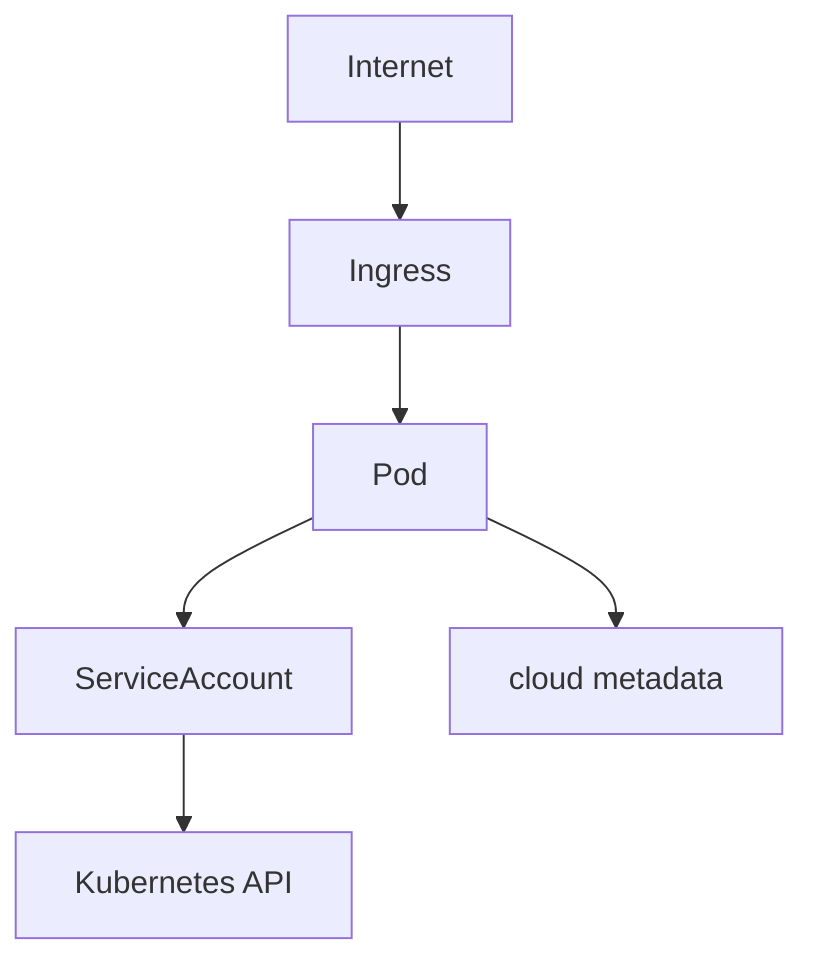
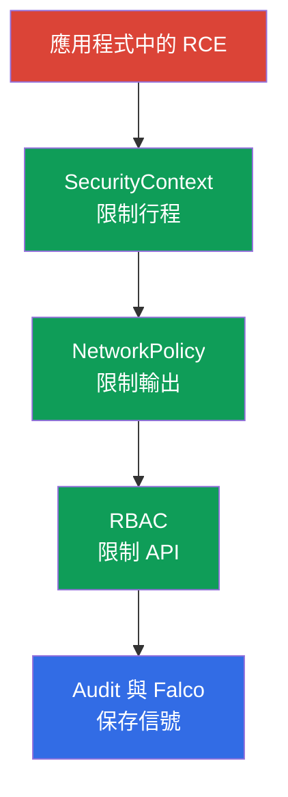

[Русская версия](ru.md) · [Eng version](README.md) · [Versión en español](es.md) · [Version française](fr.md) · [Deutsche Version](de.md) · [ქართული ვერსია](ge.md) · [日本語版](jp.md)

# 第 02 章。Kubernetes 安全模型：4C、攻擊面、攻擊階段

> **問題。** 只保護 Kubernetes 的單一層會產生錯誤的安全感：
> NetworkPolicy 無法修復公開的 API，hardened container 也無法關閉程式碼中的漏洞
> 或節點的 cloud credentials。若沒有資產與邊界的地圖，團隊只會關閉
> 熟悉的設定，卻讓攻擊者透過 Cloud、Cluster、
> Container 或 Code 找到更弱的路徑。

> **接下來。** 第 01 章定義了 CKS 的形式、領域與工具。現在需要一個通用模型，用來做技術決策：究竟要保護什麼、防範誰、用哪一層防護。此章是 CKS 六個領域的基礎：Cluster Setup (15%)、Cluster Hardening (15%)、System Hardening (10%)、Minimize Microservice Vulnerabilities (20%)、Supply Chain Security (20%) 以及 Monitoring, Logging and Runtime Security (20%)。

> **需要的 CKA 先備知識。** control plane、worker node、kubelet、CNI 的結構以及請求到達 API 的路徑，已在 [CKA 課程第 02 章](../../../cka/course/02/tw.md) 中討論。此處只把它們視為防護對象與風險來源。

> 🧠 4C 說明為何保護一層無法補償另一層的弱點。

## 02.1. 4C 模型：我們要保護什麼

4C 模型的詳細講解，聚焦於術語與 shared responsibility，已在 [KCSA 課程第 03 章](../../../kcsa/course/03/tw.md) 中給出；此處是把模型應用在實務上，作為 CKS 技術決策的檢查清單，而不是從頭重複一次。

**4C** 模型把 Kubernetes 安全分成四個巢狀層：Cloud、Cluster、Container 與 Code。外層不能取代內層。被入侵的 workload 可以用 `NetworkPolicy` 與 `SecurityContext` 限制，但這無法修復公開的 API endpoint，也無法修復可存取的 workload container-runtime/CRI socket。`docker.sock` 只是真正使用 Docker 的節點上的特殊案例；在現代叢集中,更常見的是 containerd 或 CRI-O 的 socket。反過來說，防護良好的網路也無法修復應用程式中的漏洞。



| 層 | 什麼是資產 | 典型攻擊路徑 | 基本控制 |
|---|---|---|---|
| Cloud | cloud provider 的憑證、VPC、metadata、磁碟與 snapshot | Pod 請求 `169.254.169.254` 並取得節點角色 | 不讓 Pod 取得節點的 credentials/identity；使用 provider 特定的 workload identity 與 metadata controls、最小 IAM 權限與 security group |
| Cluster | Kubernetes API、etcd、kubelet、PKI、RBAC | 匿名或過度授權的 API 請求 | TLS、`RBAC`、停用 anonymous access、audit、保持版本更新 |
| Container | image、container runtime、namespace、行程與檔案系統 | 有漏洞的 image、`privileged` Pod、container escape | 最小化 image、`SecurityContext`、seccomp、AppArmor、`RuntimeClass` |
| Code | 原始碼、依賴套件、設定與 secrets | 應用程式的 RCE、Secret 外洩、惡意依賴套件 | review、dependency scan、SBOM、不在程式碼中存放 secrets、安全的設定 |

4C 適合用作檢查順序。若某個 Pod 有權讀取所有 `Secrets`，應先修復 Cluster 層——即 RBAC。若 Pod 內的行程能安裝工具並下載 payload，就需要 Container 層的限制與 egress 控制。若應用程式的 endpoint 接受任意命令，任何 Kubernetes manifest 都無法取代 Code 層的修復。

> 🎯 Cloud → Cluster → Container → Code 的順序以及每一步的基本指令。

### 快速盤點邊界

上面的 4C 模型指出：外層無法被內層取代，外部的弱點也無法用內部防護來補償。因此盤點也應該依同樣順序進行——**Cloud → Cluster → Container → Code**——而不是從最熟悉的（Cluster）開始。以下是四層各自的策略：具體要檢查什麼、原則上可用什麼工具看見它，以及哪些指令能給出答案。

| 層 | 盤點什麼 | 用什麼檢查 | 下方步驟 |
|---|---|---|---|
| Cloud（或基礎設施 provider） | 對 API endpoint 的公開存取、節點的 identity 及其在雲端的權限、metadata service 的 hardening、網路邊界、對 provider 控制台的存取 | provider 的 CLI（需要該帳戶的個別權限）+ 一個 provider 無關的、從叢集內部進行的檢查 | 步驟 1 |
| Cluster | control plane 的版本與進入點、過寬的 RBAC 權限、危險的 Pod 設定、節點上開放的埠 | `kubectl` 與 SSH 到節點 | 步驟 2-5 |
| Container | 實際執行的 image 有哪些、mutable tag、未經核准的 registry | `kubectl` | 步驟 6 |
| Code | 有 CVE 的脆弱依賴套件、可被利用的應用程式邏輯漏洞（SSRF、injection、繞過授權、IDOR）、不安全的設定預設值、程式碼與 manifest 中的 secrets | `kubectl` 只涵蓋最後一項（manifest 中的 secret）；其餘要靠 SBOM、dependency scan、SAST、code review 與 pentest | 步驟 7——部分 |

老實說，這是一個重要的限制：`kubectl` 只能看到進入 Kubernetes API 的東西，因此盤點在四層之間的覆蓋非常不均。它基本上完全看不到 Cloud 層（IAM 角色、VPC、snapshot 都在叢集 API 之外），而 Code 層是所有層中覆蓋最少的：manifest 會顯示寫在 `env` 中的 secret，但原則上不會顯示 image 內的脆弱函式庫、應用程式碼中的 SQL injection 或授權繞過，也不會顯示寫死在原始碼中的 secret。這不是以下指令的缺陷，而是工具本身的界限：Kubernetes API 對你應用程式的內容一無所知。要完整處理 Code 層，需要 SBOM 與依賴套件掃描（第 25 章與第 28 章）、靜態分析（第 27 章），而應用程式的邏輯漏洞完全無法用 CKS 的工具解決：要靠 code review、SAST/DAST 與 pentest 找出，並且屬於開發團隊的責任，而非平台團隊。以下的盤點只是根據叢集內可取得的資料快速掃視邊界，並非對四層的完整審計。這些指令不會改變任何東西，適合一般管理員對叢集的存取；每一步都不依賴前一步。

**步驟 1（Cloud）。從 Pod 內部能否存取 cloud metadata endpoint。**

Cloud 層幾乎完全在 Kubernetes API 之外，因此其盤點分成兩部分：叢集內部可以檢查的部分，以及需要 provider CLI 的部分。

在叢集內部可以檢查一個具體且眾所周知的風險類別：任意 Pod 是否真的能連到節點的 metadata service，並可能竊取其 credentials。`169.254.169.254` 這個位址是 link-local IP，在 AWS、GCP、Azure、Hetzner 以及大多數其他 provider 上都相同，因此可以做出一個 provider 無關的網路可達性檢查：

```bash
kubectl run metadata-probe --rm -i --restart=Never --image=curlimages/curl:8.11.1 -- \
  curl -s -o /dev/null -w 'http_code=%{http_code}\n' --max-time 2 http://169.254.169.254/
```

這個指令啟動一個一次性的 Pod（`--rm` 會在結束後立即刪除它），存取的是 endpoint 的**根路徑**，而不是特定 provider 的路徑。這一點很關鍵：我們關心的不是 metadata 的內容，而是網路可達性這個事實本身。任何取得的 HTTP 狀態碼——`200`、`401`、`403`、`404`——都表示 endpoint 有回應，也就是 Pod 能連到它：不論是哪個雲，這都是警訊。狀態碼 `000` 表示完全沒有回應（timeout 或連線被拒），也就是 endpoint 對 Pod 來說無法連通，這正是 hardening 的目標。這個指令不會讀取或儲存回應主體，只看狀態碼，因此不會不小心把真正的 credentials 帶進日誌。

若在確認可達性之後，需要進一步了解那裡究竟能讀到什麼，接下來就必須使用特定 provider 的路徑與 header——它們互不相容：

| Provider | 路徑 | 必要的 Header |
|---|---|---|
| AWS（EC2 IMDS） | `/latest/meta-data/` | IMDSv1 不需要；IMDSv2 需要透過另一個 `PUT /latest/api/token` 取得的 token |
| GCP | `/computeMetadata/v1/` | `Metadata-Flavor: Google` |
| Azure | `/metadata/instance?api-version=2021-02-01` | `Metadata: true` |
| Hetzner Cloud | `/hetzner/v1/metadata` | 無 |

正因為這些差異，上面的檢查故意不綁定任何特定路徑：用 `/latest/meta-data/` 在 GCP 與 Azure 上會得到 `404`，若誤讀為「無法連通」就錯了，實際上 endpoint 確實有回應。要求 header（`Metadata-Flavor`、`Metadata: true`）是為了防範最簡單的 SSRF，而不是防範 Pod：Pod 可以自行送出任何 header，所以有這個 header 並不能取代封閉網路路徑的必要性。

**不要混淆兩個不同的結論。**「endpoint 可連通」與「取得了 credentials」不是同一件事，在報告中不能混為一談：

- *可連通性*是**發現與前提**：從 Pod 到 metadata service 的網路路徑沒有被封閉。這足以列為待修復項目，但本身不能證明已遭入侵。
- *credentials 可被取得*是**已確認的利用路徑**，需要 provider 的其他條件也同時成立才行。

一個很好的例子是 AWS。若設定 `HttpTokens=required`（僅 IMDSv2），沒有 token 就什麼都拿不到，而 token 需要透過另一個 `PUT` 請求取得，其回應只能存活恰好 `HttpPutResponseHopLimit` 個網路 hop。當 hop limit 為 `1` 時，回應無法到達有自己 network namespace 的 Pod——也就是說 endpoint 有回應、probe 顯示可連通，但拿不到 token，因而也拿不到 credentials。請注意，設有 `hostNetwork: true` 的 Pod 不算多一個 hop，因此這個限制對它不起作用。實務上的結論是：把可連通性記錄為獨立事實，只有在檢查過 provider 的具體設定之後，才能做出「credentials 被竊取」的結論。

這一層的其餘部分需要 provider 的 CLI 與其帳戶的個別權限——`kubectl` 原則上看不到這些物件。

> 🏭 用 provider 特定的 CLI 檢查對 API 的公開存取及 metadata service 的 hardening。

各家 provider 的問題相同，只有指令不同：

1. Kubernetes API 是否對外開放，來自哪些網路？
2. 節點綁定了什麼 identity，若透過 Pod 被竊取，它在雲端能做什麼？
3. metadata service 的 hardening 是否已啟用（AWS 是 IMDSv2-only 加上受限的 hop limit；GCP/Azure 是要求 header 加上網路規則）？
4. 誰能在 Kubernetes 之外建立/修改節點、磁碟、snapshot 或網路規則？

以 AWS/EKS 為例（在 GCP 是 `gcloud container clusters describe` 與 `gcloud compute instances describe`，在 Azure 是 `az aks show` 與 `az vm show`；問題相同，只是輸出與欄位名稱不同）：

```bash
# 問題 1：API server 是否能從網際網路看到，若可以，誰能看到
aws eks describe-cluster --name "$CLUSTER" \
  --query 'cluster.resourcesVpcConfig.{public:endpointPublicAccess,private:endpointPrivateAccess,cidrs:publicAccessCidrs}'

# 問題 3：hop limit `1` 是安全優先的預設值；只有在
# Pod 確實有理由需要自行存取 IMDS 時，才會檢查是否為 `2`
aws ec2 describe-instances --filters "Name=tag:eks:cluster-name,Values=$CLUSTER" \
  --query 'Reservations[].Instances[].{id:InstanceId,imds:MetadataOptions.HttpTokens,hop:MetadataOptions.HttpPutResponseHopLimit}'
```

AWS EKS Best Practices Guide 區分了兩種不同情況，不能都套用同一個「baseline」。若 Pod 不應該繼承節點 instance profile 的權限（在 IRSA/EKS Pod Identity 下的一般情況），文件在「Restrict access to the instance profile assigned to the worker node」章節明確建議 `HttpTokens=required` 與 `HttpPutResponseHopLimit=1`——這正是阻止透過 Pod 取得節點 credentials 的設定。而 `HttpPutResponseHopLimit=2` 是文件另外建議的，且僅在應用程式真的需要自己存取 IMDS 時才建議（"When your application needs access to IMDS... increase the hop limit to 2」)——這是有理由的例外，不是所有容器化工作負載的通用安全 baseline。

**特殊情況：架設在「普通」伺服器上的 self-managed 叢集**（在 bare metal 上用 kubeadm、Hetzner 或類似平台上的 VM）。

> 🔬 self-managed 叢集的檢查方式。

這裡可能完全沒有雲端 IAM——在 cloud 角色的意義上沒有東西可從節點竊取，問題 2 部分不成立。但 Cloud 層並沒有消失，而是被基礎設施 provider 這一層取代，問題變成：API server 與 SSH 是否對網際網路開放,還是只對私有網路開放；誰能存取 provider 的控制台（建立/刪除伺服器、存取 console 與 snapshot 實際上等於節點的 root 權限）；provider 是否有自己的 metadata endpoint 帶有敏感資料（Hetzner 是 `169.254.169.254/hetzner/v1/metadata`，其中甚至可能存有 cloud-init user data）；伺服器之間的流量是否由 provider 的網路規則封閉，而不是只靠叢集內的 `NetworkPolicy`。上面的 `metadata-probe` 檢查同樣適用——它不綁定於特定雲端。

**步驟 2（Cluster）。control plane 的進入點與版本。**

```bash
kubectl cluster-info
kubectl get --raw=/version
```

`kubectl cluster-info` 顯示 API server 與相關服務的位址——這是任何叢集用戶端會看到的第一個進入點。`kubectl get --raw=/version` 傳回 Kubernetes control plane 的確切版本：需要這個資訊來核對可用的旗標與該版本已知的 CVE，而不是憑任意發行版的文件猜測。

**步驟 3（Cluster）。誰擁有廣泛的 cluster-wide 權限。**

```bash
kubectl get clusterrolebinding -o jsonpath='{range .items[?(@.roleRef.name=="cluster-admin")]}{.metadata.name}{"\t"}{range .subjects[*]}{.kind}:{.name}{" "}{end}{"\n"}{end}'
```

這個指令只輸出參照了內建角色 `cluster-admin` 的 `ClusterRoleBinding`——那是叢集中最寬鬆的角色，賦予對所有資源的完整存取權。對每個找到的 binding，該行會顯示其名稱，接著列出這個角色被指派給的 subjects（`User`、`Group` 或 `ServiceAccount`）。內部對 `.subjects[*]` 的 `range` 是必要的，因為一個 binding 可能同時參照多個 subjects。

**只用名稱檢查 `cluster-admin` 是不夠的。** 決定存取等級的不是角色的名稱，而是其規則與其 binding 範圍的組合。一個 `apiGroups: ["*"]`、`resources: ["*"]`、`verbs: ["*"]` 的 `ClusterRole` 本身描述了一組權限——幾乎不受限制地存取 Kubernetes resource API——但實際的作用範圍取決於它如何被繫結：`ClusterRoleBinding` 讓它在所有 namespace 中 cluster-wide 生效,而參照同一個 `ClusterRole` 的 `RoleBinding` 則把 namespaced 權限限制在建立該 `RoleBinding` 的那個 namespace。這種機制讓一組規則可以在多個 namespace 中重複使用，而不必建立相同的多個 `Role`；除此之外，`ClusterRole` 也用於 cluster-scoped 資源（例如 `nodes`）的權限、non-resource endpoints（`/healthz`）以及透過 `ClusterRoleBinding` 的 cluster-wide 存取。在實際叢集中，這類角色一直不斷出現：以看似無害的名稱如 `platform-superuser`、`ci-deployer` 或 `monitoring-full`，可能是「為了讓它能動」而建立，也可能是刻意用來規避對 `cluster-admin` 字樣的 review。按名稱搜尋根本看不到它們，而只按角色規則搜尋卻不檢查其 binding，會給出錯誤的風險評估——透過 `RoleBinding` 綁定在單一 namespace 的廣泛權限,與透過 `ClusterRoleBinding` 綁定的同一權限,是完全不同等級的威脅。

嚴格來說，這樣的角色**並非**內建 `cluster-admin` 的字面等價物：後者的定義中有兩條規則,而不是一條——對資源的 wildcard,以及另一條針對 `nonResourceURLs` 的 wildcard 規則,涵蓋 `/healthz`、`/metrics` 和 `/debug/*` 等 non-resource endpoints。沒有第二條規則的角色不會涵蓋這些路徑，也可能透過 `resourceNames` 被縮小範圍，或透過聚合 (`aggregationRule`) 被改變。但實務上,就 triage 的角度而言,這個差異並不重要：能控制 API 中所有資源，已經包含讀取所有 Secret、在任何節點上建立 Pod 以及修改 RBAC，也就是完全攻陷叢集的路徑。Kubernetes 官方文件對這類範例的措辭也很謹慎——寫的是「similar to the built-in `cluster-admin` role」，而不是「相同」。但這不會改變實務上的結論：搜尋時要依權限，而不是依名稱。

```bash
# 步驟 A：找出所有具有完整 wildcard 權限的 ClusterRole,不論名稱
kubectl get clusterroles -o json | jq -r '
  .items[]
  | select(any(.rules[]?;
      ((.apiGroups // []) | index("*")) and
      ((.resources // []) | index("*")) and
      ((.verbs // []) | index("*"))))
  | .metadata.name
'
```

```bash
# 步驟 B：找出參照了所發現任一角色的 binding
dangerous=$(kubectl get clusterroles -o json | jq -r '
  .items[]
  | select(any(.rules[]?;
      ((.apiGroups // []) | index("*")) and
      ((.resources // []) | index("*")) and
      ((.verbs // []) | index("*"))))
  | .metadata.name
')

kubectl get clusterrolebinding -o json \
  | jq -r --argjson names "$(echo "$dangerous" | jq -R . | jq -s .)" '
      .items[]
      | select(.roleRef.name as $r | $names | index($r))
      | "\(.metadata.name) -> 角色 \(.roleRef.name)（cluster-wide）, subjects: \([.subjects[]? | "\(.kind):\(.name)"] | join(", "))"
    '

# 步驟 B'：同一個角色也可能透過 RoleBinding 繫結——那時權限
# 只在單一 namespace 生效，但這同樣不會被上面對 ClusterRoleBinding
# 的搜尋「檢查到」
kubectl get rolebinding -A -o json \
  | jq -r --argjson names "$(echo "$dangerous" | jq -R . | jq -s .)" '
      .items[]
      | select(.roleRef.kind == "ClusterRole" and (.roleRef.name as $r | $names | index($r)))
      | "\(.metadata.name)（namespace \(.metadata.namespace)） -> 角色 \(.roleRef.name)（僅在此 namespace）, subjects: \([.subjects[]? | "\(.kind):\(.name)"] | join(", "))"
    '
```

步驟 A 檢查角色的每一條規則：若同一條規則中 `apiGroups`、`resources`、`verbs` 都是 `*`，就代表擁有完整存取權。`any(.rules[]?; ...)` 很重要——危險的規則可能不是列表中的第一條，而是第二或第三條，緊鄰著無害的規則。步驟 B 與 B' 拿找到的名稱,顯示哪些 binding 實際使用它們、給了誰、範圍多大：`ClusterRoleBinding` 賦予 cluster-wide 存取，而繫結到同一個 `ClusterRole` 的 `RoleBinding` 把它限制在一個 namespace——同樣的角色權限,威脅等級卻不同,漏掉任一種 binding 都會得到不完整的圖像。未被綁定的危險角色對 review 來說也是問題，但已被綁定的角色代表權限已經交給了某人。

另外還要單獨留意一些較窄但仍然危險的模式，這些不會被完整 wildcard 的檢查抓到：

```bash
kubectl get clusterroles -o json | jq -r '
  .items[]
  | .metadata.name as $name
  | .rules[]?
  | select(((.verbs // []) | index("*"))
      and (((.apiGroups // []) | index("*") | not) or ((.resources // []) | index("*") | not)))
  | "\($name): verbs=* on apiGroups=\(.apiGroups // []) resources=\(.resources // [])"
'
```

例如，只在 `secrets` 上的 `verbs: ["*"]` 並不是 `cluster-admin`，但能讀取並修改叢集中所有的 secret——在許多威脅模型中，這等同於完全被入侵。同樣危險的還有：`create` 對 `pods` 加上寬鬆的 `hostPath` admission 層級權限，`escalate`/`bind` 對角色的權限，以及對使用者的 `impersonate`：即使角色看起來很窄，它們也能構成提升權限的路徑。這類模式的完整分析在[第 10 章](../10/tw.md)。

> **考試提示。** 在單一 jsonpath 表達式中巢狀使用帶有 `?(@.roleRef.name==...)` 篩選的 `range`，正是步驟 4 提出警告的那種情況：打字快的時候很容易漏掉一個括號或引號。更可靠的做法是把檢查拆成一個簡單的迴圈,讓每次 `kubectl` 呼叫只詢問一個沒有篩選或巢狀結構的欄位：
>
> ```bash
> for crb in $(kubectl get clusterrolebinding -o name | cut -d/ -f2); do
>   role=$(kubectl get clusterrolebinding "$crb" -o jsonpath='{.roleRef.name}')
>   if [[ "$role" == "cluster-admin" ]]; then
>     echo "$crb:"
>     kubectl get clusterrolebinding "$crb" -o jsonpath='{range .subjects[*]}{.kind}:{.name}{" "}{end}'
>     echo
>   fi
> done
> ```
>
> `kubectl get clusterrolebinding -o name` 會印出 `clusterrolebinding.rbac.authorization.k8s.io/<名稱>` 這種格式的名稱；`cut -d/ -f2` 只留下 `/` 之後的名稱本身。每次 `kubectl get clusterrolebinding "$crb" -o jsonpath='{.roleRef.name}'` 只檢查一個特定 binding 上正好一個簡單欄位——這裡沒有 `?(...)` 篩選，也沒有用來挑選 binding 本身的巢狀 `range`，只有用在找到的那一筆結果內部的 subjects 上，這樣在執行前用眼睛檢查明顯容易許多。這比上面的單行指令慢（每個 binding 都要對 API 發一次獨立請求），但在考試用的叢集上,binding 通常不會有上千個，而列印正確性的重要性大於幾秒鐘的差異。

**步驟 4（Cluster）。有明顯危險特徵的工作負載。**

> 🎯 找出具有 `privileged`、`hostNetwork/hostPID/hostIPC`、`hostPath`、額外 capabilities 或 `runAsUser: 0` 的 Pod。

> **考試提示。** 以下的完整版本（每個檢查層級都有各自的 `def` 函式）是教學用途：它一次展示全部六個特徵,以及它們為何在邏輯上相互關聯，但並不代表在計時器下真正該打的東西。就連一個帶有巢狀 `select` 與陣列的簡短 `jq` filter，也很容易在你因為時間而緊張的那一刻，因為漏了一個括號而出錯——在時間壓力下，寫一個*不那麼優雅*但幾乎不可能寫錯語法的版本、透過 `grep` 完成，會更可靠。例如題目「在 namespace `prod` 中找出所有 hostNetwork 的 Pod」：
>
> ```bash
> NS=prod
>
> for pod in $(kubectl get pods -n "$NS" -o jsonpath='{.items[*].metadata.name}'); do
>   if kubectl get pod "$pod" -n "$NS" -o json | grep hostNetwork | grep -q true; then
>     echo "$pod"
>   fi
> done
> ```
>
> 想法：先用一個簡單指令取得 Pod 名稱清單，然後在迴圈中對每個 Pod 逐一取得其 JSON 並 grep 所需欄位——若找到就印出名稱。namespace 放進第一行的變數 `NS` 中：它在指令中出現兩次，時間壓力下很容易只改了一次呼叫,卻忘了另一次——那樣腳本會悄悄地在錯誤的 namespace 中搜尋 Pod。用變數的話只需改一處，而且就在最上面容易看見的地方。管線中的兩個 `grep` 讓檢查精準，同時保持簡單：第一個只留下含有 `hostNetwork` 的那一行，第二個檢查該行中是否含有 `true`。這樣可以排除掉 `"hostNetwork": false`——欄位存在但沒有風險。`grep -q` 不會輸出任何東西，只回傳成功/失敗的代碼給 `if` 使用。這之所以有效，是因為 `kubectl -o json` 會印出 pretty-printed 的 JSON——每個欄位獨立一行，因此第二個 `grep` 只會抓到 `hostNetwork` 那一行，不會抓到相鄰的其他欄位。這種做法在 namespace 中 Pod 數量很多時,有和本頁其他方案一樣的規模限制（見上方關於一萬個 Pod 的段落）——但對於一個只有幾個或幾十個 Pod 的考試 namespace，這無關緊要，而這個指令即使打得快、又沒有草稿，也幾乎不會出錯。同樣的技巧適用於任何布林欄位：把 `hostNetwork` 換成 `hostPID`、`hostIPC` 或 `privileged` 即可。

想法：遍歷所有 namespace 中的所有 Pod，只留下具有至少一項已知危險特徵的——也就是會降低容器隔離性的設定。這些特徵會在整個 Pod 層級以及每個容器層級分別檢查：

| 層級 | 特徵 | 為何是風險 |
|---|---|---|
| Pod | `hostNetwork`、`hostPID` 或 `hostIPC` | Pod 與節點本身共用網路堆疊、行程或 IPC——隔離性被部分移除 |
| Pod | `hostPath` 類型的 volume | 容器直接存取節點的檔案系統 |
| 容器 | `privileged: true` | 容器取得幾乎所有核心權限，如同主機上的行程 |
| 容器 | `allowPrivilegeEscalation: true` | 容器內的行程可以取得比啟動時更多的權限 |
| 容器 | 額外的 `capabilities` | 容器被明確授予超過最小集合的權限 |
| 容器 | `runAsUser: 0`（在 Pod 或容器層級） | 行程在容器內以 root 身分執行 |

實作透過 `jq` 尋找正好這些特徵，只印出至少觸發一項的 Pod——其餘完全不輸出，避免在數百個安全 Pod 的清單中被淹沒。

**為什麼是 `jq`，而不是 `--field-selector` 或 `-o jsonpath`。** 一個合理的問題是——能不能直接在 API server 上篩選危險特徵，這樣就完全不必把安全 Pod 的 JSON 傳給用戶端？部分可以，但不完全。Pod 的 `--field-selector` 只支援 API server 內建、範圍狹窄的欄位清單：`metadata.name`、`metadata.namespace`、`spec.nodeName`、`spec.restartPolicy`、`spec.schedulerName`、`spec.serviceAccountName`、`spec.hostNetwork`、`status.phase`、`status.podIP`、`status.podIPs`、`status.nominatedNodeName`（依 Kubernetes 官方文件核對；此清單可能因版本而異，若指定不支援的欄位，`kubectl` 會回傳 `BadRequest`）。`spec.hostNetwork` **確實在**清單中——也就是說,可以把這一項檢查移到伺服器端。但 `hostPID`、`hostIPC`、`privileged`、`allowPrivilegeEscalation`、額外的 `capabilities`、`hostPath` volume 與 `runAsUser` 都不在這份清單裡——這些無法在 server-side 篩選，可預見的未來也不該指望它們能行：欄位集合是寫在 API server 程式碼中的，不是對任意運算式開放的。這裡刻意提到版本：所列清單對應課程 baseline 的文件（Kubernetes v1.36），正確的習慣是有疑問時去查自己版本的文件，而不是永久死記。`-o jsonpath` 同樣無法解決這個問題：它能透過 `?(@.field==value)` 對單一欄位做投影與篩選，但不能在同一表達式中用「或」組合多個條件，也不能同時檢視 `spec.containers[]`、`spec.volumes[]` 與 `spec.securityContext` 並套用共同邏輯——正因如此，才需要一個具有完整布林運算式的語言，也就是 `jq`（或用戶端的類似工具）。此外若不關心已結束的 Pod，還可以把 `status.phase` 縮小到 `Running`。這兩個 server-side 最佳化可以用逗號合併在同一個 `--field-selector` 中：

```bash
kubectl get pods -n "$ns" --field-selector=status.phase=Running -o json
```

這不能取代 `jq`，只是縮小送到它之前的 JSON 體積：伺服器不會再把已結束的 Pod 送給用戶端，`jq` 則繼續檢查剩下的那些無法在 server-side 篩選的特徵。下面 `jq` 仍然連同其他特徵一起檢查 `hostNetwork`，即使原則上可以把它另外拆成一個 `--field-selector` 請求：對每個特徵分別發請求，會讓腳本變得更複雜，而省下七項中一項的欄位並不值得,單一 `jq` 表達式中統一檢查更容易理解、也更容易維護。

**關於規模的重要提醒。** 這裡要區分兩種常被混淆的不同負載。就 API server 端而言，情況沒有想像中那麼糟：`kubectl get` 預設會用**分批**方式請求大型清單——`--chunk-size` 旗標的預設值是 `500`（「Return large lists in chunks rather than all at once」），也就是說一萬個 Pod 大約會透過二十個連續請求取得，而不是一個巨大的請求。要停用這種分頁，只能明確傳入 `--chunk-size=0`。

問題在別的地方：這些分批是**在用戶端**組合起來的。`kubectl` 會把它們拼成一個 JSON 文件，而 `jq` 要等到整份文件完整才會輸出任何一行。在有數千個 Pod 的生產環境中，這意味著你工作機記憶體中要放上百 MB 的資料，並且要等好幾分鐘沒有任何回饋——甚至可能讓 `kubectl` 或 `jq` 行程 OOM。因此逐個遍歷 namespace 並不是為了替 API server 減輕負擔（那已經由 chunking 解決），而是為了**不要一次把整個叢集放進記憶體**，改成一個 namespace 一個 namespace 地漸進取得結果：

```bash
for ns in $(kubectl get ns -o jsonpath='{.items[*].metadata.name}'); do
  kubectl get pods -n "$ns" --field-selector=status.phase=Running -o json | jq -r --arg ns "$ns" '
    def containers:
      (.spec.containers // [])
      + (.spec.initContainers // [])
      + (.spec.ephemeralContainers // []);

    # 每個容器的檢查回傳的不是 true/false，而是一份「觸發的具體特徵
    # 加上容器名稱」清單——沒有這個，輸出中不同的特徵就無法區分。
    def container_reasons:
      [
        (if .securityContext.privileged == true then "privileged:\(.name)" else empty end),
        (if .securityContext.allowPrivilegeEscalation == true then "allowPrivilegeEscalation:\(.name)" else empty end),
        (if ((.securityContext.capabilities.add // []) | length > 0)
          then "capabilities.add=\((.securityContext.capabilities.add // []) | join(",")):\(.name)"
          else empty end),
        (if .securityContext.runAsUser == 0 then "runAsUser=0:\(.name)" else empty end)
      ];

    # 對整個 Pod 也是同樣做法：Pod 層級的原因清單，加上每個容器的
    # 原因，合併成一份扁平清單。
    def pod_reasons:
      [
        (if .spec.hostNetwork == true then "hostNetwork" else empty end),
        (if .spec.hostPID == true then "hostPID" else empty end),
        (if .spec.hostIPC == true then "hostIPC" else empty end),
        (if .spec.securityContext.runAsUser == 0 then "pod.runAsUser=0" else empty end),
        (if ([.spec.volumes[]? | select(.hostPath != null)] | length > 0)
          then "hostPath=\([.spec.volumes[]? | select(.hostPath != null) | .hostPath.path] | join(","))"
          else empty end)
      ] + [containers[]? | container_reasons[]];

    .items[]
    | (pod_reasons) as $reasons
    | select($reasons | length > 0)
    | "\($ns)/\(.metadata.name): \($reasons | join("; "))"
  '
done
```

檢查邏輯（三個函式 `containers`/`container_reasons`/`pod_reasons` 以及最後的 `select`）在意義上和上面的想法相同——改變的是取得資料的方式（見上文）以及輸出格式：現在這一行不再只是說「requires review」，而是直接列出觸發了哪些特徵、在哪個容器裡，例如 `hostNetwork; privileged:aws-node; capabilities.add=NET_ADMIN:aws-node`。若沒有這個，在真實叢集上（尤其是 EKS/GKE，其中 CNI 及其他系統性 DaemonSet——例如 `aws-node`——會合法地使用 `hostNetwork` 與 `privileged`），輸出會變成一長串相同的 `namespace/pod requires review`，根本無法快速分辨清單中哪個 Pod 和另一個有什麼不同——你根本看不出它們的差異。直接顯示具體原因，能立刻回答「這個 Pod 為什麼會出現在清單裡」，不必為每一筆結果逐一打開 `-o yaml`。

同樣的步驟，不看程式碼也能理解：

1. `for ns in $(kubectl get ns -o jsonpath='{.items[*].metadata.name}')` 用一個輕量請求（不含 Pod，只有名稱）取得所有 namespace 的名稱清單，然後逐一把它們放進變數 `$ns`。
2. 迴圈內的 `kubectl get pods -n "$ns" --field-selector=status.phase=Running -o json` 只取出目前 namespace 中處於 Running 狀態的 Pod——遠比不加篩選、對整個叢集使用 `-A` 的 JSON 小得多，也不含這項檢查不需要的已結束/已死亡的 Pod。
3. `containers` 是一個輔助清單：把 Pod 的一般容器、init 容器與 ephemeral 容器合併成一個串流，因為任何一個容器中有危險設定，都和主容器一樣是風險。
4. `container_reasons` 對單一容器回傳觸發的具體特徵清單,連同容器名稱：`privileged:<名稱>`、`allowPrivilegeEscalation:<名稱>`、`capabilities.add=...:<名稱>` 或 `runAsUser=0:<名稱>`——若容器本身安全,清單也可以是空的。
5. `pod_reasons` 對整個 Pod 做同樣的事：`hostNetwork`、`hostPID`、`hostIPC`、`pod.runAsUser=0`、`hostPath=<路徑>`，再與所有容器透過 `container_reasons[]` 得到的原因合併成一份扁平清單。
6. 最後這一行遍歷所有 Pod（`.items[]`），把原因清單指派給變數 `$reasons`，只留下原因清單非空的 Pod，並印出 `namespace/pod名稱: 原因1; 原因2; ...`——例如 `kube-system/aws-node-2sp7j: hostNetwork; privileged:aws-node; capabilities.add=NET_ADMIN:aws-node`。

第 6 步中原因的細節化,在真實叢集上尤其重要。系統性的 DaemonSet 如 `aws-node`（Amazon VPC CNI）、`cilium` 或 `calico-node`,正常且合法地使用 `hostNetwork` 與 `privileged`——它們需要這些權限來管理節點上的網路介面與規則。若不標示原因，在有數百個節點的叢集上，這樣的 DaemonSet 會產生數百行相同的 `requires review`，讓人看不出它們其實都是同一種預期模式。標示原因之後，馬上就能看出：如果同一個 namespace 中所有相符項目顯示的是同一個 image 上的同一組特徵，那很可能是一個合法的系統元件,可以放進帶有「需要 CNI」這種說明的 review 清單，而不是幾十個需要各自調查的獨立發現。

**步驟 4 的額外方案：帶有 chunking 的結構化 JSON 輸出（依 namespace 分批）。**

> 🏭 適用於數千個 Pod 叢集的 chunked JSON 檢查。

上面的方案適合快速的人工檢查：一行給人看的文字很好讀，但不方便傳給下一個工具（例如工單系統或 dashboard），而且在有數千個 Pod 的 namespace 上，它仍然會先在用戶端記憶體中把整個 namespace 收齊，才印出任何東西。如果需要機器可讀的結果，還要防範 namespace 巨獸（一些生產環境中的系統 namespace，即使套用 `Running` 篩選之後仍有數百或數千個 Pod），就需要更複雜一點的用法：

```bash
CHUNK_SIZE=200
SLEEP_BETWEEN_CHUNKS=0.2

result_file=$(mktemp)
chunk_file=$(mktemp)
merge_jq=$(mktemp)
trap 'rm -f "$result_file" "$chunk_file" "$merge_jq"' EXIT
echo '{}' > "$result_file"

cat > "$merge_jq" <<'JQEOF'
def containers:
  (.spec.containers // [])
  + (.spec.initContainers // [])
  + (.spec.ephemeralContainers // []);

def container_reasons:
  [
    (if .securityContext.privileged == true then "privileged:\(.name)" else empty end),
    (if .securityContext.allowPrivilegeEscalation == true then "allowPrivilegeEscalation:\(.name)" else empty end),
    (if ((.securityContext.capabilities.add // []) | length > 0)
      then "capabilities.add=\((.securityContext.capabilities.add // []) | join(",")):\(.name)"
      else empty end),
    (if .securityContext.runAsUser == 0 then "runAsUser=0:\(.name)" else empty end)
  ];

def pod_reasons:
  [
    (if .spec.hostNetwork == true then "hostNetwork" else empty end),
    (if .spec.hostPID == true then "hostPID" else empty end),
    (if .spec.hostIPC == true then "hostIPC" else empty end),
    (if .spec.securityContext.runAsUser == 0 then "pod.runAsUser=0" else empty end),
    (if ([.spec.volumes[]? | select(.hostPath != null)] | length > 0)
      then "hostPath=\([.spec.volumes[]? | select(.hostPath != null) | .hostPath.path] | join(","))"
      else empty end)
  ] + [containers[]? | container_reasons[]];

# 輸入 (.) 是從分批的檔案（$chunk_file）讀取的，而不是命令列
# 引數——當 CHUNK_SIZE=200 且是帶完整 status 與
# managedFields 的真實 Pod 時，一個 chunk 很容易超過作業系統
# 對 argv 長度的限制，`jq --argjson chunk "$chunk_json"` 會在
# jq 還沒開始處理之前，就先出現「Argument list too long」錯誤。
# 累積結果同樣出於這個原因，改用 --slurpfile acc 從一個獨立的
# 檔案讀取——大量資料不透過 argv 傳遞。
#
# kubectl 在傳入多個名稱時回傳 List（{"items":[...]}），但在命令中
# 恰好傳入一個名稱時，會直接回傳 Pod 物件本身（沒有 items 欄位）——
# 若不處理這個分支，最後一個不完整的 chunk（常常只有 1 個 Pod）
# 就會出現「jq: error: Cannot iterate over null (null)」，因為單一
# Pod 物件根本沒有 .items。
($acc[0]) as $accumulated
| (.items // [.]) as $pods
| reduce ($pods[]) as $pod
  ($accumulated;
   ($pod | pod_reasons) as $reasons
   | if ($reasons | length) > 0
     then .[$ns][$pod.metadata.name] = $reasons
     else .
     end)
JQEOF

for ns in $(kubectl get ns -o jsonpath='{.items[*].metadata.name}'); do
  mapfile -t pod_names < <(kubectl get pods -n "$ns" --field-selector=status.phase=Running \
    -o jsonpath='{range .items[*]}{.metadata.name}{"\n"}{end}')
  total=${#pod_names[@]}
  processed=0
  for ((i = 0; i < total; i += CHUNK_SIZE)); do
    chunk=("${pod_names[@]:i:CHUNK_SIZE}")
    kubectl get pods -n "$ns" "${chunk[@]}" -o json > "$chunk_file"
    jq --slurpfile acc "$result_file" --arg ns "$ns" -f "$merge_jq" "$chunk_file" > "${result_file}.new"
    mv "${result_file}.new" "$result_file"
    processed=$((processed + ${#chunk[@]}))
    echo "namespace $ns: $processed/$total pods processed" >&2
    sleep "$SLEEP_BETWEEN_CHUNKS"
  done
done

jq . "$result_file"
```

以下是複雜了什麼，以及為什麼要這麼做：

- **輸出格式是巢狀 JSON，不是文字行。** 結果現在是 `{namespace: {pod名稱: [原因]}}` 這種結構——內容和前一版本用文字印出的一樣，但適合之後進一步自動化處理（傳給另一個腳本、存成 artifact、用 `jq` 查詢篩選特定 namespace 而不必再連一次叢集）。
- **在 namespace 內部分批，不只是在 namespace 之間。** 上面想法中的 `for ns in ...` 迴圈已經有幫助，能把工作依 namespace 拆開，但如果**單一** namespace 中有數千個 Pod（生產環境中大型 data/batch namespace 常見的情況），`kubectl get pods -n "$ns" -o json` 雖然會透過 `--chunk-size` 分批向 API server 請求，最終仍會**把整個 namespace 拼成一份 JSON 放在用戶端記憶體中**，然後整份交給 `jq`。內層迴圈 `for ((i = 0; i < total; i += CHUNK_SIZE))` 把目前 namespace 的 Pod 名稱清單分成每組 `CHUNK_SIZE`（此處為 200）個，只針對這一組請求 `kubectl get pods -n "$ns" <名稱1> <名稱2> ...`——這樣記憶體使用的峰值只受單一 chunk 大小限制，而不是整個 namespace 的大小，而且每組處理完後都可以印出進度。`--field-selector` 在這裡不適用，因為它不支援「清單中的任意名稱」，所以名稱要以明確的位置引數傳給 `kubectl get pods`。
- **在各批之間 `sleep "$SLEEP_BETWEEN_CHUNKS"`。** 這個暫停（此處是 0.2 秒）避免腳本連續不斷地用數百個請求淹沒 API server——在有大量 namespace 與 Pod 的叢集上，這比毫無間隔連續發送 chunk 能明顯降低峰值負載。
- **每個 chunk 後用 `echo ... >&2` 印出進度。** 在 stderr 印出（不與 stdout 上最終的 JSON 混在一起）像 `namespace kube-system: 200/1400 pods processed` 這樣的行——在大型叢集上，遍歷可能要花上幾分鐘，若沒有這個指示，就無法判斷腳本是在運作還是已經卡住。
- **chunk 結果與累積結果存放在檔案中，而不是 shell 變數。** `kubectl get pods ... -o json > "$chunk_file"` 把 chunk 的 JSON 寫到磁碟，而 `jq --slurpfile acc "$result_file" ... "$chunk_file"` 從檔案讀取 chunk 與目前累積的結果，而不是把它們當成命令列引數傳遞。這一點很關鍵：當 `CHUNK_SIZE=200`,且是帶有完整 `status` 與 `managedFields` 的真實 Pod 時，一個 chunk 的 JSON 很容易達到數 MB，而像 `jq --argjson chunk "$chunk_json" ...` 這種指令會把這份 JSON 當成一般的行程引數傳遞——一旦超過作業系統對 argv 總長度的限制（`ARG_MAX`，依系統而異，通常從約 128 KB 到數 MB），shell 會在 `jq` 處理之前就先以 `Argument list too long` 結束該指令。即使在乍看「安全」的 `CHUNK_SIZE=200` 下,只要單一 namespace 中有數百個 Pod，這個情境在叢集上就會重現——大小不只取決於 Pod 數量，也取決於每個 Pod 的 metadata/status 資料量。每次迭代的結果都存到暫存檔（`> "${result_file}.new"`，然後 `mv` 到原位）——這能保證磁碟上永遠只存在舊版本或完整寫入的新版本，而不會在寫入中途中斷時留下損毀的檔案。
- **`trap 'rm -f "$result_file" "$chunk_file" "$merge_jq"' EXIT`。** 暫存檔會在腳本結束時自動刪除——包括發生錯誤或按下 `Ctrl+C` 的情況，而不只是正常結束時。若沒有 `trap`，每次中斷的執行都會在 `/tmp` 中累積暫存檔。
- **`merge.jq` 內獨立的函式 `pod_reasons` 考慮到 kubectl 會根據請求的名稱數量回傳不同結構。** `kubectl get pods -n "$ns" pod-a pod-b -o json` 在傳入多個名稱時會回傳 List（`{"items": [...]}`），但在只傳入正好一個名稱時——就像最後那個常常不完整的 chunk——會直接回傳同一個 Pod 物件，完全沒有 `items` 欄位。`(.items // [.])` 這個表達式對兩種情況做相同的處理：若 `.items` 存在就使用它，若不存在（也就是 `.items` 為 `null`）就把整個輸入物件包成只有一個元素的清單。若沒有這個分支，最後只有一個 Pod 的 chunk 就會出現 `jq: error: Cannot iterate over null (null)`，因為 `.items[]` 想要遍歷一個單一 Pod 物件上根本不存在的欄位。

這不是取代前一版本的「正確」版本，而是有意識的取捨：對於小型或中型叢集的快速人工檢查，上面想法中的文字輸出更容易閱讀、也更容易一次複製到終端機。Chunked JSON 版本適合這種情況：結果要進一步送進自動化流程、namespace 可能包含非常多 Pod，且遍歷過程需要對 API server 溫和以待並顯示可見的進度——也就是說，當腳本從一次性的診斷指令變成定期執行的工具時。這種情境不會出現在考試中——請把這一節當作生產工程的參考範例，而不是計時器下需要能重現的內容。

**步驟 5（Cluster/node）。在節點上：監聽埠與擁有它們的行程。**

```bash
sudo ss -tulpn
```

旗標說明：`-t` 與 `-u` 顯示 TCP 與 UDP socket，`-l` 只顯示監聽中（listening）的，`-p` 加上擁有該 socket 的 PID 與行程名稱，`-n` 不解析為 DNS 名稱（更快也更精確）。這是唯一一個直接在節點上執行，而不是透過 `kubectl` 的指令——它顯示的是作業系統的視角，而不是 Kubernetes API 的視角。

**步驟 6（Container）。實際執行了哪些 image，其中是否有 mutable tag。**

Container 層的第一個問題不是「這個 image 安不安全」（那是第 28 章的掃描），而是更基本的問題：叢集中究竟在跑哪些 image，能不能明確說出裡面究竟執行的是什麼程式碼。

```bash
# 叢集中所有唯一 image 的完整清單
kubectl get pods -A -o jsonpath='{range .items[*]}{range .spec.containers[*]}{.image}{"\n"}{end}{end}' | sort -u
```

```bash
# 帶有 mutable tag 的 Pod：明確的 :latest 或完全沒有 tag（隱含 latest）
kubectl get pods -A -o json | jq -r '
  .items[]
  | .metadata.namespace as $ns | .metadata.name as $pod
  | .spec.containers[]?
  | select((.image | endswith(":latest")) or (.image | split("/") | last | contains(":") | not))
  | "\($ns)/\($pod): \(.image)"
'
```

第一個指令給出盤點清單：可以用它核對實際使用了哪些 registry，其中是否有未經核准的。第二個指令找出帶有 mutable tag 的 image——明確的 `nginx:latest`,或完全沒有 tag 的 `redis`（預設會解析成 `:latest`)。這種 image 意味著目前實際執行的程式碼，可能與 review 當時檢查過的不同：tag 可以重新指向另一個 digest,而不必修改 manifest。`.image | split("/") | last | contains(":") | not` 這個檢查專門看 `/` 之後的最後一段——沒有這個處理，`registry.example.com:5000/app`（registry 位址中有埠號,但沒有 tag）會被誤判為已加上 tag。

> **考試提示：這個盤點只是題目的一半。** 常見的題目形式是：「在 namespace `X` 中找出漏洞數量最多的 Pod 並刪除它」，或「找出其 image 含有版本為 `<版本>` 的套件 `<名稱>` 的 Pod」。上面的盤點回答了「究竟有哪些 image」，接下來需要 `trivy`——而且很重要的是，需要**從 image 反查回 Pod 的路徑**，因為要刪除的是 Pod，不是 image。因此清單要直接以 `pod → image` 成對取得：
>
> ```bash
> NS=prod
>
> kubectl get pods -n "$NS" \
>   -o jsonpath='{range .items[*]}{.metadata.name}{"\t"}{.spec.containers[0].image}{"\n"}{end}'
> ```
>
> 接著對每一對計算漏洞數並降序排序——清單中第一項就是要找的 Pod：
>
> ```bash
> kubectl get pods -n "$NS" \
>   -o jsonpath='{range .items[*]}{.metadata.name}{"\t"}{.spec.containers[0].image}{"\n"}{end}' \
> | while IFS=$'\t' read -r pod img; do
>     count=$(trivy image -q --severity CRITICAL,HIGH --format json "$img" \
>       | jq '[.Results[]?.Vulnerabilities[]?] | length')
>     echo -e "$count\t$pod\t$img"
>   done | sort -rn
> ```
>
> 依重要性篩選是用 `trivy` 端的 `--severity CRITICAL,HIGH` 旗標完成的，而不是在 `jq` 中用 `select`——這樣 `jq` 就只是簡單地對找到的所有記錄做 `length`，在計時器下出錯的機會也更少。輸出格式類似 `3<tab>app-1<tab>nginx:1.19`，一看就懂：左邊是數量，接著是 Pod 與 image。`sort -rn` 把最糟的排在最上面，剩下的就是 `kubectl delete pod app-1 -n "$NS"`。注意 `.spec.containers[0].image`——只取第一個容器；若題目中的 Pod 是多容器的，改成 `{range .spec.containers[*]}`，並對每個 image 分別計數。
>
> 對於第二種題型——「含有特定套件與版本的 Pod」——在計時器下最簡單的方法是對一般表格輸出做兩層 `grep`，不用 `--format json` 也不用 `jq`：
>
> ```bash
> trivy image -q "$IMG" | grep openssl | grep '1.1.1d'
> ```
>
> 第一個 `grep` 留下與該套件相關的行，第二個檢查版本。有個實用的細節：`trivy` 在表格模式下同時印出 `Library` 欄（套件名稱）與 `Title` 欄（CVE 標題），而標題常常以套件名稱開頭——因此 `grep openssl` 也會抓到 `libssl1.1` 這個套件的行，只要它的標題寫著 `openssl: ...`。在考試中這通常是好事：題目要找的通常是「受 openssl 漏洞影響的 image」，而不是套件名稱的字面比對。若需要對 `Library` 欄做嚴格比對，加上 `^` 與表格分隔符：`grep -E '^\│ openssl'`。
>
> 當結果要進入腳本，而不是給人看的時候，才需要透過 JSON 的精確版本：
>
> ```bash
> trivy image -q --format json "$IMG" \
>   | jq -r '.Results[]?.Vulnerabilities[]? | select(.PkgName=="openssl") | "\(.PkgName) \(.InstalledVersion) \(.VulnerabilityID) \(.Severity)"'
> ```
>
> `trivy` 報告中的 `PkgName`、`InstalledVersion`、`VulnerabilityID` 與 `Severity` 欄一定會有值（與 `FixedVersion` 不同,若尚無修復版本它可能不存在）——可以放心依賴它們。同樣地，計算漏洞數也可以不用 `jq`：`trivy image -q --severity CRITICAL,HIGH "$IMG"` 在表格模式下會自己印出 `Total: N (...)` 這一行——對兩三個 Pod 來說，這比寫迴圈更快，而上面帶 `jq` 的迴圈則在 Pod 數量到十幾個、已經不方便用眼睛比對時才顯出優勢。

**步驟 7（Code）。以字面值寫在 manifest 中的 secret。**

Code 層是風險量最大、對 `kubectl` 來說也最難觸及的一層。屬於這一層的有：帶已知 CVE 的脆弱依賴套件，應用程式本身可被利用的邏輯漏洞（SQL/command injection、SSRF、繞過授權、IDOR、不安全的反序列化），不安全的設定預設值，以及原始碼中的 secrets。

要把邊界劃清楚很重要。Kubernetes API **不會顯示應用程式的原始碼與其依賴套件**——沒有任何一個 `kubectl` 請求能找到脆弱的函式庫或授權檢查中的錯誤。但它會顯示一部分**與安全相關的 runtime 設定**，而且不只一項：`env`、`command` 與 `args` 中的字面值（其中常常混有像 `--insecure-skip-tls-verify` 這樣的旗標,或啟用的 debug 模式）、對 `Secret` 與 `ConfigMap` 的參照、掛載的 volume、image 與其 tag、annotation 與 label、`securityContext`、使用的 ServiceAccount。下面的檢查聚焦於這些特徵中最常見、也最明確的一種——以字面字串寫在 `env` 中的 secret，而不是用 `secretKeyRef`。其餘部分要靠其他工具覆蓋，這一點要立刻理解，而不是把完成第 7 步當成 Code 層已經處理完畢。

```bash
kubectl get pods -A -o json | jq -r '
  .items[]
  | .metadata.namespace as $ns | .metadata.name as $pod
  | .spec.containers[]?
  | .env[]?
  | select(.value != null)
  | select(.name | test("PASSWORD|SECRET|TOKEN|KEY|CREDENTIAL"; "i"))
  | "\($ns)/\($pod): env \(.name) 是以字面值設定的"
'
```

這個 filter 會挑出有字面值 `.value`（而不是 `valueFrom`）,且名稱看起來像是 secret 的環境變數。指令刻意只印出變數名稱，不印出其值——否則盤點本身就會變成一種洩漏方式。依名稱比對只是一種啟發式方法：`PUBLIC_KEY_URL` 可能完全無害，而名為 `DB_DSN` 的 secret 卻不會出現在清單中；因此結果要用眼睛判讀,不能當作最終違規清單。

為什麼字面值比參照 `Secret` 更糟——這一點要仔細說明，因為這裡很容易說得太過。改用 `Secret` **並不會自動讓 secret 變得安全**；它只是把 secret 從 workload 的 manifest 中分離出來，並啟用一些字面值完全沒有的機制。

| 面向 | `env[].value` 中的字面值 | 參照 `Secret` |
|---|---|---|
| 儲存位置 | 在 PodSpec/Deployment 內部——也就是在 workload 物件中 | 在獨立的 `Secret` 物件中；在 etcd 中,若未啟用 encryption at rest,值只是 **base64,不是加密的** |
| 是否進入 VCS | workload manifest 通常就是被 commit 的內容，所以值會跟著它進入 git——但僅限於 manifest 真的被 commit 的情況 | workload manifest 本身只含有鍵的名稱；值可能單獨進入 git（例如寫在 plain-YAML 的 `Secret` 中，或 Helm 的 values 裡） |
| 透過 API 的可見性 | 任何能讀取 Deployment/Pod 的人都能看到——這個範圍遠比能讀取 `Secrets` 的人廣得多 | 直接透過 API 讀取需要對該 namespace 中 `secrets` 的權限（可透過 `resourceNames` 縮小範圍），**但**這並不保證隔離：能在該 namespace 建立 Pod/Deployment 的主體，可以把既有的 `Secret` 掛載為 volume 或透過 `env` 傳入，完全不需要對 `secrets` 有 `get`/`list`/`watch` 權限 |
| 進入 audit log | 取決於 audit policy 與等級：`Metadata`——完全不寫入內容；`Request`——寫入 request body,但不寫 response；`RequestResponse`——同時寫入 request 與 response body | 相同的規則，但事件對象是 `Secret`，讀取 secret 更方便獨立設一條規則；同時 `create`/`update` 在 `Request` 等級就可能已經洩漏值，而一般 `get` 回傳的值只在 `RequestResponse` 等級才會進日誌 |
| Encryption at rest | 字面值可以連同 workload 物件一起被加密，只要這個 API 資源被合適的 `EncryptionConfiguration` 規則覆蓋——直接覆蓋（例如 `deployments.apps`）或透過 wildcard（`*.apps`、`*.* `——Kubernetes v1.27+）——且該規則的**第一個** provider 是加密用的 provider，而不是 `identity`；預設情況下 `--encryption-provider-config` 根本沒有設定，API server 會把這類資料原樣存進 etcd，沒有 at-rest 加密 | `Secret` 同樣不會自動加密：同一個資源必須被 `EncryptionConfiguration` 規則覆蓋（直接覆蓋 `secrets`,或透過 wildcard），且清單中第一個 provider 是加密用的；若第一個是 `identity`，新寫入的記錄仍然會以 plaintext 存進 etcd，即使該資源形式上「已納入設定」 |
| 不重新建置就能更新 | 需要修改並重新套用 workload manifest | 只需修改一個物件的值，不必碰 workload |
| 新值是否會傳到容器 | 不會 | 作為 **volume**——會，kubelet 會更新檔案（eventually consistent；例外是透過 `subPath` 掛載的情況）；作為**環境變數**——**不會**：env 在容器啟動時就固定了，需要重啟 Pod |

最後一行是實際輪替中最常見的錯誤：`Secret` 中的密碼已經更新，但應用程式仍在用舊值運作，因為它是從環境變數讀取的。若需要無停機輪替，就要把 secret 以檔案掛載並讓應用程式重新讀取，或者透過受控的 `kubectl rollout restart` 完成輪替。

> **考試提示。** 題目通常會更簡單：「在 namespace `X` 中找出密碼直接寫在 manifest 裡的 Pod」。這是找一個特定的變數，不是對整個叢集做盤點——這時和步驟 4 一樣，用 `grep` 不用 `jq` 更可靠：
>
> ```bash
> NS=prod
>
> for pod in $(kubectl get pods -n "$NS" -o jsonpath='{.items[*].metadata.name}'); do
>   if kubectl get pod "$pod" -n "$NS" -o yaml | grep -i -A1 password | grep -q 'value:'; then
>     echo "$pod"
>   fi
> done
> ```
>
> 這裡 `-A1` 旗標很關鍵：在 YAML（和 JSON 一樣）中變數名稱與其值分別在不同行，所以單獨用 `grep -i password` 只會顯示含名稱的那一行,無法判斷那裡是字面值還是 `secretKeyRef`。`-A1` 會多加上下一行，第二個 `grep` 檢查那一行是不是正好是 `value:`。關鍵之處：`value:` **不會**與 `valueFrom:` 相符——`value` 後面接的是 `F`，不是冒號，因此正確地從 `Secret` 取得密碼的 Pod，不會出現在清單中。若不只要 Pod 名稱，還想直接看到那一行本身，可以去掉第二個 `grep` 的 `-q`，或把迴圈改成 `echo "--- $pod"; kubectl get pod "$pod" -n "$NS" -o yaml | grep -i -A1 password`。

這個指令看不到的其餘 Code 層,由以下方式覆蓋：

| Code 層的風險 | 用什麼找出 | 課程中的位置 |
|---|---|---|
| image 中有 CVE 的脆弱依賴套件 | SBOM（`syft`、`bom`）與掃描器（`trivy`） | 第 [25](../25/tw.md) 章、第 [28](../28/tw.md) 章、lab 111 |
| 不安全的 `Dockerfile` 與 manifest（root、多餘套件、可寫的 rootfs） | 靜態分析：`hadolint`、`kube-linter`、`kubesec` | 第 [27](../27/tw.md) 章、lab 111 |
| 寫死在原始碼或 image 層中的 secret | CI 中的 secret scanning、`docker history`、review Dockerfile | 第 [24](../24/tw.md) 章 |
| 應用程式的邏輯漏洞：injection、SSRF、繞過授權、IDOR | code review、SAST/DAST、pentest | CKS 工具範圍之外——開發團隊的責任 |

最後一行值得特別強調：程式碼中的邏輯漏洞，不會被任何一個 `kubectl` 指令或任何一個 image 掃描器找到，也不在 CKS 的範圍之內。CKS 要回答的是另一個問題——「攻擊者在**利用**這類漏洞**之後**能做什麼」：這正是為什麼課程中要花這麼多篇幅講 `SecurityContext`、RBAC、NetworkPolicy 與 runtime 偵測。此處對 Code 層做盤點,不是為了取代開發團隊的工作，而是讓你清楚知道自己責任的邊界,不要因為七個步驟全都乾淨通過，就以為叢集已經安全了。

**如何解讀七個步驟的結果。** `cluster-admin` 並不總是錯誤：某些系統元件與受控管理員確實需要它。對步驟 4 發現的每個工作負載，要記錄具體的特徵：`privileged`、`allowPrivilegeEscalation`、`hostPath`、額外的 capabilities，或明確設定的 UID 0。這是一份供 review 的清單，不是自動證明存在漏洞：例如，`PodSpec` 中可能根本看不出 image 的 UID，而合理的例外必須有負責人與期限。盤點的結果應該是：主體清單、存取的理由、負責人以及下次重新審視的日期。不要只因為 binding 的名稱看起來可疑就刪除它：先確認它的用途,並用最小權限的角色測試替代方案。

另外要說明 4C **不是**什麼。它是一個 defense in depth 模型：它幫助理解問題出現在哪一層，以及上下層可用哪些補償措施。它**不是**一個通用的優先排序演算法，把找到的問題「從下到上按層」讀成現成的修復佇列是一個錯誤。

模型中確實有一個實用的啟發法：越外層的問題，修復後的 blast radius 通常越大。若步驟 1 顯示 API server 對外開放,且 IMDS 可從 Pod 存取，而步驟 4 顯示某個 Deployment 是 `privileged`，那麼關閉公開的 endpoint 並 hardening IMDS,能同時縮小所有 Pod 的攻擊面，而修改一個 Deployment 的 `securityContext` 卻不能阻止攻擊者從外部進入，或透過另一個 Pod 拿到節點的 credentials。在這個具體案例中，從 Cloud 開始確實合理。

但只要前提改變，這個啟發法就會失效，以下是三個順序相反的情況：

- **Code 中的漏洞比 Cloud 中的弱點更重要。** 一個已被主動利用 RCE 漏洞的公開可存取應用程式（Code），要比節點上的 `HttpPutResponseHopLimit=2`（Cloud）優先修復：前者已經給攻擊者執行程式碼的能力，後者只是入侵之後的一個潛在步驟。
- **外層的發現可能已經有補償措施。**「API server 可從網際網路存取」聽起來很嚴重，但如果存取受限於企業 IP allowlist、啟用了帶 MFA 的 OIDC，且 audit 正常運作，那麼實際風險比一個掛載了 container runtime socket 的 Pod 更低——後者能立即拿下整個節點。
- **層與層之間的組合本身才危險，單一層的深度不是重點。** 一個綁定在可從網際網路存取的應用程式所使用的 ServiceAccount（Code/Container）上的 wildcard `ClusterRole`（Cluster），比這些發現各自單獨存在時更危險，而優先順序正是由這條鏈決定的，並不是因為 RBAC「比程式碼更深」。

實務上的優先順序由風險決定，而不是由層決定。評估每個發現時要看：攻擊者是否能觸及、是否已有可行的利用路徑、觸發時的損害、修復的 blast radius、證據本身的可靠性——並在已有補償措施生效的地方降低優先度。4C 在這個過程中仍然有用：它提示該去哪一層尋找這些補償措施，以及在哪一層修復才是系統性的，而不是點狀的。在考試中不需要做優先排序——題目會直接指出要修復什麼；這是實際工作中才需要的技能。

> 🏭 現成的掃描器,取代自己寫的 `jq` 查詢。

### 現成的掃描器：做同樣的事，但自動化

上面幾乎所有手動完成的工作，現成工具都能做——在實際工作中,合理的做法是直接用這些工具，而不是維護自己寫的 `jq` 腳本。這一章的手動拆解是為了另一個目的：讓你理解掃描器究竟檢查了什麼、某個具體發現為何是風險，以及該怎麼處理 false positive——沒有這些理解，掃描器的報告只是一份看不懂的、有幾百行的清單。

| 工具 | 覆蓋上面哪些檢查 | 狀態 |
|---|---|---|
| [kube-bench](https://github.com/aquasecurity/kube-bench) | 依 CIS Benchmark 檢查 control plane、kubelet 與 etcd 的設定——部分對應步驟 2 與 5 | 持續維護中；在[第 07 章](../07/tw.md)與 lab 103 中詳細講解 |
| [Kubescape](https://kubescape.io/) | 危險的 Pod 設定、過寬的 RBAC 權限、hostPath/hostNetwork/privileged、mutable tag——步驟 3、4、6；同時掃描運行中的叢集與 manifest/Helm,依 NSA、MITRE、SOC 2 框架 | CNCF Incubating，持續發展中 |
| `trivy k8s`（[Trivy](https://trivy.dev/)） | 叢集物件中的 misconfiguration，加上 image 中的 CVE 與 KBOM——步驟 4、6 以及部分 Code 層 | 持續維護中；image 掃描在[第 28 章](../28/tw.md)與 lab 111 |
| [kubeaudit](https://github.com/Shopify/kubeaudit) | workload 的點狀檢查：root、capabilities、`allowPrivilegeEscalation`、缺少 `readOnlyRootFilesystem`——步驟 4 | upstream 已於 2024 年 10 月 30 日**封存**，僅供讀取；常出現在舊文章中，但不適合用於新流程 |
| [kube-linter](https://docs.kubelinter.io/)、[kubesec](https://kubesec.io/) | 同樣的特徵，但檢查的是部署前的 manifest，而不是運行中的叢集 | 持續維護中；在[第 27 章](../27/tw.md)與 lab 111 中講解 |
| RBAC 專用工具：[rbac-tool](https://github.com/alcideio/rbac-tool)、`kubectl who-can` | 以易讀方式視覺化與查詢 RBAC——相當於步驟 3，包括含 wildcard 的自訂角色 | 持續維護中；RBAC 的詳細內容在[第 10 章](../10/tw.md) |

要特別說明一下**已經停止發展的工具**。以下兩個常出現在舊文章與課程中，兩者都容易被誤認為仍是現行工具：

- **kube-hunter**——upstream（Aqua Security）已正式宣布不再發展此工具，並建議改用 Trivy。
- **kubeaudit**——Shopify/kubeaudit 儲存庫已於**2024 年 10 月 30 日封存**並轉為 read-only；封存之前 README 中已出現尋找新維護者的 deprecation notice。

可以把它們當作歷史資料閱讀,也可以在舊環境上執行，但不該用在新流程中：kubeaudit 過去做的 workload 檢查，現在由 Kubescape、`trivy k8s` 與 kube-linter/kubesec 取代；kube-hunter 做的探測，由 `trivy k8s` 取代。這正是表格中「狀態」這一欄的實際意義：安全工具的維護狀態,和它的檢查項目清單一樣,都是可用性的一部分。

考試中一個重要的限制：在 CKS 考試中，你只能使用考試環境中已經安裝好的工具，不能自己安裝掃描器。`kube-bench` 會出現在題目中（見第 07 章），而 Kubescape、`trivy k8s` 等其他工具是實際工作中的工具，不是考試工具。因此上面步驟中的手動 `kubectl` 檢查仍然是必要的技能：在考試中它們是唯一可用的方式，在工作中則是理解與驗證掃描器結論的方式。

> 🧠 風險區域：control plane、kubelet、網路、image、runtime 與資料。

## 02.2. Kubernetes 的攻擊面

**攻擊面**——攻擊者能取得存取、執行動作、建立立足點或提取資料的所有點。它不限於 `kubectl`：叢集還有網路、節點、image、CI/CD、DNS 以及外部雲端 API。



請把下列各區域分開考慮。

- **Control plane。** `kube-apiserver` 接收管理請求。薄弱的 authentication/authorization 設定、`--anonymous-auth=true` 配合已授權的 `system:anonymous` identity 或可存取的不安全 endpoint、不安全的 admission 規則,或對外開放的 API 存取，都會讓它成為進入叢集的主要入口。control plane 的擴充性同樣是攻擊面：admission webhook、aggregated API、CRD/operator 及其 ServiceAccount，都應該像程式碼、endpoint 與 RBAC identity 一樣被檢查。`etcd` 存放叢集的狀態與 Secret 資料，因此其用戶端埠與憑證絕不能讓 workload 存取。
- **kubelet 與節點。** kubelet 負責啟動容器,並持有節點的憑證。能存取 `10250`、container runtime 的 socket、SSH，或對 static Pod manifest 有寫入權限，往往就等於掌控整個節點。節點是可信基礎的一部分，不只是執行 Pod 的地方。
- **Pod 網路。** 在扁平網路中，被入侵的 Pod 可以掃描服務、存取 DNS、API、metadata 或其他工作負載。防護方式是 default-deny、精確的 ingress/egress 規則、namespace 分割，以及在需要的地方加密。
- **Image 與 supply chain。** `latest` 標籤、未知的 registry、有 CVE 的依賴套件，或被篡改的 build artifact，在 Pod 啟動之前就已經構成威脅。需要 digest、掃描、SBOM、簽章與 admission policy。
- **Runtime。** `privileged`、`hostPath`、`hostPID`、多餘的 capabilities 與可寫的 root filesystem，都會幫助攻擊者從應用程式中的 RCE 轉移到節點，或在容器中立足。
- **資料與 identity。** `Secrets`、ServiceAccount token、kubeconfig、憑證與 cloud credentials，往往比容器本身更有價值。`Secret` 中的 base64 不是加密，透過 RBAC 讀取 `Secrets` 需要與存取 production 資料庫同等級的控制。

以下是使用 Container 層限制的最小 workload 範例。要正確理解它們究竟防護的是什麼——**不是保護 Pod 不被入侵，而是保護叢集與節點不受一個已被入侵的 Pod 影響**。這些欄位不會消除應用程式中的漏洞——那屬於 Code 層,依然存在。它們的作用是從攻擊者已在容器內取得程式碼執行能力**之後**才開始：`runAsNonRoot` 不讓它成為 root，`drop: [ALL]` 拿走核心 capabilities，`seccompProfile` 縮小可用的 syscall 集合，`allowPrivilegeEscalation: false` 不讓它取得比啟動時更多的權限，而 `readOnlyRootFilesystem` 讓它無法在容器中放入工具並立足。這些一起降低了 blast radius：大幅增加逃逸到節點的難度，並讓一個被入侵的 Pod 難以變成整個叢集的入口點。這些欄位不再重複講解：其語意已在 CKA 中說明，CKS 在第 18 章進一步展開 hardening。

```yaml
apiVersion: v1
kind: Pod
metadata:
  name: 4c-demo
  namespace: default
spec:
  securityContext:
    runAsNonRoot: true
    runAsUser: 10001
  containers:
  - name: app
    image: registry.k8s.io/pause:3.10
    securityContext:
      allowPrivilegeEscalation: false
      readOnlyRootFilesystem: true
      capabilities:
        drop:
        - ALL
      seccompProfile:
        type: RuntimeDefault
```

套用這份 manifest,並確認它實際進入了 `PodSpec`：

```bash
kubectl apply -f 4c-demo.yaml
kubectl get pod 4c-demo -o jsonpath='{.spec.securityContext.runAsNonRoot}{"\n"}'
kubectl get pod 4c-demo -o jsonpath='{.spec.containers[0].securityContext.seccompProfile.type}{"\n"}'
kubectl delete pod 4c-demo
```

這個範例不能取代 policy。這些限制只對已經帶有這些欄位建立的那個 Pod 生效——旁邊沒有這些欄位的 Pod 依然一樣危險,沒有任何東西阻止把它部署在旁邊。需要 cluster-level 的規則（PSA、`ValidatingAdmissionPolicy`、Kyverno）,正是為了讓不安全的 manifest 完全無法通過 admission,而不是依賴每個 Deployment 的作者都不會忘記手動寫上 `securityContext`。

> 🧠 用於信號關聯與選擇預防點的 kill chain。

## 02.3. 攻擊階段：從 initial access 到 exfiltration

一個事件通常會經歷多個階段。以下是作者整理的簡化版 Kubernetes 攻擊鏈，使用 MITRE ATT&CK for Containers 的術語，但並非其戰術的精確矩陣。它的作用不是機械式地貼標籤，而是幫助決定該在哪裡阻止動作,以及要保存哪些信號供後續調查。



| 階段 | Kubernetes 中的範例 | 如何限制 | 要檢查與保存什麼 |
|---|---|---|---|
| Initial access | 公開的 API、有漏洞的 Ingress、CI log 中洩漏的 credential | 關閉外部存取、TLS、雲端的 MFA/IAM、修復應用程式 | Ingress/access log、API audit 事件、authentication 事件 |
| Execution | RCE 在容器內啟動 shell 或執行 `curl` | 最小化 image、non-root、seccomp、AppArmor、必要時禁止 `exec` | Falco 事件、process tree、container ID、時間與 node |
| Persistence | 攻擊者建立 `CronJob`、DaemonSet 或 ServiceAccount binding | least-privilege RBAC、admission policy、GitOps 變更審查 | `create`/`patch` 的 audit 記錄、manifest 差異、binding 中新出現的 subject |
| Privilege escalation | 可用 `privileged`、`hostPath`、`pods/exec`、`bind` 或 `escalate` | PSA/policy、capabilities drop、禁止危險的 RBAC verb | `PodSpec`、RBAC binding、kubelet/runtime 日誌 |
| Lateral movement | Pod 讀取 metadata、API,或存取相鄰的 namespace | default-deny egress/ingress、DNS allowlist、最小化 IAM 與 ServiceAccount | flow log、Hubble/Falco、被拒絕的網路事件 |
| Exfiltration | Secret 被送到外部服務，或被載入 shell | 限制 `secrets` 的 RBAC 與 egress、encryption at rest、邊界上的 DLP | 讀取 Secret 的 audit 事件、DNS/proxy log、network flow |

關聯範例：在應用程式 Pod 中 `kubectl exec` 之後，意外出現的 `ClusterRoleBinding` 建立——這不是三筆互不相關的記錄。這很可能是 execution → persistence/privilege escalation 的一條序列。要保存的上下文包括：來自 audit log 的 identity、Pod 的 UID、node、UTC 時間、依 digest 標識的 image，以及外送位址。

### 可重現的威脅模型

威脅模型應該給出可驗證的決策，而不只是風險清單。對於 Ingress、namespace、operator 或雲端整合的變更，請依以下步驟進行：

1. 記錄**資產**：資料、Secret、ServiceAccount、API 與雲端角色。
2. 定義**行為者**：外部使用者、workload、CI、operator 與管理員。
3. 標記網際網路、Ingress、namespace、node、control plane 與雲端之間的**信任邊界**。
4. 列出**進入點**：DNS/Ingress、API、registry、webhook、kubelet 與 CI credentials。
5. 畫出資料與 identity 的**流向**，包括 Pod 對 API 與 metadata 的存取。
6. 明確標示**假設**：CNI 是否支援 policy、誰管理節點、哪些 endpoint 被視為可信。
7. 評估**損害**：讀取 Secret、建立 workload、存取雲端資源、停機或資料外洩。
8. 把每個風險連結到**控制措施與證據**：能證實其發生的 policy/RBAC/admission/IAM 與 audit、flow log、webhook log 或 runtime alert。

以下是一個典型外部服務的精簡 DFD，展示信任邊界的交會之處：



這並不是說每個 Pod 都能存取 metadata，或都能修改 API。這是兩條需要分別允許或禁止,然後用可觀測性加以確認的流向。

與 **OWASP Kubernetes Top 10 — 2025** 的對照有助於不遺漏某個風險類別。這不是威脅模型的替代品：一個流向可能對應多個類別。下面的 2022 版本只作為給舊書籍與課程的**legacy mapping** 保留；並非總是一對一對應。

| 模型中的風險 | OWASP Kubernetes Top 10（2025）的主要類別 | Legacy mapping：OWASP 2022 | 控制措施與證據範例 |
|---|---|---|---|
| workload 設定不安全：`privileged`、host namespace 或危險的 `SecurityContext` | K01 Insecure Workload Configurations | 沒有精確的個別對應 | PSS/PSA、hardening 與 admission 證據 |
| ServiceAccount 或使用者授權過度 | K02 Overly Permissive Authorization Configurations | K03 Overly Permissive RBAC Configurations | 最小化的 Role/ClusterRole、review binding、API audit 的 `allowed`/`forbidden` |
| Secret 與 token 的儲存、發放或使用缺乏足夠保護 | K03 Secrets Management Failures | K08 Secret Management Failures | 對 `Secrets` 的最小存取、短時效 token、encryption at rest 與讀取 audit |
| 缺乏統一的 cluster-level 對不安全 manifest 的強制執行 | K04 Lack Of Cluster Level Policy Enforcement | 沒有精確的個別對應 | PSA、`ValidatingAdmissionPolicy` 或 policy engine + admission/audit 證據 |
| Pod 與 namespace 之間缺乏分割 | K05 Missing Network Segmentation Controls | K07 Missing Network Segmentation Controls | default-deny 加精確的 `NetworkPolicy`、CNI flow/deny 事件 |
| 開放的 API、kubelet、etcd、webhook 或其他 Kubernetes 元件 | K06 Overly Exposed Kubernetes Components | K09 Misconfigured Cluster Components | 封閉的網路、TLS、限制 endpoint 與 access log |
| control plane、node 或 runtime 的設定不安全或有漏洞 | K07 Misconfigured And Vulnerable Cluster Components | 2022 K09 + K10 | 安全的設定、更新、scanner/config audit 與 access log |
| 透過 metadata、node credentials 或錯誤授予的 identity 從叢集轉移到雲端 | K08 Cluster-To-Cloud Lateral Movement | K07 Missing Network Segmentation Controls、K03 Overly Permissive RBAC Configurations 與 K08 Secret Management Failures | egress policy、最小化 node identity 與 **workload identity** 權限、flow log 與 cloud audit |
| 薄弱的認證或不當的 anonymous access | K09 Broken Authentication Mechanisms | K06 Broken Authentication Mechanisms | 已驗證的 issuer/audience、停用或未授權的 anonymous identity、authentication/audit 事件 |
| 缺乏對動作與違規的信號 | K10 Inadequate Logging And Monitoring | K05 Inadequate Logging and Monitoring | audit policy、runtime 與 network telemetry、保存帶 identity 與時間的 alert |

K08 把 cloud 層與後續章節連結起來：metadata endpoint 與節點的 credentials 不應該成為 Pod 隱含可用的路徑，workload identity 應該發出獨立、短時效且權限最小的 identity。因此要把 metadata、IAM 與 egress 視為同一個 lateral movement 邊界，而不是各自獨立的主題。

> 🔬 針對獨立測試 namespace 的 security-engineering 練習。

### 安全的 walkthrough：檢查屏障與證據

只在專用的測試 namespace 中,並與已核准的攻防團隊一起進行；不要使用真實的 Secret、production endpoint 或 exploit。針對一個已知的測試 Pod,搭配獨立的 ServiceAccount，在不執行 RCE 的情況下檢查這條鏈：

| 步驟 | 預期的屏障 | 證據 |
|---|---|---|
| 嘗試對已知的內部測試 endpoint 發出允許的請求 | 精確的 ingress/egress policy 允許所需的流向 | 成功的回應,以及帶有精確 source/destination label 的 CNI flow |
| 嘗試存取事先準備好的、被禁止的測試 endpoint | default-deny 或 egress policy 封鎖該流向 | timeout/拒絕，以及對應的 CNI deny 事件 |
| 用 `kubectl auth can-i --as=system:serviceaccount:<namespace>:<serviceaccount> get secrets -A` 檢查同一個 ServiceAccount 是否能讀取 `Secrets` | least-privilege RBAC 回答 `no` | 輸出 `no`，且在實際 API 請求中出現 `forbidden` 的 audit 記錄 |
| 對測試 namespace 送出一份明知會被拒絕的 privileged manifest，不含 hostPath，也不啟動容器 | admission policy 拒絕該設定 | webhook/PSA 的拒絕文字與對應的 audit 事件 |

這個情境重現了 reconnaissance → 嘗試 lateral movement/privilege escalation 的序列，但只驗證控制措施本身,不涉及立足、資料存取或實際利用漏洞。

> 🏭 Operational readiness：在事件發生之前，先確認 audit/runtime 信號是否可用，而不是等到事件當下。

### 事件發生前的可觀測性檢查

在沒有事故發生的時候，先確認 audit 與 runtime 信號確實可用，是有意義的：

```bash
# 最近的 Kubernetes 事件對快速初步診斷很有用，
# 但不能取代 audit log：events 的保存時間很短。
kubectl get events -A --sort-by='.lastTimestamp'

# 檢查運行中的 Pod 使用了哪些 ServiceAccount。
kubectl get pods -A -o custom-columns='NAMESPACE:.metadata.namespace,POD:.metadata.name,SA:.spec.serviceAccountName'

# 在裝有 Falco 的節點上：檢查服務狀態與最近的信號。
sudo systemctl is-active falco
sudo journalctl -u falco --since '15 minutes ago' --no-pager
```

最後兩個指令適用於 Falco 以 systemd service 方式安裝的情況。若透過 DaemonSet 安裝，請改用 `kubectl -n falco get pods` 與 `kubectl -n falco logs <pod>`。audit 與 Falco 的具體設定會在第 29-32 章詳細說明。

> 🧠 用於評估任何解決方案的五項原則。

## 02.4. 連結各項控制措施的原則

Security controls 不應該隨意添加。以下五項原則可用來評估任何解決方案。

1. **Defense in depth。** 單一失效不應該打開整條路徑。例如：修復過的 image 降低 RCE 的機率，`SecurityContext` 限制 RCE 之後的行程，NetworkPolicy 抑制 lateral movement，而 Falco 與 audit 幫助發現殘留風險。
2. **Least privilege。** identity、workload 與行程只取得必要的權限。實務上這意味著 RBAC 中精確的 `verbs`、獨立的 ServiceAccount、`drop: [ALL]`、不使用 `privileged`、最小化 IAM 權限與短時效的 credentials。
3. **Immutability。** production workload 不應該靠在運行中的容器內安裝套件來「修復」。image 要重新建置、掃描、簽署,再依 digest 部署。這樣能縮小攻擊面，並讓狀態可重現。
4. **Minimize attack surface。** 沒安裝的套件、關閉的埠、停用的 endpoint 與未發出的 token 都無法被利用。對服務、開放埠、RBAC 與 image 的盤點應該定期進行。
5. **網路中的 Zero trust。** 身處同一個 cluster 或 namespace 不應該自動賦予信任。標準 `NetworkPolicy` 依 label、IP/CIDR 與埠選擇 Pod/Namespace；這不是經過認證的 workload identity，也不是 ServiceAccount-aware 的授權。網路要從 default-deny 開始，再依 selector、位址、埠與方向逐一新增精確的允許規則。若需要 identity-aware 的網路防護，要用 CNI/service mesh 的獨立機制，例如 Cilium identity/mTLS 或 Istio mTLS。



這些原則可能與便利性衝突。例如：只有在應用程式確實需要臨時寫入時，`readOnlyRootFilesystem` 才需要為 `/tmp` 準備可寫的 volume；default-deny egress 需要另外允許 DNS；放棄通用的 `cluster-admin` 需要拆成多個角色。這是正常的工程工作：先設好限制,再只依實際需要新增可衡量的例外。

> 🎯 把威脅模型直接對應到課程的領域與章節——作為準備考試的參考。

## 02.5. 考試領域如何對應到威脅模型

模型不能取代 CKS 的考綱。它說明了各章為何依領域分組，以及各章在攻擊的哪個階段效果最大。

| 層或階段 | CKS 領域 | 課程章節 | 主要成果 |
|---|---|---|---|
| Cloud、Pod network、initial access 與 lateral movement | Cluster Setup - 15% | [04](../04/tw.md)、[05](../05/tw.md)、[06](../06/tw.md)、[07](../07/tw.md)、[08](../08/tw.md)、[09](../09/tw.md) | 網路分割、防護 metadata/endpoint、CIS 與 TLS hardening |
| Cluster API、persistence 與 privilege escalation | Cluster Hardening - 15% | [10](../10/tw.md)、[11](../11/tw.md)、[12](../12/tw.md)、[13](../13/tw.md) | 最小化權限、安全的 ServiceAccount、封閉的 API、及時更新 |
| Node 與 container runtime、privilege escalation | System Hardening - 10% | [14](../14/tw.md)、[15](../15/tw.md)、[16](../16/tw.md)、[17](../17/tw.md) | 縮小節點攻擊面、MAC 與 syscall filtering |
| Container、資料與 lateral movement | Minimize Microservice Vulnerabilities - 20% | [18](../18/tw.md)、[19](../19/tw.md)、[20](../20/tw.md)、[21](../21/tw.md)、[22](../22/tw.md)、[23](../23/tw.md) | hardened workload、policy admission、保護 Secret、sandbox 與 mTLS |
| Code 與 build pipeline、initial access | Supply Chain Security - 20% | [24](../24/tw.md)、[25](../25/tw.md)、[26](../26/tw.md)、[27](../27/tw.md)、[28](../28/tw.md) | 部署前可信且可驗證的 artifact |
| Execution、persistence、exfiltration 與調查 | Monitoring, Logging and Runtime Security - 20% | [29](../29/tw.md)、[30](../30/tw.md)、[31](../31/tw.md)、[32](../32/tw.md) | 偵測、調查、不可變性與行動證據 |

同一個威脅常常對應多行。例如：ServiceAccount token 被竊取的風險,由第 11 章的措施降低：不掛載不必要的 token，使用短時效的 projected token 與獨立的 ServiceAccount。第 04 章的 NetworkPolicy 可以限制已被入侵的 token 的使用或外洩，例如禁止對 Kubernetes API 與外部 endpoint 不必要的 egress；第 10 章的 RBAC 限制它的後果，而讀取 `Secret` 的行為由第 32 章的 audit 記錄下來。不要只挑一個「最好」的控制措施：要用一組互相獨立的屏障。

> 🔬 用於威脅建模練習的工程 artifact。

### 小型練習：把 DFD 作為可驗證的 artifact

針對一個測試 namespace，畫出 `Internet -> Ingress -> Pod -> ServiceAccount/API` 的 DFD，若相關的話再加上 `Pod -> cloud metadata`。標出信任邊界，然後列出 5-10 個威脅。對每一個都寫出控制措施、證據與殘留風險：例如 SSRF -> egress allowlist + workload identity -> CNI flow/Cloud audit -> policy 出錯的風險。只有在至少一條允許路徑與一條禁止路徑都經過測試驗證之後，這份 artifact 才算完成。

## 02.6. 在生產環境中如何應用

- **Managed Kubernetes 中的 shared responsibility。** provider 負責一部分受管理的基礎設施，但 EKS/GKE/AKS 的擁有者仍然要負責 workload 的 IAM、RBAC、NetworkPolicy、node pool、metadata 的暴露、supply chain 與 audit。具體服務的責任邊界必須寫下來，不能只靠假設。
- **依生命週期分佈的控制措施。** 在 build-time 檢查程式碼、依賴套件、image、SBOM 與簽章；在 deploy/admission-time 阻擋不安全的 manifest 與 RBAC；在 runtime 限制行程與網路，收集 audit/flow/runtime 信號。一個階段不能取代另一個。
- **威脅模型作為變更的 artifact。** 對於新的 namespace、Ingress 或外部 registry，團隊要記錄資產、信任邊界、進入點、可能的損害與控制措施。這份文件應該跟著架構一起更新，而不是變成一份獨立擺在一邊的 PDF。
- **Baseline 與例外。** 先建立一個安全的 baseline：non-root、`RuntimeDefault`、default-deny、精確的 RBAC role、禁止不安全的 image registry。例外要指定負責人與期限,並經過檢查，而不是變成永久的 `cluster-admin`。
- **可觀測性要與 identity 綁定。** audit log、network flow 與 runtime alert 應該能把動作連結到 user、ServiceAccount、Pod、node 與 image digest。沒有這個,kill chain 就無法被證實。
- **CI/CD 中的變更控制。** manifest 在 merge 之前要通過靜態分析與 policy 檢查；image 要經過掃描,取得 SBOM 與 digest。production deployment 使用可驗證的 artifact，而不是本地建置的 tag。
- **恢復能力驗證。** 對高風險路徑進行 tabletop 演練或安全的模擬：嘗試存取 metadata、建立被禁止的 Pod、對未授權的位址發出 egress。不只驗證是否被拒絕，也要驗證是否出現了對應的 audit/Falco/network 事件。

## 02.7. 小型術語表

- **4C**——用 Cloud、Cluster、Container 與 Code 四個層來評估 Kubernetes 防護的模型。
- **Attack surface**——攻擊者可以利用的可存取進入點與動作的集合。
- **Defense in depth**——彼此獨立的多層防護，降低單一控制措施失效時的後果。
- **Exfiltration**——未經授權將資料帶出信任邊界之外。
- **Immutable infrastructure**——production artifact 在 runtime 不做修改,而是替換成新的、經過驗證的版本的做法。
- **Kill chain**——從 initial access 到達成目標的攻擊階段序列。
- **Least privilege**——只授予最小必要的權限。
- **Lateral movement**——攻擊者從最初的 workload 移動到其他系統、資料或 identity。
- **Zero trust**——不再因為網路、namespace 或位置而給予隱含的信任。

## 02.8. 本章總結

- 4C 把防護分成 Cloud、Cluster、Container 與 Code；外層的弱點無法被內層補償。
- Kubernetes 的主要攻擊面包括：API、etcd、kubelet 與節點、Pod 網路、image/CI/CD、runtime、Secret 與 identity。
- Kill chain 幫助把預防性控制措施與調查用信號連結起來：initial access、execution、persistence、privilege escalation、lateral movement 與 exfiltration。
- Defense in depth、least privilege、immutability、縮小攻擊面與 zero trust，把分散的設定變成一致的 baseline。
- CKS 的六個領域覆蓋不同的層與階段,因此事件應變與 hardening 需要一起運用。

> 🎯 在考試中。

## 02.9. 這對你有什麼幫助：考試與實際工作

題目可能表現為對 `NetworkPolicy`、RBAC、static Pod manifest 或 `SecurityContext` 的局部修改。4C 模型幫助快速判斷究竟是哪一層，避免用錯控制措施：例如，應該禁止 Pod 對 metadata 的 egress，而不是只想靠 RBAC 解決。Kill chain 說明了為什麼題目會同時要求限制存取,又要用日誌確認結果。

> 🏭 在實際工作中。

這個模型讓 security review 變得具體。團隊不再只問「叢集安全嗎？」，而是問可驗證的問題：誰在存取 API、哪些 Pod 能存取 host、誰能讀取 `Secrets`、允許哪些 image、workload 能連到哪裡，以及事件發生後會留下哪些事件記錄。這些答案會變成有明確負責人的 hardening backlog。

## 02.10. 自我檢查問題

<details>
<summary>1. 為什麼保護 Container 層無法補償公開的 API endpoint 或過度授權的 cloud IAM 權限？</summary>

4C 是巢狀但彼此獨立的層：`SecurityContext` 與 `NetworkPolicy` 可以限制被入侵的 workload，但無法關閉公開的 API endpoint，也無法減少已授予的 cloud IAM 權限。API 需要 TLS、authentication/authorization 與存取限制，而 cloud identity 需要最小化的 IAM 權限、workload identity 與 metadata controls。
</details>

<details>
<summary>2. 在你的叢集中，4C 每一層各有哪些資產？</summary>

Cloud 層是 cloud credentials、VPC、metadata、磁碟與 snapshot；Cluster 層是 API server、etcd、kubelet、PKI 與 RBAC。Container 層包含 image、runtime、namespace、行程與檔案系統，而 Code 層則是原始碼、依賴套件、設定與 secrets。
</details>

<details>
<summary>3. 透過 `CronJob` 的 persistence,與透過 `ClusterRoleBinding` 的 privilege escalation,有什麼不同？</summary>

`CronJob` 建立一個重複執行的 workload，讓攻擊者取得立足點,因此屬於 persistence。`ClusterRoleBinding` 可能授予廣泛的權限並提升 identity 的權限；在 `kubectl exec` 之後建立它,應該被關聯視為可能的 execution → persistence/privilege escalation 序列。
</details>

<details>
<summary>4. 哪些控制措施能在一個透過 RCE 被入侵的 Pod 讀取另一個 namespace 的 Secret 之前,把它限制住？</summary>

搭配 non-root、seccomp、AppArmor 與最小化 image 的 `SecurityContext`，會在 RCE 之後限制該行程,而搭配精確允許規則的 default-deny ingress/egress 能抑制 lateral movement。防止讀取 Secret 的是針對 ServiceAccount 的 least-privilege RBAC；audit 會記錄對 API 的允許與拒絕存取。
</details>

<details>
<summary>5. 為什麼沒有允許 DNS 的 default-deny egress 會弄壞應用程式？這與 zero trust 有什麼關係？</summary>

啟用 default-deny 之後，除非另外允許所需的 DNS 路徑，否則 Pod 將無法解析 Service 名稱與外部 FQDN。zero trust 意味著即使在叢集內部,也不存在隱含的信任：DNS 和其他相依項一樣,要用精確的規則允許,而不是直接開放 `0.0.0.0/0` 的 egress。
</details>

<details>
<summary>6. 要調查一個事件時，你應該能在 audit event、runtime alert 與 network flow 之間對應哪六個欄位？</summary>

應該保存並對應：來自 audit log 的 identity、Pod 的 UID、node、UTC 時間、依 digest 標識的 image，以及外送位址。這些資料把 API 動作、行程或 runtime 信號，以及具體的網路流向,連結成一條可證實的序列。
</details>

<details>
<summary>7. 為什麼依 digest 使用 image 加上 `readOnlyRootFilesystem`,能支持 immutability 原則？</summary>

digest 固定了一個可驗證的 artifact 版本，而不是一個可變的 tag，因此部署是可重現的。`readOnlyRootFilesystem` 不允許在執行期間透過安裝套件來「修復」production 容器；變更要透過重新建置、掃描、簽署與部署新的 image 來完成。
</details>

## 實作練習

這是基礎性的一章，沒有獨立的實驗。請把這個模型當作以下實驗的檢查清單：[lab 101 - NetworkPolicy 與保護 metadata](../../labs/101/README_TW.MD)、[lab 104 - RBAC、ServiceAccount 與 API](../../labs/104/README_TW.MD)、[lab 107 - PSA 與 SecurityContext](../../labs/107/README_TW.MD) 以及 [lab 112 - Falco、audit 與不可變性](../../labs/112/README_TW.MD)。

## 參考資料

- [OWASP: Kubernetes Top 10](https://owasp.org/www-project-kubernetes-top-ten/)
- [Kubernetes: 安全概觀](https://kubernetes.io/docs/concepts/security/overview/)

---
[目錄](../README_TW.md) · [第 01 章](../01/tw.md) · [第 03 章](../03/tw.md)
