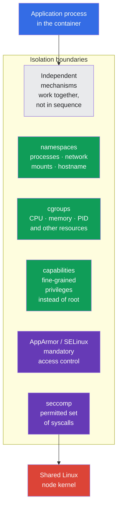
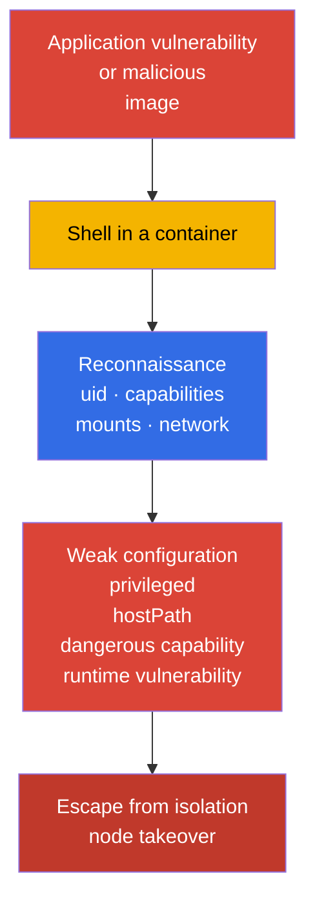
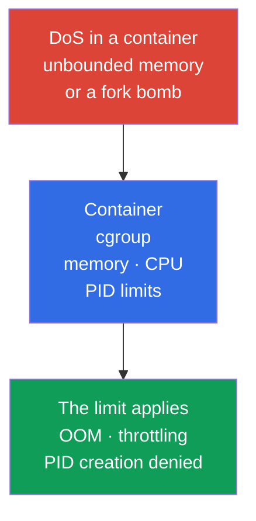
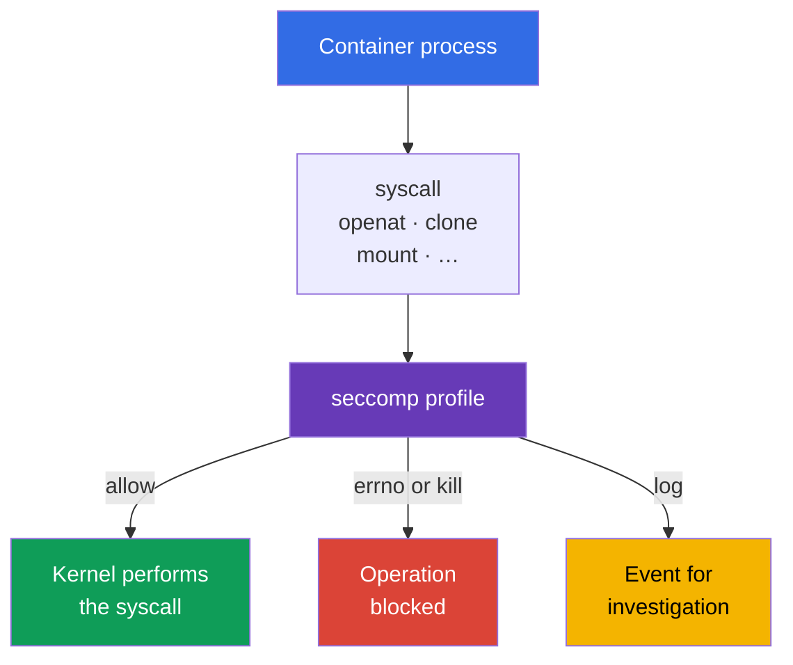
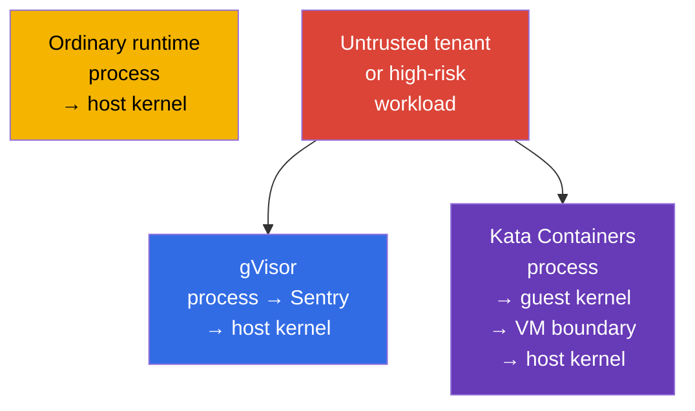

[Русская версия](ru.md) · [Versión en español](es.md) · [Version française](fr.md) · [Deutsche Version](de.md) · [ქართული ვერსია](ge.md) · [繁體中文版](tw.md) · [日本語版](jp.md)

# Chapter 03. Linux security mechanisms under the hood

> **The problem.** A container is not a virtual machine: a workload shares the kernel with the node,
> and running code inside a Pod becomes more dangerous with `privileged`, host namespaces,
> excessive capabilities, or accessible mounts. Understanding Linux boundaries is necessary so that several
> isolation mechanisms complement one another and limit the impact of a container escape,
> rather than create a false expectation of one absolute protection.

> **What comes next.** In chapter 02, we broke down the Kubernetes attack surface into layers. Now we examine the Linux mechanisms that the container runtime uses to isolate a Pod process: namespaces, cgroups, capabilities, and syscall filtering. This is the foundation of CKS, but not a separate exam domain: it explains why System Hardening (10%) and Minimize Microservice Vulnerabilities (20%) restrictions work and where their boundaries are.

> **What you need from CKA.** The basic architecture of containers, namespaces, cgroups, and the runtime is covered in CKA: [containers](../../../cka/course/00-4-containers/README.md), [Linux](../../../cka/course/00-5-linux/README.md), and [network namespaces](../../../cka/course/00-7-netns/README.md). Here, we do not repeat container creation or the basic CKA commands; instead, we examine security properties, isolation verification, and ways to bypass it.

> 🧠 Container isolation is a combination of independent Linux boundaries, not one “magic” setting.

## 03.1. Container isolation is a set of boundaries, not a virtual machine

An ordinary OCI workload under runc/containerd is a Linux process on the node's shared kernel. Its isolation is built from several independent mechanisms. This is not an absolute formula for sandbox runtimes: Kata adds a VM boundary, while gVisor significantly changes how a process interacts with the kernel. If an attacker achieves code execution in a container, these boundaries limit them first. A mistake in one boundary should not automatically cancel the others: that is defense in depth.



The shared kernel is the fundamental boundary of the container model. A kernel or container runtime vulnerability can turn code execution in a container into a container escape. Therefore, do not consider a container a full security boundary for untrusted workloads: use several hardening layers and, when necessary, a sandboxed runtime from chapter 22.

A typical attack path looks like this:



The engineer's task is to remove unnecessary privileges, limit the impact of DoS, and make an escape attempt observable or impossible. The `securityContext` field is the Kubernetes interface to some of these mechanisms, but its basic syntax is already covered in the [CKA chapter on SecurityContext](../../../cka/course/20/README.md).

> 🧠 A Namespace changes a resource's visibility, but does not remove it from the node or revoke explicitly granted access.

## 03.2. Linux namespaces: what a container sees and does not see

A Namespace gives a process a separate view of a kernel resource. The process does not disappear from the node, but through the kernel API it sees only the objects in its Namespace. Kubernetes and the runtime create the required namespaces when starting a Pod sandbox.

**A short reminder about starting an ordinary Pod.** A user or controller sends its specification to the API server, the scheduler selects a node, and the kubelet on that node passes the Pod to the container runtime. The runtime creates a pod sandbox (including the necessary namespaces) and then starts the Pod containers in it. The complete Pod-creation path, the pause container's role, and the sandbox are explained in [CKA chapter 4](../../../cka/course/04/README.md).

| Namespace | Isolates | What the container process normally sees | Security consequence |
|---|---|---|---|
| `PID` | process tree and PIDs | its own PID 1 and processes in the container or Pod | cannot normally inspect host processes |
| `NET` | interfaces, routes, ports, firewall namespace | `eth0`, the Pod's own IP, and routing table | the Pod network is not the node network |
| `MNT` | mount points and the filesystem hierarchy | the image rootfs and declared volumes | the host filesystem must not be accessible without a mount |
| `UTS` | hostname and domain name | the Pod hostname | does not disclose the node hostname |
| `IPC` | shared memory, semaphores, message queues | IPC objects of the Pod sandbox | cannot read IPC of other Pods or the node |
| `USER` | UID/GID mapping and capabilities | a UID mapped in the user namespace | UID 0 inside can be mapped to an unprivileged host UID |

The boundary is not absolute. For example, several containers in one Pod normally share the `NET` namespace and can communicate through `localhost`. The `hostNetwork`, `hostPID`, and `hostIPC` fields disable the corresponding boundary. They should be prohibited for ordinary workloads through Pod Security Admission or a policy engine.

> 🔬 UID/GID mapping, idmapped mounts, and kernel/runtime version requirements for `hostUsers: false`.

### User namespaces: separate UID/GID mapping

A user namespace is not enabled automatically. In Kubernetes, it is opt-in: `spec.hostUsers: false` requests a user namespace for a Pod; in v1.36 the feature became Stable/GA. In the exam snapshot v1.35, it is still Beta, although `UserNamespacesSupport` is enabled by default, so this is 🔬 Deep Dive / Production rather than 🎯 CKS Core.

**The problem.** Without a user namespace, UID 0 inside an ordinary container is the same numeric UID 0 as root on the node. Namespaces hide part of the host resources, but on their own they do not change this identity mapping. If a process gets access beyond the expected container boundary, the host treats it as root - the consequences of an application, configuration, or isolation error become substantially more severe.

**The protective effect.** With support from the kubelet, container runtime, and node, UID 0 inside the container maps to an unprivileged UID on the host. The application may still consider itself root **inside** the Pod, but for the kernel and host files it is no longer host root. Thus, a user namespace reduces the blast radius of a compromise and adds another boundary between the container process and the node.

**Pitfalls.**

- This is not a replacement for least privilege, capabilities, seccomp, and MAC: a user namespace does not fix a kernel vulnerability or make `privileged`, `hostPath`, or host namespaces safe.
- Node, runtime, volume, and workload compatibility is mandatory; a short checklist below explains exactly what to verify before rollout.
- Pod Security Standards for Pods with user namespaces relax the `runAsNonRoot` and `runAsUser` checks because root inside such a Pod is not a privileged host user. This does not cancel the application's internal rules: if it must not run as root, require `runAsNonRoot` here as well.

```yaml
apiVersion: v1
kind: Pod
metadata:
  name: userns-web
  namespace: demo
spec:
  hostUsers: false
  containers:
  - name: web
    image: nginx:1.30.4
```

Before enabling user namespaces, verify compatibility in three places:

1. **The node.** Linux **6.3+** is required: beginning with it, tmpfs supports idmapped mounts. The filesystem must support idmapped mounts for `/var/lib/kubelet/pods` and the volumes in use. Run this on **every** node where the Pod can be placed:

   ```bash
   uname -r
   sudo findmnt -T /var/lib/kubelet/pods \
     -o TARGET,SOURCE,FSTYPE,OPTIONS
   ```

   The first command must show kernel 6.3 or newer; the second shows the filesystem, which must be checked against idmapped-mount support for the node image. These commands reveal an unsuitable node, but do not replace a canary start of a Pod with `hostUsers: false`.

2. **The runtime.** Documentation minimums are: runc >= 1.2, crun >= 1.9 (>= 1.13 recommended), containerd >= 2.0, or CRI-O >= 1.25. On the target node, inspect the CRI runtime and OCI runtime version:

   ```bash
   sudo crictl version
   sudo runc --version 2>/dev/null || sudo crun --version
   ```

   The `crictl version` output must contain `runtimeName` and `runtimeVersion`; compare the second command to the runtime actually used by the node. Do not infer the runc version from the version of `kubectl` or the Kubernetes API.

3. **Workload and storage.** User namespaces change UID/GID mapping. For a filesystem volume to retain correct ownership and permissions inside the Pod, the kubelet must mount it as an idmapped mount. `volumeDevices`/raw block volumes have no filesystem for such mapping, and the Linux NFS client does not support the needed idmapped mounts. If a workload uses one of those types, the kubelet cannot prepare the volume for a Pod with `hostUsers: false`, and the Pod will not start.

   **An ordinary EBS PVC is not prohibited.** If an EBS CSI driver provides a PVC as a filesystem (the typical case: `volumeMode: Filesystem`, with the volume attached through `volumeMounts`), such a Pod can run with user namespaces when the node filesystem supports idmapped mounts. For example, ext4 and XFS are supported on Linux 6.3+. But the same EBS PVC with `volumeMode: Block`, passed to a container through `volumeDevices`, is a raw block volume and is therefore incompatible. Thus, verify storage **before** rollout: this shows whether you need to avoid user namespaces for the workload or first change how the storage is attached. For an existing test Pod or equivalent workload in staging, first check raw block devices:

   ```bash
   NS=demo
   POD=userns-web

   kubectl get pod -n "$NS" "$POD" -o json | jq -r '
     (
       .spec.containers[]?,
       .spec.initContainers[]?,
       .spec.ephemeralContainers[]?
     ) as $container
     | $container.volumeDevices[]?
     | "container=\($container.name) raw-block-volume=\(.name)"
   '
   ```

   Empty output means that `volumeDevices` are not used. Then inspect direct NFS volumes and PVs attached through PVCs:

   ```bash
   kubectl get pod -n "$NS" "$POD" -o json | jq -r '
     .spec.volumes[]? | select(.nfs)
     | "direct NFS volume: \(.name)"
   '

   for pvc in $(kubectl get pod -n "$NS" "$POD" \
     -o jsonpath='{range .spec.volumes[?(@.persistentVolumeClaim)]}{.persistentVolumeClaim.claimName}{"\n"}{end}'); do
     pv=$(kubectl get pvc -n "$NS" "$pvc" \
       -o jsonpath='{.spec.volumeName}')
     kubectl get pv "$pv" -o json | jq -r '
       if .spec.nfs then "NFS PV: \(.metadata.name)"
       elif .spec.csi then "CSI driver: \(.spec.csi.driver)"
       else "PV without direct NFS: \(.metadata.name)"
       end
     '
   done
   ```

   Any output about raw block or NFS means that this workload is not ready for user namespaces. For a CSI volume, the `CSI driver` line itself does not demonstrate compatibility: confirm it from documentation and a test of the specific CSI driver.

There are also hard API restrictions: with `hostUsers: false`, you cannot set `hostNetwork: true`, `hostIPC: true`, or `hostPID: true`. This is not a hardening setting that can be ignored: Kubernetes rejects such a Pod.

On a node, namespaces can be viewed with the `lsns` utility. This is a diagnostic command for a node administrator, not a command that should be given to an application:

```bash
sudo lsns \
  -t pid \
  -t net \
  -t mnt \
  -t uts \
  -t ipc \
  -t user
sudo crictl ps
CONTAINER_ID="${CONTAINER_ID:?set target container id from crictl ps}"
sudo crictl inspect "$CONTAINER_ID" | jq '.info.pid'
PID=$(sudo crictl inspect "$CONTAINER_ID" | jq -r '.info.pid')
sudo lsns -p "$PID"
```

To verify that a container is not in the host PID namespace, compare the namespace inode of the container process with node PID 1:

```bash
sudo readlink /proc/1/ns/pid
sudo readlink /proc/"$PID"/ns/pid
# The values must differ for an ordinary Pod.
```

Inside a Pod, a safe initial diagnosis is useful:

```bash
kubectl exec -n demo deploy/web -- sh -c '
  echo "hostname: $(hostname)"
  echo "pid namespace: $(readlink /proc/1/ns/pid)"
  echo "network namespace: $(readlink /proc/1/ns/net)"
  ps -ef
  ip route
'
```

Do not confuse a container's PID 1 with the host PID 1. A PID namespace hides processes, but does not revoke access explicitly granted to you: `hostPath` with `/proc`, `privileged: true`, or `hostPID: true` changes the threat model. To diagnose such fields, use:

```bash
kubectl get pod -A -o jsonpath='{range .items[*]}{.metadata.namespace}{"/"}{.metadata.name}{" hostPID="}{.spec.hostPID}{" hostNetwork="}{.spec.hostNetwork}{" hostIPC="}{.spec.hostIPC}{"\n"}{end}'
```

> 🧠 A Namespace limits visibility, a cgroup limits consumption; `limits` create a resource boundary, while `requests` help scheduling.

## 03.3. cgroups: resource limits as protection from DoS

If a Namespace answers the question “what does a process see?”, a cgroup answers “how much resource can it consume?”. The container runtime places container processes in a cgroup, and the kubelet applies limits and requests from the Pod specification.

Without a memory limit, a process can occupy node memory and cause memory pressure, eviction of other Pods, or a kernel OOM. Without a PID limit, a fork bomb can exhaust the PID table. A CPU request participates in scheduling and CPU distribution, while a CPU limit sets a hard ceiling through throttling; an excessively low CPU limit can worsen latency even when CPU is available. Therefore, memory/PID limits provide a more direct DoS boundary, while a CPU limit should be chosen deliberately for the workload profile. This is cluster availability and therefore a security scenario, not merely a performance question.



The minimal example of limits for a process capable of serving a small volume of HTTP traffic:

```yaml
apiVersion: v1
kind: Pod
metadata:
  name: bounded-web
  namespace: demo
spec:
  containers:
  - name: web
    image: nginx:1.30.4
    resources:
      requests:
        cpu: 100m
        memory: 128Mi
      limits:
        cpu: 500m
        memory: 256Mi
```

> 🔬 `spec.resources` at Pod level is a Kubernetes v1.34 beta feature for a shared resource budget of containers.

### Pod-Level Resources: a shared Pod boundary

**Pod-Level Resources** have been Beta since Kubernetes v1.34 and are enabled by default. With `spec.resources`, you can set common `requests` and `limits` for CPU, memory, and hugepages for the Pod: this is the aggregate budget for the whole Pod, not a replacement for explicit container resources. An aggregate Pod limit is a real shared boundary for Pod containers; container-level limits remain independent limits for each container.

```yaml
apiVersion: v1
kind: Pod
metadata:
  name: pod-budget-web
  namespace: demo
spec:
  resources:
    requests:
      cpu: "500m"
      memory: 128Mi
    limits:
      cpu: "1"
      memory: 256Mi
  containers:
  - name: app
    image: nginx:1.30.4
```

Save the example as `pod-budget-web.yaml` and verify the aggregate budget specifically in `spec.resources`:

```bash
kubectl apply -f pod-budget-web.yaml
kubectl wait -n demo --for=condition=Ready pod/pod-budget-web --timeout=120s
kubectl get pod -n demo pod-budget-web \
  -o jsonpath='{.spec.resources}{"\n"}'
kubectl describe pod -n demo pod-budget-web
```

On cgroup v2, limits are visible through the `memory.max`, `cpu.max`, and `pids.max` files; the cgroup location of a specific process is shown by `/proc/<pid>/cgroup`:

```bash
sudo cat /proc/"$PID"/cgroup
CGROUP=$(awk -F: '$1 == "0" {print $3}' /proc/"$PID"/cgroup)
sudo cat "/sys/fs/cgroup${CGROUP}/memory.max"
sudo cat "/sys/fs/cgroup${CGROUP}/cpu.max"
sudo cat "/sys/fs/cgroup${CGROUP}/pids.max"
```

On an older node with cgroup v1, controllers reside in separate mount points, so do not copy the cgroup v2 path without checking. First, determine the mode:

```bash
stat -fc %T /sys/fs/cgroup
# cgroup2fs means cgroup v2.
```

Remember these boundaries separately:

- **Inside a workload: `requests` and `limits`.** `requests` affect the scheduler and QoS, but do not themselves stop a resource-hungry process. `limits` establish the hard boundary: for CPU, this is a ceiling through possible throttling, so do not choose a CPU limit arbitrarily low.
- **At Namespace level: `ResourceQuota` and `LimitRange`.** One Pod's resources do not protect a Namespace from aggregate consumption. `ResourceQuota` limits its total budget, while `LimitRange` sets defaults and allowed boundaries for each workload. Together, they prevent one team from displacing others with an incomplete manifest.
- **PID: the node administrator sets the limit.** You cannot state in an ordinary Pod YAML, “this workload is allowed N processes.” Instead, the administrator configures the kubelet `podPidsLimit` parameter - the maximum number of PIDs **for one Pod** on that node. The kubelet applies it through the PID cgroup. Therefore, verification has two steps: first find `podPidsLimit` in kubelet configuration, then check `pids.max` in the cgroup of an already running Pod.
- **Under memory pressure: OOM in the cgroup.** The kernel can terminate a container process in the corresponding cgroup. If the main process ends, the kubelet restarts the container according to `restartPolicy`.
- **Verify safely.** Do not prove a memory limit by causing an intentional OOM on a production node.

> 🎯 Remove `privileged`, host namespaces, excessive capabilities, and `allowPrivilegeEscalation: true`; set `capabilities.drop: [ALL]`, `RuntimeDefault`, and the required MAC profile.

## 03.4. Linux capabilities: root must be split up

UID 0 is not the only sign of privilege. The Linux kernel divides part of root's authority into capabilities. A process has several capability sets, including permitted, effective, inheritable, bounding, and ambient. Checking only `id` does not prove that a process is safe.

Some capabilities are especially dangerous for an ordinary application:

| Capability | Risk | Normal reason to grant it |
|---|---|---|
| `CAP_SYS_ADMIN` | broad set of administrative operations, mount and namespace operations; a frequent component of escape chains | almost never needed by a business application |
| `CAP_SYS_MODULE` | loading and unloading kernel modules | a node system component, not an application Pod |
| `CAP_SYS_PTRACE` | tracing and reading memory of compatible processes | a narrowly scoped diagnostic tool |
| `CAP_NET_ADMIN` | changing interfaces, routes, and firewall | CNI and a network agent |
| `CAP_DAC_OVERRIDE` | bypassing filesystem DAC checks | do not grant to a workload without an explicit reason |
| `CAP_SETUID` / `CAP_SETGID` | changing UID/GID | a special bootstrap, not application steady state |
| `CAP_BPF` / `CAP_PERFMON` | working with BPF and kernel performance mechanisms | node observability with a separate trust model |

View file and process capabilities on the node:

```bash
sudo getcap -r /usr/local/bin 2>/dev/null
sudo capsh --print
sudo getpcaps "$PID"
```

`getcap` shows file capabilities that an executable receives when it starts. `getpcaps "$PID"` shows the capabilities of the specified process; `capsh --print` without an argument shows the state of the current shell, not a previously found container PID. The commands require node privileges for another process; this is expected and is itself protection.

Before adding `NET_BIND_SERVICE`, check the `net.ipv4.ip_unprivileged_port_start` value in the target Pod's network namespace. If the threshold is `0`, a non-privileged process can already listen on a low port and the capability is unnecessary:

```bash
kubectl exec -n demo <pod> -- cat /proc/sys/net/ipv4/ip_unprivileged_port_start
```

For an ordinary non-privileged container, `allowPrivilegeEscalation: false` sets Linux `no_new_privs` for the process: after `exec`, a child process must not obtain new privileges through setuid/setgid bits or file capabilities.

There is an important Kubernetes exception: `allowPrivilegeEscalation` is effectively always `true` if a container runs with `privileged: true` or has `CAP_SYS_ADMIN`. Therefore, remove `privileged` and excessive capabilities first; `allowPrivilegeEscalation: false` is an additional boundary, not a way to secure such a container.

With `allowPrivilegeEscalation: true` (the default), Kubernetes does not set `no_new_privs`. `true` itself does not grant a capability or make a container privileged, but it leaves a privilege-escalation path: a compromised unprivileged process can execute a setuid/setgid program or a file with capabilities from the image and obtain the UID/GID or capability offered by that file. Thus, an RCE as the application user can become root or a process with additional capabilities **inside the container**, expanding the attack's impact and possible escape chains. If the application does not need such an exec, setting `false` is safer.

This is an important, but not the only, boundary; it does not replace dropping capabilities, seccomp, or MAC. In Kubernetes, a safe starting point is to remove everything and add one capability only when a documented need exists. Only if the sysctl setting and application requirements confirm it, a legacy application may need `NET_BIND_SERVICE` for TCP 80:

```yaml
apiVersion: v1
kind: Pod
metadata:
  name: capability-example
  namespace: demo
spec:
  containers:
  - name: web
    image: nginx:1.30.4
    securityContext:
      allowPrivilegeEscalation: false
      capabilities:
        drop:
        - ALL
        add:
        - NET_BIND_SERVICE
```

Verify the manifested configuration and process state:

```bash
kubectl apply -f capability-example.yaml
kubectl get pod -n demo capability-example \
  -o jsonpath='{.spec.containers[0].securityContext.capabilities}{"\n"}'
kubectl exec -n demo capability-example -- sh -c 'grep Cap /proc/1/status'
```

The `CapEff` values in `/proc/1/status` are encoded as a hexadecimal mask. For human-readable interpretation, use `capsh --decode=<value>` on the node or in a diagnostic image where this tool is trusted and installed:

```bash
capsh --decode=0000000000000400
# Example: 0x400 corresponds to cap_net_bind_service.
```

`privileged: true` is not a substitute for configuring capabilities. Such a container receives all Linux capabilities, and ordinary seccomp, AppArmor, and SELinux confinement is removed or ignored for it. For CKS, this is a red flag: remove `privileged` first, then assess the need for each capability separately.

## 03.5. Syscalls and seccomp: reducing the available kernel API

Every user-process action ultimately reaches the kernel through a syscall: opening a file, creating a socket, allocating memory, changing a namespace. Even if an application does not need a dangerous operation, a vulnerable process can try to call the corresponding syscall. seccomp allows the kernel to allow, deny, log, or terminate a process according to a syscall rule.



seccomp does not determine who can access the Kubernetes API and does not fix an insecure image. It is the final filter between a compromised process and the kernel API. It is particularly useful together with `capabilities.drop: [ALL]`, `allowPrivilegeEscalation: false`, and a MAC profile.

If `seccompProfile` is not specified, a Pod can remain `Unconfined`. An exception is a node where `seccompDefault: true` is enabled in the kubelet: there, a missing profile gets `RuntimeDefault`. Do not treat this as a universal cluster property - check the node configuration and specify a profile explicitly for the workload.

For most workloads, start with a runtime profile rather than `Unconfined`:

```yaml
apiVersion: v1
kind: Pod
metadata:
  name: runtime-default
  namespace: demo
spec:
  securityContext:
    seccompProfile:
      type: RuntimeDefault
  containers:
  - name: app
    image: nginx:1.30.4
```

Verify the Pod specification itself, not an assumption about the runtime default:

```bash
kubectl apply -f runtime-default.yaml
kubectl get pod -n demo runtime-default \
  -o jsonpath='{.spec.securityContext.seccompProfile.type}{"\n"}'
kubectl describe pod -n demo runtime-default
```

A custom profile is used when there is a measured and reproducible set of syscalls. It is stored on every node where the Pod may start, in the kubelet's `seccomp` profiles directory. An incorrect path or an absent profile on the selected node will prevent the Pod from starting. The full profile format, audit mode, and `Localhost` use are covered in chapter 17; do not create a deny-list blindly or an application update will break in production.

To diagnose syscall behavior on an isolated test node, use `strace`:

```bash
sudo strace -f -p "$PID" -e trace=%file,%network
# Do not run a long strace on a heavily loaded production process.
```

## 03.6. MAC: AppArmor and SELinux complement DAC

Ordinary Linux DAC checks the UID, GID, and mode bits of a file. In the DAC model (Discretionary Access Control), the object owner can change mode bits, for example through `chmod`, and thereby grant or revoke access within the DAC model. Changing the UID owner of a file in Linux requires `CAP_CHOWN`; a non-privileged owner can change a file's group only to a group of which they are a member. A process with sufficient UID/GID or capabilities can pass or bypass part of the ordinary DAC checks.

**Mandatory Access Control (MAC)** adds a second check that is mandatory for the kernel. The administrator loads a policy, and the kernel matches a process with its profile/label and checks whether a particular action on a file, socket, or other object is allowed. Even if DAC has already allowed access, MAC can deny it; the process itself cannot remove or weaken the policy. The goal is to confine a compromised process: for example, a web server must not read SSH keys or alter system files merely because it received an additional UID, capability, or access to a file. Therefore, MAC complements DAC, capabilities, and seccomp rather than replacing them.

| Mechanism | Main model | Where it is more common | What to check |
|---|---|---|---|
| AppArmor | profile-based, file paths and operations | Ubuntu, Debian, and some managed nodes | `aa-status`, loaded profile, `DENIED` in the audit log |
| SELinux | labels and type enforcement | RHEL, Fedora, OpenShift, and compatible OSs | `getenforce`, labels, AVC denial in the audit log |

Both mechanisms solve the same task, but their profiles and operation are not interchangeable. You cannot copy an AppArmor profile to a SELinux node and expect it to be applied. Before designing a policy, determine what is actually enabled in the node image:

```bash
sudo aa-status || true
getenforce 2>/dev/null || true
sudo journalctl -k --since '10 minutes ago' | grep -Ei 'apparmor|avc|denied' || true
```

In Kubernetes, the current AppArmor interface is `securityContext.appArmorProfile`. A runtime-profile example:

```yaml
securityContext:
  appArmorProfile:
    type: RuntimeDefault
```

`RuntimeDefault` requires the container runtime on the node to provide a compatible default profile; verify this on the actual node pool, not only in YAML. For `Localhost`, the profile must be loaded in advance on the target node and specified through `localhostProfile`. This is a node-local dependency: the scheduler does not move a profile between nodes. Therefore, in production, deliver the profile through configuration management, verify it on each node pool, and restrict Pod placement. Profile implementation and `DENIED` analysis are covered in chapter 16.

For SELinux, configure the label parameters through `securityContext.seLinuxOptions` only according to the node image policy. On denial, first inspect the AVC denial instead of disabling SELinux. Volumes and filesystem files must have appropriate SELinux labels; check hostPath, persistent volumes, and shared writable volumes especially carefully.

> 🧠 Containers share the kernel with the node; a sandboxed runtime adds isolation for untrusted or high-risk workloads.

## 03.7. Isolation boundaries, sandboxed runtimes, and diagnosing escape risks

namespaces, cgroups, capabilities, seccomp, and MAC operate in one kernel. If the risk profile requires a strong boundary between tenants, use a sandboxed runtime. gVisor intercepts a substantial part of syscalls in user space, while Kata Containers runs a workload in a lightweight VM. This reduces the chance of directly using the node kernel, at the cost of compatibility, latency, and operational complexity.



A sandbox does not eliminate the other measures. Even in gVisor or Kata, a workload must not receive `privileged`, host namespaces, a Docker socket, or broad RBAC permissions. Apply least privilege first, then select a RuntimeClass according to the threat model. Installing `runsc`, `RuntimeClass`, and scheduling on compatible nodes are covered in chapter 22.

> 🔬 Forensic-style mapping of a declarative Pod to its PID, namespaces, and cgroup on the node.

Practical checklist for investigating a suspicious Pod:

```bash
NAMESPACE="${NAMESPACE:?set target namespace}"
POD="${POD:?set target pod name}"

# 1. Find explicit Namespace bypasses and privileged mode.
kubectl get pod -n "$NAMESPACE" "$POD" -o yaml | \
  grep -E 'privileged:|hostPID:|hostIPC:|hostNetwork:|hostPath:|allowPrivilegeEscalation:'

# 2. View the declared Pod-level and container-level securityContext,
#    and volumes. This is declarative configuration, not proof of
#    runtime/kernel settings actually applied.
kubectl get pod -n "$NAMESPACE" "$POD" -o json | jq '
{
  podSecurityContext: .spec.securityContext,
  containers: [
    (
      .spec.containers[]?,
      .spec.initContainers[]?,
      .spec.ephemeralContainers[]?
    )
    | {
        name: .name,
        securityContext: .securityContext
      }
  ],
  volumes: .spec.volumes
}
'

# 3. On the node, find the Pod sandbox, then the container and its namespace/cgroup.
#    `crictl ps --name` filters by container name, not Pod name.
sudo crictl pods \
  --name "^${POD}$" \
  --namespace "^${NAMESPACE}$"
POD_ID="${POD_ID:?set target pod sandbox id from crictl pods}"
sudo crictl ps --pod "$POD_ID"
CONTAINER_ID="${CONTAINER_ID:?set target container id from crictl ps}"
sudo crictl inspect "$CONTAINER_ID" | jq '.info.pid'
PID="$(sudo crictl inspect "$CONTAINER_ID" | jq -r '.info.pid')"
PID="${PID:?failed to get pid from crictl inspect}"
sudo lsns -p "$PID"
sudo cat "/proc/$PID/cgroup"
```

Typical errors:

- Treating UID 0 inside a container as automatic root on the node. User mapping and other boundaries may restrict it, but it remains a poor starting point for an application workload.
- Treating a namespace as sufficient protection. `hostPath`, host namespaces, `privileged`, and kernel CVEs change the result.
- Adding `CAP_SYS_ADMIN` to fix a symptom. First determine the required operation and use a narrower capability or a different design.
- Leaving a Pod without `limits` because the application “normally” consumes little. One defect or malicious request is enough for DoS.
- Enabling a custom seccomp profile without application tests and without delivering the profile to all target nodes.
- Applying an AppArmor profile without ensuring that the profile is loaded on the node where the scheduler started the Pod.

> 🏭 Workload templates, admission policy, node-pool separation, and monitoring of denials establish a safe baseline and exceptions.

## 03.8. How this is used in production

- **Build restrictions into the workload template.** A base Helm chart or platform template sets `resources.limits`, `allowPrivilegeEscalation: false`, `capabilities.drop: [ALL]`, `seccompProfile: RuntimeDefault`, and non-root execution. A team deviates from the template only with justification.
- **Prohibit dangerous policy bypasses.** Pod Security Admission at the `restricted` level or Kyverno/Gatekeeper does not admit `privileged`, host namespaces, unsafe capabilities, and missing seccomp. Policy details follow in chapters 19 and 20.
- **Separate node pools by trust.** CNI, CSI, and node agents that genuinely need `NET_ADMIN` or host mounts run separately from business workloads. For multi-tenancy, choose gVisor or Kata through `RuntimeClass`.
- **Observe denials; do not disable protection.** AppArmor/SELinux denials, seccomp errors, OOMKilled, and PID exhaustion enter logs and metrics. Fix the cause by changing the application, a writable volume, or a narrow policy, rather than reverting to `privileged: true`.
- **Verify the actual node state.** A Kubernetes manifest describes desired state, but the AppArmor profile, SELinux mode, cgroup mode, and runtime configuration reside on the node. Verify them in the image pipeline and in periodic hardening audits.

## 03.9. Mini-glossary

- **namespace** - an isolated representation of a kernel resource for a group of processes.
- **PID namespace** - isolation of the process list and PIDs.
- **network namespace** - isolation of interfaces, routes, and the network stack.
- **cgroup** - a group of processes with resource limits and accounting.
- **capability** - a separate Linux privilege extracted from root authority.
- **CAP_SYS_ADMIN** - an excessively broad capability that is dangerous for an ordinary workload.
- **syscall** - a system call through which a process accesses the kernel.
- **seccomp** - a syscall filter applied by the kernel to a process.
- **MAC** - Mandatory Access Control, mandatory access policy on top of UID/GID and mode bits.
- **AppArmor** - profile-based MAC for Linux.
- **SELinux** - label-based MAC with type enforcement.
- **container escape** - escape from expected container isolation to resources of the node or another tenant.
- **sandboxed runtime** - a runtime with an enhanced isolation boundary, such as gVisor or Kata Containers.

## 03.10. Chapter summary

- A container uses the node's shared kernel; its protection is built from several Linux mechanisms, not one “sandbox”.
- `PID`, `NET`, `MNT`, `UTS`, `IPC`, and `USER` namespaces limit resource visibility, but host namespaces, `hostPath`, and `privileged` can bypass this boundary. A user namespace is enabled separately through `spec.hostUsers: false` and requires node and runtime support.
- cgroups limit CPU, memory, and PID, protecting the node and neighboring workloads from DoS; the kubelet sets the PID limit through `podPidsLimit`, and a cgroup OOM can terminate a process and restart a container.
- Capabilities split root authority. The safe baseline is to remove `ALL` and restore only a documented minimum capability after checking sysctl and the real need.
- seccomp with `RuntimeDefault` reduces the kernel API available to a process; without an explicit profile, `Unconfined` is possible if `seccompDefault` is not enabled on the node.
- AppArmor and SELinux complement ordinary file permissions with mandatory policy; their runtime/node profile, AVC, and volume labels matter. For strongly untrusted workloads, also consider gVisor or Kata.

## 03.11. How this helps: on the exam and in real work

**On the exam.** This chapter gives you a model for CKS tasks in which you must explain or fix `capabilities`, seccomp, AppArmor, `privileged`, host namespaces, and missing limits. Check more than YAML: use `kubectl get ... -o jsonpath`, `kubectl exec`, and, with SSH access, `crictl`, `lsns`, `aa-status`, and `/proc/<pid>/cgroup`. The practical continuation is lab 106 and chapters 16-17.

**In real work.** Understanding the lower level helps distinguish a safe exception from a dangerous bypass. If an application requests `privileged` or `CAP_SYS_ADMIN`, investigate its calls, mounts, and architecture. If a Pod fails with OOMKilled or a profile denial, that is an observable signal for a targeted fix, not a reason to disable all hardening.

## 03.12. Self-check questions

<details>
<summary>1. Why is a container not equivalent to a virtual machine, and what is the role of the node's shared kernel?</summary>

An ordinary OCI workload under runc/containerd is a Linux process with the node's shared kernel, not a separate VM. Namespaces, cgroups, capabilities, MAC, and seccomp create several boundaries, but a kernel or runtime vulnerability can lead from code execution in a container to a container escape.
</details>

<details>
<summary>2. Which namespaces separate processes, networking, and mount points, and which Pod fields can remove those boundaries?</summary>

The `PID` namespace isolates the process tree, `NET` isolates interfaces, routes, and ports, and `MNT` isolates mount points and the filesystem hierarchy. The `hostPID`, `hostNetwork`, and `hostIPC` fields disable the corresponding boundaries; `hostPath` and `privileged: true` also change the access model for node resources.
</details>

<details>
<summary>3. How do `requests` differ from `limits` when protecting a node from DoS?</summary>

`requests` affect scheduling and QoS, but do not themselves stop a resource-hungry process. `limits` establish the hard boundary: a memory limit limits the consequences of memory pressure/OOM, while a CPU limit provides a ceiling through throttling; the kubelet sets the PID limit with `podPidsLimit`.
</details>

<details>
<summary>4. Why must `CAP_SYS_ADMIN` not be granted to fix an arbitrary application error?</summary>

`CAP_SYS_ADMIN` grants a broad set of administrative operations, including mount and namespace operations, and often participates in escape chains. Instead of fixing a symptom, determine the actually required operation, remove `ALL` capabilities, and restore only one narrow capability when it is documented as necessary.
</details>

<details>
<summary>5. Which commands help map a container to its host PID, namespaces, and cgroup?</summary>

On the node, use `sudo crictl ps`, then `sudo crictl inspect "$CONTAINER_ID" | jq '.info.pid'` to get the container PID. For verification, use `sudo lsns -p "$PID"` and `sudo cat "/proc/$PID/cgroup"`; compare the PID namespace inode with `readlink /proc/1/ns/pid` and `readlink /proc/"$PID"/ns/pid`.
</details>

<details>
<summary>6. How does seccomp complement capabilities, and why is `RuntimeDefault` better than `Unconfined` for an ordinary workload?</summary>

Capabilities restrict individual privileges, while seccomp filters the kernel API available to a process at syscall level. An explicit `RuntimeDefault` reduces this set for an ordinary workload, whereas without a profile a Pod can remain `Unconfined` if `seccompDefault` is not enabled on the node.
</details>

<details>
<summary>7. What is the operational difference between AppArmor and SELinux?</summary>

AppArmor uses profile-based policy for paths and operations and is common on Ubuntu/Debian, while SELinux uses labels and type enforcement on RHEL/Fedora/OpenShift. Their profiles are not interchangeable: before configuration, check `aa-status` or `getenforce` and analyze AppArmor `DENIED` or SELinux AVC denial instead of disabling MAC.
</details>

<details>
<summary>8. When is container isolation alone insufficient, and why is a sandboxed runtime needed?</summary>

For untrusted tenants or high-risk workloads, a kernel boundary shared with the node can be insufficient. gVisor intercepts a substantial part of syscalls in user space, while Kata runs a workload in a lightweight VM, reducing the risk of direct kernel use at the cost of compatibility, latency, and operational complexity.
</details>

## Practice

🧪 [Lab 106 - AppArmor + seccomp](../../labs/106/README.MD) connects these mechanisms with working profiles on the node and verification that actions are blocked in a Pod. Before it, study [chapter 16](../16/README.md) on AppArmor and [chapter 17](../17/README.md) on seccomp; for stronger isolation, continue with [chapter 22](../22/README.md) on sandboxed containers.

🌐 Additional interactive practice (killer.sh/killercoda, external resource): [container-namespaces-docker](https://killercoda.com/killer-shell-cks/scenario/container-namespaces-docker) · [container-namespaces-podman](https://killercoda.com/killer-shell-cks/scenario/container-namespaces-podman)

## Reference material

- [Kubernetes: Linux kernel security constraints](https://kubernetes.io/docs/concepts/security/linux-kernel-security-constraints/)
- [Kubernetes: User Namespaces](https://kubernetes.io/docs/concepts/workloads/pods/user-namespaces/)

---
[Table of contents](../README.md) · [Chapter 02](../02/README.md) · [Chapter 04](../04/README.md)
