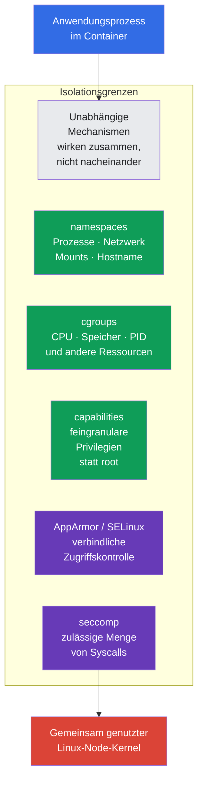
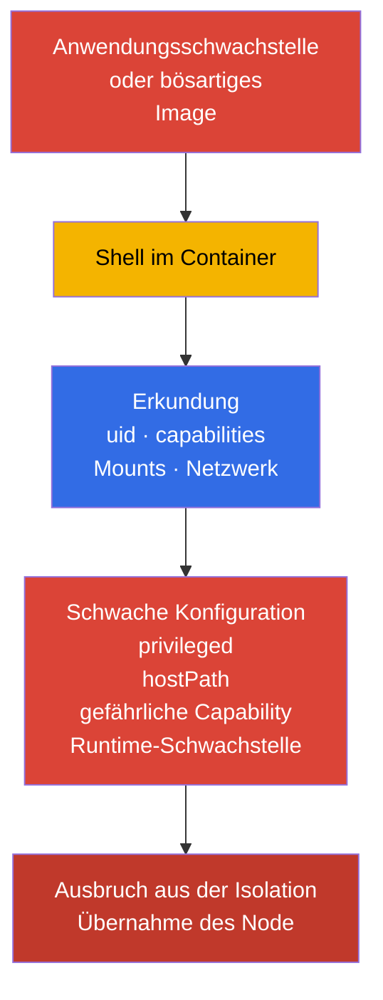
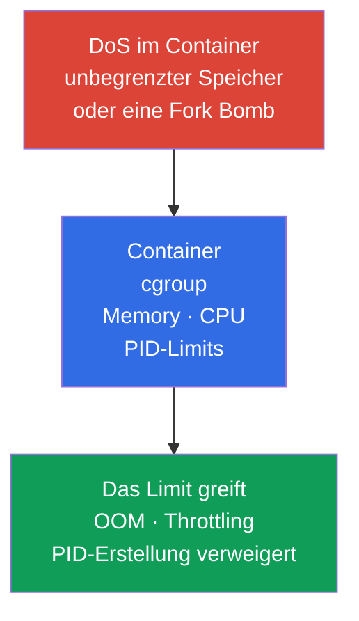
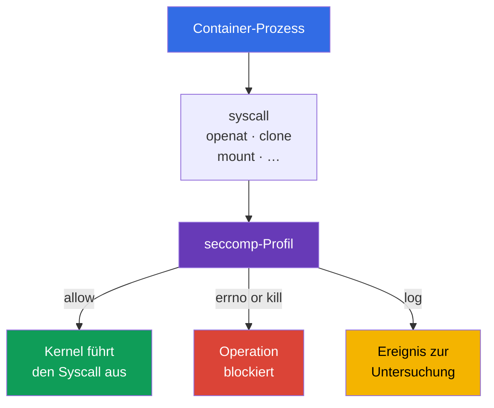
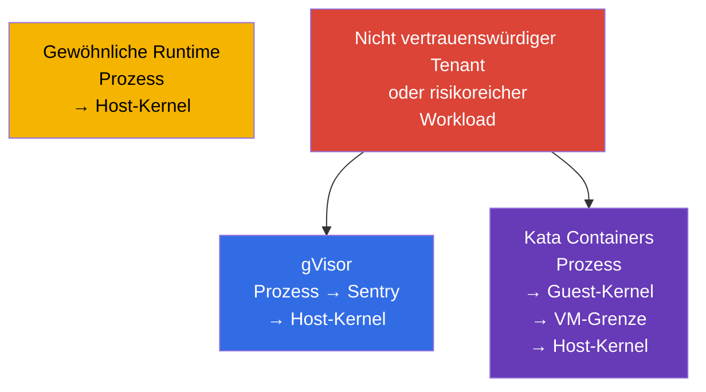

[Русская версия](ru.md) · [Eng version](README.md) · [Versión en español](es.md) · [Version française](fr.md) · [ქართული ვერსია](ge.md) · [繁體中文版](tw.md) · [日本語版](jp.md)

# Kapitel 03. Linux-Sicherheitsmechanismen unter der Haube

> **Das Problem.** Ein Container ist keine virtuelle Maschine: Ein Workload teilt sich den Kernel mit dem Node,
> und die Ausführung von Code in einem Pod wird mit `privileged`, Host-Namespaces,
> übermäßigen Capabilities oder zugänglichen Mounts gefährlicher. Das Verständnis der Linux-Grenzen ist nötig, damit sich mehrere
> Isolationsmechanismen ergänzen und die Auswirkungen eines Container Escape begrenzen,
> statt eine falsche Erwartung eines einzigen absoluten Schutzes zu schaffen.

> **Was als Nächstes kommt.** In Kapitel 02 haben wir die Kubernetes-Angriffsfläche in Schichten zerlegt. Nun betrachten wir die Linux-Mechanismen, mit denen die Container Runtime einen Pod-Prozess isoliert: Namespaces, cgroups, Capabilities und Syscall-Filterung. Dies ist die Grundlage von CKS, aber keine eigene Exam-Domain: Es erklärt, warum die Beschränkungen von System Hardening (10 %) und Minimize Microservice Vulnerabilities (20 %) funktionieren und wo ihre Grenzen liegen.

> **Was Sie aus CKA benötigen.** Die Grundarchitektur von Containern, Namespaces, cgroups und der Runtime wird in CKA behandelt: [Container](../../../cka/course/00-4-containers/de.md), [Linux](../../../cka/course/00-5-linux/de.md) und [Network Namespaces](../../../cka/course/00-7-netns/de.md). Hier wiederholen wir weder die Erstellung von Containern noch die grundlegenden CKA-Befehle, sondern betrachten Sicherheitseigenschaften, die Überprüfung der Isolation und Möglichkeiten, sie zu umgehen.

> 🧠 Container-Isolation ist eine Kombination unabhängiger Linux-Grenzen und keine einzelne „magische“ Einstellung.

## 03.1. Container-Isolation ist ein Satz von Grenzen, keine virtuelle Maschine

Ein gewöhnlicher OCI-Workload unter runc/containerd ist ein Linux-Prozess auf dem gemeinsam genutzten Kernel des Node. Seine Isolation entsteht aus mehreren unabhängigen Mechanismen. Das ist keine absolute Formel für Sandbox Runtimes: Kata fügt eine VM-Grenze hinzu, während gVisor die Interaktion eines Prozesses mit dem Kernel deutlich verändert. Erreicht ein Angreifer Code-Ausführung in einem Container, begrenzen ihn diese Grenzen zunächst. Ein Fehler in einer Grenze sollte die anderen nicht automatisch aufheben: Das ist Defense in Depth.



Der gemeinsam genutzte Kernel ist die grundlegende Grenze des Container-Modells. Eine Kernel- oder Container-Runtime-Schwachstelle kann Code-Ausführung in einem Container in einen Container Escape verwandeln. Betrachten Sie einen Container daher nicht als vollständige Sicherheitsgrenze für nicht vertrauenswürdige Workloads: Verwenden Sie mehrere Hardening-Schichten und bei Bedarf eine Sandbox Runtime aus Kapitel 22.

Ein typischer Angriffspfad sieht so aus:



Die Aufgabe des Engineers ist, unnötige Privilegien zu entfernen, die Auswirkungen eines DoS zu begrenzen und einen Escape-Versuch beobachtbar oder unmöglich zu machen. Das Feld `securityContext` ist die Kubernetes-Schnittstelle zu einem Teil dieser Mechanismen; seine Grundsyntax wird jedoch bereits im [CKA-Kapitel über SecurityContext](../../../cka/course/20/de.md) behandelt.

> 🧠 Ein Namespace verändert die Sichtbarkeit einer Ressource, entfernt sie aber nicht vom Node und entzieht keinen ausdrücklich gewährten Zugriff.

## 03.2. Linux Namespaces: Was ein Container sieht und nicht sieht

Ein Namespace gibt einem Prozess eine eigene Sicht auf eine Kernel-Ressource. Der Prozess verschwindet nicht vom Node, sieht über die Kernel-API aber nur die Objekte seines Namespace. Kubernetes und die Runtime erstellen die benötigten Namespaces beim Start einer Pod-Sandbox.

**Kurze Erinnerung zum Start eines gewöhnlichen Pod.** Ein Benutzer oder Controller sendet seine Spezifikation an den API Server, der Scheduler wählt einen Node, und der kubelet auf diesem Node übergibt den Pod an die Container Runtime. Die Runtime erstellt eine Pod-Sandbox (einschließlich der erforderlichen Namespaces) und startet danach die Pod-Container darin. Der vollständige Pod-Erstellungspfad, die Rolle des Pause-Containers und die Sandbox werden im [CKA-Kapitel 4](../../../cka/course/04/de.md) erklärt.

| Namespace | Isoliert | Was der Container-Prozess gewöhnlich sieht | Sicherheitsfolge |
|---|---|---|---|
| `PID` | Prozessbaum und PIDs | seine eigene PID 1 und Prozesse im Container oder Pod | kann Host-Prozesse gewöhnlich nicht inspizieren |
| `NET` | Interfaces, Routen, Ports, Firewall-Namespace | `eth0`, die eigene Pod-IP und Routing-Tabelle | das Pod-Netzwerk ist nicht das Node-Netzwerk |
| `MNT` | Mount Points und Filesystem-Hierarchie | Image-rootfs und deklarierte Volumes | das Host-Filesystem darf ohne Mount nicht zugänglich sein |
| `UTS` | Hostname und Domain Name | den Pod-Hostname | legt den Node-Hostname nicht offen |
| `IPC` | Shared Memory, Semaphore, Message Queues | IPC-Objekte der Pod-Sandbox | kann IPC anderer Pods oder des Node nicht lesen |
| `USER` | UID/GID-Mapping und Capabilities | eine im User Namespace gemappte UID | UID 0 im Container kann auf eine nicht privilegierte Host-UID gemappt sein |

Die Grenze ist nicht absolut. Beispielsweise teilen mehrere Container in einem Pod gewöhnlich den `NET` Namespace und können über `localhost` kommunizieren. Die Felder `hostNetwork`, `hostPID` und `hostIPC` deaktivieren die entsprechende Grenze. Sie sollten für gewöhnliche Workloads durch Pod Security Admission oder eine Policy Engine verboten werden.

> 🔬 UID/GID-Mapping, idmapped Mounts und Kernel-/Runtime-Versionsanforderungen für `hostUsers: false`.

### User Namespaces: separates UID/GID-Mapping

Ein User Namespace wird nicht automatisch aktiviert. In Kubernetes ist er Opt-in: `spec.hostUsers: false` fordert einen User Namespace für einen Pod an; in v1.36 wurde das Feature Stable/GA. Im Exam Snapshot v1.35 ist es noch Beta, obwohl `UserNamespacesSupport` standardmäßig aktiviert ist. Daher ist dies 🔬 Deep Dive / Production und nicht 🎯 CKS Core.

**Das Problem.** Ohne User Namespace ist UID 0 in einem gewöhnlichen Container dieselbe numerische UID 0 wie root auf dem Node. Namespaces verbergen einen Teil der Host-Ressourcen, ändern allein jedoch dieses Identity-Mapping nicht. Erhält ein Prozess Zugriff über die erwartete Container-Grenze hinaus, behandelt ihn der Host als root - die Folgen eines Anwendungs-, Konfigurations- oder Isolationsfehlers werden wesentlich schwerer.

**Die Schutzwirkung.** Mit Unterstützung durch kubelet, Container Runtime und Node wird UID 0 im Container auf eine nicht privilegierte UID des Hosts gemappt. Die Anwendung kann sich **im** Pod weiterhin als root betrachten, für Kernel und Host-Dateien ist sie jedoch nicht mehr Host-root. So reduziert ein User Namespace den Blast Radius einer Kompromittierung und fügt eine weitere Grenze zwischen Container-Prozess und Node hinzu.

**Fallstricke.**

- Dies ersetzt weder Least Privilege, Capabilities, seccomp noch MAC: Ein User Namespace behebt keine Kernel-Schwachstelle und macht `privileged`, `hostPath` oder Host-Namespaces nicht sicher.
- Kompatibilität von Node, Runtime, Volumes und Workload ist zwingend; die kurze Checkliste unten erläutert genau, was vor dem Rollout zu prüfen ist.
- Pod Security Standards lockern bei Pods mit User Namespaces die Prüfungen von `runAsNonRoot` und `runAsUser`, weil root in einem solchen Pod kein privilegierter Host-Benutzer ist. Dies hebt die internen Anwendungsregeln nicht auf: Soll sie nicht als root laufen, verlangen Sie `runAsNonRoot` auch hier.

```yaml
apiVersion: v1
kind: Pod
metadata:
  name: userns-web
  namespace: demo
spec:
  hostUsers: false
  containers:
  - name: web
    image: nginx:1.30.4
```

Prüfen Sie die Kompatibilität vor dem Aktivieren von User Namespaces an drei Stellen:

1. **Der Node.** Linux **6.3+** ist erforderlich: Ab dieser Version unterstützt tmpfs idmapped Mounts. Das Filesystem muss idmapped Mounts für `/var/lib/kubelet/pods` und die verwendeten Volumes unterstützen. Führen Sie dies auf **jedem** Node aus, auf dem der Pod platziert werden kann:

   ```bash
   uname -r
   sudo findmnt -T /var/lib/kubelet/pods \
     -o TARGET,SOURCE,FSTYPE,OPTIONS
   ```

   Der erste Befehl muss Kernel 6.3 oder neuer zeigen; der zweite zeigt das Filesystem, dessen Unterstützung für idmapped Mounts mit dem Node-Image abgeglichen werden muss. Diese Befehle erkennen einen ungeeigneten Node, ersetzen jedoch keinen Canary-Start eines Pod mit `hostUsers: false`.

2. **Die Runtime.** Dokumentierte Mindestwerte sind: runc >= 1.2, crun >= 1.9 (>= 1.13 empfohlen), containerd >= 2.0 oder CRI-O >= 1.25. Prüfen Sie auf dem Ziel-Node die CRI Runtime und die OCI-Runtime-Version:

   ```bash
   sudo crictl version
   sudo runc --version 2>/dev/null || sudo crun --version
   ```

   Die Ausgabe von `crictl version` muss `runtimeName` und `runtimeVersion` enthalten; gleichen Sie den zweiten Befehl mit der Runtime ab, die der Node tatsächlich verwendet. Leiten Sie die runc-Version nicht aus der Version von `kubectl` oder der Kubernetes-API ab.

3. **Workload und Storage.** User Namespaces ändern das UID/GID-Mapping. Damit ein Filesystem-Volume im Pod korrekten Besitzer und Berechtigungen behält, muss der kubelet es als idmapped Mount einhängen. `volumeDevices`/Raw-Block-Volumes haben kein Filesystem für ein solches Mapping, und der Linux-NFS-Client unterstützt die erforderlichen idmapped Mounts nicht. Verwendet ein Workload einen dieser Typen, kann der kubelet das Volume nicht für einen Pod mit `hostUsers: false` vorbereiten, und der Pod startet nicht.

   **Ein gewöhnliches EBS PVC ist nicht verboten.** Stellt ein EBS CSI Driver ein PVC als Filesystem bereit (der typische Fall: `volumeMode: Filesystem`, das Volume ist über `volumeMounts` eingebunden), kann ein solcher Pod mit User Namespaces laufen, wenn das Node-Filesystem idmapped Mounts unterstützt. Beispielsweise werden ext4 und XFS unter Linux 6.3+ unterstützt. Dasselbe EBS PVC mit `volumeMode: Block`, das über `volumeDevices` an einen Container übergeben wird, ist jedoch ein Raw-Block-Volume und damit inkompatibel. Prüfen Sie Storage daher **vor** dem Rollout: So erkennen Sie, ob User Namespaces für den Workload vermieden oder die Storage-Anbindung zuerst geändert werden muss. Prüfen Sie für einen vorhandenen Test-Pod oder gleichwertigen Workload in Staging zuerst Raw-Block-Devices:

   ```bash
   NS=demo
   POD=userns-web

   kubectl get pod -n "$NS" "$POD" -o json | jq -r '
     (
       .spec.containers[]?,
       .spec.initContainers[]?,
       .spec.ephemeralContainers[]?
     ) as $container
     | $container.volumeDevices[]?
     | "container=\($container.name) raw-block-volume=\(.name)"
   '
   ```

   Leere Ausgabe bedeutet, dass `volumeDevices` nicht verwendet werden. Prüfen Sie anschließend direkte NFS-Volumes und über PVCs eingebundene PVs:

   ```bash
   kubectl get pod -n "$NS" "$POD" -o json | jq -r '
     .spec.volumes[]? | select(.nfs)
     | "direct NFS volume: \(.name)"
   '

   for pvc in $(kubectl get pod -n "$NS" "$POD" \
     -o jsonpath='{range .spec.volumes[?(@.persistentVolumeClaim)]}{.persistentVolumeClaim.claimName}{"\n"}{end}'); do
     pv=$(kubectl get pvc -n "$NS" "$pvc" \
       -o jsonpath='{.spec.volumeName}')
     kubectl get pv "$pv" -o json | jq -r '
       if .spec.nfs then "NFS PV: \(.metadata.name)"
       elif .spec.csi then "CSI driver: \(.spec.csi.driver)"
       else "PV without direct NFS: \(.metadata.name)"
       end
     '
   done
   ```

   Jede Ausgabe zu Raw Block oder NFS bedeutet, dass dieser Workload nicht für User Namespaces bereit ist. Bei einem CSI Volume belegt die Zeile `CSI driver` allein keine Kompatibilität: Bestätigen Sie sie anhand der Dokumentation und eines Tests des konkreten CSI Driver.

Es gibt außerdem harte API-Beschränkungen: Mit `hostUsers: false` dürfen Sie `hostNetwork: true`, `hostIPC: true` oder `hostPID: true` nicht setzen. Dies ist keine Hardening-Einstellung, die ignoriert werden kann: Kubernetes weist einen solchen Pod zurück.

Auf einem Node können Namespaces mit dem Werkzeug `lsns` angezeigt werden. Dies ist ein Diagnosebefehl für einen Node-Administrator und kein Befehl, der einer Anwendung gegeben werden sollte:

```bash
sudo lsns \
  -t pid \
  -t net \
  -t mnt \
  -t uts \
  -t ipc \
  -t user
sudo crictl ps
CONTAINER_ID="${CONTAINER_ID:?set target container id from crictl ps}"
sudo crictl inspect "$CONTAINER_ID" | jq '.info.pid'
PID=$(sudo crictl inspect "$CONTAINER_ID" | jq -r '.info.pid')
sudo lsns -p "$PID"
```

Um zu prüfen, dass sich ein Container nicht im Host-PID-Namespace befindet, vergleichen Sie den Namespace-Inode des Container-Prozesses mit Node-PID 1:

```bash
sudo readlink /proc/1/ns/pid
sudo readlink /proc/"$PID"/ns/pid
# Die Werte müssen sich für einen gewöhnlichen Pod unterscheiden.
```

Im Pod ist eine sichere erste Diagnose nützlich:

```bash
kubectl exec -n demo deploy/web -- sh -c '
  echo "hostname: $(hostname)"
  echo "pid namespace: $(readlink /proc/1/ns/pid)"
  echo "network namespace: $(readlink /proc/1/ns/net)"
  ps -ef
  ip route
'
```

Verwechseln Sie PID 1 eines Containers nicht mit Host-PID 1. Ein PID Namespace verbirgt Prozesse, entzieht aber keinen ausdrücklich gewährten Zugriff: `hostPath` mit `/proc`, `privileged: true` oder `hostPID: true` ändern das Threat Model. Verwenden Sie zur Diagnose solcher Felder:

```bash
kubectl get pod -A -o jsonpath='{range .items[*]}{.metadata.namespace}{"/"}{.metadata.name}{" hostPID="}{.spec.hostPID}{" hostNetwork="}{.spec.hostNetwork}{" hostIPC="}{.spec.hostIPC}{"\n"}{end}'
```

> 🧠 Ein Namespace begrenzt die Sichtbarkeit, eine cgroup den Verbrauch; `limits` schaffen eine Ressourcengrenze, während `requests` beim Scheduling helfen.

## 03.3. cgroups: Ressourcenlimits als Schutz vor DoS

Beantwortet ein Namespace die Frage „Was sieht ein Prozess?“, beantwortet eine cgroup „Wie viele Ressourcen kann er verbrauchen?“. Die Container Runtime legt Container-Prozesse in eine cgroup, und der kubelet wendet Limits und Requests aus der Pod-Spezifikation an.

Ohne Memory Limit kann ein Prozess Node-Speicher belegen und Memory Pressure, Eviction anderer Pods oder einen Kernel OOM verursachen. Ohne PID Limit kann eine Fork Bomb die PID-Tabelle erschöpfen. Ein CPU Request nimmt am Scheduling und an der CPU-Verteilung teil, während ein CPU Limit über Throttling eine harte Obergrenze setzt; ein zu niedriges CPU Limit kann die Latenz verschlechtern, selbst wenn CPU verfügbar ist. Deshalb bilden Memory-/PID-Limits eine direktere DoS-Grenze, während ein CPU Limit bewusst für das Workload-Profil gewählt werden sollte. Dies betrifft Cluster-Verfügbarkeit und ist daher ein Sicherheitsszenario, nicht nur eine Performance-Frage.



Das Minimalbeispiel für Limits eines Prozesses, der ein kleines HTTP-Traffic-Volumen bedienen kann:

```yaml
apiVersion: v1
kind: Pod
metadata:
  name: bounded-web
  namespace: demo
spec:
  containers:
  - name: web
    image: nginx:1.30.4
    resources:
      requests:
        cpu: 100m
        memory: 128Mi
      limits:
        cpu: 500m
        memory: 256Mi
```

> 🔬 `spec.resources` auf Pod-Ebene ist ein Kubernetes-v1.34-Beta-Feature für ein gemeinsames Ressourcenbudget der Container.

### Pod-Level Resources: gemeinsame Pod-Grenze

**Pod-Level Resources** sind seit Kubernetes v1.34 Beta und standardmäßig aktiviert. Mit `spec.resources` können Sie gemeinsame `requests` und `limits` für CPU, Memory und Hugepages des Pod setzen: Dies ist das Gesamtbudget für den gesamten Pod und kein Ersatz für explizite Container-Ressourcen. Ein aggregiertes Pod Limit ist eine echte gemeinsame Grenze für Pod-Container; Container-Level Limits bleiben unabhängige Limits für jeden Container.

```yaml
apiVersion: v1
kind: Pod
metadata:
  name: pod-budget-web
  namespace: demo
spec:
  resources:
    requests:
      cpu: "500m"
      memory: 128Mi
    limits:
      cpu: "1"
      memory: 256Mi
  containers:
  - name: app
    image: nginx:1.30.4
```

Speichern Sie das Beispiel als `pod-budget-web.yaml` und prüfen Sie das Gesamtbudget gezielt in `spec.resources`:

```bash
kubectl apply -f pod-budget-web.yaml
kubectl wait -n demo --for=condition=Ready pod/pod-budget-web --timeout=120s
kubectl get pod -n demo pod-budget-web \
  -o jsonpath='{.spec.resources}{"\n"}'
kubectl describe pod -n demo pod-budget-web
```

Unter cgroup v2 sind Limits über die Dateien `memory.max`, `cpu.max` und `pids.max` sichtbar; die cgroup-Position eines bestimmten Prozesses zeigt `/proc/<pid>/cgroup`:

```bash
sudo cat /proc/"$PID"/cgroup
CGROUP=$(awk -F: '$1 == "0" {print $3}' /proc/"$PID"/cgroup)
sudo cat "/sys/fs/cgroup${CGROUP}/memory.max"
sudo cat "/sys/fs/cgroup${CGROUP}/cpu.max"
sudo cat "/sys/fs/cgroup${CGROUP}/pids.max"
```

Auf einem älteren Node mit cgroup v1 liegen Controller in getrennten Mount Points. Kopieren Sie daher den cgroup-v2-Pfad nicht ohne Prüfung. Bestimmen Sie zunächst den Modus:

```bash
stat -fc %T /sys/fs/cgroup
# cgroup2fs bedeutet cgroup v2.
```

Merken Sie sich diese Grenzen getrennt:

- **Innerhalb eines Workload: `requests` und `limits`.** `requests` beeinflussen Scheduler und QoS, stoppen einen ressourcenhungrigen Prozess aber nicht selbst. `limits` legen die harte Grenze fest: Für CPU ist dies eine Obergrenze durch mögliches Throttling; wählen Sie ein CPU Limit daher nicht willkürlich niedrig.
- **Auf Namespace-Ebene: `ResourceQuota` und `LimitRange`.** Die Ressourcen eines Pod schützen einen Namespace nicht vor aggregiertem Verbrauch. `ResourceQuota` begrenzt sein Gesamtbudget, während `LimitRange` Defaults und zulässige Grenzen für jeden Workload setzt. Zusammen verhindern sie, dass ein Team andere mit einem unvollständigen Manifest verdrängt.
- **PID: Der Node-Administrator setzt das Limit.** In gewöhnlichem Pod-YAML können Sie nicht angeben: „Dieser Workload darf N Prozesse haben.“ Stattdessen konfiguriert der Administrator den kubelet-Parameter `podPidsLimit` - die maximale Zahl von PIDs **für einen Pod** auf diesem Node. Der kubelet wendet ihn über die PID-cgroup an. Die Verifikation hat daher zwei Schritte: Zuerst `podPidsLimit` in der kubelet-Konfiguration finden, danach `pids.max` in der cgroup eines bereits laufenden Pod prüfen.
- **Bei Memory Pressure: OOM in der cgroup.** Der Kernel kann einen Container-Prozess in der entsprechenden cgroup beenden. Endet der Hauptprozess, startet der kubelet den Container gemäß `restartPolicy` neu.
- **Sicher verifizieren.** Beweisen Sie ein Memory Limit nicht durch einen absichtlich ausgelösten OOM auf einem Produktions-Node.

> 🎯 Entfernen Sie `privileged`, Host-Namespaces, übermäßige Capabilities und `allowPrivilegeEscalation: true`; setzen Sie `capabilities.drop: [ALL]`, `RuntimeDefault` und das erforderliche MAC-Profil.

## 03.4. Linux Capabilities: Root-Privilegien feingranular aufteilen

UID 0 ist nicht das einzige Zeichen für Privilegien. Der Linux-Kernel teilt einen Teil der Root-Befugnisse in Capabilities auf. Ein Prozess besitzt mehrere Capability-Sets, darunter permitted, effective, inheritable, bounding und ambient. Nur `id` zu prüfen, beweist nicht, dass ein Prozess sicher ist.

Einige Capabilities sind für eine gewöhnliche Anwendung besonders gefährlich:

| Capability | Risiko | Üblicher Grund, sie zu gewähren |
|---|---|---|
| `CAP_SYS_ADMIN` | breiter Satz administrativer Operationen, Mount- und Namespace-Operationen; häufiger Bestandteil von Escape-Ketten | für eine Geschäftsanwendung fast nie erforderlich |
| `CAP_SYS_MODULE` | Laden und Entladen von Kernel-Modulen | eine Node-Systemkomponente, kein Anwendungs-Pod |
| `CAP_SYS_PTRACE` | Tracing und Lesen von Speicher kompatibler Prozesse | ein eng begrenztes Diagnosewerkzeug |
| `CAP_NET_ADMIN` | Ändern von Interfaces, Routen und Firewall | CNI und ein Netzwerk-Agent |
| `CAP_DAC_OVERRIDE` | Umgehen von Filesystem-DAC-Prüfungen | keinem Workload ohne ausdrücklichen Grund gewähren |
| `CAP_SETUID` / `CAP_SETGID` | Ändern von UID/GID | spezielles Bootstrap, nicht der Anwendungs-Dauerbetrieb |
| `CAP_BPF` / `CAP_PERFMON` | Arbeit mit BPF und Kernel-Performance-Mechanismen | Node-Observability mit getrenntem Trust Model |

Zeigen Sie Datei- und Prozess-Capabilities auf dem Node an:

```bash
sudo getcap -r /usr/local/bin 2>/dev/null
sudo capsh --print
sudo getpcaps "$PID"
```

`getcap` zeigt File Capabilities, die eine ausführbare Datei beim Start erhält. `getpcaps "$PID"` zeigt die Capabilities des angegebenen Prozesses; `capsh --print` ohne Argument zeigt den Zustand der aktuellen Shell, nicht einer zuvor gefundenen Container-PID. Die Befehle benötigen Node-Privilegien für einen anderen Prozess; das ist erwartbar und selbst ein Schutz.

Prüfen Sie vor dem Hinzufügen von `NET_BIND_SERVICE` den Wert `net.ipv4.ip_unprivileged_port_start` im Netzwerk-Namespace des Ziel-Pod. Ist der Schwellwert `0`, kann ein nicht privilegierter Prozess bereits auf einem niedrigen Port lauschen und die Capability ist unnötig:

```bash
kubectl exec -n demo <pod> -- cat /proc/sys/net/ipv4/ip_unprivileged_port_start
```

Für einen gewöhnlichen nicht privilegierten Container setzt `allowPrivilegeEscalation: false` Linux `no_new_privs` für den Prozess: Nach `exec` darf ein Child-Prozess keine neuen Privilegien durch setuid/setgid-Bits oder File Capabilities erhalten.

Es gibt eine wichtige Kubernetes-Ausnahme: `allowPrivilegeEscalation` ist faktisch immer `true`, wenn ein Container mit `privileged: true` läuft oder `CAP_SYS_ADMIN` besitzt. Entfernen Sie daher zuerst `privileged` und übermäßige Capabilities; `allowPrivilegeEscalation: false` ist eine zusätzliche Grenze und keine Methode, einen solchen Container abzusichern.

Bei `allowPrivilegeEscalation: true` (Default) setzt Kubernetes `no_new_privs` nicht. `true` selbst gewährt weder Capability noch macht es einen Container privilegiert, lässt aber einen Privilege-Escalation-Pfad: Ein kompromittierter nicht privilegierter Prozess kann ein setuid/setgid-Programm oder eine Datei mit Capabilities aus dem Image ausführen und die von dieser Datei angebotene UID/GID oder Capability erhalten. So kann RCE als Anwendungsbenutzer zu root oder einem Prozess mit zusätzlichen Capabilities **im Container** werden und die Auswirkungen des Angriffs sowie mögliche Escape-Ketten erweitern. Benötigt die Anwendung ein solches exec nicht, ist `false` sicherer.

Dies ist eine wichtige, aber nicht die einzige Grenze; sie ersetzt weder das Droppen von Capabilities noch seccomp oder MAC. Ein sicherer Kubernetes-Startpunkt ist, alles zu entfernen und nur bei dokumentiertem Bedarf eine Capability hinzuzufügen. Nur wenn sysctl-Einstellung und Anwendungsanforderungen dies bestätigen, kann eine Legacy-Anwendung `NET_BIND_SERVICE` für TCP 80 benötigen:

```yaml
apiVersion: v1
kind: Pod
metadata:
  name: capability-example
  namespace: demo
spec:
  containers:
  - name: web
    image: nginx:1.30.4
    securityContext:
      allowPrivilegeEscalation: false
      capabilities:
        drop:
        - ALL
        add:
        - NET_BIND_SERVICE
```

Prüfen Sie die manifestierte Konfiguration und den Prozesszustand:

```bash
kubectl apply -f capability-example.yaml
kubectl get pod -n demo capability-example \
  -o jsonpath='{.spec.containers[0].securityContext.capabilities}{"\n"}'
kubectl exec -n demo capability-example -- sh -c 'grep Cap /proc/1/status'
```

Die `CapEff`-Werte in `/proc/1/status` sind als hexadezimale Maske kodiert. Verwenden Sie zur menschenlesbaren Interpretation `capsh --decode=<value>` auf dem Node oder in einem vertrauenswürdigen installierten Diagnose-Image:

```bash
capsh --decode=0000000000000400
# Beispiel: 0x400 entspricht cap_net_bind_service.
```

`privileged: true` ist kein Ersatz für die Konfiguration von Capabilities. Ein solcher Container erhält alle Linux Capabilities; gewöhnliche seccomp-, AppArmor- und SELinux-Einschränkungen werden entfernt oder ignoriert. Für CKS ist dies ein Warnsignal: Entfernen Sie zuerst `privileged` und bewerten Sie dann den Bedarf jeder Capability getrennt.

## 03.5. Syscalls und seccomp: den verfügbaren Kernel-API reduzieren

Jede Aktion eines User-Prozesses erreicht letztlich den Kernel über einen Syscall: Datei öffnen, Socket erstellen, Speicher allokieren, Namespace ändern. Auch wenn eine Anwendung keine gefährliche Operation benötigt, kann ein verwundbarer Prozess den entsprechenden Syscall versuchen. seccomp erlaubt dem Kernel, einen Prozess nach einer Syscall-Regel zu erlauben, abzulehnen, zu protokollieren oder zu beenden.



seccomp bestimmt nicht, wer auf die Kubernetes-API zugreifen darf, und behebt kein unsicheres Image. Es ist der letzte Filter zwischen einem kompromittierten Prozess und der Kernel-API. Besonders nützlich ist es zusammen mit `capabilities.drop: [ALL]`, `allowPrivilegeEscalation: false` und einem MAC-Profil.

Ist `seccompProfile` nicht angegeben, kann ein Pod `Unconfined` bleiben. Eine Ausnahme ist ein Node, auf dem `seccompDefault: true` im kubelet aktiviert ist: Dort erhält ein fehlendes Profil `RuntimeDefault`. Betrachten Sie dies nicht als universelle Cluster-Eigenschaft - prüfen Sie die Node-Konfiguration und geben Sie dem Workload ausdrücklich ein Profil.

Beginnen Sie für die meisten Workloads mit einem Runtime-Profil statt `Unconfined`:

```yaml
apiVersion: v1
kind: Pod
metadata:
  name: runtime-default
  namespace: demo
spec:
  securityContext:
    seccompProfile:
      type: RuntimeDefault
  containers:
  - name: app
    image: nginx:1.30.4
```

Prüfen Sie die Pod-Spezifikation selbst, nicht eine Annahme über den Runtime-Default:

```bash
kubectl apply -f runtime-default.yaml
kubectl get pod -n demo runtime-default \
  -o jsonpath='{.spec.securityContext.seccompProfile.type}{"\n"}'
kubectl describe pod -n demo runtime-default
```

Ein Custom Profile wird verwendet, wenn eine gemessene und reproduzierbare Menge von Syscalls vorliegt. Es wird auf jedem Node gespeichert, auf dem der Pod starten kann, im `seccomp`-Profilverzeichnis des kubelet. Ein falscher Pfad oder ein fehlendes Profil auf dem ausgewählten Node verhindert den Pod-Start. Das vollständige Profilformat, Audit-Modus und die Verwendung von `Localhost` werden in Kapitel 17 behandelt; erstellen Sie nicht blind eine Deny List, sonst bricht ein Anwendungsupdate in Produktion.

Nutzen Sie zur Diagnose von Syscall-Verhalten auf einem isolierten Test-Node `strace`:

```bash
sudo strace -f -p "$PID" -e trace=%file,%network
# Führen Sie kein langes strace auf einem stark ausgelasteten Produktionsprozess aus.
```

## 03.6. MAC: AppArmor und SELinux ergänzen DAC

Gewöhnliches Linux DAC prüft UID, GID und Mode Bits einer Datei. Im DAC-Modell (Discretionary Access Control) kann der Objektbesitzer Mode Bits beispielsweise mit `chmod` ändern und dadurch Zugriff innerhalb des DAC-Modells gewähren oder entziehen. Das Ändern des UID-Besitzers einer Datei erfordert unter Linux `CAP_CHOWN`; ein nicht privilegierter Besitzer kann die Gruppe einer Datei nur in eine Gruppe ändern, deren Mitglied er ist. Ein Prozess mit ausreichender UID/GID oder Capabilities kann einen Teil der gewöhnlichen DAC-Prüfungen bestehen oder umgehen.

**Mandatory Access Control (MAC)** fügt eine zweite, für den Kernel verbindliche Prüfung hinzu. Der Administrator lädt eine Policy, und der Kernel ordnet einen Prozess seinem Profil/Label zu und prüft, ob eine konkrete Aktion an Datei, Socket oder anderem Objekt erlaubt ist. Auch wenn DAC bereits Zugriff erlaubt hat, kann MAC ihn verweigern; der Prozess selbst kann die Policy nicht entfernen oder abschwächen. Ziel ist die Einschränkung eines kompromittierten Prozesses: Ein Webserver darf beispielsweise keine SSH-Schlüssel lesen oder Systemdateien ändern, nur weil er zusätzliche UID, Capability oder Zugriff auf eine Datei erhielt. MAC ergänzt daher DAC, Capabilities und seccomp, statt sie zu ersetzen.

| Mechanismus | Hauptmodell | Wo es häufiger vorkommt | Zu prüfen |
|---|---|---|---|
| AppArmor | profilbasiert, Dateipfade und Operationen | Ubuntu, Debian und einige verwaltete Nodes | `aa-status`, geladenes Profil, `DENIED` im Audit Log |
| SELinux | Labels und Type Enforcement | RHEL, Fedora, OpenShift und kompatible OSs | `getenforce`, Labels, AVC Denial im Audit Log |

Beide Mechanismen lösen dieselbe Aufgabe, ihre Profile und ihr Betrieb sind aber nicht austauschbar. Sie können ein AppArmor-Profil nicht auf einen SELinux-Node kopieren und erwarten, dass es angewendet wird. Bestimmen Sie vor dem Entwurf einer Policy, was im Node-Image tatsächlich aktiviert ist:

```bash
sudo aa-status || true
getenforce 2>/dev/null || true
sudo journalctl -k --since '10 minutes ago' | grep -Ei 'apparmor|avc|denied' || true
```

In Kubernetes lautet die aktuelle AppArmor-Schnittstelle `securityContext.appArmorProfile`. Ein Beispiel mit Runtime-Profil:

```yaml
securityContext:
  appArmorProfile:
    type: RuntimeDefault
```

`RuntimeDefault` erfordert, dass die Container Runtime auf dem Node ein kompatibles Default Profile bereitstellt; prüfen Sie dies im tatsächlichen Node Pool, nicht nur in YAML. Bei `Localhost` muss das Profil vorab auf dem Ziel-Node geladen und über `localhostProfile` angegeben sein. Das ist eine Node-lokale Abhängigkeit: Der Scheduler verschiebt kein Profil zwischen Nodes. Stellen Sie das Profil in Produktion daher über Konfigurationsmanagement bereit, prüfen Sie es in jedem Node Pool und beschränken Sie die Pod-Platzierung. Profilimplementierung und `DENIED`-Analyse werden in Kapitel 16 behandelt.

Konfigurieren Sie für SELinux die Label-Parameter über `securityContext.seLinuxOptions` nur gemäß der Policy des Node-Images. Untersuchen Sie bei einer Verweigerung zuerst das AVC Denial, statt SELinux zu deaktivieren. Volumes und Filesystem-Dateien müssen passende SELinux Labels haben; prüfen Sie hostPath, Persistent Volumes und gemeinsam beschreibbare Volumes besonders sorgfältig.

> 🧠 Container teilen sich den Kernel mit dem Node; eine Sandbox Runtime fügt Isolation für nicht vertrauenswürdige oder risikoreiche Workloads hinzu.

## 03.7. Isolationsgrenzen, Sandbox Runtimes und Diagnose von Escape-Risiken

namespaces, cgroups, capabilities, seccomp und MAC arbeiten in einem Kernel. Erfordert das Risikoprofil eine starke Grenze zwischen Tenants, verwenden Sie eine Sandbox Runtime. gVisor fängt einen erheblichen Teil der Syscalls im User Space ab, während Kata Containers einen Workload in einer leichtgewichtigen VM ausführt. Dies reduziert die Wahrscheinlichkeit der direkten Nutzung des Node-Kernels - auf Kosten von Kompatibilität, Latenz und operativer Komplexität.



Eine Sandbox hebt die übrigen Maßnahmen nicht auf. Auch in gVisor oder Kata darf ein Workload weder `privileged`, Host-Namespaces, einen Docker Socket noch breite RBAC-Berechtigungen erhalten. Wenden Sie zuerst Least Privilege an und wählen Sie dann RuntimeClass nach dem Threat Model. Die Installation von `runsc`, RuntimeClass und das Scheduling auf kompatiblen Nodes werden in Kapitel 22 behandelt.

> 🔬 Forensic-style Zuordnung eines deklarativen Pod zu PID, Namespaces und cgroup auf dem Node.

Praktische Checkliste zur Untersuchung eines verdächtigen Pod:

```bash
NAMESPACE="${NAMESPACE:?set target namespace}"
POD="${POD:?set target pod name}"

# 1. Explizite Namespace-Umgehungen und privileged mode finden.
kubectl get pod -n "$NAMESPACE" "$POD" -o yaml | \
  grep -E 'privileged:|hostPID:|hostIPC:|hostNetwork:|hostPath:|allowPrivilegeEscalation:'

# 2. Den deklarierten Pod-level und Container-level securityContext
#    sowie Volumes anzeigen. Das ist deklarative Konfiguration, kein Beweis
#    tatsächlich angewendeter Runtime-/Kernel-Einstellungen.
kubectl get pod -n "$NAMESPACE" "$POD" -o json | jq '
{
  podSecurityContext: .spec.securityContext,
  containers: [
    (
      .spec.containers[]?,
      .spec.initContainers[]?,
      .spec.ephemeralContainers[]?
    )
    | {
        name: .name,
        securityContext: .securityContext
      }
  ],
  volumes: .spec.volumes
}
'

# 3. Auf dem Node Pod-Sandbox, dann Container und dessen Namespace/cgroup finden.
#    `crictl ps --name` filtert nach Container-Name, nicht nach Pod-Name.
sudo crictl pods \
  --name "^${POD}$" \
  --namespace "^${NAMESPACE}$"
POD_ID="${POD_ID:?set target pod sandbox id from crictl pods}"
sudo crictl ps --pod "$POD_ID"
CONTAINER_ID="${CONTAINER_ID:?set target container id from crictl ps}"
sudo crictl inspect "$CONTAINER_ID" | jq '.info.pid'
PID="$(sudo crictl inspect "$CONTAINER_ID" | jq -r '.info.pid')"
PID="${PID:?failed to get pid from crictl inspect}"
sudo lsns -p "$PID"
sudo cat "/proc/$PID/cgroup"
```

Typische Fehler:

- UID 0 im Container als automatisches root auf dem Node betrachten. User Mapping und andere Grenzen können es beschränken, trotzdem ist es ein schlechter Ausgangspunkt für einen Anwendungs-Workload.
- Einen Namespace als ausreichenden Schutz ansehen. `hostPath`, Host-Namespaces, `privileged` und Kernel CVEs ändern das Ergebnis.
- `CAP_SYS_ADMIN` zur Behebung eines Symptoms hinzufügen. Ermitteln Sie zuerst die benötigte Operation und verwenden Sie eine engere Capability oder ein anderes Design.
- Einen Pod ohne `limits` lassen, weil die Anwendung „gewöhnlich“ wenig verbraucht. Ein Fehler oder eine bösartige Anfrage genügt für DoS.
- Ein Custom seccomp Profile ohne Anwendungstests und ohne Verteilung auf alle Ziel-Nodes aktivieren.
- Ein AppArmor-Profil anwenden, ohne sicherzustellen, dass es auf dem Node geladen ist, auf dem der Scheduler den Pod startete.

> 🏭 Workload Templates, Admission Policy, Trennung von Node Pools und Beobachtung von Verweigerungen schaffen eine sichere Baseline und Ausnahmen.

## 03.8. Anwendung in Produktion

- **Beschränkungen in das Workload Template einbauen.** Ein Basis-Helm-Chart oder Platform Template setzt `resources.limits`, `allowPrivilegeEscalation: false`, `capabilities.drop: [ALL]`, `seccompProfile: RuntimeDefault` und Non-root-Ausführung. Ein Team weicht nur mit Begründung vom Template ab.
- **Gefährliche Policy-Umgehungen verbieten.** Pod Security Admission auf Niveau `restricted` oder Kyverno/Gatekeeper lässt `privileged`, Host-Namespaces, unsichere Capabilities und fehlendes seccomp nicht zu. Policy-Details folgen in den Kapiteln 19 und 20.
- **Node Pools nach Vertrauen trennen.** CNI, CSI und Node Agents, die wirklich `NET_ADMIN` oder Host Mounts benötigen, laufen getrennt von Business-Workloads. Für Multi-Tenancy wählen Sie gVisor oder Kata über `RuntimeClass`.
- **Verweigerungen beobachten, Schutz nicht deaktivieren.** AppArmor-/SELinux-Denials, seccomp-Fehler, OOMKilled und PID Exhaustion gelangen in Logs und Metriken. Beheben Sie die Ursache durch Änderung der Anwendung, eines beschreibbaren Volume oder einer engen Policy, statt zu `privileged: true` zurückzukehren.
- **Den tatsächlichen Node-Zustand prüfen.** Ein Kubernetes Manifest beschreibt den Sollzustand, AppArmor-Profil, SELinux-Modus, cgroup-Modus und Runtime-Konfiguration liegen aber auf dem Node. Prüfen Sie sie in der Image Pipeline und in regelmäßigen Hardening Audits.

## 03.9. Mini-Glossar

- **namespace** - isolierte Darstellung einer Kernel-Ressource für eine Gruppe von Prozessen.
- **PID namespace** - Isolation der Prozessliste und PIDs.
- **network namespace** - Isolation von Interfaces, Routen und Netzwerk-Stack.
- **cgroup** - Gruppe von Prozessen mit Ressourcenlimits und Accounting.
- **capability** - einzelnes Linux-Privileg, das von der traditionellen allmächtigen root-Berechtigungsmenge getrennt ist.
- **CAP_SYS_ADMIN** - übermäßig breite Capability, gefährlich für einen gewöhnlichen Workload.
- **syscall** - Systemaufruf, durch den ein Prozess auf den Kernel zugreift.
- **seccomp** - vom Kernel auf einen Prozess angewendeter Syscall-Filter.
- **MAC** - Mandatory Access Control, verbindliche Zugriffspolicy über UID/GID und Mode Bits.
- **AppArmor** - profilbasiertes MAC für Linux.
- **SELinux** - labelbasiertes MAC mit Type Enforcement.
- **container escape** - Ausbruch aus erwarteter Container-Isolation zu Ressourcen des Node oder eines anderen Tenant.
- **sandboxed runtime** - Runtime mit verstärkter Isolationsgrenze, beispielsweise gVisor oder Kata Containers.

## 03.10. Zusammenfassung des Kapitels

- Ein Container verwendet den gemeinsam genutzten Kernel des Node; sein Schutz entsteht aus mehreren Linux-Mechanismen, nicht einer „Sandbox“.
- `PID`, `NET`, `MNT`, `UTS`, `IPC` und `USER` Namespaces begrenzen Ressourcensichtbarkeit, doch Host-Namespaces, `hostPath` und `privileged` können diese Grenze umgehen. Ein User Namespace wird separat mit `spec.hostUsers: false` aktiviert und erfordert Node- und Runtime-Unterstützung.
- cgroups begrenzen CPU, Memory und PID und schützen Node sowie benachbarte Workloads vor DoS; der kubelet setzt das PID-Limit über `podPidsLimit`, und ein cgroup OOM kann einen Prozess beenden und einen Container neu starten.
- Capabilities teilen root-Befugnisse auf. Die sichere Baseline ist, `ALL` zu entfernen und nach Prüfung von sysctl und echtem Bedarf nur eine dokumentierte minimale Capability zurückzugeben.
- seccomp mit `RuntimeDefault` reduziert die einem Prozess verfügbare Kernel-API; ohne explizites Profil ist `Unconfined` möglich, wenn `seccompDefault` auf dem Node nicht aktiviert ist.
- AppArmor und SELinux ergänzen gewöhnliche Dateiberechtigungen durch verbindliche Policy; Runtime-/Node-Profil, AVC und Volume Labels sind wichtig. Für stark nicht vertrauenswürdige Workloads sind zusätzlich gVisor oder Kata zu erwägen.

## 03.11. Nutzen für Exam und reale Arbeit

**Im Exam.** Dieses Kapitel liefert ein Modell für CKS-Aufgaben, in denen Sie `capabilities`, seccomp, AppArmor, `privileged`, Host-Namespaces und fehlende Limits erklären oder beheben müssen. Prüfen Sie mehr als YAML: Verwenden Sie `kubectl get ... -o jsonpath`, `kubectl exec` und bei SSH-Zugriff `crictl`, `lsns`, `aa-status` und `/proc/<pid>/cgroup`. Die praktische Fortsetzung sind Lab 106 sowie die Kapitel 16-17.

**In der realen Arbeit.** Das Verständnis der unteren Ebene hilft, eine sichere Ausnahme von einer gefährlichen Umgehung zu unterscheiden. Fordert eine Anwendung `privileged` oder `CAP_SYS_ADMIN`, untersuchen Sie ihre Aufrufe, Mounts und Architektur. Fällt ein Pod mit OOMKilled oder einem Profile Denial aus, ist das ein beobachtbares Signal für eine gezielte Korrektur, kein Grund, sämtliches Hardening zu deaktivieren.

## 03.12. Fragen zur Selbstkontrolle

<details>
<summary>1. Warum entspricht ein Container keiner virtuellen Maschine, und welche Rolle spielt der gemeinsam genutzte Kernel des Node?</summary>

Ein gewöhnlicher OCI-Workload unter runc/containerd ist ein Linux-Prozess mit gemeinsam genutztem Node-Kernel und keine eigene VM. Namespaces, cgroups, Capabilities, MAC und seccomp schaffen mehrere Grenzen, doch eine Kernel- oder Runtime-Schwachstelle kann von Code-Ausführung im Container zu einem Container Escape führen.
</details>

<details>
<summary>2. Welche Namespaces trennen Prozesse, Netzwerk und Mount Points, und welche Pod-Felder können diese Grenzen entfernen?</summary>

Der `PID` Namespace isoliert den Prozessbaum, `NET` Interfaces, Routen und Ports, und `MNT` Mount Points sowie die Filesystem-Hierarchie. Die Felder `hostPID`, `hostNetwork` und `hostIPC` deaktivieren die entsprechenden Grenzen; `hostPath` und `privileged: true` ändern ebenfalls das Zugriffsmodell auf Node-Ressourcen.
</details>

<details>
<summary>3. Wie unterscheiden sich `requests` von `limits` beim Schutz eines Node vor DoS?</summary>

`requests` beeinflussen Scheduling und QoS, stoppen einen ressourcenhungrigen Prozess jedoch nicht selbst. `limits` schaffen die harte Grenze: Ein Memory Limit begrenzt die Folgen von Memory Pressure/OOM, ein CPU Limit setzt über Throttling eine Obergrenze; das PID Limit setzt der kubelet mit `podPidsLimit`.
</details>

<details>
<summary>4. Warum darf `CAP_SYS_ADMIN` nicht gewährt werden, um einen beliebigen Anwendungsfehler zu beheben?</summary>

`CAP_SYS_ADMIN` gewährt einen breiten Satz administrativer Operationen, einschließlich Mount- und Namespace-Operationen, und ist oft Teil von Escape-Ketten. Statt ein Symptom zu beheben, bestimmen Sie die tatsächlich benötigte Operation, entfernen `ALL` Capabilities und geben nur eine enge Capability zurück, wenn sie dokumentiert erforderlich ist.
</details>

<details>
<summary>5. Welche Befehle helfen, einen Container seiner Host-PID, seinen Namespaces und seiner cgroup zuzuordnen?</summary>

Verwenden Sie auf dem Node `sudo crictl ps` und dann `sudo crictl inspect "$CONTAINER_ID" | jq '.info.pid'`, um die Container-PID zu erhalten. Zur Prüfung nutzen Sie `sudo lsns -p "$PID"` und `sudo cat "/proc/$PID/cgroup"`; vergleichen Sie den PID-Namespace-Inode mit `readlink /proc/1/ns/pid` und `readlink /proc/"$PID"/ns/pid`.
</details>

<details>
<summary>6. Wie ergänzt seccomp Capabilities, und warum ist `RuntimeDefault` für einen gewöhnlichen Workload besser als `Unconfined`?</summary>

Capabilities beschränken einzelne Privilegien, während seccomp die einem Prozess verfügbare Kernel-API auf Syscall-Ebene filtert. Ein explizites `RuntimeDefault` reduziert diese Menge für einen gewöhnlichen Workload; ohne Profil kann ein Pod dagegen `Unconfined` bleiben, wenn `seccompDefault` auf dem Node nicht aktiviert ist.
</details>

<details>
<summary>7. Worin besteht der operative Unterschied zwischen AppArmor und SELinux?</summary>

AppArmor verwendet profilbasierte Policy für Pfade und Operationen und ist auf Ubuntu/Debian verbreitet, SELinux verwendet Labels und Type Enforcement auf RHEL/Fedora/OpenShift. Ihre Profile sind nicht austauschbar: Prüfen Sie vor der Konfiguration `aa-status` oder `getenforce` und analysieren Sie AppArmor `DENIED` oder SELinux AVC Denial, statt MAC zu deaktivieren.
</details>

<details>
<summary>8. Wann reicht Container-Isolation allein nicht aus, und wozu wird eine Sandbox Runtime benötigt?</summary>

Für nicht vertrauenswürdige Tenants oder risikoreiche Workloads kann eine mit dem Node geteilte Kernel-Grenze unzureichend sein. gVisor fängt einen erheblichen Teil der Syscalls im User Space ab, während Kata einen Workload in einer leichtgewichtigen VM ausführt und so das Risiko direkter Kernel-Nutzung auf Kosten von Kompatibilität, Latenz und operativer Komplexität senkt.
</details>

## Praxis

🧪 [Lab 106 - AppArmor + seccomp](../../labs/106/README_DE.MD) verbindet diese Mechanismen mit funktionierenden Profilen auf dem Node und der Prüfung blockierter Aktionen in einem Pod. Studieren Sie davor [Kapitel 16](../16/de.md) über AppArmor und [Kapitel 17](../17/de.md) über seccomp; für stärkere Isolation fahren Sie mit [Kapitel 22](../22/de.md) über Sandbox Containers fort.

🌐 Zusätzliche interaktive Praxis (killer.sh/killercoda, externe Ressource): [container-namespaces-docker](https://killercoda.com/killer-shell-cks/scenario/container-namespaces-docker) · [container-namespaces-podman](https://killercoda.com/killer-shell-cks/scenario/container-namespaces-podman)

## Referenzmaterial

- [Kubernetes: Linux-Kernel-Sicherheitsbeschränkungen](https://kubernetes.io/docs/concepts/security/linux-kernel-security-constraints/)
- [Kubernetes: User Namespaces](https://kubernetes.io/docs/concepts/workloads/pods/user-namespaces/)

---
[Inhaltsverzeichnis](../README_DE.md) · [Kapitel 02](../02/de.md) · [Kapitel 04](../04/de.md)
