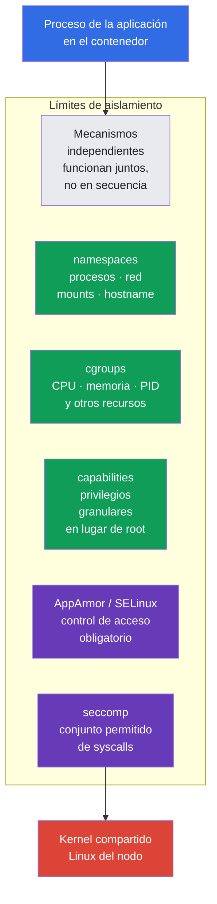
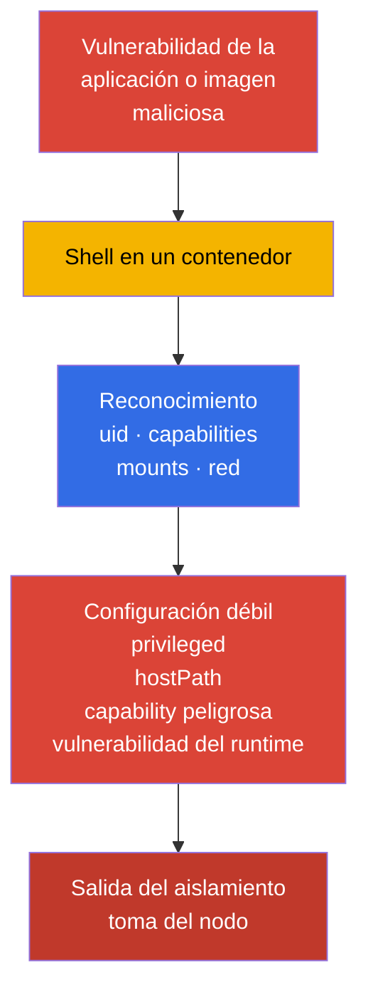
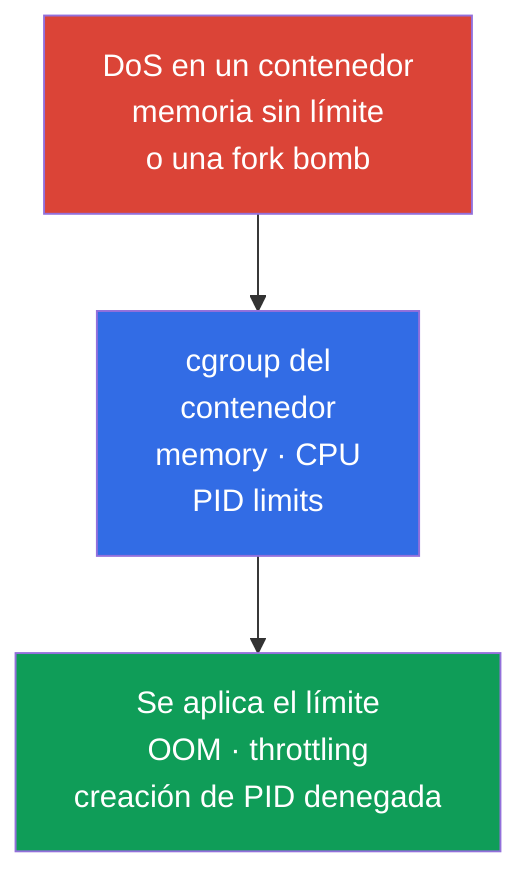
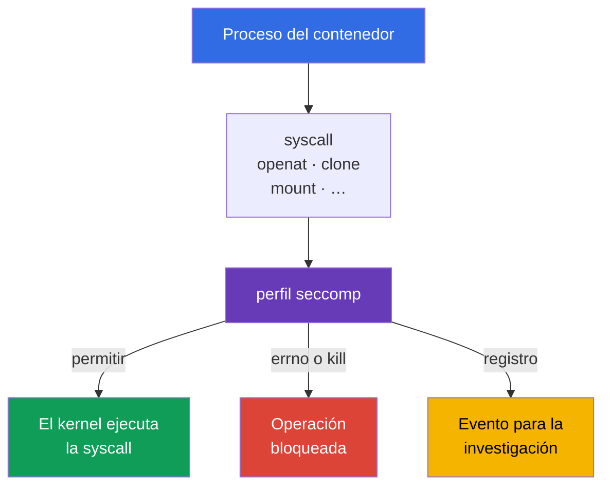
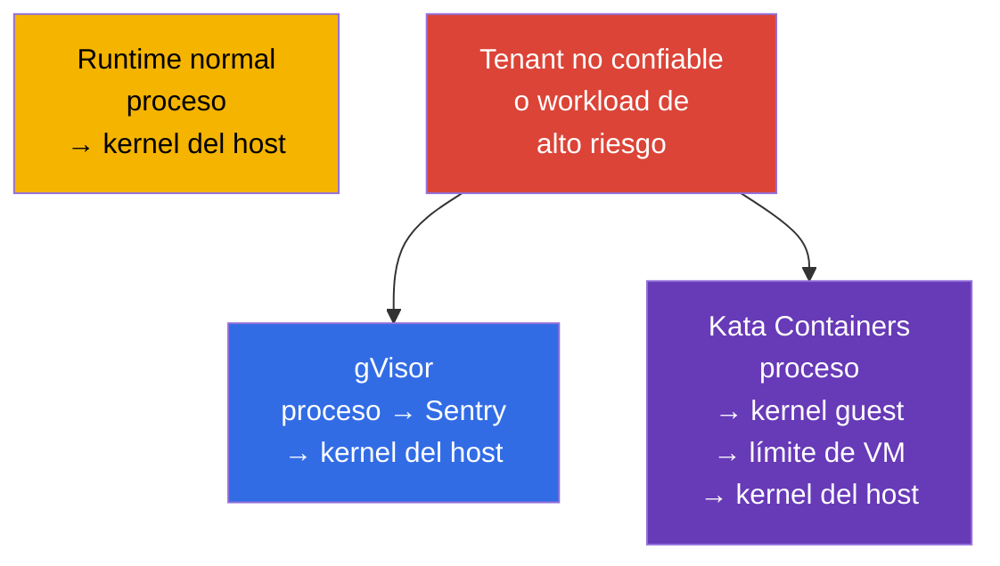

[Русская версия](ru.md) · [Eng version](README.md) · [Version française](fr.md) · [Deutsche Version](de.md) · [ქართული ვერსია](ge.md) · [繁體中文版](tw.md) · [日本語版](jp.md)

# Capítulo 03. Mecanismos de seguridad de Linux bajo el capó

> **El problema.** Un contenedor no es una máquina virtual: un workload comparte el kernel con el nodo,
> y ejecutar código dentro de un Pod se vuelve más peligroso con `privileged`, host namespaces,
> capabilities excesivas o mounts accesibles. Comprender los límites de Linux es necesario para que varios
> mecanismos de aislamiento se complementen entre sí y limiten el impacto de un container escape,
> en lugar de crear una expectativa falsa de una única protección absoluta.

> **Qué sigue.** En el capítulo 02, desglosamos la superficie de ataque de Kubernetes por capas. Ahora examinaremos los mecanismos de Linux que el container runtime utiliza para aislar un proceso de Pod: namespaces, cgroups, capabilities y filtrado de syscalls. Esto es la base de CKS, pero no un dominio de examen independiente: explica por qué funcionan las restricciones de System Hardening (10%) y Minimize Microservice Vulnerabilities (20%), y dónde están sus límites.

> **Qué necesitas de CKA.** La arquitectura básica de los contenedores, namespaces, cgroups y el runtime se cubre en CKA: [contenedores](../../../cka/course/00-4-containers/es.md), [Linux](../../../cka/course/00-5-linux/es.md) y [namespaces de red](../../../cka/course/00-7-netns/es.md). Aquí no repetimos la creación de contenedores ni los comandos básicos de CKA; en cambio, examinamos las propiedades de seguridad, la verificación del aislamiento y las formas de sortearlo.

> 🧠 El aislamiento de contenedores es una combinación de límites de Linux independientes, no una configuración «mágica».

## 03.1. El aislamiento de contenedores es un conjunto de límites, no una máquina virtual

Un workload OCI normal bajo runc/containerd es un proceso Linux sobre el kernel compartido del nodo. Su aislamiento se compone de varios mecanismos independientes. No es una fórmula absoluta para sandbox runtimes: Kata añade un límite de VM, mientras que gVisor cambia notablemente cómo un proceso interactúa con el kernel. Si un atacante logra ejecutar código en un contenedor, estos límites lo restringen en primer lugar. Un error en un límite no debería anular automáticamente los demás: eso es defense in depth.



El kernel compartido es el límite fundamental del modelo de contenedores. Una vulnerabilidad del kernel o del container runtime puede convertir la ejecución de código en un contenedor en un container escape. Por ello, no consideres un contenedor como un límite de seguridad completo para workloads no confiables: usa varias capas de hardening y, cuando sea necesario, un sandboxed runtime del capítulo 22.

Una ruta de ataque típica tiene este aspecto:



La tarea del ingeniero es eliminar privilegios innecesarios, limitar el impacto de DoS y hacer que un intento de escape sea observable o imposible. El campo `securityContext` es la interfaz de Kubernetes para algunos de estos mecanismos, pero su sintaxis básica ya se trata en el [capítulo de CKA sobre SecurityContext](../../../cka/course/20/es.md).

> 🧠 Un Namespace cambia la visibilidad de un recurso, pero no lo elimina del nodo ni revoca un acceso concedido explícitamente.

## 03.2. Linux namespaces: qué ve un contenedor y qué no ve

Un Namespace proporciona a un proceso una vista independiente de un recurso del kernel. El proceso no desaparece del nodo, pero a través de la API del kernel solo ve los objetos de su Namespace. Kubernetes y el runtime crean los namespaces necesarios al iniciar un pod sandbox.

**Un breve recordatorio sobre iniciar un Pod normal.** Un usuario o controller envía su especificación al API server, el scheduler elige un nodo y el kubelet de ese nodo entrega el Pod al container runtime. El runtime crea un pod sandbox (incluidos los namespaces necesarios) y después inicia en él los contenedores del Pod. El flujo completo de creación de un Pod, la función del contenedor pause y el sandbox se explican en el [capítulo 4 de CKA](../../../cka/course/04/es.md).

| Namespace | Aísla | Qué ve normalmente el proceso del contenedor | Consecuencia de seguridad |
|---|---|---|---|
| `PID` | árbol de procesos y PID | su propio PID 1 y los procesos del contenedor o Pod | normalmente no puede inspeccionar procesos del host |
| `NET` | interfaces, rutas, puertos y namespace de firewall | `eth0`, la IP propia del Pod y su tabla de rutas | la red del Pod no es la red del nodo |
| `MNT` | mount points y jerarquía del sistema de archivos | el rootfs de la imagen y los volumes declarados | el sistema de archivos del host no debe ser accesible sin un mount |
| `UTS` | hostname y domain name | el hostname del Pod | no revela el hostname del nodo |
| `IPC` | shared memory, semaphores y message queues | objetos IPC del pod sandbox | no puede leer IPC de otros Pods o del nodo |
| `USER` | mapeo UID/GID y capabilities | un UID mapeado en el user namespace | el UID 0 interno se puede mapear a un UID no privilegiado del host |

El límite no es absoluto. Por ejemplo, varios contenedores de un mismo Pod suelen compartir el namespace `NET` y pueden comunicarse mediante `localhost`. Los campos `hostNetwork`, `hostPID` y `hostIPC` desactivan el límite correspondiente. Se deben prohibir para workloads normales mediante Pod Security Admission o un policy engine.

> 🔬 Mapeo UID/GID, idmapped mounts y requisitos de versión de kernel/runtime para `hostUsers: false`.

### User namespaces: mapeo UID/GID independiente

Un user namespace no se activa automáticamente. En Kubernetes es opt-in: `spec.hostUsers: false` solicita un user namespace para un Pod; en v1.36 esta función pasó a Stable/GA. En el snapshot del examen v1.35 aún es Beta, aunque `UserNamespacesSupport` está habilitado por defecto, así que es 🔬 Deep Dive / Production y no 🎯 CKS Core.

**El problema.** Sin un user namespace, el UID 0 dentro de un contenedor normal es el mismo UID numérico 0 que root en el nodo. Los namespaces ocultan parte de los recursos del host, pero por sí solos no cambian este mapeo de identidad. Si un proceso obtiene acceso más allá del límite esperado del contenedor, el host lo trata como root: las consecuencias de un error de aplicación, configuración o aislamiento se vuelven considerablemente más graves.

**El efecto protector.** Con soporte del kubelet, container runtime y nodo, el UID 0 dentro del contenedor se mapea a un UID no privilegiado en el host. La aplicación puede seguir considerándose root **dentro** del Pod, pero para el kernel y los archivos del host ya no es host root. Así, un user namespace reduce el blast radius de una vulneración y añade otro límite entre el proceso del contenedor y el nodo.

**Problemas habituales.**

- Esto no sustituye least privilege, capabilities, seccomp ni MAC: un user namespace no corrige una vulnerabilidad del kernel ni hace seguros `privileged`, `hostPath` o los host namespaces.
- La compatibilidad de nodo, runtime, volume y workload es obligatoria; una breve lista de comprobación explica más abajo exactamente qué verificar antes del rollout.
- Los Pod Security Standards para Pods con user namespaces flexibilizan las comprobaciones de `runAsNonRoot` y `runAsUser`, porque root dentro de un Pod así no es un usuario privilegiado del host. Esto no anula las reglas internas de la aplicación: si no debe ejecutarse como root, exige también aquí `runAsNonRoot`.

```yaml
apiVersion: v1
kind: Pod
metadata:
  name: userns-web
  namespace: demo
spec:
  hostUsers: false
  containers:
  - name: web
    image: nginx:1.30.4
```

Antes de habilitar user namespaces, verifica la compatibilidad en tres lugares:

1. **El nodo.** Se requiere Linux **6.3+**: desde esta versión, tmpfs admite idmapped mounts. El filesystem debe admitir idmapped mounts para `/var/lib/kubelet/pods` y los volumes en uso. Ejecuta esto en **cada** nodo donde pueda programarse el Pod:

   ```bash
   uname -r
   sudo findmnt -T /var/lib/kubelet/pods \
     -o TARGET,SOURCE,FSTYPE,OPTIONS
   ```

   El primer comando debe mostrar kernel 6.3 o posterior; el segundo muestra el filesystem, que debe comprobarse frente al soporte de idmapped mounts de la imagen del nodo. Estos comandos revelan un nodo no apto, pero no sustituyen un inicio canary de un Pod con `hostUsers: false`.

2. **El runtime.** Los mínimos de la documentación son: runc >= 1.2, crun >= 1.9 (se recomienda >= 1.13), containerd >= 2.0 o CRI-O >= 1.25. En el nodo de destino, revisa las versiones de los runtimes CRI y OCI:

   ```bash
   sudo crictl version
   sudo runc --version 2>/dev/null || sudo crun --version
   ```

   La salida de `crictl version` debe contener `runtimeName` y `runtimeVersion`; compara el segundo comando con el runtime que utiliza realmente el nodo. No deduzcas la versión de runc a partir de la versión de `kubectl` o de la API de Kubernetes.

3. **Workload y storage.** Los user namespaces cambian el mapeo UID/GID. Para que un volume de filesystem conserve la propiedad y permisos correctos dentro del Pod, el kubelet debe montarlo como idmapped mount. Los `volumeDevices`/raw block volumes no tienen filesystem para tal mapeo, y el cliente NFS de Linux no admite los idmapped mounts necesarios. Si un workload usa uno de esos tipos, el kubelet no puede preparar el volume para un Pod con `hostUsers: false`, y el Pod no iniciará.

   **Un PVC EBS normal no está prohibido.** Si un EBS CSI driver proporciona un PVC como filesystem (el caso típico: `volumeMode: Filesystem`, con el volume conectado mediante `volumeMounts`), tal Pod puede funcionar con user namespaces cuando el filesystem del nodo admite idmapped mounts. Por ejemplo, ext4 y XFS están admitidos en Linux 6.3+. Pero el mismo PVC EBS con `volumeMode: Block`, pasado a un contenedor mediante `volumeDevices`, es un raw block volume y, por lo tanto, incompatible. Por ello, verifica el storage **antes** del rollout: esto muestra si debes evitar los user namespaces para el workload o cambiar primero cómo se conecta el storage. Para un Pod de prueba existente o un workload equivalente en staging, primero comprueba los raw block devices:

   ```bash
   NS=demo
   POD=userns-web

   kubectl get pod -n "$NS" "$POD" -o json | jq -r '
     (
       .spec.containers[]?,
       .spec.initContainers[]?,
       .spec.ephemeralContainers[]?
     ) as $container
     | $container.volumeDevices[]?
     | "container=\($container.name) raw-block-volume=\(.name)"
   '
   ```

   Una salida vacía significa que no se utilizan `volumeDevices`. Después revisa los volumes NFS directos y los PV conectados mediante PVC:

   ```bash
   kubectl get pod -n "$NS" "$POD" -o json | jq -r '
     .spec.volumes[]? | select(.nfs)
     | "direct NFS volume: \(.name)"
   '

   for pvc in $(kubectl get pod -n "$NS" "$POD" \
     -o jsonpath='{range .spec.volumes[?(@.persistentVolumeClaim)]}{.persistentVolumeClaim.claimName}{"\n"}{end}'); do
     pv=$(kubectl get pvc -n "$NS" "$pvc" \
       -o jsonpath='{.spec.volumeName}')
     kubectl get pv "$pv" -o json | jq -r '
       if .spec.nfs then "NFS PV: \(.metadata.name)"
       elif .spec.csi then "CSI driver: \(.spec.csi.driver)"
       else "PV without direct NFS: \(.metadata.name)"
       end
     '
   done
   ```

   Cualquier salida sobre raw block o NFS significa que este workload no está preparado para user namespaces. Para un CSI volume, la línea `CSI driver` por sí sola no demuestra compatibilidad: confírmala mediante la documentación y una prueba del CSI driver concreto.

También hay restricciones estrictas de la API: con `hostUsers: false`, no puedes establecer `hostNetwork: true`, `hostIPC: true` ni `hostPID: true`. Esto no es una configuración de hardening que pueda ignorarse: Kubernetes rechaza tal Pod.

En un nodo, los namespaces se pueden ver con la utilidad `lsns`. Es un comando de diagnóstico para un administrador de nodo, no un comando que deba darse a una aplicación:

```bash
sudo lsns \
  -t pid \
  -t net \
  -t mnt \
  -t uts \
  -t ipc \
  -t user
sudo crictl ps
CONTAINER_ID="${CONTAINER_ID:?set target container id from crictl ps}"
sudo crictl inspect "$CONTAINER_ID" | jq '.info.pid'
PID=$(sudo crictl inspect "$CONTAINER_ID" | jq -r '.info.pid')
sudo lsns -p "$PID"
```

Para verificar que un contenedor no está en el host PID namespace, compara el inode del namespace del proceso del contenedor con el PID 1 del nodo:

```bash
sudo readlink /proc/1/ns/pid
sudo readlink /proc/"$PID"/ns/pid
# Los valores deben diferir para un Pod normal.
```

Dentro de un Pod, resulta útil un diagnóstico inicial seguro:

```bash
kubectl exec -n demo deploy/web -- sh -c '
  echo "hostname: $(hostname)"
  echo "pid namespace: $(readlink /proc/1/ns/pid)"
  echo "network namespace: $(readlink /proc/1/ns/net)"
  ps -ef
  ip route
'
```

No confundas el PID 1 de un contenedor con el PID 1 del host. Un PID namespace oculta procesos, pero no revoca el acceso que se te ha concedido explícitamente: `hostPath` con `/proc`, `privileged: true` o `hostPID: true` cambia el modelo de amenazas. Para diagnosticar esos campos, usa:

```bash
kubectl get pod -A -o jsonpath='{range .items[*]}{.metadata.namespace}{"/"}{.metadata.name}{" hostPID="}{.spec.hostPID}{" hostNetwork="}{.spec.hostNetwork}{" hostIPC="}{.spec.hostIPC}{"\n"}{end}'
```

> 🧠 Un Namespace limita la visibilidad; un cgroup limita el consumo. `limits` crea un límite de recursos, mientras que `requests` ayuda a la planificación.

## 03.3. cgroups: límites de recursos como protección contra DoS

Si un Namespace responde a la pregunta «¿qué ve un proceso?», un cgroup responde «¿cuántos recursos puede consumir?». El container runtime coloca los procesos del contenedor en un cgroup y el kubelet aplica los limits y requests de la especificación del Pod.

Sin un memory limit, un proceso puede ocupar la memoria del nodo y provocar memory pressure, eviction de otros Pods o un kernel OOM. Sin un PID limit, una fork bomb puede agotar la tabla PID. Un CPU request participa en el scheduling y la distribución de CPU, mientras que un CPU limit establece un techo estricto mediante throttling; un CPU limit excesivamente bajo puede empeorar la latencia incluso cuando hay CPU disponible. Por tanto, los memory/PID limits proporcionan un límite más directo contra DoS, mientras que un CPU limit debe elegirse deliberadamente según el perfil del workload. Esto es disponibilidad del clúster y, por tanto, un escenario de seguridad, no meramente una cuestión de rendimiento.



El ejemplo mínimo de limits para un proceso capaz de atender un pequeño volumen de tráfico HTTP:

```yaml
apiVersion: v1
kind: Pod
metadata:
  name: bounded-web
  namespace: demo
spec:
  containers:
  - name: web
    image: nginx:1.30.4
    resources:
      requests:
        cpu: 100m
        memory: 128Mi
      limits:
        cpu: 500m
        memory: 256Mi
```

> 🔬 `spec.resources` en el nivel de Pod es una función beta de Kubernetes v1.34 para un presupuesto compartido de recursos de los contenedores.

### Pod-Level Resources: un límite compartido de Pod

**Pod-Level Resources** está en Beta desde Kubernetes v1.34 y se habilita de forma predeterminada. Con `spec.resources`, puedes establecer `requests` y `limits` comunes para CPU, memory y hugepages del Pod: es el presupuesto agregado de todo el Pod, no un sustituto de los recursos explícitos de los contenedores. Un limit agregado de Pod es un límite compartido real para los contenedores del Pod; los limits de nivel de contenedor siguen siendo límites independientes para cada contenedor.

```yaml
apiVersion: v1
kind: Pod
metadata:
  name: pod-budget-web
  namespace: demo
spec:
  resources:
    requests:
      cpu: "500m"
      memory: 128Mi
    limits:
      cpu: "1"
      memory: 256Mi
  containers:
  - name: app
    image: nginx:1.30.4
```

Guarda el ejemplo como `pod-budget-web.yaml` y verifica específicamente el presupuesto agregado en `spec.resources`:

```bash
kubectl apply -f pod-budget-web.yaml
kubectl wait -n demo --for=condition=Ready pod/pod-budget-web --timeout=120s
kubectl get pod -n demo pod-budget-web \
  -o jsonpath='{.spec.resources}{"\n"}'
kubectl describe pod -n demo pod-budget-web
```

En cgroup v2, los límites son visibles mediante los archivos `memory.max`, `cpu.max` y `pids.max`; la ubicación de cgroup de un proceso concreto se muestra en `/proc/<pid>/cgroup`:

```bash
sudo cat /proc/"$PID"/cgroup
CGROUP=$(awk -F: '$1 == "0" {print $3}' /proc/"$PID"/cgroup)
sudo cat "/sys/fs/cgroup${CGROUP}/memory.max"
sudo cat "/sys/fs/cgroup${CGROUP}/cpu.max"
sudo cat "/sys/fs/cgroup${CGROUP}/pids.max"
```

En un nodo antiguo con cgroup v1, los controllers residen en mount points separados, por lo que no copies la ruta de cgroup v2 sin comprobarla. Primero, determina el modo:

```bash
stat -fc %T /sys/fs/cgroup
# cgroup2fs significa cgroup v2.
```

Recuerda estos límites por separado:

- **Dentro de un workload: `requests` y `limits`.** `requests` afecta al scheduler y QoS, pero no detiene por sí solo un proceso que consume muchos recursos. `limits` establece el límite estricto: para CPU, es un techo mediante posible throttling, por lo que no elijas un CPU limit arbitrariamente bajo.
- **En el nivel de Namespace: `ResourceQuota` y `LimitRange`.** Los recursos de un Pod no protegen un Namespace del consumo agregado. `ResourceQuota` limita su presupuesto total, mientras que `LimitRange` establece valores predeterminados y límites permitidos para cada workload. Juntos, impiden que un equipo desplace a otros con un manifest incompleto.
- **PID: el administrador del nodo establece el límite.** No puedes declarar en el YAML de un Pod normal «a este workload se le permiten N procesos». En su lugar, el administrador configura el parámetro `podPidsLimit` del kubelet: el número máximo de PID **para un Pod** en ese nodo. El kubelet lo aplica mediante el PID cgroup. Por ello, la verificación tiene dos pasos: primero busca `podPidsLimit` en la configuración del kubelet y luego comprueba `pids.max` en el cgroup de un Pod que ya esté en ejecución.
- **Bajo memory pressure: OOM en el cgroup.** El kernel puede terminar un proceso de contenedor en el cgroup correspondiente. Si termina el proceso principal, el kubelet reinicia el contenedor según `restartPolicy`.
- **Verifica de forma segura.** No demuestres un memory limit provocando intencionadamente un OOM en un nodo de producción.

> 🎯 Elimina `privileged`, host namespaces, capabilities excesivas y `allowPrivilegeEscalation: true`; establece `capabilities.drop: [ALL]`, `RuntimeDefault` y el perfil MAC necesario.

## 03.4. Linux capabilities: divide los privilegios de root en capacidades granulares

UID 0 no es la única señal de privilegio. El kernel Linux divide parte de la autoridad de root en capabilities. Un proceso tiene varios conjuntos de capabilities, incluidos permitted, effective, inheritable, bounding y ambient. Comprobar solo `id` no demuestra que un proceso sea seguro.

Algunas capabilities son especialmente peligrosas para una aplicación normal:

| Capability | Riesgo | Motivo habitual para concederla |
|---|---|---|
| `CAP_SYS_ADMIN` | conjunto amplio de operaciones administrativas, operaciones de mount y namespace; componente frecuente de cadenas de escape | casi nunca la necesita una aplicación de negocio |
| `CAP_SYS_MODULE` | carga y descarga de kernel modules | un componente de sistema del nodo, no un Pod de aplicación |
| `CAP_SYS_PTRACE` | trazado y lectura de memoria de procesos compatibles | una herramienta de diagnóstico de alcance limitado |
| `CAP_NET_ADMIN` | modificación de interfaces, rutas y firewall | CNI y un agente de red |
| `CAP_DAC_OVERRIDE` | omisión de comprobaciones DAC del sistema de archivos | no conceder a un workload sin un motivo explícito |
| `CAP_SETUID` / `CAP_SETGID` | cambio de UID/GID | un bootstrap especial, no el estado estable de una aplicación |
| `CAP_BPF` / `CAP_PERFMON` | trabajo con BPF y mecanismos de rendimiento del kernel | observabilidad del nodo con un modelo de confianza independiente |

Consulta las capabilities de archivos y procesos en el nodo:

```bash
sudo getcap -r /usr/local/bin 2>/dev/null
sudo capsh --print
sudo getpcaps "$PID"
```

`getcap` muestra las file capabilities que recibe un executable al iniciarse. `getpcaps "$PID"` muestra las capabilities del proceso indicado; `capsh --print` sin argumento muestra el estado de la shell actual, no el de un PID de contenedor encontrado previamente. Los comandos requieren privilegios de nodo para otro proceso; es lo esperado y constituye en sí mismo una protección.

Antes de añadir `NET_BIND_SERVICE`, comprueba el valor de `net.ipv4.ip_unprivileged_port_start` en el network namespace del Pod de destino. Si el umbral es `0`, un proceso no privilegiado ya puede escuchar en un puerto bajo y la capability no es necesaria:

```bash
kubectl exec -n demo <pod> -- cat /proc/sys/net/ipv4/ip_unprivileged_port_start
```

Para un contenedor normal no privilegiado, `allowPrivilegeEscalation: false` establece `no_new_privs` de Linux para el proceso: después de `exec`, un proceso hijo no debe obtener nuevos privilegios mediante bits setuid/setgid o file capabilities.

Hay una excepción importante de Kubernetes: `allowPrivilegeEscalation` es efectivamente siempre `true` si un contenedor se ejecuta con `privileged: true` o posee `CAP_SYS_ADMIN`. Por ello, elimina primero `privileged` y las capabilities excesivas; `allowPrivilegeEscalation: false` es un límite adicional, no una forma de asegurar tal contenedor.

Con `allowPrivilegeEscalation: true` (el valor predeterminado), Kubernetes no establece `no_new_privs`. El propio `true` no concede una capability ni hace privilegiado un contenedor, pero deja una vía de escalada de privilegios: un proceso no privilegiado comprometido puede ejecutar un programa setuid/setgid o un archivo con capabilities de la imagen y obtener el UID/GID o la capability que ofrece ese archivo. Así, una RCE como el usuario de la aplicación puede convertirse en root o en un proceso con capabilities adicionales **dentro del contenedor**, ampliando el impacto del ataque y las posibles cadenas de escape. Si la aplicación no necesita tal exec, establecer `false` es más seguro.

Este es un límite importante, pero no el único; no sustituye la eliminación de capabilities, seccomp ni MAC. En Kubernetes, un punto de partida seguro es eliminarlo todo y añadir una capability solo cuando exista una necesidad documentada. Solo si la configuración sysctl y los requisitos de la aplicación lo confirman, una aplicación legacy puede necesitar `NET_BIND_SERVICE` para TCP 80:

```yaml
apiVersion: v1
kind: Pod
metadata:
  name: capability-example
  namespace: demo
spec:
  containers:
  - name: web
    image: nginx:1.30.4
    securityContext:
      allowPrivilegeEscalation: false
      capabilities:
        drop:
        - ALL
        add:
        - NET_BIND_SERVICE
```

Verifica la configuración manifestada y el estado del proceso:

```bash
kubectl apply -f capability-example.yaml
kubectl get pod -n demo capability-example \
  -o jsonpath='{.spec.containers[0].securityContext.capabilities}{"\n"}'
kubectl exec -n demo capability-example -- sh -c 'grep Cap /proc/1/status'
```

Los valores de `CapEff` en `/proc/1/status` están codificados como una máscara hexadecimal. Para una interpretación legible, usa `capsh --decode=<value>` en el nodo o en una imagen de diagnóstico donde esta herramienta sea confiable y esté instalada:

```bash
capsh --decode=0000000000000400
# Ejemplo: 0x400 corresponde a cap_net_bind_service.
```

`privileged: true` no sustituye la configuración de capabilities. Tal contenedor recibe todas las capabilities de Linux, y el confinement habitual de seccomp, AppArmor y SELinux se elimina o ignora para él. Para CKS, es una señal de alarma: elimina primero `privileged` y después evalúa por separado la necesidad de cada capability.

## 03.5. Syscalls y seccomp: reducción de la API disponible del kernel

Toda acción de un proceso de usuario llega finalmente al kernel mediante una syscall: abrir un archivo, crear un socket, asignar memoria, cambiar un namespace. Aunque una aplicación no necesite una operación peligrosa, un proceso vulnerable puede intentar llamar a la syscall correspondiente. seccomp permite al kernel permitir, denegar, registrar o terminar un proceso según una regla de syscall.



seccomp no determina quién puede acceder a la API de Kubernetes ni corrige una imagen insegura. Es el filtro final entre un proceso comprometido y la API del kernel. Es especialmente útil junto con `capabilities.drop: [ALL]`, `allowPrivilegeEscalation: false` y un perfil MAC.

Si no se especifica `seccompProfile`, un Pod puede permanecer `Unconfined`. Una excepción es un nodo donde `seccompDefault: true` está habilitado en el kubelet: allí, un perfil ausente recibe `RuntimeDefault`. No trates esto como una propiedad universal del clúster: comprueba la configuración del nodo y especifica explícitamente un perfil para el workload.

Para la mayoría de workloads, empieza con un perfil del runtime en lugar de `Unconfined`:

```yaml
apiVersion: v1
kind: Pod
metadata:
  name: runtime-default
  namespace: demo
spec:
  securityContext:
    seccompProfile:
      type: RuntimeDefault
  containers:
  - name: app
    image: nginx:1.30.4
```

Verifica la especificación del Pod en sí, no una suposición sobre el valor predeterminado del runtime:

```bash
kubectl apply -f runtime-default.yaml
kubectl get pod -n demo runtime-default \
  -o jsonpath='{.spec.securityContext.seccompProfile.type}{"\n"}'
kubectl describe pod -n demo runtime-default
```

Se utiliza un perfil personalizado cuando existe un conjunto medido y reproducible de syscalls. Se almacena en cada nodo donde pueda iniciarse el Pod, en el directorio de perfiles `seccomp` del kubelet. Una ruta incorrecta o un perfil ausente en el nodo seleccionado impedirá que el Pod se inicie. El formato completo de perfil, el modo audit y el uso de `Localhost` se cubren en el capítulo 17; no crees una deny-list a ciegas o una actualización de la aplicación se romperá en producción.

Para diagnosticar el comportamiento de syscalls en un nodo de prueba aislado, usa `strace`:

```bash
sudo strace -f -p "$PID" -e trace=%file,%network
# No ejecutes un strace prolongado en un proceso de producción muy cargado.
```

## 03.6. MAC: AppArmor y SELinux complementan DAC

El DAC habitual de Linux comprueba el UID, GID y mode bits de un archivo. En el modelo DAC (Discretionary Access Control), el propietario de un objeto puede cambiar los mode bits, por ejemplo mediante `chmod`, y con ello conceder o revocar acceso dentro del modelo DAC. Cambiar el propietario UID de un archivo en Linux requiere `CAP_CHOWN`; un propietario no privilegiado solo puede cambiar el grupo de un archivo a un grupo del que es miembro. Un proceso con UID/GID o capabilities suficientes puede superar u omitir parte de las comprobaciones DAC habituales.

**Mandatory Access Control (MAC, control de acceso obligatorio)** añade una segunda comprobación obligatoria para el kernel. El administrador carga una policy, y el kernel asocia un proceso con su profile/label y comprueba si se permite una acción concreta sobre un archivo, socket u otro objeto. Aunque DAC ya haya permitido el acceso, MAC puede denegarlo; el propio proceso no puede eliminar ni debilitar la policy. El objetivo es confinar un proceso comprometido: por ejemplo, un servidor web no debe leer claves SSH ni alterar archivos del sistema solo porque recibió un UID, capability o acceso a un archivo adicionales. Por tanto, MAC complementa DAC, capabilities y seccomp en lugar de sustituirlos.

| Mecanismo | Modelo principal | Dónde es más habitual | Qué comprobar |
|---|---|---|---|
| AppArmor | basado en profiles, rutas y operaciones de archivos | Ubuntu, Debian y algunos nodos gestionados | `aa-status`, profile cargado, `DENIED` en el audit log |
| SELinux | labels y type enforcement | RHEL, Fedora, OpenShift y sistemas operativos compatibles | `getenforce`, labels, AVC denial en el audit log |

Ambos mecanismos resuelven la misma tarea, pero sus profiles y funcionamiento no son intercambiables. No puedes copiar un profile de AppArmor a un nodo SELinux y esperar que se aplique. Antes de diseñar una policy, determina qué está realmente habilitado en la imagen del nodo:

```bash
sudo aa-status || true
getenforce 2>/dev/null || true
sudo journalctl -k --since '10 minutes ago' | grep -Ei 'apparmor|avc|denied' || true
```

En Kubernetes, la interfaz actual de AppArmor es `securityContext.appArmorProfile`. Ejemplo con un runtime profile:

```yaml
securityContext:
  appArmorProfile:
    type: RuntimeDefault
```

`RuntimeDefault` requiere que el container runtime del nodo proporcione un default profile compatible; verifícalo en el node pool real, no solo en YAML. Para `Localhost`, el profile debe cargarse previamente en el nodo de destino e indicarse mediante `localhostProfile`. Esta es una dependencia local del nodo: el scheduler no mueve un profile entre nodos. Por ello, en producción, entrega el profile mediante gestión de configuración, verifícalo en cada node pool y restringe la ubicación del Pod. La implementación del profile y el análisis de `DENIED` se cubren en el capítulo 16.

Para SELinux, configura los parámetros de label mediante `securityContext.seLinuxOptions` solo de acuerdo con la policy de la imagen del nodo. Ante una denegación, primero revisa el AVC denial en lugar de deshabilitar SELinux. Los volumes y archivos del filesystem deben tener labels SELinux apropiados; comprueba con especial cuidado hostPath, persistent volumes y shared writable volumes.

> 🧠 Los contenedores comparten el kernel con el nodo; un sandboxed runtime añade aislamiento para workloads no confiables o de alto riesgo.

## 03.7. Límites de aislamiento, sandbox runtimes y diagnóstico de riesgos de escape

namespaces, cgroups, capabilities, seccomp y MAC operan en un mismo kernel. Si el perfil de riesgo requiere un límite fuerte entre tenants, usa un sandboxed runtime. gVisor intercepta una parte considerable de las syscalls en user space, mientras que Kata Containers ejecuta un workload en una VM ligera. Esto reduce la posibilidad de usar directamente el kernel del nodo, a costa de compatibilidad, latencia y complejidad operativa.



Un sandbox no elimina las demás medidas. Incluso en gVisor o Kata, un workload no debe recibir `privileged`, host namespaces, un Docker socket ni permisos RBAC amplios. Aplica primero least privilege y después selecciona una RuntimeClass conforme al modelo de amenazas. La instalación de `runsc`, RuntimeClass y la planificación en nodos compatibles se cubren en el capítulo 22.

> 🔬 Mapeo forensic-style de un Pod declarativo a su PID, namespaces y cgroup en el nodo.

Lista de comprobación práctica para investigar un Pod sospechoso:

```bash
NAMESPACE="${NAMESPACE:?set target namespace}"
POD="${POD:?set target pod name}"

# 1. Encuentra bypasses explícitos de Namespace y el modo privileged.
kubectl get pod -n "$NAMESPACE" "$POD" -o yaml | \
  grep -E 'privileged:|hostPID:|hostIPC:|hostNetwork:|hostPath:|allowPrivilegeEscalation:'

# 2. Consulta el securityContext de Pod y contenedor declarado,
#    y los volumes. Es configuración declarativa, no una prueba de
#    los ajustes de runtime/kernel aplicados realmente.
kubectl get pod -n "$NAMESPACE" "$POD" -o json | jq '
{
  podSecurityContext: .spec.securityContext,
  containers: [
    (
      .spec.containers[]?,
      .spec.initContainers[]?,
      .spec.ephemeralContainers[]?
    )
    | {
        name: .name,
        securityContext: .securityContext
      }
  ],
  volumes: .spec.volumes
}
'

# 3. En el nodo, encuentra el Pod sandbox, después el contenedor y su namespace/cgroup.
#    `crictl ps --name` filtra por el nombre de contenedor, no por el de Pod.
sudo crictl pods \
  --name "^${POD}$" \
  --namespace "^${NAMESPACE}$"
POD_ID="${POD_ID:?set target pod sandbox id from crictl pods}"
sudo crictl ps --pod "$POD_ID"
CONTAINER_ID="${CONTAINER_ID:?set target container id from crictl ps}"
sudo crictl inspect "$CONTAINER_ID" | jq '.info.pid'
PID="$(sudo crictl inspect "$CONTAINER_ID" | jq -r '.info.pid')"
PID="${PID:?failed to get pid from crictl inspect}"
sudo lsns -p "$PID"
sudo cat "/proc/$PID/cgroup"
```

Errores habituales:

- Tratar el UID 0 dentro de un contenedor como root automático en el nodo. El mapeo de usuarios y otros límites pueden restringirlo, pero sigue siendo un mal punto de partida para un workload de aplicación.
- Tratar un namespace como protección suficiente. `hostPath`, host namespaces, `privileged` y las CVE del kernel cambian el resultado.
- Añadir `CAP_SYS_ADMIN` para arreglar un síntoma. Primero determina la operación necesaria y usa una capability más específica u otro diseño.
- Dejar un Pod sin `limits` porque la aplicación «normalmente» consume poco. Un defecto o petición maliciosa basta para DoS.
- Habilitar un perfil seccomp personalizado sin pruebas de la aplicación ni distribuir el perfil a todos los nodos de destino.
- Aplicar un profile de AppArmor sin asegurar que esté cargado en el nodo donde el scheduler inició el Pod.

> 🏭 Las plantillas de workload, la admission policy, la separación de node pools y la supervisión de denegaciones establecen un baseline seguro y excepciones.

## 03.8. Cómo se aplica esto en producción

- **Incorporan las restricciones en la plantilla de workload.** Un Helm chart base o una plantilla de plataforma establece `resources.limits`, `allowPrivilegeEscalation: false`, `capabilities.drop: [ALL]`, `seccompProfile: RuntimeDefault` y ejecución non-root. Un equipo se desvía de la plantilla solo con justificación.
- **Prohíben bypasses peligrosos de la policy.** Pod Security Admission de nivel `restricted` o Kyverno/Gatekeeper no admiten `privileged`, host namespaces, capabilities inseguras ni seccomp ausente. Los detalles de policy se tratan en los capítulos 19 y 20.
- **Separan los node pools por confianza.** CNI, CSI y agentes de nodo que realmente necesitan `NET_ADMIN` o host mounts se ejecutan separados de los workloads de negocio. Para multi-tenancy, elige gVisor o Kata mediante RuntimeClass.
- **Observan denegaciones; no desactivan la protección.** Las denegaciones de AppArmor/SELinux, errores de seccomp, OOMKilled y agotamiento de PID llegan a logs y métricas. Corrige la causa cambiando la aplicación, un writable volume o una policy limitada, en vez de volver a `privileged: true`.
- **Verifican el estado real del nodo.** Un manifest de Kubernetes describe el estado deseado, pero el profile de AppArmor, el modo SELinux, el modo cgroup y la configuración del runtime residen en el nodo. Verifícalos en el image pipeline y en auditorías periódicas de hardening.

## 03.9. Miniglosario

- **namespace** - una representación aislada de un recurso del kernel para un grupo de procesos.
- **PID namespace** - aislamiento de la lista de procesos y PID.
- **network namespace** - aislamiento de interfaces, rutas y stack de red.
- **cgroup** - un grupo de procesos con límites y contabilidad de recursos.
- **capability** - un privilegio Linux individual separado del conjunto tradicional de privilegios omnipotentes de root.
- **CAP_SYS_ADMIN** - una capability excesivamente amplia y peligrosa para un workload normal.
- **syscall** - una llamada al sistema mediante la que un proceso accede al kernel.
- **seccomp** - un filtro de syscalls aplicado por el kernel a un proceso.
- **MAC** - Mandatory Access Control, policy de acceso obligatoria sobre UID/GID y mode bits.
- **AppArmor** - MAC basado en profiles para Linux.
- **SELinux** - MAC basado en labels con type enforcement.
- **container escape** - salida del aislamiento esperado del contenedor hacia recursos del nodo o de otro tenant.
- **sandboxed runtime** - un runtime con un límite de aislamiento reforzado, como gVisor o Kata Containers.

## 03.10. Resumen del capítulo

- Un contenedor usa el kernel compartido del nodo; su protección se compone de varios mecanismos de Linux, no de un único «sandbox».
- Los namespaces `PID`, `NET`, `MNT`, `UTS`, `IPC` y `USER` limitan la visibilidad de recursos, pero host namespaces, `hostPath` y `privileged` pueden sortear este límite. Un user namespace se habilita por separado mediante `spec.hostUsers: false` y requiere soporte de nodo y runtime.
- Los cgroups limitan CPU, memory y PID, y protegen el nodo y workloads vecinos contra DoS; el kubelet establece el PID limit mediante `podPidsLimit`, y un cgroup OOM puede terminar un proceso y reiniciar un contenedor.
- Las capabilities dividen la autoridad de root. El baseline seguro es eliminar `ALL` y restaurar solo una capability mínima documentada tras comprobar sysctl y la necesidad real.
- seccomp con `RuntimeDefault` reduce la API del kernel disponible para un proceso; sin un perfil explícito, es posible `Unconfined` si `seccompDefault` no está habilitado en el nodo.
- AppArmor y SELinux complementan los permisos habituales de archivos con una policy obligatoria; importan su profile de runtime/nodo, AVC y los labels de volumes. Para workloads muy poco confiables, considera también gVisor o Kata.

## 03.11. Cómo ayuda esto: en el examen y en el trabajo real

**En el examen.** Este capítulo te proporciona un modelo para las tareas de CKS en las que debes explicar o corregir `capabilities`, seccomp, AppArmor, `privileged`, host namespaces y limits ausentes. Comprueba más que YAML: usa `kubectl get ... -o jsonpath`, `kubectl exec` y, con acceso SSH, `crictl`, `lsns`, `aa-status` y `/proc/<pid>/cgroup`. La continuación práctica es la lab 106 y los capítulos 16-17.

**En el trabajo real.** Entender el nivel inferior ayuda a distinguir una excepción segura de un bypass peligroso. Si una aplicación solicita `privileged` o `CAP_SYS_ADMIN`, investiga sus llamadas, mounts y arquitectura. Si un Pod falla con OOMKilled o una denegación de profile, es una señal observable para una corrección específica, no una razón para desactivar todo el hardening.

## 03.12. Preguntas de autoevaluación

<details>
<summary>1. ¿Por qué un contenedor no equivale a una máquina virtual y qué papel tiene el kernel compartido del nodo?</summary>

Un workload OCI normal bajo runc/containerd es un proceso Linux con el kernel compartido del nodo, no una VM independiente. Namespaces, cgroups, capabilities, MAC y seccomp crean varios límites, pero una vulnerabilidad del kernel o del runtime puede conducir desde la ejecución de código en un contenedor a un container escape.
</details>

<details>
<summary>2. ¿Qué namespaces separan procesos, red y mount points, y qué campos de Pod pueden eliminar esos límites?</summary>

El namespace `PID` aísla el árbol de procesos, `NET` aísla interfaces, rutas y puertos, y `MNT` aísla mount points y la jerarquía del sistema de archivos. Los campos `hostPID`, `hostNetwork` y `hostIPC` desactivan los límites correspondientes; `hostPath` y `privileged: true` también cambian el modelo de acceso a recursos del nodo.
</details>

<details>
<summary>3. ¿En qué se diferencian `requests` y `limits` al proteger un nodo de DoS?</summary>

`requests` afecta al scheduling y QoS, pero no detiene por sí solo un proceso que consume muchos recursos. `limits` establece el límite estricto: un memory limit limita las consecuencias de memory pressure/OOM, mientras que un CPU limit proporciona un techo mediante throttling; el kubelet establece el PID limit con `podPidsLimit`.
</details>

<details>
<summary>4. ¿Por qué no se debe conceder `CAP_SYS_ADMIN` para corregir un error arbitrario de una aplicación?</summary>

`CAP_SYS_ADMIN` concede un conjunto amplio de operaciones administrativas, incluidas operaciones de mount y namespace, y a menudo participa en cadenas de escape. En lugar de corregir un síntoma, determina la operación realmente necesaria, elimina las capabilities `ALL` y restaura solo una capability específica cuando esté documentada como necesaria.
</details>

<details>
<summary>5. ¿Qué comandos ayudan a asociar un contenedor con su PID del host, namespaces y cgroup?</summary>

En el nodo, usa `sudo crictl ps` y después `sudo crictl inspect "$CONTAINER_ID" | jq '.info.pid'` para obtener el PID del contenedor. Para la verificación, usa `sudo lsns -p "$PID"` y `sudo cat "/proc/$PID/cgroup"`; compara el inode del PID namespace con `readlink /proc/1/ns/pid` y `readlink /proc/"$PID"/ns/pid`.
</details>

<details>
<summary>6. ¿Cómo complementa seccomp a las capabilities y por qué `RuntimeDefault` es mejor que `Unconfined` para un workload normal?</summary>

Las capabilities restringen privilegios individuales, mientras que seccomp filtra en el nivel de syscall la API del kernel disponible para un proceso. Un `RuntimeDefault` explícito reduce este conjunto para un workload normal, mientras que sin perfil un Pod puede permanecer `Unconfined` si `seccompDefault` no está habilitado en el nodo.
</details>

<details>
<summary>7. ¿Cuál es la diferencia operativa entre AppArmor y SELinux?</summary>

AppArmor usa una policy basada en profiles para rutas y operaciones, y es habitual en Ubuntu/Debian, mientras que SELinux usa labels y type enforcement en RHEL/Fedora/OpenShift. Sus profiles no son intercambiables: antes de configurar, comprueba `aa-status` o `getenforce` y analiza `DENIED` de AppArmor o AVC denial de SELinux en vez de deshabilitar MAC.
</details>

<details>
<summary>8. ¿Cuándo es insuficiente el aislamiento de contenedores por sí solo y por qué se necesita un sandboxed runtime?</summary>

Para tenants no confiables o workloads de alto riesgo, un límite de kernel compartido con el nodo puede ser insuficiente. gVisor intercepta una parte considerable de las syscalls en user space, mientras que Kata ejecuta un workload en una VM ligera, reduciendo el riesgo de uso directo del kernel a costa de compatibilidad, latencia y complejidad operativa.
</details>

## Práctica

🧪 [Laboratorio 106 - AppArmor + seccomp](../../labs/106/README_ES.MD) conecta estos mecanismos con profiles que funcionan en el nodo y la verificación de que las acciones se bloquean en un Pod. Antes de ella, estudia el [capítulo 16](../16/es.md) sobre AppArmor y el [capítulo 17](../17/es.md) sobre seccomp; para un aislamiento más fuerte, continúa con el [capítulo 22](../22/es.md) sobre sandboxed containers.

🌐 Práctica interactiva adicional (killer.sh/killercoda, recurso externo): [container-namespaces-docker](https://killercoda.com/killer-shell-cks/scenario/container-namespaces-docker) · [container-namespaces-podman](https://killercoda.com/killer-shell-cks/scenario/container-namespaces-podman)

## Material de referencia

- [Kubernetes: restricciones de seguridad del kernel Linux](https://kubernetes.io/docs/concepts/security/linux-kernel-security-constraints/)
- [Kubernetes: namespaces de usuario](https://kubernetes.io/docs/concepts/workloads/pods/user-namespaces/)

---
[Índice](../README_ES.md) · [Capítulo 02](../02/es.md) · [Capítulo 04](../04/es.md)
