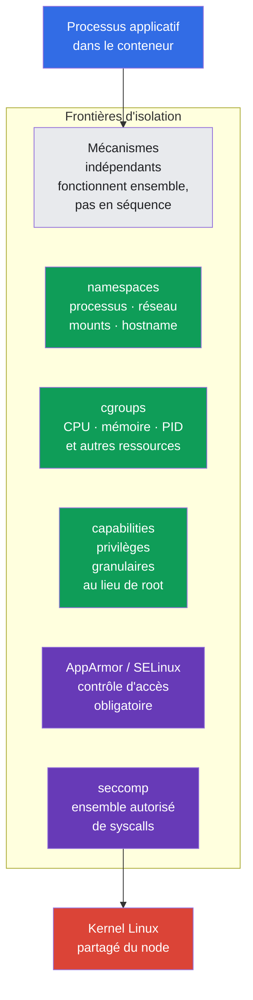
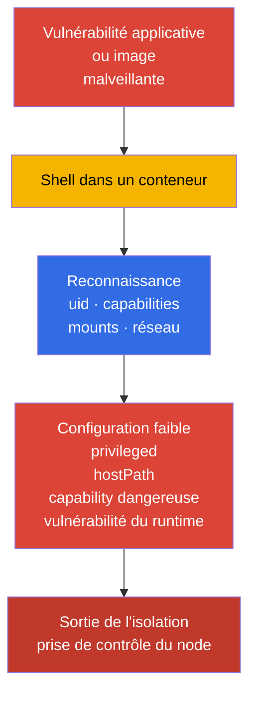
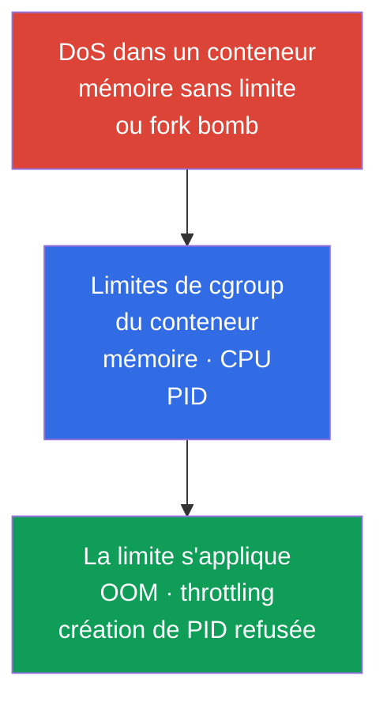
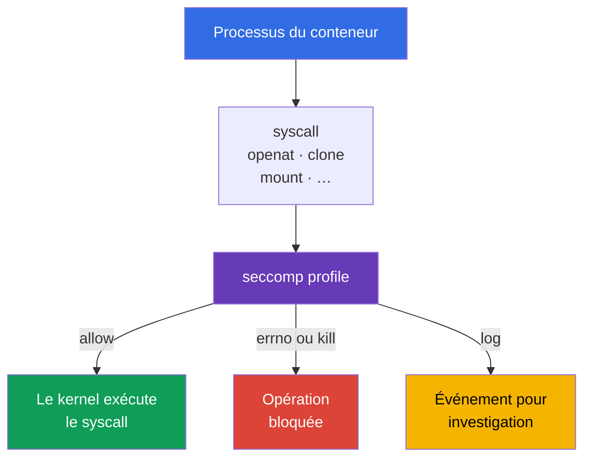
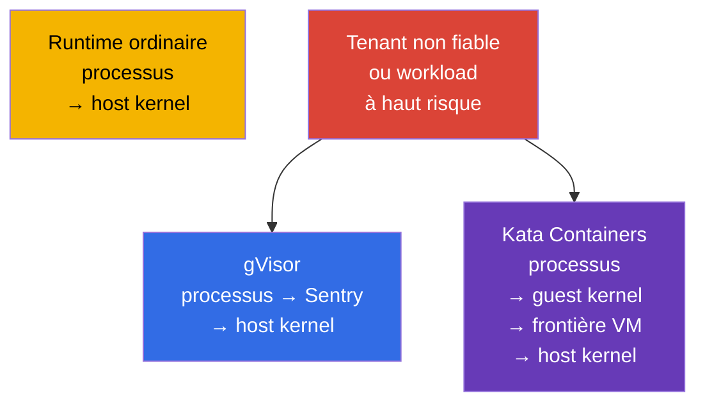

[Русская версия](ru.md) · [Eng version](README.md) · [Versión en español](es.md) · [Deutsche Version](de.md) · [ქართული ვერსია](ge.md) · [繁體中文版](tw.md) · [日本語版](jp.md)

# Chapitre 03. Les mécanismes de sécurité Linux sous le capot

> **Le problème.** Un conteneur n'est pas une machine virtuelle : un workload partage le kernel avec le node,
> et l'exécution de code dans un Pod devient plus dangereuse avec `privileged`, les host namespaces,
> des capabilities excessives ou des mounts accessibles. Comprendre les frontières Linux est nécessaire afin que plusieurs
> mécanismes d'isolation se complètent et limitent l'impact d'un container escape,
> au lieu de créer la fausse impression d'une protection absolue unique.

> **La suite.** Au chapitre 02, nous avons décomposé la surface d'attaque Kubernetes en couches. Nous examinons maintenant les mécanismes Linux que le container runtime utilise pour isoler un processus de Pod : namespaces, cgroups, capabilities et filtrage des syscalls. C'est le fondement de CKS, mais pas un domaine d'examen distinct : cela explique pourquoi les restrictions de System Hardening (10 %) et Minimize Microservice Vulnerabilities (20 %) fonctionnent et où sont leurs limites.

> **Prérequis CKA.** L'architecture de base des conteneurs, namespaces, cgroups et du runtime est présentée dans CKA : [conteneurs](../../../cka/course/00-4-containers/fr.md), [Linux](../../../cka/course/00-5-linux/fr.md) et [network namespaces](../../../cka/course/00-7-netns/fr.md). Ici, nous ne répétons pas la création d'un conteneur ni les commandes CKA de base ; nous examinons plutôt les propriétés de sécurité, la vérification de l'isolation et les moyens de la contourner.

> 🧠 L'isolation d'un conteneur est une combinaison de frontières Linux indépendantes, et non un réglage « magique » unique.

## 03.1. L'isolation d'un conteneur est un ensemble de frontières, pas une machine virtuelle

Un workload OCI ordinaire sous runc/containerd est un processus Linux sur le kernel partagé du node. Son isolation repose sur plusieurs mécanismes indépendants. Ce n'est pas une formule absolue pour les sandbox runtimes : Kata ajoute une frontière de VM, tandis que gVisor modifie sensiblement l'interaction du processus avec le kernel. Si un attaquant obtient l'exécution de code dans un conteneur, ces frontières le limitent d'abord. Une erreur dans une frontière ne doit pas automatiquement annuler les autres : c'est le defense in depth.



Le kernel partagé est la frontière fondamentale du modèle de conteneur. Une vulnérabilité du kernel ou du container runtime peut transformer l'exécution de code dans un conteneur en container escape. Ne considérez donc pas un conteneur comme une frontière de sécurité complète pour des workloads non fiables : utilisez plusieurs couches de hardening et, lorsque nécessaire, un sandboxed runtime du chapitre 22.

Un chemin d'attaque typique ressemble à ceci :



La tâche de l'ingénieur est de supprimer les privilèges inutiles, de limiter l'impact d'un DoS et de rendre une tentative d'escape observable ou impossible. Le champ `securityContext` est l'interface Kubernetes vers une partie de ces mécanismes, mais sa syntaxe de base est déjà présentée dans le [chapitre CKA sur SecurityContext](../../../cka/course/20/fr.md).

> 🧠 Un Namespace modifie la visibilité d'une ressource, mais ne la supprime pas du node et ne révoque pas un accès explicitement accordé.

## 03.2. Linux namespaces : ce qu'un conteneur voit ou ne voit pas

Un Namespace donne à un processus une vue séparée d'une ressource du kernel. Le processus ne disparaît pas du node, mais par l'API du kernel il ne voit que les objets de son Namespace. Kubernetes et le runtime créent les namespaces requis au démarrage d'un Pod sandbox.

**Bref rappel sur le démarrage d'un Pod ordinaire.** Un utilisateur ou controller envoie sa spécification à l'API server, le scheduler choisit un node, et le kubelet de ce node transmet le Pod au container runtime. Le runtime crée un pod sandbox (avec les namespaces nécessaires), puis y démarre les conteneurs du Pod. Le chemin complet de création d'un Pod, le rôle du conteneur pause et le sandbox sont expliqués au [chapitre 4 de CKA](../../../cka/course/04/fr.md).

| Namespace | Isole | Ce que voit normalement le processus du conteneur | Conséquence de sécurité |
|---|---|---|---|
| `PID` | arbre des processus et PID | son propre PID 1 et les processus du conteneur ou du Pod | ne peut normalement pas inspecter les processus du host |
| `NET` | interfaces, routes, ports, firewall namespace | `eth0`, l'IP et la table de routage propres au Pod | le réseau du Pod n'est pas le réseau du node |
| `MNT` | mount points et hiérarchie du filesystem | le rootfs de l'image et les volumes déclarés | le filesystem du host ne doit pas être accessible sans mount |
| `UTS` | hostname et domain name | le hostname du Pod | ne révèle pas le hostname du node |
| `IPC` | mémoire partagée, semaphores, message queues | objets IPC du Pod sandbox | ne peut pas lire l'IPC des autres Pods ou du node |
| `USER` | UID/GID mapping et capabilities | un UID mappé dans le user namespace | UID 0 à l'intérieur peut être mappé vers un UID host non privilégié |

La frontière n'est pas absolue. Par exemple, plusieurs conteneurs d'un même Pod partagent normalement le namespace `NET` et peuvent communiquer par `localhost`. Les champs `hostNetwork`, `hostPID` et `hostIPC` désactivent la frontière correspondante. Ils doivent être interdits aux workloads ordinaires par Pod Security Admission ou un policy engine.

> 🔬 UID/GID mapping, idmapped mounts et exigences de version du kernel/runtime pour `hostUsers: false`.

### User namespaces : UID/GID mapping séparé

Un user namespace n'est pas activé automatiquement. Dans Kubernetes, il est opt-in : `spec.hostUsers: false` demande un user namespace pour un Pod ; dans v1.36, la fonctionnalité est devenue Stable/GA. Dans le snapshot d'examen v1.35, elle est encore Beta, bien que `UserNamespacesSupport` soit activé par défaut ; c'est donc 🔬 Deep Dive / Production plutôt que 🎯 CKS Core.

**Le problème.** Sans user namespace, UID 0 dans un conteneur ordinaire est le même UID numérique 0 que root sur le node. Les namespaces cachent une partie des ressources du host, mais ne modifient pas à eux seuls ce mapping d'identité. Si un processus obtient un accès au-delà de la frontière attendue du conteneur, le host le traite comme root : les conséquences d'une erreur applicative, de configuration ou d'isolation deviennent beaucoup plus graves.

**Effet protecteur.** Avec le support du kubelet, du container runtime et du node, UID 0 dans le conteneur est mappé vers un UID non privilégié sur le host. L'application peut toujours se considérer root **dans** le Pod, mais pour le kernel et les fichiers du host, elle n'est plus host root. Un user namespace réduit ainsi le blast radius d'une compromission et ajoute une frontière entre le processus du conteneur et le node.

**Pièges.**

- Ce mécanisme ne remplace pas least privilege, capabilities, seccomp et MAC : un user namespace ne corrige pas une vulnérabilité du kernel et ne rend pas `privileged`, `hostPath` ou les host namespaces sûrs.
- La compatibilité du node, runtime, volume et workload est obligatoire ; le court checklist ci-dessous précise ce qu'il faut vérifier avant le rollout.
- Les Pod Security Standards pour les Pods avec user namespaces assouplissent les vérifications `runAsNonRoot` et `runAsUser`, car root dans un tel Pod n'est pas un utilisateur privilégié du host. Cela n'annule pas les règles internes de l'application : si elle ne doit pas s'exécuter en root, exigez aussi `runAsNonRoot` ici.

```yaml
apiVersion: v1
kind: Pod
metadata:
  name: userns-web
  namespace: demo
spec:
  hostUsers: false
  containers:
  - name: web
    image: nginx:1.30.4
```

Avant d'activer les user namespaces, vérifiez la compatibilité à trois endroits :

1. **Le node.** Linux **6.3+** est requis : à partir de cette version, tmpfs prend en charge les idmapped mounts. Le filesystem doit prendre en charge les idmapped mounts pour `/var/lib/kubelet/pods` et les volumes utilisés. Exécutez ceci sur **chaque** node où le Pod peut être placé :

   ```bash
   uname -r
   sudo findmnt -T /var/lib/kubelet/pods \
     -o TARGET,SOURCE,FSTYPE,OPTIONS
   ```

   La première commande doit afficher un kernel 6.3 ou plus récent ; la seconde affiche le filesystem, à vérifier pour le support des idmapped mounts de l'image du node. Ces commandes révèlent un node inadapté, mais ne remplacent pas le démarrage canary d'un Pod avec `hostUsers: false`.

2. **Le runtime.** Les minimums indiqués par la documentation sont : runc >= 1.2, crun >= 1.9 (>= 1.13 recommandé), containerd >= 2.0 ou CRI-O >= 1.25. Sur le node cible, inspectez la version du CRI runtime et de l'OCI runtime :

   ```bash
   sudo crictl version
   sudo runc --version 2>/dev/null || sudo crun --version
   ```

   La sortie de `crictl version` doit contenir `runtimeName` et `runtimeVersion` ; comparez la seconde commande au runtime réellement utilisé par le node. Ne déduisez pas la version de runc de la version de `kubectl` ou de l'API Kubernetes.

3. **Workload et storage.** Les user namespaces modifient le UID/GID mapping. Pour qu'un volume de filesystem conserve des propriétaires et permissions corrects dans le Pod, le kubelet doit le monter comme idmapped mount. Les volumes `volumeDevices`/raw block n'ont pas de filesystem pour ce mapping et le client NFS Linux ne prend pas en charge les idmapped mounts requis. Si un workload utilise l'un de ces types, le kubelet ne peut pas préparer le volume d'un Pod avec `hostUsers: false` et le Pod ne démarre pas.

   **Un EBS PVC ordinaire n'est pas interdit.** Si un EBS CSI driver fournit un PVC comme filesystem (cas typique : `volumeMode: Filesystem`, volume attaché via `volumeMounts`), un tel Pod peut fonctionner avec user namespaces quand le filesystem du node prend en charge les idmapped mounts. Par exemple, ext4 et XFS sont pris en charge sous Linux 6.3+. Mais le même EBS PVC avec `volumeMode: Block`, transmis à un conteneur par `volumeDevices`, est un raw block volume et est donc incompatible. Vérifiez donc le storage **avant** le rollout : cela permet de déterminer s'il faut éviter les user namespaces pour le workload ou d'abord modifier l'attachement du storage. Pour un Pod de test existant ou un workload équivalent en staging, vérifiez d'abord les raw block devices :

   ```bash
   NS=demo
   POD=userns-web

   kubectl get pod -n "$NS" "$POD" -o json | jq -r '
     (
       .spec.containers[]?,
       .spec.initContainers[]?,
       .spec.ephemeralContainers[]?
     ) as $container
     | $container.volumeDevices[]?
     | "container=\($container.name) raw-block-volume=\(.name)"
   '
   ```

   Une sortie vide signifie que `volumeDevices` n'est pas utilisé. Inspectez ensuite les volumes NFS directs et les PV attachés par des PVC :

   ```bash
   kubectl get pod -n "$NS" "$POD" -o json | jq -r '
     .spec.volumes[]? | select(.nfs)
     | "direct NFS volume: \(.name)"
   '

   for pvc in $(kubectl get pod -n "$NS" "$POD" \
     -o jsonpath='{range .spec.volumes[?(@.persistentVolumeClaim)]}{.persistentVolumeClaim.claimName}{"\n"}{end}'); do
     pv=$(kubectl get pvc -n "$NS" "$pvc" \
       -o jsonpath='{.spec.volumeName}')
     kubectl get pv "$pv" -o json | jq -r '
       if .spec.nfs then "NFS PV: \(.metadata.name)"
       elif .spec.csi then "CSI driver: \(.spec.csi.driver)"
       else "PV without direct NFS: \(.metadata.name)"
       end
     '
   done
   ```

   Toute sortie relative à raw block ou NFS signifie que ce workload n'est pas prêt pour les user namespaces. Pour un CSI volume, la ligne `CSI driver` ne prouve pas à elle seule la compatibilité : confirmez-la par la documentation et un test du CSI driver concerné.

Il existe aussi des restrictions strictes de l'API : avec `hostUsers: false`, vous ne pouvez pas définir `hostNetwork: true`, `hostIPC: true` ni `hostPID: true`. Ce n'est pas un réglage de hardening que l'on peut ignorer : Kubernetes rejette un tel Pod.

Sur un node, les namespaces peuvent être consultés avec l'utilitaire `lsns`. C'est une commande de diagnostic pour l'administrateur du node, pas une commande à donner à une application :

```bash
sudo lsns \
  -t pid \
  -t net \
  -t mnt \
  -t uts \
  -t ipc \
  -t user
sudo crictl ps
CONTAINER_ID="${CONTAINER_ID:?set target container id from crictl ps}"
sudo crictl inspect "$CONTAINER_ID" | jq '.info.pid'
PID=$(sudo crictl inspect "$CONTAINER_ID" | jq -r '.info.pid')
sudo lsns -p "$PID"
```

Pour vérifier qu'un conteneur n'est pas dans le host PID namespace, comparez l'inode de namespace de son processus avec le PID 1 du node :

```bash
sudo readlink /proc/1/ns/pid
sudo readlink /proc/"$PID"/ns/pid
# Les valeurs doivent différer pour un Pod ordinaire.
```

Dans un Pod, un premier diagnostic sûr est utile :

```bash
kubectl exec -n demo deploy/web -- sh -c '
  echo "hostname: $(hostname)"
  echo "pid namespace: $(readlink /proc/1/ns/pid)"
  echo "network namespace: $(readlink /proc/1/ns/net)"
  ps -ef
  ip route
'
```

Ne confondez pas le PID 1 d'un conteneur avec le PID 1 du host. Un PID namespace masque des processus mais ne révoque pas l'accès qui vous a été explicitement accordé : `hostPath` avec `/proc`, `privileged: true` ou `hostPID: true` modifie le modèle de menace. Pour diagnostiquer ces champs, utilisez :

```bash
kubectl get pod -A -o jsonpath='{range .items[*]}{.metadata.namespace}{"/"}{.metadata.name}{" hostPID="}{.spec.hostPID}{" hostNetwork="}{.spec.hostNetwork}{" hostIPC="}{.spec.hostIPC}{"\n"}{end}'
```

> 🧠 Un Namespace limite la visibilité, un cgroup limite la consommation ; `limits` crée une frontière de ressource, tandis que `requests` aide au scheduling.

## 03.3. cgroups : limites de ressources comme protection contre le DoS

Si un Namespace répond à la question « que voit un processus ? », un cgroup répond à « combien de ressources peut-il consommer ? ». Le container runtime place les processus du conteneur dans un cgroup et le kubelet applique les limits et requests de la spécification du Pod.

Sans memory limit, un processus peut occuper la mémoire du node et provoquer memory pressure, éviction d'autres Pods ou kernel OOM. Sans limite de PID, une fork bomb peut épuiser la table PID. Une CPU request participe au scheduling et à la distribution CPU, tandis qu'une CPU limit fixe un plafond strict par throttling ; une limite CPU excessivement basse peut dégrader la latence même si du CPU est disponible. Les limites de mémoire/PID offrent donc une frontière DoS plus directe, tandis qu'une CPU limit doit être choisie délibérément selon le profil du workload. Il s'agit de disponibilité du cluster et donc d'un scénario de sécurité, pas seulement d'une question de performance.



Exemple minimal de limites pour un processus capable de servir un faible volume de trafic HTTP :

```yaml
apiVersion: v1
kind: Pod
metadata:
  name: bounded-web
  namespace: demo
spec:
  containers:
  - name: web
    image: nginx:1.30.4
    resources:
      requests:
        cpu: 100m
        memory: 128Mi
      limits:
        cpu: 500m
        memory: 256Mi
```

> 🔬 `spec.resources` au niveau Pod est une fonctionnalité Kubernetes v1.34 beta destinée à un budget de ressources partagé entre les conteneurs.

### Pod-Level Resources : une frontière partagée du Pod

**Pod-Level Resources** est Beta depuis Kubernetes v1.34 et est activé par défaut. Avec `spec.resources`, vous pouvez définir des `requests` et `limits` communs pour CPU, mémoire et hugepages du Pod : il s'agit du budget agrégé du Pod entier, pas d'un remplacement des ressources explicites des conteneurs. Une limite agrégée du Pod est une véritable frontière partagée pour ses conteneurs ; les limites au niveau du conteneur restent indépendantes pour chaque conteneur.

```yaml
apiVersion: v1
kind: Pod
metadata:
  name: pod-budget-web
  namespace: demo
spec:
  resources:
    requests:
      cpu: "500m"
      memory: 128Mi
    limits:
      cpu: "1"
      memory: 256Mi
  containers:
  - name: app
    image: nginx:1.30.4
```

Enregistrez l'exemple sous `pod-budget-web.yaml` et vérifiez le budget agrégé précisément dans `spec.resources` :

```bash
kubectl apply -f pod-budget-web.yaml
kubectl wait -n demo --for=condition=Ready pod/pod-budget-web --timeout=120s
kubectl get pod -n demo pod-budget-web \
  -o jsonpath='{.spec.resources}{"\n"}'
kubectl describe pod -n demo pod-budget-web
```

Sur cgroup v2, les limites sont visibles dans les fichiers `memory.max`, `cpu.max` et `pids.max` ; l'emplacement du cgroup d'un processus précis est affiché par `/proc/<pid>/cgroup` :

```bash
sudo cat /proc/"$PID"/cgroup
CGROUP=$(awk -F: '$1 == "0" {print $3}' /proc/"$PID"/cgroup)
sudo cat "/sys/fs/cgroup${CGROUP}/memory.max"
sudo cat "/sys/fs/cgroup${CGROUP}/cpu.max"
sudo cat "/sys/fs/cgroup${CGROUP}/pids.max"
```

Sur un node plus ancien avec cgroup v1, les controllers se trouvent dans des mount points séparés ; ne copiez donc pas le chemin cgroup v2 sans vérification. Déterminez d'abord le mode :

```bash
stat -fc %T /sys/fs/cgroup
# cgroup2fs signifie cgroup v2.
```

Gardez ces frontières distinctes à l'esprit :

- **Dans un workload : `requests` et `limits`.** `requests` affecte le scheduler et QoS, mais n'arrête pas par elle-même un processus consommant beaucoup de ressources. `limits` établit la frontière stricte : pour le CPU, il s'agit d'un plafond par un éventuel throttling, donc ne choisissez pas une CPU limit arbitrairement basse.
- **Au niveau du Namespace : `ResourceQuota` et `LimitRange`.** Les ressources d'un Pod ne protègent pas un Namespace contre une consommation agrégée. `ResourceQuota` limite son budget total, tandis que `LimitRange` fixe les valeurs par défaut et frontières autorisées de chaque workload. Ensemble, ils empêchent une équipe d'évincer les autres avec un manifest incomplet.
- **PID : l'administrateur du node fixe la limite.** Vous ne pouvez pas déclarer dans un YAML de Pod ordinaire : « ce workload peut avoir N processus ». L'administrateur configure plutôt le paramètre kubelet `podPidsLimit` : le nombre maximal de PID **pour un Pod** sur ce node. Le kubelet l'applique au moyen du PID cgroup. La vérification comporte donc deux étapes : trouvez d'abord `podPidsLimit` dans la configuration du kubelet, puis vérifiez `pids.max` dans le cgroup d'un Pod déjà en cours d'exécution.
- **Sous memory pressure : OOM dans le cgroup.** Le kernel peut terminer un processus de conteneur dans le cgroup correspondant. Si le processus principal s'arrête, le kubelet redémarre le conteneur selon `restartPolicy`.
- **Vérifiez sans risque.** Ne démontrez pas une memory limit en provoquant intentionnellement un OOM sur un node de production.

> 🎯 Supprimez `privileged`, les host namespaces, les capabilities excessives et `allowPrivilegeEscalation: true` ; définissez `capabilities.drop: [ALL]`, `RuntimeDefault` et le MAC profile requis.

## 03.4. Linux capabilities : fractionner les privilèges root

UID 0 n'est pas le seul signe de privilège. Le kernel Linux divise une partie de l'autorité de root en capabilities. Un processus a plusieurs ensembles de capabilities, notamment permitted, effective, inheritable, bounding et ambient. Vérifier seulement `id` ne prouve pas qu'un processus est sûr.

Certaines capabilities sont particulièrement dangereuses pour une application ordinaire :

| Capability | Risque | Raison normale de l'accorder |
|---|---|---|
| `CAP_SYS_ADMIN` | vaste ensemble d'opérations administratives, opérations de mount et namespace ; composant fréquent des chaînes d'escape | presque jamais nécessaire à une application métier |
| `CAP_SYS_MODULE` | chargement et déchargement de kernel modules | composant système du node, pas Pod d'application |
| `CAP_SYS_PTRACE` | traçage et lecture de la mémoire de processus compatibles | outil de diagnostic à périmètre étroit |
| `CAP_NET_ADMIN` | modification des interfaces, routes et firewall | CNI et agent réseau |
| `CAP_DAC_OVERRIDE` | contournement des vérifications DAC du filesystem | ne pas accorder à un workload sans raison explicite |
| `CAP_SETUID` / `CAP_SETGID` | changement de UID/GID | bootstrap spécial, pas état stable d'une application |
| `CAP_BPF` / `CAP_PERFMON` | utilisation de BPF et des mécanismes de performance du kernel | observabilité du node avec modèle de confiance distinct |

Consultez les capabilities des fichiers et processus sur le node :

```bash
sudo getcap -r /usr/local/bin 2>/dev/null
sudo capsh --print
sudo getpcaps "$PID"
```

`getcap` affiche les file capabilities reçues par un executable au démarrage. `getpcaps "$PID"` affiche les capabilities du processus indiqué ; `capsh --print` sans argument affiche l'état du shell courant, et non celui d'un container PID trouvé auparavant. Les commandes nécessitent des privilèges de node pour un autre processus ; c'est attendu et c'est en soi une protection.

Avant d'ajouter `NET_BIND_SERVICE`, vérifiez la valeur de `net.ipv4.ip_unprivileged_port_start` dans le network namespace du Pod cible. Si le seuil vaut `0`, un processus non privilégié peut déjà écouter un low port et la capability est inutile :

```bash
kubectl exec -n demo <pod> -- cat /proc/sys/net/ipv4/ip_unprivileged_port_start
```

Pour un conteneur ordinaire non privilégié, `allowPrivilegeEscalation: false` définit Linux `no_new_privs` pour le processus : après `exec`, un processus enfant ne doit pas obtenir de nouveaux privilèges par des bits setuid/setgid ou file capabilities.

Il existe une exception Kubernetes importante : `allowPrivilegeEscalation` est en pratique toujours `true` si un conteneur s'exécute avec `privileged: true` ou possède `CAP_SYS_ADMIN`. Supprimez donc d'abord `privileged` et les capabilities excessives ; `allowPrivilegeEscalation: false` est une frontière supplémentaire, pas un moyen de sécuriser un tel conteneur.

Avec `allowPrivilegeEscalation: true` (la valeur par défaut), Kubernetes ne définit pas `no_new_privs`. `true` n'accorde pas lui-même de capability et ne rend pas un conteneur privileged, mais laisse une voie d'élévation de privilèges : un processus non privilégié compromis peut exécuter un programme setuid/setgid ou un fichier avec des capabilities de l'image et obtenir le UID/GID ou la capability offerts par ce fichier. Un RCE sous l'utilisateur applicatif peut ainsi devenir root ou un processus avec des capabilities supplémentaires **dans le conteneur**, élargissant l'impact de l'attaque et les chaînes d'escape possibles. Si l'application n'a pas besoin d'un tel exec, définir `false` est plus sûr.

C'est une frontière importante, mais non la seule ; elle ne remplace pas la suppression des capabilities, seccomp ni MAC. Dans Kubernetes, un point de départ sûr est de tout retirer et de n'ajouter une capability que lorsqu'un besoin est documenté. Seulement si le réglage sysctl et les exigences applicatives le confirment, une application legacy peut avoir besoin de `NET_BIND_SERVICE` pour TCP 80 :

```yaml
apiVersion: v1
kind: Pod
metadata:
  name: capability-example
  namespace: demo
spec:
  containers:
  - name: web
    image: nginx:1.30.4
    securityContext:
      allowPrivilegeEscalation: false
      capabilities:
        drop:
        - ALL
        add:
        - NET_BIND_SERVICE
```

Vérifiez la configuration déclarée et l'état du processus :

```bash
kubectl apply -f capability-example.yaml
kubectl get pod -n demo capability-example \
  -o jsonpath='{.spec.containers[0].securityContext.capabilities}{"\n"}'
kubectl exec -n demo capability-example -- sh -c 'grep Cap /proc/1/status'
```

Les valeurs `CapEff` de `/proc/1/status` sont codées en masque hexadécimal. Pour une interprétation lisible, utilisez `capsh --decode=<value>` sur le node ou dans une diagnostic image où cet outil est fiable et installé :

```bash
capsh --decode=0000000000000400
# Exemple : 0x400 correspond à cap_net_bind_service.
```

`privileged: true` ne remplace pas une configuration des capabilities. Un tel conteneur reçoit toutes les Linux capabilities, et le confinement seccomp, AppArmor et SELinux ordinaire est supprimé ou ignoré pour lui. Pour CKS, c'est un signal d'alerte : supprimez d'abord `privileged`, puis évaluez séparément le besoin de chaque capability.

## 03.5. Syscalls et seccomp : réduire l'API kernel disponible

Toute action d'un user process atteint finalement le kernel par un syscall : ouvrir un fichier, créer un socket, allouer de la mémoire, modifier un namespace. Même si une application n'a pas besoin d'une opération dangereuse, un processus vulnérable peut tenter le syscall correspondant. seccomp permet au kernel d'autoriser, refuser, journaliser ou terminer un processus selon une règle de syscall.



seccomp ne détermine pas qui peut accéder à l'API Kubernetes et ne corrige pas une image non sûre. C'est le filtre final entre un processus compromis et l'API kernel. Il est particulièrement utile avec `capabilities.drop: [ALL]`, `allowPrivilegeEscalation: false` et un MAC profile.

Si `seccompProfile` n'est pas indiqué, un Pod peut rester `Unconfined`. Un node où `seccompDefault: true` est activé dans le kubelet fait exception : un profil absent y reçoit `RuntimeDefault`. Ne considérez pas cela comme une propriété universelle du cluster : vérifiez la configuration du node et indiquez explicitement un profil pour le workload.

Pour la plupart des workloads, commencez avec un runtime profile plutôt que `Unconfined` :

```yaml
apiVersion: v1
kind: Pod
metadata:
  name: runtime-default
  namespace: demo
spec:
  securityContext:
    seccompProfile:
      type: RuntimeDefault
  containers:
  - name: app
    image: nginx:1.30.4
```

Vérifiez la spécification du Pod elle-même, pas une hypothèse sur le runtime default :

```bash
kubectl apply -f runtime-default.yaml
kubectl get pod -n demo runtime-default \
  -o jsonpath='{.spec.securityContext.seccompProfile.type}{"\n"}'
kubectl describe pod -n demo runtime-default
```

Un profil custom est utilisé lorsqu'il existe un ensemble de syscalls mesuré et reproductible. Il est stocké sur chaque node où le Pod peut démarrer, dans le répertoire de profils `seccomp` du kubelet. Un chemin incorrect ou un profil absent du node choisi empêchera le Pod de démarrer. Le format complet du profil, le mode audit et l'utilisation de `Localhost` sont présentés au chapitre 17 ; ne créez pas une deny-list à l'aveugle, sinon une mise à jour applicative cassera en production.

Pour diagnostiquer le comportement des syscalls sur un test node isolé, utilisez `strace` :

```bash
sudo strace -f -p "$PID" -e trace=%file,%network
# N'exécutez pas un long strace sur un processus de production très chargé.
```

## 03.6. MAC : AppArmor et SELinux complètent DAC

Le DAC Linux ordinaire vérifie les UID, GID et mode bits d'un fichier. Dans le modèle DAC (Discretionary Access Control), le propriétaire de l'objet peut modifier les mode bits, par exemple avec `chmod`, et accorder ou retirer ainsi un accès dans le modèle DAC. Modifier l'UID propriétaire d'un fichier sous Linux exige `CAP_CHOWN` ; un propriétaire non privilégié ne peut modifier le groupe du fichier que vers un groupe dont il est membre. Un processus avec UID/GID ou capabilities suffisants peut réussir ou contourner une partie des vérifications DAC ordinaires.

**Mandatory Access Control (MAC)** ajoute une seconde vérification obligatoire pour le kernel. L'administrateur charge une policy et le kernel associe un processus à son profile/label, puis vérifie si une action donnée sur un fichier, socket ou autre objet est autorisée. Même si DAC a déjà autorisé l'accès, MAC peut le refuser ; le processus lui-même ne peut pas supprimer ou affaiblir la policy. L'objectif est de confiner un processus compromis : un web server ne doit par exemple pas lire des clés SSH ou modifier des fichiers système seulement parce qu'il a reçu un UID, une capability ou l'accès à un fichier supplémentaire. MAC complète donc DAC, capabilities et seccomp au lieu de les remplacer.

| Mécanisme | Modèle principal | Où il est le plus fréquent | À vérifier |
|---|---|---|---|
| AppArmor | basé sur des profiles, chemins de fichiers et opérations | Ubuntu, Debian et certains managed nodes | `aa-status`, profile chargé, `DENIED` dans audit log |
| SELinux | labels et type enforcement | RHEL, Fedora, OpenShift et OS compatibles | `getenforce`, labels, AVC denial dans audit log |

Les deux mécanismes résolvent la même tâche, mais leurs profiles et leur exploitation ne sont pas interchangeables. Vous ne pouvez pas copier un AppArmor profile sur un SELinux node et attendre son application. Avant de concevoir une policy, déterminez ce qui est réellement activé dans l'image du node :

```bash
sudo aa-status || true
getenforce 2>/dev/null || true
sudo journalctl -k --since '10 minutes ago' | grep -Ei 'apparmor|avc|denied' || true
```

Dans Kubernetes, l'interface AppArmor actuelle est `securityContext.appArmorProfile`. Exemple de runtime profile :

```yaml
securityContext:
  appArmorProfile:
    type: RuntimeDefault
```

`RuntimeDefault` exige que le container runtime du node fournisse un default profile compatible ; vérifiez-le sur le node pool réel, pas uniquement dans YAML. Pour `Localhost`, le profil doit être chargé à l'avance sur le node cible et indiqué par `localhostProfile`. C'est une dépendance node-local : le scheduler ne déplace pas un profil entre nodes. En production, livrez donc le profil par configuration management, vérifiez-le dans chaque node pool et restreignez le placement des Pods. L'implémentation de profile et l'analyse de `DENIED` sont présentées au chapitre 16.

Pour SELinux, configurez les paramètres de label avec `securityContext.seLinuxOptions` seulement conformément à la policy de l'image du node. En cas de refus, examinez d'abord l'AVC denial au lieu de désactiver SELinux. Les volumes et fichiers du filesystem doivent avoir les SELinux labels appropriés ; vérifiez particulièrement hostPath, persistent volumes et shared writable volumes.

> 🧠 Les conteneurs partagent le kernel avec le node ; un sandboxed runtime ajoute de l'isolation aux workloads non fiables ou à haut risque.

## 03.7. Frontières d'isolation, sandboxed runtimes et diagnostic des risques d'escape

namespaces, cgroups, capabilities, seccomp et MAC fonctionnent dans un même kernel. Si le profil de risque exige une forte frontière entre tenants, utilisez un sandboxed runtime. gVisor intercepte une part importante des syscalls dans user space, tandis que Kata Containers exécute un workload dans une VM légère. Cela réduit la probabilité d'utiliser directement le kernel du node, au prix de compatibilité, latency et complexité opérationnelle.



Un sandbox n'élimine pas les autres mesures. Même dans gVisor ou Kata, un workload ne doit pas recevoir `privileged`, des host namespaces, un Docker socket ni de larges permissions RBAC. Appliquez d'abord least privilege, puis choisissez une RuntimeClass selon le modèle de menace. L'installation de `runsc`, RuntimeClass et le scheduling sur des nodes compatibles sont présentés au chapitre 22.

> 🔬 Mapping de style forensic d'un Pod déclaratif vers son PID, namespaces et cgroup sur le node.

Checklist pratique pour enquêter sur un Pod suspect :

```bash
NAMESPACE="${NAMESPACE:?set target namespace}"
POD="${POD:?set target pod name}"

# 1. Trouver les contournements explicites de Namespace et le mode privileged.
kubectl get pod -n "$NAMESPACE" "$POD" -o yaml | \
  grep -E 'privileged:|hostPID:|hostIPC:|hostNetwork:|hostPath:|allowPrivilegeEscalation:'

# 2. Voir le securityContext déclaré au niveau Pod et conteneur,
#    ainsi que les volumes. C'est une configuration déclarative, pas la preuve
#    des réglages runtime/kernel effectivement appliqués.
kubectl get pod -n "$NAMESPACE" "$POD" -o json | jq '
{
  podSecurityContext: .spec.securityContext,
  containers: [
    (
      .spec.containers[]?,
      .spec.initContainers[]?,
      .spec.ephemeralContainers[]?
    )
    | {
        name: .name,
        securityContext: .securityContext
      }
  ],
  volumes: .spec.volumes
}
'

# 3. Sur le node, trouver le Pod sandbox, puis le conteneur et son namespace/cgroup.
#    `crictl ps --name` filtre par nom de conteneur, pas par nom de Pod.
sudo crictl pods \
  --name "^${POD}$" \
  --namespace "^${NAMESPACE}$"
POD_ID="${POD_ID:?set target pod sandbox id from crictl pods}"
sudo crictl ps --pod "$POD_ID"
CONTAINER_ID="${CONTAINER_ID:?set target container id from crictl ps}"
sudo crictl inspect "$CONTAINER_ID" | jq '.info.pid'
PID="$(sudo crictl inspect "$CONTAINER_ID" | jq -r '.info.pid')"
PID="${PID:?failed to get pid from crictl inspect}"
sudo lsns -p "$PID"
sudo cat "/proc/$PID/cgroup"
```

Erreurs typiques :

- Considérer UID 0 dans un conteneur comme root automatique sur le node. Le user mapping et d'autres frontières peuvent le restreindre, mais cela reste un mauvais point de départ pour un workload d'application.
- Considérer un namespace comme une protection suffisante. `hostPath`, host namespaces, `privileged` et les kernel CVE modifient le résultat.
- Ajouter `CAP_SYS_ADMIN` pour corriger un symptôme. Déterminez d'abord l'opération requise et utilisez une capability plus étroite ou un autre design.
- Laisser un Pod sans `limits` parce que l'application consomme « normalement » peu. Un seul défaut ou une requête malveillante suffit pour un DoS.
- Activer un custom seccomp profile sans tests applicatifs ni livraison du profil à tous les target nodes.
- Appliquer un AppArmor profile sans garantir que ce profil est chargé sur le node où le scheduler a démarré le Pod.

> 🏭 Les workload templates, admission policy, séparation des node pools et monitoring des refus établissent une baseline sûre et ses exceptions.

## 03.8. Application en production

- **Intégrez les restrictions au workload template.** Un Helm chart de base ou platform template définit `resources.limits`, `allowPrivilegeEscalation: false`, `capabilities.drop: [ALL]`, `seccompProfile: RuntimeDefault` et l'exécution non-root. Une équipe ne s'écarte du template qu'avec justification.
- **Interdisez les contournements de policy dangereux.** Pod Security Admission au niveau `restricted` ou Kyverno/Gatekeeper n'admet pas `privileged`, les host namespaces, capabilities non sûres et seccomp absent. Les détails de policy suivent aux chapitres 19 et 20.
- **Séparez les node pools selon la confiance.** Les agents CNI, CSI et node ayant réellement besoin de `NET_ADMIN` ou host mounts s'exécutent séparément des workloads métier. Pour le multi-tenancy, choisissez gVisor ou Kata par RuntimeClass.
- **Observez les refus ; ne désactivez pas la protection.** Les refus AppArmor/SELinux, erreurs seccomp, OOMKilled et épuisements de PID entrent dans les logs et métriques. Corrigez la cause en modifiant l'application, un writable volume ou une policy étroite, plutôt qu'en revenant à `privileged: true`.
- **Vérifiez l'état réel du node.** Un Kubernetes manifest décrit l'état désiré, mais AppArmor profile, mode SELinux, mode cgroup et configuration runtime résident sur le node. Vérifiez-les dans le image pipeline et les audits de hardening périodiques.

## 03.9. Mini-glossaire

- **namespace** - représentation isolée d'une ressource du kernel pour un groupe de processus.
- **PID namespace** - isolation de la liste des processus et des PID.
- **network namespace** - isolation des interfaces, routes et de la pile réseau.
- **cgroup** - groupe de processus avec limites et comptabilité de ressources.
- **capability** - privilège Linux individuel séparé de l'ensemble traditionnel des privilèges root tout-puissants.
- **CAP_SYS_ADMIN** - capability excessivement large et dangereuse pour un workload ordinaire.
- **syscall** - appel système par lequel un processus accède au kernel.
- **seccomp** - filtre de syscall appliqué par le kernel à un processus.
- **MAC** - Mandatory Access Control, policy d'accès obligatoire au-dessus de UID/GID et mode bits.
- **AppArmor** - MAC Linux basé sur des profiles.
- **SELinux** - MAC basé sur des labels avec type enforcement.
- **container escape** - sortie de l'isolation attendue du conteneur vers les ressources du node ou d'un autre tenant.
- **sandboxed runtime** - runtime avec frontière d'isolation renforcée, tel que gVisor ou Kata Containers.

## 03.10. Résumé du chapitre

- Un conteneur utilise le kernel partagé du node ; sa protection repose sur plusieurs mécanismes Linux, pas sur un seul « sandbox ».
- Les namespaces `PID`, `NET`, `MNT`, `UTS`, `IPC` et `USER` limitent la visibilité des ressources, mais host namespaces, `hostPath` et `privileged` peuvent contourner cette frontière. Un user namespace est activé séparément par `spec.hostUsers: false` et demande le support du node et du runtime.
- Les cgroups limitent CPU, mémoire et PID, protégeant le node et les workloads voisins contre le DoS ; le kubelet définit la limite PID par `podPidsLimit`, et un cgroup OOM peut terminer un processus puis redémarrer un conteneur.
- Les capabilities fractionnent l'autorité de root. La baseline sûre consiste à retirer `ALL` et ne restaurer qu'une capability minimale documentée après contrôle de sysctl et du besoin réel.
- seccomp avec `RuntimeDefault` réduit l'API kernel disponible pour un processus ; sans profil explicite, `Unconfined` est possible si `seccompDefault` n'est pas activé sur le node.
- AppArmor et SELinux complètent les permissions de fichiers ordinaires par une policy obligatoire ; leur runtime/node profile, AVC et volume labels comptent. Pour les workloads fortement non fiables, envisagez aussi gVisor ou Kata.

## 03.11. Utilité : à l'examen et au travail réel

**À l'examen.** Ce chapitre vous donne un modèle pour les tâches CKS où il faut expliquer ou corriger `capabilities`, seccomp, AppArmor, `privileged`, host namespaces et limits absentes. Vérifiez davantage que YAML : utilisez `kubectl get ... -o jsonpath`, `kubectl exec` et, avec accès SSH, `crictl`, `lsns`, `aa-status` et `/proc/<pid>/cgroup`. La suite pratique est la lab 106 et les chapitres 16-17.

**Au travail réel.** Comprendre le niveau inférieur aide à distinguer une exception sûre d'un contournement dangereux. Si une application demande `privileged` ou `CAP_SYS_ADMIN`, examinez ses appels, mounts et son architecture. Si un Pod échoue avec OOMKilled ou un profile denial, c'est un signal observable pour une correction ciblée, pas une raison de désactiver tout le hardening.

## 03.12. Questions d'auto-vérification

<details>
<summary>1. Pourquoi un conteneur n'est-il pas équivalent à une machine virtuelle et quel est le rôle du kernel partagé du node ?</summary>

Un workload OCI ordinaire sous runc/containerd est un processus Linux avec le kernel partagé du node, pas une VM séparée. Namespaces, cgroups, capabilities, MAC et seccomp créent plusieurs frontières, mais une vulnérabilité du kernel ou du runtime peut mener de l'exécution de code dans un conteneur à un container escape.
</details>

<details>
<summary>2. Quels namespaces séparent les processus, le réseau et les mount points, et quels champs du Pod peuvent supprimer ces frontières ?</summary>

Le namespace `PID` isole l'arbre des processus, `NET` isole interfaces, routes et ports, et `MNT` isole les mount points et la hiérarchie du filesystem. Les champs `hostPID`, `hostNetwork` et `hostIPC` désactivent les frontières correspondantes ; `hostPath` et `privileged: true` modifient aussi le modèle d'accès aux ressources du node.
</details>

<details>
<summary>3. En quoi `requests` diffère-t-il de `limits` lorsqu'on protège un node contre le DoS ?</summary>

`requests` affecte le scheduling et QoS, mais n'arrête pas lui-même un processus consommant beaucoup de ressources. `limits` établit la frontière stricte : une memory limit limite les conséquences de memory pressure/OOM, tandis qu'une CPU limit fournit un plafond par throttling ; le kubelet fixe la limite PID avec `podPidsLimit`.
</details>

<details>
<summary>4. Pourquoi ne faut-il pas accorder `CAP_SYS_ADMIN` pour corriger une erreur applicative quelconque ?</summary>

`CAP_SYS_ADMIN` accorde un large ensemble d'opérations administratives, dont les opérations de mount et namespace, et participe souvent aux chaînes d'escape. Au lieu de corriger un symptôme, déterminez l'opération réellement requise, retirez les capabilities `ALL` et ne restaurez qu'une capability étroite lorsqu'elle est documentée comme nécessaire.
</details>

<details>
<summary>5. Quelles commandes aident à associer un conteneur à son host PID, namespaces et cgroup ?</summary>

Sur le node, utilisez `sudo crictl ps`, puis `sudo crictl inspect "$CONTAINER_ID" | jq '.info.pid'` pour obtenir le PID du conteneur. Pour vérifier, utilisez `sudo lsns -p "$PID"` et `sudo cat "/proc/$PID/cgroup"` ; comparez l'inode du PID namespace avec `readlink /proc/1/ns/pid` et `readlink /proc/"$PID"/ns/pid`.
</details>

<details>
<summary>6. Comment seccomp complète-t-il les capabilities et pourquoi `RuntimeDefault` est-il meilleur que `Unconfined` pour un workload ordinaire ?</summary>

Les capabilities restreignent des privilèges individuels, tandis que seccomp filtre l'API kernel disponible à un processus au niveau syscall. Un `RuntimeDefault` explicite réduit cet ensemble pour un workload ordinaire, alors que sans profile un Pod peut rester `Unconfined` si `seccompDefault` n'est pas activé sur le node.
</details>

<details>
<summary>7. Quelle est la différence opérationnelle entre AppArmor et SELinux ?</summary>

AppArmor utilise une policy basée sur des profiles pour les chemins et opérations et est fréquent sous Ubuntu/Debian, tandis que SELinux utilise labels et type enforcement sur RHEL/Fedora/OpenShift. Leurs profiles ne sont pas interchangeables : avant configuration, vérifiez `aa-status` ou `getenforce` et analysez AppArmor `DENIED` ou SELinux AVC denial au lieu de désactiver MAC.
</details>

<details>
<summary>8. Quand l'isolation d'un conteneur seule est-elle insuffisante et pourquoi un sandboxed runtime est-il nécessaire ?</summary>

Pour les tenants non fiables ou workloads à haut risque, une frontière kernel partagée avec le node peut être insuffisante. gVisor intercepte une part importante des syscalls dans user space, tandis que Kata exécute un workload dans une VM légère, réduisant le risque d'utilisation directe du kernel au prix de compatibilité, latency et complexité opérationnelle.
</details>

## Pratique

🧪 [Lab 106 - AppArmor + seccomp](../../labs/106/README_FR.MD) relie ces mécanismes à des profiles fonctionnels sur le node et à la vérification que les actions sont bloquées dans un Pod. Avant cela, étudiez le [chapitre 16](../16/fr.md) sur AppArmor et le [chapitre 17](../17/fr.md) sur seccomp ; pour une isolation plus forte, poursuivez avec le [chapitre 22](../22/fr.md) sur les sandboxed containers.

🌐 Pratique interactive supplémentaire (killer.sh/killercoda, ressource externe) : [container-namespaces-docker](https://killercoda.com/killer-shell-cks/scenario/container-namespaces-docker) · [container-namespaces-podman](https://killercoda.com/killer-shell-cks/scenario/container-namespaces-podman)

## Documentation de référence

- [Kubernetes: Linux kernel security constraints](https://kubernetes.io/docs/concepts/security/linux-kernel-security-constraints/)
- [Kubernetes: User Namespaces](https://kubernetes.io/docs/concepts/workloads/pods/user-namespaces/)

---
[Table des matières](../README_FR.md) · [Chapitre 02](../02/fr.md) · [Chapitre 04](../04/fr.md)
