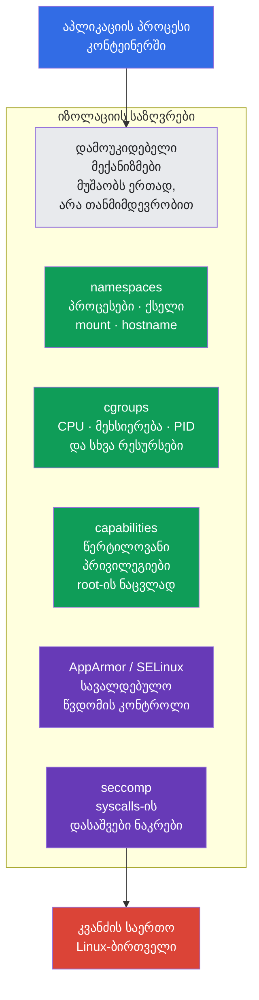
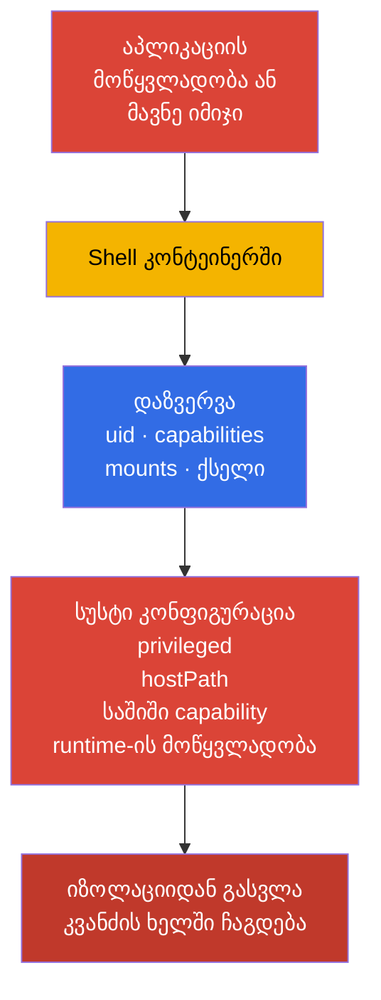
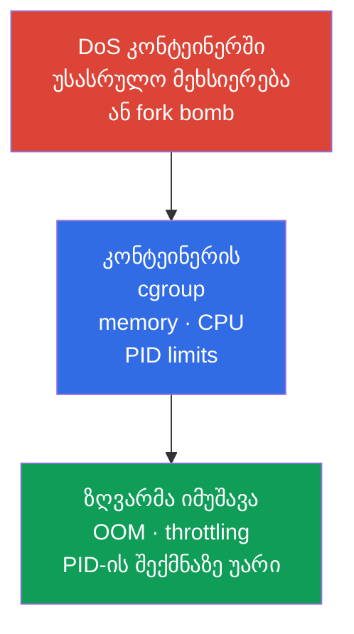
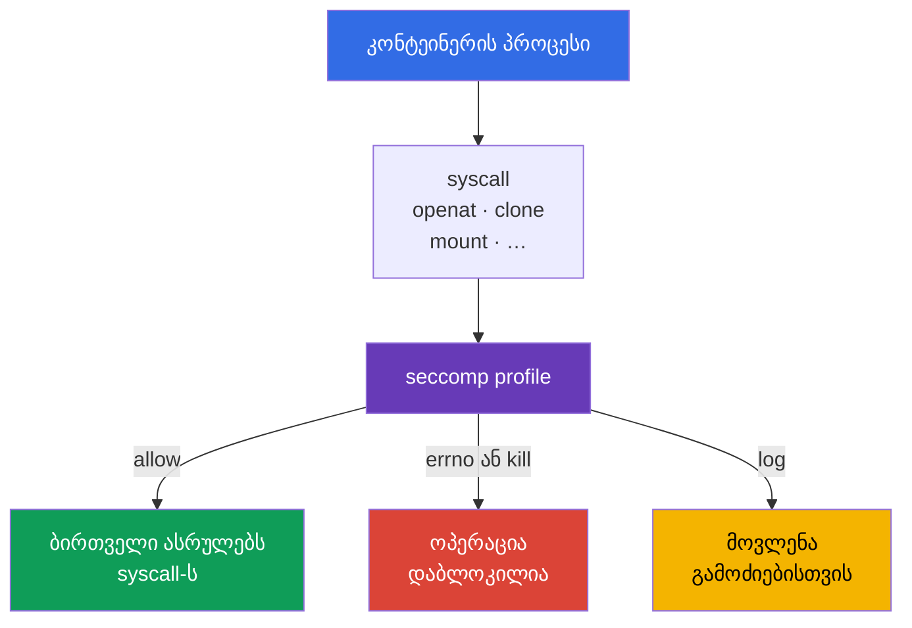
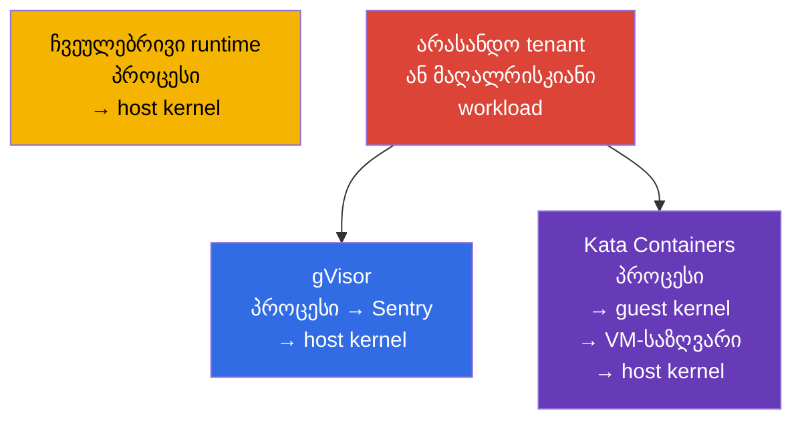

[Русская версия](ru.md) · [Eng version](README.md) · [Versión en español](es.md) · [Version française](fr.md) · [Deutsche Version](de.md) · [繁體中文版](tw.md) · [日本語版](jp.md)

# თავი 03. Linux-ის უსაფრთხოების მექანიზმები ქუდქვეშ

> **პრობლემა.** კონტეინერი არ არის ვირტუალური მანქანა: workload იზიარებს ბირთველს (kernel) კვანძთან
> ერთად, და კოდის შესრულება Pod-ის შიგნით საშიშროებად იქცევა `privileged`, host namespaces,
> ზედმეტი capabilities ან ხელმისაწვდომი mount-ების პირობებში. Linux-ის საზღვრების გაგება საჭიროა
> იმისთვის, რომ რამდენიმე იზოლაციის მექანიზმი ერთმანეთს ავსებდეს და ზღუდავდეს container escape-ის
> შედეგებს, და არ ქმნიდეს ცრუ მოლოდინს ერთი აბსოლუტური დაცვის შესახებ.

> **რა არის შემდეგ.** 02-ე თავში Kubernetes-ის შეტევის ზედაპირი შრეებად დავშალეთ. ახლა განვიხილავთ Linux-ის მექანიზმებს, რომლებითაც container runtime იზოლირებს Pod-ის პროცესს: namespaces, cgroups, capabilities და syscalls-ის ფილტრაცია. ეს არის CKS-ის საფუძველი, მაგრამ არა ცალკე საგამოცდო დომენი: ის ხსნის, რატომ მუშაობს შეზღუდვები System Hardening-იდან (10%) და Minimize Microservice Vulnerabilities-იდან (20%) და სად აქვთ მათ საზღვრები.

> **რა გჭირდებათ CKA-დან.** კონტეინერების, namespaces-ის, cgroups-ისა და runtime-ის საბაზისო მოწყობა განხილულია CKA-ში: [კონტეინერები](../../../cka/course/00-4-containers/ge.md), [Linux](../../../cka/course/00-5-linux/ge.md) და [network namespaces](../../../cka/course/00-7-netns/ge.md). აქ არ ვიმეორებთ კონტეინერის შექმნას და CKA-ის საბაზო ბრძანებებს, არამედ განვიხილავთ უსაფრთხოების თვისებებს, იზოლაციის შემოწმებას და მისი გვერდის ავლის გზებს.

> 🧠 კონტეინერის იზოლაცია არის დამოუკიდებელი Linux-საზღვრების ერთობლიობა, და არა ერთი „ჯადოსნური“ პარამეტრი.

## 03.1. კონტეინერის იზოლაცია — საზღვრების ნაკრებია, და არა ვირტუალური მანქანა

ჩვეულებრივი OCI workload runc/containerd-ის ქვეშ — Linux-პროცესია საერთო კვანძის ბირთველზე. მისი იზოლაცია რამდენიმე დამოუკიდებელი მექანიზმისგან შედგება. ეს არ არის აბსოლუტური ფორმულა sandbox runtimes-ისთვის: Kata დაამატებს VM-საზღვარს, ხოლო gVisor შესამჩნევად ცვლის პროცესის ურთიერთქმედებას ბირთველთან. თუ თავდამსხმელმა კონტეინერში კოდის შესრულება მოახერხა, ის ჯერ ამ საზღვრებით არის შეზღუდული. ერთ საზღვარში დაშვებული შეცდომა არ უნდა აუქმებდეს ავტომატურად დანარჩენებს: სწორედ ეს არის defense in depth.



საერთო ბირთველი — კონტეინერული მოდელის პრინციპული საზღვარია. ბირთველის ან container runtime-ის მოწყვლადობამ შეიძლება კონტეინერში კოდის შესრულება container escape-ად აქციოს. ამიტომ არ ჩათვალოთ კონტეინერი სრულფასოვან security boundary-დ არასანდო workload-ისთვის: მისთვის იყენებენ hardening-ის რამდენიმე შრეს და საჭიროების შემთხვევაში 22-ე თავის sandboxed runtime-ს.

შეტევის ტიპური გზა ასე გამოიყურება:



ინჟინრის ამოცანაა — მოაშოროს ზედმეტი პრივილეგიები, შეზღუდოს DoS-ის შედეგები და გახადოს escape-ის მცდელობა დაკვირვებადი ან შეუძლებელი. ველი `securityContext` წარმოადგენს Kubernetes-ის ინტერფეისს ამ მექანიზმების ნაწილისთვის, თუმცა მისი საბაზისო სინტაქსი უკვე განხილულია [CKA-ის თავში SecurityContext-ის შესახებ](../../../cka/course/20/ge.md).

> 🧠 Namespace ცვლის რესურსის ხილვადობას, მაგრამ არ შლის მას კვანძიდან და არ აუქმებს ცალსახად გაცემულ წვდომას.

## 03.2. Linux namespaces: რას ხედავს კონტეინერი და რას — არა

Namespace პროცესს აძლევს ბირთველის რესურსის ცალკე წარმოდგენას. პროცესი არ ქრება კვანძიდან, მაგრამ ბირთველის API-ის მეშვეობით ხედავს მხოლოდ თავისი namespace-ის ობიექტებს. Kubernetes და runtime ქმნიან საჭირო namespaces-ს Pod sandbox-ის გაშვებისას.

**მოკლე შეხსენება ჩვეულებრივი Pod-ის გაშვების შესახებ.** მომხმარებელი ან controller აგზავნის მის სპეციფიკაციას API server-ში, scheduler ირჩევს კვანძს, ხოლო ამ კვანძის kubelet გადასცემს Pod-ს container runtime-ს. Runtime ქმნის pod sandbox-ს (მათ შორის საჭირო namespaces-ს), შემდეგ მასში უშვებს Pod-ის კონტეინერებს. Pod-ის შექმნის სრული გზა, pause-კონტეინერის როლი და sandbox განხილულია [CKA-ის მე-4 თავში](../../../cka/course/04/ge.md).

| Namespace | იზოლირებს | რას ხედავს ჩვეულებრივ კონტეინერის პროცესი | უსაფრთხოების შედეგი |
|---|---|---|---|
| `PID` | პროცესთა ხეს და PID-ს | თავის PID 1-სა და კონტეინერის ან Pod-ის პროცესებს | ჩვეულებრივ ვერ ამოწმებს host-ის პროცესებს |
| `NET` | ინტერფეისებს, მარშრუტებს, პორტებს, firewall namespace-ს | `eth0`-ს, Pod-ის საკუთარ IP-ს და მარშრუტების ცხრილს | Pod-ის ქსელი არ უტოლდება კვანძის ქსელს |
| `MNT` | mount points-ს და ფაილურ იერარქიას | იმიჯის rootfs-ს და გამოცხადებულ volumes-ს | host-ის ფაილური სისტემა არ უნდა იყოს ხელმისაწვდომი mount-ის გარეშე |
| `UTS` | hostname-სა და domain name-ს | Pod-ის hostname-ს | არ ამხელს კვანძის hostname-ს |
| `IPC` | shared memory-ს, semaphores-ს, message queues-ს | Pod sandbox-ის IPC-ობიექტებს | არ კითხულობს სხვა Pod-ების ან კვანძის IPC-ს |
| `USER` | UID/GID mapping-ს და capabilities-ს | user namespace-ში ასახულ UID-ს | შიდა UID 0 შეიძლება ასახული იყოს host-ის არაპრივილეგირებულ UID-ზე |

საზღვარი აბსოლუტური არ არის. მაგალითად, ერთი Pod-ის რამდენიმე კონტეინერი ჩვეულებრივ იზიარებს `NET` namespace-ს და შეუძლია `localhost`-ის მეშვეობით ურთიერთობდეს. ველები `hostNetwork`, `hostPID` და `hostIPC` თიშავს შესაბამის საზღვარს. ისინი უნდა აეკრძალოს ჩვეულებრივ workload-ს Pod Security Admission-ის ან policy engine-ის მეშვეობით.

> 🔬 UID/GID mapping, idmapped mounts და kernel/runtime-ის ვერსიის მოთხოვნები `hostUsers: false`-სთვის.

### User namespaces: UID/GID-ის ცალკე ასახვა

User namespace ავტომატურად არ ირთვება. Kubernetes-ში ეს opt-in-ია: `spec.hostUsers: false` ითხოვს user namespace-ს Pod-ისთვის; v1.36-ში ეს ფუნქცია Stable/GA გახდა. საგამოცდო snapshot v1.35-ში ის ჯერ კიდევ Beta-შია, თუმცა `UserNamespacesSupport` ნაგულისხმევად ჩართულია, ამიტომ ეს 🔬 Deep Dive / Production-ია და არა 🎯 CKS Core.

**პრობლემა.** User namespace-ის გარეშე ჩვეულებრივი კონტეინერის შიგნით UID 0 იგივე რიცხვითი UID 0-ია, რაც root კვანძზე. Namespaces მალავს კვანძის ნაწილ რესურსებს, მაგრამ თავისთავად არ ცვლის ამ იდენტობის ასახვას. თუ პროცესმა მიიღო წვდომა კონტეინერის მოსალოდნელ საზღვარს გარეთ, host მას root-ად აღიქვამს — აპლიკაციის, კონფიგურაციის ან იზოლაციის შეცდომის შედეგები არსებითად უფრო მძიმდება.

**დამცავი ეფექტი.** kubelet-ის, container runtime-ისა და კვანძის მხარდაჭერით კონტეინერის შიგნით UID 0 ასახულია host-ზე არაპრივილეგირებულ UID-ში. აპლიკაცია კვლავ შეიძლება თავს root-ად თვლიდეს Pod-ის **შიგნით**, მაგრამ ბირთველისა და host-ის ფაილებისთვის ის უკვე host root არ არის. ასე user namespace ამცირებს კომპრომეტაციის blast radius-ს და კონტეინერის პროცესსა და კვანძს შორის კიდევ ერთ საზღვარს ამატებს.

**ხაფანგები.**

- ეს არ ცვლის least privilege-ს, capabilities-ს, seccomp-სა და MAC-ს: user namespace არ ასწორებს ბირთველის მოწყვლადობას და არ ხდის უსაფრთხოს `privileged`-ს, `hostPath`-ს ან host namespaces-ს.
- კვანძის, runtime-ის, volumes-ისა და workload-ის თავსებადობა სავალდებულოა; ქვემოთ არის მოკლე checklist, კონკრეტულად რა უნდა შემოწმდეს rollout-მდე.
- Pod Security Standards user namespaces-იან Pod-ისთვის ასუსტებს `runAsNonRoot`-ისა და `runAsUser`-ის შემოწმებებს, რადგან ასეთი Pod-ის შიგნით root არ უტოლდება host-ის პრივილეგირებულ მომხმარებელს. ეს არ აუქმებს აპლიკაციის შიდა წესებს: თუ მას root-ის სახელით მუშაობა არ შეიძლება, აქაც მოითხოვეთ `runAsNonRoot`.

```yaml
apiVersion: v1
kind: Pod
metadata:
  name: userns-web
  namespace: demo
spec:
  hostUsers: false
  containers:
  - name: web
    image: nginx:1.30.4
```

User namespaces-ის ჩართვამდე შეამოწმეთ თავსებადობა სამ ადგილას:

1. **კვანძი.** საჭიროა Linux **6.3+**: სწორედ ამ ვერსიიდან tmpfs უჭერს მხარს idmapped mounts-ს. ფაილურმა სისტემამ უნდა უჭიროს მხარი idmapped mounts-ს `/var/lib/kubelet/pods`-ისთვის და გამოყენებული volumes-ისთვის. გაუშვით ეს **ყველა** კვანძზე, სადაც Pod-ის მოხვედრა შესაძლებელია:

   ```bash
   uname -r
   sudo findmnt -T /var/lib/kubelet/pods \
     -o TARGET,SOURCE,FSTYPE,OPTIONS
   ```

   პირველმა ბრძანებამ უნდა აჩვენოს 6.3 ან უფრო ახალი ბირთველი; მეორემ — ფაილური სისტემა, რომელიც უნდა შეესაბამებოდეს კვანძის იმიჯის idmapped mounts-ის მხარდაჭერას. ეს ბრძანებები ავლენს შეუფერებელ კვანძს, მაგრამ არ ცვლის `hostUsers: false`-იანი Pod-ის canary-გაშვებას.

2. **Runtime.** დოკუმენტაციის მინიმალური ორიენტირებია: runc >= 1.2, crun >= 1.9 (რეკომენდირებულია >= 1.13), containerd >= 2.0 ან CRI-O >= 1.25. სამიზნე კვანძზე ნახეთ CRI runtime-ისა და OCI runtime-ის ვერსია:

   ```bash
   sudo crictl version
   sudo runc --version 2>/dev/null || sudo crun --version
   ```

   `crictl version`-ის გამოტანილში საჭიროა `runtimeName` და `runtimeVersion`; მეორე ბრძანება შეადარეთ იმ runtime-ს, რომელსაც კვანძი ფაქტობრივად იყენებს. runc-ის ვერსიაზე დასკვნა არ გააკეთოთ მხოლოდ `kubectl`-ის ან Kubernetes API-ის ვერსიის მიხედვით.

3. **Workload და storage.** User namespaces ცვლის UID/GID-ის ასახვას. იმისთვის, რომ ფაილურმა volume-მა Pod-ის შიგნით სწორი მფლობელი და უფლებები შეინარჩუნოს, kubelet-მა ის უნდა მიამონტოს როგორც idmapped mount. `volumeDevices`/raw block volumes-ს ასეთი ასახვისთვის ფაილური სისტემა არ გააჩნია, ხოლო Linux NFS client-ს არ გააჩნია საჭირო idmapped mounts-ის მხარდაჭერა. თუ workload ამ ტიპებიდან რომელიმეს იყენებს, kubelet ვერ მოამზადებს volume-ს `hostUsers: false`-იანი Pod-ისთვის და Pod არ დაიწყებს მუშაობას.

   **ჩვეულებრივი EBS PVC აკრძალული არ არის.** თუ EBS CSI driver PVC-ს ფაილურ სისტემად აწვდის (ტიპური შემთხვევა: `volumeMode: Filesystem`, ტომი მიერთებულია `volumeMounts`-ის მეშვეობით), ასეთ Pod-ს შეუძლია იმუშაოს user namespaces-ით, თუ კვანძის ფაილურ სისტემას idmapped mounts-ის მხარდაჭერა აქვს. მაგალითად, ext4 და XFS მხარდაჭერილია Linux 6.3+-ზე. მაგრამ იგივე EBS PVC `volumeMode: Block`-ით, კონტეინერზე გადაცემული `volumeDevices`-ის მეშვეობით, — raw block volume-ია და, შესაბამისად, შეუთავსებელი. ამიტომ შეამოწმეთ storage rollout-ის **წინ**: ეს გვიჩვენებს, საჭიროა თუ არა workload-ისთვის user namespaces-ზე უარის თქმა, თუ ჯერ storage-ის მიერთების ხერხი უნდა შეიცვალოს. უკვე შექმნილი test-Pod-ისთვის ან staging-ში მსგავსი workload-ისთვის ჯერ შეამოწმეთ raw block devices:

   ```bash
   NS=demo
   POD=userns-web

   kubectl get pod -n "$NS" "$POD" -o json | jq -r '
     (
       .spec.containers[]?,
       .spec.initContainers[]?,
       .spec.ephemeralContainers[]?
     ) as $container
     | $container.volumeDevices[]?
     | "container=\($container.name) raw-block-volume=\(.name)"
   '
   ```

   ცარიელი გამოტანილი ნიშნავს, რომ `volumeDevices` არ გამოიყენება. შემდეგ შეამოწმეთ პირდაპირი NFS volumes და PVC-ის მეშვეობით მიერთებული PV-ები:

   ```bash
   kubectl get pod -n "$NS" "$POD" -o json | jq -r '
     .spec.volumes[]? | select(.nfs)
     | "direct NFS volume: \(.name)"
   '

   for pvc in $(kubectl get pod -n "$NS" "$POD" \
     -o jsonpath='{range .spec.volumes[?(@.persistentVolumeClaim)]}{.persistentVolumeClaim.claimName}{"\n"}{end}'); do
     pv=$(kubectl get pvc -n "$NS" "$pvc" \
       -o jsonpath='{.spec.volumeName}')
     kubectl get pv "$pv" -o json | jq -r '
       if .spec.nfs then "NFS PV: \(.metadata.name)"
       elif .spec.csi then "CSI driver: \(.spec.csi.driver)"
       else "PV without direct NFS: \(.metadata.name)"
       end
     '
   done
   ```

   ნებისმიერი გამოტანილი raw block-ის ან NFS-ის შესახებ ნიშნავს, რომ ეს workload user namespaces-სთვის მზად არ არის. CSI volume-ისთვის სტრიქონი `CSI driver` თავისთავად თავსებადობას არ ადასტურებს: დაადასტურეთ ის დოკუმენტაციითა და კონკრეტული CSI-დრაივერის ტესტით.

არსებობს API-ის მკაცრი შეზღუდვებიც: `hostUsers: false`-ის დროს ვერ მიუთითებთ `hostNetwork: true`, `hostIPC: true` ან `hostPID: true`. ეს არ არის hardening-ის პარამეტრი, რომლის იგნორირებაც შეიძლება: Kubernetes ასეთ Pod-ს უარყოფს.

კვანძზე namespaces-ის ნახვა შეიძლება უტილიტით `lsns`. ეს არის დიაგნოსტიკური ბრძანება კვანძის ადმინისტრატორისთვის, და არა ბრძანება, რომელიც აპლიკაციას უნდა მიენიჭოს:

```bash
sudo lsns \
  -t pid \
  -t net \
  -t mnt \
  -t uts \
  -t ipc \
  -t user
sudo crictl ps
CONTAINER_ID="${CONTAINER_ID:?set target container id from crictl ps}"
sudo crictl inspect "$CONTAINER_ID" | jq '.info.pid'
PID=$(sudo crictl inspect "$CONTAINER_ID" | jq -r '.info.pid')
sudo lsns -p "$PID"
```

იმის შესამოწმებლად, რომ კონტეინერი არ არის host PID namespace-ში, საკმარისია შევადაროთ კონტეინერის პროცესისა და კვანძის PID 1-ის namespace-ის inode:

```bash
sudo readlink /proc/1/ns/pid
sudo readlink /proc/"$PID"/ns/pid
# მნიშვნელობები უნდა განსხვავდებოდეს ჩვეულებრივი Pod-ისთვის.
```

Pod-ის შიგნით სასარგებლოა უსაფრთხო პირველადი დიაგნოსტიკა:

```bash
kubectl exec -n demo deploy/web -- sh -c '
  echo "hostname: $(hostname)"
  echo "pid namespace: $(readlink /proc/1/ns/pid)"
  echo "network namespace: $(readlink /proc/1/ns/net)"
  ps -ef
  ip route
'
```

არ აურიოთ კონტეინერის PID 1 host-ის PID 1-თან. PID namespace მალავს პროცესებს, მაგრამ არ აუქმებს წვდომას, რომელიც თქვენ ცალსახად გასცით: `hostPath` `/proc`-თან ერთად, `privileged: true` ან `hostPID: true` ცვლის საფრთხის მოდელს. ასეთი ველების დიაგნოსტიკისთვის გამოიყენეთ:

```bash
kubectl get pod -A -o jsonpath='{range .items[*]}{.metadata.namespace}{"/"}{.metadata.name}{" hostPID="}{.spec.hostPID}{" hostNetwork="}{.spec.hostNetwork}{" hostIPC="}{.spec.hostIPC}{"\n"}{end}'
```

> 🧠 Namespace ზღუდავს ხილვადობას, cgroup — მოხმარებას; `limits` ქმნის რესურსის საზღვარს, ხოლო `requests` ეხმარება დაგეგმვას.

## 03.3. cgroups: რესურსის ზღვრები, როგორც დაცვა DoS-ისგან

თუ namespace პასუხობს კითხვას „რას ხედავს პროცესი“, cgroup პასუხობს კითხვას „რამდენი რესურსის მოხმარება შეუძლია“. Container runtime ათავსებს კონტეინერის პროცესებს cgroup-ში, ხოლო kubelet იყენებს Pod-ის სპეციფიკაციის limits-ს და requests-ს.

memory limit-ის გარეშე პროცესს შეუძლია დაიკავოს კვანძის მეხსიერება და გამოიწვიოს memory pressure, სხვა Pod-ების eviction ან kernel OOM. PID limit-ის გარეშე fork bomb-ს შეუძლია ამოწუროს PID-ცხრილი. CPU request მონაწილეობს scheduling-ში და CPU-ის განაწილებაში, ხოლო CPU limit throttling-ის მეშვეობით ადგენს მკაცრ ჭერს; ზედმეტად დაბალმა CPU limit-მა შეიძლება latency გააუარესოს თავისუფალი CPU-ის არსებობის შემთხვევაშიც კი. ამიტომ memory/PID limits DoS-ისთვის უფრო პირდაპირ საზღვარს იძლევა, ხოლო CPU limit მიზანმიმართულად შეირჩევა workload-ის პროფილის მიხედვით. ეს კლასტერის ხელმისაწვდომობაა, ანუ უსაფრთხოების სცენარია, და არა მხოლოდ პროდუქტიულობის საკითხი.



მინიმალური მაგალითი ზღვრებისთვის პროცესზე, რომელსაც შეუძლია მცირე HTTP-ტრაფიკის მომსახურება:

```yaml
apiVersion: v1
kind: Pod
metadata:
  name: bounded-web
  namespace: demo
spec:
  containers:
  - name: web
    image: nginx:1.30.4
    resources:
      requests:
        cpu: 100m
        memory: 128Mi
      limits:
        cpu: 500m
        memory: 256Mi
```

> 🔬 `spec.resources` Pod-ის დონეზე — Kubernetes v1.34-ის beta-ფუნქცია კონტეინერების საერთო resource budget-ისთვის.

### Pod-Level Resources: Pod-ის საერთო საზღვარი

**Pod-Level Resources** Beta-ში იმყოფება Kubernetes v1.34-იდან და ნაგულისხმევად ჩართულია. `spec.resources`-ის მეშვეობით შეიძლება დაწესდეს Pod-ის საერთო `requests` და `limits` CPU-სთვის, memory-სთვის და hugepages-ისთვის: ეს არის მთელი Pod-ის aggregate budget, და არა კონტეინერის ცხადი რესურსების შემცვლელი. Pod-ის aggregate limit — რეალური საერთო საზღვარია Pod-ის კონტეინერებისთვის; container-level limits რჩება თითოეული კონტეინერის ცალკე ზღვრად.

```yaml
apiVersion: v1
kind: Pod
metadata:
  name: pod-budget-web
  namespace: demo
spec:
  resources:
    requests:
      cpu: "500m"
      memory: 128Mi
    limits:
      cpu: "1"
      memory: 256Mi
  containers:
  - name: app
    image: nginx:1.30.4
```

შეინახეთ მაგალითი როგორც `pod-budget-web.yaml` და შეამოწმეთ სწორედ საერთო budget `spec.resources`-ში:

```bash
kubectl apply -f pod-budget-web.yaml
kubectl wait -n demo --for=condition=Ready pod/pod-budget-web --timeout=120s
kubectl get pod -n demo pod-budget-web \
  -o jsonpath='{.spec.resources}{"\n"}'
kubectl describe pod -n demo pod-budget-web
```

cgroup v2-ზე ზღვრები ჩანს ფაილებით `memory.max`, `cpu.max` და `pids.max`; კონკრეტული პროცესის cgroup-ის მდებარეობას აჩვენებს `/proc/<pid>/cgroup`:

```bash
sudo cat /proc/"$PID"/cgroup
CGROUP=$(awk -F: '$1 == "0" {print $3}' /proc/"$PID"/cgroup)
sudo cat "/sys/fs/cgroup${CGROUP}/memory.max"
sudo cat "/sys/fs/cgroup${CGROUP}/cpu.max"
sudo cat "/sys/fs/cgroup${CGROUP}/pids.max"
```

ძველ კვანძზე cgroup v1-ით controllers განლაგებულია ცალკეულ mount points-ში, ამიტომ cgroup v2-ის გზა შემოწმების გარეშე არ დააკოპიროთ. ჯერ დაადგინეთ რეჟიმი:

```bash
stat -fc %T /sys/fs/cgroup
# cgroup2fs ნიშნავს cgroup v2-ს.
```

დაიმახსოვრეთ ეს საზღვრები ცალ-ცალკე:

- **workload-ის შიგნით: `requests` და `limits`.** `requests` გავლენას ახდენს scheduler-სა და QoS-ზე, მაგრამ თავისთავად არ აჩერებს ხარბ პროცესს. მკაცრ საზღვარს `limits` ადგენს: CPU-სთვის ეს ჭერია შესაძლო throttling-ის მეშვეობით, ამიტომ CPU limit თვითნებურად დაბალი ნუ იქნება.
- **namespace-ის დონეზე: `ResourceQuota` და `LimitRange`.** ერთი Pod-ის რესურსები namespace-ს ჯამური მოხმარებისგან არ იცავს. `ResourceQuota` ზღუდავს მის საერთო ბიუჯეტს, ხოლო `LimitRange` ადგენს ნაგულისხმევ და დასაშვებ საზღვრებს თითოეული workload-ისთვის. ერთად ისინი არ აძლევს ერთ გუნდს საშუალებას, არასრული manifest-ით დანარჩენები განდევნოს.
- **PID: ზღვარს კვანძის ადმინისტრატორი აწესებს.** ჩვეულებრივი Pod-ის YAML-ში ვერ დაწერთ „ამ workload-ს N პროცესი ეთმობა“. ამის ნაცვლად ადმინისტრატორი აწესებს kubelet-ის პარამეტრს `podPidsLimit` — PID-ის მაქსიმალურ რაოდენობას **ერთი Pod-ისთვის** ამ კვანძზე. kubelet მას PID cgroup-ის მეშვეობით იყენებს. ამიტომ შემოწმება ორ ეტაპად ხდება: ჯერ იპოვეთ `podPidsLimit` kubelet-ის კონფიგურაციაში, შემდეგ უკვე გაშვებული Pod-ის cgroup-ში შეამოწმეთ `pids.max`.
- **memory pressure-ის დროს: OOM cgroup-ში.** ბირთველს შეუძლია დაასრულოს კონტეინერის პროცესი შესაბამისი cgroup-ის არეალში. თუ დასრულდება ძირითადი პროცესი, kubelet-ი კონტეინერს ხელახლა უშვებს `restartPolicy`-ის შესაბამისად.
- **შეამოწმეთ უსაფრთხოდ.** memory limit-ის მუშაობა არ დაადასტუროთ პროდაქშენ-კვანძზე განზრახ გამოწვეული OOM-ით.

> 🎯 მოაშორეთ `privileged`, host namespaces, ზედმეტი capabilities და `allowPrivilegeEscalation: true`; დააყენეთ `capabilities.drop: [ALL]`, `RuntimeDefault` და საჭირო MAC-პროფილი.

## 03.4. Linux capabilities: root პრივილეგიები უნდა დაიფშვნას

UID 0 არ არის პრივილეგიის ერთადერთი ნიშანი. Linux-ის ბირთველი root-ის უფლებამოსილების ნაწილს ყოფს capabilities-ად. პროცესს გააჩნია capabilities-ის რამდენიმე ნაკრები, მათ შორის permitted, effective, inheritable, bounding და ambient. მხოლოდ `id`-ის შემოწმება არ ადასტურებს, რომ პროცესი უსაფრთხოა.

ზოგიერთი capability განსაკუთრებით საშიშია ჩვეულებრივი აპლიკაციისთვის:

| Capability | რისკი | გაცემის ჩვეულებრივი მიზეზი |
|---|---|---|
| `CAP_SYS_ADMIN` | ადმინისტრაციული ოპერაციების ფართო ნაკრები, mount- და namespace-ოპერაციები; escape-ჯაჭვების ხშირი კომპონენტი | თითქმის არასდროს სჭირდება ბიზნეს-აპლიკაციას |
| `CAP_SYS_MODULE` | kernel modules-ის ჩატვირთვა და გამორთვა | კვანძის სისტემური კომპონენტი, არა Pod-აპლიკაცია |
| `CAP_SYS_PTRACE` | თავსებადი პროცესების ტრასირება და მეხსიერების წაკითხვა | ვიწრო დანიშნულების დიაგნოსტიკური ინსტრუმენტი |
| `CAP_NET_ADMIN` | ინტერფეისების, მარშრუტებისა და firewall-ის შეცვლა | CNI და ქსელური აგენტი |
| `CAP_DAC_OVERRIDE` | ფაილური DAC-შემოწმებების გვერდის ავლა | არ მიენიჭოს workload-ს ცხადი მიზეზის გარეშე |
| `CAP_SETUID` / `CAP_SETGID` | UID/GID-ის შეცვლა | სპეციალური bootstrap, არა აპლიკაციის სტაბილური მდგომარეობა |
| `CAP_BPF` / `CAP_PERFMON` | BPF-სთან და ბირთველის performance-მექანიზმებთან მუშაობა | კვანძის დაკვირვება ცალკე ნდობის მოდელით |

ნახეთ ფაილისა და პროცესის capabilities კვანძზე:

```bash
sudo getcap -r /usr/local/bin 2>/dev/null
sudo capsh --print
sudo getpcaps "$PID"
```

`getcap` აჩვენებს file capabilities-ს, რომელსაც executable იღებს გაშვებისას. `getpcaps "$PID"` აჩვენებს მითითებული პროცესის capabilities-ს; `capsh --print` არგუმენტის გარეშე აჩვენებს მიმდინარე shell-ის, და არა ადრე ნაპოვნი container PID-ის მდგომარეობას. ბრძანებები ითხოვს კვანძზე უფლებებს სხვისი პროცესისთვის; ეს მოსალოდნელია და თავად წარმოადგენს დაცვას.

`NET_BIND_SERVICE`-ის დამატებამდე შეამოწმეთ `net.ipv4.ip_unprivileged_port_start`-ის მნიშვნელობა სამიზნე Pod-ის network namespace-ში. თუ ზღურბლი `0`-ის ტოლია, არაპრივილეგირებულ პროცესს უკვე შეუძლია დაბალ პორტზე მოსმენა და capability საჭირო არ არის:

```bash
kubectl exec -n demo <pod> -- cat /proc/sys/net/ipv4/ip_unprivileged_port_start
```

ჩვეულებრივი არაპრივილეგირებული კონტეინერისთვის `allowPrivilegeEscalation: false` პროცესს Linux-ის `no_new_privs`-ს უწესებს: `exec`-ის შემდეგ შვილობილმა პროცესმა ახალი პრივილეგიები setuid/setgid-ბიტების ან file capabilities-ის მეშვეობით არ უნდა მიიღოს.

არსებობს Kubernetes-ის მნიშვნელოვანი გამონაკლისი: `allowPrivilegeEscalation` ფაქტობრივად ყოველთვის `true`-ია, თუ კონტეინერი გაშვებულია `privileged: true`-ით ან ფლობს `CAP_SYS_ADMIN`-ს. ამიტომ ჯერ მოაშორეთ `privileged` და ზედმეტი capabilities; `allowPrivilegeEscalation: false` — დამატებითი საზღვარია, და არა ასეთი კონტეინერის უსაფრთხოდ ქცევის ხერხი.

`allowPrivilegeEscalation: true`-ის დროს (ნაგულისხმევი მნიშვნელობა) Kubernetes არ აყენებს `no_new_privs`-ს. თავად `true` არც capability-ს გასცემს და არც კონტეინერს ხდის privileged-ად, მაგრამ ტოვებს პრივილეგიების ამაღლების გზას: კომპრომეტირებულ არაპრივილეგირებულ პროცესს შეუძლია გაუშვას setuid/setgid-პროგრამა ან იმიჯიდან capabilities-იანი ფაილი და მიიღოს ამ ფაილის შეთავაზებული UID/GID ან capability. ასე RCE აპლიკაციის მომხმარებლის სახელით შეიძლება გადაიქცეს root-ად ან დამატებითი capabilities-იან პროცესად **კონტეინერის შიგნით**, აფართოებს რა შეტევის შედეგებსა და შესაძლო escape-ჯაჭვებს. თუ აპლიკაციას ასეთი exec არ სჭირდება, უსაფრთხოა `false`-ის დაყენება.

ეს მნიშვნელოვანი, მაგრამ არა ერთადერთი საზღვარია; ის არ ცვლის capabilities-ის მოშორებას, seccomp-სა და MAC-ს. Kubernetes-ში უსაფრთხო საწყისი წერტილია ყველაფრის მოშორება და ერთი capability-ის დამატება მხოლოდ დოკუმენტირებული საჭიროების შემთხვევაში. მხოლოდ თუ sysctl-ის პარამეტრი და აპლიკაციის მოთხოვნები ამას ადასტურებს, legacy-აპლიკაციას TCP 80-ისთვის შეიძლება დასჭირდეს `NET_BIND_SERVICE`:

```yaml
apiVersion: v1
kind: Pod
metadata:
  name: capability-example
  namespace: demo
spec:
  containers:
  - name: web
    image: nginx:1.30.4
    securityContext:
      allowPrivilegeEscalation: false
      capabilities:
        drop:
        - ALL
        add:
        - NET_BIND_SERVICE
```

გამოვლენილი კონფიგურაციისა და პროცესის მდგომარეობის შემოწმება:

```bash
kubectl apply -f capability-example.yaml
kubectl get pod -n demo capability-example \
  -o jsonpath='{.spec.containers[0].securityContext.capabilities}{"\n"}'
kubectl exec -n demo capability-example -- sh -c 'grep Cap /proc/1/status'
```

`/proc/1/status`-ში `CapEff`-ის მნიშვნელობები დაშიფრულია თექვსმეტობითი ნიღბით. ადამიანისთვის წასაკითხი გახსნისთვის გამოიყენეთ `capsh --decode=<მნიშვნელობა>` კვანძზე ან დიაგნოსტიკურ იმიჯში, სადაც ეს საშუალება სანდოდაა დაყენებული:

```bash
capsh --decode=0000000000000400
# მაგალითი: 0x400 შეესაბამება cap_net_bind_service-ს.
```

`privileged: true` არ ცვლის capabilities-ის კონფიგურაციას. ასეთი კონტეინერი იღებს ყველა Linux capabilities-ს, ხოლო ჩვეულებრივი seccomp, AppArmor და SELinux confinement მისთვის მოხსნილი ან იგნორირებულია. CKS-ისთვის ეს წითელი დროშაა: ჯერ მოაშორეთ `privileged`, შემდეგ ცალ-ცალკე შეაფასეთ თითოეული capability-ის საჭიროება.

## 03.5. Syscalls და seccomp: ბირთველის ხელმისაწვდომი API-ის შემცირება

მომხმარებლის ნებისმიერი პროცესის ნებისმიერი მოქმედება საბოლოოდ ბირთველში syscall-ის მეშვეობით მოდის: ფაილის გახსნა, socket-ის შექმნა, მეხსიერების გამოყოფა, namespace-ის შეცვლა. თუნდაც აპლიკაციას საშიში ოპერაცია არ სჭირდებოდეს, მოწყვლადმა პროცესმა შეიძლება სცადოს შესაბამისი syscall-ის გამოძახება. seccomp ბირთველს აძლევს საშუალებას, syscall-ის წესის მიხედვით დართოს, აკრძალოს, დალოგოს ან შეწყვიტოს პროცესი.



seccomp არ განსაზღვრავს, ვის შეუძლია Kubernetes API-ის კითხვა, და არ ასწორებს არაუსაფრთხო იმიჯს. ეს არის ბოლო ფილტრი კომპრომეტირებულ პროცესსა და ბირთველის API-ს შორის. განსაკუთრებით სასარგებლოა ერთად `capabilities.drop: [ALL]`-თან, `allowPrivilegeEscalation: false`-თან და MAC-პროფილთან.

თუ `seccompProfile` მითითებული არ არის, Pod შეიძლება დარჩეს `Unconfined`. გამონაკლისია კვანძი, სადაც kubelet-ში ჩართულია `seccompDefault: true`: იქ არარსებული პროფილი იღებს `RuntimeDefault`-ს. ეს ნუ ჩათვლით კლასტერის უნივერსალურ თვისებად — შეამოწმეთ კვანძის კონფიგურაცია და ცალსახად დააყენეთ პროფილი workload-ისთვის.

უმეტესი workload-ისთვის დაიწყეთ runtime-პროფილით `Unconfined`-ის ნაცვლად:

```yaml
apiVersion: v1
kind: Pod
metadata:
  name: runtime-default
  namespace: demo
spec:
  securityContext:
    seccompProfile:
      type: RuntimeDefault
  containers:
  - name: app
    image: nginx:1.30.4
```

შეამოწმეთ სწორედ Pod-ის სპეციფიკაცია, და არა ვარაუდი runtime-ის ნაგულისხმევზე:

```bash
kubectl apply -f runtime-default.yaml
kubectl get pod -n demo runtime-default \
  -o jsonpath='{.spec.securityContext.seccompProfile.type}{"\n"}'
kubectl describe pod -n demo runtime-default
```

Custom პროფილს იყენებენ, როცა არსებობს syscalls-ის გაზომილი და რეპროდუცირებადი ნაკრები. ის ინახება ყველა კვანძზე, სადაც Pod-ს შეუძლია გაშვება, kubelet-ის `seccomp` პროფილების კატალოგში. არასწორი გზა ან პროფილის არარსებობა შერჩეულ კვანძზე გამოიწვევს Pod-ის გაშვების უარყოფას. პროფილის სრული ფორმატი, audit-რეჟიმი და `Localhost`-ის გამოყენება განხილულია მე-17 თავში; ბრმად ნუ შექმნით deny-list-ს, თორემ აპლიკაციის განახლება პროდაქშენში ჩაიშლება.

იზოლირებულ test-კვანძზე syscall-ქცევის დიაგნოსტიკისთვის იყენებენ `strace`-ს:

```bash
sudo strace -f -p "$PID" -e trace=%file,%network
# ხანგრძლივი strace ნუ გაუშვით მაღალდატვირთულ production-პროცესზე.
```

## 03.6. MAC: AppArmor და SELinux ავსებს DAC-ს

ჩვეულებრივი Linux DAC ამოწმებს ფაილის UID-ს, GID-ს და mode bits-ს. DAC-მოდელში (Discretionary Access Control, დისკრეციული წვდომის კონტროლი) ობიექტის მფლობელს შეუძლია შეცვალოს mode bits, მაგალითად `chmod`-ის მეშვეობით, და ამით მისცეს ან ჩამოართვას წვდომა DAC-მოდელის ფარგლებში. ფაილის UID-მფლობელის შეცვლას Linux-ში `CAP_CHOWN` სჭირდება; არაპრივილეგირებულ მფლობელს შეუძლია შეცვალოს ფაილის ჯგუფი მხოლოდ იმ ჯგუფზე, რომლის წევრიცაა. საკმარისი UID/GID-ის ან capabilities-ის მქონე პროცესს შეუძლია გაიაროს ან გვერდი აუაროს ჩვეულებრივი DAC-შემოწმებების ნაწილს.

**Mandatory Access Control (MAC, სავალდებულო წვდომის კონტროლი)** ამატებს მეორე, ბირთველისთვის სავალდებულო შემოწმებას. ადმინისტრატორი ტვირთავს policy-ს, ხოლო ბირთველი პროცესს უსადაგებს მის profile/label-ს და ამოწმებს, დაშვებულია თუ არა მისთვის კონკრეტული მოქმედება ფაილზე, socket-ზე ან სხვა ობიექტზე. თუნდაც DAC-მა უკვე დართო წვდომა, MAC-ს შეუძლია აკრძალვა; თავად პროცესს არ შეუძლია policy-ის მოხსნა ან შესუსტება. მიზანია კომპრომეტირებული პროცესის ლოკალიზაცია: მაგალითად, ვებ-სერვერს არ უნდა შეეძლოს SSH-გასაღებების წაკითხვა ან სისტემური ფაილების შეცვლა მხოლოდ იმის გამო, რომ მან მიიღო დამატებითი UID, capability ან ფაილზე წვდომა. ამიტომ MAC ავსებს DAC-ს, capabilities-სა და seccomp-ს, და არ ცვლის მათ.

| მექანიზმი | ძირითადი მოდელი | სად გვხვდება ხშირად | რა უნდა შემოწმდეს |
|---|---|---|---|
| AppArmor | profile-based, ფაილის გზები და ოპერაციები | Ubuntu, Debian და managed-კვანძების ნაწილი | `aa-status`, ჩატვირთული profile, `DENIED` audit log-ში |
| SELinux | labels და type enforcement | RHEL, Fedora, OpenShift და თავსებადი OS | `getenforce`, labels, AVC denial audit log-ში |

ორივე მექანიზმი ერთსა და იმავე ამოცანას წყვეტს, მაგრამ პროფილები და გამოყენება ერთმანეთის შემცვლელი არ არის. ვერ დააკოპირებთ AppArmor profile-ს SELinux-კვანძზე და ვერ ელოდებით მის გამოყენებას. policy-ის დაპროექტებამდე დაადგინეთ, რა არის რეალურად ჩართული კვანძის იმიჯში:

```bash
sudo aa-status || true
getenforce 2>/dev/null || true
sudo journalctl -k --since '10 minutes ago' | grep -Ei 'apparmor|avc|denied' || true
```

Kubernetes-ში AppArmor-ის აქტუალური ინტერფეისია `securityContext.appArmorProfile`. მაგალითი runtime profile-ით:

```yaml
securityContext:
  appArmorProfile:
    type: RuntimeDefault
```

`RuntimeDefault` მოითხოვს, რომ კვანძის container runtime-მა უზრუნველყოს თავსებადი default profile; შეამოწმეთ ეს რეალურ node pool-ზე, და არა მხოლოდ YAML-ში. `Localhost`-ისთვის პროფილი წინასწარ უნდა იყოს ჩატვირთული სამიზნე კვანძზე და მითითებული `localhostProfile`-ის მეშვეობით. ეს არის node-local დამოკიდებულება: scheduler არ გადააქვს პროფილი კვანძებს შორის. ამიტომ პროდაქშენში პროფილს ავრცელებენ კონფიგურაციის მართვის საშუალებით, ამოწმებენ თითოეულ node pool-ზე და ზღუდავენ Pod-ის განთავსებას. პროფილის რეალიზაცია და `DENIED`-ის განხილვა შესწავლილია მე-16 თავში.

SELinux-ისთვის label-ის პარამეტრებს აწესებენ `securityContext.seLinuxOptions`-ის მეშვეობით მხოლოდ კვანძის იმიჯის policy-ის შესაბამისად. უარის შემთხვევაში ჯერ შეისწავლეთ AVC denial, და არა გამორთოთ SELinux. Volumes-სა და ფაილურ სისტემაზე ფაილებს უნდა ჰქონდეს შესაფერისი SELinux labels; განსაკუთრებით ყურადღებით შეამოწმეთ hostPath, persistent volumes და საერთო writable volumes.

> 🧠 კონტეინერები იზიარებენ ბირთველს კვანძთან ერთად; sandboxed runtime ამატებს იზოლაციას არასანდო ან მაღალრისკიანი workload-ისთვის.

## 03.7. იზოლაციის საზღვრები, sandboxed runtime და escape-რისკების დიაგნოსტიკა

namespaces, cgroups, capabilities, seccomp და MAC მუშაობს ერთსა და იმავე ბირთველში. თუ რისკ-პროფილი მოითხოვს ძლიერ საზღვარს tenant-ებს შორის, გამოიყენეთ sandboxed runtime. gVisor syscalls-ის მნიშვნელოვან ნაწილს user space-ში ითრევს, ხოლო Kata Containers workload-ს მსუბუქ VM-ში უშვებს. ეს ამცირებს კვანძის ბირთველის პირდაპირი გამოყენების ალბათობას თავსებადობის, latency-სა და საოპერაციო სირთულის ფასად.



Sandbox არ აუქმებს დანარჩენ ზომებს. gVisor-ში ან Kata-შიც კი workload-მა არ უნდა მიიღოს `privileged`, host namespaces, Docker socket ან ფართო RBAC-უფლებები. ჯერ გამოიყენეთ least privilege, შემდეგ აირჩიეთ RuntimeClass საფრთხის მოდელის მიხედვით. `runsc`-ის დაყენება, RuntimeClass და თავსებად კვანძებზე დაგეგმვა განხილულია 22-ე თავში.

> 🔬 Forensic-სტილის შესაბამისობა დეკლარატიულ Pod-სა და კვანძზე არსებულ PID-ს, namespaces-სა და cgroup-ს შორის.

საეჭვო Pod-ის გამოძიების პრაქტიკული checklist:

```bash
NAMESPACE="${NAMESPACE:?set target namespace}"
POD="${POD:?set target pod name}"

# 1. ვიპოვოთ namespaces-ის აშკარა გვერდის ავლა და privileged-რეჟიმი.
kubectl get pod -n "$NAMESPACE" "$POD" -o yaml | \
  grep -E 'privileged:|hostPID:|hostIPC:|hostNetwork:|hostPath:|allowPrivilegeEscalation:'

# 2. ვნახოთ გამოცხადებული Pod-level და container-level securityContext,
#    ასევე volumes. ეს დეკლარატიული კონფიგურაციაა, და არა მტკიცებულება
#    ფაქტობრივად გამოყენებული runtime/kernel პარამეტრების შესახებ.
kubectl get pod -n "$NAMESPACE" "$POD" -o json | jq '
{
  podSecurityContext: .spec.securityContext,
  containers: [
    (
      .spec.containers[]?,
      .spec.initContainers[]?,
      .spec.ephemeralContainers[]?
    )
    | {
        name: .name,
        securityContext: .securityContext
      }
  ],
  volumes: .spec.volumes
}
'

# 3. კვანძზე ვიპოვოთ Pod sandbox, შემდეგ container და მისი namespace/cgroup.
#    `crictl ps --name`-ში იფილტრება კონტეინერის სახელი, და არა Pod-ის სახელი.
sudo crictl pods \
  --name "^${POD}$" \
  --namespace "^${NAMESPACE}$"
POD_ID="${POD_ID:?set target pod sandbox id from crictl pods}"
sudo crictl ps --pod "$POD_ID"
CONTAINER_ID="${CONTAINER_ID:?set target container id from crictl ps}"
sudo crictl inspect "$CONTAINER_ID" | jq '.info.pid'
PID="$(sudo crictl inspect "$CONTAINER_ID" | jq -r '.info.pid')"
PID="${PID:?failed to get pid from crictl inspect}"
sudo lsns -p "$PID"
sudo cat "/proc/$PID/cgroup"
```

ტიპური შეცდომები:

- კონტეინერის შიგნით UID 0-ის ჩათვლა კვანძზე ავტომატურ root-ად. User mapping-სა და სხვა საზღვრებს შეუძლია მისი შეზღუდვა, მაგრამ ეს მაინც ცუდი საწყისი წერტილია აპლიკაციის workload-ისთვის.
- namespace-ის საკმარის დაცვად ჩათვლა. `hostPath`, host namespaces, `privileged` და kernel CVE ცვლის შედეგს.
- `CAP_SYS_ADMIN`-ის დამატება სიმპტომის გამოსასწორებლად. ჯერ დაადგინეთ საჭირო ოპერაცია და გამოიყენეთ უფრო ვიწრო capability ან სხვა დიზაინი.
- Pod-ის `limits`-ის გარეშე დატოვება იმის გამო, რომ აპლიკაცია „ჩვეულებრივ“ ცოტას მოიხმარს. ერთი დეფექტი ან მავნე მოთხოვნა საკმარისია DoS-ისთვის.
- Custom seccomp profile-ის ჩართვა აპლიკაციის ტესტებისა და ყველა სამიზნე კვანძზე პროფილის მიწოდების გარეშე.
- AppArmor profile-ის გამოყენება იმის დარწმუნების გარეშე, რომ პროფილი ჩატვირთულია იმ კვანძზე, სადაც scheduler-მა Pod გაუშვა.

> 🏭 Workload-ის შაბლონები, admission policy, node pool-ის დაყოფა და უარყოფების დაკვირვება ამაგრებს უსაფრთხო baseline-სა და გამონაკლისებს.

## 03.8. როგორ გამოიყენება ეს პროდაქშენში

- **ზღვრებს workload-ის შაბლონში ჩადებენ.** საბაზო Helm chart ან platform template აწესებს `resources.limits`-ს, `allowPrivilegeEscalation: false`-ს, `capabilities.drop: [ALL]`-ს, `seccompProfile: RuntimeDefault`-ს და non-root გაშვებას. გუნდი შაბლონისგან იხრება მხოლოდ დასაბუთებით.
- **სახიფათო policy-გვერდის ავლას კრძალავენ.** Pod Security Admission-ის დონე `restricted` ან Kyverno/Gatekeeper არ უშვებს `privileged`-ს, host namespaces-ს, არაუსაფრთხო capabilities-სა და გამოტოვებულ seccomp-ს. Policy-ის დეტალები იქნება მე-19 და მე-20 თავებში.
- **node pools-ს ნდობის მიხედვით ყოფენ.** CNI, CSI და node-აგენტები, რომლებსაც რეალურად სჭირდება `NET_ADMIN` ან host mounts, მუშაობს ბიზნეს-workload-ისგან ცალკე. Multi-tenancy-სთვის ირჩევენ gVisor-ს ან Kata-ს RuntimeClass-ის მეშვეობით.
- **აკვირდებიან უარყოფებს, და არ თიშავენ დაცვას.** AppArmor/SELinux denial, seccomp error, OOMKilled და PID exhaustion ხვდება ლოგებსა და მეტრიკებში. მიზეზს აღმოფხვრიან აპლიკაციის, writable volume-ის ან ვიწრო policy-ის შეცვლით, და არა `privileged: true`-ზე დაბრუნებით.
- **ამოწმებენ კვანძის ფაქტობრივ მდგომარეობას.** Kubernetes manifest აღწერს სასურველ მდგომარეობას, მაგრამ AppArmor-პროფილი, SELinux-რეჟიმი, cgroup-რეჟიმი და runtime-კონფიგურაცია კვანძზეა. მათ ამოწმებენ image pipeline-ში და პერიოდულ hardening-აუდიტში.

## 03.9. მინი-ლექსიკონი

- **namespace** - ბირთველის რესურსის იზოლირებული წარმოდგენა პროცესთა ჯგუფისთვის.
- **PID namespace** - პროცესთა სიისა და PID-ის იზოლაცია.
- **network namespace** - ინტერფეისების, მარშრუტებისა და ქსელური stack-ის იზოლაცია.
- **cgroup** - პროცესთა ჯგუფი შეზღუდვებითა და რესურსების აღრიცხვით.
- **capability** - root-ის უფლებამოსილებიდან გამოყოფილი ცალკეული Linux-პრივილეგია.
- **CAP_SYS_ADMIN** - ზედმეტად ფართო capability, საშიში ჩვეულებრივი workload-ისთვის.
- **syscall** - სისტემური გამოძახება, რომლის მეშვეობითაც პროცესი ბირთველს მიმართავს.
- **seccomp** - syscalls-ის ფილტრი, რომელსაც ბირთველი პროცესზე იყენებს.
- **MAC** - Mandatory Access Control, სავალდებულო წვდომის policy UID/GID-სა და mode bits-ზე მაღლა.
- **AppArmor** - profile-based MAC Linux-ისთვის.
- **SELinux** - label-based MAC type enforcement-ით.
- **container escape** - გასვლა კონტეინერის მოსალოდნელი იზოლაციიდან კვანძის ან სხვა tenant-ის რესურსებამდე.
- **sandboxed runtime** - runtime გაძლიერებული იზოლაციის საზღვრით, მაგალითად gVisor ან Kata Containers.

## 03.10. თავის შეჯამება

- კონტეინერი იყენებს კვანძის საერთო ბირთველს; მისი დაცვა რამდენიმე Linux-მექანიზმისგან შედგება, და არა ერთი „sandbox“-იდან.
- `PID`, `NET`, `MNT`, `UTS`, `IPC` და `USER` namespaces ზღუდავს რესურსების ხილვადობას, მაგრამ host namespaces, `hostPath` და `privileged` შეუძლია ამ საზღვრის გვერდის ავლა. User namespace ცალკე ირთვება `spec.hostUsers: false`-ის მეშვეობით და მოითხოვს კვანძისა და runtime-ის მხარდაჭერას.
- cgroups ზღუდავს CPU-ს, memory-სა და PID-ს და იცავს კვანძსა და მეზობელ workload-ს DoS-ისგან; PID limit-ს kubelet აწესებს `podPidsLimit`-ით, ხოლო cgroup-OOM-ს შეუძლია პროცესის დასრულება და კონტეინერის ხელახალი გაშვება.
- Capabilities root-ის უფლებამოსილებას ფშვნის. უსაფრთხო baseline-ია `ALL`-ის მოშორება და მხოლოდ დოკუმენტირებული მინიმალური capability-ის დაბრუნება sysctl-ისა და რეალური საჭიროების შემოწმების შემდეგ.
- seccomp `RuntimeDefault`-ით ამცირებს პროცესისთვის ხელმისაწვდომ ბირთველის API-ს; ცალსახად მითითებული პროფილის გარეშე შესაძლებელია `Unconfined`, თუ კვანძზე `seccompDefault` ჩართული არ არის.
- AppArmor და SELinux ავსებს ფაილის ჩვეულებრივ უფლებებს სავალდებულო policy-ით; მათთვის მნიშვნელოვანია runtime/node profile, AVC და volumes-ის labels. ძლიერ არასანდო workload-ისთვის დამატებით განიხილავენ gVisor-ს ან Kata-ს.

## 03.11. როგორ გამოგადგებათ: გამოცდაზე და რეალურ სამუშაოში

**გამოცდაზე.** ეს თავი გაძლევთ მოდელს CKS-ის ამოცანებისთვის, სადაც საჭიროა `capabilities`-ის, seccomp-ის, AppArmor-ის, `privileged`-ის, host namespaces-ისა და გამოტოვებული limits-ის ახსნა ან გასწორება. შეამოწმეთ არა მხოლოდ YAML: გამოიყენეთ `kubectl get ... -o jsonpath`, `kubectl exec`, ხოლო SSH-წვდომის შემთხვევაში — `crictl`, `lsns`, `aa-status` და `/proc/<pid>/cgroup`. პრაქტიკული გაგრძელებაა ლაბი 106 და მე-16–17 თავები.

**რეალურ სამუშაოში.** ქვედა დონის გაგება ეხმარება უსაფრთხო გამონაკლისის საშიშისგან გარჩევაში. თუ აპლიკაცია ითხოვს `privileged`-ს ან `CAP_SYS_ADMIN`-ს, ეს მისი გამოძახებების, mounts-ისა და არქიტექტურის გარჩევის საბაბია. თუ Pod OOMKilled-ით ან profile denial-ით ეცემა, ეს დაკვირვებადი სიგნალია წერტილოვანი შესწორებისთვის, და არა მთელი hardening-ის გამორთვის მიზეზი.

## 03.12. თვითშემოწმების კითხვები

<details>
<summary>1. რატომ არ უტოლდება კონტეინერი ვირტუალურ მანქანას და რა როლი აქვს კვანძის საერთო kernel-ს?</summary>

ჩვეულებრივი OCI workload runc/containerd-ის ქვეშ — ეს არის Linux-პროცესი კვანძის საერთო ბირთველით, და არა ცალკე VM. Namespaces, cgroups, capabilities, MAC და seccomp ქმნის რამდენიმე საზღვარს, მაგრამ ბირთველის ან runtime-ის მოწყვლადობას შეუძლია კონტეინერში კოდის შესრულებიდან container escape-მდე მიგვიყვანოს.
</details>

<details>
<summary>2. რომელი namespaces ყოფს პროცესებს, ქსელსა და mount points-ს, და Pod-ის რომელ ველებს შეუძლია ამ საზღვრების მოშორება?</summary>

`PID` namespace იზოლირებს პროცესთა ხეს, `NET` — ინტერფეისებს, მარშრუტებსა და პორტებს, ხოლო `MNT` — mount points-სა და ფაილურ იერარქიას. ველები `hostPID`, `hostNetwork` და `hostIPC` თიშავს შესაბამის საზღვრებს; `hostPath` და `privileged: true`-ც ცვლის კვანძის რესურსებთან წვდომის მოდელს.
</details>

<details>
<summary>3. რით განსხვავდება `requests` `limits`-ისგან კვანძის DoS-ისგან დაცვის სცენარში?</summary>

`requests` გავლენას ახდენს scheduling-სა და QoS-ზე, მაგრამ თავისთავად არ აჩერებს ხარბ პროცესს. მკაცრ საზღვარს `limits` ადგენს: memory limit ზღუდავს memory pressure/OOM-ის შედეგებს, ხოლო CPU limit throttling-ის მეშვეობით იძლევა ჭერს; PID limit-ს kubelet აწესებს პარამეტრით `podPidsLimit`.
</details>

<details>
<summary>4. რატომ არ შეიძლება `CAP_SYS_ADMIN`-ის გაცემა აპლიკაციის ნებისმიერი შეცდომის გამოსასწორებლად?</summary>

`CAP_SYS_ADMIN` აძლევს ადმინისტრაციული ოპერაციების ფართო ნაკრებს, მათ შორის mount- და namespace-ოპერაციებს, და ხშირად მონაწილეობს escape-ჯაჭვებში. სიმპტომის გასწორების ნაცვლად საჭიროა რეალურად საჭირო ოპერაციის დადგენა, `ALL` capabilities-ის მოშორება და მხოლოდ ერთი ვიწრო capability-ის დაბრუნება დოკუმენტირებული საჭიროების შემთხვევაში.
</details>

<details>
<summary>5. რომელი ბრძანებები ეხმარება კონტეინერის host PID-თან, namespaces-თან და cgroup-თან შესაბამისობის დადგენას?</summary>

კვანძზე იყენებენ `sudo crictl ps`-ს, შემდეგ `sudo crictl inspect "$CONTAINER_ID" | jq '.info.pid'`-ს, რომ მიიღონ კონტეინერის PID. შემოწმებისთვის იყენებენ `sudo lsns -p "$PID"`-ს და `sudo cat "/proc/$PID/cgroup"`-ს; PID namespace-ის inode შეიძლება შედარდეს ბრძანებებით `readlink /proc/1/ns/pid` და `readlink /proc/"$PID"/ns/pid`.
</details>

<details>
<summary>6. რით ავსებს seccomp capabilities-ს და რატომ არის `RuntimeDefault` `Unconfined`-ზე უკეთესი ჩვეულებრივი workload-ისთვის?</summary>

Capabilities ზღუდავს ცალკეულ პრივილეგიებს, ხოლო seccomp syscalls-ის დონეზე ფილტრავს პროცესისთვის ხელმისაწვდომ ბირთველის API-ს. ცალსახა `RuntimeDefault` ამცირებს ამ ნაკრებს ჩვეულებრივი workload-ისთვის, მაშინ როცა პროფილის არარსებობისას Pod-ს შეუძლია დარჩეს `Unconfined`, თუ კვანძზე `seccompDefault` ჩართული არ არის.
</details>

<details>
<summary>7. რა ოპერაციული განსხვავებაა AppArmor-სა და SELinux-ს შორის?</summary>

AppArmor იყენებს profile-based policy-ს გზებისა და ოპერაციების მიხედვით და ტიპურია Ubuntu/Debian-ისთვის, ხოლო SELinux იყენებს labels-სა და type enforcement-ს RHEL/Fedora/OpenShift-ზე. მათი პროფილები ერთმანეთის შემცვლელი არ არის: კონფიგურაციამდე ამოწმებენ `aa-status`-ს ან `getenforce`-ს და განიხილავენ AppArmor-ის `DENIED`-ს ან SELinux-ის AVC denial-ს, და არ თიშავენ MAC-ს.
</details>

<details>
<summary>8. როდის არ არის საკმარისი მხოლოდ კონტეინერული იზოლაცია და რატომ არის საჭირო sandboxed runtime?</summary>

არასანდო tenant-ებისთვის ან მაღალრისკიანი workload-ისთვის კვანძთან საერთო kernel-საზღვარი შეიძლება არასაკმარისი აღმოჩნდეს. gVisor syscalls-ის მნიშვნელოვან ნაწილს user space-ში ითრევს, ხოლო Kata workload-ს მსუბუქ VM-ში უშვებს, ამცირებს რა ბირთველის პირდაპირი გამოყენების რისკს თავსებადობის, latency-სა და საოპერაციო სირთულის ფასად.
</details>

## პრაქტიკა

🧪 [ლაბი 106 - AppArmor + seccomp](../../labs/106/README_GE.MD) აკავშირებს ამ მექანიზმებს კვანძზე მომუშავე პროფილებთან და Pod-ში მოქმედებების დაბლოკვის შემოწმებასთან. მის წინ შეისწავლეთ [16-ე თავი](../16/ge.md) AppArmor-ის შესახებ და [17-ე თავი](../17/ge.md) seccomp-ის შესახებ; გაძლიერებული იზოლაციისთვის გააგრძელეთ [22-ე თავით](../22/ge.md) sandboxed containers-ის შესახებ.

🌐 დამატებითი ინტერაქტიული პრაქტიკა (killer.sh/killercoda, გარე რესურსი): [container-namespaces-docker](https://killercoda.com/killer-shell-cks/scenario/container-namespaces-docker) · [container-namespaces-podman](https://killercoda.com/killer-shell-cks/scenario/container-namespaces-podman)

## საცნობარო მასალები

- [Kubernetes: Linux-ბირთველის უსაფრთხოების შეზღუდვები](https://kubernetes.io/docs/concepts/security/linux-kernel-security-constraints/)
- [Kubernetes: User Namespaces](https://kubernetes.io/docs/concepts/workloads/pods/user-namespaces/)

---
[სარჩევი](../README_GE.md) · [თავი 02](../02/ge.md) · [თავი 04](../04/ge.md)
