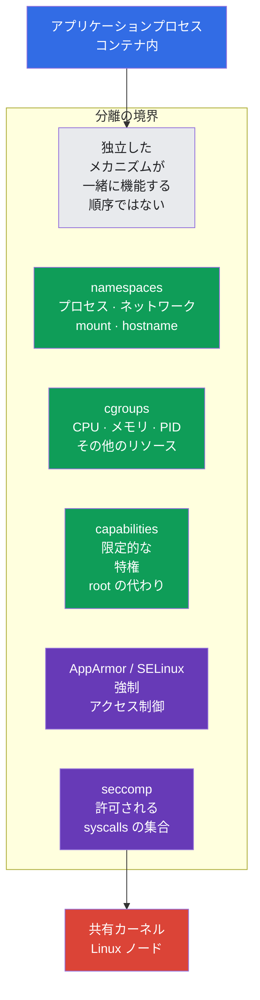
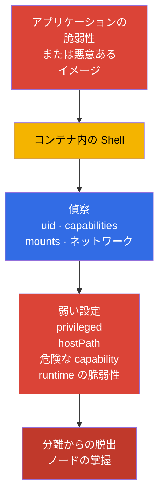
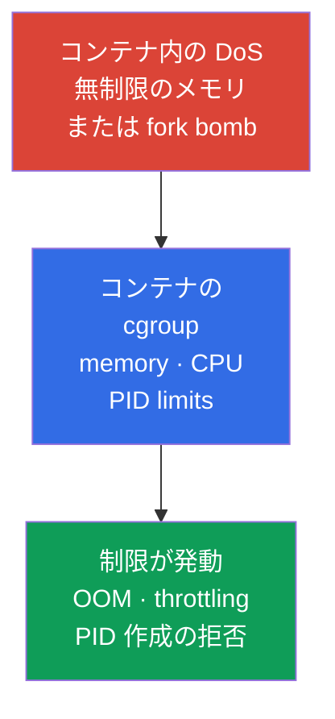
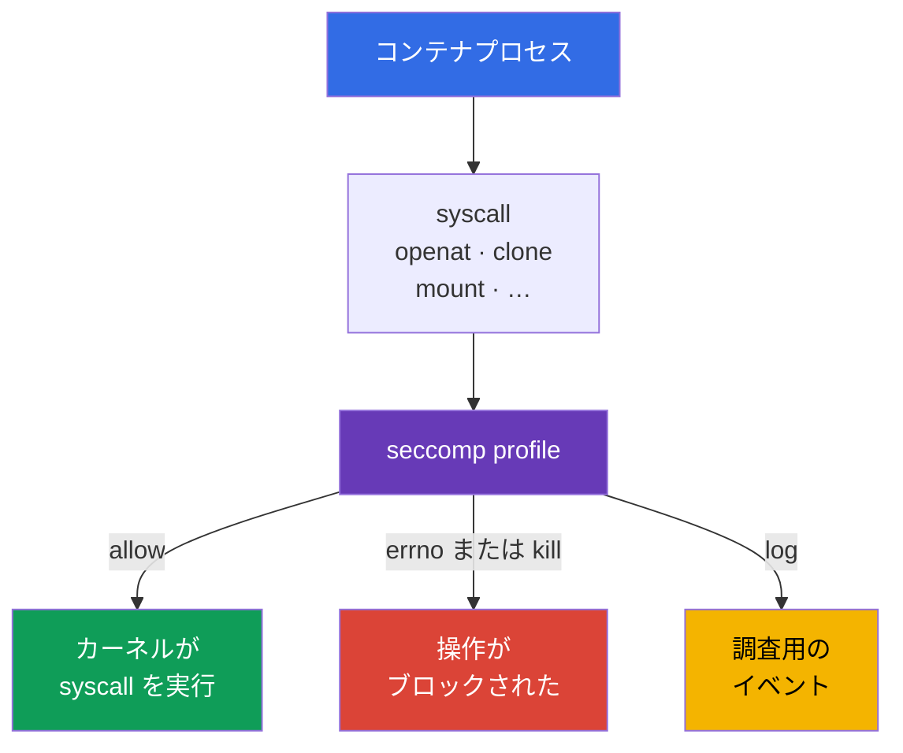
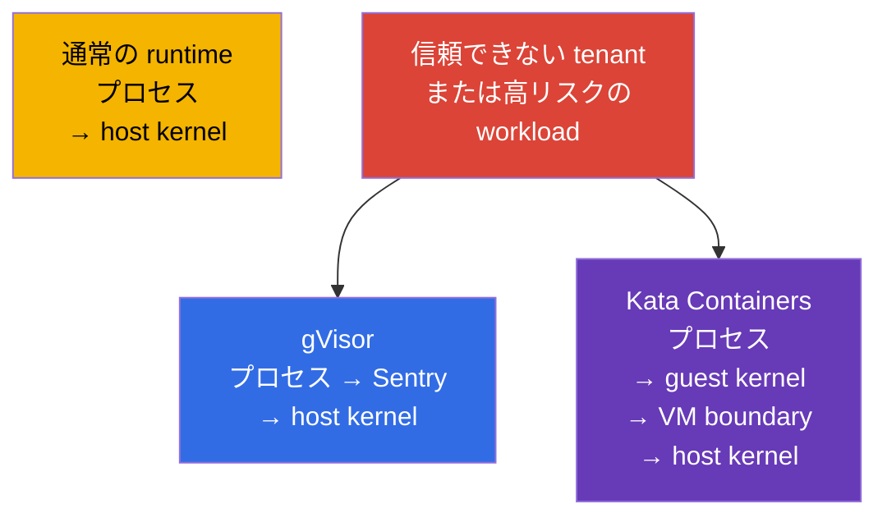

[Русская версия](ru.md) · [Eng version](README.md) · [Versión en español](es.md) · [Version française](fr.md) · [Deutsche Version](de.md) · [ქართული ვერსია](ge.md) · [繁體中文版](tw.md)

# 第03章. Linuxセキュリティメカニズムの内部

> **課題。** コンテナは仮想マシンではありません。workload はノードとカーネルを共有するため、`privileged`、host namespaces、過剰な capabilities、またはアクセス可能な mount があると、Pod 内でのコード実行はより危険になります。複数の分離メカニズムが互いを補完し、container escape の影響を抑えるには Linux の境界を理解する必要があります。単一の絶対的な防御があるという誤った期待を生んではいけません。

> **この先。** 第02章では、Kubernetes の攻撃対象領域を層ごとに分解しました。ここでは、container runtime が Pod のプロセスを分離する Linux メカニズム、すなわち namespaces、cgroups、capabilities、syscalls のフィルタリングを扱います。これは CKS の基盤ですが、独立した試験ドメインではありません。System Hardening (10%) と Minimize Microservice Vulnerabilities (20%) の制約がなぜ機能するのか、そしてその限界はどこにあるのかを説明します。

> **CKAで必要な知識。** コンテナ、namespaces、cgroups、runtime の基本的な仕組みは CKA の[コンテナ](../../../cka/course/00-4-containers/jp.md)、[Linux](../../../cka/course/00-5-linux/jp.md)、[network namespaces](../../../cka/course/00-7-netns/jp.md)で解説しています。ここではコンテナ作成や CKA の基本コマンドは繰り返さず、security 特性、分離の検証、回避経路を扱います。

> 🧠 コンテナの分離は、独立した複数の Linux 境界の組み合わせであり、単一の「魔法の」設定ではありません。

## 03.1. コンテナ分離は仮想マシンではなく、境界の集合である

runc/containerd で動く通常の OCI workload は、ノードの共有カーネル上の Linux プロセスです。その分離は、複数の独立したメカニズムで構成されます。これは sandbox runtimes にそのまま当てはまる絶対的な式ではありません。Kata は VM boundary を追加し、gVisor はプロセスとカーネルのやり取りを大きく変えます。攻撃者がコンテナ内でコード実行を得た場合、まずこれらの境界によって制限されます。ある境界の失敗が他のすべてを自動的に無効化してはなりません。これが defense in depth です。



共有カーネルはコンテナモデルにおける根本的な境界です。カーネルまたは container runtime の脆弱性により、コンテナ内でのコード実行が container escape へと変わる可能性があります。そのため、信頼できない workload にとってコンテナを完全な security boundary と見なすことはできません。複数の hardening 層を適用し、必要に応じて第22章の sandboxed runtime を使用します。

典型的な攻撃経路は次のとおりです。



エンジニアの役割は、不要な特権を取り除き、DoS の影響を制限し、escape の試みを観測可能または不可能にすることです。`securityContext` フィールドはこれらのメカニズムの一部に対する Kubernetes のインターフェースですが、その基本構文はすでに[SecurityContext に関する CKA の章](../../../cka/course/20/jp.md)にあります。

> 🧠 Namespace はリソースの可視性を変えますが、ノードからそれを削除したり、明示的に付与したアクセスを無効にしたりはしません。

## 03.2. Linux namespaces: コンテナに見えるものと見えないもの

Namespace はプロセスにカーネルリソースの個別の見え方を与えます。プロセスがノードから消えるわけではありませんが、カーネル API を通じて自身の namespace のオブジェクトだけを見ます。Kubernetes と runtime は Pod sandbox の起動時に必要な namespaces を作成します。

**通常の Pod 起動の簡単な復習。** ユーザーまたは controller がその仕様を API server に送信し、scheduler がノードを選択すると、そのノードの kubelet が Pod を container runtime に渡します。Runtime は必要な namespaces を含む pod sandbox を作成し、その中で Pod のコンテナを起動します。Pod 作成の完全な経路、pause コンテナの役割、sandbox については[CKA 第4章](../../../cka/course/04/jp.md)で解説しています。

| Namespace | 分離対象 | コンテナプロセスが通常見るもの | Security 上の結果 |
|---|---|---|---|
| `PID` | プロセスツリーと PID | 自身の PID 1 とコンテナまたは Pod のプロセス | 通常はホストプロセスを調査できない |
| `NET` | インターフェース、ルート、ポート、firewall namespace | `eth0`、自身の IP、Pod のルーティングテーブル | Pod のネットワークはノードのネットワークとは異なる |
| `MNT` | mount points とファイル階層 | イメージの rootfs と宣言された volumes | mount なしに host filesystem へアクセスできてはならない |
| `UTS` | hostname と domain name | Pod の hostname | ノードの hostname を公開しない |
| `IPC` | shared memory、semaphores、message queues | Pod sandbox の IPC オブジェクト | 他の Pod またはノードの IPC を読めない |
| `USER` | UID/GID mapping と capabilities | user namespace でマッピングされた UID | 内部の UID 0 を非特権のホスト UID にマッピングできる |

境界は絶対的ではありません。たとえば、同じ Pod の複数のコンテナは通常 `NET` namespace を共有し、`localhost` 経由で通信できます。`hostNetwork`、`hostPID`、`hostIPC` フィールドは対応する境界を無効にします。通常の workload では Pod Security Admission または policy engine で禁止すべきです。

> 🔬 UID/GID mapping、idmapped mounts、および `hostUsers: false` の kernel/runtime バージョン要件。

### User namespaces: 個別の UID/GID マッピング

User namespace は自動では有効になりません。Kubernetes では opt-in です。`spec.hostUsers: false` は Pod 用の user namespace を要求します。この機能は v1.36 で Stable/GA になりました。試験 snapshot v1.35 では `UserNamespacesSupport` がデフォルトで有効であってもまだ Beta です。そのため、これは 🎯 CKS Core ではなく 🔬 Deep Dive / Production です。

**課題。** user namespace がない場合、通常のコンテナ内部の UID 0 はノード上の root と同じ数値 UID 0 です。Namespaces はホストリソースの一部を隠しますが、それ自体ではこのアイデンティティマッピングを変えません。プロセスが想定したコンテナ境界の外へアクセスできると、host はそれを root として扱います。アプリケーション、設定、または分離の不具合による影響は大幅に重くなります。

**防御効果。** kubelet、container runtime、ノードが対応していれば、コンテナ内の UID 0 はホスト上の非特権 UID にマッピングされます。アプリケーションは Pod **内では**引き続き自らを root と見なすことができますが、ホストのカーネルやファイルにとってはもはや host root ではありません。このように user namespace は侵害の blast radius を縮小し、コンテナプロセスとノードの間にさらに一つの境界を追加します。

**注意点。**

- これは least privilege、capabilities、seccomp、MAC の代替ではありません。user namespace はカーネル脆弱性を修正せず、`privileged`、`hostPath`、host namespaces を安全にはしません。
- ノード、runtime、volumes、workload の互換性が必須です。rollout 前に確認すべき項目を以下の短いチェックリストで示します。
- user namespaces を持つ Pod の Pod Security Standards では、Pod 内の root は特権ホストユーザーと同一ではないため、`runAsNonRoot` と `runAsUser` の検証が緩和されます。これはアプリケーション内部の規則を取り消すものではありません。root で実行してはならないなら、ここでも `runAsNonRoot` を要求してください。

```yaml
apiVersion: v1
kind: Pod
metadata:
  name: userns-web
  namespace: demo
spec:
  hostUsers: false
  containers:
  - name: web
    image: nginx:1.30.4
```

user namespaces を有効にする前に、次の3箇所で互換性を確認してください。

1. **ノード。** Linux **6.3+** が必要です。これ以降、tmpfs は idmapped mounts をサポートします。`/var/lib/kubelet/pods` と使用する volumes の filesystem は idmapped mounts をサポートしている必要があります。Pod が配置される可能性のある**すべての**ノードで実行します。

   ```bash
   uname -r
   sudo findmnt -T /var/lib/kubelet/pods \
     -o TARGET,SOURCE,FSTYPE,OPTIONS
   ```

   最初のコマンドではカーネル 6.3 以降が表示される必要があります。2番目は、ノードイメージに対する idmapped mounts のサポートと照合すべき filesystem を示します。これらのコマンドは不適切なノードを見つけますが、`hostUsers: false` を指定した Pod の canary 起動に代わるものではありません。

2. **Runtime。** ドキュメント上の最低目安は、runc >= 1.2、crun >= 1.9（推奨 >= 1.13）、containerd >= 2.0、または CRI-O >= 1.25 です。対象ノードで CRI runtime と OCI runtime のバージョンを確認します。

   ```bash
   sudo crictl version
   sudo runc --version 2>/dev/null || sudo crun --version
   ```

   `crictl version` の出力では `runtimeName` と `runtimeVersion` を確認します。2番目のコマンドはノードが実際に使用する runtime と照合してください。runc のバージョンを `kubectl` または Kubernetes API のバージョンだけから判断してはいけません。

3. **Workload と storage。** User namespaces は UID/GID マッピングを変えます。ファイルの volume が Pod 内で正しい所有者と権限を維持するには、kubelet がそれを idmapped mount として接続する必要があります。`volumeDevices`/raw block volumes にはこのマッピングのための filesystem がなく、Linux NFS client は必要な idmapped mounts をサポートしません。workload がこれらの型のいずれかを使用している場合、kubelet は `hostUsers: false` の Pod 用に volume を準備できず、Pod は起動しません。

   **通常の EBS PVC は禁止されません。** EBS CSI driver が PVC を filesystem として提供する場合（典型例: `volumeMode: Filesystem`、volume は `volumeMounts` 経由で接続）、ノードの filesystem が idmapped mounts をサポートしていれば、その Pod は user namespaces で動作できます。たとえば ext4 と XFS は Linux 6.3+ でサポートされます。しかし同じ EBS PVC でも、`volumeMode: Block` でコンテナに `volumeDevices` 経由で渡される場合は raw block volume であり、互換性がありません。そのため、rollout **前に** storage を確認してください。これにより、workload で user namespaces を見送る必要があるのか、まず storage の接続方法を変更すべきなのかが分かります。すでに作成済みの test-Pod または staging の同様の workload では、まず raw block devices を確認します。

   ```bash
   NS=demo
   POD=userns-web

   kubectl get pod -n "$NS" "$POD" -o json | jq -r '
     (
       .spec.containers[]?,
       .spec.initContainers[]?,
       .spec.ephemeralContainers[]?
     ) as $container
     | $container.volumeDevices[]?
     | "container=\($container.name) raw-block-volume=\(.name)"
   '
   ```

   出力が空なら、`volumeDevices` は使用されていません。続いて、直接的な NFS volumes と PVC 経由で接続された PV を確認します。

   ```bash
   kubectl get pod -n "$NS" "$POD" -o json | jq -r '
     .spec.volumes[]? | select(.nfs)
     | "direct NFS volume: \(.name)"
   '

   for pvc in $(kubectl get pod -n "$NS" "$POD" \
     -o jsonpath='{range .spec.volumes[?(@.persistentVolumeClaim)]}{.persistentVolumeClaim.claimName}{"\n"}{end}'); do
     pv=$(kubectl get pvc -n "$NS" "$pvc" \
       -o jsonpath='{.spec.volumeName}')
     kubectl get pv "$pv" -o json | jq -r '
       if .spec.nfs then "NFS PV: \(.metadata.name)"
       elif .spec.csi then "CSI driver: \(.spec.csi.driver)"
       else "PV without direct NFS: \(.metadata.name)"
       end
     '
   done
   ```

   raw block または NFS に関する出力があれば、その workload は user namespaces の準備ができていません。CSI volume の `CSI driver` 行だけでは互換性を意味しません。特定の CSI driver のドキュメントとテストで確認する必要があります。

API による厳格な制限もあります。`hostUsers: false` では、`hostNetwork: true`、`hostIPC: true`、`hostPID: true` を指定できません。これは無視できる hardening 設定ではなく、Kubernetes はそのような Pod を拒否します。

ノードでは `lsns` ユーティリティで namespaces を確認できます。これはノード管理者向けの診断コマンドであり、アプリケーションに与えるコマンドではありません。

```bash
sudo lsns \
  -t pid \
  -t net \
  -t mnt \
  -t uts \
  -t ipc \
  -t user
sudo crictl ps
CONTAINER_ID="${CONTAINER_ID:?set target container id from crictl ps}"
sudo crictl inspect "$CONTAINER_ID" | jq '.info.pid'
PID=$(sudo crictl inspect "$CONTAINER_ID" | jq -r '.info.pid')
sudo lsns -p "$PID"
```

コンテナが host PID namespace にいないことを確認するには、コンテナプロセスとノードの PID 1 の namespace inode を比較すれば十分です。

```bash
sudo readlink /proc/1/ns/pid
sudo readlink /proc/"$PID"/ns/pid
# 通常の Pod では値が異なる必要があります。
```

Pod 内では、安全な初期診断が役立ちます。

```bash
kubectl exec -n demo deploy/web -- sh -c '
  echo "hostname: $(hostname)"
  echo "pid namespace: $(readlink /proc/1/ns/pid)"
  echo "network namespace: $(readlink /proc/1/ns/net)"
  ps -ef
  ip route
'
```

コンテナの PID 1 とホストの PID 1 を混同しないでください。PID namespace はプロセスを隠しますが、明示的に付与したアクセスを無効にはしません。`/proc` を持つ `hostPath`、`privileged: true`、`hostPID: true` は脅威モデルを変えます。このようなフィールドの診断には次を使用します。

```bash
kubectl get pod -A -o jsonpath='{range .items[*]}{.metadata.namespace}{"/"}{.metadata.name}{" hostPID="}{.spec.hostPID}{" hostNetwork="}{.spec.hostNetwork}{" hostIPC="}{.spec.hostIPC}{"\n"}{end}'
```

> 🧠 Namespace は可視性を制限し、cgroup は消費を制限します。`limits` はリソース境界を作り、`requests` はスケジューリングを助けます。

## 03.3. cgroups: DoS に対するリソース制限

namespace が「プロセスに何が見えるか」を問うなら、cgroup は「どれだけのリソースを消費できるか」を問います。Container runtime はコンテナプロセスを cgroup に入れ、kubelet は Pod 仕様の limits と requests を適用します。

memory limit がなければ、プロセスはノードのメモリを占有し、memory pressure、他の Pod の eviction、または kernel OOM を引き起こせます。PID limit がなければ、fork bomb が PID テーブルを枯渇させる可能性があります。CPU request は scheduling と CPU 配分に関与し、CPU limit は throttling による厳格な ceiling を設定します。CPU が空いていても、CPU limit が低すぎると latency が悪化し得ます。そのため memory/PID limits は DoS に対するより直接的な境界を提供し、CPU limit は負荷プロファイルに基づいて慎重に選択します。これはクラスターの可用性、つまりパフォーマンスだけでなく security シナリオでもあります。



小規模な HTTP トラフィックを処理できるプロセス向けの、最小限の limits 例です。

```yaml
apiVersion: v1
kind: Pod
metadata:
  name: bounded-web
  namespace: demo
spec:
  containers:
  - name: web
    image: nginx:1.30.4
    resources:
      requests:
        cpu: 100m
        memory: 128Mi
      limits:
        cpu: 500m
        memory: 256Mi
```

> 🔬 Pod レベルの `spec.resources` は、コンテナ共通の resource budget を対象とする Kubernetes v1.34 の beta 機能です。

### Pod-Level Resources: Pod 全体の境界

**Pod-Level Resources** は Kubernetes v1.34 から Beta で、デフォルトで有効です。`spec.resources` により、CPU、memory、hugepages について Pod 全体の `requests` と `limits` を設定できます。これはすべての Pod に対する aggregate budget であり、明示的なコンテナリソースの置き換えではありません。Aggregate Pod limit は Pod のコンテナに対する実際の共通境界です。container-level limits は各コンテナの個別の制限として残ります。

```yaml
apiVersion: v1
kind: Pod
metadata:
  name: pod-budget-web
  namespace: demo
spec:
  resources:
    requests:
      cpu: "500m"
      memory: 128Mi
    limits:
      cpu: "1"
      memory: 256Mi
  containers:
  - name: app
    image: nginx:1.30.4
```

この例を `pod-budget-web.yaml` として保存し、`spec.resources` の共通 budget を確認します。

```bash
kubectl apply -f pod-budget-web.yaml
kubectl wait -n demo --for=condition=Ready pod/pod-budget-web --timeout=120s
kubectl get pod -n demo pod-budget-web \
  -o jsonpath='{.spec.resources}{"\n"}'
kubectl describe pod -n demo pod-budget-web
```

cgroup v2 では、limits は `memory.max`、`cpu.max`、`pids.max` ファイルで確認できます。特定プロセスの cgroup の場所は `/proc/<pid>/cgroup` で示されます。

```bash
sudo cat /proc/"$PID"/cgroup
CGROUP=$(awk -F: '$1 == "0" {print $3}' /proc/"$PID"/cgroup)
sudo cat "/sys/fs/cgroup${CGROUP}/memory.max"
sudo cat "/sys/fs/cgroup${CGROUP}/cpu.max"
sudo cat "/sys/fs/cgroup${CGROUP}/pids.max"
```

cgroup v1 の古いノードでは、controller は別々の mount points にあります。そのため、確認せずに cgroup v2 のパスをコピーしてはいけません。まずモードを確認します。

```bash
stat -fc %T /sys/fs/cgroup
# cgroup2fs は cgroup v2 を意味します。
```

これらの境界を個別に覚えてください。

- **workload 内: `requests` と `limits`。** `requests` は scheduler と QoS に影響しますが、それだけでは貪欲なプロセスを止めません。厳格な境界を設定するのは `limits` です。CPU では throttling の可能性を伴う ceiling になるため、CPU limit を恣意的に低く選んではいけません。
- **namespace レベル: `ResourceQuota` と `LimitRange`。** 単一 Pod のリソースは namespace を総消費から守りません。`ResourceQuota` はその全体 budget を制限し、`LimitRange` は各 workload の defaults と許容範囲を設定します。これらにより、不完全な manifest を持つ一つのチームが他を追い出すことを防ぎます。
- **PID: limit はノード管理者が設定する。** 通常の Pod の YAML に「この workload に N 個のプロセスを許可する」とは指定できません。代わりに管理者が kubelet の `podPidsLimit` パラメータ、すなわちそのノードで**1つの Pod ごとに**許可される最大 PID 数を設定します。Kubelet は PID cgroup を通じてこれを適用します。そのため検証は二段階です。まず kubelet 設定で `podPidsLimit` を見つけ、次にすでに起動している Pod の cgroup で `pids.max` を確認します。
- **memory pressure 時: cgroup 内の OOM。** カーネルは対応する cgroup の領域内でコンテナプロセスを終了させることがあります。主プロセスが終了した場合、kubelet は `restartPolicy` に従ってコンテナを再起動します。
- **安全に確認する。** production ノードで意図的な OOM により memory limit の動作を証明しないでください。

> 🎯 `privileged`、host namespaces、過剰な capabilities、`allowPrivilegeEscalation: true` を取り除きます。`capabilities.drop: [ALL]`、`RuntimeDefault`、必要な MAC プロファイルを設定してください。

## 03.4. Linux capabilities: root を分割する

UID 0 は特権を示す唯一の指標ではありません。Linux カーネルは root の権限の一部を capabilities に分割します。プロセスには permitted、effective、inheritable、bounding、ambient を含む複数の capability set があります。`id` だけを確認しても、プロセスが安全であることは証明できません。

一部の capabilities は通常のアプリケーションにとって特に危険です。

| Capability | リスク | 付与する通常の理由 |
|---|---|---|
| `CAP_SYS_ADMIN` | 広範な管理操作、mount と namespace 操作。escape チェーンの頻出要素 | ビジネスアプリケーションにはほぼ不要 |
| `CAP_SYS_MODULE` | kernel modules のロードとアンロード | ノードのシステムコンポーネントであり、アプリケーション Pod ではない |
| `CAP_SYS_PTRACE` | 対象プロセスのトレースとメモリ読み取り | 限定的な診断ツール |
| `CAP_NET_ADMIN` | インターフェース、ルート、firewall の変更 | CNI とネットワークエージェント |
| `CAP_DAC_OVERRIDE` | ファイル DAC チェックの回避 | 明確な理由なく workload に付与しない |
| `CAP_SETUID` / `CAP_SETGID` | UID/GID の変更 | 特別な bootstrap であり、アプリケーションの steady state ではない |
| `CAP_BPF` / `CAP_PERFMON` | BPF とカーネルの performance メカニズムの利用 | 個別の信頼モデルを持つノード上の observability |

ノードでファイルとプロセスの capabilities を確認します。

```bash
sudo getcap -r /usr/local/bin 2>/dev/null
sudo capsh --print
sudo getpcaps "$PID"
```

`getcap` は executable が起動時に取得する file capabilities を示します。`getpcaps "$PID"` は指定プロセスの capabilities を示します。引数なしの `capsh --print` は、以前に見つけた container PID ではなく、現在の shell の状態を示します。これらのコマンドは別のプロセスに対してノード上の権限を必要とします。これは想定どおりで、それ自体が防御です。

`NET_BIND_SERVICE` を追加する前に、対象 Pod の network namespace における `net.ipv4.ip_unprivileged_port_start` の値を確認してください。閾値が `0` なら、非特権プロセスはすでに低いポートを listen でき、capability は不要です。

```bash
kubectl exec -n demo <pod> -- cat /proc/sys/net/ipv4/ip_unprivileged_port_start
```

通常の非特権コンテナでは、`allowPrivilegeEscalation: false` により Linux プロセスに `no_new_privs` が設定されます。`exec` 後の子プロセスは setuid/setgid ビットまたは file capabilities によって新たな特権を取得してはなりません。

重要な Kubernetes の例外があります。コンテナが `privileged: true` で起動しているか、`CAP_SYS_ADMIN` を持つ場合、`allowPrivilegeEscalation` は実質的に常に `true` です。そのため、まず `privileged` と過剰な capabilities を取り除きます。`allowPrivilegeEscalation: false` は追加の境界であり、そのようなコンテナを安全にする方法ではありません。

デフォルト値である `allowPrivilegeEscalation: true` では、Kubernetes は `no_new_privs` を設定しません。`true` 自体が capability を付与したり、コンテナを privileged にしたりはしませんが、特権昇格への経路を残します。侵害された非特権プロセスは、イメージ内の setuid/setgid プログラムまたは capabilities を持つファイルを実行し、そのファイルが提供する UID/GID または capability を取得できます。このようにアプリケーションユーザーとしての RCE は root または追加 capabilities を持つプロセスへと変化し、攻撃の影響と escape チェーンの可能性を**コンテナ内で**広げます。アプリケーションがそのような exec を必要としない場合、`false` を設定する方が安全です。

これは重要ですが唯一の境界ではなく、drop capabilities、seccomp、MAC の代替にはなりません。Kubernetes の安全な出発点は、すべてを削除し、文書化された必要性があるときだけ一つの capability を追加することです。sysctl の設定とアプリケーション要件がそれを裏付ける場合に限り、TCP 80 用の legacy アプリケーションで `NET_BIND_SERVICE` が必要になることがあります。

```yaml
apiVersion: v1
kind: Pod
metadata:
  name: capability-example
  namespace: demo
spec:
  containers:
  - name: web
    image: nginx:1.30.4
    securityContext:
      allowPrivilegeEscalation: false
      capabilities:
        drop:
        - ALL
        add:
        - NET_BIND_SERVICE
```

適用済み設定とプロセス状態を確認します。

```bash
kubectl apply -f capability-example.yaml
kubectl get pod -n demo capability-example \
  -o jsonpath='{.spec.containers[0].securityContext.capabilities}{"\n"}'
kubectl exec -n demo capability-example -- sh -c 'grep Cap /proc/1/status'
```

`/proc/1/status` の `CapEff` 値は16進マスクで符号化されています。人間が読める形で解析するには、ノード上、またはこのツールが信頼できる形でインストールされた診断イメージ内で `capsh --decode=<値>` を使用します。

```bash
capsh --decode=0000000000000400
# 例: 0x400 は cap_net_bind_service に対応します。
```

`privileged: true` は capabilities 設定の代替ではありません。そのようなコンテナはすべての Linux capabilities を取得し、通常の seccomp、AppArmor、SELinux の confinement は解除または無視されます。CKS ではこれは赤旗です。まず `privileged` を取り除き、次に各 capability の必要性を個別に評価します。

## 03.5. Syscalls と seccomp: 利用可能なカーネル API を減らす

ユーザープロセスのあらゆる操作は、最終的に syscall を通じてカーネルに届きます。ファイルを開く、ソケットを作成する、メモリを割り当てる、namespace を変更する、といった操作です。アプリケーションが危険な操作を必要としなくても、脆弱なプロセスは対応する syscall を呼び出そうとする可能性があります。seccomp は syscall ルールに基づき、カーネルがプロセスを許可、拒否、ログ記録、または終了できるようにします。



seccomp は Kubernetes API を誰が読めるかを決めるものではなく、安全でないイメージを修正するものでもありません。これは、侵害されたプロセスとカーネル API の間にある最後のフィルタです。`capabilities.drop: [ALL]`、`allowPrivilegeEscalation: false`、MAC プロファイルと組み合わせると特に有用です。

`seccompProfile` が設定されていない場合、Pod は `Unconfined` のままになる可能性があります。例外は kubelet で `seccompDefault: true` が有効なノードです。この場合、プロファイルがないと `RuntimeDefault` が適用されます。これをクラスターの普遍的な性質と考えてはいけません。ノード設定を確認し、workload のプロファイルを明示的に設定してください。

ほとんどの workload では、`Unconfined` ではなく runtime profile から始めます。

```yaml
apiVersion: v1
kind: Pod
metadata:
  name: runtime-default
  namespace: demo
spec:
  securityContext:
    seccompProfile:
      type: RuntimeDefault
  containers:
  - name: app
    image: nginx:1.30.4
```

runtime のデフォルトについて推測するのではなく、Pod 仕様そのものを確認します。

```bash
kubectl apply -f runtime-default.yaml
kubectl get pod -n demo runtime-default \
  -o jsonpath='{.spec.securityContext.seccompProfile.type}{"\n"}'
kubectl describe pod -n demo runtime-default
```

custom profile は、測定済みで再現可能な syscalls の集合がある場合に適用します。Pod が起動する可能性のある各ノードの kubelet `seccomp` profiles ディレクトリに保存されます。パスが誤っている、または選択されたノードにプロファイルがないと、Pod の起動は拒否されます。プロファイルの完全な形式、audit モード、`Localhost` の適用は第17章で扱います。無闇に deny-list を作成してはいけません。そうするとアプリケーションの更新が production で壊れます。

隔離された test ノード上で syscall の挙動を診断するには `strace` を使用します。

```bash
sudo strace -f -p "$PID" -e trace=%file,%network
# 高負荷の production プロセスで長時間の strace を実行しないでください。
```

## 03.6. MAC: AppArmor と SELinux は DAC を補完する

通常の Linux DAC は、ファイルの UID、GID、mode bits を検査します。DAC（Discretionary Access Control、任意アクセス制御）モデルでは、オブジェクトの所有者は、たとえば `chmod` により mode bits を変更でき、DAC モデルの範囲内でアクセスを付与または取り消せます。Linux でファイルの UID 所有者を変更するには `CAP_CHOWN` が必要です。非特権の所有者がファイルのグループを変更できるのは、自身が所属するグループだけです。十分な UID/GID または capabilities を持つプロセスは、通常の DAC チェックの一部を通過または回避できます。

**Mandatory Access Control（MAC、強制アクセス制御）** は、カーネルに必須となる2番目のチェックを追加します。管理者は policy をロードし、カーネルはプロセスをその profile/label に対応付け、ファイル、ソケット、その他のオブジェクトに対する特定の操作が許可されるかを検証します。DAC がすでにアクセスを許可していても、MAC はそれを拒否できます。プロセス自身は policy を削除または緩和できません。目的は侵害されたプロセスを局所化することです。たとえば Web サーバーが追加の UID、capability、またはファイルアクセスを得たからといって、SSH キーを読んだりシステムファイルを変更したりできてはなりません。そのため MAC は DAC、capabilities、seccomp を補完するものであり、置き換えるものではありません。

| メカニズム | 主なモデル | よく見られる場所 | 確認するもの |
|---|---|---|---|
| AppArmor | profile-based、ファイルパスと操作 | Ubuntu、Debian、一部の managed ノード | `aa-status`、ロード済み profile、audit log の `DENIED` |
| SELinux | labels と type enforcement | RHEL、Fedora、OpenShift、互換 OS | `getenforce`、labels、audit log の AVC denial |

両メカニズムは同じ課題を解決しますが、プロファイルと運用は互換ではありません。SELinux ノードに AppArmor profile をコピーして適用されると期待することはできません。policy を設計する前に、ノードイメージで実際に何が有効かを確認してください。

```bash
sudo aa-status || true
getenforce 2>/dev/null || true
sudo journalctl -k --since '10 minutes ago' | grep -Ei 'apparmor|avc|denied' || true
```

Kubernetes で現在の AppArmor インターフェースは `securityContext.appArmorProfile` です。runtime profile の例:

```yaml
securityContext:
  appArmorProfile:
    type: RuntimeDefault
```

`RuntimeDefault` では、ノード上の container runtime が互換性のある default profile を提供する必要があります。YAML だけでなく、実際の node pool で確認してください。`Localhost` では、プロファイルを対象ノードにあらかじめロードし、`localhostProfile` で指定する必要があります。これは node-local dependency です。scheduler はプロファイルをノード間で移動しません。そのため production では、設定管理によってプロファイルを配布し、各 node pool で検証し、Pod の配置を制限します。プロファイルの実装と `DENIED` の解析は第16章で学びます。

SELinux では、ラベルのパラメータを `securityContext.seLinuxOptions` で設定しますが、ノードイメージの policy に従う場合に限ります。拒否が起きたら、まず SELinux を無効化せず AVC denial を調べてください。volumes と filesystem 上のファイルには適切な SELinux labels が必要です。特に hostPath、persistent volumes、共有 writable volumes を慎重に確認してください。

> 🧠 コンテナはノードとカーネルを共有します。sandboxed runtime は信頼できない、または高リスクの workload 向けに分離を追加します。

## 03.7. 分離境界、sandboxed runtime、escape リスクの診断

namespaces、cgroups、capabilities、seccomp、MAC は一つのカーネルで動作します。リスクプロファイルが tenant 間に強力な境界を求める場合は、sandboxed runtime を使用してください。gVisor は syscalls の大部分を user space でインターセプトし、Kata Containers は workload を軽量 VM で実行します。これにより、互換性、latency、運用上の複雑さを代償として、ノードカーネルの直接利用の可能性を減らします。



Sandbox は他の対策を無効にしません。gVisor または Kata でも、workload に `privileged`、host namespaces、Docker socket、広範な RBAC 権限を与えてはなりません。まず least privilege を適用し、次に脅威モデルに応じて RuntimeClass を選択します。`runsc`、`RuntimeClass` のインストール、および互換性のある nodes へのスケジューリングは第22章で扱います。

> 🔬 宣言的な Pod と、ノード上の PID、namespaces、cgroup を forensic-style で対応付ける。

疑わしい Pod を調査するための実践的なチェックリスト:

```bash
NAMESPACE="${NAMESPACE:?set target namespace}"
POD="${POD:?set target pod name}"

# 1. namespaces の明示的な回避と privileged モードを見つける。
kubectl get pod -n "$NAMESPACE" "$POD" -o yaml | \
  grep -E 'privileged:|hostPID:|hostIPC:|hostNetwork:|hostPath:|allowPrivilegeEscalation:'

# 2. 宣言された Pod-level と container-level の securityContext、
#    および volumes を確認する。これは宣言的な設定であり、
#    実際に適用された runtime/kernel settings の証拠ではない。
kubectl get pod -n "$NAMESPACE" "$POD" -o json | jq '
{
  podSecurityContext: .spec.securityContext,
  containers: [
    (
      .spec.containers[]?,
      .spec.initContainers[]?,
      .spec.ephemeralContainers[]?
    )
    | {
        name: .name,
        securityContext: .securityContext
      }
  ],
  volumes: .spec.volumes
}
'

# 3. ノードで Pod sandbox を見つけ、次に container とその namespace/cgroup を確認する。
#    `crictl ps --name` は Pod 名ではなくコンテナ名でフィルタする。
sudo crictl pods \
  --name "^${POD}$" \
  --namespace "^${NAMESPACE}$"
POD_ID="${POD_ID:?set target pod sandbox id from crictl pods}"
sudo crictl ps --pod "$POD_ID"
CONTAINER_ID="${CONTAINER_ID:?set target container id from crictl ps}"
sudo crictl inspect "$CONTAINER_ID" | jq '.info.pid'
PID="$(sudo crictl inspect "$CONTAINER_ID" | jq -r '.info.pid')"
PID="${PID:?failed to get pid from crictl inspect}"
sudo lsns -p "$PID"
sudo cat "/proc/$PID/cgroup"
```

典型的な誤り:

- コンテナ内の UID 0 を自動的にノードの root と見なすこと。User mapping と他の境界がそれを制限する場合がありますが、それでも application workload の出発点としては不適切です。
- namespace を十分な防御と見なすこと。`hostPath`、host namespaces、`privileged`、kernel CVE は結果を変えます。
- 症状を直すために `CAP_SYS_ADMIN` を追加すること。最初に必要な操作を特定し、より狭い capability または別の設計を使用してください。
- アプリケーションが「通常は」少量しか消費しないからと、Pod を `limits` なしで残すこと。一つの不具合または悪意あるリクエストで DoS には十分です。
- アプリケーションテストなし、かつすべての対象 nodes へのプロファイル配布なしに custom seccomp profile を有効にすること。
- scheduler が Pod を起動したノードにプロファイルがロードされていることを確認せずに AppArmor profile を適用すること。

> 🏭 Workload templates、admission policy、node pool の分離、拒否の観測により、安全な baseline と例外を定着させます。

## 03.8. production での適用方法

- **制約を workload template に組み込む。** 基本の Helm chart または platform template に `resources.limits`、`allowPrivilegeEscalation: false`、`capabilities.drop: [ALL]`、`seccompProfile: RuntimeDefault`、non-root 実行を設定します。チームがテンプレートから逸脱するのは、根拠がある場合だけです。
- **危険な policy 回避を禁止する。** `restricted` レベルの Pod Security Admission または Kyverno/Gatekeeper により、`privileged`、host namespaces、安全でない capabilities、seccomp の未設定を許可しません。policy の詳細は第19章と第20章で扱います。
- **node pools を信頼度で分離する。** 実際に `NET_ADMIN` や host mounts を必要とする CNI、CSI、node agents は、ビジネス workload と分けて実行します。multi-tenancy には `RuntimeClass` を通じて gVisor または Kata を選びます。
- **拒否を観測し、防御を無効化しない。** AppArmor/SELinux denial、seccomp error、OOMKilled、PID exhaustion はログとメトリクスに送られます。原因はアプリケーション、writable volume、または狭い policy の変更で解消し、`privileged: true` への回帰では解消しません。
- **ノードの実際の状態を確認する。** Kubernetes manifest は望ましい状態を記述しますが、AppArmor profile、SELinux モード、cgroup mode、runtime config は node にあります。これらは image pipeline と定期的な hardening audit で確認します。

## 03.9. ミニ用語集

- **namespace** - プロセスグループに対する、カーネルリソースの分離された見え方。
- **PID namespace** - プロセスリストと PID の分離。
- **network namespace** - インターフェース、ルート、ネットワークスタックの分離。
- **cgroup** - リソースの制限と計測を持つプロセスグループ。
- **capability** - root の権限から切り出された、個別の Linux 特権。
- **CAP_SYS_ADMIN** - 通常の workload には危険な、過度に広範な capability。
- **syscall** - プロセスがカーネルへアクセスするためのシステムコール。
- **seccomp** - カーネルがプロセスに適用する syscalls のフィルタ。
- **MAC** - Mandatory Access Control。UID/GID と mode bits に重ねる必須のアクセス policy。
- **AppArmor** - Linux 用の profile-based MAC。
- **SELinux** - type enforcement を持つ label-based MAC。
- **container escape** - 想定されたコンテナ分離から、ノードまたは別 tenant のリソースへ脱出すること。
- **sandboxed runtime** - gVisor や Kata Containers など、強化された分離境界を持つ runtime。

## 03.10. 章のまとめ

- コンテナはノードの共有カーネルを使用します。その防御は一つの「サンドボックス」ではなく、複数の Linux メカニズムから成ります。
- `PID`、`NET`、`MNT`、`UTS`、`IPC`、`USER` namespaces はリソースの可視性を制限しますが、host namespaces、`hostPath`、`privileged` はこの境界を回避できます。User namespace は `spec.hostUsers: false` で個別に有効化され、ノードと runtime のサポートを必要とします。
- cgroups は CPU、memory、PID を制限し、ノードと隣接 workload を DoS から保護します。PID limit は kubelet が `podPidsLimit` を通じて設定し、cgroup OOM はプロセスを終了させコンテナの restart につながる場合があります。
- Capabilities は root の権限を分割します。安全な baseline は `ALL` を削除し、sysctl と実際の必要性を確認した後、文書化された最小の capability だけを戻すことです。
- `RuntimeDefault` を使用する seccomp は、プロセスが利用できるカーネル API を縮小します。ノードで `seccompDefault` が有効でなければ、明示的なプロファイルなしでは `Unconfined` になる可能性があります。
- AppArmor と SELinux は必須 policy により通常のファイル権限を補完します。runtime/node profile、AVC、volume labels が重要です。強く信頼できない workload には gVisor または Kata も検討します。

## 03.11. 役立つ場面: 試験と実務

**試験で。** この章は、`capabilities`、seccomp、AppArmor、`privileged`、host namespaces、limits の欠如を説明または修正する必要がある CKS 問題のモデルを提供します。YAML だけでなく、`kubectl get ... -o jsonpath`、`kubectl exec`、SSH アクセスがある場合は `crictl`、`lsns`、`aa-status`、`/proc/<pid>/cgroup` を使用して確認してください。実践の続きはラボ106と第16-17章です。

**実務で。** 下位レベルを理解すると、安全な例外と危険な回避策を区別できます。アプリケーションが `privileged` または `CAP_SYS_ADMIN` を求めるなら、その呼び出し、mounts、アーキテクチャを分析する契機です。Pod が OOMKilled または profile denial で落ちる場合、それは限定的な修正のための観測可能なシグナルであり、すべての hardening を無効にする理由ではありません。

## 03.12. 自己確認の質問

<details>
<summary>1. コンテナが仮想マシンと同じではないのはなぜですか。またノードの共有 kernel はどのような役割を持ちますか？</summary>

runc/containerd で動く通常の OCI workload は、独立した VM ではなくノードの共有カーネルを持つ Linux プロセスです。Namespaces、cgroups、capabilities、MAC、seccomp は複数の境界を作りますが、カーネルまたは runtime の脆弱性により、コンテナ内のコード実行から container escape へ至る可能性があります。
</details>

<details>
<summary>2. プロセス、ネットワーク、mount points を分離する namespaces は何ですか。またどの Pod フィールドがこれらの境界を取り除けますか？</summary>

`PID` namespace はプロセスツリーを、`NET` はインターフェース、ルート、ポートを、`MNT` は mount points とファイル階層を分離します。`hostPID`、`hostNetwork`、`hostIPC` フィールドは対応する境界を無効にします。`hostPath` と `privileged: true` もノードリソースへのアクセスモデルを変えます。
</details>

<details>
<summary>3. ノードを DoS から保護する場面で、`requests` と `limits` はどう異なりますか？</summary>

`requests` は scheduling と QoS に影響しますが、それだけでは貪欲なプロセスを止めません。厳格な境界を設定するのは `limits` です。memory limit は memory pressure/OOM の影響を制限し、CPU limit は throttling による ceiling を与えます。PID limit は kubelet パラメータ `podPidsLimit` によって設定されます。
</details>

<details>
<summary>4. 任意のアプリケーションエラーを修正するために `CAP_SYS_ADMIN` を付与してはいけないのはなぜですか？</summary>

`CAP_SYS_ADMIN` は mount と namespace 操作を含む広範な管理操作を提供し、しばしば escape チェーンに含まれます。症状を直す代わりに、実際に必要な操作を特定し、`ALL` capabilities を削除して、文書化された必要性がある場合にのみ一つの狭い capability を戻すべきです。
</details>

<details>
<summary>5. container を host PID、namespaces、cgroup に対応付けるには、どのコマンドが役立ちますか？</summary>

ノード上では `sudo crictl ps`、続いて `sudo crictl inspect "$CONTAINER_ID" | jq '.info.pid'` を使用してコンテナ PID を取得します。検証には `sudo lsns -p "$PID"` と `sudo cat "/proc/$PID/cgroup"` を使います。PID namespace inode は `readlink /proc/1/ns/pid` と `readlink /proc/"$PID"/ns/pid` を比較できます。
</details>

<details>
<summary>6. seccomp は capabilities をどのように補完しますか。また通常の workload で `RuntimeDefault` が `Unconfined` より優れているのはなぜですか？</summary>

Capabilities は個別の特権を制限し、seccomp は syscalls レベルでプロセスに利用可能なカーネル API をフィルタします。明示的な `RuntimeDefault` は通常の workload のこの集合を減らします。一方、ノードで `seccompDefault` が有効でない場合、プロファイルがなければ Pod は `Unconfined` のままになる可能性があります。
</details>

<details>
<summary>7. AppArmor と SELinux の運用上の違いは何ですか？</summary>

AppArmor はパスと操作に対する profile-based policy を使用し Ubuntu/Debian で一般的です。一方、SELinux は RHEL/Fedora/OpenShift で labels と type enforcement を使用します。プロファイルは互換ではありません。設定前に `aa-status` または `getenforce` を確認し、MAC を無効にするのではなく AppArmor の `DENIED` または SELinux AVC denial を分析します。
</details>

<details>
<summary>8. コンテナ分離だけでは不十分なのはいつですか。また sandboxed runtime が必要なのはなぜですか？</summary>

信頼できない tenant または高リスク workload では、ノードと共有する kernel boundary だけでは不十分な場合があります。gVisor は syscalls の大部分を user space でインターセプトし、Kata は workload を軽量 VM で起動します。これにより、互換性、latency、運用上の複雑さを代償として、カーネルを直接利用するリスクを減らします。
</details>

## 演習

🧪 動作するノード上のプロファイルと Pod での操作ブロック検証にこれらのメカニズムを結び付ける[ラボ106 - AppArmor + seccomp](../../labs/106/README_JP.MD)を行いましょう。その前に AppArmor の[第16章](../16/jp.md)と seccomp の[第17章](../17/jp.md)を学び、強化された分離については sandboxed containers の[第22章](../22/jp.md)へ進んでください。

🌐 追加のインタラクティブ演習（killer.sh/killercoda、外部リソース）: [container-namespaces-docker](https://killercoda.com/killer-shell-cks/scenario/container-namespaces-docker) · [container-namespaces-podman](https://killercoda.com/killer-shell-cks/scenario/container-namespaces-podman)

## 参考資料

- [Kubernetes: Linux カーネルのセキュリティ制約](https://kubernetes.io/docs/concepts/security/linux-kernel-security-constraints/)
- [Kubernetes: User Namespaces](https://kubernetes.io/docs/concepts/workloads/pods/user-namespaces/)

---
[目次](../README_JP.md) · [第02章](../02/jp.md) · [第04章](../04/jp.md)
