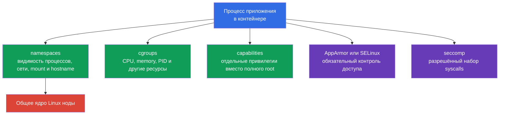
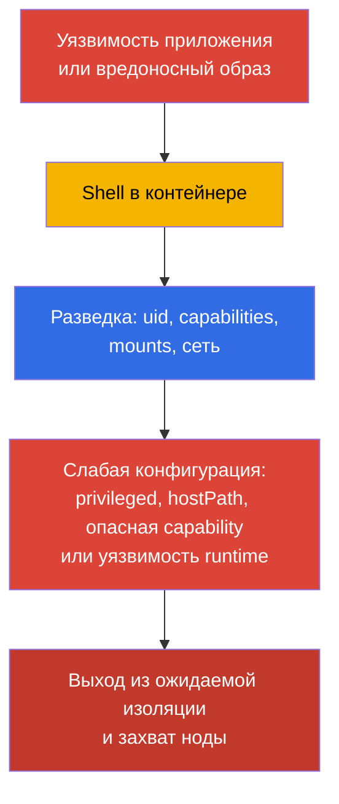
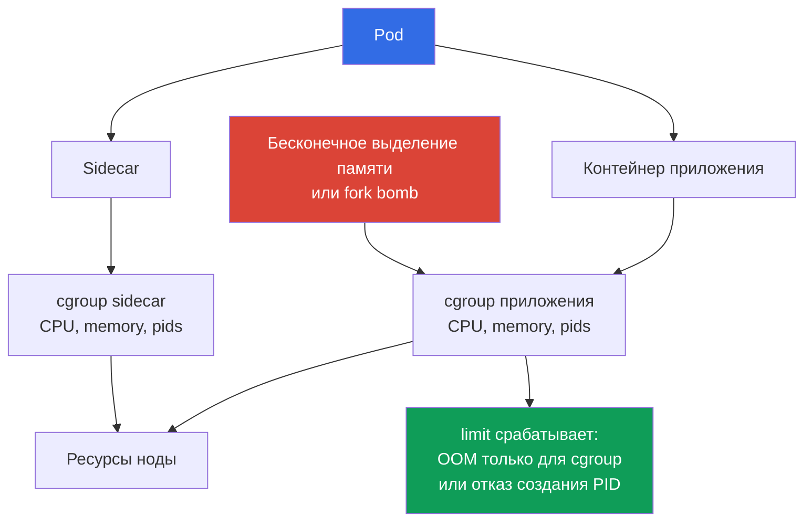
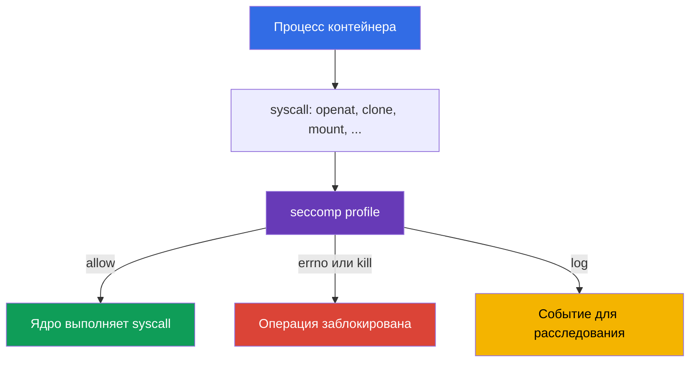
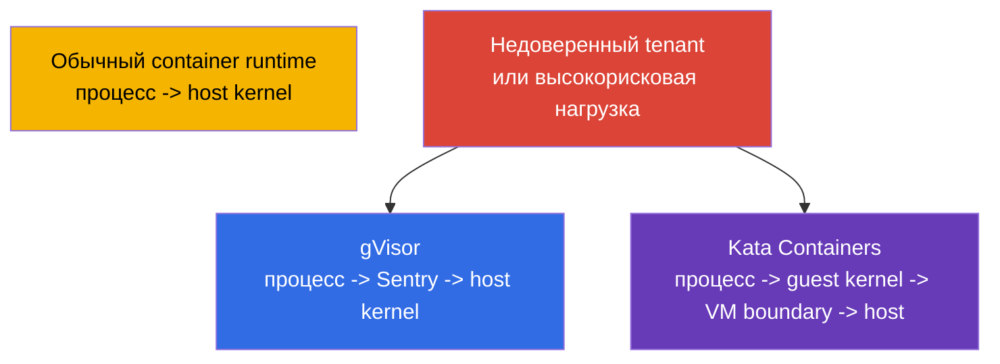

<!-- Standalone RU release: ссылки на переводы удалены, потому что соответствующие файлы не входят в архив. -->

# Глава 03. Linux-механизмы безопасности под капотом

> **Что дальше.** В главе 02 мы разложили поверхность атаки Kubernetes по слоям. Теперь рассмотрим механизмы Linux, которыми container runtime изолирует процесс пода: namespaces, cgroups, capabilities и фильтрацию syscalls. Это фундамент CKS, но не отдельный экзаменационный домен: он объясняет, почему ограничения из System Hardening (10%) и Minimize Microservice Vulnerabilities (20%) работают и где у них границы.

> **Что нужно из CKA.** Базовое устройство контейнеров, namespaces, cgroups и runtime разобрано в CKA: [контейнеры](../../../cka/course/00-4-containers/ru.md), [Linux](../../../cka/course/00-5-linux/ru.md) и [network namespaces](../../../cka/course/00-7-netns/ru.md). Здесь не повторяем создание контейнера и базовые команды CKA, а рассматриваем security-свойства, проверку изоляции и пути её обхода.

## 03.1. Изоляция контейнера - это набор границ, а не виртуальная машина

Обычный OCI workload под runc/containerd - Linux-процесс на общем ядре ноды. Его изоляция складывается из нескольких независимых механизмов. Это не абсолютная формула для sandbox runtimes: Kata добавляет VM boundary, а gVisor заметно меняет взаимодействие процесса с ядром. Если атакующий получил выполнение кода в контейнере, он сначала ограничен этими границами. Ошибка в одной границе не должна автоматически отменять остальные: это и есть defense in depth.



Общее ядро - принципиальная граница контейнерной модели. Уязвимость ядра или container runtime может превратить выполнение кода в контейнере в container escape. Поэтому нельзя считать контейнер полноценной security boundary для недоверенной нагрузки: для неё применяют несколько слоёв hardening и при необходимости sandboxed runtime из главы 22.

Типичный путь атаки выглядит так:



Задача инженера - убрать ненужные привилегии, ограничить последствия DoS и сделать попытку escape наблюдаемой или невозможной. Поле `securityContext` является интерфейсом Kubernetes к части этих механизмов, но его базовый синтаксис уже есть в [главе CKA о SecurityContext](../../../cka/course/20/ru.md).

## 03.2. Linux namespaces: что контейнер видит, а чего не видит

Namespace даёт процессу отдельное представление о ресурсе ядра. Процесс не исчезает с ноды, но через API ядра видит только объекты своего namespace. Kubernetes и runtime создают необходимые namespaces при старте sandbox пода.

| Namespace | Изолирует | Что обычно видит процесс контейнера | Security-следствие |
|---|---|---|---|
| `PID` | дерево процессов и PID | свой PID 1 и процессы контейнера или пода | не может штатно инспектировать процессы хоста |
| `NET` | интерфейсы, маршруты, порты, firewall namespace | `eth0`, свой IP и таблицу маршрутов пода | сеть пода не равна сети ноды |
| `MNT` | mount points и файловую иерархию | rootfs образа и объявленные volumes | host filesystem не должен быть доступен без mount |
| `UTS` | hostname и domain name | hostname пода | не раскрывает hostname ноды |
| `IPC` | shared memory, semaphores, message queues | IPC-объекты sandbox пода | не читает IPC других подов или ноды |
| `USER` | UID/GID mapping и capabilities | UID, отображённый в user namespace | UID 0 внутри можно отобразить в непривилегированный UID хоста |

Граница не абсолютна. Например, несколько контейнеров одного пода обычно разделяют `NET` namespace и могут общаться через `localhost`. Поля `hostNetwork`, `hostPID` и `hostIPC` отключают соответствующую границу. Их следует запрещать обычным workload через Pod Security Admission или policy engine.

### User namespaces: отдельное отображение UID/GID

User namespace не включается автоматически. В Kubernetes это opt-in: `spec.hostUsers: false` запрашивает user namespace для Pod. В v1.36 функция стала Stable/GA. При поддержке со стороны kubelet, container runtime и ноды UID 0 внутри контейнера отображается в непривилегированный UID на хосте. Это уменьшает последствия компрометации и не заменяет least privilege, capabilities, seccomp и MAC. Для Pod с user namespaces Pod Security Standards специально ослабляют проверки `runAsNonRoot` и `runAsUser`: root внутри user namespace не отображается как привилегированный host user, поэтому не переносите обычное правило `runAsNonRoot` на такой Pod без этого контекста.

```yaml
apiVersion: v1
kind: Pod
metadata:
  name: userns-web
  namespace: demo
spec:
  hostUsers: false
  containers:
  - name: web
    image: nginx:1.30.4
```

Перед включением проверьте поддержку user namespaces в используемой версии Kubernetes, runtime и образе ноды, а также совместимость volumes и workload. Минимальные ориентиры документации: **Linux 6.3+** (в этой версии tmpfs получил поддержку idmapped mounts), runc >= 1.2, crun >= 1.9 (рекомендуется >= 1.13), containerd >= 2.0 или CRI-O >= 1.25; idmapped mounts должны поддерживаться filesystem для `/var/lib/kubelet/pods` и используемых volumes. Pod с user namespaces не может использовать `volumeDevices`/raw block volumes; NFS volumes также сейчас несовместимы, поскольку Linux NFS client не поддерживает нужные idmapped mounts. Это не рекомендация: при `hostUsers: false` API запрещает `hostNetwork: true`, `hostIPC: true` и `hostPID: true`.

На ноде namespaces можно посмотреть утилитой `lsns`. Это диагностическая команда для администратора ноды, а не команда, которую надо давать приложению:

```bash
sudo lsns -t pid,net,mnt,uts,ipc,user
sudo crictl ps
CONTAINER_ID="${CONTAINER_ID:?set target container id from crictl ps}"
sudo crictl inspect "$CONTAINER_ID" | jq '.info.pid'
PID=$(sudo crictl inspect "$CONTAINER_ID" | jq -r '.info.pid')
sudo lsns -p "$PID"
```

Для проверки, что контейнер находится не в host PID namespace, достаточно сравнить inode namespace у процесса контейнера и PID 1 ноды:

```bash
sudo readlink /proc/1/ns/pid
sudo readlink /proc/"$PID"/ns/pid
# Значения должны различаться для обычного пода.
```

Внутри пода полезна безопасная первичная диагностика:

```bash
kubectl exec -n demo deploy/web -- sh -c '
  echo "hostname: $(hostname)"
  echo "pid namespace: $(readlink /proc/1/ns/pid)"
  echo "network namespace: $(readlink /proc/1/ns/net)"
  ps -ef
  ip route
'
```

Не путайте PID 1 контейнера с PID 1 хоста. PID namespace скрывает процессы, но не отменяет доступ, который вы явно выдали: `hostPath` с `/proc`, `privileged: true` или `hostPID: true` меняют модель угроз. Для диагностики таких полей используйте:

```bash
kubectl get pod -A -o jsonpath='{range .items[*]}{.metadata.namespace}{"/"}{.metadata.name}{" hostPID="}{.spec.hostPID}{" hostNetwork="}{.spec.hostNetwork}{" hostIPC="}{.spec.hostIPC}{"\n"}{end}'
```

## 03.3. cgroups: ресурсные пределы как защита от DoS

Если namespace отвечает на вопрос «что процесс видит», cgroup отвечает на вопрос «сколько ресурса он может потребить». Container runtime помещает процессы контейнера в cgroup и kubelet применяет limits и requests из спецификации Pod.

Без memory limit процесс может занять память ноды и вызвать memory pressure, eviction других подов или kernel OOM. Без PID limit fork bomb может исчерпать таблицу PID. CPU request участвует в scheduling и распределении CPU, а CPU limit задаёт жёсткий ceiling через throttling; слишком низкий CPU limit способен ухудшить latency даже при свободном CPU. Поэтому memory/PID limits дают более прямую границу для DoS, а CPU limit подбирают осознанно по профилю нагрузки. Это доступность кластера, а значит security-сценарий, а не только вопрос производительности.



Минимальный пример лимитов для процесса, который способен обслуживать небольшой HTTP-трафик:

```yaml
apiVersion: v1
kind: Pod
metadata:
  name: bounded-web
  namespace: demo
spec:
  containers:
  - name: web
    image: nginx:1.30.4
    resources:
      requests:
        cpu: 100m
        memory: 128Mi
      limits:
        cpu: 500m
        memory: 256Mi
```

### Pod-Level Resources: общая граница Pod

**Pod-Level Resources** находятся в Beta с Kubernetes v1.34 и включены по умолчанию. Через `spec.resources` можно задать общий `requests` и `limits` Pod для CPU, memory и hugepages: это aggregate budget всего Pod, а не замена явных ресурсов контейнера. Aggregate Pod limit — реальная общая граница для контейнеров Pod; container-level limits остаются отдельными пределами каждого контейнера.

```yaml
spec:
  resources:
    requests:
      cpu: "500m"
      memory: 128Mi
    limits:
      cpu: "1"
      memory: 256Mi
  containers:
  - name: app
    image: nginx:1.30.4
```

Примените манифест и проверьте, что спецификация содержит ожидаемую границу:

```bash
kubectl apply -f bounded-web.yaml
kubectl wait -n demo --for=condition=Ready pod/bounded-web --timeout=120s
kubectl get pod -n demo bounded-web \
  -o jsonpath='{.spec.containers[0].resources}{"\n"}'
kubectl describe pod -n demo bounded-web
```

На cgroup v2 лимиты видны через файлы `memory.max`, `cpu.max` и `pids.max`; расположение cgroup конкретного процесса показывает `/proc/<pid>/cgroup`:

```bash
sudo cat /proc/"$PID"/cgroup
CGROUP=$(awk -F: '$1 == "0" {print $3}' /proc/"$PID"/cgroup)
sudo cat "/sys/fs/cgroup${CGROUP}/memory.max"
sudo cat "/sys/fs/cgroup${CGROUP}/cpu.max"
sudo cat "/sys/fs/cgroup${CGROUP}/pids.max"
```

На старой ноде с cgroup v1 контроллеры расположены в отдельных mount points, поэтому не копируйте путь из cgroup v2 без проверки. Сначала определите режим:

```bash
stat -fc %T /sys/fs/cgroup
# cgroup2fs означает cgroup v2.
```

`requests` влияют на scheduler и QoS, но сами по себе не останавливают прожорливый процесс. За жёсткое ограничение отвечают `limits`; для CPU это означает возможный throttling, поэтому limit не выбирают произвольно низким. Ресурсы одного Pod не защищают namespace от суммарного потребления: `ResourceQuota` ограничивает бюджет namespace, а `LimitRange` задаёт defaults/границы для каждого workload. Вместе они не дают одной команде вытеснить остальные только потому, что отдельный манифест оказался неполным. Лимит PID задаётся параметром kubelet `podPidsLimit`, а не полем PodSpec workload; его наличие проверяют в конфигурации kubelet и в cgroup. При memory pressure OOM обрабатывается в области соответствующей cgroup: ядро может завершить процесс в контейнере, а если завершается основной процесс, kubelet перезапустит контейнер согласно `restartPolicy`. Не пытайтесь доказывать работу memory limit запуском намеренного OOM на production-ноде.

## 03.4. Linux capabilities: root надо дробить

UID 0 не является единственным признаком привилегий. Ядро Linux делит часть полномочий root на capabilities. У процесса есть несколько наборов capabilities, включая permitted, effective, inheritable, bounding и ambient. Проверка только `id` не доказывает, что процесс безопасен.

Некоторые capabilities особенно опасны для обычного приложения:

| Capability | Риск | Нормальная причина выдачи |
|---|---|---|
| `CAP_SYS_ADMIN` | широкий набор административных операций, mount и namespace-операции; частый компонент escape-цепочек | почти никогда не нужен бизнес-приложению |
| `CAP_SYS_MODULE` | загрузка и выгрузка kernel modules | системный компонент ноды, не pod приложения |
| `CAP_SYS_PTRACE` | трассировка и чтение памяти совместимых процессов | узкий диагностический инструмент |
| `CAP_NET_ADMIN` | изменение интерфейсов, маршрутов и firewall | CNI и сетевой агент |
| `CAP_DAC_OVERRIDE` | обход файловых DAC-проверок | не выдавать workload без явной причины |
| `CAP_SETUID` / `CAP_SETGID` | смена UID/GID | специальный bootstrap, не steady state приложения |
| `CAP_BPF` / `CAP_PERFMON` | работа с BPF и performance-механизмами ядра | наблюдаемость на ноде с отдельной моделью доверия |

Посмотрите capabilities файла и процесса на ноде:

```bash
sudo getcap -r /usr/local/bin 2>/dev/null
sudo capsh --print
sudo getpcaps "$PID"
```

`getcap` показывает file capabilities, которые executable получает при запуске. `getpcaps "$PID"` показывает capabilities указанного процесса; `capsh --print` без аргумента показывает состояние текущей shell, а не ранее найденного container PID. Команды требуют права на ноде для чужого процесса; это ожидаемо и само является защитой.

Перед добавлением `NET_BIND_SERVICE` проверьте значение `net.ipv4.ip_unprivileged_port_start` в network namespace целевого Pod. Если порог равен `0`, непривилегированный процесс уже может слушать низкий порт, и capability не нужна:

```bash
kubectl exec -n demo <pod> -- cat /proc/sys/net/ipv4/ip_unprivileged_port_start
```

`allowPrivilegeEscalation: false` устанавливает для процесса Linux `no_new_privs`: exec не должен получить новые привилегии через setuid/setgid-биты или file capabilities. Это важная, но не единственная граница; она не заменяет drop capabilities, seccomp и MAC. В Kubernetes безопасная отправная точка - удалить всё и добавить одну capability только при документированной необходимости. Только если настройка sysctl и требования приложения это подтверждают, legacy-приложению для TCP 80 может потребоваться `NET_BIND_SERVICE`:

```yaml
apiVersion: v1
kind: Pod
metadata:
  name: capability-example
  namespace: demo
spec:
  containers:
  - name: web
    image: nginx:1.30.4
    securityContext:
      allowPrivilegeEscalation: false
      capabilities:
        drop:
        - ALL
        add:
        - NET_BIND_SERVICE
```

Проверка проявленной конфигурации и состояния процесса:

```bash
kubectl apply -f capability-example.yaml
kubectl get pod -n demo capability-example \
  -o jsonpath='{.spec.containers[0].securityContext.capabilities}{"\n"}'
kubectl exec -n demo capability-example -- sh -c 'grep Cap /proc/1/status'
```

Значения `CapEff` в `/proc/1/status` закодированы шестнадцатеричной маской. Для человекочитаемого разбора используйте `capsh --decode=<значение>` на ноде или в диагностическом образе, которому это средство доверенно установлено:

```bash
capsh --decode=0000000000000400
# Пример: 0x400 соответствует cap_net_bind_service.
```

`privileged: true` не является заменой настройки capabilities. Такой контейнер получает все Linux capabilities, а обычное confinement seccomp, AppArmor и SELinux для него снимается или игнорируется. Для CKS это красный флаг: сначала удалите `privileged`, затем оцените необходимость каждой capability отдельно.

## 03.5. Syscalls и seccomp: сокращаем доступный API ядра

Любое действие пользовательского процесса в итоге приходит в ядро через syscall: открыть файл, создать сокет, выделить память, сменить namespace. Даже если приложению не нужна опасная операция, уязвимый процесс может попытаться вызвать соответствующий syscall. seccomp позволяет ядру разрешить, запретить, логировать или завершить процесс по правилу syscall.



seccomp не определяет, кто может читать Kubernetes API, и не исправляет небезопасный образ. Это последний фильтр между скомпрометированным процессом и API ядра. Он особенно полезен вместе с `capabilities.drop: [ALL]`, `allowPrivilegeEscalation: false` и MAC-профилем.

Если `seccompProfile` не задан, Pod может остаться `Unconfined`. Исключение - нода, где в kubelet включён `seccompDefault: true`: там отсутствующий профиль получает `RuntimeDefault`. Не считайте это универсальным свойством кластера - проверьте конфигурацию ноды и явным образом задавайте профиль для workload.

Для большинства workload начните с runtime-профиля вместо `Unconfined`:

```yaml
apiVersion: v1
kind: Pod
metadata:
  name: runtime-default
  namespace: demo
spec:
  securityContext:
    seccompProfile:
      type: RuntimeDefault
  containers:
  - name: app
    image: nginx:1.30.4
```

Проверьте именно спецификацию Pod, а не предположение о дефолте runtime:

```bash
kubectl apply -f runtime-default.yaml
kubectl get pod -n demo runtime-default \
  -o jsonpath='{.spec.securityContext.seccompProfile.type}{"\n"}'
kubectl describe pod -n demo runtime-default
```

Кастомный профиль применяют, когда есть измеренный и воспроизводимый набор syscalls. Он хранится на каждой ноде, где может стартовать Pod, в каталоге kubelet `seccomp` profiles. Неправильный путь или отсутствие профиля на выбранной ноде приведут к отказу старта Pod. Полный формат профиля, audit-режим и применение `Localhost` разобраны в главе 17; не создавайте deny-list вслепую, иначе обновление приложения сломается в production.

Для диагностики syscall-поведения на изолированной test-ноде используют `strace`:

```bash
sudo strace -f -p "$PID" -e trace=%file,%network
# Не запускайте длительный strace на высоконагруженном production-процессе.
```

## 03.6. MAC: AppArmor и SELinux дополняют DAC

Обычный Linux DAC проверяет UID, GID и mode bits файла. Процесс с достаточным UID или capability может пройти эту проверку. Mandatory Access Control добавляет политику, которую процесс не может отменить сам по себе.

| Механизм | Основная модель | Где чаще встречается | Что проверять |
|---|---|---|---|
| AppArmor | profile-based, пути файлов и операции | Ubuntu, Debian и часть managed-нод | `aa-status`, загруженный profile, `DENIED` в audit log |
| SELinux | labels и type enforcement | RHEL, Fedora, OpenShift и совместимые ОС | `getenforce`, labels, AVC denial в audit log |

Оба механизма решают одну задачу, но профили и эксплуатация не взаимозаменяемы. Нельзя скопировать AppArmor profile в SELinux-ноде и ожидать его применения. Перед проектированием policy определите, что реально включено на образе ноды:

```bash
sudo aa-status || true
getenforce 2>/dev/null || true
sudo journalctl -k --since '10 minutes ago' | grep -Ei 'apparmor|avc|denied' || true
```

В Kubernetes актуальный интерфейс AppArmor - `securityContext.appArmorProfile`. Пример с runtime profile:

```yaml
securityContext:
  appArmorProfile:
    type: RuntimeDefault
```

`RuntimeDefault` требует, чтобы container runtime на ноде предоставлял совместимый default profile; проверяйте это на фактическом node pool, а не только в YAML. Для `Localhost` профиль должен быть заранее загружен на целевую ноду и указан через `localhostProfile`. Это node-local dependency: scheduler не переносит профиль между нодами. Поэтому в production профиль доставляют конфигурационным управлением, проверяют на каждом node pool и ограничивают размещение Pod. Реализацию профиля и разбор `DENIED` изучим в главе 16.

Для SELinux параметры метки задают через `securityContext.seLinuxOptions` только в соответствии с policy образа ноды. При отказе сначала изучайте AVC denial, а не отключайте SELinux. Volumes и файлы на filesystem должны иметь подходящие SELinux labels; особенно внимательно проверяйте hostPath, persistent volumes и общие writable volumes.

## 03.7. Границы изоляции, sandboxed runtime и диагностика escape-рисков

namespaces, cgroups, capabilities, seccomp и MAC работают в одном ядре. Если риск-профиль требует сильной границы между tenant-ами, используйте sandboxed runtime. gVisor перехватывает значительную часть syscalls в user space, а Kata Containers запускает workload в лёгкой VM. Это снижает вероятность прямого использования ядра ноды ценой совместимости, latency и операционной сложности.



Sandbox не отменяет остальные меры. Даже в gVisor или Kata workload не должен получать `privileged`, host namespaces, Docker socket или широкие RBAC-права. Сначала примените least privilege, затем выберите RuntimeClass по модели угроз. Установка `runsc`, `RuntimeClass` и планирование на совместимые nodes разобраны в главе 22.

Практический чеклист расследования подозрительного Pod:

```bash
NAMESPACE="${NAMESPACE:?set target namespace}"
POD="${POD:?set target pod name}"

# 1. Найти явные обходы namespaces и privileged-режим.
kubectl get pod -n "$NAMESPACE" "$POD" -o yaml | \
  grep -E 'privileged:|hostPID:|hostIPC:|hostNetwork:|hostPath:|allowPrivilegeEscalation:'

# 2. Посмотреть effective securityContext и volumes.
kubectl get pod -n "$NAMESPACE" "$POD" -o jsonpath='{.spec.containers[*].securityContext}{"\n"}'
kubectl get pod -n "$NAMESPACE" "$POD" -o jsonpath='{.spec.volumes}{"\n"}'

# 3. На ноде сопоставить container c PID и его namespace/cgroup.
sudo crictl ps --name "$POD"
CONTAINER_ID="${CONTAINER_ID:?set target container id from crictl ps}"
sudo crictl inspect "$CONTAINER_ID" | jq '.info.pid'
PID="${PID:?set pid from crictl inspect}"
sudo lsns -p "$PID"
sudo cat "/proc/$PID/cgroup"
```

Типичные ошибки:

- Считать UID 0 внутри контейнера автоматическим root на ноде. User mapping и другие границы могут его ограничить, но это всё равно плохая отправная точка для application workload.
- Считать namespace достаточной защитой. `hostPath`, host namespaces, `privileged` и kernel CVE меняют результат.
- Добавлять `CAP_SYS_ADMIN` для исправления симптома. Сначала выясните требуемую операцию и используйте более узкий capability или другой дизайн.
- Оставлять Pod без `limits`, потому что приложение «обычно» мало потребляет. Одного дефекта или злонамеренного запроса достаточно для DoS.
- Включать custom seccomp profile без тестов приложения и без доставки профиля на все целевые nodes.
- Применять AppArmor profile, не убедившись, что профиль загружен на ноде, где scheduler запустил Pod.

## 03.8. Как это применяют в продакшене

- **Закладывают ограничения в шаблон workload.** Базовый Helm chart или platform template задаёт `resources.limits`, `allowPrivilegeEscalation: false`, `capabilities.drop: [ALL]`, `seccompProfile: RuntimeDefault` и non-root запуск. Команда отклоняется от шаблона только с обоснованием.
- **Запрещают опасные обходы policy.** Pod Security Admission уровня `restricted` или Kyverno/Gatekeeper не допускают `privileged`, host namespaces, небезопасные capabilities и отсутствующий seccomp. Детали policy будут в главах 19 и 20.
- **Разделяют node pools по доверию.** CNI, CSI и node agents, которым действительно нужны `NET_ADMIN` или host mounts, работают отдельно от бизнес-нагрузки. Для multi-tenancy выбирают gVisor или Kata через `RuntimeClass`.
- **Наблюдают за отказами, а не отключают защиту.** AppArmor/SELinux denial, seccomp error, OOMKilled и PID exhaustion поступают в логи и метрики. Причину устраняют изменением приложения, writable volume или узкой policy, а не возвратом `privileged: true`.
- **Проверяют фактическое состояние ноды.** Kubernetes manifest описывает желаемое состояние, но profile AppArmor, режим SELinux, cgroup mode и runtime config находятся на node. Их проверяют в image pipeline и в периодическом hardening-аудите.

## 03.9. Мини-глоссарий

- **namespace** - изолированное представление ресурса ядра для группы процессов.
- **PID namespace** - изоляция списка процессов и PID.
- **network namespace** - изоляция интерфейсов, маршрутов и сетевого стека.
- **cgroup** - группа процессов с ограничениями и учётом ресурсов.
- **capability** - отдельная Linux-привилегия, выделенная из полномочий root.
- **CAP_SYS_ADMIN** - чрезмерно широкая capability, опасная для обычной нагрузки.
- **syscall** - системный вызов, через который процесс обращается к ядру.
- **seccomp** - фильтр syscalls, применяемый ядром к процессу.
- **MAC** - Mandatory Access Control, обязательная policy доступа поверх UID/GID и mode bits.
- **AppArmor** - profile-based MAC для Linux.
- **SELinux** - label-based MAC с type enforcement.
- **container escape** - выход из ожидаемой изоляции контейнера к ресурсам ноды или другого tenant-а.
- **sandboxed runtime** - runtime с усиленной границей изоляции, например gVisor или Kata Containers.

## 03.10. Итоги главы

- Контейнер использует общее ядро ноды; его защита складывается из нескольких Linux-механизмов, а не из одной «песочницы».
- `PID`, `NET`, `MNT`, `UTS`, `IPC` и `USER` namespaces ограничивают видимость ресурсов, но host namespaces, `hostPath` и `privileged` могут эту границу обойти. User namespace включается отдельно через `spec.hostUsers: false` и требует поддержки ноды и runtime.
- cgroups ограничивают CPU, memory и PID, защищая ноду и соседние workload от DoS; PID limit задаёт kubelet через `podPidsLimit`, а cgroup OOM может завершить процесс и привести к restart контейнера.
- Capabilities дробят полномочия root. Безопасный baseline - удалить `ALL` и вернуть только документированную минимальную capability после проверки sysctl и реальной потребности.
- seccomp с `RuntimeDefault` уменьшает доступный процессу API ядра; без явно заданного профиля возможен `Unconfined`, если на ноде не включён `seccompDefault`.
- AppArmor и SELinux дополняют обычные права файлов обязательной policy; для них важны runtime/node profile, AVC и labels volumes. Для сильно недоверенной нагрузки дополнительно рассматривают gVisor или Kata.

## 03.11. Как это пригодится: на экзамене и в реальной работе

**На экзамене.** Эта глава даёт модель для задач CKS, где нужно объяснить или исправить `capabilities`, seccomp, AppArmor, `privileged`, host namespaces и отсутствие limits. Проверяйте не только YAML: используйте `kubectl get ... -o jsonpath`, `kubectl exec`, а при доступе по SSH - `crictl`, `lsns`, `aa-status` и `/proc/<pid>/cgroup`. Практическое продолжение - лаба 106 и главы 16-17.

**В реальной работе.** Понимание нижнего уровня помогает отличить безопасное исключение от опасного обхода. Если приложение просит `privileged` или `CAP_SYS_ADMIN`, это повод разобрать его вызовы, mounts и архитектуру. Если Pod падает с OOMKilled или profile denial, это наблюдаемый сигнал для точечной правки, а не причина отключать весь hardening.

## 03.12. Вопросы для самопроверки

<details>
<summary>1. Почему контейнер не равен виртуальной машине и какая роль у общего kernel ноды?</summary>

Обычный OCI workload под runc/containerd — это Linux-процесс с общим ядром ноды, а не отдельная VM. Namespaces, cgroups, capabilities, MAC и seccomp создают несколько границ, но уязвимость ядра или runtime может привести от выполнения кода в контейнере к container escape.
</details>

<details>
<summary>2. Какие namespaces разделяют процессы, сеть и mount points, и какие поля Pod могут убрать эти границы?</summary>

`PID` namespace изолирует дерево процессов, `NET` — интерфейсы, маршруты и порты, а `MNT` — mount points и файловую иерархию. Поля `hostPID`, `hostNetwork` и `hostIPC` отключают соответствующие границы; `hostPath` и `privileged: true` также меняют модель доступа к ресурсам ноды.
</details>

<details>
<summary>3. Чем `requests` отличаются от `limits` в сценарии защиты ноды от DoS?</summary>

`requests` влияют на scheduling и QoS, но сами по себе не останавливают прожорливый процесс. Жёсткую границу задают `limits`: memory limit ограничивает последствия memory pressure/OOM, а CPU limit даёт ceiling через throttling; PID limit задаётся kubelet параметром `podPidsLimit`.
</details>

<details>
<summary>4. Почему `CAP_SYS_ADMIN` нельзя выдавать для исправления произвольной ошибки приложения?</summary>

`CAP_SYS_ADMIN` даёт широкий набор административных операций, включая mount и namespace-операции, и часто участвует в escape-цепочках. Вместо исправления симптома нужно определить реально необходимую операцию, удалить `ALL` capabilities и вернуть только одну узкую capability при документированной необходимости.
</details>

<details>
<summary>5. Какие команды помогут сопоставить container с host PID, namespaces и cgroup?</summary>

На ноде используют `sudo crictl ps`, затем `sudo crictl inspect "$CONTAINER_ID" | jq '.info.pid'`, чтобы получить PID контейнера. Для проверки применяют `sudo lsns -p "$PID"` и `sudo cat "/proc/$PID/cgroup"`; inode PID namespace можно сравнить командами `readlink /proc/1/ns/pid` и `readlink /proc/"$PID"/ns/pid`.
</details>

<details>
<summary>6. Чем seccomp дополняет capabilities и почему `RuntimeDefault` лучше, чем `Unconfined` для обычного workload?</summary>

Capabilities ограничивают отдельные привилегии, а seccomp фильтрует доступный процессу API ядра на уровне syscalls. Явный `RuntimeDefault` сокращает этот набор для обычной нагрузки, тогда как при отсутствии профиля Pod может остаться `Unconfined`, если на ноде не включён `seccompDefault`.
</details>

<details>
<summary>7. В чём эксплуатационная разница между AppArmor и SELinux?</summary>

AppArmor использует profile-based policy по путям и операциям и типичен для Ubuntu/Debian, а SELinux применяет labels и type enforcement на RHEL/Fedora/OpenShift. Их профили не взаимозаменяемы: перед настройкой проверяют `aa-status` либо `getenforce` и разбирают AppArmor `DENIED` или SELinux AVC denial, а не отключают MAC.
</details>

<details>
<summary>8. Когда одной контейнерной изоляции недостаточно и зачем нужен sandboxed runtime?</summary>

Для недоверенных tenant-ов или высокорисковой нагрузки общая с нодой kernel boundary может быть недостаточной. gVisor перехватывает значительную часть syscalls в user space, а Kata запускает workload в лёгкой VM, уменьшая риск прямого использования ядра ценой совместимости, latency и операционной сложности.
</details>

## Практика

🧪 [Лаба 106 - AppArmor + seccomp](../../labs/106/README_RU.MD) связывает эти механизмы с работающими профилями на ноде и проверкой блокировки действий в Pod. Перед ней изучите [главу 16](../16/ru.md) об AppArmor и [главу 17](../17/ru.md) о seccomp; для усиленной изоляции продолжите с [главой 22](../22/ru.md) о sandboxed containers.

🌐 Дополнительная интерактивная практика (killer.sh/killercoda, внешний ресурс): [container-namespaces-docker](https://killercoda.com/killer-shell-cks/scenario/container-namespaces-docker) · [container-namespaces-podman](https://killercoda.com/killer-shell-cks/scenario/container-namespaces-podman)

## Справочные материалы

- [Kubernetes: ограничения безопасности ядра Linux](https://kubernetes.io/docs/concepts/security/linux-kernel-security-constraints/)
- [Kubernetes: User Namespaces](https://kubernetes.io/docs/concepts/workloads/pods/user-namespaces/)

---
[Оглавление](../README_RU.md) · [Глава 02](../02/ru.md) · [Глава 04](../04/ru.md)
