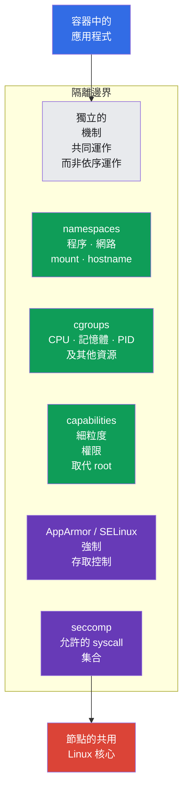
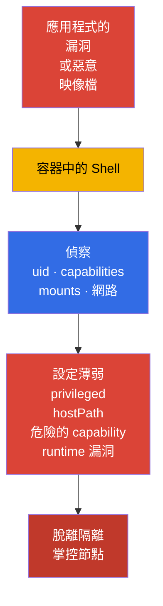
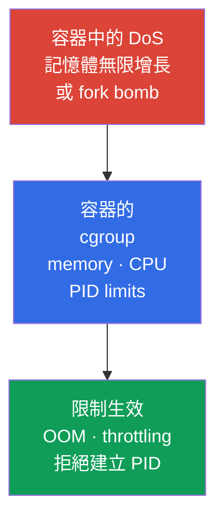
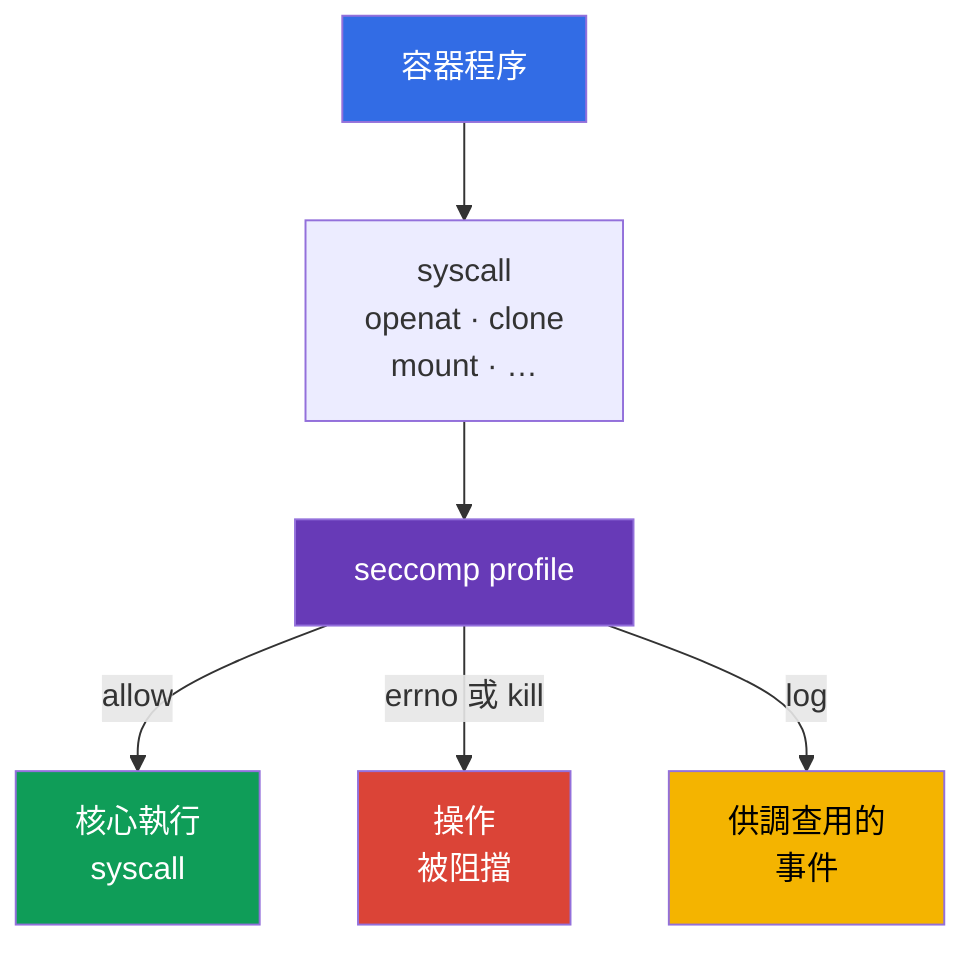
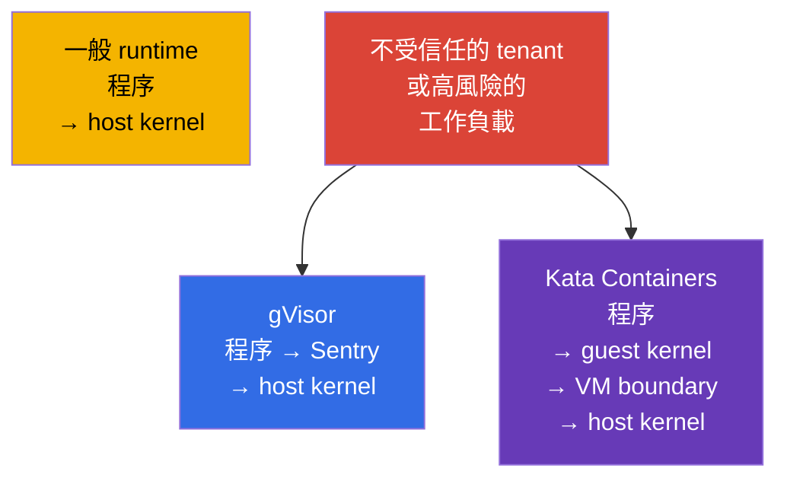

[Русская версия](ru.md) · [Eng version](README.md) · [Versión en español](es.md) · [Version française](fr.md) · [Deutsche Version](de.md) · [ქართული ვერსია](ge.md) · [日本語版](jp.md)

# 第 03 章。Linux 底層安全機制

> **問題。** 容器不是虛擬機器：workload 與節點共用核心，
> 因此在 `privileged`、host namespaces、
> 多餘的 capabilities 或可存取的 mount 之下，Pod 內執行程式碼會變得更危險。理解 Linux 邊界的必要性在於，讓多個
> 隔離機制彼此互補、限制 container escape 的後果，
> 而不是造成存在單一絕對防護的錯誤期待。

> **接下來。** 第 02 章已按層次拆解 Kubernetes 的攻擊面。現在來看 container runtime 用來隔離 Pod 程序的 Linux 機制：namespaces、cgroups、capabilities 以及 syscall 過濾。這是 CKS 的基礎，但不是獨立的考試領域；它說明 System Hardening（10%）與 Minimize Microservice Vulnerabilities（20%）中的限制為何有效，以及它們的邊界在哪裡。

> **來自 CKA 的必要基礎。** 容器、namespaces、cgroups 與 runtime 的基本結構已在 CKA 的[容器](../../../cka/course/00-4-containers/tw.md)、[Linux](../../../cka/course/00-5-linux/tw.md)與 [network namespaces](../../../cka/course/00-7-netns/tw.md) 中說明。本章不重複容器建立與 CKA 基本命令，而是聚焦於安全性質、隔離驗證與繞過隔離的路徑。

> 🧠 容器隔離是多個彼此獨立的 Linux 邊界共同組成的，而不是某個「神奇」設定。

## 03.1. 容器隔離是一組邊界，而不是虛擬機器

一般在 runc/containerd 下執行的 OCI workload，本質上是節點共用核心上的 Linux 程序。它的隔離由多個彼此獨立的機制組成。這不是適用於 sandbox runtime 的絕對公式：Kata 增加了 VM boundary，而 gVisor 明顯改變了程序與核心互動的方式。如果攻擊者在容器中取得程式碼執行能力，他首先會受限於這些邊界。其中一個邊界出現缺陷，不應自動使其他邊界失效：這正是 defense in depth 的核心。



共用核心是容器模型的根本邊界。核心或 container runtime 的漏洞，可能讓容器內的程式碼執行進一步演變成 container escape。因此不能把容器視為適用於不受信任工作負載的完整 security boundary：對這類工作負載要套用多層 hardening，必要時採用第 22 章介紹的 sandboxed runtime。

典型攻擊路徑如下：



工程師的任務，是移除不必要的權限、限制 DoS 的後果，並讓 escape 的嘗試變得可觀察或不可能發生。`securityContext` 欄位是 Kubernetes 對這些機制中一部分的介面，但其基本語法已在 [CKA 關於 SecurityContext 的章節](../../../cka/course/20/tw.md) 中介紹過。

> 🧠 Namespace 改變資源的可見性，但不會將其從節點移除，也不會取消明確授予的存取權。

## 03.2. Linux namespaces：容器看得到什麼、看不到什麼

Namespace 讓程序對核心資源擁有各自獨立的視角。程序並不會從節點上消失，但透過核心 API，它只能看到自己 namespace 中的物件。Kubernetes 與 runtime 會在啟動 Pod sandbox 時建立所需的 namespaces。

**簡要回顧一般 Pod 的啟動流程。** 使用者或 controller 將其規格傳送到 API server，scheduler 選定節點，該節點上的 kubelet 再把 Pod 交給 container runtime。Runtime 建立 pod sandbox（包括所需的 namespaces），然後在其中啟動 Pod 的容器。完整的 Pod 建立流程、pause 容器的角色與 sandbox，已在 [CKA 第 4 章](../../../cka/course/04/tw.md) 中詳細說明。

| Namespace | 隔離的對象 | 容器程序通常看見的內容 | Security 層面的影響 |
|---|---|---|---|
| `PID` | 程序樹與 PID | 自己的 PID 1，以及容器或 Pod 內的程序 | 無法在正常情況下檢視 host 上的程序 |
| `NET` | 網路介面、路由、埠、firewall namespace | `eth0`、自己的 IP，以及 Pod 的路由表 | Pod 的網路不等同於節點的網路 |
| `MNT` | mount points 與檔案系統層級結構 | 映像檔的 rootfs 與已宣告的 volumes | 沒有 mount 就不應能存取 host 的 filesystem |
| `UTS` | hostname 與 domain name | Pod 的 hostname | 不會洩露節點的 hostname |
| `IPC` | shared memory、semaphores、message queues | Pod sandbox 的 IPC 物件 | 無法讀取其他 Pod 或節點的 IPC |
| `USER` | UID/GID mapping 與 capabilities | 對映到 user namespace 中的 UID | 容器內的 UID 0 可以對映為 host 上的非特權 UID |

這個邊界並非絕對。例如，同一個 Pod 內的多個容器通常共用 `NET` namespace，可以透過 `localhost` 互相通訊。`hostNetwork`、`hostPID` 與 `hostIPC` 欄位會停用對應的邊界。對於一般 workload，應透過 Pod Security Admission 或 policy engine 禁止使用這些欄位。

> 🔬 UID/GID mapping、idmapped mounts，以及 `hostUsers: false` 對 kernel/runtime 版本的要求。

### User namespaces：獨立的 UID/GID 對映

User namespace 不會自動啟用。在 Kubernetes 中這是 opt-in：`spec.hostUsers: false` 會為 Pod 請求 user namespace；此功能在 v1.36 已成為 Stable/GA。在考試快照版本 v1.35 中它仍是 Beta，儘管 `UserNamespacesSupport` 預設已啟用，因此這屬於 🔬 Deep Dive / Production，而不是 🎯 CKS Core。

**問題。** 沒有 user namespace 時，一般容器內的 UID 0 就是與節點上 root 相同的數值 UID 0。Namespaces 隱藏了部分 host 資源，但本身並不會改變這種身分對映關係。如果程序取得了超出容器預期邊界的存取權，host 會將其視為 root——應用程式、設定或隔離出現錯誤時，其後果將明顯更嚴重。

**保護效果。** 在 kubelet、container runtime 與節點的共同支援下，容器內的 UID 0 會對映為 host 上的非特權 UID。應用程式仍可以認為自己在 Pod **內部**是 root，但對核心與 host 上的檔案而言，它已經不是 host 的 root。這樣 user namespace 就能縮小遭入侵時的 blast radius，並在容器程序與節點之間再增加一道邊界。

**注意事項。**

- 它不能取代 least privilege、capabilities、seccomp 與 MAC：user namespace 並不會修復核心漏洞，也不會讓 `privileged`、`hostPath` 或 host namespaces 變得安全。
- 節點、runtime、volumes 與 workload 的相容性都是必要條件；下方有一份簡短檢查清單，說明在 rollout 之前具體要檢查哪些項目。
- 對於使用 user namespaces 的 Pod，Pod Security Standards 會放寬 `runAsNonRoot` 與 `runAsUser` 的檢查，因為這類 Pod 內的 root 並不等同於 host 上的特權使用者。但這不會取消應用程式本身的內部規則：如果它本來就不應以 root 執行，這裡仍應要求 `runAsNonRoot`。

```yaml
apiVersion: v1
kind: Pod
metadata:
  name: userns-web
  namespace: demo
spec:
  hostUsers: false
  containers:
  - name: web
    image: nginx:1.30.4
```

在啟用 user namespaces 之前，請在三個地方檢查相容性：

1. **節點。** 需要 Linux **6.3+**：從這個版本起，tmpfs 才支援 idmapped mounts。Filesystem 必須支援 `/var/lib/kubelet/pods` 及所用 volumes 的 idmapped mounts。請在 Pod 可能被排程到的**每一個**節點上執行：

   ```bash
   uname -r
   sudo findmnt -T /var/lib/kubelet/pods \
     -o TARGET,SOURCE,FSTYPE,OPTIONS
   ```

   第一個命令應顯示 6.3 或更新的核心版本；第二個命令顯示的 filesystem，需要對照節點映像對 idmapped mounts 的支援情況來確認。這些命令能找出不合適的節點，但不能取代以 `hostUsers: false` 進行的 canary 部署測試。

2. **Runtime。** 文件記載的最低版本要求為：runc >= 1.2、crun >= 1.9（建議 >= 1.13）、containerd >= 2.0 或 CRI-O >= 1.25。在目標節點上查看 CRI runtime 與 OCI runtime 的版本：

   ```bash
   sudo crictl version
   sudo runc --version 2>/dev/null || sudo crun --version
   ```

   `crictl version` 的輸出中需要留意 `runtimeName` 與 `runtimeVersion`；第二個命令要對照節點實際使用的 runtime 來判讀。不要僅依 `kubectl` 或 Kubernetes API 的版本推斷 runc 的版本。

3. **Workload 與 storage。** User namespaces 會改變 UID/GID 的對映。為了讓檔案類型的 volume 在 Pod 內保有正確的擁有者與權限，kubelet 必須以 idmapped mount 的方式掛載它。`volumeDevices`／raw block volumes 沒有可供這種對映使用的 filesystem，而 Linux 的 NFS client 也不支援所需的 idmapped mounts。如果 workload 使用了這類 volume，kubelet 就無法為 `hostUsers: false` 的 Pod 準備該 volume，Pod 也就無法啟動。

   **一般的 EBS PVC 並未被禁止。** 如果 EBS CSI driver 將 PVC 以 filesystem 形式提供（典型情況：`volumeMode: Filesystem`，並透過 `volumeMounts` 掛載該 volume），只要節點的 filesystem 支援 idmapped mounts，這樣的 Pod 就可以搭配 user namespaces 運作。例如 ext4 與 XFS 在 Linux 6.3+ 上都受支援。但同一個 EBS PVC 若使用 `volumeMode: Block`，並透過 `volumeDevices` 傳給容器，就是 raw block volume，因此不相容。所以請在 rollout **之前**檢查 storage：這能告訴你，究竟該放棄為該 workload 使用 user namespaces，還是先改變 storage 的掛載方式。對於已建立的 test-Pod 或 staging 中類似的 workload，先檢查 raw block devices：

   ```bash
   NS=demo
   POD=userns-web

   kubectl get pod -n "$NS" "$POD" -o json | jq -r '
     (
       .spec.containers[]?,
       .spec.initContainers[]?,
       .spec.ephemeralContainers[]?
     ) as $container
     | $container.volumeDevices[]?
     | "container=\($container.name) raw-block-volume=\(.name)"
   '
   ```

   輸出為空表示未使用 `volumeDevices`。接著檢查直接的 NFS volumes，以及透過 PVC 掛載的 PV：

   ```bash
   kubectl get pod -n "$NS" "$POD" -o json | jq -r '
     .spec.volumes[]? | select(.nfs)
     | "direct NFS volume: \(.name)"
   '

   for pvc in $(kubectl get pod -n "$NS" "$POD" \
     -o jsonpath='{range .spec.volumes[?(@.persistentVolumeClaim)]}{.persistentVolumeClaim.claimName}{"\n"}{end}'); do
     pv=$(kubectl get pvc -n "$NS" "$pvc" \
       -o jsonpath='{.spec.volumeName}')
     kubectl get pv "$pv" -o json | jq -r '
       if .spec.nfs then "NFS PV: \(.metadata.name)"
       elif .spec.csi then "CSI driver: \(.spec.csi.driver)"
       else "PV without direct NFS: \(.metadata.name)"
       end
     '
   done
   ```

   只要出現任何 raw block 或 NFS 的輸出，就表示這個 workload 尚未準備好使用 user namespaces。對於 CSI volume，光是出現 `CSI driver` 這一行本身並不代表相容：必須透過文件與針對具體 CSI driver 的測試來確認。

API 還有一項硬性限制：當 `hostUsers: false` 時，不能同時指定 `hostNetwork: true`、`hostIPC: true` 或 `hostPID: true`。這不是可以忽略的 hardening 設定：Kubernetes 會直接拒絕這樣的 Pod。

在節點上可以用 `lsns` 工具查看 namespaces。這是給節點管理員使用的診斷命令，不是應給予應用程式的命令：

```bash
sudo lsns \
  -t pid \
  -t net \
  -t mnt \
  -t uts \
  -t ipc \
  -t user
sudo crictl ps
CONTAINER_ID="${CONTAINER_ID:?set target container id from crictl ps}"
sudo crictl inspect "$CONTAINER_ID" | jq '.info.pid'
PID=$(sudo crictl inspect "$CONTAINER_ID" | jq -r '.info.pid')
sudo lsns -p "$PID"
```

要驗證容器不在 host PID namespace 中，只需比較容器程序與節點 PID 1 的 namespace inode 即可：

```bash
sudo readlink /proc/1/ns/pid
sudo readlink /proc/"$PID"/ns/pid
# 對於一般的 Pod，這兩個值應該不同。
```

在 Pod 內部，以下是有用且安全的初步診斷：

```bash
kubectl exec -n demo deploy/web -- sh -c '
  echo "hostname: $(hostname)"
  echo "pid namespace: $(readlink /proc/1/ns/pid)"
  echo "network namespace: $(readlink /proc/1/ns/net)"
  ps -ef
  ip route
'
```

不要混淆容器的 PID 1 與 host 的 PID 1。PID namespace 隱藏了程序，但不會取消明確授予的存取權：`hostPath` 掛載 `/proc`、`privileged: true` 或 `hostPID: true` 會改變威脅模型。要診斷這類欄位，可以使用：

```bash
kubectl get pod -A -o jsonpath='{range .items[*]}{.metadata.namespace}{"/"}{.metadata.name}{" hostPID="}{.spec.hostPID}{" hostNetwork="}{.spec.hostNetwork}{" hostIPC="}{.spec.hostIPC}{"\n"}{end}'
```

> 🧠 Namespace 限制可見性，cgroup 限制消耗；`limits` 建立資源上限，而 `requests` 協助排程。

## 03.3. cgroups：作為 DoS 防護的資源上限

如果說 namespace 回答的是「程序看得到什麼」，那 cgroup 回答的就是「它能消耗多少資源」。Container runtime 會把容器程序放入 cgroup，而 kubelet 會套用 Pod 規格中的 limits 與 requests。

沒有 memory limit 時，程序可能佔用節點的記憶體，引發 memory pressure、其他 Pod 被 evict，或觸發 kernel OOM。沒有 PID limit 時，fork bomb 可能耗盡 PID table。CPU request 參與 scheduling 與 CPU 分配，而 CPU limit 則透過 throttling 設定硬性上限；CPU limit 設得過低，即使 CPU 仍有餘裕，也可能惡化 latency。因此 memory/PID limits 為 DoS 提供了更直接的邊界，而 CPU limit 則需要依工作負載特性審慎選擇。這關係到叢集的可用性，因此是一個 security 情境，而不僅僅是效能問題。



以下是能處理少量 HTTP 流量的程序所需限制的最小範例：

```yaml
apiVersion: v1
kind: Pod
metadata:
  name: bounded-web
  namespace: demo
spec:
  containers:
  - name: web
    image: nginx:1.30.4
    resources:
      requests:
        cpu: 100m
        memory: 128Mi
      limits:
        cpu: 500m
        memory: 256Mi
```

> 🔬 Pod 層級的 `spec.resources` 是 Kubernetes v1.34 的 beta 功能，用於為容器設定共用的 resource budget。

### Pod-Level Resources：Pod 的共用邊界

**Pod-Level Resources** 自 Kubernetes v1.34 起進入 Beta，並預設啟用。透過 `spec.resources` 可以為 Pod 的 CPU、memory 與 hugepages 設定共用的 `requests` 與 `limits`：這是整個 Pod 的 aggregate budget，而不是取代容器個別的資源設定。Aggregate Pod limit 是 Pod 內容器的真正共用邊界；container-level limits 仍是每個容器各自獨立的上限。

```yaml
apiVersion: v1
kind: Pod
metadata:
  name: pod-budget-web
  namespace: demo
spec:
  resources:
    requests:
      cpu: "500m"
      memory: 128Mi
    limits:
      cpu: "1"
      memory: 256Mi
  containers:
  - name: app
    image: nginx:1.30.4
```

將此範例存成 `pod-budget-web.yaml`，並具體檢查 `spec.resources` 中的共用 budget：

```bash
kubectl apply -f pod-budget-web.yaml
kubectl wait -n demo --for=condition=Ready pod/pod-budget-web --timeout=120s
kubectl get pod -n demo pod-budget-web \
  -o jsonpath='{.spec.resources}{"\n"}'
kubectl describe pod -n demo pod-budget-web
```

在 cgroup v2 中，限制可透過 `memory.max`、`cpu.max` 與 `pids.max` 檔案查看；特定程序所在的 cgroup 位置，可從 `/proc/<pid>/cgroup` 得知：

```bash
sudo cat /proc/"$PID"/cgroup
CGROUP=$(awk -F: '$1 == "0" {print $3}' /proc/"$PID"/cgroup)
sudo cat "/sys/fs/cgroup${CGROUP}/memory.max"
sudo cat "/sys/fs/cgroup${CGROUP}/cpu.max"
sudo cat "/sys/fs/cgroup${CGROUP}/pids.max"
```

在使用 cgroup v1 的舊節點上，controller 位於各自獨立的 mount points，因此不要在未經確認的情況下直接套用 cgroup v2 的路徑。請先判斷目前的模式：

```bash
stat -fc %T /sys/fs/cgroup
# cgroup2fs 表示 cgroup v2。
```

請分別記住以下這些邊界：

- **workload 內部：`requests` 與 `limits`。** `requests` 影響 scheduler 與 QoS，但本身並不會阻止一個貪婪的程序。真正的硬性邊界由 `limits` 設定：對 CPU 而言，這是透過可能的 throttling 形成的 ceiling，因此 CPU limit 不應隨意設得過低。
- **namespace 層級：`ResourceQuota` 與 `LimitRange`。** 單一 Pod 的資源設定並不能保護 namespace 免於總體消耗過高。`ResourceQuota` 限制該 namespace 的總體預算，而 `LimitRange` 則為每個 workload 設定 defaults 與允許的邊界範圍。兩者合在一起，可避免某個團隊用不完整的 manifest 擠占其他人的資源。
- **PID：limit 由節點管理員設定。** 在一般 Pod 的 YAML 中，無法指定「這個 workload 只允許 N 個程序」。管理員需改為設定 kubelet 的 `podPidsLimit` 參數——即這個節點上**每個 Pod**允許的最大 PID 數量。Kubelet 透過 PID cgroup 套用這項限制。因此驗證分兩步：先在 kubelet 設定中查找 `podPidsLimit`，再檢查已執行 Pod 的 cgroup 中的 `pids.max`。
- **在 memory pressure 時：cgroup 中的 OOM。** 核心可能在對應的 cgroup 範圍內終止容器程序。如果被終止的是主程序，kubelet 會依 `restartPolicy` 重新啟動容器。
- **安全地驗證。** 不要在 production 節點上，透過刻意觸發 OOM 來證明 memory limit 有效。

> 🎯 移除 `privileged`、host namespaces、多餘的 capabilities 及 `allowPrivilegeEscalation: true`；設定 `capabilities.drop: [ALL]`、`RuntimeDefault` 及所需的 MAC 設定檔。

## 03.4. Linux capabilities：把 root 拆分開來

UID 0 並不是特權的唯一標誌。Linux 核心把 root 的部分權限拆分成 capabilities。一個程序擁有多組 capabilities，包括 permitted、effective、inheritable、bounding 與 ambient。只檢查 `id` 並不能證明程序是安全的。

有些 capabilities 對一般應用程式而言特別危險：

| Capability | 風險 | 授予的常見原因 |
|---|---|---|
| `CAP_SYS_ADMIN` | 涵蓋大量管理性操作、mount 與 namespace 操作；escape 鏈的常見組成部分 | 一般業務應用程式幾乎不需要 |
| `CAP_SYS_MODULE` | 載入與卸載 kernel modules | 節點的系統元件，而非 pod 應用程式 |
| `CAP_SYS_PTRACE` | 追蹤並讀取相容程序的記憶體 | 範圍狹窄的診斷工具 |
| `CAP_NET_ADMIN` | 修改網路介面、路由與 firewall | CNI 與網路代理程式 |
| `CAP_DAC_OVERRIDE` | 繞過檔案的 DAC 檢查 | 沒有明確理由不應授予 workload |
| `CAP_SETUID` / `CAP_SETGID` | 變更 UID/GID | 特殊的 bootstrap 情境，而非應用程式的穩定執行狀態 |
| `CAP_BPF` / `CAP_PERFMON` | 操作 BPF 與核心效能相關機制 | 具有獨立信任模型的節點可觀測性用途 |

在節點上查看檔案與程序的 capabilities：

```bash
sudo getcap -r /usr/local/bin 2>/dev/null
sudo capsh --print
sudo getpcaps "$PID"
```

`getcap` 顯示 executable 在啟動時取得的 file capabilities。`getpcaps "$PID"` 顯示指定程序的 capabilities；`capsh --print` 若不帶參數，顯示的是目前 shell 的狀態，而不是先前找到的 container PID。這些命令需要節點層級對其他程序的權限；這是預期行為，本身也是一種保護。

在新增 `NET_BIND_SERVICE` 之前，請先檢查目標 Pod network namespace 中 `net.ipv4.ip_unprivileged_port_start` 的值。如果門檻值為 `0`，代表非特權程序已可以監聽低編號的埠，因此不需要這個 capability：

```bash
kubectl exec -n demo <pod> -- cat /proc/sys/net/ipv4/ip_unprivileged_port_start
```

對一般的非特權容器而言，`allowPrivilegeEscalation: false` 會為該程序設定 Linux 的 `no_new_privs`：`exec` 之後產生的子程序，不應透過 setuid/setgid 位元或 file capabilities 取得新的權限。

Kubernetes 有一個重要例外：如果容器以 `privileged: true` 執行，或擁有 `CAP_SYS_ADMIN`，`allowPrivilegeEscalation` 實際上永遠是 `true`。因此請先移除 `privileged` 與過多的 capabilities；`allowPrivilegeEscalation: false` 只是額外的一道邊界，不是讓這類容器變安全的方法。

在 `allowPrivilegeEscalation: true`（預設值）的情況下，Kubernetes 不會設定 `no_new_privs`。`true` 本身並不會授予 capability，也不會使容器變成 privileged，但它保留了一條提升權限的路徑：遭入侵的非特權程序，可以執行映像檔中帶有 setuid/setgid 或 capabilities 的程式或檔案，並取得該檔案所提供的 UID/GID 或 capability。這樣一來，以應用程式使用者身分發生的 RCE，就可能在**容器內部**變成 root 或擁有額外 capabilities 的程序，擴大攻擊後果與可能的 escape 鏈。如果應用程式不需要這種 exec，設為 `false` 會更安全。

這是一道重要但並非唯一的邊界；它不能取代 drop capabilities、seccomp 與 MAC。在 Kubernetes 中，安全的起點是移除所有 capability，只在有記載的必要情況下才新增一個。只有在 sysctl 設定與應用程式需求都確認的情況下，legacy 應用程式才可能因為 TCP 80 而需要 `NET_BIND_SERVICE`：

```yaml
apiVersion: v1
kind: Pod
metadata:
  name: capability-example
  namespace: demo
spec:
  containers:
  - name: web
    image: nginx:1.30.4
    securityContext:
      allowPrivilegeEscalation: false
      capabilities:
        drop:
        - ALL
        add:
        - NET_BIND_SERVICE
```

檢查實際生效的設定與程序狀態：

```bash
kubectl apply -f capability-example.yaml
kubectl get pod -n demo capability-example \
  -o jsonpath='{.spec.containers[0].securityContext.capabilities}{"\n"}'
kubectl exec -n demo capability-example -- sh -c 'grep Cap /proc/1/status'
```

`/proc/1/status` 中的 `CapEff` 值以十六進位遮罩編碼。要取得人類可讀的解析結果，可在節點或已受信任安裝該工具的診斷映像檔中使用 `capsh --decode=<值>`：

```bash
capsh --decode=0000000000000400
# 範例：0x400 對應 cap_net_bind_service。
```

`privileged: true` 不能取代 capabilities 的設定。這類容器會取得所有 Linux capabilities，而一般的 seccomp、AppArmor 與 SELinux 限制對它來說會被移除或忽略。對 CKS 而言，這是一個危險信號：先移除 `privileged`，再逐一評估每個 capability 的必要性。

## 03.5. Syscalls 與 seccomp：縮減可用的核心 API

使用者程序的任何操作，最終都透過 syscall 進入核心：開啟檔案、建立 socket、分配記憶體、變更 namespace。即使應用程式本身不需要某個危險操作，受漏洞影響的程序仍可能嘗試呼叫對應的 syscall。seccomp 讓核心可以根據 syscall 規則，允許、拒絕、記錄或終止程序。



seccomp 不決定誰能存取 Kubernetes API，也不會修復不安全的映像檔。它是遭入侵程序與核心 API 之間的最後一道過濾器。搭配 `capabilities.drop: [ALL]`、`allowPrivilegeEscalation: false` 與 MAC 設定檔一起使用時特別有效。

如果沒有設定 `seccompProfile`，Pod 可能維持 `Unconfined`。例外是節點上的 kubelet 已啟用 `seccompDefault: true`：此時缺少設定檔會得到 `RuntimeDefault`。不要把這視為叢集通用的屬性——應確認節點設定，並明確為 workload 指定設定檔。

對大多數 workload 而言，請以 runtime 設定檔作為起點，而不是使用 `Unconfined`：

```yaml
apiVersion: v1
kind: Pod
metadata:
  name: runtime-default
  namespace: demo
spec:
  securityContext:
    seccompProfile:
      type: RuntimeDefault
  containers:
  - name: app
    image: nginx:1.30.4
```

請具體檢查 Pod 規格本身，而不是假設 runtime 的預設值：

```bash
kubectl apply -f runtime-default.yaml
kubectl get pod -n demo runtime-default \
  -o jsonpath='{.spec.securityContext.seccompProfile.type}{"\n"}'
kubectl describe pod -n demo runtime-default
```

自訂設定檔適用於已測量並可重現的 syscall 集合。它需要存放在每個可能啟動該 Pod 的節點上，位於 kubelet 的 `seccomp` profiles 目錄中。路徑錯誤，或所選節點上缺少該設定檔，都會導致 Pod 啟動失敗。設定檔的完整格式、audit 模式，以及 `Localhost` 的套用方式，將在第 17 章詳細說明；不要盲目建立 deny-list，否則應用程式更新可能在 production 中中斷。

要在隔離的 test 節點上診斷 syscall 行為，可使用 `strace`：

```bash
sudo strace -f -p "$PID" -e trace=%file,%network
# 不要在高負載的 production 程序上長時間執行 strace。
```

## 03.6. MAC：AppArmor 與 SELinux 補足 DAC

一般 Linux DAC 檢查的是檔案的 UID、GID 與 mode bits。在 DAC（Discretionary Access Control，選擇性存取控制）模型中，物件的擁有者可以透過例如 `chmod` 來變更 mode bits，藉此在 DAC 模型範圍內授予或撤回存取權。在 Linux 中，變更檔案的 UID 擁有者需要 `CAP_CHOWN`；非特權的擁有者只能把檔案的群組，變更為自己所屬的群組。擁有足夠 UID/GID 或 capabilities 的程序，可以通過或繞過部分一般的 DAC 檢查。

**Mandatory Access Control（MAC，強制存取控制）**會加上第二層核心強制執行的檢查。管理員載入 policy，核心會將程序對映到其 profile/label，並檢查該程序是否被允許對檔案、socket 或其他物件執行特定操作。即使 DAC 已經允許存取，MAC 仍可能拒絕；程序本身無法移除或削弱 policy。其目的是限制遭入侵程序的行動範圍：例如，一個 web 伺服器不應僅因為取得了額外的 UID、capability 或檔案存取權，就能讀取 SSH 金鑰或修改系統檔案。因此 MAC 是對 DAC、capabilities 與 seccomp 的補充，而不是取代。

| 機制 | 主要模型 | 常見於 | 需要檢查的項目 |
|---|---|---|---|
| AppArmor | profile-based，依檔案路徑與操作 | Ubuntu、Debian 及部分 managed 節點 | `aa-status`、已載入的 profile、audit log 中的 `DENIED` |
| SELinux | labels 與 type enforcement | RHEL、Fedora、OpenShift 及相容作業系統 | `getenforce`、labels、audit log 中的 AVC denial |

兩種機制解決的是同一個問題，但設定檔與操作方式並不能互相替代。不能把 AppArmor 設定檔複製到 SELinux 節點上，並期望它生效。在設計 policy 之前，先確認節點映像檔上實際啟用的是什麼：

```bash
sudo aa-status || true
getenforce 2>/dev/null || true
sudo journalctl -k --since '10 minutes ago' | grep -Ei 'apparmor|avc|denied' || true
```

在 Kubernetes 中，目前的 AppArmor 介面是 `securityContext.appArmorProfile`。以下是 runtime profile 的範例：

```yaml
securityContext:
  appArmorProfile:
    type: RuntimeDefault
```

`RuntimeDefault` 要求節點上的 container runtime 提供相容的 default profile；請在實際的 node pool 上確認這一點，而不是只看 YAML。若使用 `Localhost`，設定檔必須事先載入目標節點，並透過 `localhostProfile` 指定。這是 node-local 的相依性：scheduler 不會在節點之間搬移設定檔。因此在 production 中，設定檔要透過配置管理工具部署，在每個 node pool 上確認，並限制 Pod 的排程範圍。設定檔的實作方式與 `DENIED` 的分析將在第 16 章說明。

對於 SELinux，label 相關參數只能依照節點映像檔的 policy，透過 `securityContext.seLinuxOptions` 設定。發生拒絕時，應先分析 AVC denial，而不是直接停用 SELinux。Volumes 與 filesystem 上的檔案必須有正確的 SELinux labels；請特別仔細檢查 hostPath、persistent volumes 與共用的可寫入 volumes。

> 🧠 容器與節點共用核心；sandboxed runtime 為不受信任或高風險的工作負載增加額外的隔離。

## 03.7. 隔離邊界、sandboxed runtime 與 escape 風險診斷

namespaces、cgroups、capabilities、seccomp 與 MAC 都運作在同一個核心之內。如果風險特性要求 tenant 之間有更強的邊界，就應使用 sandboxed runtime。gVisor 在 user space 攔截了相當大部分的 syscalls，而 Kata Containers 則在輕量 VM 中執行 workload。這降低了直接利用節點核心的可能性，代價是相容性、latency 與維運複雜度。



Sandbox 並不會取消其他措施。即使在 gVisor 或 Kata 中，workload 也不應取得 `privileged`、host namespaces、Docker socket 或過於寬鬆的 RBAC 權限。應先套用 least privilege，再依威脅模型選擇 RuntimeClass。`runsc` 的安裝、`RuntimeClass` 與在相容節點上的排程，將在第 22 章說明。

> 🔬 以 forensic 方式，將宣告式的 Pod 與節點上的 PID、namespaces 及 cgroup 對應起來。

可疑 Pod 的實務調查清單：

```bash
NAMESPACE="${NAMESPACE:?set target namespace}"
POD="${POD:?set target pod name}"

# 1. 找出明確繞過 namespaces 的設定與 privileged 模式。
kubectl get pod -n "$NAMESPACE" "$POD" -o yaml | \
  grep -E 'privileged:|hostPID:|hostIPC:|hostNetwork:|hostPath:|allowPrivilegeEscalation:'

# 2. 查看已宣告的 Pod-level 與 container-level securityContext，
#    以及 volumes。這只是宣告式的設定，不能證明
#    實際生效的 runtime/kernel settings。
kubectl get pod -n "$NAMESPACE" "$POD" -o json | jq '
{
  podSecurityContext: .spec.securityContext,
  containers: [
    (
      .spec.containers[]?,
      .spec.initContainers[]?,
      .spec.ephemeralContainers[]?
    )
    | {
        name: .name,
        securityContext: .securityContext
      }
  ],
  volumes: .spec.volumes
}
'

# 3. 在節點上找出 Pod sandbox，再找出 container 及其 namespace/cgroup。
#    `crictl ps --name` 過濾的是容器名稱，不是 Pod 名稱。
sudo crictl pods \
  --name "^${POD}$" \
  --namespace "^${NAMESPACE}$"
POD_ID="${POD_ID:?set target pod sandbox id from crictl pods}"
sudo crictl ps --pod "$POD_ID"
CONTAINER_ID="${CONTAINER_ID:?set target container id from crictl ps}"
sudo crictl inspect "$CONTAINER_ID" | jq '.info.pid'
PID="$(sudo crictl inspect "$CONTAINER_ID" | jq -r '.info.pid')"
PID="${PID:?failed to get pid from crictl inspect}"
sudo lsns -p "$PID"
sudo cat "/proc/$PID/cgroup"
```

常見錯誤：

- 認為容器內的 UID 0 自動等於節點上的 root。User mapping 與其他邊界可能限制它，但這對應用程式 workload 而言仍是一個糟糕的起點。
- 認為 namespace 本身已是足夠的防護。`hostPath`、host namespaces、`privileged` 與核心 CVE 都會改變結果。
- 為了修補某個症狀而新增 `CAP_SYS_ADMIN`。應先弄清楚實際需要的操作，改用範圍更小的 capability 或改變設計方式。
- 因為應用程式「通常」消耗不多，就讓 Pod 沒有 `limits`。只要一個缺陷或一次惡意請求，就足以造成 DoS。
- 在沒有經過應用程式測試、也沒有把設定檔部署到所有目標節點的情況下，啟用自訂 seccomp profile。
- 套用 AppArmor profile，卻沒有確認該設定檔已載入到 scheduler 實際啟動 Pod 的那個節點上。

> 🏭 workload 範本、admission policy、node pool 的區隔，以及對失敗事件的觀察，共同鞏固安全的 baseline 與例外情況。

## 03.8. 生產環境中的實際做法

- **把限制內建到 workload 範本中。** 基礎的 Helm chart 或 platform template 會設定 `resources.limits`、`allowPrivilegeEscalation: false`、`capabilities.drop: [ALL]`、`seccompProfile: RuntimeDefault` 及 non-root 執行。團隊只有在有正當理由時，才能偏離範本。
- **禁止危險的 policy 繞過方式。** `restricted` 層級的 Pod Security Admission，或 Kyverno/Gatekeeper，不允許 `privileged`、host namespaces、不安全的 capabilities 及缺少 seccomp 的情況。policy 的細節將在第 19 章與第 20 章說明。
- **依信任程度區隔 node pools。** 真正需要 `NET_ADMIN` 或 host mounts 的 CNI、CSI 與 node agents，與業務工作負載分開運作。對於 multi-tenancy，則透過 `RuntimeClass` 選擇 gVisor 或 Kata。
- **觀察失敗事件，而不是關閉防護。** AppArmor/SELinux denial、seccomp error、OOMKilled 與 PID exhaustion 都會進入日誌與指標系統。應透過修改應用程式、可寫入的 volume 或縮小 policy 範圍來排除根本原因，而不是回退到 `privileged: true`。
- **檢查節點的實際狀態。** Kubernetes manifest 描述的是期望狀態，但 AppArmor 的 profile、SELinux 的模式、cgroup 模式與 runtime 設定，都存在於節點上。這些需要在 image pipeline 與定期的 hardening 稽核中檢查。

## 03.9. 迷你詞彙表

- **namespace** - 針對一群程序、對核心資源的隔離視角。
- **PID namespace** - 對程序清單與 PID 的隔離。
- **network namespace** - 對網路介面、路由與網路堆疊的隔離。
- **cgroup** - 一組具有資源限制與計量的程序集合。
- **capability** - 從 root 權限中拆分出來的單一 Linux 特權。
- **CAP_SYS_ADMIN** - 範圍過於寬泛的 capability，對一般工作負載而言很危險。
- **syscall** - 程序用以呼叫核心的系統呼叫。
- **seccomp** - 核心套用在程序上的 syscall 過濾器。
- **MAC** - Mandatory Access Control，凌駕於 UID/GID 與 mode bits 之上的強制性存取 policy。
- **AppArmor** - Linux 上以 profile 為基礎的 MAC。
- **SELinux** - 以 label 為基礎、具備 type enforcement 的 MAC。
- **container escape** - 脫離預期的容器隔離，取得節點或其他 tenant 的資源。
- **sandboxed runtime** - 具備強化隔離邊界的 runtime，例如 gVisor 或 Kata Containers。

## 03.10. 本章總結

- 容器使用節點共用的核心；它的防護是由多個 Linux 機制共同組成的，而不是單一個「沙盒」。
- `PID`、`NET`、`MNT`、`UTS`、`IPC` 與 `USER` namespaces 限制了資源的可見性，但 host namespaces、`hostPath` 與 `privileged` 都可能繞過這個邊界。User namespace 需要透過 `spec.hostUsers: false` 另外啟用，並要求節點與 runtime 的支援。
- cgroups 限制 CPU、memory 與 PID，保護節點與相鄰的 workload 免受 DoS 影響；PID limit 由 kubelet 透過 `podPidsLimit` 設定，cgroup OOM 可能終止程序並導致容器重新啟動。
- Capabilities 把 root 權限拆分開來。安全的 baseline 是移除 `ALL`，並在確認 sysctl 設定與實際需求後，只還原有記載必要性的最小 capability。
- 搭配 `RuntimeDefault` 的 seccomp，會縮減程序可用的核心 API；若未明確指定設定檔，且節點未啟用 `seccompDefault`，Pod 就可能是 `Unconfined`。
- AppArmor 與 SELinux 以強制性 policy 補足一般的檔案權限；對它們而言，runtime/node profile、AVC 與 volumes 的 labels 都很重要。對於高度不受信任的工作負載，還可以考慮 gVisor 或 Kata。

## 03.11. 如何在考試與實際工作中發揮作用

**在考試中。** 本章為 CKS 題目提供了一套模型，用於解釋或修復 `capabilities`、seccomp、AppArmor、`privileged`、host namespaces 及缺少 limits 的情況。不要只檢查 YAML：可以使用 `kubectl get ... -o jsonpath`、`kubectl exec`，若透過 SSH 存取，則可使用 `crictl`、`lsns`、`aa-status` 及 `/proc/<pid>/cgroup`。實作方面的延伸內容是 Lab 106 與第 16-17 章。

**在實際工作中。** 理解底層機制有助於分辨安全的例外情況與危險的繞過方式。如果應用程式要求 `privileged` 或 `CAP_SYS_ADMIN`，這正是應該檢視其呼叫方式、mounts 與架構的時機。如果 Pod 因 OOMKilled 或 profile denial 而故障，這是一個可觀察的訊號，指向需要針對性的修正，而不是關閉全部 hardening 的理由。

## 03.12. 自我檢測問題

<details>
<summary>1. 為什麼容器不等同於虛擬機器？節點共用核心扮演什麼角色？</summary>

一般在 runc/containerd 下執行的 OCI workload，是與節點共用核心的 Linux 程序，而不是獨立的 VM。Namespaces、cgroups、capabilities、MAC 與 seccomp 建立了多道邊界，但核心或 runtime 的漏洞，可能讓容器內的程式碼執行演變成 container escape。
</details>

<details>
<summary>2. 哪些 namespaces 分隔了程序、網路與 mount points？哪些 Pod 欄位可能移除這些邊界？</summary>

`PID` namespace 隔離程序樹，`NET` 隔離網路介面、路由與埠，而 `MNT` 則隔離 mount points 與檔案系統層級結構。`hostPID`、`hostNetwork` 與 `hostIPC` 欄位會停用對應的邊界；`hostPath` 與 `privileged: true` 同樣會改變對節點資源的存取模型。
</details>

<details>
<summary>3. 在保護節點免受 DoS 的情境中，`requests` 與 `limits` 有何不同？</summary>

`requests` 影響 scheduling 與 QoS，但本身並不會阻止一個貪婪的程序。真正的硬性邊界由 `limits` 設定：memory limit 限制 memory pressure/OOM 的後果，CPU limit 則透過 throttling 提供 ceiling；PID limit 由 kubelet 透過 `podPidsLimit` 參數設定。
</details>

<details>
<summary>4. 為什麼不能為了修復應用程式的任意錯誤，就授予 `CAP_SYS_ADMIN`？</summary>

`CAP_SYS_ADMIN` 授予範圍廣泛的管理性操作，包括 mount 與 namespace 操作，而且經常是 escape 鏈的一部分。與其修補症狀，應先確定實際需要的操作，移除 `ALL` capabilities，只在有記載必要性時，還原一個範圍狹窄的 capability。
</details>

<details>
<summary>5. 哪些命令有助於將容器對應到 host 的 PID、namespaces 與 cgroup？</summary>

在節點上先使用 `sudo crictl ps`，再用 `sudo crictl inspect "$CONTAINER_ID" | jq '.info.pid'` 取得容器的 PID。驗證時可使用 `sudo lsns -p "$PID"` 與 `sudo cat "/proc/$PID/cgroup"`；PID namespace 的 inode 可透過 `readlink /proc/1/ns/pid` 與 `readlink /proc/"$PID"/ns/pid` 比較。
</details>

<details>
<summary>6. seccomp 如何補足 capabilities？為什麼對一般 workload 而言，`RuntimeDefault` 優於 `Unconfined`？</summary>

Capabilities 限制的是個別特權，而 seccomp 則在 syscall 層級過濾程序可用的核心 API。明確設定的 `RuntimeDefault`，會為一般工作負載縮減這個集合；反之，如果沒有設定檔，且節點未啟用 `seccompDefault`，Pod 就可能維持 `Unconfined`。
</details>

<details>
<summary>7. AppArmor 與 SELinux 在操作上有什麼差異？</summary>

AppArmor 依路徑與操作使用 profile-based policy，常見於 Ubuntu/Debian；SELinux 則在 RHEL/Fedora/OpenShift 上採用 labels 與 type enforcement。它們的設定檔不能互相替代：設定前應檢查 `aa-status` 或 `getenforce`，並分析 AppArmor 的 `DENIED` 或 SELinux 的 AVC denial，而不是直接停用 MAC。
</details>

<details>
<summary>8. 什麼時候僅靠容器隔離還不夠？為什麼需要 sandboxed runtime？</summary>

對於不受信任的 tenant 或高風險的工作負載，與節點共用的 kernel boundary 可能不夠充分。gVisor 在 user space 攔截了相當大部分的 syscalls，而 Kata 則在輕量 VM 中執行 workload，藉此降低直接利用核心的風險，代價是相容性、latency 與維運複雜度。
</details>

## 練習

🧪 [Lab 106 - AppArmor + seccomp](../../labs/106/README_TW.MD) 將這些機制與節點上實際運作的設定檔結合，並驗證 Pod 中的操作是否被阻擋。在此之前，請先研讀 [第 16 章](../16/tw.md) 的 AppArmor，以及 [第 17 章](../17/tw.md) 的 seccomp；若要加強隔離，可繼續閱讀 [第 22 章](../22/tw.md) 的 sandboxed containers。

🌐 額外的互動練習（killer.sh/killercoda，外部資源）：[container-namespaces-docker](https://killercoda.com/killer-shell-cks/scenario/container-namespaces-docker) · [container-namespaces-podman](https://killercoda.com/killer-shell-cks/scenario/container-namespaces-podman)

## 參考資料

- [Kubernetes：Linux 核心安全限制](https://kubernetes.io/docs/concepts/security/linux-kernel-security-constraints/)
- [Kubernetes：User Namespaces](https://kubernetes.io/docs/concepts/workloads/pods/user-namespaces/)

---
[目錄](../README_TW.md) · [第 02 章](../02/tw.md) · [第 04 章](../04/tw.md)
