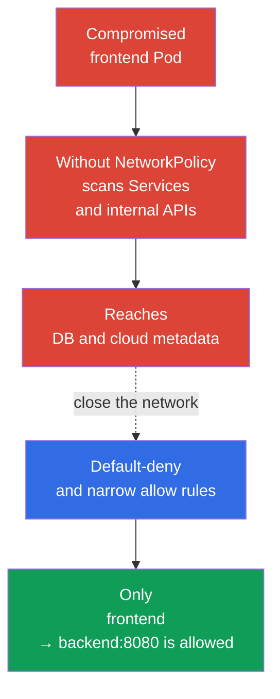
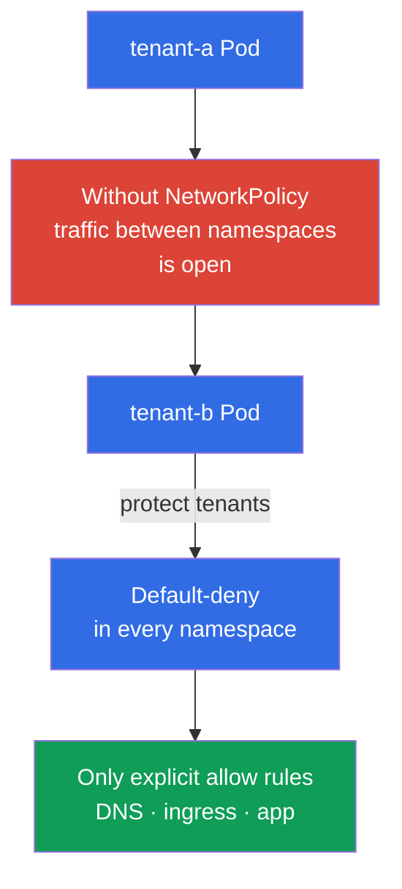

[Русская версия](ru.md) · [Versión en español](es.md) · [Version française](fr.md) · [Deutsche Version](de.md) · [ქართული ვერსია](ge.md) · [繁體中文版](tw.md) · [日本語版](jp.md)

# Chapter 04. NetworkPolicy for security

> **The problem.** RCE in a single Pod gives an attacker a foothold, and a flat pod network often lets them scan services, access DBs, internal APIs, and cloud metadata from it. This is lateral movement: compromising one application becomes an entry point to other systems.

> **What comes next.** In the previous chapters, we covered the threat model and Linux isolation mechanisms. Now we will narrow the network paths available to a compromised Pod. **NetworkPolicy** turns a flat pod network into a set of explicitly allowed connections. This is the Cluster Setup (15%) CKS domain.

> **What you need from CKA.** Basic `NetworkPolicy` syntax, selectors, and the Pod network model are covered in [CKA Chapter 34](../../../cka/course/34/README.md). The pod network architecture and CNI role are covered in [CKA Chapter 30](../../../cka/course/30/README.md). Here we consider these mechanisms as security controls rather than repeat their basics.

> 🧠 `NetworkPolicy` turns a flat network into a minimal set of paths between workloads.

## 04.1. Attack scenario: a compromised Pod in a flat network

Without policies, most CNIs allow traffic between all Pods, and often their outbound traffic as well. If an attacker gains command execution in `frontend`, they can scan Service addresses, connect to databases, request internal HTTP APIs, and attempt to obtain cloud metadata. This movement after initial access is called **lateral movement**.



`NetworkPolicy` applies to Pods by labels, not to a Service. A Service remains a convenient DNS destination, but the CNI makes its decision based on the source and destination Pod, IP, port, and policy rules. A policy does not replace RBAC, TLS, or a security group: it is one layer of defense in depth.

> 🎯 Apply default-deny for the needed direction, then narrow allow rules by labels, namespace, and port; allow DNS and required cross-namespace paths separately.

## 04.2. Default-deny: close first, then allow

The secure starting point for a namespace is to deny all ingress and egress. A policy with an empty `podSelector` selects every Pod in the namespace. Empty `ingress` and `egress` lists mean that no directions are allowed.

```yaml
apiVersion: networking.k8s.io/v1
kind: NetworkPolicy
metadata:
  name: default-deny-ingress
  namespace: payments
spec:
  podSelector: {}
  policyTypes:
  - Ingress
---
apiVersion: networking.k8s.io/v1
kind: NetworkPolicy
metadata:
  name: default-deny-egress
  namespace: payments
spec:
  podSelector: {}
  policyTypes:
  - Egress
```

Both directions can be declared in one policy:

```yaml
apiVersion: networking.k8s.io/v1
kind: NetworkPolicy
metadata:
  name: default-deny
  namespace: payments
spec:
  podSelector: {}
  policyTypes:
  - Ingress
  - Egress
```

Order matters operationally: first identify the map of allowed connections and prepare allow policies, then apply default-deny and the required permissions immediately in a controlled rollout. Otherwise, applications will lose DNS, access to dependencies, ingress/monitoring traffic, or an external API. Ordinary kubelet liveness/readiness/startup probes between a Pod and its node are not typical traffic blocked by default-deny in the standard NetworkPolicy model; nevertheless, check host/CNI specifics in your environment. For a new isolated namespace, it is useful to create the deny policies before launching workload Pods.

Policies are additive: Kubernetes has no `deny`/`allow` order or priority between `NetworkPolicy` objects. For each `Pod` and each direction, the allow rules of all applicable policies are combined separately. For a `source Pod → destination Pod` connection, both sides are checked independently: if the source `Pod` is isolated for `Egress`, its egress rules must allow the destination; if the destination `Pod` is isolated for `Ingress`, its ingress rules must allow the source. When both sides are isolated, both permissions are required. Reply traffic for an allowed connection does not require a separate reverse rule: it is implicitly allowed. A direction for which a `Pod` is not isolated by any applicable `NetworkPolicy` does not require an additional allow rule.

| Policy | What it isolates | When to apply it |
|---|---|---|
| `Ingress` only | Incoming traffic to selected Pods | When outbound connections cannot yet be restricted |
| `Egress` only | Outbound traffic from selected Pods | To protect metadata, external APIs, and against exfiltration |
| `Ingress` and `Egress` | Both directions | The normal goal for a sensitive namespace |

## 04.3. Narrow permissions: selector, IP, and port

After default-deny, describe only the required connections. The following example allows a Pod with `app: frontend` to connect to a Pod with `app: backend` over TCP 8080 in the same namespace:

```yaml
apiVersion: networking.k8s.io/v1
kind: NetworkPolicy
metadata:
  name: allow-frontend-to-backend
  namespace: payments
spec:
  podSelector:
    matchLabels:
      app: backend
  policyTypes:
  - Ingress
  ingress:
  - from:
    - podSelector:
        matchLabels:
          app: frontend
    ports:
    - protocol: TCP
      port: 8080
---
apiVersion: networking.k8s.io/v1
kind: NetworkPolicy
metadata:
  name: allow-frontend-egress-to-backend
  namespace: payments
spec:
  podSelector:
    matchLabels:
      app: frontend
  policyTypes:
  - Egress
  egress:
  - to:
    - podSelector:
        matchLabels:
          app: backend
    ports:
    - protocol: TCP
      port: 8080
```

For a connection to a Pod in another namespace, one `from` or `to` item must contain both selectors. Two separate items mean logical OR, not intersection.

```yaml
apiVersion: networking.k8s.io/v1
kind: NetworkPolicy
metadata:
  name: allow-monitoring-scrape
  namespace: payments
spec:
  podSelector:
    matchLabels:
      app: backend
  policyTypes:
  - Ingress
  ingress:
  - from:
    - namespaceSelector:
        matchLabels:
          kubernetes.io/metadata.name: monitoring
      podSelector:
        matchLabels:
          app.kubernetes.io/name: prometheus
    ports:
    - protocol: TCP
      port: 8080
```

`ipBlock` is for addresses outside the pod network, for example a corporate egress proxy or a specific endpoint. Do not use it as the primary way to select Pods: overlap with the pod CIDR and behavior under SNAT depend on the CNI implementation.

```yaml
apiVersion: networking.k8s.io/v1
kind: NetworkPolicy
metadata:
  name: allow-egress-proxy
  namespace: payments
spec:
  podSelector: {}
  policyTypes:
  - Egress
  egress:
  - to:
    - ipBlock:
        cidr: 192.0.2.10/32
    ports:
    - protocol: TCP
      port: 3128
```

Limit the source, destination, and port at the same time. A policy containing only `podSelector` and no `ports` allows every port on the selected destination and is usually broader than required. For numeric ports, the API also supports an `endPort` range (Stable since v1.25): `endPort` must not be less than `port`, and both values must be numeric. Actual range support depends on the CNI, so test it in your environment.

## 04.4. Network isolation of a namespace and multi-tenancy

A Namespace alone is not a network boundary. Two tenants can have separate namespaces, but without `NetworkPolicy` their Pods can often communicate. For multi-tenancy, define a baseline for every tenant namespace:

1. Default-deny ingress and egress for all Pods.
2. Allow only traffic within the application: frontend -> backend, worker -> queue, monitoring -> metrics.
3. Explicit infrastructure exceptions: DNS, ingress controller, observability, egress proxy.
4. Separate namespace labels for allowed inter-team connections and a review process for changing them.



In practice, it is useful to apply a baseline automatically through a namespace template or a policy engine. But ordinary `NetworkPolicy` is namespace-scoped and does not replace the CNI's cluster-wide policy. If you need cluster-wide denies, FQDN rules, or L7 filtering, consider Cilium and its policies in Chapter 06.

> **Production note, not exam material.** Core `networking.k8s.io/v1` `NetworkPolicy` remains the primary portable API for CKS. SIG Network is developing a separate cross-CNI API, `ClusterNetworkPolicy` (`policy.networking.k8s.io/v1alpha2`), but this is an emerging/experimental API with CNI-dependent support; it does not replace either the core API or Cilium/Calico vendor-specific extensions.

## 04.5. The egress trap: DNS stops working

After default-deny egress, an application normally cannot resolve Service names and external FQDNs. The symptom looks like an application error even though a TCP rule for backend already exists: `curl` reports `Could not resolve host`, and `nslookup kubernetes.default.svc.cluster.local` waits for a timeout.

Allow UDP and TCP 53 to CoreDNS. The `k8s-app: kube-dns` label is common for CoreDNS in kube-system, but before applying it, confirm the actual labels with `kubectl -n kube-system get pod --show-labels`.

```yaml
apiVersion: networking.k8s.io/v1
kind: NetworkPolicy
metadata:
  name: allow-dns-egress
  namespace: payments
spec:
  podSelector: {}
  policyTypes:
  - Egress
  egress:
  - to:
    - namespaceSelector:
        matchLabels:
          kubernetes.io/metadata.name: kube-system
      podSelector:
        matchLabels:
          k8s-app: kube-dns
    ports:
    - protocol: UDP
      port: 53
    - protocol: TCP
      port: 53
```

Also check the specific cluster architecture: NodeLocal DNSCache can direct queries to a local IP, and managed Kubernetes can have different labels or DNS components. Do not open egress to `0.0.0.0/0` just to fix DNS: that defeats the purpose of egress isolation.

## 04.6. Verification, diagnosis, and mechanism boundaries

First, make sure the CNI actually implements `NetworkPolicy`. Kubernetes accepts the API object regardless of CNI capabilities; without support, the object exists but traffic does not change. Check the documentation for the installed CNI and create a controlled test.

> 🎯 Prove the policy with controlled allowed and denied TCP/UDP requests to a verified listener using workload parameters.

> 🔬 Specification boundaries and CNI edge cases for `hostNetwork`, NAT, node traffic, and ICMP.

**NetworkPolicy boundaries: test each of them separately.**

- **This filters Pod traffic, not full tenant isolation.** NetworkPolicy narrows available network paths, but it does not protect the kernel and node, Kubernetes API/RBAC, Secret, admission, or scheduler. Supplement it with TLS, a host firewall, and CNI-specific controls.
- **The local-node exception is defined by the Kubernetes specification.** Traffic to and from a Pod and the node on which it runs is always allowed regardless of the Pod or node IP; ingress from the local node to an isolated Pod is also allowed. This is a portable specification rule, not a CNI difference.
- **`hostNetwork` and host-aware controls depend on the CNI.** Such traffic often looks like a node IP, so `podSelector` and `namespaceSelector` may not work as expected. Test this in your CNI.
- **Not all protocols have the same portable semantics.** Core NetworkPolicy defines them for TCP, UDP, and SCTP (SCTP when supported by the CNI). For ICMP, ARP, and other protocols, allow/deny is implementation-defined, so `ping` does not portably prove whether default-deny worked or failed.
- **Do not build portable `ipBlock` rules around internal routing.** NAT and policy ordering depend on the implementation. For a Service `ClusterIP`, pod CIDR, or an address after SNAT, select Pods with selectors; reserve `ipBlock` for documented external addresses.
- **Already open connections behave differently.** After a policy or label change, a CNI can either break them or keep them until they close. Account for this during rollout, incident response, and testing.

Before testing, prepare a known working control endpoint: for example, a `control` Service that selects a listener Pod with the exact `app=control` label and responds on TCP 8080. Check it without new policies or from a diagnostic Pod already allowed in advance. Do not use a nonexistent DNS name for a negative test: that tests DNS, not the policy. Then verify the actual labels of all participants:

```bash
# Find the CNI and DNS Pods, then check the created policies and labels
kubectl -n kube-system get pods -o wide
kubectl -n kube-system get pod --show-labels | grep -E 'coredns|kube-dns'
kubectl -n payments get networkpolicy
kubectl -n payments describe networkpolicy default-deny
kubectl -n payments get pod --show-labels

# Temporarily create sources with the same exact labels as in the policy.
# For standard NetworkPolicy, ServiceAccount is not a selector: it matters
# only for CNI-specific identity policy or other extensions.
kubectl -n payments run netshoot \
  --image=nicolaka/netshoot:v0.16 \
  --labels=app=frontend \
  --restart=Never \
  --command -- sleep 3600
kubectl -n payments run netshoot-untrusted \
  --image=nicolaka/netshoot:v0.16 \
  --labels=app=untrusted \
  --restart=Never \
  --command -- sleep 3600
kubectl -n payments wait --for=condition=Ready pod/netshoot --timeout=90s
kubectl -n payments wait --for=condition=Ready pod/netshoot-untrusted --timeout=90s

# First confirm DNS and the known working control endpoint
kubectl -n payments exec netshoot -- nslookup control.payments.svc.cluster.local
kubectl -n payments exec netshoot -- nc -vz -w 3 control 8080
```

For a reproducible result, run four cases. In the table, `backend`, `control`, and `egress-denied-control` are Services with listener Pods selected by the exact labels `app=backend`, `app=control`, and `app=egress-denied-control`, respectively. For negative ingress, temporarily allow only egress from `app=untrusted` to `app=backend:8080`; for negative egress, allow ingress to `app=egress-denied-control` from `app=frontend`, but do not create an egress rule for that destination. The denial can then be attributed to the direction being tested rather than the other side's policy.

| Case | Exact labels and required policy | Command and expected result |
|---|---|---|
| Allowed ingress | `app=frontend` -> `app=backend`; backend ingress allows frontend, and frontend egress allows backend on TCP 8080 | `kubectl -n payments exec netshoot -- nc -vz -w 3 backend 8080` - success |
| Denied ingress | `app=untrusted` -> `app=backend`; untrusted egress is temporarily allowed, but backend ingress permits only `app=frontend` | `kubectl -n payments exec netshoot-untrusted -- nc -vz -w 3 backend 8080` - denied |
| Allowed egress | `app=frontend` -> `app=control`; control ingress allows frontend, and frontend egress allows control on TCP 8080 | `kubectl -n payments exec netshoot -- nc -vz -w 3 control 8080` - success |
| Denied egress | `app=frontend` -> `app=egress-denied-control`; destination ingress allows frontend, but frontend egress does not allow this destination | `kubectl -n payments exec netshoot -- nc -vz -w 3 egress-denied-control 8080` - denied |

For a standard `NetworkPolicy`, use the same labels, namespace, IP path, and ports as the application to test the source role; the same ServiceAccount is needed only for CNI-specific identity policy. Run a negative test against a listener confirmed in advance: `connection refused` alone does not prove a policy block, because no listener, a wrong Service/backend, or an application rejection are possible. Record a successful control request, the expected unavailability, and, if the CNI provides it, a deny/drop event or flow log; then delete the temporary test policies and Pods.

| Symptom | Check and probable cause |
|---|---|
| The policy exists, but traffic is not blocked | The CNI does not support `NetworkPolicy`, the policy selected the wrong labels, or the direction is not isolated |
| All requests stopped working | Default-deny egress was applied without DNS or an allow rule for a required dependency |
| Traffic between namespaces is allowed too broadly | `namespaceSelector` and `podSelector` are separate list items, so OR applied |
| Policy does not select a Pod | The label on the Deployment template differs from the one in `podSelector`; check `kubectl get pod --show-labels` |
| An external address is not blocked | Egress isolation is not configured, `ipBlock` does not match the actual address, NAT order differs from expectations, or traffic bypasses the expected point |

For the instructional diagnosis above, tag `nicolaka/netshoot:v0.16` is used; the tag can change or be unavailable in an offline environment. In production and reproducible labs, pin the image by digest and ensure it is pre-pulled or the registry is available in advance.

> 🏭 Flow inventory, staging and canary, DNS/error/flow observation, a tested rollback, and a versioned baseline.

## 04.7. How this is applied in production

- **Baseline as code.** Store default-deny and minimal allow rules alongside workload manifests, review them as code, and apply them when a namespace is created.
- **Dependency map before enabling deny.** The team records inbound and outbound connections, including DNS, health checks, metrics, registry, proxy, and external SaaS APIs. This reduces the risk of an outage during rollout.
- **Labels as a contract.** Stable labels for the application role and tenant are documented and checked; changing the label schema goes through review as an API contract. Accidental or overly broad labels make a policy broader than intended.
- **Preview before enforcement.** Before enabling a new policy, assess its impact from the flow map, test it in staging and, if the CNI supports it, use audit/observe mode. Test allowed and denied paths before rolling out enforcement.
- **Observability.** Inspect CNI flow logs and error and latency metrics before and after a policy change. For Cilium, this is Hubble; the approach is covered in Chapter 06.
- **Defense in depth.** Supplement egress policy with cloud firewall, private endpoints, identity, and TLS. Protect especially sensitive destinations, including metadata, at multiple layers.

## 04.8. Mini-glossary

- **NetworkPolicy** - a Kubernetes API object that defines allowed ingress and egress for selected Pods.
- **Default-deny** - a policy that isolates a direction by default until another policy allows it.
- **Ingress** - traffic entering a Pod.
- **Egress** - traffic leaving a Pod.
- **podSelector** - Pod selection by labels in the policy namespace.
- **namespaceSelector** - namespace selection by labels for a cross-namespace rule.
- **ipBlock** - a rule for a CIDR or an individual IP address.
- **Lateral movement** - an attacker's movement from a compromised workload to other systems.
- **CNI** - the cluster network plugin; it must implement NetworkPolicy enforcement.

## 04.9. Chapter summary

- A flat pod network gives a compromised workload a path for lateral movement; `NetworkPolicy` reduces this attack surface.
- Start with default-deny ingress and egress, then allow only the required directions, sources, destinations, and ports.
- Policies are additive: permission must exist for the isolated egress source and the isolated ingress destination.
- For a cross-namespace connection, place `namespaceSelector` and `podSelector` in one rule item if both conditions are required.
- Egress default-deny requires an explicit DNS permission, usually to CoreDNS on UDP/TCP 53.
- The API object alone does not guarantee filtering: you need a CNI with `NetworkPolicy` support and a test of allowed and denied traffic.

## 04.10. How this helps: on the exam and in real work

**On the exam.** You must quickly create default-deny for a namespace, allow a specified Pod-to-Pod path, DNS, or IP/CIDR, and confirm the result with `kubectl exec`. Read carefully which direction to restrict: ingress, egress, or both. A typical mistake is allowing backend ingress but forgetting frontend egress or DNS.

**In real work.** NetworkPolicy limits the damage from an application compromise and separates tenants from one another. The most useful skill is not writing a large rule, but creating a minimal map of actual network dependencies and performing a safe rollout without disrupting the service.

> ### 🔴 The attacker's perspective
> **Asset:** backend Service and internal APIs.
>
> **Starting foothold:** RCE in Pod `frontend`.
>
> **Attacker objective:** discover internal endpoints and reach the backend.
>
> **Abuse path:** DNS discovery -> access through the Service -> direct access to the Pod/IP if the network is not isolated.
>
> **Expected evidence:** CNI/Hubble flows, DNS requests, and dropped packets when traffic is blocked.
>
> **Control:** default-deny for ingress and egress plus explicit rules by identity/labels and ports.
>
> **Retest:** the same request from `frontend` succeeds only to the allowed backend; a request from an unrelated Pod is blocked.

## 04.11. Self-check questions

<details>
<summary>1. Why does the absence of NetworkPolicy help lateral movement after a Pod compromise?</summary>

Without policies, most CNIs allow traffic between Pods and often outbound traffic. After gaining a shell or RCE in `frontend`, an attacker can scan Services, connect to DBs, internal APIs, and the metadata endpoint; default-deny with narrow allow rules constrains this path.
</details>

<details>
<summary>2. What does an empty `podSelector: {}` mean in a namespace policy?</summary>

An empty `podSelector` selects all Pods in the namespace where the policy was created. Combined with `policyTypes: Ingress` or `Egress` and empty rule lists, it isolates the corresponding direction for all those Pods.
</details>

<details>
<summary>3. Why is default-deny ingress for backend insufficient for a frontend -> backend connection when egress is isolated?</summary>

Ingress and egress are checked independently for each side of a connection. If backend is isolated for ingress, its rule must allow frontend, but with isolated egress, frontend must have a separate permission to reach backend:8080; reply traffic is implicitly allowed only for an already allowed connection.
</details>

<details>
<summary>4. What is the difference between two separate `from` items and one item with `namespaceSelector` and `podSelector`?</summary>

Two separate list items mean logical OR: one can allow the entire selected namespace, while the other allows Pods with a label in the policy namespace. When both conditions are required, put `namespaceSelector` and `podSelector` in one rule item; the source must then match both.
</details>

<details>
<summary>5. Why does DNS often stop working after default-deny egress and which protocols must be allowed?</summary>

Default-deny blocks Pod requests to CoreDNS, so Service names and external FQDNs do not resolve. Allow UDP 53 and TCP 53 to the cluster's actual DNS endpoints, after checking the CoreDNS labels and whether NodeLocal DNSCache is used.
</details>

<details>
<summary>6. Why does the presence of a `NetworkPolicy` object not prove that traffic is blocked?</summary>

Kubernetes accepts the API object regardless of whether the installed CNI can enforce NetworkPolicy. Confirm CNI support, actual labels, and directions, then test a known listener with allowed and denied requests; `connection refused` alone does not prove a policy block.
</details>

<details>
<summary>7. Which dependencies besides application Services must be considered before rolling out default-deny?</summary>

Consider DNS, ingress controller, monitoring/metrics, egress proxy, registry, external SaaS APIs, and health checks appropriate to the specific environment. Before applying deny, map allowed flows, prepare allow policies, and test them in a controlled rollout so that the service is not disrupted.
</details>

## Practice

🧪 Lab 101 (NetworkPolicy: default-deny, isolation, metadata): [tasks/cks/labs/101](../../labs/101/README.MD)

🌐 Additional interactive practice (killer.sh/killercoda, external resource): [networkpolicy-create-default-deny](https://killercoda.com/killer-shell-cks/scenario/networkpolicy-create-default-deny) · [networkpolicy-namespace-communication](https://killercoda.com/killer-shell-cks/scenario/networkpolicy-namespace-communication)

## Reference materials

- [Kubernetes: Network Policies](https://kubernetes.io/docs/concepts/services-networking/network-policies/)
- [Kubernetes Network Policy API](https://network-policy-api.sigs.k8s.io/)

---
[Table of contents](../README.md) · [Chapter 03](../03/README.md) · [Chapter 05](../05/README.md)
