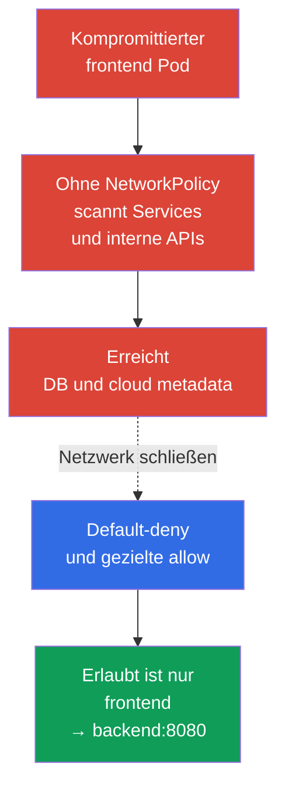
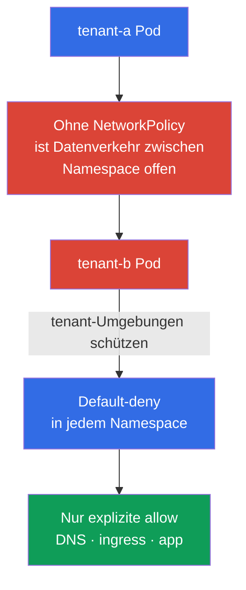

[Русская версия](ru.md) · [Eng version](README.md) · [Versión en español](es.md) · [Version française](fr.md) · [ქართული ვერსია](ge.md) · [繁體中文版](tw.md) · [日本語版](jp.md)

# Kapitel 04. NetworkPolicy für Sicherheit

> **Problem.** RCE in einem Pod verschafft einem Angreifer einen foothold, und ein flaches Pod-Netzwerk erlaubt oft, von dort aus Services zu scannen, auf DB, interne APIs und cloud metadata zuzugreifen. Das ist lateral movement: Die Kompromittierung einer Anwendung wird zum Zugang zu anderen Systemen.

> **Was kommt als Nächstes.** In den vorherigen Kapiteln haben wir das Bedrohungsmodell und die Linux-Isolierungsmechanismen behandelt. Jetzt begrenzen wir die Netzwerkpfade, die einem kompromittierten Pod zur Verfügung stehen. **NetworkPolicy** verwandelt ein flaches Pod-Netzwerk in eine Menge explizit erlaubter Verbindungen. Dies ist die CKS-Domäne Cluster Setup (15%).

> **Was Sie aus CKA benötigen.** Die grundlegende Syntax von `NetworkPolicy`, Selektoren und das Pod-Netzwerkmodell werden in [Kapitel 34 von CKA](../../../cka/course/34/de.md) behandelt. Der Aufbau des Pod-Netzwerks und die Rolle von CNI stehen in [Kapitel 30 von CKA](../../../cka/course/30/de.md). Hier betrachten wir den Einsatz dieser Mechanismen als Schutzmaßnahme und wiederholen nicht die Grundlagen.

> 🧠 `NetworkPolicy` verwandelt ein flaches Netzwerk in eine minimale Menge von Pfaden zwischen Workloads.

## 04.1. Angriffsszenario: kompromittierter Pod in einem flachen Netzwerk

Ohne Richtlinien lässt die Mehrzahl der CNI Datenverkehr zwischen allen Pod und oft auch deren ausgehenden Datenverkehr zu. Hat ein Angreifer die Befehlsausführung in `frontend` erlangt, kann er Service-Adressen scannen, sich mit Datenbanken verbinden, interne HTTP APIs abfragen und versuchen, cloud metadata abzurufen. Diese Bewegung nach dem initial access wird **lateral movement** genannt.



`NetworkPolicy` wird anhand von Labels auf Pod angewendet, nicht auf Service. Service bleibt ein praktischer DNS-Zielpunkt, doch CNI entscheidet anhand des Quell- und Ziel-Pod, der IP, des Ports und der Policy-Regeln. Die Richtlinie ersetzt weder RBAC, TLS noch security group: Sie ist eine Schicht von defense in depth.

> 🎯 Default-deny für die benötigte Richtung, danach gezielte allow anhand von Labels, Namespace und Port; erlauben Sie DNS und notwendige Pfade zwischen Namespace separat.

## 04.2. Default-deny: erst schließen, dann erlauben

Eine sichere Ausgangsposition für einen Namespace ist, den gesamten ingress und egress zu verbieten. Eine Richtlinie mit leerem `podSelector` wählt alle Pod des Namespace aus. Leere Listen `ingress` und `egress` bedeuten, dass keine Richtungen erlaubt sind.

```yaml
apiVersion: networking.k8s.io/v1
kind: NetworkPolicy
metadata:
  name: default-deny-ingress
  namespace: payments
spec:
  podSelector: {}
  policyTypes:
  - Ingress
---
apiVersion: networking.k8s.io/v1
kind: NetworkPolicy
metadata:
  name: default-deny-egress
  namespace: payments
spec:
  podSelector: {}
  policyTypes:
  - Egress
```

Beide Richtungen lassen sich in einer Richtlinie deklarieren:

```yaml
apiVersion: networking.k8s.io/v1
kind: NetworkPolicy
metadata:
  name: default-deny
  namespace: payments
spec:
  podSelector: {}
  policyTypes:
  - Ingress
  - Egress
```

Die Reihenfolge ist für den Betrieb wichtig: Definieren Sie zunächst die Karte zulässiger Verbindungen und bereiten Sie allow-Richtlinien vor, wenden Sie dann default-deny und unmittelbar die benötigten Erlaubnisse in einem kontrollierten rollout an. Andernfalls verlieren Anwendungen DNS, den Zugriff auf Abhängigkeiten, ingress/monitoring-Datenverkehr oder externe APIs. Übliche kubelet liveness/readiness/startup probes zwischen dem Pod und seinem Node sind im Standardmodell von NetworkPolicy kein typischer Datenverkehr, den default-deny blockiert; Besonderheiten von Host/CNI sollten Sie dennoch in Ihrer Umgebung prüfen. Für einen neuen isolierten Namespace ist es sinnvoll, deny vor dem Start produktiver Pod zu erstellen.

Richtlinien sind additiv: Kubernetes kennt weder eine `deny`/`allow`-Reihenfolge noch eine Priorität zwischen `NetworkPolicy`-Objekten. Für jeden `Pod` und jede Richtung werden die allow-Regeln aller anwendbaren Richtlinien separat vereinigt. Für eine Verbindung `source Pod → destination Pod` werden beide Seiten unabhängig geprüft: Ist der source `Pod` für `Egress` isoliert, müssen seine egress rules das Ziel erlauben; ist der destination `Pod` für `Ingress` isoliert, müssen seine ingress rules die Quelle erlauben. Sind beide Seiten isoliert, werden beide Erlaubnisse benötigt. Reply traffic für eine erlaubte Verbindung benötigt keine separate Rückregel: Er ist implizit erlaubt. Für eine Richtung, für die ein `Pod` durch keine anwendbare `NetworkPolicy` isoliert ist, wird keine zusätzliche allow-Regel benötigt.

| Richtlinie | Was sie isoliert | Wann anwenden |
|---|---|---|
| Nur `Ingress` | Eingehender Datenverkehr zu ausgewählten Pod | Wenn ausgehende Verbindungen noch nicht eingeschränkt werden können |
| Nur `Egress` | Ausgehender Datenverkehr ausgewählter Pod | Zum Schutz von metadata, externen APIs und exfiltration |
| `Ingress` und `Egress` | Beide Richtungen | Das normale Ziel für einen sensiblen Namespace |

## 04.3. Gezielte Erlaubnisse: selector, IP und Port

Beschreiben Sie nach default-deny nur die erforderlichen Verbindungen. Das folgende Beispiel erlaubt einem Pod mit `app: frontend`, einen Pod `app: backend` über TCP 8080 im selben Namespace zu erreichen:

```yaml
apiVersion: networking.k8s.io/v1
kind: NetworkPolicy
metadata:
  name: allow-frontend-to-backend
  namespace: payments
spec:
  podSelector:
    matchLabels:
      app: backend
  policyTypes:
  - Ingress
  ingress:
  - from:
    - podSelector:
        matchLabels:
          app: frontend
    ports:
    - protocol: TCP
      port: 8080
---
apiVersion: networking.k8s.io/v1
kind: NetworkPolicy
metadata:
  name: allow-frontend-egress-to-backend
  namespace: payments
spec:
  podSelector:
    matchLabels:
      app: frontend
  policyTypes:
  - Egress
  egress:
  - to:
    - podSelector:
        matchLabels:
          app: backend
    ports:
    - protocol: TCP
      port: 8080
```

Für eine Verbindung zu einem Pod in einem anderen Namespace muss ein Element von `from` oder `to` beide Selektoren enthalten. Zwei getrennte Elemente bedeuten ein logisches OR und keine Schnittmenge.

```yaml
apiVersion: networking.k8s.io/v1
kind: NetworkPolicy
metadata:
  name: allow-monitoring-scrape
  namespace: payments
spec:
  podSelector:
    matchLabels:
      app: backend
  policyTypes:
  - Ingress
  ingress:
  - from:
    - namespaceSelector:
        matchLabels:
          kubernetes.io/metadata.name: monitoring
      podSelector:
        matchLabels:
          app.kubernetes.io/name: prometheus
    ports:
    - protocol: TCP
      port: 8080
```

`ipBlock` ist für Adressen außerhalb des Pod-Netzwerks gedacht: etwa für einen unternehmensweiten egress proxy oder einen bestimmten endpoint. Verwenden Sie es nicht als primäre Methode zur Auswahl von Pod: Die Überschneidung mit dem pod CIDR und das Verhalten bei SNAT hängen von der CNI-Implementierung ab.

```yaml
apiVersion: networking.k8s.io/v1
kind: NetworkPolicy
metadata:
  name: allow-egress-proxy
  namespace: payments
spec:
  podSelector: {}
  policyTypes:
  - Egress
  egress:
  - to:
    - ipBlock:
        cidr: 192.0.2.10/32
    ports:
    - protocol: TCP
      port: 3128
```

Beschränken Sie gleichzeitig Quelle, Ziel und Port. Eine Richtlinie nur mit `podSelector` ohne `ports` erlaubt alle Ports des ausgewählten Ziels und ist gewöhnlich weiter gefasst als nötig. Für numerische Ports unterstützt die API auch den Bereich `endPort` (Stable seit v1.25): `endPort` darf nicht kleiner als `port` sein, und beide Werte müssen numerisch sein. Die tatsächliche Nutzung des Bereichs hängt von CNI ab; prüfen Sie ihn daher in Ihrer Umgebung.

## 04.4. Netzwerkisolation von Namespace und multi-tenancy

Ein Namespace ist für sich genommen keine Netzwerkgrenze. Zwei tenant können unterschiedliche Namespace haben, doch ohne `NetworkPolicy` können ihre Pod häufig kommunizieren. Definieren Sie für multi-tenancy eine baseline für jeden tenant Namespace:

1. Default-deny ingress und egress für alle Pod.
2. Allow nur innerhalb der Anwendung: frontend -> backend, worker -> queue, monitoring -> metrics.
3. Explizite Infrastruktur-Ausnahmen: DNS, ingress controller, observability, egress proxy.
4. Separate namespace labels für erlaubte Verbindungen zwischen Teams und ein Prozess für deren Änderung durch review.



In der Praxis ist es nützlich, baseline automatisch über ein Namespace-Template oder eine policy engine anzuwenden. Eine gewöhnliche `NetworkPolicy` hat jedoch einen Namespace-Geltungsbereich und ersetzt keine cluster-wide policy eines bestimmten CNI. Benötigen Sie clusterweite Verbote, FQDN-Regeln oder L7-Filterung, ziehen Sie Cilium und seine Richtlinien in Kapitel 06 in Betracht.

> **Production note, kein Prüfungsmaterial.** Core `networking.k8s.io/v1` `NetworkPolicy` bleibt die wichtigste portable API für CKS. SIG Network entwickelt eine separate cross-CNI API `ClusterNetworkPolicy` (`policy.networking.k8s.io/v1alpha2`), dies ist jedoch eine emerging/experimentelle API mit von CNI abhängiger Unterstützung; sie ersetzt weder die core API noch vendor-specific Erweiterungen von Cilium/Calico.

## 04.5. Egress-Falle: DNS funktioniert nicht mehr

Nach default-deny egress kann eine Anwendung gewöhnlich keine Service-Namen und externen FQDN mehr auflösen. Das Symptom sieht wie ein Anwendungsfehler aus, obwohl die TCP-Regel zu backend bereits vorhanden ist: `curl` meldet `Could not resolve host`, und `nslookup kubernetes.default.svc.cluster.local` wartet auf einen timeout.

Erlauben Sie UDP und TCP 53 zu CoreDNS. Das Label `k8s-app: kube-dns` ist für CoreDNS in kube-system üblich, aber bestätigen Sie vor dem Anwenden die tatsächlichen labels mit `kubectl -n kube-system get pod --show-labels`.

```yaml
apiVersion: networking.k8s.io/v1
kind: NetworkPolicy
metadata:
  name: allow-dns-egress
  namespace: payments
spec:
  podSelector: {}
  policyTypes:
  - Egress
  egress:
  - to:
    - namespaceSelector:
        matchLabels:
          kubernetes.io/metadata.name: kube-system
      podSelector:
        matchLabels:
          k8s-app: kube-dns
    ports:
    - protocol: UDP
      port: 53
    - protocol: TCP
      port: 53
```

Prüfen Sie auch die konkrete Clusterarchitektur: NodeLocal DNSCache kann Anfragen an eine lokale IP leiten, und managed Kubernetes kann andere labels oder DNS-Komponenten haben. Öffnen Sie egress `0.0.0.0/0` nicht nur, um DNS zu reparieren: Das hebt das Ziel der egress isolation auf.

## 04.6. Überprüfung, Diagnose und Grenzen des Mechanismus

Stellen Sie zunächst sicher, dass CNI `NetworkPolicy` überhaupt implementiert. Das API-Objekt selbst wird von Kubernetes unabhängig von den CNI-Fähigkeiten akzeptiert; ohne Unterstützung existiert das Objekt, der Datenverkehr ändert sich jedoch nicht. Prüfen Sie die Dokumentation des installierten CNI und erstellen Sie einen kontrollierten Test.

> 🎯 Weisen Sie die policy mit kontrollierten erlaubten und verbotenen TCP/UDP-Anfragen an einen geprüften listener mit Workload-Parametern nach.

> 🔬 Grenzen der Spezifikation und CNI edge cases für `hostNetwork`, NAT, node traffic und ICMP.

**Grenzen von NetworkPolicy: Prüfen Sie diese jeweils separat.**

- **Dies ist eine Filterung des Pod-Datenverkehrs, keine vollständige tenant-Isolation.** NetworkPolicy begrenzt die verfügbaren Netzwerkpfade, schützt aber nicht kernel und node, Kubernetes API/RBAC, Secret, admission oder scheduler. Ergänzt wird sie durch TLS, host firewall und Mittel des jeweiligen CNI.
- **Die Local-node exception ist durch die Kubernetes-Spezifikation festgelegt.** Datenverkehr zu einem Pod und von einem Pod mit dem node, auf dem er ausgeführt wird, ist unabhängig von der IP des Pod oder node immer erlaubt; ingress vom lokalen node zu einem isolierten Pod ist ebenfalls erlaubt. Dies ist eine portable Regel der Spezifikation und kein CNI-Unterschied.
- **`hostNetwork` und host-aware controls hängen von CNI ab.** Solcher Datenverkehr erscheint oft als node IP, deshalb können `podSelector` und `namespaceSelector` anders wirken als erwartet. Prüfen Sie dies in Ihrem CNI.
- **Nicht alle Protokolle haben dieselbe portable Semantik.** Core NetworkPolicy definiert sie für TCP, UDP und SCTP (SCTP - bei CNI-Unterstützung). Für ICMP, ARP und andere Protokolle ist allow/deny implementation-defined; daher beweist `ping` nicht portabel, ob default-deny funktioniert hat oder nicht.
- **Bauen Sie keine portablen `ipBlock`-Regeln auf interner Routing-Logik auf.** Die Reihenfolge von NAT und policy hängt von der Implementierung ab. Wählen Sie für Service `ClusterIP`, pod CIDR oder Adressen nach SNAT Pod per Selektor aus; behalten Sie `ipBlock` für dokumentierte externe Adressen.
- **Bereits offene Verbindungen verhalten sich unterschiedlich.** Nach Änderung von policy oder labels kann CNI sie trennen oder bis zum Schließen bestehen lassen. Berücksichtigen Sie dies bei rollout, incident response und Tests.

Bereiten Sie vor dem Test einen bekannten funktionierenden Kontroll-endpoint vor: zum Beispiel einen Service `control`, der einen listener Pod mit dem exakten Label `app=control` auswählt und auf TCP 8080 antwortet. Prüfen Sie ihn ohne neue policy oder aus einem zuvor erlaubten diagnostischen Pod. Verwenden Sie für den negativen Test keinen nicht existierenden DNS-Namen: Damit würde DNS geprüft, nicht die policy. Vergleichen Sie dann die tatsächlichen labels aller Beteiligten:

```bash
# CNI- und DNS-Pod suchen, dann erstellte Richtlinien und labels prüfen
kubectl -n kube-system get pods -o wide
kubectl -n kube-system get pod --show-labels | grep -E 'coredns|kube-dns'
kubectl -n payments get networkpolicy
kubectl -n payments describe networkpolicy default-deny
kubectl -n payments get pod --show-labels

# Vorübergehend Quellen mit denselben exakten labels wie in der policy erstellen.
# Für die Standard-NetworkPolicy ist ServiceAccount kein selector: Er ist wichtig
# nur für CNI-specific identity policy oder andere Erweiterungen.
kubectl -n payments run netshoot \
  --image=nicolaka/netshoot:v0.16 \
  --labels=app=frontend \
  --restart=Never \
  --command -- sleep 3600
kubectl -n payments run netshoot-untrusted \
  --image=nicolaka/netshoot:v0.16 \
  --labels=app=untrusted \
  --restart=Never \
  --command -- sleep 3600
kubectl -n payments wait --for=condition=Ready pod/netshoot --timeout=90s
kubectl -n payments wait --for=condition=Ready pod/netshoot-untrusted --timeout=90s

# Zuerst DNS und den bekannten funktionierenden Kontroll-endpoint bestätigen
kubectl -n payments exec netshoot -- nslookup control.payments.svc.cluster.local
kubectl -n payments exec netshoot -- nc -vz -w 3 control 8080
```

Führen Sie für ein reproduzierbares Ergebnis vier Fälle aus. In der Tabelle sind `backend`, `control` und `egress-denied-control` Service mit listener Pod, die jeweils anhand der exakten Labels `app=backend`, `app=control` und `app=egress-denied-control` ausgewählt werden. Für den negativen ingress erlauben Sie vorübergehend nur egress von `app=untrusted` zu `app=backend:8080`; für den negativen egress erlauben Sie ingress in `app=egress-denied-control` von `app=frontend`, erstellen jedoch keine egress rule für dieses Ziel. Dann kann die Ablehnung der zu prüfenden Richtung und nicht der Richtlinie der anderen Seite zugeordnet werden.

| Fall | Exakte labels und erforderliche policy | Befehl und erwartetes Ergebnis |
|---|---|---|
| Erlaubter ingress | `app=frontend` -> `app=backend`; backend ingress erlaubt frontend, frontend egress erlaubt backend auf TCP 8080 | `kubectl -n payments exec netshoot -- nc -vz -w 3 backend 8080` - Erfolg |
| Verbotener ingress | `app=untrusted` -> `app=backend`; egress von untrusted ist vorübergehend erlaubt, aber backend ingress lässt nur `app=frontend` zu | `kubectl -n payments exec netshoot-untrusted -- nc -vz -w 3 backend 8080` - abgelehnt |
| Erlaubter egress | `app=frontend` -> `app=control`; control ingress lässt frontend zu, frontend egress erlaubt control auf TCP 8080 | `kubectl -n payments exec netshoot -- nc -vz -w 3 control 8080` - Erfolg |
| Verbotener egress | `app=frontend` -> `app=egress-denied-control`; ingress des Ziels lässt frontend zu, aber frontend egress erlaubt dieses Ziel nicht | `kubectl -n payments exec netshoot -- nc -vz -w 3 egress-denied-control 8080` - abgelehnt |

Verwenden Sie bei Standard-`NetworkPolicy` zur Prüfung der Quellrolle dieselben labels, denselben Namespace, IP-Pfad und dieselben Ports wie die Anwendung; derselbe ServiceAccount wird nur für CNI-specific identity policy benötigt. Führen Sie den negativen Test gegen einen zuvor bestätigten listener aus: `connection refused` allein beweist keine Blockierung, weil listener fehlen, Service/backend falsch sein oder die Anwendung ablehnen kann. Halten Sie die erfolgreiche Kontrollanfrage, die erwartete Nichterreichbarkeit und, falls CNI telemetry bereitstellt, ein deny/drop event oder flow log fest; entfernen Sie dann die temporäre test-policy und die Pod.

| Symptom | Überprüfung und wahrscheinliche Ursache |
|---|---|
| Richtlinie existiert, Datenverkehr wird nicht blockiert | CNI unterstützt `NetworkPolicy` nicht, die Richtlinie wählte falsche labels oder die Richtung ist nicht isoliert |
| Alle Anfragen funktionieren nicht mehr | Default-deny egress wurde ohne DNS oder ohne allow für eine erforderliche Abhängigkeit angewendet |
| Datenverkehr zwischen Namespace ist zu weit erlaubt | `namespaceSelector` und `podSelector` stehen in getrennten Listenelementen, daher greift OR |
| Policy wählt keinen Pod aus | Das Label im Deployment template ist anders als in `podSelector`; mit `kubectl get pod --show-labels` vergleichen |
| Externe Adresse wird nicht blockiert | Egress isolation fehlt, `ipBlock` entspricht nicht der tatsächlichen Adresse, die NAT-Reihenfolge weicht von der Erwartung ab oder der Datenverkehr umgeht den erwarteten Punkt |

Für die Lerndiagnose oben wird das tag `nicolaka/netshoot:v0.16` verwendet; das tag kann sich ändern oder in einer offline-Umgebung nicht verfügbar sein. In production und reproduzierbaren Labs sollten Sie das Image per digest pinnen und seinen pre-pull/Registry-Zugriff im Voraus sicherstellen.

> 🏭 Bestandsaufnahme der Flows, staging und canary, Beobachtung von DNS/Fehlern/flows, geprüfter rollback und versionierte baseline.

## 04.7. Wie dies in der Produktion eingesetzt wird

- **Baseline als Code.** Default-deny und minimale allow-Regeln werden zusammen mit den Workload-Manifests gespeichert, als Code geprüft und beim Erstellen eines Namespace angewendet.
- **Abhängigkeitskarte vor dem Aktivieren von deny.** Das Team erfasst eingehende und ausgehende Verbindungen, einschließlich DNS, health checks, metrics, registry, proxy und externer SaaS APIs. Das verringert das Risiko eines Ausfalls beim rollout.
- **Labels als Vertrag.** Stabile labels für Anwendungsrolle und tenant werden dokumentiert und geprüft; eine Änderung des label-Schemas durchläuft review als API-Vertrag. Zufällige oder zu allgemeine labels machen die Richtlinie weiter als erwartet.
- **Preview vor enforcement.** Bewerten Sie vor der Aktivierung einer neuen policy deren Auswirkungen anhand der Flow-Karte, testen Sie sie in staging und verwenden Sie, falls CNI dies unterstützt, audit/observe mode. Prüfen Sie erlaubte und verbotene Pfade vor dem rollout enforcement.
- **Beobachtbarkeit.** Vor und nach einer Policy-Änderung werden CNI flow logs, Fehlermetriken und Latenz betrachtet. Für Cilium ist das Hubble; der Ansatz wird in Kapitel 06 behandelt.
- **Mehrschichtiger Schutz.** Egress policy ergänzen cloud firewall, private endpoints, identity und TLS. Besonders sensible Ziele, einschließlich metadata, werden auf mehreren Ebenen geschützt.

## 04.8. Mini-Glossar

- **NetworkPolicy** - Kubernetes-API-Objekt, das erlaubten ingress und egress für ausgewählte Pod festlegt.
- **Default-deny** - Eine Richtlinie, die eine Richtung standardmäßig isoliert, bis eine andere Richtlinie sie erlaubt.
- **Ingress** - Datenverkehr, der in einen Pod eingeht.
- **Egress** - Datenverkehr, der einen Pod verlässt.
- **podSelector** - Auswahl von Pod anhand von labels im Namespace der Richtlinie.
- **namespaceSelector** - Auswahl von Namespace anhand von labels für eine Regel zwischen Namespace.
- **ipBlock** - Regel für einen CIDR oder eine einzelne IP-Adresse.
- **Lateral movement** - Bewegung eines Angreifers von einem kompromittierten Workload zu anderen Systemen.
- **CNI** - Netzwerk-Plugin des Clusters; es muss die Anwendung von NetworkPolicy umsetzen.

## 04.9. Zusammenfassung des Kapitels

- Ein flaches Pod-Netzwerk eröffnet einem kompromittierten Workload einen Weg für lateral movement; `NetworkPolicy` verringert diese Angriffsfläche.
- Beginnen Sie mit default-deny ingress und egress und erlauben Sie dann nur die notwendigen Richtungen, Quellen, Ziele und Ports.
- Richtlinien sind additiv: Die Erlaubnis muss für die isolierte egress-Quelle und das isolierte ingress-Ziel vorhanden sein.
- Platzieren Sie für eine Verbindung zwischen Namespace `namespaceSelector` und `podSelector` in demselben Regelelement, wenn beide Bedingungen benötigt werden.
- Egress default-deny verlangt eine explizite DNS-Erlaubnis, gewöhnlich zu CoreDNS auf UDP/TCP 53.
- Das API-Objekt allein garantiert keine Filterung: Es wird ein CNI mit `NetworkPolicy`-Unterstützung sowie eine Prüfung erlaubten und verbotenen Datenverkehrs benötigt.

## 04.10. Nutzen auf der Prüfung und in der Praxis

**Auf der Prüfung.** Sie müssen schnell default-deny für einen Namespace erstellen, einen vorgegebenen Pod-to-Pod-Pfad, DNS oder IP/CIDR erlauben und das Ergebnis mit `kubectl exec` bestätigen. Lesen Sie genau, welche Richtung eingeschränkt werden soll: ingress, egress oder beide. Ein typischer Fehler ist, backend ingress zu erlauben, aber frontend egress oder DNS zu vergessen.

**In der Praxis.** NetworkPolicy begrenzt den Schaden bei Kompromittierung einer Anwendung und trennt tenant voneinander. Die nützlichste Fähigkeit ist nicht das Schreiben einer großen Regel, sondern die Erstellung einer minimalen Karte tatsächlicher Netzwerkabhängigkeiten und ein sicherer rollout ohne Unterbrechung des Service.

> ### 🔴 Sicht des Angreifers
> **Asset:** backend Service und interne APIs.
>
> **Starting foothold:** RCE in Pod `frontend`.
>
> **Attacker objective:** interne endpoints entdecken und backend erreichen.
>
> **Abuse path:** DNS discovery -> Zugriff über Service -> direkter Zugriff auf Pod/IP, wenn das Netzwerk nicht isoliert ist.
>
> **Expected evidence:** CNI/Hubble flows, DNS-Anfragen und dropped packets bei Blockierung.
>
> **Control:** default-deny für ingress und egress sowie explizite Regeln nach identity/labels und Ports.
>
> **Retest:** dieselbe Anfrage aus `frontend` gelingt nur zum erlaubten backend; die Anfrage aus einem fremden Pod wird blockiert.

## 04.11. Fragen zur Selbstkontrolle

<details>
<summary>1. Warum erleichtert das Fehlen von NetworkPolicy lateral movement nach der Kompromittierung eines Pod?</summary>

Ohne Richtlinien lässt die Mehrzahl der CNI Datenverkehr zwischen Pod und häufig ausgehenden Datenverkehr zu. Erlangt ein Angreifer eine shell oder RCE in `frontend`, kann er Service, DB, interne APIs und metadata endpoint scannen oder darauf zugreifen; default-deny mit gezielten allow-Regeln begrenzt diesen Pfad.
</details>

<details>
<summary>2. Was bedeutet ein leerer `podSelector: {}` in einer Namespace-Richtlinie?</summary>

Ein leerer `podSelector` wählt alle Pod des Namespace aus, in dem die Richtlinie erstellt ist. In Verbindung mit `policyTypes: Ingress` oder `Egress` und leeren Regellisten isoliert er die betreffende Richtung für all diese Pod.
</details>

<details>
<summary>3. Warum reicht default-deny ingress für backend nicht für die Verbindung frontend -> backend bei isoliertem egress?</summary>

Ingress und egress werden für jede Seite einer Verbindung unabhängig geprüft. Ist backend für ingress isoliert, muss seine Regel frontend erlauben, aber bei isoliertem egress muss frontend eine separate Erlaubnis zu backend:8080 haben; Reply traffic ist nur für eine bereits erlaubte Verbindung implizit erlaubt.
</details>

<details>
<summary>4. Worin liegt der Unterschied zwischen zwei getrennten `from`-Elementen und einem Element mit `namespaceSelector` und `podSelector`?</summary>

Zwei getrennte Listenelemente bedeuten logisches OR: Das eine kann den gesamten ausgewählten Namespace erlauben, das andere Pod mit dem Label im Namespace der Richtlinie. Wenn beide Bedingungen erforderlich sind, werden `namespaceSelector` und `podSelector` in ein Regelelement gesetzt; dann muss die Quelle beide gleichzeitig erfüllen.
</details>

<details>
<summary>5. Warum funktioniert DNS nach default-deny egress häufig nicht mehr und welche Protokolle müssen erlaubt werden?</summary>

Default-deny blockiert Pod-Anfragen an CoreDNS, daher werden Service-Namen und externe FQDN nicht aufgelöst. Zu den tatsächlichen DNS endpoints des Clusters müssen UDP 53 und TCP 53 erlaubt werden, nachdem die CoreDNS labels und ein möglicher Einsatz von NodeLocal DNSCache geprüft wurden.
</details>

<details>
<summary>6. Warum beweist das Vorhandensein eines `NetworkPolicy`-Objekts nicht, dass Datenverkehr blockiert wird?</summary>

Kubernetes akzeptiert das API-Objekt unabhängig davon, ob das installierte CNI NetworkPolicy anwenden kann. Bestätigen Sie die CNI-Unterstützung, die tatsächlichen labels und Richtungen und prüfen Sie dann einen vorher bekannten listener mit erlaubten und verbotenen Anfragen; `connection refused` allein beweist keine Policy-Blockierung.
</details>

<details>
<summary>7. Welche Abhängigkeiten müssen neben Anwendungsservices vor dem rollout von default-deny berücksichtigt werden?</summary>

DNS, ingress controller, monitoring/metrics, egress proxy, registry, externe SaaS APIs und health checks der konkreten Umgebung müssen berücksichtigt werden. Vor dem Anwenden von deny wird eine Karte der zulässigen Flows erstellt, allow-Richtlinien werden vorbereitet und in einem kontrollierten rollout geprüft, damit der Service nicht unterbrochen wird.
</details>

## Praxis

🧪 Lab 101 (NetworkPolicy: default-deny, Isolation, metadata): [tasks/cks/labs/101](../../labs/101/README_DE.MD)

🌐 Zusätzliche interaktive Praxis (killer.sh/killercoda, externe Ressource): [networkpolicy-create-default-deny](https://killercoda.com/killer-shell-cks/scenario/networkpolicy-create-default-deny) · [networkpolicy-namespace-communication](https://killercoda.com/killer-shell-cks/scenario/networkpolicy-namespace-communication)

## Referenzmaterialien

- [Kubernetes: Network Policies](https://kubernetes.io/docs/concepts/services-networking/network-policies/)
- [Kubernetes Network Policy API](https://network-policy-api.sigs.k8s.io/)

---
[Inhaltsverzeichnis](../README_DE.md) · [Kapitel 03](../03/de.md) · [Kapitel 05](../05/de.md)
