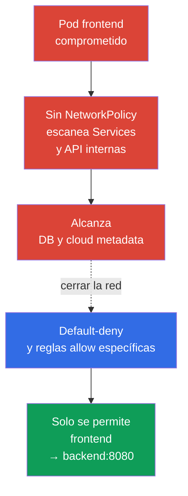
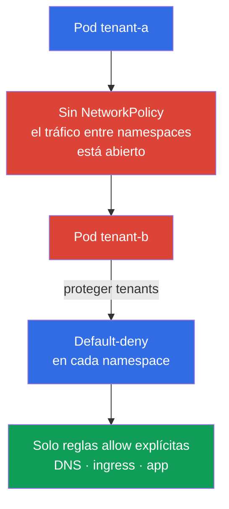

[Русская версия](ru.md) · [Eng version](README.md) · [Version française](fr.md) · [Deutsche Version](de.md) · [ქართული ვერსია](ge.md) · [繁體中文版](tw.md) · [日本語版](jp.md)

# Capítulo 04. NetworkPolicy para la seguridad

> **El problema.** Una RCE en un solo Pod da a un atacante un punto de apoyo, y una red de Pods plana a menudo le permite desde allí escanear Services, acceder a DB, API internas y cloud metadata. Esto es lateral movement: comprometer una aplicación se convierte en un punto de entrada a otros sistemas.

> **Qué sigue.** En los capítulos anteriores cubrimos el modelo de amenazas y los mecanismos de aislamiento de Linux. Ahora reduciremos las rutas de red disponibles para un Pod comprometido. **NetworkPolicy** convierte una red de Pods plana en un conjunto de conexiones explícitamente permitidas. Este es el dominio Cluster Setup (15%) de CKS.

> **Qué necesitas de CKA.** La sintaxis básica de `NetworkPolicy`, los selectores y el modelo de red de Pod se tratan en el [capítulo 34 de CKA](../../../cka/course/34/es.md). La arquitectura de la red de Pods y el rol de CNI se tratan en el [capítulo 30 de CKA](../../../cka/course/30/es.md). Aquí consideramos estos mecanismos como controles de seguridad, en lugar de repetir sus fundamentos.

> 🧠 `NetworkPolicy` convierte una red plana en un conjunto mínimo de rutas entre workloads.

## 04.1. Escenario de ataque: un Pod comprometido en una red plana

Sin políticas, la mayoría de los CNI permiten el tráfico entre todos los Pods y, a menudo, también su tráfico saliente. Si un atacante obtiene ejecución de comandos en `frontend`, puede escanear direcciones de Service, conectarse a bases de datos, solicitar API HTTP internas e intentar obtener cloud metadata. Este movimiento posterior al acceso inicial se llama **lateral movement**.



`NetworkPolicy` se aplica a Pods por labels, no a un Service. Un Service sigue siendo un destino DNS conveniente, pero el CNI toma su decisión según el Pod de origen y destino, IP, puerto y reglas de policy. Una policy no sustituye RBAC, TLS ni un grupo de seguridad: es una capa de defensa en profundidad.

> 🎯 Aplica default-deny para la dirección necesaria, después reglas allow específicas por labels, namespace y puerto; permite por separado DNS y las rutas cross-namespace requeridas.

## 04.2. Default-deny: cerrar primero, después permitir

El punto de partida seguro para un namespace es denegar todo el ingress y egress. Una policy con un `podSelector` vacío selecciona todos los Pods del namespace. Las listas vacías de `ingress` y `egress` significan que no se permite ninguna dirección.

```yaml
apiVersion: networking.k8s.io/v1
kind: NetworkPolicy
metadata:
  name: default-deny-ingress
  namespace: payments
spec:
  podSelector: {}
  policyTypes:
  - Ingress
---
apiVersion: networking.k8s.io/v1
kind: NetworkPolicy
metadata:
  name: default-deny-egress
  namespace: payments
spec:
  podSelector: {}
  policyTypes:
  - Egress
```

Ambas direcciones se pueden declarar en una sola policy:

```yaml
apiVersion: networking.k8s.io/v1
kind: NetworkPolicy
metadata:
  name: default-deny
  namespace: payments
spec:
  podSelector: {}
  policyTypes:
  - Ingress
  - Egress
```

El orden es importante desde el punto de vista operativo: primero identifica el mapa de conexiones permitidas y prepara las policies allow; después aplica default-deny y las reglas allow necesarias inmediatamente en un rollout controlado. De lo contrario, las aplicaciones perderán DNS, acceso a dependencias, tráfico de ingress/monitoring o una API externa. Los kubelet liveness/readiness/startup probes ordinarios entre un Pod y su nodo no son tráfico típico bloqueado por default-deny en el modelo estándar de NetworkPolicy; aun así, comprueba las particularidades de host/CNI en tu entorno. Para un namespace aislado nuevo, es útil crear las policies deny antes de iniciar los Pods de workload.

Las policies son aditivas: Kubernetes no tiene un orden `deny`/`allow` ni prioridades entre objetos `NetworkPolicy`. Para cada `Pod` y cada dirección, las reglas allow de todas las policies aplicables se combinan de forma independiente. Para una conexión `source Pod → destination Pod`, ambos lados se comprueban de forma independiente: si el `Pod` origen está aislado para `Egress`, sus egress rules deben permitir el destino; si el `Pod` destino está aislado para `Ingress`, sus ingress rules deben permitir el origen. Cuando ambos lados están aislados, ambos deben permitir la conexión. El tráfico de respuesta de una conexión permitida no requiere una regla inversa independiente: se permite implícitamente. Una dirección para la que un `Pod` no está aislado por ninguna `NetworkPolicy` aplicable no necesita una regla allow adicional.

| Policy | Qué aísla | Cuándo aplicarla |
|---|---|---|
| Solo `Ingress` | Tráfico entrante a los Pods seleccionados | Cuando todavía no se pueden restringir las conexiones salientes |
| Solo `Egress` | Tráfico saliente de los Pods seleccionados | Para proteger metadata, API externas y frente a exfiltración |
| `Ingress` y `Egress` | Ambas direcciones | El objetivo habitual para un namespace sensible |

## 04.3. Reglas allow específicas: selectores, IP y puertos

Tras default-deny, describe solo las conexiones necesarias. El siguiente ejemplo permite que un Pod con `app: frontend` se conecte a un Pod con `app: backend` por TCP 8080 en el mismo namespace:

```yaml
apiVersion: networking.k8s.io/v1
kind: NetworkPolicy
metadata:
  name: allow-frontend-to-backend
  namespace: payments
spec:
  podSelector:
    matchLabels:
      app: backend
  policyTypes:
  - Ingress
  ingress:
  - from:
    - podSelector:
        matchLabels:
          app: frontend
    ports:
    - protocol: TCP
      port: 8080
---
apiVersion: networking.k8s.io/v1
kind: NetworkPolicy
metadata:
  name: allow-frontend-egress-to-backend
  namespace: payments
spec:
  podSelector:
    matchLabels:
      app: frontend
  policyTypes:
  - Egress
  egress:
  - to:
    - podSelector:
        matchLabels:
          app: backend
    ports:
    - protocol: TCP
      port: 8080
```

Para una conexión a un Pod de otro namespace, un elemento `from` o `to` debe contener ambos selectores. Dos elementos separados significan OR lógico, no intersección.

```yaml
apiVersion: networking.k8s.io/v1
kind: NetworkPolicy
metadata:
  name: allow-monitoring-scrape
  namespace: payments
spec:
  podSelector:
    matchLabels:
      app: backend
  policyTypes:
  - Ingress
  ingress:
  - from:
    - namespaceSelector:
        matchLabels:
          kubernetes.io/metadata.name: monitoring
      podSelector:
        matchLabels:
          app.kubernetes.io/name: prometheus
    ports:
    - protocol: TCP
      port: 8080
```

`ipBlock` es para direcciones fuera de la red de Pods, por ejemplo, un egress proxy corporativo o un endpoint concreto. No lo utilices como forma principal de seleccionar Pods: la superposición con el CIDR de Pods y el comportamiento bajo SNAT dependen de la implementación de CNI.

```yaml
apiVersion: networking.k8s.io/v1
kind: NetworkPolicy
metadata:
  name: allow-egress-proxy
  namespace: payments
spec:
  podSelector: {}
  policyTypes:
  - Egress
  egress:
  - to:
    - ipBlock:
        cidr: 192.0.2.10/32
    ports:
    - protocol: TCP
      port: 3128
```

Limita al mismo tiempo origen, destino y puerto. Una policy que contiene solo `podSelector` y no `ports` permite todos los puertos del destino seleccionado y normalmente es más amplia de lo necesario. Para puertos numéricos, la API también admite un rango `endPort` (Stable desde v1.25): `endPort` no debe ser menor que `port`, y ambos valores deben ser numéricos. El soporte real de rangos depende de CNI, así que pruébalo en tu entorno.

## 04.4. Aislamiento de red de un namespace y multi-tenancy

Un Namespace por sí solo no es un límite de red. Dos tenants pueden tener namespaces separados, pero sin `NetworkPolicy` sus Pods a menudo pueden comunicarse. Para multi-tenancy, define un baseline para cada namespace de tenant:

1. Default-deny ingress y egress para todos los Pods.
2. Permitir solo tráfico dentro de la aplicación: frontend -> backend, worker -> queue, monitoring -> metrics.
3. Excepciones de infraestructura explícitas: DNS, ingress controller, observability, egress proxy.
4. Labels de namespace independientes para conexiones permitidas entre equipos y un proceso de review para modificarlos.



En la práctica, es útil aplicar un baseline automáticamente mediante una plantilla de namespace o un policy engine. Pero una `NetworkPolicy` normal tiene ámbito de namespace y no sustituye la policy cluster-wide de CNI. Si necesitas denegaciones cluster-wide, reglas FQDN o filtrado L7, considera Cilium y sus policies en el capítulo 06.

> **Nota de producción, no material de examen.** La `NetworkPolicy` core `networking.k8s.io/v1` sigue siendo la API portable principal para CKS. SIG Network desarrolla una API cross-CNI independiente, `ClusterNetworkPolicy` (`policy.networking.k8s.io/v1alpha2`), pero es una API emerging/experimental cuyo soporte depende de CNI; no sustituye ni la API core ni las extensiones vendor-specific de Cilium/Calico.

## 04.5. La trampa de egress: DNS deja de funcionar

Después de default-deny egress, normalmente una aplicación no puede resolver nombres de Service ni FQDN externos. El síntoma parece un error de aplicación aunque ya exista una regla TCP para backend: `curl` informa `Could not resolve host` y `nslookup kubernetes.default.svc.cluster.local` espera hasta un timeout.

Permite UDP y TCP 53 hacia CoreDNS. El label `k8s-app: kube-dns` es habitual para CoreDNS en kube-system, pero antes de aplicarlo confirma los labels reales con `kubectl -n kube-system get pod --show-labels`.

```yaml
apiVersion: networking.k8s.io/v1
kind: NetworkPolicy
metadata:
  name: allow-dns-egress
  namespace: payments
spec:
  podSelector: {}
  policyTypes:
  - Egress
  egress:
  - to:
    - namespaceSelector:
        matchLabels:
          kubernetes.io/metadata.name: kube-system
      podSelector:
        matchLabels:
          k8s-app: kube-dns
    ports:
    - protocol: UDP
      port: 53
    - protocol: TCP
      port: 53
```

Comprueba también la arquitectura concreta del clúster: NodeLocal DNSCache puede dirigir las consultas a una IP local, y Kubernetes gestionado puede tener labels o componentes DNS distintos. No abras egress a `0.0.0.0/0` solo para arreglar DNS: eso anula el propósito del aislamiento de egress.

## 04.6. Verificación, diagnóstico y límites del mecanismo

Primero, asegúrate de que el CNI implemente realmente `NetworkPolicy`. Kubernetes acepta el objeto API independientemente de las capabilities de CNI; sin soporte, el objeto existe pero el tráfico no cambia. Consulta la documentación del CNI instalado y crea una prueba controlada.

> 🎯 Demuestra la policy con solicitudes TCP/UDP permitidas y denegadas, controladas, hacia un listener verificado usando parámetros del workload.

> 🔬 Límites de la especificación y casos límite de CNI para `hostNetwork`, NAT, tráfico de nodo e ICMP.

**Límites de NetworkPolicy: prueba cada uno por separado.**

- **Esto filtra tráfico de Pod, no el aislamiento completo de tenant.** NetworkPolicy reduce las rutas de red disponibles, pero no protege kernel y nodo, API/RBAC de Kubernetes, Secret, admission ni scheduler. Complétala con TLS, un host firewall y controles específicos de CNI.
- **La excepción del nodo local está definida por la especificación de Kubernetes.** El tráfico hacia y desde un Pod y el nodo en el que se ejecuta siempre se permite, independientemente de la IP de Pod o nodo; también se permite el ingress desde el nodo local hacia un Pod aislado. Esta es una regla portable de la especificación, no una diferencia de CNI.
- **`hostNetwork` y controles que conocen el host dependen de CNI.** Tal tráfico a menudo parece una IP de nodo, por lo que `podSelector` y `namespaceSelector` pueden no funcionar como se espera. Pruébalo en tu CNI.
- **No todos los protocolos tienen la misma semántica portable.** Core NetworkPolicy la define para TCP, UDP y SCTP (SCTP cuando CNI lo admite). Para ICMP, ARP y otros protocolos, allow/deny está definido por la implementación, por lo que `ping` no demuestra de manera portable si default-deny funcionó o falló.
- **No construyas reglas `ipBlock` portables en torno al routing interno.** NAT y el orden de policy dependen de la implementación. Para un Service `ClusterIP`, CIDR de Pods o una dirección después de SNAT, selecciona Pods con selectores; reserva `ipBlock` para direcciones externas documentadas.
- **Las conexiones ya abiertas se comportan de forma diferente.** Después de un cambio de policy o label, un CNI puede interrumpirlas o mantenerlas hasta que se cierren. Tenlo en cuenta durante rollout, incident response y pruebas.

Antes de probar, prepara un endpoint de control conocido que funcione: por ejemplo, un Service `control` que selecciona un listener Pod con el label exacto `app=control` y responde en TCP 8080. Compruébalo sin policies nuevas o desde un Pod de diagnóstico ya permitido de antemano. No uses un nombre DNS inexistente para una prueba negativa: eso prueba DNS, no la policy. Después verifica los labels reales de todos los participantes:

```bash
# Busca los Pods de CNI y DNS; después comprueba las policies y labels creados.
kubectl -n kube-system get pods -o wide
kubectl -n kube-system get pod --show-labels | grep -E 'coredns|kube-dns'
kubectl -n payments get networkpolicy
kubectl -n payments describe networkpolicy default-deny
kubectl -n payments get pod --show-labels

# Crea temporalmente orígenes con los mismos labels exactos que en la policy.
# En una NetworkPolicy estándar, ServiceAccount no es un selector: importa
# solo para una identity policy específica de CNI u otras extensiones.
kubectl -n payments run netshoot \
  --image=nicolaka/netshoot:v0.16 \
  --labels=app=frontend \
  --restart=Never \
  --command -- sleep 3600
kubectl -n payments run netshoot-untrusted \
  --image=nicolaka/netshoot:v0.16 \
  --labels=app=untrusted \
  --restart=Never \
  --command -- sleep 3600
kubectl -n payments wait --for=condition=Ready pod/netshoot --timeout=90s
kubectl -n payments wait --for=condition=Ready pod/netshoot-untrusted --timeout=90s

# Primero confirma DNS y el endpoint de control conocido que funciona.
kubectl -n payments exec netshoot -- nslookup control.payments.svc.cluster.local
kubectl -n payments exec netshoot -- nc -vz -w 3 control 8080
```

Para obtener un resultado reproducible, ejecuta cuatro casos. En la tabla, `backend`, `control` y `egress-denied-control` son Services con listener Pods seleccionados respectivamente por los labels exactos `app=backend`, `app=control` y `app=egress-denied-control`. Para ingress negativo, permite temporalmente solo egress de `app=untrusted` hacia `app=backend:8080`; para egress negativo, permite ingress a `app=egress-denied-control` desde `app=frontend`, pero no crees una egress rule para ese destino. Entonces la denegación se puede atribuir a la dirección que se prueba y no a la policy del otro lado.

| Caso | Labels exactos y policy requerida | Comando y resultado esperado |
|---|---|---|
| Ingress permitido | `app=frontend` -> `app=backend`; el ingress de backend permite frontend y el egress de frontend permite backend en TCP 8080 | `kubectl -n payments exec netshoot -- nc -vz -w 3 backend 8080` - éxito |
| Ingress denegado | `app=untrusted` -> `app=backend`; el egress de untrusted se permite temporalmente, pero el ingress de backend solo permite `app=frontend` | `kubectl -n payments exec netshoot-untrusted -- nc -vz -w 3 backend 8080` - denegado |
| Egress permitido | `app=frontend` -> `app=control`; el ingress de control permite frontend y el egress de frontend permite control en TCP 8080 | `kubectl -n payments exec netshoot -- nc -vz -w 3 control 8080` - éxito |
| Egress denegado | `app=frontend` -> `app=egress-denied-control`; el ingress de destino permite frontend, pero el egress de frontend no permite ese destino | `kubectl -n payments exec netshoot -- nc -vz -w 3 egress-denied-control 8080` - denegado |

Para una `NetworkPolicy` estándar, usa los mismos labels, namespace, ruta IP y puertos que la aplicación para probar el rol de origen; el mismo ServiceAccount solo se necesita para una identity policy específica de CNI. Ejecuta una prueba negativa contra un listener confirmado de antemano: `connection refused` por sí solo no demuestra un bloqueo de policy, porque pueden existir ausencia de listener, un Service/backend incorrecto o un rechazo de la aplicación. Registra una solicitud de control satisfactoria, la indisponibilidad esperada y, si CNI lo proporciona, un evento deny/drop o flow log; después elimina las policies de prueba temporales y los Pods.

| Síntoma | Comprobación y causa probable |
|---|---|
| La policy existe, pero el tráfico no se bloquea | CNI no admite `NetworkPolicy`, la policy seleccionó labels incorrectos o la dirección no está aislada |
| Todas las solicitudes dejaron de funcionar | Se aplicó default-deny egress sin DNS o sin una regla allow para una dependencia necesaria |
| El tráfico entre namespaces está permitido demasiado ampliamente | `namespaceSelector` y `podSelector` son elementos de lista independientes, por lo que se aplicó OR |
| La policy no selecciona un Pod | El label del template de Deployment difiere del de `podSelector`; comprueba `kubectl get pod --show-labels` |
| No se bloquea una dirección externa | No se configuró aislamiento de egress, `ipBlock` no coincide con la dirección real, el orden de NAT difiere de lo esperado o el tráfico sortea el punto previsto |

Para el diagnóstico didáctico anterior se utiliza el tag `nicolaka/netshoot:v0.16`; el tag puede cambiar o no estar disponible en un entorno offline. En producción y labs reproducibles, fija la imagen mediante digest y asegura de antemano su pre-pull o disponibilidad del registry.

> 🏭 Inventario de flujos, staging y canary, observación de DNS/errores/flujos, rollback probado y baseline versionado.

## 04.7. Cómo se aplica esto en producción

- **Baseline como código.** Almacena default-deny y las reglas allow mínimas junto a los manifests de workload, revísalos como código y aplícalos al crear un namespace.
- **Mapa de dependencias antes de habilitar deny.** El equipo registra conexiones entrantes y salientes, incluidos DNS, health checks, métricas, registry, proxy y API SaaS externas. Esto reduce el riesgo de una interrupción durante el rollout.
- **Labels como contrato.** Los labels estables para el rol de aplicación y tenant se documentan y comprueban; cambiar el esquema de labels pasa por review como un contrato de API. Los labels accidentales o demasiado amplios hacen una policy más amplia de lo previsto.
- **Preview antes de enforcement.** Antes de habilitar una policy nueva, evalúa su impacto a partir del mapa de flujos, pruébala en staging y, si CNI lo admite, usa audit/observe mode. Prueba las rutas permitidas y denegadas antes de desplegar enforcement.
- **Observabilidad.** Inspecciona los flow logs de CNI y las métricas de errores y latencia antes y después de un cambio de policy. Para Cilium, esto es Hubble; el enfoque se cubre en el capítulo 06.
- **Defensa en profundidad.** Complementa la policy de egress con cloud firewall, private endpoints, identidad y TLS. Protege en varias capas los destinos especialmente sensibles, incluida metadata.

## 04.8. Miniglosario

- **NetworkPolicy** - un objeto API de Kubernetes que define ingress y egress permitidos para los Pods seleccionados.
- **Default-deny** - una policy que aísla una dirección de forma predeterminada hasta que otra policy la permite.
- **Ingress** - tráfico que entra en un Pod.
- **Egress** - tráfico que sale de un Pod.
- **podSelector** - selección de Pods por labels en el namespace de la policy.
- **namespaceSelector** - selección de namespace por labels para una regla cross-namespace.
- **ipBlock** - una regla para un CIDR o una dirección IP individual.
- **Lateral movement** - movimiento de un atacante desde un workload comprometido hacia otros sistemas.
- **CNI** - el plugin de red del clúster; debe implementar la aplicación de NetworkPolicy.

## 04.9. Resumen del capítulo

- Una red de Pods plana da a un workload comprometido una ruta para lateral movement; `NetworkPolicy` reduce esta superficie de ataque.
- Empieza con default-deny ingress y egress, y luego permite solo las direcciones, orígenes, destinos y puertos necesarios.
- Las policies son aditivas: debe existir una regla allow para el origen egress aislado y para el destino ingress aislado.
- Para una conexión cross-namespace, coloca `namespaceSelector` y `podSelector` en un elemento de regla si se requieren ambas condiciones.
- Egress default-deny requiere una regla allow explícita para DNS, normalmente a CoreDNS en UDP/TCP 53.
- El objeto API por sí solo no garantiza filtrado: necesitas un CNI con soporte de `NetworkPolicy` y una prueba de tráfico permitido y denegado.

## 04.10. Cómo ayuda esto: en el examen y en el trabajo real

**En el examen.** Debes crear rápidamente default-deny para un namespace, permitir una ruta Pod-to-Pod, DNS o IP/CIDR especificados y confirmar el resultado con `kubectl exec`. Lee con atención qué dirección restringir: ingress, egress o ambas. Un error típico es permitir ingress a backend, pero olvidar egress de frontend o DNS.

**En el trabajo real.** NetworkPolicy limita el daño de una vulneración de la aplicación y separa los tenants entre sí. La habilidad más útil no es escribir una regla grande, sino crear un mapa mínimo de dependencias reales de red y realizar un rollout seguro sin interrumpir el servicio.

> ### 🔴 Perspectiva del atacante
> **Activo:** Service backend y API internas.
>
> **Punto de apoyo inicial:** RCE en el Pod `frontend`.
>
> **Objetivo del atacante:** descubrir endpoints internos y alcanzar backend.
>
> **Ruta de abuso:** descubrimiento DNS -> acceso mediante el Service -> acceso directo al Pod/IP si la red no está aislada.
>
> **Evidencia esperada:** flujos CNI/Hubble, solicitudes DNS y paquetes descartados cuando se bloquea el tráfico.
>
> **Control:** default-deny para ingress y egress más reglas explícitas por identidad/labels y puertos.
>
> **Reprueba:** la misma solicitud desde `frontend` tiene éxito solo hacia el backend permitido; una solicitud de un Pod no relacionado se bloquea.

## 04.11. Preguntas de autoevaluación

<details>
<summary>1. ¿Por qué la ausencia de NetworkPolicy facilita el lateral movement después de comprometer un Pod?</summary>

Sin policies, la mayoría de los CNI permiten el tráfico entre Pods y, a menudo, el tráfico saliente. Tras obtener una shell o RCE en `frontend`, un atacante puede escanear Services, conectarse a DB, API internas y el metadata endpoint; default-deny con reglas allow específicas restringe esta ruta.
</details>

<details>
<summary>2. ¿Qué significa un `podSelector: {}` vacío en una policy de namespace?</summary>

Un `podSelector` vacío selecciona todos los Pods del namespace donde se creó la policy. Combinado con `policyTypes: Ingress` o `Egress` y listas de reglas vacías, aísla la dirección correspondiente para todos esos Pods.
</details>

<details>
<summary>3. ¿Por qué default-deny ingress para backend es insuficiente para una conexión frontend -> backend cuando egress está aislado?</summary>

Ingress y egress se comprueban de forma independiente para cada lado de una conexión. Si backend está aislado para ingress, su regla debe permitir frontend, pero con egress aislado frontend debe tener una regla allow de egress separada para backend:8080; el tráfico de respuesta se permite implícitamente solo para una conexión ya permitida.
</details>

<details>
<summary>4. ¿Cuál es la diferencia entre dos elementos `from` separados y un elemento con `namespaceSelector` y `podSelector`?</summary>

Dos elementos de lista separados significan OR lógico: uno puede permitir todo el namespace seleccionado, mientras el otro permite Pods con un label en el namespace de la policy. Cuando se requieren ambas condiciones, coloca `namespaceSelector` y `podSelector` en un elemento de regla; entonces el origen debe coincidir con ambos.
</details>

<details>
<summary>5. ¿Por qué DNS a menudo deja de funcionar después de default-deny egress y qué protocolos se deben permitir?</summary>

Default-deny bloquea solicitudes de Pod hacia CoreDNS, por lo que los nombres de Service y FQDN externos no se resuelven. Permite UDP 53 y TCP 53 a los endpoints DNS reales del clúster, tras comprobar los labels de CoreDNS y si se usa NodeLocal DNSCache.
</details>

<details>
<summary>6. ¿Por qué la presencia de un objeto `NetworkPolicy` no demuestra que el tráfico se bloquee?</summary>

Kubernetes acepta el objeto API independientemente de si el CNI instalado puede aplicar NetworkPolicy. Confirma el soporte de CNI, los labels y direcciones reales, y después prueba un listener conocido con solicitudes permitidas y denegadas; `connection refused` por sí solo no demuestra un bloqueo de policy.
</details>

<details>
<summary>7. ¿Qué dependencias, además de los Services de la aplicación, se deben considerar antes de desplegar default-deny?</summary>

Considera DNS, ingress controller, monitoring/metrics, egress proxy, registry, API SaaS externas y health checks adecuados al entorno concreto. Antes de aplicar deny, mapea los flujos permitidos, prepara policies allow y pruébalas en un rollout controlado para que el servicio no se interrumpa.
</details>

## Práctica

🧪 Laboratorio 101 (NetworkPolicy: default-deny, aislamiento, metadata): [laboratorio 101](../../labs/101/README_ES.MD)

🌐 Práctica interactiva adicional (killer.sh/killercoda, recurso externo): [networkpolicy-create-default-deny](https://killercoda.com/killer-shell-cks/scenario/networkpolicy-create-default-deny) · [networkpolicy-namespace-communication](https://killercoda.com/killer-shell-cks/scenario/networkpolicy-namespace-communication)

## Materiales de referencia

- [Kubernetes: políticas de red](https://kubernetes.io/docs/concepts/services-networking/network-policies/)
- [API de NetworkPolicy de Kubernetes](https://network-policy-api.sigs.k8s.io/)

---
[Índice](../README_ES.md) · [Capítulo 03](../03/es.md) · [Capítulo 05](../05/es.md)
