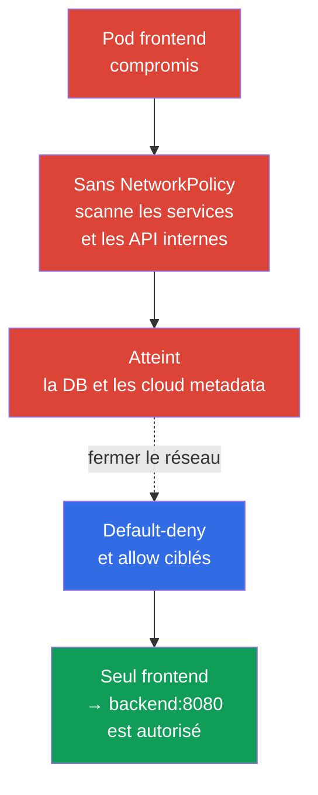
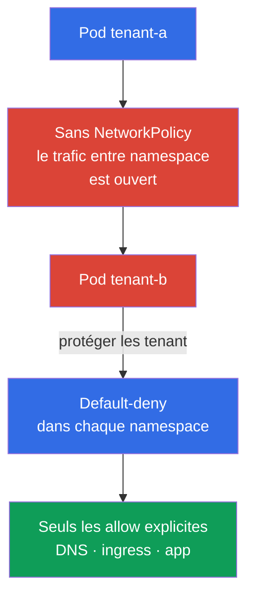

[Русская версия](ru.md) · [Eng version](README.md) · [Versión en español](es.md) · [Deutsche Version](de.md) · [ქართული ვერსია](ge.md) · [繁體中文版](tw.md) · [日本語版](jp.md)

# Chapitre 04. NetworkPolicy pour la sécurité

> **Problème.** Un RCE dans un Pod donne à un attaquant un foothold, et un réseau de Pod plat lui permet souvent de scanner les services, d’accéder à une DB, aux API internes et aux cloud metadata. C’est du lateral movement : la compromission d’une application devient une porte d’entrée vers d’autres systèmes.

> **La suite.** Dans les chapitres précédents, nous avons étudié le modèle de menaces et les mécanismes d’isolation de Linux. Réduisons maintenant les chemins réseau accessibles à un Pod compromis. **NetworkPolicy** transforme un réseau de Pod plat en un ensemble de connexions explicitement autorisées. C’est le domaine Cluster Setup (15 %) du CKS.

> **Prérequis CKA.** La syntaxe de base de `NetworkPolicy`, les sélecteurs et le modèle réseau des Pod sont expliqués dans le [chapitre 34 du CKA](../../../cka/course/34/fr.md). L’architecture du réseau des Pod et le rôle du CNI le sont dans le [chapitre 30 du CKA](../../../cka/course/30/fr.md). Nous examinons ici l’emploi de ces mécanismes comme moyens de protection, sans répéter les bases.

> 🧠 `NetworkPolicy` transforme un réseau plat en un ensemble minimal de chemins entre les workload.

## 04.1. Scénario d’attaque : un Pod compromis dans un réseau plat

Sans politiques, la plupart des CNI autorisent le trafic entre tous les Pod, et souvent aussi leur trafic sortant. Si l’attaquant obtient l’exécution de commandes dans `frontend`, il peut scanner les adresses des services, se connecter aux bases de données, interroger des API HTTP internes et tenter d’obtenir les cloud metadata. Ce déplacement après l’initial access s’appelle le **lateral movement**.



`NetworkPolicy` s’applique aux Pod selon leurs labels, et non au Service. Le Service reste un point de destination DNS pratique, mais le CNI prend sa décision selon le Pod source et de destination, l’IP, le port et les règles de la politique. Une politique ne remplace ni RBAC, ni TLS, ni une security group : c’est une couche de defense in depth.

> 🎯 Default-deny dans la direction nécessaire, puis allow ciblés selon les labels, le namespace et le port ; autorisez séparément DNS et les chemins inter-namespace nécessaires.

## 04.2. Default-deny : fermer d’abord, autoriser ensuite

Un point de départ sûr pour un namespace consiste à interdire tout ingress et egress. Une politique avec un `podSelector` vide sélectionne tous les Pod du namespace. Des listes `ingress` et `egress` vides signifient qu’aucune direction n’est autorisée.

```yaml
apiVersion: networking.k8s.io/v1
kind: NetworkPolicy
metadata:
  name: default-deny-ingress
  namespace: payments
spec:
  podSelector: {}
  policyTypes:
  - Ingress
---
apiVersion: networking.k8s.io/v1
kind: NetworkPolicy
metadata:
  name: default-deny-egress
  namespace: payments
spec:
  podSelector: {}
  policyTypes:
  - Egress
```

Les deux directions peuvent être déclarées dans une même politique :

```yaml
apiVersion: networking.k8s.io/v1
kind: NetworkPolicy
metadata:
  name: default-deny
  namespace: payments
spec:
  podSelector: {}
  policyTypes:
  - Ingress
  - Egress
```

L’ordre est important pour l’exploitation : commencez par définir la carte des connexions autorisées et préparez les politiques allow, puis appliquez default-deny et immédiatement les autorisations requises dans un rollout contrôlé. Sinon, les applications perdront DNS, l’accès aux dépendances, le trafic ingress/monitoring ou l’API externe. Dans le modèle standard de NetworkPolicy, les kubelet liveness/readiness/startup probes habituels entre le Pod et son nœud ne constituent pas le trafic typiquement bloqué par default-deny ; vérifiez néanmoins les particularités de host/CNI dans votre environnement. Pour un nouveau namespace isolé, il est utile de créer les deny avant de lancer les Pod de travail.

Les politiques sont additives : Kubernetes n’a ni ordre `deny`/`allow`, ni priorité entre objets `NetworkPolicy`. Pour chaque `Pod` et chaque direction, les règles allow de toutes les politiques applicables sont combinées séparément. Pour une connexion `source Pod → destination Pod`, les deux côtés sont vérifiés indépendamment : si le `Pod` source est isolé pour `Egress`, ses egress rules doivent autoriser la destination ; si le `Pod` de destination est isolé pour `Ingress`, ses ingress rules doivent autoriser la source. Lorsque les deux côtés sont isolés, les deux autorisations sont nécessaires. Le reply traffic d’une connexion autorisée n’exige pas de règle inverse distincte : il est implicitement autorisé. Une direction pour laquelle un `Pod` n’est isolé par aucune `NetworkPolicy` applicable ne requiert pas de règle allow supplémentaire.

| Politique | Ce qu’elle isole | Quand l’appliquer |
|---|---|---|
| Seulement `Ingress` | Les entrées vers les Pod sélectionnés | Lorsque les connexions sortantes ne peuvent pas encore être limitées |
| Seulement `Egress` | Le trafic sortant des Pod sélectionnés | Pour protéger metadata, API externes et exfiltration |
| `Ingress` et `Egress` | Les deux directions | L’objectif normal pour un namespace sensible |

## 04.3. Autorisations ciblées : selector, IP et port

Après default-deny, décrivez uniquement les connexions requises. L’exemple suivant autorise un Pod avec `app: frontend` à accéder à un Pod `app: backend` via TCP 8080 dans le même namespace :

```yaml
apiVersion: networking.k8s.io/v1
kind: NetworkPolicy
metadata:
  name: allow-frontend-to-backend
  namespace: payments
spec:
  podSelector:
    matchLabels:
      app: backend
  policyTypes:
  - Ingress
  ingress:
  - from:
    - podSelector:
        matchLabels:
          app: frontend
    ports:
    - protocol: TCP
      port: 8080
---
apiVersion: networking.k8s.io/v1
kind: NetworkPolicy
metadata:
  name: allow-frontend-egress-to-backend
  namespace: payments
spec:
  podSelector:
    matchLabels:
      app: frontend
  policyTypes:
  - Egress
  egress:
  - to:
    - podSelector:
        matchLabels:
          app: backend
    ports:
    - protocol: TCP
      port: 8080
```

Pour une connexion avec un Pod d’un autre namespace, un élément `from` ou `to` doit contenir les deux sélecteurs. Deux éléments distincts signifient un OR logique, et non une intersection.

```yaml
apiVersion: networking.k8s.io/v1
kind: NetworkPolicy
metadata:
  name: allow-monitoring-scrape
  namespace: payments
spec:
  podSelector:
    matchLabels:
      app: backend
  policyTypes:
  - Ingress
  ingress:
  - from:
    - namespaceSelector:
        matchLabels:
          kubernetes.io/metadata.name: monitoring
      podSelector:
        matchLabels:
          app.kubernetes.io/name: prometheus
    ports:
    - protocol: TCP
      port: 8080
```

`ipBlock` sert aux adresses hors du réseau de Pod : par exemple, un egress proxy d’entreprise ou un endpoint précis. Ne l’utilisez pas comme principal moyen de sélectionner un Pod : le recouvrement avec le pod CIDR et le comportement lors du SNAT dépendent de l’implémentation du CNI.

```yaml
apiVersion: networking.k8s.io/v1
kind: NetworkPolicy
metadata:
  name: allow-egress-proxy
  namespace: payments
spec:
  podSelector: {}
  policyTypes:
  - Egress
  egress:
  - to:
    - ipBlock:
        cidr: 192.0.2.10/32
    ports:
    - protocol: TCP
      port: 3128
```

Limitez simultanément la source, la destination et le port. Une politique avec seulement un `podSelector` sans `ports` admet tous les ports de la destination sélectionnée et est généralement plus large que nécessaire. Pour les ports numériques, l’API prend aussi en charge l’intervalle `endPort` (Stable depuis v1.25) : `endPort` doit être supérieur ou égal à `port`, et les deux valeurs doivent être numériques. L’application réelle des intervalles dépend du CNI, vérifiez-la donc dans votre environnement.

## 04.4. Isolation réseau des namespace et multi-tenancy

Un namespace n’est pas en soi une frontière réseau. Deux tenant peuvent avoir des namespace distincts, mais sans `NetworkPolicy`, leurs Pod peuvent souvent communiquer. Pour le multi-tenancy, définissez une baseline pour chaque namespace de tenant :

1. Default-deny ingress et egress pour tous les Pod.
2. Allow uniquement à l’intérieur de l’application : frontend -> backend, worker -> queue, monitoring -> metrics.
3. Exceptions explicites d’infrastructure : DNS, ingress controller, observability, egress proxy.
4. Labels de namespace distincts pour les connexions inter-équipes autorisées et processus de modification via review.



En pratique, il est utile d’appliquer la baseline automatiquement à l’aide d’un modèle de namespace ou d’un policy engine. Mais une `NetworkPolicy` ordinaire a une portée de namespace et ne remplace pas une cluster-wide policy propre à un CNI. Si vous avez besoin d’interdictions à l’échelle du cluster, de règles FQDN ou de filtrage L7, envisagez Cilium et ses politiques au chapitre 06.

> **Note de production, hors programme de l’examen.** La `NetworkPolicy` core `networking.k8s.io/v1` reste l’API portable principale pour le CKS. SIG Network développe une API cross-CNI distincte, `ClusterNetworkPolicy` (`policy.networking.k8s.io/v1alpha2`), mais c’est une API emerging/expérimentale dont la prise en charge dépend du CNI ; elle ne remplace ni l’API core, ni les extensions propres aux fournisseurs Cilium/Calico.

## 04.5. Piège de l’egress : DNS cesse de fonctionner

Après default-deny egress, l’application ne peut généralement plus résoudre les noms des services et les FQDN externes. Le symptôme ressemble à une erreur d’application, bien qu’une règle TCP vers le backend existe déjà : `curl` indique `Could not resolve host`, et `nslookup kubernetes.default.svc.cluster.local` attend un timeout.

Autorisez UDP et TCP 53 vers CoreDNS. Le label `k8s-app: kube-dns` est courant pour CoreDNS dans kube-system, mais confirmez les labels réels avant l’application avec `kubectl -n kube-system get pod --show-labels`.

```yaml
apiVersion: networking.k8s.io/v1
kind: NetworkPolicy
metadata:
  name: allow-dns-egress
  namespace: payments
spec:
  podSelector: {}
  policyTypes:
  - Egress
  egress:
  - to:
    - namespaceSelector:
        matchLabels:
          kubernetes.io/metadata.name: kube-system
      podSelector:
        matchLabels:
          k8s-app: kube-dns
    ports:
    - protocol: UDP
      port: 53
    - protocol: TCP
      port: 53
```

Vérifiez aussi l’architecture précise du cluster : NodeLocal DNSCache peut diriger les requêtes vers une IP locale, et Kubernetes managé peut avoir d’autres labels ou composants DNS. N’ouvrez pas l’egress `0.0.0.0/0` uniquement pour corriger DNS : cela annulerait l’objectif de l’egress isolation.

## 04.6. Vérification, diagnostic et limites du mécanisme

Assurez-vous d’abord que le CNI implémente réellement `NetworkPolicy`. Kubernetes accepte l’objet API indépendamment des capacités du CNI ; sans prise en charge, l’objet existe mais le trafic ne change pas. Consultez la documentation du CNI installé et créez un test contrôlé.

> 🎯 Prouvez la policy au moyen de requêtes TCP/UDP autorisées et interdites, contrôlées, vers un listener vérifié avec des paramètres de workload.

> 🔬 Limites de la spécification et CNI edge cases pour `hostNetwork`, NAT, node traffic et ICMP.

**Limites de NetworkPolicy : vérifiez-les séparément.**

- **Il s’agit d’un filtrage du trafic des Pod, et non d’une isolation complète des tenant.** NetworkPolicy réduit les chemins réseau accessibles, mais ne protège ni le kernel ni le node, Kubernetes API/RBAC, Secret, admission ou scheduler. Complétez-la avec TLS, host firewall et les moyens spécifiques au CNI.
- **L’exception du nœud local est définie par la spécification Kubernetes.** Le trafic vers et depuis un Pod avec le node sur lequel il s’exécute est toujours autorisé, indépendamment de l’IP du Pod ou du node ; l’ingress depuis le node local vers un Pod isolé est également autorisé. C’est une règle portable de la spécification, pas une différence entre CNI.
- **`hostNetwork` et les host-aware controls dépendent du CNI.** Ce trafic ressemble souvent à une IP de node, et `podSelector` et `namespaceSelector` peuvent donc agir différemment de ce qui est attendu. Vérifiez-le avec votre CNI.
- **Tous les protocoles n’ont pas la même sémantique portable.** La NetworkPolicy core la définit pour TCP, UDP et SCTP (SCTP sous réserve de prise en charge du CNI). Pour ICMP, ARP et les autres protocoles, allow/deny est implementation-defined ; `ping` ne prouve donc pas de façon portable que default-deny a fonctionné ou non.
- **Ne construisez pas de règles `ipBlock` portables autour du routage interne.** L’ordre de NAT et la policy dépendent de l’implémentation. Pour le Service `ClusterIP`, le pod CIDR ou une adresse après SNAT, sélectionnez les Pod avec des sélecteurs ; réservez `ipBlock` aux adresses externes documentées.
- **Les connexions déjà ouvertes se comportent différemment.** Après une modification de policy ou de labels, le CNI peut les interrompre ou les conserver jusqu’à leur fermeture. Prenez-le en compte lors d’un rollout, de l’incident response et des tests.

Avant le test, préparez un endpoint de contrôle connu et fonctionnel : par exemple, un Service `control` qui sélectionne un listener Pod portant le label exact `app=control` et répond sur TCP 8080. Vérifiez-le sans nouvelles policy ou depuis un Pod de diagnostic autorisé à l’avance. N’utilisez pas un nom DNS inexistant pour le test négatif : vous testeriez alors DNS, et non la politique. Vérifiez ensuite les labels réels de tous les participants :

```bash
# Trouver les Pod CNI et DNS, puis vérifier les politiques et labels créés
kubectl -n kube-system get pods -o wide
kubectl -n kube-system get pod --show-labels | grep -E 'coredns|kube-dns'
kubectl -n payments get networkpolicy
kubectl -n payments describe networkpolicy default-deny
kubectl -n payments get pod --show-labels

# Créer temporairement des sources avec les mêmes labels exacts que dans la policy.
# Pour la NetworkPolicy standard, ServiceAccount n’est pas un selector : il importe
# uniquement pour une CNI-specific identity policy ou d’autres extensions.
kubectl -n payments run netshoot \
  --image=nicolaka/netshoot:v0.16 \
  --labels=app=frontend \
  --restart=Never \
  --command -- sleep 3600
kubectl -n payments run netshoot-untrusted \
  --image=nicolaka/netshoot:v0.16 \
  --labels=app=untrusted \
  --restart=Never \
  --command -- sleep 3600
kubectl -n payments wait --for=condition=Ready pod/netshoot --timeout=90s
kubectl -n payments wait --for=condition=Ready pod/netshoot-untrusted --timeout=90s

# Confirmer d’abord DNS et l’endpoint de contrôle connu et fonctionnel
kubectl -n payments exec netshoot -- nslookup control.payments.svc.cluster.local
kubectl -n payments exec netshoot -- nc -vz -w 3 control 8080
```

Pour un résultat reproductible, exécutez les quatre cas. Dans le tableau, `backend`, `control` et `egress-denied-control` sont des Service avec des listener Pod sélectionnés respectivement par les labels exacts `app=backend`, `app=control` et `app=egress-denied-control`. Pour l’ingress négatif, autorisez temporairement uniquement l’egress de `app=untrusted` vers `app=backend:8080` ; pour l’egress négatif, autorisez l’ingress dans `app=egress-denied-control` depuis `app=frontend`, mais ne créez aucune egress rule pour cette destination. Ainsi, le refus peut être attribué à la direction vérifiée, et non à la politique de l’autre côté.

| Cas | Labels exacts et policy requise | Commande et résultat attendu |
|---|---|---|
| Ingress autorisé | `app=frontend` -> `app=backend` ; l’ingress du backend autorise frontend, l’egress du frontend autorise backend en TCP 8080 | `kubectl -n payments exec netshoot -- nc -vz -w 3 backend 8080` - succès |
| Ingress interdit | `app=untrusted` -> `app=backend` ; l’egress de untrusted est temporairement autorisé, mais l’ingress du backend n’admet que `app=frontend` | `kubectl -n payments exec netshoot-untrusted -- nc -vz -w 3 backend 8080` - refus |
| Egress autorisé | `app=frontend` -> `app=control` ; l’ingress de control admet frontend, l’egress de frontend autorise control en TCP 8080 | `kubectl -n payments exec netshoot -- nc -vz -w 3 control 8080` - succès |
| Egress interdit | `app=frontend` -> `app=egress-denied-control` ; l’ingress de destination admet frontend, mais l’egress de frontend n’autorise pas cette destination | `kubectl -n payments exec netshoot -- nc -vz -w 3 egress-denied-control 8080` - refus |

Pour une `NetworkPolicy` standard, utilisez pour vérifier le rôle de la source les mêmes labels, namespace, chemin IP et ports que ceux de l’application ; le même ServiceAccount n’est nécessaire que pour une CNI-specific identity policy. Exécutez le test négatif vers un listener confirmé à l’avance : `connection refused` ne prouve pas à lui seul le blocage, car il peut indiquer l’absence de listener, un Service/backend erroné ou un refus de l’application. Consignez la requête de contrôle réussie, l’indisponibilité attendue et, si le CNI fournit de la telemetry, l’événement deny/drop ou le flow log ; supprimez ensuite les test-policy et Pod temporaires.

| Symptôme | Vérification et cause probable |
|---|---|
| La politique existe, le trafic n’est pas bloqué | Le CNI ne prend pas en charge `NetworkPolicy`, la politique a sélectionné de mauvais labels ou la direction n’est pas isolée |
| Toutes les requêtes ont cessé de fonctionner | Default-deny egress a été appliqué sans DNS ni allow vers une dépendance obligatoire |
| Le trafic entre namespace est trop largement autorisé | `namespaceSelector` et `podSelector` sont écrits dans des éléments distincts de la liste, donc OR s’est appliqué |
| La policy ne sélectionne pas le Pod | Le label est défini dans le Deployment template différemment que dans `podSelector` ; vérifier `kubectl get pod --show-labels` |
| Une adresse externe n’est pas bloquée | Aucune egress isolation n’est définie, `ipBlock` ne correspond pas à l’adresse réelle, l’ordre de NAT diffère de celui attendu ou le trafic contourne le point attendu |

Pour le diagnostic pédagogique ci-dessus, le tag `nicolaka/netshoot:v0.16` est utilisé ; le tag peut changer ou être absent dans un environnement offline. En production et dans les labs reproductibles, pin-nez l’image par digest et assurez au préalable son pre-pull/la disponibilité du registry.

> 🏭 Inventaire des flux, staging et canary, observation de DNS/erreurs/flows, rollback vérifié et baseline versionnée.

## 04.7. Comment l’appliquer en production

- **Baseline as code.** Default-deny et les règles allow minimales sont conservés avec les manifests des workload, vérifiés comme du code et appliqués lors de la création du namespace.
- **Carte des dépendances avant d’activer deny.** L’équipe documente les connexions entrantes et sortantes, y compris DNS, health checks, metrics, registry, proxy et les API SaaS externes. Cela réduit le risque d’incident pendant le rollout.
- **Les labels comme contrat.** Des labels stables pour le rôle de l’application et le tenant sont documentés et vérifiés ; la modification du schéma de labels fait l’objet d’une review comme un contrat d’API. Des labels accidentels ou trop généraux rendent la politique plus large que prévu.
- **Preview avant enforcement.** Avant d’activer une nouvelle policy, évaluez son impact à partir de la carte des flux, testez-la en staging et, si le CNI le permet, utilisez le mode audit/observe. Vérifiez les chemins autorisés et interdits avant le rollout de l’enforcement.
- **Observability.** Avant et après la modification de la politique, examinez les flow logs du CNI, les métriques d’erreurs et la latency. Pour Cilium, il s’agit de Hubble ; l’approche est étudiée au chapitre 06.
- **Protection en couches.** Les egress policy complètent cloud firewall, private endpoints, identity et TLS. Les destinations particulièrement sensibles, y compris metadata, sont protégées à plusieurs niveaux.

## 04.8. Mini-glossaire

- **NetworkPolicy** - Objet API Kubernetes qui définit les ingress et egress autorisés pour les Pod sélectionnés.
- **Default-deny** - Politique qui isole une direction par défaut jusqu’à ce qu’une autre politique l’autorise.
- **Ingress** - Trafic entrant dans un Pod.
- **Egress** - Trafic sortant d’un Pod.
- **podSelector** - Sélection des Pod par labels dans le namespace de la politique.
- **namespaceSelector** - Sélection de namespace par labels pour une règle inter-namespace.
- **ipBlock** - Règle pour un CIDR ou une adresse IP individuelle.
- **Lateral movement** - Déplacement de l’attaquant d’une workload compromise vers d’autres systèmes.
- **CNI** - Plugin réseau du cluster ; c’est lui qui doit mettre en œuvre NetworkPolicy.

## 04.9. Bilan du chapitre

- Un réseau de Pod plat offre à une workload compromise un chemin de lateral movement ; `NetworkPolicy` réduit cette surface d’attaque.
- Commencez par default-deny ingress et egress, puis n’autorisez que les directions, sources, destinations et ports nécessaires.
- Les politiques sont additives : une autorisation doit exister pour la source egress isolée et la destination ingress isolée.
- Pour une connexion inter-namespace, placez `namespaceSelector` et `podSelector` dans un même élément de règle lorsque les deux conditions sont requises.
- Egress default-deny exige une autorisation DNS explicite, habituellement vers CoreDNS en UDP/TCP 53.
- L’objet API ne garantit pas à lui seul le filtrage : il faut un CNI qui prend en charge `NetworkPolicy` et une vérification du trafic autorisé et interdit.

## 04.10. Utilité à l’examen et dans le travail réel

**À l’examen.** Vous devez créer rapidement default-deny pour un namespace, autoriser un chemin Pod-to-Pod donné, DNS ou IP/CIDR et confirmer le résultat avec `kubectl exec`. Lisez attentivement la direction à limiter : ingress, egress ou les deux. Une erreur typique consiste à autoriser l’ingress du backend, mais à oublier l’egress du frontend ou DNS.

**Dans le travail réel.** NetworkPolicy limite les dommages lors de la compromission d’une application et sépare les tenant les uns des autres. La compétence la plus utile n’est pas d’écrire une grande règle, mais de dresser une carte minimale des dépendances réseau réelles et de réaliser un rollout sûr sans perturber le service.

> ### 🔴 Regard de l’attaquant
> **Asset:** Service backend et API internes.
>
> **Starting foothold:** RCE dans le Pod `frontend`.
>
> **Attacker objective:** découvrir les endpoints internes et atteindre le backend.
>
> **Abuse path:** DNS discovery -> accès via le Service -> accès direct au Pod/IP si le réseau n’est pas isolé.
>
> **Expected evidence:** CNI/Hubble flows, requêtes DNS et dropped packets lors du blocage.
>
> **Control:** default-deny pour ingress et egress, plus des règles explicites selon identity/labels et les ports.
>
> **Retest:** la même requête depuis `frontend` ne passe que vers le backend autorisé ; une requête depuis un Pod non approuvé est bloquée.

## 04.11. Questions d’auto-évaluation

<details>
<summary>1. Pourquoi l’absence de NetworkPolicy facilite-t-elle le lateral movement après la compromission d’un Pod ?</summary>

Sans politiques, la plupart des CNI autorisent le trafic entre les Pod et souvent le trafic sortant. Après avoir obtenu un shell ou un RCE dans `frontend`, l’attaquant peut scanner les Service, se connecter à une DB, aux API internes et à un metadata endpoint ; default-deny avec des règles allow ciblées réduit ce chemin.
</details>

<details>
<summary>2. Que signifie un `podSelector: {}` vide dans une politique de namespace ?</summary>

Un `podSelector` vide sélectionne tous les Pod du namespace où la politique est créée. Associé à `policyTypes: Ingress` ou `Egress` et à des listes de règles vides, il isole la direction correspondante pour tous ces Pod.
</details>

<details>
<summary>3. Pourquoi default-deny ingress du backend ne suffit-il pas pour la connexion frontend -> backend quand l’egress est isolé ?</summary>

Ingress et egress sont vérifiés indépendamment pour chaque côté de la connexion. Si le backend est isolé par ingress, sa règle doit autoriser frontend, mais avec un egress isolé, frontend doit disposer d’une autorisation distincte vers backend:8080 ; le trafic de réponse n’est implicitement autorisé que pour une connexion déjà autorisée.
</details>

<details>
<summary>4. Quelle est la différence entre deux éléments `from` séparés et un élément unique avec `namespaceSelector` et `podSelector` ?</summary>

Deux éléments séparés de la liste signifient un OR logique : l’un peut autoriser tout le namespace sélectionné, l’autre les Pod ayant le label dans le namespace de la politique. Lorsque les deux conditions sont requises, `namespaceSelector` et `podSelector` sont placés dans un même élément de règle, et la source doit alors leur correspondre simultanément.
</details>

<details>
<summary>5. Pourquoi DNS cesse-t-il souvent de fonctionner après default-deny egress et quels protocoles faut-il autoriser ?</summary>

Default-deny bloque les requêtes des Pod vers CoreDNS, et les noms de Service et FQDN externes ne sont donc plus résolus. Il faut autoriser vers les DNS endpoints réels du cluster UDP 53 et TCP 53, après avoir vérifié les labels CoreDNS et l’éventuelle utilisation de NodeLocal DNSCache.
</details>

<details>
<summary>6. Pourquoi la présence d’un objet `NetworkPolicy` ne prouve-t-elle pas que le trafic est bloqué ?</summary>

Kubernetes accepte l’objet API indépendamment de la capacité du CNI installé à appliquer NetworkPolicy. Il faut confirmer la prise en charge du CNI, les labels et directions réels, puis tester un listener connu à l’avance par des requêtes autorisées et interdites ; `connection refused` ne prouve pas à lui seul le blocage par une policy.
</details>

<details>
<summary>7. Quelles dépendances, outre les services applicatifs, faut-il prendre en compte avant le rollout de default-deny ?</summary>

Il faut prendre en compte DNS, ingress controller, monitoring/metrics, egress proxy, registry, API SaaS externes et health checks propres à l’environnement. Avant d’appliquer deny, établissez la carte des flux autorisés, préparez les politiques allow et vérifiez-les dans un rollout contrôlé afin de ne pas perturber le service.
</details>

## Pratique

🧪 Lab 101 (NetworkPolicy : default-deny, isolation, metadata) : [tasks/cks/labs/101](../../labs/101/README_FR.MD)

🌐 Pratique interactive supplémentaire (killer.sh/killercoda, ressource externe) : [networkpolicy-create-default-deny](https://killercoda.com/killer-shell-cks/scenario/networkpolicy-create-default-deny) · [networkpolicy-namespace-communication](https://killercoda.com/killer-shell-cks/scenario/networkpolicy-namespace-communication)

## Ressources de référence

- [Kubernetes : Network Policies](https://kubernetes.io/docs/concepts/services-networking/network-policies/)
- [API Kubernetes Network Policy](https://network-policy-api.sigs.k8s.io/)

---
[Table des matières](../README_FR.md) · [Chapitre 03](../03/fr.md) · [Chapitre 05](../05/fr.md)
