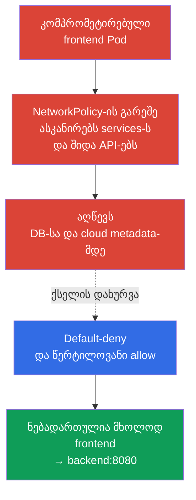
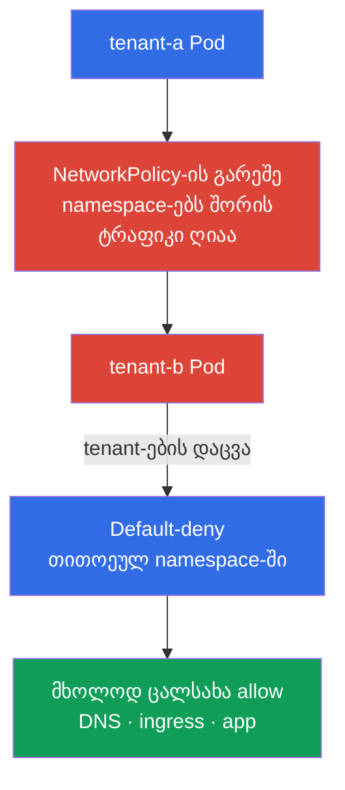

[Русская версия](ru.md) · [Eng version](README.md) · [Versión en español](es.md) · [Version française](fr.md) · [Deutsche Version](de.md) · [繁體中文版](tw.md) · [日本語版](jp.md)

# თავი 04. NetworkPolicy უსაფრთხოებისთვის

> **პრობლემა.** RCE ერთ Pod-ში აძლევს თავდამსხმელს foothold-ს, ხოლო ბრტყელი pod-ქსელი ხშირად საშუალებას აძლევს მას იქიდან დაასკანიროს services, მიწვდეს DB-ს, შიდა API-ებს და cloud metadata-ს. ეს არის lateral movement: ერთი აპლიკაციის კომპრომეტაცია ხდება შესასვლელად სხვა სისტემებისკენ.

> **რა არის შემდეგ.** წინა თავებში განვიხილეთ საფრთხის მოდელი და Linux-ის იზოლაციის მექანიზმები. ახლა შევავიწროვებთ ქსელურ გზებს, რომლებიც ხელმისაწვდომია კომპრომეტირებული Pod-ისთვის. **NetworkPolicy** ბრტყელ pod-ქსელს გარდაქმნის ცალსახად ნებადართული კავშირების ერთობლიობად. ეს არის CKS-ის Cluster Setup (15%) დომენი.

> **რა გჭირდებათ CKA-დან.** `NetworkPolicy`-ის საბაზისო სინტაქსი, სელექტორები და Pod-ქსელის მოდელი განხილულია [CKA-ის 34-ე თავში](../../../cka/course/34/ge.md). pod-ქსელის მოწყობა და CNI-ის როლი - [CKA-ის 30-ე თავში](../../../cka/course/30/ge.md). აქ განვიხილავთ ამ მექანიზმების გამოყენებას დაცვის საშუალებად და არა ვიმეორებთ საფუძვლებს.

> 🧠 `NetworkPolicy` ბრტყელ ქსელს გარდაქმნის workload-ებს შორის მინიმალურ გზათა ერთობლიობად.

## 04.1. თავდასხმის სცენარი: კომპრომეტირებული Pod ბრტყელ ქსელში

პოლიტიკების გარეშე უმეტესი CNI ატარებს ტრაფიკს ყველა Pod-ს შორის, ხშირად - მათ გამავალ ტრაფიკსაც. თუ თავდამსხმელმა მიიღო ბრძანებების შესრულება `frontend`-ში, მას შეუძლია დაასკანიროს services-ის მისამართები, დაუკავშირდეს ბაზებს, გაუგზავნოს მოთხოვნები შიდა HTTP API-ებს და შეეცადოს მიიღოს cloud metadata. საწყისი წვდომის შემდგომ ასეთ გადაადგილებას უწოდებენ **lateral movement**-ს.



`NetworkPolicy` მოქმედებს Pod-ებზე labels-ის მიხედვით და არა Service-ზე. Service რჩება მოსახერხებელ DNS-დანიშნულებად, მაგრამ CNI იღებს გადაწყვეტილებას საწყისი და დანიშნულების Pod-ის, IP-ის, პორტისა და პოლიტიკის წესების მიხედვით. პოლიტიკა არ ანაცვლებს RBAC-ს, TLS-ს ან security group-ს: ეს defense in depth-ის ერთი შრეა.

> 🎯 საჭირო მიმართულებისთვის ჯერ default-deny, შემდეგ წერტილოვანი allow labels-ის, namespace-ისა და პორტის მიხედვით; ცალკე დაუშვით DNS და საჭირო namespace-შორისი გზები.

## 04.2. Default-deny: ჯერ დახურვა, შემდეგ დაშვება

Namespace-ისთვის უსაფრთხო საწყისი პოზიციაა მთლიანი ingress-ისა და egress-ის აკრძალვა. პოლიტიკა ცარიელი `podSelector`-ით ირჩევს namespace-ის ყველა Pod-ს. ცარიელი `ingress` და `egress` სიები ნიშნავს, რომ არცერთი მიმართულება ნებადართული არაა.

```yaml
apiVersion: networking.k8s.io/v1
kind: NetworkPolicy
metadata:
  name: default-deny-ingress
  namespace: payments
spec:
  podSelector: {}
  policyTypes:
  - Ingress
---
apiVersion: networking.k8s.io/v1
kind: NetworkPolicy
metadata:
  name: default-deny-egress
  namespace: payments
spec:
  podSelector: {}
  policyTypes:
  - Egress
```

ორივე მიმართულების გამოცხადება ერთი პოლიტიკითაც შეიძლება:

```yaml
apiVersion: networking.k8s.io/v1
kind: NetworkPolicy
metadata:
  name: default-deny
  namespace: payments
spec:
  podSelector: {}
  policyTypes:
  - Ingress
  - Egress
```

ექსპლუატაციისთვის თანმიმდევრობას მნიშვნელობა აქვს: ჯერ განსაზღვრეთ დასაშვები კავშირების რუკა და მოამზადეთ allow-პოლიტიკები, შემდეგ გამოიყენეთ default-deny და დაუყოვნებლივ საჭირო დაშვებები კონტროლირებადი rollout-ის ფარგლებში. სხვაგვარად აპლიკაციები დაკარგავენ DNS-ს, დამოკიდებულებებზე წვდომას, ingress/monitoring-ტრაფიკს ან გარე API-ს. ჩვეულებრივი kubelet liveness/readiness/startup probes Pod-სა და მის node-ს შორის NetworkPolicy-ის სტანდარტულ მოდელში, როგორც წესი, არ წარმოადგენს ტიპურ ტრაფიკს, რომელსაც default-deny ბლოკავს; თუმცა host/CNI-ის თავისებურებები ყოველთვის შეამოწმეთ საკუთარ გარემოში. ახალი იზოლირებული namespace-ისთვის სასარგებლოა deny-ის შექმნა სამუშაო Pod-ების გაშვებამდე.

პოლიტიკები ადიტიურია: Kubernetes-ს არ აქვს `deny`/`allow`-ის რიგითობა და პრიორიტეტი `NetworkPolicy` ობიექტებს შორის. თითოეული `Pod`-ისა და თითოეული მიმართულებისთვის ცალ-ცალკე ერთიანდება ყველა მოქმედი პოლიტიკის allow-წესები. `source Pod → destination Pod` კავშირისთვის მხარეები მოწმდება დამოუკიდებლად: თუ source `Pod` იზოლირებულია `Egress`-ისთვის, მისმა egress rules-მა უნდა დაუშვას დანიშნულება; თუ destination `Pod` იზოლირებულია `Ingress`-ისთვის, მისმა ingress rules-მა უნდა დაუშვას წყარო. როცა ორივე მხარეა იზოლირებული, საჭიროა ორივე დაშვება. ნებადართული კავშირის საპასუხო ტრაფიკს ცალკე საპასუხო წესი არ სჭირდება: ის ავტომატურად ნებადართულია. მიმართულება, რომლისთვისაც `Pod` არცერთი მოქმედი `NetworkPolicy`-ით იზოლირებული არაა, დამატებით allow-წესს არ საჭიროებს.

| პოლიტიკა | რას იზოლირებს | როდის გამოვიყენოთ |
|---|---|---|
| მხოლოდ `Ingress` | შესვლა არჩეულ Pod-ებში | როცა გამავალი კავშირების შეზღუდვა ჯერ არ შეიძლება |
| მხოლოდ `Egress` | არჩეული Pod-ების გამავალი ტრაფიკი | metadata-ს, გარე API-ებისა და exfiltration-ისგან დასაცავად |
| `Ingress` და `Egress` | ორივე მიმართულება | ჩვეულებრივი მიზანი მგრძნობიარე namespace-ისთვის |

## 04.3. წერტილოვანი დაშვებები: selector, IP და პორტი

default-deny-ის შემდეგ აღწერეთ მხოლოდ საჭირო კავშირები. შემდეგი მაგალითი Pod-ს `app: frontend`-ით უშვებს Pod-თან `app: backend` TCP 8080-ით იმავე namespace-ში:

```yaml
apiVersion: networking.k8s.io/v1
kind: NetworkPolicy
metadata:
  name: allow-frontend-to-backend
  namespace: payments
spec:
  podSelector:
    matchLabels:
      app: backend
  policyTypes:
  - Ingress
  ingress:
  - from:
    - podSelector:
        matchLabels:
          app: frontend
    ports:
    - protocol: TCP
      port: 8080
---
apiVersion: networking.k8s.io/v1
kind: NetworkPolicy
metadata:
  name: allow-frontend-egress-to-backend
  namespace: payments
spec:
  podSelector:
    matchLabels:
      app: frontend
  policyTypes:
  - Egress
  egress:
  - to:
    - podSelector:
        matchLabels:
          app: backend
    ports:
    - protocol: TCP
      port: 8080
```

სხვა namespace-ის Pod-თან კავშირისთვის ერთმა `from`- ან `to`-ელემენტმა უნდა შეიცავოს ორივე სელექტორი. ორი ცალკეული ელემენტი ნიშნავს ლოგიკურ OR-ს და არა თანაკვეთას.

```yaml
apiVersion: networking.k8s.io/v1
kind: NetworkPolicy
metadata:
  name: allow-monitoring-scrape
  namespace: payments
spec:
  podSelector:
    matchLabels:
      app: backend
  policyTypes:
  - Ingress
  ingress:
  - from:
    - namespaceSelector:
        matchLabels:
          kubernetes.io/metadata.name: monitoring
      podSelector:
        matchLabels:
          app.kubernetes.io/name: prometheus
    ports:
    - protocol: TCP
      port: 8080
```

`ipBlock` საჭიროა pod-ქსელის გარეთ არსებული მისამართებისთვის: მაგალითად, კორპორატიული egress proxy-სთვის ან კონკრეტული endpoint-ისთვის. არ გამოიყენოთ ის Pod-ების არჩევის ძირითად საშუალებად: pod CIDR-თან გადაკვეთა და ქცევა SNAT-ის დროს დამოკიდებულია CNI-ის რეალიზაციაზე.

```yaml
apiVersion: networking.k8s.io/v1
kind: NetworkPolicy
metadata:
  name: allow-egress-proxy
  namespace: payments
spec:
  podSelector: {}
  policyTypes:
  - Egress
  egress:
  - to:
    - ipBlock:
        cidr: 192.0.2.10/32
    ports:
    - protocol: TCP
      port: 3128
```

ერთდროულად შეზღუდეთ წყარო, დანიშნულება და პორტი. პოლიტიკა, რომელსაც აქვს მხოლოდ `podSelector` `ports`-ის გარეშე, უშვებს არჩეული დანიშნულების ყველა პორტს და, როგორც წესი, საჭიროზე უფრო ფართოა. რიცხვითი პორტებისთვის API ასევე უჭერს მხარს `endPort` დიაპაზონს (Stable v1.25-დან): `endPort` არ უნდა იყოს `port`-ზე ნაკლები, და ორივე მნიშვნელობა უნდა იყოს რიცხვითი. დიაპაზონის რეალური მხარდაჭერა დამოკიდებულია CNI-ზე, ამიტომ შეამოწმეთ ის საკუთარ გარემოში.

## 04.4. Namespace-ის ქსელური იზოლაცია და multi-tenancy

Namespace თავისთავად ქსელური საზღვარი არაა. ორ tenant-ს შეიძლება ჰქონდეს სხვადასხვა namespace, მაგრამ `NetworkPolicy`-ის გარეშე მათი Pod-ები ხშირად შეძლებენ ერთმანეთთან კომუნიკაციას. multi-tenancy-სთვის დააყენეთ baseline თითოეული tenant namespace-ისთვის:

1. Default-deny ingress და egress ყველა Pod-ისთვის.
2. დაშვება მხოლოდ აპლიკაციის შიგნით: frontend -> backend, worker -> queue, monitoring -> metrics.
3. ცალსახა ინფრასტრუქტურული გამონაკლისები: DNS, ingress controller, observability, egress proxy.
4. ცალკეული namespace labels გუნდებს შორის ნებადართული კავშირებისთვის და მათი ცვლილების პროცესი review-ს გავლით.



პრაქტიკაში სასარგებლოა baseline-ის ავტომატური გამოყენება namespace-ის შაბლონით ან policy-ძრავით. მაგრამ ჩვეულებრივ `NetworkPolicy`-ს namespace-ის ფარგლები აქვს და არ ანაცვლებს კონკრეტული CNI-ის cluster-wide policy-ს. თუ საჭიროა კლასტერის მასშტაბით აკრძალვები, FQDN-წესები ან L7-ფილტრაცია, განიხილეთ Cilium და მისი პოლიტიკები 06-ე თავში.

> **Production note, არ არის საგამოცდო მასალა.** ბირთვული `networking.k8s.io/v1` `NetworkPolicy` რჩება CKS-ისთვის ძირითად გადატანად API-დ. SIG Network ავითარებს ცალკე cross-CNI API-ს `ClusterNetworkPolicy` (`policy.networking.k8s.io/v1alpha2`), მაგრამ ეს emerging/ექსპერიმენტული API-ა, რომლის მხარდაჭერა დამოკიდებულია CNI-ზე; ის არ ანაცვლებს არც ბირთვულ API-ს და არც Cilium/Calico-ის vendor-specific გაფართოებებს.

## 04.5. Egress-ის ხაფანგი: DNS წყდება

Default-deny egress-ის შემდეგ აპლიკაციას, როგორც წესი, არ შეუძლია services-ის სახელებისა და გარე FQDN-ების გარჩევა. სიმპტომი აპლიკაციის შეცდომას ჰგავს, თუმცა backend-თან TCP-წესი უკვე არსებობს: `curl` აბრუნებს `Could not resolve host`-ს, ხოლო `nslookup kubernetes.default.svc.cluster.local` timeout-ს ელოდება.

დაუშვით UDP და TCP 53 CoreDNS-თან. ლეიბლი `k8s-app: kube-dns` ჩვეულებრივია CoreDNS-ისთვის kube-system-ში, მაგრამ გამოყენებამდე დაადასტურეთ რეალური labels ბრძანებით `kubectl -n kube-system get pod --show-labels`.

```yaml
apiVersion: networking.k8s.io/v1
kind: NetworkPolicy
metadata:
  name: allow-dns-egress
  namespace: payments
spec:
  podSelector: {}
  policyTypes:
  - Egress
  egress:
  - to:
    - namespaceSelector:
        matchLabels:
          kubernetes.io/metadata.name: kube-system
      podSelector:
        matchLabels:
          k8s-app: kube-dns
    ports:
    - protocol: UDP
      port: 53
    - protocol: TCP
      port: 53
```

ასევე შეამოწმეთ კლასტერის კონკრეტული არქიტექტურა: NodeLocal DNSCache-მა შეიძლება მოთხოვნები ლოკალურ IP-ზე გადაამისამართოს, ხოლო managed Kubernetes-ს შეიძლება ჰქონდეს სხვა labels ან DNS-კომპონენტები. არ გახსნათ egress `0.0.0.0/0`-ისთვის მხოლოდ DNS-ის გასასწორებლად: ეს გააუქმებს egress isolation-ის მიზანს.

## 04.6. შემოწმება, დიაგნოსტიკა და მექანიზმის საზღვრები

ჯერ დარწმუნდით, რომ CNI საერთოდ ახორციელებს `NetworkPolicy`-ს. თავად API-ობიექტს Kubernetes იღებს CNI-ის შესაძლებლობებისგან დამოუკიდებლად; მხარდაჭერის არარსებობისას ობიექტი არსებობს, მაგრამ ტრაფიკი არ იცვლება. შეამოწმეთ დაყენებული CNI-ის დოკუმენტაცია და შექმენით კონტროლირებადი ტესტი.

> 🎯 დაამტკიცეთ პოლიტიკა კონტროლირებადი ნებადართული და აკრძალული TCP/UDP-მოთხოვნებით შემოწმებული listener-ისკენ, workload-ის პარამეტრების გამოყენებით.

> 🔬 სპეციფიკაციისა და CNI-ის edge case-ების საზღვრები `hostNetwork`-ისთვის, NAT-ისთვის, node-ტრაფიკისა და ICMP-სთვის.

**NetworkPolicy-ის საზღვრები: შეამოწმეთ ისინი ცალ-ცალკე.**

- **ეს Pod-ტრაფიკის ფილტრაციაა და არა tenant-ის სრული იზოლაცია.** NetworkPolicy ავიწროებს ხელმისაწვდომ ქსელურ გზებს, მაგრამ არ იცავს kernel-სა და node-ს, Kubernetes API/RBAC-ს, Secret-ს, admission-ს ან scheduler-ს. მას ავსებს TLS, host firewall და კონკრეტული CNI-ის საშუალებები.
- **Local-node გამონაკლისი განსაზღვრულია Kubernetes-ის სპეციფიკაციით.** ტრაფიკი Pod-ში და Pod-იდან იმ node-თან, რომელზეც ის გაშვებულია, ყოველთვის ნებადართულია, Pod-ის ან node-ის IP-ის მიუხედავად; ასევე ნებადართულია ingress ლოკალური node-იდან იზოლირებული Pod-ისკენ. ეს არის სპეციფიკაციის გადატანადი წესი და არა CNI-ის განსხვავება.
- **`hostNetwork` და host-aware controls დამოკიდებულია CNI-ზე.** ასეთი ტრაფიკი ხშირად node-ის IP-ს ჰგავს, ამიტომ `podSelector`-მა და `namespaceSelector`-მა შეიძლება არ იმუშაონ მოსალოდნელნაირად. შეამოწმეთ ეს საკუთარ CNI-ში.
- **ყველა პროტოკოლს ერთნაირი გადატანადი სემანტიკა არა აქვს.** ბირთვული NetworkPolicy მას განსაზღვრავს TCP-სთვის, UDP-სთვის და SCTP-სთვის (SCTP - CNI-ის მხარდაჭერის შემთხვევაში). ICMP-სთვის, ARP-სთვის და სხვა პროტოკოლებისთვის allow/deny დამოკიდებულია რეალიზაციაზე, ამიტომ `ping` გადატანადად არ ადასტურებს, გაშვდა თუ არა default-deny.
- **არ ააგოთ გადატანადი `ipBlock` წესები შიდა მარშრუტიზაციის გარშემო.** NAT-ისა და policy-ის თანმიმდევრობა დამოკიდებულია რეალიზაციაზე. `ClusterIP` Service-ისთვის, pod CIDR-ისთვის ან SNAT-ის შემდგომი მისამართისთვის აირჩიეთ Pod-ები სელექტორებით; `ipBlock` დატოვეთ დოკუმენტირებული გარე მისამართებისთვის.
- **უკვე გახსნილი კავშირები სხვადასხვანაირად იქცევა.** policy-ის ან labels-ის ცვლილების შემდეგ CNI შეიძლება მათ გაწყვიტოს ან დატოვოს დახურვამდე. გაითვალისწინეთ ეს rollout-ის, incident response-ისა და ტესტების დროს.

ტესტამდე მოამზადეთ ცნობილი, გამართული საკონტროლო endpoint: მაგალითად, Service `control`, რომელიც ირჩევს listener Pod-ს ზუსტი ლეიბლით `app=control` და პასუხობს TCP 8080-ზე. შეამოწმეთ ის ახალი პოლიტიკების გარეშე ან წინასწარ ნებადართული დიაგნოსტიკური Pod-იდან. არ გამოიყენოთ უარყოფითი ტესტისთვის არარსებული DNS-სახელი: ასე შემოწმდება DNS და არა პოლიტიკა. შემდეგ დაადასტურეთ ყველა მონაწილის რეალური labels:

```bash
# CNI-ისა და DNS-pods-ის პოვნა, შემდეგ შექმნილი პოლიტიკებისა და labels-ის შემოწმება
kubectl -n kube-system get pods -o wide
kubectl -n kube-system get pod --show-labels | grep -E 'coredns|kube-dns'
kubectl -n payments get networkpolicy
kubectl -n payments describe networkpolicy default-deny
kubectl -n payments get pod --show-labels

# დროებით შექმენით წყაროები ზუსტად იმავე labels-ით, რაც policy-შია.
# სტანდარტული NetworkPolicy-სთვის ServiceAccount არ არის selector: ის მნიშვნელოვანია
# მხოლოდ CNI-specific identity policy-სთვის ან სხვა გაფართოებებისთვის.
kubectl -n payments run netshoot \
  --image=nicolaka/netshoot:v0.16 \
  --labels=app=frontend \
  --restart=Never \
  --command -- sleep 3600
kubectl -n payments run netshoot-untrusted \
  --image=nicolaka/netshoot:v0.16 \
  --labels=app=untrusted \
  --restart=Never \
  --command -- sleep 3600
kubectl -n payments wait --for=condition=Ready pod/netshoot --timeout=90s
kubectl -n payments wait --for=condition=Ready pod/netshoot-untrusted --timeout=90s

# ჯერ დაადასტურეთ DNS და ცნობილი გამართული საკონტროლო endpoint
kubectl -n payments exec netshoot -- nslookup control.payments.svc.cluster.local
kubectl -n payments exec netshoot -- nc -vz -w 3 control 8080
```

აღწარმოებადი შედეგისთვის შეასრულეთ ოთხი შემთხვევა. ცხრილში `backend`, `control` და `egress-denied-control` არის Service-ები listener Pod-ებით, რომლებიც არჩეულია, შესაბამისად, ზუსტი labels-ით `app=backend`, `app=control` და `app=egress-denied-control`. უარყოფითი ingress-ისთვის დროებით დაუშვით მხოლოდ egress `app=untrusted`-დან `app=backend:8080`-სკენ; უარყოფითი egress-ისთვის დაუშვით ingress `app=egress-denied-control`-ში `app=frontend`-იდან, მაგრამ არ შექმნათ egress rule ამ დანიშნულებისთვის. მაშინ უარს შეიძლება მიეწეროს შესამოწმებელ მიმართულებას და არა მეორე მხარის პოლიტიკას.

| შემთხვევა | ზუსტი labels და საჭირო policy | ბრძანება და მოსალოდნელი შედეგი |
|---|---|---|
| ნებადართული ingress | `app=frontend` -> `app=backend`; backend-ის ingress უშვებს frontend-ს, frontend-ის egress უშვებს backend-ს TCP 8080-ზე | `kubectl -n payments exec netshoot -- nc -vz -w 3 backend 8080` - წარმატება |
| აკრძალული ingress | `app=untrusted` -> `app=backend`; untrusted-ის egress დროებით ნებადართულია, მაგრამ backend-ის ingress მხოლოდ `app=frontend`-ს უშვებს | `kubectl -n payments exec netshoot-untrusted -- nc -vz -w 3 backend 8080` - უარი |
| ნებადართული egress | `app=frontend` -> `app=control`; control-ის ingress უშვებს frontend-ს, frontend-ის egress უშვებს control-ს TCP 8080-ზე | `kubectl -n payments exec netshoot -- nc -vz -w 3 control 8080` - წარმატება |
| აკრძალული egress | `app=frontend` -> `app=egress-denied-control`; დანიშნულების ingress უშვებს frontend-ს, მაგრამ frontend-ის egress არ უშვებს ამ დანიშნულებას | `kubectl -n payments exec netshoot -- nc -vz -w 3 egress-denied-control 8080` - უარი |

სტანდარტული `NetworkPolicy`-სთვის წყაროს როლის შესამოწმებლად გამოიყენეთ იგივე labels, namespace, IP-გზა და პორტები, რაც აპლიკაციას აქვს; იგივე ServiceAccount საჭიროა მხოლოდ CNI-specific identity policy-სთვის. უარყოფითი ტესტი ჩაატარეთ წინასწარ დადასტურებულ listener-ზე: `connection refused` თავისთავად ბლოკირებას არ ადასტურებს, რადგან შესაძლებელია listener-ის არარსებობა, არასწორი Service/backend ან აპლიკაციის უარყოფა. დააფიქსირეთ წარმატებული საკონტროლო მოთხოვნა, მოსალოდნელი მიუწვდომლობა და, თუ CNI აწვდის telemetry-ს, deny/drop event ან flow log; შემდეგ წაშალეთ დროებითი test-policy და Pod-ები.

| სიმპტომი | შემოწმება და სავარაუდო მიზეზი |
|---|---|
| პოლიტიკა არსებობს, ტრაფიკი არ იბლოკება | CNI არ უჭერს მხარს `NetworkPolicy`-ს, პოლიტიკამ არასწორი labels აირჩია ან მიმართულება იზოლირებული არაა |
| ყველა მოთხოვნამ წყდა მუშაობა | Default-deny egress გამოყენებულია DNS-ის ან სავალდებულო დამოკიდებულებისთვის allow-ის გარეშე |
| namespace-ებს შორის ტრაფიკი ზედმეტად ფართოდ არის ნებადართული | `namespaceSelector` და `podSelector` ჩაწერილია სიის ცალკეულ ელემენტებად, ამიტომ გაშვდა OR |
| Policy არ ირჩევს Pod-ს | Deployment-ის template-ს ლეიბლი სხვაგვარად აქვს, ვიდრე `podSelector`-შია; შეადარეთ `kubectl get pod --show-labels` |
| გარე მისამართი არ იბლოკება | Egress isolation არ არის მითითებული, `ipBlock` არ ემთხვევა რეალურ მისამართს, NAT-ის თანმიმდევრობა მოსალოდნელისგან განსხვავდება ან ტრაფიკი გვერდს უვლის მოსალოდნელ წერტილს |

ზემოთ მოცემული სასწავლო დიაგნოსტიკისთვის გამოყენებულია tag `nicolaka/netshoot:v0.16`; tag შეიძლება შეიცვალოს ან offline-გარემოში არ იყოს ხელმისაწვდომი. production-ში და აღწარმოებად ლაბებში დააპინეთ image digest-ით და წინასწარ უზრუნველყავით მისი pre-pull/registry-ის ხელმისაწვდომობა.

> 🏭 ნაკადების ინვენტარიზაცია, staging და canary, DNS/შეცდომების/flows-ის დაკვირვება, შემოწმებული rollback და versioned baseline.

## 04.7. როგორ გამოიყენება ეს პროდაქშენში

- **Baseline როგორც კოდი.** Default-deny და მინიმალური allow-წესები ინახება workload-ის მანიფესტების გვერდით, მოწმდება როგორც კოდი და გამოიყენება namespace-ის შექმნისას.
- **დამოკიდებულებების რუკა deny-ის ჩართვამდე.** გუნდი აფიქსირებს შემომავალ და გამავალ კავშირებს, მათ შორის DNS-ს, health checks-ს, metrics-ს, registry-ს, proxy-ს და გარე SaaS API-ებს. ეს ამცირებს rollout-ისას ავარიის რისკს.
- **Labels როგორც კონტრაქტი.** აპლიკაციის როლისა და tenant-ისთვის სტაბილური labels დოკუმენტირდება და მოწმდება; labels-ის სქემის ცვლილება გადის review-ს, როგორც API-კონტრაქტი. შემთხვევითი ან ზედმეტად ზოგადი labels პოლიტიკას მოსალოდნელზე ფართოს ხდის.
- **Preview enforcement-მდე.** ახალი policy-ის ჩართვამდე შეაფასეთ ზეგავლენა flows-ის რუკის მიხედვით, გამოსცადეთ staging-ში და, თუ CNI უჭერს მხარს, გამოიყენეთ audit/observe mode. შეამოწმეთ ნებადართული და აკრძალული გზები enforcement rollout-მდე.
- **დაკვირვება.** policy-ის ცვლილებამდე და მის შემდეგ ათვალიერებენ CNI-ის flow logs-ს, შეცდომებისა და latency-ის მეტრიკებს. Cilium-ისთვის ეს Hubble-ია; მიდგომა განხილულია 06-ე თავში.
- **მრავალშრიანი დაცვა.** Egress policy-ს ავსებს cloud firewall, private endpoints, identity და TLS. განსაკუთრებით მგრძნობიარე დანიშნულებებს, metadata-ს ჩათვლით, იცავენ რამდენიმე დონეზე.

## 04.8. მინი-ლექსიკონი

- **NetworkPolicy** - Kubernetes API-ობიექტი, რომელიც განსაზღვრავს ნებადართულ ingress-სა და egress-ს არჩეული Pod-ებისთვის.
- **Default-deny** - პოლიტიკა, რომელიც ნაგულისხმევად იზოლირებს მიმართულებას, სანამ სხვა პოლიტიკა მას არ დაუშვებს.
- **Ingress** - ტრაფიკი, რომელიც Pod-ში შედის.
- **Egress** - ტრაფიკი, რომელიც Pod-იდან გადის.
- **podSelector** - Pod-ების არჩევა labels-ის მიხედვით პოლიტიკის namespace-ში.
- **namespaceSelector** - namespace-ის არჩევა labels-ის მიხედვით namespace-შორისი წესისთვის.
- **ipBlock** - წესი CIDR-ისთვის ან ცალკეული IP-მისამართისთვის.
- **Lateral movement** - თავდამსხმელის გადაადგილება კომპრომეტირებული workload-იდან სხვა სისტემებისკენ.
- **CNI** - კლასტერის ქსელური პლაგინი; სწორედ მან უნდა განახორციელოს NetworkPolicy-ის გამოყენება.

## 04.9. თავის შეჯამება

- ბრტყელი pod-ქსელი კომპრომეტირებულ workload-ს აძლევს გზას lateral movement-ისთვის; `NetworkPolicy` ამცირებს ამ თავდასხმის ზედაპირს.
- დაიწყეთ default-deny ingress-ითა და egress-ით, შემდეგ დაუშვით მხოლოდ საჭირო მიმართულებები, წყაროები, დანიშნულებები და პორტები.
- პოლიტიკები ადიტიურია: დაშვება უნდა არსებობდეს როგორც იზოლირებული egress-წყაროსთვის, ისე იზოლირებული ingress-დანიშნულებისთვის.
- namespace-შორისი კავშირისთვის მოათავსეთ `namespaceSelector` და `podSelector` ერთ ელემენტში, თუ ორივე პირობაა საჭირო.
- Egress default-deny მოითხოვს DNS-ის ცალსახა დაშვებას, ჩვეულებრივ CoreDNS-თან UDP/TCP 53-ზე.
- API-ობიექტი თავისთავად არ იძლევა ფილტრაციის გარანტიას: საჭიროა CNI `NetworkPolicy`-ის მხარდაჭერით და ნებადართული და აკრძალული ტრაფიკის შემოწმება.

## 04.10. როგორ გამოგადგებათ: გამოცდაზე და რეალურ სამუშაოში

**გამოცდაზე.** საჭიროა სწრაფად შექმნათ default-deny namespace-ისთვის, დაუშვათ მითითებული Pod-to-Pod გზა, DNS ან IP/CIDR და დაადასტუროთ შედეგი `kubectl exec`-ით. ყურადღებით წაიკითხეთ, რომელი მიმართულება უნდა შეიზღუდოს: ingress, egress თუ ორივე. ტიპური შეცდომაა backend-ის ingress-ის დაშვება, მაგრამ frontend-ის egress-ის ან DNS-ის დავიწყება.

**რეალურ სამუშაოში.** NetworkPolicy ზღუდავს ზიანს აპლიკაციის კომპრომეტაციისას და ერთმანეთისგან ყოფს tenant-ებს. ყველაზე სასარგებლო უნარი არ არის დიდი წესის დაწერა, არამედ რეალური ქსელური დამოკიდებულებების მინიმალური რუკის შედგენა და უსაფრთხო rollout სერვისის შეფერხების გარეშე.

> ### 🔴 თავდამსხმელის თვალსაზრისი
> **Asset:** backend Service და შიდა API-ები.
>
> **Starting foothold:** RCE Pod `frontend`-ში.
>
> **Attacker objective:** შიდა endpoints-ის აღმოჩენა და backend-მდე მისვლა.
>
> **Abuse path:** DNS discovery -> წვდომა Service-ის მეშვეობით -> პირდაპირი წვდომა Pod-ზე/IP-ზე, თუ ქსელი იზოლირებული არაა.
>
> **Expected evidence:** CNI/Hubble flows, DNS-მოთხოვნები და dropped packets ბლოკირებისას.
>
> **Control:** default-deny ingress-ისა და egress-ისთვის, პლუს ცალსახა წესები identity/labels-ისა და პორტების მიხედვით.
>
> **Retest:** იგივე მოთხოვნა `frontend`-იდან წარმატებულია მხოლოდ ნებადართულ backend-ისკენ; მოთხოვნა გარეშე Pod-იდან იბლოკება.

## 04.11. თვითშემოწმების კითხვები

<details>
<summary>1. რატომ უწყობს ხელს NetworkPolicy-ის არარსებობა lateral movement-ს Pod-ის კომპრომეტაციის შემდეგ?</summary>

პოლიტიკების გარეშე უმეტესი CNI ატარებს ტრაფიკს Pod-ებს შორის, ხშირად - გამავალ ტრაფიკსაც. shell-ის ან RCE-ის მიღების შემდეგ `frontend`-ში, თავდამსხმელს შეუძლია დაასკანიროს Service-ები, დაუკავშირდეს DB-ს, შიდა API-ებს და metadata endpoint-ს; default-deny წერტილოვანი allow-წესებით ავიწროებს ამ გზას.
</details>

<details>
<summary>2. რას ნიშნავს ცარიელი `podSelector: {}` namespace-ის პოლიტიკაში?</summary>

ცარიელი `podSelector` ირჩევს იმ namespace-ის ყველა Pod-ს, სადაც პოლიტიკა შექმნილია. `policyTypes: Ingress`-თან ან `Egress`-თან და წესების ცარიელ სიებთან ერთად, ის იზოლირებს შესაბამის მიმართულებას ყველა ამ Pod-ისთვის.
</details>

<details>
<summary>3. რატომ არ არის საკმარისი backend-ის default-deny ingress frontend -> backend კავშირისთვის, როცა egress იზოლირებულია?</summary>

Ingress და egress მოწმდება დამოუკიდებლად კავშირის თითოეული მხარისთვის. თუ backend იზოლირებულია ingress-ისთვის, მისმა წესმა უნდა დაუშვას frontend, მაგრამ იზოლირებული egress-ის შემთხვევაში frontend-ს უნდა ჰქონდეს ცალკე egress-დაშვება backend:8080-ისთვის; საპასუხო ტრაფიკი ავტომატურად ნებადართულია მხოლოდ უკვე ნებადართული კავშირისთვის.
</details>

<details>
<summary>4. რა განსხვავებაა ორ ცალკეულ `from`-ელემენტსა და ერთ ელემენტს შორის, სადაც `namespaceSelector` და `podSelector` ერთადაა?</summary>

ორი ცალკეული ელემენტი სიაში ნიშნავს ლოგიკურ OR-ს: ერთმა შეიძლება დაუშვას მთელი არჩეული namespace, მეორემ - Pod ლეიბლით პოლიტიკის namespace-ში. როცა ორივე პირობაა საჭირო, `namespaceSelector` და `podSelector` თავსდება ერთ ელემენტში, და მაშინ წყარომ ორივეს უნდა დაემთხვეს.
</details>

<details>
<summary>5. რატომ წყდება ხშირად DNS default-deny egress-ის შემდეგ და რომელი პროტოკოლები უნდა დაუშვათ?</summary>

Default-deny ბლოკავს Pod-ის მოთხოვნებს CoreDNS-თან, ამიტომ Service-ის სახელები და გარე FQDN-ები არ იხსნება. საჭიროა კლასტერის რეალურ DNS-endpoints-თან დაუშვათ UDP 53 და TCP 53, წინასწარ შეამოწმეთ CoreDNS-ის labels და შესაძლო NodeLocal DNSCache-ის გამოყენება.
</details>

<details>
<summary>6. რატომ არ ადასტურებს `NetworkPolicy`-ის ობიექტის არსებობა, რომ ტრაფიკი იბლოკება?</summary>

Kubernetes იღებს API-ობიექტს დამოუკიდებლად იმისგან, შეუძლია თუ არა დაყენებულ CNI-ს NetworkPolicy-ის გამოყენება. საჭიროა დაადასტუროთ CNI-ის მხარდაჭერა, რეალური labels და მიმართულებები, შემდეგ კი შეამოწმოთ წინასწარ ცნობილი listener ნებადართული და აკრძალული მოთხოვნებით; `connection refused` თავისთავად პოლიტიკის ბლოკირებას არ ადასტურებს.
</details>

<details>
<summary>7. რა დამოკიდებულებები, გარდა აპლიკაციური services-ისა, უნდა გაითვალისწინოთ default-deny-ის rollout-მდე?</summary>

უნდა გაითვალისწინოთ DNS, ingress controller, monitoring/metrics, egress proxy, registry, გარე SaaS API-ები და health checks, კონკრეტული გარემოს შესაბამისად. deny-ის გამოყენებამდე ადგენენ დასაშვები ნაკადების რუკას, ამზადებენ allow-პოლიტიკებს და ამოწმებენ მათ კონტროლირებადი rollout-ის ფარგლებში, რომ სერვისის მუშაობა არ დაირღვეს.
</details>

## პრაქტიკა

🧪 ლაბი 101 (NetworkPolicy: default-deny, იზოლაცია, metadata): [tasks/cks/labs/101](../../labs/101/README_GE.MD)

🌐 დამატებითი ინტერაქტიული პრაქტიკა (killer.sh/killercoda, გარე რესურსი): [networkpolicy-create-default-deny](https://killercoda.com/killer-shell-cks/scenario/networkpolicy-create-default-deny) · [networkpolicy-namespace-communication](https://killercoda.com/killer-shell-cks/scenario/networkpolicy-namespace-communication)

## საცნობარო მასალები

- [Kubernetes: Network Policies](https://kubernetes.io/docs/concepts/services-networking/network-policies/)
- [Kubernetes Network Policy API](https://network-policy-api.sigs.k8s.io/)

---
[სარჩევი](../README_GE.md) · [თავი 03](../03/ge.md) · [თავი 05](../05/ge.md)
